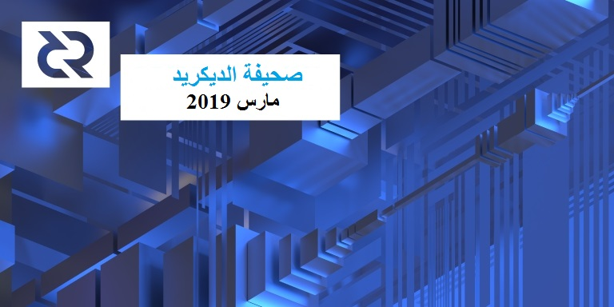

# صحيفة الديكريد لشهر مارس 2019

شهد شهر مارس بعض المقترحات والتصويتات المهمة التي تخص الإدارة، وتقدمًا ملموسًا في البرامج الأساسية الخاصة بالتطوير - كان شهرًا نموذجيًا إلى حد ما بالنسبة للديكريد.

حالياً اقترب آخر [تصويت بالإجماع](https://voting.decred.org/)  [لإصلاح](https://github.com/decred/dcps/blob/master/dcp-0004/dcp-0004.mediawiki) أقفال تسلسل الشبكة البرقية من الانتهاء بتأييد بلغ قرابة 100٪  وبمشاركة 54٪ من الناخبين، من المتوقع أن ينتهي التصويت في 11 أبريل. 

تم نشر خمسة مقترحات على بوليتيا وانتهى مقترحان من التصويت (قبل أحدهما و الآخر رفض). ومن بين أهم المقترحات الجديدة المقدمة [واحد](https://proposals.decred.org/proposals/c96290a2478d0a1916284438ea2c59a1215fe768a87648d04d45f6b7ecb82c3f) ل moo31337@ والذي يمهد الطريق نحو تمكين أصحاب الحصص من التحكم بإنفاق الخزينة بطريقة لامركزية.

شهدت dcrd [إعادة تصميم ضخم](https://github.com/decred/dcrd/pull/1656)  من شأنه أن يجلب تحسينات كبيرة في الأداء لجميع المستخدمين عند إصدار النسخة 1.5.0، ويمكن للمستخدمين المتقدمين بنائه من المصدر اليوم.

## التطوير

[dcrd](https://github.com/decred/dcrd): [إعادة تصميم ضخمة للبرنامج](https://github.com/decred/dcrd/pull/1656) تجعل المزامنة الكاملة الأولية أسرع بنسبة 20-25 ٪، وصولا إلى حوالي 45 دقيقة على الأجهزة النموذجية. هناك فائدة أخرى تتمثل في تقليل زمن انتقال الأصوات:

> \[يتأثر زمن الانتقال\] بالعديد من العوامل، حيث يبلغ في المتوسط لكل عقدة من 70 مللي ثانية إلى أقل من 5 مللي ثانية على العقد الخاصة بي. نحتاج المزيد من البيانات من أجل إيجاد قيم أفضل. ستأتي المكاسب الحقيقية مع تحديث شبكة الأغلبية حيث يتم مضاعفة المدخرات بضربها بعدد عقد الأصوات التي يتم اجتيازها (log_8(tot)).الانتشار الكامل~ تحسن عام بنسبة 90% ([davecgh@](https://twitter.com/davecgh/status/1110721000172384256))

كجزء من التحسين، تم إعادة تصميم برنامج `txscript` بالكل لاستخدام رمز مميز جديد للتخصيص الصفري.

> المزامنة الأولية هي عامل كبير بالطبع، ولكن المكاسب الحقيقية تكمن في معالجة المعاملات الجارية للمجمع. الوجه الآخر الجميل حقًا هو الرمز المميز الذي تم تصديره مما يعني أنه من الممكن إجراء تحليل التخصيص الصفري على البرامج النصية خارج txscript وهو أمر رائع لإنشاء التطبيقات (على سبيل المثال المبادلات الذرية أو taproot و ما إلى ذلك). ([davecgh@](https://matrix.to/#/!HEeJkbPRpAqgAwhXWO:decred.org/$155249146926580yNJqU:decred.org))

نظرًا لتغيير منطقة حرجة ومعرضة للخطأ في رمز الإجماع، فقد تم بذل جهد كبير لجعل هذه التغييرات أسهل للفهم والمراجعة من خلال صياغة سلسلة من 122 من الالتزامات الفردية بحيث تصف كل رسالة التزام الغرض منها بدقة، وتحافظ على الإجماع، وبالتالي تجتاز كل الاختبارات. المكافأة: خفض إعادة تصميم البرنامج إلى 2،000 سطر من رموز التشفير. رموز تشفير أقل، أخطاء أقل!

هناك فرصة لإزالة 10-15 دقيقة أخرى لتحميل الكتل الأولية لكن ذلك يتطلب أشهر من العمل الجاد _(تلميح إلى المساهمين)_. 

الأعمال المدمجة الأخرى: دعم عنوان Bech32 الأولي ([BIP 173](https://github.com/bitcoin/bips/blob/master/bip-0173.mediawiki)) الذي تم [نقله](https://github.com/decred/dcrd/pull/1646) من btcsuite، وتقديم وحدة [ذاكرة تخزين مؤقتة LRU](https://github.com/decred/dcrd/pull/1683) قابلة لإعادة الاستخدام، كما تمت [إعادة تصميم](https://github.com/decred/dcrd/pull/1696) وحدة `hdkeychain` لجعل رمزالشفرة أقل هشاشة وقابل للاختبار، كما [أضيفت](https://github.com/decred/dcrd/pull/1424) خلفية جديدة لكتل قوالب المولدات. وقد تم إجراء الكثير من توضيح التعليمات البرمجية واختبار التحسينات لتقوية قاعدة التعليمات البرمجية ضد التغييرات غير المقصودة.

تم دمج ما مجموعه [209 إيداع](https://github.com/decred/dcrd/compare/4e7f080b7b2cb11a8680d54dc5fb9ce735119d15...8f5019e083e92f31b2799f9d23809e0c0692d465) من 9 مساهمين في مارس.

قيد التنفيذ: [بدأت](https://github.com/decred/dcrd/pull/1698) عملية إعادة هيكلة كبيرة أخرى لمعالجة العديد من المشكلات في وحدة `chaincfg`، و[بدأت](https://github.com/decred/dcrd/issues/1645) المناقشة لحماية معالج عقد البذور من هجمات DNS.

وفي الصورة الكبيرة، تهدف التغييرات مثل مولد قالب الكتلة الخلفية وجزء من استمثال `txscript` إلى تحسين قابلية التوسع وتقليل عدد الأصوات المفوتة على الشبكة من خلال إدخال تحسينات على البنية الأساسية للتعدين وتقليل زمن انتقال الأصوات. الجزء الآخر من إعادة هيكلة `txscript` و `chaincfg` هو العمل على البنية الأساسية لإدخال نسخة جديدة من محرك البرنامج النصي بشكل صحيح للتغييرات المستقبلية المرغوبة للإجماع مثل إنفاق الخزانة اللامركزي. حتى إذا لم ينجح هذا [الاقتراح](https://proposals.decred.org/proposals/c96290a2478d0a1916284438ea2c59a1215fe768a87648d04d45f6b7ecb82c3f)، فلا تزال هناك حاجة للبنية الأساسية لمجموعة واسعة من التغييرات المستقبلية المتعلقة بالإجماع.

[dcrwallet](https://github.com/decred/dcrwallet): تم إصلاح العلل وصيانة التعليمات البرمجية. دمج [12 إيداع](https://github.com/decred/dcrwallet/compare/9f5f1163d8bf8037138f07734002470d4100de21...9450c9183e71231065dc0ea25087a47e8e5bb38e) من 6 مساهمين.

[Decrediton](https://github.com/decred/decrediton): تم دمج التصور الخاص بخريطة النشاط الحراري للتذكرة من بين إصلاحات أصغر - مجموع [5 إيداعات](https://github.com/decred/decrediton/compare/35ab6e216dde0bc90d76334e25eb5174bf62e623...f80e832e55231a8f4cb7b1aa69f6e2faea2709df) من اثنين من المساهمين.

[بوليتيا](https://github.com/decred/politeia): تمت إضافة علامة التبويب  [لمعاينة](https://github.com/decred/politeiagui/pull/1018) نص الاقتراح، والميزة المكتملة [لعرض الفرق](https://github.com/decred/politeiagui/pull/1004) بين الإصدارات المقترحة، مع تغيير [تصنيف التعليقات الافتراضي](https://github.com/decred/politeiagui/pull/1034) لإظهار التعليقات الأعلى درجة أولاً، وإضافة القدرة على تحديد الترتيب في عنوان URL. وقد أصلحت العديد من العلل. كما تم دمج هذه التغييرات في الفرع الرئيسي وسيتم نشرها على [موقع الاقتراحات الرئيسي](https://proposals.decred.org/) بعد إجراء بعض الاختبارات على [موقع الاختبار](https://test-proposals.decred.org/).

فيما يتعلق بالبنية التحتية لرمز التشفير، تم تنزيل أجزاء عديدة من نظام إدارة المتعاقد بشكل رئيسي بعد تنظيف قاعدة رمز التشفير بعد مرحلة التطوير السريع. كما تمت [زيادة](https://github.com/decred/politeia/pull/727) نسبة تغطية الاختبار من 13٪ إلى 19٪. 

اكتشف خلل سمح للمستخدمين المتقدمين بالإدلاء بأصواتهم بعد نهاية فترة التصويت. كانت العلة معروفة لبعض الوقت وكان الإصلاح في انتظار التدشين. وعند معرفة أن الأصوات المتأخرة كانت تحدث، تم تدشين الإصلاح في 13 مارس. و تظهر واجهة المستخدم لبوليتيا عددا قليلاً غير صحيح من الأصوات لبعض المقترحات، ولكن نتائج التصويت لم تتأثر.

> الجزء المطمئن بشأن بوليتيا هو أن جميع البيانات متاحة للجمهور ويتم وضعها دوريا في بلوكشين الديكريد. هذا يعني أنه يمكن لأي شخص سحب البيانات من github والتحقق تشفيرياً من الأصوات التي تم الإدلاء بها خلال فترة التصويت (+/- خلال ساعة واحدة) وأي من الأصوات تم الإدلاء بها بعد انتهاء فترة التصويت. (lukebp@ في [Politeia Digest 12](https://richardred0x.github.io/politeia-digest/issue-012.html))

تم دمج ما مجموعه 40 إيداع في [بوليتيا](https://github.com/decred/politeia/compare/8057ced5e4c0a04823a261cc064602f1a8a2ab1b...13eb0038975ff4fcddb70565687434354d208a0f) و [politeiagui](https://github.com/decred/politeiagui/compare/52c775330beb1b77ed817c85bccaaf2a8e199cdc...72885ed6e58c8a2f1bfbd2d039f6cd19b52912fe) من 6-9 مساهمين.

[dcrandroid](https://github.com/decred/dcrandroid): إصلاح الأخطاء الطفيفة، مع إضافة الترجمة الصينية ، وتحسينات سرعة عرض تاريخ المعاملات.

[dcrios](https://github.com/raedahgroup/dcrios): برنامج dcrios beta في حالة جيدة وجاهز لمزيد من العَرْض العام. المختبرين مرحب بهم ويمكنهم الحصول على التطبيق على [TestFlight](https://testflight.apple.com/join/dvq51tCh). يوجد هناك فقط بضعة علل صغيرة بارزة. لا يزال العمل جاريا على  عيوب تخطيط معروفة لأجهزة iPod Touch. تتعامل أداة الحظر  في الوقت الحالي مع بعض الإجراءات الرسمية للموافقة على حساب Apple Store. بمجرد أن يتم ذلك، سيتم إطلاق الإصدار الرسمي للعميل.

[dcrdata](https://github.com/decred/dcrdata): تم [إصدار](https://twitter.com/decredexplorer/status/1110618796975370240) النسخة 4 وهي متاحة على [explorer.dcrdata.org](https://explorer.dcrdata.org/).

تشمل التغييرات التي يواجهها المستخدم إعادة تصميم كاملة مع أنماط جديدة للصفحات ومزيد من المعلومات وتنظيم أفضل، صفحات بوليتيا للاقتراح ومعلومات مجمعة عن الكتل على فترات زمنية مع تسجيل وتحجيم خطي للمخططات ومراقبة سعر الصرف و عدة أشياء أخرى صغيرة. يشاع أن العلامة المائية للحفظ في المحفظة قد اختفت. للحصول على تحديثات التطوير، راجع [ملاحظات الإصدار الكامل](https://github.com/decred/dcrdata/releases/tag/v4.0.0).

خلال 3 أشهر من التطوير، تلقى إصدار النسخة 4، 48 ألف إضافة مدهشة و حذف 19 ألف سطر في 325 إيداع من 11 مساهمًا. مبروك dcrdata!

> هناك ميزات و تحسينات  تتشكل بالفعل في النسخة 4.1، لذلك فالإصدار الجديد سيطلق قريبا. مجال 4.0 مرعب قليلا، ولكن ذلك لسبب وجيه، وكان يستحق ذلك.([chappjc@](https://matrix.to/#/!MgQoetFiyjrHAywokv:decred.org/$155305431834229kjptE:decred.org))

في طور التنفيذ: يستمر اختبار التحميل وتحسين الأداء، والتحسينات في إعتماد الإدارة مع وحدات  Go، و[تتبع تصويت](https://github.com/decred/dcrdata/pull/1125) الإجماع المباشر، [رسوم بيانية](https://github.com/decred/dcrdata/pull/1126) أسرع، [مخططات](https://github.com/decred/dcrdata/pull/1210) تصويت المقترحات، و [dcrextdata](https://github.com/raedahgroup/dcrextdata) - أحد مكونات dcrdata التي تتيح تتبع البيانات غير الموجودة على البلوكشين ، مثل المعلومات التاريخية حول أسعار الصرف وتجمعات التعدين.

[تقسيم التذاكر](https://github.com/matheusd/dcr-split-ticket-matcher): تم [إصدار](https://github.com/matheusd/dcr-split-ticket-matcher/releases/tag/v0.7.6) النسخة 0.7.6 والتي تعمل على تحسين جلب المخرجات غير المنفقة من dcrdata وإضافة الثنائيات على macOS.

[المستندات](https://github.com/decred/dcrdocs): دليل جديد مفصل [لتقسيم التذاكر](https://docs.decred.org/proof-of-stake/ticket-splitting/) و[قواعد الإجماع](https://docs.decred.org/governance/consensus-rule-voting/consensus-rules-voting/) أعيدت صياغتها وتوسيعها، كما تم تحديث [إرشادات الاقتراح](https://docs.decred.org/governance/politeia/proposal-guidelines/) لتشمل المتطلبات الرئيسية للمقترحات الممولة من الخزنة.

[decred.org](https://github.com/decred/dcrweb): تم تحديث التبادلات والترجمات، و[إدماج](https://github.com/decred/dcrweb/pull/604) فيديو تقديمي لإزالة تقديم طلب إلى YouTube.

مسائل أخرى:

*	تقوم مجموعة Raedah بتجربة بديل لمحفظة عميل [godcr](https://github.com/raedahgroup/godcr/)  مكتوب بلغة Go مع أنماط واجهة مستخدم متعددة. العمل مستمر بالنسبة لواجهة خط الأوامر، الوحدة الطرفية _(أجل!)_، متصفح الويب ، الواجهة الأمامية للواجهة الرسومية [للنواة](https://github.com/aarzilli/nucular) و [Fyne](https://github.com/fyne-io/fyne) ([لقطات](https://matrix.to/#/!HEeJkbPRpAqgAwhXWO:decred.org/$155329781839253ivNYC:decred.org)).
*	و تعمل مجموعة Raedah أيضا على [dcrseedgen](https://github.com/raedahgroup/dcrseedgen) - مولد بذور مستقل للديكريد يستعمل لغة Go و نواة واجهة المستخدم. 
*	أعيد تصميم [timestamp.decred.org](https://timestamp.decred.org/) و صياغة النص ليكون أكثر فائدة.
*	تم إنشاء أداة [dcrtime_checker](https://github.com/decred/dcrtime/tree/master/cmd/dcrtime_checker) جديدة للتحقق المباشر من نقاط الارتساء بَدَل البلوكشين (دون التفاعل مع dcrtimed).
*	تم تحديث حوالي نصف موفري خدمة التصويت  [لاختبار الاستضافة الذاتية](https://github.com/decred/dcrstakepool/issues/279) لحماية خصوصية مستخدميهم. يمكن تتبع النظام [هنا](https://github.com/decred/dcrstakepool/issues/326). 

إحصائيات نشاط التطوير لشهر مارس: 360 من المشاريع النشطة، 497 إيداع رئيسي، 46 ألف إضافة، 34 ألف عملية حذف من خلال 8 سجلات. جاءت المساهمات من 2-9 مطورين لكل سجل.

## الأشخاص

مرحبًا بالمساهمين  لأول مرة مع دمج الكود في الفروع الرئيسية: devwarrior@  (على [atomicswap](https://github.com/decred/atomicswap/commits?author=devwarrior-cool)) و DominicTing (على [dcrweb](https://github.com/decred/dcrweb/pull/588)).

## الإدارة

[اقتراع الإجماع](https://voting.decred.org/) المستمر، الذي بدأ في 14 مارس (في الكتلة 326،656)، على وشك الانتهاء بدعم بلغ 100٪ تقريبًا ومشاركة 54.4% من الناخبين، من المتوقع أن ينتهي في 11 أبريل. 

في مارس ، تلقت [الخزنة](https://explorer.dcrdata.org/address/Dcur2mcGjmENx4DhNqDctW5wJCVyT3Qeqkx) 16،288  DCR وأنفقت 13،595 DCR. باستخدام معدل المتوسط اليومي لشهر مارس بDCR/USD والذي يقدر ب 18.14 دولارًا، ستكون الخزينة قد تلقت 296 ألف دولارا  وأنفقت  247 ألف دولارا. نظرًا لأن هذه المدفوعات كانت مخصصة للعمل الذي تم إنجازه في شهر فبراير، فإنه من المفيد أيضًا أخذها بعين الاعتبار في سياق متوسط السعر اليومي لشهر فبراير البالغ 16.51 دولار - وفي هذه الحالة ستبلغ الأرقام المستلمة / المنفقة بالدولار 269 ألف دولار / 224 ألف دولار. اعتبارًا من 9 أبريل، بلغ رصيد الخزينة 608،560 DCR ( أي ما يعادل 15.3 مليون دولار أمريكي بقيمة 25.26 دولارًا أمريكيًا).

حالة المقترحات اعتبارًا من 10 أبريل:

*	تمت الموافقة على [إدماج محفظة Trust](https://proposals.decred.org/proposals/2ababdea7da2b3d8312a773d477272135a883ed772ba99cdf31eddb5f261d571) بنسبة 67٪ بنعم، من 9.3 ألف تذكرة التي صوتت. قبل التصويت، [تقدم](https://github.com/TrustWallet/wallet-core/issues/43) مطورو Trust Wallet  لدمج الديكريد من طرفهم.
*	[إدماج أجهزة الصراف الآلي](https://proposals.decred.org/proposals/aea224a561cfed183f514a9ac700d68ba8a6c71dfbee71208fb9bff5fffab51d) - تم رفض مرحلة التخطيط - 52.5٪ بنعم من بين 12.7 ألف تذكرة تصويت لم تصل إلى عتبة 60%. وقد نوقش [هنا](https://matrix.to/#/!MIGqWXfLFBwhipPKYL:decred.org/$15542882616188dHEHP:decred.org) إمكانية القيام بمحاولة ثانية.
*	[طلب جلب الديكريد لإفريقيا (غانا) - اعتماد برنامج الديكريد من طرف التجار والشركات](https://proposals.decred.org/proposals/dac06f18bfeb5f7667e56554774de3bb99151018ce16a64f5353bab45819763b) بواسطة  georgepro@، يسعى للحصول على 41،054 دولار لتمويل 3 أشهر لتوعية التجار لتبني البرنامج في غانا. 
    بدأ التصويت، وصل إلى النصاب القانوني وحصل على نسبة تصويت بلغت 95٪ بلا اعتبارًا من 10 أبريل.
*	تم [حظر](https://matrix.to/#/!MIGqWXfLFBwhipPKYL:decred.org/$155144086813111EMAcC:decred.org) إعادة تقديم [مقترح](https://proposals.decred.org/proposals/45de9806c952c5ffc2fc6782fddbc74c852c26e3fb0e950144b92d75082c4731)  Coffee Wallet بعد أن تم التخلي عنه من قبل المشرفين بعد محاولة استخدام بوليتيا لتسويق المنتج.
*	[لامركزية إنفاق سندات الخزنة](https://proposals.decred.org/proposals/c96290a2478d0a1916284438ea2c59a1215fe768a87648d04d45f6b7ecb82c3f) بواسطة  moo31337@ تحدد عملية من خطوتين حيث يتم نشر مسودة معاملة الإنفاق على بوليتيا للمراجعة، ثم يتم التصويت لصالحها من قبل أصحاب الحصص. من المتوقع أن تستغرق عملية التطوير والاختبار والتصويت المطلوب بالإجماع ما بين 9 إلى 12 شهرًا ، بميزانية تتراوح بين 200،000 و 250،000 دولار.
*	تم نشر مقترح [إدماج زوج عملة الأوراق النقدية في منصة التبادل EXMO](https://proposals.decred.org/proposals/950e8149e594b01c010c1199233ab11e82c9da39174ba375d286dc72bb0a54d7) بواسطة vadymprykhodko عقب [اقتراح مسبق](https://www.reddit.com/r/decred/comments/b0y9le/integration_on_exmo_exchange_new_fiat_pairs/) بشأن r/decred. 
يسعى الاقتراح للحصول على 23،800 دولار لإضافة أزواج عملة الأوراق النقدية DCR على EXMO، وهي منصة تبادل شائعة في أوروبا الشرقية.
*	تم تقديم مقترح [تعديل دستور الديكريد](https://proposals.decred.org/proposals/fd56bb79e0383f40fc2d92f4473634c59f1aa0abda7aabe29079216202c83114) بواسطة richardred@ بعد مناقشات كثيرة يتم تتبعها في [هذه المسألة](https://github.com/xaur/decred-issues/issues/107).

المقترحات المسبقة:

*	[حملة تعليم وتوعية الهند](https://www.reddit.com/r/decred/comments/awb5y0/preproposal_decred_india_community_new_user/) والتي كتبها u/Blocknext. في [مناقشة](https://matrix.to/#/!MgQoetFiyjrHAywokv:decred.org/$15515162772723165JzrFj:matrix.org) الدردشة، تمت الإشارة إلى أنه تم تقديم [اقتراح مماثل](https://www.dash.org/forum/threads/building-commercial-dash-use-in-the-freelancing-industry-across-south-asia.17890/) لعملة داش.
*	[التعديل الدستوري الثاني](https://www.reddit.com/r/decred/comments/b84t6b/preproposal_second_constitutional_amendment_to/) من قبل richardred@ لإعلان الثامن من فبراير اليوم الدولي لـ stakey.

حصل موقع decredcommunity.org على بعض [الانتقادات](https://matrix.to/#/!lbzTjhzNbIaDbuAxkS:decred.org/$155227203622209rOKeX:decred.org) لعدم كونه مفتوح المصدر وعدم ذكره صراحة في صلب الاقتراح. ومن بين الحجج المقدمة أن الخزنة لم تدفع قط تكاليف أعمال المصدر المغلق من قبل، باستثناء بعض عمليات الإدماج التي تعذر الكشف عنها. كما أن تمويل البرمجيات غير المفتوحة المصدر يتعارض مع [دستور](https://docs.decred.org/governance/decred-constitution/) المشروع. تم التقاط النقاش في [هذه المسألة](https://github.com/karamble/dcrcommunityweb/issues/1)، كما أدى النقاش إلى بعض [التحسينات](https://github.com/decred/dcrdocs/pull/896) في إرشادات المقترحات لتحديد أي قيود من حيث ترخيص التسليمات.

نشر richardred@ [تحليلًا](https://github.com/RichardRed0x/pi-research/blob/master/analysis/voting/early-voting-influence.md) يستكشف إلى أي درجة تؤثر الأصوات المبكرة على سلوك الناخبين المتأخرين، وما إذا كان هذا النوع من التأثير يمكن أن يؤثر على نتيجة الأصوات.

لمزيد من التفاصيل والتحليل والتعاليق راجع الإصدارين  [12](https://richardred0x.github.io/politeia-digest/issue-012.html) و [13](https://richardred0x.github.io/politeia-digest/issue-012.html) لPoliteia Digest بواسطة richardred@.

للحصول على إشعار بشأن نشاط اقتراح بوليتيا، قم بتمكين إشعارات البريد الإلكتروني في ملفك الشخصي بمنصة بوليتيا أو قم بمتابعة [pi_crumbs@](https://twitter.com/pi_crumbs) و [slices_of_pi@](https://twitter.com/slices_of_pi) على التويتر.

مناقشات:

*	معدل [إنفاق الخزنة](https://www.reddit.com/r/decred/comments/b5vlrl/we_have_spent_23_of_decred_treasury_should_we_be/) وتخصيص الأموال.
*	أفكار [للتقارير المالية](https://www.reddit.com/r/decred/comments/b2zopq/simple_financial_reporting/).
*	تم ذكر مسألة التصويت على التعليقات الخاصة مرة أخرى وأسفرت عن بعض الإجماع حول تعطيل هذه القدرة. كما تم إعادة فتح [المسألة](https://github.com/decred/politeiagui/issues/845) المشابة وتحديثها لفهرسة جميع المناقشات حول الموضوع.
*	اقترح richardred@ بناء النصاب القانوني فقط على النسبة المئوية [للأصوات بنعم](https://github.com/decred/politeia/issues/729) (يتم حاليًا احتساب أصوات نعم + لا) وإنتاج [محاكاة](https://github.com/RichardRed0x/pi-research/blob/master/analysis/voting/quorum-change-examples.md) تصور طرق حساب النصاب المختلفة.

## الشبكة

معدل الهاش: تباينت معدلات الهاش لشهر مارس ما بين القيمة الدنيا 221 Ph/s و قيمة الذروة الجديدة التي بلغت 570 Ph/s خلال النصف الأول من الشهر، بلغ معدل متوسط الشهر حوالي 320 Ph/s، لكنه ارتفع إلى أكثر من 400 Ph/s في النهاية. توزيع معدلات الهاش للتجمع اعتبارا من 1 أبريل حسب dcrstats.com:
- F2Pool 23٪،
- Poolin 20٪،
- lab.antpool.com 16٪،
- BTC.com 12٪،
- UUPool 11٪،
- Luxor 3.2٪،
- CoinMine 0.4٪،
- أخرى 14 ٪.
 أرقام توزيع التجمع تقريبية ولا يمكن تحديدها بدقة.

التحصيص: بلغ متوسط سعر التذكرة لمدة 30 يومًا 112.3 DCR بزيادة 0.6+ في 1 أبريل حسب dcrstats.com. وقد تراوح السعر بين 108.6-117.9  DCR  للتذكرة. كما بلغ المبلغ المقفل 4.47-4.61 مليون DCR، وهو ما يعادل 46.9-48.6٪ من الإجمالي المتاح.

العقد: اعتبارًا من 1 أبريل، كان هناك 191 عقدة استماع عمومية و 336 عقدة عادية حسب [dcred.eu](https://dcred.eu/nodeStats). توزيع الإصدار: بناء التطوير النسخة 1.5.0: 6.3٪ (2.3٪-)، النسخة 1.4.0 : 55٪ ( 12٪+)، بناء التطوير و إصدار الصيغة المرشحة النسخة 1.4.0 : 5٪ (2٪-)، النسخة 1.3.0 : 17٪ (6٪-)، النسخة 1.2.0 :9.5% ( -0.5%)، النسخة  1.1.2: 4٪، النسخة 1.1.0 : 1.7٪ (0.3٪-).

## التعدين

*	ظهر تجمع تعدين جديد ([lab.antpool.com](http://lab.antpool.com/))  كما هو موضح بواسطة [dcrstats](https://dcrstats.com/pow).
*	تشير [صفحة الدعم](https://support.okex.com/hc/zh-cn/articles/360024177931-%E6%94%AF%E6%8C%81%E5%B8%81%E7%A7%8D) الصينية هذه إلى أن OKEx بها تجمع تعدين جديد للديكريد.
*	أعلن سكوت أوفورد على تويتر أن MicroBT تبيع آخر 200 وحدة من Whatsminer D1 بسعر 750 دولارًا لكل وحدة ولا تخطط لإنتاج أي آلة لتعدين الديكريد بعد ذلك.

## الإنضمام

عقب [فعالية](https://www.eventbrite.com/e/decred-okcoin-present-the-next-10-years-crypto-boom-bust-or-buidl-tickets-57549671617) مشتركة في سان فرانسيسكو، [أعلنت](https://twitter.com/OKCoin/status/1105892924586258434) OKCoin عن إدراج أزواج DCR مقابل BTC و ETH والدولار الأمريكي، بالإضافة إلى زوج عملات ورقية آخرى ل DCR. تم التقاط الأخبار من قبل [The Block](https://www.theblockcrypto.com/tiny/okcoin-offers-first-usd-to-crypto-trading-pair-for-decred-but-difficult-questions-remain/) وعدة منابر أصغر.

أضافت [CoinText](https://cointext.io/) [دعم DCR](https://twitter.com/vinarmani/status/1111034078847995905). وتتيح هذه الخدمة  للشخص إرسال DCR إلى أي شخص لديه هاتف في الولايات المتحدة وكندا. اقرأ عن كيفية عمل الخدمة واستخدم الحذر المناسب وكميات صغيرة.

## الإنتشار

كان شهر مارس واحدًا من أنجح الشهور في تاريخ العلاقة ما بين الديكريد و ديتو. من المساعدة في تنظيم فعالية ناجحة بشكل لا يصدق في مكاتب OKCoin في سان فرانسيسكو، إلى تأمين مقال رئيسي في جريدة وول ستريت جورنال، خلق الديكريد و ديتو بعض الموجات الرئيسية في فضاء العملات الرقمية. لم يعد ديتو يحسب عدد شركات العملات الرقمية و المتحمسين الآخرين الذين تواصلوا معهم فقط لتهنئة ديتو/ الديكريد على نشر مقال رئيسي حول الديكريد بجريدة وول ستريت جورنال و إطراءهم على الفعالية الرائعة.

إنجازات ديتو لشهر مارس:

*	تأمين نشر [مقال  رئيسي](https://www.wsj.com/articles/gerons-take-decred-aims-to-reach-cryptos-decentralized-ideals-11552523191) حول الديكريد في جريدة وول ستريت جورنال عن طريق تسهيل إجراء مقابلات متعددة مع Jake Yocom-Piatt و Chris Burniske من Placeholder VC. أكثر من أي تغطية إعلامية تم إنشاؤها حتى الآن، وصفت هذه المقالة على نحو أكثر فاعلية الديكريد لجمهور واسع، غير جمهور العملات الرقمية  من صانعي القرار المالي - مما يعزز بشكل كبير من وضوح ومصداقية خارج عالم العملات الرقمية. النص متاح [هنا](https://www.reddit.com/r/decred/comments/b12z34/gerons_take_decred_aims_to_reach_cryptos/eiiwnpm/)، و القصة بالكامل [هنا](https://matrix.to/#/!MgQoetFiyjrHAywokv:decred.org/$155268940829940XRdUb:decred.org).
*	تأمين [ملف تعريف تقني](https://www.theblockcrypto.com/2019/03/20/decred-an-experiment-in-on-chain-governance/) متعمق للديكريد في The Block. نسخة النص الخام [هنا](https://pastebin.com/Dg2ELYat).
*	تيسير 5 مقابلات: مقابلة أساسية مع لورا شين (مضيفة المدونة الصوتية المحررة / غير المؤكدة) ، مقابلتان مع محلل CryptoBriefing لتقرير بحثي متعمق، واحد مع The Block نتج عنه تشخيص جانبي مطول عن الديكريد، و واحد مع جريدة وول ستريت جورنال التي أدت إلى مقالة مميزة.
*	وساعدت في تنظيم و إدراج الديكريد في فعالية OKCoin.
*	حضر أول لقاء مبدئي للديكريد في سان فرانسيسكو، والذي بفضل المنظمين كان له إقبال رائع من أكثر من 60 شخصًا.
*	قدم صيغة وأفكار محتوى لفيديوهات مجمع الديكريد.
*	أعدت مراسلة رفيعة المستوى حول كيفية عمل التذاكر (لم يبت فيها).
*	وضع خطًا ثانويًا على الخزنة لـ investinblockchain.com ، والذي [بدأ العمل به](https://www.investinblockchain.com/put-your-money-where-your-mouth-is-decreds-treasury-proposal-closer-true-dae/) في أبريل.

لمزيد من التفاصيل والمواد الأصغر، راجع تحديثات ديتو كل أسبوعين في [1](https://matrix.to/#/!MgQoetFiyjrHAywokv:decred.org/$155148239113862OPjOD:decred.org) و [15](https://matrix.to/#/!MgQoetFiyjrHAywokv:decred.org/$155268940829940XRdUb:decred.org) و [29](https://matrix.to/#/!OfChXgczrIlpEZSFAv:decred.org/$1553889088955UNmaG:decred.org) من شهر مارس. شكرا ل liz_bagot@ على تقديم تقارير نصف شهرية عن تقدم ديتو!

سيعرض شهر أبريل الإصدار الأول من جمعية الديكريد التي أعيد تشغيلها، والتي يستضيفها داستن وجيك، وسيضم مختلف أعضاء المجتمع (من الداخل و الخارج). وسيشمل ملخصًا للأخبار والمواضيع في الوقت المناسب، وتعمقًا في موضوع معين، وقطاعات أخرى كل أسبوع مصممة لتبادل أخلاقيات ومبادئ الديكريد.

مناقشات:

*	[إعادة النظر](https://matrix.to/#/!OfChXgczrIlpEZSFAv:decred.org/$155298850932396heGyM:decred.org) في [فكرة قديمة](https://github.com/decred/dcrweb/issues/66) لإعطاء "اعتمادات غير مركزية" رؤية أوسع.
*	[سؤال](https://matrix.to/#/!lbzTjhzNbIaDbuAxkS:decred.org/$155309851735051wGBlh:decred.org) ما إذا كان الديكريد يحتاج مصطلح أكثر تحديدا من "جلد في اللعبة" ( تحمل المخاطره المالية في سبيل تحقيق الهدف)الذي هو مبتذل، غامض و مستخدم من قبل العديد من مشاريع العملات الرقمية. إن قرار التخلي عن السيولة مقابل  الحق في المشاركة في الإدارة يتطلب تعبيرًا أكثر جدوى ويعكس الفرق بين المشروعات المعتمدة وغيرها. وهذا المفهوم وغيره من المفاهيم التي تحمل أسماء عائمة تم ذكرها في [هذه المسألة](https://github.com/xaur/decred-issues/issues/65).

## الفعاليات

الحضور:

*	[افتتاحية لقاء سان فرانسيسكو للديكريد](https://www.meetup.com/San-Francisco-Decred-Meetup/events/259126130/) في سان فرانسيسكو، بالولايات المتحدة الأمريكية. [شارك](https://matrix.to/#/!aNPTuiryMFmdMQWUzb:decred.org/$155198454119792Tdajl:decred.org) max_bronstein@: "لقد سارت الفعالية بشكل جيد! كان لدينا إقبال كبير، حضرأكثر من 50 شخصًا وكان الحشد عالٍ للغاية. قدم كريس نظرة عامة كبيرة عن نمو الشبكة وتطرق إلى إطار عمل HAS - آمن للغاية، مع رمز قابل للتكيف، ونموذج تمويل مستدام ".([الصورة](https://twitter.com/danzuller/status/1103504733023555584))
*	[الديكريد و الإدارة اللامركزية](https://www.meetup.com/decredpdx/events/259229063/) في بورتلاند، الولايات المتحدة الأمريكية. [أشار](https://matrix.to/#/!aNPTuiryMFmdMQWUzb:decred.org/$1552437600641341ZEHPe:matrix.org) كل من Eli@ و oregonisaac@: "كانت الإضاءة منخفضة ولكن كان هناك إقبال كبير! وكان لدينا 14 مشاركا متحمسا لعرض إسحاق عن الديكريد و الإدارة اللامركزية. أغلقنا الغرفة الخاصة، ثم الحانة، و إستكملنا المحادثة في الخارج. مزيج رائع من جماعـة العملات الرقمية القادمين من بورتلاند وأعضاء المجتمع/ المساهمين. كنت مندهشا أن الحديث إستمر بعد الساعة 10 مساء. (تم تحديد موعد الاجتماع حتى الساعة 8 مساءً) ". ([الصورة](https://twitter.com/DecredPdx/status/1106279797619998721))
*	["فقط خزنه" ب @ sxsw 2019](https://www.eventbrite.com/e/just-hodl-it-sxsw-2019-with-dblitz-2nd-annual-bitcoin-event-tickets-56351957221) في أوستن، الولايات المتحدة الأمريكية. قام moo31337@ بتمثيل الديكريد.
*	[السنوات العشر المقبلة:ازدهار العملات الرقمية، إفلاس ، أم بناء؟](https://www.eventbrite.com/e/decred-okcoin-present-the-next-10-years-crypto-boom-bust-or-buidl-tickets-57549671617) بواسطة الديكريد وOKCoin في سان فرانسيسكو، الولايات المتحدة الأمريكية. كما [ذكرت](https://matrix.to/#/!MgQoetFiyjrHAywokv:decred.org/$155268940829940XRdUb:decred.org) liz\_bagot@، "حققت الفعالية نجاحًا هائلاً - حضرها حوالي 110 شخصًا، بما في ذلك الكثير من  أصحاب رأس المال الاستثماري  والرؤساء التنفيذيين لعالم العملات الرقمية. تلقى ديتو الكثير من الثناء، وحقيقة أن الكثير من الناس بقوا على تواصل لفترة طويلة بعد انتهاء الفعالية يظهر جودتها. تحدث كل من كريس بورنيسك وأليكس إيفانز من Placeholder VC، وكذلك جيك، في هذه الفعالية واجتذبوا حشدًا كبيرًا من الناس ".([الصورة](https://twitter.com/liz_bagot/status/1105693679426007042))
*	[استعادة الثقة من خلال إدارة البلوكشين](https://www.meetup.com/Decred-GTA/events/259126224/) في تورنتو، كندا. ([الصورة](https://twitter.com/Decred_CA/status/1107304663626457089))
*	عرض تقديمي في جامعة سوينبرن للتكنولوجيا في ملبورن، أستراليا. قدم كل من  eSizeDave@ وZohand@ عرضا لطلاب Frontiers في وحدة FinTech من برنامج الماجستير في التقنيات المالية. فاجأ مقدمو العروض بعض الجمهور بالحقائق حول النقود الورقية، ثم قاموا بالتحدث عن البتكوين لفترة وجيزة ثم انتقلوا للحديث عن الديكريد باستخدام النموذج الهجين إثبات العمل/إثبات الحصة، الإدارة، بوليتيا، تقدم المشروع وخريطة الطريق. التقرير الكامل [هنا](https://matrix.to/#/!OfChXgczrIlpEZSFAv:decred.org/$15539115821116YDOQM:decred.org).([الصور](https://twitter.com/DecredAustralia/status/1109430422717399040))
*	[مؤتمر العملات الرقمية](https://crypto-conference.com/) 2019 في برلين، ألمانيا. هذه الفعالية هي جزء من أسبوع بلوكشين برلين. تحدث karamble@ عن "قدرة العملات الرقمية على التكيف".(الصور [1](https://twitter.com/karamblez/status/1111312069251530752)، [2](https://twitter.com/karamblez/status/1111333206110932992))
*	عرض في مسرع HCHchain في تشينغداو ، الصين. ألقى Dominic@ خطابا "عن ماهية الديكريد؟" و "أظهر مدى حيوية مجتمعنا المعتمد في الصين. تم طرح العديد من الأسئلة المهمة، على سبيل المثال كيف يمكن أن يؤثر تفويض الأصوات لمقدمي خدمات التصويت على نتائج التصويت على السلسلة، و التي يتم مناقشتها الآن على WeChat. ".([الصورة](https://twitter.com/wanbihou/status/1112264821989236736))

الفعاليات القادمة:

*	[تنسيق المصادر المفتوحة: اليوم وغدا](https://www.meetup.com/San-Francisco-Decred-Meetup/events/260046546/) في سان فرانسيسكو، الولايات المتحدة الأمريكية في 18 أبريل. سيقام الحدث في Coinbase HQ بالشراكة مع Coinbase Custody. سيتحدث lukebp@ عن نموذج الحكم الذاتي والتمويل الذاتي الفريد الخاص بالديكريد. وبعد الحديث، ستجرى مناقشة معتدلة بشأن مقايضات نماذج التمويل المختلفة.
*	[إدارة العملات الرقمية - مسألة بقاء](https://www.meetup.com/BlockchainMelbourne/events/260266298/) في ملبورن ، أستراليا في 18 أبريل. ستعقد حلقة نقاش بشأن الإدارة وعرض تجريبي لبوليتيا. سيشارك في تنظيمه كل من الديكريد وأبولو كابيتال. 
*	[Jalisco Talent Land](https://www.talent-land.mx/#entradas) في غوادالاخارا ، المكسيك من 22 إلى 26 أبريل. لمزيد من التفاصيل إتصل ب elian@.
*	[قمة البلوكشين](http://blockchainsummit.ma/) في الرباط ، المغرب يوم 24 أبريل.Arij@ (بإسم butterfly@ في Slack) ستقدم الديكريد.
*	ملتقى الديكريد 2019 في برلين، ألمانيا في 5 ماي. سيقدم jholdstock@ نظرة عامة عن  الديكريد وسيقوم Philipp Banhardt من BlueYard بمناقشة أطروحة الاستثمار الخاصة بهم.
"يستضيفها" BlueYard Capital.
*	أسبوع نيويورك للبلوكشين في نيويورك، الولايات المتحدة الأمريكية من 11 إلى 16 ماي. سيحضر فريق مكون من 7 أفراد  من مجتمع الديكريد فعاليات في مواقع مختلفة. 
*	[مهرجان العملات الرقمية اللاتيني](https://criptolatinfest.com/) في بوغوتا، كولومبيا في 18 ماي. الديكريد سيكون لديه مكان للتحدث.

## وسائل الإعلام

الجهود المجتمعية:

*	شارك Denni Lovejoy@  بنشاط في غرفة الدردشة writers_room# لإنتاج نصوص دقيقة لمقاطع الفيديو الخاصة به وفقًا [للمقترح](https://proposals.decred.org/proposals/a3def199af812b796887f4eae22e11e45f112b50c2e17252c60ed190933ec14f) المعتمد للبرنامج التعليمي للمحفظة.
*	سيتوجه anshawblack@ إلى نيويورك في شهر ماي لتسجيل العديد من أفراد المجتمع شخصيًا من أجل بودكاسته العميق عن الديكريد.
*	يتم الآن [نسخ](https://decredcommunity.org/filter?tag=Decred%20Journal&key=category) مجلةالديكريد على decredcommunity.org. لاحظ أزرار علم البلدان اللطيفة للتنقل بسرعة بين الترجمات.
*	قام max\_bronstein@ بتجميع [Decred Canon](https://github.com/maxbron08/Decred-Canon) - مجموعة من القراءات والموارد لمساعدة الناس على التعرف على مشروع الديكريد.
*	مقالات جديدة بواسطة mm@  على stakey.club: [تقاسم dcrd](https://stakey.club/en/sharing-the-dcrd/) مع أجهزة متعددة، [المدقق النصي للديكريد](https://stakey.club/en/decred-verifier/) للتحقق من التجزئة والتوقيعات (هل [تتحقق من التواقيع](https://docs.decred.org/advanced/verifying-binaries/)، أليس كذلك؟).

مقالات مختارة:

*	ما مدى قرب اللامركزية المطلقة من آلية الإجماع الفريدة للديكريد؟ بواسطة تريفور هولمان ([cryptonewsz.com](https://www.cryptonewsz.com/how-close-to-absolute-decentralization-is-decreds-unique-consensus-mechanism/8998/)، فوت في عدد فبراير)
*	أفضل نظام إدارة على السلسلة بواسطة Haon@ (على [medium](https://medium.com/@NoahPierau/the-best-on-chain-governance-system-67759bf25335)، لم يرد في إصدار فبراير)
*	الديكريد: تقرير عميق ل Smith + Crown (على [smithandcrown.com](https://www.smithandcrown.com/decred-deep-dive-report/)، تقرير بحثي من 19 صفحة)
*	صناعة العملات الرقمية لديها مشكلة مع التفرع. هل يمكن للإدارة على السلسلة المساعدة في حلها؟ بقلم فلوريان جورجي ([beincrypto.com](https://beincrypto.com/the-cryptocurrency-industry-has-a-forking-problem-can-on-chain-governance-help-solve-it/))
*	تهدف الديكريد إلى الوصول إلى المثل اللامركزية للعملات الرقمية  بواسطة Tomio Geron (على [wsj.com](https://www.wsj.com/articles/gerons-take-decred-aims-to-reach-cryptos-decentralized-ideals-11552523191) و paywall ، يوصى بمشاركة واسعة النطاق لتضخيم التأثير)
*	الديكريد، تجربة في الإدارة على السلسلة من تأليف Steven Zheng (على [theblockcrypto.com](https://www.theblockcrypto.com/2019/03/20/decred-an-experiment-in-on-chain-governance/) و paywall)
*	شرح آلية إجماع إثبات العمل/إثبات الحصة الهجينة  بواسطة  richardred@ (على  [binance.vision](https://www.binance.vision/blockchain/hybrid-pow-pos-consensus-explained))
*	تجربة إدارة الديكريد "جلد في اللعبة" التي أصدرها جيريمي إبشتاين (في [neverstopmarketing.com](https://www.neverstopmarketing.com/decred-and-democracy/)، شكرًا على الكلمات الطيبة!)
*	المزيد من التبادلات ، المزيد من  فرص الوصول: نمو  توافر و سيولة الديكريد بواسطة Dustorf@ (على [medium](https://medium.com/decred/more-exchanges-more-access-decred-grows-availability-liquidity-95accbbf6835))
*	نظرة عامة عن الديكريد بواسطة Casey Caruso (على [medium](https://medium.com/@caseycaruso/decred-dcr-1c809eb8bc5d))
*	كيف ألقي خطابا عن الديكريد في إفريقيا بواسطة  George Pro@ (على [medium](https://medium.com/@aappiahpro1/how-i-pitch-decred-in-africa-62b9ee8da7e1))

معلومات جديدة مسربة عن الشركة 0:

> Haon: على https://crypto.bi/tape/blog/dcr/ - "مؤسسو الديكريد عملوا أصلاً على تطويرالبتكوين في مشروع يسمى البسكويت." \
> jy-p: أعطانا العمل على البسكويت لفترة من الزمن المنظور الذي نحتاجه لإطلاق الديكريد. مشروعنا الثاني ، الدجاج المقلي، هو ما دفعنا إلى إنشاء مطبخ لويزيانا الخاص بنا.

تم العثور على المزيد من الجواهر على [Crunchbase](https://www.crunchbase.com/organization/decred): الديكريد هي شركة "خاصة" ، "من أجل الربح" ، "تستخدم 8 منتجات وخدمات تقنية بما في ذلك PHP و nginx و Google Drive" ، و "تستخدم بنشاط 24 تقنية لموقعها على الويب. وذلك يشمل Viewport Meta و IPhone / Mobile Compatible و SSL بشكل افتراضي ". وأخيراً، يضم الفريق اثنين من Jacob Yocom-Piatt، وهو ما يفسر إلى حد ما مقدار التبصر وراء المشروع.

الترجمة:

*	الديكريد: من أين بدأ؟ ترجم إلى [الهولندية](https://github.com/Arriu/Decred/blob/master/translations/wherediditallbegin_dutch.md) بواسطة jazzah@
*	تحليل مفصل لمقاومة تفرع الديكريد ترجم إلى [الهولندية](https://decredcommunity.org/nl/blog/detailed-analysis-of-decred-fork-resistance) بواسطة jazzah@
*	تمت [ترجمة](https://xaur.github.io/decred-news/) عدد المجلات الصادرة في يناير وفبراير  إلى - احبس انفاسك: ترجم إلى العربية بواسطة arij@ (منتصرة بعد صراع طويل مع مشكلة الكتابة من اليمين إلى اليسار على GitHub) ، الصينية بواسطة guang@، البولندية بواسطة  kozel@، الروسية بواسطةDZ@، الإسبانية بواسطة elian@، والفيتنامية بواسطة Duyên Em@. بالحديث عن الفيتنامية ، يتم ترجمة [6 أعداد](https://github.com/raedahgroup/decred-journal/tree/master/vietnamese) في وقت كتابة هذا العدد. شكرا لكم جميعا لنشر رسالة الديكريد!
*	إلى المترجمون، لاحظوا أن هناك فهرسا للمقالات المترجمة [هنا](https://github.com/artikozel/decred-translations/blob/master/article_index.md). تواصل في #writers_room أو أرسل طلب  جَذب لإضافة ترجماتك.

الصوتيات:

*	هل تعرف العملات الرقمية - الحلقة 26: عن الديكريد. يتحدث moo31337@ عن تجربته، ما هو الديكريد، إجماعه الهجين، الاستقرار، نظام المقترحات ومنصةالتبادلات اللامركزية. ([didyouknowcrypto.com](http://didyouknowcrypto.com/ep26/)) 
*	The Blockcrunch - كيف تعمل إدارة الديكريد؟ يتحدث Haon@ في الجزء الأول من المقابلة عن إدارة الديكريد، مكافآت أصحاب الحصص، مواضيع التصويت والسبب وراء الحاجة إلى كل من المعدنين والناخبين. ([libsyn.com](https://blockcrunch.libsyn.com/how-does-decreds-governance-work-noah-pierau-decred-project))
*	The Blockcrunch - الدفاع عن الإدارة على السلسلة للديكريد. يستمر الجزء الثاني من المقابلة مع Haon@ بشأن إمكانية إنفاذ الأصوات على السلسلة، والتصويت القائم على الحصص مقابل كيان شخصية معنوية، والإنصاف والمركزية في إثبات الحصة، وتهديد أصحاب النوايا الخبيثة.([libsyn.com](https://blockcrunch.libsyn.com/defending-decred-noah-pierau-decred-part-2))

بدأت CoinMarketCap [بإظهار](https://medium.com/@davebalter/coinmarketcap-partners-with-flipside-crypto-to-distribute-project-health-scores-f181374f3d0e) تصنيف نقاط تشفير الأصول الأساسية لأصول العملات الرقمية. يتم تتبع نقاط تشفير الأصول الأساسية بواسطة Flipside Crypto منذ أوائل عام 2017 وهي متاحة لأكثر من 450 مشروعًا. والهدف من النظام هو الإجابة عن سؤال " هل يمكن لمشروع العملات الرقمية هذا أن ينتج منتجا يريد الناس استخدامه، وهل يستخدمه الناس؟" بتجاهل تحركات الأسعار إلى حد كبير، وبدلا من ذلك زيادة وزن نشاط العملاء وسلوك المطورين، كما هو موضح [هنا](https://www.flipsidecrypto.com/fcas-explained). اعتبارًا من 9 أبريل، تم [تصنيف](https://coinmarketcap.com/currencies/decred/#ratings) الديكريد ب "أ"  778 من بين 1000. بعض السياق: لايتكوين 752، زدكاش 792، بيتكوين 862، إيوس 910، إيثيريوم 914.

## تواصل اجتماعي

إحصائيات المجتمع اعتبارًا من 1 من أبريل:

*	متابعو التويتر: 40,309 (+512)
*	المشتركين في ريديت: 9,405 (+40)
*	مستخدمي الماتريكس: 284 (+18)
*	مستخدمي السلاك: 6,639 (+58)
*	مستخدمي Discord: تم التحقق من 2,124 (+23) ليقوموا بالتعليق:161 (+30)
*	مستخدمي التيليغرام: 4,042 (-230)
*	المشاركين في اليوتيوب: 3,764 (+18)
*	متابعي الفيسبوك: 3,165 (+24) ، إعجاب.2,906 (+10)
*	متابعي LinkedIn: صفحة الديكريد 495 (+12)، صفحة بوليتيا 29 (+0)
*   نجوم Github dcrd: بلغت 479 (5+)، تفرعات: 1,257 (+20)

أخبار نظم الاتصالات:

*	ملصقات Stakey [متاحة](https://twitter.com/dcrstakey/status/1104032806513115136) الآن في مواقع Riot و أندرويد و iOS Matrix. شكرا ل lustosa@ و جماعة الماتريكس للإضافة. الاختبار المتحمس لهذه الملصقات [عطل](https://matrix.to/#/!MgQoetFiyjrHAywokv:decred.org/$155205491220668sKKGI:decred.org) تماما غرفة دردشة general#. مسألة معروفة: ملصقات Matrix لا تعبر الجسر إلى Slack و Discord. تلميح سري من  jrick@: تتوفر هذه الملصقات في جميع أنحاء اتحاد Matrix ويمكن استخدامها في غرف لا علاقة لها بالديكريد. قم بإستخدامها بحكمة.
*	تم تعطيل نقل تعديلات الرسائل عبر جسر الدردشة، لذلك إذا قمت بتحرير الرسالة على Discord أو Telegram، فلن يتم نقل التعديل إلى Matrix (ولن تنشر رسالة مكررة مزعجة).
*	مباشرة بعد تعطيل تعديلات الرسائل في برنامج الجسر الخاص بنا ([matterbridge](https://github.com/42wim/matterbridge))، تم الوصول إلى مسار رمز لم يتم اختباره مما أزال الجسر لبضع ساعات. حدد dhill@ موقع العلة بسرعة وقدم طلب سحب.
*	تم فتح غرفة دردشة جديدة [101#](https://matrix.to/#/!MiucsxxSPQBpoidaHN:decred.org) لمساعدة المبتدئين وستكون بمثابة مكان لطرح أفكار الجديدة ومناقشتها.يتم وصل الغرفة مع سلاك، ديسكورد، والتيليغرام.التواصل مع التيليغرام أمر غير شائع بسبب الكم الهائل من الرسائل المزعجة على تلك المنصة .لبعض الخلفية، غرفة التيليغرام telegram# السابقة كانت غير موصولة نظرا  لكثرة الرسائل المزعجة التي لم يتم إزالتها تلقائيا عند قيام المشرفين بإزالتها من التيليغرام.
*	 تشديد المراقبة على التيليغرام:قام Aztec@ وفريق العمل بتحديث "روبوتات slapper" التي تقوم بطرد الأشخاص والروبوتات لنشرهم للمحتوى السيئ، كما تمت إضافة "درع الروبوت" يعمل على اختبار captcha للوافدين إلى الغرفة الجديدة.
*	تمكن أعضاء المجتمع الصيني من [إعداد](https://www.chainnode.com/forum/305) صفحة للنقاش للديكريد على chainnode.com، علامة تجارية جديدة ل 8btc.com وواحدة من أكبر منتديات العملات الرقمية باللغة الصينية.

نخبة من مناقشات Reddit: مواضيع "تشكك الأحد" في [3 مارس](https://www.reddit.com/r/decred/comments/awv5yt/skepticism_sunday_march_3_2019/) و [24 مارس](https://www.reddit.com/r/decred/comments/b4xx9h/skepticism_sunday_march_24_2019/)؛ كم عدد الأشخاص الذين يرغبون في الحصول على جزء من راتبهم [ب DCR](https://www.reddit.com/r/decred/comments/axdfvd/how_many_of_you_would_want_part_of_your_paycheck/)؛ أفكار حول [استخدام Kialo](https://www.reddit.com/r/decred/comments/axyxw2/should_the_decred_network_utilize_kialo_as/) كأداة لمزيد من الاتصالات المنظمة حول اتخاذ القرارات؛ فكرة لإضافة [استطلاعات الرأي](https://www.reddit.com/r/decred/comments/b5smyl/testing_the_waters_with_this_idea_maybe/) على بوليتيا.

## الأسواق

تم تداول DCR في مارس بين 15.93-23.26 دولار أمريكي و BTC 0.00414-0.00596 حسب [coinmarketcap](https://coinmarketcap.com/currencies/decred/#charts). وبلغ متوسط السعر اليومي 18.14 دولار.

في منتصف شهر مارس، شهدت العديد من مجموعات أصول العملات الرقمية نمواً كبيراً على المدى القصير أو الطويل.في يوم 12 من مارس ، سجل dcr ارتفاعا قصيرا في جميع المنصات، على سبيل المثال في Binance من 0.0043 إلى 0.00638 btc.وبعد ذلك تم تسوية السعر فوق 0.0048 btc.

## الخارجية ذات الصلة

يقوم GitHub [بتحديث](https://github.blog/2019-03-14-githubs-site-policy-updates-are-ready-for-your-feedback/) سياسته. تم نشر مسودات جديدة لتلقي المعلومات المرتجعة حتى 12 أبريل وسوف تدخل حيز التنفيذ في 19 أبريل. من بين التغييرات الالتزام بالتفاعل مع  [عدم التعقب](https://en.wikipedia.org/wiki/Do_Not_Track) ومشاركة بيانات المستعملين مع [المزيد](https://github.com/github/site-policy/pull/154) من مجهزي الأطراف الثالثة والاستعمال المحدث لمعدات المستعمل الثالث. أثار التغيير لتوضيح تأثير العقوبات الأمريكية سؤالًا حول كيفية تأثير ذلك على مساهمي الديكريد - إذا كنت على دراية بالأمر، فيرجى ترك تعليق في [هذه المسألة](https://github.com/xaur/decred-issues/issues/125) أو [على Reddit](https://old.reddit.com/r/decred/comments/b2xsw3/github_terms_update_has_more_sanctions_stuff/). قد تكون بعض التغييرات غير سارة ولكنها شائعة جدًا بالنسبة لمعظم الشركات وتمنحنا فرصة جيدة للتفكير في معتقداتنا بشأن الأشياء المجانية. أيضًا، على عكس معظم الشركات، لدى GitHub جميع وثائق سياستها التي تم إصدارها بشفافية في Git repo بحيث يمكن لأي شخص استنساخها وفحصها. نوقشت فكرة امتلاك مستودع مماثل للديكريد عدة مرات، وهناك [مستودع](https://github.com/RichardRed0x/governance-docs) لمفهوم sandbox يوضح ذلك.

[واجهت](https://messari.io/article/messari-research-stellar-suffered-and-quietly-patched-a-2-2-billion-xlm-inflation-bug-in-2017) عملة ستيلار (XLM) مشكلة تضخم تم استغلالها لطباعة 2.25 مليار XLM (بقيمة 10 ملايين دولار في ذلك الوقت ، وحوالي 25٪ من العرض المتداول) في أبريل 2017. تم الإبلاغ عن هذا الخطأ بشكل طفيف في ذلك الوقت، وقد تم إصلاحه بواسطة مؤسسة تطوير عملة ستيلار (SDF) التي أحرقت مبلغًا مساويًا من احتياطيها المجتمعي لتعويض التضخم غير المقصود. فقيام مؤسسة تطوير عملة ستيلار بتحديد وإصلاح وتخفيف مثل هذا الاستغلال الرئيسي بصمت شديد يقول شيئًا عن مدى لامركزية ستيلار. 

شهدت عملة PIVX خلل تضخم تم [استغلاله](https://medium.com/@dev.pivx/report-wrapped-serials-attack-5f4bf7b51701) في مارس. يتعلق هذا الخطأ ببروتوكول zerocoin الخاص بشبكة (zPIV)، ويسمح للمهاجم بتزوير الأرقام التسلسلية وإنفاق zerocoins التي لم يتم تعدينها. على مدار خمسة أيام، تم إجراء معاملات إنشاء وإنفاق 568،897 PIV (حوالي 438،000 دولار) قبل تحديد الاستغلال وتعطيل معاملات zPIV (حتى يمكن إصلاحها). بالإضافة إلى العبارات العادية مثل "رمز الإجماع أمر صعب" و "تشفير المعلومات أمر صعب"، فإن هذه الحالة يجب أخذها بعين الإعتبار. تم أولا تعطيل خاصية zerocoin مباشرة بعد اكتشاف الاستغلال باستخدام واحد من"sporks". يمكن لأي شخص لديه مفاتيح هذه sporks أن يؤثر على الشبكة بالكامل. ثانيا، تم بعد ذلك رصد الأخطاء لأنه  تم [تبديل](https://github.com/PIVX-Project/PIVX/pull/681) بعض العقد بعيدا عن OpenSSL مما جعل الخطأ غير ملاحظ ([تشتهر](https://www.peereboom.us/assl/assl/html/openssl.html) OpenSSL بجودتها). ثالثًا، من الممكن أن تعرف بالضبط عدد العملات التي تم تعدينها لأن بروتوكول zerocoin الخاص بـ PIVX يتيح أن يكون العرض [قابل للمراجعة و التدقيق](https://zcoin.io/zcoins-privacy-technology-compares-competition/)، على عكس بعض بروتوكولات الخصوصية الأخرى.

يناقش الإيثيريوم بنشاط صندوق تطوير ممول من مكافآت الكتلة. يوفر [ERC 1789](https://github.com/ethereum/EIPs/issues/1789) (مستأنف باسم [EIP 1890](https://github.com/ethereum/EIPs/pull/1890))، والذي تم إطلاقه من قِبل أحد مؤسسي Gitcoin، عرضًا عامًا لنماذج التمويل المستخدمة من قبل المصدر المفتوح، كما [يقدم حجة](https://medium.com/gitcoin/funding-open-source-in-the-blockchain-era-8ded753bf05f) لتمويل التضخم من أجل صيانة البروتوكول. تم تنظيم مشروع GitHub التكميلي مع مجموعة من [الوثائق](https://github.com/ethereum-funding/docs) وأكثر من 50 مسألة.

تم [إطلاق](https://www.reddit.com/r/Monero/comments/ay0j5n/the_new_ffs_is_complete_please_use_and_explore_it/) [نظام التمويل الجماعي الجديد](https://ccs.getmonero.org/) في المونيرو، وتم تمويل عدد من المشاريع.

أجرت داش [انتخابات](https://blog.dash.org/announcing-the-dash-dao-irrevocable-trust-election-results-bfe134c113b0) لصالح Trust Protectors، الأشخاص الذين سيشرفون على تشغيل صندوق ائتمان تم [إنشاؤه](https://blog.dash.org/dash-network-elected-trust-protectors-closing-the-governance-loop-4f07b46da03e) لامتلاك المجموعة الأساسية للداش والتحكم فيها.

وقد [أنهى](https://blog.dash.org/deterministic-masternode-list-and-automatic-instantsend-now-live-f2028d833388) داش أيضًا نشر قائمة Deterministic Masternode، مما أتاح الدفع الفوري التلقائي للمعاملات التي تقل مدخلاتها عن 4.

قامت المجموعة الأساسية للداش [بتشديد] ميزانيتها من خلال تسريح العمال وتجميد الرواتب.

[أنهى](https://www.coindesk.com/welcome-to-athens-tezos-completes-historic-first-blockchain-vote) تيزوس الجولة الأولى من التصويت لتحديث أثينا. في هذه الجولة، يختار bakers  بين نسختين لتحديث أثينا مما يزيد من الحد المسموح به للغاز، وقد وقع إختيارهم على نسخة أثينا أ التي تقلل أيضًا من الحد الأدنى لحجم السجل وتخفض حاجز دخول bakers. انتقلت العملية الآن إلى مرحلتها التالية، حيث يجب على bakers تأكيد أن الاقتراح المحدد يجب أن ينتقل إلى مرحلة الاختبار والمصادقة.

صوّت مطورو Grin لتمويل المطور الثالث بدوام كامل في اجتماع أسبوعي للإدارة. تتمثل واحدة من مزايا Grin في جهودها نحو إعداد التقارير والشفافية: يتم نشر مستندات متعددة الإصدارات على GitHub، بما في ذلك [سجل القرارات](https://github.com/mimblewimble/grin-pm/blob/master/decision_log.md) وملاحظات الاجتماع والإيرادات والمصروفات.

تلتزم بولونيكس بمشاركة جزء من رسوم Grin التجارية مع [الصندوق العام ل Grin](https://grin-tech.org/general_funding). سيتم التبرع بنسبة 50 ٪ من جميع الرسوم خلال الشهر الأول، و 25 ٪ لمدة 11 شهرا القادمة. فعل نادر جدا وسخي في فضاء العملات الرقمية.

[أعلن](https://www.coindesk.com/square-hiring-crypto-engineers-bitcoin) جاك دورسي أن Square تتطلع إلى تمويل المهندسين ومصمم للعمل بدوام كامل على نظام البتكوين والنظام الإيكولوجي للعملات الرقمية، كطريقة لرد الجميل إلى المجتمع. وقدأشارت أحد [الردود](https://twitter.com/MartyBent/status/1108494280484630528) إلى أن "صندوق التطوير" المضمن في البروتوكول ليس ضروريًا لأن المشاركين في الشبكة لديهم حوافز كافية لتمويل بنيتهم الأساسية. في حالة الديكريد، إذا لم تعد الخزنة ضرورية على الإطلاق، فمن اختصاص أصحاب الحصص إعادة توظيفها للاستثمار في نظام تشفير أوسع / نظام مفتوح المصدر / مفتوح للأجهزة، أو تفكيكها بالكامل.

[اكتشف](https://twitter.com/MartyBent/status/1108494280484630528) تحقيق QuadrigaCX من قبل Ernst و Young أن محافظ المنصات الباردة كانت فارغة وغير مستخدمة منذ أبريل 2018. [عرضت](https://blog.kraken.com/post/2155/were-offering-a-100000-reward-for-discovery-of-quadriga-coins/) Kraken مكافأة بقيمة 100 ألف دولار مقابل نصائح تؤدي إلى اكتشاف مبلغ 190 مليون دولار المفقود.

[تشير](https://twitter.com/BitwiseInvest/status/1109114656944209921) أبحاث جديدة من BitwiseInvest إلى أن 95٪ من حجم BTC الموضَّح المبلغ عنه مزيف، ولكنه يشير أيضًا إلى أخبار سارة حول النظام الإيكولوجي المشفر.

وجد صندوق النقد الدولي [حلاً لائقا](https://blogs.imf.org/2019/02/05/cashing-in-how-to-make-negative-interest-rates-work/) لجعل أسعار الفائدة السلبية تعمل كإجراء مضاد لأزمة مستقبلية محتملة. إن معدل الفائدة السلبي البالغ -3٪ سيعني أنك ستودع 100 دولار في أحد البنوك وستسحب 97 دولارًا بعد عام. يصعب حالياً تطبيق هذه المعدلات لأن الناس سيسحبون فقط نقدا. يتمثل الحل "المباشر" في الانتقال إلى "عالم خالٍ من النقد" سعيد حيث يمكن للبنك تعيين معدلات سلبية تعسفية ولا يمكنك ببساطة السحب نقدًا لمنع القيمة من النزول. من المتوقع أن "يجعل الاستهلاك والاستثمار أكثر جاذبية ... الإقراض الهائل، زيادة الطلب، وتحفيز الاقتصاد". لكن التخلص من النقد ليس بالأمر السهل، وسيتطلب ذلك عدة سنوات. لذلك هناك حل آخر للحفاظ على سعر الفائدة السلبي الذي يسهل تداوله اليوم وهو تقسيم العملة الورقية إلى نقود إلكترونية ونقد وإدخال معدل تحويل عائم بينهما. وبهذه الطريقة ، في سيناريو سعر الفائدة -3٪ ، إما أن تقوم بإيداع 100 دولار نقدًا بالدولار الإلكتروني وأن تحصل على 97 دولارًا أمريكيًا في السنة ، أو تحتفظ بالنقد وتتمتع بخسارة قيمة بنسبة 3٪ مقابل كل من البضائع والدولار الإلكتروني . في مثل هذا النظام ، لا توجد فائدة للاحتفاظ بالنقد بالنسبة للودائع المصرفية. يرى هاسو وسو تشو أن العملات الرقمية [يمكن أن تستخدم كتحوط](https://uncommoncore.co/bitcoin-is-a-hedge-against-the-cashless-society/) ضد المجتمع غير النقدي. تنويه: هذه الفقرة كتبها شخص عادي. نرحب بالاقتصاديين [للتعليق](https://www.reddit.com/r/decred/) على مدى صحة ذلك على الإطلاق. 

[مكنت](https://twitter.com/CoinbaseCustody)  [Coinbase Custody](https://custody.coinbase.com/) توديع وسحب ZIL ، KNC ، ZEC ، XTZ و[تدعي](https://blog.coinbase.com/coinbase-custody-launches-staking-support-for-tezos-makerdao-governance-to-follow-68f7bc51bc53) الإحتفاظ ب 600 مليون دولار ل 60 عميل. توفر الخدمة تخزينًا منظمًا ومؤمّنًا و خارج الإتصال التام للعملات الرقمية. تتمثل الخطة في السماح للعملاء بالمشاركة الكاملة في شبكات العملات الرقمية إلى جانب التخزين: تم بالفعل تنفيذ  تحصيص تيزوس أثناء التصويت في  تيزوس وMakerDAO  في الربع الثاني ل2019.

تلقت Coinbase [رد فعل عنيف](https://www.coindesk.com/bitcoin-delete-coinbase-neutrino-crypto) من المستخدمين الذين قاموا بحذف حساباتهم للاحتجاج على إستحواذ نيترينو،  شركة ناشئة لتحليل البلوكشين.انزعج المستخدمون لأن المديرين التنفيذيين لنيترينو عملوا سابقًا في Hacking Team ، الذين باعوا برامج التجسس للحكومات للمساعدة في المراقبة والقضاء على الصحفيين والنقاد. بالصدفة، واجه العديد من المستخدمين [صعوبات](https://www.reddit.com/r/Bitcoin/comments/avw5uu/unable_to_close_coinbase_account/) في إغلاق حساباتهم. أفادت The Block أن Coinbase كانت على دراية بخلفية نيوترينو لكنها قررت الاستمرار في عملية الاستحواذ. بعد أسبوع ، وصفها براين أرمسترونج الرئيس التنفيذي لشركة Coinbase بأنها "فجوة في عملية الاجتهاد" و[أعلن ](https://blog.coinbase.com/living-up-to-our-values-and-the-neutrino-acquisition-ba98174cdcf6)أن الأشخاص الذين عملوا في Hacking Team سينتقلون من Coinbase. 

كانت المشكلة التي حاولت Coinbase حلها مع عملية الاستحواذ هذه هي قيام مقاولي KYC "ببيع بيانات العميل"، كما [أفْلت](https://news.bitcoin.com/coinbase-severs-ties-with-hacking-team-members-while-data-sharing-backlash-intensifies/) في إحدى المقابلات. لا تقوم العديد من منصات التبادل بالتحقق من الهوية بشكل مباشر، ولكن بدلاً من ذلك تقوم بتسليمها لجهات خارجية، والتي بدورها قد تقوم بتسليمها إلى المزيد من الجهات الخارجية، وهكذا تصبح [خارج نطاق السيطرة](https://twitter.com/NickSzabo4/status/1102353760276275206) بسرعة. ووفقًا [لتقرير](https://bitcoinmagazine.com/articles/coinbase-bought-neutrino-because-its-old-analysis-providers-sold-user-data/) آخر، لم يكن هناك خيار كبير لـ Coinbase بسبب مشكلة أخرى - فقد انتقلت العديد من هذه الشركات إلى إعتماد نموذج بيانات 'سلم - تستلم'، حيث سيُسمح لCoinbase باستخدام الخدمة مقابل تقديم بياناتها الخاصة. إلى جانب نشر البيانات إلى مجموعة غير معروفة من الكيانات، هناك خطر آخر يتمثل في أن كمية هائلة من البيانات الشخصية المترابطة قد تتركز في مكان واحد فتصبح هدفًا جذابًا. على سبيل المثال، يتم [استخدام](https://cybersecurity-excellence-awards.com/candidates/netverify) شبكة التحقق ل[Jumio](https://en.wikipedia.org/wiki/Jumio)  من طرف 5 من أفضل 10 البورصات بما في ذلك Coinbase و Bittrex و Bitstamp، وعدد متزايد من جهات إصدار ICO.

تم [اكتشاف] برامج ضارة جديدة لنظام الأندرويد تستهدف أكثر من 100 تطبيق مصرفي عالمي، بما في ذلك 32 تطبيقًا للعملات الرقمية مثل Bitcoin Wallet و BitPay و Cryptopay و Coinbase وغيرها. يوصي [تقرير](https://securelist.com/cryptocurrency-businesses-still-being-targeted-by-lazarus/90019/) آخر حول مجموعة قديمة لاختراق العملات الرقمية، مستخدمي Windows و macOS أن يكونوا أكثر حذراً عند التعامل مع جهات خارجية جديدة، وتثبيت البرامج، وعدم 'تمكين المحتوى' (مستندات البرمجة النصية) في مستندات Microsoft Office المستلمة من مصادر جديدة أو غير موثوق بها على الإطلاق.

تم [إصدار](https://news.bitcoin.com/bitcoin-cash-developers-launch-privacy-preserving-light-client-neutrino/) محفظة نوترينو بيتا للبتكوين كاش على نظام الأندرويد. و تستخدم نفس تقنيةالنظام البسيط للتحقق من الدفع SPV  مثل الديكريد لتوصيل المحافظ مباشرة بالعقد دون وسطاء. مشروعا الديكريد و [gcash](https://github.com/gcash) لهما رمز تشفير شائع يتيح فرصة لإعادة استخدام رمز التشفير والتعاون - انظر عدد [دجنبر](201812.md) للحصول على مزيد من التغطية.

## ملاحظة شخصية: صحيفة الديكريد ستأخذ إستراحة.

يمثل اثنا عشر إصدارًا عامًا كاملاً من مجلة صحيفة الديكريد، والتي تكشف عن روح الديكريد وعمقه ومشاركة المجتمع. 

أنا (bee@) إكتسبت عدة أشياء في الحياة وفي الديكريد التي أود إكمالها، وأيضا أحتاج إلى إستراحة. لذلك، لا يمكن ضمان إصدار الأعداد المستقبلية. ومع ذلك ، سأبقى متاحا في Matrix وسأبذل قصارى جهدي لمساعدة أي شخص يرغب في  إنتاج صحيفة الديكريد.  للمشاركة، انضم إلى [writers_room#](https://matrix.to/#/!lbzTjhzNbIaDbuAxkS:decred.org).

شكرا لجميع القراء والمساهمين!

## عن هذا العدد

هذا هو العدد الثاني عشر من مجلة صحيفة الديكريد. فهرس جميع القضايا والمرايا والترجمات متاح [هنا](https://xaur.github.io/decred-news/).

ويتم نقل معظم المعلومات الواردة من أطراف ثالثة مباشرة من المصدر بعد التحقق من صحتها. ليس لدى مؤلفي مجلة صحيفة الديكريد القدرة على التحقق من جميع  الادعاءات.  رجاء إحذر من أعمال الاحتيال وقم ببحثك الخاص.

نرحب بتعليقاتك ومساهماتك على Reddit و [GitHub](https://github.com/xaur/decred-news/issues) و [Matrix](https://matrix.to/#/!lbzTjhzNbIaDbuAxkS:decred.org).

الاعتمادات (بالترتيب الأبجدي):
- bee،
- davecgh،
- degeri،
- Dustorf،
- guang،
- jholdstock،
- liz_bagot،
- raedah،
- richardred،
- saender،
- sambiohazard.

قم بزيارة مجلة الديكريد باللغة الإنجليزية على الرابط التالي: [رابط الصفحة](https://github.com/xaur/decred-news/blob/master/journal/201903.md).

تمت الترجمة إلى اللغة العربية بواسطة: butterfly@.

