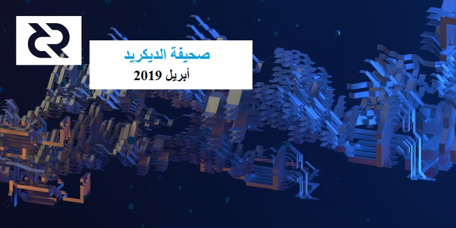

# صحيفة الديكريد لشهر أبريل 2019

شهد شهر أبريل إطلاق الشبكة البرقية على تيستنيت الخاص بـالديكريد! هذا هو الوقت المناسب [للتحقق منه](https://hackernoon.com/decred-wants-you-be-one-of-the-first-to-test-the-dcr-lightning-network-dd9ecf14d95e)، القيام ببعض الاختبارات، والبدء في البناء على الشبكة البرقية للديكريد.

ستصبح الشبكة البرقية متاحة على الشبكة الرئيسية عندما يتم تفعيل DCP0004 في 9 من ماي (على الكتلة 342،784)، لكن الأمر سيستغرق بعض الوقت قبل إنشائها وثباتها بدرجة كافية للاستخدام على شبكة الإختبار - الشبكة الرئيسية في الوقت الحالي هي المكان الأنسب لتجربة الشبكة البرقية للديكريد. من المهم أيضًا **أن تتم ترقية كافة العقد قبل 9 ماي لتجنب التفرع خارج للشبكة.**

شهدت برمجيات بوليتيا جولة هامة من التحسينات في الأداء وخصائص جديدة (مثل عرض الاختلافات للنسخ المقترحة) والتي نشرت على موقع المقترحات المباشرة. أصبح نظام إدارة المقاولين جاهزا للعمل بشكل أساسي وسيتم استخدامه لجمع ومعالجة فواتير المقاولين لشهر أبريل.

كانت طبعة هذا الشهر لصحيفة الديكريد ذات إنتاج لامركزي أكثر من المعتاد، مع تراجع bee@ عن الدور المحوري الذي لعبوه حتى الآن (ولكن تم الحفاظ على إمدادات ثابتة من الملاحظات القادمة) بينما يقوم المساهمون الآخرون بدور أكبر مما يفعلون عادة.

## قم بتحديث عقدك!

ستفعل القواعد المتغيرة ل [DCP0004](https://github.com/decred/dcps/blob/master/dcp-0004/dcp-0004.mediawiki) التي تم [التصويت عليها](https://voting.decred.org/) بنجاح (تحديث تسلسل قفل القواعد التي تمكن الشبكة البرقية) في 9 ماي (على الكتلة 342،784). بمجرد قيام شخص ما بإجراء معاملة تعتمد على هذه القاعدة المغايرة، ستتوقف أي عقد لا تزال تتبع القواعد القديمة (أي نسخة للبرنامج قبل الإصدار 1.4.0) عن متابعة سلسلة الديكريد الشرعية. لذلك من المهم أن تقوم جميع العقد (المعدنين، الناخبين، المستخدمين، التجار ومقدمي الخدمات) بتحديث برامج الديكريد الخاصة بهم إلى النسخة 1.4.0 قبل 9 ماي. **لا تتفرع خارج الشبكة في 9 ماي!**

## التطوير

[dcrd](https://github.com/decred/dcrd): تستمر إعادة تغيير تصميم البرنامج مع تنظيف الوظائف والشروط غير المستخدمة، وإدخال تحسينات على كود التعدين وتجديد وحدة `chaincfg`. أصبح من الممكن الآن إجراء تحديثات دقيقة لرموز التشفير دون كسر الأشياء نظرًا للعمل السابق على الوحدات النمطية التي تم إصدارها، والتي أصبحت متاحة الآن وضمن الاستخدام الكامل.

[dcrwallet](https://github.com/decred/dcrwallet): تنظيف كود التشفير وإدخال التحسينات على كود شراء التذاكر. بدأ العمل لإضافة [مصادقة اختيارية](https://github.com/decred/dcrwallet/pull/1437) لواجهة برمجة تطبيقات gRPC، والتي تتيح للمستخدمين حذف عبارة المرور الخاصة في واجهة برمجة تطبيقات المكالمات التي تتطلب محفظة غير مقفلة. سيؤدي ذلك إلى التخفيف من المشكلات التي تنشأ عند عزل المحافظ غير المؤمّنة عبر التجزئة الفعلية والشبكات.

[Decrediton](https://github.com/decred/decrediton): استمر العمل على جعل تصميم ديكريديتون أكثر استجابة (بحيث يمكن استخدامه على شاشات أصغر حجما)، مع استكمال التصاميم المستجيبة لجميع المشاهدات تقريبا الموجودة في هذه [المسألة الرئيسية](https://github.com/decred/decrediton/issues/1820). وقد تم [تنفيذ](https://github.com/decred/decrediton/pull/2094) التصميم الجديد المتجاوب في `إنشاء عرض محفظة جديدة`. تم فتح [طلب سحب](https://github.com/decred/decrediton/pull/2107) لإضافة واجهة مستخدم محفظة الشبكة البرقية إلى ديكريديتون؛ سيتيح هذا الإصدار الأولي لمستخدمي ديكريديتون تنفيذ إجراءات مثل فتح/إغلاق القناة، إضافة/سحب الأموال، إنشاء الفواتير، وإرسال المدفوعات.

[Politeia](https://github.com/decred/politeia): تم [نشر](https://twitter.com/marco_peereboom/status/1120398754216062978) تحديث على موقع الاقتراحات المباشرة والذي يجلب تحسينات ملحوظة في الأداء، ويضيف مستعرض الإختلاف إلى القائمة المنسدلة لمشاهد محفوظات إصدار الاقتراح، وتغيير الترتيب الافتراضي للتعليقات لإظهار التعليقات الأعلى درجة أولا. نظام إدارة المقاول جاهز للاستخدام وسيستخدم من قبل المقاولين لإرسال فواتيرهم لشهر أبريل.

[dcrlnd](https://github.com/decred/dcrlnd): الشبكة البرقية (LN) للديكريد حية على شبكة الإختبار. بعد شهور من العمل الشاق والعديد من التغييرات عبر المجموعة الكاملة للبرمجيات، منفذ الديكريد الرسمي من [lnd daemon](https://github.com/lightningnetwork/lnd) الأصلي، [dcrlnd](https://github.com/decred/dcrlnd)، تم [إصداره](https://matheusd.com/post/announcing-dcrlnd/) وجاهز للإستخدام على شبكة الاختبار. تم إعتماد جميع اختبارات الوحدة والإدماج لمشروع الشبكة البرقية، كما قد قارب الإنتهاء [للدمج](https://github.com/decred/decrediton/pull/2107) الأولي مع ديكريديتون.

تم [تصميم](https://github.com/matheusd/lightning-faucet/pull/4) صنبور الشبكة البرقية lnd لإضفاء شكل ومظهر لائقين للديكريد. تحقق [هنا](https://testnet-dcrln-01.davec.name/) بإلقاء نظرة خاطفة على واحدة من عدة صنابير لشبكة الإختبار.

يجري العمل على إعداد الشبكة البرقية على الشبكة الرئيسية، وسيتم تقنيا تمكين الشبكة البرقية على الشبكة الرئيسية بعد [تفعيل] برنامج `fixlnseqlock` في الكتلة 342،784 في 9 ماي. سيستغرق بناء الشبكة وتحسين تجربة المستعملين بعض الوقت. وينبغي أن يعتبر استخدام الشبكة البرقية التابعة للديكريد في الوقت الراهن تجريبيا ولا يجب إستعمال مبالغ كبيرة من DCR. التيستنيت هي المكان الذي سيحدث فيه إجراء الشبكة البرقية لبعض الوقت. مكنك متابعة نمو تيستنيت الشبكة البرقية من خلال هذا [الرسم البياني للشبكة](http://ln-map.jamieholdstock.com/).

[dcrandroid](https://github.com/decred/dcrandroid): يستمر إصلاح الأخطاء الطفيفة وتحسينات اللغة. خيار التوثيق البيومتري الاختياري [قيد التنفيذ](https://github.com/decred/dcrandroid/pull/343) وسيتم إصداره في النسخة التالية، مضيفًا طبقة إضافية من الأمن على رأس إدخال عبارة مرور المحفظة.

[dcrios](https://github.com/raedahgroup/dcrios): شهدت dcrios beta الاختبار المستمر من قبل أفراد المجتمع والتحسينات في واجهة المستخدم. لا يزال هناك عدد قليل من الأخطاء المعلقة، ويواصل المطورون العمل على  الإجراءات الرسمية للحصول على الموافقة على التطبيق من قبل متجر أبل.

[dcrdata](https://github.com/decred/dcrdata): تم إصدار النسخة 4.1.0 ونشرها على [explorer.dcrdata.org](https://explorer.dcrdata.org/). وتضيف هذه النسخة [تتبعًا مباشرا](https://explorer.dcrdata.org/agendas) للأصوات على السلسلة من أجل إدخال تغييرات في قواعد الإجماع، إلى جانب عدد من تحسينات الأداء والتطوير المدرجة في [ملاحظات الإصدار](https://github.com/decred/dcrdata/releases/tag/release-v4.1.0). تمت إضافة قوائم التصويت [لمقترحات بوليتيا](https://alpha.dcrdata.org/proposals) على موقع ألفا ويجري التكرار عليها.

[المستندات](https://github.com/decred/dcrdocs): صفحات جديدة: يصف [التعدين الأولي](https://docs.decred.org/advanced/premine/) إيردروب وإطلاق الديكريد (مصدر مشترك لسوء الفهم)، ويصف [التحقق من الأصوات](https://docs.decred.org/governance/consensus-rule-voting/verifying-votes/) كيفية التحقق من أصوات التذاكر، كما توفر [المحافظ الصلبة](https://docs.decred.org/wallets/hardware-wallets/) معلومات أساسية عن محافظ الأجهزة التي تدعم DCR. تم تعديل صفحة [مقدمة الإدارة للديكريد](https://docs.decred.org/governance/overview/) من أجل تفسير أفضل للتصويت بالتذاكر ودور بوليتيا في صنع القرار.

[dcrtimestamptweet](https://github.com/tiagoalvesdulce/dcrtimestamptweet): بدأ تشغيل روبوت جديد على تويتر في أواخر شهر مارس. قم بذكر [dcrtimestampbot@](https://twitter.com/dcrtimestampbot) في تعليق وسيقوم الروبوت بتخزين الموضوع في أي بي إف إس، استخدام dcrtime لتثبيت البيانات على بلوكشين الديكريد، ومراسلة المستخدم الذي استدعاه.

إحصائيات نشاط التطوير لشهر أبريل: 326 من المشاريع النشطة، 509  إيداع رئيسي، 96 ألف إضافة، 55 ألف عملية حذف من خلال 10 سجلات. جاءت المساهمات من 1-9 مطورين لكل سجل.

## الأشخاص

تهانينا لخمسة مساهمين جدد تم إدراج أسماؤهم في قائمة [decred.org](https://decred.org/contributors/):

* Dominguez (الملقب ب anshawblack@ في التسويق)
* Thiago de Freitas Figueiredo (الملقب ب thi4go@، مطور)
* Hugo Chang (الملقب ب changhugo@، مدير مجتمع، الصين)
* Dominic Ting (الملقب ب dominic.d@، مدير مجتمع، الصين)
* Michael Guimaraes (الملقب ب michae2xl@، مدير مجتمع)

تمت إزالة مصمم غير نشط من decred.org: Kärt Koosa (الملقب ب kart@، رسام)

## الإدارة

اكتمل [إجماع التصويت](https://voting.decred.org/) على تنفيذ DCP0004 في 11 أبريل بموافقة 100٪ تقريبًا مع مشاركة نشطة ل 54.5٪ من التذاكر التي صوتت بنعم. سيتم تفعيل القواعد الجديدة في 9 ماي، انظر الملاحظة أعلاه حول تحديث برنامج العقدة.

في أبريل، تلقت [الخزنة](https://explorer.dcrdata.org/address/Dcur2mcGjmENx4DhNqDctW5wJCVyT3Qeqkx) 15،460 DCR وأنفقت 13،943 DCR. باستخدام معدل المتوسط اليومي لشهر أبريل ب DCR/USD والذي يقدر ب 24.22 دولارًا، ستكون الخزينة قد تلقت 374 ألف دولارا وأنفقت 338 ألف دولارا. نظرًا لأن هذه المدفوعات كانت مخصصة للعمل الذي تم إنجازه في شهر مارس، فإنه من المفيد أيضًا أخذها بعين الاعتبار في سياق متوسط السعر اليومي لشهر مارس البالغ 18.14 دولار - وفي هذه الحالة ستبلغ الأرقام المستلمة/المنفقة بالدولار 280 ألف دولار / 253 ألف دولار. اعتبارًا من 7 ماي، بلغ رصيد الخزينة 610،200 DCR (أي ما يعادل 15.4 مليون دولار أمريكي بقيمة 25.20 دولارًا أمريكيًا).

في الأسفل حالة المقترحات اعتبارًا من 7 ماي:

تم تقديم 4 مقترحات جديدة:

* [الإنفاق اللامركزي للخزينة](https://proposals.decred.org/proposals/c96290a2478d0a1916284438ea2c59a1215fe768a87648d04d45f6b7ecb82c3f) بواسطة moo31337@، وهو اقتراح لحجز أصوات شهرية على السلسلة للموافقة على إنفاق الخزينة. اجتذب هذا الاقتراح الكثير من النقاش وتم عرضه في الأخبار. تم حذف بعض تفاصيل التنفيذ عمدا:

  > يكمن السبب في أننا تعلمنا خلال السنوات العديدة من تطوير البرمجيات أن نخطط خطوتين فقط إلى الأمام ونقوم بتقييم أين نقف بعد تحقيق الأهداف المحددة. التخطيط السابق لأوانه ينتهي دائمًا بواقع يتصادم مع الخطة.  لذا، نعم فقد تم حذف التفاصيل المهمة عن قصد. وبمجرد أن تصبح الحقائق التقنية واضحة، يمكننا أن ندعها تملي العملية. ([@moo31337](https://proposals.decred.org/proposals/c96290a2478d0a1916284438ea2c59a1215fe768a87648d04d45f6b7ecb82c3f/comments/6))

    تمت الإجابة على الكثير من الأسئلة و[بدأ](https://twitter.com/marco_peereboom/status/1125497388041494528) التصويت في 6 ماي.

* [تم إدماج زوج عملة الأوراق النقدية على منصة التبادل EXMO](https://proposals.decred.org/proposals/950e8149e594b01c010c1199233ab11e82c9da39174ba375d286dc72bb0a54d7) بطلب من vadymprykhodko@ ل 23،800 دولارا لدمج DCR على منصة التبادل EXMO مقابل BTC و 2 من أزواج  عملات الأوراق النقدية (DCR / RUB ، DCR / UAH). تمت الموافقة على هذا الاقتراح بنسبة تصويت بلغت 62.6٪ بنعم.

* [تعديل دستور الديكريد](https://proposals.decred.org/proposals/fd56bb79e0383f40fc2d92f4473634c59f1aa0abda7aabe29079216202c83114) بواسطة richard-red@ يقترح القيام بمجموعة من التعديلات على دستور الديكريد لتحديثه، ويوضح وضع الدستور داخل المشروع. انتهى التصويت بـنسبة تصويت بلغت 99٪ نعم من بين 12 ألف صوت. شكرا لجميع من قدموا مدخلات في هذه العملية.

* [رحلة إلى مستقبل العمل - سرد قصة DCR عبر بوليتيا](https://proposals.decred.org/proposals/b9f342a0f917abb7a2ab25d5ed0aca63c06fe6dcc9d09565a9cde3b6fe7e6737) بواسطة jer979@ والذي يطالب ب 40 DCR لكتابة مقال يحكي عن تجربة تقديم الاقتراح والانتقال إلى مراحل المراجعة والتصويت -مع دفع 60 DCR أخرى إذا وردت المقالة في منفذ توزيع "من المستوى 1".

اختتم التصويت على ثلاثة مقترحات أخرى:

* تمت الموافقة على الاقتراح الخاص بتمويل [إدماج محفظة Trust](https://proposals.decred.org/proposals/2ababdea7da2b3d8312a773d477272135a883ed772ba99cdf31eddb5f261d571) (التكلفة التقديرية 3،300 دولار بالإضافة إلى 100 دولار /الشهر الجاري) بنسبة تصويت بلغت 67٪ بنعم.
* تم رفض اقتراح [إدماج أجهزة الصراف الآلي](https://proposals.decred.org/proposals/aea224a561cfed183f514a9ac700d68ba8a6c71dfbee71208fb9bff5fffab51d)، بنسبة تصويت بلغت 52.5٪ بنعم - حيث بلغت نسبة الرفض المقترح الأول بنسبة تصويت فاقت 50٪ بنعم. في [مناقشة](https://matrix.to/#/!MIGqWXfLFBwhipPKYL:decred.org/$15542882616188dHEHP:decred.org) جرت في قناة #الاقتراحات، بدا أن هناك إجماعًا على أنه سيكون من العدل إعادة المحاولة مرة أخرى بنسخة مختلفة من هذا الاقتراح، نظرا إلى الهامش الصغير في نتيجة التصويت.
* تم رفض الاقتراح الذي قدمه georgepro@ لجلب الديكريد إلى أفريقيا (غانا) بنسبة أصوات بلغت فقط 5.4% بنعم. بعد انتهاء التصويت (عندما لم تعد التعليقات مفتوحة على بوليتيا)، أدلى jet\_user@ [بتعليق](https://www.reddit.com/r/decred/comments/b9vhee/voting_has_started_for_the_bring_decred_to_africa/eks6578/) طويل ومدروس على موقع ريديت المتعلق بهذا الاقتراح.

للحصول على نظرة عامة أكثر تفصيلاً عن بوليتيا و الإجراءات ذات الصلة، راجع [العدد 14](https://medium.com/politeia-digest/issue-14-apr-1-apr-16-2019-1ad873ccafb) من بوليتيا ديجيست.

تقدم نسخة ألفا ل dcrdata الآن [الرسوم البيانية](https://alpha.dcrdata.org/proposals) التي تُظهر الأصوات بمرور الوقت، بما في ذلك تحديثات في الوقت الفعلي للأصوات الجاري تنفيذها. هذا يجعل بيانات بوليتيا المخزنة في [مستودع](https://github.com/decred-proposals/mainnet) Git أيسر وصولا.

## الشبكة

معدل الهاش: افتتحت معدلات الهاش في شهر أبريل على ~377 Ph/s وأغلقت على ~530 Ph/s، وبلغ قاعها 276 Ph/s كما بلغت ذروتها عند 676 Ph/s على مدار الشهر. توزيع معدلات الهاش للتجمع اعتبارا من 1 ماي حسب [dcrstats.com](https://dcrstats.com/pow):

* Poolin بنسبة 21%
* lab.antpool.com بنسبة 20%
* F2Pool بنسبة 18%
* BTC.com بنسبة 10%
* UUPool بنسبة 9%
* Luxor بنسبة 2.0%
* CoinMine بنسبة 0.9%
* BeePool بنسبة 0.09%
* suprnova بنسبة 0.04%
* وأخرى بنسبة 18.8%.

أرقام توزيع التجمع تقريبية ولا يمكن تحديدها بدقة.

التحصيص: بلغ متوسط سعر التذكرة لمدة 30 يومًا 117.2 DCR (بزيادة 4.9) في 1 ماي حسب dcrstats.com. تراوح السعر بين 105.4-127.7 DCR للتذكرة. بلغ المبلغ المقفل 4.51-4.76 مليون DCR، وهو ما يعادل 47.0-49.1% من الإجمالي المتاح.

العقد: اعتبارًا من 7 ماي، كان هناك 180 عقد استماع عمومية و201 عقدًا عادية حسب [dcred.eu](https://dcred.eu/nodeStats). توزيع الإصدار: بناء التطوير النسخة 1.5.0: 6.9% (+0.6%)، النسخة 1.4.0: 61% (+6%)، بناء التطوير وإصدار الصيغة المرشحة النسخة 1.4.0: 6.1% (+1.1%)، النسخة 1.3.0: 11% (-6%)، النسخة 1.2.0: 7.9% ( -1.6%)، النسخة 1.1.2: 4.3% (+0.3%)، النسخة 1.1.0: 1.4% (-0.3%).

لقد نجح [DCP0004](https://github.com/decred/dcps/blob/master/dcp-0004/dcp-0004.mediawiki) بنسبة تصويت بنعم بلغت 100٪ تقريبًا. سيتم تفعيل القواعد الجديدة في 9 ماي (الكتلة 342،784). تأكد من التحديث إلى [أحدث إصدار](https://decred.org/downloads/).

## الإنضمام

[أضاف](https://twitter.com/coinzark/status/1114888240857849862) CoinZark مبادلة الديكريد مقابل أزيد من 25 عملة مدعومة.

[أعلنت](https://twitter.com/vertbase/status/1119226866311757829) Vertbase أنها ستضيف تداول الباوند واليورو مقابل DCR. في 2 ماي تم [افتتاح](https://twitter.com/vertbase/status/1123998203689484291) التسجيل والشراء بالمملكة المتحدة بالجنيه الاسترليني.

تحذير: ليس لدى مؤلفي مجلة صحيفة الديكريد أي فكرة عن جدارة أي من منصات التبادل المذكورة أعلاه. رجاء قم بأبحاثك الخاصة قبل أن تثق بمعلوماتك الشخصية أو ممتلكاتك لأي كيان.

## الإنتشار

كان شهر أبريل شهرًا حافلًا جدًا بتنسيق التواصل والتخطيط للاجتماعات والفعاليات، والحصول على الإعداد على منصات مختلفة للبدء في تنفيذ خطة التسويق. تولى anshawblack@ منصب المشرف الخاص للديكريد DCR على التيليغرام، ويسر تقديم إجراء مناقشات ممتازة من خلال مشاركة محتوى ديكريد عالي الجودة. فيما يلي تحديث موجز عن التقدم المحرز في [خطة التسويق](https://proposals.decred.org/proposals/c84a76685e4437a15760033725044a15ad832f68f9d123eb837337060a09f86e) المعتمدة في بوليتيا.

جمعية الديكريد: قام كل من Dustorf@ وjy-p@ بجلسة تدريب، ثم عادا بعد أسبوعين لتسجيل الحلقة الأولى من إعادة تجديد جمعية الديكريد. وتقرر أنه بدلا من تسجيل عرض واحد، سيتم تسجيل أجزاء منفصلة من أجل توليد عدد أكبر من أشرطة الفيديو أكثر فهما. لشهر أبريل، قدمنا ​​Deep Dive مع jy-p@ عن التبادل اللامركزي DEX، وهي عبارة عن نسخة موزعة للديكريد مع elian@ يتحدث عن المكسيك وأمريكا اللاتينية، مع مقطع Decred Debunks بواسطة richardred@ مظهرا مدى خطأ وفكرة أن أصحاب الحصص لا يستطيعون أخذ القرار المناسب. ولا يزال هناك بعض العمل الإداري من أجل نشر هذه الفيديوهات أسبوعيا، وهو ما نأمل أن ننجزه بحلول وقت نشرها. وقد تم بالفعل تحديد موعد إصدار شهر ماي.

نشرة الديكريد الإخبارية: قررنا استخدام خدمة مفتوحة المصدر، [phplist](https://www.phplist.org/)، مما سبب بعض التأخير. تم تعيين الإنشاء وتم إرسال الاختبارات بنجاح. يقوم فريق التصميم حاليًا بتصميم قالب لجعله يبدو جميلًا، ويعملون على دمج رابط الاشتراك في decred.org. بمجرد الانتهاء من ذلك، سنقوم بمشاركته للحصول على تسجيل الأشخاص ونتوقع إرسال أول رسائل البريد الإلكتروني في ماي.

تحديثات الموقع: تم تعيين البنية ويتم كتابة المسودة الأولى للنسخة لمعظم الصفحات الفرعية الإضافية. بالإضافة إلى ذلك، تمت كتابة نسخة ثانية من نسخة للفيديو التمهيدي الجديد، والذي سيتم تقسيمه إلى ثلاثة أجزاء: آمن. قابل للتكيف. وذاتي التمويل.

بودكاست الديكريد المفصل: anshawblack@ يسافر إلى نيويورك لحضور أسبوع البلوكشين الذي يبدأ في 11 ماي ويخطط لتسجيل الحلقات مع jy-p@ و jz@ وMurad Mahmudov و Joel Monegro و Permabull Niño و Trey Ditto. سيقوم بعد ذلك بتعديل الحلقات واستخراجها خلال الأسابيع والأشهر القادمة.

منظمو المجتمع: يبرز حجم اللقاءات وعدد الفعاليات التي حضرها الديكريد أدناه النجاح الذي حققناه في تعبئة المجتمعات في جميع أنحاء العالم. سيتم إضافة دليل وأدوات االلقاءات لتنفيذ الاجتماعات كجزء من تحديثات الموقع. وحتى ذلك الحين، يمكن العثور على الأصول في [مستودع التصميم](https://github.com/decred/dcrdesign/releases) على GitHub. تذكير أنه إذا كنت ترغب بإجراء مقابلة في الحي الذي تعيش فيه، فابدأ واحدا! يأخذ أفراد مجتمع الديكريد زمام المبادرة في كل شيء، ولا يوجد أحد يملي ما يحدث وأين، ببساطة تمكين المجتمع.

تم التصديق على الديكريد بإعطائه علامة V على الباينانص. ليتم المصادقة عليه، قام عضو رسمي في المشروع (شخص لديه بريد إلكتروني معترف به وهوية KYC على الباينانص s\_ben@) بمراجعة والتحقق من صحة المعلومات على [صفحة الملف الشخصي](https://info.binance.com/en/currencies/decred) للديكريد. هذا أعطانا الفرصة لتحديث وصف المشروع ليكون أكثر دقة مع تضمين الرسائل التسويقية الجديدة، وكذلك تصحيح بعض المعلومات الخاطئة حول إطلاق الديكريد (مهمة مشتركة).

## الفعاليات

الحضور:

* 4-5 أبريل - [BitcoinDay الأرجنتين](https://www.eventbrite.com.ar/e/bitcoinday-cor-ciudad-de-cordoba-tickets-57550681638) - قرطبة، الأرجنتين. قدم elian@ مقدمة رئيسية بعنوان "الديكريد في 20 دقيقة" للمشروع، بالإضافة إلى نقاش "كيف تصبح مقاولًا معتمدًا" كجزء من ورشة العمل. انظر التقرير [هنا](https://decredcommunity.org/events/bitcoinday-argentina). ([الصور](https://twitter.com/elianhuesca/status/1114571807649148928))
* 8 أبريل - [الديكريد: الأدوات، الاستخدام والمساهمة](https://www.meetup.com/decredpdx/events/260098916/) - بورتلاند، الولايات المتحدة الأمريكية. استمع 17 من الحاضرين ل oregonisaac@ يتحدث بتعمق عن أدوات الديكريد، استخداماتها إسهامها، وتحديثات التطوير بواسطة raedah@، oregonisaac@ و s\_ben@. المجتمع آخذ في النمو من حيث العدد والمشاركة. الجميع متحمس ونتطلع إلى اللقاء المقبل. ([الصور](https://twitter.com/DecredPdx/status/1115734111174291456))
* 18 أبريل - [تنسيق المصدر المفتوح: اليوم وغدا](https://www.meetup.com/San-Francisco-Decred-Meetup/events/260046546/) - مقر Coinbase، سان فرانسيسكو، الولايات المتحدة الأمريكية. أقيمت الفعالية في Coinbase HQ بالشراكة مع Coinbase Custody. تحدث lukebp@ عن نموذج الإدارة والتمويل الذاتي الفريد الخاص بالديكريد. ثم جرت مناقشة مدروسة حول مقايضات نماذج التمويل المختلفة، وأجاب لوك على الأسئلة لأكثر من ساعة. حضر حوالي 70 شخص. (الصور: [1](https://twitter.com/liz_bagot/status/1119098216165695495) [2](https://twitter.com/LarissaBundziak/status/1119340380187529216)))
* 18 أبريل - [Binance LATAM AMA](https://twitter.com/binance/status/1118883131799400449) - عبر الإنترنت. شارك elian@ في 'إسألني أي شيء' AMA باللغة الإسبانية مع أعضاء من مجتمع  Binance Latam، حيث تلقى أسئلة وأجوبة من المستخدمين على الفايسبوك و التيليغرام.
* 22-26 أبريل - [أرض المواهب](https://www.talent-land.mx/) - غوادالاخارا، المكسيك. قدم elian@ [ملخصًا](https://matrix.to/#/!aNPTuiryMFmdMQWUzb:decred.org/$155690701035573YcsMH:matrix.org) عن الفعالية ومشاركة الديكريد. حضر الحدث أكثر من 60،000 شخص، وكانت الديكريد العملة الرقمية الرئيسية الوحيدة الممثلة في "Blockchain Land". حوار بعنوان "الديكريد: مال المستقبل " حضر حوالي 35 شخصًا، وتوقف مئات آخرون للتحدث إلى ممثلي الديكريد في الكشك. لقد استجاب الحاضرون جيدًا لفكرة "كن مصرفك الخاص"، وأيضًا مفهوم الديكريد باعتباره  برنامجا مفتوح المصدر وذي تمويل ذاتي. (الصور: [1](https://twitter.com/elianhuesca/status/1121243105276125184) [2](https://twitter.com/victorarubin/status/1121169425011494913))
* 24-25 أبريل - [قمة البلوكشين](http://blockchainsummit.ma/) - الرباط، المغرب. arij@ (الملقبة ب butterfly@ على Slack) قدمت وعرضت الديكريد. حضر بشكل رئيسي طلاب وأساتذة من المغرب وفرنسا. (الصور: [1](https://twitter.com/DecredArabia/status/1121011670808240128) [2](https://twitter.com/DecredArabia/status/1121160292333965313) [3](https://twitter.com/DecredArabia/status/1121695331253673984))
* 25 أبريل - [لقاء الديكريد بشيكاغو](https://www.meetup.com/Chicago-Decred-Meetup/events/260653330/) - شيكاغو، الولايات المتحدة الأمريكية. استضاف جاك ميلر الاجتماع الافتتاحي في شيكاغو.
* 29 أبريل - ['إسألني أي شيء' AMA المجتمع الصيني](https://www.chainnode.com/ama/317174) - عبر الإنترنت. قامHaon@ وguang@ بإجراء AMA مع أعضاء من مجتمع الديكريد الصيني، حيث تلقوا أكثر من 30 سؤالًا وأجابوا عليه.
* [إدارة العملات الرقمية - مسألة بقاء](https://www.meetup.com/BlockchainMelbourne/events/260266298/)، ملبورن، أستراليا في 30 أبريل. مهد الديكريد هذه المناقشة بشأن إدارة العملات الرقمية. ([الصور](https://twitter.com/DecredAustralia/status/1123396115003392000))

الفعاليات القادمة:

* من 10 إلى 17 ماي - أسبوع البلوكشين في مدينة نيويورك - نيويورك، الولايات المتحدة الأمريكية. سيحضر فريق مكون من 7 أفراد من مجتمع الديكريد فعاليات في مواقع مختلفة. وقد عمل ديتو أيضا على جعل [AtomicSwap](https://twitter.com/TheBlock__/status/1123339626616360962) (الفعالية المعروفة سابقا باسم BreakerCon) ناجحة قدر الإمكان في 15 ماي. ربما تكون قد رأيت [الأخبار](https://twitter.com/BreakerMag/status/1123259686516592642) التي تفيد بإيقاف Breaker Mag، لذلك تشارك ديتو الآن في استضافة هذه الفعالية مع أفضل موقع لأخبار العملات الرقمية، The Block. خلال أسبوع البلوكشين بنيويورك، سيأخذ الديكريد المنصة الرئيسية حيث سيتحدث jy-p@ في ندوة عن "معضلة المثالي"، حيث سيناقش معنى اللامركزية مع قائدي المشاريع الأخرى: ريان تايلور من داش، الكسندر زيدلسون من Beam، وتول كول من أوربس.
* 18 مايو - [Criptolatinfest](https://criptolatinfest.com/) - بوغوتا، كولومبيا. سيكون لدى الديكريد مكان للتحدث.
* 20-21 مايو - [La Conexion](https://www.la-conexion.com/) - ميديلين، كولومبيا. سيلقي elian@ كلمة رئيسية عن الإدارة.
* 23-24 مايو - [BitcoinDay Uy](https://bitcoinday.tv/) - مونتيفيديو، أوروغواي. إعطاء مساحة للتحدث عن الديكريد في بيتكوانداي أوروجواي. وتنظم هذه الفعالية نفس المجموعة التي نظمت مؤتمر بيتكوينداي في الأرجنتين، وتأتي الدعوة لتقديم الديكريد من العرض القوي للمشروع الذي قدم في الأرجنتين.
* 5 يونيو - لقاء الديكريد - برلين، ألمانيا. سيقدم  jholdstock@ نظرة عامة عن الديكريد وسيقوم Philipp Banhardt من BlueYard بمناقشة أطروحة الاستثمار الخاصة بهم. "يستضيفها" BlueYard Capital.
* 12 أبريل - [الديكريد: كيان لامركزي مستقل](https://www.meetup.com/Decred-Washington-DC-Meetup-Group/events/261144707/) - أرلينغتون، فيرجينيا، الولايات المتحدة الأمريكية. سينظمه أكين سوير.
* 19-23 يونيو - [حفلة الحرم الجامعي البرازيل](https://brasil.campus-party.org/campus-party-brasilia/) - برازيليا، البرازيل. [سيتم](https://matrix.to/#/!aNPTuiryMFmdMQWUzb:decred.org/$15568861633013AEoGy:decred.org) تمثيل الديكريد بشكل جيد كما هو الحال دائما في حفلة الحرم الجامعي.
* أوائل شهر يونيو، سيتم تحديد التاريخ لاحقا - لقاء الديكريد بنيويورك، تم إطلاقه بواسطة كول كينيلي من Staked. سيتم التخطيط للفعاليات الثلاثة الأولى خلال فصل الصيف، ثم إشراك الديكريد في الفعاليات التي تتضمن نظاما إيكولوجيا أوسع.
* ستقوم مجموعة لقاء سان فرانسيسكو بمشاركة التفاصيل قريبًا حول الفعالية القادمة، والتي من المحتمل أن تعقد في أوائل يونيو. سيكون موضوع العمل هو الشبكة البرقية.

## وسائل الإعلام

نظرة عامة عن ديتو:

* تحدث jz@ مع [The Block](https://www.theblockcrypto.com/2019/04/17/binance-wants-crypto-projects-to-migrate-to-its-chain-from-ethereum-and-the-firms-massive-trading-business-could-help/) حول تجربة إدراج الديكريد على الباينانص.
* أنشئت وثيقة [مراسلة](https://pastebin.com/7SvuVyyY) الناخبين بالتذاكر كأداة لتثقيف الناس بشأن كيفية عمل نظام التصويت في الديكريد. أدرجت مساهمات المجتمع، ويجري حاليا مراجعة النسخة الثانية منها.
* ظهرت [مقالة](https://www.investinblockchain.com/put-your-money-where-your-mouth-is-decreds-treasury-proposal-closer-true-dae/) عن اقتراح لا مركزية الخزنة على موقع InvestInBlockchain.com.
* قام matheusd@ بصياغة مسودة [مدونة](https://hackernoon.com/decred-wants-you-be-one-of-the-first-to-test-the-dcr-lightning-network-dd9ecf14d95e) على شبكة الإختبار للشبكة البرقية على Medium ونشرت على HackerNoon.
* [انعقدت](https://www.reddit.com/r/CryptoCurrency/comments/bjubwv/ama_decred_project_lead_jake_yocompiatt/) AMA 'إسأل أي شيء' بواسطة jy-p@ على r/cryptocurrency، والتي تضم أكثر من 870 ألف قارئ. خلق lukebp@ هذه الفرصة عندما قدم في Coinbase في سان فرانسيسكو.
* سينظم كل من ديتو و Dustorf@ 'إسألني أي شيء' AMA لمجتمع الديكريد حتى تتيح له الفرصة ليسأل عن أي شيء يخص العلاقات العامة والتسويق عبر ريديت، ماتريكس و اليوتيوب. التاريخ المستهدف هو 17 ماي عند الظهر بتوقيت شرق الولايات المتحدة (UTC-5).

مقالات مختارة:

* تفريغ العقد الاجتماعي للديكريد بواسطة Haon@ (على [medium](https://medium.com/@NoahPierau/unpacking-decreds-social-contract-69c413aa652))
* كن أول من يختبر الشبكة البرقية ل DCR بواسطة matheusd@ (على [medium](https://hackernoon.com/decred-wants-you-be-one-of-the-first-to-test-the-dcr-lightning-network-dd9ecf14d95e))
* قام Crypto Briefing بمراجعة الديكريد و [قيمه](https://cryptobriefing.com/decred-digital-asset-report-dcr-token-review/) ب C+ (6.4)،  مشيرا إلى "... يتمتع الديكريد بشبكة تجارية أصغر ونظامًا إيكولوجيًا أقل نشاطًا مقارنة بخصومه. بالإضافة إلى ذلك، فإن معدل التضخم الهائل لا يشجع المستخدمين على استخدام DCR كوسيلة للدفع"
* لامبالاة ناخبي البلوكشين بقلم روي ليرنر (على [medium](https://medium.com/wave-financial/blockchain-voter-apathy-69a1570e2af3)) - ينظر في مشاركة الناخبين في مجموعة مختارة من مشاريع البلوكشين (بما في ذلك الديكريد)
* ملاحظات التصويت على اقتراح البلوكشين بواسطة richardred@ (على [github](https://github.com/RichardRed0x/crypto-governance-research/blob/master/governance-proposals/proposal-data-notes.md)) - مراجعة لمجموعات بيانات التصويت المقترحة التي أضيفت إلى الديكريد، داش ، وأراغون
* ما هي أنواع المنظمات التي يجب أن تكون مستقلة؟ بواسطة Amentum Capital (على [medium](https://medium.com/amentum/what-types-of-organizations-should-be-autonomous-6f9dff3c5691)).
* الماضي، الحاضر و المستقبل: من التعاون إلى أعمال Cryptonetworks بواسطة جيسي والدن (على [a16z.com](https://a16z.com/2019/03/02/cooperatives-cryptonetworks/)، فوت في عدد مارس)

الترجمات:

* تمت [ترجمة](https://mp.weixin.qq.com/s/lAxmWYItifQldGgwTVOWHw) أدلة التقسيم الفردي وتقسيم التذاكر إلى الصينية بواسطة wanbihou@. تحقق من [dcrclub.org](https://blog.dcrclub.org/) للحصول على مجموعة من الترجمات الصينية لمقالات الديكريد.
* قامakinsawyerr@ بترجمة مراجعة الديكريد لأبحاث iBotics من [الإسبانية](http://ibotics.es/reports/iBotics_Research_DCR.pdf) إلى [الإنجليزية](https://matrix.to/#/!kdpEDksmOMNrlMqffD:decred.org/$1556338959151873UVFAF:matrix.org).

أشرطة الفيديو:

* [خطاب](https://www.youtube.com/watch?v=l2Vu0JX7Xbc) jy-p@ نظرة عامة حول الديكريد في OKCoin + [فعالية](https://www.eventbrite.com/e/decred-okcoin-present-the-next-10-years-crypto-boom-bust-or-buidl-tickets-57549671617) الديكريد في سان فرانسيسكو.
* [العرض التقديمي](https://www.youtube.com/watch?v=QeNfs7lUV38) ل joshuam@ في TABConf 2019، أعطى مقدمة عن العملة الرقمية الديكريد، المجتمع والاقتصاد/المنظمة.

الصوتيات:

* تم [تحميل](https://podcasts.apple.com/podcast/decred-assembly-1-0/id1459062074) Decred Assembly القديم على أبل بودكاست. بفضل ريان.

## مناقشات المجتمع

إحصائيات المجتمع اعتبارًا من 2 من ماي:

* مستخدمي بوليتيا: 167
* متابعو التويتر: 40,456 (+147)
* المشتركين في ريديت: 9,425 (+20)
* مستخدمي الماتريكس: 312 (+28)
* مستخدمي السلاك: 6,685 (+46)
* مستخدمي Discord: تم التحقق من 2194 (+70) ليقوموا بالتعليق: 199 (+38)
* مستخدمي التيليغرام: 3,668 (-374)
* المشاركين في اليوتيوب: 3,771 (+7)
* متابعي الفيسبوك: 3,218 (+53) ، إعجاب: 2,956 (+40)
* متابعي LinkedIn: صفحة الديكريد 515 (+20)
* نجوم Github dcrd: بلغت 486 (+7)، تفرعات: 1،285 (+28)

أخبار نظم الاتصالات:

* تم اختراق الخوادم التي تستضيف matrix.org و riot.im وتم إسقاطها في 11 أبريل لصيانة الأمن في حالة طوارئ. إذا كنت تستعمل خادم matrix.org، فقم بتغيير كلمة المرور الخاصة بك. انظر تقرير الحادث [هنا](https://matrix.org/blog/2019/04/11/security-incident/) وتغريدة الجدول الزمني [هنا](https://twitter.com/matrixdotorg/status/1116304867683905537). من المثير للاهتمام أن المخترق قام بنشر توصيات سخية و مضحكة نوعا ما إلى المشرفين على GitHub. لم يتأثر خادم الديكريد (matrix.decred.org). لحظة مناسبة لشكر مشرفينا الذين يعملون كل يوم للحفاظ على عمل البنية التحتية المستضافة ذاتيا بشكل جيد. الحادثة عطلت إتصالاتنا لعدة ساعات لأن العديد من الناس يستخدمون إصدار متصفح عميل Riot.im والذي تم فصله. ولكي يكون المستخدمون مرنون في مواجهة هذه المسائل ، ينبغي لهم أن ينظروا في  تثبيت عملاء مستقلين (سطح المكتب أو الهاتف المحمول). فكرة أخرى هي أن  تقوم [بالإستضافة الذاتية ل Riot](https://github.com/xaur/decred-issues/issues/62).
* كانت هناك انقطاعات متعددة في جسر الدردشة ولم يتم تسليم العديد من الرسائل عبر الجسر.
* [يتحرك](https://github.com/matrix-org/matrix-doc/blob/master/proposals/1711-x509-for-federation.md) اتحاد الماتريكس لإيقاف دعم الشهادات الموقعة ذاتيًا والاعتماد على [المراجع المصدقة](https://en.wikipedia.org/wiki/Certificate_authority) في التصرف.
* تم اكتشاف حساب مزيف ينتحل شخصية الديكريد يعمل على تقديم هبات على الفايسبوك. ابقى حذرا.
* انضم degeri@ كمدير ريديت الجديد للحفاظ على r / decred نظيفة من الرسائل المزعجة اليومية. على الرحب و السعة!

نخبة من مناقشات Reddit:

* هل يؤدي حجز نسبة 48٪ من العملات في التحصيص إلى خفض [تقلبات الأسعار](https://www.reddit.com/r/decred/comments/bh1erw/decred_has_48_of_coins_lockedup_in_staking/)؟
* تمت [إضافة](https://www.reddit.com/r/decred/comments/bgiqh0/bullish_bitwise_has_updated_their_top_20_mid_cap/) الديكريد إلى Bitwise أفضل 20 مؤشر للقيمة المتوسطية لسوق للعملات الرقمية
* ستشارك fintechprof '[بشكل كامل](https://www.reddit.com/r/decred/comments/biipw3/im_going_allin_on_decred_here_is_why/)' في الديكريد (بفاعلية، وليس من خلال الاستثمار غير المسؤول لمدخراتهم/قروضهم)، وأوجز أسباب هذا الاحتضان الحماسي.
* عشاق الديكريد [مدعوون](https://www.reddit.com/r/decred/comments/bi387g/new_sub_for_all_things_crypto_staking_decred/) بحرارة إلى subreddit جديد حول تحصيص العملات الرقمية.
* [تفاصيل](https://www.reddit.com/r/decred/comments/b8k2i0/where_can_i_read_about_the_pseudo_random_number/) حول مولد الأرقام العشوائية المستخدم لاختيار التذاكر في الديكريد.
* يقترح [المقترح التمهيدي](https://www.reddit.com/r/decred/comments/b84t6b/preproposal_second_constitutional_amendment_to/) التعديل الدستوري الثاني لاعلان 8 فبراير اليوم الدولي ل Stakey.
* نظرة على قابلية التوسع و[حجم سلسة الكتل](https://www.reddit.com/r/decred/comments/bi366i/blockchain_storage_over_time/) مع مرور الوقت.
* قام jy-p@ ب [AMA](https://www.reddit.com/r/CryptoCurrency/comments/bjubwv/ama_decred_project_lead_jake_yocompiatt/)  على /r/cryptocurrency في 2 ماي وتلقى 69 تعليقًا إجماليًا.

## الأسواق

تم تداول DCR في أبريل بين 19.97-26.68 دولار أمريكي و BTC 0.0045-0.0052 حسب [coinmarketcap](https://coinmarketcap.com/currencies/decred/#charts). وبلغ متوسط السعر اليومي 24.22 دولار.

كسر البتكوين حاجز 5،000 دولار أمريكي في 3 أبريل، وكانت ردة فعل معظم أصول العملات الرقمية كالمعتاد بزيادة مقابل الدولار الأمريكي مع انخفاض مقابل BTC. اختبر البتكوين حاجز 5،500 دولارًا أمريكيًا عدة مرات خلال الشهر،  ولكن في نهاية المطاف كان يتغير ما بين 5،000-5،500 دولار أمريكي.

## الخارجية ذات الصلة

قام richardred@ بجمع و[مشاركة](https://github.com/RichardRed0x/crypto-governance-research/tree/master/governance-proposals) مجموعات بيانات التصويت للمقترح الشامل للديكريد، الداش و الأراغون ، و[غرد](https://twitter.com/RichardRed0x/status/1114552602237313024) عن بعض الإحصاءات الأساسية مثل متوسط مشاركة الناخبين لكل مشروع. في وقت كتابة هذا التقرير (6 أبريل)، واستنادًا إلى المقترحات التي انتهت من التصويت، حصل الديكريد على متوسط مشاركة بالتذاكر بلغ 76٪ من الأصوات على السلسلة و 31٪ على مقترحات بوليتيا؛ بلغ متوسط مشاركة ماسترنود الداش 19% في خزانة مقترحاته؛ كانت لدى الأراغون نسبة مشاركة بتوكنات ANT تبلغ 4.5٪ في التصويت على مقترحات إدارة أراغون (هذا لا يمكن مقارنته مباشرة بـالديكريد/داش حيث يمكن فقط التصويت بالتذاكر/الماسترنود).

اختتمت الجولة الثانية من التصويت على اقتراح  أراغون المتعلق بالإدارة من التصويت في 27 أبريل والتي استغرقت يومين. وجرى التصويت على تسعة مقترحات، بمعدل مشاركة متوسط قدره 3.8٪ من توكنات ANT المتداولة. تم قبول 6 مقترحات، ورفض 3.

تتعلق ثلاثة من مقترحات أراغون ببولكادوت بطريقة ما، بعد أن صرح قادة أراغون وان أنهم يفكرون في تطوير تطبيق أراغون الثاني على بولكادوت. تم رفض اقتراح بحزم لشراء بعض نقاط DOT بواسطة ETH رابطة أراغون (بهدف الحفاظ على parachain والمشاركة في إدارة Polkadot) بحزم من قبل ناخبي ANT، مع نسبة تصويت بلغت  7 ٪ فقط بنعم. تم رفض مقترح لتأكيد التزام أراغون بالإيثيروم وإيقاف أراغون وان عن العمل لتطوير بولكادوت بشكل أكثر ضيقًا (بأغلبية تصويت بلغت 31٪ نعم). كان من الممكن أن يتسبب هذا الاقتراح في خلاف كبير بين أراغون وان ومجتمع حاملي إNط لو كان قد مر، حيث صرح لويس كويندي في [مقابلة](https://www.coindesk.com/aragon-vote-aims-to-restrict-ethereum-app-from-funding-polkadot-blockchain) بأنه كان سيقدم اقتراحًا مضادًا في الجولة التالية من عملية التصويت على مقترحات التصويت لأراغون. في الإقتراح الثالث المتعلق ببولكادوت، وافق 72% من ناخبي على مشاركة جمعية أراغون في "lockdrop"  للتوكنات في Edgeware parachain القادم،  مما يترك سلطة تقديرية كبيرة لجمعية أراغون لتقرير عدد التوكنات التي يجب قفلها والفترة الزمنية لقفلها لهم. رأى اقتراح آخر مثير للاهتمام أن جمعية أراغون تطلب سلطة لترتيب عمليات تدقيق الأمن مباشرة (بدلاً من المرور بعملية اقتراح إدارة أراغون للتصويت على هذه القرارات). تمت الموافقة على هذا بنسبة 93٪ من الأصوات "بنعم"، في حين تم رفض اقتراح مقدم من المجموعة التي تقوم حاليًا بإجراء عمليات تدقيق أمنية للتمويل المستمر بنسبة 35٪ من الأصوات "بنعم".

لقد [لوحظ](https://www.evanvanness.com/post/184616403861/aragon-vote-shows-the-perils-of-onchain-governance) أن نتيجة العديد من أصوات عملية إدارة أراغون قد تم تغييرها من قبل أحد الحيتان (7 أكبر محفظة ل ANT، تحتوي على 2٪ من التوكنات) يقارب التصويت على الإنتهاء.

[اكتملت](https://blog.dash.org/product-update-april-5-2019-71344591a5e1) عملية تحديث Dash sporking لتمكين قائمة ماسترنود الحتمية (وهو شرط لأقفال السلسلة التي من شأنها ردع هجمات غالبية المعدنين) و الإرسال الفوري التلقائي. أدى تفعيل هذا spork إلى إعادة ضبط أصوات مقترحات الخزانة، وخلال معظم الشهر بدا الأمر وكأن عددا قليلا فقط من المقترحات سيصل إلى المستوى المطلوب من الأصوات التي ستمول. عندما أغلقت انتخابات الكتلة السوبر (superblock) يوم 29 أبريل، عادت معدلات مشاركة الناخبين إلى نطاقها المعتاد واستوفى 15 مقترحا هذا الشرط. تبقت 660 داش ليتم إنفاقها في الكتلة العظيمة، وتم فقدها إلى خزانة داش، ولكن هذا المستوى من الإنفاق المنخفض ليس شائعًا بشكل خاص. وكان من بين [المقترحات](https://github.com/RichardRed0x/crypto-governance-research/blob/master/governance-proposals/dash-proposals.csv) اثنان من شركات العلاقات العامة المنافسة، Wachsman و Shift؛ حتى هذه النقطة قامت المجموعة الأساسية للداش بترتيب هذه الخدمات مباشرة وفقًا لتقديرها، وكانت تحتفظ بخدمات Wachsman. لقد مر اقتراح Shift، الذي تبلغ تكلفته 10 آلاف دولار شهريًا كمقدم أتعاب، بـ 536 صوتًا بنعم (90٪ بنعم، ولكن 52 صوتًا فقط تجاوز متطلبات النصاب القانوني)، في حين تم رفض اقتراح واكسمان بمجموع -206 (توجد أصوات بلا أكثر من نعم).

تم استبدال دستور إيوس [باتفاقية مستخدم](https://github.com/eosnewyork/eosuseragreement/blob/master/README.md) جديد، تم اقتراحها على السلسلة من قِبل [إيوس نيويورك](https://medium.com/eos-new-york/the-eos-user-agreement-has-been-proposed-on-chain-61bf3760b604) و[اعتمادها](https://eosauthority.com/approval/view?scope=eosnewyorkio&name=eosuseragree&lnc=en) من قِبل 21 من منتجي الكتل. وقد طرح هذا التغيير على حاملي إيوس في [استفتاء](https://eosauthority.com/polls_details?proposal=eosuseragree_20190207&lnc=en). مدة الاستفتاء طويلة (3 أشهر) وليس من المقرر أن تنتهي حتى 8 ماي، وهناك تأييد قوي للاقتراح (98 ٪ بنعم) ولكن نسبة مشاركة الناخبين منخفضة جدا (1.7 ٪). تتطلب استفتاءات إيوس  نصابًا قانونيًا تقديريا قدره 15٪، ولكن في ضوء حقيقة أن أيا من صناديق الاقتراع لم تقترب من الوصول إلى هذا المستوى من المشاركة، يبدو أن منتجو الكتل قد قرروا تجاوز عملية الاستفتاء الرسمية والمضي قدمًا مع بعض من التغييرات المقترحة. كما [وافق](https://twitter.com/zeroxeos/status/1118833569118466048) منتجو الكتل لإيوس أيضًا على نشر REX ( منصة تبادل الموارد)، لكنه [فشل](https://www.reddit.com/r/eos/comments/bekd4f/rex_is_here_status_approved_by_15_bp/) في التنفيذ على السلسلة وسيتعين إعادة اقتراحه.

[تخطط](https://blog.aeternity.com/aeternity-first-on-chain-governance-vote-decentralization-2-0-5e0c8a01891a) Aeternity لعقد أول تصويت للإدارة على السلسلة  في 7-14 ماي. الاقتراح للتصويت عليه هو إنشاء "مبادرة مكافآت الكتلة (BRI)، والتي من خلالها ~ 0-20 ٪ من مكافآت المعدنين سيتم تخصيصها للتطوير". يشير الإعلان المنشور إلى أن أموال ICO الخاصة بـ Aeternity  كافية لتمويل عملية التطوير لسنوات قادمة، وتضع مبادرة مكافآت الكتلة  كنقطة انتقال إلى منصة مكتفية ذاتيا. وستقدم أموال مبادرة مكافآت الكتلة إلى مؤسسة خيرية مسجلة في ليختنشتاين، يديرها مجلس تقني. سيصوت حاملو توكن AE على 0، 5، 10، 15 أو 20٪ من كتلة المكافآت التي ستذهب إلى هذه المؤسسة - طالما أن أكثر من 50٪ من AE سيصوتون على حصة أكبر من 0٪، سيتم تعيين النسبة المئوية باستخدام متوسط مرجح للأصوات لخيارات أكبر من 0٪. سيؤدي ذلك إلى ترك بعض حاملي AE الذين لا يرغبون في الحصول على تمويل من المكافآت مع خيار صعب فيما يتعلق بما إذا كانوا سيصوتون بنسبة 0٪ ويأملون أن يكونوا بالأغلبية (وإلا يتم تجاهلهم) أو التصويت بنسبة 5٪ لخفض المتوسط المرجح. في حالة الموافقة على الاقتراح.

تم [الإعلان](https://forum.zcashcommunity.com/t/announcing-ycash-the-first-friendly-fork-of-the-zcash-blockchain/33162) عن Ycash، "تفرع صديق" لـ Zcash. ستقوم Ycash بإنشاء لقطة عن سلسلة Zcash، وسوف تتباعد بطريقتين (استبدال مكافأة المؤسسين الحالية البالغة 20٪ بمكافأة دائمة بنسبة 5٪ تذهب إلى مؤسسة Ycash تم إنشاؤها حديثًا، وتحويل خوارزمية تعدين إثبات العمل إلى شيء أكثر ملائمة للتعدين على الأجهزة الصلبة التي تباع) في حين تهدف إلى دمج التحسينات المستقبلية من Zcash. كتب زوكو ويلكوكس [تدوينة](https://z.cash/blog/future-friendly-fork/) عن "تفرع صديق مستقبلي" سنة 2017، ويبدو أن هذا ألهم وضع تفرع ودي لYcash. علق Zooko أيضًا على منشور Ycash ليقول إنه يرى Ycash بمثابة تطور إيجابي لـ Zcash.

[أعلنت](https://www.zfnd.org/blog/kzen-multisig/) مؤسسة Zcash عن تمويل مشروع بحثي مع KZen Networks لتمكين المعاملات الخاصة متعددة n-of-n لـ Sapling Zcash دون الحاجة إلى تغيير الإجماع. ويتصل هذا الجهد بعمل شركة kzen بشأن [التوقيعات الحدية](https://www.kzencorp.com/post/threshold-signatures-private-key-the-next-generation)، التي تشبه التوقيعات المتعددة الأطراف ولكن لا يمكن تمييزها عن التوقيعات العادية.

كان "Maker DAO" [موضوعًا](https://www.coindesk.com/makerdao-set-to-increase-dai-fees-above-15-in-bid-to-stabilize-stablecoin) للجدل هذا الشهر ، في البداية مع استمرار مشكلة ربط DAI بالدولار الأمريكي (مع زيادات متكررة في الاستقرار فشلت مؤخرًا في استعادة الربط) ثم مع بعض المعلومات المتسربة حول [الصراع](https://www.coindesk.com/darkest-days-yet-purple-pill-tell-all-details-years-long-rift-at-heart-of-makerdao-stablecoin-project) مع فريق Maker. تقدم [قصة Zandy](https://www.scribd.com/document/407743542/Zandy-s-Story#from_embed) نظرة مثيرة للاهتمام في تاريخ Maker وأصل Foundation Maker كخطوة في اللحظة الأخيرة لتجنب فاتورة ضريبية باهظة، وسقوط لاحق للأطراف المعنية، مع قنوات اتصال سرية ، خارطة طريق "حبة أرجوانية" لمحاولة حل النزاع، مع طرد أعضاء مجلس الإدارة والتخلي عن مفاتيحهم المتعددة الخاصة ، و[الرسالة المسربة](https://www.coindesk.com/leaked-letter-exposes-infighting-atop-flagship-ethereum-project-makerdao) التي كشفت كل شيء.

[أعلنت](https://zcoin.io/further-disclosure-on-zerocoin-vulnerability/) Zcoin عن ثغرة أمنية في بروتوكول Zerocoin الذي سمح بإنشاء عملات مزورة ("لا تتجاوز 1٪ من العرض المتداول"). دعا فريق Zcoin إلى تعطيل Zerocoin في 9 أبريل عندما اكتشفوا المشكلة، وفي هذا المنشور في 26 أبريل ، أكد أنه سيظل معطلًا لـ Zcoin لأنه يعمل على استبدال (Sigma) وهو جاهز تقريبًا.

في [الجزء 4](https://blog.0xproject.com/0x-roadmap-2019-part-4-proposal-for-stake-based-liquidity-incentive-52c16558df29) من خارطة طريق 0x، تم اقتراح [ZEIP-31](https://github.com/0xProject/ZEIPs/issues/31)، الأمر الذي من شأنه أن يضيف حوافز لصانعي السوق للتمسك بتوكن ZRX. هذا استجابة لعدم وجود ارتباط بين مستخدمي 0x و  حاملي الرمز المميز ZRX. تم تصميم ZRX ليتم استخدامه للتحكم في البروتوكول، والذي من غير المحتمل أن يعمل بشكل جيد في سيناريو حيث لا يحتفظ المستخدمون الرئيسيون بأي ZRX. الاقتراح في بداية عملية طويلة لتطوير وتدقيق العقود الذكية الجديدة ثم إجراء تصويت على حامل البطاقة للموافقة / رفض إدماج التغييرات.

تم [حذف](https://www.coindesk.com/kraken-exchange-joins-binance-shapeshift-in-delisting-bitcoin-sv) Bitcoin (Cash) Satoshi's Vision (BSV) من عدد من منصات التبادل كجزء من نزاع مستمر بين Craig S Wright وبعض أعضاء مجتمع البتكوين. من المقلق أن السلوك السيئ لرجل مرئي للغاية يسبب الكثير من المتاعب لل BSV.

واجهت Bitfinex بعض [المشاكل](https://bitcoinmagazine.com/articles/bitfinex-faces-legal-action-from-ny-attorney-general-heres-what-this-means/) من مكتب المدعي العام في نيويورك، في شكل طلب لأمر من المحكمة للتحقيق في المعاملات بين بعض الكيانات القانونية المتعلقة ب Bitfinex و Tether. وعلى وجه التحديد، فإن المدعي العام في نيويورك يدعي أن بيتفينكس خسرت حوالي 850 مليون دولار محتفظ بها كعملات رقمية (يزعمون أنه تم تجميدها)، وأن بيتفينكس  اقترضت من احتياطي التيثر من أجل الحفاظ على عمل بيتفينكس. قام التيثر [بتحديث](https://news.bitcoin.com/while-tether-withdraws-claim-of-usd-backing-rival-stablecoins-provide-monthly-attestations/) شروطه في [26 فبراير](https://archive.today/yw7nb)، مضيفًا أنه قد يدعم الآن USDT بأصول أخرى غير الدولار الأمريكي ويؤخر الاسترداد أو السحب بسبب قلة السيولة أو عدم توفر الأصول.

أعلنت [QuadrigaCX](https://cointelegraph.com/news/canadian-crypto-exchange-quadrigacx-officially-declared-bankrupt) إفلاسها بعد أشهر من عدم اليقين.

تم [اكتشاف](https://motherboard.vice.com/en_us/article/zmakk3/researchers-find-critical-backdoor-in-swiss-online-voting-system) ثغرة حرجة في نظام التصويت على الإنترنت في سويسرا (فوت في عدد مارس)، و من المقرر استخدامه في الانتخابات هذه السنة. قد يسمح الخلل لشخص ما بتغيير الأصوات التي لم يتم كشفها. [كتب](https://boingboing.net/2019/03/13/principal-agent-problems.html) كوري دوكتورو حول هذا الموضوع ككشف عن قضايا التصويت عبر الإنترنت حول عملية مراجعة الحسابات واتفاقية عدم الكشف التي تغطي الشفرة وانتقاد الصمت من الباحثين في مجال الأمن.

[سيجتمع](https://cointelegraph.com/news/g20-to-establish-crypto-aml-and-counter-terrorism-financing-regulations-in-june-report) أعضاء مجموعة العشرين في اليابان في يونيو، ويخططون للاتفاق على إطار عمل لمكافحة غسل الأموال وتمويل الإرهاب باستخدام العملات الرقمية - بهدف رئيسي هو مكافحة إخفاء الهوية وتحديد الأفراد الذين يتعاملون في أصول العملات الرقمية في لحظة المعاملة.

لقد [أظهر](https://gadgets.ndtv.com/laptops/news/intel-visa-sa-00086-exploit-researchers-computer-data-access-2014854)  الباحثون أن أداة الاختبار المجمعة مع رقائق  إنتل (Intel VISA) يمكن أن تسمح للمهاجمين بالتقاط البيانات من وحدة المعالجة المركزية.

[اتهم](https://www.zdnet.com/article/former-mozilla-exec-google-has-sabotaged-firefox-for-years/) المدير التنفيذي السابق لموزيلا جوجل بتخريب فايرفوكس لسنوات - من خلال سلسلة طويلة من "الأخطاء" التي أدت إلى حدوث مشكلات في منتجات جوجل في متصفح فايرفوكس.

عندما يتعلق الأمر بالخصوصية، فإن صحيفة نيويورك تايمز لديها [حس فكاهي](https://twitter.com/Pinboard/status/1116354502032932865) جيد - في ملء صفحة" مشروع الخصوصية " بشكل كامل بنصوص تتبع خارجية.

## عن هذا العدد

هذا هو العدد 13 من مجلة صحيفة الديكريد. فهرس جميع القضايا والمرايا والترجمات متاح [هنا](https://xaur.github.io/decred-news/).

يتم نقل معظم المعلومات الواردة من أطراف ثالثة مباشرة من المصدر بعد التحقق من صحتها. ليس لدى مؤلفي مجلة صحيفة الديكريد القدرة على التحقق من جميع  الادعاءات. رجاء إحذر من أعمال الاحتيال وقم ببحثك الخاص.

نرحب بتعليقاتك ومساهماتك على Reddit و [GitHub](https://github.com/xaur/decred-news/issues) و [Matrix](https://matrix.to/#/!lbzTjhzNbIaDbuAxkS:decred.org).

الاعتمادات (بالترتيب الأبجدي):

* bee،
* degeri،
* Dustorf،
* elian،
* guang،
* Haon،
* issedjur،
* liz\_bagot،
* lukebp،
* lustosa،
* matheusd،
* richardred،
* s\_ben،
* saender،
* sambiohazard.

قم بزيارة مجلة الديكريد باللغة الإنجليزية على الرابط التالي: [رابط الصفحة](https://xaur.github.io/decred-news/journal/201904.html)

تمت الترجمة إلى اللغة العربية بواسطة: butterfly@

