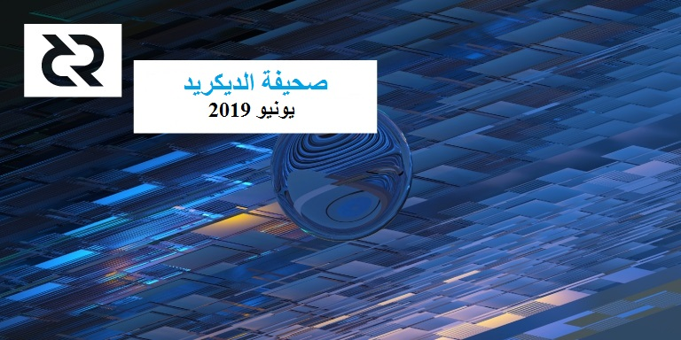

## صحيفة الديكريد لشهر يونيو 2019

_الصورة "الشذوذ" بواسطة saender@_

أبرز أحداث شهر يونيو:

* الموافقة على ميزانية العلاقات العامة لديتو على منصة بوليتيا، برنامج مكافأة إيجاد العلة، البحث المفتوح المصدر، مواصفات منصة التبادل اللامركزي، والتغيير في إجماع التزامات صديرة الكتلة ، مما يعزز أمن النظام البسيط للتحقق من الدفع SPV ويمهد الطريق لإدخال تحسينات أخرى.

* أصدرت النسخة 1.0.0 لمحفظة الديكريد لنظام "آي أو إس" على متجر أبل في 10 يوليوز.

* أصدرت النسخة 5.0 ل dcrdata، مع إضافة رسوم بيانية جديدة و مؤثرات بصرية لاستكشاف بيانات ديكريد، والتحسينات في الأداء والأمان والبنية.

* تجربة أكثر سلاسة للمتعاقدين عند تقديم الفواتير، مع إصلاح الأخطاء وتحسين واجهة المستخدم في نظام إدارة المتعاقد (CMS) - و يمثل هذا مرحلة هامة لبدء تنفيذ عملية تخليص متعاقدي الديكريد (DCC) وإعداد التقارير المالية.

* شهد هذا الشهر ظهور بعض البودكاستات البارزة وزيادة في ذكر ديكريد في المقالات ووسائل التواصل الاجتماعي. وقد إكتسب تحدي الديكريد DecredChallenge# بعض الزخم، ويشجع الناس على النظر في الديكريد، وفهمها، ومناقشة ما إذا كانت تستحق مكانا أكثر بروزا في فضاء العملات الرقمية.

## التطوير

[dcrd](https://github.com/decred/dcrd): صيانة الكود والمزيد من تغطية الاختبار.

تم تحديث العديد من الوحدات لتحسين التنظيم وجودة الكود. كما [قدم](https://github.com/decred/dcrd/pull/1767) إصدار النسخة 2 من وحدة `dcrutil` لتقليل الاقتران ومنع الأخطاء الطفيفة عند التعامل مع العناوين. و [اكتمل](https://github.com/decred/dcrd/pull/1698) تغيير كبير لإدخال إصدار النسخة 2 من وحدة `chaincfg` . ومن الفوائد المترتبة على ذلك ما يلي: الحد من سطح الكود الحرج للإجماع عن طريق تحديد دفعات الكتلة 1 كنصوص بدلاً من العناوين، مع إزالة الآثار الجانبية غير المرغوب فيها عند استيراد الحزمة وتحسين تنظيم معلمات الشبكة. كما تم [تقديم](https://github.com/decred/dcrd/pull/1774) إصدار النسخة 2 من وحدة `txscript` لاستخدام إصدارات جديدة من وحدات `chaincfg` و `dcrutilmodules`. وقد اغتنمت الفرصة التي أتاحها هذا الإصدار لمعالجة عدة مسائل في الإصدار 1.

تم [دمج](https://github.com/decred/dcrd/pull/1748) اصلاح منشئ قالب الخلفية الذي تم تغطيته في [عدد ماي](201905.md).

يتم القيام بهذه التحديثات الكبيرة للكود بعناية فائقة. أولاً، يتم تقديم إصدار وحدة نمطية جديدة، ثم يتم تحديث الوحدات النمطية بالتبعية تدريجياً لاستخدام النسخة الجديدة. وفي جميع الأوقات، يجب أن يبني كل شيء ويجتاز جميع الاختبارات، ويجب على كل إيداع مراجعته  إلى أقصى حد ممكن.

ومن بين التحسينات الأخرى الأصغر، تمت [إضافة](https://github.com/decred/dcrd/pull/1757) الدعم لإنشاء شهادات Ed25519 TLS على Go 1.13.

[dcrwallet](https://github.com/decred/dcrwallet): إصلاح الأخطاء وإدخال تحسينات تدريجية.

تم تغيير [منحنى TLS](https://github.com/decred/dcrwallet/pull/1468) الافتراضي إلى P-256 أكثر أمانًا. كما تمت إضافة الدعم وتمكينه لشهادات TLS ل[Ed25519](https://github.com/decred/dcrwallet/pull/1477) افتراضيًا على Go 1.13.

تم تحسين التعامل مع التذاكر عن طريق إضافة علم [`ticketbuyer.limit`](https://github.com/decred/dcrwallet/pull/1476) للتقليل من الحد الأقصى الذي يمكن شراؤه من التذاكر لكل كتلة و[حساب رصيد](https://github.com/decred/dcrwallet/pull/1330) `lockedbytickets` الذي تم تصحيحه لمعالجة العديد من المشكلات المتعلقة بالمنتخبين الفرديين او عن طريق مزودِي خدمة التصويت او عن طريق اقتسام التذكرة. سيسمح [إصلاح RPC](https://github.com/decred/dcrwallet/pull/1478) لمقدمي خدمات التصويت بإظهار [التذاكر غير الناضجة](https://github.com/decred/dcrstakepool/pull/404) بشكل منفصل. كما تمت إضافة العديد من [واجهات برمجة التطبيقات لعنوان المحفظة](https://github.com/decred/dcrwallet/pull/1474) الجديدة لتبسيط عملية تطوير الميزات المتعلقة بالعنوان.

العمل [جار](https://github.com/decred/dcrwallet/pull/1471) للسماح باستيراد حساب xpub العشوائي. ستعمل هذه الميزة على تحسين [الخصوصية](https://github.com/decredcommunity/issues/issues/25) من خلال السماح لمشتري التذاكر التلقائي باستخلاص عناوين تصويت فريدة، وتجنب إعادة استخدام العنوان.

[ديكريديتون](https://github.com/decred/decrediton): يستمر العمل على الإدماج الأولي [للشبكة البرقية إلى المحفظة](https://github.com/decred/decrediton/pull/2107). بالإضافة إلى تحسينات داخلية لمعالجة [الإعدادات](https://github.com/decred/decrediton/pull/2129)، وإصلاح الأخطاء والصيانة.

دليل إثبات المفهوم PoC في طريقه لاستخدام [آلة الحالة](https://github.com/decred/decrediton/pull/2130) المحدودة لإدارة التَعَقُّدِيَّة بشكل أفضل وتحسين الدقة أثناء بدء التشغيل.

[بوليتيا](https://github.com/decred/politeia): تم إضافة هيكل [ملحق](https://github.com/decred/politeia/pull/929) إلى قاعدة بيانات مستخدمي بوليتيا التي تجعل بناء التطبيقات العامة على رأس خادم الويب لبوليتيا (politeiawww) أسهل. مما سيسمح للتطبيقات بتخزين بيانات المستخدم الخاصة بالتطبيق بسهولة أكبر (مثل البيانات من نظام إدارة المتعاقد (CMS))، مع الاستمرار في إعادة استخدام مسارات المستخدم الرئيسية. كما تم إنشاء [تنفيذ](https://github.com/decred/politeia/pull/933) شامل لبروتوكول websocket ل dcrdata، والذي سيسهل على التطبيقات التي تعتمد على politeiawww مراقبة أرصدة العناوين وغيرها من بيانات البلوكشين.

هناك عدد من التحسينات الإضافية وإصلاحات الأخطاء المتعلقة بنظام إدارة المتعاقد CMS، وهو تطبيق يعمل على politeiawww يعيد استخدام  قدر كبير من الواجهة الأمامية لبوليتيا. كما تم تقليل الخلاف في عملية تقديم الفواتير بشكل كبير. وقد بدأ نظام إدارة المتعاقدين CMS منذ أوائل ماي بالعمل لتجهيز إنتاج معالجة فواتير المتعاقدين.

[تجري حاليا](https://twitter.com/lukebp_/status/1147528570581000193) عملية إعادة تصميم شاملة لنظام بوليتيا لتنظيف وحدة المعلومات الإدارية وجعلها متوافقة مع علامة الديكريد وينبغي إطلاقها في غضون شهر أو نحو ذلك.

حددت في ماي [مسألة](https://github.com/decred/politeia/issues/882) تنطوي على ازدواجية في الأصوات، لكنها لم ترد في عدد ماي من المجلة. وصل 15 صوتًا مكررًا على مقترح الإنفاق اللامركزي للخزانة إلى مستودع مجلة بوليتيا، بسبب خلل في كيفية فحص الأصوات الواردة مقابل ذاكرة التخزين، مع إضافة الأصوات المتزامنة قبل إعادة فحص ذاكرة التخزين المؤقت. وقد تم تحديد الخلل بمجرد تقديم أول تصويت مكرر وسرعان ما تم [إصلاحه](https://github.com/decred/politeia/pull/893).

أحرز تقدم ملحوظ في تشغيل العديد من مثيل بوليتيا [في وقت واحد](https://github.com/decred/politeia/issues/665)، مما يجعل خيار [البريد الإلكتروني](https://github.com/decred/politeia/issues/860) والإبلاغ العام على النفقات إختياري.

[dcrstakepool](https://github.com/decred/dcrstakepool): حصل برنامج مزود خدمة التصويت VSP على مزيد من الإهتمام في الأشهر الأخيرة. بعد [إعادة التصميم](https://github.com/decred/dcrstakepool/pull/339) في مايو، كان هناك الكثير من أعمال إعادة البناء لتحقيق [فصل مناسب للطبقات](https://github.com/decred/dcrstakepool/issues/227) بين المكونات التي ستحصل أيضًا على زيادة صغيرة في الأمان والأداء.

[dcrlnd](https://github.com/decred/dcrlnd): يستمر العمل في نقل [التغييرات الأولية](https://github.com/decred/dcrlnd/pull/36) من مستودع [lnd](https://github.com/lightningnetwork/lnd). وقد تم دمج ما يقرب من 190 (من 270) من طلبات السحب التي تم دمجها في lnd منذ تفرع dcrlnd، بما في ذلك العديد من إصلاحات الأخطاء والميزتين المهمتين: النسخ الاحتياطي الآمن للبيانات خارج السلسلة وعملاء برج المراقبة لحماية الاختراق و المكافأة.

وردا على سؤال حول مبادلات btc-dcr في الشبكة البرقية، [أوضح](https://www.reddit.com/r/decred/comments/c17xxh/is_it_possible_to_exchange_btclightning_for/ere1skv/) matheusd@ حالة العناصر المتعددة للغز.

[dcrandroid](https://github.com/decred/dcrandroid): إصلاحات الأخطاء الطفيفة وتحسينات واجهة المستخدم والترجمات الجديدة [بالإسبانية](https://github.com/decred/dcrandroid/pull/363) و[البرتغالية (BR)](https://github.com/decred/dcrandroid/pull/367) و[وظيفة](https://github.com/decred/dcrandroid/pull/371) الإرسال والتقدير الجديدة.

[dcrios](https://github.com/raedahgroup/dcrios): : تم [إصدار](https://www.reddit.com/r/decred/comments/cbjqff/decred_wallet_for_ios_v100_on_the_app_store/) النسخة 1.0.0 على [متجر أبل](https://apps.apple.com/us/app/decred-wallet/id1462247643) بعد 6 أشهر من العمل الفعال!

الإصدار الأولي متاح باللغات الإنجليزية والروسية والصينية المبسطة، مع مزيد من الترجمات في المستقبل. تم إصلاح الأخطاء التي تم الإبلاغ عنها في [إصدار الصيغة المرشحة 1](https://www.reddit.com/r/decred/comments/bxje6l/decred_wallet_for_ios_release_client_1/) و[إصدار الصيغة المرشحة 2](https://www.reddit.com/r/decred/comments/c7ir8d/decred_wallet_for_ios_release_client_2/) كما تم تنفيذ تعديلات بسيطة على واجهة المستخدم.

تهانينا لأعضاء فريق dcrios: كل من macsleven و itswisdomagain و collins و rktr09 (المطورون) و DZ (تصميم) والمختبرين.

[dcrdata](https://github.com/decred/dcrdata): إصدار رئيسي، النسخة 5.0 فعالة الآن. بالإضافة إلى التحسينات في البنية والأمان والأداء، تقدم النسخة 5.0 عددًا من المخططات المرئية والتصورات الجديدة لاستكشاف البيانات المحظورة.

 صفحة [سوق](https://explorer.dcrdata.org/market?chart=depth&xc=aggregated&bin=1h&stack=1) جديدة تعرض البيانات من العديد من منصات التبادل الرئيسية، بما في ذلك موجزات أسعار DCR المجمعة ودفتر عمق السوق ومخططات الشموع، و غيرها. خرجت صفحة [الاقتراحات](https://explorer.dcrdata.org/proposals) من المرحلة التجريبيّة، وهي تعرض الإحصائيات ومخططات التصويت (في الوقت الفعلي والتاريخي) لجميع مقترحات بوليتيا. ويبين الرسم البياني [للأصوات المفوتة](https://explorer.dcrdata.org/charts?chart=missed-votes) مؤشرا هاما عن صحة الشبكة.

تتضمن التحسينات في الهيكلة تحديثا ل [PostgreSQL](https://github.com/decred/dcrdata/commit/676e2ae2381e900854c2fe664a92d39a122d6ed7) (تمت إزالة الوضع البسيط)، وتحسين مخطط قاعدة البيانات، و[إعادة تجهيز](https://github.com/decred/dcrdata/commit/856d0466c82338dd1aaec2945ab189da3c4ab060) أنابيب تجزئة الإشعارات ل dcrd، والدعم التجريبي لـ [CockroachDB](https://github.com/decred/dcrdata/commit/3ddc034e672c84313fae789c558ead139ad39f8a)، و[الإعداد المسبق للكتلة](https://github.com/decred/dcrdata/commit/5ceb56b5c8e1ed53b6b92b5deee6e2a05903f61f) تلقائيا، وإصدار نسخة جديدة من نموذج pubsub مع الاشتراك بالعنوان.

يجب أن يتم تحميل الرسوم البيانية بشكل أسرع من خلال تحسينات الأداء، بما في ذلك [تحسين](https://github.com/decred/dcrdata/commit/5eb60c4633d128ab64783b75b851a012ed8024fa) إدارة الذاكرة ونظام جديد للرسوم البيانية المشفرة مسبقا.

للحصول على قائمة كاملة بالتغييرات، راجع [ملاحظات الإصدار](https://github.com/decred/dcrdata/releases/tag/release-v5.0.0).

[المستندات](https://github.com/decred/dcrdocs): [استعيض](https://github.com/decred/dcrdocs/pull/958) عن عبارة "DAE" (كيان مستقل لامركزي) بعبارة "DAO" (منظمة مستقلة لامركزية). وتضيف صفحة جديدة تفاصيل عن الكيفية التي تستخدم بها [الخوارزمية](https://github.com/decred/dcrdocs/pull/963) لاختيار تذاكر التصويت.

مسائل أخرى:

* يتم الآن عكس الثنائيات المعتمدة على "أي بي إف إس" في حالة تعذر الوصول إلى GitHub / AWS. إذا قمت بتشغيل عقد "أي بي إف إس" يتم عكس ثنائيات ومقاطع فيديو الديكريد أيضًا على Keybase، فلا تتردد في تثبيت التجزئة لمزيد من التكرار وأداء أفضل للتنزيلات. هناك أيضًا 3 عبارات HTTP مدرجة بحيث يمكن للأشخاص الذين لا يستخدمون "أي بي إف إس" أيضًا الوصول إلى الملفات. سيتم دائمًا سرد أحدث علامة "أي بي إف إس" هنا: [dcr.jz.bz](https://dcr.jz.bz/).
* يتم عكس [ثنائيات الديكريد](https://keybase.pub/jz_bz/decred/dcr-binaries/) و[الفيديو](https://keybase.pub/jz_bz/decred/dcr-videos/) على Keybase.
* تم عكس كود المصدر على [GitLab](https://gitlab.com/dcr-bak).
* [dcr-setup](https://github.com/jzbz/dcr-setup): برنامج نصي لإعداد محفظة التصويت لصالح توزيعات لينكس التي تستند على Debian و RedHat.

إحصائيات نشاط التطوير لشهر يونيو: 283 من المشاريع النشطة، 321 إيداع رئيسي، 62 ألف إضافة، 29 ألف عملية حذف من خلال 15 سجلات.جاءت المساهمات من 1-8 مطورين لكل سجل.

## الأشخاص

مرحبًا بالمساهمين الجدد مع دمج الرمز على Github: 

- Marton (على [بوليتيا](https://github.com/decred/politeia/commits?author=martonp))
- Amos Ezeme (على [dcrandroid](https://github.com/decred/dcrandroid/commits?author=crux25))
- Quadri Anifowose (على [dcrandroid](https://github.com/decred/dcrandroid/commits?author=Quadriyanney))
- Lore (على [dcrandroid](https://github.com/decred/dcrandroid/commits?author=hanelore)).

بينما تم اكتشاف إيداع DZ@ في [dcrandroid](ttps://github.com/decred/dcrandroid/commits?author=denyszayets) لأول مرة، تجدر الإشارة إلى أنه مساهم بالديكريد منذ وقت طويل.

## الإدارة و الحوكمة

في يونيو، تلقت الخزينة 15،135 DCR وأنفقت 6،657 DCR. باستخدام معدل المتوسط اليومي لشهر يونيو بDCR/USD والذي يقدر ب 28.90 دولارًا، ستكون الخزينة قد تلقت 437 ألف دولارا وأنفقت 192 ألف دولارا. ونظرًا لأن هذه المدفوعات كانت مخصصة للعمل الذي تم إنجازه في شهر ماي، فإنه من المفيد أيضًا أخذها بعين الاعتبار في سياق متوسط السعر اليومي لشهر ماي البالغ 27.71 دولار - وفي هذه الحالة ستبلغ الأرقام المستلمة/المنفقة بالدولار 419 ألف دولار/184 ألف دولار. اعتبارًا من 1 يونيو، بلغ رصيد الخزينة 622،472 DCR ( أي ما يعادل 18.36 مليون دولار أمريكي بقيمة 29.50 دولارًا أمريكيًا).

فيما يلي حالة المقترحات اعتبارًا من 1 يوليوز.

تمت الموافقة على المقترحات التالية:

* [مقترح مكافأة إيجاد العلة لديكريد: المرحلة 2](https://proposals.decred.org/proposals/073694ed82d34b2bfff51e35220e8052ad4060899b23bc25791a9383375cae70) - تمت الموافقة عليه بنسبة بلغت 93.5٪، وقد بلغت نسبة مشاركة الناخبين 31.5٪.
* [مقترح ديتو للإتصالات لديكريد: المرحلة 2](https://proposals.decred.org/proposals/52ea110ea061c72d3b31ed2f5635720b212ce5e3eaddf868d60f53a3d18b8c04) - تمت الموافقة عليه بنسبة بلغت 75.8٪، وقد بلغت نسبة مشاركة الناخبين 29.2٪.
* [مقترح البحث المفتوح المصدر لديكريد: المرحلة 2](https://proposals.decred.org/proposals/67de0e901143400ae2f247391c4d5028719ffea8308fbc5854745ad859fb993f) - تمت الموافقة عليه بنسبة بلغت 90.2٪، وقد بلغت نسبة مشاركة الناخبين 32.4٪.
* [وثيقة مواصفات منصةالتبادل اللامركزي](https://proposals.decred.org/proposals/a4f2a91c8589b2e5a955798d6c0f4f77f2eec13b62063c5f4102c21913dcaf32) - تمت الموافقة عليه بنسبة بلغت 98.4٪، وقد بلغت نسبة مشاركة الناخبين 30٪.
* [تغيير إجماع التزامات صديرة الكتلة](https://proposals.decred.org/proposals/0a1ff846ec271184ea4e3a921a3ccd8d478f69948b984445ee1852f272d54c58) - تمت الموافقة عليه بنسبة بلغت 99.2٪، وقد بلغت نسبة مشاركة الناخبين 33.5٪. أعرب المعلقون في الاقتراح و [على ريديت](https://www.reddit.com/r/decred/comments/buv18c/block_header_commitments_consensus_change_proposal/) عن تقديرهم للطريقة التي يتضمن بها الاقتراح قسما لكل من الجماهير التقنية وغير التقنية، ولاحظوا أيضًا كيف تسمح أنظمة التصويت على السلسلة في الديكريد بتحديثات أنيقة دون أخذ سنوات من المناقشات غير المثمرة.

تم نشر اقتراحين جديدين:

* [اقتراح تكميلي لدروس الديكريد التعليمية بواسطة Denni Lovejoy](https://proposals.decred.org/proposals/d8d7ff7ad138ed322422aaa4d2a3e1c61f296ae56a2c2316cc5ecd10cf8dd8bd). يطالب هذا الاقتراح زيادة الميزانية الأصلية البالغة 750 دولارًا لمقاطع الفيديو التعليمية إلى 7،500 دولار.طلب denni lovejoy@ التخلي عن الاقتراح بعد التعليقات المعارضة له. وهناك بعض المناقشات الجارية حول كيفية التعامل مع هذه السيناريوهات حيث يتجاوز العمل اقتراح الميزانية إلى حد كبير.
* [اقتراح حملة وسائل إعلام الديكريد - اقتصاد العملات الرقمية - 2019/2020](https://proposals.decred.org/proposals/1a367dcb91b55c60ad5fd038b219201154fcab965edd7a4639f157e409b1f4bf). يطالب هذا الاقتراح بمبلغ 33،600 دولار للترويج لديكريد بعدد من الطرق، بما في ذلك الإعلانات والنشرات الصحفية، وهبات من الديكريد معترف بها ونشرة إخبارية. ولاحظت التعليقات أن بعضها مشمول بالفعل بتغطية جيدة وأن بعضها الآخر غير مرغوب فيه.ثم تم التخلي عن الاقتراح من قبل صاحبه.

يبين هذا [الرسم البياني](https://twitter.com/RichardRed0x/status/1139860218010058753) مشاركة الناخبين في بوليتيا بالنسبة للمقترحات الـ 28 التي انتهت من التصويت حتى الآن.

للاطلاع على مراجعة أكثر تعمقا لما يحدث في بوليتيا، تفقدالإصدارين [17](https://medium.com/politeia-digest/issue-17-may-28-june-9-bc5bb77e4f6c)  و [18](https://medium.com/politeia-digest/issue-18-june-10-june-29-97d140569ad0) اللذين نشرا في يونيو من مجلة بوليتيا دايجست.

بعد [الأسئلة](https://www.reddit.com/r/decred/comments/bx00fu/so_about_the_exmo_exchange/) على ريديت، نشرت Exmo [تحديثا](https://twitter.com/Exmo_Com/status/1138020825137930240) قصيرا و قامت [بإدراج](https://exmo.com/en/news_view?id=2776) DCR في 18 يونيو.

سعت عدد من المشاركات على r/decred subreddit إلى استقصاء مجتمع الديكريد حول [الحد الأمثل لموافقة بوليتيا](https://www.reddit.com/r/decred/comments/bynidz/poll_optimal_politeia_pass_threshold/)، و[إعادة تسمية ديكريديتون ب Declaration](https://www.reddit.com/r/decred/comments/c4ilpw/poll_rename_decrediton_to_declaration/)، [ملقبا ديكريديتون بشيء آخر غير المحفظة](https://www.reddit.com/r/decred/comments/c52hqd/question_is_a_hybrid_finance_governance_tool/)، والسؤال عما إذا كان يجب على الديكريد البدء في استخدام [منظمة لا مركزية مستقلة DAO بدلاً من الكيان المستقل اللامركزي DAE](https://www.reddit.com/r/decred/comments/c02geh/poll_rename_dae_to_dao/) لوصف حوكمة أصحاب المصلحة اللامركزية للمشروع.

يمكن اعتبار الاستطلاع الأخير (لإعادة تسمية الكيان المستقل اللامركزي بالمنظمة المستقلة اللامركزية) "مقترحا بسيطًا" بواسطة s\_ben@. والمبرر وراء هذا الاقتراح هو أنه في حين أن اسم DAE (الكيان الموزع المستقل)  قد اختير أصلاً لتجنب الارتباط مع [اختراق المنظمة المستقلة اللامركزية DAO](https://www.google.com/search?q=ethereum+dao+hack) للإيثيريوم، أصبحت المنظمات المستقلة اللامركزية موضوعًا ساخنًا في مجال العملات الرقمية، مع إرتباطها في خيال الناس باختراق المنظمة اللامركزية المستقلة DAO. ولأنه يمكن القول أن الديكريد لديه شرعية أكبر للمطالبة بهذا المصطلح من المشاريع الأخرى،  بعد أن قامت بالفعل بإنشاء منظمة مستقلة لا مركزية "DAO" تعمل (والتي تصدر هذه المجلة)، فمن المنطقي أن تكون جزءًا من المحادثة. وقد تم النظر في وضع اقتراح على بوليتيا. ومع ذلك، لم تكن هناك اعتراضات على التغيير في قنوات التواصل المختلفة (كما هو موضح في هذا [التعليق](https://www.reddit.com/r/decred/comments/c02geh/poll_rename_dae_to_dao/er1g4px))، وكان الإجماع الخام هو أنه، باستثناء أي معارضة قوية، لم يتطلب هذا التغيير اقتراحا على بوليتيا. قام s\_ben@ بتغيير المراجع في [المستندات](https://docs.decred.org/governance/politeia/overview/#decentralized-autonomous-organization-dao) وقدم [طلب سحب](https://github.com/decred/dcrweb/pull/681) لتغيير المصطلح على decred.org. يتم تعقب نشاط ومناقشات هذه الخطوة في [هذه المسألة](https://github.com/decredcommunity/issues/issues/134).

على الرغم من أن بعض هذه الاستطلاعات والمناقشات التي دارت حولها كانت مثيرة للاهتمام، فقد لاحظ أعضاء المجتمع أن هناك مشاكل في استخدام مواقع ريديت ومواقع الاقتراع لقياس آراء أصحاب الحصص لديكريد. هذه المنصات مفتوحة للأشخاص الذين ليسوا أصحاب الحصص، وتسمح لحذف الاقتراحات/المنشورات أو تعديلها بشكل تعسفي من قبل منشئهم. وفي مناقشة هذه الظاهرة، يبدو أن هناك تأييدا قويا ل[إصدار الديكريد من ريديت](https://github.com/decredcommunity/issues/issues/38)، استنادًا إلى بوليتيا، والذي سيتيح إنشاء عدد محدود من استطلاعات الرأي للناخبين بالتذاكر.

## الشبكة

معدل الهاش: افتتحت معدلات الهاش  في شهر يونيو على ~504 Ph/s وأغلقت على ~540 Ph/s، وبلغ قاعها عند 369 Ph/s كما بلغت ذروتها عند 607 Ph/s على مدار الشهر. توزيع هاشرات التجمع اعتبارا من 2 يوليوز حسب dcrstats.com:

- lab.antpool.com بنسبة 18%،
- UUPool بنسبة 17.7%،
- F2Pool بنسبة 14%،
- Poolin بنسبة 9.5%،
- BTC.com بنسبة 9%،
- Luxor بنسبة 2.2%،
- CoinMine بنسبة 0.21%،
- BeePool بنسبة 0.15%،
- suprnova بنسبة 0.03%،
- وأخرى بنسبة 29%.

أرقام توزيع التجمع تقريبية ولا يمكن تحديدها بدقة.

التحصيص: بلغ متوسط سعر التذكرة لمدة 30 يومًا 120 DCR (بزيادة 4) حسب dcrstats.com. تراوح السعر بين 116.8-127.3 DCR للتذكرة. بلغ المبلغ المقفل 4.75-4.84 مليون DCR، وهو ما يعادل [48.01-49.03%](https://charts.dcr.farm/d/000000003/proof-of-stake?orgId=1&from=1559347200000&to=1561939200000) من الإجمالي المتاح.

العقد: طوال شهر يونيو كان هناك حوالي 200 عقدة استماع و 340-510 مجموع العقد حسب [dcr.farm](https://charts.dcr.farm/d/000000014/nodes?orgId=1&from=1559347200000&to=1561939200000) اعتبارًا من 8 يوليو، يتم تشغيل حوالي 80٪ من إصدار النسخة .4.0، و تشغيل dcrwallet بنسبة 9٪ من إصدار النسخة  1.4.0 (النظام البسيط للتحقق من الدفع SPV) و 4٪ من إصدار النسخة 1.5 (قبل) بناء التطوير.

تلقت dcr.farm لوحة معلومات جديدة للشبكة البرقية. واعتبارًا من 8 يوليو، تعرض [للشبكة البرقية](https://charts.dcr.farm/d/DHPdAO4Wz/lightning-network?orgId=1) التابعة لديكريد 15 عقدة و 45 قناة وقدرة إجمالية تبلغ 370 DCR.

في 27 يونيو [تجاوزت](https://twitter.com/raedahgroup/status/1144655370234880000) إمدادات الديكريد 10،000،000 DCR. عشرة ملايين من DCR الموزعة تعني أن حسابات [التعدين القبلي](https://docs.decred.org/advanced/premine/) تمثل 17٪ من إجمالي DCR المتداولة حاليًا، وحصل حتى الآن معدنو POW على 50٪، وحصل ناخبو إثبات العمل POS على 25٪ و حصلت الخزنة على 8٪.

كانت هناك طلبات دعم من حاملي التذاكر يقولون أن تذاكرهم قد [فاتتهم](https://www.reddit.com/r/decred/comments/c862ee/assistance_needed_missed_tickets/) من قبل بعض مقدمي خدمات التصويت VSP. عند التحقيق، تم اكتشاف أن [Grassfed](https://dcr.grassfed.network/) و [d1pool](https://d1pool.com) تم تفريعهما خارج الشبكة وفقدا التصويت على تذاكرهما. لقد استجاب Grassfed ووعد بمواكبة التحديثات المستقبلية. لم نتمكن من الوصول إلى d1pool والمناقشات جارية حاليًا لإزالتها من [قائمة مزودي خدمة التصويت](https://decred.org/vsp/) في decred.org.

تم فتح [مسألة](https://github.com/decred/dcrstakepool/issues/413) في هذا الموضوع و[دردشة](https://matrix.to/#/!HEeJkbPRpAqgAwhXWO:decred.org/$156207152510654HMiFp:decred.org) حول كيفية تجنب هذه المشكلات في المستقبل. ومن الأفكار الأخرى التي نوقشت بذل جهد متواصل لجعل المزيد من الناس ينشؤون [محافظ التصويت](https://matrix.to/#/!dhHYPTtCtvPSUfTepT:decred.org/$156207972910815kERGq:decred.org) الخاصة بهم.

## الإنضمام

قامت Exmo بالتسليم بناءً على [اقتراحهم](https://proposals.decred.org/proposals/950e8149e594b01c010c1199233ab11e82c9da39174ba375d286dc72bb0a54d7)، و[مكنت](https://exmo.com/en/news_view?id=2776) من مداولة الأزواج DCR / BTC و DCR / RUB و DCR / UAH في 18 يونيو.

أضافت Vertbase [أوامر دَورِيَّةٌ‏](https://twitter.com/vertbase/status/1141826092564701184) وخيارًا [لبيع](https://twitter.com/vertbase/status/1141735926059716611) الأصول الرقمية لعملاء الولايات المتحدة بالدولار الأمريكي.

قامت EliteX [بإدراج](https://twitter.com/elitexcrypto/status/1143044131800977409) DCR وكتبت [مقالا](https://medium.com/@elitexexchange/the-lowdown-on-decred-dcr-2a36520079f5) لشرح ديكريد لمستخدميها.

[أضافت](https://twitter.com/wanbihou/status/1143846271645437952) منصة التبادل MXC زوج تبادل DCR / USDT.

[أعلنت](https://bleutrade.com/announcements/) Bleutrade عن شطب DCR من القائمة في عملية تنظيف شامل المزمع إجراؤها في 15 يوليوز - ثاني عملية شطب لهذا العام ([مناقشة](https://www.reddit.com/r/decred/comments/c86a75/bleutrade_will_delist_dcr_20190715_1500_utc/)). Bleutrade كانت [داعمة](https://twitter.com/BLEUTRADE/status/999683568791060481) جدا لديكريد. بحيث كانت أول من يدرج الديكريد وفعلت ذلك في اليوم الأول لها في الشبكة في [8 فبراير 2016](https://bitcointalk.org/index.php?topic=1290358.1640).

قارب الجزء الخاص بالديكريد لإدماجه في محفظة Trust Wallet من [الإنتهاء](https://github.com/trezor/blockbook/pull/216). تم اعتماد هذا الاقتراح، الذي وافق عليه الناخبون في شهر مارس، يقسم هذا [الاقتراح](https://proposals.decred.org/proposals/2ababdea7da2b3d8312a773d477272135a883ed772ba99cdf31eddb5f261d571) العمل بين فريق Trust Wallet، والذي تم تكليفه بإدماج المحفظة الأساسية (مكتمل)، و الديكريد، الذي تم تكليفه بدمج واستضافة خادم Blockbook الذي تستخدمه Trust Wallet لاستضافة بيانات المعاملة.

تحذير: ليس لدى مؤلفي مجلة صحيفة الديكريد أي فكرة عن جدارة أي من منصات التبادل المذكورة أعلاه. رجاء قم بأبحاثك الخاصة قبل أن تثق بمعلوماتك الشخصية أو ممتلكاتك لأي كيان.

## الإنتشار

يتواصل إحراز تقدم في مجال الإنتشار، مع التركيز بشكل كبير على التعليم، وتيسير الاطلاع على المعلومات عن الديكريد. هناك عمل ملموس يجري القيام به لإنشاء كتاب إعلامي لوسائل التواصل الاجتماعي سيمكن كل فرد من أفراد المجتمع من المساهمة. و قد برز [Checkmate](https://twitter.com/_Checkmatey_) على التويتر، وقدم هاشتاغ تحدي ديكريد [DecredChallenge#](https://twitter.com/hashtag/DecredChallenge) [متحديا](https://twitter.com/_Checkmatey_/status/1145764832362319872) الجميع لدراسة الديكريد لمدة 30 يومًا وشرح لماذا لا يجب أن يكون الديكريد هو 2# من حيث القيمة السوقية. وكانت النتائج إيجابية جدا، وازداد نشاط وفعالية ديكريد في وسائط الإعلام الاجتماعية بشكل ملحوظ. من المهم جدًا الإعجاب والتعليق على قصص الديكريد، حيث يزيد ذلك من الإنتشار ويمكّن من كتابة المزيد من القصص.

بالاعتماد على التعليم، يقترب إصْدار العمل في موقع الويب ، مع مقطع فيديو تمهيدي جديد وصفحات فرعية جديدة حول التمويل الآمن والقابل للتكيف والتمويل الذاتي والتاريخ ومستودع عام للتعليم. سيساعد هذا العمل في دعم نمو المجتمع من خلال تسهيل فهم الديكريد.

أصدر anshawblack@ حلقات بودكاست الديكريد بصورة متعمقة والتي تضم lukebp@ و Joel Monegro. سجل Dustorf@ و jy-p@ حلقات جمعية الديكريد، بما في ذلك الديكريد الموزعة مع akinsawyerr@ والتي تتضمن الديكريد في إفريقيا، التعمق مع moo31337@ حول إقتراح الخزينة، و الديكريد الموزعة مع richardred@. سيتم إصدار آخر حلقتين قريبا.

يتم التخطيط للفعاليات المختلفة في جميع أنحاء العالم، بما في ذلك ألمانيا واليابان والصين وتورونتو. كما يمول المشروع فعالية رئيسية في أوروبا وآسيا في عام 2019، ولم يقم بعد بأي التزام محدد. إذا كانت لديك أفكار محددة فالمرجو مشاركتها على event\_planning#. ونحن نعتمد على المجتمع في جميع أنحاء العالم للمساعدة في تحديد الفرص وتنفيذها.

حقق الديكريد تقدما ملحوظا في مسألة الحوكمة. عنوان المقال للتحصيص في CoinDesk هو مقدمة لبيان الحكامة لديكريد، و قد [تحدث](https://github.com/decredcommunity/events/blob/master/reports/20190701-wharton-governance-workshop-san-francisco-usa.md) akinsawyerr@ في فعالية وارتون جنبا إلى جنب مع كبار المتحدثين في هذا المجال. وجرت مناقشات كثيرة بشأن الديكريد واحترمت على نطاق واسع بوصفها رائدة وقائدة في مجال الحكامة. تمت دعوة الديكريد للتحدث في المؤتمر التالي في اليابان.

إنجازات ديتو لشهر يونيو:

* سهلت مقابلة تمهيدية حول الحوكمة والتحصيص بين jy-p@ و CoinDesk
* سهلت مقابلة مع المحلل Legacy Research Greg Wilson و moo31337@، اللذين قدما نظرة عامة وتحديثًا لـديكريد، موجهة نحو جمهور المستثمرين.
* قام بتأمين وتوفير بودكاست [خارج السلسلة](https://podcasts.apple.com/us/podcast/jake-yocom-piatt-project-lead-for-decred-crypto-ego/id1434060078?i=1000441486954) مع أنتوني بومبليانو، مؤسس مورغان كريك الرقمية، و jy-p@.
* قام تأمين وتوفير بودكاست [سلسلة التفاعل](https://www.youtube.com/watch?v=kO_11gehyls) مع توم شوجنيسي من شركة دلفي الرقمية و jy-p@.
* حصلت الديكريد على اقتباس في مقال عن عملة ليبرا للفايسبوك على [CNBC](https://www.cnbc.com/2019/06/18/facebooks-libra-will-give-billions-access-to-cryptocurrency.html)، و [Mashable](https://mashable.com/article/facebook-libra-experts/)، و [CoinTelegraph](https://cointelegraph.com/news/what-is-libra-breaking-down-facebooks-new-digital-currency)، و[فوربس](https://www.forbes.com/sites/kenrapoza/2019/06/20/facebooks-libra-coin-is-both-vampire-project-and-regulatory-nightmare/) ([مرتين](https://www.forbes.com/sites/rachelwolfson/2019/06/19/facebooks-cryptocurrency-libra-validates-blockchain-but-industry-experts-voice-concerns/)!). ملاحظة جانبية: CNBC و Mashable وسائل إعلام سائدة تصل إلى أشخاص لا يعرفون سوى القليل عن العملات الرقمية. من خلال وضع الديكريد صوب أعينهم، نحن بصدد توسيع نطاقها بشكل ملحوظ.
* حصل على [إقتباس](https://www.coindesk.com/how-blockchain-voting-is-supposed-to-work-but-in-practice-rarely-does) لjy-p@ عن الحوكمة في CoinDesk.
* حصل على [إقتباس](https://cointelegraph.com/news/internet-authority-history-of-centralized-companies-being-hostile-toward-crypto) لrichardered@ في CoinTelegraph في مقال عن "إغلاق" CNN.
* حضر لقاء سان فرانسيسكو للبتكوين، حيث أعرب المنظمون عن اهتمامهم بتنظيم لجنة حوكمة مع الديكريد كمتحدث.
* أنشأ [دليل](https://github.com/decredcommunity/pr/blob/release/engagement-guide-delist.md) وسائل الإعلام الاجتماعية حول كيفية الرد (أو لا) على إستخدام السياج الجغرافي أو الشطب.
* حشد المجتمع للإنخراط ومشاركة التغطية الإعلامية على وسائل التواصل الاجتماعي.
* قدم [مقترح الاتصالات لديتو:المرحلة الثانية](https://proposals.decred.org/proposals/52ea110ea061c72d3b31ed2f5635720b212ce5e3eaddf868d60f53a3d18b8c04) على بوليتيا، شارك في المناقشة ثم نشر الاقتراح الذي وافق عليه أصحاب الحصص لديكريد! شكرا لتصويتك الذي ينمّ عن الثقة. إنه لمن دواعي سروري العمل على الديكريد، ونحن نتطلع إلى 6 أشهر القادمة.

## الفعاليات

الحضور:

* 5 يونيو - [Decred x Blueyard](https://www.eventbrite.co.uk/e/decred-x-blueyard-berlin-meetup-tickets-61631192556) - برلين، ألمانيا. التقرير الكامل بواسطة @Haon [هنا](https://github.com/decredcommunity/events/blob/master/reports/20190605-decred-x-blueyard-berlin-germany.md).
* 11 يونيو - الديكريد و الاستخدامات الصناعية للبلوكشين - لاباز، بوليفيا. ألقى elian@ محادثة مع 50-60 من طلاب الهندسة في جامعة سان أندريس العليا.([الصور](https://twitter.com/Decred_ES/status/1138899455346954240))
* 12 يونيو - [الديكريد: كيان لامركزي مستقل](https://www.meetup.com/Decred-Washington-DC-Meetup-Group/events/261144707/) - واشنطن العاصمة، الولايات المتحدة الأمريكية. حضر الحدث حوالي 11 شخصا. قدم akinsawyerr@ عرضا عاما عن الديكريد وأجاب على أسئلة من الجمهور. شارك في استضافة هذه الفعالية كل من TechSpace Balston و Dartmouth Entrepreneurial Network من العاصمة واشنطن. تم طرح الكثير من الأسئلة حول عملية الحوكمة لدينا، وكيف ندفع وندير المتعاقدين، وكيف يختلف الديكريد عن منصات مثل الإيثيريوم من منظور المشاركة/المساهمة.
* 13 يونيو - [لقاء العملات الرقمية](https://twitter.com/Decred_ES/status/1138908828370706432) - لاباز، بوليفيا. ألقى elian@ كلمة عن حكامة البلوكشين على مجتمع العملات الرقمية المحلي.([الصور](https://twitter.com/gamelendrez/status/1139325915475959808))
* 18 يونيو - [TF Blockchain](https://www.eventbrite.com/e/tf-blockchain-portland-ep-03-june-18th-2019-tickets-61667348700) - بورتلاند، الولايات المتحدة الأمريكية.
* 18 يونيو - [NetEase](https://twitter.com/wanbihou/status/1142243367905943552) - ووهان، الصين. قدم Dominic@ ملفًا فريدًا عن التمويل الخاص بالديكريد والمؤسسة المستقلة اللامركزية القادمة.([الصور](https://twitter.com/wanbihou/status/1142243367905943552))
* 19 يونيو - [لقاء Golang بريستون فرجينيا](https://www.meetup.com/Golang-Reston/events/sfsjmpyzjbzb/) - ريستون، فرجينيا، الولايات المتحدة الأمريكية. حضر الفعالية 21 شخصًا، معظمهم من المطورين. قدم akinsawyerr@ عرضًا تقديميًا عامًا حول الديكريد وأجاب ععن أسئلة الجمهور. إستضافت هذه الفعالية Comcast. كانت معظم الأسئلة ذات طبيعة عامة حول كيفية الحصول على العملات الرقمية، وفهم المصطلحات الأساسية، والتأثير الاقتصادي المحتمل للعملات الرقمية. بعد الفعالية طلب مشارك معرفة المزيد عن حول ما قام ببنائه الديكريد باستخدام Golang، فهناك رغبة في مشاهدة العروض البرمجية الفعلية وما إلى ذلك.
* 19-23 يونيو - [حفلة الحرم الجامعي البرازيل](https://brasil.campus-party.org/) - برازيليا، البرازيل. تم [تمثيل](https://twitter.com/Decred_BR/status/1141767693344935941) الديكريد [بشكل جيد](https://twitter.com/Decred_BR/status/1141782527637688322) هذه السنة كذلك في حفلة الحرم الجامعي. كتب matheusd@ [تقريرا](https://matrix.to/#/!aNPTuiryMFmdMQWUzb:decred.org/$156172492478087gSMWo:matrix.org) في الدردشة، وصف فيه الفعالية الناجحة حيث كان لديكريد حضورًا قويًا وشارك في 3 أنشطة مختلفة (التشفير لوقت لعب الأطفال، ورشة عمل paywall لشبكة البرق والمشاركة في لوحة المسرح الرئيسية).([شريط الفيديو](https://www.youtube.com/watch?v=w792TaZTxgA))
* 20 يونيو - [لقاء الديكريد ببكين](https://twitter.com/DecredCN/status/1138739545594220544) - بكين، الصين. تم تمثيل الديكريد بواسطة changhugo@ وDominic@. حضر الفعالية 100 شخص وتم بثها مباشرة لأكثر من 4000 مشاهد. التقرير الكامل بواسطة changhugo@ [هنا](https://github.com/decredcommunity/events/blob/master/reports/20190620-first-meetup-beijing-china.md).
* 26 يونيو - [SF Decred Devs x Coinbase Custody Happy Hour](https://www.meetup.com/San-Francisco-Decred-Meetup/events/262420787/) - سان فرانسيسكو، الولايات المتحدة الأمريكية.([الصور](https://twitter.com/CryptoLeslie/status/1144092778017648641))
* 28 يونيو - [تحديث المجتمع عن الديكريد](https://www.meetup.com/Decred-Australia/events/262550167/) - ملبورن، أستراليا.

الفعاليات القادمة:

* 11 يوليوز - [دردشة دافئة مع Joshua Buirski](https://www.eventbrite.com/e/fireside-chat-with-joshua-buirski-decred-asia-pacific-lead-tickets-64832494737) - نيويورك، الولايات المتحدة الأمريكية. بإستضافة كل من Staked و TokenTax.
* 24 يوليوز - لقاء الديكريد - شيكاغو، الولايات المتحدة الأمريكية.

بلغ عدد التقارير المجددة الآن في [مستودع الفعاليات](https://github.com/decredcommunity/events) 14 تقريرا لائقا. يرجى [تقديم](https://github.com/decredcommunity/events/wiki/Submit-Event-Report) تقاريركم ومشاركتها على موقع ريديت/تويتر للكشف عن حجم الفعاليات التي تحدث كل شهر.

## وسائل الإعلام

تم جمع إرشادات ديتو للعلاقات العامة في [مستودع](https://github.com/decredcommunity/pr) جديد، حاليًا بما في ذلك [المراسلة التأسيسية](https://github.com/decredcommunity/pr/blob/release/foundational-messaging.md) و[رسائل التذاكر](https://github.com/decredcommunity/pr/blob/release/ticket-messaging.md) و[دليل الإشتراك](https://github.com/decredcommunity/pr/blob/release/engagement-guide-delist.md) وكيفية الرد على الشطب/إستخدام السياج الجغرافي.

تم بدء [مستودع ويكي](https://github.com/decredcommunity/wiki) مجتمع جديد لأي معرفة لا تتناسب مع decred.org أو المستندات. أول صفحة تم إنشاؤها هي عبارة عن قائمة شاملة بمجموعات [وسائل التواصل الاجتماعي](https://github.com/decredcommunity/wiki/blob/master/wiki/social-media.md) لديكريد.

مقالات مختارة:

* الحوكمة و الإدارة الرباعية للبلوكشين بواسطة Haon@ (على [medium](https://medium.com/@NoahPierau/the-blockchain-governance-quadrant-2a878a9cacb9))
* المنظمون قادمون - كناري في تعدين التجزئة لديكريد: الجزء الأول بقلم u/Fiach\_Dubh (على [medium](https://medium.com/coinmonks/the-regulators-are-coming-a1ba2f8c02be)) - راجع أيضًا [المناقشة](https://www.reddit.com/r/decred/comments/byffz1/the_regulators_are_coming_canary_in_the_decred/) في ريديت.
* لماذا اسم الديكريد رائع بواسطة Haon@ ([على medium](https://medium.com/decred/why-the-name-decred-is-awesome-9627ae9b4e2))
* حواجز الطرق أمام اعتماد العملة الرقمية في إفريقيا بواسطة GeorgePro@ (على [medium](https://medium.com/@aappiahpro1/the-roadblocks-to-cryptocurrency-adoption-in-africa-3be2c656ec07))
* ديكريد أستراليا - بناء مجتمع الديكريد لبنة بلبنة بواسطة zohand@ (على [medium](https://medium.com/@sahand.bagheri/decred-australia-building-a-community-brick-by-brick-89928041687e))
* التحصيص ليس مجرد وسيلة لكسب مال من العملات الرقمية - ولا ينبغي أن يكون بواسطة jy-p@ (على [coindesk.com](https://www.coindesk.com/staking-isnt-just-a-way-to-earn-crypto-money-and-it-shouldnt-be)) - متوفر أيضا [باللغة الكورية](https://www.coindeskkorea.com/staking/).
* معلومات داخلية عن الديكريد بواسطة منصة التبادل EliteX (على [medium](https://medium.com/@elitexexchange/the-lowdown-on-decred-dcr-2a36520079f5)) - أجرت منصة التبادل EliteX مقابلة مع changhugo@ وكتبت لمحة موجزة قاموا بنشرها في نفس الوقت الذي تم فيه إدراج DCR.
* العملة الرقمية: الهوية الخاطئة بواسطة nnnko56@ (على [write.as](https://write.as/nnnko56/cryptocurrency-a-mistaken-identity)) - تعتبر هذه المقالة العملات الرقمية أكثر مما يوحي به ذلك الإسم، وتدعو إلى فهم أوسع لهذه المشاريع على أنها تحتوي على مكونات اجتماعية مهمة، أو "مجتمعات العملات الرقمية".

الترجمات:

* [الديكريد كموفر أساسي للبنية التحتية للكيان المستقل](https://medium.com/@changhugo/decred-as-a-dae-infrastructure-provider-970677f38179) - باللغتين [الإيطالية](https://medium.com/decred-ita/decred-come-fornitore-di-infrastruttura-dae-310df09f8595) و[الروسية](https://medium.com/decred-russia/decred-%D0%BA%D0%B0%D0%BA-%D0%BF%D0%BE%D1%81%D1%82%D0%B0%D0%B2%D1%89%D0%B8%D0%BA-%D0%B8%D0%BD%D1%84%D1%80%D0%B0%D1%81%D1%82%D1%80%D1%83%D0%BA%D1%82%D1%83%D1%80%D1%8B-dae-1f89952b0bab) بواسطة DZ@.
* [المراسلة التأسيسية لديكريد](https://github.com/decredcommunity/pr/blob/release/foundational-messaging.md) - باللغة [الفيتنامية](https://github.com/raedahgroup/translations/blob/master/vietnamese/decred_foundational_messaging.md) بواسطة duyenemdo@.
* [الديكريد:من أين بدأ؟](https://thedecreddigest.com/2017/06/10/decred-where-did-it-all-begin/) - [بالعربية](https://insaf01.github.io/decred-arabic/articles/decred-where-did-it-all-begin.html) بواسطة arij@ و[بالفيتنامية](https://github.com/raedahgroup/translations/blob/master/vietnamese/decred_where_did_it_all_begin.md) بواسطة duyenemdo@.
* [لماذا إسم الديكريد رائع](https://medium.com/decred/why-the-name-decred-is-awesome-9627ae9b4e2) - [بالعربية](https://insaf01.github.io/decred-arabic/articles/why-the-name-decred-is-awesome.html) بواسطة @arij.
* ترجمات جديدة لمجلة الديكريد - باللغة العربية بواسطة arij@، وبالصينية بواسطةguang وآخرون، باللغة الروسية بواسطة DZ@، وبالاسبانية بواسطة elian@، وبالفيتنامية بواسطةduyenemdo@. أصبح من الصعب إدراجهم جميعا هنا (مشكلة لطيفة!)، شاهد جميع الترجمات في صفحات [الفهرس](https://xaur.github.io/decred-news/) و[المرايا](https://xaur.github.io/decred-news/mirrors.html).
* تذكير: هناك محاولة لإنشاء [فهرس](https://github.com/artikozel/decred-translations/blob/master/article_index.md) لجميع الترجمات وجمع [إحصائيات](https://github.com/artikozel/decred-translations/blob/master/effort_stats.md)  الوقت المستغرق لإنتاجها. يرجى تقديم التقرير الخاص بك.

أشرطة الفيديو:

* جمعية الديكريد: التعمق: التبادل اللامركزي DEX ([اليوتيوب](https://www.youtube.com/watch?v=NuBkLA8o8ds))
* الديكريد في Consensus 2019 (على [اليوتيوب](https://www.youtube.com/watch?v=h-AfggMHVvE)) - jy-p@ يقدم تحديثًا لخريطة طريق الديكريد.

الصوتيات:

* بودكاست الديكريد المفصل - الحلقة.2 Luke Powell - بوليتيا + dcrtime (على [soundcloud](https://soundcloud.com/decredindepth/ep2-luke-powell-politeia-decred-contractor-model) و [اليوتيوب](https://www.youtube.com/watch?v=W6yUVq97cd8))
* بودكاست الديكريد المفصل - الحلقة.3 Joel Monegro - أطروحة الإستثمار في الديكريد لPlaceholder Capital + الحوكمة (على [soundcloud](https://soundcloud.com/decredindepth/joel-monegro-placeholder-capital-dcr-investment-thesis)).
* الديكريد الموزعة: إفريقيا مع Akin Sawyerr (على [اليوتيوب](https://www.youtube.com/watch?v=0aZfkqdLOcI))
* الحلقة 55 من بودكاست Hackernoon - رؤى بناء البنية التحتية اللامركزية مع جيك يوكوم بيات من الديكريد (على [hackernoon.com](https://podcast.hackernoon.com/e/the-insights-of-building-decentralized-infrastructure-with-jake-yocom-piatt-of-decred/) و [اليوتيوب](https://www.youtube.com/watch?v=9i1d9C7DT9Y))
* خارج السلسلة مع أنتوني بومبلانو: جيك يوكوم بيات، قائد مشروع الديكريد: كبرياء إدارة العملات الرقمية (على [player.fm](https://player.fm/series/off-the-chain-2428336/jake-yocom-piatt-project-lead-for-decred-crypto-ego-management))
* تفاعلات السلسلة مع توم شونيسي: المؤسس المشارك لديكريد، جيك يوكوم بيات: الحوكمة العملة الرقمية الأولى التي تهدف لتحدي البتكوين (على [اليوتيوب](https://www.youtube.com/watch?v=kO_11gehyls) و [player.fm](https://player.fm/series/chain-reaction-2478788/decreds-co-founder-jake-yocom-piatt-governance-first-crypto-aims-to-challenge-bitcoin) و [podbean.com](https://fiftyonepercent.podbean.com/e/decreds-jake-yocom-piatt-a-differentiated-cryptos-goal-of-overtaking-bitcoin))
* الشمولية: مع Akin Sawyerr على بلوكشين إفريقيا (على [jamesfeltonkeith.com](https://www.jamesfeltonkeith.com/radioshow/episode/c184d5d5/inclusionism-guest-akin-sawyerr-on-african-blockchain-crypto-and-serial-entrepreneur-in-fintech)، يبدأ الحديث عن الديكريد عند الدقيقة 38)
* أصدر بودكاست ديكريد روسيا بواسطة DZ@ (على [soundcloud](https://soundcloud.com/decred-russia)، باللغة الروسية)

## مناقشات المجتمع

إحصائيات المجتمع اعتبارًا من 1 يوليوز:

* مستخدمي بوليتيا: 189 (+14)
* متابعو التويتر: 40،479 (+17)
* المشتركين في ريديت: 9،505 (+46)
* مستخدمي الماتريكس: 364 (+27)
* مستخدمي السلاك: 6،769 (+48)
* مستخدمي الديسكورد: تم التحقق من 2310 (+53) ليقوموا بالتعليق:246 (+20)
* مستخدمي التيليغرام: 3،407 (-169)
* المشاركين في اليوتيوب: 3،787 (+18)
* متابعي الفيسبوك: 3،230 (+11) ، إعجاب:2،964 (+10)
* متابعي لينكد إن: 567 (+23)
* نجوم Github dcrd: بلغت 494 (+5)، تفرعات:1،337 (+13)

أخبار نظم الاتصالات:

* تم تحديث العديد من غرف الماتريكس بعد [الإصدار المستقر الأول](https://matrix.org/blog/2019/06/11/introducing-matrix-1-0-and-the-matrix-org-foundation/) من بروتوكول الماتريكس. ويتعين على المستخدمين أن ينضموا إلى غرف جديدة، ولكن العملية واضحة جدا ويتم الحفاظ على كل التاريخ.
* أفضل ميزات  Matrix / Riot في خط التطوير هي: الرسائل القابلة للتحرير وردود فعل المواضيع و أفضل جهاز التحقق UX اللتشفير بداية إلى نهاية.

منشورات مختارة من الريديت:

* [موضوع](https://www.reddit.com/r/decred/comments/c60aho/governance_would_matrixlike_channel_discussions/) يسأل عما إذا كانت مناقشات القنوات المشابهة للماتريكس المنشورة على الريديت ستزيد من التبني والتعليم.
* [إستطلاع للرأي: الحد الأمثل لتمرير إقتراحات بوليتيا](https://www.reddit.com/r/decred/comments/bynidz/poll_optimal_politeia_pass_threshold/) - 57% قالوا أن النسبة الحالية جيدة، 7% قالوا أنها ينبغي أن تكون أقل من 60%، 26% كانوا يفضلون زيادة حد الموافقة.
* [إستطلاع للرأي: إعادة تسمية ديكريديتون ب Declaration](https://www.reddit.com/r/decred/comments/c4ilpw/poll_rename_decrediton_to_declaration/)  - حاز على تقدير 0 في الريديت والتي ربما ينبغي تفسيرها بنقص في الدعم.
* [سؤال](https://www.reddit.com/r/decred/comments/c52hqd/question_is_a_hybrid_finance_governance_tool/): هل أداة التمويل والحوكمة الهجينة تسمى "محفظة" أو شيء مختلف تمامًا؟
* [إستطلاع للرأي: إعادة تسمية الكيان اللامركزي المستقل DAE بالتنظيم المستقل اللامركزي DAO؟](https://www.reddit.com/r/decred/comments/c02geh/poll_rename_dae_to_dao/) - حاز على تقدير بقيمة 15 وأعلى تعليق يقول "أنا أؤيد تغييره إلى التنظيم المستقل اللامركزي DAO" برصيد 8 نقاط. انظر أيضًا هذا [التعليق](https://www.reddit.com/r/decred/comments/c02geh/poll_rename_dae_to_dao/er1g4px) مع ملاحظات في غرفة الدردشة الخاصة بالدعم.

نقاشات مختارة من التويتر:

تم رصد المزيد من الراديكاليين غير المتطرفين على تويتر هذا الشهر، الأشخاص الذين يعتبرون أنفسهم بتكوينرز و لكن لديهم ولع أيضا بالديكريد. يبدوا أن هناك العديد من معجبي الديكريد المقربين، والذين لا يجرؤون على التحدث عنه خوفا من فقدان مكانتهم وسط دائرتهم.

* كتب Ammarooni@ [موضوعا](https://twitter.com/Ammarooni/status/1145213941146181632) حول كيف تتعامل البتكوين مع أوجه القصور الهيكلية من النقود الورقية الغير مرئية بالعين المجردة، ولكن ستصبح بارزة مع مرور الوقت. تعالج الديكريد أوجه قصور البتكوين التي ليست سائدة اليوم، ولكنها قد تظهر بمرور الوقت."
* غرد \_Checkmatey\_@ عن [موضوع](https://twitter.com/_Checkmatey_/status/1142918632546156544) حول الديكريد باعتبارها كائنًا رقميًا يقودها أشخاص يتشابهون في التفكير ولديهم جلد في اللعبة (الإستثمار مع معرفة المخاطر)، ثم تابع [مقارنة](https://twitter.com/_Checkmatey_/status/1145944145141411840) الأسهم في التدفق مع البتكوين وأصدر أخيرًا [تحديا](https://twitter.com/_Checkmatey_/status/1145764832362319872) لجميع البتكوينرز: بقضاء شهر واحد في دراسة ديكريد ويخرج مؤمنًا بأنه ليس رقمًا يستحق الرتبة 2 بعد البتكوين.
* قامCryptoBrekkie@ بإنشاء [استطلاع للرأي](https://twitter.com/CryptoBrekkie/status/1145713705415372800) مثير للاهتمام تلقى 720 ردًا. "لقد لاحظت وجود توجها بين بعض المتطرفين الذين أعربوا مؤخرًا عن رغبتهم في منافس نقدي حقيقي وصادق للبتكوين، وهو منافس قد يساعد في نهاية المطاف على رفع مستوى البتكوين. لقد لاحظت أيضا أن العديد من المتشددين لديهم نقطة ضعف لمشروع الديكريد [decredproject@](https://twitter.com/decredproject).هل يمكن اعتبار الديكريد منافسًا؟ ". 36% قالوا نعم و 52% قالوا لا.

## الأسواق

تم تداول DCR في يونيو بين 24.77-37.06 دولار أمريكي و BTC 0.0026-0.0035.وبلغ متوسط السعر اليومي 28.90 دولار.

في يوم 22 يونيو، تجاوزت عملة البتكوين 10،000 دولارا، وفي غضون أيام، ارتفعت إلى 13،670 دولار في بعض الأسواق. وهذا ما تسبب في نزول قيمة معظم العملات البديلة مقابل BTC بما في ذلك الديكريد.

## الخارجية ذات الصلة

نشرت الفايسبوك [الورقة البيضاء](https://libra.org/en-US/white-paper/) لليبرا في 18 يونيو، وهيمن هذا على أخبار ومناقشات البلوكشين أكثر من أي موضوع آخر لفترة من الزمن. تم عرض اقتباسات من jy-p@ في عدد من المقالات حول ليبرا على المواقع البارزة (انظر تحديث ديتو أعلاه)، والتشكيك في سجل مسار الفايسبوك وما إذا كانت دعوتهم للتعامل مع معاملاتنا المالية فكرة جيدة. نحن لن نعيد النظر في مناقشة ليبرا هنا، إلا أن نشير إلى أن الورقة البيضاء تتناول كيفية إدارتها - من خلال جمعية يقوم من خلالها المدققون (المنظمات المعتمدة التي توفر رأس المال اللازم) بالتصويت لاتخاذ القرارات. تم [الإعلان](https://www.theblockcrypto.com/2019/06/14/facebooks-cryptocurrency-partners-revealed-we-obtained-the-entire-list-of-inaugural-backers/) عن 21 منظمة، معظمها من الشركات الكبيرة متعددة الجنسيات، مع الورقة البيضاء، بهدف تسجيل 100 شركة قبل إطلاق ليبرا. سيكون من المثير للاهتمام أن نرى كيف يمكن للسجل الموزع الذي تديره 100 (ميجا) شركة ضخمة أن يعمل بالمقارنة مع تلك التي يديرها أصحاب الحصص في الديكريد وتذاكرهم البالغة ~40،960 تذكرة.

[أصدرت](https://www.parity.io/parity-releases-zebra-in-collaboration-with-zcash-foundation/) Parity Technologies النسخة الأولية من Zebra، وهو تطبيق عقدة بديل لزيكاش مكتوب ب Rust. تم تسليم [قاعدة الشفرة](https://github.com/ZcashFoundation/zebra) إلى مؤسسة زيكاش. أول [إعلان](https://www.parity.io/parity-teams-up-with-zcash-foundation-for-parity-zcash-client/) لParity عن خطط لبناء عقدة بديلة كان في أكتوبر 2018. وقد تم اشتقاق زيبرا من Parity Rust [تنفيذ للبتكوين](https://github.com/paritytech/parity-bitcoin) وسوف تضع الأساس لجسر بولكادوت في المستقبل.

[أعلن](https://www.coindesk.com/hard-core-fund-collects-50-btc-in-china-to-support-bitcoin-developers) Dovey Wan أن "التمويل الأساسي الصلب" قد جمع 50 BTC والتي يمكن استخدامها للدفع لمطوري البتكوين، ووصف البحث عن تمويل مستدام لمطوري البتكوين بأنه يشكل التحدي الأكبر الذي يواجه النظام البيئي في عام 2019. يقوم الصندوق بإجراء مدفوعات إلى المساهمين المعتمدين من البتكوين عندما يرسلون تقارير شهرية حول عملهم.

حدث تمويل آخر للبتكوين كان عبارة عن مشروعان للخصوصية هما [محفظة Wasabi](https://www.wasabiwallet.io/) و [JoinMarket](https://github.com/JoinMarket-Org/joinmarket-clientserver)، حيث حصلا على [منح](https://bitcointalk.org/index.php?topic=279249.msg51274844#msg51274844) بقيمة 10 BTC لكل منهما من [صندوق مكافأة](https://bitcointalk.org/index.php?topic=279249.msg2983911#msg2983911) تم إنشاؤه في عام 2013 لتحفيز العمل على CoinJoin. الصندوق عبارة عن صندوقين متعددين يسيطران عليه جريج ماكسويل و ثيموس وبيتر وويل.

كما [أعلن](https://news.bitcoin.com/bitcoin-cash-development-fund-receives-massive-support/) صندوق تطوير البتكوين كاش عن تقدم جيد في حملة تمويل التطوير، حيث تم الحصول على 760 BCH من 800 BCH المستهدفة من 900 جهة مانحة.

تحاول Grin [التكرار](https://www.grin-forum.org/t/proposal-grin-governance-iteration/5191) نحو شكل أقل مركزية للإدارة، بعد إدراك أن غياب عمليات الحوكمة الرسمية بالإضافة إلى حاجة المساهمين الموثوقين لإدارة الموارد المشتركة (الأموال المتبرع بها) قد أدى إلى مركزية فعلية للمسؤولية عن المشروع. سيصبح مجلس Grin الفريق الأساسي. يتم تقديم طلب للتعليق يتم من خلاله طلب التعليقات على أعمال التطوير المقترحة. ستنظم الفرق الفرعية بشكل مستقل مع قادتها.

تواصل زيكاش التحرك نحو طريقة لتمويل التطوير على المدى الطويل من خلال تخصيص جزء من المكافأة كتلة، من المرجح 10 ٪. صرح زوكو (الرئيس التنفيذي لشركة Electric Coin Company) بأن ECC يحتاج إلى 12 شهرًا متزايد لكي يعمل ، وإذا لم يتم إنشاء تمويل مستمر لـ ECC قبل عام واحد من مكافأة المؤسس، فسيتعين على ECC التفكير في التمركز على المشروعات الأخرى التي يمكن أن تولد إيرادات.أعربت Zooko أيضًا عن رأي مفاده أنه لا ينبغي على ECC أن تأخذ زمام المبادرة في تقرير كيفية عمل آلية التمويل هذه ، وأنه يجب أن تكون أكثر لامركزية من الإعداد الحالي. زوكو كان يأخذ بعين الإعتبار إلى حكم ديكريد كجزء من هذه العملية: "في نظام التصويت الذي يحتوي على العديد من العملات المعدنية الباردة، مثل زيكاش، أتوقع أن تكون نسبة المشاركة الجيدة حوالي 1٪.".

يقوم نظام التمويل الجماعي لمجتمع المونيرو [بتمويل](https://ccs.getmonero.org/proposals/RandomX-audit.html) 3 عمليات تدقيق لخوارزمية إثبات العمل الجديدة، في أعقاب [عملية](https://www.reddit.com/r/Monero/comments/bozr0z/randomx_auditor_selection/) قام فيها 20 مشاركًا في قناة monero-dev IRC# بالتصويت لتحديد أولويات عمليات التدقيق.تم إنشاء مقترح CCS يغطي جميع عمليات التدقيق الثلاث (بتكلفة 18 ألف دولار و 47 ألف دولار و 53 ألف دولار على التوالي)، مع مراجعة حسابات خضراء حيث أصبحت أموال كافية متاحة لدفع تكاليف عمليات التدقيق المفضلة.

[نشرت] أراغون بلاك مقالا عن جمع التبرعات لأراغون، والتي سوف تأتي إلى الشبكة الرئيسية في غضون بضعة أشهر. هذا هو منصة لإجراء عروض العملة الأولية اللامركزية المتمتعة بالحكم الذاتي DAICO، وهو مفهوم [وصف](https://ethresear.ch/t/explanation-of-daicos/465) في البداية من قبل فيتاليك بوتيرين). سيتلقى الأفراد الذين يستثمرون في DAICO التوكنات التي تمنحهم حقوق التصويت وبعض درجة ملكية أصول المنظمة المستقلة اللامركزية (والتي قد تشمل حقوق رمزية للملكية الفكرية).

[ستصوت](https://blog.makerdao.com/multi-collateral-dai-collateral-types/) MakerDAO لتحديد الترتيب الذي سيتم من خلاله اقتراح 7 أصول محددة مسبقًا للمراجعة والتصديق كجزء من تحديث DAI متعددة الضمانات.

نشر آرثر بريتمان، مؤسس تيزوس، [مدونة](https://medium.com/@arthurb/potential-design-for-a-simple-and-evolvable-on-chain-treasury-77cfe2176423) مع تصميم "لخزانة بسيطة ومتطورة على السلسلة". كنقطة انطلاق، يقترح أن يتم جمع الأموال في عقد متعدد العناصر من 3 إلى 5 حيث يتم التحكم في التوقيعات من قبل أطراف محترمة. من هناك، يمكن أن تتطور الخزانة إلى نظام مع العديد من المشاركين حيث يتم تقديم مقترحات على السلسلة.يبدوا مألوفا.

كان هناك بعض الإختلاف بين مجموعات المطورين الذين يعملون على برنامج تيزوس.قدم فريق OCamlPro اقتراحًا لإصلاح مشكلة أمنية ومكافأة أنفسهم على تمويل التضخم - في وقت وافقت فيه فرق التطوير الأخرى على الانتظار وحقن الاقتراح في وقت لاحق. [التقديم](https://www.reddit.com/r/tezos/comments/by5xy8/proposal_for_amendment_brest_a/) "المبكر" لـ OCamlPro يعني أن الخبازين سيصوتون على الأرجح ، وبالتالي سيستغرق الأمر وقتًا أطول قبل تقديم الاقتراح "الحقيقي". [بدا](https://www.reddit.com/r/tezos/comments/byqc9i/ocamlpro_what_is_the_real_motivation_behind/) أن OCamlPro شعرت بالتجمد من قبل الفرق الأخرى، بعد تقديم تقرير بالأخطاء وفشلها في تلقي الشكر. بعد ذلك ، نشرت تيزوس العامة [مقالًا](https://medium.com/tezoscommons/a-cautionary-tale-ocamlpro-65d692af09f8) يُزعم أنه يكشف عن تفاصيل خطة OCamlPro لتفريع سلسلة تيزوس والإستيلاء على جزء من مجتمع تيزوس ورسملة السوق - ويتوقع أن يعمل فريق OCamlPro على زعزعة استقرار مجتمع تيزوس قبل هذه الخطوة.

شارك مستخدم مجهول يدعي أنه موظف حالي أو سابق في Chainalysis في إسألني أي شيء "AMA" على r / Bitcoin، وتم حذفه لاحقًا ولكن تمت أرشفته [هنا](https://www.reddit.com/r/Bitcoin/comments/c4so58/i_am_a_current_or_former_employee_of_chainalysis/) (شكرًا لك / [u / Fiach_Dubh](https://www.reddit.com/r/Bitcoin/comments/c4so58/i_am_a_current_or_former_employee_of_chainalysis/eryukx6)). تشير الإجابات إلى أن أساليب الخصوصية في البتكوين مثل محفظة CoinJoin و Wasabi وجميع العملات التي تحتوي على ميزات الخصوصية، قد تم كرهها من قبل Chainalysis، ولم ترَ مستقبلًا مشرقًا لتحليل قانوني للبلوكشين.

بالحديث عن CoinJoin، قام مجتمع Wasabi Wallet المتمحور حول الخصوصية [بإجراء](https://www.coindesk.com/bitcoin-users-perform-what-might-be-the-largest-coinjoin-ever) معاملة CoinJoin لـ 100 مستخدم والتي قد تكون الأكبر حتى الآن. كلما زادت المعاملات في CoinJoin، زادت الخصوصية التي يحصل عليها الجميع، ولكن تنسيق الكثير من الأشخاص يمثل تحديًا.

وضعت مجموعة العمل المالي FATF [الصيغة النهائية](https://www.coindesk.com/fatf-crypto-travel-rule) لتوصيتها حول التعامل مع العملات الرقمية. وفقًا للمعايير الجديدة، يتعين على الشركات مثل منصات التبادل وموفري المحافظ الحصول على المعلومات وتخزينها لتحديد كل من المرسل والمستلم، وتبادل هذه المعلومات مع بعضها البعض مثل البنوك ("مسار السفر"). أمام الدول الأعضاء 12 شهرًا لاعتماد المبادئ التوجيهية التي سيتم مراجعتها في يونيو 2020. التوصيات ليست ملزمة لكن البلدان غير الممتثلة تخاطر بوضعها على قائمة سوداء.

[حذر](https://www.coindesk.com/beyond-kyc-global-regulators-appear-set-to-adopt-tough-new-rules-for-crypto-exchanges) بعض خبراء مجموعة العمل المالي FATF من أن المعيار الجديد "قد يكون له نتيجة غير مقصودة تتمثل في' تشجيع نقل نظير إلى نظير عبر محافظ  غير احتجازية... '"" (والذي يبدو مألوفًا بشكل لافت للنظر إلى الطريقة المقصودة لاستخدام العملات الرقمية). اقتباس آخر من [CoinDesk](https://www.coindesk.com/regulators-begin-to-debate-cryptocurrency-legislation-ahead-of-g20-summit) عن هذه الديناميكية المحتملة: "الشاغل الشائع هو أن اللوائح الجديدة يمكن أن تخرج الجمهور من المنصات التي تسيطر عليها".

استمرت الموجة الأخيرة لإستخدام السياج الجغرافي، حيث قامت منصة البتريكس [بمنع](https://bittrex.zendesk.com/hc/en-us/articles/360028996652) العملاء الأمريكيين من تداول 32 من الأصول (DCR غير متأثرة)، Gate.io [بتقييد](https://www.gate.io/article/16909) 19 من الأصول للعملاء الأمريكيين (بما في ذلك DCR).

تقوم منصة الباينانص [بإيقاف](https://techcrunch.com/2019/06/14/binance-begins-to-restrict-us-customers/) الخدمة للعملاء في الولايات المتحدة من خلال موقع binance.com العالمي الخاص بهم، في حين تعلن أنهم سيطلقون خدمة منفصلة مقرها الولايات المتحدة.

ستقوم Bancor [بحظر وصول](https://support.bancor.network/hc/en-us/articles/360029588431-US-Service-Restriction) المستخدمين الأمريكيين إلى تطبيق الويب الخاص بها لتبادل الأصول.

[تدرس] الحكومة الهندية مشروع قانون من شأنه تجريم كل من يقوم بعمليات التعدين أو الحيازة أو التعامل بالعملات الرقمية بعقوبات صارمة تصل إلى 10 سنوات في السجن وغرامات تصل إلى ثلاثة أضعاف مكاسب الجاني.

[يبدو](https://thenextweb.com/hardfork/2019/06/28/cnbc-shilled-cryptocurrency-exchange-bitsane-pulls-exit-scam-on-246k-users/) أن منصة التبادل Bitsane،التي قامت CNBC بإشهارها في برنامج تعليمي للبث حول كيفية شراء XRP، قد قامت بعملية إحتيال وإختفت، مع سرقتها لمجموعة أصول العملات الرقمية التي قام مع الأسف أي مستخدم بتخزينها فيها.

تسمح ا[لثغرة الأمنية](https://www.yubico.com/support/security-advisories/ysa-2019-02/) في بعض منتجات YubiKey للمهاجم بتخمين المفاتيح الخاصة.

إن ملحقات متصفح حظر الإعلانات مثل uBlock على وشك الحصول على [قيود](https://www.theregister.co.uk/2019/06/13/google_chrome_ad_blockers/) جديدة من جوجل كروم. كانت هذه الخطوة مثيرة للجدل، ويعزى ذلك جزئيًا إلى أن النية المعلنة لحماية المستخدمين من الامتدادات الخبيثة تقيد أيضًا قدرتهم على حظر محتوى الويب غير المرغوب فيه والخطير.

[يتزايد](https://www.tonysheng.com/sim-swap) معدل هجمات مبادلة بطاقة SIM، [ثقف نفسك](https://medium.com/mycrypto/what-to-do-when-sim-swapping-happens-to-you-1367f296ef4d) وإفعل ما هو ضروري لحماية حساباتك.

[استغل](https://cryptobriefing.com/komodo-developers-hacked-users/) فريق كومودو خطأً في التقاط 13 مليون دولار من KMD و BTC للمستخدمين خلال هجوم وقائي مضاد.تم استهداف إصدار كومودو من محفظة Agama من قبل أحد المتسللين الذين أمضوا شهورًا في تقديم مساهمات مفيدة قبل إدراج تبعية تسرق بذور المحفظة.تم الكشف عن حزمة ضارة بواسطة فريق أمان npm الذي [كتب](https://blog.npmjs.org/post/185397814280/plot-to-steal-cryptocurrency-foiled-by-the-npm) أن هذا الهجوم أصبح أكثر شيوعًا: نشر حزمة "مفيدة"، انتظر حتى يتم استخدامها من قبل الهدف، ثم قم بتحديثها لتضمين حمولة ضارة. بعد إخطاره من قبل npm، قرر فريق كومودو استخدام نفس الاستغلال وتمكّن من حماية غالبية الأموال المعرضة للخطر قبل أن يسرقها القراصنة. يمكن للمستخدمين المتأثرين إرسال نموذج جوجل للمطالبة بأموالهم.لم تحدث حوادث مماثلة ولكن ذات صلة في وقت مبكر عندما [أصيبت](https://thehackernews.com/2018/11/nodejs-event-stream-module.html) حزمة npm لسرقة العملات المعدنية من محافظ Copay التي استخدمتها، وعندما أضاف صياد المكافآت [خطأ إجماع](https://medium.com/@bitcoinprivate/official-statement-on-coinmetrics-report-6f1cef176c05) التضخم إلى Bitcoin Private. توضح هذه الحوادث أنه من الأهمية بمكان فحص المساهمين والتحقق منهم بعناية وتدقيق ليس فقط الكود الخاص بك ولكن أيضًا كل التبعيات وكل تحديثاتهم (وهي ليست مهمة صغيرة).

من كان يظن أن محرر النصوص البالغ من العمر 27 عامًا لا يزال لديه [ثغرة أمنية](https://www.theregister.co.uk/2019/06/12/vim_remote_command_execution_flaw/) في تنفيذ التعليمات البرمجية التعسفية؟هذا تذكير بأن الصواب صعب ولماذا يتطلب الأمر الكثير من العمل لإنشاء واختبار برامج قوية.

## عن هذا العدد

هذا هو العدد 15 من مجلة صحيفة الديكريد. فهرس جميع القضايا والمرايا والترجمات متاح [هنا](https://xaur.github.io/decred-news/).

يتم نقل معظم المعلومات الواردة من أطراف ثالثة مباشرة من المصدر بعد التحقق من صحتها. ليس لدى مؤلفي مجلة صحيفة الديكريد القدرة على التحقق من جميع الادعاءات. رجاء إحذر من أعمال الاحتيال وقم ببحثك الخاص.

نرحب بتعليقاتك ومساهماتك على الريديت و [GitHub](https://github.com/xaur/decred-news/issues) و [الماتريكس](https://matrix.to/#/!lbzTjhzNbIaDbuAxkS:decred.org).

الاعتمادات (بالترتيب الأبجدي):

* الكتابة والتحرير: bee و cryptoleslie و degeri و Dustorf و kozel و lukebp وrichardred و s\_ben
* المراجعات والتعليقات: jholdstock و jz و Haon و matheusd و raedah
* صورة العنوان: saender

النسخة الأصلية لمجلة الديكريد لشهر يونيو متوفرة على هذا الرابط [هنا](https://xaur.github.io/decred-news/journal/201906.html).

تمت الترجمة إلى اللغة العربية بواسطة: arij@. قام بالمراجعة abdulrahman4@.

