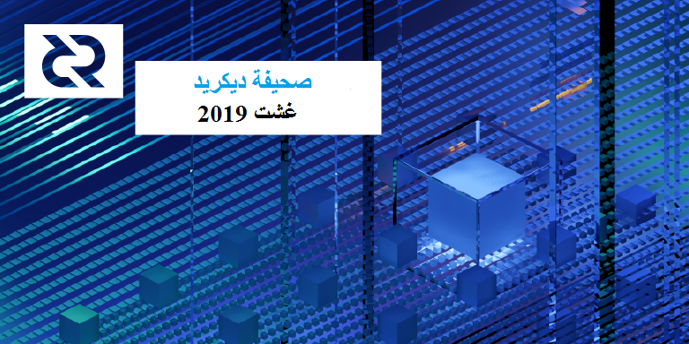

# صحيفة ديكريد لشهر غشت

_الصورة: تماثل المفتاح بواسطة saender@. عندما يتسق كل شيء، تولد أشياء عظيمة._

أهم أخبار شهر غشت:

* تم [الكشف](https://blog.decred.org/2019/08/28/Iterating-Privacy/) عن ميزة الخصوصية التي كانت شركة زيرو تعمل عليها بسرية وتم إصدار [التطبيق](https://github.com/decred/cspp/) الأولي وتمت [ملاحظة](https://twitter.com/decredproject/status/1167269901293297664) أول خلط على الشبكة الرئيسية. انظر الفرع المتعلق بالخصوصية أدناه.
* [بدأ](https://github.com/decred/dcrdex) تطوير DEX (منصة التبادل اللامركزي لديكريد)، بعد اعتماد [اقتراح](https://proposals.decred.org/proposals/417607aaedff2942ff3701cdb4eff76637eca4ed7f7ba816e5c0bd2e971602e1) بقيادة chappjc@ و buck54321@ بمبلغ يصل إلى 230،000 دولار أمريكي لتمويل (بدعم يصل إلى 90٪).
*  تجاوزت النسبة المئوية لوحدات DCR المقفلة في تذاكر إثبات الحصة 50٪ من الوحدات المتداولة لأول مرة في 15 غشت. يشير هذا، إلى جانب ارتفاع سعر التذكرة، إلى أن ثقة حاملي ديكريد تتزايد بمرور الوقت، حيث يختار عدد أكبر من حاملي ديكريد الإقفال الزمني لوحدات DCR الخاص بهم للمشاركة في الحوكمة.
* أشار أصحاب الحصص لديكريد إلى رغبتهم في تمويل صانع السوق لمعالجة مشكلات السيولة (موافقة بنسبة 87 ٪). التصويت على المقترحات المقدمة من i2 Trading و Grapefruit Trading و Tantra Labs في 4 سبتمبر، تنافسي للغاية، حيث حظيت المقترحات الثلاثة بدعم يتفاوت بين 50 و 62٪ من وقت النشر. للاطلاع على مزيد من التفاصيل، انظر قسم الحوكمة.

## الخصوصية

تم نشر [تدوينة](https://blog.decred.org/2019/08/21/Surveying-the-Privacy-Landscape/) ل jy-p@ بعنوان "فحص المنظر العام للخصوصية" في 21 غشت. يتناول هذا المنشور المقايضات المرتبطة بمناهج مختلفة لخصوصية العملة الرقمية ويستعرض إيجابيات وسلبيات النهج الذي تتبعه مونيرو و زيكاش و غرين و بيم وداش و محفظة واسابي للبتكوين.

تم نشر التفاصيل الأولى لميزة الخصوصية للعامة والتي طورتها الشركة زيرو بسرية بواسطة jz@ في [حلقة](https://unchainedpodcast.com/after-years-of-secret-work-decred-adds-a-new-feature-privacy/) على برنامج Unchained Podcast للورا شين في 27 غشت.

في 28 غشت نشر jy-p@ في المدونة [مقالا](https://blog.decred.org/2019/08/28/Iterating-Privacy/) يقدم وصفًا للنهج الذي تتبعه الشركة زيرو تجاه الخصوصية، ويشرح السبب وراء هذا الاختيار. وقد تم النظر فقط في النهوج المتبعة التي من شأنها أن تسمح بتشذيب المعاملات المنفقة، مع تفضيل الحلول الأقل تعقيدًا التي تتيح الحفاظ على إمكانية تدقيق حسابات وحدات DCR. ويقدم موضوع هذه [التغريدة](https://twitter.com/decredproject/status/1166746979160023046) مقدمة أكثر إيجازا، كما كتب Dustorf@ أيضا [تدوينة](https://medium.com/@dlefebvr/decred-privacy-taking-the-long-road-62d218223db6) تتناول أهمية الخصوصية وتقدم منظورا أقل تقنية عن كيفية عمل النهج الجديد. وقد سجل jy-p@ أيضًا [حلقة](https://twitter.com/decredproject/status/1168558002867191808) مدتها ساعة واحدة من ديكريد في العمق مع anshawblack@ ركز فيها على الخصوصية، حيث ناقش مواضيع من التهرب من مراقبة النظام الرأسمالي إلى السبب وراء أن النهج المختلفة كانت أكثر أو أقل ملاءمة لديكريد. كما تعاون كل من anshawblack@ و GhostWridah أيضًا في إنتاج موسيقى الراب مدتها دقيقة واحدة حول ديكريد والخصوصية.

يعتمد النهج على بروتوكول ++CoinShuffle، و الذي تم دمجه بداخل عملية شراء التذاكر بحيث يمكن لأصحاب الحصص الاشتراك في خلط عملاتهم عند شراء التذاكر. وأيضا الفئات الأصغر قيمة متاحة لمزج المعاملات العادية (غير المحصصة). ويتناول البروتوكول إمكانية التعقب (من الذي يرسل إلى من) ولكنه لا يخفي المبالغ. كما يعتمد الحل على خادم مركزي لتنسيق الخلط - يتم تسريب المعلومات حول عناوين المدخلات والعناوين المتغيرة إلى الخادم ولكن ليس إلى النظراء الآخرين المشاركين في المزيج، كما أن عناوين المخرجات مجهولة بالكامل. وبما أن الخلط يحدث خارج السلسلة، فلم تكن هناك حاجة لتغيير قواعد خوارزمية الإجماع. ونظرًا لأن الشركة زيرو قد مولت جميع عمليات التطوير حتى هذه المرحلة، لم تكن هناك حاجة إلى وضع اقتراح في بوليتيا من أجل التمويل.

يعمل الإصدار الأولي فقط لمستخدمي واجهة سطر الأوامر لdcrwallet. وسوف يستغرق المزج بعض الوقت لإدماجه في ديكريديتون، ولكي يتاح للمستخدمين الذين يستعملون موفري خدمات التصويت، سيلزم إدخال تحسينات كبيرة على dcrstakepool. في المدى البعيد سوف ينظر الى المعاملات السرية مع (Bulletproofs).ويمكن استخدام هذه لإخفاء المبالغ، والتي من شأنها تعزيز الخصوصية وتجنب الحاجة إلى المزج المطول لتَبْدِيل القادم من المعاملات. سيتطلب هذا النوع من التطوير إجراء تغييرات على قواعد خوارزمية الإجماع، وبالتالي سوف يمر بعملية الحوكمة العادية.

## التطوير

[dcrd](https://github.com/decred/dcrd): تم [تقديم](https://github.com/decred/dcrd/pull/1808) وحدة نمطية جديدة باسم `سلسلة الكتل/الإعداد المستقل`، والتي تهدف إلى توفير العديد من الوظائف المستقلة المتوفرة حاليًا في وحدة `سلسلة الكتل`. والهدف الأساسي من تقديم هذه الوظائف عبر وحدة منفصلة هو تقليل التبعيات لكود العقدة. كما سيكون مفيدًا أيضًا للتطبيقات مثل العقد الخفيفة التي تحتاج إلى ضمان امتلاك خصائص الأمان الأساسية وحساب دعم التصويت المناسب. واغتنمت الفرصة لكتابة وظائف أكثر قوة وأداء لتحل محل الوظائف الواردة في وحدة `سلسلة الكتل` في الإصدار الرئيسي التالي. وستزود الوحدة الجديدة باختبارات شاملة، ووثائق الحزمة الكاملة وأمثلة على الاستخدام الأساسي.

أدخلت إصدارات رئيسية جديدة من وحدات [`سلسلة الكتل`](https://github.com/decred/dcrd/pull/1823)، و[`التعدين`](https://github.com/decred/dcrd/pull/1831)، و[`connmgr`](https://github.com/decred/dcrd/pull/1833)، و[`النظراء`](https://github.com/decred/dcrd/pull/1834)، و[`الميمبول`](https://github.com/decred/dcrd/pull/1835) للاستفادة من إصدارات الوحدات الرئيسية الجديدة الأخرى. كما تم [تحديث](https://github.com/decred/dcrd/pull/1837) الوحدة الرئيسية أيضًا لاستخدامهم جميعًا، مما يمثل نهاية سلسلة تحديث الوحدة النمطية في الوقت الحالي. وتتمثل الفائدة الإجمالية في أنه يقوم بتحديث dcrd للاستفادة من جميع تحديثات الكود الأخيرة ويقلل بشكل كبير من مقدار التغيير المستقبلي الضروري في الوحدات المعينة عندما تستلزم تغييرات في واجهة برمجة التطبيقات التي تشكل انقطاع دلالي في الإصدار.

تلقت وحدة `gcs` [تحسينات](https://github.com/decred/dcrd/pulls?q=is%3Apr+is%3Aclosed+merged%3A2019-08-01..2019-08-31+gcs) متعددة لجعلها بمستوى الجودة المطلوب الذي يتطلبه كود خوارزمية الإجماع لإدراجه في [رَأْسِيَّة الإلتزامات](https://proposals.decred.org/proposals/0a1ff846ec271184ea4e3a921a3ccd8d478f69948b984445ee1852f272d54c58). وقد تمت [إضافة](https://github.com/decred/dcrd/pull/1854) الدعم لتحقيق معدل إيجابي زائف مستقل وحجم برمجة الواجهة البينية الثنائية لGolomb. وهذا سيتيح ، ضمن جملة أمور أخرى، بمزيد من المعايير المثلى للتقليل إلى أدنى حد من حجم المرشح الذي يتعين تحديده. وستستخدم هذه الإمكانية في مرشحات الإصدار 2 القادمة التي ستدرج في نهاية المطاف في رَأْسِيَّة الإلتزامات. تميزت دورة تطوير النسخة 2 من الوحدة النمطية أيضًا ببداية [نهج جديد](https://github.com/decred/dcrd/pull/1843) نحو معالجة تعيين الإصدار بين دورات الإصدار لتخفيف عبء الصيانة.

تم [نسخ](https://github.com/decred/dcrd/pull/1811) تنفيذ Blake256 في مستودع dcrd حتى لا يكون ل dcrd تابعية خارجية بعد الآن. وفي حين أنه تم [قبول](https://github.com/dchest/blake256/pull/3) التحسينات المطلوبة بواسطة dcrd في المرحلة الأولية، إلا أنه لا يزال من المستحسن أن يكون هناك إجماع على التعليمات البرمجية الحرجة تحت رقابة مشددة من مشرفي dcrd لتجنب الحالات المذكورة [هنا](https://github.com/decred/dcrd/issues/1810).

تم دمج [اكتشاف العنوان](https://github.com/decred/dcrd/pull/1522) التلقائي. والذي سيسمح للمستخدمين الذين يقفون وراء ترجمة عنوان الشبكة بتشغيل العقد الكاملة القابلة للاكتشاف دون تحديد `externalip--`.

ازدادت التغطية الاختبارية وتمت تقويتها في مناطق متعددة من قاعدة البيانات.

[بدأ](https://github.com/decred/dcrd/pull/1829) العمل لزيادة رسوم قالب الكتلة إلى أقصى حد استنادا إلى سلاسل المعاملات في الميمبول.

[dcrwallet](https://github.com/decred/dcrwallet): تمت إضافة [RPC](https://github.com/decred/dcrwallet/pull/1522) جديد يتيح للمستخدم التخلي عن (أو إزالة) معاملة غير مؤكدة من المحفظة، وأي معاملات أخرى تعتمد على مخرجاتها. RPC جديد آخر يسمح بتصدير [المفتاح الخاص الموسّع](https://github.com/decred/dcrwallet/pull/1533) لحساب ما بعد فتح المحفظة.

صيانة الكود: تم التحديث لاستخدام الوحدات النمطية الجديدة في dcrd و[إزالة](https://github.com/decred/dcrwallet/pull/1531) استخدامات الوحدات القديمة، و[تحسين](https://github.com/decred/dcrwallet/pull/1539) التوافق مع أخطاء Go 1.13.

بدأ العمل لإضافة [دعم](https://github.com/decred/dcrwallet/pull/1541) لإنشاء معاملات CoinJoin لمعاملات "تقسيم" شراء التذاكر، وكذلك مزج مخرجات تغيير المزيج الفردي إلى قيم عملة أصغر.

[ديكريديتون](https://github.com/decred/decrediton): تعديلات على واجهة المستخدم، إصلاح الأخطاء، وتنظيف الكود.

تم [الانتهاء](https://github.com/decred/decrediton/pull/2163) من [الوضع الليلي](https://github.com/decred/decrediton/issues/2089) الأولي. و يستمر العمل على جعل واجهة المستخدم سريعة الاستجابة، مع [إضافة](https://github.com/decred/decrediton/pull/2174) أربع طرق عرض جديدة مستجيبة.

[بوليتيا](https://github.com/decred/politeia): يسير العمل على إعادة تصميم بوليتيا بخطى سريعة، مع دمج [عدد](https://github.com/decred/politeiagui/pull/1356) [من](https://github.com/decred/politeiagui/pull/1338) [طلبات السحب](https://github.com/decred/politeiagui/pull/1360) التي تضيف الوظائف الحالية إلى الواجهة المعاد تصميمها. في الخلفية، تم [دمج](https://github.com/decred/politeia/pull/980) العمل المهم الذي يرسي الأسس [لعملية تخليص متعاقدي ديكريد](https://proposals.decred.org/proposals/fa38a3593d9a3f6cb2478a24c25114f5097c572f6dadf24c78bb521ed10992a4)، والتي سيتم دمجها في نظام إدارة المتعاقد.

وكانت مسألة كيفية تأييد المقترحات من نوع "طلب تقديم مقترحات" على بوليتيا موضوع مناقشة في هذه [المسألة](https://github.com/decred/politeia/issues/966) وفي politeia# (انظر الحوكمة لمزيد من التفاصيل).

تم تحويل تسجيل الدخول بواسطة اسم المستخدم مرة أخرى إلى البريد الإلكتروني [لمنع إقفال الحسابات المستهدف](https://github.com/decred/politeia/issues/860#issuecomment-520871500). ستحل [2FA](https://github.com/decred/politeia/issues/544) هذه المسألة وتسمح بتسجيل الدخول دون إستخدام البريد الإلكتروني.

[dcrdex](https://github.com/decred/dcrdex): تم [الإعلان](https://twitter.com/decredproject/status/1156652694502817793) عن مستودع dcrdex في يوليوز ليضم [مواصفات](https://github.com/decred/dcrdex/tree/master/spec) التبادل اللامركزي، وتم [فتح](https://github.com/decred/dcrdex/pull/17) طلبات السحب الأساسية الأولى بالفعل. كما تم إنشاء غرفة [dexdev#](https://riot.im/app/#/room/!EzTSRQITaqHuFBDFhM:decred.org) جديدة أيضًا لإجراء دردشة حول تطوير منصة التبادل اللامركزية على الماتريكس.

[cspp](https://github.com/decred/cspp): يوفر هذا المستودع الجديد تطبيقات العميل والخادم لتنفيذ بروتوكول خلط [++CoinShuffle](https://crypsys.mmci.uni-saarland.de/projects/FastDC/paper.pdf). وفي حين أنه يعتزم استخدامه لإنشاء معاملات CoinJoin لديكريد، فإن حزم العميل والخادم غَيْر مُسَجَّلة بما يكفي لخلط عناصر أي مجموعة والانضمام إليها بشكل مجهول.

قبل ++CoinShuffle، طورت الشركة زيرو تطبيق Go لبروتوكول TumbleBit. على الرغم من عدم إدماجه في ديكريد، تم إصدار الكود للمنفعة العامة في مستودع [tumblebit](https://github.com/decred/tumblebit).

[dcrstakepool](https://github.com/decred/dcrstakepool): بدأت [الجهود](https://github.com/decred/dcrstakepool/pulls?q=is%3Apr+is%3Aclosed+227) الكبيرة [لفصل](https://github.com/decred/dcrstakepool/issues/227) dcrstakepool عن dcrwallet في أبريل، و [إنتهت](https://github.com/decred/dcrstakepool/pull/470) أخيرا. يقلل هذا التغيير من تعقدية الكود ويقلل من كمية نداء الإجراء البعيد الذي يتم عبر الشبكة، مما يعزز بدوره الأداء ويزيد من الأمان.

اكتسب مشغلو خدمات التصويت دعما لبروتوكول إرسال البريد البسيط SMTPS لإرسال التسجيل واستعادة الحسابات عبر الاتصالات المشفرة (بما في ذلك [الشهادات الموقعة ذاتيا](https://github.com/decred/dcrstakepool/pull/486))، وتحسين [صفحة الحالة](https://github.com/decred/dcrstakepool/pull/484)، وتحسين الإبلاغ عن الأخطاء.

تم إضافة [عُدَّةُ اختبار](https://github.com/decred/dcrstakepool/pull/476) tmux لتعزيز إنتاجية الاختبار.

تم دمج [30 طلب سحب](https://github.com/decred/dcrstakepool/pulls?q=is%3Apr+is%3Aclosed+merged%3A2019-08-01..2019-08-31) في المجموع.

[dcrlnd](https://github.com/decred/dcrlnd): يتعلق العمل المدمج في غشت بإدخال تحسينات على استقرار الاختبارات والأعمال الأولية لدعم استخدام المحافظ الموجودة (لا يوجد حاليا سوى محفظة مدمجة في dcrlnd).

تم [نقل](https://github.com/decred/dcrlnd/pull/36#issuecomment-526721084) المزيد من العمل التمهيدي على lnd ويتم اختباره قبل الدمج في dcrlnd. وتم تعديل ما مجموعه 400 طلب سحب و 1700 سطرا من الكود.

> للحفاظ على المزامنة، احتجنا إلى تكييف كل إيداع إلى حد كبير بعد نقطة الدمج في 10 يناير ([matheusd@](https://twitter.com/matheusd_tech/status/1169194706636615680))

واكتسب صنبور الشبكة البرقية استمارة [لدفع الفواتير](https://github.com/decred/lightning-faucet/pull/8) و[مؤشرات](https://github.com/decred/lightning-faucet/pull/14) إعداد جديدة.

[dcrandroid](https://github.com/decred/dcrandroid): يجري العمل لتنفيذ [واجهة المستخدم الجديدة](https://github.com/decred/dcrandroid/pull/400) التي ستجعل التطبيق متوافقًا مع توصيات تصميم التطبيقات القياسية لنظام الأندرويد. والعمل جار أيضا على الواجهة الخلفية للحصول على دعم [المحفظات المتعددة](https://github.com/decred/dcrandroid/issues/188) والذي سيمكن [فقط من مراقبة](https://github.com/decred/dcrandroid/issues/393) محافظ التذاكر.

[dcrios](https://github.com/raedahgroup/dcrios): العمل مستمر على واجهة المستخدم المحسّنة ودعم محفظة المراقبة فقط بشكل مماثل لتطبيق الأندرويد.

[dcrdata](https://github.com/decred/dcrdata): أدرجت تحديثات من dcrd، تعديل واجهة المستخدم، والتحسينات وإصلاح الأخطاء.

كان هناك تغيير كبير على قائمة Todo لفترة طويلة يخص [إسقاط SQLite](https://github.com/decred/dcrdata/pull/1480). يجعل هذا بنية قاعدة البيانات أبسط بكثير، ويتطلب فقط PostgreSQL، ويجعل إنشاء cgo-free (فقط GO، دون C).

هناك إعادة تصميم متزايدة، لكن تطوير الواجهة الخلفية في الغالب في وضع الصيانة الآن حيث يتحول تركيز المساهمين الرئيسيون إلى dcrdex. لا يزال هناك مجال كبير لتحسين dcrdata والتوسع، وخاصة مع المعاملات المختلطة.

[المستندات](https://github.com/decred/dcrdocs): تمت [إضافة](https://github.com/decred/dcrdocs/pull/968) صفحة جديدة تتضمن تفاصيل [المقايضة الذرية](https://docs.decred.org/advanced/atomic-swap/) ومعلومات دعم [محفظة الحاسوب](https://docs.decred.org/wallets/hardware-wallets/) [المحدّثة](https://github.com/decred/dcrdocs/pull/979) وعمليات التنظيف البسيطة.

وقد بدأ العمل في موقع [وثائق المطور](https://github.com/decredcommunity/issues/issues/135) منفصل تم طلبه منذ وقت طويل. ويجري العمل الأولي في مستودع شخصي سيتم نقله تحت Decred GitHub org الرئيسي عند إطلاق الموقع.

[decred.org](https://github.com/decred/dcrweb): تم [تحديث](https://github.com/decred/dcrweb/pull/695) خريطة الطريق بالتطورات الجديدة، وتم تحديث [صفحة التغطية الصحفية](https://github.com/decred/dcrweb/pull/706) بالتغطية الحديثة، وتمت [إضافة](https://github.com/decred/dcrweb/pull/712) الخصوصية إلى الصفحة الرئيسية وخريطة الطريق.

إحصائيات نشاط التطوير لشهر غشت: 244 من المشاريع النشطة، 274 إيداع رئيسي، 46 ألف إضافة، 24 ألف عملية حذف من خلال 15 سجلات. جاءت المساهمات من 2-9 مطورين لكل سجل.

## الأشخاص

مرحبا بالمساهمين الجدد مع دمج الكود إلى الماستر: aarcamp (على [dcrd](https://github.com/decred/dcrd/commits?author=aarcamp))، skipcheru (على [dcrandroid](https://github.com/decred/dcrandroid/commits?author=skipcheru))، RyanBRiley (على [بوليتيا](https://github.com/decred/politeia/commits?author=RyanBRiley))، UferePease (على [dcrstakepool](https://github.com/decred/dcrstakepool/commits?author=UferePease))، fguisso (على [lightning-faucet](https://github.com/decred/lightning-faucet/commits?author=fguisso)).

إحصائيات المجتمع:

* مستخدمي بوليتيا: 174 (+20)
* متابعو التويتر: 40,597 (+25)
* المشتركين في ريديت: 9,594 (+38)
* مستخدمي الماتريكس: 412 (+28)
* مستخدمي السلاك: 6,834 (+25)
* مستخدمي الديسكورد: 2,442 (+65)7 تم التحقق من 310 (+29) ليقوموا بالتعليق.
* مستخدمي التيليغرام: 3,148 (-142)
* المشاركين في اليوتيوب: 3,819 (+19)
* متابعي الفيسبوك: 3,271 (+18)، إعجاب: 2,999 (+16)
* متابعي  لينكد إن: 603 (+12)
* نجوم Github dcrd: بلغت 516 (+18)، تفرعات: 1,383 (+18)

عقب [الفعاليات](https://github.com/decredcommunity/events/blob/master/reports/20190725-cointime-summit-ho-chi-minh-city-vietnam.md) التي نظمت في مدينة Ho Chi Minh، تم إنشاء حسابات [تيليغرام](https://t.me/decredvietnam)، [تويتر](https://twitter.com/DecredVietnam) و [فايسبوك](https://www.facebook.com/Decred-DCR-Vietnam-108991833777572/) فييتنامية. توجد قائمة بجميع مجموعات التواصل الإجتماعي لديكريد [هنا](https://github.com/decredcommunity/wiki/blob/master/wiki/social-media.md).

## الإدارة و الحوكمة

تلقت [الخزنة](https://explorer.dcrdata.org/address/Dcur2mcGjmENx4DhNqDctW5wJCVyT3Qeqkx) في شهر غشت 15,278 DCR وأنفقت 8,223 DCR. باستخدام معدل المتوسط اليومي لشهر غشت ب DCR/USD والذي يقدر ب 26.23 دولارًا، ستكون الخزينة قد تلقت 401 ألف دولارا وأنفقت 216 ألف دولارا. حيث أن هذه المدفوعات كانت مخصصة للعمل الذي تم إنجازه في شهر يوليوز، و من المفيد أيضًا أخذها في الاعتبار في سياق متوسط ​سعر يوليوز اليومي الذي بلغ 28.97 دولارًا - وفي هذه الحالة يبلغ المبلغ المنفق 238 ألف دولار. اعتبارًا من 9 غشت، بلغ رصيد الخزينة 638 DCR (أي ما يعادل 15.8 مليون دولار أمريكي بقيمة 24.80 دولارًا أمريكيًا).

تم تقديم [اقتراح](https://proposals.decred.org/proposals/417607aaedff2942ff3701cdb4eff76637eca4ed7f7ba816e5c0bd2e971602e1) لتطوير التبادل اللامركزي من قبل chapjc@ و buck54321@ (الذين يعملون على بيانات dcr)، بدعم من الشركة زيرو - و تمت الموافقة عليه بنسبة أصوات بلغت 90% بنعم. تبلغ تكلفة هذا الاقتراح 230,000 دولارًا لتقديم تطبيق واجهة سطر الأوامر، والذي يمكن تمديده عن طريق المقترحات المستقبلية لتقديم واجهة مستخدم باستخدام إطار عمل الإلكترون.

يحتوي [مستودع](https://github.com/decredcommunity/proposals) مقترحات مجتمع ديكريد [فهرسا](https://github.com/decredcommunity/proposals/blob/master/dex/index.md) للمواد المتعلقة بالتبادل اللامركزي.

نشرت 3 مقترحات لصناع السوق في 7 غشت، من قبل [Altonomy](https://proposals.decred.org/proposals/772d083fef79fa2e443d8424b353deadc3af69c8d8764e473cb200f98f356c60) و [i2 Trading](https://proposals.decred.org/proposals/2eb7ddb29f151691ba14ac8c54d53f6692c1f5e8fe06244edf7d3c33fb440bd9) و [Grapefruit Trading](https://proposals.decred.org/proposals/4becbe00bd5ae93312426a8cf5eeef78050f5b8b8430b45f3ea54ca89213f82b). وبعد بضعة أيام من المناقشة، كان الموضوع المهيمن هو ما إذا كان ينبغي استخدام الخزينة لتوظيف صانعي السوق على الإطلاق. قدم jz@ [طلبًا لاقتراح ](https://proposals.decred.org/proposals/30822c16533890abc6e243eb6d12264b207c3923c14af42cd9b883e71c7003cd) لتحديد ما إذا كان أصحاب الحصص يريدون توظيف صانع سوق معين مبدئيا. شرح المقترح الأعمال التي قام بها كل من jz@ و maxbronstein@ و Chris Burniske قبل تقديم المقترحات - وقدم حجة للموافقة على أحد هذه المقترحات. أوضح طلب الاقتراح أيضًا شروط التصويت (ويمكن الموافقة على اقتراح صانع سوق بحد أقصى قدره 1 ويجب أن يفي بالمعايير المعتادة).

قدم Altonomy اقتراحًا بتقديم 50 ألف دولار لكل جانب على 10 أزواج، وقد شاركوا بنشاط في بوليتيا وقدموا إجابات على العديد من الأسئلة، ولكن في 16 غشت، سحبوا اقتراحهم، وقاموا بتعديله ليقولوا "آسفون، نظرًا لقدرتنا التقنية، قررنا سحب هذا الاقتراح".

قدم i2 Trading اقتراحًا بتقديم 50 ألف دولار لكل جانب على 6 أزواج، شاركوا بنشاط في بوليتيا وفي قناة proposals#، مجيبين على أغلبية الأسئلة. واستجابةً للمخاوف المتعلقة بالشفافية، عرضت i2 إتاحة القراءة لممثل ديكريد لحساباتها في منصات التداول لفترات زمنية محدودة. كما أجرت i2 عددًا من التعديلات على اقتراحهم، لإضافة ملاحظة حول توفير الوصول إلى واجهة برمجة التطبيقات، وتوضيح الحاجة إلى الاقتراض والشروط، ثم تعديل عرضهم لتخفيف الفارق، مع خفض الحد الأقصى لسداد رسوم التداول إلى 10 آلاف دولار شهريًا، وخفض رسوم تقديم الخدمة من 40 ألف دولار شهريًا إلى 35 ألف دولار شهريًا.

بدأ Grapefruit بعرضين في اقتراحهما (كلاهما بقيمة 30 ألف دولار لكل جانب على 4 أزواج)، واحد بفارق أضيق قد يكلف 40 ألف دولار شهريًا من الرسوم والآخر بفارق أقل يكلف 28 ألف دولار شهريًا. أجاب grapefruittrading@ على أسئلة على بوليتيا في 8 و 20 غشت، متجاهلاً بعض الأسئلة مع تقديم [ردود](https://proposals.decred.org/proposals/4becbe00bd5ae93312426a8cf5eeef78050f5b8b8430b45f3ea54ca89213f82b/comments/5) [موضوعية](https://proposals.decred.org/proposals/4becbe00bd5ae93312426a8cf5eeef78050f5b8b8430b45f3ea54ca89213f82b/comments/6) على أسئلة أخرى. قبل السماح بالتصويت للبدء، قام grapefruittrading@ بتعديل اقتراحه لإلغاء العرض الأكثر تكلفة، واختاروا الترشح مع العرض الأقل تكلفة  للإستجابة لطلب من أصحاب الحصص وكان الخيار المفضل لديهم على أي حال.

وأذن كل من i2 و Grapefruit بالتصويت لبدء مقترحاتهما في 27 غشت.

قدمت Tantra Labs [اقتراحا](https://proposals.decred.org/proposals/82ce113827140caaaf8b5779ab30402d3ed39f1911fdd2e8fa64cf0dc9e09ecb) في 28 غشت والذي عرض إقتراحا مختلفا جدا، 30 ألف دولار لكل جانب بنسبة تصل إلى 3 ٪ موزعة على 6 ([أو 7](https://proposals.decred.org/proposals/82ce113827140caaaf8b5779ab30402d3ed39f1911fdd2e8fa64cf0dc9e09ecb/comments/8)) أزواج، مع عدم وجود رسوم لتقديم الخدمة التي يتم تكليفها إلى الخزينة. بدلاً من ذلك، سيتم فرض رسوم على الخزينة فقط مقابل تكلفة اقتراض المخزون وحتى 10 آلاف دولار شهريًا كرسوم التداول. عرضت Tantra السماح بإتاحة القراءة فقط على حسابات التبادلات الخاصة بهم لممثلي ديكريد "المنتخبين"، بحيث يمكن التحقق من توافر السيولة الموعود بها. وهناك الكثير من النقاشات حول اقتراح تانترا تتعلق بما إذا كان من الجيد أن يكون صحيحًا، حيث عبر عدد من الأشخاص عن شكوكهم في أن تانترا يمكنها تقديم ما يقترحونه، ويتساءلون عما إذا كانت التكلفة المنخفضة ستأتي مع سلبيات مخفية. لقد كانت Tantra نشطة في proposals# وأجابت على بعض الأسئلة في بوليتيا. بعض أعضاء المجتمع أصبحوا غير صبورين في انتظار تانترا لتأذن ببدء التصويت، مما ألقى الضوء على قضية طلبات تقديم المقترحات التي تم إبطاؤها من خلال التقديمات المتأخرة، وإبراز قيمة وضع جدول زمني محدد.

تم نشر [اقتراح](https://proposals.decred.org/proposals/c9604f7879e4b2cd4f2582d238a7ccea210005c63481bec1ddae44ff93e1340f) رابع عن صناعة السوق، قدمه betterfuture@، في 31 غشت. و يقترح هذ الأخير خطة لتحفيز صانعي السوق على توفير السيولة على أزواج محددة دون التزام ثابت. يصف الاقتراح القواعد والعقوبات للحفاظ على إلتزام المشاركين، وسيتطلب وسيط موثوق به يمثل مشروع ديكريد لتدقيق أنشطة صناع السوق. وقد رشح jz@ لهذا الدور في الاقتراح، ولكنه ذكر أنه لا يرغب في تولي هذا الدور. يُنظر إلى مداولات هذا الاقتراح وتنقيحه على أنه  جهد طويل المدى  من جانب مقدميه، ولن يكون منافسًا للاقتراحات الأخرى.

بدأ التصويت على مقترحات صانع السوق الثلاثة في 4 شتنبر.

لمزيد من التفاصيل حول مقترحات صانع السوق وأنشطة بوليتيا الأخرى، راجع بوليتيا دايجست [العدد 20](https://github.com/RichardRed0x/politeia-digest/blob/master/issue-020.md) (1-12 غشت) و[الإصدار 21](https://github.com/RichardRed0x/politeia-digest/blob/master/issue-021.md) (13-31 غشت). وهناك أيضا عدد من الموارد التي ينتجها المجتمع والتي تهدف إلى مساعدة الأشخاص الجدد على فهم فكرة صنع السوق، والتي تعقد مقارنات بين مختلف المقترحات:

* ويحتفظ [هنا](https://github.com/decredcommunity/proposals/blob/master/market-makers/index.md) بفهرس لجميع الوثائق والمناقشات الهامة المتعلقة بصانعي السوق.
* يهدف [جدول المقارنة](https://github.com/decredcommunity/proposals/blob/master/market-makers/comparison.md) إلى مقارنة المقترحات من حيث العروض والتكاليف — يبلغ الحد الأقصى للرسوم الشهرية المقدرة في هذا الجدول 17 ألف دولار لتانترا، 53 ألف دولار ل i2 و 31 ألف دولار ل Grapefruit (بالنسبة لتانترا و i2، يتم فرض رسوم تداول بحد أقصى 10 آلاف دولار شهريًا).
* كتب bee@ [نظرة عامة](https://github.com/decredcommunity/proposals/blob/master/market-makers/arguments.md) شاملة عن المناقشة فيما يتعلق بأسئلة وحجج محددة، و [حلل](https://github.com/xaur/writings/blob/master/20190822-dissection-market-makers-for-decred.md) الموضوع بتفصيل، مقدما المصطلحات ذات الصلة ونظرة عامة عن الاعتبارات الرئيسية.
* أنتج exitus@ نظرة عامة عن المقترحات مسجلة على [شريط فيديو](https://www.youtube.com/watch?v=BKSMA-eanoY).

بعد المناقشة في قناة research#، بدأ richardred@ في جمع بيانات دفتر الطلبات لمجموعة من الأزواج والتبادلات في هذا [المستودع](https://github.com/RichardRed0x/exchange-data). الهدف هو بناء صورة أفضل عن كيفية ظهور دفتر الطلبات لـ DCR وغيرها من أصول العملات الرقمية المختارة حاليًا، وقد أعد تقرير أولي قبل التصويت على مقترحات صانعي السوق. وستكون هذه البيانات مفيدة أيضا لتتبع دفاتر الطلبات بمرور الوقت لمراقبة تأثير صانع السوق، إذا ما تم التعاقد معه. و من المحتمل أن تتم إضافة بيانات دفتر الطلبات إلى عرض بيانات dcrdata الخارجية في مرحلة ما، ولكن طبيعة هذه البيانات لا يمكن تسجيلها مباشرة. والمصادر الوحيدة لبيانات دفتر الطلبات التاريخية هي مصادر امتلاكية و[مكلفة](https://www.kaiko.com/products/binance-10-order-books).

تجدر الإشارة إلى [مستودع](https://github.com/decredcommunity/proposals) مقترحات مجتمع ديكريد، حيث يمكن العثور على عدد من الموارد المذكورة أعلاه. وقد أنشئ هذا المستودع كمكان لجمع المعلومات المنبثقة عن مناقشة المقترحات وتحليلها.

نتج عن التعامل مع مقترحات صانع السوق وطلب عملية الاقتراح الكثير من المناقشات وووجهات النظر، ويتم إعداد الإدماج الأولي لوظيفة طلب تقديم الاقتراح  على بوليتيا. وسيكون هناك اقتراح جديد من نوع طلب تقديم مقترح يمكن لمقترحات المرشحين ربطه به، وسيتم التحكم في التصويت وتحديد الخيارات/النتائج من خلال طلب تقديم الاقتراحات هذا. قبل فتح طلب تقديم مقترح، سيتم تقديم والموافقة على اقتراح عادي يسأل "هل ينبغي أن يكون لدينا طلب تقديم المقترح هذا" - وقد شهدت بوليتيا "طلب لتقديم المقترحات" حتى الآن من هذا النوع.

والنقطة الرئيسية للمناقشة بشأن النوع الجديد من طلبات تقديم المقترحات هي ما إذا كان ينبغي إجراء هذه المقترحات في شكل مقترحات متعددة الخيارات (حيث يمكن للناخبين التصويت لصالح خيار واحد من أصل N والذي يحوز على أغلبية الأصوات يفوز) أو كمقترحات موازية حيث يمكن أن تصوت التذاكر بنعم/لا على كل مقترح ويكون الفائز هو صاحب أعلى درجة بنعم ، لا يوجد عدد إجمالي للأصوات (حيث يتم إجراء تقديم مقترح صانع السوق). يبدو أن التصويت الموازي على المقترحات المتنافسة هو الأولوية، حيث من المرجح أن يأتي التصويت متعدد الخيارات في وقت لاحق ويستخدم لغرض مختلف (مثل الاقتراع).

تم إرسال [منشور](https://www.reddit.com/r/decred/comments/cutc16/decred_events_meetups_in_the_cis_in_20192020/) ريديت للتعليقات التي تهدف إلى أن تكون بمثابة اقتراح مسبق لتمويل فعاليات و لقاءات ديكريد الملقاة في رابطة الدول المستقلة (CIS) - وتحديدا روسيا وأوكرانيا وجورجيا.

## الشبكة

معدل الهاش: افتتحت معدلات الهاش  في شهر غشت على ~563 Ph/s وأغلقت على ~567 Ph/s، وبلغ قاعها عند 374 Ph/s كما بلغت ذروتها عند 671 Ph/s على مدار الشهر. توزيع معدلات الهاش للتجمع اعتبارا من 5 شتنبر حسب [dcrstats.com](https://dcrstats.com/pow):

* F2Pool بنسبة 23%،
* UUPool بنسبة 16%،
* Poolin بنسبة 16%،
* lab.antpool.com بنسبة 4.1%،
* BTC.com بنسبة 2.3%،
* Luxor بنسبة 1.8%،
* BeePool بنسبة 0.10%،
* Coinmine بنسبة 0.10%،
* suprnova بنسبة 0.01%،
* وأخرى بنسبة 36%.

أرقام توزيع التجمع تقريبية ولا يمكن تحديدها بدقة.

التحصيص: بلغ متوسط سعر التذكرة لمدة 30 يوما 130.05 DCR (أي بزيادة 4.25) حسب dcrstats.com. وتفاوت السعر بين 119.9 و134.5 DCR. وقد بلغ المبلغ المقفل 5.03-5.25 مليون DCR، وهو ما يعادل 49.40-50.93٪ من الإمدادات المتاحة.

العقد: طوال شهر [غشت](https://charts.dcr.farm/d/000000014/nodes?orgId=1&from=1564617600000&to=1567296000000)، كان هناك حوالي 167 عقدة استماع و 445-530 من العقد الإجمالية حسب dcr.farm. ما يقارب 78% يشغلون dcrd، و5.7% dcrwallet النسخة 1.4.0 و 6.2% يشغلون بناء قبل التطوير النسخة 1.5.0.

اعتبارًا من 5 شتنبر، تُظهر [الشبكة التجريبية للشبكة البرقية](https://charts.dcr.farm/d/DHPdAO4Wz/lightning-network?orgId=1) ل DCR يظهر 19 عقدة و 32 قناة وقدرة إجمالية قدرها 253 DCR.

تم ملاحظة [المعاملات](https://twitter.com/decredproject/status/1167269901293297664) الأولى التي تستخدم نظام الخصوصية الجديد.

## الإنضمام

[أضافت](https://twitter.com/exodus_io/status/1168886493617840131) Exodus  إمكانية إرسال واستلام وتبادل DCR إلى محفظة الجوال الخاصة بهم.

[أعلنت](https://twitter.com/ellipalwallet/status/1163771448042803201) المحفظة الباردة لإيليبال أن محفظتهم القادمة "air-grapped hardware wallet Titan" ستدعم ديكريد.

تحذير: ليس لدى مؤلفي مجلة صحيفة الديكريد أي فكرة عن جدارة أي من منصات التبادل المذكورة أعلاه. رجاء قم بأبحاثك الخاصة قبل أن تثق بمعلوماتك الشخصية أو ممتلكاتك لأي كيان.

## الانتشار

تمت تنحية جزء كبير من عمل التبني أثناء إجرائه، حيث ركزنا على إصدار خصوصية ديكريد. تم نشر تدوينة من قبل jy-p@ عن "[فحص المنظر العام للخصوصية](https://blog.decred.org/2019/08/21/Surveying-the-Privacy-Landscape/)" في 21 غشت. تم دعم هذا العمل من خلال [تغريدة عاصفية](https://twitter.com/decredproject/status/1164245224274767873) والتي ولدت مشاركة مباشرة من fluffypony و Zooko و جماعة MimbleWimble. وقد إنبثقت أول تفاصيل عن الخصوصية عندما ظهر jz@ على [بودكاست Unchained](https://unchainedpodcast.com/after-years-of-secret-work-decred-adds-a-new-feature-privacy/) للورا شين للحديث عن ديكريد وميزته الجديدة.

بعد أربع وعشرين ساعة، أصدرت The Block، أول خبر مكتوب حول خصوصية ديكريد، بالتزامن مع نشر مقال jy-p@، [تكرار الخصوصية](https://blog.decred.org/2019/08/28/Iterating-Privacy/)، والذي استكشف بعمق الدوافع وتفاصيل العمليات والقيود والخطوات التالية لخصوصية الديكريد. تم دعم هذا مع [تغريدة عاصفية](https://twitter.com/decredproject/status/1166746979160023046) من 10 أجزاء، والتي حصلت على الكثير من الاهتمام والمشاركة. تلقى تطبيق الخصوصية لديكريد تغطية مكثفة ، مفصلة في وسائل الإعلام ، باستثناء CoinDesk.

لمواصلة دعم إصدار الخصوصية، أصدر anshawblack@ [تدفق الخصوصية](https://twitter.com/decredproject/status/1169011789255925762)، مع GhostWridah ، وأيضًا [حلقة](https://twitter.com/decredproject/status/1168558002867191808) خاصة لديكريد في العمق تضم jy-p@ بعد أيام فقط من الإصدار. في هذه الحلقة، تعمق jy-p@ بشدة في اقتصاد المراقبة، لماذا الخصوصية مهمة، والوضع الحالي والمستقبل لخصوصية الديكريد.

في وقت النشر، يواصل فريق ديتو العمل على إيجاد طرق للحفاظ على خصوصية ديكريد ضمن الشواغل الرئيسية، ويبدو أنها قضية جاءت في الوقت المناسب مع [الأخبار الأخيرة عن مخالفات جوجل](https://www.ft.com/content/e3e1697e-ce57-11e9-99a4-b5ded7a7fe3f). بالإضافة إلى ذلك ، نشر Dustorf@ [مدونة](https://medium.com/@dlefebvr/decred-privacy-taking-the-long-road-62d218223db6) تستهدف الجمهور الأقل تقنية.

وقد بذل برنامج الانتشار جهدا متضافرا لزيادة المشاركة على التويتر من خلال جودة المحتوى والتعليم فيما يتعلق بديكريد. وقد تجلى ذلك من خلال عدد مرات ظهور المشروع بأكثر من الضعف من يوليوز إلى أكثر من 5.6 مليون. إحدى الرسائل التي حصلت على أكبر قدر من الإجتذاب كانت [تغريدة عاصفية](https://twitter.com/decredproject/status/1156652694502817793) من أربعة أجزاء عند الإعلان عن مواصفات التبادل اللامركزي.

أكدت ديكريد على تواجدها بكشك في قمة [Web Summit](https://websummit.com/) في الفترة ما بين 4 و 7 نونبر في لشبونة، البرتغال، لذا يرجى التواصل معنا في غرفة التخطيط للفعاليات event\_planning# بالماتريكس إذا كنت مهتمًا بالمساعدة. نحن نخطط أيضًا لإجراء عرض ترويجي في آسيا، ولكن ليس لدينا أي تفاصيل للمشاركة من وقت النشر.

تم تحديث [المراسلة التأسيسية](https://github.com/decredcommunity/pr/blob/release/foundational-messaging.md) إلى النسخة 2. وتشمل [التغييرات](https://github.com/decredcommunity/pr/commit/fc407b8f037a222db22a4507e4a5ade5b746f4dd) دِعاية تَرْويجيّة، والشعار والرؤية والتي تم توسيعها طبقا لنطاق مبادئ ديكريد والأسئلة الشائعة. وجرى تعديل الشعار قليلا للاستعاضة عن عبارة "التمويل الذاتي" بعبارة "المستدامة".

إنجازات ديتو في شهر غشت:

* تم تأمين 8 أجزاء من التغطية حتى الآن عن إطلاق الخصوصية - من خلال أبرز نخب وسائط الإعلام العملات الرقمية: بودكاست Unchained، و [The Block](https://www.theblockcrypto.com/tiny/crypto-project-decred-adds-privacy-features-to-its-coin/) (تم ذكرها أيضا في نشرتهم الإخبارية)، و الرسالة الإخبارية ل [Crypto Briefing](https://cryptobriefing.com/decred-struts-privacy-credentials-with-surprisingly-awesome-rap-snippet/) ومقال عن الخصوصية بالراب (نثني على إanshawblack@ للمساعدة في إنتاج هذه التحفة)، [Cointelegraph](https://cointelegraph.com/news/crypto-project-decred-adds-privacy-features-to-its-coin)، و [Decrypt Media](https://decrypt.co/8796/decred-aims-to-be-a-more-effective-privacy-coin-than-monero-or-zcash)، و [Modern Consensus](https://modernconsensus.com/cryptocurrencies/alt-coins/decred-cryptocurrency-launches-launches-privacy-mixing-feature/)، و موقع الأخبار باللغة الروسية [Forklog](https://forklog.com/menshe-koda-menshe-vzloma-razrabotchiki-kriptovalyuty-decred-dobavili-optsiyu-privatnosti-tranzaktsij/)، و موقع الأخبار باللغة الإسبانية [Criptonoticias](https://www.criptonoticias.com/redes-protocolos/decred-anade-privacidad-criptomoneda-dcr/).
* إنجاز السنة: تغطية حصرية رائعة على بودكاست لورا شين [Unchained](https://unchainedpodcast.com/after-years-of-secret-work-decred-adds-a-new-feature-privacy/) (كل الثناء و المديح ل jz@ على التحرير والأداء المذهل) - شيء كنا نعمل على تأمينه لأكثر من 6 أشهر، وقد حدث أخيرًا!
* التنسيق مع أفراد المجتمع المهتمين في تجميع أفضل الموارد حول الإنترنت لمستودع الموارد التعليمية لديكريد. يرجى مشاركة الجواهر المخفية إن كانت لديك.
* واصلنا عملنا مع مختلف أعضاء المجتمع للإنخراط بطريقة مثمرة / تعليمية على تويتر. وشمل ذلك إجراء مكالمة مع 7 أفراد المجتمع لمناقشة استراتيجيات قواعد اللعبة على وسائل التواصل الاجتماعي، والتعليقات، وطرح الأسئلة.
* تم خلق ضجة حول خصوصية ديكريد مع ما يقارب من 85 تغريدة في فترة واحدة مدتها 24 ساعة ونحو 400 خلال الأسبوع الماضي، بما في ذلك المحادثات والتغاريد من كريس بورنيسكي، وجوستين ياشوفار (Blockhead Capital)، و Blockfolio ، وماكس برونشتاين (DharmaHQ)، وتقارير Weiss.
* تنسيق التغاريد العاصفية والتوعية المجتمعية حول أخبار الخصوصية.
* تم تأمين مقابلتين إضافيتين للبث الصوتي من المقرر صدورهما في الأسابيع القليلة القادمة.
* تأمين مقابلة شخصية موجزة ل jy-p@ على Decrypt Media.
* تم تأمين نشر مقابلة akinsawyerr@ على [بودكاست Base Layer](https://acrabaselayer.podbean.com/e/base-layer-episode-059-akin-sawyerr-decred/).
* تأمين [مقالة](https://cryptobriefing.com/decentralized-governance-in-action-decred-debates-market-liquidity/) على Crypto Briefing عن اقتراحات صانعي السوق.
* تم تحديث [الرسائل](https://github.com/decredcommunity/pr/blob/release/foundational-messaging.md).
* كتب وقدم اقتراحا ل matheusd@ للتحدث في مؤتمر الشبكة البرقية في برلين.
* الحصول على مقابلة تلفزيونية لـ zubair@ في مؤتمر the Futurist في تورنتو.

## الفعاليات

الحضور:

* 2-3 يوليوز - قمة البلوكشين بآسيا 2019 - تايبيه، تايوان. حضر morphymore@ في سترة ديكريد، وشرح ديكريد لأولئك الذين يريدون معرفة المزيد عن المشروع. (فوتت في عدد يوليوز)
* 8 غشت - [Blockchain Bajio](https://www.eventbrite.com/e/blockchain-bajio-2do-meetup-tickets-66510186759) - ليون، المكسيك. قام elian@ وfrancov\_@ و victorarubin@ و luisantoniocrag@ [بتقديم](https://matrix.to/#/!aNPTuiryMFmdMQWUzb:decred.org/$156537300012257UWNLZ:decred.org) نظرة عامة عالية المستوى عن ديكريد لحوالي 60 مشاركًا. (الصور: [1](https://twitter.com/Decred_ES/status/1159621068027551744) و [2](https://twitter.com/victorarubin/status/1159898002858893313))
* 12 غشت - [Crypto Mondays](https://www.meetup.com/Bitcoin-Argentina/events/263594472) - بوينس آيرس، الأرجنتين. لأول مرة في Espacio Bitcoin، كان لدى pablito@ و camilolwi@ خمسة عشر دقيقة [لشرح](https://matrix.to/#/!aNPTuiryMFmdMQWUzb:decred.org/$156570958816586TKntU:decred.org) أكثر الجوانب ذات الصلة ديكريد لحوالي 40 شخصًا في مجتمع البتكوين المحلي وأعضاء من مشاريع أخرى. ([الصور](https://matrix.to/#/!aNPTuiryMFmdMQWUzb:decred.org/$156570965016592IkfFu:decred.org))
* 13 غشت - [Futurist Conference](https://www.futurist19.com/) - تورنتو، كندا. قام كل من michae2xl@ و zubair@ و ammarooni@ بإدارة الكشك، وأجروا عددا قليلا من المقابلات وتحدثوا في ندوة  بعنوان "التأثير الاجتماعي لسلسلة الكتل والحوكمة للأفضل". كانت ديكريد الراعي الفضي. (الصور: [1](https://twitter.com/Decred_CA/status/1161466609267105792) و[2](https://twitter.com/Ammarooni/status/1161707860822302722) و[3](https://twitter.com/Decred_CA/status/1161982417781047297) و[4](https://matrix.to/#/!aNPTuiryMFmdMQWUzb:decred.org/$156581155118027SCAXO:decred.org))
* 16 غشت - [حفلة الحرم الجامعي](https://brasil.campus-party.org/campus-party-natal/) - ناتال ، البرازيل. مثل كل من guisso@ و claranobre@ ديكريد. ([الصور](https://twitter.com/Decred_BR/status/1163473134676258816))
* 20 غشت - سفارة البتكوين - مكسيكو سيتي، المكسيك. تمت [دعوة](https://matrix.to/#/!OfChXgczrIlpEZSFAv:decred.org/$15664995075484PTrhJ:decred.org) elian@ إلى سفارة البتكوين لإجراء مقابلة مع El Financiero (فرع بلومبرج في المكسيك) للتحدث عن العملات الرقمية في المكسيك. (الصور: [1](https://twitter.com/LOR_ena_OR/status/1164205626723098630) و[2](https://twitter.com/bitcoinemb/status/1164269677381652480))
* 21 غشت - [لقاء ديكريد](https://www.meetup.com/Chicago-Decred-Meetup/events/263814807/) - شيكاغو، الولايات المتحدة الأمريكية.
* 22 غشت - [لقاء البينانس](https://www.facebook.com/events/406522099975717/) - مونتيري، المكسيك. مثل كل من elian@ وfrancov\_ ديكريد (الصور: [1](https://twitter.com/binance/status/1166526786525487105) و[2](https://matrix.to/#/!aNPTuiryMFmdMQWUzb:decred.org/$15665195371107618foQnv:matrix.org) و[3](https://matrix.to/#/!aNPTuiryMFmdMQWUzb:decred.org/$15666946921832943HyclD:matrix.org))
* 24 غشت - [بث حي لإسألني أي شيء لديكريد](https://twitter.com/coin98_net/status/1164845587910414337) - الإنترنت. أجاب Haon@ و Việt Anh Đàm على أسئلة من المجتمع الفيتنامي، نظمتها Coin98 على صفحتهم على [الفايسبوك](https://www.facebook.com/groups/Coin98.Net/). كان هناك ما مجموعه 309 تعليقًا (بما في ذلك الإجابات) ، وبالنسبة إلى أفضل الأسئلة ، كان هناك مكافأة قدرها 50 دولارًا ب DCR. ([نص البيان](https://github.com/noahpierau/articles/blob/master/Decred-Vietnam-AMA.md)).
* 28 غشت - [مخيم تدريب البلوكشين](https://www.meetup.com/blockchaincentre/events/263601014/) - دوكلاندز، أستراليا. تمت [دعوة] zohand@ و eSizeDave@ من قبل Ernst & Young لتقديم عرض محدد عن حوكمة سلسلة الكتل لديكريد أمام جمهور من ممثلي الأوساط الأكاديمية وقطاعات الأعمال والقانون والحكومة. وقد لقي كل من العرض والمرسوم قبولا حسنا ، مما أدى إلى عدد من [أعمال المتابعة](https://matrix.to/#/!aNPTuiryMFmdMQWUzb:decred.org/$156739040517633gdQNG:decred.org). ([الصور](https://twitter.com/DecredAustralia/status/1166592295296208896)))
* 29 غشت - [لقاء بينانس](https://twitter.com/Decred_ES/status/1166132690342567938) - مكسيكو سيتي، المكسيك. علق elian@: "كان لدينا حوالي 60 مشاركًا، معظمهم من المتحمسين ورجال الأعمال، كان هناك اهتمام كبير بتنفيذ خصوصية ديكريد وفكرة الحوكمة كخدمة. شكرًا خاص لكل من francov\_@ و victorarubin@ لمساعدتهم". (الصور: [1](https://twitter.com/TRADcoinMX/status/1168541349395738624) و[2](https://twitter.com/interprocsys/status/1167243076726861824) و[3](https://twitter.com/victorarubin/status/1167495971539836928))

الفعاليات القادمة:

* 10 شتنبر - [BlockDAM Co-working Tuesdays](https://twitter.com/NoahPierau/status/1170198038301855745) - أمستردام، هولندا. سيقدم Haon@ حديثًا حول تقنية خصوصية العملة الرقمية وميزات الخصوصية الجديدة لديكريد.
* 16 شتنبر - [مجموعة خاصة ذات الإهتمام بديكريد](https://www.meetup.com/Philadelphia-Technology-for-Blockchain-and-Cryptocurrency/events/hmqlhryzmbvb/) - فيلادلفيا، الولايات المتحدة الأمريكية. من تنظيم [mikeghen@](https://twitter.com/mikeghen).
* 20 شتنبر - [إطار عمل حوكمة سلسلة الكتل](https://www.eventbrite.com/e/a-framework-for-blockchain-governance-tickets-70134180221) - واشنطن العاصمة، الولايات المتحدة الأمريكية. جنبا إلى جنب مع توماس كوكس، كبير مسؤولي الحوكمة في StrongBlock، سيتحدث akinsawyerr@ ويأخذ أسئلة عن إطار عمل حوكمة سلسلة الكتل الذي وضعه مجموعة الطاولة المستديرة لوارتون لحوكمة العملات الرقميةوهو عضو فيه.
* 21 شتنبر - [الإتصال الفرنسي للمشاعر](https://twitter.com/Decred_ES/status/1160669435989856256) - مكسيكو سيتي ، المكسيك. ستشارك ديكريد في استضافة حفل موسيقي يضم Telepopmusik و Cherokee و Else. تجربة الوعي بالعلامة التجارية بواسطة elian@.
* 21 شتنبر - [لقاء ديكريد](https://twitter.com/DecredArabia/status/1171117988461854721) - الدارالبيضاء، المغرب. ستتحدث arij@ عن تجربتها كمتعاقدة لديكريد، وحوكمة ديكريد و خصوصيتها وخططها المستقبلية.
* 25 شتنبر - [مؤتمر La Conexion](https://la-conexion.com/home/) - بوينس آيرس، الأرجنتين. سيتم تقديم المشروع على المنصة الرئيسية.
* 26 شتنبر - [اللقاء الإفتتاحي لديكريد](https://twitter.com/MattDavidKaye/status/1164974520081342464) - لوس أنجلوس، الولايات المتحدة الأمريكية. سيتحدث كل من Blockhead Capital و jy-p@ عن الأساسيات وراء ديكريد.
* 27 شتنبر - [مهرجان العملات الرقمية](https://argentinacryptofest.com/) في قرطبة، الأرجنتين. سيتم تقديم المشروع على المنصة الرئيسية.
* 30 شتنبر - 1 أكتوبر - [صوت البلوكشين](https://twitter.com/BlockchainVoice/status/1154772731575099392) - شيكاغو، الولايات المتحدة الأمريكية. سيقدم jy-p@ كلمة رئيسية بعنوان ""لماذا ستستمر السيادة المباشرة والحوكمة الشاملة لأصحاب الحصص المتعددين".
* 29-31 أكتوبر - [المؤتمر العالمي للعملات الرقمية](https://worldcryptocon.com/) - لاس فيجاس ، الولايات المتحدة الأمريكية. سيتحدث akinsawyerr@ في ندوة حول "ممارسات الحوكمة" وستكون لديه فرصة لتسليط الضوء على نموذج وعملية حوكمة ديكريد.
* 4- 7 نونبر - [قمة الويب](https://websummit.com/) - لشبونة، البرتغال. سيكون لدى ديكريد كشك.

[يبحث](https://twitter.com/avonschulze/status/1166026265805172737 ) Alex Von Schulze عن أشخاص لتنظيم أول [لقاء](https://www.meetup.com/Decred-KC/) لديكريد في مدينة كانساس بالولايات المتحدة الأمريكية.

## وسائل الإعلام

مقالات مختارة:

* ديكريد | القدرة على التفكير بنفسك بواسطة BlackBearXVII@ (على [medium](https://medium.com/@imagnusholdings/decred-the-power-to-think-for-oneself-46b9aab9ff0e)))
* سؤال وجواب على ديكريد بواسطة elian@ من أجل Crypto Hispano (على [steemit](https://steemit.com/btc/@cryptohispano01/decred-q-and-a))
* رؤية طموحة لمنصة التبادل اللامركزي لديكريد بواسطة نيت أورباس (على [cryptolinks.com](https://cryptolinks.com/news/decreds-ambitious-vision-for-a-truly-decentralized-exchange))
* الحوكمة اللامركزية في العمل: ديكريد تناقش سيولة السوق من تأليف دارين كلاين (على [cryptobriefing.com](https://cryptobriefing.com/decentralized-governance-in-action-decred-debates-market-liquidity/))
* فحص المنظر العام للخصوصية بواسطة jy-p@ (على [blog.decred.org](https://blog.decred.org/2019/08/21/Surveying-the-Privacy-Landscape/))
* تكرار الخصوصية بواسطة jy-p@ (على [blog.decred.org](https://blog.decred.org/2019/08/28/Iterating-Privacy/))
* مدير مشروع ديكريد جيك يوكوم بيات: مارس ما تدعو إليه بواسطة Matt Hussey (على [decrypt.co](https://decrypt.co/8801/decred-project-lead-jake-yocom-piatt-interview-profile))

الترجمات:

* فحص المنظر العام للخصوصية - [بالبرتغالية] بواسطة mm@.
* تمت ترجمة مجلة ديكريد لشهر يوليوز 2019 إلى العربية بواسطة (arij@) ومن أبريل إلى يوليوز إلى الإسبانية بواسطة (francov\_@ و luisantoniocrag@). تتم المحافظة على فهرس جميع الترجمات [هنا](https://xaur.github.io/decred-news/) ويتم تحديثه عدة مرات في الشهر. شكرا لكم جميعا لنشر مجلة ديكريد في جميع أنحاء العالم!

أشرطة الفيديو:

* مقترحات صانع السوق لديكريد - حوكمة العملات الرقمية قيد التنفيذ! بواسطةExitus@ ((على [اليوتيوب](https://www.youtube.com/watch?v=BKSMA-eanoY))
* تمت الموافقة على منصة التبادل اللامركزي بدون رسوم لديكريد! بواسطة Exitus@ ((على [اليوتيوب](https://www.youtube.com/watch?v=An5YCY_q894))
* مقابلة Futurist 19 مع ammarooni@ ((على [اليوتيوب](https://www.youtube.com/watch?v=YmQce50dfGY))

الصوتيات:

* بودكاست ديكريد في العمق الحلقة 6 مع jholdstock@ - يتحدث جيمي عن رحلته في الديكريد، من مستلم من الإسقاط الجوي إلى مساهم في المستندات بدوام جزئي إلى انتقاله الأخير إلى العمل بدوام كامل في ديكريد كمطور والأسباب التي جعلت ذلك خيارا جذابا. ([اليوتيوب](https://www.youtube.com/watch?v=A-zcLGSYxbA))
* بودكاست ديكريد في العمق الحلقة 7 مع jy-p@ - يتحدث جيك عن الخصوصية بالمعنى العام المراقبة الرأسمالية وكيفية تجنبها، ولماذا وكيف توصلت الشركة زيرو إلى ++CoinShuffle باعتبارها الطريقة المثلى لإضافة الخصوصية إلى ديكريد، وأهمية الخصوصية للمشروع. ([player.fm](https://player.fm/series/decred-in-depth/jake-yocom-piatt-dcr-privacy))
* لاحظ أنه تم نسخ حلقات ديكريد في العمق على [SoundCloud](https://soundcloud.com/decredindepth) و [Libsyn](https://decredindepth.libsyn.com/).
* الحلقة 134 من بودكاست Unchained مع لورا شين - يقدم jz@ مقدمة شاملة عن ديكريد ومشاركته في المشروع، ثم يصدر معلومات أولية عن الميزة الجديدة المتعلقة بتطبيق الخصوصية. ([unchainedpodcast.com](https://unchainedpodcast.com/after-years-of-secret-work-decred-adds-a-new-feature-privacy/))
* الشمولية: مع الضيف أكين سوير حول ماهية المال على ([jamesfeltonkeith.com](https://www.jamesfeltonkeith.com/radioshow/episode/c3b1bb50/inclusionism-guest-akin-sawyerr-on-what-money-is) و [soundcloud](https://soundcloud.com/inclusionism/inclusionism-guest-akin-sawyerr-on-what-money-is))
* الحلقة 59 ل Base Layer - أكين سوير (ديكريد) على ([podbean.com](https://acrabaselayer.podbean.com/e/base-layer-episode-059-akin-sawyerr-decred/) و [spotify](https://open.spotify.com/episode/6tT4PTA572I1PAbHsZEX6N))
* دعامات إئتمانات الخصوصية لديكريد مع مقطع راب مدهش على ([cryptobriefing.com](https://cryptobriefing.com/decred-struts-privacy-credentials-with-surprisingly-awesome-rap-snippet/))

 > بضع مئات من أسطر الكود، لا توجد أخطاء في تصميمي، خارج السلسلة، غير قابل للكسر، أنا سابق لوقتي

منذ شهر أبريل، ما فتئت صحيفة ديكريد تسعى إلى تحقيق مزيد من اللامركزية في إنتاجها. وقد انطوى ذلك على كتابة وصف للكيفية التي يتم بها صنع مكونات المجلة، والسبب وراء صنعها بهذه الطريقة. والفكرة هي أنه من خلال إضفاء الطابع الرسمي على هذه الجوانب، تصبح المجلة أقل اعتمادًا على الأفراد الذين يساهمون حاليًا ومعرفتهم الضمنية. لكل شخص يرغب في أن يصبح مساهماً في المجلة، هذه الوثائق متاحة و تستحق إلقاء نظرة عليها:

* [صيغة نموذجية](https://github.com/xaur/decred-news/blob/docs/journal-template.md) ذاتية الوصف للقضايا الجديدة
* صفحة [مساهمة](https://github.com/xaur/decred-news/blob/docs/contributing.md) مجددة
* [محتوى المخطط](https://github.com/xaur/decred-news/blob/docs/content.md) مع أفكار للتوسع
* [وثيقة إرشادات](https://github.com/xaur/decred-news/blob/docs/guidelines.md) شاملة تجسد رؤية وطريقة عمل مجلة ديكريد، وتتضمن أيضًا نصائح للمترجمين.

## مناقشات المجتمع

أخبار نظم الاتصالات:

* تمت إزالة [موضوع](https://www.reddit.com/r/decred/comments/coppup/i_did_a_review_of_the_powpos_mechanism_used_in/) على ريديت بواسطة المشرفين حيث حاول المؤلف الحصول على عرض لمشروعه من خلال نشر مراجعة دون المستوى لكيفية عمل النظام الهجين لديكريد إثبات العمل + إثبات الحصة. إن اعتدالنا [شفاف](https://snew.notabug.io/r/decred) بفضل [publicmodlogs](https://www.reddit.com/user/publicmodlogs).
* تلقى [موضوع](https://www.reddit.com/r/decred/comments/csc0ne/what_is_c0s_role_going_forward_with_the_dcr/) ريديت يسأل عن دور الشركة زيرو في التقدم نحو الأمام العديد من الردود الجوهرية ولكنه اختفى بعد حذف حساب ريديت للمؤلف (من قبيل الصدفة، في نفس اليوم). لإعادته إلى بَثّ r / decred، "[بإلغاء حذفه](https://www.reddit.com/r/decred/comments/csq58r/what_is_c0s_role_going_forward_with_the_dcr/)" بإعادة تقديم الرابط.
* وهناك حالة أخرى تلقى فيها [سؤال](https://www.reddit.com/r/decred/comments/cvrddy/raising_the_limit_of_coins/) إجابة مناسبة وسرعان ما تم حذفه. لقد تم "إلغاء حذفه" ، ولكن حذف المنشور الأصلي تسبب في فقدان الإجابة. وهذا النمط هو أحد العوامل التي تثني الناس المطلعين عن بذل الجهود للإجابة على الأسئلة على موقع ريديت. في هذه الحالة، [اعتذر](https://www.reddit.com/r/decred/comments/cvwmsz/raising_the_limit_of_coins_undelete/ey7p6qr) واضع السؤال فعليًا عن حذف مشاركته في سلسلة الرسائل "غير المحذوفة".
* تم اكتشاف المزيد من المحتالين في تيليغرام يعدون بمساعدتكم في حل  مشكلتك التقنية مقابل 0.05 BTC متواضعة. احذر المحتالين.

تم إجراء مقابلة إسألني عن أي شيء مع المجتمع الفيتنامي على الفايسبوك بواسطة Haon@ و Việt Anh Đàm. كان هناك ما مجموعه 309 تعليقات (بما في ذلك الإجابات) ، ونص متاح [هنا](https://github.com/noahpierau/articles/blob/master/Decred-Vietnam-AMA.md).

منشورات مختارة من الريديت:

* لم ترد أية ردود عن [الأسئلة](https://www.reddit.com/r/decred/comments/cr8u4w/post_politeia_approval_fiat_pairs_integration_on/) التي تم طرحها على EXMO.
* [لماذا أنا مهتم بمشروع ديكريد](https://www.reddit.com/r/decred/comments/crci7p/why_im_into_the_decred_project/) بواسطة شخص ما\_\_على الانترنت
* [جهد تعاوني](https://www.reddit.com/r/decred/comments/ct7aw9/collaborative_effort_for_mw_tech/) لتقنية MimbleWimble؟
* يتناول [موضوع](https://www.reddit.com/r/decred/comments/ctp1zf/bitcoin_lighting_network/) مع رد طويل من matheusd@ المخاوف بشأن إغراق سوق DCR بواسطة المتعاقدين وتشجيع اعتماد الشبكة البرقية.
* الخصوصية: [الكشف](https://www.reddit.com/r/decred/comments/cw1wd8/privacy_feature_revealed/) عن ميزة الخصوصية [قيد الاستخدام بالفعل](https://www.reddit.com/r/decred/comments/cxrb42/decred_privacy_was_announced_and_its_already_in/) على الشبكة الرئيسية، و [أوجه الإختلاف](https://www.reddit.com/r/decred/comments/cwz0ib/in_what_way_is_decreds_mixer_different_to/)  عن CoinJoin للبتكوين والمعلومات الأساسية عن فكرة خصوصية ديكريد، و[التعليقات](https://www.reddit.com/r/decred/comments/cxdxso/what_does_it_mean_by_12x_increase_of_onchain/) على زيادة سعة تخزين المعاملات إلى 12x.

نقاشات مختارة من التويتر:

* [اقتباس](https://twitter.com/Ammarooni/status/1161707860822302722) من حديث [zubair@](https://twitter.com/generalsaccount) - "نحن بحاجة إلى حل للشفافية في حوكمة سلسلة الكتل الآن، حتى يكون لدينا آلية لاتخاذ القرارات بعد عقدين من الآن".
* [التغريدة العاصفية](https://twitter.com/decredproject/status/1166746979160023046) لخصوصية ديكريد.
* Checkmate@ كتب عن [الخصوصية](https://twitter.com/_Checkmatey_/status/1167502975276933121).
* richardred@ كتب عن [عقلية ديكريد مفتوحة المصدر](https://twitter.com/RichardRed0x/status/1160972879133073409) وهي "ابحث عن شيء مفيد وفعله".
* DCRtheSoV@ حول [نمو بوليتيا](https://twitter.com/DCRtheSOV/status/1165708600410402816) والدور الذي تلعبه في المشروع.
* DCRtheSoV@ حول [كيفية تحصيص](https://twitter.com/DCRtheSOV/status/1163514060542894080) DCR.
* Checkmate@ كتب عن [الخزينة](https://twitter.com/_Checkmatey_/status/1157342578787913733).
* [أوضح](https://twitter.com/cburniske/status/1163912381598248965 ) كريس بورنيسكي من Placeholder VC أن Placeholder لا تقوم بتصفية DCR، بعد أن شوهد منتحل على تيليغرام يفترض أنه يبحث عن مشترين لـ DCR الخاص بهم.

يهدف حساب تويتر الجديد ل [DCRtheSOV@](https://twitter.com/DCRtheSOV) إلى أن [يصبح](https://matrix.to/#/!MgQoetFiyjrHAywokv:decred.org/$15650685647545vLtzj:decred.org) مصدرًا مشهورًا للأخبار والتحليلات التي تغطي Decred ويبحث عن التعليقات.

## الأسواق

تم تداول DCR في شهر غشت ما بين 22.63-32.17 دولار أمريكي و 0.00227-0.002750035. وبلغ متوسط السعر اليومي 26.23 دولار.

[لوحظ](https://www.reddit.com/r/decred/comments/ctm0rq/whats_with_the_new_trade_volume/) ارتفاع كبير في الحجم غير الواقعي من bw.com.

تتأرجح عملة البتكوين مرة أخرى حول مستوى 10,000 دولار في معظم شهر غشت، لتصل إلى 12,200 دولار لفترة وجيزة. يتكهن الكثيرون بأن الإطلاق القادم ل [Bakkt](https://cointelegraph.com/news/bitcoin-price-will-bakkts-launch-this-month-take-btc-to-new-highs) ستجعل البتكوين تكسر هذه الدورة.

في سياق مناقشة مقترحات صانع السوق ، يجادل [CoinMarketBook](https://coinmarketbook.cc/): "القيمة السوقية هي كذبة قوة طلبات الشراء تحكي القصة الحقيقية ". اعتبارًا من 19 غشت، كانت DCR في المرتبة 95 في هذا التصنيف مع دعم شراء بقيمة 260 ألف دولار فقط على مسافة 10٪ من أعلى سعر للعرض. للسياق: BTC تمتلك 360 مليون دولار، ETH تمتلك 55 مليون دولار، LTC تمتلك 23 مليون دولار، XMR تمتلك 9.5 مليون دولار ، DASH تمتلك 5.7 مليون دولار، تمتلك 4.6 مليون دولار.

## الخارجية ذات الصلة

[أعلنت](https://blockstream.com/2019/08/08/en-mining-launch/) شركة Blockstream عن عمليات تعدين البتكوين (التي بدأت في عام 2017)، بمواقع في كيبيك (كندا) وجورجيا (الولايات المتحدة الأمريكية) تستضيف أجهزتها الخاصة بالإضافة إلى تلك الخاصة بعملائها. كما أعلنت blockstream عن مجمع تعدين جديد ، وهو أول مجمع تعدين للإنتاج يستخدم بروتوكول [BetterHash](https://bitcoinmagazine.com/articles/betterhash-protocol-lets-pool-miners-regain-control-over-their-hash-power). وتتيح BetterHash للمعدنين الفرديين اختيار المعاملات التي سيتم تضمينها في الكتل التي يجدونها، مما يجعل من الصعب بدرجة كبيرة على مشغلي مجموعة التعدين استخدام تجزئة مجمعاتهم بشكل ضار.

[أعلنت](https://bitcoinmagazine.com/articles/with-stratum-v2-braiins-plans-big-overhaul-in-pooled-bitcoin-mining) Braiins أن الإصدار 2 من بروتوكول Stratum للتعدين مفتوح المصدر سوف يشتمل على وظائف مماثلة مستوحاة من BetterHash، مما يسمح بضبط التجمعات بحيث يمكن للمعدنين اختيار المعاملات وبتات الإصدار لمقترحاتهم مباشرة.

يواصل مجتمع زيكاش اتخاذ قرار بشأن كيفية تمويل التنمية بعد توقف مكافأة المؤسسين لتوجيه 20 ٪ من المكافآت الجماعية إلى شركة العملة الإلكترونية ومؤسسة زيكاش وغيرهم من المستفيدين. وتتبع هذه العملية بعض الأوصاف القصيرة للوظائف التي تبدو ذات صلة- متابعة هذه العملية مجهدة جدا، ولذلك من الممكن أن تكون بعض البنود الهامة قد تم تفويتها.

وقد [نشرت] مؤسسة زيكاش (ZF) لتوضيح موقفها بأن الخيار المفضل لديها هو التمويل الإلزامي للتطوير من خلال المكافآت الجماعية، بشرط أن تكون جميع الكيانات التي تتلقى هذه الأموال غير هادفة للربح. تعتبر شركة العملة الإلكترونية في الوقت الحاضر مؤسسة ربحية، مع واجب مُوَكَّل في البحث عن ربح لمساهميها، الذين تتعارض مصالحهم مع صحة الشبكة. هذا موضوع شائع لكثير من النقاش ، فالأفراد لا يحرصون على المكافآت الجماعية التي تذهب إلى شركة ربحية وربما تُثري المؤسسين/المستثمرين.

خيارات ZF الأقل تفضيلاً هي التمويل المشترك من قبل المعدنين (الذين سيختارون إما حرق الأموال أو التبرع بها، وإلى من يتبرعون بها) وعدم تمويل التطوير. لدى مؤسسة زيكاش معدل حرق متوقع قدره 3.7 مليون دولار سنويًا (2 مليون دولار عبارة عن الأجور)، ويمكن أن تعمل عند هذا المستوى حتى عام 2023، وبعد هذه النقطة ستحتاج إلى تمويل بديل.

تنظم مؤسسة زيكاش ندوة مجتمعية عن الحوكمة، [يمكن](https://twitter.com/zooko/status/1166819884669341697) للأفراد الاشتراك فيها على التويتر. نتائج الندوة [ليست ملزمة](https://www.zfnd.org/blog/governance-results/).

أصدرت شركة العملة الإلكترونية [تقرير الشفافية](https://electriccoin.co/wp-content/uploads/2019/08/Transparency-report-Q3-2019-2.pdf) الذي يحلل دخل ومصروفات شركة العملة الإلكترونية خلال الربع الأول من عام 2019. وقد بلغ معدل الصرف الفعلي لشركة العملات الكهربائية 635 ألف دولار شهريًا في الربع الأول، وتمتلك الشركة ما قيمته 6.4 مليون من الدولار الأمريكي و ZEC. كان دخل الشركة 449 ألف دولار في الربع الأول.

وتشمل المقترحات الأخرى [حلا وسطا كبيرا](https://forum.zcashcommunity.com/t/a-grand-compromise-synthesis-zip-proposal/34812) من جانب جوش سينسيناتي من مؤسسة الزيكاش، والتي من شأنها أن تحفز على 20% من  المكافآت كتلة ل4 سنوات أخرى، تتقاسمها كل من شركة العملات الكهربائية و مؤسسة الزيكاش مع إصدار 8٪ (4٪ لشركة العملة الإلكترونية و 4 ٪ لمؤسسة الزيكاش) مشروط بزيادة اعتماد المعاملات المحمية.

[اقتراح المجلس الاستراتيجي](https://forum.zcashcommunity.com/t/dev-fund-proposal-strategic-council-approach/34801)، والذي سيشهد استمرار 20% من مكافآت الكتلة ومجلس إدارة  مكون من 5 أشخاص يتخذون القرارات حول كيفية إنفاقها. يأتي هذا من avichal ، رجل أعمال متعدد المشاريع ومؤسس Electric Capital، الذي يستثمر في عدد من بروتوكولات الطبقة 1 (ولكن ليس الزيكاش).

يقدم James Prestwich [اقتراحًا](https://twitter.com/_prestwich/status/1165390624171986944) (في مستندات جوجل) والذي ينتقد إدارة شركة العملة الإلكترونية ويستثني شركة العملة الإلكترونية باستخدام أموالها لإجراء حملات التسويق التي تهدف إلى توليد الدعم لتمويلها المستمر. يسلط هذا المستند أيضًا الضوء على مدى قوة ملكية علامة زيكاش التجارية لشركة العملة الإلكترونية، ويؤكد أنه لا ينبغي المضي قدمًا في عملية صنع القرار حتى يتم حل هذه المشكلة.

[نشر](https://forum.zcashcommunity.com/t/note-about-trademark-strategy/34807) زوكو لمعالجة الخلاف حول كيفية إدارة علامة زيكاش التجارية. العلامة التجارية هي الملكية الوحيدة لشركة العملة الإلكترونية، ولكن كان هناك اتفاق طويل الأمد لتقاسم السيطرة عليها باتفاقية قانونية جديدة مع مؤسسة زيكاش والتي ستوفر حق نقض مزدوج. وقد غيرت شركة العملة الإلكترونية أفكارها بشأن مشاركة السيطرة في ترتيب نوع التوقيع المتعدد  من 2 إلى 2 لأن هذا الأمر عرضة إلى طريق مسدود والتقاعس. في النهاية، يجادل المنشور أنه يجب على شركة العملة الإلكترونية الانتظار حتى يتم اتخاذ قرار بشأن التمويل لتقرير الكيفية التي ينبغي بها لامركزية التحكم في العلامة التجارية. ولم يلق هذا الأمر قبولا جيدا من جانب العديد من أفراد المجتمع.

أعلنت Icon عن [ورقة بحث](https://m.icon.foundation/download/Contribution_Proposal_Paper_EN.pdf) حول كيفية عمل نظام اقتراح المساهمة. سيتم تقديم المقترحات على السلسلة (مع إيداع ضمان يبلغ حوالي 100 دولار كحد أدنى)، حيث ستحدد أغلبية الأصوات (لـ "ICONists"، الأشخاص الذين يضيفون ICX) ما إذا كان قد تمت الموافقة على الاقتراح لتلقي التمويل. ويسمح بتفويض الاقتراحات الموافق عليها، وفي الواقع يتلقى الاقتراح حصة من التمويل المتاح الذي تحدده نسبة ICX المحصصة المفوضة إليه. وهذا يختلف عن الطريقة التي تعالج بها معظم المشاريع قرارات التمويل، حيث يقوم المستفيدون عادة بتحديد ميزانيتهم الخاصة وطلبها. ستكون هناك حاجة إلى تقارير مرحلية لجميع المقترحات المعتمدة كل 30 يومًا، وسيقر أصحاب المصلحة في ICX هذه المقترحات ويمكنهم إلغاء الموافقة على الاقتراح بأغلبية الأصوات. وليس من الواضح ما هو التاريخ المستهدف لاستكمال هذا النظام وإنتاجه.

[نشرت](https://blog.makerdao.com/an-update-to-maker-governance-polling/) Maker [بوابة حوكمة التصويت](https://vote.makerdao.com/) جديدة. تم تحسين واجهة المستخدم لتسهيل عملية التصويت والسماح لحاملي MKR بالتصويت على القرارات التنفيذية الملزمة (حول رسوم الاستقرار) في نفس الوقت الذي يتم فيه التصويت على استطلاعات الرأي - شيء لم يكن ممكنا في السابق. حيث يتم تخزين كل المحتوى المرتبط باستطلاعات الرأي خارج السلسلة على "أي مصدر متاح للجمهور". يلتزم هاش الاستطلاع بسلسلة الكتل، ويمكن للمشاركين التحقق مما إذا كان المحتوى الموجود في المصدر العام قد تم تعديله من خلال التحقق من هذا الهاش.

[استطلع](https://vote.makerdao.com/polling) ناخبي Maker لتحديد أولوية دمج 7 أصول مختلفة تمت الموافقة عليها مسبقًا من قبل فريق المخاطر في ضإى متعدد الضمانات. GNT(موافقة بنسبة 17٪، ومشاركة 1.2٪)، ZRX(موافقة بنسبة 76٪، ومشاركة 2.3٪)، OMG(موافقة بنسبة 38٪، ومشاركة 1.2٪)، REP(موافقة بنسبة 92٪، ومشاركة 3.6٪)، BAT(موافقة بنسبة 99.8٪، ومشاركة 2.3٪)، ETH(موافقة بنسبة 100٪ ، ومشاركة 4.3%)، DGD(موافقة بنسبة 42%، ومشاركة 1.3%). كان الحد الأقصى لعدد محافظ التصويت الفريدة لكل اقتراح 50 (لتصويت ETH). وتشكل هذه الأصوات إشارة إلى المطورين بشأن الأصول التي يود الناخبون أن يضيفوها أولا.

[أطلقت](https://medium.com/@tezosagora/enter-agora-c9e545ce4862) تيزوس جهاز تعقب حوكمة [أغورا](https://www.tezosagora.org/)، والذي يقدم معلومات حية عن الحالة الراهنة لدورة تعديل البروتوكول، فضلا عن معلومات تاريخية عن الدورات السابقة. ولا تجري المناقشة مباشرة في موقع أغورا، بل يرتبط كل اقتراح في منشور [نقاش بالمنتدى](https://forum.tezosagora.org/). الوظائف التي توفرها أغورا هي على قدم المساواة مع صفحة [voting.decred.org](https://voting.decred.org/)، كما تقدم معلومات حول التصويت على تغيير قواعد خوارزمية الإجماع. على أغورا أن تفعل الكثير في هذا الصدد، لأن عملية التصويت في تيزوس أكثر تعقيدًا من الديكريد، حيث أن عملية نشر قواعد خوارزمية إجماع جديدة لها مراحل أكثر.

لا يزال اقتراح Babylon 2.0 حاليًا في مرحلة الاختبار، حيث تغلب على Babylon 1.0 (إصدار سابق) في [الجولة الأولى](https://www.tezosagora.org/period/16) (78% to 22%, voter turnout of 49%) (78٪ إلى 22٪، وإقبال الناخبين بنسبة 49٪) وحصل على دعم إجماعي تقريبًا في [الجولة الثانية](https://www.tezosagora.org/period/17) (إقبال الناخبين 82٪ ، على الرغم تصويت 179 من أصل 463 bakers). يقوم هذا التغيير في البروتوكول بإجراء عدد من التحسينات، ويضبط قواعد النصاب الديناميكية للحد الأقصى، ويوقف 500 XTZ من التضخم حتى يتمكن المطورون من شراء بعض المشروبات.

قدمت مؤسسة تيزوس [منحة](https://tezos.foundation/news/camlcase-receives-grant-to-develop-decentralized-exchange-protocol-on-tezos) إلى CamlCase لتطوير بروتوكول تبادل لامركزي، مستوحى من Uniswap، على سلسلة الكتل لتيزوس. لا توجد تفاصيل حول مبلغ المنحة في الإعلان، كما هو الحال بالنسبة لتقارير مؤسسة تيزوس.

[أعلنت](https://www.coindesk.com/steemit-to-automate-development-funding-with-new-dao) Steemit عن تفرع صلب في 27 غشت لتمكين [نظام اقتراح العمال](https://steemit.com/blocktrades/@blocktrades/proposing-a-worker-proposal-system-for-steem) أو التنظيم اللامركزي المستقل لإدارة التمويل من مكافآت الكتلة - بقصد تسريع التطوير واللامركزية. ويقدم مستخدمي Steemit تصويتا مرجحا بالتحصيص لتحديد أولويات طلبات التمويل، بينما تتلقى المقترحات العليا التمويل إلى حين إنفاق الميزانية المتاحة.

تم إنشاء [Sellout DAO](https://devpost.com/software/sellout-dao) لإثبات أنه يمكن لأعضاء MolochDAO (أو مستنسخي Moloch) بيع حقهم في تقديم المقترحات باستخدام عقد وكيل ذكي يسمح لأعلى مزايد بتقديم اقتراح. يبدو أن هذا [الإصدار الأولي](https://selloutdao.com/) كان لعرض توضيحي [فقط](https://twitter.com/nanexcool/status/1168640894947471360)، ولكن يبدو أن الإصدار 2 قادم.

يبدو أن فريق الإشراف / r / ethtrader والمجتمع مروا [بتفرع صلب](https://www.reddit.com/r/ethtrader/comments/cs84ar/6_of_10_moderators_are_leaving_ethtrader_a/)، حيث استقال 6 من المشرفين لبدء / r / ethfinance لأن المشرف الرئيسي كان يتخذ قرارات من جانب واحد و يجرد المشرفين الذين اختلفوا معه من مركزهم. جزء من الخلاف يدور حول تجربة الدونات، مع حصول مدير المشرفين على عدد أكبر من الدونات[أكثر](https://www.reddit.com/r/ethtrader/comments/cs84ar/6_of_10_moderators_are_leaving_ethtrader_a/exe5mo0/) من أي شخص آخر وفشل في تحديث المشرفين الآخرين على التقدم مع مدراء رديت.

تتعامل PIVX مع مشكلة حيث يحصل بعض المحصصين الصغار على مكافآت أكبر بكثير مما يجب أن يحصلوا عليه، و في [مقال](https://pivx.org/a-response-to-the-article-pivx-and-200-pos-chains-currently-vulnerable-chains-already-under-attack/) مطول عن هذا الموضوع صرح سفير لPIVX بأن الوضع ليس سيئا كما يشير إليه [مقال](https://hackernoon.com/pivx-and-all-pivx-forks-vulnerable-in-a-pos-exploit-several-chains-already-under-attack-vx13xf3vqy) آخر، ويرى أن الموقف الصعب الذي يواجهه مطورو PIVX هو وجود مئات من التفرعات التي تعتمد على قاعدة بياناتهم.

كشف [مقال](https://www.coindesk.com/despite-ceo-claims-dash-isnt-really-the-most-used-crypto-in-venezuela) CoinDesk حقيقة اعتماد داش في فنزويلا، مشيرا إلى أنه لم يتم استخدامه على نطاق واسع كما ادعى بعض ممثلي داش، وأن بعض البرامج لتعزيز التبني بين التجار كانت غير فعالة.

[تدرس](https://www.abc.net.au/news/2019-08-20/transacting-$10,000-or-more-in-cash-could-make-you-a-criminal/11429230) أستراليا إمكانية حظر المدفوعات النقدية للشركات التي تتجاوز قيمتها 10 آلاف دولار، مما يؤثر على عمليات الشراء الكبرى مثل السيارات والإسكان. لن ينطبق هذا على المعاملات الفردية. لاحظ المعلقون أنه يمكن إساءة استخدام هذا كأداة لتنفيذ أسعار الفائدة السلبية، بالإضافة إلى مخاوف المراقبة القياسية.

[عاقب](https://www.coindesk.com/us-treasury-blacklists-bitcoin-litecoin-addresses-of-chinese-drug-kingpins) مكتب مراقبة الأصول الأجنبية التابع لوزارة الخزانة الأمريكية ثلاثة مواطنين صينيين بموجب قانون تعيين ملك المخدرات الأجنبية والمعروف أيضًا باسم قانون الملك. تضمن ذلك تجميد الأصول الموجودة في الولايات المتحدة ونشر تفاصيل الأسماء المستعارة للبريد الإلكتروني ومعلومات التعريف الأخرى، إلى جانب عناوين البتكوين و اللايتكوين.

## عن هذا العدد

هذا هو العدد 17 من مجلة صحيفة الديكريد. فهرس جميع القضايا والمرايا والترجمات متاح [هنا](https://xaur.github.io/decred-news/).

يتم نقل معظم المعلومات الواردة من أطراف ثالثة مباشرة من المصدر بعد التحقق من الحد الأدنى لصحتها. ليس لدى مؤلفي مجلة صحيفة الديكريد القدرة على التحقق من جميع الادعاءات.رجاء إحذر من أعمال الاحتيال وقم ببحثك الخاص.

[ملاحظاتك](https://github.com/xaur/decred-news/blob/docs/contributing.md#feedback) و[مساهماتك](https://github.com/xaur/decred-news/blob/docs/contributing.md) هي دائما موضع ترحيب.

الاعتمادات (بالترتيب الأبجدي):

الكتابة والتحرير: akinsawyerr و bee و cryptoleslie و degeri و Dustorf و elian و kozel و raedah وrichardred و s\_ben

المراجعات والتعليقات: arij وchappjc و davecgh و emiliomann و jholdstock و jy-p و lukebp

صورة العنوان: saender

النسخة الأصلية لمجلة الديكريد لشهر يوليوز متوفرة على هذا الرابط [هنا](https://medium.com/decred/decred-journal-august-2019-43626ee68ff)

تمت الترجمة إلى اللغة العربية بواسطة: arij@. قام بالمراجعة abdulrahman4@.

