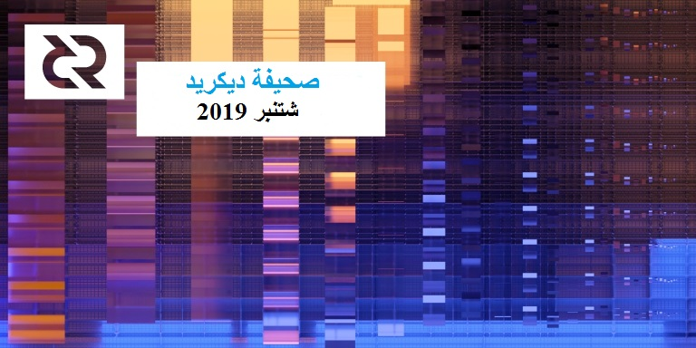

# صحيفة ديكريد لشهر شتنبر 2019

_الصورة: تغيّرات موسمية على السلسلة بواسطة saender@_

* انضمت الى عائلة مشاريع ديكريد شعبة جديدة من برنامج تَجَمّع تعدين اثبات العمل  dcrpool. تعد برامج التَجَمّع المفتوحة المصدر ذي الجودة العالية نادرة، وتشكل الحاجة إلى مثل هذا البرنامج عائقًا أمام بدء تَجَمّع تعدين جديد. يملأ dcrpool هذا الفراغ، مما يؤدي إلى تمهيد ساحة اللعب حتى يتمكن أي شخص من بدء تَجَمّع تعدين خاص أو عام. ومن شأن ذلك أن يفيد لامركزية قوة تعدين إثبات العمل عن طريق تقليص وفورات الحجم التي تفضل تجمعات كبيرة.
* تم إصدار النسخة 1.2.0 ل dcrstakepool. يعد هذا الإصدار تتويجاً لأعمال التطوير التي بدأت في شتنبر 2017، وهو يوفر عدداً من التحسينات، بما في ذلك واجهة ملائمة للمشرفين للتعامل مع التذاكر التي تم شراؤها برسوم غير كافية، وتصميم شامل للواجهة الأمامية، والتحسينات الأمنية، والمصطلحات المحدثة، والحد من الاعتماد على أطراف ثالثة، وإصلاح الأخطاء المختلفة.
* وقد كان شهر شتنبر شهرا كبيرا لعمليات الدمج، حيث أضيف دعم DCR إلى محفظة Trust Wallet، ومحفظة Exodus للهاتف المحمول، وامتداد Joule بالكروم للدفع باستخدام الشبكة البرقية، من بين خدمات أخرى.

## التطوير

[dcrd](https://github.com/decred/dcrd): تم [تنفيذ](https://github.com/decred/dcrd/pull/1856) الإصدار 2 من المُرَشّحات المدمجة. وتستخدم هذه المُرَشّحات مساحة أقل من مُرَشّحات الإصدار 1، مما سيشكل تحسناً بالنسبة للعملاء الخفيفون (التحقق البسيط من الدفع). كما ستستخدم مُرَشّحات الإصدار 2 في [التزامات رَأْسِيَّة الكتلة](https://proposals.decred.org/proposals/0a1ff846ec271184ea4e3a921a3ccd8d478f69948b984445ee1852f272d54c58).

[تلقت](https://github.com/decred/dcrd/pull/1901) وحدة `الميمبول` رموز أخطاء دقيقة. تمت إزالة مجموعة من التعليمات البرمجية القديمة المتعلقة بالتعدين، بما في ذلك [إزالة](https://github.com/decred/dcrd/pull/1736) `getblocktemplate` لصالح `getwork`.

كانت هناك تغييرات صغيرة متعددة لإعادة تغيير تصميم البرامج، وتحسين تغطية الاختبار والوثائق، وإصلاح الأخطاء.

[dcrwallet](https://github.com/decred/dcrwallet): يستخدم كود Go الخاص بـ Dcrwallet الآن Decred.org بدلا من Github.com باسم الوحدة النمطية الخاصة بها. وتناقش [هنا](https://github.com/decred/dcrd/issues/1264) فكرة تبني هذا على نطاق أوسع للحد من الاعتماد على GitHub.

تم إضافة دعم بناء ل Go 1.13 والتخلي عن النسخة 1.11.

يستمر العمل على دمج [دعم ++Coinshuffle](https://github.com/decred/dcrwallet/pull/1541).

[ديكريديتون](https://github.com/decred/decrediton): تلقى عرض الحساب [تحسينات](https://github.com/decred/decrediton/pull/2178) تدريجية، بينما اكتسب عرض الأمان عرض معلومات [الاشتقاق](https://github.com/decred/decrediton/pull/2184) للعناوين التي تملكها المحفظة (مفيد لأغراض التصحيح).

تقترب عملية دمج الشبكة البرقية من [الاكتمال](https://github.com/decred/decrediton/pull/2107). يستمر العمل [لإعادة تصميم](https://github.com/decred/decrediton/pull/2182)  عملية بدء التشغيل إلى جهاز محدود من أجل جعله أكثر قوة.

[بوليتيا](https://github.com/decred/politeia): إعادة تصميم بوليتيا مفعل على [الشبكة التجريبة](https://test-proposals.decred.org/)، والاختبار/ردود الفعل موضع ترحيب.

يجري إحراز تقدم كبير في نظام إدارة المتعاقدين،  حيث يتم دمج [أساس](https://github.com/decred/politeia/pull/980) نظام اقتراح تخليص متعاقدي ديكريد و[وظائفه](https://github.com/decred/politeia/pull/981)، وقيام المتعاقدين بالعمل على التفاعل معه، إلى جانب مجموعة من التحسينات الأصغر حجما وإصلاح الأخطاء لكل من نظام إدارة المتعاقدين وموقع المقترحات. الأولويات القادمة على موقع الاقتراحات هي [مقترحات طلب الاقتراحات](https://github.com/decred/politeia/issues/966) ودمج [تريليان](https://github.com/google/trillian) مما سيسمح بالختم الزمني للقطع الفردية للمحتوى.

[dcrstakepool](https://github.com/decred/dcrstakepool): الإصدار الرئيسي 1.2 قد وصل إلى ماستر.

تمت إضافة صفحة جديدة للمشرفين فقط للتعامل مع التذاكر منخفضة الرسوم إلى الواجهة الأمامية. وستدرج هذه الصفحة كل التذاكر التي تم شراؤها بدون رسوم كافية، وستسمح للمشرف بإضافة أو إزالة تلك التذاكر يدويا من قائمة تذاكر التصويت المؤهلة. وفي السابق كان يجب تنفيذ هذه العملية يدويًا عن طريق التحكم المباشر في قاعدة البيانات.

يعمل التصميم الأمامي الجديد على رفع مستوى dcrstakepool إلى المستوى الاحترافي الذي تم رؤيته في برامج ديكريد الأخرى مثل ديكريديتون.

بناءً على طلب مشغلي خدمات التصويت، تم تنفيذ دعم اتصالات SMTP المشفرة، بما في ذلك دعم الشهادات الموقعة ذاتياً. يسمح هذا لمقدمي خدمات التصويت بحماية رسائل البريد الإلكتروني الخاصة بالتسجيل واسترداد الحساب أثناء عبورهم بواسطة SMTPS.

تمر كل الاتصالات مع Dcrwallet الآن عبر Stakepoold. يقلل هذا التغيير البنيوي من عدد مكالمات الإجراءات البعيدة التي تتم عبر الشبكة، ويقلل من تعقيد الكود ويسمح بإغلاق المنافذ بين Dcrstakepol وdcrwallet.

قام متجر بيانات MySQL المخصص باستبدال محل التخزين القائم على الملفات بتخزين ملفات تعريف ارتباط الجلسة. يعالج هذا العديد من مشاكل الأمان المعروفة المتعلقة ببيانات الجلسة.

تم استبدال reCAPTCHA من جوجل بحل مستضاف ذاتي تم تنفيذه [ب Go](https://github.com/dchest/captcha). يتم الآن استضافة جميع الموارد اللازمة لذلك من قِبل موفر خدمة التصويت بدلاً من جهة خارجية. لا تنفذ الواجهة الأمامية المضمنة في هذا الإصدار أي جافا سكريبت خارجي على الإطلاق، مما يمنح دفعة قوية لأمن المستخدم وخصوصيته.

تم إجراء العديد من التحسينات الأمنية لمنع هجمات التزييف عبر المواقع (CSRF)، وتسريب البيانات الخاصة إلى جهات خارجية، والروابط الخبيثة وتخزين المعلومات الحساسة بواسطة المتصفحات.

هذا الإصدار هو نتيجة لـ 160 طلب سحب من 20 مساهم تم تقديمها منذ شتنبر 2017. للحصول على تفاصيل كاملة عن الإصدار، راجع [ملاحظات الإصدار](https://github.com/decred/dcrstakepool/releases/tag/v1.2.0).

[dcrpool](https://github.com/decred/dcrpool): بعد أكثر من عام من الإعداد، تم [إصدار](https://twitter.com/decredproject/status/1176914732399439873) تَجَمّع التعدين مفتوحة المصدر لديكريد مع نشر [مدونة](https://blog.decred.org/2019/09/25/Introducing-Dcrpool/) حول هذا الموضوع. ميزات dcrpool:

* يمكن أن تعمل كمجمع خاص أو عام
* تدعم جميع المعدنين المعنيين
* طرق الدفع بواسطة الدفع لكل سهم PPS و الدفع مقابل آخر N سهم PPLNS
* واجهة مستخدم ويب تحتوي على إحصائيات وبيانات الحساب
* تفاصيل الاتصال لكل المعدنين
* أعمال الحساب وتحليل المدفوعات

هذا البرنامج الذي طوره dnldd@ ب go، هو خطوة هامة في لامركزية تعدين إثبات العمل لديكريد. تهانينا على الإصدار!

[dcrlnd](https://github.com/decred/dcrlnd): أخيرًا، يتم [دمج](https://github.com/decred/dcrlnd/pull/36) العمل الكبير الذي يتم تنفيذه في طلبات السحب من المنفذ الأصلي ل lnd.

بدأ العمل على تمكين وظيفة [المحفظة عن بعد](https://github.com/decred/dcrlnd/pull/40). يسمح هذا للمستخدمين باستخدام محفظتهم الحالية بدلا من الاضطرار إلى إدارة محفظة منفصلة مع بذور منفصلة لـ Dcrlnd. كما يسمح للمستخدمين بإطلاق محفظة الشبكة البرقية مباشرة لمحفظة تعمل من ديكريديتون، مما يسهل تجربة المستخدم.

[cspp](https://github.com/decred/cspp): تمت إضافة دعم [إعادة الاتصال](https://github.com/decred/cspp/pull/18)، وتعليمات الإعداد المحدثة، وإضافة بنيات Go 1.13، وإصلاح أخطاء.

[dcrdex](https://github.com/decred/dcrdex): يجري وضع [الأسس](https://github.com/decred/dcrdex/issues/8) مع آلاف أسطر الكود المدمجة في برنامج الماستر. تم إضافة الخلفية الأولية ل [DCR](https://github.com/decred/dcrdex/pull/17) و [BTC](https://github.com/decred/dcrdex/pull/26). شهدت المواصفات العديد من [التغييرات](https://github.com/decred/dcrdex/pulls?q=is%3Apr+is%3Aclosed+label%3Aspec+merged%3A2019-09-01..2019-09-30) الطفيفة.

على عكس البرامج الأخرى التي تستخدم ترخيص ISC، اختارت dcrdex ترخيص BlueOak. تمت مناقشة الدافع في [هذه الدردشة](https://matrix.to/#/!EzTSRQITaqHuFBDFhM:decred.org/$RaxvOZy5x4cby5rwhph7gUED6LR0yQkKIihst4C5Og4).

[dcrandroid](https://github.com/decred/dcrandroid): يستمر العمل على واجهة المستخدم الجديدة من خلال [صفحة رئيسية](https://github.com/decred/dcrandroid/pull/401) مجددة والتحسينات الأخرى لجعل التطبيق متوافقا مع توصيات تصميم التطبيق القياسية لنظام الأندرويد. وقد بدأ العمل في [دعم المحافظ المتعددة](https://github.com/raedahgroup/dcrlibwallet/pull/57). سيسمح ذلك للمستخدمين باستيراد المفتاح العام الخاص بهم من ديكريديتون بحيث يمكنهم مراقبة حالة تذاكرهم من هاتفهم.

[dcrios](https://github.com/raedahgroup/dcrios): تجري حاليا عملية إعادة التصميم للاستفادة من [أساليب تصفية المعاملات](https://github.com/raedahgroup/dcrlibwallet/pull/48) الجديدة في Dcrlibwallet. ويشمل ذلك إصلاح [صفحة التاريخ](https://github.com/raedahgroup/dcrios/pull/515)، و[هيكل](https://github.com/raedahgroup/dcrios/pull/520) بيانات جديد لتخزين المعاملات، وإصلاح [صفحة الإرسال](https://github.com/raedahgroup/dcrios/pull/521) لتمكين المستخدمين من إرسال DCR إلى وجهات متعددة في آن واحد.

تم تبسيط [مزامنة الخلفية](https://github.com/raedahgroup/dcrios/pull/518) وجعلها أكثر موثوقية. يعالج هذا مشكلة يواجهها بعض المستخدمين عند إيقاف مزامنة سلسلة الكتل عند دخول الهاتف في وضع السكون.

يستمر تحسين واجهة المستخدم مع إصلاح [الصفحة الرئيسية](https://github.com/raedahgroup/dcrios/pull/512).

[المستندات](https://github.com/decred/dcrdocs): تمت [إضافة](https://github.com/decred/dcrdocs/pull/960) صفحة لـ [dcrtime](https://docs.decred.org/advanced/dcrtime/).

يستمر العمل في وثائق مطور البرامج، والذي من المتوقع أن يتم نقله من مستودع خاص إلى منظمة Decred GitHub قريبًا من أجل رؤية أوسع.

[decred.org](https://github.com/decred/dcrweb): تم تحديث صفحات [خريطة الطريق](https://decred.org/roadmap/) و[المحافظ](https://decred.org/wallets/) و[المبادلات](https://decred.org/exchanges/).

حولت عدة مشاريع نظام الدمج المستمر (CI) الخاص بها من Travis CI إلى GitHub Actions. الإجراءات أسرع ومدمجة على نحو أفضل ومفتوحة المصدر وقابلة للمشاركة، وهي بشكل عام أكثر مرونة من حيث ما ستسمح به.

إحصائيات نشاط التطوير لشهر شتنبر: 248 من المشاريع النشطة، 201 إيداع رئيسي، 28 ألف إضافة و 17 ألف عملية حذف من خلال 15 سجل. جاءت المساهمات من 2-8 مطورين لكل سجل.

## الأشخاص

مرحبا بالمساهمين الجدد مع دمج الكود إلى الماستر: imestin (على [dcrdocs](https://github.com/decred/dcrdocs/commits?author=imestin))، Muharem Hrnjadovic (على [بوليتيا](https://github.com/decred/politeia/commits?author=al-maisan))، Amir Massarwa (على [politeiagui](https://github.com/decred/politeiagui/commits?author=amassarwi)).

كتب s\_ben@ [مقالة](https://medium.com/@seth.benton/i-dump-coins-on-you-ee6db4331e18) رائعة على Medium يتحدث فيها عن خبرته في العمل من أجل منظمة الديكريد المستقلة و اللامركزية، وقدم ملاحظات حول السيولة، والتقلب، والدعاية للترويج من أجل حافز مالي وخططه للمستقبل.

إحصائيات المجتمع اعتبارًا من 2 أكتوبر:

* مستخدمي بوليتيا: 181 (+7)
* متابعو التويتر: 40,578 (-19)
* المشتركين في ريديت: 9,631 (+37)
* مستخدمي الماتريكس: 436 (+24)
* مستخدمي السلاك: 6,851 (+17)
* مستخدمي الديسكورد: 2,487 (+45) تم التحقق من 325 (+15) ليقوموا بالتعليق.
* مستخدمي التيليجرام: 3,048 (-100)
* المشاركين في اليوتيوب: 3,830 (+11)
* متابعي الفيسبوك: 3,278 (+7)، إعجاب: 3,003 (+4)
* متابعي  لينكد إن: 622 (+19)
* نجوم Github dcrd: بلغت 517 (+1)، تفرعات: 1,394 (+11)

## الإدارة و الحوكمة

تلقت [الخزنة](https://explorer.dcrdata.org/address/Dcur2mcGjmENx4DhNqDctW5wJCVyT3Qeqkx) في شهر شتنبر 14,510 DCR وأنفقت 7,810 DCR (ملاحظة: حدث الإنفاق في أوائل أكتوبر). باستخدام معدل المتوسط اليومي لشهر شتنبر ب DCR/USD والذي يقدر ب 22.02 دولارًا، ستكون الخزينة قد تلقت 320 ألف دولارا وأنفقت 172 ألف دولارا. حيث أن هذه المدفوعات كانت مخصصة للعمل الذي تم إنجازه في شهر غشت، و من المفيد أيضًا أخذها في الاعتبار في سياق متوسط ​سعر غشت اليومي الذي بلغ 26.23 دولارًا - وفي هذه الحالة يبلغ المبلغ المنفق 205 ألف دولار. اعتبارًا من 2 أكتوبر، بلغ رصيد الخزينة 641,802 DCR (أي ما يعادل 11 مليون دولار أمريكي عند قيمة 17.12 دولارًا أمريكي).

فاز i2 Trading بالمنافسة ليصبح صانعًا معتمدًا لسوق ديكريد، بنسبة موافقة بلغت 68٪ مقابل 49٪ لـ Tantra Labs و 47٪ لـ Grapefruit Trading. كما اجتذبت i2 أعلى نسبة مشاركة بالتذاكر بلغت 41%، مقارنة بتانترا 36% و 33% ل Grapefruit (أصبحت نسبة المشاركة مرئية الآن على [dcrdata alpha](https://alpha.dcrdata.org/proposals)).

هنأت تانترا لابس i2، ونشرت [منشورا](https://medium.com/@TantraLabs/proof-of-politeia-ac87f52243f4) عن تجربتها في بوليتيا، وذكرت أنها تنوي الاستمرار في خطتها لإنشاء أسواق لـ DCR، وستتشاور مع i2 حول هذا الموضوع.

تمت الموافقة على [اقتراح](https://proposals.decred.org/proposals/f0d1bd7447182328b44c691de88cb660b63df17f1f3a94990af19acea57c09bb) Permabullnino@ الخاص بـ "البحث والنشر لمؤشرات DCRUSD و DCRBTC على السلسلة" بنسبة أصوات بنعم بلغت 83٪ و 27٪ من الإقبال. كما سيقوم Permabull بتسليم 4-6 مقالات حول موضوع The Hyperactive HODLer Price (HHP)، على مدار 3 أشهر. وسيتم إصدار الفواتير بمبلغ 3,500 دولار عن أعمال Permabull التي تم نشرها بالفعل، و إصدار فاتورة بمبلغ 13,000 دولار للعمل الجديد.

تم رفض [الاقتراح](https://proposals.decred.org/proposals/fdd68c87961549750adf29e178128210cb310294080211cf6a35792aa1bb7f63) الخاص بـ "فعاليات و لقاءات ديكريد في رابطة الدول المستقلة في 2019-2020" بحصوله على 4٪ من أصوات الناخبين ونسبة المشاركة بنسبة 25٪.

تتوفر مجلة بوليتيا دايجيست [العدد 22](https://medium.com/politeia-digest/issue-22-september-1-12-2019-d82f5f617c92) على المزيد من المعلومات عن هذه المقترحات. كان النصف الثاني من شتنبر هادئًا على بوليتيا، وسيتم نشر عدد جديد من بوليتيا دايجيست عندما يكون هناك بعض المقترحات الجديدة.

## الشبكة

معدل الهاش: افتتحت معدلات الهاش في شهر شتنبر على ~619 Ph/s وأغلقت على ~472 Ph/s، وبلغ قاعها عند 404 Ph/s كما بلغت ذروتها عند 679 Ph/s على مدار الشهر. توزيع معدلات الهاش للتجمع اعتبارا من 2 أكتوبر حسب [dcrstats.com](https://dcrstats.com/pow):

* UUPool بنسبة 21%،
* Poolin بنسبة 19%،
* F2Pool بنسبة 19%،
* lab.antpool.com بنسبة 5.8%،
* BTC.com بنسبة 2.9%،
* Luxor بنسبة 2.12%،
* Coinmine بنسبة 0.10%،
* BeePool بنسبة 0.10%،
* suprnova بنسبة 0.03%،
* وأخرى بنسبة 30%.

أرقام توزيع التجمع تقريبية ولا يمكن تحديدها بدقة.

التحصيص: بلغ متوسط سعر التذكرة لمدة 30 يوما 128.70 DCR (أي ناقص 1.35) حسب dcrstats.com. وتفاوت السعر بين 121.92 و 134.4 DCR. وقد بلغ المبلغ المقفل 5.22-5.33 مليون DCR، وهو ما يعادل 49.87-51.15% من الإمدادات المتاحة.

العقد: طوال شهر [شتنبر](https://charts.dcr.farm/d/000000014/nodes?orgId=1&from=1567296000000&to=1569888000000)، كان هناك حوالي 182 عقدة استماع و 406 من العقد الإجمالية حسب dcr.farm. ما يقارب 81% يشغلون dcrd النسخة 1.4.0، و6.5% dcrwallet النسخة 1.4.0 و 6% يشغلون بناء قبل التطوير النسخة 1.5.0.

في المتوسط لشهر [شتنبر](https://charts.dcr.farm/d/DHPdAO4Wz/lightning-network?orgId=1&from=1567296000000&to=1569888000000)، تُظهر الشبكة التجريبية للشبكة البرقية لديكريد 17 عقدة و 35 قناة وقدرة إجمالية قدرها 227 DCR.

## الإنضمام

[أعلنت](https://twitter.com/TrustWalletApp/status/1175864708961845253) محفظة [Trust Wallet](https://trustwallet.com/)، وهي المحفظة [الرسمية](https://www.binance.com/en/blog/295063453682311168/Trust-Wallet-20-One-App-for-All-Your-Crypto) للباينانس، عن إضافة ديكريد.

[أضافت](https://twitter.com/exodus_io/status/1168886493617840131) Exodus ديكريد إلى محفظتها للهاتف النقال. بعد أن تم طلب ذلك بشدة. وردا على سؤال على التويتر، قامت Exodus بوضع رابط حول [موقفهم](https://support.exodus.io/article/89-is-exodus-open-source) عن المصدر المفتوح.

[أضيف](https://github.com/joule-labs/joule-extension/pull/230) دعم ديكريد إلى [Joule](https://lightningjoule.com/)، وهو امتداد كروم شهير يسمح للمستخدمين بالدفع عن طريق الشبكة البرقية واستخدام عقدتهم كهوية على الويب.

أضافت منصة التبادل [Uphold](https://uphold.com/) [دعم](https://twitter.com/UpholdInc/status/1172526504837693440) [ديكريد](https://twitter.com/decredproject/status/1172564615546511362) كجزء من حملة 15daysofcrypto#.

[أضافت](https://twitter.com/StealthEX_io/status/1172201037958008837) [StealthEX](https://stealthex.io/) ديكريد. تقدم الخدمة تبادل فوري للعملات الرقمية دون الكشف عن هويتك أو حساباتك.

[أضافت](https://twitter.com/instaex_io/status/1174367851139850241) منصة التبادل الفوري [InstaEx](https://instaex.io/) تداول DCR وقدمت [طلب سحب](https://github.com/decred/dcrweb/pull/720) لإضافتها على decred.org. في [مقارنة](https://medium.com/@instaex/instant-crypto-exchange-comparison-instaex-vs-changelly-vs-changenow-47770175bd54)  قصيرة مع المنافسين، تدعي الخدمة أنه لا يلزم استخدام أي "اعرف عميلك" KYC أو بريد إلكتروني، من بين مزايا أخرى.

تحظر شروط كل من [StealthEx](https://stealthex.io/terms) و[InstaEx](https://instaex.io/) الاستخدام من مجموعة من البلدان.

[أضاف](https://twitter.com/tokenview2018/status/1176394157327147008) [Tokenview](https://tokenview.com/en) عرض بيانات سلسلة كتلة ديكريد إلى مستكشف كتلة الأصول المتعددة الخاص بهم.

تحذير: ليس لدى مؤلفي مجلة صحيفة الديكريد أي فكرة عن جدارة أي من منصات التبادل المذكورة أعلاه. رجاء قم بأبحاثك الخاصة قبل أن تثق بمعلوماتك الشخصية أو ممتلكاتك لأي كيان.

## الانتشار

ركزت أنشطة الانتشار في شهر شتنبر على التثقيف والتوعية فيما يتعلق بتنفيذ الخصوصية في الآونة الأخيرة. تم إنشاء عروض تقديمية [لفحص المنظر العام للخصوصية](https://www.notion.so/Transaction-Privacy-75c4bd707c194de18ff5d943f8909e26) و[خصوصية ديكريد](https://www.notion.so/Privacy-Keynote-4902c63379894765a545351f8fcc7d7f)، وقد قدم منظمو مجتمع ديكريد في جميع أنحاء العالم عرضا تقديميا عن الخصوصية في لقاءات مختلفة. كما سافر jy-p@ إلى سان فرانسيسكو ولوس أنجلوس، حيث قدم عرضا عن الخصوصية في لقاءات لديكريد بكلتا المدينتين، وقدم عرضا عن مشهد الخصوصية بلقاء البتكوين في سان فرانسيسكو. نشر Dustorf@ مدونة، عن [خصوصية ديكريد، تسلك الطريق الطويل](https://medium.com/decred/decred-privacy-taking-the-long-road-62d218223db6)، واضعا الخصوصية في سياقها من منظور القيم والتطوير.

أصدرت ديكريد في العمق [حلقة](https://soundcloud.com/decredindepth/dcr-checkmate) تتضمن Checkmate@، حيث تدارس فيها عن بحثه عن ديكريد. كما ستصدر Decred Assembly قريبًا حلقة Deep Dive التي ستضم مطور ديكريد jrick@، حيث ناقش العديد من الفروق الدقيقة في مسار ديكريد نحو الخصوصية وتنفيذها والخطوات التالية.

قدمت ديكريد بشراكة مع Exodus [هدية مجانية](https://twitter.com/decredproject/status/1171900177365569536) عبارة عن تريزور نموذج Ts إلى 3 من أفضل التغريدات تشرح لماذا يحب المؤلف ديكريد. تهانينا للفائزين [@encldi](https://twitter.com/decredproject/status/1172577786227281920) و [@OfficialCryptos](https://twitter.com/decredproject/status/1172578137948983297) و [@dcrstack](https://twitter.com/decredproject/status/1172578432343040000)!

إنجازات ديتو لشهر شتنبر:

* قام بتأمين التغطية الإعلامية: تضمنت خزانة ديكريد على [Crypto Briefing](https://cryptobriefing.com/decred-venture-capital-centralizing/) بناءً على مقابلة مع richardred@؛ مقابلة مع jy-p@ على بودكاست POV Crypto، الحلقة بعنوان "[البحث عن السيادة](https://povcryptopod.libsyn.com/77-discovering-decred-w-jake-y-p)" ؛ [مقابلة](https://open.spotify.com/show/4y3hF660v5FNPpRlg9muCC) مع lukebp@ في بودكاست The Daily Chain؛ صورة عامة عن ديكريد في [Blockchain Tech News](https://www.blockchaintechnews.com/articles/company-profile-decred-aims-to-deliver-decentralized-future/).
* قام بتأمين فرصة للتحدث ل jy-p@ في لقاء البتكوين بسان فرانسيسكو، حيث قدم عرضا عن مشهد الخصوصية. وكان هناك 50 مشاركا من مجموعة متنوعة من المشاريع. في المجمل، يعتبر إلقاء كلمة عن ديكريد في لقاء البتكوين فوزا كبيرا! وقد تم [البث الحي](https://www.youtube.com/watch?v=LgLfMLFfOHQ?t=191) لخطاب جايك. وقضى Ditto أيضًا وقتًا ممتعًا مع anshaw@ و jy-p@ أثناء زيارتهما إلى سان فرانسيسكو.
* نسق مع صحفيين و محبي العملات الرقمية في لوس أنجيلوس و سان فرانسيسكو لتوجيه الحضور إلى اللقاءات المنعقدة في الأسبوع الأخير من شتبنبر.
* نسق مع منظمي صوت البلوكشين في شيكاغو، حيث لم يقدم jy-p@ عرضا واحدا بل عرضين: واحد عن لامركزية عملية المنح والتمويل (كجزء من المناظرة مع The Block) وواحد عن سبب استمرار السيادة المباشرة والإدارة الشاملة لأصحاب الحصص المتعددين.
* أمن مقابلتان مع jy-p@.
* تم تسجيل liz\_bagot@ على بودكاست ديكريد في العمق معanshaw@ - الحلقة ستصدر قريبًا.
* اقترب مستودع الموارد التعليمية من الانتهاء.
* نسق مع المجتمع للإستمرار في دفع رواية خصوصية ديكريد عبر تويتر.
* انضمت أنستازيا عضوة فريق ديتو الجديدة إلى مارجريت مي، ليزلي أنكيني، وليز باجوت في جميع مشاريعنا المتنوعة لديكريد. أهلا بك!

## الفعاليات

الحضور:

* 25 غشت - جولة التعدين ل Poolin بالصين - شنغهاي، الصين. تمت دعوة Dominic@ للمشاركة في حلقة نقاش حول إثبات العمل وألقى خطابًا رئيسيًا فيه عن ديكريد. تَوافِه - أصبح بولين مؤخرا [ثاني أكبر](https://twitter.com/officialpoolin/status/1171451086999191557) مجمع لتعدين البتكوين، ويساهم بحوالي [90 Ph/s](https://twitter.com/NoahPierau/status/1171527633391079424) في شبكة ديكريد. ([إحصائيات الفعالية](https://twitter.com/officialpoolin/status/1166702227727310848) و[الصور](https://twitter.com/wanbihou/status/1166028812305321985) _تم تفويتها  في إصدار غشت_)
* 4 شتنبر - [حفلة الحرم الجامعي](https://brasil.campus-party.org/campus-party-goias/) - غويانيا، البرازيل. ألقى أعضاء فريق ديكريد ما مجموعه 5 محادثات حول سلسلة الكتل، والإجماع، و ديكريد و الشبكة البرقية. (الصور: [1](https://twitter.com/Decred_BR/status/1171402110031847424)، [2](https://twitter.com/Decred_BR/status/1170136831272325121)، [3](https://twitter.com/Decred_BR/status/1169812440051109888))
* 5 شتنبر - [قمة سلسلة الكتل](https://blockchainsummit.uy/) - مونتيفيديو، أوروغواي. قدم camilolwi@ و pablito@ نظرة عامة عن ديكريد تحت إسم "الإدارة معا" وتحدثا إلى المطورين والصحفيين بعد الفعالية. تم [نشر](https://github.com/decredcommunity/events/blob/master/reports/20190905-blockchainsummituy-montevideo-uruguay.md) تقرير كامل مع جميع الروابط الإعلامية في مستودع الفعاليات.
* 5 شتنبر - [الاقتصاد الرقمي](https://twitter.com/Decred_ES/status/1169677346506297344) - لاباز، بوليفيا. عرض فريق elian@ المشروع على المجتمع المحلي لأصحاب المشاريع والمتحمسين لعقول سلسلة الكتل البوليفية. ([التقرير](https://twitter.com/elianhuesca/status/1170055934284111872) مع الصور)
* 7 شتنبر - Tech4Amazonia - لاباز، بوليفيا. كانت الفعالية لجمع التبرعات لمحاربة حرائق الغابات على الجانب البوليفي من نهر الأمازون. قدم elian@ المشروع لطلاب الهندسة في جامعة إل ألتو العامة. ([الصور](https://twitter.com/elianhuesca/status/1171034359027195904))
* 10 شتنبر - [خصوصية ديكريد](https://www.meetup.com/Permissionless-Society/events/dnkzvqyzmbnb/) - امستردام، هولندا. قدم Haon@ لمحة عامة عن مشاريع الخصوصية الحالية وقدم نهج ديكريد. التقرير الكامل مع روابط وسائل الإعلام [هنا](https://github.com/decredcommunity/events/blob/master/reports/20190910-decred-privacy-amsterdam-netherlands.md).
* 12 شتنبر - [لقاء ديكريد](https://twitter.com/Decred_ES/status/1171471998989389824) - موريليا، المكسيك. استضاف كل من francov\_@ و luisantoniocrag@ اللقاء الأول في موريليا، ومن بين أمور أخرى، أجاب على أسئلة من طفل صغير بدا أنه يفهم ديكريد. ([الصور](https://matrix.to/#/!aNPTuiryMFmdMQWUzb:decred.org/$1568342471606746ojsnf:matrix.org))
* 18 شتنبر - [ورشة عمل البتكوين وسلسلة الكتل](https://www.facebook.com/events/959839374354073/) - أواكساكا، المكسيك.
* 18 شتنبر - [مناظرة البتكوين العظيمة ضد سلسلة الكتل](https://www.meetup.com/BlockchainMelbourne/events/264425160/) - ملبورن، أستراليا. شارك eSizeDave@ في النقاش حول موضوع "هل لدى سلسلة الكتل قضية إستعمال قابلة للتطبيق خارج المال السليم؟" كعضو في فريق البتكوين، ضد فريق سلسلة الكتل الذي مثل توجهات "سلسلة الكتل لكل شيء". الإعداد للفعالية لم يكن في صالح فريق البتكوين وخسر في التصويت النهائي. ومع ذلك، تمكن eSizeDave@ من وضع ديكريد والإدارة في دائرة الضوء بضع مرات، بما في ذلك قميص الديكريد الرائع. اقرأ قصته الكاملة، مع بعض الحكمة حول حضور الفعاليات بشكل أكثر فاعلية، في [هذا التقرير](https://github.com/decredcommunity/events/blob/master/reports/20190918-the-great-bitcoin-vs-blockchain-debate-melbourne-australia.md).
* 20 شتنبر - [إطار عمل لإدارة سلسلة الكتل](https://www.eventbrite.com/e/a-framework-for-blockchain-governance-tickets-70134180221) - واشنطن العاصمة، الولايات المتحدة الأمريكية. شارك akinsawyerr@ في عرض تقديمي عن الإدارة مع Thomas Cox من [StrongBlock](https://strongblock.io/) في [Blockshop](https://www.blockshopdc.com/). شارك في جلسة سؤال وجواب حول إدارة سلسلة الكتل ووجهات نظر حول عملية إدارة الديكريد.
* 21 شتنبر - [إتصال المشاعر الفرنسية](https://twitter.com/Decred_ES/status/1160669435989856256) - مكسيكو سيتي، المكسيك. كانت هذه تجربة ترويجية حيث تم مزج شعار ديكريد بالتأثيرات المرئية في حين عزفت الفرق الإلكترونية أغانيها أمام الحشد. ملاحظات francov\_@: "لقد كانت تصميمات ديكريد رائعة،جنبا إلى جنب مع الموسيقى،وقد تم خلق بيئة حيث برزت ديكريد، كان هناك أشخاص مهتمون يسألون من نحن". (مقاطع الفيديو: [1](https://twitter.com/elianhuesca/status/1175609208705863681)، [2](https://twitter.com/elianhuesca/status/1175610899006197761)؛ [إنستغرام](https://www.instagram.com/p/B268Uougtbo/))
* 21 شتنبر - [لقاء ديكريد](https://twitter.com/DecredArabia/status/1171117988461854721) - الدارالبيضاء، المغرب. arij@ (الملقبة أيضا ب butterfly@) تحدثت عن تجربتها كمساهمة بالديكريد، إدارة ديكريد وخصوصيتها وخططها المستقبلية. وكان الناس مهتمين جدا ومتلهفين للتعلم، لدرجة أنهم بقوا بعد ساعة من انتهاء اللقاء، وطلبوا المزيد من الاجتماعات وحتى الدورات في الجامعات والجمعيات. ([التقرير](https://matrix.to/#/!aNPTuiryMFmdMQWUzb:decred.org/$156914094936513JoWdj:decred.org)، [الصور](https://twitter.com/in_insaf/status/1175692906826481664))
* 23 شتنبر - [لقاء البتكوين بسان فرانسيسكو](https://www.meetup.com/San-Francisco-Bitcoin-Social/events/dhdhsqyzmbgc/) - سان فرانسيسكو، الولايات المتحدة الأمريكية. أشارت liz\_bagot@: " أعطى jy-p@ نظرة عامة قوية عن خصوصية العملات وحصل على الكثير من الأسئلة في النهاية. حضر حوالي 50 شخصًا من مجموعة متنوعة من المشاريع والخلفيات. نجاح كبير لديكريد -  لم يتحدث أحد من ديكريد أبدا في لقاء للبتكوين قبل!" _(لكي نكون منصفين، camilolwi@ وpablito@ [خاطروا](https://matrix.to/#/!aNPTuiryMFmdMQWUzb:decred.org/$156529022111295SCOiX:decred.org) بشجاعة بحياتهم [قبل](201908.md#events) شهر واحد في Espacio Bitcoin)_. تم استضافة الفعالية بواسطة [Starfish](https://twitter.com/starfishsf) وتم [البث الحي](https://www.youtube.com/watch?v=LgLfMLFfOHQ?t=191) للحديث على اليوتيوب.
* 24 شتنبر - [خصوصية ديكريد](https://twitter.com/decredproject/status/1174374566359183360) - سان فرانسيسكو، الولايات المتحدة الأمريكية. أعطى jy-p@ نظرة عامة عن مشهد الخصوصية وتعمق في تنفيذ ديكريد. برعاية واستضافة Coinbase Custody. ([الصور](https://twitter.com/HaileyLennonBTC/status/1176697168196849664))
* 25 شتنبر - [La Conexión](https://twitter.com/Conexion_Events/status/1165075848782852101) - بوينس آيرس، الأرجنتين. قدم elian@ نظرة عامة عالية المستوى عن ديكريد وتاريخها، و أَدارَ كشكا صغيرًا وتحدث إلى الحاضرين. و في اليوم السابق للفعالية، تناول elian@ و victorarubin@ غداء مع العديد من شخصيات العملات الرقمية المحلية. إن الأرجنتينيين متقدمون للغاية ويتطلعون إلى بدائل لعملتهم التي قد تصل إلى 50٪ من التضخم هذا العام: "من السائقين الكبار إلى بائعي المتاجر الكل يعرف عن البتكوين والعملات الرقمية الأخرى". ([التقرير](https://matrix.to/#/!aNPTuiryMFmdMQWUzb:decred.org/$15704543735491DFGIA:decred.org)، الصور: [1](https://twitter.com/victorarubin/status/1176926844916043782)، [2](https://twitter.com/victorarubin/status/1176933542762287104)).
* 26 شتنبر - [اللقاء الإفتتاحي لديكريد](https://twitter.com/MattDavidKaye/status/1164974520081342464) - لوس أنجلوس، الولايات المتحدة الأمريكية. تحدث jy-p@ عن الأساسيات والتكنولوجيا والإدارة ومستقبل ديكريد. باستضافة بلوكهيد كابيتال. (الصور: [1](https://twitter.com/Tantra_Labs/status/1177412535059808256)، [2](https://twitter.com/degeri_crypto/status/1177412554101932032))
* 27 شتنبر - [مهرجان العملات الرقمية](https://argentinacryptofest.com/) - قرطبة، الأرجنتين. قام كل من elian@ و victorarubin@ بتقديم نظرة عامة أخرى رفيعة المستوى حول ديكريد وانتهزوا الفرصة للتواصل مع أعضاء مجتمع البتكوين و سلسلة الكتل المحلي. ومن الجدير بالذكر أن الفعالية أقرتها الحكومة المحلية.  اقرأ تقرير elian@ الكامل وانطباعاته عن الأرجنتين [هنا](https://matrix.to/#/!aNPTuiryMFmdMQWUzb:decred.org/$15704543735491DFGIA:decred.org) (أو انتظر إصدار GitHub). (الصور: [1](https://twitter.com/victorarubin/status/1177976167145586693)، [2](https://twitter.com/victorarubin/status/1178038340505030658))
* 27 شتنبر - [سلسلة الكتل للأعمال و الإدارة](https://www.eventbrite.com/e/blockchain-para-empresas-y-gobierno-tickets-72417321157) - مونتيري، المكسيك. دعا Alteumx (تبادل في المكسيك) luisantoniocrag@ ليكون حاضرا في هذه الفعالية حيث أتيحت له الفرصة للحديث عن ديكريد للجمهور (رجال الأعمال والسياسيين). ([الصور](https://twitter.com/Decred_ES/status/1178690139008229376))
* 28 شتنبر - [Bali Block Confex](https://bali.blockconfex.com/) - ليجيان، اندونيسيا. تحدث ضويين ىم إلى الناس في الحدث حول ديكريد، ووزع البطاقات البريدية وأجرى بعض الاتصالات. سمع معظم الناس عن ديكريد لأول مرة، والكثير منهم إهتموا بسرعة كبيرة. التقرير الكامل [هنا](https://github.com/decredcommunity/events/blob/master/reports/20190928-bali-block-confex-legian-indonesia.md).
* 30 شتنبر - [صوت سلسلة الكتل](https://twitter.com/BlockchainVoice/status/1154772731575099392) - شيكاغو ، الولايات المتحدة الأمريكية. تحدث jy-p@ عن لامركزية تخصيص رأس المال ولماذا ستستمر السيادة المباشرة في المستقبل. (الصور: [1](https://twitter.com/BlockchainVoice/status/1179100328102203392)، [2](https://twitter.com/BlockchainVoice/status/1179088345638621185))

الفعالية القادمة:

* 17 أكتوبر - سلسلة الكتل و ديكريد - موريليا، المكسيك. سيتحدث luisantoniocrag@ و francov\_@ عن سلسلة الكتل و ديكريد في إحدى جامعات مدينة موريليا.
* 29-31 أكتوبر - [المؤتمر العالمي للعملات الرقمية](https://worldcryptocon.com/) - لاس فيجاس، الولايات المتحدة الأمريكية. سيتحدث akinsawyerr@ في لجنة حول "ممارسات الإدارة"، وسيقدم أيضًا عرضًا تقديميًا بعنوان: "إدارة العملات الرقيمية العامة". كما سيسلط العرض الضوء على عملية إدارة ديكريد على عكس الجهود الأخرى المبذولة في مجال سلسلة الكتل.
* 31 أكتوبر - Blockchain APAC -لتؤكد وتعلن.
* 4-7 نونبر - [قمة الويب](https://websummit.com/) - لشبونة، البرتغال. ستكون ديكريد حاضرة بكشك.
* 16 نونبر - [BitConf](https://www.bitconf.com.br/portal/) - ساو باولو، البرازيل. هذه واحدة من أكبر فعاليات العملات الرقمية في أمريكا اللاتينية. سيقدم فريق ديكريد حوالي 3 محاضرات.

تمت إضافة ما مجموعه 4 تقارير جديدة إلى [مستودع الفعاليات](https://github.com/decredcommunity/events)، وهناك تقرير آخر قادم. وكتذكير، يعمل مستودع الفعاليات على جمع الخبرات من الفعاليات العالمية في مكان واحد ويمنحك رابط تقرير يسهل الوصول إليه لنشره. يمكن نسخ المستودع بسهولة لحماية البيانات، ويمكنك حتى إرسال تقرير دون مغادرة الوحدة الطرفية الخاصة بك.

شكرًا للجميع على كتابة التقارير وتقديمها لتنمية قاعدة معرفتنا!

## وسائل الإعلام

مقالات مختارة:

* ديكريد: أطروحة الاستثمار بواسطة والي هانسن (على [medium](https://medium.com/coinmonks/decred-an-investment-thesis-bf9ba3cd1042)) - أتى هذا الملخص الشامل لديكريد وتقييم الفرص والمخاطر فجأة، وقد تم جمعها من مصادر عامة من قبل صاحب حصص متحمس.
* تقديم Dcrpool بواسطة dnldd (على [blog.decred.org](https://blog.decred.org/2019/09/25/Introducing-Dcrpool/)) - منشور في المدونة يقدم ويشرح الأساس المنطقي لبناء تجمع التعدين الطبقي المفتوح المصدر لديكريد.
* أنا أتخلص من عملاتي على حسابك بواسطة s\_ben@ (على [medium](https://medium.com/@seth.benton/i-dump-coins-on-you-ee6db4331e18))
* خصوصية ديكريد: تسلك الطريق الطويل بواسطة Dustorf@ (على [medium](https://medium.com/decred/decred-privacy-taking-the-long-road-62d218223db6))
* كتابة المقترحات على بوليتيا (Pi) بواسطة Decred Dragon (على [medium](https://medium.com/@decreddragon/writing-proposals-on-politeia-pi-e345621652a2))
* كيف تهدف ديكريد لبناء نموذج إدارة لامركزي بواسطة evok3d@ (على [bitsonline](https://bitsonline.com/decred-decentralized-governance/))
* تجربة ديكريد: هل يمكن أن تساعد اللامركزية المكسيك؟ بواسطة @evok3d@ (على [medium](https://medium.com/@evok3d/the-decred-experiment-can-decentralization-help-mexico-1e0e8156430c))
* إثبات بوليتيا بواسطة مختبرات تانترا (على [medium](https://medium.com/@TantraLabs/proof-of-politeia-ac87f52243f4))
* المنظمات اللامركزية و الحلقة المفقودة: سمعة البروتوكولات بواسطة s\_ben@ (على [medium](https://medium.com/sourcecred/the-dao-missing-link-reputation-protocols-8e141355cef2))
* سبق ديكريد: رأس المال الاستثماري هو قوة "مركزية جدا"  بواسطة Paddy Baker (على [cryptobriefing.com](https://cryptobriefing.com/decred-venture-capital-centralizing/))

الترجمات:

* تكرار الخصوصية ترجمت إلى [العربية](https://github.com/Insaf01/decred-arabic/blob/master/articles/iterating-privacy.md) بواسطة arij@، و[الروسية](https://medium.com/decred-russia/iterating-privacy-6d242f78a648) بواسطة DZ@ و[البرتغالية](https://stakey.club/translated/iterating-privacy/) بواسطة mm@
* تبين أن الكثير من المقالات السابقة ترجمت إلى اللغة البرتغالية أيضًا في [stakey.club](https://stakey.club/pt/translated/)
* المزيد من الترجمات لمجلة ديكريد إلى العربية بواسطة arij@ و الصينية بواسطة (Dominic@ وشركائه) والبولندية بواسطة (kozel@) والروسية بواسطة (DZ@) والإسبانية بواسطة (francov\_@ و luisantoniocrag@) والفيتنامية بواسطة (duyenemdo@). شكرا لكم جميعا لنشر مجلة ديكريد في جميع أنحاء العالم!

أشرطة الفيديو:

* جمعية ديكريد الغوص العميق: لامركزية الخزينة مع ماركو بريبوم ([اليوتيوب](https://www.youtube.com/watch?v=4N8Fq1tU3XM))
* jy-p@ يتحدث عن الخصوصية في لقاء البتكوين بسان فرانسيسكو ([اليوتيوب](https://www.youtube.com/watch?v=LgLfMLFfOHQ?t=191))
* يتحدث Akinsawyerr@ عن تأثير سلسلة الكتل والتمويل اللامركزي على الأسواق الناشئة والحدود على حركة بدء التشغيل العالمية ([اليوتيوب](https://www.youtube.com/watch?v=OIO1q1UO4qM))

الصوتيات:

* الحلقة 8 من ديكريد في العمق مع Checkmate@ - حيث يتحدث Checkmate عن مجموعة قيم DCR ونسبة المخزون إلى التدفق، ومقاييس البتكوين و ديكريد على السلسلة، والعلاوة النقدية، والتمويل المستدام لجذب المساهمين الملتزمين، وخطط البحث الخاصة به. ([اليوتيوب](https://www.youtube.com/watch?v=2JbMWgJUoSQ) و [soundcloud](https://soundcloud.com/decredindepth/dcr-checkmate))
* الحلقة 76 من بودكاست POV Crypto - إنضم jy-p@ إلى طاقم POV Crypto في حلقة بعنوان "البحث عن السيادة" التي تأخذ بعين الاعتبار أساسيات البتكوين و ديكريد والسيادة والتوافق مع الإصدارات السابقة والخصوصية. ([اليوتيوب](https://www.youtube.com/watch?v=WnY3c-F5caw) و [libsyn](https://povcryptopod.libsyn.com/77-discovering-decred-w-jake-y-p))

## مناقشات المجتمع

أخبار نظم الاتصالات:

* تم [اختراق](https://twitter.com/cburniske/status/1177747319426621440) حساب التيليجرام الخاص بكريس بورنيسكي وطلب من الناس إرسال العملات الرقمية له. تأكد من [تعيين كلمة المرور](https://twitter.com/cburniske/status/1180527281350955008) في التيليجرام. وهذا أيضا تذكير جيد للتحقق من دفاعاتك ضد هجمات تبديل SIM.
* إنتحال الشخصية على ديسكورد عن طريق ديسكورد نيترو أصبح أكثر شيوعا. يسمح النيترو بتغيير اسمك ـ وـ رمز الهوية.
* [الإسقاط الجوي](https://archive.today/GXimX) لديكريد حيث تحصل على ETH مجاني الواضح انه ليس  صديقك.
* بشكل عام، انتبه وأبلغ عن أي حسابات ومجموعات مشبوهة على جميع المنصات.

منشورات مختارة من الريديت:

يهتم هذا القسم بعرض مواضيع ريديت التي تلقت أكبر عدد من التعليقات، و العديد من هذه المواضيع تحضى بنقاط منخفضة و بالتالي تنخفض نسبة بروزها على ريديت.

* مصطلحات تجريدية حول [مستويات الخصوصية](https://www.reddit.com/r/decred/comments/d0jg3l/abstract_terminology_about_levels_of_privacy/) - مناقشة منشور مدونة نظرة عامة عن الخصوصية.
* [سؤال](https://www.reddit.com/r/decred/comments/d6kt1v/random_decred_reddit_community_question/) عشوائي على مجتمع ريديت لديكريد - حول سبب الإرتفاع المستمر لعدد الأعضاء على الإنترنت على /r/decred  بالنسبة إلى إجمالي المشتركين.
* ما [الميزة أو أداة](https://www.reddit.com/r/decred/comments/dappgf/what_decred_feature_or_tool_would_you_want_more/) ديكريد التي تريد أن يستخدمها المزيد من أعضاء المجتمع؟
* هل [دليل تقسيم التذاكر](https://www.reddit.com/r/decred/comments/d50wkw/ticket_splitting_guide_available/) متاح؟
* [تحليل](https://www.reddit.com/r/decred/comments/d1c69a/analysis_of_ticket_voting_so_far_on_the_market/) تذكرة التصويت حتى الآن على مقترحات صانع السوق.

نقاشات مختارة من التويتر:

* أطروحة ديكريد ل Dustorf@ في دقيقتين ([9 تغريدات](https://twitter.com/lefebvre_dustin/status/1174789127105105928))، بناءً على أطروحة والي هانسن.
* قام karamblez@ بعرض [فيديو](https://twitter.com/karamblez/status/1178346009178644481) لنشاط مستودعات ديكريد و btcsuite منذ 2013.
* Checkmate@ عن نمو [معدل التجزئة](https://twitter.com/_Checkmatey_/status/1177650799050133504) لديكريد مقارنة بالأصول الأخرى.
* Checkmate@ عن [تدفق مخزون](https://twitter.com/_Checkmatey_/status/1173672584933777408) ديكريد و البتكوين.
* الإعلان عن dcrpool و ملخص [التغريدة](https://twitter.com/decredproject/status/1176914732399439873).
* تم [دمج](https://twitter.com/JamieHoldstock/status/1171347711536357378) طلب سحب Joule ل jholdstock@.
* [غرد](https://twitter.com/matheusd_tech/status/1168897318432706561) matheusd@ عن جلب أزيد من 400 طلب سحب من المستودع الأصلي للشبكة البرقية إلى dcrlnd.
* [يدعو](https://twitter.com/oxfernando/status/1174268398458609664) fernandoabolafio@ الناس للتحقق من إعادة تصميم بوليتيا.
* [أشار](https://twitter.com/marco_peereboom/status/1176856040991801345) moo31337@ إلى أنه عندما تنخفض الأسواق، فإنها فرصة جيدة للانضمام إلى مشروع مثل ديكريد والحصول على أجر.
* [تنبؤات](https://twitter.com/lukebp_/status/1175441776041058304) lukebp@ حول منصات العقود الذكية مقابل الأموال بدون تصريح و تحول المجتمع.
* [ملخص](https://twitter.com/jcliff42/status/1170039176277835776) تقنية الخصوصية لديكريد من جوردان كليفورد من سكالار كابيتال.

## الأسواق

تم تداول DCR في شهر شتنبر ما بين 16.49-25.20 دولار أمريكي و 0.0020-0.0024 BTC. وبلغ متوسط السعر اليومي 22.02 دولار.

فقدت DCR/USD و BTC/USD أكثر من 20 ٪ في حوالي 24 شتنبر. من بين الأسباب المحتملة التي نوقشت في وسائل الإعلام: [الانخفاض الحاد](https://www.ccn.com/bitcoin-hashrate-flashcrash-price-slump/) في تجزئة البتكوين، و[الإطلاق المخيب للآمال](https://cryptobriefing.com/bakkt-crypto-launch/) ل Bakkt التي لم تجلب إرتفاع الأسعار المتوقع، و[التصفية](https://bitcoinist.com/yes-bitmex-liquidations-caused-bitcoin-price-to-crash-heres-how/) على منصات تداول المشتقات.

## الخارجية ذات الصلة

تم [الإعلان](https://blog.coinbase.com/introducing-the-crypto-rating-council-d6ee33a8f34d) عن [مجلس تصنيف العملات الرقمية](https://www.cryptoratingcouncil.com/)، وهو عبارة عن مجموعة من شركات العملات الرقمية التي تنتج تقييمات حول ما إذا كان من المحتمل أن يتم اعتبار أوراق العملات الرقمية كأوراق مالية من قبل هيئة الأوراق المالية والبورصات الأمريكية. تم إصدار مجموعة أولية من 20 [تصنيفًا](https://www.cryptoratingcouncil.com/asset-ratings) والتي تضع أصولًا على مقياس يتراوح بين 1 (ليس ورقة مالية) إلى 5 (من المرجح جدًا أن تكون ورقة مالية). حصلت البتكوين و اللايتكوين و المونيرو و داي على أفضل نتيجة (1). حصلت الأصول مثل EOS و Tezos و Stellar و Hedera Hashgraph على 3.75 درجة، و XRP حصلت على 4 و Polymath على 4.5. لن ينشر مجلس تصنيف العملات الرقمية أسماء المشاريع التي حصلت على تصنيف 5. سيتم نشر المزيد من التصنيفات في المستقبل. على الرغم من عدم نشر المنهجية، إلا أنه يمكن استنتاجها من ملخصات النقاط الرئيسية للتصنيفات التي يتم التركيز عليها فيما إذا كان هناك عملية بيع للتوكن، سواء حدث ذلك قبل أن يكون للنظام فائدة، وما إذا كانت هناك لغة شبيهة بالاستثمار في المواد الترويجية لبيع التوكن، وما إذا كان هناك تطوير للامركزية واستخدام النظام.

أكثر من 640 مشروع عملة رقمية لم ينشر أي كود جديد في عام 2019، وفقا [لدراسة](https://blog.coincodecap.com/analyzing-cryptocurrencies-github-activity/) أجرتها CoinCodeCap. يبلغ الحد الأقصى لهذه العملات مجتمعة حوالي 415 مليون دولار، مع أعلى سقف فردي يبلغ 85 مليون دولار. بيانات التبادل ورأس المال السوقي لهذه التوكنات غير مكتملة، ولكن في ما هو متاح، تتصدر YoBit منصات التبادل التي تدرج هذه التوكنات بحيازة 62 منها.

تم [الإعلان](https://www.sec.gov/news/press-release/2019-202) عن تسوية بين هيئة الأوراق المالية والبورصات الأمريكية و الإيوس حيث يجب على Block.One دفع 24 مليون دولار كعقوبات لإجراء عملية بيع للأوراق المالية غير المسجلة. ويتعلق ذلك ببيع توكنات الإيوس ERC-20 في ICO لمدة عام و التي جمعت 4.1 مليار دولار، و بلغت الغرامة 0.6% من المبلغ المحصل. ووفقًا [للبيان الصحفي](https://block.one/news/block-one-announces-settlement-with-us-securities-and-exchange-commission/) الصادر عن Block.One، لا تنطبق التسوية إلا على توكنات ERC-20، والتي تم استبدالها منذ ذلك الحين بتوكنات الشبكة الرئيسية للإيوس، والتي تعتبر في وضع آمن ولا تتطلب التسجيل بهيئة الأوراق المالية والبورصات الأمريكية للتداول.

[أعلنت](https://bisq.network/blog/bisq-dao-first-four-cycles/) شبكة بيسك أنه قد تم إنجاز أربع دورات شهرية من تمويل منظمتها المستقلة اللامركزية. يمكن لمنظمة بيسك المستقلة ذاتياً أن تسك العملات الملونة من BSQ لتمويل أعمال التطوير، ويتم حرقها عند استخدامها لدفع رسوم التداول. في كل دورة بلغ عدد المقترحات حوالي 20 وعدد الأصوات 200-300. كانت الدورتان الأولى والثانية تضخمتين بدرجة كبيرة، حيث تم سك الكثير من BSQ أكثر من التي تم حرقها، لكن الدورة الثالثة كانت بها مستويات متماثلة من الحرق والسك، وفي الدورة الرابعة تم حرق BSQ أكثر من الذي تم سكه. _(فوت في عدد غشت)_

[أطلقت](https://twitter.com/OKCoin/status/1168917669493579776) منصة التبادل OKCoin [مبادرة](https://www.okcoin.com/1000btc) في 3 شتنبر للتبرع بما يصل إلى 1,000 BTC لمطوري برامج BTC و BCH و BSV. يمكن لمستخدمي OKCoin الذين تم التحقق منهم التصويت لصالح المشروع الذي يفضلونه وسيحصل مطورو المشروع على 0.02 BTC لكل صوت. تمت مناقشة هذه المبادرة كثيرًا على التويتر، حيث قام بعض Bitcoiners بالترويج لها لدعم المطورين، بينما تبنى آخرون موقفًا أكثر ازدراء يشير إلى مشاكل مع تضمين BCH و BSV والجدول الزمني التاريخي المقدم. اعتبارًا من 2 أكتوبر، أغلق التصويت ولم يكن هناك سوى 47 صوتا في المجموع (أي ما يعادل 0.94 BTC) ولكن OKCoin قد تجاوز إجمالي المبلغ المتبرع به حتى 20 BTC.

[تلقت](https://www.theblockcrypto.com/post/39087/vlad-zamfir-led-blockchain-project-casperlabs-bags-14-5m-series-a-to-improve-ethereum-2-0-scalability) شركة Casperlabs، وهي شركة ناشئة يقودها فلاد زامفير، 14.5 مليون دولار أمريكي من المجموعة A لتمويل العمل على تطوير Ethereum 2.0.

[صوت](https://decrypt.co/9573/ethereum-expands-blockchain-capacity-by-25-percent)  معدنو الإيثيريوم لزيادة الحد من الغاز للكتل (وبالتالي حجم الكتلة) بنسبة 25٪، استجابة لارتفاع رسوم المعاملات. ويسيطر المعدنون على حد غاز الإيثيريوم مباشرة ويمكن لكل حد أن يصل أو ينخفض قليلا، لذلك استغرق الأمر بعض الوقت لاستقرار الزيادة بنسبة 25٪.

شهدت الإيثيريوم أيضًا نشر التفرع الصلب لإسطنبول على شبكة اختبار Ropsten هذا الشهر، والتي [حدثت](https://www.coindesk.com/ethereums-istanbul-upgrade-arrives-early-causes-testnet-split) قبل الموعد المتوقع وتسببت في إنقسام السلسلة. من المتوقع أن يكسر هذا التفرع الصلب عددًا من العقود الذكية المستخدمة على الشبكة الرئيسية للإيثيريوم، بما في ذلك حوالي 680 من عقود أراغون الذكية.

[أطلقت](https://www.coindesk.com/stellar-to-airdrop-2-billion-xlm-into-keybase-wallets) ستيلر حملة الإسقاط الجوي حيث تعطي مستخدمي Keybase مجانا XLM، سيتلقى مستخدمو Keybase على مدار العشرين شهرًا القادمة إسقاطات جوية شهرية قدرها 100 مليون XLM. على مدار العشرين شهرًا، ستزيد طريقة التوزيع هذه من العرض المتداول لـ XLM بنسبة 10٪. التداول الحالي هو 20 مليار XLM من أصل 105 مليار ومؤسسة ستيلر للتطوير تسيطر على التوزيع.

أعلنت مؤسسة تطوير ستيلر أيضًا عن خطة لتعطيل تضخم XLM كجزء من تحديث الإصدار 12. سيصوت مصادقو ستيلر لقبول أو رفض هذا التغيير. تم تصميم تضخم XLM كوسيلة لأصحاب الأموال لتمويل المشاريع من خلال تحديد عنوان يمكن أن تعود إليه مكافآتهم التضخمية. في الممارسة العملية، يميل حاملو XLM إلى تسمية العناوين التي يسيطرون عليها أو الانضمام إلى التجمعات بحيث يمكنهم الحصول على التضخم لمقتنيات XLM الخاصة بهم. وآلية التضخم لا تخدم غرضها المقصود، ولذلك فإن مؤسسة تطوير الستيلر ترغب في حلها.

أطلقت داش [مؤسسة داش الاستثمارية](https://www.dashinvests.org)، وهي كيان سيتقدم بطلب للحصول على أموال خزينة داش ثم إستثمارها في مشاريع تهدف إلى تحسين النظام البيئي لداش. مؤسسة استثمار داش هي كيان قانوني يمكنه تقديم قروض أو استثمارات مقابل حقوق الملكية في المساعي التي يمولها. سيتم اتخاذ القرارات المتعلقة بما يجب الاستثمار فيه من قبل مجلس من المشرفين المنتخبين.

أعلنت مؤسسة تيزوس عن تمويل لفئة ثانية من 14 منحة النظام البيئي تيزوس، مرة أخرى مع عدم وجود تفاصيل عن مقدار المنحة أو بموجب أي شروط. في أحد الأسئلة الشائعة، أوضحت المؤسسة أنها لا تكشف عن تفاصيل المنح لأنها ستضر بموقفها التفاوضي. يحتوي تحديث مؤسسة تيزوس النصف السنوي (الذي تم إصداره وتفويته في إصدار غشت) على بعض المعلومات حول كيفية إنفاق المؤسسة لمواردها. في العام السابق، تم إنفاق 14.8 مليون دولار على الأبحاث والتعليم والتطوير الأساسي، وتم إنفاق 14.1 مليون دولار على المنح المجتمعية، وتم إنفاق 8.5 مليون دولار على أدوات النظام البيئي ومنح التطبيقات. في 31 يوليوز 2019، احتفظت المؤسسة بأصول بلغت قيمتها 652 مليون دولار: 61٪ ب BTC، و 15٪ ب XTZ، و 15٪ في "صندوق الاستقرار" (محفظة متنوعة من السندات، والصناديق المتداولة في البورصة، والسلع الأساسية)، و 6٪ كأوراق نقدية بالدولار أمريكي.

تم [الإعلان](https://twitter.com/pwuille/status/1163592166062473217) عن [Miniscript](http://bitcoin.sipa.be/miniscript/) بواسطة Pieter Wuille ، وهي طريقة لكتابة بعض برامج البتكوين بطريقة منظمة تسمح بالتحليل الثابت والتوقيع العام وتجميع السياسات. إنها مجموعة من الأدوات التي تسهل كتابة برامج البتكوين وتتأكد من كيفية تصرفها. _(فوت في عدد غشت)_

تسببت معاملة بتكوين كبيرة بلغت بليون دولار في [تكهنات](https://cointelegraph.com/news/someone-just-moved-1b-in-bitcoin-for-700-fee-overpaying-20-times) حول من كان وراء هذه الصفقة وما هو الغرض منها.

[قررت](https://cointelegraph.com/news/france-wont-tax-crypto-only-trades-will-tax-crypto-to-fiat-sales) فرنسا عدم فرض ضريبة على التبادلات التجارية عملة رقمية مقابل عملة رقمية. سيتم فرض الضرائب على عمليات بيع العملات الرقية مقابل الورق النقدي فقط.

[بدأ](https://www.bloomberg.com/news/articles/2019-09-12/ecb-cuts-rates-restarts-qe-to-fight-slowdown-as-draghi-era-ends) البنك المركزي الأوروبي (ECB) جولة أخرى من التيسير الكمي (QE). ستقوم "بشراء" السندات (ضخ السعر) بمعدل 20 مليار يورو شهريًا  "طالما كان ذلك ضروريًا" للوصول إلى هدف تخفيض قيمة اليورو. وهذا من أجل" تحفيز " النمو الاقتصادي. أو كما [يقول](https://www.youtube.com/watch?v=XkvcdjSH0c0&t=9m21s) مراد، لصعق الناس. هناك [اقتباس](https://www.youtube.com/watch?v=XkvcdjSH0c0&t=6m21s) جيد آخر يتبادر إلى الذهن: "يعتقد الأشخاص في العملات الرقمية أنه لا ينبغي أن يتمتع أي إنسان حي بالقدرة على توليد الثروة من الهواء". إذا كنت تحتفظ باليورو أو كنت تبحث عن شراء سندات من سوق عادلة، فإن السؤال الجيد الذي يجب طرحه على البنك المركزي الأوروبي هو من أين تأتي هذه الأموال وما إذا كانت تعمل بجد لتربحها. لاحظ أيضًا كيف يتم اختيار اللغة بعناية لعدم تسميتها كما هي، ومدى صعوبة العثور على مقال إخباري يذكر صراحة مصدر المال لهذه "المشتريات".

قام مستخدم GitHub المسجل في 1 أكتوبر 2019 تحت إسم "DecredCoin" بإصدار "[التحديث الإلزامي للنسخة 1.5.0](https://archive.today/Huxft)" لديكريد. من الواضح أن هذه عملية احتيال، كما أكد [فحص الفيروسات](https://www.virustotal.com/gui/file/ffac37aab22c85952ba022079205700864514f44ea39cdf2bb01504ce2bb9d56/detection). يرجى الإبلاغ عن هذه الأشياء بمجرد رؤيتها.

بالنسبة للأشخاص الذين يرغبون في متابعة مناقشة البتكوين على التويتر، احذر ما تقوله، حيث يبدو أن الحد الأدنى [للحظر](https://twitter.com/NickSzabo4/status/1169992390339227648) قد انخفض وأصبحت نافذة نقاط النقاش أو الآراء المقبولة آخذة في التقلص.

## عن هذا العدد

هذا هو العدد 18 من مجلة صحيفة الديكريد. فهرس جميع القضايا والمرايا والترجمات متاح [هنا](https://xaur.github.io/decred-news/).

يتم نقل معظم المعلومات الواردة من أطراف ثالثة مباشرة من المصدر بعد التحقق من الحد الأدنى لصحتها. ليس لدى مؤلفي مجلة صحيفة الديكريد القدرة على التحقق من جميع الادعاءات.رجاء إحذر من أعمال الاحتيال وقم ببحثك الخاص.

[ملاحظاتك](https://github.com/xaur/decred-news/blob/docs/contributing.md#feedback) و[مساهماتك](https://github.com/xaur/decred-news/blob/docs/contributing.md) هي دائما موضع ترحيب.

الاعتمادات (بالترتيب الأبجدي):

الكتابة والتحرير: akinsawyerr و anastasia و bee و degeri و Dustorf وrichardred و s\_ben

المراجعات والتعليقات:  davecgh و emiliomann و jholdstock و isuldor و lukebp و matheusd و raedah

صورة العنوان: saender

النسخة الأصلية لمجلة الديكريد لشهر يوليوز متوفرة على هذا الرابط [هنا](https://medium.com/decred/decred-journal-september-2019-cf23b7f9272)

تمت الترجمة إلى اللغة العربية بواسطة: arij@. قام بالمراجعة abdulrahman4@.

