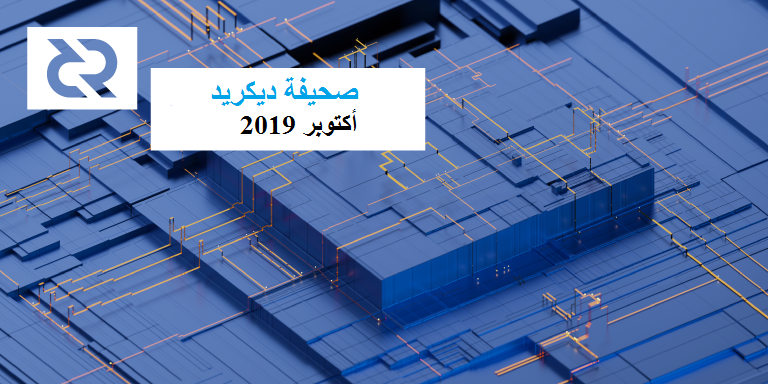

# صحيفة ديكريد لشهر أكتوبر 2019

_الصورة: تتابع المصدر بواسطة @saender_

أبرز أحداث شهر أكتوبر:

- أصبح إصدار نسخة المرشح 1.5 ل dcrd جاهزا للإختبار. وهو يضم التغيير في قواعد الإجماع لإضافة إلتزامات رَأْسِيَّة الكتلة التي تم تمويلها من قِبَل أصحاب الحصص في يونيو. سيبدأ التصويت على تبني هذا التغيير بمجرد تحديث عقد كافية. التحديثات الرئيسية الأخرى عبارة عن عوامل ترشيح جديدة للعملاء ذوي الوزن الخفيف وإصلاح شامل للبنية التحتية للتعدين وتحسين الأداء وميزات الشبكات الجديدة و أشياء أخرى.
- بدأت i2 Trading في توفير السيولة في 3 منصات للتبادل (4 أزواج)، وفقاً لمقترحهم الفائز.
- إطلاق إعادة تصميم واجهة بوليتيا! القي نظره عليه للحصول على تصميم جمالي جديد يتماشى بشكل أكبر مع برامج ديكريد الأخرى وتحسين الأداء.
- كان شهر أكتوبر شهرًا مليء بالفعاليات بحضور ديكريد، حيث مثل أعضاء المجتمع ديكريد في جميع أنحاء العالم في الفعاليات التي نظمونها وحضروها.
- شهد شهر أكتوبر أيضًا نشر منشورات رئيسية من جميع البرامج البحثية الثلاثة النشطة والرابع الذي تمت الموافقة عليه في أوائل نونبر. كان هناك أيضًا عددا من المقالات المنشورة من وسائل الإعلام الأخرى التي غطت السنة الأولى لبوليتييا (الذكرى السنوية كانت في 16 أكتوبر).

## استعدوا للتصويت لقواعد الإجماع القادمة!

يأتي التصويت على تغيير قواعد الإجماع في النسخة 1.5. [تتوفر](https://github.com/decred/decred-binaries/releases/tag/v1.5.0-rc1) الآن ثنائيات إصدار المرشح وسيتبع ذلك الإصدار النهائي.

يرجى الاستعداد للتصويت عن طريق تحديث البرنامج وتحديد خيار التصويت لتذاكر المنفردة أو عبر موفر خدمة التصويت VSP.

يمكنك تعقب التقدم على صفحة [جداول أعمال](https://explorer.dcrdata.org/agendas) dcrdata وعلى [voting.decred.org](https://voting.decred.org/).

إن زيادة مشاركة الناخبين تشكل دوماً إشارة قوية. لنقم بذلك!

## إصدار نسخة المرشح 1.5

**dcrd النسخة 1.5**

تم تنفيذ إلتزامات رَأْسِيَّة الكتلة و أصبحت جاهزة للتفعيل في انتظار إجراء تصويت ناجح على السلسلة. بعد التحديث إلى إصدار النسخة 1.5، يمكن لأصحاب الحصص تعيين تفضيلات التصويت الخاصة بهم من خلال محفظتهم أو موقع موفر خدمة التصويت (VSP). الهدف الرئيسي من هذا التغيير هو زيادة أمان وكفاءة العملاء ذوي الوزن الخفيف، مثل ديكريديتون في وضع التحقق البسيط من الدفع ومحافظ dcrandroid / dcrios للهاتف المحمول. كما أنها ستضيف بنية تحتية تمهد الطريق لعدة تحسينات مستقبلية في مجال التوسع. ويمكن الاطلاع على لمحة عامة رفيعة المستوى عن التغييرات في [مقترح بوليتيا](https://proposals.decred.org/proposals/0a1ff846ec271184ea4e3a921a3ccd8d478f69948b984445ee1852f272d54c58) الذي مول العمل.

تم تنفيذ مرشحات الكتلة الجديدة. كما تم تحديث هذه المرشحات، التي يستخدمها العملاء ذوو الوزن الخفيف مثل محافظ التحقق البسيط من الدفع SPV، لتحسين كفاءتها وبيئة العمل وضم المعلومات الإضافية مثل النص الكامل لالتزام التذاكر. مرشحات الكتلة الجديدة هي النسخة 2. ويتم الآن إهمال مرشحات النسخة 1 القديمة ومن المقرر إزالتها في الإصدار التالي، لذلك يجب على المستهلكين تحديث المرشحات الجديدة في أقرب وقت ممكن. لاحظ أن هناك تحديث قاعدة بيانات لمرة واحدة لإنشاء وتخزين المرشحات الجديدة لجميع الكتل التاريخية الحالية والتي من المحتمل أن تستغرق بعض الوقت لإكمالها (عادة حوالي 8 إلى 10 دقائق على محركات الأقراص الصلبة HDD و 4 إلى 5 دقائق على محركات أقراص الحالة الصلبة SDD).

تم إصلاح البنية التحتية للتعدين الخاصة بقوالب البناء الأساسية وتقديم العمل إلى المعدنين. تشمل التحسينات دعم إنشاء نماذج الخلفية غير المتزامنة مع المعالجة الذكية لنشر الأصوات، وتحسين التعامل مع عمليات إعادة تنظيم السلسلة اللازمة عندما لا يكون الطرف الحالي قادراً على الحصول على أصوات كافية، وتحسين تزامن الحالة الحالية، والإقتراب من إزالة القوالب القديمة عند تلقي كتل وأصوات جديدة، والاشتراكات لتحديثات قالب التدفق. كما تم تحديث [getwork RPC](https://github.com/decred/dcrd/blob/master/docs/json_rpc_api.mediawiki#getwork) القياسي الذي يستخدمه معدني إثبات العمل في الوقت الحالي لتنفيذ عملية التعدين للاستفادة من هذه البنية التحتية الجديدة، وبالتالي فإن معدني إثبات العمل الحاليين سيحصلون بسهولة على الغالبية العظمى من الفوائد دون الحاجة إلى أي تحديثات. بالإضافة إلى ذلك، يتوفر الآن [notifywork RPC](https://github.com/decred/dcrd/blob/master/docs/json_rpc_api.mediawiki#notifywork) الجديد والذي يسمح للمعدنين بالتسجيل في العمل ليتم تسليمه بشكل غير متزامن عندما يصبح متاحًا عبر [إشعار عمل](https://github.com/decred/dcrd/blob/master/docs/json_rpc_api.mediawiki#work) WebSockets. وتشمل هذه الإشعارات نفس المعلومات التي يوفرها getwork إلى جانب مُعطى إضافي للسبب. يسمح هذا المُعطى للمعدنين باتخاذ قرارات أفضل حول متى ينبغي إرشاد العاملين إلى التخلص  من القالب الحالي على الفور أو السماح لهم بإنهاء الجولة الحالية قبل أن يتم تزويدهم بقالب جديد.

يتم تشجيع المعدنين على تحديث برامجهم للاستفادة من البنية الأساسية الجديدة للإعلام غير المتزامن لأنها أكثر قوة وفعالية وأسرع من عمل الاستقصاء لتحديد الشروط المذكورة أعلاه يدويًا. **ملاحظة:** يجب أن يضمن المعدنين الذين لا يقومون بإدارة حقل الطابع الزمني عند التعدين تحديث برامجهم لتشغيل الطابع الزمني بأحدث طابع زمني في كل مرة يقومون فيها بتمرير العمل للمعدن. يساعد ذلك في ضمان دقة الطوابع الزمنية للكتلة قدر الإمكان. وقد تم استخدام الإشعارات وتداول الطابع الزمني في [dcrpool](https://github.com/decred/dcrpool).

تمت إعادة كتابة التحقق من صحة البرنامج النصي للمعاملة بشكل كامل تقريبًا لتحسين سرعته بشكل كبير وتقليل عدد عمليات تخصيص الذاكرة. وهذا من شأنه أن يقدم فوائد ملحوظة، بما في ذلك معالجة سريعة للمزامنة الأولية بنسبة 20% إلى 25%، والبث الأسرع في الأصوات (وهو ما يساعد في الحد من عدد الأصوات الفائتة)، ونشر الكتل بسرعة أكبر.

يتيح الآن الاكتشاف التلقائي لعنوان IP الخارجي لأجهزة التوصيل الكاملة إمكانية اكتشاف أجهزة التوصيل الأخرى على الشبكة بسهولة أكبر و بطريقة لا مركزية. سيؤدي ذلك إلى تنفيذ خطوات التكوين اليدوية السابقة بشكل تلقائي مثل تعيين عنوان IP خارجي على واجهة سطر الأوامر، وتكوين جدار الحماية و/أو جهاز التوجيه للاتصالات الواردة وإعادة توجيه المنفذ إلى عنوان IP الداخلي الذي يقوم بتشغيل dcrd.

تمت إضافة دعم Tor IPv6. من الممكن الآن حل والاتصال بنظراء IPv6 عبر تور بالإضافة إلى دعم IPv4 الموجود.

**dcrwallet النسخة 1.5**

الميزة الرئيسية لهذا الإصدار هو تطبيق [++CoinShuffle](https://github.com/decred/dcrwallet/pull/1541) الأولي الذي يسمح بشراء التذاكر من معاملة CoinJoin المزج الجماعي. تعد حماية خصوصية أصحاب الحصص الفرديين أمرًا في غاية الأهمية لأنها تحسن أيضًا من أمان الشبكة. يتضمن الإصدار الأولي عددًا من القيود، أبرزها الافتقار إلى دعم تذاكر موفر خدمة التصويت (VSP)، وعدم وجود واجهة مستخدم رسومية والاعتماد على الخادم المركزي للتنسيق. وسيتم تناول هذه المسائل في النسخة المقبلة. ومن الجدير بالذكر أن الخادم لا يستطيع معرفة أي المخرجات تنتمي إلى النظير، على عكس تصميمات CoinJoin القديمة.

تشمل الميزات الأخرى أجندة التصويت لتغيير خوارزميةإجماع رَأْسِيَّة الكتلة، والقدرة على [استيراد](https://github.com/decred/dcrwallet/pull/1471) المفاتيح الرئيسية التعسفية الموسعة (خطوة مهمة نحو إزالة إعادة استخدام العنوان)، علامة لمنع المحفظة من تحديث نوع العملة، وعددا من طرق RPC المفيدة، وتحسين الأداء و إصلاح أخطاء متعددة.

**ديكريديتون النسخة 1.5**

تتضمن الميزات الرئيسية لهذا الإصدار الإدماج الأولي للشبكة البرقية واستجابة حجم النافذة لمعظم الصفحات، والوضع الليلي المحدّث، وطناً من تعديلات واجهة المستخدم، وإصلاح [تحميل البيانات بشكل مفرط](https://github.com/decred/decrediton/issues/2166) وإصلاح الأخطاء الأخرى. 

**dcrlnd النسخة 0.2**

تم [نقل](https://github.com/decred/dcrlnd/pull/42) التغييرات الأولية حتى الإصدار [0.8.0 بيتا](https://github.com/lightningnetwork/lnd/releases/tag/v0.8.0-beta). وقد تم دمج ما مجموعه 379 إيداع و 90 طلب سحب. جلب هذا ميزات مثل إيداعات Safu و Watchtowers وفواتير Hodl (_بجدية، هذه مُفْرَدات رسمية_). كما تم إنجاز أعمال خاصة بديكريد لتمكين إدماج أكثر سلاسة لـ dcrlnd في ديكريديتون.

تم تحويل خوارزمية التجزئة لحساب تجزئة الدفع من Blake-256 الأولي إلى SHA-256 الأصلي. يسمح ذلك بالدفعات عبر السلسلة عبر الشبكات البرقية ل BTC/DCR/LTC. هذا **تغيير كبير**. لن تعمل الدفعات عبر القنوات التي يتم إجراؤها بين العقد التي تعمل بالنسخة 0.1 والنسخة 0.2 وستتسبب في إغلاق تلقائي للقنوات. وبما أن عدد العُقد لا يزال صغيرا، فليس من المتوقع أن يتسبب ذلك في حدوث اضطراب كبير.

أصبحت الآن المحافظ عن بعد [قابلة للاستخدام](https://github.com/decred/dcrlnd/pull/40)؛ و سيسمح هذا للمستخدمين بتشغيل dcrlnd عن طريق توصيله بمحفظة dcrwallet عن بعد بدلاً من تشغيل محفظة مضمنة. وهذا هو ما ستستخدمه الشبكة البرقية في ديكريديتون بدلاً من مطالبة المستخدمين بتحديد بيانات الاعتماد يدويًا.

راجع [صفحة الإصدار 1.5 RC1](https://github.com/decred/decred-binaries/releases/tag/v1.5.0-rc1) للحصول على التفاصيل والتنزيلات لجميع المشاريع الأربعة. و كما هو الحال دائمًا، تحقق من الثنائيات. إنها عقبة إضافية، ولكنها أفضل طريقة لضمان عدم تغيير الملفات.

تحظى مساعدة الاختبار بتقدير كبير لإصلاح أي أخطاء محتملة قبل الإصدار النهائي. يرجى الإبلاغ عن أي مشاكل تجدها في إصدار المرشحين.

## التطوير

[dcrd](https://github.com/decred/dcrd): تم [استيراد](https://github.com/decred/dcrd/pull/1907) تطبيق خوارزمية التجزئة RIPEMD-160 في مستودع dcrd، بدافع إهماله في `x/crypto` وإدارة التبعية غير الملائمة. على الرغم من أنه لا يوصى باستخدامه في التطبيقات الجديدة، إلا أنه يتعين على dcrd دعم ripemd160 _إلى الأبد_ من أجل التحقق من صحة المعاملات التاريخية ودعم البرامج النصية p2sh التي تعتمد عليها. وبشكل عام، فمن المستحسن استيعاب كل التشفير الذي يعتمد عليه dcrd لأن التطبيقات المتوافقة لها متطلبات _أكثر_ صرامة من التبعيات الخاصة بها، كما يتضح من [مشكلات](https://bitcoin.org/en/alert/2014-04-11-heartbleed) OpenSSL في البتكوين.

بعد إصدار النسخة 1.5، بدأت بالفعل التحسينات في النسخة 1.6. كما تم تمكين فهرس بحث أسرع من خلال الاستفادة من مجلة الإنفاق. وقد تم البدء في تنظيف التعليمات البرمجية التي لا يمكن القيام بها حتى إصدار النسخة 1.5. كما يستمر العمل في تقسيم خادم RPC إلى الحزمة الخاصة به كجزء من حركة أكبر لفصل المكونات. و بشكل خاص، سيتم نقل بعض التغييرات من المساهمات إلى المستودع الأولي ل btcd.

[dcrwallet](https://github.com/decred/dcrwallet): تم تحديث الكود لاستخدام وحدات جديدة من dcrwallet وأحدث الوحدات من dcrd، كما تمت إضافة كود التتبع لجمع مقاييس الأداء.

[بوليتيا](https://github.com/decred/politeia): تم إطلاق واجهة بوليتيا الأمامية المعاد تصميمها في 29 أكتوبر، مع مظهر يتوافق مع البرامج الأخرى لديكريد كما تحسنت تجربة الهاتف المحمول بشكل كبير. وقد تم نشر عدد من تحسينات الأداء في نفس الوقت. لقد مرت عدة أشهر من العمل، تهانينا لفريق بوليتيا!

أصبحت `politeiavoter` أكثر مرونة في مواجهة [أخطاء الشبكة](https://github.com/decred/politeia/pull/1022).

لا يزال العمل مستمرا في وظيفة تخليص متعاقدي ديكريد لنظام إدارة المتعاقد. وقد تم [تعزيز](https://github.com/decred/politeia/pull/1023) نظام الفوترة بطريقة لإدخال الساعات التي يعمل فيها المتعاقدين الثانويين، وستكون هذه المعلومات ضرورية لتعيين سلطة التصويت في حالة التصويت على حل النزاع لكل المتعاقدين.

[dcrstakepool](https://github.com/decred/dcrstakepool): تم إدخال تعديلات واجهة المستخدم، إصلاحات الأخطاء، والتنظيف الذي كان قيد الانتظار حتى إصدار النسخة 1.2. كما تم [حذف](https://github.com/decred/dcrstakepool/pull/560) جميع جافا سكريبت المضمن. و [تحديث](https://github.com/decred/dcrstakepool/pull/554) العديد من الوحدات النمطية إلى أحدث إصداراتها.

يستمر العمل في تنفيذ عملية شراء التذاكر [بدون حساب](https://github.com/decred/dcrstakepool/pull/515) مما يسمح بجعل البريد الإلكتروني اختيارياً، وتحسين تجربة المستخدم، وتمهيد الطريق للتخلص من إعادة استخدام عنوان التصويت.

[dcrpool](https://github.com/decred/dcrpool): تمت زيادة دقة حساب الصعوبة والهدف. كما تم تحويل المجموعة من التصويت للعمل إلى الحصول على [إشعارات](https://github.com/decred/dcrpool/pull/136) العمل عبر `notifywork` الجديد في dcrd والاستفادة من معطى `reason` الجديد. وبهذا يستوفي dcrpool جميع التوصيات للعمل مع dcrd النسخة 1.5 بأقصى قدر من الكفاءة.

[cspp](https://github.com/decred/cspp): تمت إضافة القدرة على حفظ تقارير JSON وCSV عن المزيج المكتمل وإصلاح الأخطاء.

[dcrdex](https://github.com/decred/dcrdex): تلقت المواصفات عدة [تغييرات](https://github.com/decred/dcrdex/pulls?q=is%3Apr+merged%3A2019-10-01..2019-10-31+label%3Aspec)، بما في ذلك تبديل عقد المقايضة الذرية إلى P2SH واستبدال JSON-RPC ببروتوكول رسالة مخصص. كما تم إنشاء مكونات أساسية جديدة: [لوحة وصل الاتصالات](https://github.com/decred/dcrdex/pull/33)، [منسق المقايضة](https://github.com/decred/dcrdex/pull/39)، [مخزن الطلبات الثابت](https://github.com/decred/dcrdex/pull/47)، [موجه اشتراك دفتر الطلبات](https://github.com/decred/dcrdex/pull/62)، [موجه الطلب](https://github.com/decred/dcrdex/pull/65). كما تمت إضافة [عدة اختبار](https://github.com/decred/dcrdex/pull/34) Simnet.

[dcrandroid](https://github.com/decred/dcrandroid): يستمر العمل على واجهة المستخدم الجديدة من خلال [صفحة رئيسية](https://github.com/decred/dcrandroid/pull/401) تم تحسينها وغيرها من التحسينات لمحاذاة التطبيق مع توصيات تصميم التطبيقات القياسية لنظام الأندرويد. ويستمر العمل على [دعم محفظة متعددة](https://github.com/raedahgroup/dcrlibwallet/pull/57). سيسمح هذا للمستخدمين باستيراد المفتاح العمومي الخاص بهم من ديكريديتون حتى يتمكنوا من مراقبة حالة تذاكرهم من هواتفهم.

[dcrios](https://github.com/raedahgroup/dcrios): تحسينات واجهة المستخدم جارية لصفحات [استعادة البَذْرَة](https://github.com/raedahgroup/dcrios/pull/527) و[النظرة العامة](https://github.com/raedahgroup/dcrios/pull/526) و[قائمة التنقل](https://github.com/raedahgroup/dcrios/pull/524).

[dcrdata](https://github.com/decred/dcrdata): إعادة تصميم [قوائم الكتل](https://github.com/decred/dcrdata/pull/1577) وتحسينات الاتصال والأداء وإصلاح الأخطاء.

[المستندات](https://github.com/decred/dcrdocs): تمت إضافة صفحة جديدة تشرح [أوقات إنتاج الكتل](https://github.com/decred/dcrdocs/pull/995) و[أحكام المصطلحات](https://github.com/decred/dcrdocs/pull/1003) الجديدة والتحديثات الثانوية والتنظيف.

[devdocs](https://github.com/decred/dcrdevdocs): تم نقل وثائق المطور إلى Decred GitHub org. لم يتم إطلاق الموقع رسميًا، ولكن يمكن عرضه مسبقًا على [devdocs.decred.org](https://devdocs.decred.org/). إذا كان هناك أي شيء تود إضافته، فيرجى إخبارنا في [المسائل](https://github.com/decred/dcrdevdocs/issues) أو مر على قناة [documentation#](https://matrix.to/#/!tfqymymiNgzSUJTHqS:decred.org)!

[decred.org](https://github.com/decred/dcrweb): تم تحديث صفحة [منصات التبادل](https://decred.org/exchanges/) (تمت إزالة محفظة [Easyrabbit](https://github.com/decred/dcrweb/pull/741) و [Cobo custodial wallet](https://github.com/decred/dcrweb/pull/745)، وأضيفت [Koi Trading](https://github.com/decred/dcrweb/pull/731) في السوق الموازية OTC). و [أضيفت](https://github.com/decred/dcrweb/pull/729) Keybase إلى صفحة [المجتمع](https://decred.org/community/). كما تمت إضافة رسالة وحدة تحكم المطور [لتوظيف](https://github.com/decred/dcrweb/pull/743) قراصنة الإنترنت. و[أزيلت](https://github.com/decred/dcrweb/pull/738) Piwik analytics (وقبل ذلك تمت إستضافتها ذاتيا).

تم الانتهاء من أعمال الفن لموقع الويب المجدد، حيث يتم الآن إجراء نسخ للصفحات الفرعية الجديدة.

إحصائيات نشاط التطوير لشهر أكتوبر: 243 من المشاريع النشطة، 317 إيداع رئيسي، 67 ألف إضافة و 16 ألف عملية حذف من خلال 12 سجل. جاءت المساهمات من 1-8 مطورين لكل سجل.

## الأشخاص

مرحبا بالمساهمين الجدد مع دمج الكود إلى الماستر: Enrico Bonetti Vieno (على [dcrweb](https://github.com/decred/dcrweb/commits?author=ebonetti)).

نظرًا لأن مكشافنا الخاص بي المساهمين للمرة الاولى يقوم بالبحث عن التغيرات فقط، فلقد فوتنا مصممين جديدين:

- ساهم Vlad Kharlantsev (مصمم من Block 42) في إنشاء [dcrtimegui](https://github.com/decred/dcrtimegui/issues?q=author%3Aharlovski) وبيانات [dcrdata](https://github.com/decred/dcrdata/issues?q=author%3Aharlovski) منذ شهر ماي.

- ساهم Hannes Dvorjanski (مصمم من EETER) في [ديكريديتون](https://github.com/decred/decrediton/issues?q=author%3Ahqnnes) منذ نهاية شتنبر.

متأخر بعض الشيء، و لكن مرحبا بكم بحرارة بفريقنا.

مرحبًا مرة أخرى ب praxis@ الذي أعيد [إدراجه](https://github.com/decred/dcrweb/pull/742) إلى [decred.org](https://decred.org/contributors/).

إحصائيات المجتمع:

* مستخدمي بوليتيا: 190 (9+)
* متابعو التويتر: 40,632 (54+)
* المشتركين في ريديت: 9,656 (25+)
* مستخدمي الماتريكس: 456 (20+)
* مستخدمي السلاك: 6,858 (7+)
* مستخدمي الديسكورد: 2,542 (55+) تم التحقق من 358 (33+) ليقوموا بالتعليق.
* مستخدمي التيليجرام: 2,967 (81-)
* المشتركين في اليوتيوب: 3,860 (30+)
* متابعي الفيسبوك: 3,296 (18+)، إعجاب: 3,019 (16+)
* متابعي لينكد إن: 638 (+16)
* نجوم Github dcrd: بلغت 517 (0+)، تفرعات: 1,400 (6+)

## الإدارة و الحوكمة

تم الدفع إلى المتعاقدين لشهر غشت في 2 أكتوبر وتم الإبلاغ عنه في [العدد السابق](https://xaur.github.io/decred-news/journal/201909.html) من المجلة، وقد تم إستثناءه من الأرقام أدناه.

تلقت [الخزنة](https://explorer.dcrdata.org/address/Dcur2mcGjmENx4DhNqDctW5wJCVyT3Qeqkx) في شهر أكتوبر 14,970 DCR وأنفقت 12,539 DCR. باستخدام معدل المتوسط اليومي لشهر أكتوبر ب DCR/USD والذي يقدر ب 15.59 دولارًا، ستكون الخزينة قد تلقت 233 ألف دولارا وأنفقت 195 ألف دولارا. ووفقًا لمتوسط السعر اليومي في شتنبر البالغ 22.02 دولارًا ، فإن قيمة الفَوترة بالدولار الأميركي عن العمل المنجز في ذلك الشهر يكون قد بلغ 276 ألف دولار. وفي 5 نونبر، بلغ رصيد الخزينة 643.041 DCR (أي 12.8 مليون دولار أمريكي بسعر 20.00 دولار أمريكي).

نشرت 5 مقترحات جديدة في أكتوبر (الحال حتى 8 نونبر):

- تمت الموافقة على [اقتراح](https://proposals.decred.org/proposals/2ef74fa5f0b558442cb85b1235c8c551a51ff5d8b8de44dead48b8b59c8fc1de) DCR Comic لإنتاج 6 قِصَص مُصَوَّرة أخرى بتكلفة 10,800 دولار بموافقة 65٪ ونسبة مشاركة 28٪.
- تم رفض [اقتراح](https://proposals.decred.org/proposals/1b4b72fa08792b6500ef770546c24ee751c2b0fee2975db769722524a2754829) Coffee Points الذي يسعى للحصول على 283,000 دولار لفتح المقاهي وبناء نظام نقاط مكافآت ديكريد بموافقة 3٪ وبمشاركة 25٪.
- [مقترح](https://proposals.decred.org/proposals/65bde4146b845e7e839d6916d4d8f642bc39c250df5379c2f1e26c4ab778ec1a) البحث و التعليم ديكريد ظاهرة إقتصادية ل ammarooni@ يطالب ب 2,000 دولار بدل العمل الذي تم إنجازه بالفعل و 6,000 دولار لمدة 3 أشهر أخرى من العمل. تمت الموافقة عليه بدعم 80٪ ونسبة إقبال بلغت 29٪.
- [مقترح](https://proposals.decred.org/proposals/5a1bd4116565d107c1672799ed16cae9e92ec633c6e39d9b463b8218e66ff759) تمويل جائزة لألعاب DotA 2 عبر الإنترنت طلب 450 دولارًا أمريكيًا مقابل الجوائز وتكاليف المشرف. وقد رفض بنسبة 3% وبنسبة مشاركة 28%.
- تم التخلي عن [اقتراح](https://proposals.decred.org/proposals/42b16d2741d58903963d8535e04017bbc3a8193391a83b305f44c082b62e3aa8) للتمويل الجزئي لمشاركة evok3d@ في مؤتمر الهاكرز بقيمة 2,050 دولاراً. وقد قام أمين بتحرير الاقتراح مع روابط للحديث وتقرير، وذكر أنه لا ينوي متابعة الاقتراح أكثر من ذلك، مضيفاً عنوانًا للتبرع بدلاً من ذلك.

بلغت بوليتيا سنة واحدة من العمل في 16 أكتوبر، وقد تميزت هذه المناسبة بعدد من المنشورات:

- تغريدات مع إحصائيات من [Dustorf@](https://twitter.com/lefebvre_dustin/status/1184511963965079552) و [BlockCommons@](https://twitter.com/BlockCommons/status/1184581107578298369)
- [تقرير](https://blockcommons.red/publication/politeia-at-1/) عن البيانات من السنة الأولى لبوليتيا بواسطة richardred@
- مقابلة مع jy-p@ كتبت في [مقال](https://cryptobriefing.com/decred-politeia-decentralized-governance/) Crypto Briefing
- استعراض مصور [بالفيديو](https://www.youtube.com/watch?v=58gTCW7DTMg) بواسطة Exitus@
- [عَرْض تاريخيّ](https://blockcommons.red/post/year-of-politeia/) بواسطة richardred@

بدأت عملية إعادة تصميم بوليتيا في 29 من أكتوبر، الأمر الذي جعل الموضوع متماشياً مع مشاريع ديكرد الأخرى، الأمر الذي أدى إلى إدخال عدد من التحسينات الإضافية على الأداء. وقد نشر lukebp@ [تغريدات](https://twitter.com/lukebp_/status/1189219953855082497) عنها، بما في ذلك ملاحظة مفادها أن بوليتيا تستطيع استخدام مطور واجهة موهوب آخر.

قدم degeri@ [تحديثا](https://bounty.decred.org/2019/10/status-update/) عن برنامج المكافأة. وتم تجهيز 16 تقريرا جديدا منذ يوليوز، كان واحد منها مؤهلا للحصول على تعويض — وهي [مسألة](https://github.com/decred/dcrdata/pull/1563) أمنية في dcrdata (تم إصلاحها الآن).

بدأ مستودع [المقترحات](https://github.com/decredcommunity/proposals) في غشت بفكرة رفيعة المستوى لتكون مكانا يمكن فيه لأصحاب الحصص أن يجدوا بسرعة جميع المعلومات الهامة عن المقترحات. وقد تم جمع البيانات الأولية لمقترحات [منصة التبادل اللامركزي](https://github.com/decredcommunity/proposals/tree/master/dex) و[صناع السوق](https://github.com/decredcommunity/proposals/tree/master/market-makers) وتضمنت فهارس الوثائق والمناقشات المهمة وتحليل المقترحات المذكورة. في أكتوبر، تم توسيع نطاق المستودع ليشمل أيضًا فهرسة التسليمات واستضافة تحديثات التقدم للمقترحات المعتمدة. وأضيفت الدفعة الأولى من الفهارس والتحديثات من أجل [بحوث المصدر المفتوح](https://github.com/decredcommunity/proposals/tree/master/research-richardred)، و [ديتو للعلاقات العامة](https://github.com/decredcommunity/proposals/tree/master/pr-ditto) و [برنامج إيجاد العلة](https://github.com/decredcommunity/proposals/tree/master/bug-bounty-program)، و هناك المزيد. ويتمثل الهدف الرئيسي في تحسين عملية إعداد التقارير والإشراف.

تم بدء مستودع [الإرشادات](https://github.com/decredcommunity/guidelines) لجمع الوثائق الإرشادية من عدة مساهمين في ديكريد. و قد تم نقله الآن إلى decredcommunity org لاستضافة كتاب قواعد المجتمع الجديد.

لمزيد من التغطية المتعمقة للحوكمة، انظر بوليتيا دايجيست العددين [23](https://www.blockcommons.red/politeia-digest/issue023/) و [24](https://www.blockcommons.red/politeia-digest/issue024/).

# الشبكة

معدل الهاش: افتتحت معدلات الهاش في شهر أكتوبر على ~446 Ph/s وأغلقت على ~452 Ph/s، وبلغ قاعها عند 339 Ph/s كما بلغت ذروتها عند 686 Ph/s على مدار الشهر. توزيع معدلات الهاش للتجمع اعتبارا من 2 نونبر حسب [dcrstats.com](https://dcrstats.com/pow):

* UUPool بنسبة 19%،
* Poolin بنسبة 15%،
* F2Pool بنسبة 5.6%،
* lab.antpool.com بنسبة 5%،
* BTC.com بنسبة 2.4%،
* Luxor بنسبة 1.95%،
* Coinmine بنسبة 0.10%،
* BeePool بنسبة 0.10%،
* suprnova بنسبة 0.01%،
* وأخرى بنسبة 50%.

أرقام توزيع التجمع تقريبية ولا يمكن تحديدها بدقة.

بلغت نسبة المصادر "الأخرى" (غير المعروفة) 50% في 2 من نونبر الثاني مقارنة بنسبة 30% في 2 من أكتوبر.

اعتبارا من 8 نونبر، بلغ تغير معدل الهاش في الثلاثين يوما الماضية -24٪ حسب [dcrdata](https://explorer.dcrdata.org/). وفي الفترة ما بين 9 إلى 25 أكتوبر، انخفض متوسط معدل الهاش من ~500 إلى ~400 Ph/s والصعوبة من ~38B إلى ~29B. ويرتبط هذا الانخفاض بسعر DCR/USD الذي نَزَلَ إلى 16.5 دولارا ثم إلى 13 دولارا. 

التحصيص: بلغ متوسط سعر التذكرة لمدة 30 يوما 132.3 DCR (أي بزيادة 3.6) حسب dcrstats.com. وتفاوت السعر بين 120.8 و 142.3 DCR. وقد بلغ المبلغ المقفل 5.22-5.38 مليون DCR، وهو ما يعادل 49.59-50.97% من الإمدادات المتاحة.

[لوحظت](https://explorer.dcrdata.org/charts?chart=missed-votes&zoom=jo8rgw2w-k2qdkju0&bin=window&axis=time) زيادة كبيرة في الأصوات المفوتة في 18-19 أكتوبر (بفضل الرسم البياني الجديد). لا توجد معلومات عن السبب الجذري.

العقد: طوال شهر [أكتوبر](https://charts.dcr.farm/d/000000014/nodes?orgId=1&from=1569888000000&to=1572566400000)، كان هناك حوالي 146 عقدة استماع و 402 من العقد الإجمالية حسب dcr.farm. واستنادًا إلى متوسط عدد العُقد الشهرية، 76% يشغلون dcrd النسخة 1.4.0، و7.5% النسخة 1.5.0 و0.7% بناء قبل التطوير النسخة 1.6.0. 9.4% من العقد كانت عبارة عن dcrwallet النسخة 1.4 في وضع التحقق من الدفع البسيط.

وحتى 8 من نونبر، أشار نحو 17% من الناخبين بإثبات الحصة إلى أنهم قاموا بالتحديث وأنهم على استعداد للتصويت لصالح تغيير الإجماع على القواعد، وفقاً ل [dcrdata](https://explorer.dcrdata.org/agendas). وبالنظر إلى عدم وجود نسخة نهائية من الإصدار 1.5 حتى الآن، فإنه يظهر أن الكثير من الناخبين يهتمون بتركيب إصدار الصيغة المرشحة  أو البناء من المصدر.

ووفقاً [للتغريدة](https://twitter.com/decredproject/status/1183770504580206593) الصادرة في 14 من أكتوبر، فإن نحو 15% من التذاكر تستخدم المعاملات الخاصة، الأمر الذي يجعل مجموعة إخفاء الهوية 7.5% من إجمالي تذاكر DCR المتداولة.

## الانتشار

استمر تنفيذ أنشطة الإنتشار الخاصة ببيان الخصوصية، بما في ذلك [حلقة](https://www.youtube.com/watch?v=iWdA1C-SHSk) Decred Assembly التي تضمنت jrick@، ولكن التركيز تحول إلى المواضيع العامة مثل الحوكمة، والمنظمات المستقلة اللامركزية، والمشاريع قيد الإعداد. تم نشر [دليل منظّم المجتمع](https://github.com/decredcommunity/guidelines/blob/master/community-organizer-playbook.md) لمشاركة أفضل الممارسات مع أعضاء المجتمع ويتضمن دليل الفعاليات الذي تم بدؤه بواسطة eSizeDave@ و zohand@ من أستراليا. تم تصميم هذه الأدوات للمساعدة في تمكين أعضاء المجتمع من بناء النظام البيئي لديكريد للمستخدمين والمطورين والشركاء والوسائط في جميع أنحاء العالم. إذا كنت ترى طرقًا لتحسينه، فيرجى التعليق [هنا](https://github.com/decredcommunity/guidelines/pull/5).

أصدرت ديكريد في العمق حلقتين في أكتوبر:zubair@ عن [أمن DCR](https://www.youtube.com/watch?v=FX2ZncHIAd4) و Alex Feinberg عن [منظور OKCoin](https://www.youtube.com/watch?v=UBRjkjbmYDc). وقد ساهم أعضاء المجتمع عبر النظام البيئي بشكل كبير في جهود التوعية والتعليم، وعلى الأخص [BlackBearXVII@](https://medium.com/@imagnusholdings)، الذي ينشر سلسلة عبر Medium من عشرة أجزاء عن ديكرد؛ permabullnino@، الذي نشر [ديكريد على السلسلة: نظرة على إعانات الكتلة](https://medium.com/@permabullnino/decred-on-chain-a-look-at-block-subsidies-6f5180932c9b)؛ Checkmate@، الذي أصدر مجموعة واسعة من مواضيع البحث والتغريدات؛ Exitus@، الذي سجل [فيديو](https://twitter.com/coveryfire7777/status/1186075335076528130) عن السنة الأولى لبوليتيا؛ و richardred@، الذي نشر سلسلة تغريدات عن بيانات السنة الأولى لبوليتيا، فضلاً عن [إنتاج نظير في Crypto Commons](https://twitter.com/RichardRed0x/status/1190315513043472385)، وهو كتاب مجاني كان يعمل عليه منذ بداية عام 2019.

مع اقتراب موعد تحديث موقع الويب، وتنامي في نشاط وسائل التواصل الاجتماعي لديكريد، واستمرار تدفق البحوث والمواد المنشورة، أصبحت ديكريد في طريقها إلى سد الفجوة في عدم تناسق المعلومات.

إنجازات ديتو لشهر أكتوبر:

- تأمين 13 مقالا للتغطية الإعلامية، بما في ذلك

  - مقال خاص في [Crypto Slate](https://cryptoslate.com/data-shows-autonomous-coin-decred-has-a-power-law-relationship-with-bitcoin/) بعنوان "البيانات تظهر أن العملة المستقلة ديكريد لها علاقة قانون السلطة مع البتكوين".
  - مقال إخباري في [Crypto Briefing](https://cryptobriefing.com/decred-politeia-decentralized-governance/) عن الذكرى السنوية الأولى لبوليتيا.
  - تعليق jz@ على البتكوين كمخزن للقيمة في [CCN](https://www.ccn.com/bitcoin-best-store-of-value-over-last-decade/).
  - تعليق جيك على ليبرا في أربعة منافذ: [AMB Crypto](https://eng.ambcrypto.com/facebooks-libra-project-loses-support-from-visa-mastercard-ebay-stripe/)، و[Mobile Payments Today](https://www.mobilepaymentstoday.com/articles/zuckerberg-faces-grilling-as-skeptical-house-panel-hears-case-for-libra-digital-currency/)، و[Daily Hodl](https://dailyhodl.com/2019/10/12/facebooks-david-marcus-cites-intense-pressure-as-ebay-visa-mastercard-stripe-paypal-abandon-crypto-project/amp/)، و[Crowdfund Insider](https://www.crowdfundinsider.com/2019/10/152831-terrifying-the-idea-that-global-centralized-monopolies-like-facebook-would-also-control-money/).
  - مقابلة مع Zubair على [Bloxlive](https://bloxlive.tv/video/MTc0Mg==/zubair-zia-explains-the-decred-digital-currency-and-its-origins).
  - مقابلة مع جيك على Brave New Coin [بودكاست محادثة العملة الرقمية](https://bravenewcoin.com/insights/podcasts/decreds-privacy-flow-building-a-better-bitcoin-and-the-legend-of-satoshi) - وهي واحدة من أفضل العروض التي قام بها جيك حتى الآن.
  - مقابلة مع Luke على [بودكاست The Daily Chain](https://anchor.fm/thedailychain/episodes/Decred---a-Bitcoin-Hedge-e5rhmt)، حيث يشرح ببلاغة مشكلة التفرع الصلب للبتكوين.
  - مقال في [Crypto Briefing](https://cryptobriefing.com/eos-governance-ico-settlement/)، يناقش فيه جيك حوكمة الإيوس وإقبال ناخبي ديكريد.

- قدم الدعم للعلاقات الإعلامية لحضور ديكريد قمة الويب: حيث قام بإنشاء كتاب إعلامي رفيع المستوى، وحدد المراسلين الذين سوف يلتقون، إلخ.
- برمج أربعة مقابلات إعلامية مع Akin في World Crypto Conference، بما في ذلك واحدة مع أنثوني بومبيانو "Pomp"، ونيكول غرينستيد من برنامج العرض التلفزيوني Crypto، وجيمي بيرالتا على Digit-All network show، وغريغ ويلسون من Legacy Research.
- بدأ محادثات مع المراسلين في الاتجاه السائد حول مفهوم التنظيم المستقل اللامركزي ومستقبل مكان العمل (مجهول الهوية).

# الفعاليات

الحضور:

* 18 سبتمبر - [اللقاء المشترك للبتكوين و سلاسل الكتل](https://www.facebook.com/events/959839374354073/) - أوكساكا، المكسيك. وكانت حلقة عمل عملية نظمها evok3d@ وحضرها 10 أشخاص. وشملت مواضيع الأمن، والحوكمة، ونظام الاقتراحات، وتطبيقات سلسلة الكتل. ([الصور](https://twitter.com/Decred_ES/status/1174803011610259456)، _تم تفويتها في عدد شتنبر_)
* من 4 إلى 5 أكتوبر - [مؤتمر سلسلة الكتل والأصول الرقمية](https://www.eventbrite.com/e/abuja-blockchain-digital-assets-conference-2019-tickets-67571336687) - أبوجا، نيجيريا. قام فريق مجموعة Raedah بإدارة كشك ديكريد وأجابوا على الأسئلة. ([التقرير](https://github.com/decredcommunity/events/blob/master/reports/20191004-blockchain-digital-asset-conference-abuja-nigeria.md)، الصور: [1](https://twitter.com/beansgum/status/1180117854240288768)، [2](https://twitter.com/raedahgroup/status/1180930491244937216))
* 4-6 أكتوبر — [مؤتمر المخترقين](https://opt-out.hcpp.cz/) - براغ، الجمهورية التشيكية. قام evok3d@ بتقديم حوكمة ديكريد، نموذج التمويل والخصوصية كجزء من [حديثه](https://www.youtube.com/watch?v=fmgNbLGCO5U) (في الساعة [23:53](https://www.youtube.com/watch?v=fmgNbLGCO5U&t=23m53s))، كما تحدث عن ديكريد خلال [مقابلة](https://www.youtube.com/watch?v=dq2SGpI5-Gw) مع شبكة Crypto العالمية (في الساعة [22:37](https://www.youtube.com/watch?v=dq2SGpI5-Gw&t=22m37s)). تم نشر التقرير الكامل على [Medium](https://medium.com/@evok3d/decred-report-hackers-congress-paralelni-polis-hcpp19-bd8e634f93de) وتم [عكسه](https://github.com/decredcommunity/events/blob/master/reports/20191004-hackers-congress-prague-czech.md) على الفعاليات. انظر أيضا [اقتراح](https://proposals.decred.org/proposals/42b16d2741d58903963d8535e04017bbc3a8193391a83b305f44c082b62e3aa8) بوليتيا ذا الصلة.
* 8 أكتوبر - [تكنولوجيا الثلاثاء](https://www.meetup.com/PermanentBeta/events/qtcrhryznblb/) - أوترخت، هولندا. كان جزءا من اجتماع أكبر ركز على التكنولوجيا بشكل عام (المدن الذكية، إنترنت الأشياء، القرصنة البيولوجية، إلخ). عرف evok3d@ المنظمين لذا سهل مسار سلسلة الكتل أثناء اللقاء. ظهر 4 أشخاص مهتمين (طالبة واحدة، لقد تأثرت حقًا بعد ورشة العمل). كما قدم Haon@ عرضًا قصيرًا عن محفظة ديكرد.
* 10 أكتوبر - [Devcon 5](https://devcon.org/) - أوساكا، اليابان. تحدثت joshuam@ عن حوكمة ديكريد. ([الصور](https://twitter.com/kate_sills/status/1182474689995653120))
* 13 أكتوبر - [O-link بواسطة Odaily](http://odaily001.huodongxing.com/event/2511153700300) - شيان، الصين. شارك Dominic@ في فريق مناقشة وتحدث عن خصوصية يكريد. [الصور](https://twitter.com/wanbihou/status/1184183795940880384))
* 16 أكتوبر — [لقاء مهرجان المنظّمة المستقلة اللامركزية](https://thenextweb.com/hardfork-summit/events/daofest-amsterdam-meetup) — أمستردام، هولندا. [تحدث](https://www.youtube.com/watch?v=Jt_2vk-hf4o&t=19m38s) evok3d@ عن نموذج حوكمة ديكريد، وانضم Haon@ إلى فريق مناقشة حول المنظمات المستقلة اللامركزية. وتلا الحدث الرئيسي جلسة عمل للشبكة. ([التقرير](https://github.com/decredcommunity/events/blob/master/reports/20191016-daofest-amsterdam-netherlands.md))
* 17 أكتوبر - الجامعة التكنولوجية - موريليا، المكسيك. قدم كل من luisantoniocrag@ و francov\_@ تقنية سلسلة الكتل والعملات الرقمية و ديكريد إلي أكثر من 100 شخص (معظمهم من الطلاب وبعض الأساتذة). سمع الناس عن ذلك لأول مرة وأصبح لديهم فضول كبير. من بين الأشياء التي لفتت انتباههم "لا يهم درجة الجامعة أو العمر أو الجنسية أو أي شيء آخر لتكون قادرة على العمل والقيام بأشياء عظيمة". كما طلبوا ورشة عمل للمتابعة. بعد المحادثات، تمت دعوة الفريق إلى Talent Nights، وهي فعالية مهمة لرجال الأعمال. ([التقرير](https://github.com/decredcommunity/events/blob/master/reports/20191017-decred-meetup-morelia-mexico.md)، [الصور](https://matrix.to/#/!aNPTuiryMFmdMQWUzb:decred.org/$1571354151416323TNRDg:matrix.org))
* 18 أكتوبر — [جمعة العملات الرقمية](https://www.meetup.com/Crypto010-Rotterdam-Virtual-Currency-Blockchain-Meetup/events/264476624/) — روتردام، هولندا. حضر حوالي 20–30 شخص، تحدث evok3d@ عن التنظيم الذاتي اللامركزية و بوليتيا. سيتم تحميل الصَوْتيّات قريبًا. ([الصور](https://mega.nz/#!R2pgAKSB!bHjwi3t3N687xNpec4YDTnl0pBhJcMJ1HFtdDk0ou28))
* 20 أكتوبر — جمعية الوفاء — الدار البيضاء، المغرب. خلال [لقاء](https://github.com/decredcommunity/events/blob/master/reports/20190921-decred-meetup-casablanca-morocco.md) ديكريد بالدارالبيضاء الذي أنعقد في شتنبر طلب من Arij@ تقديم سلسلة الكتل في جمعية الوفاء. وحضر نحو 20 شخصا معظمهم من الطلاب. لقد تحدثت Arij@ عن أساسيات سلسلة الكتل وأنظمة الإجماع لمدة ساعتين كاملةً. كان الناس جددًا على التكنولوجيا وطلبوا عرضًا تقديميًا آخر لمعرفة المزيد. ([التقرير](https://github.com/decredcommunity/events/blob/master/reports/20191020-wafaa-casablanca-morocco.md))
* 23 أكتوبر — مختبر ابتكار البنك الدولي — واشنطن العاصمة، الولايات المتحدة الأمريكية. قامت akinsawyerr@ بعرض عام حول ديكريد لموظفي مختبر الابتكار التابع للبنك الدولي. كما تعمق الحوار في السبل التي يستطيع البنك الدولي من خلالها الاستفادة من البنية الأساسية لديكريد في بعض المشاريع المتعلقة بإثبات المفهوم.
* 24 أكتوبر - [ليلة تصاعدية](https://www.eventbrite.com/e/bullish-night-at-bull-and-bear-academy-tickets-77415737555) - مدينة مكسيكو، المكسيك. تحدث elian@ مع مجتمع المتداولين في المكسيك ولاتام وألقى نظرة موجزة حول ماهية ديكريد. ديكريد كان راعيا. ([الصور](https://twitter.com/Decred_ES/status/1187534463569289216))
* 24 أكتوبر - [ورشة عمل العملة الرقمية](https://twitter.com/Decred_ES/status/1187206051000655872) - موريليا، المكسيك. قام كل من francov\_@ و luisantoniocrag@ بتقديم ورشة عمل لمدة 4 ساعات في جامعة موريليا التكنولوجية حيث أظهروا كيفية استخدام محفظة ديكريد. على عكس حديث 17 أكتوبر، كانت ورشة العمل أكثر تفصيلاً، وعلى الرغم من حضور 15 طالبا فقط، فهم جميعهم بشكل كامل عملية سلسلة الكتل و ديكريد. ليس فقط على الجانب التقني ولكن أيضا المالي. ([الصور](https://matrix.to/#/!aNPTuiryMFmdMQWUzb:decred.org/$157202936428052qbfho:matrix.org))
* 29 أكتوبر - [ورشة عمل الحكامة الرشيدة](https://www.meetup.com/Blockchain-innovation-Singapore/events/265738541/) - سنغافورة. لأول مرة في سنغافورة، قام كل من joshuam@ وzohand@ بتقديم ديكريد إلى حشد حميم في WeWork. وكان ذلك بمثابة غوص عميق في الحكامة الرشيدة والمال السليم، ونموذج حوكمة ديكريد والتصميم الإجمالي. لقد كان الحشد على دراية جيدة بالعملات الرقمية، ووجدوا المحتوى مفيدا للغاية وحولوا جلسة الأسئلة والأجوبة إلى مناقشة متعمقة لمدة ساعة. وطُلب عقد جلسة متابعة. ([التقرير](https://github.com/decredcommunity/events/blob/master/reports/20191029-decred-governance-workshop-singapore.md)، [الصور](https://twitter.com/GuangGuang168/status/1189381286458089473))
* 29 أكتوبر — [لقاء ديكرد](https://www.eventbrite.com/e/que-hace-a-decred-una-criptomoneda-diferente-primer-meetup-oficial-tickets-78464211569) — بوغوتا، كولومبيا. أعطى كل من elian@ و victorarubin@ لمحة عامة عالية المستوى عن المشروع من أصوله السايفربانك إلى إجماعه الهجين، و بوليتيا، و الخصوصية، الفريق العالمي و المستقبل. حضر الحدث حوالى 60 شخصا من جميع الأعمار من 20 إلى 50 عاما، معظمهم من محبي العملات الرقمية. من بينهم حوالي 10 إعتادوا تعدين DCR في الماضي بواسطة وحدة معالجة الرسوميات الخاصة بهم. وخلال جلسة الأسئلة والأجوبة، تلقى الفريق بعض الأسئلة الجيدة حول مركزية حوكمة ديكريد، ودور ASIC، وخطط التبني في لاتام، ومتى يمكن استخدام DCR لشراء البيرة. واشتركت في استضافة هذه الفعالية أكاديمية سلسلة الكتل بكولومبيا، ومنصة التبادل الباندا، وصحيفة [Cointelegraph en Español](https://es.cointelegraph.com/news/decred-starts-series-of-meetings-in-colombia)، و [يومية البتكوين]https://www.diariobitcoin.com/index.php/2019/10/28/colombia-blockchain-academy-realizara-primer-meetup-sobre-decred-en-bogota/)، غطى الاثنان الأخيران الفعالية على مواقعهم. (الصور: [1](https://twitter.com/Decred_ES/status/1188496680133500934)، [2](https://matrix.to/#/!aNPTuiryMFmdMQWUzb:decred.org/$157244810128246sZnzI:decred.org))
* 29 أكتوبر - [المؤتمر العالمي للعملات الرقمية](https://worldcryptocon.com/) - لاس فيجاس، الولايات المتحدة الأمريكية. قام akinsawyerr@ بتمثيل ديكريد في لجنة الحوكمة في ندوة الممارسة، وقدم عرضاً تحت مسمى "حكم مجلس العموم المشفر" حيث حدد الخطوط العريضة لعملية حكم Decred و تبادل الأفكار المستمدة من قيمة سنة من بيانات بوليتيا. كما قام Akin بتنظيم عدة مقابلات واجتماعات رتبها ديتو.

الفعالية القادمة:

* 15-16 نونبر - [CriptoBlock](https://criptoblock.com.br/) - ساو باولو، البرازيل. كانت هناك نسختان سابقتان صغيرتان لم تشارك ديكريد فيهما، ولكن هذه المرة يتوقع المنظمون حضور حوالي 1.000 شخص. ستكون ديكرد الراعي البرونزي، وسيقدم كل من Rhama@ و girino@ محادثات أساسية حول ديكريد.
* 16 نونبر - [BitConf](https://www.bitconf.com.br/portal/) - ساو باولو، البرازيل. واحدة من أكبر فعاليات العملات الرقمية في أمريكا اللاتينية. ومن المقرر عقد حوالي 3 محاضرات عن ديكريد.
* 21 نونبر — [قمة أفريقيا للتكنولوجيا المالية](https://africafintechsummit.com/addis/) — أديس أبابا، إثيوبيا. سيتحدث akinsawyerr@ في ندوة حول سلسلة الكتل.

تمت إضافة تقارير كاملة لعدة فعاليات سابقة تم الإبلاغ عنها في الإصدارات السابقة إلى مستودع الفعاليات: [مؤتمر تكنولوجيا UMSA](https://github.com/decredcommunity/events/blob/master/reports/20190611-bolivia-blockchain-community-la-paz-bolivia.md) + لقاء سلسلة الكتل للعقول البوليفية في بوليفيا؛ [قمة سلسلة الكتل لاتام](https://github.com/decredcommunity/events/blob/master/reports/20190704-blockchain-summit-latam-mexico-city-mexico.md) في المكسيك؛ [مخيم تدريب سلسلة الكتل](https://github.com/decredcommunity/events/blob/master/reports/20190828-blockchain-bootcamp-melbourne-australia.md) بأستراليا؛ [La Conexión + مهرجان العملات الرقمية بالأرجنتين](https://github.com/decredcommunity/events/blob/master/reports/20190925-la-conexion-buenos-aires-argentina.md)؛ [لقاء ديكريد المغرب](https://github.com/decredcommunity/events/blob/master/reports/20190921-decred-meetup-casablanca-morocco.md).

تمت إضافة حوالي 11 تقريرًا جديدًا لما مجموعه 30 تقريرًا. وقد ساعد ذلك في تحسين قالب التقرير و[دليل التقديم](https://github.com/decredcommunity/events/wiki/Submit-Event-Report). شكرًا جزيلاً على المشاركة والمساعدة في تجميع المعرفة.

تقوم MeetUp.com [باختبار](https://withoutbullshit.com/blog/to-meetup-if-youre-going-to-change-your-prices-be-clear-about-it) طرق استخراج أرباح جديدة. سيدفع عدد صغير من المستخدمين  المختارين 2 دولار عند حجز مكان في الفعالية. يمكن للمنظمين الآن إلغاء الاشتراك من هذا الاختبار.

## وسائل الإعلام

شهد هذا الشهر إصدار موقعين شبكيين جديدين تم إنتاجهما كجزء من برنامج [بحوث المصادر المفتوحة لديكريد](https://proposals.decred.org/proposals/67de0e901143400ae2f247391c4d5028719ffea8308fbc5854745ad859fb993f).

[نظير الإنتاج على Crypto Commons](https://www.cryptocommons.cc/) هو كتاب مجاني من تأليف richardred@. يأخذ في الاعتبار كيفية عمل عدد من الدوائر الانتخابية المختلفة (المعدنين، المطورون، التجار، المستخدمون) معًا لإنتاج سلسلة مفاتيح وإعطاء قيمة لها.

[BlockCommons.red](https://www.blockcommons.red/) هو موقع يستضيف محتوى بحثي وتعليمي حول "العملات الرقمية المشتركة"،  بما في ذلك عمليات الكتابة في [أبحاث Pi](https://www.blockcommons.red/#reports) و في [أبحاث حوكمة العملات الرقمية](https://www.blockcommons.red/crypto-governance-research/overviews/). انتقلت [Politeia Digest](https://www.blockcommons.red/politeia-digest/) أيضًا إلى هناك (على الرغم من أنه سيستمر نشرها على Medium و GitHub أيضًا).

تم إنشاء مستودع [textassets](https://github.com/decredcommunity/textassets)، لجمع النصوص من مختلف المواقع ومنصات الوسائط الاجتماعية. يسمح وجود جميع النصوص في مكان واحد بالعثور بسرعة على النصوص القديمة باستخدام بحث نصي بسيط. كما يسمح باستخدام ميزات GitHub لمناقشة التغييرات المستقبلية والتعاون عليها قبل تنفيذها (مثال آخر هو [تحديث](https://github.com/decredcommunity/textassets/pull/1) الشريط الجانبي لـريديت).

مقالات مختارة:

* [أصدرت](https://twitter.com/Delphi_Digital/status/1181228136274518016) Delphi Digital التعمق في ديكريد لمؤسساتها المشتركة (غير متاح للجمهور).
* ديكريد — منافس بديل بواسطة ammarooni@ (على [medium](https://medium.com/@Ammarooni/decred-an-alternative-contender-a3547a014745)))
* ديكريد يتبع خطوات البتكوين بواسطة Checkmate@ (على [medium](https://medium.com/@_Checkmatey_/decred-following-in-bitcoins-footsteps-f8d0e0bbaff5)) - وهو جزء من [اقتراحه](https://proposals.decred.org/proposals/78b50f218106f5de40f9bd7f604b048da168f2afbec32c8662722b70d62e4d36).
* تظهر البيانات أن العملة المستقلة ديكريد لها علاقة قانون السلطة مع بتكوين ([cryptoslate](https://cryptoslate.com/data-shows-autonomous-coin-decred-has-a-power-law-relationship-with-bitcoin/))
* [أصدر](https://twitter.com/BarnardTheBear/status/1185200240770670596) BlackBearXVII@ سلسلة من 10 أجزاء على Medium ​​(ديكريد X) ،دفعة واحدة كل 3 أيام.
    * [الجزء الأول - السرد](https://medium.com/@imagnusholdings/decred-x-part-i-narrative-41f3e08599be)
	* [الجزء الثاني -أوراق اللعب](https://medium.com/@imagnusholdings/decred-x-part-ii-deck-of-cards-33d488751f16)
	* [الجزء الثالث - التكنولوجيا](https://medium.com/@imagnusholdings/decred-x-part-iii-tech-6f1ca4546108)
	* [الجزء الرابع - الكود](https://medium.com/@imagnusholdings/decred-x-part-iv-code-c04e71c29ca4)
	* [الجزء الخامس - الملكية](https://medium.com/@imagnusholdings/decred-x-part-v-property-8b1a5570b924)
* ديكريد على السلسلة: نظرة على إعانات الكتلة بواسطة permabullnino@ (على [medium](https://medium.com/@permabullnino/decred-on-chain-a-look-at-block-subsidies-6f5180932c9b)) - جزء من [اقتراحه](https://proposals.decred.org/proposals/f0d1bd7447182328b44c691de88cb660b63df17f1f3a94990af19acea57c09bb).
* ديكريد: مخزن سليم للقيمة بواسطة Haon@ (على [medium](https://medium.com/coinmonks/decred-4cb7eb66db14)) - تم توزيعه أيضًا على مشتركي Coinmonks وعلى [التويتر](https://twitter.com/coinmonks/status/1186294858903736323).
* سنة واحدة من ديكريد بوليتيا بالأرقام والرسوم البيانية بواسطة richardred@ (على [blockcommons.red](https://www.blockcommons.red/publication/politeia-at-1/))
* ديكريد بوليتيا: الدروس المستفادة من سنة من الحوكمة اللامركزية بقلم Darren Kleine (على[cryptobriefing](https://cryptobriefing.com/decred-politeia-decentralized-governance/)) - تستحق التحقق منها من أجل الصورة فقط!
* السنة الأولى من حياة ديكريد بوليتيا بواسطة richardred@ (على [blockcommons.red](https://www.blockcommons.red/post/year-of-politeia/))

الترجمات:

تمت ترجمة مجلة لشهر شتنبر 2019 إلى العربية بواسطة arij@ و الصينية بواسطة (Dominic@ وشركائه) والبولندية بواسطة (kozel@) والإسبانية بواسطة (francov\_@ و luisantoniocrag@). شكراً جزيلاً!

أشرطة الفيديو:

* مراجعة السنة الأولى لبوليتيا بواسطة Exitus@ (على [اليوتيوب](https://www.youtube.com/watch?v=58gTCW7DTMg))
* قدم jy-p@ عرضا تقديميا حول ديكريد والخصوصية في لقاء في لوس أنجلوس بإستضافة Blockhead Capital (على [اليوتيوب](https://www.youtube.com/watch?v=JNPPMwr9TU8))
* مقابلة jy-p@ على BlockTV حول ليبرا والنهج المختلف الذي تتخذه ديكريد نحو الحوكمة.(على [BlockTV](https://blocktv.com/watch/2019-10-30/5db9ab4487a7e-resolving-corporate-governance-in-cryptocurrency))
* عنوان مؤسف ولكن غني جدا فيديو لمدة 10 دقائق حول ديكريد بواسطة Ready Set Crypto (على [اليوتيوب](https://www.youtube.com/watch?v=DtzDBnenYYY))
* ما هي المنظمة اللامركزية المستقلة؟ مقابلة مع jy-p@ على برنامج CryptoWendyO (على [اليوتيوب](https://www.youtube.com/watch?v=dF7hkxzggvk))
* قدم zubair@ ديكريد وأصوله للجمهور (على [bloxlive.tv](https://bloxlive.tv/video/MTc0Mg==/zubair-zia-explains-the-decred-digital-currency-and-its-origins))
* تجمع ديكريد — التعمق — الخصوصية مع jrick@ (على [اليوتيوب](https://www.youtube.com/watch?v=iWdA1C-SHSk))
* تولى pablito@ إنشاء الموسيقى من سلسلة كتل ديكريد (على [اليوتيوب](https://www.youtube.com/watch?v=BzTCwsmnPJ8))

الصوتيات:

* الحلقة 9 من ديكريد في العمق مع zubair@ - يتحدث Zubair عن أمن سلسلة الكتل، وكيفية عمل إثبات العمل، وهجمات الأغلبية، وقضايا إثبات الحصة، وكيف تعمل ديكريد على تعزيز نقاط القوة لدى إثبات العمل و إثبات الحصة لتعزيز الأمن. (على [اليوتيوب](https://www.youtube.com/watch?v=FX2ZncHIAd4) و [soundcloud](https://soundcloud.com/decredindepth/ep-9-zubair-zia-security-dcr-spend))
* الحلقة 10 من ديكريد في العمق مع Alex Feinberg من OKCoin - يتحدث أليكس عن خلفيته واهتمامه بسلسلة الكتل، ونقاط ضعف عملة النقد الإلزامي، وبرنامج "فلنبني البتكوين معًا"، و منصات التبادل اللامركزية، و  وكيف ترى OKCoin دورها في الفضاء. على [اليوتيوب](https://www.youtube.com/watch?v=UBRjkjbmYDc) و [soundcloud](https://soundcloud.com/decredindepth/ep-10-alex-feinberg-blockchain-exchange-process))
* الحلقة 11 من ديكريد في العمق مع [liz_bagot@](https://twitter.com/liz_bagot/status/1190279034132815872) من ديتو نتحدث عن العلاقات العامة للعملات الرقمية، وعمل ديتو على ديكريد، ولماذا لا تحتاج البتكوين إلى علاقات عامة ولكن هناك مشاريع أخرى تحتاجها، ولماذا يشكل الترويج للعملات بنشر الإشاعات أمراً سيئاً بالنسبة للاستدامة في الأمد البعيد. ([soundcloud](https://soundcloud.com/decredindepth/ep-11-liz-bagot-pr-marketing))
* الحلقة 11 من محادثات العملات الرقمية - تحدث jy-p@ عن خصوصية ديكريد وقصة منشأ المشروع، والتفاعل مع الأسماء المستعارة tacotime@ و \_ingsoc@ والتكهنات حول نواياهم. ([bravenewcoin.com](https://bravenewcoin.com/insights/podcasts/decreds-privacy-flow-building-a-better-bitcoin-and-the-legend-of-satoshi))
* بودكاست السلسلة اليومية - ديكريد - تحوط البتكوين - يتحدث lukebp@ عن ديكريد كتعزيز للبتكوين بالحوكمة والتنسيق، وفريق التطوير القوي وثقافة المصادر المفتوحة التي شجعته على بدء العمل في المشروع. ([anchor.fm](https://anchor.fm/thedailychain/episodes/Decred---a-Bitcoin-Hedge-e5rhmt))

## مناقشات المجتمع

أخبار نظم الاتصالات:

* يقوم نمط ريديت الجديد [بحقن](https://archive.today/3HoCx) المشاركات التي تم "الترويج لها" والتي لم يتم تقديمها إلى subreddit الخاص بنا مباشرة في قائمة منشوراتنا، مما يسرق مساحة رأسية تبلغ 2.5 مرة من مساحة يشغلها منشور عادي.
* تم تحديث الشريط الجانبي لـريديت عبر مستودع [النصوص](https://github.com/decredcommunity/textassets/pull/1) الجديدة واستخدام أحدث [الرسائل](https://github.com/decredcommunity/pr/blob/release/foundational-messaging.md). قد تحتاج إلى استخدام [old.reddit.com](https://old.reddit.com/r/decred/) لرؤيتها.
* تمت إضافة أسماء مستعارة جديدة لغرفة المحادثة لتكون بها كتابة أقل وتعكس المحتوى بشكل أفضل: events# (كانت event\_planning#) و media# (كانت social\_media#) و writers# (كانت writers\_room#).

منشورات مختارة من الريديت:

* [مناقشة](https://www.reddit.com/r/decred/comments/dku88o/what_does_decreds_governance_model_incentivize/) مدروسة بين bee@ و oiezz@ حول الحوافز المرتبطة بحوكمة ديكريد.
* اجتذب [منشور](https://reddit.com/r/decred/comments/dgycc3/long_term_decred_believer_and_investor_any/) حول انخفاض كبير في الأسعار 40 تعليق.
* [منشور](https://old.reddit.com/r/decred/comments/doinau/concerning_zksnarks/) يناقش إحتمالية إدماج zk-SNARKS في ديكريد
* وقد اجتذب [منشور](https://reddit.com/r/decred/comments/dmaza0/does_decred_have_bounties_for_github_issues/) يسأل ما إذا كان لدى ديكريد مكافآت لقضايا الجيتهوب 35 تعليقًا وطالب بمناقشة متعمقة لأسلوب ديكريد المفتوح المصدر والحاجة إلى المساهمين الملتزمين الذين لديهم جلد في اللعبة عندما يتعلق الأمر بالتطوير الأساسي. ولسبب ما، لم تحصل هذه المشاركة إلا على درجة 6.
* بلغ [لمنشور](https://reddit.com/r/decred/comments/dhrq4i/why_tickets_be_so_expensive/)  يسأل لماذا التذاكر غالية للغاية 22 تعليق.

نقاشات مختارة من التويتر:

* [تحديث](https://twitter.com/decredproject/status/1183770504580206593) استخدام الخصوصية، ~15٪ من شراء التذاكر تستخدم ميزة الخصوصية الجديدة.
* قام DCRComic@ بالتغريد عن القصص المصورة حول [تقديم مقترحات](https://twitter.com/DCRComic/status/1181647636492963844) و[التعدين](https://twitter.com/DCRComic/status/1184471574784741376).
* يقوم DCRtheSOV@ [بالتحديث](https://twitter.com/DCRtheSOV/status/1188943254223372289) الشهري عن بوليتيا
* [غرد](https://twitter.com/lukebp_/status/1189219953855082497) lukebp@ حول نشر إعادة تصميم بوليتيا
* [غرد](https://twitter.com/AkinSawyerr/status/1186718327219130368) akinsawyerr@ حول خفض تكاليف المعاملات باعتبارها قصة تقدم الإنسان.

## الأسواق

في أكتوبر، تم تداول DCR ما بين 12.91-17.59 دولار أمريكي / BTC 0.0015-0.0021. وبلغ متوسط المعدل اليومي 15.59 دولار.

منذ بداية الشهر أخذ السعر في الإنخفاض من 17.5 دولار إلى أقل من 13 دولار. وقد انعكس ذلك في 25 أكتوبر تقريبًا وبنهاية الشّهر عاد إلى 17 دولار.

ذكرت i2 Trading في قناة [proposals#](https://matrix.to/#/!MIGqWXfLFBwhipPKYL:decred.org/$157176144520723FSmYA:decred.org) أن أنشطة صنع السوق الخاصة بها قد بدأت رسميًا في 22 أكتوبر على جميع منصات التبادل باستثناء OKCoin، حيث هناك تعطيل. سيبدأ i2 في إعداد الفواتير اعتبارًا من 22 أكتوبر، ولن يتم فرض أي تكاليف على الاختبار السابق.

## الخارجية ذات الصلة

قامت Iterative Capital [بتقديم](https://iterative.capital/introducing-escher-hub-making-every-foss-wallet-a-cheap-and-fast-way-to-transact-bitcoin/) Escher، شبكة برقية ممكّنة داخل و خارج السلسلة والتي ستمكن من ربط الإتصال بين محافظ البتكوين و قنوات الشبكة البرقية بحسابات المستخدمين المصرفية. يمكن لمطوري محفظة العملات الرقمية FOSS الاندماج مع Escher Hub، مما يسمح للمستخدمين بإدارة المحافظ والقنوات التي يتحكمون فيها وتحويل الأموال ما بين BTC والدولار الأميركي بسهولة. وقد [صرح](https://twitter.com/chrisdannen/status/1187387952386707457) كريس دانين على تويتر بأن DCR هي العملة الرقمية الأخرى الوحيدة التي يتم التخطيط لدعمها.

تبين من [مراجعة](https://blog.coincodecap.com/dead-coins-on-crypto-exchanges/) أجرتها شركة CoinCodeCap لـ 3,162 مشروعا أن 1,240 مشروعا من هذه المشاريع لم يكن لديها أي تعليمات برمجية في 90 يومًا السابقة وبهذا المعيار تعتبر ميتة. كما يتناول التقرير منصات التبادل المركزية واللامركزية من حيث عدد المشاريع الميتة التي يدرجونها.

تم تقديم [اقتراح](https://ethereumclassic.org/blog/2019-10-06-pow-mining-explicit-social-contract/) داخل مجتمع الإيثيريوم الكلاسيكي لعقد اجتماعي صريح لصالح التعدين بإثبات العمل. كان هناك إجماع اجتماعي قوي على ما يبدو في مؤتمر ETC الأخير في فانكوفر ويتم إعداد ECIP للنظر فيه. سيقرر محرري ECIP ما إذا كان الاقتراح قد تمت الموافقة عليه، والقصد من الموافقة عليه هو الإشارة إلى معدني إثبات العمل بأن المجتمع ينوي دعمهم على المدى الطويل.

تم [اقتراح](https://coinspice.io/news/radical-proposal-bitcoin-mining-parliament-drama-ending-governance-or-more-alienating-devs/) برلمان تعدين البتكوين من قبل خافيير غونزاليس كوسيلة لتنسيق المعدنين بالتصويت بقوة تجزئتهم على المقترحات حول قواعد الإجماع.

اكتملت الجولة الثالثة من تمويل الجيتكوين التربيعي، وكتب Vitalik Buterin [منشورًا](https://vitalik.ca/general/2019/10/24/gitcoin.html) عنه. وتم التبرع بمبلغ إجمالي قدره 163 ألف دولار لـ 80 مشروعا من جانب 477 من المساهمين، بزيادة قدرها 100 ألف دولار. وقارن بوتيرين تمويل الجيتكوين بتمويل مؤسسة الإيثيريوم ووجد أنه يميل أكثر إلى تمويل المشاريع التي تحظى بتقدير المجتمع المحلي. تم تغيير إصدار التمويل التربيعي من الجولات السابقة لجعله أقل عرضة لنوع التلاعب الذي حدث.

تم [إطلاق](https://www.coindesk.com/theres-now-a-dao-for-deciding-which-blockchains-to-stake-on) StakerDAO، وهي منظمة مستقلة لا مركزية للاستثمار في سلاسل إثبات الحصة. تم إنشاء StakerDAO بواسطة الرئيس التنفيذي لشركة Tezos Capital والمستثمر الرئيسي هو Polychain Capital. وعند إطلاقه، قاموا بنشر عددا من التقارير البحثية، بما في ذلك [تقرير](https://medium.com/stakerdao/decred-research-833585a988d5) عن ديكريد.

[تدعم](https://blog.coinbase.com/coinbase-custody-now-supports-maker-governance-ced7aabfa054) Coinbase Custody حوكمة Maker، مما يسمح للأشخاص الذين يحملون MKR مع Coinbase Custody بالمشاركة في التصويت دون سحب الرموز الخاصة بهم. 

[أعلن](https://blog.makerdao.com/breaking-launch-date-of-multi-collateral-dai-announced-at-devcon-5/) الرئيس التنفيذي لمؤسسة Maker أن Multi-Collateral Dai ستطلق في 18 نونبر، و[أعلن]https://blog.makerdao.com/say-goodbye-to-cdps-and-hello-to-maker-vaults/) عن إعادة تسمية العديد من المكونات الرئيسية في 31 أكتوبر. 

أدلى الرئيس الصيني شي جين بينغ [ببيان](https://www.coindesk.com/president-xi-says-china-should-seize-opportunity-to-adopt-blockchain) إيجابي حول تكنولوجيا سلسلة الكتل وقال إن الصين يجب أن تنتهز الفرصة لتبني تكنولوجيا سلسلة الكتل. 

[تطالب](https://twitter.com/CryptoBridge/status/1178913681117196293)  CryptoBridge، "_بوابة_ إلى منصة التداول _اللامركزية_ في BitShares"، من المستخدمين التحقق من هوياتهم استجابةً لتوجيه الاتحاد الأوروبي الخامس لمكافحة غسل الأموال (AMLD5). و يؤكد [منشور المدونة](https://crypto-bridge.org/2019/10/01/introducing-user-verification/) المرتبط أن هذا أمر رائع للمستخدمين.

[حدث](https://www.coindesk.com/bitcoin-prices-slides-2-after-deribit-coinbase-flash-crash) تحطم لحظي ل BTC على Dribit و Coinbase Pro، مع انخفاض السعر من 9،150 دولارًا إلى 7،720 دولارًا على Dribit لبضع دقائق قبل الارتداد. وقد [صرحت](https://twitter.com/DeribitExchange/status/1190047067365953536) ديريبت أنهم سوف يسددون 1.3 مليون دولار من الخسائر للأشخاص الذين تأثروا سلبًا.

بعدما سئمت من تفويت سوق العملات الرقمية العالمي، قررت بولونيكس [ترك](https://blog.circle.com/2019/10/18/poloniex-to-spin-out-of-circle/) الولايات المتحدة لتركز على تبادل عالمي للعملات الرقمية تدعمه مجموعة استثمارية آسيوية. لن يتمكن العملاء الأمريكيون من إنشاء حسابات جديدة. سيتعين على الحسابات الحالية إنهاء التداول بحلول 1 نونبر وسحب أموالهم بحلول 15 دجنبر. للاحتفال بهذه الخطوة، حددت بولونيكس رسوم تداول بنسبة 0 ٪ حتى نهاية عام 2019. كالمعتاد مع عمليات الاستحواذ، ستتغير بيانات العملاء مرة أخرى. دعنا نرى ما إذا كان سيتم طلب موافقة العملاء قبل تسليم بياناتهم إلى أشخاص جدد.

ستقوم Huobi [بتجميد](https://huobiglobal.zendesk.com/hc/en-us/articles/360000659122-Arrangement-to-freeze-US-user-accounts-on-13-November-2019-GMT-8-) جميع حسابات الولايات المتحدة في 13 نونبر كجزء من تطبيق اتفاقية المستخدم التي تحظر على المستخدمين في الولايات المتحدة التداول.

[أعلن](https://www.unicef.org/press-releases/unicef-launches-cryptocurrency-fund)  صندوق الأمم المتحدة الدولي للطوارئ (اليونيسيف) أنه قادر الآن على تلقي و الإحتفاظ وصرف التبرعات ب BTC و ETH. لن يقوم الصندوق ببيع العملات الرقمية بالأموال النقدية، ولكن بدلاً من ذلك سيحتفظ بها ويصرفها. التبرعات الأولى هي من مؤسسة الإيثيريوم.

في الولايات المتحدة، قامت مصلحة الضرائب بتحديث النموذج الرئيسي الذي يستخدمه دافعو الضرائب الأفراد لإضافة سؤال حول ما إذا كان الشخص قد تعامل بالعملات الرقمية خلال السنة. ووفقًا لهذه [التغريدة](https://twitter.com/allyversprille/status/1184827340737654785)، يعتقد كبير مستشاري مصلحة الضرائب، مايكل ديزموند، أن هناك حوالي 12 مليون دافع ضرائب ينبغي عليهم الإبلاغ عن أصول العملة الرقمية.

قامت مصلحة الضرائب أيضًا ["بتوضيح"](https://www.journalofaccountancy.com/news/2019/oct/irs-income-cryptocurrency-hard-forks-airdrops-201922209.html) موقفها من استلام العملات المعدنية القادمة من التفرع والإسقاط الجوي. تم انتقاد هذا الموقف على نطاق واسع، حيث يعني ذلك أنه في كل مرة يتم فيها تفرع السجل، يجب على جميع حاملي العملة الإبلاغ عن العملة الرقمية التي حصلوا عليها في السلسلة الجديدة.

وفي هونج كونج، سحب الناس قدراً كبيراً من الأموال النقدية من أجهزة الصراف الآلي حتى أنهم نفدوا من الإمدادات. وقد [ارتفع](https://blockonomi.com/hong-kong-bank-run-bitcoin/) حجم Localbitcoins بشكل مؤقت، ثم عاد إلى المعدل الطبيعي.

سيشتري مجلس الاحتياطي الفدرالي الأمريكيّ حوالي [60 مليار دولار من سندات الخزانة](https://www.ft.com/content/baa7e796-ec38-11e9-85f4-d00e5018f061) في الشّهر لمدة 6 أشهر على الأقل. يسمونه "_النمو العضوي_ للميزانية العمومية للبنك المركزي" ويحاولون بشدة عدم تسميته _QE4_، والتي يبدو أنها اكتسبت في النهاية دلالة سلبية بعد جولات متعددة من إنشاء الأموال التي لم تحل المشكلة. فقد [بدأت](https://www.newyorkfed.org/markets/opolicy/operating_policy_190917) تدخلات بنك الاحتياطي الفيدرالي في السوق في السابع عشر من شتنبر عندما لم تكن هناك السيولة الكافية في "سوق إعادة الشراء" لبعض الأسباب. بعض الملاحظات: 1) لم يكن على بنك الاحتياطي الفيدرالي القيام بذلك منذ الأزمة المالية في عام 2008 ؛ 2) بدأ بنك الاحتياطي الفيدرالي والبنك المركزي الأوروبي تدخلاتهما في نفس الوقت تقريبًا ؛ 3) مثلما هو الحال مع البنك المركزي الأوروبي، من الصعب للغاية فهم كيف يعمل بالضبط. على غرار السؤال [السابق](https://xaur.github.io/decred-news/journal/201909.html#relevant-external) للبنك المركزي الأوروبي، من غير المعروف مدى صعوبة عمل الاحتياطي الفيدرالي لكسب المال. لا تتردد في جلب بعض الوضوح في تعليقات ريديت.

يعتقد محافظ البنك المركزي النمساوي أن التيسير الكمي للبنك المركزي الأوروبي سيؤدي إلى [نتائج عكسية](https://www.bloomberg.com/news/articles/2019-10-13/ecb-s-holzmann-says-draghi-s-qe-policy-is-counterproductive).

تم [التعرف](https://www.engadget.com/2019/10/14/linux-unix-sudo-command-security-flaw/?guccounter=1) على خلل في نظام sudo الموجود في كل مكان. سيتيح لأي شخص لديه حق الوصول إلى sudo على الجهاز الحصول على امتيازات الجذر الكاملة إذا تم استغلالها. تأكد من تحديث أنظمتك.

احتفل الإنترنت بمرور 50 عامًا. في 29 أكتوبر 1969، تم إرسال أول بيانات بين جهازي كمبيوتر - فكرة مجنونة آنذاك. كانت أول رسالة ترسلها "تسجيل الدخول" ولكن تعطل جهاز الكمبيوتر المستلم بعد الحصول على "o". "لذا، كانت الرسالة الأولى" Lo "كما في" Lo و behold". وقد [أشار](https://usa.inquirer.net/44807/ucla-anniversary-kleinrocks-technology-lab) ليونارد كلاينروك، الذي قاد التجربة، إلى أنه لا يمكن أن يكون لدينا رسالة أولى أفضل وأكثر إيجازًا. عند الحديث عن "الجانب المظلم" للإنترنت، ظل متفائلاً: "ما زلت أشعر أن الفوائد أكثر أهمية؛ لن أطفئ الإنترنت إذا استطعت "وأعرب عن اهتمامه بتكنولوجيا سلسلة الكتل.

## عن هذا العدد

هذا هو العدد 19 من مجلة صحيفة الديكريد. فهرس جميع القضايا والمرايا والترجمات متاح [هنا](https://xaur.github.io/decred-news/).

يتم نقل معظم المعلومات الواردة من أطراف ثالثة مباشرة من المصدر بعد التحقق من الحد الأدنى لصحتها. ليس لدى مؤلفي مجلة صحيفة الديكريد القدرة على التحقق من جميع الادعاءات.رجاء إحذر من أعمال الاحتيال وقم ببحثك الخاص.

[ملاحظاتك](https://github.com/xaur/decred-news/blob/docs/contributing.md#feedback) و[مساهماتك](https://github.com/xaur/decred-news/blob/docs/contributing.md) هي دائما موضع ترحيب.

الاعتمادات (بالترتيب الأبجدي):

الكتابة والتحرير: akinsawyerr و bee و degeri و Haon وrichardred و s\_ben

المراجعات والتعليقات:  davecgh و Dominic و emiliomann و evok3d و jholdstock و jz و linnutee و lukebp و raedah و zohand

صورة العنوان: saender

النسخة الأصلية لمجلة الديكريد لشهر يوليوز متوفرة على هذا الرابط [هنا](https://medium.com/decred/decred-journal-october-2019-66927ec198bf)

تمت الترجمة إلى اللغة العربية بواسطة: arij@. قام بالمراجعة abdulrahman4@.
