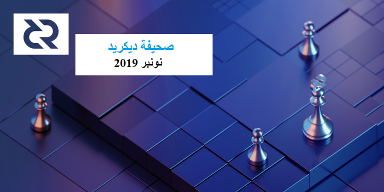

  
# صحيفة ديكريد لشهر نونبر 2019

_الصورة: نقل السلطة بواسطة saender@_

أهم أخبار شهر نونبر:

- تم إصدار المرشحين 2 و3 للنسخة 1.5.0 وتم تحديد المشاكل لكلا المرشحين (تؤثر مشكلة مرشح الإصدار 3 على ديكريديتون المشغلة على نظام الويندوز)، لذلك توقع إصدار مرشح آخر قريبًا. شكرا لكل من يساهم بتحميل إصدارات الترشيح هذه والإبلاغ عن أي خلل يصادفونه.

- شهدت البنية التحتية لمشروع التبادل اللامركزي لديكريد تقدماً ملحوظاً هذا الشهر، مع إضافة الإصدارات الأولية من محفظة ديكريد وإدارة المصادقة ومعالجة الحقبة.

- تمت الموافقة على اقتراح التسويق و الفعاليات بأمريكا اللاتينينة ل elian@، مما يجعله أول جهد تسويق إقليمي يتم اعتماده بميزانية مستقلة عن جهد التسويق الرئيسي.

- أصدر matheusd@ سلسلة ضخمة من مقالات المدونة، حيث وضع خطة لتقسيم التذاكر على الشبكة البرقية، ومزايا القيام بذلك بهذه الطريقة (الحد الأدنى للمشاركة، تجربة مستخدم أفضل)، وتغييرات قواعد الإجماع المطلوبة لتسهيل القيام بها بشكل جيد.

## التطوير

[dcrd](https://github.com/decred/dcrd): تحسينات الأداء وتنظيف الكود.

في حين تنتظر النسخة 1.5 إصدارها النهائي، فإن التطوير يتجه نحو المرحلة [1.6.0](https://github.com/decred/dcrd/milestone/24).

تم تقديم أمر [`regentemplate`](https://github.com/decred/dcrd/pull/1979) لفرض إنشاء أحدث قالب مع أي معاملات جديدة.

تم تغيير الميمبول [لطرد](https://github.com/decred/dcrd/pull/1982) أي معاملات يتيمة متبقية عندما يتم قطع الاتصال من النظير الذي تم الإرسال منه و[تعديل](https://github.com/decred/dcrd/pull/1984) سياسة المعاملات اليتيمة وفقاً للتحسينات الأخيرة.

تمت [إضافة](https://github.com/decred/dcrd/pull/2000) معيار سلسلة جديدة لتحديد الحد الأدنى الإجمالي المعروف للعمل في السلسلة. و يقوم الكود بالتحقق من أنه تم تحديث السلسلة الحالية لاستخدام العمل الكلي بدلاً من نقطة التفتيش النهائية لرَأْسِيَّة الكتلة. ولا تعتمد هذه الطريقة على نقاط التفتيش المعروفة الموثوق بها، وهي صالحة بغض النظر عن الترتيب الذي يتم به استلام القوالب ومعالجتها، وهي بشكل عام قيمة أكثر موضوعية لا يمكن إبطالها بواسطة إعادة تنظيم السلسلة.

تم [تمديد](https://github.com/decred/dcrd/pull/2002) حزمة `lru` للسماح بإدخال واسترجاع أزواج القيمة الرئيسية (بالإضافة إلى القيم فقط).

تم تحسين كتلة النسب بشكل كبير من خلال تقديم [قائمة تخطي حتمية](https://github.com/decred/dcrd/pull/2010).

[dcrwallet](https://github.com/decred/dcrwallet): إصلاح الأخطاء، أساليب جديدة، تنظيف الكود.

تمت إضافة طريقة للكشف عن [العناوين المعاد استخدامها](https://github.com/decred/dcrwallet/pull/1616) والنقاط المقابلة لها.

[ديكريديتون](https://github.com/decred/decrediton): تم القيام بالعديد من إصلاحات الأخطاء وعمليات تعديل واجهة المستخدم، وتنظيف الكود.

تمت إضافة وصلة مفصلية [لإنشاء](https://github.com/decred/decrediton/pull/2310) حساب محفظة خاص بالشبكة البرقية عند تهيئة محفظة الشبكة البرقية لأول مرة. وهذا من شأنه تحفيز المستخدمين على عدم استخدام حساب محفظتهم الافتراضي الذي من المرجح أن يحتوي غالبية أموالهم، مما قد يؤدي إلى فتح قنوات عديدة تلقائيًا في حال تحديد ميزة القيادة الآلية.

تم تنفيذ دفعة جديدة من [العروض المستجيبة](https://github.com/decred/decrediton/pulls?q=is%3Apr+merged%3A2019-11-01..2019-11-30+responsive).

تم إصلاح العديد من الأخطاء التي تم العثور عليها أثناء اختبار إصداري المرشح 1 والمرشح 2.

تم [دمج](https://github.com/decred/decrediton/pulls?q=is%3Apr+merged%3A2019-11-01..2019-11-30) 54 طلب سحب في نونبر.

[بوليتيا](https://github.com/decred/politeia): تمت [إضافة](https://github.com/decred/politeia/pull/1051) معلومات الدفع إلى الجهة الخلفية، مما يسمح لنظام إدارة المتعاقد باسترداد معلومات الفاتورة التي تم إرساؤها على politeiad بالكامل.

يتم دعم بناء politeiavoter على نظام تشغيل [الويندوز](https://github.com/decred/politeia/pull/1046) الآن.

إعادة تصميم نظام إدارة المتعاقد جارية بشكل جيد.

بدأ تنفيذ [عملية طلب تقديم العروض](https://github.com/decred/politeia/pull/1054).

[dcrstakepool](https://github.com/decred/dcrstakepool): بدأ العمل [لتمكين](https://github.com/decred/dcrstakepool/pull/571) التصويت العشوائي على التذاكر التي يملك الخادم المفتاح الخاص بها. كما يستمر العمل على تنفيذ مصادقة [كل تذكرة](https://github.com/decred/dcrstakepool/issues/568) وشراء التذاكر لإزالة حسابات المستخدمين وإعادة استخدام عنوان التصويت ومتطلبات البريد الإلكتروني.

[dcrpool](https://github.com/decred/dcrpool): العمل مستمر لإضافة [تغطية اختبار](https://github.com/decred/dcrpool/pull/141) واسعة.

[dcrlnd](https://github.com/decred/dcrlnd): إصلاحات الأخطاء وتحسين الاختبارات وبناء البنية الأساسية. و [ تحديث](https://github.com/decred/dcrlnd/pull/56) Dockerfile لـ dcrlnd.

[cspp](https://github.com/decred/cspp): زيادة مهلة RPC، وتحسين معالجة أخطاء العميل والخادم، مما سمح باستخدام خادم التدريج LetsEncrypt.

[dcrdex](https://github.com/decred/dcrdex): التطوير مُتَأَجِّج! المكونات الجديدة التي تم تنفيذها في نونبر: [مدير المصادقة](https://github.com/decred/dcrdex/pull/50)، [مسجل الحساب](https://github.com/decred/dcrdex/pull/58)، الإصدار الأولي من عميل [محفظة ديكريد](https://github.com/decred/dcrdex/pull/49)، واتصال العميل عبر [websocket](https://github.com/decred/dcrdex/pull/55)، و[معالجة الحقبة](https://github.com/decred/dcrdex/pull/66) الأولية وتخزين المطابقة، والانتقال. طريقة تحديد الأموال غير المنفقة التي تم تغييرها من txid/vout إلى [معرّف عملة](https://github.com/decred/dcrdex/issues/75) أكثر تجريدية، ربما لدعم الأصول غير المنفقة المستندة إلى ناتج المعاملات في المستقبل.

[dcrandroid](https://github.com/decred/dcrandroid): ما زال العمل مستمرا لإضافة [دعم محفظة متعددة](https://github.com/decred/dcrandroid/pull/401).

[dcrios](https://github.com/raedahgroup/dcrios): إعادة تصميم، تعديلات واجهة المستخدم، وإصلاح الأخطاء.

تمت [إعادة تصميم](https://github.com/raedahgroup/dcrios/pull/524) قائمة البحث. وإضافة نظام الإخطار لإظهار [حالة المزامنة](https://github.com/raedahgroup/dcrios/pull/529) عندما يكون التطبيق في وضع الخلفية.

يستمر العمل على [استعراض عام](https://github.com/raedahgroup/dcrios/issues/506) مجدد، و[استعادة المحفظة](https://github.com/raedahgroup/dcrios/pull/527)، و[التحقق من عرض البذرة](https://github.com/raedahgroup/dcrios/pull/530).

[dcrdata](https://github.com/decred/dcrdata): تم إصدار النسخة 5.2!

عناوين الواجهة: تحديث الترويسة و صفحة الكتل، رسوم بيانية محسنة، زر لنسخ النص إلى الحافظة للعناوين و التجزئة.

في الخلفية: دعم إصدار النسخة 1.5 ل dcrd، التخلي عن دعم SQLite للتركيز على PostgreSQL، وإصلاحات Insight API، وتحسين الأداء. تحقق من [ملاحظات الإصدار](https://github.com/decred/dcrdata/releases/tag/v5.2.0) لرؤية كل التغييرات. إستلزم الإصدار 83 إيداعا من 9 مساهمين على مدى 4 أشهر. تهانينا لفريق dcrdata!

العمل مستمر لعرض [مزج CSPP](https://github.com/decred/dcrdata/pull/1610) (مباشرة على ألفا على صفحة [الكتلة](https://alpha.dcrdata.org/block/403513)) وحساب [تكلفة الهجوم](https://github.com/decred/dcrdata/pull/1617).

[المستندات](https://github.com/decred/dcrdocs): [دليل خصوصية](https://github.com/decred/dcrdocs/pull/1029) جديد، مراجعة [شاملة للحوكمة](https://github.com/decred/dcrdocs/pull/1030)، روابط إلى [devdocs](https://github.com/decred/dcrdocs/pull/1017) الجديدة، تحديثات بسيطة وتنظيف.

[decred.org](https://github.com/decred/dcrweb): تحديثات بسيطة وتنظيف.

تمت [إزالة](https://github.com/decred/dcrweb/pull/745) محفظة Cobo custodial، مع مراعاة أنه لا ينبغي الترويج لحلول الودائع. كما تم [تحديث](https://github.com/decred/dcrweb/pull/746) صفحة التبادلات (تمت إزالة Nanex و OOOBTC).

مسائل أخرى:

* [وضع](https://blog.decred.org/2019/11/11/LN-Multi-Owner-Tickets/) matheusd@ الخطوط العريضة لمسار تنفيذ تذاكر المالكين المتعددين ("تقسيم التذاكر") على الشبكة البرقية. يتطلب القيام بذلك بشكل صحيح العديد من التحسينات التدريجية وعدد قليل من كودات التشغيل الجديدة في نظام الإجماع. المدونة تقنية جدا، ولكنها تربط إلى 4 مقالات أعمق للأقوى منا. تكمل [مناقشة](https://www.reddit.com/r/decred/comments/duzv3m/ln_multiowner_tickets_blog_post_from_matheus/) ريديت المنشورات وتعالج مجموعة من المخاوف التي قدمها bee@ ( لم يقرأ لطوله: إنها ليست استثمارًا ملحميًا فقط للتذاكر المشتركة لأن معظم التغييرات المقترحة هي تحسينات مفيدة بنفسها).
* [أصدر](https://twitter.com/karamblez/status/1197676296240861186) karamble@ [لوحة معلومات](https://github.com/karamble/dcraspaper) لديكريد ل Raspberry Pi مع شاشة EPaper.
* يقوم المطورون باختبار إصدارات قابلة للتكرار باستخدام Go 1.13 وأداة [إصدار](https://github.com/jrick/release) jrick@ (التي تمت مناقشتها [هنا](https://matrix.to/#/!HEeJkbPRpAqgAwhXWO:decred.org/$157308464734953aRCth:decred.org)). تُقدّر المساعدة لكي يتحقق المزيد من الأشخاص من عمليات البناء.

إحصائيات نشاط التطوير لشهر نونبر: 173 من المشاريع النشطة، 342 إيداع رئيسي، 72 ألف إضافة و 19 ألف عملية حذف من خلال 12 سجل. جاءت المساهمات من 1-7 مطورين لكل سجل.

## الأشخاص

مرحبا بالمساهمين الجدد مع دمج الكود إلى الماستر: zeoio (على [dcrdex](https://github.com/decred/dcrdex/commits?author=zeoio))، و githubsands (على [dcrlnd](https://github.com/decred/dcrlnd/commits?author=githubsands))، و eharris128 (على [dcrweb](https://github.com/decred/dcrweb/commits?author=eharris128)).

مساهمان جديدان فوتا في عملية الكشف في وقت سابق: neddoz (على [dcrios](https://github.com/raedahgroup/dcrios/commits?author=neddoz) منذ يونيو) و quacklabs (على [dcrios](https://github.com/raedahgroup/dcrios/commits?author=quacklabs) منذ شتنبر). مرحبا بكم معنا!

إحصائيات المجتمع:

* متابعو التويتر: 40,641 (9+)
* المشتركين في ريديت: 9,703 (47+)
* مستخدمي الماتريكس: 474 (18+)
* مستخدمي السلاك: 6,872 (14+)
* مستخدمي الديسكورد: 2,592 (40+) تم التحقق من 379 (21+) ليقوموا بالتعليق.
* مستخدمي التيليجرام: 2,903 (63-)
* المشتركين في اليوتيوب: 3,920 (60+)
* متابعي الفيسبوك: 3,307 (11+)، إعجاب: 3,027 (8+)
* متابعي لينكد إن: 662 (24+)
* نجوم Github dcrd: بلغت 520 (3+)، تفرعات: 1,400 (0+)

## الإدارة و الحوكمة

تلقت [الخزينة](https://explorer.dcrdata.org/address/Dcur2mcGjmENx4DhNqDctW5wJCVyT3Qeqkx) في شهر نونبر 14,096 DCR وأنفقت 17,889 DCR. وباستخدام معدل المتوسط اليومي لشهر نونبر ب DCR/USD والذي يقدر ب 19.97 دولارًا، ستكون الخزينة قد تلقت 281 ألف دولارا وأنفقت 357 ألف دولارا. ووفقًا لمتوسط السعر اليومي في أكتوبر البالغ 15.59 دولارًا ، فإن قيمة الفَوترة بالدولار الأميركي عن العمل المنجز في ذلك الشهر يكون قد بلغ 279 ألف دولار. واعتبارا من 2 دجنبر، بلغ رصيد الخزينة 640,201 DCR (أي 12.4 مليون دولار أمريكي بسعر 19.44 دولار أمريكي).

تم تقديم اقتراحين جديدين، أحدهما بقيمة 650 دولارًا لإصدار DCR من تطبيق نقطة البيع [PlusBit](https://proposals.decred.org/proposals/e559188b0febcab29c49c1f7dd5c66645e31be00894a150ef7d0b8ceb6486605)، وواحد بواسطة buck54321@ يطلب 30,000 دولار لمواصلة تطوير [TinyDecred](https://proposals.decred.org/proposals/ad0f9688b3467734e2581604914b2cc32c6eb7991dff460eff41d21f66d88451). وقد بدأ التصويت على كلا الاقتراحين في 3 دجبنر.

تمت الموافقة على [اقتراح](https://proposals.decred.org/proposals/5af0ce1cd325be6be39109c2750f34095c4e8feeea962ede058a1e4f4a61473e) التسويق والفعاليات بأمريكا اللاتينية من قبل elian@ بنسبة تصويت بلغت 75٪ بنعم ومشاركة ب 29٪، وتمت الموافقة على [اقتراح](https://proposals.decred.org/proposals/65bde4146b845e7e839d6916d4d8f642bc39c250df5379c2f1e26c4ab778ec1a) البحث والتعليم من قبل ammarooni@ بنسبة تصويت بلغت 80٪ بنعم ومشاركة ب 29٪ . كما تم رفض [اقتراح](https://proposals.decred.org/proposals/5a1bd4116565d107c1672799ed16cae9e92ec633c6e39d9b463b8218e66ff759) جائزة Dota2 بنسبة موافقة بلغت 5% ومشاركة 29%.

أصدر richardred@ [تقريرًا](https://www.blockcommons.red/publication/mm-tracking-1/) عن دفتر الطلبات DCR من منتصف أكتوبر إلى منتصف نونبر، حيث بدأت شركة i2 Trading في صناعة أسواق DCR متوافقة مع [اقتراحها](https://proposals.decred.org/proposals/2eb7ddb29f151691ba14ac8c54d53f6692c1f5e8fe06244edf7d3c33fb440bd9) المعتمد. وتتوفر السيولة الإضافية، على الرغم من أنها وفقاً للطريقة التي تم بها قياسها خلال هذا الإطار الزمني (حيث خلقت تقلبات الأسعار ظروفاً صعبة)، إلا أنها ربما لم تكن متوفرة مع وقت تشغيل يبلغ 90% في كل منصات التبادل والأزواج.

لمزيد من التغطية المتعمقة لنشاط بوليتيا، انظر بوليتيا دايجيست [العدد 25](https://blockcommons.red/politeia-digest/issue025/).

## الشبكة

معدل الهاش: افتتحت معدلات الهاش في شهر نونبر على ~442 Ph/s وأغلقت على ~452 Ph/s، وبلغ قاعها عند 381 Ph/s كما بلغت ذروتها عند 571 Ph/s على مدار الشهر. توزيع معدلات الهاش للتجمع اعتبارا من 4 دجنبر حسب [dcrstats.com](https://dcrstats.com/pow):

* Poolin بنسبة 35%،
* UUPool بنسبة 32%،
* F2Pool بنسبة 11.6%،
* lab.antpool.com بنسبة 6.8%،
* BTC.com بنسبة 2.8%،
* Luxor بنسبة 2.3%،
* Coinmine بنسبة 0.11%،
* BeePool بنسبة 0.10%،
* suprnova بنسبة 0.01%،
* وأخرى بنسبة 9.45%.

أرقام توزيع التجمع تقريبية ولا يمكن تحديدها بدقة.

التحصيص: بلغ متوسط سعر التذكرة لمدة 30 يوما 134.8 DCR (أي بزيادة 2.5) حسب dcrstats.com. وتفاوت السعر بين 123.9 و 150.4 DCR. وقد بلغ المبلغ المقفل 5.29-5.49 مليون DCR، وهو ما يعادل 49.50-51.17% من الإمدادات المتاحة.

ارتفع سعر التذكرة إلى مستوى جديد منذ تغيير خوارزمية sdiff، في حين أن نسبة 51.17% هي أعلى نسبة [مشاركة في التحصيص](https://explorer.dcrdata.org/charts?chart=stake-participation) على الإطلاق.

حدث ارتفاع آخر في الأصوات الفائتة في [29 نونبر](https://explorer.dcrdata.org/charts?chart=missed-votes&zoom=k0x6wa44-k3ucpasw&bin=window&axis=time).

العقد: طوال شهر [نونبر](https://charts.dcr.farm/d/000000014/nodes?orgId=1&from=1572566400000&to=1575158400000)، كان هناك حوالي 189 عقدة استماع و 398 من العقد العادية حسب dcr.farm. واستنادًا إلى متوسط عدد العُقد الشهرية، 73% يشغلون dcrd النسخة 1.4، و9.6% النسخة 1.5 لبناء قبل التطوير وإصدارات الترشيح و2% النسخة 1.6.0 لبناء قبل التطوير و 8.8% يشغلون dcrwallet النسخة 1.4.

اعتبارا من 4 دجنبر، أشار حوالي 24٪ من ناخبي إثبات الحصة إلى أنهم قد قاموا بالتحديث ومستعدين للتصويت لتغيير قاعدة الإجماع، حسب [dcrdata](https://explorer.dcrdata.org/agendas).

في 24 نونبر، تم تعدين الكتلة [400,000](https://www.reddit.com/r/decred/comments/e0yvyb/block_400000/) و الموافقة عليها من قبل الناخبين.

## الإنضمام

[أضافت](https://twitter.com/BittrexExchange/status/1194330471385186316) بيتريكس [زوج](https://global.bittrex.com/Market/Index?MarketName=USD-DCR) DCR/USD إلى منصة تبادلها. وقد قدم jz@ بعض [السياق](https://matrix.to/#/!MgQoetFiyjrHAywokv:decred.org/$157358651139766wUsaK:decred.org) وأوضح أن i2trading سيوفر السيولة في هذه السوق.

[أضافت](https://support.abra.com/hc/en-us/articles/360001777271-We-ve-added-new-cryptocurrencies-) محفظة/تبادل Abra دعم ديكريد للعملاء الأمريكيين والدوليين. ووفقًا [لهذه الصفحة](https://www.abra.com/cryptocurrency/investing-guide/)، فإن Abra لا تودع العديد من الأصول الأكبر، لكن DCR ليست واحدة منها، وبالتالي فهي مودعة.

تحذير: ليس لدى مؤلفي مجلة ديكريد أي فكرة عن مصداقية أي من الخدمات المذكورة أعلاه. يرجى إجراء البحوث الخاصة بك قبل الوثوق بمعلوماتك الشخصية أو أصولك إلى أي كيان.

## الانتشار

برزت ديكريد في شهر نونبر في عدد من الفعاليات البارزة في جميع أنحاء العالم. عاد العديد من نفس أعضاء الفريق من العام الماضي إلى قمة الويب في لشبونة، البرتغال، حيث كانت ديكريد مشروع العملة الرقمية [الوحيد](https://twitter.com/NoahPierau/status/1192045467435188224) ذو حضور مادي كبير هذا العام. كما مثل moo31337@ قطاع العملات الرقمية في ندوة بعنوان "هل يمكنك الوثوق بمصرفك؟" ، والتي يمكن مشاهدتها [هنا](https://vimeo.com/375884648). و [مثل](https://twitter.com/wanbihou/status/1193218449721311233) Dominic@ ديكريد في المؤتمر العالمي لسلسلة الكتل 2019 في جياشينغ، الصين في 8 نونبر.

قام Dustorf@ بمشاركة مسودات جميع الصفحات الفرعية ل decred.org الجديدة في غرفة writers#، وبعد مشاركة المجتمع، تم إرسال كل شيء إلى EETER للتجميع النهائي والاختبار والنشر.

تضمن تجمع ديكريد [ Deep Dive عن إصدار النسخة 1.5 لمرشح الإصدار 1](https://www.youtube.com/watch?v=gGQuY0kOt7g) مع davecgh@، وحلقات ديكريد في العمق التي تضم [liz_bagot@ عن العلاقات العامة](https://soundcloud.com/decredindepth/ep-11-liz-bagot-pr-marketing) و[akinsawyerr@ عن إفريقيا والحوكمة](https://soundcloud.com/decredindepth/ep-12-akin-sawyerr-dcr-africa-governance).

تشمل إنجازات ديتو في نونبر 9 أجزاء من التغطية الإعلامية:

* افتتاحية لـ jy-p@ في [Cointelegraph](https://cointelegraph.com/news/secrets-they-missed-at-devcon-what-its-really-like-in-a-working-dao) بعنوان "الأسرار التي فوتت في DevCon: ما الذي يعنيه حقا العمل لدى منظمة مستقلة لا مركزية".
* [بودكاست](https://podcasts.apple.com/us/podcast/base-layer-episode-086-jake-yocom-piatt-decred/id1445373535?i=1000457565007) ل jy-p@ على Base Layer Podcast مع David Nage.
* [مقال](https://www.forbes.com/sites/cbovaird/2019/11/11/who-will-win-the-race-for-digital-currency-supremacy/) في مجلة فوربس يعرض تعليق jy-p@ على السباق بين الحكومات والشركات و العملات الرقمية اللامركزية لإعادة تشكيل النظام المالي.
* تنسيق [مقابلة](https://podcasts.apple.com/us/podcast/market-disruptors/id1463411709) لـ jy-p@ على بودكاست Market Disruptors.
* [مقالتان مميزتان](https://cryptotradernews.com/technology/our-data-privacy-is-under-attack-decred-is-fighting-back/) عن خصوصية ديكريد في منفذ جديد للعملات الرقمية يدعى Crypto Trader News.
* [مقابلة](https://www.youtube.com/watch?v=4r6z9JZxRRI) بين akinsawyerr@ وشبكة أخبار Nakamoto في المؤتمر العالمي للعملات الرقمية في لاس فيغاس.
* [مقابلة](https://messari.io/podcast/developer-funding-governance-and-the-evolution-of-decred-with-jake-yocom-piat) مع jy-p@ على بودكاست ميساري Unqualified Opinions حول تمويل المطوّرين والحوكمة و ديكريد.
* [ظهور تلفزيوني](https://blocktv.com/watch/2019-10-30/5db9ab4487a7e-resolving-corporate-governance-in-cryptocurrency) على BockTV حول حل حوكمة الشركات في العملات الرقمية.

و أيضا:

* ظهرت liz\_bagot@ على نشرة [بودكاست](https://podcasts.apple.com/us/podcast/liz-bagot-pr-marketing/id1466716734?i=1000455667566) ديكريد في العمق للتحدث عن عمل ديتو مع ديكريد.
* دعم التواجد الإعلامي لديكريد في قمة الويب. وأمن مقابلة مع BBC، وسهل الاجتماعات مع CoinDesk و Cointelegraph. كما أنشأنا كتابًا موجزًا للصحفيين من المستوى العالي ليستخدمه فريق ديكريد وساعد moo31337@ على إعداد مناقشة ندوته للرفع من تأثيرها إلى أقصى حد في الفعالية.
* دعم وجود akinsawyerr@ في المؤتمر العالمي للعملات الرقمية في لاس فيغاس من خلال إعداد مقابلات على أرض الواقع مع وسائل الإعلام بما في ذلك Legacy Research، وشبكة الاخبار Nakamoto، وCrypto TV News، وغيرها.
* تأمين العديد من البودكاستات والمقابلات عبر الإنترنت لمختلف أعضاء المجتمع.
* حدَّد الفرص وشاركها للمجتمع للتفاعل مع تغريدات العملات الرقمية في التويتر وتثقيف الغرباء حول ديكريد.
* عمل عن كثب لدعم إنجازات مجتمع مطوري ديكريد على مدار العام الماضي.

كتب bee@ نظرة عامة حول [استراتيجيات التسويق](https://xaur.github.io/writings/posts/20191127-marketing-strategies.html) لاستكشافها. تتضمن بعض المواضيع الرئيسية تحسين الإبلاغ، واستخدام كلمة "المال"، وتشجيع الاستخدام الفعلي لـ DCR من أجل تقديم المعلومات، والهبات ومشاريع التمويل، وتقديم تقرير DCR إلى المجتمعات المتوائمة والأفراد كطريقة لنقل القيمة، وتعزيز وجود وسائل التواصل الاجتماعي. ([ريديت](https://www.reddit.com/r/decred/comments/e2lhwd/marketing_strategies/))

## الفعاليات

الحضور:

* 4–7 نونبر - [قمة الويب](https://websummit.com/) — لشبونة، البرتغال. أدار فريقُ ديكريد [كشكا](https://twitter.com/marco_peereboom/status/1191651269640888320) لمدة يومين. ولم يؤمن سوى [عدد قليل جدا](https://twitter.com/NoahPierau/status/1192045467435188224) من مشاريع سلاسل الكتل فرصة للتحدث، وهذا يعزى على الأرجح بسبب السوق الهابطة. وقد [تحدث](https://twitter.com/decredproject/status/1192469998175948801) moo31337@ على خشبة المسرح مع ممثلي القطاع المالي حول موضوع "هل يمكنك حقاً أن تثق بمصرفك؟". (الصور: [1](https://twitter.com/JamieHoldstock/status/1191760511878279168)، [2](https://twitter.com/NoahPierau/status/1192056049764904960)، [3](https://twitter.com/kakalordao/status/1192131145141555201)، [4](https://twitter.com/marco_peereboom/status/1192990143822454784))
* 6 نونبر - [لقاء ديكريد](https://twitter.com/amxromero/status/1192241858816217089) - ميدلين، كولومبيا. تحدث elian@ و victorarubin@ مع حوالي 40 شخصًا تراوحت أعمارهم بين 20 و 50 عامًا وطرحوا أسئلة مذهلة حول بوليتيا، وخطط ديكريد الخاصة بأمريكا اللاتينية، ومتجهات هجوم إثبات الحصة والعقود الذكية. ([تقرير](https://github.com/decredcommunity/events/blob/master/reports/20191106-decred-meetup-medellin-colombia.md))
* 7 نونبر - [رحلة 4.0](https://twitter.com/legal_medellin/status/1189918302061187073) - ميدلين، كولومبيا. تمت دعوة elian@ من قبل Legal Hackers Medellín للتحدث عن تحديات تقنية سلسلة الكتل في جامعة القانون الدولية EAFIT، وهي أكبر جامعة لإدارة الأعمال في كولومبيا. أصبح الطلاب مهتمين بمفهوم المنظمة المستقلة اللامركزية المتواجدة في كل مكان و لا مكان و التي لا تتناسب تمامًا مع الأطر القانونية التقليدية. ([تقرير](https://github.com/decredcommunity/events/blob/master/reports/20191107-journey-4-medellin-colombia.md))
* 8 نونبر - [مؤتمر سلسلة الكتل العالمي](https://www.8btc.com/wbc-2019/) - جياكينج، الصين. قام Dominic@ بتمثيل ديكريد وتحدث عن المنظمة المستقلة اللامركزية وميزات الخصوصية. وقد وردت تقارير عن تحوله إلى [إنسان آلي](https://twitter.com/wanbihou/status/1192484367626424321) في حفلة سبقت الفعالية. يُنصح أعضاء المجتمع المحلي في المنطقة باتباع البروتوكولات القياسية واتخاذ الاحتياطات اللازمة. وقد تسربت لقطات فيديو [للرقص](https://twitter.com/wanbihou/status/1193154668601327617) الروبوتي وشعلت شرارة [DecredDanceChallenge#](https://twitter.com/hashtag/DecredDanceChallenge). (الصور: [1](https://twitter.com/wanbihou/status/1192806081568722944)، [2](https://twitter.com/wanbihou/status/1193218449721311233))
* 15 نونبر - [قمة الخدمات المصرفية المفتوحة والتكنولوجيا المالية وسلسلة الكتل](https://twitter.com/Decred_ES/status/1195025379255144448) في مكسيكو سيتي، المكسيك. تمت دعوة elian@ للتحدث عن الهويات الرقمية. وأثناء انعقاد اللجنة قدم نبذة موجزة عن ديكريد وأهمية أمن البيانات الشخصية وخصوصيتها، ولاحظ المفاضلة الصعبة بين وسائل الراحة و (زر "نسيت كلمة المرور؟") والتحكم الذي توفره الهويات ذات السيادة الذاتية. ([تقرير](https://github.com/decredcommunity/events/blob/master/reports/20191115-open-banking-summit-mexico-city-mexico.md))
* 15-16 نونبر - [CriptoBlock](https://criptoblock.com.br/) - ساو باولو، البرازيل. ألقى Rhama@ و girino@ محادثات حول ديكريد. وعلى الرغم من أن المنظمين قد عملوا بجد، إلا أن حوالي 250 شخصًا حضروا من بين 1,000 و إلى 1,200 شخص متوقع، وهو ما يعكس سوق اليوم. كانت ديكريد راعيا برونزيا.
* 21 نونبر - [قمة سلسلة الكتل الإفريقية](https://www.africablockchainsummit.com/agenda.html) - الرباط، المغرب. انتهزت arij@ الفرصة لاكتشاف وجهة نظر المنظمات المركزية وتمثيل ديكريد لمجموعة واسعة من الأشخاص من خلفيات مختلفة. ([تقرير](https://github.com/decredcommunity/events/blob/master/reports/20191121-africa-blockchain-summit-rabat-morocco.md))
* 21 نونبر - [قمة إفريقيا للتكنولوجيا المالية](https://africafintechsummit.com/addis/) — أديس أبابا، إثيوبيا. تحدث akinsawyerr@ في ندوة عن سلسلة الكتل و صنع علاقات قيّمة. بعد أسبوع [تحدث](https://www.youtube.com/watch?v=WOqCjQELpao) عن ديكريد ورحلته في VOANews@. ([تقرير](https://github.com/decredcommunity/events/blob/master/reports/20191121-africa-fintech-summit-addis-ababa-ethiopia.md))
* 21 نونبر - [مؤتمر سلسلة الكتل](https://www.eventbrite.com.ar/e/conferencia-blockchain-tickets-81397410847) - فيراكروز، المكسيك. نظمت الفعالية في أكبر جامعة تكنولوجية في المدينة. وقد قدم كل من francov\_@ و luisantoniocrag@ قاما بتزويد سلسلة الكتل، و البتكوين و ديكريد للطلاب، و تحدى معتقدات العملات النقدية لدى القليل من الأساتذة. ([تقرير](https://github.com/decredcommunity/events/blob/master/reports/20191121-blockchain-and-decred-veracruz-mexico.md))
* 30 نونبر - [لقاء ديكريد](https://twitter.com/RodgersJabz/status/1194309441774063617) - كمبالا، أوغندا. قدم فريق jabz@ ديكريد و خصائصها إلى جمهور من 53 شخصا وقدم جلسة عملية توضح كيفية استخدام المحفظة. ([تقرير](https://github.com/decredcommunity/events/blob/master/reports/20191130-decred-meetup-kampala-uganda.md)).

الفعالية القادمة:

* 12-13 دجنبر - Labitconf - مونتيفيديو، أوروغواي. سيكون أعضاء فريق ديكريد حاضرين في أكبر مؤتمر للعملة الرقمية و سلسلة الكتل في أمريكا اللاتينية.
* 7 يناير - [منتدى المال الرقمي](https://thedigitalmoneyforum.com/) - لاس فيجاس، الولايات المتحدة الأمريكية. هذه الفعالية جزء من مؤتمر CES 2020. وسيتحدث akinsawyerr@ في [جلسة](https://thedigitalmoneyforum.com/Sessions/the-problem-with-old-money-a-great-debate/) حول الاقتصاد المستقبلي.
* 29-31 يناير - [Crypto 101 Online Summit](https://www.crypto2020summit.com/) -  الويب. سيقدم lukebp@ نظرة عامة عن خطط ديكريد لعام 2020.
* أبريل  — Blockchain Land at Talent Land — Guadalajara, Mexico. سيكون ديكريد راعيا لأرض المواهب وسيكون موجودا مع كشك في بلوكتشل لاند.
* 13–17 أبريل - Blockchain Land في Talent Land - غوادالاخارا، المكسيك. سيكون ديكريد راعياً لـ Talent Land وسيكون حاضراً مع كشك في Blockchain Land.
* ماي، تاريخ TBA - [مؤتمر سلسلة الكتل](https://www.bitconf.com.br/portal/) - ساو باولو، البرازيل. تم نقل الفعالية إلى شهر ماي 2020.
* فعالية الذكرى الخامسة لمجتمع البتكوين فيتنام. تفاصيل TBD.

تمت إضافة التقرير الكامل للقاء ديكريد في أكتوبر في بوغوتا بكولومبيا، إلى مستودع الفعاليات. هناك 37 تقريرا في المجموع. شكرا للجميع على تقديم تقاريرهم!

## وسائل الإعلام

مقالات مختارة:

* الشبكة البرقية و التذاكر المتعددة المالكين بواسطة matheusd@ (على [blog.decred.org](https://blog.decred.org/2019/11/11/LN-Multi-Owner-Tickets/))
* تقديم " Peer Production على Crypto Commons" بواسطة richardred@ (على [blockcommons.red](https://blockcommons.org/post/crypto-commons/))
* من سيفوز بسباق التفوق في العملة الرّقميّة ؟ بقلم تشارلز بوفيرد (على [forbes](https://www.forbes.com/sites/cbovaird/2019/11/11/who-will-win-the-race-for-digital-currency-supremacy/)، [التغريدة](https://twitter.com/ForbesCrypto/status/1193953360422080512)) - تتضمن إقتباسات jy-p@
* اسم ديكريد سيء وأنا سعيد بذلك بقلم Dustorf@ (على [medium](https://medium.com/@dlefebvr/decreds-name-sucks-and-i-m-glad-853af487034e))
* ماهي ديكريد (DCR) و لماذا تم إنشاء هذه العملة الرقمية؟ بقلم Haon@ (على [medium](https://medium.com/@NoahPierau/what-is-decred-dcr-why-was-this-cryptocurrency-created-4e5cae085bc7)) - الأسئلة التي يتكرر طرحها
* الأسرار التي أغفل عنها في DevCon: ما الذي يعنيه حقاً العمل لدى منظمة مستقلة لامركزية بقلم jy-p@ (على [cointelegraph.com](https://cointelegraph.com/news/secrets-they-missed-at-devcon-what-its-really-like-in-a-working-dao))
* ديكريد: انطلاقة اقتصادية بقلم ammarooni@ (على [medium](https://medium.com/@Ammarooni/decred-an-economic-breakthrough-4d2e3ea27338))
* سرية بياناتنا تتعرض للهجوم: ديكريد تقاوم بواسطة ماثيو هاريس (على [cryptotradernews.com](https://cryptotradernews.com/technology/our-data-privacy-is-under-attack-decred-is-fighting-back/))
* حصريا على CTN: ديكريد من الداخل مع العضو المؤسس جيك يوكوم-بيات بقلم ماثيو هاريس (على [cryptotradernews.com](https://cryptotradernews.com/cryptocurrency/ctn-exclusive-inside-decred-with-co-founder-jake-yocom-piat/))
* ديكريد، آمنة للغاية، وغير قابلة للتزوير بقلم Checkmate@ (على [medium](https://medium.com/@_Checkmatey_/decred-hypersecure-unforgeably-scarce-e076b91a2be))
* استمرت سلسلة ديكريد X من BlackBearXVII مع:
  - ديكريد X / الجزء السادس - مثلث الثقة (على [medium](https://medium.com/@imagnusholdings/decred-x-part-vi-triune-of-trust-3fa7ad1476a5))
  - ديكريد X / الجزء السابع - الدليل الميداني أ (على [medium](https://medium.com/@imagnusholdings/decred-x-part-vii-field-manual-a-68306f23d2ca))
  - ديكريد X / الجزء الجزء الثامن - الدليل الميداني ب الجانب المشرق (على [medium](https://medium.com/@imagnusholdings/decred-x-part-viii-silver-linings-field-manual-b-d38cb0e6e17c))
  - ديكريد X / الجزء التاسع - الاقتصاد الفرعي على ([medium](https://medium.com/@imagnusholdings/decred-x-part-ix-sub-economics-e3b0a5e948e1))

الترجمات:

تمت ترجمة مجلة لشهر أكتوبر 2019 إلى العربية بواسطة arij@ و الصينية بواسطة (Dominic@ وشركائه) والبولندية بواسطة (kozel@) والإسبانية بواسطة (francov\_@ و luisantoniocrag@). شكرا لكم على إطلاع العالم بآخر المستجدات!

أشرطة الفيديو:

* بناء مستودع للقيمة مع جيك يوكوم-بيات من ديكريد في Unqualified Opinions لميساري (على [player.fm](https://player.fm/series/messaris-unqualified-opinions/building-a-store-of-value-with-decreds-jake-yocom-piatt)، و على [أبل](https://podcasts.apple.com/us/podcast/building-a-store-of-value-with-decreds-jake-yocom-piatt/id1455666979?i=1000457903445)) - تمت مكافأة مشاهدي البث المباشر على ([اليوتيوب](https://www.youtube.com/watch?v=LMJp8rKLkkM)) بأداء ملائكي بواسطة jy-p@، حيث أجاب عن أسئلة مثيرة للاهتمام حول تاريخ ديكريد ونهجها.
* حلقة Decred Assembly Deep Dive مع davecgh@ (على [اليوتيوب](https://www.youtube.com/watch?v=gGQuY0kOt7g)) - في مناقشة معمّقة حول قواعد الإجماع والإصدار 1.5.0 للمرشح 1.
* حلقة Digit-All عن ديكريد مع akinsawyerr@ (على [اليوتيوب](https://www.youtube.com/watch?v=4r6z9JZxRRI))
* مراجعة ديكريد: لماذا تستحق DCR الاهتمام! بواسطة Coin Bureau (على [اليوتيوب](https://www.youtube.com/watch?v=elfBK5QBVmo))
* لماذا تأخر إدراج ديكريد على Coinbase بواسطة Exitus@ (على [اليوتيوب](https://www.youtube.com/watch?v=Og3kGX_fYho)، تمت مناقشته في [ريديت](https://www.reddit.com/r/decred/comments/dyl6vr/why_decred_is_overdue_for_a_coinbase_listing/))
* هل يمكنك حقا الثقة في مصرفك؟ (على [vimeo](https://vimeo.com/375884648)) - شارك moo31337@ في حلقة نقاش في قمة الويب. كما قام Exitus@ بعمل ميمات مضحكة ([الأولى](https://www.youtube.com/watch?v=0Bq48X3cO_s)، [الثانية](https://twitter.com/coveryfire7777/status/1199866746192171010))

الصوتيات:

* الحلقة 086 من Base Layer مع جيك يوكوم بيات من ديكريد (على [podbean](https://www.podbean.com/media/share/pb-9ah38-c88678) و [spotify](https://open.spotify.com/episode/4vMtWg6lejqR9pfKkmsgXc))
* اضطرابات السوق: تطوير الخصوصية على سلسلة الكتل مع جيك يوكوم بيات (على [anchor.fm](https://anchor.fm/markmoss/episodes/Developing-Privacy-On-The-Blockchain-With-Jake-Yocom-e934qv) و [stitcher](https://www.stitcher.com/podcast/anchor-podcasts/market-disruptors/e/65439848))
* الحلقة 12 من ديكريد في العمق مع akinsawyerr@ و التي يتحدث فيها عن الحوكمة المبهمة في [هاشتاغ عن العملات الرقمية](https://twitter.com/hashtag/cryptocurrency) كحاجز أمام الداخلين الجدد، وديكريد تضع القواعد، والفرص التي تتيحها المدفوعات العالمية التي لا تقيدها الثقة في إفريقيا. ([libsyn](https://decredindepth.libsyn.com/akin-sawyerr-dcr-africa-governance)، و [soundcloud](https://soundcloud.com/decredindepth/ep-12-akin-sawyerr-dcr-africa-governance))
* الحلقة 13 من ديكريد في العمق مع richardred@ و التي يتحدث فيها عن مساهمته في ديكريد، وبحثه في حوكمة سلسلة الكتل، وكتابة [cryptocommons.cc](https://cryptocommons.cc)، واختياره البقاء تحت اسم مستعار. ([libsyn](https://decredindepth.libsyn.com/richard-red-dcr-research-politeia-mm-proposal)، و [soundcloud](https://soundcloud.com/decredindepth/ep-13-richard-red-dcr-research-politeia-mm-proposal))

شاركت LunarCRUSH العديد من [المخططات](https://twitter.com/LunarCRUSH/status/1191017614971027458) التي تجمع بيانات السوق الأساسية مثل السعر والحجم مع التحليل الآلي للآراء عن ديكريد على وسائل التواصل الاجتماعي.

## مناقشات المجتمع

منشورات مختارة من الريديت:

* [رد](https://www.reddit.com/r/decred/comments/e2yiou/what_happens_when_we_reach_max_supply/) nnnko56 على السؤال: "ماذا يحدث عندما نصل إلى الحد الأقصى من العرض؟"
* [الإعتمادات اللامركزية](https://www.reddit.com/r/decred/comments/dqocpf/decentralized_credits/)، و [ثلاثية تاكوتايم](https://www.reddit.com/r/decred/comments/dznwsr/tacotime_trilogy/)، لوحات بواسطة AGNFAB1@ على [التويتر](https://twitter.com/AGNFAB1/status/1197455821380243457).
* المشاركتين اللتان تلقتا أكبر عدد من التعليقات هما اللتان حصلتا على معدل (0)، واحدة [تسأل](https://www.reddit.com/r/decred/comments/dyvrht/so_what_makes_decred_a_better_cryptocurrency_than/) ما الذي يجعل من ديكريد عملة رقمية أفضل من نانو، و الثانية [تقترح](https://www.reddit.com/r/decred/comments/e3vs1o/wouldnt_1_dcr_1_vote_be_fairer/) أن إعطاء صوت لكل 1 DCR سيكون أفضل.

نقاشات مختارة من التويتر:

* مقدمة DCRtheSOV@ لموضوع [تغريدة](https://twitter.com/DCRtheSOV/status/1191215059680149505) DCR.
* [ملخّص](https://twitter.com/DCRtheSOV/status/1194480106892185601) DCRtheSOV@ الشهري عن التقدّم في أكتوبر.
* استقبلت [تغريدة](https://twitter.com/karamblez/status/1197676296240861186) karamble@ عن لوحة Raspberry Pi لديكريد على نحو جيد.
* dcrstakey@ [عاد](https://twitter.com/dcrstakey/status/1193758944587657216) من جديد.
* تم [بدء](https://twitter.com/wanbihou/status/1193154668601327617) هاشتاغ DecredDanceChallenge# في الصين من خلال خطوات حركة الرقص الروبوتية التي قام بها شخص يرتدي سترة راعي البقر الفضائية الشهيرة. ومن أهم ما جاء: [Dustorf/Stakey@](https://twitter.com/lefebvre_dustin/status/1195107934839230465)، و [karamble@](https://twitter.com/karamblez/status/1194664973030641664)، و [Camilolwi@](https://twitter.com/Camilolwi/status/1194358146027814912)، و [JeonHaWoo2@](https://twitter.com/JeonHaWoo2/status/1194389449062469634)، و [treyditto@](https://twitter.com/treyditto/status/1194351696522158080)، و [liz\_bagot@](https://twitter.com/liz_bagot/status/1194393447035224065)، و [elian@](https://twitter.com/elianhuesca/status/1196526382970540032)، و [Ffrancov\_@](https://twitter.com/Francov99_/status/1194410868001382401)، و [s\_ben@](https://twitter.com/zen_bacon/status/1194756298987855872)، و [luisantoniocrag@](https://twitter.com/luisantoniocrag/status/1194438312678887425)، و [degeri@](https://twitter.com/degeri_crypto/status/1194522586417225728).
* [تغريدة](https://twitter.com/DCRComic/status/1199325669055979520) DCRComic عن إجلب موهبتك، و إستمتع بالمنظمة المستقلة اللامركزية.
* jholdstock@ [يلتقي](https://twitter.com/JamieHoldstock/status/1192146283835854849) رئيس الوزراء البرتغالي.
* [موضوع تغريدة](https://twitter.com/_Checkmatey_/status/1197225489959718913) Checkmate@ عن أمن ديكريد.
* [تغريدات](https://twitter.com/PermabullNino/status/1195356846778912769) permabullnino@ حول الخندق التنافسي لديكريد.
* [تغريدة](https://twitter.com/Ammarooni/status/1199804834133762054) ammarooni@ التي تتماشى مع مقالة التقدم الاقتصادي.
* [تغريدة](https://twitter.com/jessewldn/status/1194632275389898753) جيسي والدن عن تقرير العام الأول لبوليتيا.
* [غرد](https://twitter.com/lukebp_/status/1199134933773500416) lukebp@ عن ما الذي يعنيه أن تطور لديكريد، و أنشأ هاشتاغ cryptodevs# مع عدد من الأشخاص الآخرين الذين أضافوا وجهات نظرهم حول معنى العمل مع ديكريد.

> - العمل مع فريق عالمي
> - بناء تكنولوجيا حديثة مفتوحة المصدر
> - العمل من أي مكان
> - اتصال غير متزامن (لا توجد اجتماعات!)
> - حدد جدولك الخاص (بدوام جزئي أو بدوام كامل)

## الأسواق

في نونبر، تم تداول DCR ما بين 15.68-24.73 دولار أمريكي / BTC 0.0020-0.0029. وبلغ متوسط المعدل اليومي 19.97 دولار.

## الخارجية ذات الصلة

نشرت Coinbase [منشورًا](https://blog.coinbase.com/how-coinbase-views-proof-of-work-security-f4ba1a139da0) عن أمَان إثبات العمل، مبيِّنة فيه موقفها بأنه من المفيد بالنسبة للأمان أن يتم تعدين العملة بواسطة الأجهزة المخصصة لهذا (مثل ASICs)، وهذا التنوع في التصنيع والملكية يخدم جيدا بواسطة الخوارزميات الصديقة ل ASIC.

الرئيس التنفيذي لشركة MicroBT (صانع Whatsminer D1، واحدة من أجود آلات تعدين ديكريد الحالية) [اعتقل](https://insidebitcoins.com/news/chinese-police-conduct-snap-raid-of-microbt-premises-arrests-ceo/242367) في شنتشن، الصين، بسبب انتهاك براءات اختراع آلات التعدين.

قام خطأ في تطبيق لزيكاش [بتسريب بيانات التعريف](https://duke.leto.net/2019/10/01/zcash-metadata-leakage-cve-2019-16930.html) مما يسمح للمهاجم بربط عناوين IP بعناوين زيكاش المحمية (_فوت في أكتوبر_). من المطوّر الذي اكتشفه: "كل الأشخاص الذين يستخدمون zaddrs والذين شاركوا zaddrs مع أطراف ثالثة. (…) ضع في اعتبارك عنوان IP ومعلومات الموقع الجغرافي المرتبطة به على أنها مرتبطة بـ zaddr". تم نسخ الخطأ من مصدر برنامج Bitcoin Core وتم تقديمه في زيكاش في عام 2016. تم إصلاح التسرب في إصدار النسخة 2.0.7-3، على الرغم من أن [الإعلان الأمني](https://z.cash/support/security/announcements/security-announcement-2019-09-24/) أوصى للتو بالتحديث مباشرة من دون إعطاء أي تفاصيل. وقد تأثرت عدد من المشاريع التي ورثت كود زيكاش. وهذا يوضح أن تقنية الخصوصية دقيقة للغاية وتتطلب البساطة ونهج البرمجة القوي والمراجعة والاختبارات الشاملة للغاية.

توصلت مؤسسة زيكاش وشركة العملة الإلكترونية إلى [اتفاقية](https://www.zfnd.org/blog/zcash-trademark-resolution/) حول كيفية التعامل مع العلامة التجارية زيكاش. وقد تم نقل هذا إلى المؤسسة، مع الاتفاق الذي تشترك فيه في قوة ثنائية لفرض العلامة مع شركة العملة الإلكترونية. وتوضح [مقالة](https://www.coindesk.com/zcash-trademark-talks-were-about-more-than-a-logo) CoinDesk كيف أن النزاع كان حول أكثر من مجرد الشعار، وسلطة حامل العلامة التجارية في أن يقرر بفعالية سلسلة زيكاش.

تضيف ديكريد بُعداً آخر حيث يتم تأسيس شرعية السلسلة من قِبَل الناخبين، وتُحفزُ تفرعات الأقليات إلى حد كبير بالتحديات الكبيرة التي يتعين التغلب عليها. حتى إذا حاول شخص ما سرقة "العلامة التجارية" لديكريد، فلا ينبغي أن يكون هناك التباس حول السلسلة الأصلية لأن الناخبين يوقعون على كل كتلة. وأيضا، فديكريد لديها إجابة واضحة بشأن "من يوظف منظمة التطوير؟ ما هو "المجتمع"؟" - أصحاب الحصص.

سمح حل مشكلة العلامة التجارية لشركة ZEC بمتابعة عملية [الاقتراع](https://www.zfnd.org/blog/community-sentiment-collection-poll/) بالنسبة لـ NU4، حيث يمكن للنظام البيئي/المجتمع المحلي لشركة زيكاش أن يشير إلى دعم 13 خيارًا لتمويل التطوير. وستنظر شركة العملات الإلكترونية ومؤسسة زيكاش في النتائج من 3 [أو 4](https://twitter.com/zooko/status/1200917828011876352) طرق اقتراع مختلفة عند تحديد الخطة التي ستتبناها.

[أنهت](https://blog.aragon.org/final-results-from-aragon-network-vote-4/) أراغون الجولة الرابعة من تصويت AGP، وتم التصويت على 15 مقترحا، وقد بلغت نسبة المشاركة في ANT تتراوح بين 3 و 18 في المائة. كان من بين المقترحات المعتمدة [AGP-103](https://github.com/aragon/AGPs/blob/master/AGPs/AGP-103.md)، تقديم ميزانية شبكة قصوى تبلغ 5٪ من قيمة الخزينة أو 250,000 DAI (أيهما أكبر) في كل دورة تصويت فصلية. أكبر اقتراح للموافقة عليه (بنسبة إقبال 9٪، موافقة 91٪) هو [AGP-106](https://github.com/aragon/AGPs/raw/1bee7c003d2e0dbfdc8cfe698198adeaf2cf0c7b/AGPs/AGP-106.md) لتطوير وإطلاق سلسلة أراغون، بتكلفة 500,000 دولار. والهدف من ذلك هو إنشاء بروتوكول جديد للطبقة الأولى، وتقديمه كبديل لشبكة أراغون المستندة إلى الإيثيريوم. من بين الأسباب المذكورة زيادة التكاليف لمواكبة التغييرات في شبكة الإيثيريوم. [AGP-112](https://github.com/aragon/AGPs/raw/1bee7c003d2e0dbfdc8cfe698198adeaf2cf0c7b/AGPs/AGP-112.md)، والذي تم تمريره أيضا، أصدر إعلانا بأن أراغون تعارض برنامج ProgPoW على الإيثيريوم، أو أي تغيير آخر غير طارئ على خوارزمية التعدين قبل إيثيريوم 2.0. و كانت أعلى نسبة مشاركة على إقتراح [AGP-81](https://github.com/aragon/AGPs/raw/1bee7c003d2e0dbfdc8cfe698198adeaf2cf0c7b/AGPs/AGP-81.md)، حيث تبين أن 17% من ANT صوتوا بالرفض على التعاون مع كليروس في نظام المحاكم.

تم [إطلاق](https://blog.aragon.org/aragon-court-is-live-on-mainnet/) محكمة أراغون على الشبكة الرئيسية، وهو نظام للفصل في "النزاعات الشخصية التي لا يمكن حلها عن طريق العقود الذكية". يمكن لحاملي ANT تحصيص التوكنات الخاصة بهم للحصول على توكنات ANJ، والتي يمكن حينها تحصيصها للمشاركة في الفصل في القضايا المعروضة على المحكمة. ويتم اتخاذ القرارات من خلال لعبة Schelling حيث يكافأ أولئك الذين يخمنوا قرار الأغلبية و تخفض حصة الذين خمنوا خطأ. ومن المقرر أن يبدأ التسجيل لتصبح محلفا ل ANJ في يناير 2020.

نشرت دراسة Dragonfly [مقالاً](https://medium.com/dragonfly-research/breaking-mimblewimble-privacy-model-84bcd67bfe52) عن "كسر نموذج الخصوصية ل Mimblewimble" من خلال مراقبة الشبكة في الوقت الحقيقي. وقد حدد jy-p@ هذه المشكلة كجزء من مراجعته لحلول الخصوصية، ثم ناقشها بعد ذلك على [بودكاست](https://acrabaselayer.podbean.com/e/base-layer-episode-086-jake-yocom-piatt-decred/) the base layer. [أجاب](https://medium.com/grin-mimblewimble/factual-inaccuracies-of-breaking-mimblewimbles-privacy-model-8063371839b9) أحد مطوري Grin على المقال، قائلًا إنه قام بإثارة قيود معروفة ولا يمثل هجومًا.

تم [الإعلان](https://www.unknown.fund/press-release) عن "صندوق غير معروف"، حيث تعهد بالاستثمار والتبرع بمبلغ 75 مليون دولار من البتكوين للشركات الناشئة التي تدعم بشكل مباشر أو غير مباشر فكرة إخفاء الهوية. "ستعطى الأفضلية للمنافذ التالية: حماية البيانات الشخصية، وأدوات إخفاء الهوية، والعملات الرقمية، و سلسلة الكتل". والواقع أن الصندوق غير شفاف إلى حد كبير، حيث يقول فقط: "إن الطلبات مغلقة لصالح الصندوق المجهول. وسوف يستغرق التقييم بضعة أشهر". وبدأ الناس [يسألون](https://twitter.com/hasufl/status/1202927790082932736) ما إذا كان الأمر مجرد خدعة.

[أعلنت](https://www.stellar.org/blog/sdfs-next-steps/) مؤسسة ستيلار للتطوير أنها [أحرقت](https://www.theblockcrypto.com/linked/45793/the-stellar-foundation-has-burned-over-50-of-the-total-xlm-token-supply-canceling-airdrop-programs) 55 مليار من XLM، بقيمة تزيد على 4.4 مليار دولار (نظريا)، وتمثل أكثر من 50% من إمدادات XLM التي تم تعدينها القبلي. والأسباب المعلنة هي الاعتقاد بأن المؤسسة يمكن أن تحقق أهدافها بتمويل أقل، وأن حملات الإسقاط الجوي الواسعة النطاق أثبتت عدم فعاليتها.

[دخلت](https://cointelegraph.com/news/eos-blockchain-congested-eidos-airdrop-95-of-transfers) سلسلة كتل الإيوس "نمط الازدحام" بسبب ارتفاع في المعاملات المتصلة ببرنامج الإسقاط الجوي (EIDOS)، الذي شكل في مرحلة ما 95٪ من جميع معاملات الإيوس. ومن بين الآثار المترتبة على ذلك أن المستخدمين الذين لديهم إيوس محصصة أقل لا يستطيعون إجراء المعاملات حتى ينتهي الطلب على الإسقاط الجوي أو انتهاء مدة تأجير وحدة المعالجة المركزية (CPU) الخاصة بها خلال 30 يومًا. ومن بين التأثيرات الأخرى زيادة في تكلفة وقت وحدة المعالجة المركزية (CPU) على الشبكة بنسبة 100،000%.

[أعلنت](https://cointelegraph.com/news/eos-creator-blockone-to-vote-for-block-producers-with-95-of-coins) شركة Block.One أنها ستبدأ في التصويت لمنتجي الكتل الذين لديهم نسبة 9.5٪ من إيوس التي تتحكم فيها - حيث تصنف نفسها على أنها "حاملة لتوكن إيوس صغيرة الحجم ولكنها مهمة". ولم تعلن Block.One عن كيف ستصوت.

[غردت](https://twitter.com/eosnewyork/status/1199813240307568641) إيوس نيويورك للكشف عن حقيقة أن 6 من منتجي كتل الإيوس المسجّلين يتم تشغيلهم بواسطة نفس الكيان. وعلى الرغم من أن منتجي الكتل المعنيين [ليسوا من أكبر 21 منتجا نشطا](https://twitter.com/BlockCommons/status/1200133433009287168)، فإنهم يتلقون مكافآت بانتظام كمنتجي كتل احتياطيين.

تقوم تجربة الدونات على الإيثيريوم لـ /r/EthTrader [بالانتقال](https://www.reddit.com/r/ethtrader/comments/dwiu4f/donutsonethereum_registration_is_open/) من السلسلة إلى منظمة أراغون المستقلة اللامركزية. وكان أعضاء Subreddit قد سجلوا أسبوعين للمطالبة بدوناتهم، بدءًا من 15 نونبر. وكما لوحظ في المسائل السابقة، فإن مجتمع /r/EthTrader قد إنقسم بالفعل حول الطريقة التي يتم بها معالجة لا مركزية الدونات.

[كشف](https://www.coindesk.com/despite-denials-tron-founder-confirms-investment-in-poloniex-crypto-exchange) جاستن صن من ترون أنه ضمن مجموعة مستثمرة التي إشترت منصة تبادل بولونيكس. وقد أدرجت بولونيكس في منتصف نونبر TRX وبدأت "مسابقة إيداع" ب TRX ثم [TRC20-USDT](https://support.poloniex.circle.com/hc/en-us/articles/360035962012-Poloniex-x-TRC20-USDT-Rush-Campaign-Information) لاحقًا. وفي وقت لاحق من الشهر [أعلن](https://www.theblockcrypto.com/post/48603/poloniex-acquires-tron-based-dex-to-offer-decentralized-trading) أن بولونيكس قد حصلت على DEX TRXMarket القائمة على ترون، وأعيد تسميتها إلى Poloni DEX لتوفير التبادل اللامركزي. بعد بضعة أيام ، قام حساب بولونيكس على التويتر [بتغريد](https://beincrypto.com/poloniex-caught-telling-followers-to-buy-tron-in-deleted-tweet/) "دعنا نشتري TRON#" ، ولكن تم حذف هذه التغريدة بعد ذلك بوقت قصير.

لسوء الحظ، [سربت](https://www.coindesk.com/bitmex-exchange-exposes-user-base-in-email-mishap) بيتميكس قاعدة بيانات البريد الإلكتروني الخاصة بها عن طريق إرسال بريد إلكتروني مستعملة النسخة الكربونية "cc" بدلاً من النسخة الكربونية المخفية "bcc". عذرًا. ويؤدي هذا إلى استهداف المستخدمين، مما يكشف عن جانب واحد من هويتهم للأطراف التي لديها نوايا سيئة.

أعلنت [OKEx](https://cointelegraph.com/news/cryptocurrency-exchange-okex-delists-xmr-dash-zec-zen-sbtc) و [Upbit](https://cointelegraph.com/news/upbit-exchange-delists-privacy-coins-due-to-money-laundering-concerns) الكورية شطب عملات الخصوصية مثل المونيرو و زيكاش و داش وغيرها، على الرغم من إيقاف حذف DASH و ZEC للمراجعة على OKEx. (_فوتت في عددي شتنبر وأكتوبر_)

[اعتمدت](https://www.coindesk.com/bittrex-chainalysis-kyt) بيتريكس Chainalysis [إعرف برنامجك للمعاملات](https://blog.chainalysis.com/reports/real-time-alerts-press-release) الذي يراقب 15 أصلا للعملات الرقمية عن الأنشطة المشبوهة في الوقت الحقيقي. (_فوت في عدد شتنبر_)

تمت ملاحظة أن بعض الصفحات في CoinDesk لا يتم عرضها إلا إذا تم تمكين جافا سكريبت وبعض ميزات المستعرض، كما يتضح من [عدم وجود لقطات](https://archive.today/https://www.coindesk.com/*)  في أكتوبر و نونبر. أسباب تعطيل جافا سكريبت هي: تحسين الأمن بشكل كبير (عدم تنفيذ أطنان من التعليمات البرمجية العشوائية)، والخصوصية (العديد من متجهات بصمات الأصابع توقف عن العمل) والأداء (تحميل الصفحات بسرعة كبيرة). وتعتمد بعض مواقع الويب تقديم تعتمد جافا سكريبت العميل فقط، والتي لها تأثير جانبي مؤسف لمنع أرشيف الويب  من أخذ لقطات (وجعل المواقع أقل مسؤولية). مواقع العملات الرقمية الأخرى التي تقوم بذلك هي [Brave New Coin](https://bravenewcoin.com/) و [The Block](https://www.theblockcrypto.com/).

[أعلن](https://www.newyorkfed.org/markets/opolicy/operating_policy_191114) بنك الاحتياطي الفيدرالي الأمريكي أنه سيقوم بتوسيع تدخلاته في السوق من خلال تقديم "عمليات إعادة شراء" لمدة 42 يومًا (قروض من نوع ما)، بالإضافة إلى عمليات إعادة شراء ليوم واحد و 14 يومًا بدأت في شتنبر و "عمليات شراء" لسندات الخزانة التي بدأت في أكتوبر . إذا تساءلت يومًا عن من يحصل على هذه القروض، فسيتعين عليك الانتظار عامين للكشف عنها.

تقوم الشّركات الأمريكيّة [بتكديس النّقد](https://www.axios.com/businesses-spending-indicators-recession-533481fc-dba7-4b5c-add4-c11628c335bc.html) للإعداد للكساد الاقتصاديّ. ومن الجدير بالملاحظة من قصة أكسيوس: "تُظهِر البيانات الواردة من معهد شركات الاستثمار أنه على الرغم من ارتفاع سوق الأوراق المالية بنسبة تقرب من 25% هذا العام، فإن المستثمرين كانوا من البائعين الصافين للأسهم، ساحبين 100 مليار دولار من صناديق الأسهم". مقال [التحوط الصفري](https://www.zerohedge.com/markets/conundrum-2019-equity-outflows-are-biggest-ever-yet-stocks-are-all-time-highs-what-happens) يظهر ظاهرة غريبة تتمثل في الأموال التي تتدفق من الأسهم، ومع ذلك سجلت الأسعار مستويات قياسية جديدة. كيف؟ بعض العوامل التي تجعل ذلك ممكنا كون الشركات نفسها هي أكبر المشترين عن طريق إعادة شراءها للأسهم، حيث تقوم البنوك المركزية بتكوين أموال تتدفق إلى الأسهم، مقترنة بانخفاض متزامن في حجم التداول.

"متعة" هذه الديناميات حيث [يتجه المستثمرين إلى النقد](https://www.bloomberg.com/news/articles/2019-11-12/world-s-rich-readying-for-major-stock-sell-off-ubs-wealth-says) هو أنه على الرغم من أنها تعمل على توفير قيمتها من الأصول الأكثر خطورة وأسعار الفائدة السلبية، فإنها سوف تظل مخففة من خلال خلق الأموال النقدية بحيث [يكاد يكون من المستحيل](https://www.home.saxo/en-hk/insights/content-hub/articles/2019/11/20/investing-themes-to-watch-over-the-next-decade) وقفها الآن.

ولقد [اعترف](https://realinvestmentadvice.com/powells-fantasy-the-economy-should-grow-faster-than-debt/) بنك الاحتياطي الفيدرالي ذاته بأن الدين الوطني الأميركي ينمو بسرعة أكبر من نمو الاقتصاد "لا يمكن استمراره"، بعد فترة وجيزة من [تجاوز](https://cointelegraph.com/news/united-states-national-debt-hits-23-trillion-over-1m-per-bitcoin) الدين 23 تريليون دولار.

بلغ الدين العالمي مستويات غير مسبوقة منذ زمن. وتختلف الأرقام حسب المصدر: 188 تريليون دولار، و230% من الناتج العالمي حسب أقوال [رئيس صندوق النقد الدولي](https://www.ibtimes.com/global-debt-surges-record-high-188-tn-imf-chief-2861715)، في حين أن 250 تريليون دولار و320% من الناتج العالمي تأتي من أقوال [أكسيوس](https://www.axios.com/capital-markets-eye-world-soaring-debt-400f9f37-46b5-45ad-9487-c09ba8958c09.html)، التي استشهدت بمعهد التمويل الدولي.

يقوم بعض مزودي الأمان المادي بالإبلاغ عن زيادة [الطلب](https://www.bloomberg.com/news/articles/2019-11-20/world-s-rich-are-rattled-and-looking-for-old-fashioned-security) على صناديق الودائع الآمنة لتخزين المعادن النفيسة والنقد والعملات الرقمية. والدوافع المذكورة هي المخاوف من حدوث ركود عالمي، وتجنب أسعار الفائدة السلبية والكوارث الطبيعية.

عملت عدة منظمات أمريكية في تضافر "لتقليص فقاعة البتكوين 2017" وفقًا [لقصة](https://www.coindesk.com/trump-administration-popped-2017-bitcoin-bubble-ex-cftc-chair-says) CoinDesk _(فوتت في أكتوبر)_. "واحدة من القصص التي لم تُرو بعد في السنوات القليلة الماضية هي أن لجنة تداول العقود الآجلة للسلع، ووزارة الخزينة، ومجلس الأوراق المالية والبورصة ومدير /[المجلس الاقتصادي الوطني/] في ذلك الوقت، غاري كوهن، إعتقدت أن إطلاق عقود البتكوين الآجلة من شأنه أن يخلف تأثير انفجار فقاعة البتكوين. وقد نجح الأمر". بينما يتم تقديم هذه الخطوة على أنها مساعدة للسوق من خلال "تفجير الفقاعة"، فإن هذا من شأنه أن يمنح المتداولين القدرة على "التعبير عن وجهة نظر متشائمة" حتى ولو لم يكن لديهم الأصل، ومنع "سوق المؤمن"، يذكر هذا إلى حد ما الاستخدام الذكي للعقود الآجلة [في عام 1974](http://www.gata.org/node/17081) لزيادة تقلب أسعار الذهب وتثبيط الناس عن الاحتفاظ به.

يحظر البنك المركزي التشيكي استخدام كلمة "عملة" وهو على [استعداد](https://www.bitcoininsider.org/article/77479/czech-central-bank-prepares-fine-calling-physical-bitcoins-coins) لتغريم الشركة التي تدعو العملات المعدنية التي تحتوي على محافظ ورقية للبتكوين مع 0.1 BTC ب "mince" ("عملة" باللغة التشيكية).

[أقر](https://www.theblockcrypto.com/linked/48738/with-parliament-approval-german-banks-to-sell-and-custody-crypto-in-2020) البرلمان الألماني قانونًا يسمح للبنوك ببيع وحفظ العملات الرقمية اعتبارًا من 1 يناير 2020، مع مراعاة التراخيص المطلوبة.

خلال [احتجاجات](https://twitter.com/dalalmawad/status/1186705664229466112) أكتوبر في لبنان [أغلقت](https://www.cnbc.com/2019/10/23/lebanon-protests-fears-of-a-cash-crisis-as-banks-remain-shut.html) البنوك لمدة أسبوعين لأسباب أمنية. وعند إعادة فتح أبوابها في 1 نونبر، تم [وضع](https://www.counterpunch.org/2019/11/07/how-unofficial-capital-controls-stopped-a-run-on-the-banks-in-lebanon/) ضوابط على رأس المال تحد من عمليات السحب والتحويلات اليومية في الخارج.

قامت GitHub [بإزالة](https://techcrunch.com/2019/10/30/github-removes-tsunami-democratics-apk-after-a-takedown-order-from-spain/) APK من تطبيق لتنظيم الاحتجاجات في كتالونيا ، بناءً على طلب إزالة من المحكمة أرسلته قوة الشرطة الوطنية الإسبانية.

[اختفى](https://idax.zendesk.com/hc/en-us/articles/360037327571-Urgent-announcement-about-current-situation-of-IDAX-Global) المدير التنفيذي لشركة IDAX التي مقرها منغوليا مع مفاتيح التخزين البارد لمنصة التبادل. وقبل ذلك بخمسة أيام أعلنت منصة التبادل عن [مشاكل](https://idax.zendesk.com/hc/en-us/articles/360036736211-Announcement-of-IDAX-withdrawal-channel-congestion) في السحب وأنه لن يخدم المستخدمين في [الصين](https://idax.zendesk.com/hc/en-us/articles/360036736691-IDAX-no-longer-provide-services-for-users-in-China) بعد الآن. هذا يذكرنا بقضية QuadrigaCX الكندية التي اختفت مفاتيحها بشكل غامض مع المدير التنفيذي. والنقاط الأساسية هنا هي: أطلب من عدة أشخاص الإحتفاظ بالمفاتيح كإحتياط إذا ما قمت بإدارة خدمة هامة، وفحص التبادلات الخاصة بك، وبشكل مثالي المساهمة في استبدال تبادلات الوديعة بأخرى [غير وصائية](https://github.com/decred/dcrdex).

كان هناك إصدار مدعوم من طروادة من متصفح Tor [يستهدف](https://www.welivesecurity.com/2019/10/18/fleecing-onion-trojanized-tor-browser/) مستخدمي البتكوين، إكتشف من طرف ESET. كان إصدار طروادة ينتشر من `tor-browser[.]org` و نطاقات `torproect[.]org`.

تم [اختراق](https://arstechnica.com/information-technology/2019/11/official-monero-website-is-hacked-to-deliver-currency-stealing-malware/) موقع getmonero.org البارز وتم استبدال ثنائيات المحفظة بكود خبيث. تم  التعرف على المشكلة من قبل مستخدم قام بفحص التوقيع ووجد أنه غير مطابق، ثم تم [إصلاحها](https://web.getmonero.org/2019/11/19/warning-compromised-binaries.html) على الفور من قبل فريق مونيرو. أبلغ مستخدم واحد على الأقل عن خسارة أمواله.

تم [توزيع](https://twitter.com/mineZcash/status/1185908172105453568) محفظة زيكاش وهمية عبر نطاق github.su. (_فوتت في عدد أكتوبر_)

تمت ملاحظة محفظة مزيفة أخرى لديكريد تم الإبلاغ عنها وإزالتها بسرعة من GitHub. يبدو الحساب الذي يحمل إسم `decreds` وطريقة نشر الإصدار المزيّف 1.5.0 مشابهًا للإصدار السابق "تحديث إلزامي للإصدار 1.5.0" من `DecredCoin` الذي تمت تغطيته في عدد [شتنبر](https://xaur.github.io/decred-news/journal/201909.html). يبدو أن المخترقين لا يستطيعون إنتظار الإصدار 1.5 النهائي _(نحن أيضا!)_. إذا واجهت أي شيء مثل هذا على GitHub أو في أي مكان آخر، يرجى الإبلاغ عنه على المنصة فورا وإخطار المجتمع لتقليل الضرر المحتمل.

إذا لم تتمكن من تحميل ما يكفي من بياناتك إلى جوجل، فهي [تخطط](https://www.cnbc.com/2019/11/13/google-reportedly-offering-checking-accounts-next-year.html) لدخول الأعمال المصرفية وتقديم حسابات جارية العام المقبل. الاسم الرمزي للمشروع "ذاكرة التخزين المؤقت" أمر مثير للسخرية بعض الشيء لأنه في الغالب يتم مسح [ذاكرة التخزين](https://en.wikipedia.org/wiki/Cache_%28computing%29) المؤقت في الحوسبة.

## عن هذا العدد

هذا هو العدد 20 من مجلة صحيفة الديكريد. فهرس جميع القضايا والمرايا والترجمات متاح [هنا](https://xaur.github.io/decred-news/).

يتم نقل معظم المعلومات الواردة من أطراف ثالثة مباشرة من المصدر بعد التحقق من الحد الأدنى لصحتها. ليس لدى مؤلفي مجلة صحيفة الديكريد القدرة على التحقق من جميع الادعاءات.رجاء إحذر من أعمال الاحتيال وقم ببحثك الخاص.

[ملاحظاتك](https://github.com/xaur/decred-news/blob/docs/contributing.md#feedback) و[مساهماتك](https://github.com/xaur/decred-news/blob/docs/contributing.md) هي دائما موضع ترحيب.

الاعتمادات (بالترتيب الأبجدي):

الكتابة والتحرير: bee و Ditto Team و Dustorf و elian و richardred و s\_ben

المراجعات والتعليقات: akinsawyerr و chappjc و davecgh و kyle و lukebp و matheusd و Haon و emiliomann

صورة العنوان: saender

النسخة الأصلية لمجلة الديكريد لشهر نونبر متوفرة على هذا الرابط [هنا](https://medium.com/decred/decred-journal-november-2019-3f4a5d0ad6de)

تمت الترجمة إلى اللغة العربية بواسطة: arij@. قام بالمراجعة abdulrahman4@.

