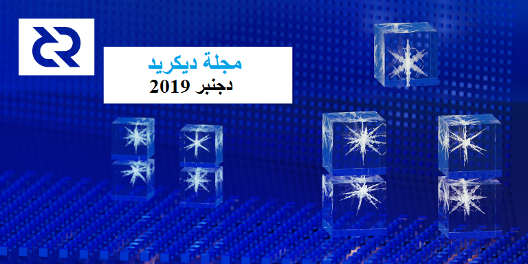

# صحيفة ديكريد لشهر دجنبر 2019

_الصورة: متعدد الأوجه الجليدي بواسطة saender@_

سنة جديدة سعيدة! أهم أخبار شهر دجنبر:

* تم إصدار النسخة النهائية للإصدار 1.5 في 16 دجنبر، شكرا لكل من ساعد في اختبار مرشحي الإصدار. 

* تم إستيفاء عتبات تحديث إثبات العمل/إثبات الحصة لتغيير قواعد الإجماع على إلتزامات رَأْسِيَّة الكتلة. مدة التصويت سوف تبدأ في 16 يناير تقريبًا عندما تبدأ فترة تغيير القاعدة الجديدة.

* تم تفعيل الشبكة البرقية لديكريد على الشبكة الرئيسية! جَرّب [مستكشف](https://ln-map.jamieholdstock.com/) الشبكة الخاص بـ jholdstock@. حتى الآن يفوز matheusd@ مع 11 قناة مفتوحة. تذكر: الشبكة البرقية لا تزال تعتبر غير مستقرة، تجريبية، وربما خطرة! حتى الخبراء مثل matheusd@ يلعبون بقليل من الوحدات.

* وافق أصحاب الحصص على ميزانية بقيمة 30 ألف دولار لتمويل التطوير المستمر لـ TinyDecred، وهي مجموعة أدوات مفتوحة المصدر من البايثون.

## إشعار تحديث النسخة 1.5

تم إصدار النسخة 1.5 بعد حوالي 5 أسابيع من الاختبار و التنظيف. تجلب النسخة الجديدة العديد من التحسينات التي تم تناولها في إصدار [أكتوبر](https://xaur.github.io/decred-news/journal/201910.html#v15-release-candidates). للحصول على ملاحظات الإصدار الكامل والتنزيلات تفضل بزيارة [صفحة الإصدار](https://github.com/decred/decred-binaries/releases/tag/v1.5.0) على GitHub. وكما هو الحال دائمًا، [تحقق من التنزيلات](https://docs.decred.org/advanced/verifying-binaries/) قبل التثبيت.

إذا كنت تقوم بالتعدين ولم تقم بالتحديث، فمن المستحسن التحديث لتجنب رفض كتلة نظرا لكون النسخة قديمة.

يتم عرض تقدم التحديث والتصويت على موقع [voting.decred.org](https://voting.decred.org/)، ويمكن الاطلاع على مزيد من التفاصيل والرسوم البيانية في صفحة [برنامج](https://explorer.dcrdata.org/agendas) dcrdata.

وأخيراً، لا تنس تعيين تفضيلات التصويت لأجندة `headercommitments` في حسابات مقدمي خدمات التصويت وتهيئة التصويت الفردي.

## التطوير

[dcrd](https://github.com/decred/dcrd): تم [تبسيط](https://github.com/decred/dcrd/pull/2014) منطق نقطة التفتيش لتمهيد الطريق لدعم نقاط التفتيش القائمة على الترويسات وحدها. كما يمكن للمتصل الآن [تهيئة](https://github.com/decred/dcrd/pull/2013) نقاط التفتيش. تم فصل المعاملة اليتيمة و تم [نقلها](https://github.com/decred/dcrd/pull/2008) من سلسلة الكتل إلى مدير الكتلة. في الصورة الأكبر، ستساعد هذه التغييرات  لفصل كود الاتصال من منطق التنزيل، كما هو مطلوب للتنزيل المتوازي [للمتعدد النظراء](https://github.com/decred/dcrd/issues/1145).

تم [تحسين](https://github.com/decred/dcrd/pull/2011) استخدام الذاكرة المنطقي للتنفيذ الشرطي في txscript عن طريق استبدال مكدس الحالة بعددين صحيحين.

دعم عناوين bech32 المحسنة بوظائف المُلاَءَمَة [المضافة](https://github.com/decred/dcrd/pull/2025) و [ضمان](https://github.com/decred/dcrd/pull/2024) أن الجزء القابل للقراءة من قِبل الإنسان هو حرف صغير ليتوافق مع BIP173.

تم [إصلاح](https://github.com/decred/dcrd/pull/2027) تسرب الذاكرة الذي كان مناسبًا بشكل خاص للإعدادات التي تتضمن محافظ مع عدد كبير جدًا من العناوين.

[dcrwallet](https://github.com/decred/dcrwallet): يتم [تطبيق](https://github.com/decred/dcrwallet/pull/1623) طريقة createrawtransaction مباشرةً في dcrwallet بحيث يمكن استدعائها في وضع مزامنة التحقق البسيط من الدفع أو عندما لا تتم مزامنة المحفظة. كانت متوفرة في السابق فقط في وضع مزامنة RPC وكانت تتطلب تشغيل مثيل dcrd.

تم [تصدير](https://github.com/decred/dcrwallet/pull/1573) حزمة txsizes لإعادة استخدامها من قبل dcrdex و dcrdata.

[ديكريديتون](https://github.com/decred/decrediton): تم إصلاح العديد من الأخطاء، بما في ذلك خطأ في [محفظة Trezor](https://github.com/decred/decrediton/pull/2362) يمكن تفعيله إذا تلقت محفظة Trezor أموالًا من مرسل من محفظة من غير dcrwallet لم يقم بتعيين حقل التسلسل بشكل صحيح.

[بوليتيا](https://github.com/decred/politeia): كان التركيز الرئيسي لتطوير بوليتيا لشهر دجنبر هو إصلاح مشكلة عدم حفظ توقيع [تغيير الحالة](https://github.com/decred/politeia/pull/1073)، وهناك نقطة أخرى لا يكون فيه توقيع [بدء التصويت](https://github.com/decred/politeia/pull/1088) مجرد توقيع لتوكن الاقتراح  بينما ينبغي أن يكون توقيعًا على هيكل التصويت بأكمله (بما في ذلك معايير و خيارات التصويت). هذه المسائل لم يكن لها أي تأثير على المستعملين. لا تتوافق الإصلاحات مع الإصدارات السابقة، لذا تتطلب تعيين إصدار بيانات التعريف. وبما أن تعيين إصدار بيانات تعريف بدء التصويت كان مطلوبًا على أية حال، فإن الإصلاح الثاني يضيف أيضاً التغييرات التي من شأنها تسهيل [طلب دعم المقترحات](https://github.com/decred/politeia/issues/966).

يستمر العمل على الواجهة الخلفية لدعم نظام إدارة المتعاقدين، كما [يجري](https://github.com/decred/politeiagui/pull/1605) حاليا إعادة تصميم نظام إدارة المتعاقدين.

[dcrpool](https://github.com/decred/dcrpool): إضافة دعم احتياطي لتجهيز [طلبات الدفع](https://github.com/decred/dcrpool/pull/140) اليدوية، مما يسمح بتصفية أي رصيد متبقي قبل مغادرة التجمع. وأضيفت [تغطية اختبار](https://github.com/decred/dcrpool/pull/141) واسعة لمعظم المكونات.

[dcrlnd](https://github.com/decred/dcrlnd): خريطة الشبكة البرقية لديكريد [فعالة](https://ln-map.jamieholdstock.com/). تجدر الإشارة إلى أنه على الرغم من دمج  الشبكة البرقية في ديكريديتون، إلا أنه يجب الأخذ في الإعتبار أنها لا تزال في نمط ألفا. إذا كنت ترغب في استخدام الشبكة البرقية على الشبكة الرئيسية، فمن المستحسن أن تبدأ على شبكة الاختبار، والتأكد من أنك مرتاح للعمليات التي ترغب في القيام بها على الشبكة الرئيسية، وعدم استخدام كميات كبيرة.

تم [تعديل](https://github.com/decred/dcrlnd/pull/62) تحديد المنفذ لجعل اختبارات الإدماج أكثر قوة. تمت [إضافة](https://github.com/decred/dcrlnd/pull/67) بناء Docker إلى إجراءات Github. و إزالة [بادئة ديكريد](https://github.com/decred/dcrlnd/pull/68). كما يستمر العمل على [نماذج Docker](https://github.com/decred/dcrlnd/pull/66) للتشغيل الآلي لبيئات simnet مع كل ما تحتاج إليه لتشغيل مجموعة الشبكة البرقية.

[dcrdex](https://github.com/decred/dcrdex): تشمل المكونات الجديدة المنفذة [محفظة تبادل BTC](https://github.com/decred/dcrdex/pull/72)، و[خلفية سجل طلبات العملاء](https://github.com/decred/dcrdex/pull/79)، ومزيد من [الإدماج](https://github.com/decred/dcrdex/pull/85) بين مدير السوق وجهاز توجيه الأوامر وجهاز توجيه الكتب.

في تغييرات أخرى: تمت إضافة [التزامات الطلب](https://github.com/decred/dcrdex/pull/83) إلى المواصفات، ثم تم تغيير دقة الطابع الزمني من ثوانٍ إلى [مللي ثانية](https://github.com/decred/dcrdex/pull/96)، .كما تم إكتمال التحويل المكتمل إلى [معرف العملة](https://github.com/decred/dcrdex/pull/91)، والذي يسمح بدعم المزيد من الأصول في المستقبل.

المهام المتبقية لإنجاز التبادل اللامركزي هي:

* على الخادم: يحفظ مدير التبادل اللامركزي كل الأنظمة الفرعية معًا (قيد المراجعة) وتطبيق طرفي (قيد التنفيذ)
* على العميل: واجهة مستخدم الويب (قيد المراجعة)، واجهة المستخدم الطرفية (قيد الصياغة)، محفظة DCR (قيد المراجعة)، مدير الكتاب وقاعدة البيانات الدائمة (قيد المراجعة)
* خوادم RPC للخادم والعميل

[dcrandroid](https://github.com/decred/dcrandroid): يتم دمج [إعادة التصميم](https://github.com/decred/dcrandroid/pull/401) الرئيسية لواجهة المستخدم أخيرًا بعد عدة أشهر من العمل. وشمل هذا التغيير الكبير أيضاً دعم محفظة متعددة (تشغيل أكثر من محفظة واحدة في الوقت نفسه). تم تحويل كود Java والملفات المتبقية إلى Kotlin. وفي الطرف الخلفي، [أضيف](https://github.com/raedahgroup/dcrlibwallet/pull/57) دعم المحفظة المتعددة إلى محفظة dcrlibwallet، التي تستخدم نسخة معدلة من وحدة التحقق البسيط من الدفع لـ dcrwallet لمزامنة كافة المحافظ في عملية واحدة.

تتضمن تحسينات واجهة المستخدم الأخرى إظهار شريط التقدم والوقت المقدر المتبقي عند [إعادة الفحص](https://github.com/decred/dcrandroid/pull/414) واكتساب الماسح الضوئي لرمز الاستجابة السريعة القدرة على اكتشاف [مبالغ الدفع](https://github.com/decred/dcrandroid/pull/411).

تحسينات الأمن: يمكن للمستخدمين الآن إلغاء قفل التطبيق باستخدام [بصمتهم](https://github.com/decred/dcrandroid/pull/413)، وتم [نقل](https://github.com/decred/dcrandroid/pull/421) التحقق من صحة العنوان إلى أدوات الأمن.

[dcrios](https://github.com/raedahgroup/dcrios): تستمر تحسينات واجهة المستخدم مع [الألوان](https://github.com/raedahgroup/dcrios/pull/556) المحدّثة وعرض القائمة [المحسّن](https://github.com/raedahgroup/dcrios/pull/555).

يستمر العمل على دعم [المحفظة المتعددة](https://github.com/raedahgroup/dcrios/pull/558)، وتجديد واجهة المستخدم [لإرسال](https://github.com/raedahgroup/dcrios/pull/557) و[استقبال](https://github.com/raedahgroup/dcrios/pull/553) العروض.

[dcrdata](https://github.com/decred/dcrdata): إدماج [كشف المزج](https://github.com/decred/dcrdata/pull/1610) الأولي ل CSPP، وإصلاح الأخطاء وصيانة الكود.

[tinydecred](https://github.com/decred/tinydecred): تمت إضافة عرض لجداول التصويت الحالية وقائمة لضبط [اختيار التصويت](https://github.com/decred/tinydecred/pull/25) وتنسيق الكود الآلي باستخدام أداة [Black](https://github.com/decred/tinydecred/pull/27) وإصلاح الأخطاء وإصلاحات الاختبار.

[المستندات](https://github.com/decred/dcrdocs): تم [تحديث](https://github.com/decred/dcrdocs/pull/1005) مستندات للنسخة 1.5. كما تمت [إضافة](https://github.com/decred/dcrdocs/pull/1035) تحذير حول عمليات الإسقاط الجوي الإحتيالية.و إضافة [مصطلحات التفرع](https://github.com/decred/dcrdocs/pull/1018) إلى قاموس المصطلحات.

[decred.org](https://github.com/decred/dcrweb): تحديثات صغيرة للمحتوى وتحديثات تبعية.

مسائل أخرى:

* قام degeri@ [بإصدار](https://twitter.com/degeri_crypto/status/1206639882485075968) موقع ويب مرسل إخطارات توفيقي تحت إسم [DownloadHawk](https://github.com/degeri/DownloadHawk)، والذي يراقب تنزيلات ديكريد ويطلق الإنذار إذا ما تم العبث بها.
* [للتذكير](https://twitter.com/decredproject/status/1208067535532437511)، يمكن للباحثين في مجال الأمن أن يكسبوا ما يصل إلى 25 ألف دولار أمريكي للبحث عن مشاكل أمنية في برنامج ديكريد. التفاصيل على الموقع [bounty.decred.org](https://bounty.decred.org/).

إحصائيات نشاط التطوير لشهر دجنبر: 41 من المشاريع النشطة، 242 إيداع رئيسي، 55 ألف إضافة و 45 ألف عملية حذف من خلال 15 سجل. جاءت المساهمات من 1-5 مطورين لكل سجل.

## الأشخاص

مرحبا بالمساهمين الجدد مع دمج الكود إلى الماستر: vdg0 على ([tinydecred](https://github.com/decred/tinydecred/commits?author=vdg0)).

تهانينا للمساهم الجديد المدرج على [decred.org](https://decred.org/contributors/):

* Amir Massarwa (الملقب ب amass@، مطور)

إحصائيات المجتمع اعتبارًا من 3 يناير:

* متابعو التويتر: 40,897 (256+)
* المشتركين في ريديت: 9,708 (5+)
* مستخدمي الماتريكس: 504 (30+)
* مستخدمي السلاك: 6,881 (9+)
* مستخدمي الديسكورد: 2,628 (36+) تم التحقق من 407 (28+) ليقوموا بالتعليق.
* مستخدمي التيليجرام: 2,838 (65-)
* المشتركين في اليوتيوب: 3,960 (40+)
* متابعي الفيسبوك: 3,552 (245+)، إعجاب: 3,223 (196+)
* متابعي لينكد إن: 674 (12+)
* نجوم Github dcrd: بلغت 528 (8+)، تفرعات: 1,458 (58+)

## الإدارة و الحوكمة

تلقت [الخزينة](https://explorer.dcrdata.org/address/Dcur2mcGjmENx4DhNqDctW5wJCVyT3Qeqkx) في شهر دجنبر 14,406 DCR وأنفقت 10,106 DCR. وباستخدام معدل المتوسط اليومي لشهر دجنبر ب DCR/USD والذي يقدر ب 18.32 دولارًا، ستكون الخزينة قد تلقت 264 ألف دولارا وأنفقت 185 ألف دولارا. ووفقًا لمتوسط السعر اليومي في نونبر البالغ 19.97 دولارًا ، فإن قيمة الفَوترة بالدولار الأميركي عن العمل المنجز في ذلك الشهر تكون قد بلغت 202 ألف دولار. واعتبارا من 1 يناير، بلغ رصيد الخزينة 643,836 DCR (أي 10.9 مليون دولار أمريكي بسعر 16.87 دولار أمريكي).

كان شهر دجنبر شهراً هادئاً على نحو غير عادي بالنسبة لبوليتيا، ولم تقدم أي مقترحات جديدة. وجرى التصويت على اقتراحين من نونبر في دجنبر:

* تمت الموافقة على اقتراح [ميزانية TinyDecred](https://proposals.decred.org/proposals/ad0f9688b3467734e2581604914b2cc32c6eb7991dff460eff41d21f66d88451) بموافقة 85% ومشاركة الناخبين بنسبة 32.6%.
* تم رفض [تطبيق PlusBit POS](https://proposals.decred.org/proposals/e559188b0febcab29c49c1f7dd5c66645e31be00894a150ef7d0b8ceb6486605) مع موافقة بنسبة 39% ومشاركة بنسبة 30.6%.

قامت ديتو بتقديم مقترحها [الثالث](https://proposals.decred.org/proposals/012b4e335f25704e28ef196d650316dca421f730225d39e37b31b3c646eb8497) المتعلق بالتواصل في 7 يناير، وتجري مناقشته الآن.

بعد [تحليل](https://www.blockcommons.red/publication/mm-tracking-1/) سجلات الطلبات العامة التي أثارت تساؤلات حول مستوى توفير السيولة، قدمت i2 Trading سجلات كاملة لسجل التداول تتيح فحص أدائها بالتفصيل. تعمل الشركة زيرو على مجموعة من الأدوات لتدقيق أداء i2 فيما يتعلق بالمعايير المحددة في اقتراحهم.

أخذت مجموعة بوليتيا دايجيست استراحة في حين أن مستوى نشاط بوليتيا منخفض، وستعود عند تقديم مقترحات جديدة.

## الشبكة

معدل الهاش: افتتحت معدلات الهاش في شهر دجنبر على ~370 Ph/s وأغلقت على ~400 Ph/s، وبلغ قاعها عند 275 Ph/s كما بلغت ذروتها عند 522 Ph/s على مدار الشهر. توزيع معدلات الهاش للتجمع اعتبارا من 2 يناير حسب [dcrstats.com](https://dcrstats.com/pow):

* Poolin بنسبة 32%،
* UUPool بنسبة 24%،
* lab.antpool.com بنسبة 12%،
* F2Pool بنسبة 2.2%،
* BTC.com بنسبة 1.8%،
* BeePool بنسبة 0.09%،
* Coinmine بنسبة 0.09%،
* suprnova بنسبة 0.02%،
* Luxor بنسبة 0.02%،
* وأخرى بنسبة 28%.

أرقام توزيع التجمع تقريبية ولا يمكن تحديدها بدقة.

بعد البقاء في معدلات 400-450 Ph/s في نونبر، إنخفض معدل الهاش أكثر و لمدة وجيزة في شهر دجنبر تحت 300 Ph/s (آخر مرة بلغ فيها هذا المستوى خلال فترة انخفاض قصيرة كانت في أبريل 2019)

التحصيص: بلغ متوسط سعر التذكرة لمدة 30 يوما  137.5 DCR (أي بزيادة 2.7) حسب dcrstats.com. وتفاوت السعر بين 123.1 و 158.76 DCR. وقد بلغ المبلغ المقفل 5.37-5.61 مليون DCR، وهو ما يعادل 49.75-51.90% من المَخْزُون المتاحة.

مرة أخرى حقق سعر التذاكر أعلى مستوى جديد له 158.76 منذ تغير خوارزمية sdiff ، في حين أن 51.9٪ هو أعلى نسبة مشاركة جديدة على الإطلاق.

العقد: طوال شهر [دجنبر](https://charts.dcr.farm/d/000000014/nodes?orgId=1&from=1575158400000&to=1577836800000)، كان هناك حوالي 175 عقدة استماع عامة و 391 من العقد العادية حسب dcr.farm. تم توزيع الإصدارات، في المتوسط، على النحو التالي: 56% يشغلون dcrd النسخة 1.4، و10% dcrd النسخة 1.5، 8.8% يشغلون نسخة التطوير 1.5 وبناء إصدارات الترشيح، 6% يشغلون dcrwallet النسخة 1.4، و1.9% يشغلون dcrwallet النسخة 1.5.

في [12 دجنبر](https://twitter.com/lefebvre_dustin/status/1205224368407748616)، شارك 16.1% من إجمالي DCR المتداولة في خلط ++CoinShuffle.

تظهر [خريطة الشبكة البرقية](https://ln-map.jamieholdstock.com/) للشبكة الرئيسية لديكريد، 11 عقدة و 13 قناة في 8 يناير.

## الإنضمام

مرحبًا بموفر خدمة التصويت [الجديد](https://github.com/decred/dcrwebapi/pull/82) [99split.com](https://99split.com/) مع رسوم بنسبة 0.99%.

تمت [إزالة](https://github.com/decred/dcrwebapi/pull/79) موفر خدمة التصويت dcr.pos.fans من [القائمة](https://decred.org/vsp/) بعد إثبات أنه غير موثوق به.

تحذير: ليس لدى مؤلفي مجلة ديكريد أي فكرة عن مصداقية أي من الخدمات المذكورة أعلاه. يرجى إجراء البحوث الخاصة بك قبل الوثوق بمعلوماتك الشخصية أو أصولك إلى أي كيان.

## الانتشار

برز الإنتشار لشهر دجنبر النسخة 1.5.0، مع davecgh@ الذي يشرح تغيرات الإجماع على كل من [تجمع ديكريد](https://www.youtube.com/watch?v=gGQuY0kOt7g) و [ديكريد في العمق](https://www.youtube.com/watch?v=D1527JwkDrs). كما تضمنت الحلقات الإضافية من [تجمع ديكريد](https://www.youtube.com/watch?v=N3WO5YXpD7M) و [ديكريد في العمق](https://www.youtube.com/watch?v=dZeqrQpf-aU) الذي تحدث عن الشبكة البرقية. تم وضع النسخة الخاصة بتحديث موقع الويب في GitHub وتم إرسالها إلى فريق web\_ops# لتجميعها. ومن المتوقع أن ينشر الموقع الجديد في يناير.

ركز معظم بقية الشهر على التفكير والمناقشة والتخطيط لعام 2020. أثار منشور bee@ حول [استراتيجيات التسويق](https://xaur.github.io/writings/posts/20191127-marketing-strategies.html) [نقاشًا نشطًا](https://matrix.to/#/!MIGqWXfLFBwhipPKYL:decred.org/$157617150861861VoZeT:decred.org) في proposals#، حيث يتطلع Ditto و Dustorf@ إلى إعداد مقترحاتهما التالية. واصل Dustorf@العمل من خلال [إستطلاع رأي](https://www.surveymonkey.com/results/SM-9JRDSMFS7/) طلب فيه من المجتمع إدخال معلومات حول الأولويات المتعلقة بالمواقع الجغرافية وقطاعات السوق والتطبيقات المحتملة. كما سينشر ملخصاً لنفقات التسويق قبل اقتراحه التالي.

أهم إنجازات ديتو لشهر دجنبر:

* وضع مقالا ل jy-p@ في [إفتتاحية](https://www.coindesk.com/its-time-to-walk-the-talk-on-decentralized-governance) الاستعراض السنوي ل CoinDesk حول الحوكمة اللامركزية " لقد حان الوقت للتحدث عن الحوكمة اللامركزية".
* [مقال](https://www.coindesk.com/planned-sale-of-org-angers-many-open-source-crypto-developers) CoinDesk عن بيع نطاقات org.، والتي تتضمن اقتباسًا من richardred@.
* [بودكاست](https://www.youtube.com/watch?v=NNg5G_EZxtU) Off the Chain مع أنتوني بومبليانو وakinsawyerr@، يتحدثان عن العملات الرقمية في إفريقيا والحوكمة الفريدة لديكريد.
* [مقطع](https://www.nasdaq.com/videos/tradetalks%3A-blockchain-emerging-technologies-in-africa) من NasdaqTV TradeTalks مع akinsawyerr@ يتحدث فيه عن سلسلة الكتل في إفريقيا.
* رتب وحضر جولة إعلامية مع akinsawyerr@ في نيويورك، حيث التقى شخصيًا مع الصحفيين في The Block، و Fortune، و Off the Chain ل Pomp، و بودكاست Chain Reaction (في انتظار النشر).
* قام بتأمين [بودكاست](https://anchor.fm/investnoir3/episodes/Episode-73---AkinSawyerr-e9pnmu) Cigars and Crypto يضم akinsawyerr@ والذي تم بثه في عيد الميلاد.
* قام بإعداد مستند لندوة الجلسة الإعلامية، كما أجرى توعية إعلامية لمشاركة akinsawyerr@ في منتدى النقود الرقمية في CES (7 يناير). ولقد رتب له للتحدث في [ندوة](https://thedigitalmoneyforum.com/2020-agenda/) "تأثير ليبرا"، إلى جانب Michael Casey من CoinDesk و Dante Disparte من جمعية ليبرا.
* قاد [إستطلاع رأي](https://twitter.com/decredproject/status/1207060170855141376) في تويتر عن أفضل إنجاز لديكريد لسنة 2019. وكان الفائز هو تنفيذ الخصوصية، حيث حصل على 36.6% من الأصوات، ثم أعقب ذلك تقدم بوليتيا والمنظمة المستقلة اللامركزية DAO (33.1%). وقد شارك في الاستفتاء 475 شخصا.
* حُدِّدَتْ الفرص لمشاركتها مع المجتمع للتفاعل على تويتر العملات الرقمية وتثقيف الغرباء حول ديكريد. وقد أثار المجتمع في الآونة الأخيرة ضجة حول نموذج المتعاقد الفريد لديكريد، و خاصة للمطورين. مع مساهمة المجتمع بأكثر من 40 مشاركة فريدة باستخدام هاشتاغ [cryptodevs#](https://twitter.com/hashtag/cryptodevs) و مناولة جديدة [dcrgoodfirst@](https://twitter.com/dcrgoodfirst) كمجموعة جديدة من القضايا الأولى الجيدة للمطورين المهتمين بالمساهمة في ديكريد.
* تطوير المرحلة الثالثة لاقتراح ديتو للعلاقات العامة، والذي سيتم عرضه على بوليتيا في منتصف شهر يناير.

## الفعاليات

الحضور:

* 6 نونبر - [لقاء البتكوين و سلسلة الكتل](https://www.facebook.com/events/1444182132424731/) - أواكساكا، المكسيك. قام evok3d@ بتمثيل ديكريد. ([الصور](https://twitter.com/ev0k3d/status/1192945388329807874)، _تم تفويتها في نونبر_)
* 4 دجنبر - [عرض تجريبي لديكريد](https://www.meetup.com/blockchaincentre/events/266659342/) - ملبورن، أستراليا. تمت دعوة eSizeDave@ وzohand@ لتقديم ديكريد بتنسيق Talk & Trade التي تم تقديمها حديثاً في مركز Blockchain Center. كان من المتوقع أن يستغرق العرض التوضيحي لـبوليتيا و ديكريديتون 30 دقيقة، لكن الوقت الإجمالي تجاوز ساعة و نصف، وهو ما سمح بالتحدث عن الجوانب الرئيسية لديكريد وإجراء مناقشة بين المشاركين العشرين تقريبًا. ([التقرير](https://github.com/decredcommunity/events/blob/master/reports/20191204-blockchain-centre-talk-and-trade-melbourne-australia.md))
* 7 دجنبر - لقاء مجتمع سلسلة الكتل - مكسيكو سيتي، المكسيك. تم تنظيمه من قبل Blockchain Bajio في Bitcoin Embassy Bar. (الصور: [1](https://twitter.com/Decred_ES/status/1204144823231488000)، [2](https://twitter.com/BlockchainBajio/status/1209141039086362624)، [3](https://twitter.com/NancyNSalazar/status/1209143989984808961))
* 12–13 دجنبر - [Labitconf](https://www.labitconf.com/) - مونتيفيديو، أوروغواي. قام فريق ديكريد أمريكا الشمالية المكون من 7 أشخاص بتمثيل المشروع خلال يومين من الفعالية. أصبحت الجهود الدؤوبة لبناء الوعي في أمريكا الشمالية واضحة لأن العديد من المشاريع التي شاركت في الفعالية كانت تعرف ديكريد. عدم وجود كشك في مكان واحد يسمح للفريق أن يكون في كل مكان، ويقترحون النظر في هذا النهج للفعاليات من هذا الحجم (حوالي 1.000 زائر). راجع [التقرير الكامل](https://github.com/decredcommunity/events/blob/master/reports/20191212-labitconf-montevideo-uruguay.md) للتعرف على التفاعلات البارزة وغيرها من التفاصيل.
* 15 دجنبر - [العملات الرقمية وعيد الميلاد](https://www.meetup.com/blockchaincentre/events/267037974/) - ملبورن، أستراليا. نظمت ديكريد أستراليا حفلا بشراكة مع مركز Blockchain و Cointree و e-Pocket. قام كل من eSizeDave@ و zohand@ بتقديم مقدمة موجزة عن ديكريد و إنجازاتها إلى حوالى 20 شخصًا واستغلا فرصة التفاعل معهم بشكل مباشر أكثر. ([التقرير](https://github.com/decredcommunity/events/blob/master/reports/20191215-crypto-and-christmas-melbourne-australia.md))
* 20 دجنبر - [الذكرى السنوية لسفارة البتكوين](https://twitter.com/Decred_ES/status/1207380289107959809) - مدينة مكسيكو، المكسيك. دعت Bitcoin Embassy فريق ديكريد أمريكا اللاتينية للحضور ورعاية الفعالية، وذلك بفضل العلاقات الجيدة التي تم تأسيسها مسبقًا. تحدث كل من francov\_@ و victorarubin@ و luisantoniocrag@ طوال الليل عن ديكريد مع معظم الحاضرين. ([التقرير](https://github.com/decredcommunity/events/blob/master/reports/20191220-bitcoin-embassy-anniversary-mexico-city-mexico.md))

الفعالية القادمة:

* 14 يناير - [GoCracow #7](https://www.meetup.com/en-AU/GoCracow/events/265765051/) - كراكوف، بولندا. سيقدم kozel@ ديكريد إلى جمهور مطوري Go وسيتطرق إلى بعض التفاصيل عن العمل في منظمة مستقلة لامركزية وطرق المساهمة في المشروع.
* 29-31 يناير - [قمة العملات الرقمية 101 على الإنترنت](https://www.crypto2020summit.com/) - عبر الإنترنت. سيقدم lukebp@ نظرة عامة على خطط ديكريد لعام 2020.
* 4- 6 فبراير - قمة إفريقيا للتكنولوجيا - كيغالي، رواندا. سيكون akinsawyerr@ متحدثًا في قمة المال و سلسلة الكتل.
* 13 أبريل - 17 - Blockchain Land في Talent Land - غوادالاخارا، المكسيك. ستكون ديكريد راعياً لـ Talent Land وستكون حاضرة بكشك في Blockchain Land.
* ماي، لم يتم تحديد التاريخ بعد - [BitConf](https://www.bitconf.com.br/portal/) - ساو باولو، البرازيل.

## وسائل الإعلام

مقالات مختارة:

* ديكريديتون على Tails بقلم mm@ (على [stakey.club](https://stakey.club/en/decrediton-on-tails/)، وأيضًا [بالبرتغالية](https://stakey.club/pt/decrediton-no-tails/)، _فوت في عدد نونبر_)
* هل لدى ديكريد إجابات عن الحوكمة على السلسلة؟ بقلم Kerman Kohli (على [medium](https://medium.com/decred/does-decred-have-the-answers-to-on-chain-governance-d35bdd176f59)​​، _فوت في عدد نونبر_)
* الديكريد على السلسة: تجمع التذاكر VWAP بقلم permabullnino@ (على [medium](https://medium.com/@permabullnino/decred-on-chain-the-ticket-pool-vwap-d0a3d1c42a3))
* نظرة عامة على 'التحصيص' في مجموعة متنوعة من المشاريع بواسطة richardred@ (على [blockcommons.red](https://www.blockcommons.red/publication/staking/))
* حان الوقت للتحدث عن الحوكمة اللامركزية بواسطة jy-p@، وهو جزء من الإستعراض السنوي ل CoinDesk (على [coindesk](https://www.coindesk.com/its-time-to-walk-the-talk-on-decentralized-governance))
* تقديم DownloadHawk بواسطة degeri@ (على [blog.decred.org](https://blog.decred.org/2019/12/16/Introducing-DownloadHawk/))

الترجمات:

* تجربتي في إعداد العقدة الكاملة لديكريد - [باللغة الإسبانية](https://medium.com/decred-es/mi-experiencia-configurando-un-nodo-completo-de-decred-d5321304bc48) بواسطة pablito@
* تمت ترجمة مجلة لشهر نونبر 2019 إلى العربية بواسطة arij@ و الصينية بواسطة (Dominic@) والبولندية بواسطة (kozel@) والإسبانية بواسطة (francov\_@ و luisantoniocrag@). شكرا لكم جميعا!

أشرطة الفيديو:

* Decred Assembly Deep Dive — الشبكة البرقية مع matheusd@ (على [اليوتيوب](https://www.youtube.com/watch?v=N3WO5YXpD7M))
* TradeTalks: سلسلة الكتل و التكنولوجيات الناشئة في أفريقيا. يتحدث akinsawyerr@ عن أهمية الحوكمة بالنسبة لآفاق العملات الرقمية في إفريقيا. (على [nasdaq.com](https://www.nasdaq.com/videos/tradetalks%3A-blockchain-emerging-technologies-in-africa))

الصوتيات::

* POV Crypto 105 — ليلة المعركة  الحادية عشرة: BTC ضد ETH ضد DCR مع Checkmate@. مناقشة متعمقة لوجهات نظر البتكوين و الإيثيريوم و ديكريد حول مجموعة متنوعة من مواضيع سلسلة الكتل.
* تضمنت الحلقة 15 من ديكريد في العمق davecgh@ الذي أعطى نظرة عامة متعمقة عن الإصدار 1.5 و إيداعات ترويسة الكتلة لمقترح تغيير قواعد الإجماع. يغطي Dave تفاصيل ما ينطوي عليه الاقتراح، والطرق التي سيعزز بها الشبكة إذا تمت الموافقة عليه. (على [اليوتيوب](https://www.youtube.com/watch?v=D1527JwkDrs)، و [soundcloud](https://soundcloud.com/decredindepth/ep-15-dave-collins-btc-suite-origins-dcrd-15))
* الحلقة 14 من ديكريد في العمق - يتحدث matheusd@ عن دخوله في تطوير الشبكة البرقية من خلال عمله في تقسيم التذاكر، وتحديات نقل مختبرات الشبكة البرقية lnd إلى ديكريد، والطرق المختلفة التي تساعد بها أساسيات btcd. (على [اليوتيوب](https://www.youtube.com/watch?v=dZeqrQpf-aU)، و [soundcloud](https://soundcloud.com/decredindepth/ep-14-matheus-degiovani-dcr-lightning-network))
* خارج السلسلة - كيف تقوم العملات الرقمية بتخطي الفجوة بين المصرفيين وغير المصرفيين. أجرى akinsawyerr@ مقابلة شاملة مع Anthony Pompliano حول العملة الرقمية وإفريقيا. (على [اليوتيوب](https://www.youtube.com/watch?v=NNg5G_EZxtU)، و [spotify](https://open.spotify.com/episode/1FGOnQb84YpGTZfwbEzdAg))
* Cigars and Crypto 73 - يتحدث akinsawyerr@ عن إفريقيا و ديكريد. ([anchor.fm](https://anchor.fm/investnoir3/episodes/Episode-73---AkinSawyerr-e9pnmu))

وفقا ل [LunarCRUSH](https://twitter.com/LunarCRUSH/status/1208975910013026304)، بلغت الأراء المتفائلة لديكريد أعلى مستوياتها السنوية.

نشر AGNFAB1@ [المزيد](https://www.reddit.com/r/decred/comments/eevd8f/decred/) من فنه عن ديكريد. الأعمال السابقة: [عيد الميلاد](https://twitter.com/AGNFAB1/status/1208044700634157056)، [الخدمات المصرفية على ديكريد](https://twitter.com/AGNFAB1/status/1199788339404181504)، [ثلاثية تاكوتايم](https://www.reddit.com/r/Monero/comments/dzh6vr/tacotime_trilogy/)، [الإعتمادات اللامركزية](https://www.reddit.com/r/decred/comments/dqocpf/decentralized_credits/).

## مناقشات المجتمع

منشورات مختارة من الريديت:

* قامت هذه [المشاركة](https://www.reddit.com/r/decred/comments/ecvjaj/the_decred_security_curve_you_want_to_double/) المرتبطة بموضوع تويتر حول أمن ديكريد بجذب 39 تعليقًا جادل فيها أحد المستخدمين باستفاضة بأن التبادلات يمكن أن تنفذ هجومًا تستنزف فيه الخزينة.
* سأل هذا[ المنشور](https://www.reddit.com/r/decred/comments/e8v7pd/other_than_staking_sending_to_exchanges_what/) عن في ماذا يستخدم الناس ديكريد من غير التحصيص و الإرسال إلى منصات التبادل.

إنْعِكاسات تويتر المختار:

* حصل [إستطلاع رأي](https://twitter.com/decredproject/status/1207060170855141376) ل decredproject@ يسأل عن أكثر الإنجازات التي تحققت في عام 2019 على 475 ردًا. ذهب 37٪ للخصوصية، 33٪ بوليتيا/المنظمة المستقلة اللامركزية، 19٪ للشبكة البرقية و 11٪ للتبادل اللامركزي.
* ميلاد سعيد [Stakemas](https://twitter.com/DCRComic/status/1209541923737886721) من DCRComic@.
* استهدفت [حملة](https://twitter.com/blockchainbuck/status/1201988834575224832) buck54321@ لاقتراح TinyDecred الناخبين الأقدم.
* [غرد](https://twitter.com/coveryfire7777/status/1208499268987867138) Exitus@ عن الوضع الليلي للإصدار 1.5.
* [الملخص السنوي](https://twitter.com/lefebvre_dustin/status/1207756052382593026) لديكريد بواسطة Dustorf@.
* [موضوع](https://twitter.com/Ammarooni/status/1208060799736004611) ammarooni@ حول ديكريد كالأخت الصغرى للبتكوين.

DCRComic:

* [منصة التبادل اللامركزي DEX](https://twitter.com/DCRComic/status/1211672109321248768).
* [تذكرة Rick](https://twitter.com/DCRComic/status/1204049820350111744) - إشارة إلى Pickle Rick من عرض الرسوم المتحركة Rick & Morty.
* [الذكاء الجماعي](https://twitter.com/DCRComic/status/1202601872919543811).

دردشات:

* تسخين [أقفاص الدجاج](https://matrix.to/#/!NNzHoaSdnsbZDQOXJr:decred.org/$157534140455245zYGLX:decred.org) ومزارع الفطر باستخدام منصات تعدين DCR.

## الأسواق

في دجنبر، تم تداول DCR بين 15.61-20.77 دولار أمريكي/BTC 0.0023-0.0029. وكان متوسط ​​السعر اليومي 18.32 دولار.

## الخارجية ذات الصلة

نشرت Braiins [مواصفات](https://stratumprotocol.org/) بروتوكول التعدين Stratum الإصدار 2 في نونبر عقب الإعلان الصيفي. يعالج البروتوكول الجديد العديد من المشكلات في الإصدار 1 ويوفر اتصالًا أكثر فاعلية وأمانًا بين المعدنين والتجمع. ميزة كبيرة من الإصدار 2 هو وضع جديد حيث يختار المعدنون المعاملات ونسخة بت لتضمينها في الكتلة، وإزالة هذه الطاقة من التجمع. سيكون هذا الوضع اختياريًا [ولن يكون](https://twitter.com/mor_pav/status/1194725696817553410) الوضع الافتراضي لتجنب إلحاق الضرر بالتبني. و بإنضمام Matt Corallo وPeter Tod، استضاف Braiins اسألني أي شيء 'A[AMA](https://www.reddit.com/r/Bitcoin/comments/dz1mgp/ama_bitcoin_mining_stratum_v2_we_are_braiins_the/)' متعمق على رديت.

[تعرضت](https://cryptobriefing.com/vertcoin-51-attacked-once-again/) VTC لهجوم 51٪ آخر وإعادة تنظيم 600 كتلة، ولكن يبدو أن المهاجمين فشلوا في تحقيق الأرباح من الهجوم عندما قامت بيتريكس (الهدف المحتمل) بتعطيل التداول بمجرد اكتشافه.

[أطلقت ](https://twitter.com/ProfPieters/status/1205219084528431113)ورشة عمل وارتون حوكمة العملات الرقمية موقع چريپتوعوڢ.نيت، الذي يتضمن "[تقييمات الحوكمة](https://cryptogov.net/view-responses-by-question/)"، والإجابات التي يتم تقييمها ذاتياً على مجموعة قياسية من الأسئلة حول حوكمة سلسلة الكتل، والتي يجمعها أعضاء من مختلف المشاريع. كانت ديكريد أحد المشاريع الثلاثة التي تم تحميل [إجاباتها](https://cryptogov.net/participating-projects/entry/14/) قبل الإطلاق. وقد حضر akinsawyerr@ [فعالية](https://twitter.com/kwerb/status/1146505123876802564) في وارتون في يوليوز 2019 حيث تم التحريض على المشروع، كما تولى زمام المبادرة في إعداد إجابات ديكريد، مع بعض المساعدة من richardred@.

تم [نشر](https://www.zfnd.org/blog/community-sentiment-collection-results/) نتائج استطلاع رأي مجتمع زيكاش.وكان المشاركون هم أعضاء الفريق الاستشاري المجتمعي ومستخدمو المنتدى، ولم يختار أي من المعدنين الإشارة باستخدام طريقة الاقتراع المعروضة عليهم. وبوسع الناخبين أن يدلوا بأصواتهم لصالح كل المقترحات الثلاثة عشر من خلال التصويت بنعم/لا على كل منها.

كان هناك القليل جدا من الدعم للمقترحات التي لم تستمر في تخصيص 20٪ من المكافأة المخصصة لتمويل التطوير.

قام 48 من أعضاء اللجنة الاستشارية المجتمعية البالغ عددهم 62 فردًا بالرد على الاستطلاع. أما الخيارات 12# (انقسام 60% بين EFF/Zfnd، و40% بين برنامج المنح الكبرى مع مستشارين إضافيين)، و10# ("الحل الوسط الكبير"، توزيع مماثل لـ # 12) حقق أداءً جيدًا مع دعم يقارب 75٪. حصل الخيار رقم 13 ("أبق الأمر بسيطًا" ، موزعا  50% بين ECC/Zfnd) على نسبة أكبر من 50٪.

صوت 77 من مستخدمي المنتدى (من أصل 104 أشخاص مؤهلين) على المقترحات (لم تكن الحسابات التي تم إنشاؤها بعد مارس 2019 مؤهلة). قام 12# بأفضل أداء بحيث حصلت على موافقة بنسبة 70% بين هذه المجموعة، كما حصل 13# على نسبة تأييد بلغت أكثر من 50%.

1٪ من مجموع ZEC المتداولة [صوتوا](https://twitter.com/zooko/status/1200917828011876352) في الاستطلاع غير الرسمي المرجح للتحصيص، الخيارات الأكثر شعبية في هذه الدائرة كانا 10# و 8# (تبقت فقط سنتان إضافيتان من تمويل 20٪ لشركة العملات الإلكترونية).

قررت مؤسسة زيكاش تطوير الخيار رقم 12# مع بعض التحسينات، ثم [تراجعت](https://www.zfnd.org/blog/proposed-nu4-zip/) عن معظم التحسينات استجابةً للتراجع. سيتم طرح النسخة النهائية المعدلة قليلاً من الاقتراح على ندوة مجتمعية أخرى وبالتصويت من طرف مستخدمي المنتدى لتأكيده.

يتضمن [ZIP 1012](https://github.com/ZcashFoundation/zips/blob/master/zip-1012.rst)، كما أصبح، تمديد المكافأة الجماعية لمدة 4 سنوات بنسبة 20٪، مع 35٪ تذهب إلى شركة العملة الإلكترونية ECC، و 25٪ إلى مؤسسة زيكاش Zfnd، و 40٪ لـ "المنح الرئيسية" الإضافية. وتتضمن التغييرات التي أدخلت على الاقتراح إعطاء السيطرة المباشرة لمؤسسة زيكاش، وإزالة القيود التي من شأنها أن تستبعد شركة العملة الإلكترونية من تلقي أي تمويل كجزء من "المنح الرئيسية". وهناك تغيير آخر أضيف إلى اقتراح مؤسسة زيكاش، وهو "الدعوة إلى تطوير التصويت اللامركزي والحوكمة وتحفيزه".

[تبرعت](https://www.coindesk.com/zcash-foundation-funds-app-mixing-private-messaging-and-payments) مؤسسة زيكاش أيضًا بمبلغ 40,000 دولار أمريكي لصالح Open Privacy لتطوير [Cwtch](https://openprivacy.ca/work/cwtch/)، وهي منصة رسائل ومدفوعات لا مركزية.

وقعت أيوتا في مأزق و[توقفت](https://cryptobriefing.com/iota-halts-15-hours-from-coordinator-bug/) لمدة 15 ساعة بسبب خلل مع المنسق.

[أعلن](https://twitter.com/jack/status/1204766078468911106) جاك دورسي من التويتر أن التويتر سيمول الأبحاث في نسخة لا مركزية من برنامجه.

[اختفى](https://bitcoinist.com/making-a-dash-for-it-moocowmoo-disappears/) Moocowmoo، مستشار Dash Core ومزود خدمة مشاركة العقدة الرئيسية أثناء فترة إنهاء الخدمة، مما ترك بعض العملاء في انتظار عودة DASH الخاصة بهم لفترة طويلة. بعد زيادة الاهتمام، عادت Moocowmoo إلى الظهور [وبدأت](https://bitcoinist.com/dash-investors-funds-returned-moocowmoo-awakes/) DASH في العودة إلى أصحابها الشرعيين في غضون أسبوع.

[أعلنت](https://www.theblockcrypto.com/linked/48976/bitfinex-to-support-deposits-and-withdrawals-on-lightning-network) بيتفينيكس أنها ستبدأ في دعم ودائع الشبكة البرقية وعمليات السحب اعتبارًا من 3 دجنبر.

تم [حظر][blocked](https://www.coindesk.com/chinas-internet-firewall-has-blocked-access-to-ethereum-block-explorer-etherscan-io) Etherscan.io، وهو مستكشف كتل شهير للإيثيريوم، بواسطة جدار الحماية الصيني العظيم. ولم تقدم أسباب لذلك، ولا يزال مستكشفي الكتل الآخرون متاحون.

[حظرت](https://news.bitcoin.com/google-bans-crypto-app-metamask-from-play-store/) جوجل تطبيق Metamask، وهو تطبيق متصفح للتفاعل مع التطبيقات  اللامركزية، من متجر بلاي التابع لها، بزعم قيامه بعمليات تعدين سرية. وينما تم [رفض](https://twitter.com/metamask_io/status/1210299207820570624) طلبهم في البداية، تم [إلغاء](https://thenextweb.com/hardfork/2020/01/03/google-lifts-ban-ethereum-wallet-app-metamask-mining-cryptocurrency/) الحظر بعد بضعة أيام.

كما أزالت جوجل الكثير من الفيديوهات ذات العملات الرقمية على اليوتيوب، قبل إعادة تثبيتها بعد أن قررت أنه كان [خطأً](https://www.bbc.co.uk/news/technology-50924494). ويبدو أن الحادثة تركت العديد من منتجي محتوى اليوتيوب المتأثرين [يبحثون](https://news.bitcoin.com/youtube-christmas-purge-has-content-creators-pointing-to-these-alternate-platforms/) عن البدائل اللامركزية المتاحة لهم.

ذكر [تقرير](https://ciphertrace.com/wp-content/uploads/2019/11/CipherTrace-Cryptocurrency-Anti-Money-Laundering-Report-2019-Q3.pdf) مكافحة غسل أموال العملات الرقمية من CipherTrace ديكريد باعتبارها عملة رقمية مع ميزات الخصوصية.

تم [إنهاء](https://keybase.io/a/i/r/d/r/o/p/spacedrop2019) الإسقاط الجوي ل Stellar على Keybase قبل الأوان بسبب الزيادة الحادة في عمليات الاشتراك المرغوب فيها، حيث تم استبعاد 100,000 حساب وتقسيم التخصيص النهائي لـ Lumens بين 282,000 مستخدم.

استمرت تجربة دوناتس /r/ethtrader مع [إطلاق](https://new.reddit.com/r/ethtrader/comments/eckj24/ethtrader_special_membership_is_now_live/) عضوية خاصة حيث يمكن للأعضاء دفع اشتراك شهري قدره 5,000 دوناتس لإلغاء قفل ميزات مثل شارات الأسماء وامتياز نشر صور متحركة في التعليقات.

[باعت](https://www.theblockcrypto.com/post/51059/makerdao-receives-27-5m-from-dragonfly-and-paradigm-to-expand-into-asia) مؤسسة ميكر 5.5٪ من إجمالي إمدادات MKR ل Dragonfly Capital وParadigm مقابل 27.5 مليون دولار في ترتيب مفصل من شأنه أن يجعل MKR تحصل على من التركيز في السوق الآسيوية

بعد أشهر من إطلاق التحصيص بالتعهد لتيزوس، أصبح تبادل Coinbase [الآن](https://twitter.com/brian_armstrong/status/1207818862768480256) الخباز رقم 1 على شبكة XTZ.

أصدرت "MetaCartel"، وهي محاولة لإنشاء منظمة مستقلة لامركزية استثمارية هادفة للربح، في قالب التنظيم الذاتي اللامركزي الأصلي الشهير وسيئة السمعة، ولكنها مبنية على Moloch المقاومة للتعقيد، [ورقة بيضاء](https://github.com/metacartel/MCV/blob/master/Whitepaper.pdf). وقد [أعلنت](https://twitter.com/ameensol/status/1212475508262363137) Moloch DAO عن تحديث للنسخة 2 مما يسهل مزاوجة Moloch مع كيان قانوني دون انتهاك لوائح الأوراق المالية.

صوتت عقد الترحيل لـ Algorand على [قبول](https://algorand.foundation/long-term-vesting-plan-vote-result) [تعديل](https://algorandfoundation.cdn.prismic.io/algorandfoundation/eb2a8c69-2262-42f8-99a4-09df485207b5_EIP-11252019AF_+Conditional+Accelerated+Vesting+Nov+30.pdf) للجدول الزمني لإعداد التوكنات التي تلقوها كمنح من مؤسسة Algorand. سيزيد هذا التعديل من عدد عقد ترحيل التوكنات Algo التي ستحصل عليها بنسبة 25 ٪، لكنه سيمدد جدول المنح من عامين إلى خمسة أعوام، مع آلية للإسراع به إذا ارتفع سعر Algo. هذا يختتم [حلقة](https://algorand.foundation/voting-procedure-eip09092019pc) بدأت ولم يتم تفويتها في شتنبر، حيث صوتت عقد الترحيل لتعليق المكافآت الخاصة بها حتى يتم الاتفاق على تغيير في جدول الاستحقاق.

هناك حوالي 81 عقدة ترحيل Algorand وتمت الموافقة على هذه المقترحات بنعم، من حوالي 55 عقدة (بالإضافة إلى امتناع العديد من الأعضاء عن التصويت وقلة الأصوات بلا). أكملت العقد Algorand عمليات التحقق من "اعرف عميلك"/"مكافحة غسل الأموال" وأبرمت في اتفاق قانوني مع المؤسسة، بحيث يشكل ذلك جزءاً من عملية التصويت لهذه الاقتراحات التي ينطوي عليها استخدام DocuSign للتوقيع على تعديل المؤسسة وإرجاعه. تعتبر عمليات التحقق من "اعرف عميلك"/"مكافحة غسيل الأموال" [إلزامية](https://algorand.foundation/200millionalgo-staking-rewards-kyc-extended) أيضًا بالنسبة إلى حاملي Algo الذين يرغبون في المشاركة في تحديد الخطوط الواضحة في الصورة والحصول على مكافآت.

يتضمن [هجوم](https://arstechnica.com/information-technology/2020/01/pgp-keys-software-security-and-much-more-threatened-by-new-sha1-exploit/) جديد على وظيفة تجزئة SHA-1 تم نشره في أوائل شهر يناير تطبيقًا عمليًا لانتحال شخصية مستخدمي PGP/GnuPG وتوقيع أي مستند باسمه. وتقدر تكلفة الهجوم بمبلغ 45,000 دولار وستتناقص مع انخفاض تكاليف الحساب. إذا كنت تستخدم GnuPG، فقم بتعديلها بحيث لا تستخدم SHA-1 للتوقيعات أو التحديث إلى +2.2.18. لا تتأثر تواقيع [الإصدار 1.5.0](https://github.com/decred/decred-binaries/releases/tag/v1.5.0) من ديكريد حيث أنها تستخدم SHA-256.

## عن هذا العدد

هذا هو العدد 21 من مجلة صحيفة الديكريد. فهرس جميع القضايا والمرايا والترجمات متاح [هنا](https://xaur.github.io/decred-news/).

يتم نقل معظم المعلومات الواردة من أطراف ثالثة مباشرة من المصدر بعد التحقق من الحد الأدنى لصحتها. ليس لدى مؤلفي مجلة صحيفة الديكريد القدرة على التحقق من جميع الادعاءات.رجاء إحذر من أعمال الاحتيال وقم ببحثك الخاص.

[ملاحظاتك](https://github.com/xaur/decred-news/blob/docs/contributing.md#feedback) و[مساهماتك](https://github.com/xaur/decred-news/blob/docs/contributing.md) هي دائما موضع ترحيب.

الاعتمادات (بالترتيب الأبجدي):

الكتابة والتحرير: akinsawyerr و bee و Dustorf و degeri و fguisso و kozel و margaret\_mei و richardred و s\_ben

المراجعات والتعليقات: buck54321 و chappjc و Checkmate و davecgh و dnldd و lukebp و matheusd و raedah

صورة العنوان: saender

النسخة الأصلية لمجلة الديكريد لشهر نونبر متوفرة على هذا الرابط [هنا](https://xaur.github.io/decred-news/journal/201912.html)

تمت الترجمة إلى اللغة العربية بواسطة: arij@. قام بالمراجعة abdulrahman4@.

