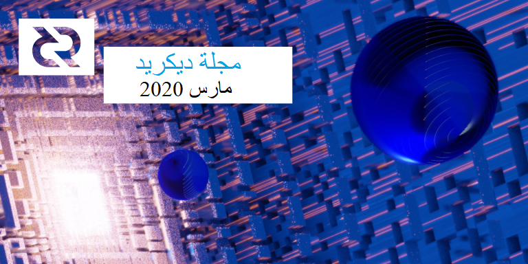

# صحيفة ديكريد لشهر مارس 2020

_صورة: توسيع المتجهة بواسطة saender@_

أبرز أحداث شهر مارس:

* تم تفعيل إقتراح تغيير بروتوكول ديكريد DCP-005، جالبا على الأرجح تنفيذ التحقق من الدفع البسيط الأكثر أمانًا و المحافظ على الخصوصية لعملاء الوزن الخفيف الذين يستخدمون شبكة ديكريد. تم تفريع أي عقدة لا زالت تستعمل النسخة 1.4 خارج الشبكة.
* تم تنسيق أول تجارة بالمقايضة الذرية على شبكة الاختبار من خلال التبادل اللامركزي.
* كان هناك تقدم مذهل في جميع مستودعات البرامج الرئيسية هذا الشهر، راجع ذلك أدناه.
* تمت الموافقة على الميزانيات السنوية للإنتشار لكل من الولايات المتحدة/الإنجليزية والبرازيل بمبلغ إجمالي قدره 286 ألف دولار، بما في ذلك بعض التمويل لمواصلة إنتاج المجلة.
* هذا هو العدد 24 من مجلة ديكريد ويمثل عامين من التغطية الشهرية المتواصلة لمشروع ديكريد!

## التطوير

ما لم يُذكر خلاف ذلك، فإن العمل الذي تم الإبلاغ عنه هنا يشتمل على حالة "الدمج إلى الرئيسي". وهذا يعني أن العمل قد تم استكماله ومراجعته ودمجه في كود المصدر الذي يمكن للمستخدمين المتقدمين بناءه وتشغيله، ولكنه ليس متاحًا بعد في ثنائيات الإصدار للمستخدمين العاديين.

[dcrd](https://github.com/decred/dcrd):

* تم [فصل](https://github.com/decred/dcrd/pull/2139) تواقيع ECDSA عن حزمة secp256k1 لتوضح أن ECDSA هي خوارزمية واحدة فقط من خوارزميات التوقيع الرقمي الممكنة، ولتمكين توقيعات Schnorr على أن يصبحوا مواطنين من الدرجة الأولى في ملف التعليمات البرمجية
* تصدير نمط قيمة [الحقل](https://github.com/decred/dcrd/pull/2134) للسماح للمتصلين الخارجيين بإجراء عمليات حسابية محسنة للحقل
* تحسين التحقق من التوقيع عن طريق تقليل تكاليف العمليات إلى أدنى حد
* إضافة طريقة [لمسح](https://github.com/decred/dcrd/pull/2117) المفتاح الخاص من الذاكرة و[تقليل](https://github.com/decred/dcrd/pull/2131) عدد النسخ الداخلية للمفاتيح الخاصة لتعزيز الأمان ضد تجريف الذاكرة
* تمت [إزالة](https://github.com/decred/dcrd/pull/2107) الأعداد الصحيحة الكبيرة تمامًا من عمليات تحليل التوقيع والتوقيع لصالح كود  العدد القياسي المتخصص n
* تمت [إعادة عمل](https://github.com/decred/dcrd/pull/2128) اختبارات التحقق من schnorr لحل مشاكل متعددة
* منع سوء استخدام التعليمات البرمجية في عدة مناطق
* تمت إزالة الكود غير المستخدم

تم [الكشف](https://bounty.decred.org/2020/03/status-update/) عن ثغرة أمنية تسمح بهجوم استنفاد الذاكرة المحتمل لعدة أيام والذي يمكن أن يؤدي إلى تعطل العقدة في dcrd الإصدار 1.4.0. في 13 مارس، تفرعت الشبكة إلى قواعد إجماع جديدة تم تنفيذها في الإصدار 1.5.0 من dcrd، مما يعني أن جميع العقد على الشبكة مطالبة بتشغيل ذلك كإصدار أدنى. ونظرًا لأن هذا الإصدار والإصدارات الأحدث تحتوي على إصلاح للثغرة الأمنية، فقد تم تخفيفها.

يتداخل كود dcrd بأقل من 16% مع btcd مما يعني أن 84٪ هو عمل التطوير الجديد، ووفقًا [لتحليل](https://coincode.sh/c/dcr/) بواسطة CoinCode.sh. فقد قام davecgh@ [بتأكيد](https://matrix.to/#/!HEeJkbPRpAqgAwhXWO:decred.org/$15862843869377LGlSK:decred.org) أن الأرقام تبدو معقولة بالنظر إلى مقدار الكود الجديد الذي تمت كتابته ولاحظ أن الاختلاف أكثر وضوحًا في dcrwallet (التي لم يتم تحليلها).

[dcrwallet](https://github.com/decred/dcrwallet):

* تم [تنفيذ](https://github.com/decred/dcrwallet/pull/1706) أمر `fundrawtransaction` الذي يضيف مدخلات غير موقعة ويغير المخرجات إلى معاملة أولية
* تم [تبديل](https://github.com/decred/dcrwallet/pull/1648) عمليات المحفظة لاستخدام الإصدار 2 للمرشحات المودعة (تم تجاهل الإصدار 1 للمرشحات ولكن لا تزال تقدمها الشبكة وتستخدمها dcrwallet، وسيستخدم الإصدار التالي الإصدار 2 للمرشحات)
* تم [إصلاح](https://github.com/decred/dcrwallet/pull/1695) الأمر `getaddressesbyaccount` لإرجاع العناوين المستوردة للحساب المستورد
* يتم [نقل](https://github.com/decred/dcrwallet/pull/1688) البرامج النصية لاسترداد P2SH غير المشفرة لتخزين مدير العناوين (وهذا يبسط التخزين ويزيل متطلبات إلغاء قفل المحفظة لعرض البرامج النصية أو تخزينها)
* التحسينات الداخلية للكفاءة والدلالات
* تنظيف لإزالة الكود المهجور وغير المستخدم

[ديكريديتون](https://github.com/decred/decrediton):

* دعم [التحصيص البارد](https://github.com/decred/decrediton/pull/2424) (مطلوب أيضًا للتحصيص باستخدام محافظ الأجهزة)
* دعم [استيراد البرامج النصية](https://github.com/decred/decrediton/pull/2423) في محافظ المشاهدة فقط
* استرداد [جداول الأعمال](https://github.com/decred/decrediton/pull/2442) التي تم تمريرها من dcrdata
* التحقق من وجود [مقترحات جديدة](https://github.com/decred/decrediton/pull/2420) في علامة تبويب الحوكمة
* [عرض الاقتراح](https://github.com/decred/decrediton/pull/2444) المتجاوب، وعرض [العنوان](https://github.com/decred/decrediton/pull/2416) في النظرة العامة وطريقة عرض المعاملات، وتعديلات واجهة المستخدم الأخرى

قيد التطوير:

* دعم [++CoinShuffle](https://github.com/decred/decrediton/pull/2452)

[بوليتيا](https://github.com/decred/politeia):

* [إبطال](https://github.com/decred/politeia/pull/1159) الجلسات عند تغيير كلمة المرور
* تحسينات الاختبار وإصلاح الأخطاء

بدأ دمج سجل المعاملات ومن [المتوقع](https://github.com/decred/politeia/issues/1112#issuecomment-606147106) أن يستغرق شهرين تقريبًا. في [يوليوز 2019](https://xaur.github.io/decred-news/journal/201907.html#development)، قمنا بتقديم تقرير غير دقيق حول بداية دمج سجل المعاملات، ولكن هذا العمل كان في الواقع تطبيقاً مرجعياً ليُستخدم كإثبات المفهوم ويثبت أن متجر بيانات [Trillian](https://github.com/google/trillian) من Google يمكن أن يحل محل الواجهة الخلفية الحالية لـ Git. وقد تم [دمجه](https://github.com/decred/politeia/pull/951) في غشت وكان يحتوي على [عميل/خادم](https://github.com/decred/politeia/tree/master/tlog) مع وظيفة أساسية لتخزين المستندات. وقد أعطت هذه التجربة القدر الكافي من البصيرة والمعرفة لإدراك أنها سوف تنجح. الخطوة التالية هي كتابة خلفية بوليتيا التي تستخدم Trillian.

الميزة الرئيسية لخلفية سجل المعاملات هي أنه سيجعل بوليتيا أكثر قابلية للتوسعة ويسمح بمراقبة المحتوى بعد نشره مع الحفاظ على مسار مراجعة جميع البيانات المقدمة على الإطلاق. سيسمح أيضًا بإصلاح خطأ التعليقات المكرر بشكل صحيح.

CMS:

* القدرة على تعيين [ملكية](https://github.com/decred/politeia/pull/1135) الاقتراح، والتي سيتم استخدامها في التغييرات القادمة للسماح لمالكي الاقتراح برؤية ما يتم دفعه مقابل مقترحهم
* القدرة على [تعطيل](https://github.com/decred/politeia/pull/1154) حساب المتعاقد المؤقت على الفاتورة المدفوعة وتطلب موافقة المسؤول للسماح بفاتورة أخرى
* تم أخيراً [دمج](https://github.com/decred/politeiagui/pull/1828) إعادة تصميم العمل الذي بدأ في أكتوبر. يضيف هذا التغيير الكبير 9,000 ويحذف 24,000 من أسطر الكود.

خلف التحديثات المرئية، تنتهي [عملية](https://matrix.to/#/!VFRvyndKpzcLrVslQD:decred.org/$158644942810878cUwaw:decred.org) إعادة تصميم نظام إدارة المتعاقد بترحيل كود politeiagui من [snew-classic-ui](https://github.com/decred/snew-classic-ui) إلى مكتبة [pi-ui](https://github.com/decred/pi-ui). في عام 2018، سمح snew بإخراج بوليتيا بسرعة مع شكل وأسلوب ريديت، ولكن سرعان ما أصبح من الصعب تطويره. أدى بناء pi-ui والتحول إليه إلى تحسين نمذجة الكود وإعطاء المرونة لتكوين وتصميم عناصر واجهة المستخدم بالطريقة المطلوبة لمطابقة مواصفات التصميم، بالإضافة إلى مكاسب الأداء.

[dcrstakepool](https://github.com/decred/dcrstakepool):

* صيانة الكود لتحسين معالجة الأخطاء والإلغاء، والوثائق المضافة، والتبعيات التي تم تحديثها والاختبارات المضافة

[dcrpool](https://github.com/decred/dcrpool):

* دعم [Obelisk DCR1](https://github.com/decred/dcrpool/issues/110)
* يتم إجراء [نسخ احتياطي](https://github.com/decred/dcrpool/pull/164) لقاعدة بيانات التجمع قبل إيقاف التشغيل
* [ترقيم](https://github.com/decred/dcrpool/pull/163) الصفحات للكتل المعدنة
* [إعادة صياغة](https://github.com/decred/dcrpool/pull/171) كود الاتصال لتبسيط الاختبار
* زيادة تغطية الاختبار
* تحسينات أصغر على تجربة المستخدم والتهيئة وبعض إصلاحات الأخطاء
* العمل عبارة عن تحضير لإصدار قادم 1.1.0

[dcrlnd](https://github.com/decred/dcrlnd):

* بناء [تحسينات](https://github.com/decred/dcrlnd/pull/84) النظام

قيد التطوير:

* حزمة [chainscan](https://github.com/decred/dcrlnd/pull/83) جديدة تستخدم مرشحات ملتزمة للكشف عن المعاملات ذات الصلة بعقدة الشبكة البرقية بشكل أكثر كفاءة ويمكن أن تعمل أيضًا في وضع التحقق من الدفع البسيط
* [تطبيقات](https://github.com/decred/dcrlnd/pull/92) لحزمة chainntnfs التي تستخدم dcrwallet المدمجة والنائية كمصدر لأحداث السلسلة. يسمح هذا بفصل dcrlnd من dcrd الأساسي، وهو شرط لتشغيل مثيل dcrlnd في وضع التحقق من الدفع البسيط.
* بناء على ما سبق، قم بتمكين واختبار [وضع التحقق من الدفع البسيط](https://github.com/decred/dcrlnd/pull/95) للمحافظ البعيدة ("المحفظة عن بعد" هي وضع الاتصال حيث يتصل dcrlnd بمثيل dcrwallet قيد التشغيل بالفعل، أي لا يحتاج إلى محفظته المضمنة مع بذرة منفصلة)

> يعد وضع التحقق من الدفع البسيط أحد متطلبات محافظ الشبكة البرقية للهاتف النقال. من المحتمل أن يكون التحقق من الدفع البسيط هو وضع المزامنة السائد حتى في محافظ سطح المكتب، لذا من الضروري أن يدعم dcrlnd وضع التحقق من الدفع البسيط. وهو أيضاً العنصر الأخير في قسم "العمل الفوري" من "خريطة الطريق" التي أشرت إليها في [الإعلان](https://matheusd.com/post/announcing-dcrlnd/) عن الشبكة البرقية، لذا فإن هذا يستنتج غالبية الجهود الرامية إلى الترحيل من lnd إلى dcrlnd. يعني اختتام التحقق من الدفع البسيط أنه يمكننا البدء في استكشاف المزيد من التغييرات الغريبة المتوفرة في ديكريد (مثل [PTLCs](https://suredbits.com/payment-points-monotone-access-structures/) التي تعتمد على عمل Schnorr الذي يختتمه davecgh@ أيضًا). ([@matheusd](https://matrix.to/#/!HEeJkbPRpAqgAwhXWO:decred.org/$1586258547807544APZNe:matrix.org))

[dcrdex](https://github.com/decred/dcrdex):

* [تطبيق التحكم](https://github.com/decred/dcrdex/pull/181) في سطر الأوامر لعميل التبادل اللامركزي
* القدرة على [وضع أوامر](https://github.com/decred/dcrdex/pull/195) من خلال واجهة المستخدم الرسومية في المتصفح
* [النسخ الاحتياطي والاستعادة](https://github.com/decred/dcrdex/pull/210) لمفاتيح العميل وبيانات الحساب الأخرى (نسخة احتياطية سابقة [183#](https://github.com/decred/dcrdex/pull/183) لبيانات طلب العميل)
* تتبع العميل [لأوامر الحقبة](https://github.com/decred/dcrdex/pull/188) والتحقق من خلط [الأوامر ومطابقتها](https://github.com/decred/dcrdex/pull/189) في نهاية الحقبة
* حساب [نسبة الإلغاء](https://github.com/decred/dcrdex/pull/206) التي تسمح للخادم بتتبع الطلبات التي أكملها المستخدم مقابل الطلبات الملغاة بشكل موثوق، مع القدرة على إعادة إنشاء سجل الطلبات الأخير لأي مستخدم من قاعدة البيانات. هذا جزء مهم من تطبيق سلوك المجتمع.
* إعادة هيكلة وتنظيف قاعدة الكود

أحد المعالم الرئيسية هو استكمال [مفاوضات المطابقة](https://github.com/decred/dcrdex/pull/213). هذا هو الجزء الأخير الكبير من العميل الذي يسمح له أخيرًا بتنفيذ عملية المقايضة. مما يجعل طلب السحب العميل على وجه التحديد يمر عبر عملية المقايضة بالكامل (تفاوض المطابقة)، والتواصل مع الخادم، وإجراء التدقيق اللازم لمعاملات الطرف المقابل، وإنشاء وبث العقد الخاص بالعميل واسترداد المعاملات كما هو مطلوب في عملية المقايضة.

تم دمج ما مجموعه 19 طلب سحب من 6 مساهمين بإضافة 11 ألف وحذف 3 آلاف من أسطر الكود(ملخص الإيداعات [هنا](https://github.com/decred/dcrdex/compare/94310f66c06fdf5ca31eeb80c9f6af7aecf4c31d...d3bd07f822200041092bdc85f5c1b752b3c9ee24)).

مبروك لفريق dcrdex [لتنسيق](https://twitter.com/chappjc/status/1245075450625511425) أول مقايضة ذرية يتم إجراؤها حسب الطلب على شبكة الإختبار!

[dcrandroid](https://github.com/decred/dcrandroid):

* إضافة [صفحة الإحصائيات](https://github.com/decred/dcrandroid/pull/440)
* تعديلات وإصلاحات واجهة المستخدم

يتوفر إصدار شبكة الإختبار من الإصدار التالي [هنا](https://play.google.com/apps/testing/com.decred.dcrandroid.testnet).

[dcrios](https://github.com/raedahgroup/dcrios):

* تجديد [صفحة الإرسال](https://github.com/raedahgroup/dcrios/pull/557)
* واجهة مستخدم جديدة [لمزيد من القائمة](https://github.com/raedahgroup/dcrios/pull/559)
* أداة [تحديد المحفظة](https://github.com/raedahgroup/dcrios/pull/600) الجديدة لصفحة المعاملات
* قراءة مبلغ DCR من [رموز الإستجابة السريعة QR](https://github.com/raedahgroup/dcrios/pull/581)
* إصلاحات أخطاء متعددة وتعديلات على واجهة المستخدم

نسخة شبكة الإختبار من الإصدار التالي متوفرة [هنا](https://testflight.apple.com/join/7KL4VnB2).

[dcrdata](https://github.com/decred/dcrdata):

* تمت إضافة عنوان URL شائع الاستخدام لبيانات مخطط [JSON الأولية](https://github.com/decred/dcrdata/pull/1716) إلى صفحات المخطط
* تعديلات صغيرة وإصلاح الأخطاء

[tinydecred](https://github.com/decred/tinydecred):

* [عرض التحصيص](https://github.com/decred/tinydecred/pull/53) يظهر التذاكر المنفقة وغير المنفقة والحية
* [عرض حسابات](https://github.com/decred/tinydecred/pull/94) بسيطة
* طرق [عرض](https://github.com/decred/tinydecred/pull/125) بسيطة لإنشاء حسابات وإرسال DCR
* [استكشاف الحساب](https://github.com/decred/tinydecred/pull/124)
* تغيير الاختبارات لاستخدام قواعد البيانات [في الذاكرة](https://github.com/decred/tinydecred/pull/116)
* زيادة تغطية الاختبار الإجمالية [إلى 98٪](https://github.com/decred/tinydecred/issues/70#issuecomment-606669036) وإصلاح عدد قليل من الأخطاء التي تم الكشف عنها في هذه العملية، تتمتع جميع الملفات الآن بتغطية تصل إلى 94٪ على الأقل

تم دمج ما مجموعه 56 طلب سحب من 3 مساهمين بإضافة 11 ألف وحذف 6 كيلوبايت من الكود (ملخص الإيداعات موجود [هنا](https://github.com/decred/tinydecred/compare/fa081e7f17d303f0eea31e9f07499db4e0acc53a...e1ef1ff72cb924d27098f9df151f6805d5db3e90)).

[المستندات](https://github.com/decred/dcrdocs):

* تم [تحديث](https://github.com/decred/dcrdocs/pull/1083) مستندات [dcrlnd](https://docs.decred.org/lightning-network/overview/) لأحدث إصدار 0.2.1، مجمعة الأوامر في فئات
* تمت [إضافة](https://github.com/decred/dcrdocs/pull/1081) [دليل](https://docs.decred.org/getting-started/joining-matrix-channels/) حول كيفية الانضمام إلى الماتريكس
* [إعادة تسمية](https://github.com/decred/dcrdocs/issues/1074) صفحة التضخم إلى [الإصدار](https://docs.decred.org/advanced/issuance/)  لإزالة الغموض
* [توثيق](https://github.com/decred/dcrdocs/pull/1073) الوصول إلى خادم ++CoinShuffle [كخدمة Tor المخفية](https://docs.decred.org/privacy/cspp/how-to-cspp/#tor-hidden-service)

[decred.org](https://github.com/decred/dcrweb):

* تنظيف كبير لإصلاح المشكلات الصغيرة في الموقع الجديد
* [نسخة](https://github.com/decred/dcrweb/pull/853) محدثة من مزود خدمة التصويت
* تمت إزالة صفحة التوظيف وإعادة توجيه decred.org/recruiting الآن إلى صفحة [المساهمة](https://docs.decred.org/contributing/overview/)
* تمت [إزالة](https://github.com/decred/dcrweb/pull/857) صفحة خريطة الطريق

مسائل أخرى:

* تم تحديث معظم المشاريع  للبناء باستخدام Go 1.14 وإسقاط دعم Go 1.12
* أصدر mm@ تطبيق DigiSign Oracle، وهو تطبيق ويب مجاني ومفتوح المصدر يساعد المستخدمين النهائيين على التحقق من التوقيعات الرقمية. تم إنشاؤه لمساعدة مستخدمي ديكريد على التحقق من تواقيع الحزمة دون الحاجة إلى استخدام برامج سطر الأوامر المعقدة. يمكنك الوصول إليه من على الرابط [stakey.club](https://stakey.club/digisign-oracle/) أو تنزيل [كود المصدر](https://github.com/mmartins000/digisign-oracle) على جهاز الكمبيوتر الخاص بك وفتحه باستخدام متصفح الويب.

## خطط الإصدار 1.6

> الخطة الأولية للإصدار 1.6 ستصدر في نهاية الربع الثاني. نحن نخطط لتضمين: تغيير إجماع الخزينة اللامركزي،  ودعم CSPP لديكريديتون المحصصة و غير المحصصة، ودعم مزود خدمة التصويت القائم على التذاكر، وتحسينات لا حصر لها من dcrd. (jy-p@ في [2020-03-20](https://matrix.to/#/!MgQoetFiyjrHAywokv:decred.org/$15855719584400kpyNr:decred.org))

## الأشخاص

مرحبا بالمساهمين الجدد مع دمج الكود إلى الماستر: unimere@ ([ديكريديتون](https://github.com/decred/decrediton/commits?author=unimere)).

إحصائيات المجتمع:

* متابعو التويتر: 40,694 (207-)
* المشتركين في ريديت: 9,760 (22+)
* مستخدمي الماتريكس: 601 (36+)
* مستخدمي الديسكورد: 1,160 (73+) التحقق من 479 (297+) ليقوموا بالتعليق.
* مستخدمي التيليجرام: 2,607 (71-)
* المشتركين في اليوتيوب: 3,980 (10-)
* متابعي الفيسبوك: 3,606 (26+)، إعجاب: 3,273 (24+)
* متابعي لينكد إن: 744 (25+)
* نجوم Github dcrd: بلغت 536 (1+)، تفرعات: 1,507 (11+)

## الإدارة و الحوكمة

تلقت [الخزينة](https://explorer.dcrdata.org/address/Dcur2mcGjmENx4DhNqDctW5wJCVyT3Qeqkx) في شهر مارس 13,713 DCR وأنفقت 17,153 DCR. وباستخدام معدل المتوسط اليومي لشهر مارس ب DCR/USD والذي يقدر ب 13.40 دولارًا، ستكون الخزينة قد تلقت 184 ألف دولارا وأنفقت 230 ألف دولارا. ووفقًا لمتوسط السعر اليومي في فبراير البالغ 20.48 دولارًا ، فإن قيمة الفَوترة بالدولار الأميركي عن العمل المنجز في ذلك الشهر تكون قد بلغت 281 ألف دولار. واعتبارا من 3 أبريل، بلغ رصيد الخزينة 640,000 DCR (أي 7.41 مليون دولار أمريكي بسعر 11.58 دولار أمريكي).

شهد هذا الشهر نشر 4 مقترحات جديدة.

طالب [المقترح](https://proposals.decred.org/proposals/2f08f8518bc7672069a10ac6461fd9ab341d4a9e4c343fd4a7ec426250f3896f) الجديد لفريق DCRComic زيادة في الميزانية بمقدار 16,200 دولار مقابل 12 قصة كوميدية جديدة إضافية بالإضافة إلى نشاط داعم، مع إضافة 150 دولارا لكل قصة مصورة مضافة للوقت الإضافي الذي ينفق لتكييف الأصول للاستخدام في وسائل الإعلام الاجتماعية. وقد تم [تعليق](https://twitter.com/DCRComic/status/1243197581104041984) الاقتراح لإعادة صياغة مجموعة الشخصيات، بعد بعض الانتقادات بأن ستايكي كان يستخدم بشكل زائد في تمثيل العديد من الأدوار المختلفة في النظام البيئي في ديكريد. في 6 أبريل، تم تعديل الاقتراح لإضافة [شخصيات](https://github.com/pLabarta/dcrwebcomic/blob/master/Proposal2/NewChars.md) جديدة ستنضم إلى المجموعة جنبًا إلى جنب مع ستايكي، وفي 9 أبريل تم فتح التصويت.

بعد تعديل [اقتراح](https://proposals.decred.org/proposals/c830ea5afea45a0aabf4092d1bea51fb10b8bfa2d8474aac03224f0f94d3d1af) التسويق في الولايات المتحدة إلى 177,800 دولار لإزالة تنظيم فعاليات المجتمع في ضوء COVID-19، تمت الموافقة عليه بدعم 74% مع نسبة مشاركة الناخبين بلغت 31%.

كما تمت الموافقة على [اقتراح](https://proposals.decred.org/proposals/bc20f986c3ea2fed2ea074c377a89f1a4b956ea0d527a8b6c099a5a8f175beb5) التسويق البرازيلي، الذي يطلب 108 ألف دولار لبقية العام،  بدعم 65% ونسبة مشاركة بلغت 34%. تم تعديل هذا الاقتراح ليقول أن الفعاليات لن يتم تنظيمها أو إعداد فواتير لها بينما يستمر وضع COVID-19، ولكن لم تتم إزالة العنصر من الميزانية وقد يتم إجراء بعض هذه النشاطات في وقت لاحق من العام.

قدم اقتراحان آخران ولا يزالان قيد المناقشة. [اقتراح](https://proposals.decred.org/proposals/d3b16861a7e555db2fdd25b589123f4b6c4289c857fbdff329a4ffb1cb60c4d9) من PolisPay App يطلب 5,000 دولار لدعم DCR. هناك أيضًا [اقتراح](https://proposals.decred.org/proposals/7d42c6f4bf3059b64789185af615c1df97cb61a379425933be5ff01d074ed4d5) لتمويل حساب تويتر ل Decred Daily مدة 6 أشهر وإنشاء موقع ويب له (الميزانية الإجمالية 5,280 دولارًا). وقد بدأ التصويت على مقترح The Decred Daily في 9 أبريل.

قبل وقت قصير من النشر في 9 أبريل، تم نشر اقتراح آخر، يطلب 24,450 دولارًا لحملة تسويق [اللوحات الإعلانية](https://proposals.decred.org/proposals/bce7bf3cd1f74d571d23ac8a330ddf29a14a547ed0cc9c995f1a97dce733d1e1).

يقترب اقتراح صنع السوق من i2 Trading من إنهاء ستة أشهر من نشاط صنع السوق، وقد بدأ هذا في أواخر أكتوبر 2019، وسينتهي في أواخر أبريل 2020. يستمر تدقيق سجلات تداول i2 شهريًا من قبل الشركة زيرو وتبين أن الأداء مرضٍ. كما تخطط i2 لتقديم مقترح لمواصلة نشاط إدارة الأصول لديكريد، ولكن سيتم تقليصه ليعكس ظروف السوق الحالية.

لمزيد من التفاصيل حول نشاط بوليتيا لهذا الشهر، راجع بوليتيا دايجيست، [العدد 29](https://blockcommons.red/politeia-digest/issue029/).

## الشبكة

معدل الهاش: افتتحت [معدلات الهاش في شهر مارس](https://explorer.dcrdata.org/charts?chart=hashrate&zoom=k73pwcch-k8jayo3s&bin=block&axis=time) على ~359 Ph/s وأغلقت على ~309 Ph/s، وبلغ قاعها عند 274 Ph/s كما بلغت ذروتها عند 556 Ph/s على مدار الشهر. [توزيع معدلات الهاش](https://dcrstats.com/pow) للتجمع اعتبارا من 1 أبريل حسب dcrstats.com:

* UUPool بنسبة 55%،
* Poolin بنسبة 18%،
* lab.antpool.com بنسبة 17%،
* Luxor بنسبة 2.5%،
* BTC.com بنسبة 2.2%،
* F2Pool بنسبة 1.5%،
* BeePool بنسبة 0.13%،
* Coinmine بنسبة 0.08%،
* Suprnova بنسبة 0.02%،
وأخرى بنسبة ~3.8%.

أرقام توزيع التجمع تقريبية ولا يمكن تحديدها بدقة.

التحصيص: بلغ متوسط سعر التذكرة [لمدة 30 يوما](https://dcrstats.com/) 141.9 DCR (بزيادة 9.8). وتفاوت [السعر](https://explorer.dcrdata.org/charts?chart=ticket-price&zoom=k73pwcch-k8jayo3s&bin=window&axis=time) بين 130.9 و 166.8 DCR. وقد بلغ [المبلغ المقفل](https://explorer.dcrdata.org/charts?chart=ticket-pool-value&zoom=k73pwcch-k8jayo3s&bin=block&axis=time) 5.50-5.75 مليون DCR، وهو ما يعادل 49.05-51.27% من العرض المتاح [المشارك](https://explorer.dcrdata.org/charts?chart=stake-participation&zoom=k73pwcch-k8jayo3s&bin=block&axis=time) في إثبات الحصة.

وصل سعر التذكرة إلى 166.82 وهو مرة أخرى ارتفاع جديد منذ تغير خوارزمية صعوبة التحصيص.

حجم الكتلة: في هذا الشهر، نما حجم سلسلة الكتل بمقدار 129 ميغابايت. و بلغ متوسط [حجم](https://explorer.dcrdata.org/charts?chart=block-size&zoom=k73pwcch-k8jayo3s&bin=block&axis=time) الكتل 14.5 كيلوبايت. وقد بلغ حجم أصغر كتلة 1.62 كيلوبايت وأكبر كتلة، 374.98 كيلوبايت. وحتى الآن المصدر الرئيسي للكتل الكاملة تقريبًا هو الخزينة: في هذا الشهر أنشأت العوائد مجموعة من 9 كتل كاملة في [16 مارس](https://explorer.dcrdata.org/blocks?height=432590&rows=20).

المعاملات: في مارس، أجرى مستخدمو ديكريد 49,078 معاملة منتظمة واشتروا 44,149 تذكرة. وتم مكافأة 43,791 تذكرة على التصويت، وتم إلغاء 728 تذكرة. وفي المتوسط، كانت هناك 1,583 معاملة منتظمة من معاملات DCR و 1,424 تذكرة جديدة في اليوم.

العقد: طوال شهر [مارس](https://charts.dcr.farm/d/000000014/nodes?orgId=1&from=1583020800000&to=1585699200000)، كان هناك ما متوسطه 146 عقد استماع عام و 246 عقدًا إجمالية حسب dcr.farm. تم توزيع الإصدارات في شهر مارس، في المتوسط، على النحو التالي: 28% يشغلون dcrd النسخة 1.5.1، و20% dcrd النسخة 1.4، 8% يشغلون نسخة التطوير 1.5 وبناء إصدارات الترشيح، 5% يستخدمون dcrd النسخة 1.6 لبناء التطوير، 5% يشغلون dcrwallet النسخة 1.5.1، 5% يشغلون dcrwallet النسخة 1.4 و 2% يشغلون dcrwallet النسخة 1.5. في 13 مارس تم تفعيل قواعد الإجماع الجديدة وبعد ذلك لم يعد بإمكان إصدار dcrd 1.4 متابعة السلسلة.

## الإنضمام

[أضافت](https://twitter.com/ProBit_Exchange/status/1235450770100649986) Probit الدعم لأزواج DCR/KRW و DCR/USDT إلى منصة تبادلها.

كان هناك [انقطاع](https://twitter.com/Exmo_Com/status/1240255377507303431) مفاجئ لـ DCR في منصة Exmo.com بعد أيّام قليلة من تفرع 13 مارس، وقد [استؤنفت](https://twitter.com/Exmo_Com/status/1240627750005870592) الخدمات في اليوم التّالي. حاليا، Exmo هي الإدماج الوحيد [الممول](https://proposals.decred.org/proposals/950e8149e594b01c010c1199233ab11e82c9da39174ba375d286dc72bb0a54d7) من قبل أصحاب الحصص.

معالج الدفع [NOWPayments](https://nowpayments.io/)، الذي تم إطلاقه في عام 2019 من قبل ChangeNOW يدعم DCR من بين [أكثر من 40](https://nowpayments.io/supported-coins/) أصلًا آخر.

[أعلنت](https://twitter.com/ChainRift/status/1228010062163202049) شركة ChainRift في فبراير أنها ستغلق عمليات التبادل وستتحول إلى شركة تطوير برمجيات.

تمت [إضافة](https://twitter.com/Checkmatey/status/1244030247558729729) DCR إلى العقد المستقبلي لمؤشر FTX PRIV-PERP الذي يتتبع سلة من 9 عملات خصوصية. يمكن العثور على حساب الفهرس [هنا](https://help.ftx.com/hc/en-us/articles/360027668812-Index-Calculation).

لم يكن المستخدم AGspearo قادرًا على الوصول إلى [أمواله](https://www.reddit.com/r/decred/comments/fim5j2/stakepool_failure_caused_me_to_lose_all_my/) بسبب إغلاق مزود خدمة التصويت d1pool.com دون سابق إنذار وعدم تمكنهم من الوصول إلى نص الاسترداد الخاص بهم. أمضى AGspearo الكثير من الوقت في الدعم لمحاولة حل هذه المشكلة ولكنهم في النهاية لم يتمكنوا من الحصول على أموالهم. وقد قام davecgh@ بتفصيل القضيّة [كتعليق](https://www.reddit.com/r/decred/comments/fim5j2/stakepool_failure_caused_me_to_lose_all_my/fkiac45) وقال أيضًا أنّ تغيير الإجماع المحتمل قد يحل هذه [القضايا](https://www.reddit.com/r/decred/comments/fim5j2/stakepool_failure_caused_me_to_lose_all_my/fkku35k). إذا كنت تقرأ هذا ولم يكن لديك البرامج النصية البديلة التي تم نسخها احتياطيًا، فيرجى أخذ هذا التحذير وإجراء [نسخ احتياطي](https://docs.decred.org/wallets/decrediton/using-decrediton/#backup-redeem-script) وتخزينها بعد ذلك مع بذرتك.

بعض مزودي خدمة التصويت الذين قاموا بخرق صفحات التسجيل/ متقادمة/أخطاء الإرجاع تم [إخطارهم](https://github.com/decred/dcrwebapi/pulls?q=is%3Apr+author%3Ajholdstock+created%3A2020-03-01..2020-03-31) بأنه سيتم حذفهم من القائمة. استجاب البعض منهم وأصلحوا القضايا. في حين تمت إزالة raqamiya.net و tokensmart.io و dcrpos.idcray.com لفشلهم في الإستجابة.

تحذير: ليس لدى مؤلفي مجلة ديكريد أي فكرة عن مصداقية أي من الخدمات المذكورة أعلاه. يرجى إجراء البحوث الخاصة بك قبل الوثوق بمعلوماتك الشخصية أو الأصول إلى أي كيان.

## الانتشار

أصدرت [Decred in Depth](https://decredindepth.libsyn.com) حلقتين جديدتين في مارس وواحدة في أوائل أبريل ، في حين أصدرت [Rough Consensus](https://roughconsensus.libsyn.com/) حلقتين (انظر [وسائل الإعلام](https://xaur.github.io/decred-news/journal/202003.html#media) أدناه).

[نشر](https://proposals.decred.org/proposals/c830ea5afea45a0aabf4092d1bea51fb10b8bfa2d8474aac03224f0f94d3d1af/comments/56) Dustorf@ أنه سيعمل بقدرة مخفضة خلال الشهرين المقبلين وأن تكلفة الاقتراح ستنخفض وفقًا لذلك. تشمل عمليات التنفيذ المتأثرة: النشرة الإخبارية وإنشاء المحتوى الأصلي و Decred Assembly و العلاقات العامة وتنسيق الإصدار وتحديث العمل. وهذا يعني على وجه التحديد أن إصدار التبادل اللامركزي يجب أن يديره المطورون والمجتمع ككل.

[نشر](https://scottrchristian.com/2020/03/15/dezryth-proposal-updates/) dezryth@ تحديثًا ثانيًا حول تشغيله لحساب ديكريد على الفيسبوك لشهر فبراير. هذه المقالة أكثر تفصيلاً وتتضمن إحصائيات لكل مشاركة ومقارنة مع المنافسين وتشارك بعض الأفكار حول الخطوات التالية. أقر dezryth@ بأن الإحصائيات الحالية ليست رائعة وأن من الصعب بناء المتابعة العضوية، ولكن على الجانب الجيد، أدى النشر النشط إلى زيادة بنسبة 30٪ في المشاهدات اليومية.

[علق](https://www.reddit.com/r/decred/comments/fa70c3/decred_2019_marketing_report/) bee@ على نطاق واسع (حقًا) على تقرير التسويق لعام 2019 وشارك رؤيته للمضي قدمًا.

تم إضافة تجميع شامل [للمفاهيم الخاطئة الشائعة](https://github.com/decredcommunity/wiki/blob/master/wiki/misconceptions.md) وانتقادات ديكريد إلى موقع ويكي الخاص بمجتمع ديكريد، بالإضافة إلى الردود عليها. نرحب بالتعليقات/المساهمات، المناقشة [هنا](https://www.reddit.com/r/decred/comments/frqkt0/your_favorite_misconceptions_about_decred_in_one/).

إنجازات Monde للعلاقات العامة لشهر مارس:

* الإتصال و التقديم إلى الصحفيين و إستهدافهم
* تعليقات تفاعلية على الأخبار الحالية
* إرسال تعليقات من ناطقين بلسان ديكريد إلى 7 قصص إخبارية
* إرسال مقالة قيادة فكريةكتبها richardred@ إلى ValueWalk
* تأمين مقابلتين إعلاميتين

التغطية الإخبارية المؤمنة من قبل Monde PR:

* [مقالة](https://cointelegraph.com/news/proof-of-stake-vs-proof-of-work-which-one-is-fairer) في Cointelegraph تتضمن تعليقًا من jy-p@ حول نماذج الإجماع
* [مقال](https://www.financemagnates.com/cryptocurrency/news/fintech-experts-share-tips-for-remote-work-during-coronavirus-quarantine/) في Finance Magnates يعرض تعليقًا من richardred@ حول العمل عن بُعد
* مقال في CoinDesk يعرض تعليقًا من jy-p@ على [التدرج](https://www.coindesk.com/remote-working-proves-unexpected-hero-as-half-of-us-economy-shifts-to-home-offices) السريع والذي تم أيضًا نشره في Yahoo Finance

## الفعاليات

الحضور:

* 4 مارس - [لقاء ديكريد](https://www.eventbrite.com/e/decred-meetup-la-plata-tickets-95666770887) - لابلاتا، الأرجنتين. كانت مقدمة لمشروع ديكريد الذي تحدث فيه كل من camilolwi@ و tomee@ و pablito@ عن أساسيات ديكريد، أمنها ونموذج الإجماع الهجين والحوكمة والتصويت وكيف تصبح متعاقدا في المشروع. حضر حوالي 20 شخصا اللقاء وجلسة للتواصل. ([الصور](https://twitter.com/cryptorc_tech/status/1238180910513733634))
* 4 مارس - [لقاء ديكريد](https://www.eventbrite.com/e/decred-en-uninet-business-school-caracas-venezuela-tickets-97157792573) - كاراكاس، فنزويلا. استضافت اللقاء كلية إدارة الأعمال Uninet و Innova Consultants. كان هناك 15 مشاركًا في اللقاء، وكانت هناك مقدمة لديكريد، أمنها ونموذج  إجماعها الهجين، والخصوصية، وكيفية المساهمة، متبوعة بجلسة أسئلة وأجوبة والتواصل. ([الصور](https://twitter.com/Decred_ES/status/1235324847338795009))
* 4 مارس - [العملات الرقمية و سلسلة الكتل 2020 و ما بعدها](https://www.meetup.com/BC-Aus/events/268793182/) - ملبورن، أستراليا. هذه الفعالية التي ضمت أزيد من 80 شخصا وجهت رسوم الدخول إلى Crypto Fire Alliance للمساعدة في الحالة المستعجلة للحرائق، (جمعت الفعالية ألف دولار بينما قام البرنامج بأكمله [بجمع](https://www.finder.com.au/crypto-bushfire-fundraiser) 27 ألف دولار من العملات الرقمية) انضم eSizeDave@ إلى حلقة نقاش لمدة ساعة، [مشيراً](https://matrix.to/#/!aNPTuiryMFmdMQWUzb:decred.org/$158381267934685XUpiS:decred.org) إلى أن "لدى الجمهور أسئلة أكثر من أي شخص آخر، وحصل على الكثير من اجتماعات المتابعة نتيجة لذلك". ([فيديو](https://twitter.com/DecredAustralia/status/1235390840307978245)، [التقرير](https://github.com/decredcommunity/events/blob/master/reports/20200304-crypto-and-blockchain-2020-and-beyond-melbourne-australia.md))
* 5 مارس - [لقاء ديكريد](https://www.eventbrite.com/e/decred-meetup-en-valencia-venezuela-tickets-97804334397) - فالنسيا، فنزويلا. شارك في استضافتها كل من ClicTechNova و CoWorking Lab. كان اللقاء بمثابة مقدمة للنظام البيئي لديكريد، و سلسة كتلها الهجينة، وآلية الحوكمة، والخصوصية، والعناصر التي تجعل من ديكريد منظمة مستقلة لامركزية. كان هناك ~ 50 من الحضور طرحوا أسئلة مثيرة للاهتمام حول الهجمات الاجتماعية على الشبكة، وكيفية المساهمة ونموذج الحوافز ل DCR. ([الصور](https://twitter.com/Decred_ES/status/1236079742643773440)، [الفيديو](https://twitter.com/Decred_ES/status/1236080559752916998))
* 6 مارس - [Impact Hub](https://www.eventbrite.com/e/decred-meetup-impact-hub-caracas-venezuela-tickets-97159680219) - كاراكاس، فنزويلا. شارك في استضافته كل من El Dorado و Cointigo. كان اللقاء بمثابة مقدمة للنظام البيئي لديكريد، وهيكل حوكمتها وما يجعلها عملة رقمية مختلفة عن البقية. حضر حوالي 30 شخصًا، العديد من رجال الأعمال والمطورين ولكن أيضًا العديد من المستخدمين الجدد للعملات الرقمية الذين يبحثون عن مزيد من المعلومات حول التكنولوجيا وفرص الاستثمار. ([صور](https://twitter.com/Decred_ES/status/1236337867095343104) ، [فيديو](https://twitter.com/Decred_ES/status/1236340242698752001))
* 8 مارس - [اليوم العالمي للمرأة](https://www.meetup.com/GDGCasablanca/events/268661463/) - الدار البيضاء، المغرب. أقيمت هذه الفعالية في جامعة العلوم، ENSAM. وكان معظم الحاضرين البالغ عددهم من الطلاب ومطوري علوم البيانات. ألقت arij@ حديثًا لمدة ساعة واحدة حول سلسة الكتل و ديكريد وقدمت ورشة عمل بعد ذلك: "ما تعلمته من تجربتي في الحديث وشرح تكنولوجيا سلسة الكتل و ديكريد، هو أن الناس يصبحون أكثر اهتمامًا عندما تعرض عليهم كيف تعمل الأشياء حقًا مع العرض التوضيحي ومقاطع الفيديو، خاصة عندما تكون المرة الأولى التي يتعلمون فيها عن ذلك ". ([ملاحظات](https://matrix.to/#/!aNPTuiryMFmdMQWUzb:decred.org/$158374584733992NOIMZ:decred.org)، [صور](https://www.flickr.com/photos/187387360@N04/albums/72157713440754483))
* 12 مارس - [البتكوين إمرأة لإمرأة](https://twitter.com/bitcoinemb/status/1233500964566523911) - مكسيكو سيتي، المكسيك. استضافت سفارة البتكوين هذا اللقاء الذي ضم 30 شخصًا لمناقشة مشاركة المرأة في صناعة العملات الرقمية وكيفية تمكين النساء من استخدام العملات الرقمية. قدمت francov\_@ عرضًا تقديميًا حول كيفية المساهمة في مشروع ديكريد وتجربتها في العمل في هذه الصناعة."كان أهم ما في الحديث هو التعبير عن أننا لسنا بحاجة إلى لقبك وجنسك وجنسيتك وعمرك وحتى اسمك الحقيقي، فنحن بحاجة فقط إلى موهبتك وطموحك لمساعدة النظام البيئي لديكريد على النمو". وأعقب اللقاء جلسة للتواصل. ([التقرير](https://github.com/decredcommunity/events/blob/master/reports/20200312-bitcoin-woman-to-woman-mexico-city-mexico.md))
* 12 مارس - [لقاء ديكريد](https://www.meetup.com/es-ES/BitcoinBlockchainUruguay/events/269160706/) - مونتيفيديو، أوروغواي. حضر اللقاء حوالي 25 شخصًا. قدم tomee@ مقدمة عن ديكريد وأمنها وقابليتها على التكيف والاستدامة، و بوليتيا، والحوكمة وكيفية المساهمة. كان اللقاء أيضًا جلسة للتواصل وكان بعض الناس يعرفون المشروع من Labitconf. (الصور: [1](https://twitter.com/ivarese/status/1238628854379536389)، [2](https://twitter.com/cryptorc_tech/status/1241081659669315585))
* 12 مارس - قمة سلسة الكتل أمريكا اللاتينية - مدينة بنما، بنما.  تمت إعادة جدولة الفعالية إلى 15-16 أكتوبر، لكن هذا التغيير حدث قبل 24 ساعة من الفعالية عندما كان بعض المتحدثين بالفعل في المنطقة (~ 35 شخصًا). انتهز موظفو الفعالية الفرصة واستضافوا لقاء صغيرًا حيث حصل المشاركون على فرصة للتواصل ومعرفة المشاريع عن قرب.  تحدث adcade@ وelian@ مع عدد قليل من الممثلين وحصلوا على [مقابلة](https://es.cointelegraph.com/news/decred-how-does-your-development-continue-during-the-bear-market)  لـ Spanish Cointelegraph. ([التقرير](https://github.com/decredcommunity/events/blob/master/reports/20200312-blockchain-summit-latam-meetup-panama-city-panama.md))
* 12 مارس - [Hablemos Decred 01](https://twitter.com/Decred_ES/status/1238242352306614273) - الإنترنت. "دعنا نتحدث عن ديكريد"، استخدم أول اجتماع إسباني عبر الإنترنت خادم ديكريد على ديسكورد. كانت معظم الأسئلة حول نظام التصويت بإثبات الحصة في ديكريد. سأل أولئك الذين لديهم بعض المعرفة المسبقة في العملات الرقمية عن كيفية المشاركة، وأولئك الذين لم يكن لديهم الرغبة في معرفة المزيد عن حقوق التصويت، وما الذي يستطيع أصحاب الحصص أن يفعلوه بتذاكرهم. وقد كان حوالي ثلث الأشخاص من ضمن 15 من الحضور جددا عن المشروع. ([التقرير](https://github.com/decredcommunity/events/blob/master/reports/20200312-hablemosdecred-01-internet.md))
* 18 مارس - [منصات التبادل في أمريكا اللاتينية](https://twitter.com/Decred_ES/status/1240428280756310018) - الإنترنت. تحدث elian@ عن التبادلات المركزية واللامركزية في لقاء افتراضي مع أشخاص من [AvaLatam@](https://twitter.com/AvaLatam) و [@blockchain_land](https://twitter.com/blockchain_land) و virica.io المكسيك. حضر حوالي 16 شخصاً، وكانت أحد الدروس المستفادة هو أن المحادثات عبر الإنترنت ينبغي أن تكون 30 دقيقة أو أقل.
* 24 مارس - [ندوة عبر الإنترنت](https://www.meetup.com/es-ES/blockacademycl/events/269108758/) - الإنترنت. تحدث كل من tomee@ و camilolwi@ عن كل الأشياء التي تم تحديدها وتحديات حوكمة سلسلة الكتل اللامركزية في ندوة عبر الإنترنت تم تنظيمها بالاشتراك مع أكاديمية سلسلة الكتل في تشيلي. ([فيديو](https://www.youtube.com/watch?v=U07ZL_qFAQM))
* 27 مارس - [Hablemos Decred 02](https://twitter.com/Decred_ES/status/1243214184793485314) - الإنترنت. استكشف اللقاء الإسباني الثاني عبر الإنترنت Jitsi لربط 13 مشاركًا من الأرجنتين والمكسيك وبوليفيا وشيلي، 7 منهم كانوا جددًا في المشروع. هذه المرة، بدأت المحادثة بحديث تمهيدي حول ديكريد، و العرض التجريبي لديكريديتون، مع ميكروفون مفتوح للأسئلة والتعليقات. ([التقرير](https://github.com/decredcommunity/events/blob/master/reports/20200327-hablemosdecred-02-internet.md))
* 29 مارس - [Binance AMA](https://twitter.com/Decred_ES/status/1244360357843533825) - الإنترنت. تم استضافة الحدث في مجموعة تيليجرام Binance Spanish مع أكثر من 8,000 عضو، وحصلت على مستوى عالٍ من المشاركة. حصل adcade@ وelian@ و pablito@ على 155 سؤالًا من 73 مشاركًا وأهدوا 0.333 DCR لأفضل الأسئلة. تم جمع قدر جيد من المعرفة التي يمكن أن تشير إلى الأماكن التي يفتقر فيها المستخدمون المتوقعون لديكريد إلى المعلومات. كان هذا هو ثاني "إسألني أي شيء" لديكريد مع مجتمع بينانس الأسباني وأطول واحد لحد الآن ساعتين و نصف تقريبا). ([التقرير](https://github.com/decredcommunity/events/blob/master/reports/20200329-decred-ama-binance-spanish-community-internet.md))
* 30 مارس - [اللقاء الإفتراضي لديكريد و المال السليم](https://www.meetup.com/Decred-Australia/events/269640276/) - الإنترنت. تمت استضافة الفعالية من قبل eSizeDave@ وzohand@ وانضم إليهم Checkmate@ لمناقشة المواضيع الرئيسية مثل المال السليم وبيئة الاقتصاد الكلي والذهب و ديكريد. وقد تأثر المشاركون تمامًا بالجودة وتركوا ردود فعل جيدة ، تمتع أحدهم بأنها "محفزة عقليًا". ([التقرير](https://github.com/decredcommunity/events/blob/master/reports/20200330-decred-and-sound-money-internet.md))

الفعاليات الملغاة:

* 5 أبريل - [أسبوع سلسلة الكتل بتورنتو](https://www.eventbrite.ca/e/discover-decred-an-autonomous-digital-currency-toronto-blockchain-week-tickets-91562362491) - تورونتو، كندا.

الفعاليات القادمة:

* 13-17 أبريل - [Jalisco Talent Land @ Home](https://www.talent-land.tv/) - الإنترنت. في ندوة تحت إسم "ديكريد، العملات الرقمية و مستقبل المال" سيقدم فريق ديكريد أمريكا اللاتينية موجزًا عن ديكريد ويستكشف كيف ستحول العملات الرقمية العمل عن بُعد وتفاعلنا مع المال. سيتم البث على [talent-land.tv](https://www.talent-land.tv/) في 15 أبريل 21:00 (التوقيت الرسمي المركزي، UTC-5).
* 16 أبريل - [ندوة ديكريد عبر الإنترنت](https://twitter.com/Decred_ES/status/1245452957417684992) - الإنترنت. سيكون الموضوع هو "لنتحدث عن العملات الرقمية ومستقبل المال" - ندوة عبر الإنترنت تستضيفها Ibero (الجامعة) لمناقشة العملات الرقمية وإعطاء نظرة عامة عن ديكريد.
* 14 ماي - [BlockConf](https://blockconf.digital/) - الإنترنت. سيدير ​​فريق ديكريد أمريكا اللاتينية كشكًا افتراضيًا لـديكريد للإجابة على أسئلة الحضور. إذا أراد أي شخص المساعدة في إبقاء الكشك نشطا في عدة مناطق زمنية خلال الفعالية التي تستغرق 48 ساعة، يرجى الاتصال بـ elian@.
* 30-31 ماي - [Bitconf](https://www.bitconf.com.br/portal/) - ساو باولو، البرازيل. سيكون لـديكريد محادثات متعددة حول مواضيع مختلفة.
* يونيو أو  في وقت لاحق - [حفلة الحرم الجامعي أمازونيا](https://brasil.campus-party.org/campus-party-amazonia-2020/) - مانوس، البرازيل. تم نقلها من مارس.
* يونيو أو في وقت لاحق - [Jalisco Talent Land](https://www.talent-land.mx/en/home/) - غوادالاخارا، المكسيك. تم نقلها من أبريل.
* نهاية عام 2020 - [DevOpsDays](https://devopsdays.org/events/2020-natal/welcome/) - ناتال، البرازيل. تم نقلها من مارس.

مؤجلة حتى إشعار آخر:

* [قمة سلسلة الكتل CIBTC](http://cibtc.es/) - موتريل، إسبانيا.
* لقاء ديكريد - لاباز، بوليفيا.
* [Bitcoinference](https://www.eventbrite.com/e/bitcoinference-where-the-blockchain-meets-you-tickets-94598812595) - كانكون، المكسيك.

## وسائل الإعلام

[decredpower.info](https://decredpower.info/) هو دليل صفحة واحدة جديدة لاستكشاف كل الأشياء عن ديكريد. نرحب بالاقتراحات [هنا](https://github.com/raedahgroup/decredpower/issues).

مقالات مختارة:

* مراقبة حوكمة الإيثيريوم خلال مناقشة ProgPoW بواسطة Checkmate@ على ([medium](https://medium.com/@_Checkmatey_/observing-ethereum-governance-during-the-progpow-debate-9bf1aec724ad))
* خطر العملات الرقمية هو ليس ما تعتقده بواسطة Dustorf@ على ([medium](https://medium.com/@dlefebvr/crypto-risk-is-not-what-you-think-8a2662840b70))
* نظرية الأركان الثلاثة في العقد الاجتماعية لسايبربانك بواسطة Cato\_io@ على ([medium](https://medium.com/@cato_io/threepillarstheory-cd6b57c5d88a))
* الخدمة العامة والأوبئة وشبكات العملات الرقمية بواسطة mrbulb@ على ([medium](https://medium.com/@decentpartners/public-service-pandemics-and-crypto-networks-379dce1594d1))
* ديكريد: كيف يستمر تطورك خلال السوق الهابطة؟ بواسطة adcade@ (بالإسبانية، [es.cointelegraph.com](https://es.cointelegraph.com/news/decred-how-does-your-development-continue-during-the-bear-market))

تمت تغطية [اقتراح](https://proposals.decred.org/proposals/bc20f986c3ea2fed2ea074c377a89f1a4b956ea0d527a8b6c099a5a8f175beb5) التسويق والفعاليات البرازيلية في وسائل الإعلام من منظور "الاستثمار في البرازيل" المثير للاهتمام (باللغة البرتغالية):

* "يسمح مجتمع ديكريد باستثمار أكثر من 500,000 BRL في البرازيل" ([criptofacil.com](https://www.criptofacil.com/comunidade-decred-permite-que-mais-r-500-mil-sejam-investidos-brasil/))
* "العملة الرقمية ستستثمر أكثر من نصف مليون في البرازيل" ([livecoins.com.br](https://livecoins.com.br/criptomoeda-vai-investir-mais-meio-milhao-brasil/))
* "توافق الحيتان ويمكن لـديكريد استثمار أكثر من 500,000 BRL للترويج للعملات الرقمية في البرازيل" ([cointelegraph.com.br](https://cointelegraph.com.br/news/decred-pode-investir-ate-us-500-mil-para-promover-criptomoeda-no-brasil)) - هذه مكتوبة بشكل سيء وتستند إلى مقابلة أخرى (emiliomann@)
* "العملات الرقمية التي تستثمر أكثر في البرازيل" ([cointimes.com.br](https://cointimes.com.br/as-criptomoedas-que-mais-investem-no-brasil/))

الترجمة:

* نظرية الأركان الثلاثة في العقد الاجتماعية لسايبربانك - [بالإسبانية](https://medium.com/decred-es/teor%C3%ADa-de-los-tres-pilares-en-el-contrato-social-del-cypherpunk-40f569836b6a)  بواسطة francov\_@
* الموجز التقني لديكريد - [بالعربية](https://insaf01.github.io/decred-arabic/articles/decred-technical-brief-ar.html) بواسطة arij@
* تمت ترجمة مجلة لشهر فبراير 2020 إلى العربية بواسطة (arij@) و الصينية بواسطة (Dominic@) والإسبانية بواسطة (francov\_@). يتم تخزين الثلاثة [في Git](https://github.com/xaur/decred-news/blob/docs/guidelines.md#why-git) مما يساعد على الحفاظ على العمل على المدى الطويل وحمايته من الرقابة. شكرا لكم جميعا على نشر الخبر!

أشرطة الفيديو:

* تفصيل مقترح التسويق والنشر لديكريد لعام 2020 لكل من الولايات المتحدة الأمريكية والبرازيل بواسطة Exitus@ ([اليوتيوب](https://www.youtube.com/watch?v=Liol1lLCinQ))
* التحديث الإخباري الثاني النصف الشهري لديكريد - 12 مارس 2020 بواسطة Exitus@ ([اليوتيوب](https://www.youtube.com/watch?v=N4U1FwYUaKA))
* التحديث الإخباري الثاني النصف الشهري لديكريد - 31 مارس 2020 بواسطة Exitus@ ([اليوتيوب](https://www.youtube.com/watch?v=MBi7d263HvE))
* أفضل 5 عملات محصصة في عام 2020 بواسطة Coin Bureau ([اليوتيوب](https://www.youtube.com/watch?v=znx7H7JWtfg))

الصوتيات:

* ديكريد في العمق الحلقة 19 - يتحدث ليو زانج من Iterative Capital عن تعدين إثبات  العمل، ويقدم لمحة مباشرة عن اقتصاديات التعدين، وينظر في مزايا مكون إثبات الحصة الهجين وصنع القرار الرسمي من طرف أصحاب الحصص. ([libsyn](https://decredindepth.libsyn.com/leo-zhang-dcr-mining)، [اليوتيوب](https://www.youtube.com/watch?v=iWi3nK0HIHE)، [ساوند كلاود](https://soundcloud.com/decredindepth/leo-zhang-dcr-mining))
* ديكريد في العمق الحلقة 21 - يتحدث Exitus@ عن إنتاج محتوى فيديو للمنظمة المستقلة اللامركزية ديكريد، كيف تصبح متعاقدا وتحديات تسويق العملات الرقمية أثناء السوق الهابطة. ([libsyn](https://decredindepth.libsyn.com/-exitus-dcr-community-managment-media)، [اليوتيوب](https://www.youtube.com/watch?v=oGi3NA14CZU))
* الإجماع الخام الحلقة 2 - الإجماع الموزع. يناقش mr.black@ وCheckmate@ وpermabullnino@ مفهوم محاسبة الدخول الثلاثي وكيف توفر إطار عمل لتحليل آليات الإجماع. النظرية هي أن إثبات العمل و إثبات الحصة وأنظمة الأمان الهجينة توفر ضمانات أمان وضمانات مختلفة. ([libsyn](https://roughconsensus.libsyn.com/rough-consensus-2-distributed-consensus))
* الإجماع الخام الحلقة 3 - الطريق الطويل أمامنا. يناقش mr.black@ وCheckmate@ وpermabullnino@ أحدث تحول كلي أثاره COVID-19، وظهور أطول سوق صعودي للأسهم في التاريخ، وكيف يمكن للعملات الرقمية أن تلعب دورًا في المستقبل. ([libsyn](https://roughconsensus.libsyn.com/rough-consensus-3-the-long-road-ahead))
* بودكاست POV Crypto الحلقة 127 - المال الصعب في وقت brrr مع permabullnino@ ([libsyn](https://povcryptopod.libsyn.com/127-hard-money-in-the-time-of-brrr-with-permabullnino)، يتم ذكر ديكريد في حوالي الدقيقة 30)
* ما هي ديكريد؟ بواسطة elian@ (بالإسبانية، [criptotendencias.com](https://www.criptotendencias.com/podcast/episodio-30-que-es-decred-entrevista-con-elian-huesca-community-builder-business-dev-del-proyecto/))
* ملخص ديكريد بواسطة elian@ (بالإسبانية، [Territorio Bitcoin](https://www.ivoox.com/episodio-111-especial-comunidad-blockchain-cuarentena-audios-mp3_rf_49382826_1.html))

## مناقشات المجتمع

أخبار نظم الاتصالات:

* تم نشر دليل حول كيفية الانضمام إلى مجتمع ديكريد على الماتريكس على [docs.decred.org](https://docs.decred.org/getting-started/joining-matrix-channels/). إذا كنت تفضل أن تسترشد بـستايكي، يتوفر إصدار مختلف قليلاً في [dcrcomic.org](https://dcrcomic.org/guide-enter-the-matrix.html).
* لمعلوماتك، يمكنك مشاهدة [خلاصة تعليق r/decred](https://www.reddit.com/r/decred/comments/) حتى لا يفوتك أي تعليق جديد.

منشورات مختارة من الريديت:

* اقترح u/oiezz استخدام منشورات المجلة الشهرية كمساحات للمناقشة، كما جمع [منشور](https://www.reddit.com/r/decred/comments/fgo0p4/decred_journal_february_2020/) الشهر الماضي 18 تعليقا.
* حظي [منشور](https://www.reddit.com/r/decred/comments/fhrsqn/austerity_mindset/fkd6nrn/) من u/Corp-Por يتساؤل فيه عما إذا كان يجب أن تتبنى ديكريد عقلية التقشف مع صناديق الخزينة 22 تعليقًا ودرجة 7. لم يكن معظم المعلقين حريصين مثل OP على إجراء تغييرات جذرية، مستشهدين باحتياطيات الخزينة الوفيرة و القدرة على الحفاظ على التمويل بالمعدلات الحالية لمدة 5 سنوات.
* تساءلت إحدى [المنشورات](https://www.reddit.com/r/decred/comments/frb863/next_privacy_iteration_how_private_and_fungible/)  عن تكرار الخصوصية التالي لـديكريد، حيث أجاب jy-p@ ليقول أن النهج هو اختيار شيء يسهل الحصول عليه (دعم ديكريديتون، الأمان بعد الكم)، ومواصلة زيادة إستيعاب الخلط، ثم إعادة النظر في الأسئلة حول كيفية تعزيز الخصوصية بشكل أكبر.
* [استجاب](https://www.reddit.com/r/decred/comments/fim5j2/stakepool_failure_caused_me_to_lose_all_my/) davecgh@ للقصة المؤسفة لأصحاب حصص ديكريد الذين فقدوا إمكانية الوصول إلى DCR المحصصة لأن مزود خدمة التصويت الذي كانوا يستخدمونه أصبح غير متصل بالإنترنت، وتم تدمير آلة ديكريديتون الخاصة بهم، ولم يقوموا بحفظ البرنامج النصي للاسترداد (انظر التفاصيل [هنا](https://docs.decred.org/wallets/decrediton/using-decrediton/#backup-redeem-script)). أوضح davecgh@ أن البرنامج النصي للاسترداد يتم مشاركته مع موفر خدمة التصويت كعلامة متعددة حيث يمكن للمستخدم أو مزود خدمة التصويت استرداد قيمة DCR المقفلة وإلغاء التذاكر. نظرًا لإعادة استخدام نصوص استرداد القيمة وكشفها عند استرداد التذكرة الأولى ، لا يمكن أن يحدث سيناريو DCR المتوقف هذا إلا عندما تكون محفظة المستخدم أو مزود خدمة التصويت غير متصلة أبدًا عبر الإنترنت لاسترداد أي من التذاكر التي استخدمتها. بمجرد استرداد تذكرة واحدة من خلال مجموعة المحفظة/مزود خدمة التصويت، يتم تخزين البرنامج النصي بشكل فعال في سلسلة الكتل.
* [يعتقد](https://www.reddit.com/r/decred/comments/frqvmc/checkmate_on_twitter_ftx_has_finally_listed_dcr/flxb7s0/) bee@ أن المشتقات شريرة ويأمل في الحصول على معلومات مستفيضة عن فائدتها للجمهور.
* [أشار](https://www.reddit.com/r/decred/comments/frqkt0/your_favorite_misconceptions_about_decred_in_one/fm1jrmc/?context=3) bee@ إلى أنه ليست كل التغييرات الإجماعية غير مرغوب فيها مثل التغييرات المتكررة في خوارزمية إثبات العمل اللازمة للحفاظ على مقاومة ASIC.

مناقشات مختارة من التويتر:

* فقد swack@ مطرقته و غرد هذا [الموضوع](https://twitter.com/swack0/status/1239674494526111747) عن ديكريد بإعتبارها الأصل الرقمي الوحيد بخلاف البتكوين التي تستحق النظر كمخزن للقيمة والبديل الورقي، مستشهدا بالقدرة على التكيف والاستدامة ونقص المنتجات المالية المرتبطة بها.
* حوكمة وسائل الإعلام الاجتماعية، التي تم [الإعلان](https://twitter.com/decredproject/status/1245399765489254400?s=20) عنها في 1 أبريل، هي في محل شك مع نسبة كبيرة غير متوقعة من المشاركين (66٪) في استطلاع تويتر الذين يمنحون تويتر أكبر وزن - وهذا يثير أسئلة جدية حول منهجية أخذ العينات.
* [تغريدات](https://twitter.com/chappjc/status/1245075450625511425) chappjc@ عن أول مقايضة ذرية على dcrdex تحت الطلب.
* davecgh@ يخرج من تقاعده على تويتر مع [تغريدة](https://twitter.com/davecgh/status/1238309416270790658?s=20) شعبية حول تفعيل التزامات رأس الصفحة DCP0005.

## الأسواق

في مارس تم تداول DCR بين 8.68-19.78 / BTC 0.0017-0.0021. وكان متوسط ​​السعر اليومي 13.40 دولار.

في 7 مارس، بدأ زوج BTC/USD انخفاضه من 9,100 دولار إلى 7,800 دولار في 11 مارس. في 12 مارس انضم إلى ذعر COVID-19 العالمي وانخفض إلى أقل من 4,500 دولار تقريبًا ([وحتى أقل](https://twitter.com/HsakaTrades/status/1239227306863820801) في بعض الأسواق). فقدت معظم الأصول الرقمية حوالي 40٪ في ذلك اليوم، مما يدل على مستويات الأسعار المضاربة في الغالب والاعتماد المستمر على BTC. أخذ هذا التفريغ الإنهياري DCR/USD معه إلى 8 دولار.

[أشار](https://avc.com/2020/03/correlation-and-market-meltdowns/) فريد ويلسون إلى أنه "في حالات الذعر، ترتبط جميع الأصول"، ولكن عندما يستقر الذعر قد تبدأ أساسيات العملة الرقمية في الظهور.

## الخارجية ذات الصلة

واجهت الأسواق في كل مكان [وقتًا سيئًا](https://www.bloomberg.com/news/articles/2020-03-08/yen-slides-as-oil-price-war-adds-to-global-worries-markets-wrap) للغاية حيث اتضحت خطورة وضع COVID-19 وبدأت الدول في الإغلاق. انخفضت أسعار العملات الرقمية كثيرًا أو أكثر من معظم الأصول الأخرى، وتم إلغاء جميع لقاءات وفعاليات ديكريد أو نقلها عبر الإنترنت، وبعض المساهمين لديهم المزيد من رعاية الأطفال للقيام بها أكثر من ذي قبل، ولكن يبدو أن هذه هي التغييرات الوحيدة ذات الصلة المباشرة بـديكريد. ومع ذلك، من الواضح أن الوضع له تأثير علينا جميعا وعلى بيئة الاقتصاد الكلي وتوقعاته. ابق آمنًا.

كان شهرًا صعبًا بالنسبة ل DeFi، حيث أن الانخفاض الحاد في سعر ETH قد أجهد استقرار العملة المستقرة DAI. عندما يتحرك سعر ETH كثيرًا، سيتم تصفية بعض قروض DAI في المزادات إذا لم يضيف أصحابها المزيد من ETH للوصول إلى الضمانات المطلوبة، ولكن في هذه المناسبة، يبدو أن السعر قد تحرك بسرعة كبيرة بحيث لا يمكن متابعة مزادات التصفية. توضح هذه [المقالة](https://medium.com/@whiterabbit_hq/black-thursday-for-makerdao-8-32-million-was-liquidated-for-0-dai-36b83cac56b6) كيف تم تصفية ما قيمته 8.32 مليون دولار من DAI مقابل 0 دولار، حيث أدت الظروف غير المتوقعة في عملية المزاد (بما في ذلك ازدحام سلسلة ETH) إلى وصول 36٪ من جميع مزادات التصفية إلى أعلى مزايد بقيمة 0.00 دولار. "خسرت أكبر خزنة نحو حوالي 35,000 ETH بينما حقق المصفي الأكثر نجاحًا ربحًا قدره 30,000 ETH". وقد أدى ذلك إلى مؤسسة Maker والمجتمع في [موقف](https://www.coindesk.com/defi-leader-makerdao-weighs-emergency-shutdown-following-eth-price-drop) صعب، مع التفكير في تغيير القواعد بسرعة أو التسبب في إغلاق الطوارئ. [قررت](https://www.coindesk.com/makerdao-debts-grow-as-defi-leader-moves-to-stabilize-protocol) المؤسسة عدم استخدام سلطتها للتدخل مباشرة عن طريق بدء الإغلاق ، وانتقلت إلى تقديم مقترحات بتعديل معلمات المخاطر وإنشاء مزاد لتوكنات MKR المطبوعة حديثًا لدفع دين البروتوكول و "استرداد  مراكز الديون المضمونة التي فقدت الأموال".

بدأ صراع Steem-Sun في الشهر الماضي عندما استحوذ جاستن صن على شركة Steemit (وتوكناتها STEEM "المعدنة من طرف النينجا)"، حيث تبنى شهود Steem (DPoS) تفرعا صلبا لإلغاء هذه التوكنات، ثم قام Sun بتعبئة دعم التبادل لإخراج شهود عيان واستبدالهم بالدمى التي لن تتبنى التفرع، مع الحفاظ على توكنات STEEM الخاصة به. في مارس تغيرت استراتيجية مجتمع Steem، حيث قررت مجموعة مؤثرة [الهجرة](https://www.coindesk.com/steem-will-hard-fork-in-just-hours-over-community-fears-of-justin-sun-power-grab) بعيدًا عن سلسلة كتل Steem إلى مجموعة جديدة تسمى Hive. ويقال أن منصتا التبادل باينانس و Huobi يدعمان هذه الخطوة، في تحول ملحوظ عن أفعالهما الشهر الماضي عندما صوتا مع Sun. شكر أعضاء بارزون في مجتمع STEEM أعضاء المجتمع لسحبهم STEEM من المبادلات، للضغط على المبادلات للتراجع لدعم الشهود المدعومين من طرف صن. يبدو أن مشغلي منصة التبادل تم تضليلهم أيضًا حول أهمية أصواتهم في هذا السياق، معتقدين أنهم كانوا يصوتون من أجل ترقية البروتوكول العادية.

Hive هي شبيهة ب Steem في معظم النواحي، مع إمكانية استبدال 1 STEEM مقابل 1 HIVE - والفرق الرئيسي هو أن توكنات ستيم Steem-Sun لن تكون قابلة للاسترداد في سلسلة HIVE، مما يؤدي إلى استبعادها بشكل فعال من النظام البيئي. عند كتابة هذه [القصة](https://www.coindesk.com/splinter-cryptocurrency-hive-outperforms-justin-suns-steem-after-one-week-trading)، كان سعر HIVE تقريبًا ضعف سعر STEEM، ولكن اعتبارًا من 4 أبريل، تم تداول التوكنين بأسعار مماثلة. يجب أن تكون هذه القضية ذات أهمية لأولئك الذين يقولون إن التصويت على العملات هو بلوتوقراطي، لأنه يوضح ما يمكن أن يحدث عندما تحاول الحيتان استخدام عملاتها لفرض إرادتها على مجتمع غير راغب.

لقد كان شهرًا جيدًا للأشخاص الذين يحبون شراء أو امتلاك أو بيع العملات الرقمية دون اعتبارهم مجرمين. بحيث قامت الحكومات في [كوريا الجنوبية](https://thenews.asia/amendment-to-special-reporting-act-passes-cryptocurrency-trading-now-legal-in-south-korea/) والمحكمة العليا في [الهند](https://news.bitcoin.com/bitcoin-legal-india-supreme-court-verdict-cryptocurrency/) بخطوات لإلغاء القيود المفروضة سابقًا على تداول العملات الرقمية.

منذ 18 مارس أصدرت Tether أكثر من 400 مليون دولار USDT على دفعات من 60 مليون دولار أمريكي وتجاوزت العلامة التي تبلغ [6 مليارات دولار أمريكي](https://beincrypto.com/tether-usdt-quietly-surpasses-the-6-billion-mark/). في 25 مارس الماضي، حققت المخزنة في منصات التبادل أعلى مستوى لها على الإطلاق بقيمة [1.2 مليار دولار](https://twitter.com/glassnodealerts/status/1242849119456157699). التوقيت مثير للاهتمام حيث يأتي بسرعة بعد انهيار السوق في 12 مارس. استخدم USDT بحذر، لأن حتى مؤسسها المشارك يعتقد أنه ["لا يهم حقاً"](https://beincrypto.com/tether-co-founder-it-doesnt-really-matter-if-usdt-backed-by-equal-amount-of-dollars/) إذا كان مدعومة بمبلغ مساوٍ من الدولارات.

وافقت الحكومة الأمريكية على خطة "تحفيز" كبيرة للغاية بقيمة [2 تريليون دولار](https://www.zerohedge.com/economics/anatomy-2-trillion-covid-19-stimulus-bill) تعزى إلى COVID-19. لا تزال مناقشة مصدر الأموال نادرة في وسائل الإعلام. جادل أحد السياسيين بأن مشروع القانون يخلق المزيد من السرية حول الاحتياطي الفيدرالي غير القابل للتدقيق بالفعل.

قام بنك الاحتياطي الفيدرالي الأمريكي بعدة تحركات غير مسبوقة منسوبة إلى COVID-19، [ملخصة](https://www.bloomberg.com/news/articles/2020-03-25/fed-unbound-all-the-u-s-central-bank-s-corona-related-moves) بإيجاز من قبل Bloomberg. ويعني معظم ذلك [إنشاء الأموال](https://seekingalpha.com/article/4335693-inflation-alert-money-supply-expanding-26x-rate-of-qe1) من فراغ دون أي عمل ، ثم إقراض هذه الأموال إلى الناس والشركات الذين سيحتاجون إلى العمل لسدادها. من بين الإجراءات، خطوط المقايضة التي تم إنشاؤها "لضخ الدولار الأمريكي في جميع أنحاء العالم لتسهيل الوصول إلى أهم عملة في العالم".

اعترف رئيس أحد بنوك الاحتياطي الفيدرالي الـ 12 علنًا في [مقابلة](https://www.zerohedge.com/markets/kashkari-says-fed-has-infinite-amount-cash-we-create-it-electronically) أن "هناك مبلغًا غير محدود من النقد في الاحتياطي الفيدرالي".

[أعلن](https://www.ecb.europa.eu/press/pr/date/2020/html/ecb.pr200318_1~3949d6f266.en.html) البنك المركزي الأوروبي عن برنامج لشراء الطوارئ الوبائية بقيمة 750 مليار يورو، و[أشار](https://twitter.com/Lagarde/status/1240414918966480896) إلى أن "لا حدود لالتزامنا باليورو. ونحن عازمون على استخدام الإمكانات الكاملة للأدوات التي نقدمها، في إطار تفويضنا". البنك مستعد لزيادة حجم برامج شراء الأصول ومراجعة أي حدود مفروضة ذاتياً.

## سنة سعيدة مجلة ديكريد!

يصادف العدد الرابع والعشرون الذكرى السنوية الثانية لـمجلة ديكريد.

استعراض الأحداث و معلومات عامة من bee@:

* نما فريق مجلة ديكريد من 2 إلى 5 مساهمين مستقرين، و3 إلى 8 مترجمين، و7-11 شخصًا يقومون بمراجعة الملاحظات ومشاركتها.
* ازداد حجم بايت العدد من 20 كيلوبايت إلى 50 كيلوبايت تقريباً. وقد بلغ أكبر عدد [64.5 ألف](https://xaur.github.io/decred-news/journal/201908.html) (7.5 ألف كلمة).
* تطورت عملية الإنتاج لدينا بشكل كبير وهي الآن [موثقة](https://github.com/xaur/decred-news/blob/docs/guidelines.md) على نطاق واسع.
* ربما لاحظت أن [كعكات](https://xaur.github.io/decred-news/journal/202002.html) [ديكريد](https://xaur.github.io/decred-news/journal/201805.html) لها معنى خاص بالنسبة لي.
* لنشر العدد [الأول](https://xaur.github.io/decred-news/journal/201804.html)، كنا بحاجة إلى عنوان. ومن بين المرشحين الذين تم النظر فيهم "جلسة الترفيه الشهرية لأصحاب الحصص" و "عميقا في ديكريد". تم رفض الأخير بسبب دلالاته الجنسية.
* في مارس 2019، استنفدت إلى حد ما و[أعلنت](https://xaur.github.io/decred-news/journal/201903.html#psa-decred-journal-takes-a-break) أن إنتاج الإصدارات المستقبلية غير مؤكد. لحسن الحظ، [تدخل](https://github.com/xaur/decred-news/issues/65) عدد قليل من الأشخاص واستمررنا.
* مشكلة العام الأول: عند بدء كل عدد، كنت قلقا من أنني لن أجمع محتوى كافًا وأنه سيبدو ضعيفًا مقارنة بالأشهر السابقة التي كان بها الكثير. كنت مخطئا في كل مرة. مشكلة السنة الثانية: عند الانتهاء من كل عدد، كنت قلقا من أنه كبير جدًا وأنه ومن الصعب تتبع كل ما يحدث.
* لم أستطع أن أتخيل كيف سيبدو [فهرس](https://xaur.github.io/decred-news/) جميع الإصدارات والترجمات خلال عامين!
* بعد إسْتِكْشاف استخدام Git و GitHub لمجلة ديكريد ، بدأت أزعج الجميع في المجتمع للقيام بنفس الشيء بالنسبة للوثائق الأخرى. أعتقد أن الحفاظ على المعرفة [مهم](https://github.com/xaur/decred-news/blob/docs/guidelines.md#why-git) وسأستمر في إزعاجكم. شكرا لكم على صبركم.
* بعد حوالي 6 أشهر من بدء مجلة ديكريد، انزعجت من انخفاض تصويتات ريديت. ثم تحدثت إلى الناس وتعلمت شيئين. الأول هو أن الأشخاص الذين كانوا هنا منذ سنوات يقولون أنه أمر شائع: يصبح البشر أقل حساسية لأي تحفيز بمرور الوقت، حتى وإن كان جيدًا. ثانياً، لقد أخذت الأصوات المؤيدة على محمل الجد دون أن أعرف حتى من يقف وراء هذه الأرقام. لكن الناس الذين أعرفهم، أتحدث إليهم كل يوم، أشخاص يتمتعون بقدر عال من الذكاء والحكمة والذين هم السبب في أنني ما زلت هنا، استمروا في إخباري أنني أقوم بعمل جيد. وهم يواصلون القيام بعمل رائع لسنوات دون ملاحقة إبداء ات الإعجاب. لذلك سألت نفسي، لماذا أهتم بهذه الأرقام أكثر مما أهتم بما يعتقده أفضل الناس من حولي؟ هذا لا معنى له! لذلك توقفت عن القلق بشأن ذلك. (لا إهانة لقرائنا الأعزاء، نحن نقدر ملاحظاتكم بشكل كبير، وليس فقط عدد النقرات! أنا أشارك هذا لأي شخص يركز بشكل كبير على الإحصائيات).
* شكرا لأصحاب حصص ديكريد  لتمويل هذا العمل ومساعدتنا على تحقيق حجم هذا الإنتاج وجودته.
* لقد تلقينا الكثير من [التعليقات](https://xaur.github.io/decred-news/testimonials.html) الإيجابية على مدى هاتين السنتين. إن الثناء ليس الهدف، ولكن الكلمات الرقيقة التي تجعلنا ندرك أننا ما زلنا على المسار الصحيح. شكرًا لكم على كل الدعم!

## عن هذا العدد

هذا هو العدد 24 من مجلة صحيفة ديكريد. فهرس جميع الإصدارات والمرايا والترجمات متاح [هنا](https://xaur.github.io/decred-news/).

يتم نقل معظم المعلومات الواردة من أطراف ثالثة مباشرة من المصدر بعد التحقق من الحد الأدنى لصحتها. ليس لدى مؤلفي مجلة صحيفة الديكريد القدرة على التحقق من جميع الادعاءات.رجاء إحذر من أعمال الاحتيال وقم ببحثك الخاص.

[ملاحظاتك](https://github.com/xaur/decred-news/blob/docs/contributing.md#feedback) و[مساهماتك](https://github.com/xaur/decred-news/blob/docs/contributing.md) هي دائما موضع ترحيب.

الاعتمادات (بالترتيب الأبجدي):

* الكتابة والتحرير: bee و elian و degeri و l1ndseymm و  kozel و pablito و richardred و s\_ben
* المراجعات والتعليقات: adcade و ammarooni و chappjc و davecgh  و emiliomann و guisso و jholdstock و jrick و lukebp و matheusd و michae2xl و raedah
* عنوان الصورة: saender

النسخة الأصلية لمجلة الديكريد لشهر مارس متوفرة على هذا الرابط [هنا](https://xaur.github.io/decred-news/journal/202003.html)

تمت الترجمة إلى اللغة العربية بواسطة: arij@. قام بالمراجعة abdulrahman4@.

