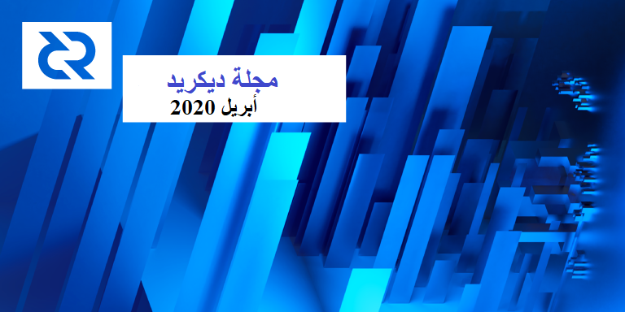

# مجلة ديكريد لشهر أبريل 2020

_الصورة: جسر عمودي بواسطة saender@_

أبرز أحداث شهر أبريل:

<<<<<<< HEAD
- تستمر التحسينات لـ dcrd، التي أصبحت أسرع بكثير لدرجة انها حُظِرت بواسطة الإصدارات القديمة، ويجب تحديث معايير الحظر.
=======
- تستمر التحسينات لـ dcrd، التي أصبحت أسرع بكثير لدرجة انها حُضِرت بواسطة الإصدارات القديمة، ويجب تحديث معايير الحظر.
>>>>>>> 6b789137e1e397ca8c9311fa4b79447cd4918bf2
- نشر moo31337@ طلب سحب WIP للعمل على لامركزية إنفاق الخزينة.
- نرحب بالمساهمين الخمس الجدد  لمستودعات ديكريد على الجيتْهوب !
- لقد كان شهرًا كبيرًا لعمليات الدمج، مع بوابتي Transak و Metal Pay. كما أضاف Steelbackup (حل التخزين المعدني لبَذْرَة DCR) خيارًا جديدًا منخفض التكلفة.
- الفعاليات الشخصية متوقفة، ولكن الفعاليات الافتراضية باِزْدِيَاد، خاصة في أمريكا اللاتينية!

## التطوير

ما لم يُذكر خلاف ذلك، فإن العمل المَذْكُور هنا يشتمل على حالة “الدمج إلى الرئيسي”. وهذا يعني أن العمل قد تم استكماله ومراجعته ودمجه في كود المصدر الذي يمكن للمستخدمين المتقدمين بناءه وتشغيله، ولكنه ليس متاحًا بعد في ثنائيات الإصدار للمستخدمين العاديين.

[dcrd](https://github.com/decred/dcrd):

* تم ترحيل المزيد من أجزاء قاعدة الكود من الأعداد الصحيحة القياسية الكبيرة لـ Go إلى أنواع الحقول المتخصصة، مما أدى إلى تحسينات كبيرة في الأداء
* حزمة `schnorr`: تحسينات على السلامة والاختبار والأداء، بالإضافة إلى [README](https://github.com/decred/dcrd/blob/master/dcrec/secp256k1/schnorr/README.md) شامل يصف مخطط التوقيع المخصص المستند إلى Schnorr المستخدم في ديكريد

> توقيع Schnorr هو مخطط توقيع رقمي معروف ببساطته وأمنه القابل للإثبات والتوليد الفعال للتوقيعات القصيرة. وهو يوفر مزايا عديدة مقارنة بتواقيع ECDSA مما يجعله مثالي للاستخدام، مع جانب سلبي حقيقي وحيد، وهو أنه ليس موحدا بشكل جيد وقت كتابة هذا التقرير.

في حين أن الإجماع يدعم توقيعات Schnorr، فإن بقية البنية التحتية اللازمة للاستفادة الكاملة من مزاياها لم يتم تطويرها بشكل جيد، وبالتالي فهي ليست قيد الاستخدام على نطاق واسع حتى الآن. الهدف هو علاج ذلك.

مع كل الأعمال الحديثة، أصبح التحقق من توقيع ECDSA و Schnorr [أسرع بنسبة 25٪](https://matrix.to/#/!HEeJkbPRpAqgAwhXWO:decred.org/$15862341309060voZvJ:decred.org) مقارنة بالإصدار 1.5.1.

أدت الكثير من التحسينات في dcrd التي تم إجراؤها خلال الأشهر الماضية إلى [ميم](https://twitter.com/degeri_crypto/status/1248522626210897921) "يعاني من النجاح": تعتقد العقد القديمة الآن أن الإصدار الجديد يطلب الكثير من البيانات بسرعة كبيرة و[تحظرها](https://matrix.to/#/!HEeJkbPRpAqgAwhXWO:decred.org/$158650272611269MJQhM:decred.org). يجب تعديل معلمات "معدل الحظر" لتعكس السرعات الجديدة. 

لم يعد يتم تهيئة مستودع dcrd كتفرع ل [btcd](https://github.com/btcsuite/btcd). فقد تمت إضافة العديد من الميزات الجديدة وأدخلت تحسينات شاملة بحيث لا يزال هناك القليل جدًا من الكود المشترك بينهما. كذلك، فإن أحد الأسباب الرئيسية لوجود تفرع هو القدرة على سحب التغييرات الأولية بسهولة. لم يعد الأمر كذلك لأن الكود مختلف لدرجة أن أي تغييرات مطلوبة لـ dcrd يجب أن يتم إدخالها على أي حال. وحتى مع ذلك، فإن معظم التغييرات التي تم إجراؤها في btcd لم تعد تنطبق على dcrd بعد الآن. كما يزيل "unforking" الارتباك حول عدد التفرعات حيث أظهرت صفحة dcrd عدد جميع التفرعات btcd (1,500+). الآن يظهر 235 تفرعا لـ dcrd و 1,290 لـ btcd. وأخيرا، فإنه يزيل الانزعاج والفرصة للخطأ حيث يؤدي الضغط على "طلب السحب الجديد" إلى فتح طلب السحب مقابل مستودع btcd الرئيسي مع جميع التغييرات في الفرع الرئيسي لديكريد.

تم تقسيم تطبيق سطر الأوامر `dcrctl` الذي يتحكم في dcrd و dcrwallet من dcrd إلى [مستودعها](https://github.com/decred/dcrctl) الخاص لمعالجة [مشكلات](https://github.com/decred/dcrd/issues/2133) التبعية والصيانة.

قيد التطوير:

* تم نشر أعمال [تطوير](https://github.com/decred/dcrd/pull/2170) إنفاق الخزينة اللامركزية لجعلها أكثر وضوحا والسماح لمزيد من الناس بالانضمام إلى المناقشة. يعتمد العمل على [المقترح](https://proposals.decred.org/proposals/c96290a2478d0a1916284438ea2c59a1215fe768a87648d04d45f6b7ecb82c3f) ولكنه يضيف تغييرات كبيرة على المواصفات.

[dcrwallet](https://github.com/decred/dcrwallet):

* أمر [`addtransaction`](https://github.com/decred/dcrwallet/pull/1712) الجديد الذي سيكون مفيدًا بشكل خاص لتصميم مزود خدمة التصويت القائم على التذاكر
* إصلاح الأخطاء وصيانة الكود
* لم تعد dcrwallet تفرعا ل [btcwallet](https://github.com/btcsuite/btcwallet) لنفس الأسباب مثل dcrd ولديها 137 من تفرعاتها الخاصة حتى وقت الكتابة

قيد التطوير:

* [دعم](https://github.com/decred/dcrwallet/pull/1714) إنفاق الخزينة اللامركزية للمحفظة بما يتفق مع العمل في dcrd.

[ديكريديتون](https://github.com/decred/decrediton):

* [الخطوات](https://github.com/decred/decrediton/pull/2449) [الأولى](https://github.com/decred/decrediton/pull/2448) للترحيل إلى المكونات الوظيفية ([نهج](https://programmingwithmosh.com/react/react-functional-components/) أحدث في إطار عمل React - يسهل التفكير فيه واختباره)
* إجراء جديد [للتخلي عن المعاملات](https://github.com/decred/decrediton/pull/2467) التي لا يتم تعدينها أو "العالقة"
* [إسْتُهِلّ](https://github.com/decred/decrediton/pull/2457)  إعادة استخدام مكتبة واجهة مستخدم Pi لعدة مكونات للحصول على مظهر وأسلوب عرض متناسقين عبر مختلف منتجات ديكريد
* [الخطوات](https://github.com/decred/decrediton/pull/2452) الأولى نحو [دعم CSPP](https://github.com/decred/decrediton/issues/2455)

[بوليتيا](https://github.com/decred/politeia):

* [طريقة](https://github.com/decred/politeia/pull/1137) جديدة للاستعلام عن بنود الفاتورة التي تمت فوترتها للاقتراح المحدد
* [فصل](https://github.com/decred/politeia/pull/1175) بيانات التعريف عن مقترحات بوليتيا وفواتير نظام إدارة المتعاقد - يؤدي هذا إلى إزالة طريقة غير معهودة لتخزين عنوان المقترح الذي تم استخدامه مسبقًا ويسمح بإضافة بيانات تعريف عشوائية، بما في ذلك الحقول المطلوبة من خلال مقترحات طلب الإقتراح
* جزء من العمل للسماح بعرض بوليتيا [دون جافا سكريبت](https://github.com/decred/politeiagui/pull/1833)
* ضبط و إضافة [التخزين المؤقت](https://github.com/decred/politeiagui/pull/1844) لبيانات جدار الحماية
* [الإنتهاء](https://github.com/decred/politeiagui/pull/1857) من [إعادة تصميم](https://github.com/decred/politeiagui/issues/1490) نظام إدارة الحالة
* مجموعة من الأعمال على واجهة المستخدم لدعم [مقترحات RFP](https://github.com/decred/politeiagui/pull/1820)
* عدة تعديلات على واجهة المستخدم لنظام إدارة المتعاقد
* إصلاح أخطاء متعددة في بوليتيا ونظام إدارة المتعاقد

[dcrstakepool](https://github.com/decred/dcrstakepool):

* تحديثات التبعية وإصلاح الأخطاء

[dcrpool](https://github.com/decred/dcrpool):

* ذاكرة [تخزين مؤقت](https://github.com/decred/dcrpool/pull/180) إضافية، مما أدى إلى تحسين تدفق البيانات (يقوم المجمع الآن بدفع بيانات جديدة إلى ذاكرة التخزين المؤقت بدلاً من اختبار GUI لها)
* إضافة ترقيم صفحات في عدة أماكن - وهذا يكمل العمل على [واجهة المستخدم المناسبة](https://github.com/decred/dcrpool/issues/146) كما قدمها المصممون
* [حساب](https://github.com/decred/dcrpool/pull/191) شكلي لدفع المكافآت
* إضافة واجهة مستخدم رسومية [لطلب الدفع](https://github.com/decred/dcrpool/pull/198) يدويًا ومسح أي رصيد متبقي (مفيد عند مغادرة المجمع)
* زيادة تغطية الاختبار

[dcrlnd](https://github.com/decred/dcrlnd): قيد التطوير:

* تمكين واختبار [وضع التحقق من الدفع البسيط](https://github.com/decred/dcrlnd/pull/95) للمحافظ البعيدة (راجع [إصدار مارس](https://xaur.github.io/decred-news/journal/202003.html#development) لمزيد من المعلومات الأساسية)
* [نقل](https://github.com/decred/dcrlnd/pull/99) تغييرات lnd الأولية بين الإصدار 0.9.0-بيتا و 0.10.0-بيتا - تم النظر في 139 طلب سحب أولي (بالإضافة إلى بعض عمليات طلب عدم السحب) للتضمين.

[dcrdex](https://github.com/decred/dcrdex):

* نظام [الإشعار](https://github.com/decred/dcrdex/pull/244) لتمكين التحديثات الحية في واجهة المستخدم الرسومية للمتصفح
* [خادم الويب](https://github.com/decred/dcrdex/pull/221) لأوامر المشرف
* [تشفير](https://github.com/decred/dcrdex/pull/259) مفتاح التوقيع
* إعداد - [anarchy](https://github.com/decred/dcrdex/pull/268)
* الإنتهاء من [صفحة الأسواق](https://github.com/decred/dcrdex/pull/278)
* [إدخال آمن](https://github.com/decred/dcrdex/pull/246) لحجج سطر الأوامر الحساسة
* إصلاحات الأخطاء وإعادة هيكلة الكود وتحسينات التسجيل والاختبار

[dcrandroid](https://github.com/decred/dcrandroid):

* إعادة تصميم صفحة [البدء](https://github.com/decred/dcrandroid/pull/451)
* [التبديل](https://github.com/decred/dcrandroid/pull/461) بالضغط بين DCR و العملات النقدية المكافئة على صفحة الإرسال
* إضافة الترجمة [الفرنسية](https://github.com/decred/dcrandroid/pull/423)
* تعديلات تجربة المستخدم الأخرى وإصلاح الأخطاء

[dcrios](https://github.com/raedahgroup/dcrios):

* دعم مصادقة بدء التشغيل [البيومتري](https://github.com/raedahgroup/dcrios/pull/613) باستخدام معرف اللمس أو معرف الوجه
* إعادة تصميم صفحة [البدء](https://github.com/raedahgroup/dcrios/pull/615) و[دمجها](https://github.com/raedahgroup/dcrios/pull/628) مع إعداد المحفظة
* صفحة [إحصائيات](https://github.com/raedahgroup/dcrios/pull/627) جديدة مع تحديثات في [الوقت الحقيقي](https://github.com/raedahgroup/dcrios/pull/666)
* [إرسال إشارات](https://github.com/raedahgroup/dcrios/pull/667) للكتل الجديدة
* تعديلات تجربة المستخدم وإصلاح الأخطاء

[dcrdata](https://github.com/decred/dcrdata):

* [تحسينات](https://github.com/decred/dcrdata/pull/1690) وإعادة هيكلة [قاعدة البيانات](https://github.com/decred/dcrdata/pull/1720) للرسم البياني للعملات المختلطة
* برمجة واجهة تطبيقات جديدة للاستعلام عن [وجود](https://github.com/decred/dcrdata/pull/1714) عنوان
* برمجة واجهة التطبيقات بسيطة جديدة لإمدادات العملات [المتداولة](https://github.com/decred/dcrdata/pull/1697)
* البحث عن [نقطة خارجية](https://github.com/decred/dcrdata/pull/1711) للمعاملة
* إصلاحات الأخطاء

تم نشر أدلة تفصيلية حول كيفية [الاستعلام عن dcrdata](https://stakey.club/en/querying-dcrdata/) وكيفية تشغيل [المثيل الخاص بك](https://stakey.club/en/dcrdata-running-your-own-block-explorer/) من مستكشف الكتلة بواسطة mm@ باللغتين الإنجليزية و[البرتغالية](https://stakey.club/pt/articles/).

[tinydecred](https://github.com/decred/tinydecred):

* [النماذج والإعدادات](https://github.com/decred/tinydecred/pull/156) اللازمة للاتصال ب dcrd
* الدعم الأساسي [لمرشحات GCS](https://github.com/decred/tinydecred/pull/149)
* زيادة تغطية الاختبار في [حملة](https://github.com/decred/tinydecred/issues/70) من أجل اختبار غير متسامح لحزمة البرمجيات 
* تم ترحيل جميع الاختبارات إلى [pytest](https://github.com/decred/tinydecred/pull/161)
* تعزيز أداء البدائل المشفرة باستخدام [Cython](https://github.com/decred/tinydecred/pull/160)، مما أدى إلى تقليل وقت تنفيذ الاختبار من 21 إلى 4 ثوانٍ (تسمح الاختبارات السريعة بالتطور الإنتاجي وهي متعة الحياة)

[المستندات](https://github.com/decred/dcrdocs):

* [إضافة](https://github.com/decred/dcrdocs/pull/1087) [صفحة](https://docs.decred.org/advanced/mnemonic-seed/) توثق الاختلافات بين بذرة ديكريد و BIP-0039

[decred.org](https://github.com/decred/dcrweb):

* تحسينات في [وضع nojs](https://github.com/decred/dcrweb/pull/875)
* تحديث منصات التبادل

مسائل أخرى:

* تم نقل أداة [الإصدار](https://github.com/decred/release) لبناء ملفات تنفيذية قابلة للاستنساخ تحت `decred` GitHub org
* قام Checkmate@ بنشر [حسابات](https://github.com/checkmatey/checkonchain/blob/master/research_articles/checkonchain_charts/checkonchain_charts.md) لتنفيذ المقاييس الخاصة به
* جعلت الجيتهوب جميع الميزات الأساسية [مجانية للجميع](https://help.github.com/en/github/getting-started-with-github/faq-about-changes-to-githubs-plans)، والتي تتضمن مستودعات خاصة للمستخدمين غير المحدودين

إحصائيات نشاط التطوير لشهر أبريل: 313 من المشاريع النشطة، 247 إيداع رئيسي، 39 ألف إضافة و 23 ألف عملية حذف من خلال 16 مستودع. جاءت المساهمات من 2-7 مطورين لكل مستودع.

## الأشخاص

مرحبا بالمساهمين الجدد مع دمج الكود إلى الماستر: jdambron@ على ([dcrandroid](https://github.com/decred/dcrandroid/commits?author=jdambron))، matthawkins90@ على ([dcrd](https://github.com/decred/dcrd/commits?author=matthawkins90))، leRequinNoir@ على ([dcrdata](https://github.com/decred/dcrdata/commits?author=leRequinNoir))، kevinstl@ على ([dcrdex](https://github.com/decred/dcrdex/commits?author=kevinstl)) و chillviben@ على ([dcrios](https://github.com/raedahgroup/dcrios/issues?q=is%3Aissue+author%3Achillviben)).

إحصائيات المجتمع اعتبارًا من 1 ماي:

* متابعو التويتر: 40,570 (124-)
* المشتركين في ريديت: 9,761 (1+)
* مستخدمي الماتريكس: 624 (23+)
* مستخدمي الديسكورد: 1,184 (24+)
* مستخدمي التيليجرام: 2,557 (50-)
* المشتركين في اليوتيوب: 3,990 (10+)
* متابعي الفيسبوك: 3,618 (12+)، إعجاب: 3,280 (7+)
* متابعي لينكد إن: 774 (30+)
* نجوم Github dcrd: بلغت 539 (3+)، تفرعات: 235 (1,272-) - شملت حسابات التفرعات السابقة جميع تفرعات btcd مما كان مضللا، والآن بعد إزالة علاقة التفرع مع btcd فإن العدد الحالي هو خاص بتفرعات dcrd

## الإدارة و الحوكمة

تلقت [الخزينة](https://explorer.dcrdata.org/address/Dcur2mcGjmENx4DhNqDctW5wJCVyT3Qeqkx) في شهر أبريل 13,250 DCR وأنفقت 17,228 DCR. وباستخدام معدل المتوسط اليومي لشهر أبريل ب DCR/USD والذي يقدر ب 12.34 دولارًا، ستكون الخزينة قد تلقت 164 ألف دولارا وأنفقت 213 ألف دولارا. ووفقًا لمتوسط السعر اليومي في مارس البالغ 13.40 دولارًا، فإن قيمة الفَوترة بالدولار الأميركي عن العمل المنجز في ذلك الشهر تكون قد بلغت 231 ألف دولار. واعتبارا من 3 ماي، بلغ رصيد الخزينة 636,000 DCR (أي 9.17 مليون دولار أمريكي بسعر 14.42 دولار أمريكي).

تم تقديم مقترحين جديدين في أبريل، [أحدهما](https://proposals.decred.org/proposals/bce7bf3cd1f74d571d23ac8a330ddf29a14a547ed0cc9c995f1a97dce733d1e1) لحملة تسويق لوحة إعلانية تم رفضه بموافقة 17٪ (نسبة إقبال 31٪) و[آخر](https://proposals.decred.org/proposals/83b59ef5ab40193a86073abbd93cea13ed6d071eecc78918ab5cf98cba7c7a67) من CryptoNoticias لحملة تسويق محتوى تم رفضها أيضًا بموافقة 31٪ وإقبال بنسبة 30٪.

كما تم رفض الاقتراحين اللذين تم التصويت عليهما في مارس هذا الشهر. حصل [DCR Comic 2](https://proposals.decred.org/proposals/2f08f8518bc7672069a10ac6461fd9ab341d4a9e4c343fd4a7ec426250f3896f) على دعم من 49.4٪ من التذاكر التي صوتت (مشاركة 19٪)، بينما حصل اقتراح [Decred Daily](https://proposals.decred.org/proposals/7d42c6f4bf3059b64789185af615c1df97cb61a379425933be5ff01d074ed4d5) على 44٪ موافقة من 17٪ من التذاكر المؤهلة التي صوتت. كلاهما لم يصل إلى النصاب القانوني بنسبة 20٪.

لمزيد من التفاصيل حول هذه المسألة انظر [العدد 30](https://blockcommons.red/politeia-digest/issue030/) من بوليتيا دايجيست.

## الشبكة

معدل الهاش: افتتحت [معدلات الهاش في شهر أبريل](https://explorer.dcrdata.org/charts?chart=hashrate&zoom=k8f3rvwm-k9oqhibz&scale=linear&bin=block&axis=time) على ~302 Ph/s وأغلقت على ~360 Ph/s، وبلغ قاعها عند 240 Ph/s كما بلغت ذروتها عند 470 Ph/s على مدار الشهر. [توزيع معدلات الهاش](https://dcrstats.com/pow) للتجمع اعتبارا من 1 ماي حسب dcrstats.com:

* UUPool بنسبة 46%،
* Poolin بنسبة 22%،
* lab.antpool.com بنسبة 17%،
* F2Pool بنسبة 2%،
* Luxor بنسبة 2%،
* BTC.com بنسبة 1.6%،
* BeePool بنسبة 0.12%،
* Coinmine بنسبة 0.05%،
* Suprnova بنسبة 0.02%،
وأخرى بنسبة ~9%.

أرقام توزيع التجمع تقريبية ولا يمكن تحديدها بدقة.

التحصيص: بلغ متوسط سعر التذكرة [لمدة 30 يوما](https://dcrstats.com/) 137.8 DCR (ناقص 4.1). وتفاوت [السعر](https://explorer.dcrdata.org/charts?chart=ticket-price&zoom=k8f3rvwm-k9oqhibz&bin=window&axis=time&visibility=true-false&mode=stepped) بين 131.7 و 142.8 DCR. وقد بلغ [المبلغ المقفل](https://explorer.dcrdata.org/charts?chart=ticket-pool-value&zoom=k8f3rvwm-k9oqhibz&scale=linear&bin=block&axis=time) 5.62-5.71 مليون DCR، وهو ما يعادل 49.2-50.3% من العرض المتاح [المشاركة](https://explorer.dcrdata.org/charts?chart=stake-participation&zoom=k8f3rvwm-k9oqhibz&scale=linear&bin=block&axis=time) في إثبات الحصة.

العقد: طوال شهر [أبريل](https://charts.dcr.farm/d/000000014/nodes?orgId=1&from=1585699200000&to=1588291200000)، كان هناك ما متوسطه 131 عقد استماع عام و 206 عقدة إجمالية حسب dcr.farm. تم توزيع الإصدارات في شهر أبريل، في المتوسط، على النحو التالي: 44% يشغلون dcrd النسخة 1.5.1، و16% dcrd النسخة 1.5، %5 يشغلون نسخة التطوير 1.5 وبناء إصدارات الترشيح، 16% يستخدمون dcrd النسخة 1.6 لبناء التطوير، %4 يشغلون dcrd النسخة 1.4، 9% يشغلون dcrwallet النسخة 1.5.1، 2.4% يشغلون dcrwallet النسخة 1.4 و 1.4% يشغلون dcrwallet النسخة 1.5.

تحديثات من Checkmate@:

* قسم ديكريد من الرسالة الإخبارية ل [Our Network](https://ournetwork.substack.com/p/our-network-issue-15) ([التغريدة](https://twitter.com/_Checkmatey_/status/1247649984473894912)). تشير المقاييس المتعددة التي تستند إلى نموذج Checkmate@ للأسهم إلى التدفق ودخل المعدن وأبحاث بيانات التذاكر ل permabullnino@ إلى أن قيمة الشبكة أقل من قيمتها الحقيقية.
* حجم كبير على السلسلة بالنسبة لتقييم الشبكة ومقاييس [NVT و RVT](https://twitter.com/_Checkmatey_/status/1252754120345182210).
* زيادة [حجم المعاملات](https://twitter.com/_Checkmatey_/status/1255084712386654209) بسبب زيادة استخدام الخصوصية.

## الإنضمام

أعلن موفر خدمة التصويت [dcr.blue](https://dcr.blue/) أنه سيتم إغلاقه في رسالة مرسلة في 20 أبريل إلى جميع المستخدمين الذين يملكون بريد إلكتروني متحقق منه. وقد تمت [إزالته](https://github.com/decred/dcrwebapi/pull/97) من [القائمة](https://www.decred.org/vsp/) وديكريديتون ولكنه سيبقى على الإنترنت لبقية عام 2020. وبما أن العمر الأقصى للتذكرة هو 4.7 أشهر تقريبًا، فإن هذا يمنح المستخدمين حوالي 3 أشهر لإيقاف شراء التذاكر المخصصة من DCR.Blue. ينصح المستخدمون بإجراء نسخ احتياطي للبرامج النصية البديلة إذا لم يكونوا قد قاموا بذلك بالفعل (تتوفر نسخة في حساب موفر خدمة التصويت) والبدء في شراء التذاكر من حساب موفر خدمة آخر. يرجى تجنب الانضمام إلى مقدمي خدمات تصويت كبيرة جدا للحفاظ على توزيع صحي وأمن أفضل للشبكة. وهذا هو أول مزود لخدمة التصويت يحاول "الإغلاق السلس" بدلاً من الاختفاء فقط دون إشعار كما فعل بعض مزودي خدمات التصويت الآخرين في الماضي.

مزود خدمة التصويت [decred.raqamiya.net](https://decred.raqamiya.net/) الذي تم [شطبه](https://github.com/decred/dcrwebapi/pull/95) في مارس بدأ العمل مرة أخرى الآن وتمت [إضافته](https://github.com/decred/dcrwebapi/pull/96) إلى القائمة. وحتى وقت كتابة هذا التقرير، يحتفظ بحوالي 330 تذكرة حية (0.8%)، ولديه 4 خوادم، ويتميز بواجهة مستخدم مخصصة.

[أضافت](https://twitter.com/metalpaysme/status/1249745420206686208) Metal Pay [دعمًا](https://blog.metalpay.com/metal-pay-welcomes-decred/) لـ DCR في سوقها. وهو يوفر عملات نقدية على الطريق و يعمل في معظم الولايات الأمريكية. ثم تابعوا الإعلان [بتغريدات](https://twitter.com/metalpaysme/status/1250424090172612615) حول ديكريد.

[أعلنت](https://twitter.com/transak_finance/status/1256654711412776961) [Transak](https://global.transak.com/) أن تداول DCR مقابل EUR و GBP و INR [متاح](https://global.transak.com/?defaultCryptoCurrency=DCR) على بوابة دفع العملات الرقمية <> العملات النقدية الخاصة بهم. ستتوفر أزواج الدولار الأمريكي قريبًا.

[أضافت](https://twitter.com/SwapSpaceCo/status/1250078395884539906) منصة التبادل الفوري [SwapSpace](https://swapspace.co/) دعم ديكريد.

أضاف [Steelbackup](https://steelbackup.com/) وهو حل جِسْمانِيّ لنسخ الاحتياطي لبَذْرَة  [إصدارًا خفيفًا](https://twitter.com/steelbackup/status/1248058631523905538) من المنتج. يوجد حاليًا نوعان من اللوحات الفولاذية: [منقوشة بالليزر](https://steelbackup.com/product/decred-laser-engraved/) و [موسومة بالليزر](https://steelbackup.com/product/decred-laser-marked/). والحديد المنقوش هو أكثر الحلول قوة حيث يتم إزالة الفولاذ مما يجعل شبكة الوسم دائمة كالفولاذ. ويتم وسم المنتج الموسوم بالليزر بواسطة محلول ديسولفيدي موليبدينوم مما يجعله مقاوما للخدوش والأحماض ودرجات الحرارة المرتفعة (حتى 340 درجة مئوية). المنتجات مصممة لتكون بسيطة مع عدم وجود أجزاء متحركة، يحتاج المستخدمون فقط إلى مثقاب (يتواجد في متجر معدات محلية) لدمج بذرتِهم. تم إطلاق SteelBackup في فبراير 2020 بواسطة zubair@ ويشحن لجميع أنحاء العالم.

تحذير: ليس لدى مؤلفي مجلة ديكريد أي فكرة عن مصداقية أي من الخدمات المذكورة أعلاه. يرجى إجراء البحوث الخاصة بك قبل الوثوق بمعلوماتك الشخصية أو الأصول إلى أي كيان.

## الانتشار

نمت [قناة](https://www.youtube.com/decredchannel) ديكريد على اليوتيوب بـ 4 مقاطع فيديو جديدة، بينما تم إصدار ما مجموعه 3 بودكاستات من Decred in Depth و Rough Consensus (انظر [وسائل الإعلام](https://xaur.github.io/decred-news/journal/202004.html#media)(أدناه).

تواصل [قناة](https://www.youtube.com/channel/UC73wa2ddXuPWsmenVfeFTYg) ديكريد البرازيل إنشاء المحتوى بنشاط. نشرت Decred Semanal ("النشرة الأسبوعية لديكريد") 5 حلقات جديدة في أبريل، تلقت ~ 150 مشاهدة في المتوسط​​، بزيادة 50 مشاهدة نسبة بالأشهر السابقة(على الأرجح نتيجة [لتحسين](https://matrix.to/#/!kdpEDksmOMNrlMqffD:decred.org/$158896614628001AwmOM:decred.org) أساليب التوزيع). السلسلة متاحة أيضا في شكل بودكاست على جميع المنصات الرئيسية مثل [أبل](https://podcasts.apple.com/podcast/decred-brasil/id1451017413) (59 حلقة في المجموع)، جوجل، [سبوتيفي](https://soundcloud.com/decredbrasil)، ساوند كلاود وغيرها.

على Medium، تواصل [Decred Drive](https://twitter.com/decreddrive) تقديم تحديثات أسبوعية لطيفة، تضيف [Decred Spanish](https://medium.com/decred-es) مقالات وترجمات جديدة، وظهر [Phoenix Green](https://medium.com/@kencameron77) مع كتابات حول رحلته في العملات الرقمية/ديكريد.

علّق jy-p@ على إصدار ائتمان العملات النقدية والعمل عن بُعد في استبيان مشروع بواسطة [8btc.com](https://news.8btc.com/8btc-interview-cryptos-and-coronavirus-what-we-learned-from-foreign-communities).com. 8btc هو أقدم منتدى للبتكوين في الصين.

إنجازات Monde PR لشهر أبريل:

* ابتكرت وطرحت فكرة قصة تستهدف الاستثمار والمنشورات الرأسمالية والتكنولوجية
* ابتكرت وطرحت فكرة قصة تستهدف منشورات العملات الرقمية والتقنيات المالية
* خلقت وطرحت فكرة قصصية تستهدف المنشورات المالية الشخصية
* قدمت تعليقات من متحدثي ديكريد إلى 8 قصص إخبارية
* أمنت مقابلة إعلامية مع وكالة أنباء رئيسية و 3 أسئلة وأجوبة بالبريد الإلكتروني مع منشورات العملات الرقمية السائدة

التغطية الإخبارية المؤمنة من قبل Monde PR:

* قطعة قيادة فكرية في [ValueWalk](https://www.valuewalk.com/2020/04/open-source-response-covid-19/) من قبل richardred@
* مقال في Cointelegraph يعرض تعليقًا بواسطة jy-p@ حول مستقبل العملات المستقرة، الذي تم نشره على [Investing.com](https://www.investing.com/news/cryptocurrency-news/g20s-harsh-stance-on-stablecoin-is-a-step-forward-but-regulators-have-more-to-learn-2144200) و[شبكة أخبار البتكوين](https://www.btcnn.com/harsh-stablecoin-recommendations-from-g-20-are-a-step-in-the-right-direction-but-regulators-need-more-education/)

## الفعاليات

الحضور:

* 4 أبريل - [محادثات Paxful](https://twitter.com/paxful_LATAM/status/1245066931155148800) - الإنترنت. تمت دعوة elian@ من قبل Paxful LATAM للتحدث عن كيفية اكتشاف عمليات الاحتيال وما الذي يجب النظر إليه عند البحث في أساسيات العملات الرقمية. لم يكن حديثا مباشرًا عن ديكريد ولكن تم ذكرها كمثال للممارسات الجيدة داخل الصناعة. تم دعم الندوة عبر الويب "بواسطة ديكريد" وشاهدها 70 شخصًا تقريبًا.
* 9 أبريل - Hablemos Decred 03 - الإنترنت. شرح pablito@ وelian@ نظام إثبات الحصة. لم يكن هناك سوى 3 مشاهدين جدد هذه المرة، على الرغم من تعلم بعض الدروس حول الترويج للفعالية واختيار الوقت الأمثل. ([التقرير](https://github.com/decredcommunity/events/blob/master/reports/20200409-hablemosdecred-03-internet.md))
* 16 أبريل - [Jalisco Talend Land @ Home](https://www.talent-land.tv/) - الإنترنت. قدم فريق ديكريد ندوة بعنوان "مستقبل المال والعمل عن بعد" لاستكشاف تقاطع المال والتكنولوجيا والعمل عن بعد من خلال عدسة وخبرة 4 متعاقدين لديكريد في أمريكا اللاتينية. تبادلوا تجاربهم في العمل من الأرجنتين وكولومبيا والمكسيك، وغطوا تحديات وفرص العمل في ديكريد عن بعد. ([التقرير](https://github.com/decredcommunity/events/blob/master/reports/20200416-talent-land-at-home-internet.md))
* 16 أبريل - Hablemos de Criptomonedas - الإنترنت. تمت استضافة الندوة عبر الإنترنت بالاشتراك مع جامعة Ibero من خلال مركز الابتكار IDIT. تحدث adcade@ وelian@ عن العملات الرقمية و سلسلة الكتل لجمهور من 22 (من أصل 34 قاموا بالتسجيل)، معظمهم من الطلاب. ([التقرير](https://github.com/decredcommunity/events/blob/master/reports/20200416-hablemos-de-criptomonedas-internet.md))
* 23 أبريل - Hablemos Decred 04 - الإنترنت. ركز pablito@ وelian@ على المبادلات ومنصة التبادل اللامركزية DEX التي تبنيها ديكريد. وقد وصل عدد الحضور هذه المرة إلى 15 شخصا، ويواصل فريق أمريكا اللاتينية استكشاف أفضل السبل لاستضافة مثل هذه الفعاليات. ([التقرير](https://github.com/decredcommunity/events/blob/master/reports/20200423-hablemosdecred-04-internet.md))
* 30 أبريل - [اللقاء الإفتراضي لديكريد](https://www.meetup.com/Decred-Australia/events/270252645/) - الإنترنت. قدم Checkmate@ تحليلات BTC و DCR على السلسلة. تم تحميل التسجيل على [اليوتيوب](https://www.youtube.com/watch?v=H_COE9A-t3I).

الفعاليات القادمة:

* 12 ماي - [أسس ديكريد في Consensus Distributed](https://next.brella.io/events/consensusdistributed/schedule/118434) (يتطلب الاشتراك في brella.io للمشاهدة و "الحضور") - الإنترنت. Consensus Distributed هو البديل عن بعد لمؤتمر Consensus السنوي، وديكريد أحد المشاريع التي دعيت إلى المساهمة بساعة من المضمون مقسمة إلى ثلاثة أجزاء. في البناء، يدقق richardred@ مع المساهمين في بعض المشاريع الفرعية الهامة في ديكريد لمعرفة ما هي و آخر المستجدات. يضم lukebp@ على بوليتيا وmatheusd@ على dcrlnd وchappjc@ و buck54321@ على dcrdex و dcrdata و TinyDecred. أما الجزء الثاني فهو الأسرار التجارية، حيث يقدم Checkmate@ مقدمة سريعة عن أعلى 5 مقاييس على السلسلة. في النهاية، سيقدم jy-p@ مراجعة لتقدم السنة عبر جميع الجوانب الرئيسية للمشروع في  سجلّ التغييرات تليها جلسة أسئلة وأجوبة مباشرة لمدة 10 دقائق مع Lucas Nuzzi. وسوف يتوفر الفيديو على موقع الويب الخاص بشركة Coindesk بعد ذلك، وسوف يتم تحميل نسخة موسعة من الأسرار التجارية على اليوتيوب.
* 14 ماي - [لقاء افتراضي مع BlockchainEx](https://twitter.com/Decred_ES/status/1258905004510973953) - الإنترنت. ستشارك ديكريد في حلقة النقاش "ما هي الحوكمة اللامركزية والمنظمات اللامركزية المستقلة؟" سيشارك في إستضافتها كل من adcade@ و caibrad@ من ديكريد و Nadia Alvarez من MakerDAO و Gustavo Segovia من Colony و Jhonny Gomez من BlockchainEx. سيتم بث هذه الندوة على الهواء مباشرة إلى مجتمع سلسلة الكتل في كولومبيا.
* 14 ماي -[ لقاء ديكريد مع BlockConf](https://twitter.com/Decred_ES/status/1258165218204618759) - الإنترنت. سيكون هذا لقاءً افتراضيًا لعرض النظام الأساسي دردشة دافئة قبل المؤتمر الرئيسي. سيقدم الفريق نبذة عن أساسيات ديكريد والتطورات الجديدة قيد الاعداد.
* 25 ماي - [BlockConf](https://blockconf.digital/) - الإنترنت. ستكون ديكريد [راعيا برونزيا](https://twitter.com/BlockconfD/status/1251194332079697922). سيقوم فريق ديكريد أمريكا اللاتينية بتشغيل كشك افتراضي لديكريد للإجابة على أسئلة الحضور. إذا أراد أي شخص المساعدة في إبقاء الكشك نشطًا في مناطق زمنية متعددة خلال الفعالية التي ستستمر لمدة 48 ساعة، فيرجى الاتصال بـ elian@.

_الصورة: لا يوجد نقص في ستايكي في أمريكا اللاتينية_

## وسائل الإعلام

مقالات مختارة:

* ديكريد على السلسلة: أقوى سقف أسعار السوق + النسبة بواسطة permabullnino@ على ([medium](https://medium.com/@permabullnino/decred-on-chain-strongest-hand-market-cap-ratio-146d6854e1d6))
* مراقبة صانع سوق ديكريد - المرحلة 1 الإختتام بواسطة richardred@ على ([blockcommons.red](https://blockcommons.red/publication/mm-phase1-wrapup/))
* العدد 15 من Our Network - يتضمن تحديثات ديكريد من Checkmate@ على ([substack.com](https://ournetwork.substack.com/p/our-network-issue-15))
* مقترح حوكمة ديكريد: حماية الخزينة بواسطة Phoenix Green على ([medium](https://medium.com/phoenix-green/decred-governance-proposal-protecting-the-treasury-2bcab84800ad))
* الشؤون المالية 2.0 بواسطة Phoenix Green على ([medium](https://medium.com/@kencameron77/finance-2-0-5dea40e4b60e))
* عقلية المصادر المفتوحة للتمويل بواسطة Phoenix Green على ([medium](https://medium.com/@kencameron77/open-sourced-finance-7ce8a3fdb648)) - يدعو إلى التفكير بشكل جماعي والعثور على أسس مشتركة، ويسرد أدوات لبناء مجتمع
* 3 أشياء يجب أن يعرفها الجميع عن العملات الرقمية بواسطة Phoenix Green على ([medium](https://medium.com/@kencameron77/3-things-everyone-should-know-about-cryptocurrencies-e38c3db4127b))
* الآلة الزمنية للبتكوين بواسطة Phoenix Green على ([medium](https://medium.com/@kencameron77/the-bitcoin-time-machine-29f228656cd3)) - مقارنة البتكوين مع ديكريد
* ماذا لو كان لدى بتكوين خزينة؟ ريان واتكينز على ([messari.io](https://messari.io/article/what-if-bitcoin-had-a-treasury)، محمي بدفع اشتراك محدد)
* مقابلة Project Rundown مع ديكريد بواسطة The Capital (مجلة عملات بديلة سابقة، [medium](https://medium.com/the-capital/project-rundown-interview-with-decred-on-the-capital-8b647919a339))
* لنتحدث عن ديكريد و العمل عن بعد بواسطة adcade@ (بالإسبانية، [medium](https://medium.com/decred-es/hablemos-decred-sobre-el-proyecto-y-sobre-el-trabajo-remoto-e5a2510364ae))
* مقالة عن اللقاء الافتراضي الرابع المقرر حول المبادلات المركزية والمبادلات اللامركزية (بالإسبانية، [es.cointelegraph.com](https://es.cointelegraph.com/news/decred-organizes-virtual-meeting-on-decentralized-exchanges-for-the-spanish-speaking-community))

الترجمة:

* الأسرار التي فاتتهم في DevCon: كيف يكون حقا العمل في منظمة مستقلة لا مركزية - ترجم إلى [البرتغالية](https://stakey.club/translated/working-dao/) بواسطة mm@.
* تمت ترجمة مجلة لشهر مارس 2020 إلى العربية بواسطة (arij@) و البولندية بواسطة (kozel@) والصينية بواسطة (Dominic@) والإسبانية بواسطة (francov\_@). عاد kozel@ للعبة بأربعة أعداد مترجمة منذ دجنبر. الإصدارات الإسبانية المختصرة متوفرة على [Medium](https://medium.com/decred-es/revista-2020/home). شكرا لكم جميعا على بناء الوعي بالمشروع!

أشرطة الفيديو:

* DCR 101 - العمل في المنظمة المستقلة اللامركزية ديكريد بواسطة Exitus@ على ([اليوتيوب](https://www.youtube.com/watch?Ud4LVhFwL9g))
* تحديث النشرة النصف الشهرية لديكريد - 18 أبريل 2020 بواسطة Exitus@ على ([اليوتيوب](https://www.youtube.com/watch?v=3TLeEO8Mz1k))
* لقاء ديكريد الإفتراضي بأستراليا - فعالية التحليل على السلسلة لديكريد و البتكوين بواسطة Checkmate@ على ([اليوتيوب](https://www.youtube.com/watch?v=H_COE9A-t3I))
* لدى Psychic Andre مشاعر جيدة حيال الأمور التي تحدث، الفيديو غالبًا ما يتعلق بالاحتياطي الفيدرالي ولكن حول موضوع ديكريد يقول Andre "إنهم بخير" على ([اليوتيوب](https://www.youtube.com/watch?v=ddjelXN5KZs))
* مجلس الاحتياطي الاتحادي بكلماته الخاصة. حماية ثروتك، وشراء الاعتمادات اللامركزية ([التويتر](https://twitter.com/coveryfire7777/status/1246169256020107266))
* DCR 101 - كيف تحصص ديكريد بواسطة Exitus@ على ([اليوتيوب](https://www.youtube.com/watch?v=m5lcm6yttEk))
* تحليل سعر ديكريد - 17 أبريل 2020 بواسطة Brave New Coin على ([اليوتيوب](https://www.youtube.com/watch?v=Q33i6xK_SPg))

الصوتيات:

* الحلقة 4 من Rough Consensus - الذهب والبتكوين وديكريد. تناقش mr.black@ و Checkmate@ وPermabullNino@ حالة الأسواق الكلية وأسواق التشفير في سياق الاقتصادات المنهارة والتخفيف الكمي غير المحدود. تنظر المحادثة في طبيعة النقود السليمة وكيف يمثل الذهب و البتكوين وديكريد مناطق مختلفة من طيف النقود السليمة. ([libsyn](https://roughconsensus.libsyn.com/rough-consensus-4-gold-bitcoin-and-decred))
* ديكريد في العمق - التجمع 2 مع mr.black@ وCheckmate@ وPermabullNino@. على ([libsyn](https://decredindepth.libsyn.com/dcr-round-up-2-with-checkmate-permabull-nio)، و [اليوتيوب](https://www.youtube.com/watch?v=eb_GFdOkjwA)، و [soundcloud](https://soundcloud.com/decredindepth/dcr-round-up-2-with-checkmate))
* ديكريد في العمق  (تخلت عن الترقيم) - كريس بورنيسك من Placeholder VC يتحدث عن التطورات الأخيرة، ولماذا ديكريد آمنة جدا، قابلة للتكيف و مستديمة، و فرص dcrdex و بوليتيا لتوسيع النظام البيئي لديكريد، والمزيد. ([libsyn](https://decredindepth.libsyn.com/chris-burniske-institutional-investment-dcr-as-a-sov-current-events-dcr-custody-solutions)، و [اليوتيوب](https://www.youtube.com/watch?v=Q4wbt0JLA5k)، و [soundcloud](https://soundcloud.com/decredindepth/chris-burniske-crypto-in-the))

## مناقشات المجتمع

منشورات مختارة من الريديت:

* كان [منشور](https://www.reddit.com/r/decred/comments/fy493y/decred_journal_march_2020/) الريديت الخاص بـبمجلة ديكريد هو الأكثر مناقشة في subreddit هذا الشهر مع 42 تعليقًا!
* [خلصت](https://www.reddit.com/r/decred/comments/g2ozqc/reason_bits_for_politeia_no_votes_feature_idea/) المناقشة الدائرة حول فكرة bee@ بإضافة معلومات [أسباب التصويت](https://github.com/decredcommunity/issues/issues/118) إلى أصوات بوليتيا إلى أن تنفيذها على النحو اللائق يتطلب حل الخصوصية مثل خطة التصويت الأعمى.
* تكهنت [مناقشة](https://www.reddit.com/r/decred/comments/g5he83/decred_market_maker_monitoring_phase_1_wrapup/) تقرير صناعة السوق في المرحلة الأولى حول معدل الاعتماد.
* جمع موضوع [وجهات النظر](https://www.reddit.com/r/decred/comments/g66onn/perspectives/) 33 تعليقًا، الكثير منها بأفكار جيدة للقراءة المتعمقة
* لعبة مصغرة: [ديكريد تفعلها بشكل مختلف](https://www.reddit.com/r/decred/comments/g66msa/decred_challenge_do_different/).
* يناقش [المنشور](https://www.reddit.com/r/decred/comments/fyi49j/checkmate_on_twitter_cost_to_launch_a_1hr_double/) منهجية Checkmate@ لمقارنة تكلفة هجوم ديكريد وسلاسل أخرى.

مناقشات مختارة من التويتر:

* [غرد](https://twitter.com/_Checkmatey_/status/1248498765113126912) Checkmate@ عن تكلفة مضاعفة إنفاق هجوم DCR بنسبة 54 مرة أعلى من BTC ، مما حفز الكثير من النقاش.
* [أعلن](https://twitter.com/_Checkmatey_/status/1253116008639811585) Checkmate@ عن إطلاق مشروع جديد، مع فريق من المساهمين الذين يعملون على موقع مقاييس ديكريد على السلسلة الجديد.
* [تسائل](https://twitter.com/MessariCrypto/status/1255579343973232640) ميساري في ما إذا كان لدى البتكوين خزينة ديكريد، و[يوضح](https://twitter.com/MessariCrypto/status/1255579345319596033) كم كان يمكن أن يكون ذلك لو أن البتكوين أنفقت ~ 23٪ من دخلها الشهري من الخزينة وحفظت الباقي.
*  نشر moo31337@ [تغريدة](https://twitter.com/marco_peereboom/status/1251174260925779977) عن WIP PR للعمل على مقترح إنفاق الخزينة اللامركزي، ولكن أكثر من نصف التعليقات كانت بالفعل قلقة بشأن مغامرته المقبلة في الطهي.

## الأسواق

في أبريل تم تداول DCR بين 11.08-15.01 / 0.00151-0.001790021. وكان متوسط ​​السعر اليومي 12.34 دولار.

كتب richardred@ [تقريرًا](https://blockcommons.red/publication/mm-phase1-wrapup/) عن أداء صانعي السوق خلال فترة [مقترحهم](https://proposals.decred.org/proposals/2eb7ddb29f151691ba14ac8c54d53f6692c1f5e8fe06244edf7d3c33fb440bd9) الأول.

## الخارجية ذات الصلة

وقع هجوم DeFi [آخر](https://www.coindesk.com/dforce-hacker-returns-almost-all-of-stolen-25m-in-crypto)، على الرغم من أن dForce هذه المرة استردت معظم خسارتها البالغة 25 مليون دولار من المهاجم ويتم تعويض المستخدمين.

على شبكة ستايبلكوين الأكثر غموضا [PegNet](https://www.coindesk.com/miners-trick-stablecoin-protocol-pegnet-turning-11-into-almost-7m-hoard)،  قام عمال المعدنون الفاسدون بتحويل رصيد بقيمة $11 pJYP إلى رصيد 6.7 مليون pUSD عن طريق التلاعب في الأسعار باستخدام شكل هجوم بنسبة 51%. لم يتمكن المهاجمون من تصفية أكثر من نسبة صغيرة من pUSD ، وتواصلوا بعد ذلك ليقولوا أنهم كانوا يحاولون فقط اختبار الشبكة ، وأحرقوا pUSD الذي تم إنشاؤه بطريقة سحرية.

[يتساءل](https://twitter.com/econoar/status/1254063336779444226)  الناس سبب عودة ProgPoW إلى أجندة تطوير الإيثيريوم الأساسية، وما إذا كان العجز عن التخلص منها يعني وجود شيء [فاسد](https://twitter.com/hasufl/status/1254065039105024001) في حوكمة الإيثيريوم.

حتى الآن، نجح برنامج القروض الذي قدمته حكومة الولايات المتحدة إلى الشركات الصغيرة والذي تبلغ قيمته 349 مليار دولار في توليد 10 مليار دولار [كرسوم](https://www.npr.org/2020/04/22/840678984/small-business-rescue-earned-banks-10-billion-in-fees) للبنوك، و1-5% عن كل قرض يتم تجهيزه، على الرغم من المخاطر المنخفضة للغاية التي تفرضها القروض على البنوك، ونظرا إلى أنها كانت تقوم فعلا بتقديمها إلى إدارة الاعمال التجارية الصغيرة التي تضمن جميع القروض. ([نسخة النص العادي](https://www.npr.org/2020/04/22/840678984/small-business-rescue-earned-banks-10-billion-in-fees))

تخضع مؤسسة Maker [لدعوى قضائية](https://www.coindesk.com/makerdao-users-sue-stablecoin-issuer-following-black-thursday-losses) من المستثمرين الذين خسروا المال يوم الخميس الأسود.

وقد تم رفع [سلسلة كاملة](https://www.theblockcrypto.com/post/60930/top-crypto-exchanges-token-issuers-named-in-friday-barrage-of-u-s-class-action-lawsuits) من الدعاوى القضائية ضد منصات تبادل العملات الرقمية ومصدري التوكنات.

بلغ رصيد USDT المحتفظ به في المبادلات أعلى مستوى جديد له على الإطلاق عند [1.8 مليار دولار](https://twitter.com/glassnodealerts/status/1253343292403724294) في 23 أبريل، وفقًا لتنبيهات glassnode.

قام اليوتيوب بتحديث سياساته لمنع أي شيء يتعلق بـ COVID-19 يتعارض مع "المصادر الموثوقة" مثل إرشادات منظمة الصحة العالمية ، كما تم الكشف عنه في [مقابلة](https://reclaimthenet.org/youtube-ceo-coronavirus-right-information-misinformation/)  مع الرئيس التنفيذي لشركة اليوتيوب. في حين أن الرقابة على مقاطع الفيديو في اليوتيوب حول مواضيع معينة ليست جديدة، فإن تحديد هذه القرارات بشكل مرن مع الإشارة إلى ما تقوله "المصادر الموثوقة"، وتوجيه الزيارات إلى تلك المصادر عمداً، أمر جديد.

في تحديث للقصة المتعلقة ببيع نطاق org. إلى شركة أسهم خاصة، [صوتت](https://twitter.com/EFF/status/1256053946289774594) ICANN لرفض البيع وحظرته بشكل فعال.

## عن هذا العدد

هذا هو العدد 25 من مجلة صحيفة ديكريد. فهرس جميع الإصدارات والمرايا والترجمات متاح [هنا](https://xaur.github.io/decred-news/).

يتم نقل معظم المعلومات الواردة من أطراف ثالثة مباشرة من المصدر بعد التحقق من الحد الأدنى لصحتها. ليس لدى مؤلفي مجلة صحيفة الديكريد القدرة على التحقق من جميع الادعاءات.رجاء إحذر من أعمال الاحتيال وقم ببحثك الخاص.

[ملاحظاتك](https://github.com/xaur/decred-news/blob/docs/contributing.md#feedback) و[مساهماتك](https://github.com/xaur/decred-news/blob/docs/contributing.md) هي دائما موضع ترحيب.

الاعتمادات (بالترتيب الأبجدي):

* الكتابة والتحرير: bee و degeri و elian و Exitus و l1ndseymm و pablito و richardred و s\_ben
* المراجعات والتعليقات: chappjc و davecgh و emiliomann و jholdstock و jrick و lukebp
* صورة العنوان: saender

النسخة الأصلية لمجلة الديكريد لشهر أبريل متوفرة على هذا الرابط [هنا](https://xaur.github.io/decred-news/journal/202004.html)

تمت الترجمة إلى اللغة العربية بواسطة: arij@. قام بالمراجعة abdulrahman4@.
