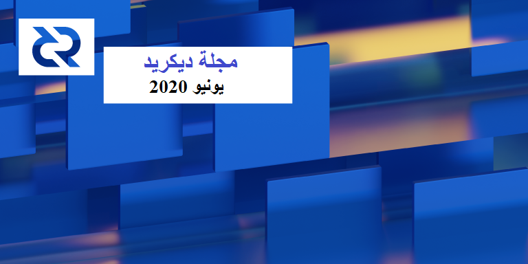

# صحيفة ديكريد لشهر يونيو 2020

_الصورة: أجواء عند 3000K بواسطة saender@_

أبرز أحداث شهر يونيو:

* تم تحديث تطبيقات الجوال لنظامي التشغيل الأندرويد و iOS إلى الإصدار 1.5.
* تم إصدار تطبيق ديكريد لمعيار Rosetta الجديد بواسطة Coinbase، و سيبسط هذا إلى حد كبير عملية إضافة دعم DCR لأي تجار / مبادلات باستخدام Rosetta.
* نشر richardred@ النتائج الأولى لأبحاثه التي أجريت على السلسلة، القي نظرة على قسم الإنضمام في المجلة لمراقبة نشاط تحصيص KuCoin.
* يبدوا أن منصة التبادل اللامركزية لديكريد على وشك الإطلاق الأولي المحدود الذي يدعم التبادل على الشبكة الرئيسية .
* هنالك زيادة في نشاط المناقشة على ريديت، كما ظهر العديد من الفنانين الجدد الذين ألهمتهم ديكريد على تويتر.

## إصدار النسخة 1.5 لمحافظ الهاتف النقال

بعد مرور عام تقريبًا من التطوير، أصبح الإصدار 1.5 لمحافظ الأندرويد و iOS متوفر على [Google Play](https://play.google.com/store/apps/details?id=com.decred.dcrandroid.mainnet) و [Apple Store](https://apps.apple.com/us/app/decred-wallet/id1462247643). تتضمن التغييرات:

* واجهة مستخدم أعيد تصميمها بالكامل لتتوافق مع إرشادات نمط النظام الأساسي.
* دعم المحافظ المتعددة ومحافظ المشاهدة فقط.
* تأكيد مؤخر لإنشاء نسخة احتياطية من البذور لبدء التشغيل بسرعة.

مبروك لجميع المساهمين!

يرجى التحقق من [إعلان](https://www.reddit.com/r/decred/comments/hc5jut/decred_mobile_wallet_v150_has_been_released_for/) ريديت الكامل ودعم [التغريدة](https://twitter.com/planetdecred/status/1274041667520090112).

## تنفيذ برنامج Rosetta الوسيط لديكريد

تم [إصدار](https://twitter.com/decredproject/status/1279127834137636866) [تطبيق](https://community.rosetta-api.org/t/decreds-rosetta-middleware-implementation/79) [واجهة برمجة التطبيقات الخاصة بـ Rosetta](https://www.rosetta-api.org/) لـديكريد في أوائل شهر يوليو، بعد أسبوعين فقط من إصدار روزيتا بواسطة Coinbase:

> قامت Coinbase في البداية بتطوير  Rosetta كبرنامج وسيط يُستخدم لدمج سلاسل الكتل في نظامها الأساسي بشكل آمن وبدون ألم (...)
>
> بالنسبة لمطوري مشاريع سلسة الكتل الجديدة، تسهل واجهة Rosetta ضمان التوافق مع المبادلات التي تستخدم Rosetta، ويمكنها تسريع الوقت الذي تستغرقه عمليات التبادل للإندماج مع سلاسل الكتل الجديدة وحماية أموال العملاء من خلال ضمان استيفاء شروط أمنية محددة.
>
> بالنسبة إلى المجتمع الأوسع لمطوري العملات الرقمية، تسهل Rosetta إنشاء تطبيقات عبر سلسلة الكتل مثل مستكشفات الكتل، والمحافظ، و التطبيقات اللامركزية. بدلاً من كتابة تحليل مخصص لكل سلسلة كتل مدعومة، كما يمكن للتطبيقات استخدام تطبيق  Rosetta لمشروع سلسلة الكتل لقراءة البيانات المتسلسلة وإنشاء المعاملات بتنسيق قياسي؛ و التقليل من الكود وتبسيط الصيانة.

تتميز Rosetta [بمبادئ](https://www.rosetta-api.org/docs/principles_introduction.html) تصميم مثيرة للاهتمام، ولا توجد سياسة [لحراسة البوابة](https://www.rosetta-api.org/docs/no_gatekeepers.html)، ومتطلبات أمان صارمة لعمليات تنفيذ [المحفظة](https://www.rosetta-api.org/docs/wallet_api_introduction.html)، ودعم [التحصيص](https://www.rosetta-api.org/docs/staking_contract_support.html)، و[مجموعة اختبار](https://github.com/coinbase/rosetta-cli) للتحقق من صحة عمليات التنفيذ. تم إصدار أول [مجموعة تطوير برامج](https://www.rosetta-api.org/docs/rosetta_sdk_go.html) للغة Go حيث يتم [استخدامها](https://github.com/coinbase/rosetta-specifications#user-content-sdks-in-more-languages) بكثافة في Coinbase.

## التطوير

ما لم يُذكر خلاف ذلك، فإن العمل المَذْكُور هنا يشتمل على حالة “الدمج إلى الرئيسي”. وهذا يعني أن العمل قد تم استكماله ومراجعته ودمجه في كود المصدر الذي يمكن للمستخدمين المتقدمين بناءه وتشغيله، ولكنه ليس متاحًا بعد في ثنائيات الإصدار للمستخدمين العاديين.

[dcrd](https://github.com/decred/dcrd):

* إعادة هيكلة حزمة [rpcserver](https://github.com/decred/dcrd/pull/2211) لاختبارها بسهولة أكبر
* إصلاح [تجمع الذاكرة](https://github.com/decred/dcrd/pull/2232) لعرض البناء عند التعامل مع الكتل المرفوضة (يحل بعض المشاكل المتعلقة بالمعاملات على شبكة الاختبار التي يتم رفضها من قبل تجمع الذاكرة والتي لم يكن ينبغي لها أن تحدث حقاً في ظل ظروف معينة)
* تعطل [حالة](https://github.com/decred/dcrd/pull/2221) [الحافة](https://github.com/decred/dcrd/pull/2218) الثابتة لخادم RPC مع JSON المصاغ
* تمت [إزالة](https://github.com/decred/dcrd/pull/2222) وظيفتي التشفير وفك التشفير لمنع استخدامها مع التوصية باستخدام نظام التشفير الحديث بدلاً من ذلك (على سبيل المثال [شِفْرَات  AEAD](https://crypto.stackexchange.com/a/27248))

قيد التطوير:

* فهرسة [غير متزامنة](https://github.com/decred/dcrd/pull/2219)

بذلت معظم الجهود في شهر يونيو على العمل على الخزينة اللامركزية. يخضع [طلب السحب](https://github.com/decred/dcrd/pull/2170) لعملية المراجعة ويضيف اختبارات للتأكد من صحتها، ولكن يبدو أنه قد تم إكتمال الميزة. وبمجرد الانتهاء، سيتبع ذلك [مقترح لتغيير في ديكريد](https://github.com/decred/dcps).

[dcrwallet](https://github.com/decred/dcrwallet):

* إضافة [أساليب](https://github.com/decred/dcrwallet/pull/1705) لإحضار عوامل التصفية والكتل غير المرتبطة ببيانات المحفظة، وهو أمر مفيد للمتصلين الخارجيين مثل dcrlnd
* تجنب كميات CoinJoin [غير المألوفة](https://github.com/decred/dcrwallet/pull/1751)
* [الحد](https://github.com/decred/dcrwallet/pull/1759) من كمية المخرجات التي تنتجها downmixing
* إصلاحات الأخطاء

[ديكريديتون](https://github.com/decred/decrediton):

* دمج الجزء التالي من [CSPP](https://github.com/decred/decrediton/pull/2475) الذي يطبق قيود السلامة للحسابات المختلطة
* توحيد [معالجة](https://github.com/decred/decrediton/pull/2468) المعاملات العادية ومعاملات التحصيص
* السماح بعمليات دفع [متعددة](https://github.com/decred/decrediton/pull/2491) عبر الشبكة البرقية
* مكون جديد للتذاكر [المؤهلة](https://github.com/decred/decrediton/pull/2510)
* طريقة عرض تعرض [موفري خدمة التصويت](https://github.com/decred/decrediton/pull/2482) المهيأة
* تم [تحويل](https://github.com/decred/decrediton/pull/2537) المزيد من الكود لاستخدام المكونات الوظيفية ووحدات CSS النمطية
* إعادة استخدام المزيد من المكونات من pi-ui
* تعديلات واجهة المستخدم وإصلاح الأخطاء

قيد التطوير:

* [إدماج](https://github.com/decred/decrediton/pull/2516) إثبات المفهوم PoC على موفر خدمات التصويت لديكريد

[بوليتيا](https://github.com/decred/politeia):

* [تخزين](https://github.com/decred/politeia/pull/1226) نتائج التصويت بشكل أفضل
* [تحميل بطيء](https://github.com/decred/politeia/pull/1219) لأصوات التعليقات للاستفادة من حقيقة أنه نادرًا ما يتم الوصول إلى المقترحات القديمة
* زيادة [تغطية الاختبار](https://github.com/decred/politeia/pull/1203) لكود طلب تقديم المقترحات الجديد
* ميزة [تسجيل الخروج](https://github.com/decred/politeiagui/pull/1903) الدائم التي تحذف هوية المستخدم والمسودات من المتصفح، ويزيل هذا التغيير أيضًا استخدام البريد الإلكتروني كمفتاح تخزين للحصول على بيانات شخصية أقل في التخزين المحلي للمتصفح
* السماح [بعناوين URL قصيرة](https://github.com/decred/politeiagui/pull/1962) على واجهة المستخدم
* تعزيز [عارض الإختلافات](https://github.com/decred/politeiagui/pull/1988) لإصدارات الاقتراح
* [منع](https://github.com/decred/politeiagui/pull/1966) التعليق وتقديم العروض أثناء عملية التثبيت
* نظام إدارة المتعاقد: عارض [للإصدارات](https://github.com/decred/politeiagui/pull/1980) السابقة من الفاتورة
* نظام إدارة المتعاقد: طلبات الحصول على [بيانات المقترح](https://github.com/decred/politeia/pull/1171) لتجنب الطلبات عبر الموقع والتي تسبب مشاكل أمنية
* الكثير من إصلاحات أخطاء واجهة المستخدم والخلفية

قيد التطوير:

* دعم المصادقة الثنائية لعامل خوارزمية كلمة مرور لمرة واحدة
* إمكانية مراجعة [إنفاق](https://github.com/decred/politeiagui/pull/2032) المقترحات المصادق عليها من طرف مشرفي أنظمة إدارة المتعاقد

اكتمل [تنفيذ سجل المعاملات](https://github.com/decred/politeia/pull/1180) في الخلفية الأساسية ل politeiad. كما يستمر العمل على إضافة المكونات الإضافية إليه. تتضمن وظيفة المكون الإضافي التعليقات وتسجيلات الإعجاب بالتعليقات وأصوات الاقتراحات. ستكون الخطوة التالية هي تحميل تطبيق سجل المعاملات مع بيانات الشبكة الرئيسية الحالية وإجراء اختبارات الأداء عليه. ومن المحتمل أن بعض الأشياء قد تحتاج إلى إعادة صياغة إذا تم اكتشاف أي مشاكل.

[vspd](https://github.com/decred/vspd):

* [تحمل](https://github.com/decred/vspd/pull/104) حالات فشل الإتصال ب dcrwallet
* رفض التذاكر [غير القابلة للتصويت](https://github.com/decred/vspd/pull/93)
* دليل [النشر](https://github.com/decred/vspd/pull/95) الأولي
* [توقيع](https://github.com/decred/vspd/pull/109) استجابات الأخطاء
* [صفحة المشرف](https://github.com/decred/vspd/pull/119) الأولية
* [تحديث](https://github.com/decred/vspd/pull/138) مظهر واجهة مستخدم
* تغييرات متعددة لتحسين التحقق من صحة المدخلات ومعالجة الأخطاء وإيقاف التشغيل وما إلى ذلك

اكتملت الوظيفة الأساسية، ويقوم المطورون بعمليات إختبار شاملة و تحريك الحالات الهامشية للتذاكر المختلطة/غير المختلطة، مع / بدون مشتري التذاكر التلقائي. تم استخدام vspd للتصويت على عشرات الآلاف من تذاكر شبكة الإختبار في هذه المرحلة.

[dcrpool](https://github.com/decred/dcrpool):

* تم [الإعلان](https://twitter.com/dnldd/status/1280455233945194496) عن إصدار النسخة النهائية 1.1 في 7 يوليوز بعد مرشحين للإصدار و اللذين قاما بإصلاح المشكلات في مرشح الإصدار 1. تحقق من [ملاحظات الإصدار](https://github.com/decred/dcrpool/releases/tag/v1.1.0) الكاملة للحصول على التفاصيل.

[dcrdex](https://github.com/decred/dcrdex):

* أوامر سطر أوامر العميل: [إلغاء](https://github.com/decred/dcrdex/pull/411) الطلب، [سحب](https://github.com/decred/dcrdex/pull/422)، [تسجيل الخروج](https://github.com/decred/dcrdex/pull/423)
* سرد [حسابات](https://github.com/decred/dcrdex/pull/441) مسؤول الخادم
* واجهة مستخدم متصفح العميل لإضافة [خوادم](https://github.com/decred/dcrdex/pull/404) المبادلات اللامركزية الإضافية
* متصفح عميل واجهة المستخدم لعرض [الأرصدة](https://github.com/decred/dcrdex/pull/454)
* معالجة [تعليق تبادلات](https://github.com/decred/dcrdex/pull/269) العميل
* [استرداد الأموال التلقائي](https://github.com/decred/dcrdex/pull/401) عن طريق المقايضة عند فشل المبادلة
* [الإيقاف](https://github.com/decred/dcrdex/pull/406) الآمن لتشغيل محرك المقايضة وحفظ/تحميل حالته
* [إخفاء](https://github.com/decred/dcrdex/pull/353) نماذج الطلبات حتى اكتمال التسجيل
* تحديثات [المواصفات](https://github.com/decred/dcrdex/pull/482) لتغطية تعليق المبادلة وواجهة برمجة تطبيقات المشرف
* محاكاة [اختبار](https://github.com/decred/dcrdex/pull/432) التداول عبر الشبكة وبعض الاختبارات
* تمت إزالة [وضع السكون](https://github.com/decred/dcrdex/pull/435) من الاختبارات لجعلها أكثر قوة
* تم [التخلي](https://github.com/decred/dcrdex/pull/499) عن شرط الحد الأدنى لتأكيدات التمويل للحد من التعقيد وتحسين تجربة المستخدم
* تم [تحديد](https://github.com/decred/dcrdex/issues/361) وتحليل العديد من الاضطرابات التجارية

تم [دمج](https://github.com/decred/dcrdex/pulls?q=is%3Apr+merged%3A2020-06-01..2020-06-30+sort%3Aupdated-asc) ما مجموعه 48 طلب سحب من 8 مساهمين، وإضافة 11 ألف وحذف 4 آلاف من أسطر الكود.

قيد التطوير:

* معالجة [إستئناف](https://github.com/decred/dcrdex/pull/442) المبادلة
* تحويل خلفية الأصول إلى [ملحقات](https://github.com/decred/dcrdex/pull/362) ل Go

أشار chappjc@ متطرقا إلى المخاوف بشأن الجدول الزمني للمشروع:

* سيتم إطلاق الشبكة الرئيسية الأولى هذا الصيف. ومن المخطط أن يتم ذلك بحلول نهاية الربع الثاني من 2020، وسنقوم بذلك. أيضًا، فبالكاد تم التلميح إلى واجهة متصفح العميل في [اقتراح](https://proposals.decred.org/proposals/417607aaedff2942ff3701cdb4eff76637eca4ed7f7ba816e5c0bd2e971602e1) التطوير وقمنا بتوسيع نطاق المشروع بشكل كبير لتحقيق ذلك وتبدو جيدة. ولم يكن دعم النسخ الكاملة ل LTC و BTC جزءًا من الاقتراح، ولكننا قمنا بذلك أيضًا. كما قمنا بإبتكار خوارزمية مطابقة حقبة جديدة تستند إلى التزامات التشفير من العملاء، والتي يتم الكشف عن الصور الأولية لها في نهاية الحقبة السابقة، وأعدنا تنفيذها بالكامل في منتصف المشروع. ليس سهلاً أو سريعًا، ولكنه تم أيضًا، وهو تحسن كبير مقارنة بالمواصفات الأصلية. ([2020-06-01](https://matrix.to/#/!MgQoetFiyjrHAywokv:decred.org/$15910318461825cyXfI:decred.org))

ويعمل الفريق على معالجة المشاكل المتبقية المتعلقة بتجارب المستخدم والإعداد للإطلاق المحدود على الشبكة الرئيسية في غضون أسابيع قليلة.

[dcrandroid](https://github.com/planetdecred/dcrandroid):

* تم نقل المستودع إلى منظمة the planetdecred

نفذت اختبارات [Espresso](https://github.com/planetdecred/dcrandroid/pull/481) وانتقلت من Travis CI إلى GitHub Actions

[dcrios](https://github.com/planetdecred/dcrios):

* تم نقل المستودع إلى منظمة the planetdecred
* الترجمة [الصينية](https://github.com/planetdecred/dcrios/pull/695)
* [إصلاحات](https://github.com/planetdecred/dcrios/pull/694) متعددة لواجهة المستخدم

[godcr](https://github.com/planetdecred/godcr):

* Godcr هو عبارة عن محفظة بسيطة للتحقق من الدفع عبر النظام الأساسي لسطح المكتب تم إنشاؤها باستخدام [Gio](https://gioui.org/)، وهي مجموعة أدوات GUI ذات الوضع الفوري تمت كتابتها ب Go. هذا يجعل التطبيق بأكمله على Go بدون متصفح ويب أو جافا سكريبت فيه، مع رسم تبعي أصغر بكثير (وسطح التدقيق) - خاصية مهمة للبرامج التي تتحكم في المال. و حتى كتابة هذا التقرير، بلغ حجم الملف الثنائي المتراكم 30 ميجابايت تقريبًا.

بدأ المشروع مع Gio في يناير 2020، ولكن قبل الاستقرار على Gio، قام المطورون ببناء العديد من النماذج الأولية لواجهة المستخدم الرسومية (terminal، و in-browser، و Nucular، و Fyne) والتي تم أرشفتها الآن في المستودع القديم ل [godcr](https://github.com/raedahgroup/godcr-old). وقد بدأ العمل على استكشاف هذه الأساليب ونماذجها الأولية في شتنبر 2018.

[المستندات](https://github.com/decred/dcrdocs):

* تمت [إضافة](https://github.com/decred/dcrdocs/pull/1106) صفحة [لبيانات النسخ الاحتياطي للشبكة البرقية](https://docs.decred.org/lightning-network/backups/)، يجب قراءتها من طرف الأشخاص الذين يختبرون الشبكة البرقية لديكريد لمنع فقدان الأموال
* تسرد صفحة المساهمة الآن بعض [القصص](https://github.com/decred/dcrdocs/pull/1101) الشخصية عن كيف تصبح متعاقدا

## الأشخاص

مرحبا بالمساهمين الجدد مع دمج الكود إلى الماستر: svitekpavel@ على ([dcrdocs](https://github.com/decred/dcrdocs/commits?author=svitekpavel))، وDaniel-Leedan@ على ([dcrdocs](https://github.com/decred/dcrdocs/commits?author=Daniel-Leedan))، و shjackson@ على ([dcrdocs](https://github.com/decred/dcrdocs/commits?author=shjackson)).

مبروك للمتعاقدين الجدد الذين تم منحهم تصريح متعاقدي ديكريد: [ammaroni@](https://twitter.com/ammarooni) (إدارة المجتمع)، [guilhermemntt@](https://github.com/guilhermemntt) (التطوير)

إحصائيات المجتمع اعتبارًا من 2 يوليوز:

* متابعو التويتر: 40,517 (25+)
* المشتركين في ريديت: 9,854 (62+)
* مستخدمي الماتريكس: 622 (33-) (56 حسابات قديمة لبوتات سلاك تم طردها، +23 مستخدمًا جديدًا)
* مستخدمي الديسكورد: 1,288 (66+)
* مستخدمي التيليجرام: 2,607 (4+)
* المشتركين في اليوتيوب: 4,110 (80+)، المشاهدات 148الف (4+ آلاف)
* متابعي الفيسبوك: 3,655 (23+)، إعجاب: 3,311 (20+)
* متابعي لينكد إن: 836 (26+)
* نجوم GitHub dcrd: بلغت 549 (6+)، التفرعات: 241 (1+)

## الإدارة و الحوكمة

تلقت الخزينة في شهر يونيو 12,629 DCR وأنفقت 8,340 DCR. وباستخدام معدل المتوسط اليومي لشهر يونيو ب DCR/USD والذي يقدر ب 16.05 دولارًا، ستكون الخزينة قد تلقت 203 ألف دولارا وأنفقت 134 ألف دولارا. ووفقًا لمتوسط السعر اليومي في ماي البالغ 14.11 دولارًا، فإن قيمة الفَوترة بالدولار الأميركي عن العمل المنجز في ذلك الشهر تكون قد بلغت 118 ألف دولار. واعتبارا من 1 يوليوز، بلغ رصيد الخزينة 633,820 DCR (أي 9.08 مليون دولار أمريكي بسعر 14.32 دولار أمريكي).

تم التصويت على ستة مقترحات في يونيو، مع الموافقة على 4 مقترحات ورفض اقتراحين، مع إقبال مرتفع نسبيًا على هذه المقترحات مقارنة ببعض المقترحات الأخيرة. الاقتراحات التي تمت الموافقة عليها هي:

* ديكريد على السلسلة - مورد بحث ورسم بياني بواسطة Checkmate@ - موافقة 86٪ (نسبة المشاركة 38%).
* المقترح الثاني للتسويق و فعاليات ديكريد بأمريكا اللاتينية بواسطة elian@ - موافقة 61٪ (نسبة المشاركة 41%).
* المرحلة الثانية من البحث على السلسلة: بواسطة PermabullNino@ - موافقة 74٪ (نسبة المشاركة 31٪).
* برنامج إيجاد مكافأة الكتلة لديكريد: المرحلة 3 بواسطة degeri@: موافقة 98% (نسبة المشاركة 32%). وقد ارتفعت نسبة الموافقة من (90%) منذ [المرحلة الأولى](https://proposals.decred.org/proposals/d33a2667469b56942adf42453def6cc2292325251e4cf791e806939ea9efc9e1) و (94%) خلال [المرحلة الثانية](https://proposals.decred.org/proposals/073694ed82d34b2bfff51e35220e8052ad4060899b23bc25791a9383375cae70).

وقد رفض [اقتراح](https://proposals.decred.org/proposals/4affceb07f5b8126366e8b73ed3d164ebc010bc6fefba19375c4c2e2b252beb0) رعاية كتاب (CoinStory) بقيمة 500 دولار بموافقة 11.6% ونسبة مشاركة 34%، في حين حصل [اقتراح](https://proposals.decred.org/proposals/9eaafc20f206776e38642e272233390f351c5562c3835369a558cc7d7e341018) التسويق التلفزيوني على موافقة بنسبة 8% ونسبة مشاركة 29%.

يتناول [العدد 32](https://blockcommons.red/politeia-digest/issue032/) من بوليتيا دايجيست المزيد من التفاصيل حول كل ما سبق.

تم نشر [مقترح](https://proposals.decred.org/proposals/df11d7ac85061e6a02d6503555e585a1a37fffd82101eeea14670537c951926f) جديد من ivandecredfan@ لإنتاج المحتوى الروسي في يونيو وبدأ التصويت في يوليوز. وقد قدم ivandecredfan@ [اقتراحاً](https://proposals.decred.org/proposals/92e3f2176b332c1aea5887acd2324c2cd730ec450e563df52ddae9d5927d5d36) مشابهاً في فبراير تم رفضه بموافقة 21%، ولكنه استمر في إنتاج الفيديو وأخذ بعض الملاحظات من التعليقات على الاقتراح الأول في الإعتبار.

تم تقديم اقتراح يقترح اختيار اسم جديد للمشروع ("تطور البتكوين"). وقد أشار مشرفي بوليتيا إلى أن مالك الاقتراح (decredinator@) يجب أن يضيف ميزانية وخطة تنفيذ قبل اعتبار الاقتراح صالحًا للنشر على موقع الاقتراحات. [نشر](https://www.reddit.com/r/decred/comments/hh2ult/a_better_name_for_decred_to_broaden_the_reach_of/) الاقتراح على ريديت حتى يتمكن المجتمع من قراءته والمساهمة في جعله حقيقة. ولم تكن معظم التعليقات متحمسة للفكرة ولم يرد المؤلف على أي منها. تم [استدعاء](https://www.reddit.com/r/decred/comments/hh2ult/a_better_name_for_decred_to_broaden_the_reach_of/fwbfmst/) decredinator@ أيضًا لإرساله رسائل غير مرغوبة فيها من خلال هذه المشاركة عبر مجموعة من التغريدات لا صلة لها.

للحصول على إشعار عند نشر مقترحات جديدة أو نقلها إلى التصويت، يمكنك متابعة [@pi_crumbs](https://twitter.com/pi_crumbs) على تويتر، أو إعداد إشعارات البريد الإلكتروني على موقع الاقتراحات.

## الشبكة

معدل الهاش: افتتحت [معدلات الهاش في شهر يونيو](https://explorer.dcrdata.org/charts?chart=hashrate&zoom=kavllavw-kc326nyn&scale=linear&bin=block&axis=time) على ~390 Ph/s وأغلقت على ~412 Ph/s، وبلغ قاعها عند 280 Ph/s كما بلغت ذروتها عند 569 Ph/s على مدار الشهر. توزيع [معدلات الهاش](https://dcrstats.com/pow) للتجمع اعتبارا من 1 يوليوز حسب dcrstats.com:

UUPool بنسبة 36%،
Poolin بنسبة 32%،
lab.antpool.com بنسبة 11%،
BTC.com بنسبة 3.4%،
Luxor بنسبة 1.07%،
F2Pool بنسبة 0.86%،
BeePool بنسبة 0.09%،
Coinmine بنسبة 0.04%،
Suprnova بنسبة 0.02%، وأخرى بنسبة ~15%.
أرقام توزيع التجمع تقريبية ولا يمكن تحديدها بدقة.

التحصيص: بلغ متوسط سعر التذكرة [لمدة 30 يوما](https://dcrstats.com/) 139.4 DCR (ناقص 2.1). وتفاوت [السعر](https://explorer.dcrdata.org/charts?chart=ticket-price&zoom=kavllavw-kc326nyn&axis=time&visibility=true-false&mode=stepped) بين 135.1 و 149.8 DCR. وقد بلغ [المبلغ المقفل](https://explorer.dcrdata.org/charts?chart=ticket-pool-value&zoom=kavllavw-kc326nyn&scale=linear&bin=block&axis=time) 5.63-5.86 مليون DCR، وهو ما يعادل 48.7-50.6% من العرض المتاح [المشاركة](https://explorer.dcrdata.org/charts?chart=stake-participation&zoom=kavllavw-kc326nyn&scale=linear&bin=block&axis=time) في إثبات الحصة.

حدث ارتفاع غير عادي في استخدام حجم الكتلة (غير مرتبط بمعاملات المدفوعات الكبيرة من الخزينة) في 29 إلى 31 ماي. بحيث تم تعدين عشرات [الكتل](https://explorer.dcrdata.org/blocks?height=453840&rows=50) الكاملة تقريبًا باستخدام معاملات 90-100 كيلوبايت التي دمجت الكثير من المخرجات الصغيرة في 6 مخرجات DCR. و في 31 ماي، نمت سلسلة الكتل بنسبة [قياسية](https://explorer.dcrdata.org/charts?chart=block-size&bin=day&axis=time) بلغت 13 ميجابايت، مقارنة بمتوسط ​​نمو قدره 4 ميجابايت / يوم. كما [يبدو أن](https://matrix.to/#/!MgQoetFiyjrHAywokv:decred.org/$15913552414776FisdN:decred.org) مزود خدمة التصويت كان يقوم [بدمج](https://explorer.dcrdata.org/tx/ef562befa1f8eeee6250d98b6ccb1722b8fba508dd4919d5b85139df9c761e0c) رسوم التذاكر. وقد تم دمج العديد من مخرجات DCR الستة لاحقًا في رصيد يبلغ 240 ألف DCR تقريبًا (3,4 مليون دولار أمريكي تقريبًا، 2% من العرض الإجمالي)، والمعروف أنها مرتبطة بمنصات المبادلات المشهورة للعملات الرقمية. طويل جدا؛ لم تقرأ، أرسل مشغل مزود خدمة التصويت حوالي 200 DCR (رسوم التصويت التي يدفعها مستخدمو مزود خدمة التصويت) إلى منصة مبادلات، فقد استخدم الكثير من مساحة الكتلة لأنها تضمنت الآلاف من مدفوعات الرسوم الصغيرة المرتبطة بالتذاكر الفردية التي تمت معالجتها بواسطة مزود خدمة التصويت.

العقد: طوال شهر [يونيو](https://charts.dcr.farm/d/000000014/nodes?orgId=1&from=1590969600000&to=1593561600000)، كان هناك ما متوسطه 126 عقد استماع عام و 208 عقدة إجمالية حسب dcr.farm. تم توزيع الإصدارات في شهر يونيو، في المتوسط، على النحو التالي: 50% يشغلون dcrd النسخة 1.5.1، و9.5% dcrd النسخة 1.5، 5.6% يشغلون نسخة التطوير 1.6 وبناء إصدارات الترشيح، 3.2% يستخدمون dcrd النسخة 1.5 لبناء التطوير، 1.8% يشغلون dcrd النسخة 1.4، 9.5% يشغلون dcrwallet النسخة 1.5.1، و 0.9% يشغلون dcrwallet النسخة 1.4 و 1% يشغلون dcrwallet النسخة 1.5 و 18.7% يشغلون أخرى.

نشر Checkmate@ [مخططًا](https://twitter.com/_Checkmatey_/status/1269825167133306881) يوضح زيادة حجم DCR على السلسلة.

نشر PermabullNino@ [تغريدة](https://twitter.com/PermabullNino/status/1278055245050855424) عن تحديث نبض التعدين وأشرطة الصعوبة و تدفقات التذاكر، والرسوم البيانية للأيدي القوية. وقبل ذلك بقليل [شارك](https://twitter.com/PermabullNino/status/1272512290814902275) مخطط القوة الدافعة للتحصيص. 

نشر richardred@ [الجزء الأول](https://blockcommons.red/post/dcr-on-chain-1/) من سلسلة حول تحليل بيانات سلسلة كتل ديكريد، ومن أبرز ما جاء فيها:

* ما يزال 465 ألفًا من أصل 840 ألفًا من [التعدين القبلي المؤسس](https://docs.decred.org/advanced/premine/#bring-up-costs) على حاله
* لا تزال 290 ألفًا من أصل 840 ألفًا من وحدات ديكريد من [الإسقاط الجوي](https://docs.decred.org/advanced/premine/#airdrop) بدون حراك
* لم يتم لمس ما يقارب 27% من 345 ألف DCR التي دفعتها الخزينة إلى المتقاعدين منذ أن استلمها المتقاعد، تم تحصيص نسبة 24% تقريباً، 24% إنتهى بها الحال في عنوان منصة مبادلات معروفة، وقد تم مزج نسبة 1.7% تقريباً
* من بين 5.8 مليون DCR من مكافآت تعدين إثبات العمل، 60% منها إنتهت في العناوين المرتبطة بالمنصات، 10% تم تحصيصها، والباقي (6%) لم يتم إنفاقه أو تفاصيله غير معروفة (24%)

تم تكرار نفس النوع من التحليل مع البيانات الجديدة وتحسينات التنسيق في [الإصدار 27](https://ournetwork.substack.com/p/our-network-issue-27) من النشرة الإخبارية لشبكتنا.

## الإنضمام

[أعلن](https://www.reddit.com/r/decred/comments/hbofz4/tired_of_keeping_track_of_your_staking_activities/) مزود خدمة التصويت DecredVoting عن أداة متابعة تحليلية جديدة للتذاكر تعرض إحصائيات المستخدمين حول تذاكرهم، بما في ذلك بعض الإحصائيات الخاصة بالتذاكر المنقسمة التي ابتكرها decreddave@ نفسه وغير متوفرة في أي مكان آخر.

[أعلنت](https://hotbit.zendesk.com/hc/en-us/articles/360049302534-Hotbit-s-Announcement-Regarding-the-Launch-of-DCR-Investment-Product-and-Current-Deposit-Investment-Plan-on-June-11th-2020-UTC-8-) شركة Hotbit عن منتج استثماري لديكريد في 11 يونيو، مع عائد سنوي بنسبة 4.27% و"فترة الاسترداد (T+30)". يوجد حد أدنى للشراء يبلغ 100 DCR، ويبدو أن "الحد الأدنى لوحدة حساب فوائد خطة استثمار الودائع الحالية سيكون 1 DCR" ، مهما عنى ذلك.

بعد [إطلاق](https://www.kucoin.com/news/en-decred-soft-staking-official-rules) كوكوين لخدمة التحصيص الإحتجازي في مارس 2020، حقق richardred@ في نشاط التحصيص المرتبط بالعناوين المرتبطة بالكوكوين. وتشير الملاحظات إلى أن كوكوين اشترت حتى نهاية يونيو 2020 213 تذكرة، وقد صوت 185 منها. و يُعتقد أن أول التذاكر التي تم شراؤها من طرف عناوين خاضعة لكوكوين في دجنبر 2019، قبل عدة أشهر من الإعلان عن الخدمة في فبراير، وتم اختيار العملاء تلقائيًا في غضون 48 ساعة من هذا الإعلان. و لقد امتنعت كل هذه التذاكر عن التصويت على جدول الأعمال على السلسلة، ولم يصوت أي منها على اقتراحات بوليتيا - ولم تشارك كوكوين في اتخاذ القرار بتذاكرهم. وفقًا للتقارير، يبدو أن أرصدة المستخدمين قد اكتسبت حوالى 0.45% من إجمالي DCR الإضافية من هذا التحصيص، مع الأخذ في الاعتبار أن ربع المدة قد مرت، مما سيضعها على المسار الصحيح لمعدل سنوي يبلغ حوالي 1.8٪، وهو أقل بكثير من المعدل المتوقع للتحصيص السيادي بواسطة [dcrdata](https://explorer.dcrdata.org/)  (~ 6٪ حتى وقت الكتابة).

قام [CoinPayments](https://www.coinpayments.net/) معالج الدفع بإزالة 37 أصلا بما في ذلك DCR بعد [تحذير](https://twitter.com/CoinPaymentsNET/status/1264645627750649856) في ماي. بعد أن [اشتكى](https://twitter.com/CryptoEmporium_/status/1268860197038166016) بعض مستخدميه من هذا، قاموا بالتغريد إلى أنه يرجع إلى [إنخفاض في حجم التداول](https://twitter.com/CoinPaymentsNET/status/1268925474052268032).

تحذير: ليس لدى مؤلفي مجلة ديكريد أي فكرة عن مصداقية أي من الخدمات المذكورة أعلاه. يرجى إجراء البحوث الخاصة بك قبل الوثوق بمعلوماتك الشخصية أو الأصول إلى أي كيان.

## الانتشار

تصدر Checkmate@ موقع ريديت وبدأ مناقشات مركزة ومنظمة لتحسين انتشار ديكريد. كانت المشاركة الأولى هي استكشاف أفكار لحملة/استراتيجية تسويق شعبية والتواصل مع الأشخاص الراغبين في المساعدة على تنفيذها. ومن بين النتائج حملة [DidYouKnowDecred#](https://twitter.com/hashtag/DidYouKnowDecred) هاشتاغ على تويتر. وأعقب ذلك شكلين من الشك يوم الأحد وخيطين من أفكار التفكير المستقبلي يوم الجمعة المصممة لتحليل نقاط الضعف والحلول لهم، بالإضافة إلى أفكار لدفع ديكريد إلى أبعد من ذلك. في المجموع، قاموا بجمع 155 تعليقًا وكانوا من أكثر المشاركات نشاطًا هذا الشهر.

تم تمرير [المقترح](https://proposals.decred.org/proposals/3c02b677462d6d22d61bf786798e975b38df7a203c2467429d4ec91f75ef0c40) الثاني للفعاليات و التسويق بأمريكا اللاتينية، لكنه بالكاد تجاوز عتبة الموافقة بنسبة 60٪ في الساعات الأخيرة من التصويت. لمعالجة ما يقرب من 40٪ من الأصوات التي لم تصوت، بدأ يليان استبيانًا على ريديت يدعو إلى أي تعليقات لمعرفة ما هو مفقود وما يمكن تحسينه.

في أوائل شهر يوليو، قامت ديكريد أمريكا اللاتينية بنشر [تقرير](https://www.reddit.com/r/decred/comments/hn4sve/activities_report_decred_en_espa%C3%B1ol_proposal_2/) لنشاط الشهر الأول من اقتراحهم الجديد.

إنجازات Monde PR لشهر يونيو:

* ابتكرت وطرحت فكرتين من قصص التمويل والمنشورات التجارية والمنشورات التقنية
* تأمين اثنين من أسئلة وأجوبة بالبريد الإلكتروني مع منشورات العملات الرقمية

التغطية الإخبارية المؤمنة من قبل Monde PR:

* مقال في [Cointelegraph](https://cointelegraph.com/news/bitcoin-still-faces-on-chain-scaling-trouble-ahead-decred-co-founder-says) يعرض تعليقًا بواسطة jy-p@ على تحجيم البتكوين، تم نشره في 8 منافذ إخبارية
* مقالة في [Cointelegraph](https://cointelegraph.com/news/decred-co-founder-cbdcs-can-facilitate-crony-capitalism) تتضمن تعليقًا لـ jy-p@ حول ظهور العملة الرقمية للبنك المركزي، تم توزيعها على 7 منافذ إخبارية
* مقال في Cointelegraph يعرض تعليقًا من jy-p@ على شائعات عن قبول بايبال للعملات الرقمية، تم توزيعها على 19 منفذًا إخباريًا. تم تضمينه أيضًا كقصة مهمة في هولدرز دايجست في [Cointelegraph](https://cointelegraph.com/news/paypal-crypto-rumors-rip-wirecard-telegram-settles-hodlers-digest-june-2228)، تم توزيعه على 5 منافذ إخبارية

تم [نشر](https://github.com/decredcommunity/pr/blob/release/monde-pr-media-coverage.csv) جدول بيانات لجميع التغطية الإعلامية التي تم تأمينها بواسطة Monde PR منذ فبراير 2020 على GitHub.

## الفعاليات

الحضور:

* 11 يونيو - [لقاءديكريد الإفتراضي](https://www.meetup.com/Decred-Australia/events/271159615/) - الإنترنت. من تنظيم DecredAustralia@، كان هذا الجزء الثاني من تحليل Checkmate@ لـ BTC و DCR على السلسلة. ([الفيديو](https://www.youtube.com/watch?v=HbquQIv9EYw))
* 25 يونيو - [Criptotips con Lorena](https://twitter.com/bitcoinemb/status/1276289966440681473) - الإنترنت. تحدث elian@ في هذه الفعالية عن الإحتيال في العملات الرقمية التي استضافها Bitcoin Embassy Bar (مكسيكو سيتي). ([الفيديو](https://www.youtube.com/watch?v=Bxdxzs6Bgpw))
* 25 يونيو - [Hablemos Decred 6](https://twitter.com/Decred_ES/status/1275164449448607748) - الإنترنت. قدم pablito@ مقدمة إلى Git و GitHub باللغة الإسبانية كجزء من الإستراتيجية التي وضعها فريق أمريكا اللاتينية لإنشاء محتوى موجه للمطورين. ([الفيديو](https://www.youtube.com/watch?v=4b0xYYk6xlY))
* 30 يونيو - [ندوة ديكريد على الإنترنت](https://www.meetup.com/BlockchainMelbourne/events/271516517/). ناقش eSizeDave@ و richardred@ وelian@ وmrbulb@ و degeri@ "علم الاجتماع ومستقبل العمل ومحاذاة الحوافز" مع Ellie Rennie والدكتور Julian Waters-Lynch من جامعة RMIT. تنظيم ديكريد أستراليا. ([الفيديو](https://www.youtube.com/watch?v=1dcHwap7xHQ))

الفعاليات القادمة:

* 11 يوليوز - [حفلة الحرم الجامعي](https://brasil.campus-party.org/) - الإنترنت. سيكون لدى مجتمع ديكريد البرازيلي 3 متحدثين. ستتحدث Rafaela Romano عن اللامركزية في العملات الرقمية في مرحلة المعيشة الأفضل بعنوان "تحقيق الدخل عبر سلسلة الكتل". سيتم تأكيد متحدثين آخرين عند إقتراب الفعالية.

## وسائل الإعلام

مقالات مختارة:

* الجزء الأول من تحليل سلسلة الكتل لديكريد بواسطة richardred@ على ([blog.decred.org](https://blog.decred.org/2020/06/08/Decred-blockchain-analysis-Part-1/))
* ديكريد على السلسلة: السقف المحقق، نسبة قيمة السوق / القيمة المحققة والمذبذبات المتدرجة بواسطة Checkmate@ على ([medium](https://medium.com/decred/decred-on-chain-realised-cap-mvrv-ratio-and-gradient-oscillators-a36ed2cc8182))
* لماذا نحتاج إلى ديكريد: نهج شامل لجني الأموال بواسطة ammarooni@ على ([medium](https://medium.com/@Ammarooni/why-we-need-decred-an-inclusive-approach-to-sound-money-db2f990c107b))
* عقدة ديكريد أو: كيف تعلمت التوقف عن القلق وأحب سطر الأوامر بواسطة kozel@ ([الجزء الأول](https://medium.com/@artikozel/the-decred-node-or-how-i-learned-to-stop-worrying-and-love-the-command-line-part-one-1eca9420a1b2)، [الجزء الثاني](https://medium.com/@artikozel/the-decred-node-or-how-i-learned-to-stop-worrying-and-love-the-command-line-part-two-e629b8579ce2))
* BTC و ETH و DCR جزء من أكبر ثورة اقتصادية وتكنولوجية لجيلنا بواسطة فرناندو كيروس (بالإسبانية، [es.cointelegraph.com](https://es.cointelegraph.com/news/elian-huesca-btc-eth-and-decred-are-part-of-the-greatest-technological-and-economic-revolution-of-our-generation)) - مقابلة مع elian@

الترجمة:

* طريقة أكثر خصوصية للتحصيص - [باللغة العربية](https://insaf01.github.io/decred-arabic/articles/a-more-private-way-to-stake.html) بواسطة arij@ و[الإسبانية](https://medium.com/decred-es/una-forma-m%C3%A1s-privada-de-hacer-staking-en-dcr-36785ad54a47) بواسطة francov\_@.
* حقق Decred Spanish Medium شهراً كاملاً من [Decred Drive](https://medium.com/decred-es/decred-drive-spanish/home) بواسطة francov\_@ و العدد الجديد [لبوليتيا دايجيست](https://medium.com/decred-es/politeia-digest-spanish/home) بواسطة pablito@.
* ترجم ivandecredfan@ [خمسة مقالات](https://medium.com/@ivandecredfan) و [ثلاث مقاطع فيديو](https://www.youtube.com/channel/UCFjXbEDeyhhj2bH2t_eGKGA/videos) إلى الروسية.
* عقدة كاملة ودروس إعداد Tor على نص Raspberry Pi \[2020\] - [بالصينية](https://github.com/DominicTing/decred-ZH-translations/blob/master/%E6%A0%91%E8%8E%93%E6%B4%BE%E8%BE%85%E5%8A%A9%E5%AE%89%E8%A3%85%E8%84%9A%E6%9C%AC.md) بواسطة Dominic@.
* تمت ترجمة مجلة لشهر ماي 2020 إلى العربية بواسطة (arij@) والصينية بواسطة (Dominic@) و البولندية بواسطة (kozel@) والإسبانية بواسطة (francov\_@). شكرا لكم جميعا على ترجمة مجلة ديكريد لأشهر عديدة!

أشرطة الفيديو:

* قام حساب Bitcoin@ بتغريد فيديو يحتوي على مقتطفات حول القدرة اللانهائية للاحتياطي الفيدرالي على طباعة النقود مع محاكاة مضافة بواسطة Exitus@، بما في ذلك ذكر صريح للاعتمادات اللامركزية في النهاية. تم استقبال التغريدة بشكل جيد، مع 41 ألف مشاهدة، ~ 900 إعجاب و ~ 300 إعادة تغريد. ([تويتر](https://twitter.com/Bitcoin/status/1269313539056922624))
* ذكرت ديكريد في عرض Good Morning Crypto بواسطة Ivan على Tech ([اليوتيوب](https://www.youtube.com/watch?v=JZhl2Atm4VI&t=42m50s)، في الدقيقة 42:50). الفيديو يحتوي على 24 ألف مشاهدة. كل الشكر ل Steve de boo لإسقاط السؤال في دردشة البث المباشر - مثال جيد على عمل للتوعية عالي الدقة!
* رسوم متحركة لستايكي يستيقظ ([اليوتيوب](https://www.youtube.com/watch?v=LHgGyoDcFPI))
* تحديثات الأخبار النصف الشهرية لديكريد ليومي [10](https://www.youtube.com/watch?v=INKSkBpCT_0) و [23 يونيو](https://www.youtube.com/watch?v=4GqdgsgUX7c) بواسطة Exitus@
* برنامج تعليمي لإعداد العقدة الكاملة لديكريد و Tor على Raspberry Pi \[2020\]  بواسطة Exitus@ ([اليوتيوب](https://www.youtube.com/watch?v=B-5O_GBcbV0))
* أضافت قناة Decred Society ل Phoenix Green سبعة مقاطع فيديو عن [مجتمع العملات الرقمية](https://www.youtube.com/watch?v=zM4dfmPYXfo)، و سوق [21 مليون](https://www.youtube.com/watch?v=yhEAXTJHr3o) من العملات الرقمية، ولماذا تكفي 21 مليون وحدة نقدية [من حيث التصميم](https://www.youtube.com/watch?v=0b241mW8Yto)، وطبيعة [التفرعات](https://www.youtube.com/watch?v=PZ4aAgz2JcM) المثيرة للخلاف، وتجربة [المدفوعات](https://www.youtube.com/watch?v=0VjKIHCXD50) نظير لنظير، و [الخزينة](https://www.youtube.com/watch?v=-1zmojjvGtg) و التمويل الذاتي المستقبلي،  والحصول على [استراتيجية](https://www.youtube.com/watch?v=R1F_GVj76Qw) لعدم التحطم.
* اللقاء الإفتراضي الثاني لديكريد أستراليا، الذي ضم المحلل على السلسلة Checkmate@ ([اليوتيوب](https://www.youtube.com/watch?v=HbquQIv9EYw))

> الشيء الوحيد الذي يقف حاجزا أمام ديكريد في رأيي الصادق هو أن يأتي المزيد من الناس بطرق مبتكرة للتحدث عنها. هذا كل ما تحتاجه. لأنه بمجرد حصولك على مستوى الاهتمام، فإن الأساسيات تتحدث عن نفسها فقط.

يتم الآن نشر مقاطع فيديو ديكريد [على BitChute](https://www.bitchute.com/channel/decred/) كحل بديل في حالة حدوث أي شيء لقناة اليوتيوب. وهذا توقيت جيد، حيث أن اليوتيوب، كما هو متوقع سابقًا، [أزال](https://cointelegraph.com/news/youtubes-algorithm-is-punishing-crypto-content-and-no-one-knows-why) مجموعة من مقاطع فيديوهات العملات الرقمية أثناء عملية تنظيف التفكير الخاطئ لكوفيد-19.

الصوتيات:

* الحلقة 26 من ديكريد في العمق - حالات استخدام DCR والنمو مع Checkmate@ وakinsawyerr@ و mrbulb@ على ([libsyn](https://decredindepth.libsyn.com/akin-checkmate-mr-bulb-dcr-use-case-growth))
* الحلقة 27 من ديكريد في العمق - السرقة تحت إسم آخر مع jy-p@ على ([libsyn](https://decredindepth.libsyn.com/jake-yocom-piatt-theft-by-another-name))
* الحلقة 7 من Rough Consensus - اللعبة المزيفة ([libsyn](https://roughconsensus.libsyn.com/episode-7-the-rigged-game)) - يناقش كل من mr.black@ و Checkmate@ و PermabullNino@ الوضع الحالي للاتحاد العالمي مع تزايد الاضطرابات الاجتماعية وانتعاش سوق الأسهم على شكل v واللعبة المزيفة التي تربط الاثنين معًا
* الحلقة 8 من Rough Consensus -  الحديث عن الاقتصاد الكلي مع Ammar على ([libsyn](https://roughconsensus.libsyn.com/episode-8-talking-macro-with-ammar)) - ينضم عمار إلى فرقة سبايدي لمناقشة التضخم والانكماش وأطروحات تصاعد العملات الرقمية والاستثمار والرابطة التي تربط بين كل هذه الأجزاء
* ذكر Zach Segal (رئيس القوائم في Coinbase) v كمشروع مثير للاهتمام في بودكاست Trading Places ([spotify](https://open.spotify.com/episode/7BkEEDgSDPU1XQsmveksgv)، مقطع قصير، فوت في ماي)
* شهدت [الأعمال الفنية](https://twitter.com/_Checkmatey_/status/1278972757796159489) المرتبطة بـديكريد التي نشرت هذا الشهر إرتفاعا. أثار OfficialCryptos@ إعجاب ناس ديكريد بواسطة رسمة [ديكريد دراغون](https://twitter.com/OfficialCryptos/status/1273926304027508738) الذي رسمه (والذي قد يكون [السحلية المدرعة](https://www.youtube.com/watch?v=XkvcdjSH0c0&t=50m24s) التي ذكرها مراد على البودكاست)، [وحيد القرن](https://twitter.com/OfficialCryptos/status/1275426618610196480) و [جهاز حفر](https://twitter.com/OfficialCryptos/status/1275507751511371780) btcsuite. نشر aithzakaria1@ [مدينة رقمية](https://twitter.com/aithzakaria1/status/1277109552857710592) و[مكوك](https://twitter.com/aithzakaria1/status/1277472194256347137) وصور أخرى على موقعه على تويتر. كما [أعلن](https://twitter.com/AGNFAB1/status/1271157067097792514) AGNFAB@ أن بعض أعماله الفنية ستكون متاحة حصريًا على موقع [decentralizedboutique.com](https://decentralizedboutique.com/?product_cat=art)، وهو متجر جديد يبيع المجوهرات والأعمال الفنية المرتبطة [بالعملات الرقمية](https://decentralizedboutique.com/?page_id=150)  (بما في ذلك DCR).

## مناقشات المجتمع

أخبار أنظمة المجتمع:

* تمت إعادة هيكلة [خادم ديسكورد](https://discord.gg/GJ2GXfz) لديكريد وتم تجميع القنوات في 3 فئات: قنوات خاصة بديسكورد فقط للحصول على تجربة غير رسمية أكثر مقارنة بـالماتريكس (حيث العديد من الغرف عبارة عن مكاتب افتراضية لتنسيق العمل)، قنوات للقراءة فقط مرتبطة بالماتريكس (كتوازن بين الشفافية والإنتاجية في غرف الماتريكس)، وغرف ذات اتجاهين مرتبطة decred-101#، و proposals#، و support#، و ticket-splitting#، وtrading#.
* تم إنشاء قناة [DecredSupport](https://t.me/DecredSupport) جديدة على تيليجرام وتم ربطها بقناة support room# على الماتريكس
* [أطلق](https://matrix.org/blog/2020/06/02/introducing-p-2-p-matrix/) مطورو الماتريكس إصدارًا محدثًا من النموذج الأولي لعميل نظير إلى نظير الذي يتيح للمستخدمين التحكم بشكل أكبر في بياناتهم.

منشورات مختارة من الريديت:

* وجاء أكثر [منشور](https://www.reddit.com/r/decred/comments/hbb3iz/decred_grassroots_marketing_campaign/) تمت مناقشته في الشهر (ولبعض الوقت) منCheckmate@، يلخص عددًا من مبادرات التسويق الشعبية للمناقشة وتجنيد المشاركين.
* التفكير المستقبلي ليومي الجمعة [18 يونيو](https://www.reddit.com/r/decred/comments/hbp6y4/forward_thinking_friday_1_moving_the_peg_forwards/) (تحريك التثبيت للأمام) و [26 يونيو](https://www.reddit.com/r/decred/comments/hg2a9k/forward_thinking_friday_decred_narratives_26_june/) (روايات ديكريد).
* الأحد التشكيكي ليومي [21](https://www.reddit.com/r/decred/comments/hd4mwv/decred_skepticism_sunday_21_june_2020/) و [28 يونيو](https://www.reddit.com/r/decred/comments/hh7lo2/decred_skepticism_sunday_28_june_2020/).
* قام u/g687 [بنشر](https://www.reddit.com/r/decred/comments/hghw3a/why_people_do_not_care_about_decred/) تحليل لعدد المرات التي يتم فيها ذكر أسماء المشاريع المختلفة من خلال التعليقات في مجموعة متنوعة من subreddits ، مشيرة إلى أن ديكريد تم ذكرها قليلًا نسبيًا في subreddits بخلاف r / decreded. وقد أثار ذلك 36 تعليقًا في الردود، بما في ذلك [تعليق ذو تقييم عالٍ](https://www.reddit.com/r/decred/comments/hghw3a/why_people_do_not_care_about_decred/fw4u90p) من jy-p@ والذي حدد بعض الأسباب المحتملة لقلة ذكرها. وأشير أيضا إلى أن المشاريع الأخرى المدرجة في المقارنة لها حدود سوقية أكبر بكثير.
* أما فكرة [رعاية](https://www.reddit.com/r/decred/comments/hcfkei/draft_decred_cypherpunk_prize/) البحوث والبرامج التي تلعب دوراً مهماً في ديكريد فقد تلقت ردوداً مختلطة، ويرجع هذا جزئياً إلى الافتقار إلى التفاصيل والأشخاص الراغبين في تنفيذها.
* لاحظ u / OpenWithRuiLopez أن Coinbase قد [استحوذت](https://www.reddit.com/r/decred/comments/guri3s/coinbase_acquires_tagomi_tagomi_lists_decred/) على منصة الوساطة للعملات الرقمية المؤسسي Tagomi، التي تتداول DCR كأحد أصولها الأربعة عشر.

مناقشات مختارة من التويتر:

* [أسقط](https://twitter.com/marco_peereboom/status/1271200577272385538) moo31337@ قنبلة تشويقية عن اقتراحه التالي.
* قام Doctor\_Bitcoin\_@ [بمقارنة](https://twitter.com/Doctor_Bitcoin_/status/1277352638502375424)  ديكريد بقارة افتراضية يمكن لأي شخص الانضمام إليها.
* قام Checkmate@ بإنشاء هاشتاغ [DecredChallenge#](https://twitter.com/_Checkmatey_/status/1272680543612628997) جديد حيث تحتاج إلى تخمين أي قياس يتم عرضه على المخطط.
* قام Frenchy\_DCR@ [بالكشف](https://twitter.com/Frenchy_DCR/status/1273811301844709387) عن سبب عدم شعبية DCR.
* بعد الرسوم البيانية المتعددة مع التحليل الفني، وجد Mattgetsbarrel1@ [استراتيجية](https://twitter.com/Mattgetsbarrel1/status/1274072597597024257) نهائية لتداول DCR.

_الصورة: يتمتع LolekBolek74@ ب DCR في [الجبال] البولندية_

## الأسواق

في يونيو تم تداول DCR بين 14.01 و 18.76 دولار أمريكي و  0.0015-0.0019 BTC. وكان متوسط ​​السعر اليومي 16.05 دولار.

في آخر [منشور له](https://medium.com/decred/decred-on-chain-realised-cap-mvrv-ratio-and-gradient-oscillators-a36ed2cc8182) قام Checkmate@ بتحليل كيفية يتم تطبيق الحد الأقصى المحقق ونسبة  قيمة السوق - القيمة المحققة ومذبذبات التدرج على ديكريد. يميل الحد الأقصى المحقق إلى العمل كمستوى دعم أو مقاومة لكل من ديكريد و البتكوين، ولكن بالنسبة لـديكريد، فإنه يرتبط ارتباطًا وثيقًا بسقف السوق، لأنه يتم إعادة تسعير العملات في كثير من الأحيان.

> يلتقط السقف المحقق لديكريد مستوى نفسيًا مهمًا من حيث أنه يمثل السعر الإجمالي حيث تفاعل السوق آخر مرة مع العملات، حيث يلتقط نوعًا من "التحيز في الحداثة". ومن المرجح أن يكون لدى الأشخاص الذين يتفاعلون بانتظام مع حيازات DCR من خلال التذاكر أو مزيج ++CoinShuffle أو أصوات الحوكمة وعيا متزايدا بسعر العملة. وبالتالي فإن تكلفة الفرصة لتحقيق الأرباح أو الخسائر من DCR الخاصة بهم مخبوزة في كل معاملة. إن القرار الصريح بشراء تذكرة عبر إرسال وحدات إلى منصة المبادلات للبيع ما هو إلا انعكاس لمشاعر متفائلة ذات مغزى لكل فرد، والعكس صحيح.

أشار [تحليل](https://twitter.com/_Checkmatey_/status/1267945637980463104) آخر متعلق بالسوق من Checkmate@ إلى اختلاف RSI الصعودي مقابل كل من DCR والدولار الأمريكي ورسم السعر مقابل المؤشرات على السلسلة.

رسم PermabullNino@ كيف يختبر سقف سوق DCR [الحد الأقصى المحقق](https://twitter.com/PermabullNino/status/1268181399879790592) والعلاقة المحتملة بين الأمثلة التاريخية [لتدفقات](https://twitter.com/PermabullNino/status/1268270041759432704) مجموعة التذاكر الضخمة مع اتجاهات السوق الهبوطية.

## الخارجية ذات الصلة

كان هناك بعض الجدال حول [خطأ](https://medium.com/blockstream/patching-the-liquid-timelock-issue-b4b2f5f9a973) في خدمة السيولة ل Blockstream حيث كانت "مفاتيح الطوارئ الاحتياطية" التي تحتفظ بها Blockstream تحتجز أموالاً بشكل متكرر على نحو ما كان ينبغي أن يحدث إلا في حالات الطوارئ. يدور الجدل إلى حد كبير حول كيفية معالجة الكشف عن الخطأ ، حيث لم [يعجب](https://twitter.com/_prestwich/status/1277090512126660608) جيمس بريستويتش (الذي اكتشفه) بالطريقة التي تم بها الحد من شدتها بواسطة Blockstream. يحتوي هذا [التعليق](https://www.reddit.com/r/CryptoCurrency/comments/hhwwcb/vulnerability_discovered_in_liquid_allowing/fwdqbxc/) على r / cryptocurrency على جدول زمني جيد، بما في ذلك ملاحظة أن القصة لم يتم تغطيتها على r / bitcoin.

فتحت ريديت [دعوة](https://www.reddit.com/r/ethereum/comments/hbjx25/the_great_reddit_scaling_bakeoff/) للحصول على أفكار حول كيفية توسيع نطاق نظام النقاط الذي تم إطلاقه مؤخرًا (يعمل حاليًا على شبكة الإختبار Rinkeby الخاصة بـالإيثيريوم) إلى النظام الأساسي بأكمله.

ارتفعت تكلفة المعاملات على الإيثيريوم [بنسبة 500٪](https://www.coindesk.com/ethereum-developers-consider-new-fee-model-as-gas-costs-climb) منذ أبريل، ويبحث المطورون عن طرق لإسقاط هذا ، بما في ذلك EIP (1559) التي من شأنها أن ترى المستخدمين يدفعون "رسوم أساسية" للشبكة بالإضافة إلى تقديم نصيحة إلى المعدنين عند إجراء المعاملات.

كان أحد مستخدمي الإيثيريوم يدفع رسومًا عالية [بشكل خاص](https://www.coindesk.com/whale-sent-130-ether-transaction-fee) هذا الشهر، مع معاملات منفصلة تدفع كل منهما 2.6 مليون دولار من ETH كرسوم معاملة إلى المعدنين، لتحويل مبلغ صغير من ETH (~ 100 دولار). وشملت التكهنات حول سبب ارتفاع الرسوم الأخطاء ومحاولات [الابتزاز](https://twitter.com/VitalikButerin/status/1271463564440678401). إضافة إلى الغموض، يبدو أن المجموعة التي استخرجت إحدى المعاملات [تعرض](https://twitter.com/sparkpool_eth/status/1270688700968480768) إعادة بعض الرسوم، ولكن لم يتقدم أحد.

تم اكتشاف [خطأ](https://cointelegraph.com/news/bancors-bug-exposes-dangerously-common-practice-in-ethereum-defi) في عقود Bancor الذكية كان من شأنه أن يسمح للمهاجمين باستنزاف أموال أي شخص يتفاعل معها، لذلك "تصرف Bancor بشكل استباقي لسرقة أموال المستخدم قبل أن تتمكن الأطراف الخبيثة من التدخل". تفاقمت حدة المشكلة من خلال استخدام "الموافقات اللانهائية" ، والتي توفر على رسوم المعاملات وتوفر تجربة أفضل للمستخدم، ولكنها تعرض المستخدمين لخطر أكبر بكثير (في هذه الحالة يمكن للمهاجم المحتمل الحصول على جميع التوكنات للمودع، وليس فقط المبلغ الذي اختاروه للإيداع). يعد استخدام الموافقات اللانهائية أمرًا شائعًا في العديد من تطبيقات DeFi.

[تجاوز](https://bitcoinexchangeguide.com/tether-usdt-surpasses-10-billion-in-market-capitalization/) عرض USDT عشرة مليارات، بزيادة من 5 مليارات هذا العام.

دخلت [CoinGecko](https://www.coingecko.com/) في شراكة مع Hacken لإضافة تصنيفات [الأمن الإلكتروني](https://cointelegraph.com/news/coingecko-adds-crypto-exchanges-cybersecurity-ratings-to-trust-score)  لعمليات التبادل المدرجة على الموقع (انظر علامة التبويب "Trust Score").

[أعلنت](https://cointelegraph.com/news/chainalysis-can-now-track-your-privacy-coins-zcash-dash) Chainalysis دعم عملات الخصوصية زيكاش و داش في منتجاتها. يمكن تتبع الغالبية العظمى من المعاملات في هذه الشبكات لأن ميزات الخصوصية تستخدم من قبل عدد قليل جدًا من الأشخاص. يأتي هذا بعد أخبار ماي عن العديد من المبادلات التي [ألغت إدراج](https://cointelegraph.com/news/another-exchange-delists-monero-amidst-ongoing-sex-scandal) المونيرو لأنها أفضل في حماية خصوصية المستخدمين، والباحثون من جامعة كارنيجي ميلون يدعون أن 99٪ من معاملات زيكاش يمكن تتبعها وأنه يمكن الكشف عن مدخلات معاملات المونيرو بدقة 30٪ ([المقالة](https://eprint.iacr.org/2020/593.pdf) كاملة).

## أرسل قصتك لعدد مجلة ديكريد القادم

مع توسع الأنظمة البيئية للعملات الرقمية و ديكريد، يصبح من الصعب تتبع جميع الأحداث المهمة. يمكنك مساعدة مجلة ديكريد في التقاط المزيد من القصص ذات الصلة من خلال إرسالها على الجيتهوب. للقيام بذلك، افتح مواضيع الجيتهوب، وابحث عن موضوع الإصدار التالي (على سبيل المثال "مجلة ديكريد لشهر يوليوز 2020") وقم بالتعليق باستخدام رابط ووصف قصير للقصة.

## عن هذا العدد

هذا هو العدد 27 من مجلة صحيفة ديكريد. فهرس جميع الإصدارات والمرايا والترجمات متاح [هنا](https://xaur.github.io/decred-news/).

يتم نقل معظم المعلومات الواردة من أطراف ثالثة مباشرة من المصدر بعد التحقق من الحد الأدنى لصحتها. ليس لدى مؤلفي مجلة صحيفة الديكريد القدرة على التحقق من جميع الادعاءات.رجاء إحذر من أعمال الاحتيال وقم ببحثك الخاص.

[ملاحظاتك](https://github.com/xaur/decred-news/blob/docs/contributing.md#feedback) و[مساهماتك](https://github.com/xaur/decred-news/blob/docs/contributing.md) هي دائما موضع ترحيب.

الاعتمادات (بالترتيب الأبجدي):

الكتابة والتحرير: bee وdegeri و l1ndseymm و richardred

المراجعات والتعليقات: chappjc و davecgh و jholdstock و jz و lukebp و raedah

صورة العنوان: saender

النسخة الأصلية لمجلة الديكريد لشهر يونيو متوفرة على هذا الرابط [هنا](https://github.com/xaur/decred-news/blob/master/journal/202006.md)

تمت الترجمة إلى اللغة العربية بواسطة: arij@. قام بالمراجعة abdulrahman4@.

