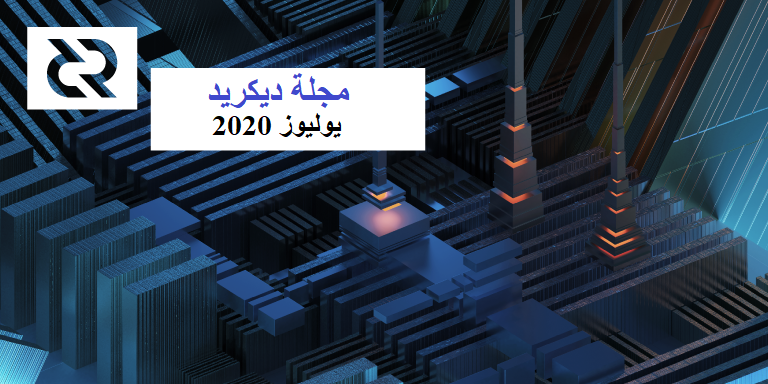

# صحيفة ديكريد لشهر يوليوز 2020

_الصورة: أبراج متتابعة بواسطة saender@_

أبرز أحداث شهر يوليوز:

* لامركزية الموافقة على معاملات الخزينة والتي سوف تؤدي الى قدوم مقترح تغيير ديكريد المنتظر و توقيعات شنور، كلها حاليا قيد التنقيح.
* شهدت منصة بوليتيا إضافة مجموعة من المزايا الجديدة المهمة، بما في ذلك طلب مقترحات والوضع الليلي. وتمت اضافة خاصية المساءلة في نظام ادارة المتعاقد
* تلقى vspd آخر تغيير رئيسي يحتاجه ، ويتم حاليا اختباره على شبكة الإختبار وقريبًا سيتم إختباره على الشبكة الرئيسية.
* كان هناك المزيد من التقدم نحو تشغيل dcrlnd في نظام التحقق البسيط من الدفع، و تحديث ضخم لقاعدة الكود لمضاهاة النسخة الجديدة ل lnd.
* ازدادت حوارات نشاط التواصل المجتمعي بشكل كبير عبر قنوات الريديت والماتريكس والديسكورد - مع زيادة مقابلة في عدد المقترحات المتعلقة بالتسويق والتي تظهر على بوليتيا.

## التطوير

ما لم يُذكر خلاف ذلك، فإن العمل المَذْكُور هنا يشتمل على حالة “الدمج إلى الرئيسي”. وهذا يعني أن العمل قد تم استكماله ومراجعته ودمجه في كود المصدر الذي يمكن للمستخدمين المتقدمين بناءه وتشغيله، ولكنه ليس متاحًا بعد في ثنائيات الإصدار للمستخدمين العاديين.

[dcrd](https://github.com/decred/dcrd):

* إضافة معالجة رسالة النظراء [`notfound`](https://github.com/decred/dcrd/pull/2253) (إذا أشار أحد النظراء إلى أن لديه بعض البيانات لكنه لا يخدمها بناء على الطلب، فمن المحتمل جدًا أن يكون هذا النظير يسيء التصرف ويتم حظره)
* تمت إضافة المزيد من [تغطية الاختبار](https://github.com/decred/dcrd/issues/2069)  لحزمة `rpcserver`
* تم [تشديد](https://github.com/decred/dcrd/pull/2258) كود تطبيع المجال ضد إمكانية العمليات الزمنية غير الثابتة بسبب توقع الفرع (يعتمد بشكل أساسي على [طلب سحب](https://github.com/btcsuite/btcd/pull/1084) إلى btcd من 2017). يوضح طلب السحب طريقة لاكتشاف سلوك الوقت غير الثابت بمجرد _النظر_ إلى مخرجات التجميع.
* تحسينات استخدام الذاكرة في تشذيب عقدة [الحصة](https://github.com/decred/dcrd/pull/2294)، و[مكدس](https://github.com/decred/dcrd/pull/2298) txscript، و[تسجيل](https://github.com/decred/dcrd/pull/2301) التتبع، وكود تتبع [طرف السلسلة](https://github.com/decred/dcrd/pull/2302) 
* [تصدير](https://github.com/decred/dcrd/pull/2240)  وظائف وأنواع إجماع متنوعة كخطوة لإزالة جميع الأكواد غير المتفق عليها من حزمة `txscript`
* [انتقل](https://github.com/decred/dcrd/pull/1965) كود التعدين إلى حزمة `mining`
* تحويل [`mempool`](https://github.com/decred/dcrd/pull/2274) و[`mining`](https://github.com/decred/dcrd/pull/2275) و[`fees`](https://github.com/decred/dcrd/pull/2287) من الوحدات النمطية المصدرة إلى حزم داخلية لتقليل عبء الصيانة. هذا جزء من الجهد العام لتقليل العدد الإجمالي للوحدات النمطية والوصول في النهاية إلى النقطة التي يمكن عندها اتباع [الإصدار الدلالي](https://semver.org/) لوحدة الجذر.
* [نقل](https://github.com/decred/dcrd/pull/2288) كود `rpcserver`من الوحدة الرئيسية إلى حزمة داخلية قائمة بذاتها
* [إعادة بناء](https://github.com/decred/dcrd/pull/2276) `cpuminer` في حزمته الخاصة لتحسين قابلية الاختبار وتسهيل إعادة الاستخدام
* [إعادة صياغة](https://github.com/decred/dcrd/pull/2277) `cpuminer` لاستخدام منشئ قالب كتلة الخلفية لتبسيط الاختبار باستخدام شبكات اختبار المحاكاة
* [تصدير](https://github.com/decred/dcrd/pull/2243) العديد من وظائف `txscript` المفيدة بشكل مستقل لجعل طلبات سحب الخزينة أصغر قليلاً
* التعليق على حالة التحسينات:

> يوضح الرسم البياني ل Flame استخدام وحدة المعالجة المركزية (CPU) بوضوح تام أن الأمور تخضع لهيمنة IO (الإدخال/الإخراج) الآن، لذا فإن أكبر تسريع متبقي سيأتي بالتأكيد من تلك الجبهة. حوالي 10% من GC، التحقق من الصلاحية <1%، 3.5% تقريباً مدخلات/مخرجات النظراء، حوالي 55% من مدخلات/مخرجات القرص، حوالي 3% تكلفة إنشاء ملف تعريف، 27% ساكن، والباقي في وحدات بت صغيرة. ([@davecgh](https://chat.decred.org/#/room/!zefvTnlxYHPKvJMThI:decred.org/$U9ybkey7ppiqGR_K_BagIHwcoyNGTS-H91hEaXzghmI))

تم [دمج](https://github.com/decred/dcrd/pulls?q=is%3Apr+merged%3A2020-07-01..2020-07-31+sort%3Aupdated-asc) ما مجموعه 53 طلب سحب من 8 مساهمين، مما أضاف 11 ألف وحذف 5 ألف سطر من الكود.

يخضع [طلب سحب](https://github.com/decred/dcrd/pull/2170) إنفاق الخزينة اللامركزية [للاختبار](https://twitter.com/marco_peereboom/status/1290439680937385985) ومراجعة الكود مع أكثر من 350 تعليقًا الآن. أكثر [تغيير](https://twitter.com/marco_peereboom/status/1283168367856300037) ملحوظ هو أن معاملات TSPEND ستستخدم توقيعات شنور:

> اقترحت أن نستخدم توقيعات شنور لمدفوعات الخزينة من أجل الحصول على بعض الفوائد التي توفرها مثل التوقيعات الأصغر والأمان القابل للإثبات رسميًا. لقد قمت مؤخرًا بتنظيف كود شنور لرفعه إلى المعايير العالية لكود الإجماع للمشروع، وفي حين أن هناك بعض التغييرات التي نريد إجراؤها عليه في المستقبل قبل الإنتقال إليه من أجل الاستخدام الواسع النطاق مع التوقيعات المتعددة الأطراف بين العديد من التواقيع غير الموثوقة المصادر، فهي جاهزة في وقت الذروة في سياق مدفوعات الخزينة. ([@davecgh](https://chat.decred.org/#/room/!zefvTnlxYHPKvJMThI:decred.org/$yLGDR6WC7v7LTDkNYOLgTXHOozNnVc92xNS8B-0epds))

إذا كان لديك بعض الأجهزة التي لا تستعملها، فيمكنك المساعدة عن طريق [الإختبار الضبابي](https://github.com/degeri/dcrd-continuous-fuzz) ل dcrd.

[dcrwallet](https://github.com/decred/dcrwallet):

* إضافة مُعامل [gaplimit](https://github.com/decred/dcrwallet/pull/1761) اختيارية إلى أمر `discoverusage`
* إضافة مُعامل [حساب](https://github.com/decred/dcrwallet/pull/1767) اختيارية إلى الأمر `listunspent`
* تنفيذ طريقة [`ticketinfo`](https://github.com/decred/dcrwallet/pull/1783) التي توفر معلومات مفصلة عن الحالة فيما يتعلق بجميع تذاكر المحفظة (مطلوبة لـ vspd)
* إضافة [معلمات](https://github.com/decred/dcrwallet/pull/1780) CoinJoin إلى استدعاء `PurchaseTicketRequest`
* تنفيذ الأمر [`getpeerinfo`](https://github.com/decred/dcrwallet/pull/1797) في وضع SPV
* إضافة أمر جديد لتغيير [عبارة المرور](https://github.com/decred/dcrwallet/pull/1510) العامة للمحفظة
* إصلاحات الأخطاء

[ديكريديتون](https://github.com/decred/decrediton):

* النسخ الاحتياطي واستعادة [ملف SCB](https://github.com/decred/decrediton/pull/2535)  الذي تم إنشاؤه بواسطة dcrlnd (انظر الشرح في [المستندات](https://docs.decred.org/lightning-network/backups/))
* عرض المعلومات الأساسية [للشبكة البرقية](https://github.com/decred/decrediton/pull/2575)
* إضافة [فك التشفير](https://github.com/decred/decrediton/pull/2523) الصحيح لمعاملات التحصيص (مطلوب لتوقيع الرسائل لموفر خدمة التصويت)
* [تحديثات](https://github.com/decred/decrediton/pulls?q=functional+is%3Apr+merged%3A2020-07-01..2020-07-31+sort%3Aupdated-asc) مستمرة لقاعدة الكود نحو React الحديثة باستخدام المكونات الوظيفية ووحدات CSS
* الدعم المبدئي لإثبات المفهوم لنظام تحصيص [vspd](https://github.com/decred/decrediton/pull/2516) الجديد
* دعم لعناوين URL [القصيرة](https://github.com/decred/decrediton/pull/2602) للمقترحات
* لا تطلب عبارة مرور عند إستيراد النصوص البرمجية [لاسترداد القيمة](https://github.com/decred/decrediton/pull/2616)
* إصلاحات الأخطاء

تم دمج ما مجموعه 35 طلب سحب من 6 مساهمين، مما أضاف آلاف وحذف 7 ألف سطر من الكود.

[بوليتيا](https://github.com/decred/politeia):

تم نشر العديد من [الميزات](https://twitter.com/lukebp_/status/1285955294703411201) الجديدة في موقع [proposals.decred.org](https://proposals.decred.org/): عملية طلب الإقتراحات، عرض مسطح للتعليقات (يساعد على اكتشاف التعليقات الجديدة بسرعة دون تعقبها في سلسلة الرسائل)، الوضع الليلي، عناوين URL قصيرة للمقترحات، وتغيير لحظر نشر التعليقات مرة واحدة في اليوم بدلاً من مرة واحدة في الساعة (حل بديل للمشكلة سيتم إصلاحها بالترحيل إلى الخلفية في سجل tlog).

التغييرات المدمجة:

* [أداة](https://github.com/decred/politeia/pull/1240) سطر الأوامر لاختبار عملية طلب الاقتراح
* تغطية اختبار محسنة
* إصلاحات الأخطاء

CMS:

* [بحث](https://github.com/decred/politeiagui/pull/2033)  المشرف عن المتعاقد بحسب المجال أو النوع
* عرض [أسماء](https://github.com/decred/politeiagui/pull/2041) المقترحات بدلاً من التوكنات في عناصر سطر الفاتورة
* تعيين [ملكية](https://github.com/decred/politeiagui/pull/2055)  الاقتراح (GUI)
* مراجعة المشرف لملخص [الإنفاق](https://github.com/decred/politeiagui/pull/2032) الخاص بالاقتراح وتفاصيله
* علامة تبويب جديدة [لمالكي](https://github.com/decred/politeiagui/pull/2046) المقترح لمراجعة تفاصيل الفواتير
* [تسليط الضوء](https://github.com/decred/politeiagui/pull/2057) على السمات غير القانونية في عناصر سطر الفاتورة 

[vspd](https://github.com/decred/vspd):

* فحوصات [تناسق](https://github.com/decred/vspd/pull/86) محفظة التصويت ([آخر](https://twitter.com/JamieHoldstock/status/1288030715486056448) تغيير رئيسي ضروري للإصدار)
* يوضح الجدول الإداري [حالة](https://github.com/decred/vspd/pull/149) كل محفظة تصويت
* تعيين إصدار واجهة برمجة التطبيقات وبعض إصلاحات الأخطاء
* تم الآن نشر vspd على الشبكة الرئيسية من قبل اثنين من مشغلي خدمات التصويت الحاليين ، ويبدو أن النشر كان سهلاً بالنسبة لهم وأن الأمور تعمل كما هو متوقع.

[dcrlnd](https://github.com/decred/dcrlnd):

* تم تحديثها لاستخدام أحدث إصدار من [dcrwallet](https://github.com/decred/dcrlnd/pull/90) و [dcrd](https://github.com/decred/dcrlnd/pull/105)
* حزمة [chainscan](https://github.com/decred/dcrlnd/pull/83) الجديدة التي تستخدم مرشحات مخصصة لاكتشاف المعاملات ذات الصلة بعقدة الشبكة البرقية بشكل أكثر كفاءة ويمكن أن تعمل أيضًا في وضع التحقق البسيط من الدفع
* [تطبيقات](https://github.com/decred/dcrlnd/pull/92) لحزمة chainntnfs و[برنامج تشغيل](https://github.com/decred/dcrlnd/pull/93) لحزمة chainview التي تستخدم dcrwallet المدمجة والبعيدة كمصدر لأحداث السلسلة. يتيح لنا ذلك مزيدًا من الفصل بين dcrlnd و dcrd الأساسي، وهو مطلب لوجود مثيل dcrlnd يعمل في وضع التحقق البسيط من الدفع.
* [تحويل](https://github.com/decred/dcrlnd/pull/94) الحزمة الرئيسية dcrlnd لاستخدام برامج التشغيل الجديدة المدعومة من المحفظة بحيث يتم الآن تنفيذ عمليات الإدخال والإخراج التسلسلية بالكامل بواسطة مثيل dcrwallet الأساسي ولم يعد dcrlnd يتطلب اتصالاً بـ dcrd قيد التشغيل لأداء وظيفته
* تمكين واختبار وضع [التحقق البسيط من الدفع](https://github.com/decred/dcrlnd/pull/95)  للمحافظ البعيدة (راجع [إصدار مارس](https://xaur.github.io/decred-news/journal/202003.html#development) لمزيد من من المعلومات الأساسية)
* [نقل](https://github.com/decred/dcrlnd/pull/99) المراحل الأولية للتغييرات بين الإصدارين 0.9.0-beta و 0.10.0-beta - تم النظر في إدراج 139 طلب سحب (بالإضافة إلى عدد قليل من إيداعات الطلبات غير القابلة للسحب)

[dcrdex](https://github.com/decred/dcrdex):

* يوفر متصفح العميل الآن مربع حوار [إعادة تكوين](https://github.com/decred/dcrdex/pull/533) المحفظة بالكامل
* معالجة [معدل الرسوم الذكية](https://github.com/decred/dcrdex/pull/505). لتقليل رسوم التعدين على السلسلة اللازمة لتحقيق أفضل سعر للرسوم في وقت المبادلة (وليس وقت الطلب)، يتم إستخدام تقديرات الرسوم الذكية.
* للتعامل مع الطلبات التي تحتاج إلى قفل العملات اللازمة لتمويل المقايضات، والتي قد تحدث بعد فترة طويلة من تقديم الطلب عندما تتغير الرسوم على السلسلة، يجب أن تحتفظ الطلبات بما يكفي "لمعدل الرسوم الأقصى". وبعبارة أخرى، تحتفظ الطلبات بما يكفي "للحد الأقصى لمعدل الرسوم" في حالة ارتفاع رسوم BTC عند ملء الطلب، ولكن يتم استخدام رسوم الشبكة المثلى في وقت المطابقة في معاملة عقد المبادلة. (وهذه [تغريدة](https://twitter.com/chappjc/status/1280510447515586565) للتوعية)
* تحسين محفظة [قفل العملات](https://github.com/decred/dcrdex/pull/525) التي تمول الطلبات، وخاصة لمقايضة السلاسل
* وظائف إدارة الخادم الإضافية: [الحظر](https://github.com/decred/dcrdex/pull/469)، و[إلغاء الحظر](https://github.com/decred/dcrdex/pull/479)، و[الإشعار](https://github.com/decred/dcrdex/pull/555)، و[إشعار الكل](https://github.com/decred/dcrdex/pull/534)
* بالنسبة للطلبات التي تحتوي على تطابقات ملغاة (الفاشلة)، يتم [إلغاء حجز الطلب](https://github.com/decred/dcrdex/pull/475) تلقائيًا ويتم إعلام العملاء
* مخطط قاعدة بيانات العملاء أصبح الآن مجزأ، مع بنية تحتية [متطورة](https://github.com/decred/dcrdex/pull/448) للتغييرات المستقبلية
* يعيد العميل الآن تلقائياً [الاشتراك](https://github.com/decred/dcrdex/pull/503) في موجز دفتر الطلب بعد إعادة الاتصال بالخادم
* توفر واجهة سطر أوامر العميل الآن [دفتر الطلبات](https://github.com/decred/dcrdex/pull/496)
* [يمنع](https://github.com/decred/dcrdex/pull/527) العميل الإغلاق العرضي بطلبات ومقايضات نشطة
* [تنظيف](https://github.com/decred/dcrdex/pull/560) واجهة متصفح العميل
* العديد من إصلاحات الأخطاء والتحسينات

[dcrandroid](https://github.com/planetdecred/dcrandroid):

* تحديث الترجمة الفرنسية
* إصلاحات الأخطاء
* إضافة إحضار [اقتراحات](https://github.com/planetdecred/dcrlibwallet/pull/153) بوليتيا إلى مكتبة dcrlibwallet الأساسية
* عدة إصلاحات للأخطاء في dcrlibwallet

[godcr](https://github.com/planetdecred/godcr):

godcr هي محفظة التحقق البسيط للدفع عبر منصة Pure-Go لسطح المكتب لديكريد. انظر إصدار [يونيو](https://xaur.github.io/decred-news/journal/202006.html#development) للاطلاع على المقدمة.

* أداة [مزامنة الحالة](https://github.com/planetdecred/godcr/pull/170) في صفحة نظرة عامة
* تم [تحديث](https://github.com/planetdecred/godcr/pull/184) صفحة الإرسال لمطابقة تطبيقات الهاتف المحمول
* تم التحديث إلى مكتبة واجهة مستخدم [Gio](https://github.com/planetdecred/godcr/pull/186)الأحدث
* تمت إزالة [الأبعاد](https://github.com/planetdecred/godcr/pull/173) المحددة بتعليمات برمجية ثابتة من كافة الصفحات
* تعديلات وإصلاحات واجهة المستخدم

نشر planetdecred@ عبر التويتر [عرضًا توضيحيًا](https://twitter.com/planetdecred/status/1290753362829352960) قصيرًا لكيفية ظهور الميزات الحالية أثناء العمل (نظرة عامة، اتصال، إرسال، استقبال، محفوظات).

[decred.org](https://github.com/decred/dcrweb):

* تمت إضافة المقالات البارزة إلى صفحة [الصحافة](https://decred.org/press/)
* تمت [إضافة](https://github.com/decred/dcrweb/pull/892) الصور المتحركة Lottie إلى صفحة "التاريخ"

مسائل أخرى:

* تم ترحيل  [decredpower.com](https://decredpower.com/) إلى [Hugo](https://github.com/planetdecred/decredpower/pull/19) وهو أكثر مرونة وأسهل في التحديث. كما أنه يتميز بمظهر جديد و حديث (لا تقلق، فالمظهر [القديم](https://decredpower.com/retro/) ما زال موجودا!).
* هناك طلب سحب معلق لإضافة [دعم الديكريد](https://github.com/trezor/trezor-utxo-lib/pull/9) إلى مكتبة Trezor javascript
* نشر kozel@ [دليلاً](https://medium.com/@artikozel/the-decred-node-back-to-the-source-part-one-27d4576e7e1c) مفصلاً حول كيفية إنشاء أحدث برنامج ديكريد من المصدر وتشغيله على Raspberry Pi

## الأشخاص

مرحبا بالمساهمين الجدد مع دمج الكود إلى الماستر: Kifen@ على ([dcrwallet](https://github.com/decred/dcrwallet/pull/1520)).

مبروك للمتعاقدين الجدد الذين تم منحهم تصريح متعاقدي ديكريد: [@rstaudt2](https://github.com/rstaudt2) (التطوير)

إحصائيات المجتمع اعتبارًا من 1 غشت:

* متابعو التويتر: 40,637 (120+)
* المشتركين في ريديت: 9,875 (21+)
* مستخدمي الماتريكس: 124 (498-) \*
* مستخدمي الديسكورد: 1,372 (84+)
* مستخدمي التيليجرام: 2,520 (87-)
* المشتركين في اليوتيوب: 4,150 (40+)، المشاهدات 151الف (3+ آلاف)
* متابعي الفيسبوك: 3,655 (0+)، إعجاب: 3,305 (6-)
* متابعي لينكد إن: 862 (26+)
* نجوم GitHub dcrd: بلغت 550 (1+)، التفرعات: 240 (1-)

\* تم تحديث غرف الدردشة في 9 يوليوز، أنظر [مناقشات المجتمع](https://xaur.github.io/decred-news/journal/202007.html#community-discussions) للحصول على التفاصيل.

يمكنك رؤية الرسوم البيانية لكافة نقاط بيانات التواصل الاجتماعية الواردة في مجلة ديكريد والمزيد [هنا](https://github.com/xaur/social-media-data/blob/graphs/graphs/index.md) (البيانات الأولية موجودة في نفس المستودع). مورد جيد آخر هو صفحة [إحصائيات المجتمع](https://dcrextdata.planetdecred.org/community) لمشروع dcrextdata - فهو يتتبع عددًا أقل من الحسابات ولكنه يحتوي على دقة بيانات أفضل ومخططات تفاعلية.

## الإدارة و الحوكمة

تلقت الخزينة في شهر يوليوز 13,050 DCR وأنفقت 16,073 DCR. وباستخدام معدل المتوسط اليومي لشهر يوليوز ب DCR/USD والذي يقدر ب 15.13 دولارًا، ستكون الخزينة قد تلقت 197 ألف دولارا وأنفقت 243 ألف دولارا. ووفقًا لمتوسط السعر اليومي في يونيو البالغ 16.05 دولارًا، فإن قيمة الفَوترة بالدولار الأميركي عن العمل المنجز في ذلك الشهر تكون قد بلغت 258 ألف دولار. واعتبارا من 1 غشت، بلغ رصيد الخزينة 630,766 DCR (أي 10.7 مليون دولار أمريكي بسعر 16.92 دولار أمريكي).

تم تقديم 7 مقترحات في يوليوز:

* تمت الموافقة على [الاقتراح](https://proposals.decred.org/proposals/c81926b) من lindseymmc@ الخاص باستمرار خدمات العلاقات العامة ب 3,500 دولار شهرياً لمدة عام واحد، مع تأييد 90% (نسبة المشاركة 25%)، وذلك بعد الموافقة على الاقتراح الأول بنسبة 72%.
* [اقتراح](https://proposals.decred.org/proposals/dedf452074752d7e29304a0566643feb26d1d130596e04c613e15de113ac2d08) لإنفاق 15,000 دولار لإنشاء ملصقات الواقع المعزز.
* [اقتراح](https://proposals.decred.org/proposals/32cba00b8bb0f41689ca8216e2e14a0e3d91a724c83369b3fcda02490dc119f4) لتغطية الإشراف على الماتريكس، الديسكورد، التيليجرام و بوليتيا، الحد الأقصى  9,000 دولار أمريكي والمتوقع هو 4,800 دولار أمريكي لمدة 6 أشهر. ويجري بالفعل إنجاز هذا العمل ودفع تكاليفه، والمقترح هو لإضفاء الطابع الرسمي على هذا العمل ووضع حد للمبلغ الذي يمكن دفعه.
* [اقتراح](https://proposals.decred.org/proposals/2dcbc3e14c06c6e84449f5e2756b944d5ed23be41c23a9f5225f3eef424ce0ae) لتقديم DCR كخيار دفع على موقعين إلكترونيين لحجز السفر (30 ألف دولار)، بالإضافة إلى بعض الأنشطة الترويجية (21.5 ألف دولار).
* [اقتراح](https://proposals.decred.org/proposals/3372cfce1218ba81d9c8ca0535cd9dd590f60c92adc068c0089218ae7e3e99e1) إنفاق 10 آلاف دولار على مجموعة من الأنشطة التسويقية (بما في ذلك إعادة التغريد / التأييد والإعلانات المدفوعة) - [منشور](https://www.reddit.com/r/decred/comments/hzo3yu/creating_a_decred_marketing_workgroup/) ريديت المرتبط.
* [اقتراح](https://proposals.decred.org/proposals/4f81031) لإنشاء 20 ميما على وسائل التواصل الاجتماعي 10 DCR لكل ميم
* [اقتراح](https://proposals.decred.org/proposals/7a67ed5) لاستضافة سلسلة من ألعاب البوكر بجوائز DCR (300 DCR / شهر).

تم طرح مسألة تغيير إصدار DCR على موقع ريديت من خلال [استطلاع رأي](https://www.reddit.com/r/decred/comments/hz9i6d/poll_the_decred_great_inflation/) أجراه Checkmate@ هذا الشهر، في محاولة لإنهاء المسألة. واجتذب الاستطلاع 87 صوتا ، و65 صوتا معارضا لمواصلة النظر في تغيير سياسة إصدار DCR.

تحقق من [الإصدار 33](https://blockcommons.red/politeia-digest/issue033/) من موجز بوليتيا لمزيد من التفاصيل حول أول اثنين من هذه، سيتم طرح الإصدار 34 مع تفاصيل المقترحات الجديدة الأخرى قريبًا.

## الشبكة

معدل الهاش: افتتحت [معدلات الهاش في شهر يوليوز](https://explorer.dcrdata.org/charts?chart=hashrate&zoom=kc0s5ehh-kdbsef8t&scale=linear&bin=block&axis=time) على ~394 Ph/s وأغلقت على ~307  Ph/s، وبلغ قاعها عند 307 Ph/s كما بلغت ذروتها عند 582 Ph/s على مدار الشهر. توزيع [معدلات الهاش](https://dcrstats.com/pow) للتجمع اعتبارا من 1 غشت حسب dcrstats.com:

Poolin بنسبة 33%،
UUPool بنسبة 26%،
lab.antpool.com بنسبة 9.6%،
BTC.com بنسبة 3.4%،
Luxor بنسبة 0.9%،
F2Pool بنسبة 0.8%،
BeePool بنسبة 0.09%،
Coinmine بنسبة 0.03%،
Suprnova بنسبة 0.02%، وأخرى بنسبة ~26%.
أرقام توزيع التجمع تقريبية ولا يمكن تحديدها بدقة.

التحصيص: بلغ متوسط سعر التذكرة [لمدة 30 يوما](https://dcrstats.com/) 144.3 DCR (بزيادة 4.9). وتفاوت [السعر](https://explorer.dcrdata.org/charts?chart=ticket-price&zoom=kc0s5ehh-kdbsef8t&bin=window&axis=time&visibility=true-false&mode=stepped) بين 137.1 و 155.5 DCR. وقد بلغ [المبلغ المقفل](https://explorer.dcrdata.org/charts?chart=ticket-pool-value&zoom=kc0s5ehh-kdbsef8t&bin=day&axis=time) 5.75-5.88 مليون DCR، وهو ما يعادل 48.98-50.06% من العرض المتاح [للمشاركة](https://explorer.dcrdata.org/charts?chart=stake-participation&zoom=kc0s5ehh-kdbsef8t&bin=day&axis=time) في إثبات الحصة.

العقد: طوال شهر [يوليوز](https://charts.dcr.farm/d/000000014/nodes?orgId=1&from=1593561600000&to=1596240000000)، كان هناك ما متوسطه 134 عقد استماع عام و 241 عقدة إجمالية حسب dcr.farm. تم توزيع الإصدارات في شهر يوليوز، في المتوسط، على النحو التالي: 51% يشغلون dcrd النسخة 1.5.1، و10% dcrd النسخة 1.5، 6% يشغلون نسخة التطوير 1.6 وبناء إصدارات الترشيح، 5% يستخدمون dcrd النسخة 1.5 لبناء التطوير و إصدارات الترشيح، 1.3% يشغلون dcrd النسخة 1.4، 7% يشغلون dcrwallet النسخة 1.5.1، و 0.6% يشغلون dcrwallet النسخة 1.4 و 1% يشغلون dcrwallet النسخة 1.5 و 18% يشغلون أخرى.

## الإنضمام

* [أضافت](https://twitter.com/Decred_BR/status/1275190825060794377) منصة مبادلات NovaDAX تداول DCR مقابل BRL و USDT و BTC و ETH (_فوت في يونيو_).

* أضافت Binance أزواج [DCR/BUSD](https://www.binance.com/en/support/articles/fee761e58d684bc3a1c7fc11660ab596) و [DCR/USDT](https://www.binance.com/en/support/articles/043fc71cdcce4fcfbdae133d8d0f35aa) في غضون أسابيع بينهم.

* في الأصل ، قام موقع XT.com [بإدارج](https://twitter.com/XTexchange/status/1062529195094339584) DCR في نونبر 2018، والآن أصبح لديهم تداول DCR مقابل [USDT](https://twitter.com/XTexchange/status/1281867070653816832) ووضع الرافعة الاستدانة.

* و أخيرًا، لم تعد ديكريد "تفرعا للبتكوين" على [CoinMarketCap](https://coinmarketcap.com/currencies/decred/).

تحذير: ليس لدى مؤلفي مجلة ديكريد أي فكرة عن مصداقية أي من الخدمات المذكورة أعلاه. يرجى إجراء البحوث الخاصة بك قبل الوثوق بمعلوماتك الشخصية أو الأصول إلى أي كيان.

## متجر المجتمع

أعلن [Decentralized Boutique](https://twitter.com/decentralizedbt/status/1288529718514536449) أن "Decred Grenade" متوفرة أيضا للتنزيل الرقمي للطباعة في المنزل، للأشخاص الذين يفضلون تجنب استلام عناصر على شكل قنبلة يدوية في البريد.

كشف [OfficialCryptos@](https://twitter.com/OfficialCryptos/status/1289170923501817859) النقاب عن ملصقات القلب اللامعة المظهر لديكريد.

## الانتشار

شهد موضوع التسويق نقاشًا كبيرًا على الريديت و الماتريكس، وعلى وجه التحديد الدور الذي يجب أن تلعبه الخزينة في مشروع لامركزي مثل الديكريد في هذا.

عمل Checkmate@ على إثارة قدر من التوعية وغيرها من الأفكار على الريديت، مع منشورات منتظمة و غير منتظمة تثير النقاش الذي امتد أيضًا إلى بعض مشاركات المناقشة الأخرى المتعلقة بالتسويق.

اللقطات القليلة من الأفكار حول جهود التواصل لهذا الشهر:

* نشر mrbulb@ [ورشة عمل يوم الأربعاء](https://www.reddit.com/r/decred/comments/hj7n52/what_is_decred_workshopwednesday/)، حيث دعا الناس لاستكشاف المراحل الرئيسية الأربعة لتطوير لسرد معه.
* المخططات المستقبلية ليوم الجمعة (FTF) 3 يوليوز - [العمل الفني](https://www.reddit.com/r/decred/comments/hkfj1r/forward_thinking_friday_decred_artwork_03_july/) لديكريد، تطوير مفهوم مسابقة فنية.
* الأحد التشكيكي، 5 يوليوز، أخدا بعين الإعتبار الأجهزة الصلبة و التحصيص، jy-p@  [يعرف](https://www.reddit.com/r/decred/comments/hluve9/decred_skepticism_sunday_05_july_2020/fx38dq3/) مطور يهتم بهذه الأمور، تميزت هذه النسخة أيضًا[ بالغضب الملحمي](https://www.reddit.com/r/decred/comments/hluve9/decred_skepticism_sunday_05_july_2020/fx2xh21/) من أحد المشاركين في الإسقاط الجوي الذي ارتد بين DCR و XMR على مر السنين، و بدأ في التحصيص في عام 2019 و لكنه توقف الآن. تم طرح العديد من الأسئلة بواسطة bee@ عن بعد المزاعم المفاجئة و التي قام jy-p@ [بدحضها](https://www.reddit.com/r/decred/comments/hluve9/decred_skepticism_sunday_05_july_2020/fx3j2j6/).
* المخططات المستقبلية ليوم الجمعة 10 يوليوز - أجريت [مناقشة](https://www.reddit.com/r/decred/comments/homdwc/forward_thinking_friday_10_july_2020/) حول إحضار بيانات DCR إلى الحياة لعدد أكبر من الأشخاص وإظهار سلسلة ديكريد والمقدمة بطريقة صحيحة، بالإضافة إلى مغنو الراب والكتابة على الجدران وبعض الشكوك التي تمت مشاركتها في اليوم الخاطئ.
* الأحد التشكيكي 12 يوليوز - [الاستيلاء](https://www.reddit.com/r/decred/comments/hpsgye/decred_skepticism_sunday_12_july_2020/) على الحوكمة وفقدان "العملة" للتركيز من الرسائل.
* المخططات المستقبلية ليوم الجمعة 17 يوليوز - تم التطرق إلى موضوع [الفوارق](https://www.reddit.com/r/decred/comments/ht4r8a/forward_thinking_friday_differentiators_17_july/)، والنظر في الطرق المختلفة التي تتميز بها الديكريد.
* الأحد التشكيكي 19 يوليوز - العملات النقدية على المنحدر، [تغليف](https://www.reddit.com/r/decred/comments/htuac8/decred_skepticism_sunday_19_july_2020/) DCR في ETH.
* شارك Haon@ [مفهوم](https://www.reddit.com/r/decred/comments/hviup5/brainstorm_ideas_about_the_future_of_politeia/) التطبيق اللامركزي للحوكمة الشفافة القائمة على بوليتيا.
* ركزت المخططات المستقبلية ليوم الجمعة 24 يوليوز على [تضخيم المحتوى](https://www.reddit.com/r/decred/comments/hxblmd/forward_thinking_friday_content_amplification_24/) - الأنماط الدورية وإيصال الرسائل الصحيحة إلى الأشخاص المناسبين.
* بسبب (غياب) الأحد [التشكيكي](https://www.reddit.com/r/decred/comments/hy4x66/decred_skepticism_sunday_26_july_2020/)، في يوم الاثنين، 27 يوليوز، طرح Checkmate@ الجزء الثاني من مناقشة التسويق الأساسي - [الجزء الأصعب](https://www.reddit.com/r/decred/comments/hyrq5w/grassroots_marketing_discussion_round_2_the/). عرض هذا  المنشور 3 ملاحظات: #1 لم يكن أداء ميزانيات التسويق جيدا حتى الآن، #2 غياب البنية والقادة، #3 تخلق الخزانة حوافز ضارة في التسويق. وقد أثر ذلك على العديد من أفراد المجتمع (40 تعليقا حتى الآن)، وحتى أنه [أعاد](https://www.reddit.com/r/decred/comments/hyrq5w/grassroots_marketing_discussion_round_2_the/fzjjg0s/) Dustorf@ إلى المجموعة ليشاركهم منظوره.

إذا كنت على LinkedIn، فتحقق من صفحة عرض [dcrdex](https://www.linkedin.com/showcase/dcrdex) الجديدة.

تحذير: هناك حساب [Decredcash](https://www.facebook.com/Decredcash/) غريب على الفيسبوك مع عدد مذهل من المتابعين (2.5 ألف). ويبدو أن بعض المنشورات الأخيرة تبدو حقيقية، ولكن المالك غير معروف، وصفحة "[About](https://www.facebook.com/Decredcash/about/)" بها تفاصيل حساب مشبوهة وإشارة إلى "نظام الماسترنود".

إنجازات Monde PR لشهر يوليوز:

* أنشئت وطرحت 4 أفكار عن التمويل الشخصي والأعمال التجارية والعملات الرقمية والمنشورات التقنية
* أمنت رسالتين إلكترونيتين من الأسئلة و الأجوبة مع منشورات العملات الرقمية و المنشورات الرئيسية

التغطية الإخبارية المؤمنة بواسطة Monde PR:

* مقالة قيادة فكرية في [ValueWalk](https://www.valuewalk.com/2020/07/self-funding-cryptocurrencies-recession/)  بواسطة richardred@ حول مرونة التمويل الذاتي للعملات الرقمية خلال فترة الركود
* مقال في مجلة [فوربس](https://www.forbes.com/sites/cbovaird/2020/07/08/bitcoin-volatility-reached-lowest-since-february-last-month/) يعرض تعليقًا بواسطة jy-p@ عن تقلب أسعار البتكوين. تم تضمين التعليقات أيضًا في مقال في [BitPush News](https://www.bitpush.news/articles/872764)، والذي تم نشره في 4 منافذ إخبارية بما في ذلك [Chain News](https://www.chainnews.com/zh-hant/articles/585418132268.htm).
* تم عرض تعليق jy-p@ في [Cointelegraph](https://cointelegraph.com/news/decred-co-founder-calls-paypal-and-crypto-an-odd-combination) حول شائعات العملة الرقمية للبايبال في [Cointelegraph Italy](https://it.cointelegraph.com/news/paypal-letter-seems-to-confirm-crypto-capability-rumors) و [Corriere Romagna](https://www.corriereromagna.it/le-criptovalute-sbarcheranno-su-paypal-i-dubbi-degli-esperti/)

تعليقًا على اقتراح المرحلة الثانية من Monde PR الذي تمت الموافقة عليه:

> شكرًا لكل من صوت وقدم تعليقات تقييمية. وأنا أتطلع إلى مواصلة جهود العلاقات العامة والعمل مع المجتمع من أجل زيادة الوعي بالمشروع. Lindsey McConaghy المعروفة بإسم (l1ndseymm@)

## الفعاليات

الحضور:

* 2 يوليوز — [Legaltech Talk #7](https://twitter.com/legal_medellin/status/1278507480570609664) — الإنترنت. تحدثت elian@ مع Legal Hackers Colombia و BlockchainEx Colombia حول تنظيم التكنولوجيا المالية ونظام العملات الرقمية في أمريكا اللاتينية والتحديات والفرص التي تواجه الابتكار. كانت أسئلة الجمهور تتعلق بالبيئات التنظيمية في المكسيك والأرجنتين وكولومبيا وفرص التعاون ومصادر التعليم. ([فيديو](https://www.youtube.com/watch?v=7B-_0yKJzGI))
* 3 يوليوز - [جمعة التشفير](https://twitter.com/anibalcripto/status/1278478260716933120) - الإنترنت. انضم elian@ إلى ندوة عن حوكمة سلسلة الكتل لكل من الديكريد و الداش مع [anibalcripto@](https://twitter.com/anibalcripto) (مؤثر للعملات الرقمية فنزويلي) و [EzioRed@](https://twitter.com/EzioRed) (محرر Cointelegraph باللغة الإسبانية) و[ernestocontrer@](https://twitter.com/ernestocontrer) (مطور الأعمال لمجموعة Dash Core) لقد كانت فرصة جيدة للتواصل مع النظام البيئي الفنزويلي وإبراز الاختلافات بين الديكريد و الداش.
* 8 يوليوز - تنظيم المشاريع للشباب - الإنترنت. تم تنظيم الفعالية من قبل المنظمة المغربية لصانعي القرار الشباب ، حيث تحدثت arij عن تقنية سلسلة الكتل وكيف ستغير القطاع الصناعي. استغرق العرض ساعة واحدة، بالإضافة إلى نصف ساعة من الأسئلة والأجوبة. في البداية، كان هناك 16 مشاركًا فقط ولكن انضم المزيد في منتصف الندوة عبر الإنترنت. ([التقرير](https://github.com/decredcommunity/events/blob/master/reports/20200708-virtual-training-academy-internet.md))
* 9–11 يوليوز - [حفلة الحرم الجامعي](https://brasil.campus-party.org/) - الإنترنت. كانت هذه أول حفلة للحرم الجامعي على الإنترنت مع متحدثين من جميع أنحاء العالم. أجرى فريق Decred BR ثلاث محادثات من قبل Clara Nobre "[المصدر المفتوح والعملات الرقمية](https://www.youtube.com/watch?v=AD84kjsS50w): توحيد المجتمع و مجموعة الأرقام الثنائية التي تساوي قيمتها الذهب!") و Rafaela Romano ("[تسييل سلسلة الكتل](https://www.youtube.com/watch?v=m4zxnq7RJoQ): وحدة عملة لأفكارك لأفكارك") و Fernando Guisso ("[المدفوعات الفورية](https://www.youtube.com/watch?v=CkQaUhlPTKA) بواسطة العملات الرقمية").
* 10 يوليوز - [جمعة التشفير](https://twitter.com/anibalcripto/status/1281194876932108288) - الإنترنت. انضم adcade@ إلى نساء من مجتمعات العملات الرقمية من المكسيك وتشيلي وفنزويلا. ناقشت الندوة مشاريع  وثقافة العملات الرقمية، والقصص الشخصية حول كيف بدأت كل منهن، نصائح حول التنقل في الصناعة ، وبعض المناقشة عن الفروق الدقيقة بين الجنسين في العملات الرقمية. تمت رعاية الفعالية من قبل بينانس واستضافها anibalcripto@ و EzioRed@. ([الصورة](https://twitter.com/elianhuesca/status/1281729905236025345))
* 15 يوليوز - [¿Segura, adaptable y sustentable?](https://twitter.com/Decred_ES/status/1283548889249992704) - الإنترنت. بث حي على الإنستغرام مع adcade@ والمحامي Hector Ibarra لمناقشة العملات الرقمية والخصائص الرئيسية الثلاث لـديكريد: الأمان والقدرة على التكيف والاستدامة. وفي كل من هذه السمات التي تم استكشافها، تم رسم بعض أوجه التشابه مع القوانين الحالية في المكسيك، وكيف قد تؤدي العملات الرقمية إلى جعلها عديمة الجدوى. كما تمت دراسة كيف و أين يمكن شراء الديكريد.
* 22 يوليوز - [أكاديمية موارد العملات الرقمية](https://twitter.com/cryptorc_tech/status/1284187985366462464) - الإنترنت. تحدث elian@ عن عمليات الاحتيال في العملات الرقمية، وما هي أنواع عمليات الاحتيال الموجودة، وكيفية اكتشافها، وكيفية منعها، وملخصًا لأكبر عمليات الاختراق في مجال العملات الرقمية. تم الإعلان عن الفعالية على [Cointelegraph](https://es.cointelegraph.com/news/theyll-be-giving-a-talk-on-preventing-crypto-scams) باللغة الإسبانية وتم [بثه مباشرة](https://www.youtube.com/watch?v=IAlXrrYCYcs)  على اليوتيوب.
* من 22 إلى 23 يوليوز - [Blockchain Land](https://www.blockchain-land.tv/) - الإنترنت. كان pablito@ و camilolwi@ في ندوة عن [المنظمة المستقلة اللامركزية](https://www.blockchain-land.tv/eventos/comunidades-con-codigos-el-rol-de-las-daos-en-la-blockchain-gustavo-segovia-mariano-di-pietrantonio-pablo-labarta-camilo-rodriguez/) مع MakerDAO و Colony. في اليوم التالي ، ألقى adcade@ [خطاباً](https://www.blockchain-land.tv/eventos/las-criptomonedas-son-productos-digitales-quien-las-mantiene-ana-chavez/) بعنوان "من يدفع مقابل تطوير العملات الرقمية؟" ، مقطع مدته 20 دقيقة حول كيفية المساهمة في الديكريد. ([الفيديو](https://www.youtube.com/watch?v=On2zYc7BrvI) كاملا مدته 12 ساعة، [خطاب](https://www.youtube.com/watch?v=iot1tkctSRI) adcade@)
* 23 يوليوز - Hablemos Decred 7 - الإنترنت. تحدث elian@ و Lorena Ortiz من Bitcoin Embassy Bar عن عمليات الاحتيال وكيفية منعها وكيفية تخزين العملات الرقمية بأمان. ([الفيديو](https://www.youtube.com/watch?v=lRtXgtJ7dU8))
* 30 يوليوز - [Descentralizar 2020](https://descentralizar.org/)  - الإنترنت. Descentralizar هي فعاليةٌ إفتراضية تنظمها Bitcoin Argentina، أكبر اتحاد للعملات الرقمية في الأرجنتين، يجمع مجتمع المطورين ورجال الأعمال والمستثمرين وعامة الناس. ديكريد كان راعيا لهذه الفعالية.
* 31 يوليوز - [اللقاء الإفتراضي لديكريد](https://www.meetup.com/Decred-Australia/events/272243922/) - الإنترنت. استضاف eSizeDave@ و Checkmate@ و Zohand@ هذه الفعالية في Zoom وقاموا بتحديث المجتمع بشأن آخر تطورات الديكريد والإصدارات القادمة والتحليل العام للسوق والأفكار المعمقة من أحدث نتائج التحليلات على السلسلة لديكريد.

## وسائل الإعلام

إذا رأيت أن موقع [thedecreddigest.com](https://thedecreddigest.com/) الموقر قد تعطل، فلا داعي للذعر، فقد انتقل إلى [thedecreddigest.org](https://thedecreddigest.org/).

مقالات مختارة:

* البنك الاحتياطي الفيدرالي: لعبة مُزَيّفة بشكلٍ صارخ بواسطة jy-p@ على ([blog.decred.org](https://blog.decred.org/2020/07/01/The-Federal-Reserve-A-Blatantly-Rigged-Game/)) - أثارت [نقاشًا](https://twitter.com/behindtext/status/1278424658962984962) على التويتر و [مناقشة](https://www.reddit.com/r/decred/comments/hjsgg1/the_federal_reserve_a_blatantly_rigged_game/) تاريخ المال حيث تم تضخيم العديد من الأزمات من خلال المضاربة وأخذ الديون وطباعة الأموال
* عقدة الديكريد: العودة إلى المصدر - الجزء الأول بقلم kozel@ على ([medium](https://medium.com/@artikozel/the-decred-node-back-to-the-source-part-one-27d4576e7e1c))
* منشور صغير رقم 1 عن ديكريد على السلسلة:  نسبة القيمة السوقية إلى القيمة المحققة النسبية بواسطة PermabullNino@ على ([medium](https://medium.com/@permabullnino/decred-on-chain-mini-pub-1-relative-mvrv-ratio-ea2564ca420f))
* منشور صغير رقم 2 عن ديكريد على السلسلة: قوة الشراء والاحتفاظ بواسطة PermabullNino@ على ([medium](https://medium.com/@permabullnino/decred-on-chain-mini-pub-2-hodl-power-d1cf8bafbffc))
* منشور صغير رقم 3 عن ديكريد على السلسلة: صعوبة شريط السعر بواسطة PermabullNino@ على ([medium](https://medium.com/@permabullnino/decred-on-chain-mini-pub-3-difficulty-ribbon-price-d644e470b989))
* ساهم أكثر من 20 مطورًا في ديكريد حتى الآن هذا العام بواسطة Fernando Quirós (بالإسبانية ، [es.cointelegraph.com](https://es.cointelegraph.com/news/more-than-20-developers-have-contributed-to-decred-so-far-this-year))

الترجمة:

* لماذا نحتاج ديكريد: نهج شامل للمال السليم - [باللغة الإسبانية](https://medium.com/decred-es/porque-decred-es-necesario-un-enfoque-inclusivo-sobre-el-dinero-duradero-b8235fb312f3) بواسطة adcade@ 
* البنك الاحتياطي الفيدرالي: لعبة مُزَيّفة بشكلٍ صارخ - [بالعربية](https://insaf01.github.io/decred-arabic/articles/the-federal-reserve-a-blatantly-rigged-game.html) بواسطة arij@ (تصحيحات بواسطة Abdulrahman4@ الذي كان يراجع معظم النصوص العربية حتى الآن - شكرًا!)، [بالبرتغالية](https://stakey.club/translated/federal-reserve/) بواسطة mm@، و[باللغة الإسبانية](https://medium.com/decred-es/la-reserva-federal-un-sistema-realmente-manipulado-d40dedcc619b) بواسطة francov\_@
* تمت [ترجمة](https://xaur.github.io/decred-news/) مجلة ديكريد لشهر  يونيو 2020 إلى العربية (arij@، مراجعة Abdulrahman4@)، والصينية (Dominic) ، والإسبانية (@ francov_ ، مراجعةpablito). شكرا لكم جميعا على مثابرتكم!

أشرطة الفيديو:

* تحديثات الأخبار النصف الشهرية لديكريد - 13 يوليوز 2020 بواسطة Exitus@ على ([اليوتيوب](https://www.youtube.com/watch?v=yqI5R_WthT4))
* تحديثات الأخبار النصف الشهرية لديكريد - 31 يوليوز 2020 بواسطة Exitus@ على ([اليوتيوب](https://www.youtube.com/watch?v=SwDH0mIAB_w))
* ندوة ديكريد عبر الإنترنت: علم الاجتماع ومستقبل العمل ومواءمة الحوافز إستضافتها Decred Australia على ([اليوتيوب](https://www.youtube.com/watch?v=1dcHwap7xHQ))
* ستايكي بالطين، عداء سريع - تذكرة ديكريد 871071c... بواسطة richardred@ على ([اليوتيوب](https://www.youtube.com/watch?v=PAt-slBHVTo) ، نسخة [التويتر](https://twitter.com/RichardRed0x/status/1283874248994492416) version) - فيلم قصير مدته 22 ثانية يضم ستايكي بالطين في عملية تصويت سريعة
* الديكريد و السجل المفتوح بواسطة Decred Society على ([اليوتيوب](https://www.youtube.com/watch?v=npfjhfVUmMQ)) - جولة في مستكشف كتلة dcrdata
* تحليل أسعار الديكريد - 16 يوليوز 2020 بواسطة Brave New Coin على ([اليوتيوب](https://www.youtube.com/watch?v=O2M6oVhL9rU))

الصوتيات:

* الحلقة 28 من ديكريد في العمق: تجمع DCR. يناقش كل من Checkmate@ و PermabullNino@ أساسيات الديكريد، النظام الإقتصادي المزيف، المستوحى من مقال jy-p@ حول الموضوع وإطلاع المجتمع على تقدم مقترحاتهم الفردية. ([libsyn](https://decredindepth.libsyn.com/dcr-round-up-with-checkmate-permabull-nio-0) و [soundcloud](https://soundcloud.com/decredindepth/dcr-round-up-with-checkmate-1))
* الحلقة 29 من ديكريد في العمق: يظهر Amarooni@ مرة أخرى في ديكريد في العمق للحديث عن السياسة النقدية التضخمية عبر التاريخ، والبحث عن طرق لتخزين القيمة، والطرق تبنى فيها ديكريد بناءًا على اقتراح القيمة للبتكوين  ([libsyn](https://decredindepth.libsyn.com/ammar-naseer-hyperinflation-sound-money-dcrs-role))
* الحلقة 9 من Rough Consensus: سوق تصاعدية مبكرة للعملات الرقمية؟ يناقش mr.black@ وCheckmate@ وPermabullNino@ احتمال ظهور سوق تصاعدية مبكرة للعملات الرقمية والقصص ذات الصلة التي قد تدعمها، والتي تشمل DeFi، و التحصيص، والرافعة المالية، ومطاردة العائدات، والأصول الثابتة. ([libsyn](https://roughconsensus.libsyn.com/episode-9-early-crypto-bull))
* Bankless 20: فرصة الإيثيريوم مع Chris Burniske. يسلط كريس الضوء على أهمية الحوكمة في العملات الرقمية ويذكر ديكريد كمثال: "على المدى الطويل، الحوكمة الجيدة والمنصفة، الأشياء التي تشرك الناس، هي مفتاح النجاة والمرونة، حتى لو أبطئوا التنفيذ من أسبوع لأسبوع مع القليل من الشلل التحليلي والتوزيع المفرط ". ([bankless.substack.com](https://bankless.substack.com/p/-ethereum-opportunity-chris-burniske) و [اليوتيوب](https://www.youtube.com/watch?v=oG3CUT9kziE))

الألعاب:

* قام coli ، من trading fame#، بإضافة Stakey Skins إلى الألعاب، بما في ذلك [Stakey Jump](https://www.reddit.com/r/decred/comments/hk83uh/stakey_jump/)

الأعمال الفنية:

* نشر aithzakaria1@ رسومات جديدة (أبرزها): [رائد الفضاء](https://twitter.com/aithzakaria1/status/1278714765939036166)، [فراشة الكريستال](https://twitter.com/aithzakaria1/status/1281058200054308865)، [المفتاح الذهبي](https://twitter.com/aithzakaria1/status/1282487571373842438)، [ستايكي بوب](https://twitter.com/aithzakaria1/status/1284048337562411010)
* OfficialCryptos@: نسخة قلم الرصاص من [السحلية المدرعة](https://twitter.com/OfficialCryptos/status/1285152788947832833) و[الفراشة](https://twitter.com/OfficialCryptos/status/1279525695048364038) وأخرى
* أعلنsvitekpavel عن مستودع جديد لجمع الأعمال الفنية ذات الصلة بـالديكريد والتي يمكن استخدامها مجانًا وتحاول تضمين ملفات المصدر الأصلية (AI ، PSD ، إلخ) بحيث يكون العمل الفني قابلاً للتحرير أو إعادة الاستخدام في المزيد من الإبداعات. أول قطعة سيتم تضمينها هي رسومات الفراشة DCR بواسطة u/BitartZone، والتي ظهرت من [شرنقة](https://www.reddit.com/r/decred/comments/ho1x71/dcr_bounty_create_decred_butterfly_svg_and/) منشور DCR Bounty.

_الصورة: [النقش على الخشب](https://twitter.com/aithzakaria1/status/1288926196751904768) بواسطة aithzakaria1@_

## مناقشات المجتمع

أخبار أنظمة المجتمع:

* تم تحديث معظم غرف الماتريكس إلى الإصدار 5، والذي يجب أن يحل بعض أخطاء حالة الحافة عند الانضمام إلى الغرف. ونظرًا لأن أعضاء الغرفة القديمة لا ينضمون تلقائيًا إلى الغرفة الجديدة (يجب أن يقبلوا دعوة)، فإن إحدى نتائج الترقية هي انخفاض حاد في عدد المستخدمين (على سبيل المثال، انتقل general# من 622 إلى 124). من ناحية أخرى، يكشف هذا عن عدد المستخدمين النشطين خلال الأسابيع الثلاثة الماضية.
* أخيرًا، أصبحت غرفة الدردشة showerthoughts# هنا، المكان المناسب لتخليص نفسك من الأفكار الغير تقليدية. يصر matheusd@ على أن تقدم الأفكار طازجة، خالية من الأعباء بسبب التدقيق المفرط أو المنطق.
* قام عميل سطح المكتب Riot لبروتوكول Matrix، بالإضافة إلى شركة التطوير New Vector، [بتغيير علامتهما التجارية](https://element.io/blog/welcome-to-element/) إلى Element. جاء التغيير مع بعض تحديثات واجهة المستخدم أيضًا، وإضافة معاينات الغرفة، والإشعارات المحسّنة، والمزيد.
* [إشعار] هام لمستخدمي Riot Desktop الذين يقومون بتحميل التطبيق من riot.im: "خلال الأسابيع القليلة القادمة ، لا يزال بإمكانك استخدام Riot على الويب على riot.im/app. يرجى التأكد من تسجيل الدخول إلى حسابك قريبًا لتسجيل الدخول إلى جلسة تسجيل الدخول الجديدة، والتأكد من أن لديك حق الوصول إلى رسائلك المشفرة."
* تم [نشر](https://matrix.org/blog/2020/07/10/this-week-in-matrix-2020-07-10#riot-ios-p2p-demo) أول نسخة تجريبية من برنامج Riot من نظير إلى نظير لنظام iOS على TestFlight.
* خرجت RiotX (إعادة كتابة من الصفر لـ Riot Android) من الإصدار التجريبي، واكتسبت مكالمات VoIP ودعم Widget ، وتم تغيير علامتها التجارية أيضًا إلى Element. متاح على [F-Droid](https://f-droid.org/packages/im.vector.app/) و [Google Play](https://play.google.com/store/apps/details?id=im.vector.app).

منشورات مختارة من الريديت:

* ”[هذه الحفلة سيئة](https://www.reddit.com/r/decred/comments/hy7h7w/this_party_sucks_i_wish_i_was_at_home_staking/). أتمنى لو كنت في المنزل أقوم بتحصيص الديكريد "- شارك Exitus@ بتجربته المؤلمة بالذهاب إلى الحفلة الخطأ (نسخة [التويتر](https://twitter.com/coveryfire7777/status/1287389278444630017)).
* الاحتفال [باستجابة](https://www.reddit.com/r/decred/comments/hp834o/a_sound_example_of_community_engagement/) المجتمع للثغرات التي يمكن أن ذكر الديكريد فيها.
* اقتراح للمشاركة في "[MetaDAO](https://www.reddit.com/r/decred/comments/hxul33/metadao_pooling_onchain_funding_for_public_good/)" تجميع التمويل لمقترحات الصالح العام مع مشاريع أخرى.
* عرض متحرك لتاريخ [Decred Git](https://www.reddit.com/r/decred/comments/i0fcf4/decred_git_history_2016_2020/) ما بين 2016–2020 بواسطة Pablito@.
* أفكار [لمكافأة](https://www.reddit.com/r/decred/comments/hw3atn/ideas_for_growing_the_decred_userbase/) المؤثرين على تثقيف جماهيرهم حول ديكريد، وأنظمة البقشيش، وقسائم DCR.
* قوبلت فكرة تصفية العملات [الملوثة](https://www.reddit.com/r/decred/comments/hsyij4/filtering_of_tainted_coins_in_dcrdex/) على dcrdex ببعض الانتقادات، ويرجع ذلك جزئيًا إلى التعقيد الذي تقدمه.
* تمت إزالة موضوع هجوم "جذب الانتباه" الآخر الذي يسأل عن ["حالات الاستخدام"](https://www.reddit.com/r/decred/comments/hj5w4q/hi_im_new_just_wondering_what_are_some_usecases/) لـ DCR (تم حذف الحساب) بعد جمع الردود الجوهرية، ولكن سرعان ما تم إعادته.

مناقشات مختارة من التويتر:

* يقوم chappjc@ [بالتساؤل](https://twitter.com/chappjc/status/1288167672849596417) عما إذا كان التبادل اللامركزي المفتوح المصدر غير الريعي يعتبر DeFi؟
* jholdstock@ [عاد](https://twitter.com/JamieHoldstock/status/1288030715486056448) على التويتر لإصدار تحديث على vspd والدعوة لمزيد من المختبرين، و يقوم sethsimmons@ [بالتعمق](https://twitter.com/sethisimmons/status/1288189814349664258) في الموضوع ويعمل على شبكة الإختبار في [وقت مزدوج](https://twitter.com/sethisimmons/status/1288554162628833280).
* [اقترح](https://twitter.com/plabarta_/status/1286062208460390401) pablito@ أن Messari ربما فاته DAO وساعد في إصلاح مخططهم.
* قامت DecredAustralia@ [_بإبتكار_](https://twitter.com/DecredAustralia/status/1287541151105298432) مصطلح DCREDiet# حيث يختار الأشخاص إنفاق أموالهم على شراء DCR من الأطعمة السريعة والمواد غير الضرورية.
* قم بإلقاء نظرة على [decredcitizen@](https://twitter.com/decredcitizen)، حساب تويتر جديد به يعجّ بذباتٍ قويّة خاصة بديكريد. كل تغريدة حادة ومتوازنة.

> ديكريد ليس هم، هو، هي، أنت.
> ديكريد هي أنا و نحن. [التغريدة](https://twitter.com/decredcitizen/status/1287827725596622848))

## الأسواق

في يوليوز تم تداول DCR بين 13.70 و 16.28 دولار أمريكي و 0.00132-0.00177 BTC. وكان متوسط ​​السعر اليومي 15.13 دولار.

وصل زوج DCR/USDT لمنصة البينانس الجديد بسرعة إلى المراكز العشرة الأولى بحجم 50 ألف دولار على مدار 24 ساعة اعتبارًا من 6 غشت، وفقًا لـ [CoinMarketCap](https://coinmarketcap.com/currencies/decred/markets/). في منصة المبادلات NovaDAX البرازيلية ، يهيمن زوج DCR/ BRL الجديد على الأزواج الأخرى بحجم 5 آلاف دولار يوميًا لوحظ في 4 غشت.

بدأ PermabullNino@ سلسلة المنشورات المصغرة الجديدة لديكريد على السلسة حيث يستكشف مقياسًا واحدًا في كل مرة. يقدم [الجزء الأول](https://medium.com/@permabullnino/decred-on-chain-mini-pub-1-relative-mvrv-ratio-ea2564ca420f) العديد من المقاييس الجديدة المستمدة من الحدود القصوى المحققة لـ BTC و DCR والتي تعكس نفسية المالك وقيمة السوق الزائدة / المتدنية. يجمع [الجزء 2](https://medium.com/@permabullnino/decred-on-chain-mini-pub-2-hodl-power-d1cf8bafbffc) بين الحد الأقصى المحقق والنسبة المئوية للإمدادات المحجوزة في مجموعة التذاكر لاشتقاق مقياسين جديدين فريدين من نوعهما لـ DCR يطابقان القمم والقيعان التاريخية بدقة جيدة. ينظر [الجزء 3](https://medium.com/@permabullnino/decred-on-chain-mini-pub-3-difficulty-ribbon-price-d644e470b989) في شريط صعوبة الديكريد ويستنبط مقياسًا جديدًا للسعر مقابل الدولار الأمريكي و BTC والذي كان بمثابة نقطة جذب للسعر في الأسواق الهابطة. وكالعادة، فإن كل التعليمات البرمجية لإنشاء المخططات [مفتوحة](https://github.com/permabullnino/nino_on_chain) على GitHub بحيث يتمكن أي باحث مهتم من إعادة إنتاج النتائج أو البناء عليها.

يلاحظ [Checmkate@](https://twitter.com/_Checkmatey_/status/1282465263011508225) أن "هناك مجموعة كاملة من مقاييس ديكريد على السلسة المفعلة الآن".

## الخارجية ذات الصلة

عانت Cloudflare من مشكلة أدت إلى إزالة العديد من المواقع التي تعتمد عليها، ويمكن [رؤية](https://twitter.com/lopp/status/1284275353389862914) [التأثير](https://cointelegraph.com/news/cloudflare-outage-shows-crypto-holders-are-not-that-decentralized) على حجم معاملات البتكوين، ويفترض أن المعاملات من محافظ الويب التي تعتمد على Cloudflare لم تكن ممكنة.

لا تمانع أكثر من 75 شركة في مجال سلسلة الكتل و العملات الرقمية من الحصول على [قروض](https://www.coindesk.com/consensys-polychain-tron-ciphertrace-blockchain-startups-got-18m-in-us-ppp-bailout-loans) الرواتب المدعومة من الحكومة الأمريكية. وتشمل الجماعات المعروفة (والممولة) مثل Consensys (الإيثيريوم) وشركة العملات الإلكترونية (Zcash) - والتي تتمتع بالفعل (جزء من) بنسبة 20٪ من مكافآت كتلة ZEC. تنقسم الآراء بين أولئك الذين يعتقدون أن الحصول على قروض برعاية الحكومة يتعارض مع المثل العليا للعملات الرقمية وأولئك الذين يعتقدون أنهم سيكونون محرومين إذا امتنعوا بينما يساعد آخرون أنفسهم. يوضح هذا أنه حتى عرض العملة الأولي الذي تم الاشتراك فيه جيدًا أو المكافآت المجمعة بنسبة 20٪ المستمرة ليست ضمانات لوضعية تمويل آمنة ومستدامة، بل من الضروري أيضًا إدارة الإنفاق وإنشاء بعض الاحتياطيات إن أمكن.

[أعلن](https://twitter.com/acityinohio/status/1289223795903881216) Josh Concinnati أنه يستقيل من منصبه كمدير تنفيذي لمؤسسة Zcash. يستشهد "خطاب" الاستقالة على تويتر بمبادئ مثل "في الأنظمة المفتوحة ، يجب على أولئك الذين يساعدون في التخطيط للعملية التي تمنح مؤسساتهم سلطة رفض استخدامها" (شارك جوش في تأمين مكافآت كتلة ECC المستقبلية للمؤسسة، التي لديها راتب فقط من ECC في الترتيب الحالي). تشير الرسالة أيضًا إلى أن أحد الأسباب الرئيسية لرحيل جوش هو أن علاقته مع ECC والقدرة على العمل معهم تضررت بشكل لا يمكن إصلاحه أثناء نزاع العلامة التجارية، والذي شكل جزءًا من المفاوضات حول تمويل تطوير Zcash بعد الفترة الأولية البالغة 20٪ لصالح ECC.

شارك جوش أيضًا بنصيحة تنطبق على العملة الرقمية على النطاق الأوسع و ديكريد: "احذر من الوضعية التي لا هوادة فيها وغير المدروسة والتعصب شبه الديني"، "مرحبًا بالنقد الجاد"، "لا تندرج في صلب بروتوكولك، ومقاومة محاولات الآخرين للقيام بذلك"، و"السؤال عن أين يكمن التأثير حقًا ومن يستخدمه". تحقق منها بالكامل في [المنشور](https://gist.github.com/acityinohio/8590e5384806090fbcf5609e613eae51) الأصلي.

اجتذب "التوسع الكبير" من الريديت (حول توسيع نطاق استخدام الريديت للإيثيريوم) اهتمامًا كبيرًا والعديد من [المساهمات](https://www.reddit.com/r/ethfinance/comments/hbjyd3/the_great_reddit_scaling_bakeoff/)، ويتم تقييم الإدخالات في غشت.

[يشتكي](https://medium.com/coinmonks/a-primer-on-ethereum-social-governance-fde47d678de9) شخص ما من عمليات الحوكمة الاجتماعية في الإيثيريوم على منصات مثل التويتر التي لا يهتم بها المطورون، ويدعو إلى منصة حوكمة الإيثيريوم الكل في واحد "التي تقيس بشكل فعال مشاعر مجتمع الإيثيريوم لضمان تمثيل أصواتهم ".

تعرضت Ravencoin [لهجوم](https://medium.com/@tronblack/ravencoin-post-vulnerability-fix-fb3a4bd70b7b)  استغل خطأ بروتوكول لطباعة RVN بلا حدود، خارج جدول الإصدار. تم تمكين الهجوم من خلال [طلب سحب](https://github.com/RavenProject/Ravencoin/pull/732) لمرة واحدة من مطور ليس له تاريخ آخر وتم استغلاله لبعض الوقت بعد دمجه في إصدارات إنتاجية من برنامج Ravencoin. بمجرد الإعلان عن الثغرة الأمنية وإصدار الإصلاح، ظهر مهاجمون جدد لاستغلالها بينما سارعت الشبكة لتحديث عدد كافٍ من المعدنين في نافذة التنشيط الأولى. تم لاحقًا حرق الكثير من RVN التي تم تعدينها من قبل هؤلاء المهاجمين الجدد، حيث كشف واحد منهم على الأقل عن بعض معلومات التعريف الشخصية، وقام مطور Ravencoin الرئيسي بالتهديد (وفي الواقع فعل) بإشراك إنفاذ القانون. كان الهجوم يجري لبعض الوقت، وعدن RVN بانتظام، وخلطها، وباعها - 4٪ من جميع RVN المتداولة الآن تم إنشاؤها (وبيعها) بهذه الطريقة. و نظرًا لأن RVN الإضافي كان خارج الإصدار المخطط له، يجب على مجتمع Ravencoin الآن تحديد كيفية استيعاب RVN الإضافي ضمن حد الإصدار المخطط له. تمت تغطية الموضوع أيضًا بواسطة BlockCommons@ على [التويتر](https://twitter.com/BlockCommons/status/1281930933889896449). يذكّر هذا الهجوم باستغلال BTCP الذي قمنا بتغطيته في [دجنبر 2018](https://xaur.github.io/decred-news/journal/201812.html#relevant-external) حيث قام مطور ليس لديه سجل حافل بإدخال خطأ تم استغلاله لطباعة كمية كبيرة من العملات. إنه تذكير آخر بالحذر الشديد الذي يتطلبه قانون الإجماع على المستويين التقني والاجتماعي.

عندما تم [اختراق](https://www.nytimes.com/2020/07/31/technology/twitter-hack-arrest.html)  التويتر لتعميم عملية احتيال البتكوين، اندفع الآلاف من الأشخاص لإرسال BTC إلى Elon و Barrack و Kanye - متوقعين أن هؤلاء المشاهير سيضاعفونها لهم. قامت Coinbase [بمنع](https://www.theblockcrypto.com/post/72200/coinbase-says-it-prevented-over-1000-customers-from-sending-280000-worth-of-bitcoin-to-twitter-hackers) أكثر من 1,000 من عملائها من إجراء هذه المعاملات، مما يدل على أنه ربما يكون من الأفضل لبعض الأشخاص عدم التحكم في مفاتيحهم الخاصة.

يقوم شخص ما [بانتحال شخصية](https://cointelegraph.com/news/cointelegraph-cracks-down-on-staff-imposters-investigation-on-the-way) صحفيي Cointelegraph لخداع الناس من خلال عرض كتابة قصص مقابل المال.

[وجد](https://www.reddit.com/r/Monero/comments/i1fknt/ccs_results_monero_atomic_swaps_research/)  باحث في المونيرو بتمويل من نظام التمويل الجماعي المجتمعي (CCS) طريقة لإجراء مقايضات ذرية BTC/ XMR بأساسيات تشفير معترف بها. لا تستخدم الطريقة عقود التجزئة المؤمنة (HTLC) الشائعة في العديد من أشكال المقايضة الذرية ولكنها غير ممكنة في المونيرو. وبدلاً من ذلك فإن كل منطق مقايضة يعمل للبتكوين. يحذر المؤلف من أنه في حين أن التنفيذ ممكن الآن ، فإن هذا سيكون تحديًا تقنيًا ، إلا أن اقتراحًا جديدًا لنظام التمويل الجماعي المجتمعي لهذا العمل قد يكون وشيكًا.

[أعلنت](https://www.binance.com/en/support/articles/f73f03d86f1a421fb9afce1221baff2e) البينانس أنها ستضيف "التحصيص البارد" على الرغم من عدم الإعلان عن أي عملات حتى الآن. بينما يسمح "التحصيص المرن" بالسحب الفوري ، فإن العملاء الذين يشاركون في "التحصيص" سيلتزمون بتأمين أصولهم لفترة محددة ، مع فرض عقوبات على عمليات السحب المبكر.

[أعلن](https://twitter.com/Ledger/status/1288372785098764288) منتج محفظة الأجهزة ليدجر أن قاعدة بيانات التسويق الخاصة بهم قد تم اختراقها ، حيث تم تسريب مليون عنوان بريد إلكتروني بالإضافة إلى الأسماء الكاملة والعناوين البريدية لـ 9,500 عميل. الطريقة الوحيدة لضمان عدم تسريب بياناتك الشخصية هي عدم مشاركتها في المقام الأول. يسلط هذا الحادث الضوء على التحدي المتمثل في الحصول على محافظ الأجهزة دون المساس بالخصوصية. لا توجد مثل هذه المشكلة لمحافظ البرامج التي يمكن تنزيلها بشكل مجهول.

تعمل روسيا على اللحاق بركب تنظيم العملة الرقمية من خلال أول [قانون](https://cointelegraph.com/news/russian-lawmakers-finally-pass-countrys-major-crypto-bill) يمنح العملة الرقمية وضعًا قانونيًا لكنه يحظر استخدامها كوسيلة للدفع.

تم تقديم [مشروع قانون](https://cyberlaw.stanford.edu/blog/2020/06/there%E2%80%99s-now-even-worse-anti-encryption-bill-earn-it-doesn%E2%80%99t-make-earn-it-bill-ok) جديد لمكافحة التشفير في مجلس الشيوخ الأمريكي، والذي سيجعل الأبواب الخلفية لإنفاذ القانون إلزامية ويمنع أي عروض لخدمات التشفير من طرف إلى طرف.

## عن هذا العدد

هذا هو العدد 28 من مجلة صحيفة ديكريد. فهرس جميع الإصدارات والمرايا والترجمات متاح [هنا](https://xaur.github.io/decred-news/).

يتم نقل معظم المعلومات الواردة من أطراف ثالثة مباشرة من المصدر بعد التحقق من الحد الأدنى لصحتها. ليس لدى مؤلفي مجلة صحيفة الديكريد القدرة على التحقق من جميع الادعاءات.رجاء إحذر من أعمال الاحتيال وقم ببحثك الخاص.

[ملاحظاتك](https://github.com/xaur/decred-news/blob/docs/contributing.md#feedback) و[مساهماتك](https://github.com/xaur/decred-news/blob/docs/contributing.md) هي دائما موضع ترحيب.

الاعتمادات (بالترتيب الأبجدي):

الكتابة والتحرير: bee و chappjc وdegeri و elian و l1ndseymm و richardred

المراجعات والتعليقات: adcade و buck54321 و davecgh و emiliomann و jholdstock و jz

صورة العنوان: saender

النسخة الأصلية لمجلة الديكريد لشهر يوليوز متوفرة على هذا الرابط [هنا](https://github.com/xaur/decred-news/blob/master/journal/202007.md)

تمت الترجمة إلى اللغة العربية بواسطة: arij@. قام بالمراجعة abdulrahman4@.
