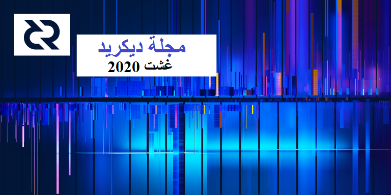

# صحيفة ديكريد لشهر غشت 2020

_الصورة: ثنائي الاتجاه بواسطة saender@_

الأحداث البارزة لشهر غشت:

* تم إصدار رقعة لإصدار 1.5.2 لإصلاح ناقل محتمل لرفض الخدمة.
* يصل عدد أعضاء فريق dcrdex إلى 6 أعضاء نشطين، و لابد أنهم يعملون بسرعة من خلال لوحات المفاتيح بحيث أنهم دمجوا أكثر من 50 طلب سحب في الشهر، مما  أدى إلى التخلص من الأخطاء والحالات الهامشية التي اكتشفت من خلال الاختبار.
* إنتهت مراجعة طلب السحب للخزينة اللامركزية ويجري تطبيق اللمسات الأخيرة.
* تلقى vspd بعض الصقل وانتقل العمل الآن على إدماجه في ديكريديتون و dcrwallet.
* أصبحت الآن العناصر الرئيسية لتحويل بوليتيا إلى tlog مهيأة ، و بمجرد اكتمال بعض إعادة البناء لاستيعاب هذه العمليات، سيبدأ الاختبار.

## إصدار نسخة التصحيح 1.5.2

يغلق هذا الإصدار ناقل محتمل لرفض الخدمة. يُنصح الأشخاص الذين يديرون العقد الخاصة بهم إضافة إلى معدني إثبات العمل القيام بالتحديث.

تتوفر [هنا](https://github.com/decred/decred-binaries/releases/tag/v1.5.2) ثنائيات جديدة  لـ dcrd و Decrediton. تأكد من [التحقق منها](https://docs.decred.org/advanced/verifying-binaries/) — أصبحت الإرشادات أكثر تفصيلاً ومألوفة الآن.

في 10 شتنبر تم [الكشف](https://invdos.net/) عن ثغرة أمنية [CVE-2018-17145](https://nvd.nist.gov/vuln/detail/CVE-2018-17145). تم إبلاغ فريق الديكريد في 7 يوليوز وتم تصحيحها في 8 يوليوز. تم إصدار الإصدار الثنائي 1.5.2 في 27 غشت.

اعتبارًا من 10 شتنبر، تم تحديث أكثر من 20٪ من العقد وفقًا لـ [dcr.farm](https://charts.dcr.farm/d/000000014/nodes).

## التطوير

ما لم يُذكر خلاف ذلك، فإن العمل المَذْكُور هنا يشتمل على حالة “الدمج إلى الرئيسي”. وهذا يعني أن العمل قد تم استكماله ومراجعته ودمجه في كود المصدر الذي يمكن للمستخدمين المتقدمين بناءه وتشغيله، ولكنه ليس متاحًا بعد في ثنائيات الإصدار للمستخدمين العاديين.

بالحديث عن البناء من المصدر، فإن التغييرات في الإصدار 1.5.2 تم نقلها فعليًا إلى الخلف من [إصلاح](https://github.com/decred/dcrd/pull/2253) سابق في الفرع الرئيسي. هذا يعني أن الأشخاص الذين يقومون بالبناء من المصدر تلقوا ذلك قبل شهر و نصف من الإصدار الثنائي. إذا كنت ترغب في تجربتها، يمكنك الحصول على [جولة](https://medium.com/@artikozel/the-decred-node-back-to-the-source-part-one-27d4576e7e1c) تفصيلية جديدة وخفيفة من قبل kozel@ لمساعدتك.

> من خلال تجميع برنامج الديكريد الخاص بك من المصدر، يمكنك الاستفادة من تحديثات الكود وإصلاحات الأخطاء، ومن بين أمور أخرى، تحسينات أداء davecgh@ الملحمية لحظة خروجها، دون الحاجة إلى انتظار الإصدار الرسمي الذي سيتم عرضها فيه. ( …) هذا هو أحدث ما تحصل عليه.

[dcrd](https://github.com/decred/dcrd):

* تمت إضافة العديد من [ملاحظات الإصدار](https://github.com/decred/dcrd/pull/2314) التاريخية إلى المستودع. وبالمقارنة باستخدام صفحات الإصدار الخاصة بـالجيتهوب فقط، فإن هذا يوفر حماية أفضل لهذه المستندات من الفقدان ويقلل من الاعتماد على الجيتهوب ويسمح للأشخاص بالمساهمة في تحسين سير العمل القياسي.
* تمت إضافة وثائق بيئة [simnet](https://github.com/decred/dcrd/pull/2315) ونص الإعداد. يؤدي هذا إلى زيادة إنتاجية المطور عند الاختبار ويسهل أيضًا كتابة تقارير الأخطاء القابلة للتكرار باستخدام إعداد مشترك.
* تقديم دليل [contrib](https://github.com/decred/dcrd/pull/2317) لإيواء أدوات اختيارية قد تكون مفيدة عند العمل ب dcrd والبرامج ذات الصلة. حاليًا، يتضمن هذا تكوينات خدمة نظام التشغيل والبرنامج النصي لإعداد simnet الجديد.
* تمت إضافة [ترحيل](https://github.com/decred/dcrd/pull/2321) قاعدة بيانات لإزالة بيانات فهرس الكتل التي لم تعد مطلوبة بعد كل التصليحات الأخيرة. وينتج عن ذلك استخدام dcrd لذاكرة أقل بنسبة 19.5% تقريبًا.
* [الحد](https://github.com/decred/dcrd/pull/2337) من كمية [البيانات](https://github.com/decred/dcrd/pull/2338) التي تتم قراءتها من استجابة البذّارة
* تم تحديث الإصدار إلى Go 1.15، مما يوفر تحسينات جوهرية للرابط تؤدي إلى ثنائيات أصغر بنسبة 5% تقريبًا
* تحسين التوثيق وتغطية الاختبار

والجدير بالذكر أن معالجة الرسائل غير المكتشفة `notfound` التي أدت إلى إطلاق الإصدار 1.5.2 قد تم [نقلها](https://github.com/btcsuite/btcd/pull/1603) سريعًا إلى btcd وكانت جزءًا من [إصدارها](https://github.com/btcsuite/btcd/releases/tag/v0.21.0-beta) في غشت.

قيد التنفيذ:

تم إنفاق معظم الوقت على العمل على [الخزينة اللامركزية](https://github.com/decred/dcrd/pull/2170) وتم اجتياز جميع [الاختبارات](https://twitter.com/marco_peereboom/status/1296908604243611655).

[dcrwallet](https://github.com/decred/dcrwallet):

* نفذت البنية التحتية الأساسية لموفر خدمة التصويت VSP النسخة 3 (vspd)
* إضافة اكتشاف [حسابات مختلطة](https://github.com/decred/dcrwallet/pull/1773) لاستعادة المحافظ باستخدام معاملات CoinJoin
* إضافة معلمة حساب اختيارية إلى الأمر `listlockunspent` (طُلب أصلا بواسطة dcrdex، ولكنها مفيدة بشكل عام أيضا)
* [السماح](https://github.com/decred/dcrwallet/pull/1807) بإنشاء المحافظ من المدخلات القياسية (مفيدة للاختبار الآلي، وقد ساعد هذا العديد من المشاريع الأخرى)
* تخطيط [قاعدة بيانات](https://github.com/decred/dcrwallet/pull/1817)  محسّن للوصول السريع وقراءة/كتابة أقل
* تحديد كمية [البيانات](https://github.com/decred/dcrwallet/pull/1826) التي تمت قراءتها من استجابة المصدر ومدة النداء
* [إصلاح](https://github.com/decred/dcrwallet/pull/1806) الخلل حيث كان `listunspent` يبلغ عن مخرجات الحصة حتى عندما تم قفلها

[ديكريديتون](https://github.com/decred/decrediton):

* دعم إضافي لتشغيل محفظة الشبكة البرقية مع المحفظة الأساسية في [وضع التحقق البسيط من الدفع  SPV](https://github.com/decred/decrediton/pull/2629) وتمكين التحقق البسيط من الدفع افتراضيًا
* إضافة الدعم لاستعادة المحافظ ذات [الحسابات المختلطة](https://github.com/decred/decrediton/pull/2565)
* [استعادة](https://github.com/decred/decrediton/pull/2604) الكود القديم المعاد تصميمه لدعم نماذج التحصيص القديمة والجديدة
* مواصلة التحديث لاستخدام المكونات الوظيفية وcustom hooks ووحدات CSS النمطية
* إضافة أول [اختبارات تلقائية](https://github.com/decred/decrediton/pull/2606) لمكون الشريط الجانبي
* العديد من إصلاحات الأخطاء

لقد كانت هناك العديد من الأسئلة حول التحصيص بمحافظ الأجهزة الصلبة. و [لخص](https://www.reddit.com/r/decred/comments/imbv74/staking_decred_with_ledger/) jz@ التطورات الأخيرة في 4 شتنبر:

* يعمل JoeGruff@ على شراء التذاكر بواسطة Trezor والتي [ستعمل](https://matrix.to/#/!frQxfmcoOmtseMqzby:decred.org/$D02jsxFbrVDCXsdbMx71fy6wluJfIaw-en-GwEAyj9E) على simnet مع ديكريديتون كما أن طلب السحب إلى مستودع البرامج الثابتة الخاص بهم  قادم قريبًا.
* قبل أن يصبح ذلك قابلاً للاستخدام من قبل الأشخاص العاديين، يجب مراجعة تغييرات البرامج الثابتة ودمجها في المراحل الأولية بواسطة أفراد التريزور.
* بقدر ما أعرف لا أحد يعمل على دعم Ledger في الوقت الحالي، قد يتم معالجة ذلك بعد اكتمال Trezor.
* من غير المعقول توقع دعما للتحصيص في Ledger Live (محفظة البرامج الخاصة بهم)، حيث سيتطلب ذلك التزامًا كبيرًا من جانبهم، وهذا ليس شيئًا يمكننا القيام به من أجلهم.

## [بوليتيا](https://github.com/decred/politeia):

* دعم الواجهة الخلفية لـ [TOTP](https://github.com/decred/politeia/pull/1210) (كودات تستند إلى الوقت لـ 2FA)
* تحسين التعامل مع [إعادة الاتصال](https://github.com/decred/politeia/pull/1274) بـ dcrdata في بوليتيا ونظام إدارة المتعاقد
* تم [تحسين](https://github.com/decred/politeiagui/pull/2084) اقتراح طلب المقترحات RFP باستخدام أجهزة الحالة المحدودة
* العديد من إصلاحات الأخطاء

يتطور نظام إدارة المتعاقد (CMS) بشكل منتظم لتحسين المساءلة وكفاءة الإنفاق:

* واجهة المستخدم [لمراجعة](https://github.com/decred/politeiagui/pull/2051) فواتير المجال نفسه
* إضافة [فئة](https://github.com/decred/politeia/pull/1276) متعاقد جديدة لأولئك الذين تمت الموافقة عليهم من خلال اقتراح ولكن ليس من خلال تصريح متعاقدي الديكريد DCC، وكقاعدة لا يمكن لهؤلاء المتعاقدين رؤية فواتير المجال
* إضافة [حد](https://github.com/decred/politeia/pull/1275) يمكن فيه للمتعاقدين من نفس المجال الإطلاع على فواتير الأشهر الستة الماضية فقط
* إزالة استخدام [ذاكرة التخزين المؤقت](https://github.com/decred/politeia/pull/1282)  للتحضير لترحيل tlog

تحديث التقدم في ترحيل tlog بواسطة lukebp@:

> اكتمل عمل الخلفية ل politeiad tlog والمكونات الإضافية ل politeiad. و ينصب التركيز الحالي على إعادة بناء بوليتيا. وقد تمت إزالة الاعتماد على التخزين المؤقت CockroachDB، والذي كان يُعتمد عليه بشدة من قبل politeiawww، لذلك فإن إعادة تصميم مسارات politeiawww يتضمن ما هو في الأساس إعادة كتابة كاملة. لم نقم أبدًا بوضع بنية إضافية مناسبة لواجهة git الخلفية، مما دفعنا إلى الاعتماد كثيرًا على ذاكرة التخزين المؤقت. الآن بعد أن أصبح لدينا بنية ملائمة للمكونات الإضافية مع tlog، يتعين علينا فصل أجزاء كبيرة من منطق politeiawww ونقله إلى طبقة المكون الإضافي. كان الاعتماد المفرط على ذاكرة التخزين المؤقت يعني أيضًا عدم إنشاء واجهة برمجة التطبيقات (API) ل politeiad نظرًا لأنه كان أسرع وأسهل في تشغيل نفس الاستعلامات على ذاكرة التخزين المؤقت. كل هذا يجب معالجته الآن.
>
> بمجرد اكتمال إعادة بناء politieiawww، يمكننا إجراء اختبارات الأداء. إذا استمرت اختبارات الأداء دون أي مشاكل، فسنكون قادرين على وضع عمل tlog على شبكة الإختبار والبدء في الاستعداد للإصدار.

[vspd](https://github.com/decred/vspd):

* [مصادقة](https://github.com/decred/vspd/pull/167) HTTP الأساسية لحالة نقطة نهاية المشرف (يستخدم للمراقبة التلقائية)
* اكتب نسخة احتياطية [بعد](https://github.com/decred/vspd/pull/169)  إغلاق قاعدة البيانات، وليس قبل ذلك
* تحديثات أصغر متعددة

كل الشكر ل isuldor@ من ([test.stakey.net](https://test.stakey.net/)) وsethsimmons@ من ([vspd.realprivacy.cc](https://vspd.realprivacy.cc/)) للمساعدة في اختبار vspd.

تم دمج التغييرات النهائية للحد الأدنى من vspd القابل للتطبيق والخطوة التالية هي إكمال عمليات الإدماج في dcrwallet و ديكريديتون.

[dcrpool](https://github.com/decred/dcrpool):

* اختبار [تحسينات](https://github.com/decred/dcrpool/pull/243) التوافق

[dcrlnd](https://github.com/decred/dcrlnd):

* جعل خيارات التهيئة [سالمة أكثر](https://github.com/decred/dcrlnd/pull/107)

[dcrdex](https://github.com/decred/dcrdex):

* تم تغيير [أوقات إقفال](https://github.com/decred/dcrdex/pull/612) عقد المتداول/الصانع من 24/48 إلى 8/20 ساعة
* السماح [بالتصغير](https://github.com/decred/dcrdex/pull/573) لرؤية المزيد من الطلبات على مخطط العمق
* إضافة معاملات ["مقسمة"](https://github.com/decred/dcrdex/pull/562) لإعداد مخرجات بالحجم الصحيح. بتكلفة معاملة إضافية واحدة، يتيح ذلك للمستخدم التحكم بشكل أفضل في مقدار الأموال المحجوزة وتحرير الأموال لمزيد من الطلبات، وبالتالي إنشاء دفتر طلبات أكثر صحة وتجربة مستخدم أفضل.
* الإشارة إلى [الوقت الفوري](https://github.com/decred/dcrdex/pull/586) لطلبات المستخدم في عرض الأسواق
* [إشعارات](https://github.com/decred/dcrdex/pull/537) للحسابات المُعَاقَبَة
* معالجة الطلب/الإخطار [غير المتزامن](https://github.com/decred/dcrdex/pull/565) والتفاوض الموازي بشأن المطابقة الجديدة لإصلاح طلبات العميل الأولية `init` واسترداد `redeem` القيمة وعدد قليل من المشكلات الأخرى
* [تعطيل](https://github.com/decred/dcrdex/pull/519) الحساب من جانب العميل إذا لم يتعرف عليه الخادم
* تمت إضافة نقطة نهاية ل [myorders](https://github.com/decred/dcrdex/pull/581) مع بعض المعلومات المفيدة المحسوبة مسبقًا مثل عمر الطلب والمبلغ الذي تم تسويته
* كود [websocket](https://github.com/decred/dcrdex/pull/585) غير مكرر
* تحديث وإغلاق [تبعيات](https://github.com/decred/dcrdex/pull/584) npm
* إصلاح حساب [الرصيد](https://github.com/decred/dcrdex/pull/548)
* إصلاح أخطاء التزامن متعددة
* الكثير من التغييرات الأخرى في الواجهة الخلفية وواجهة المستخدم

تم [دمج](https://github.com/decred/dcrdex/pulls?q=is%3Apr+merged%3A2020-08-01..2020-08-31+sort%3Aupdated-asc) إجمالي 51 طلب سحب من 6 مساهمين، مما أضاف 19 ألفًا وحذف 4 آلاف سطرًا من الكود.

شكرا لكل من [انضم](https://twitter.com/stakeynet/status/1291960465904435200) إلى اختبار الألفا.

[dcrandroid](https://github.com/planetdecred/dcrandroid):

* تمت إضافة زر [إعادة البث](https://github.com/planetdecred/dcrandroid/pull/495)  إلى مربع حوار المعاملات المعلقة
* تعديلات واجهة المستخدم وتحديثات الترجمة

[dcrios](https://github.com/planetdecred/dcrios):

* عرض [مكافأة](https://github.com/planetdecred/dcrios/pull/706) التذكرة والأيام التي استغرقها التصويت في صفحة قائمة المعاملات
* إضافة زر [إعادة البث](https://github.com/planetdecred/dcrios/pull/709) إلى مربع حوار المعاملات المعلقة
* تمت إضافة الزر [لتبديل](https://github.com/planetdecred/dcrios/pull/714) العملة في حقل إدخال المبلغ

[godcr](https://github.com/planetdecred/godcr):

* ميزة [إعادة تسمية](https://github.com/planetdecred/godcr/pull/247) الحساب
* عرض [الشبكة](https://github.com/planetdecred/godcr/pull/248) في عنوان النافذة
* [محرر](https://github.com/planetdecred/godcr/pull/223) مخصص بزوايا دائرية
* إصلاحات الأخطاء

[dcrdata](https://github.com/decred/dcrdata):

* إظهار التجزئة والروابط للكتل [البديلة](https://github.com/decred/dcrdata/pull/1735) (sidechain) على صفحة الكتل
* عنوان URL قصير لصفحة عنوان [الخزينة](https://github.com/decred/dcrdata/pull/1752)
* التصفية لسرد المخرجات [غير المنفقة](https://github.com/decred/dcrdata/pull/1724)  فقط على صفحة العنوان

[المستندات](https://github.com/decred/dcrdocs):

* [إضافة](https://github.com/decred/dcrdocs/pull/1118) صفحة تصف [أبراج المراقبة](https://docs.decred.org/lightning-network/watchtowers/) الخاصة بالشبكة البرقية
* [إعادة صياغة](https://github.com/decred/dcrdocs/pull/1120) الأسئلة المتداولة حول إثبات الحصة
* تمت إضافة معلومات حول كيفية أن [النضج](https://github.com/decred/dcrdocs/pull/1122) الكامل للعقدة يمكن أن يستغرق عدة أيام قبل قبول الاتصالات الواردة (الأسئلة الشائعة حول [التهيئة](https://docs.decred.org/faq/configuration/#6-why-do-i-have-no-inbound-connections-after-forwarding-the-appropriate-port))
* إضافة معلومات حول [معدلات أجر](https://github.com/decred/dcrdocs/pull/1123) المتعاقد (صفحة [تعويض المساهمين](https://docs.decred.org/contributing/contributor-compensation/#pay-rates) )
* تمت [إضافة](https://github.com/decred/dcrdocs/pull/1121) صفحة [لمحافظ الهاتف المحمول](https://docs.decred.org/wallets/mobile-wallets/)

[decred.org](https://github.com/decred/dcrweb):

* تحديثات الرموز وإصلاحات الأخطاء

مسائل أخرى:

* تقوم معظم المشاريع بالبناء والاختبار باستخدام [Go 1.15](https://github.com/decred/dcrd/pull/2334)، والذي [صدر](https://golang.org/doc/go1.15) في غشت
* استخدم العديد من المطورين أداة [الإصدار](https://github.com/decred/release) [لإعادة إنتاج](https://matrix.to/#/!zefvTnlxYHPKvJMThI:decred.org/$l62fxKNyrDN_RhzY93vopaCLwh0Y9aulr6j7DjbFVd0) إصدار البناء 1.5.2 وحساب نفس تجزئة البيان

## الأشخاص

مرحبا بالمساهمين الجدد مع دمج الكود إلى الماستر: hsyia@ على ([dcrdocs](https://github.com/decred/dcrdocs/pull/1122))، و brandoncurtis@ على ([decred-release](https://github.com/decred/decred-release/pull/173))، و isuldor@ على ([dcrwebapi](https://github.com/decred/dcrwebapi/pull/107))، و JustinBeBoy@ على ([dcrios](https://github.com/planetdecred/dcrios/commits?author=JustinBeBoy)).

إحصائيات المجتمع اعتبارًا من 1 شتنبر:

* متابعو التويتر: 40,816 (179+)
* المشتركين في ريديت: 9,906 (31+)، متصل بالإنترنت: 320
* مستخدمي غرفة الدردشة general# على الماتريكس: 174 (50+) \*
* مستخدمي الديسكورد: 1,394 (22+)
* مستخدمي التيليجرام: 2,468 (52-)
* المشتركين في اليوتيوب: 4,180 (30+)، المشاهدات 154 الف (3+ آلاف)
* متابعي لينكد إن: 875 (13+)
* نجوم GitHub dcrd: بلغت 557 (7+)، التفرعات: 246 (6+)

* تذكير: تعرضت الماتريكس لعملية "تطهير" كبيرة في [يوليوز](https://xaur.github.io/decred-news/journal/202007.html#people).

بعض الملاحظات الواردة من حسابات أخرى تتتبعها مستودع [بيانات وسائل الإعلام](https://github.com/decredcommunity/social-media-stats):

* الفيسبوك: [decredbrasil](https://www.facebook.com/groups/decredbrasil/) تضم 5,799 عضوًا (36-) و 57 مشاركة في 30 يومًا، [decredinternational](https://www.facebook.com/groups/decredinternational/) تضم 802 عضوًا و 20 منشورًا في 30 يومًا
* الإنستجرام: [decred_es](https://www.instagram.com/decred_es/) يضم 390 متابعًا (15+)، [decredbr](https://www.instagram.com/decredbr/) يضم 767 متابعًا (50+)، [decredproject](https://www.instagram.com/decredproject/) يضم 578 متابعًا (+2). بخلاف الحسابين الآخرين، لا يوجد مشرف نشط لحساب اللغة الإنجليزية. (_تلميح_).
* التويتر: [DecredArabia](https://twitter.com/DecredArabia) يضم 218 متابعًا (5+)، [DecredAustralia](https://twitter.com/DecredAustralia) يضم 436 متابعًا، [Decred_BR](https://twitter.com/Decred_BR) يضم 540 متابعًا (13+)، [Decred_CA](https://twitter.com/Decred_CA) يضم 334 متابعًا، [Decred_ES](https://twitter.com/Decred_ES) يضم 909 متابعًا (49+)، [Decred_PL](https://twitter.com/Decred_PL) يضم 226 متابعًا (3+)
* اليوتيوب: [Decred Arabia](https://www.youtube.com/channel/UCCtB2BfsA2VdT0FJXpsYICA) تضم 29 مشتركًا و 600 مشاهدة، [Decred Brasil](https://www.youtube.com/channel/UC73wa2ddXuPWsmenVfeFTYg) تضم 369 مشتركًا (108+) و 13 ألف مشاهدة (بزيادة 4 آلاف)، [Decred en Español](https://www.youtube.com/channel/UCCprOo4gR1vsjJTAzv8BMBQ) تضم 74 مشتركًا (28+) و 1,300 مشاهدة (بزيادة 400)
* planetdecred# تحتوي غرفة الماتريكس في الخادم المنزلي ل planetdecred.org على 151 مستخدمًا

## الإدارة و الحوكمة

تلقت [الخزينة](https://explorer.dcrdata.org/address/Dcur2mcGjmENx4DhNqDctW5wJCVyT3Qeqkx) في شهر غشت 12,961 DCR وأنفقت 10,787 DCR. وباستخدام معدل المتوسط اليومي لشهر غشت ب DCR/USD والذي يقدر ب 17.02 دولارًا، ستكون الخزينة قد تلقت 221 ألف دولارا وأنفقت 184 ألف دولارا. ووفقًا لمتوسط السعر اليومي في يوليوز البالغ 15.13 دولارًا، فإن قيمة الفَوترة بالدولار الأميركي عن العمل المنجز في ذلك الشهر تكون قد بلغت 163 ألف دولار. واعتبارا من 6 شتنبر، بلغ رصيد الخزينة 634,7470 DCR (أي 8.5 مليون دولار أمريكي بسعر 13.37 دولار أمريكي).

المقترحات الجديدة و المنتهية:

* تمت الموافقة على [إقتراح](https://proposals.decred.org/proposals/1dc1571) تمويل مجال التصميم لتغطية 6 أشهر من العمل في المجالات الفرعية لواجهة المستخدم/تجربة المستخدم (35 ألف دولار) والهوية (16 ألف دولار) والاتصالات المرئية (14 ألف دولار)، وذلك من خلال تصويت 80% بنعم و25% من المشاركة
* تمت الموافقة على [اقتراح](https://proposals.decred.org/proposals/32cba00) بمواصلة الدفع لمشرفي بوليتيا و الماتريكس و الديسكورد و والتيليجرام (بحد أقصى 9 آلاف دولار على مدار 6 أشهر) بنسبة 73٪ من الأصوات المؤيدة وإقبال الناخبين بنسبة 29٪
* تم رفض [اقتراح](https://proposals.decred.org/proposals/2dcbc3e) دفع 50 ألف دولار مقابل حملات الدمج والترويج على موقعين لحجز السفر بموافقة 15٪ ونسبة إقبال الناخبين 24٪
* تم نشر [اقتراح](https://proposals.decred.org/proposals/1e55a41) جديد لإنتاج الفيديو من طرف @Exitus في أوائل شتنبر
* كما شهد أوائل شتنبر نشر أول [اقتراح](https://proposals.decred.org/proposals/91becea) بطلب تقديم المقترحات، ويهدف إلى تغيير الرسائل على موقع الديكريد. ويدعو المقترحات التي يجب إجراء التغييرات عليها

تم التخلي عن أربعة مقترحات: [ملصقات الواقع المعزز](https://proposals.decred.org/proposals/dedf452) و[التسويق بواسطة fst_nml@](https://proposals.decred.org/proposals/3372cfc)، و [الميمات على وسائل الإعلام](https://proposals.decred.org/proposals/4f81031) و [سلاسل البوكر لديكريد](https://proposals.decred.org/proposals/7a67ed5) (يخطط darthcrypto@ للعودة باقتراح مفصل أكثر).

شارك pavel [لقطة شاشة](https://twitter.com/_Checkmatey_/status/1295858198260248576) وتحديثًا عن تطوير موقع [Decred OnChain](https://proposals.decred.org/proposals/0230918):

> اكتملت الصفحات الفرعية للمخطط تقريبًا. من منظور تجربة / واجهة المستخدم، نحن نعمل على الصفحة الرئيسية. أود أن أقول إننا انتهينا بنسبة 75٪±. ([دردشة](https://matrix.to/#/!qYpAAClAYrHaUIGkLs:decred.org/$3FcfGt9YIOR81fM5CnqEFib4d7HYJPqGe_2oE3Q4JL4?via=decred.org&via=matrix.org&via=planetdecred.org))

الاقتراحات المسبقة:

* يقوم kozel@ برعاية [اقتراح مسبق](https://www.reddit.com/r/decred/comments/igfqjc/decred_content_and_asset_translation_proposal_an/) لترجمة المحتوى
* يجمع lewildbeast@ التعليقات التقييمية حول [اقتراح مسبق](https://github.com/decredcommunity/proposals/pull/6) لتقديم الجوائز للمطورين والباحثين الذين كانوا رائدين في مجال التكنولوجيا الجديدة التي قد تستفيد منها الديكريد (على سبيل المثال المحافظ الهرمية الجبرية HD)

يختبر bee@ "بنية أساسية لصياغة المقترحات" تستند إلى الجيتهوب وتسمح لعدة أشخاص بتحرير المسودة والحصول على الملاحظات والمساعدة في التنسيق وتتبع المراجعات ونشر التعليقات. فالاحتفاظ بالمسودات في مكان معروف يجعلها قابلة للاكتشاف ويسمح بحفظ أي تقدم حتى يتمكن الآخرون من إستلامها إذا ما توقف المؤلف الأصلي عن تطوير الاقتراح. و يتم حاليًا استضافة المقترحات المسبقة [لجوائز](https://github.com/decredcommunity/proposals/pull/6)  lewildbeast@ و إدماج [BTCPay](https://github.com/decredcommunity/proposals/pull/7) من elian@. لاستخدام هذا، أرسل طلب سحب إلى مستودع [المقترحات](https://github.com/decredcommunity/proposals/pulls) أو راسل bee@ في غرفة proposal# على الماتريكس.

راجع الإصدارين [34](https://blockcommons.red/politeia-digest/issue034/) و [35](https://blockcommons.red/politeia-digest/issue035/) من مجلة موجز بوليتيا للحصول على مراجعة أكثر تفصيلاً لنشاط الحوكمة.

## الشبكة

معدل الهاش: افتتحت [معدلات الهاش في شهر غشت](https://explorer.dcrdata.org/charts?chart=hashrate&zoom=kd8zvp86-kek04pzi&scale=linear&bin=block&axis=time) على ~313 Ph/s وأغلقت على ~486 Ph/s، وبلغ قاعها عند 248 Ph/s كما بلغت ذروتها عند 557 Ph/s على مدار الشهر. توزيع [معدلات الهاش](https://dcrstats.com/pow) للتجمع اعتبارا من 1 شتنبر حسب dcrstats.com:

* UUPool بنسبة 39%،
* Poolin بنسبة 30%،
* lab.antpool.com بنسبة 9%،
* BTC.com بنسبة 2.3%،
* Luxor بنسبة 0.8%،
* F2Pool بنسبة 0.6%،
* BeePool بنسبة 0.09%،
* Coinmine بنسبة 0.04%،
* Suprnova بنسبة 0.02%، وأخرى بنسبة ~19%.

أرقام توزيع التجمع تقريبية ولا يمكن تحديدها بدقة.

التحصيص: بلغ متوسط سعر التذكرة [لمدة 30 يوما](https://dcrstats.com/) 151.4 DCR (بزيادة 7.1). وتفاوت [السعر](https://explorer.dcrdata.org/charts?chart=ticket-price&zoom=kd8zvp86-kek04pzi&axis=time&visibility=true-false&mode=stepped) ما بين 141.2 و 168.1 DCR. وقد بلغ [المبلغ المقفل](https://explorer.dcrdata.org/charts?chart=ticket-pool-value&zoom=kd8zvp86-kek04pzi&bin=block&axis=time) 5.82-6.09 مليون DCR، وهو ما يعادل 49.11-51.03% من العرض المتاح [المشارك](https://explorer.dcrdata.org/charts?chart=stake-participation&zoom=kd8zvp86-kek04pzi&bin=block&axis=time) في إثبات الحصة.

بلغ سعر التذكرة 168.12 DCR، وهو ارتفاع جديد منذ تغيير خوارزمية السعر في عام 2017.

العقد: طوال شهر [غشت](https://charts.dcr.farm/d/000000014/nodes?orgId=1&from=1596240000000&to=1598918400000)، كان هناك ما متوسطه 141 عقد استماع عام و 139 عقدة إجمالية حسب dcr.farm (كان الإجمالي ~ 250 قبل حدوث انخفاض حاد في 10 غشت، ربما تم تفويت بعض البيانات). تم توزيع الإصدارات في شهر غشت، في المتوسط، على النحو التالي: 41% يشغلون dcrd النسخة 1.5.1، و 11% dcrd النسخة 1.5، 7% يشغلون dcrd النسخة 1.5.2، و %6 يشغلون dcrd نسخة التطوير 1.6 ، 5% يستخدمون dcrd النسخة 1.5 نسخة التطوير وبناء إصدارات الترشيح، 0.9% يشغلون dcrd النسخة 1.4، 10% يشغلون dcrwallet النسخة 1.5.1، و 1% يشغلون dcrwallet النسخة 1.4 و 1.1% يشغلون dcrwallet النسخة 1.5 و 16% يشغلون أخرى.

تحديث [Our Network](https://ournetwork.substack.com/p/our-network-issue-34) الذي قام به Checkmate@ يشارك الملاحظات حول متوسط 100 ألف DCR ممزوجة يوميًا مما يجعل جزءًا كبيرًا من الحجم على السلسلة، وزيادة التجزئة بعد انتعاش السوق فوق "thermocap" (إجمالي كمية الطاقة التي أنفقها المعدنون) والتغييرات في ثلاثة مقاييس محددة لديكريد.

[قطعة بحث](https://medium.com/@_Checkmatey_/decred-mining-market-mechanics-fd26b921dc46) جديدة من Checkmate@ تعطي نظرة عامة شاملة عن آلية سوق تعدين ديكريد. بالنسبة لأولئك الذين يفضلون تنسيق الفيديو / الصوت، يتوفر ملخص موجز للورقة والرسوم البيانية على [اليوتيوب](https://www.youtube.com/watch?v=TJn6qTko0Xw). يوصى بشدة بالقراءة الكاملة.

> إن فهم الحوافز والآليات ومقاييس الأداء التي تحرك أكبر بائع طبيعي في سلسلة الديكريد يسلط الضوء على كل من تسعير السوق وقوة أمن الشبكة. وينبغي أن توفر هذه البحوث أساسا سليما لتفسير سياق وأداء سوق تعدين الديكريد.

## الإنضمام

[غردت](https://twitter.com/transak_finance/status/1294322399031316480) Transak بأنه يمكن شراء DCR في 32 دولة عبر خدمتها.

BitcoinToYou [تسمح](https://twitter.com/bitcointoyou/status/1291473453812535301) الآن بشراء وبيع DCR مقابل العملة البرازيلية الورقية BRL. قدم michae2xl@ الديكريد في [بث مباشر](https://www.youtube.com/watch?v=dk_2WYZ4EDU) على قناتهم.

تحذير: ليس لدى مؤلفي مجلة ديكريد أي فكرة عن مصداقية أي من الخدمات المذكورة أعلاه. يرجى إجراء البحوث الخاصة بك قبل الوثوق بمعلوماتك الشخصية أو الأصول إلى أي كيان.

## الانتشار

تُحدث أعمال الخزينة اللامركزية بعض [الصخب](https://twitter.com/marco_peereboom/status/1293364590399512577) الذي تستحقه على تويتر. شكرًا لجميع المطورين على نشر تحديثات التطوير وكل شخص [قام](https://twitter.com/jz_bz/status/1295447838843908098) [بتضخيمها](https://twitter.com/_Checkmatey_/status/1293370599977361409).

نشر فريق ديكريد أمريكا اللاتينية تقريرين عن الأنشطة [الثانية](https://www.reddit.com/r/decred/comments/i7ue8h/activities_report_decred_en_espa%C3%B1ol_proposal_2/) و[الثالثة](https://www.reddit.com/r/decred/comments/ip0uke/activities_report_3_decred_en_espa%C3%B1ol_proposal_2/) [لمقترح](https://proposals.decred.org/proposals/3c02b67) التسويق الخاص بهم. ويتم صقل [التقارير](https://github.com/decredcommunity/proposals/tree/master/proposals/3c02b67/updates) الثلاثة وأرشفتها في قاعدة معلومات المقترحات.

[أبلغ](https://www.reddit.com/r/decred/comments/ijhxzn/august_report_for_brazil_proposal/) michae2xl@ عن أنشطته في غشت[ لاقتراح](https://proposals.decred.org/proposals/bc20f98) التسويق البرازيلي ([مؤرشف](https://github.com/decredcommunity/proposals/blob/master/proposals/bc20f98/updates/20200830.md)).

إنجازات Monde PR لشهر غشت:

* تحديث تقويم العلاقات العامة مع اقتراحات وأفكار قصصية مقترحة للأشهر الستة القادمة
* ابتكرت أفكارا في قصتين وعرضتهما على وسائل الإعلام
* تأمين اثنين من الأسئلة والأجوبة عبر البريد الإلكتروني مع منشورات العملات الرقمية ومنشورات رئيسية
* إرسال تعليقات من المتحدثين بإسم الديكريد إلى قصة إخبارية واحدة

التغطية الإخبارية المؤمنة من قبل Monde PR:

* مقال في [AMB Crypto](https://eng.ambcrypto.com/bitcoin-on-chain-solutions-are-punching-above-its-weight-again/) يعرض تعليقًا بواسطة jy-p@ حول توسيع نطاق البتكوين، مقسم إلى 4 منافذ إخبارية بما في ذلك [Fintech Zoom](https://fintechzoom.com/fintech_news_bitcoin-news/bitcoin-on-chain-solutions-are-punching-above-its-weight-again/) و [Sunrise Reads](https://sunriseread.com/bitcoin-on-chain-solutions-are-punching-above-its-weight-again/109311/)
* مقال في [Finance Magnates](https://www.financemagnates.com/cryptocurrency/news/are-crypto-platforms-taking-personal-data-protection-seriously-enough/) يعرض تعليقًا بواسطة jy-p@ حول حماية البيانات الشخصية
* مقال في [Cointelegraph](https://cointelegraph.com/news/ledger-cto-discusses-wallet-s-safety-after-multiple-security-setbacks) يعرض تعليقًا بواسطة jy-p@ حول النكسات الأمنية التي تعرضت لها Ledger، تم نشره في 7 وسائل إعلام بما في ذلك [The Union Journal](https://theunionjournal.com/ledger-cto-discusses-wallets-safety-after-multiple-security-setbacks/) و [Armenian Reporter](https://www.reporter.am/ledger-cto-discusses-wallets-safety-after-multiple-security-setbacks/)

## الفعاليات

الحضور:

* 5 غشت - [الحوكمة و سلسلة الكتل](https://twitter.com/BlockSummitLA/status/1291029494065778689) في أمريكا اللاتينية - الإنترنت. انضم elian@ إلى Cristobal Pereira و Ernesto Contreras من الداش لمناقشة حوكمة سلسلة الكتل لديكريد مقارنة مع الداش وآليات خزينة الديكريد، و بوليتيا و عملية الإقتراح. تم الإعلان عن الفعالية على موقع Cointelegraph الإسباني. ([الفيديو](https://www.youtube.com/watch?v=Sh3obx4Mx_0))
* 8 غشت - [Hablemos Decred 8](https://twitter.com/Decred_ES/status/1288633074050306052) - الإنترنت. تحدث elian@ والضيف José Manuel Da Silva من [criptolugares.io](https://www.criptolugares.io/) عن العملات الرقمية والتجارة، ولا سيما في فنزويلا، وآفاق التبني من منظور التبادل. ([الفيديو](https://www.youtube.com/watch?v=z-6a_tgE89E))
* 11 غشت - [Decred Talk 1](https://twitter.com/Decred_BR/status/1292842513846460417) - الإنترنت. في هذه الحلقة الأولى من النسخة البرازيلية من Decred Talk، تحدث michae2xl@ و André Horta (الرئيس التنفيذي لشركة BitcoinToYou) عن Decred DAO والأنظمة البيئية المستقلة. تم بث الفعالية على قناة BitcoinToYou. ([الفيديو](https://www.youtube.com/watch?v=dk_2WYZ4EDU))
* 17 غشت - Decred Talk 2 - الإنترنت. تم استضافة الإصدار الثاني من Decred Talk على الإنستجرام. كان الهدف هو التواصل مع أعضاء المجتمع الجدد / غير المعروفين والإجابة على أسئلتهم. ([الفيديو](https://www.instagram.com/tv/CEAenAhF7m0/))
* 20  غشت - [Hablemos Decred 9](https://twitter.com/Decred_ES/status/1294416104723488769) - الإنترنت. ناقش adcade@ و الضيف Mauricio Ocampo من موقع [technolawgeek.com](https://www.technolawgeek.com/) وجهات النظر القانونية للعملات الرقمية. ([الفيديو](https://www.youtube.com/watch?v=VzELuWRqCo4))
* 28 غشت - [الوضع القانوني للبتكوين](https://twitter.com/paxful_LATAM/status/1297912240511881216) - الإنترنت. مُنظّم من قبل [Paxful Latam](https://twitter.com/paxful_LATAM).
* 28 غشت - [Hablemos Decred 10](https://twitter.com/Decred_ES/status/1298432664245084161) - الإنترنت. ناقش adcade@ وelian@ والضيف [Carlos Ramirez](https://twitter.com/Ciberagente)  الأمن السيبراني والخصوصية والجرائم الإلكترونية. ([الفيديو](https://www.youtube.com/watch?v=GosMlhxWK3M))
* 29 غشت - من القوانين إلى البروتوكولات - الإنترنت. باستضافة [طلاب من أجل Liberty Mexico](https://twitter.com/SFLMexico). ([الفيديو](https://www.facebook.com/894983097182840/videos/312801089791414))
* 31 غشت - مستقبل الهياكل التنظيمية: المركزية مقابل اللامركزية - الإنترنت. انضم elian@ إلى ندوة مع John DeVadoss (نيو) وErnesto Contreras (داش) لمناقشة الحوكمة في المنظمات اللامركزية. (فيديو) مُنظّم من قبل [Fintech Advisory Services](https://www.fintech-advisory.com/). ([الفيديو](https://www.youtube.com/watch?v=yIlVTSObIzU))

في أخبار أخرى، يقوم eSizeDave@ بتسهيل ندوة عبر الإنترنت لمساعدة الأكاديميين من جامعة RMIT الأسترالية على التعرف على الديكريد كجزء من أبحاثهم.

## وسائل الإعلام

مقالات مختارة:

* الديكريد، آلية سوق التعدين بواسطة Checkmate@ على ([medium](https://medium.com/@_Checkmatey_/decred-mining-market-mechanics-fd26b921dc46))
* فائدة أصول العملات الرقمية بواسطة mm@ على  ([stakey.club](https://stakey.club/en/utility-of-cryptoassets/))
* تحديث آخر لديكريد بالعدد 34 من Our Network بواسطة Checkmate@ على ([substack.com](https://ournetwork.substack.com/p/our-network-issue-34))

الترجمة:

* مقالات mm@ الجديدة والقديمة متوفرة [باللغة البرتغالية](https://stakey.club/pt/articles/)
* الديكريد، آلية سوق التعدين - [باللغة الإسبانية](https://territorioblockchain.com/decred-mecanica-del-mercado-minero/) بواسطة territorioblockchain.com
* مجلة موجز بوليتيا من العدد 33 إلى العدد 35 [إلى العربية](https://insaf01.github.io/politeia-digest-ar/)  بواسطة (arij@ و abdulrahman4@) و [إلى الإسبانية](https://medium.com/decred-es/politeia-digest-spanish/home) بواسطة (pablito@)
* تمت ترجمة مجلة لشهر غشت 2020 إلى العربية بواسطة (arij@ و abdulrahman4@) والصينية بواسطة (Dominic@) والبرتغالية بواسطة (mm@) والإسبانية بواسطة (francov\_@). أصبحت الترجمة البولندية لشهري ماي و يونيو متاحة الآن. شكرا لكم جميعا.

في المحتويات الأخرى غير الإنجليزية:

* لقد فاتنا تمامًا إنشاء قناة [الديكريد عربية](https://www.youtube.com/channel/UCCtB2BfsA2VdT0FJXpsYICA) على اليوتيوب في شهر [ماي](https://matrix.to/#/!kdpEDksmOMNrlMqffD:decred.org/$15908512441460kIGQx:decred.org) (بجد، [_أرسلوا قصصكم_](https://github.com/xaur/decred-news/blob/docs/contributing.md)!)). تحتوي القناة الآن على 7 مقاطع فيديو: 2 أصلية عن [تاريخ المال](https://www.youtube.com/watch?v=OFONdBbYbBc) و [تاريخ الديكريد](https://www.youtube.com/watch?v=_7Ae_Klwqo0)، و 5 مقاطع فيديو إستراتيجية باللغة الإنجليزية مع ترجمة عربية مثل [الفرق بين الديكريد و البتكوين](https://www.youtube.com/watch?v=N0DmpjhuD38) و [كيفية تحصيص الديكريد](https://www.youtube.com/watch?v=JuKw3BHO0v0). تتوفر الترجمة نفسها أيضاً في مقاطع الفيديو الإنجليزية الأصلية. توجد ملفات المصدر على [الجيتهوب](https://github.com/Insaf01/Decred-Videos-Ar) للتعاون وإعادة الاستخدام. إذا كنت ترغب في إرسال ترجمتك إلى مقاطع فيديو الديكريد، فيرجى الاتصال بـ Exitus@.
* ظهر elian@ في بودكاست Territorio Bitcoin الأسباني في [فبراير](https://www.ivoox.com/episodio-105-entrevista-jesus-sanchez-bermejo-audios-mp3_rf_47751087_1.html) و [يونيو](https://www.ivoox.com/que-es-decred-entrevista-profundidad-elian-audios-mp3_rf_52242080_1.html)، حيث حصل على 7 آلاف و 5 آلاف مشاهدة على التوالي.
* تم [إقتباس](https://es.cointelegraph.com/news/cryptology-and-marketing-the-challenges-of-organic-growth) elian@ على Cointelegraph الإسبانية حول التسويق وتحديات النمو العضوي.

أشرطة الفيديو:

* تحديث نشرة أخبار الديكريد النصف الشهرية - 18 غشت من قبل Exitus@ على ([اليوتيوب](https://www.youtube.com/watch?v=hjOi4sfvdNU))
* أهم 5 إشارات صعودية لـديكريد بواسطة LiteLiger على ([اليوتيوب](https://www.youtube.com/watch?v=186jzRRJ-80))
* آليات سوق التعدين ء قراءة بحثية مرموقة بواسطة Checkmate@ على ([اليوتيوب](https://www.youtube.com/watch?v=TJn6qTko0Xw))
* هل تعلم أن الديكريد تمتلك الحوكمة بواسطة Decred Society على ([اليوتيوب](https://www.youtube.com/watch?v=1BNW60RE0rQ)) - نظرة عامة سريعة على عملية اقتراح بوليتيا

الصوتيات:

* الحلقة 0.0 من بودكاست "لقد [استغرق](https://twitter.com/elima_iii/status/1299306383146471426) الأمر مني أكثر من عام لإستجماع الشجاعة للقيام بذلك". تهانينا لإدواردو على إطلاق البودكاست! ([anchor.fm](https://anchor.fm/staked-podcast/episodes/Staked-Podcast-Episode-0-0-eimmd6/a-a31v0tg)، [التغريدة](https://twitter.com/stakedpodcast/status/1299305564258938880))
* الحلقة 10 من بودكاست Rough Consensus. في هذه الحلقة ينضم notsofast@ إلى فرقة سبيدرمان وهو شقي أصلي في مجال العملات الرقمية يتمتع بخبرة واسعة النطاق، ويفهم ما يدور بداخله: البتكوين مقابل العملات البديلة، لماذا الديكريد، والتعدين، والاستثمار/التداول، والمزيد. ([libsyn](https://roughconsensus.libsyn.com/episode-10-bitcoin-decred-altcoins-with-notsofast))

على الرغم من التخلي عن [اقتراح](https://proposals.decred.org/proposals/4f81031) الميمات، بدأ الناس في إنشاء الميمات بشكل مستقل:

* [المساهمة](https://twitter.com/coveryfire7777/status/1292966872560918529) في المنظمة اللامركزية المستقلة
* [مهاجمة](https://twitter.com/coveryfire7777/status/1293719678985146369) الديكريد
* [doge قوي](https://twitter.com/coveryfire7777/status/1293984002349699072)
* تتمتع ديكريد ببعض من [المزايا](https://twitter.com/lukebp_/status/1292622538560872448) بينما البتكوين و الاثيريوم يتصارعون

## مناقشات المجتمع

منشورات مختارة من الريديت:

* [يتساءل](https://www.reddit.com/r/decred/comments/i5jcjp/dcrdex_seems_like_the_greatest_thing_ever_why_is/) الوافد الجديد عن سبب عدم اهتمام مجتمع العملات الرقمية الأوسع بـ DCRDEX
* كان [للسؤال](https://www.reddit.com/r/decred/comments/i9ufxy/decred_team_and_treasury_fund_management/) حول إدارة صندوق الخزينة العديد من الإجابات المتعمقة
* ركز التفكير المتقدم ليوم الجمعة 31 يوليوز على [المراسلة المتعارضة](https://www.reddit.com/r/decred/comments/i1gumi/forward_thinking_friday_contrarian_messaging_31/) حيث اقترح Checkmate@ مجالين محتملين للتسويق لديكريد لدعمها، "الديكريد مستعدة" و "إمتلاك الإسم"، الأموال اللامركزية، في مواجهة التمويل اللامركزي 'De'Fi"
* تعلق التفكير [المتقدم](https://www.reddit.com/r/decred/comments/i5cy0y/forward_thinking_friday_7_aug_2020/) ليوم الجمعة 7 غشت بالأفكار التسويقية، حيث تمت مناقشة بداية فكرة مكافأة مطوري البتكوين الذين أنتجوا أعمالًا مفيدة لـديكريد
* كان التعليق الأهم في [التفكير](https://www.reddit.com/r/decred/comments/i9w54z/forward_thinking_friday_14_aug_2020/) المتقدم ليوم الجمعة 14 غشت حول بناء كيانات مستقلة لامركزية في الـديكريد
* كان التعليق الأهم في التفكير المتقدم ليوم [الجمعة](https://www.reddit.com/r/decred/comments/iip7ap/forward_thinking_friday_28_aug_2020/) 28 غشت إنشاء فهرس للعملات الرقمية باستخدام DCRDEX

مناقشات مختارة من التويتر:

* لا يستطيع Reluctant Raccoon أن [يجد](https://twitter.com/ypical_/status/1292439057168060416) "توكن لحوكمة التمويل اللامركزي" في أي مكان خارج الديكريد
* [لاحظ](https://twitter.com/DecredSociety/status/1292039718679580673) DecredSociety@ أن مكون الديكريد الخاص بـ "نضج السوق" الخاص بنقاط أصول العملات الرقمية الأساسي FCAS منخفض، ولكن بشكل عام لا يزال المشروع من الدرجة الأولى
* [ذكر](https://twitter.com/degeri_crypto/status/1293729682584674304) degeri@ أن الديكريد توظف دائمًا (وتشير إلى بعض الشركات التي تمت إعادة هيكلتها مؤخرًا)
* [إكتشف](https://twitter.com/CATO_io/status/1299756617722925056) CATO\_io@ كيف تؤدي أخلاقيات ديكرد وتقاسمها للمخاطر إلى نظام أكثر قوة. مثال جيد على التواصل الإبداعي الذي يكشف جوانب جديدة للمشروع.

# الأسواق

في غشت تم تداول DCR بين 15.25 و 23.49 دولار أمريكي و 0.00134-0.00202 BTC. وكان متوسط ​​السعر اليومي 17.02 دولار.

بعد أن حققت أعلى إرتفاع جديد عند 12,100 دولار في 2 غشت، إنهارت BTC/USD إلى 10,550 دولارًا في غضون دقائق مما أدى إلى تصفية مذهلة لما قيمته أكثر من مليار دولار من العقود الآجلة. وقد [كتب](https://www.zerohedge.com/markets/bitcoin-hits-1-year-high-then-plummets-after-someone-liquidates-1-billion-seconds-hammer) ZeroHedge أن التلاعب بالأسعار محتمل لأنه ليس من مصلحة البائع "إخراج حزمة المزايدة بالكامل في معاملة واحدة".

في محادثة على التويتر، شارك Checkmate@ [نموذجه](https://twitter.com/_Checkmatey_/status/1293652411316281344) حيث تأثرت السوق الهابطة ل DCR بشكل كبير بالبيع الإجباري من قبل معدني ASIC الذين استثمروا في الأجهزة في ذروة السوق الصاعدة.

## الخارجية ذات الصلة

تستعد Bitcoin Cash لإنقسام مجتمعي آخر من خلال التفرع. [أعلن](https://www.bitcoinabc.org/2020-08-24-celebrating-bchd-slp/) مطورو عميل BitcoinABC أن التفرع النصف السنوي القادم في 15 نونبر سيضيف مطلبًا بأن جزء من كل مكافأة للكتلة سيذهب إلى عنوان يتحكم فيه المطورون. وقد [غرد](https://twitter.com/rogerkver/status/1300908197113458688) Roger Ver و آخرون  بأن هذا غير مقبول ولن ينضموا إلى التفرع.

عانت الإيثيريوم كلاسيك من [هجومين](https://www.coindesk.com/ethereum-classic-attacker-successfully-double-spends-1-68m-in-second-attack-report) منظمين آخرين للإنفاق المزدوج، حيث كسب المهاجم 5.6 مليون دولار من الهجوم الأول، والذي تم تنفيذه بقيمة 204,000 دولار من قوة التجزئة المستأجرة. أعادت الهجمات تنظيم العديد من الكتل بحيث تجاهلتها بعض التطبيقات و[قسمت](https://blog.coinbase.com/coinbases-perspective-on-the-recent-ethereum-classic-etc-double-spend-incidents-1fd19ef215f3) الشبكة.

[اقترح](https://cointelegraph.com/news/charles-hoskinson-s-iohk-submitted-a-decentralized-treasury-proposal-to-the-ethereum-classic-community) تشارلز هوسكينسون من IOHK و Cardano اقتراحين لتحسين الإيثيريوم كلاسيك ETC، أحدهما لإضافة نقاط تفتيش من شأنها إيقاف عمليات إعادة التنظيم الطويلة، والثاني لإضافة صندوق تطوير يتلقى 20٪ من مكافآت الكتلة. ويبدو اقتراح المكافآت الكتلة مثيراً للجدال في المجتمع، حيث ترفض مختبرات ETC الفكرة.

[ولد](https://medium.com/@yamfinance/yam-finance-d0ad577250c7) توكن YAM و[توفي](https://coingeek.com/defi-strikes-again-yam-protocol-bug-leads-to-750000-loss/) في غشت، واستمرت دورته لمدة 3 أيام، وهو ما يعتبر أسرع حتى بالنسبة لمشروع التمويل اللامركزي DEFI. تم وصف الرمز المميز باعتباره "توكنًا للحوكمة" لبروتوكول YAM، ولكن بمجرد بدء النظام، أصبح من الواضح أنه معطل من الأساس. وقد كانت نافذة قصيرة حيث تم حشد مزارعي YAM للعمل وإنقاذ البروتوكول ولكن كان هناك خطأ في الحل، لذا فقد مات الآن. تمت تغطية YAM لتبرئته من المسؤولية حول كونها تجريبية وغير مراجعة، وتم إنتاجها في فترة عشرة أيام من خلال خلط بعض العقود الذكية معًا - بعد ساعة واحدة من إطلاقها، تم استثمار 76 مليون دولار، ليرتفع إلى 300 مليون دولار في اليوم التالي قبل الإعلان عن الخلل القاتل.

قامت MakerDAO بتنشيط عقد تنفيذي "تعويضي" كان من المفترض أن يرفع سقف WBTC ولكن [بدلاً من ذلك](https://twitter.com/nanexcool/status/1292287024767082496) وضعتها في الصفر. ويبدو أنه لم يحدث أي ضرر في هذه المناسبة غير تأخير توافر المزيد من WBTC.

تقوم مؤسسة الزيكاش [بتعيين](https://decrypt.co/39105/a-five-member-board-to-control-36-million-treasury-for-zcash) مجلس إدارة مكون من 5 أعضاء للتحكم في حصة تمويل المكافآت الجماعية التي من المقرر أن تبدأ في تلقيها. سيتم اختيار مجلس الإدارة من خلال تصويت اللجنة الاستشارية المجتمعية، التي تضم حاليًا 62 عضوًا، ولكن يمكن لكل عضو الآن دعوة عضو إضافي واحد.

[أكد](https://www.theblockcrypto.com/linked/76588/coinbase-ceo-interview-token-service) الرئيس التنفيذي لشركة Coinbase أن الشركة تقوم بتطوير منصة للانضمام إلى عرض التبادل الأولي (IEO)، التي تحمل عنوان "Coinbase Launch" بصفة مؤقتة.

يعتبر اعتماد العملة الرقمية أكثر انتشارًا في نيجيريا وفيتنام وفقًا لاستطلاع ستاتيستا [العالمي للمستهلكين](https://www.zerohedge.com/crypto/youll-never-guess-which-country-has-most-widespread-adoption-crypto-world).

تعرضت شركة Plaid للتكنولوجيا المالية (والتي [تستخدمها](https://enegnei.github.io/This-Month-In-Bitcoin-Privacy/July_2020/#july-1st---class-action-lawsuit-against-plaid-inc) Coinbase و Gemini وغيرهما) إلى [دعوى قضائية](https://www.natlawreview.com/article/fintech-startup-plaid-inc-hit-5m-class-action-lawsuit) جماعية بقيمة 5 ملايين دولار أمريكي.

> 1\. تخيل أن هناك شركة تعرف كل دولار تقوم بإيداعه أو سحبه، وكل دولار تدفعه أو تدفعه لبطاقتك الائتمانية، وكل دولار تدفعه للتقاعد، في غضون ساعات بعد إجراء المعاملة. تخيل أن هذا يشمل كل كتاب أو تذكرة فيلم أو وجبة تشتريها، وكل فاتورة تدفعها لطبيب أو مستشفى، وكل دفعة تسددها (أو تفوتها) على رهنك العقاري أو قرض الطالب أو فاتورة بطاقة الائتمان. تخيل أن هذه الشركة تحتفظ بملف عنك يحتوي على كل هذه المعلومات التي تعود إلى خمس سنوات. و تخيل أيضًا أن هذه الشركة تستخدم اسم المستخدم وكلمة المرور لتسجيل الدخول إلى الحساب عبر الإنترنت الذي تحتفظ به مع البنك الذي تتعامل معه والتحديثات التي يتم تقديمها عدة مرات في اليوم للبقاء على اطلاع دائم بكل خطوة مالية تقوم بها.
> 
> 2\. تخيل أن هذه الشركة ليست بنكك. تخيل، على حد علمك، أنك لم تقدم أبدًا اسم المستخدم وكلمة المرور لهذه الشركة أو سمحت لها بالوصول إلى حساباتك عبر الإنترنت. تخيل أنك لم تسمع بهذه الشركة على الإطلاق.

تخيل أن شخصًا ما حصل على قاعدة بياناتهم واستخدمها لتحديد حاملي العملات الرقمية.

تقوم أهم منصات مُبادلات العملات الرقمية [بصياغة](https://www.coindesk.com/crypto-exchange-group-eyes-bulletin-board-system-for-fatf-compliance-coinbase-exec) ورقة بيضاء حول مشاركة بيانات العملاء للامتثال لمتطلبات "مسار الإنتشار" الذي وضعته فرقة العمل المعنية بالإجراءَات المالية FATF.

تم رفع [دعوى قضائية](https://cointelegraph.com/news/600m-crypto-ad-ban-class-action-filed-in-australian-courts) جماعية ضد جوجل و فيسبوك في أستراليا. عمالقة التكنولوجيا متهمون بالسلوك المناهض للمنافسة بسبب حظر إعلانات العملات الرقمية في عام 2018، والتي قيل إنها قتلت سوق "عرض العملة الأولي" ICO، مما أدى إلى إلحاق الضرر بصناعة العملات الرقمية على مدًى أوسع مع عدم منع عمليات احتيال انتحال الهوية بكفاءة.

[كتبت](https://www.coincenter.org/congress-to-irs-proof-of-stake-block-rewards-should-not-be-taxed-as-income/) مجموعة من أعضاء الكونجرس الأمريكي من الحزبين إلى مصلحة الضرائب الأمريكية للحث على توضيح حول كيفية التعامل مع مكافآت نقاط البيع لأغراض ضريبية — وطلب أن يتم التعامل معها ليس كدخل ولكن كسلعة ينتجها المدقق، ليتم فرض ضرائب عليها عند بيعها.

[قدمت]( https://www.zerohedge.com/crypto/usps-just-filed-patent-blockchain-based-secure-voting-system) خدمة بريد الولايات المتحدة براءة اختراع لنظام تصويت آمن قائم على سلسلة الكتل.

## عن هذا العدد

هذا هو العدد 29 من مجلة صحيفة ديكريد. فهرس جميع الإصدارات والمرايا والترجمات متاح [هنا](https://xaur.github.io/decred-news/).

يتم نقل معظم المعلومات الواردة من أطراف ثالثة مباشرة من المصدر بعد التحقق من الحد الأدنى لصحتها. ليس لدى مؤلفي مجلة صحيفة الديكريد القدرة على التحقق من جميع الادعاءات.رجاء إحذر من أعمال الاحتيال وقم ببحثك الخاص.

يمكنك إرسال قصة [هنا] للنظر فيها للإصدار التالي. [التعليقات](https://github.com/xaur/decred-news/blob/docs/contributing.md#feedback) و[المساهمات](https://github.com/xaur/decred-news/blob/docs/contributing.md) مرحب بها دائما

الاعتمادات (بالترتيب الأبجدي):

الكتابة والتحرير: bee وdegeri و l1ndseymm و lukebp و richardred

المراجعات والتعليقات: davecgh و jholdstock و jrick و jz و Exitus و michae2xl

صورة العنوان: saender

النسخة الأصلية لمجلة الديكريد لشهر غشت متوفرة على هذا الرابط [هنا](https://xaur.github.io/decred-news/journal/202008.html)

تمت الترجمة إلى اللغة العربية بواسطة: arij@. قام بالمراجعة abdulrahman4@.

