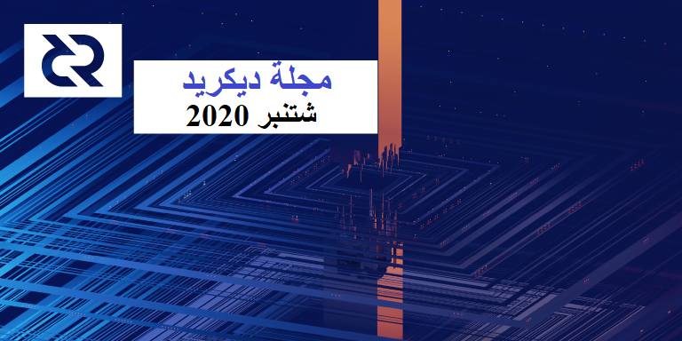

# صحيفة ديكريد لشهر شتنبر 2020

_الصورة: البنى المخفية في المدار التربيعي بواسطة saender@_

الأحداث البارزة لشهر شتنبر:

* تم أخيرًا دمج طلب سحب إنفاق الخزينة اللامركزية، بعد عملية مراجعة شاملة.
* تتصدى dcrdex مع العديد من سيناريوهات المقايضة غير الموثوقة المعقدة التي تم اكتشافها في الاختبارات المبكرة، وقد تم إجراء أول مقايضة على الشبكة الرئيسية في أوائل شهر أكتوبر، ومن المفترض أن يكون الحد الأدنى من المنتج القابل للتطبيق MVP جاهزًا للاستخدام العام قريبًا.
* تمت الموافقة على أول طلب لتقديم اقتراح على بوليتيا، لتغيير الرسائل على موقع decred.org، وتم تلقي 4 اقتراحات مرشحة. وسوف يبدأ التصويت على هذه المقترحات قريبًا.
* تم إطلاق موقع المقاييس على السلسلة dcronchain.com، كما تمت الموافقة عليه في اقتراح في يونيو.
* تم الإطلاق الأولي للموقع الإلكتروني withdecred.org، كما تم تقديم اقتراح مرتبط لتمويل الهبات الترويجية، والذي تمت الموافقة عليه في أوائل أكتوبر.

## التطوير

ما لم يُذكر خلاف ذلك، فإن العمل المَذْكُور هنا يشتمل على حالة "الدمج إلى الرئيسي”. وهذا يعني أن العمل قد تم استكماله ومراجعته ودمجه في كود المصدر الذي يمكن للمستخدمين المتقدمين بناءه وتشغيله، ولكنه ليس متاحًا بعد في ثنائيات الإصدار للمستخدمين العاديين.

[dcrd](https://github.com/decred/dcrd):

يتم [دمج](https://twitter.com/marco_peereboom/status/1308125042149134336) [طلب سحب](https://github.com/decred/dcrd/pull/2170) إنفاق الخزينة اللامركزية إلى الفرع الرئيسي. حصل على 576  تعليق مراجعة، تغيير 115 ملفاً، إضافة 15 ألف سطر من الكود، وقد استغرق الأمر خمسة أشهر منذ نشر المسودة الأولى. تم سحب العديد من المطورين من مشاريع أخرى لمراجعة واختبار هذا الكود الخاص بالإجماع البالغ الأهمية. شكراً للجميع على العمل الشاق على هذا التغيير الهائل!

يصف إقتراح تغيير ديكريد DCP0006 تغيير الإجماع القادم قيد [المراجعة](https://github.com/decred/dcps/pull/17).

أعمال متابعة إدماج الخزينة:

* [ترحيل](https://github.com/decred/dcrd/pull/2336) قاعدة البيانات في اتجاه واحد لدعم تنفيذ الخزينة الجديدة
* [تتبع](https://github.com/decred/dcrd/pull/2350) معاملات tspend (إنفاق الخزينة) في تجمع الذاكرة mempool
* رسائل نظير جديدة [لترحيل](https://github.com/decred/dcrd/pull/2349) معاملات tspend عند بدء تشغيل العقد (وهذا لمساعدة كل من عقد التعدين ومحافظ التصويت على اكتشاف tspends في الوقت المناسب)
* أمر استدعاء الإجراء البعيد الجديد [لإحصاء](https://github.com/decred/dcrd/pull/2351) عدد الأصوات في معاملات الإنفاق (في البداية يمكن الاستعلام فقط عن الإنفاق في تجمع الذاكرة أو التي تم تعدينها)
* إزالة [الميزات السيئة](https://github.com/decred/dcrd/pull/2389) من الكود لحساب قيم نافذة معاملات الإنفاق tspend
* إعادة صياغة [الاتساق](https://github.com/decred/dcrd/pull/2394) في حزمة `standalone` وإعادة تغطية الاختبار إلى 100%

الأعمال المدمجة الأخرى:

* تحسين توقيع [ذاكرة التخزين المؤقت](https://github.com/decred/dcrd/pull/2358) للطرد الاستباقي للإدخالات المتعلقة بالمعاملات في الكتلة بعمق كتلتين
* حظر موحد [لتعطيل/ إضافة إلى القائمة البيضاء](https://github.com/decred/dcrd/pull/2363) لمعيار logic
* إضافة [امتيازات](https://github.com/decred/dcrd/pull/2357) خدمة systemd أكثر تقييدا
* تحديث [نقاط التفتيش](https://github.com/decred/dcrd/pull/2370) والحد الأدنى من العمل المعروف [للسلسلة](https://github.com/decred/dcrd/pull/2371) للإصدار القادم
* تحديثات التبعية للتحضير للإصدار
* الكثير من التحسينات الصغيرة في تغطية الاختبار، والتسجيل، ومعالجة الأخطاء، وما إلى ذلك

كتب matheusd@ [أداة]((https://github.com/matheusd/tspend)) مستقلة لتوليد المعاملات tspend التي يمكن استخدامها على الاجهزة المعزولة كلياً (دون الحاجة إلى اتصال الشبكة بمثيل dcrd الأساسي). وهي تعمل جنبًا إلى جنب مع أداة [ss](https://github.com/jrick/ss) ل jrick لملف ما بعد الكم وتشفير البث.

[dcrwallet](https://github.com/decred/dcrwallet):

* [دعم](https://github.com/decred/dcrwallet/pull/1714) إنفاق الخزينة اللامركزية، بما في ذلك  أداة جديدة لمشغلي الشبكات لإنشاء مفاتيح الخزينة
* [التحذير](https://github.com/decred/dcrwallet/pull/1822) عند التخلص من المفاتيح العامة الموسعة (إذا تم تسريب xpub مع أي مفتاح خاص للحساب، فهذا يكشف عن جميع المفاتيح الخاصة للحساب)
* التعامل مع [التغيير](https://github.com/decred/dcrwallet/pull/1830) لشراء التذاكر غير المختلطة
* حفظ المعاملات [غير المنشورة](https://github.com/decred/dcrwallet/pull/1838) في قاعدة البيانات (ضروري لمنع بعض مخرجات المحفظة السابقة من الإنفاق المزدوج عبر عمليات إعادة التشغيل، أو الاستمرار في إرسال المعاملات tx الموقعة جزئيًا؛ سيتم استخدام هذا بواسطة عملاء vspd)
* علامة جديدة لإضافة التذاكر [يدويًا](https://github.com/decred/dcrwallet/pull/1833) فقط وعدم اكتشافها من خلال مزامنة الشبكة (سيتم استخدام هذه العلامة من قبل مشرفي vspd لمنع المستخدمين من الحصول على أصوات مجانية عن طريق إعادة استخدام عنوان التصويت الخاص بهم. مع تعيين هذه العلامة، يمكن إضافة التذاكر إلى vspd فقط من خلال واجهة برمجة التطبيقات المناسبة)
* إضافة برنامج نصي لاسترداد نتائج P2SH [listunspent](https://github.com/decred/dcrwallet/pull/1842) (خاص بـ dcrdex)
* تغييرات لدعم [vspd](https://github.com/decred/dcrwallet/pull/1840)
* تنفيذ طريقة [sendrawtransaction](https://github.com/decred/dcrwallet/pull/1846)
* ساعد اختبار مكثف من قبل عملاء vspd و dcrdex على تحديد وإصلاح العديد من الأخطاء

[ديكريديتون](https://github.com/decred/decrediton):

* إعادة استخدام مكون [خانة الاختيار](https://github.com/decred/decrediton/pull/2663) من واجهة مستخدم بوليتيا pi-ui
* استمرار إعادة هيكلة المكونات الوظيفية ووحدات CSS
* إصلاحات متعددة للأخطاء

قيد التطوير:

* دعم [برج مراقبة](https://github.com/decred/decrediton/pull/2638) الشبكة البرقية LN
* تحسينات في [واجهة المستخدم/تجربة المستخدم](https://github.com/decred/decrediton/pull/2641) للشبكة البرقية Ln

[بوليتيا](https://github.com/decred/politeia):

* إضافة [اختبارات](https://github.com/decred/politeia/pull/1296) لقاعدة بيانات المستخدم
* استخدام محسّن للذاكرة مع [ترقيم الصفحات](https://github.com/decred/politeia/pull/1306)
* أمر [إعادة تعيين](https://github.com/decred/politeia/pull/1298) المشرف TOTP

CMS:

* إعادة إضافة ميزة [البحث](https://github.com/decred/politeiagui/pull/2131) عن المستخدم مرة أخرى
* استبدال استخدام [ذاكرة التخزين المؤقت](https://github.com/decred/politeia/pull/1300) المتبقية لتمهيد الطريق لترحيل tlog
* إضافة تطبيق [LevelDB](https://github.com/decred/politeia/pull/1302) لاختبار البنية التحتية

قيد التطوير:

* تسجيل دخول المصادقة الثنائية باستخدام [TOTP](https://github.com/decred/politeia/pull/1212) (اأكواد مستندة إلى الزمن)
* الاستعلام عن [إحصائيات كود](https://github.com/decred/politeia/pull/1185) المتعاقد لمشرفي منصة نظام إدارة المتعاقد CMS
* تنفيذ tlog على [الواجهة الخلفية](https://github.com/decred/politeia/pull/1180) وواجهة المستخدم الرسومية ([GUI](https://github.com/decred/politeiagui/pull/2142))

تحديث الوضع الحالي من lukebp@:

> ركز معظم تطوير بوليتيا على سجل المعاملات tlog في الشهر الماضي. كما اكتمل عمل الواجهة الأمامية والخلفية لمطابقة الوظائف الإضافية الحالية. و يركز العمل خلال الأسابيع القليلة القادمة على اختبار tlog، والعمل من خلال الأخطاء، وكتابة الوثائق، وإضافة تغطية الاختبار إلى الكود. الميزة الوحيدة التي لم يتم تنفيذها بعد هي القدرة على استرداد إثبات التضمين لجزء معين من بيانات بوليتيا. تدعم الواجهة الخلفية politeiad هذا حاليًا، ولكن يجب إضافة مسارات politeiawww المقابلة بالإضافة إلى طريقة لعرض / تنزيل إثباتات التضمين في واجهة المستخدم الرسومية. ستتم إضافة هذه الوظيفة قبل الإطلاق.

[vspd](https://github.com/decred/vspd):

* تخزين سجلات تصل إلى 10 [تغييرات](https://github.com/decred/vspd/pull/180) في اختيار التصويت لكل تذكرة، للمساءلة ثنائية الاتجاه
* يتطلب تشغيل dcrwallet في وضع [التذاكر اليدوية](https://github.com/decred/vspd/pull/187)

[dcrpool](https://github.com/decred/dcrpool):

* تحديث قاعدة الكود إلى Go 1.13 ل[أنواع الأخطاء](https://github.com/decred/dcrpool/pull/245)
* إصلاح [خطأ](https://github.com/decred/dcrpool/pull/247) إعادة الاتصال

[dcrlnd](https://github.com/decred/dcrlnd):

* تم تحديث طلب السحب [لنقل](https://github.com/decred/dcrlnd/pull/103) العمل الأولي مع جميع الأعمال المنجزة حتى الإصدار [0.11.1-بيتا](https://github.com/lightningnetwork/lnd/releases/tag/v0.11.1-beta). هذا سيجعلنا على قدم المساواة مع أحدث إصدار حالي ل lnd.

[dcrdex](https://github.com/decred/dcrdex):

* تنفيذ عرض [سجل الطلبات](https://github.com/decred/dcrdex/pull/644) مع المرشحات والتمرير اللانهائي، وعرض تفاصيل الطلب مع جميع التطابقات ومخرجات المعاملات ذات الصلة
* إظهار المبالغ [المؤمنة](https://github.com/decred/dcrdex/pull/683) في العقود وتحديث الأرصدة في المزيد من الحالات
* تمت إضافة مسارات [`match_status`](https://github.com/decred/dcrdex/issues/643) و [`order_status`](https://github.com/decred/dcrdex/pull/687) لاستردادها من الحالات غير العادية التي تم اكتشافها في الاختبار، مثل تعليق أجهزة الكمبيوتر المحمولة أو ضعف الاتصال مما تسبب في فقدان العملاء لخطوة `revoke_match` (أدت إعادة تشغيل برنامج dexc إلى إصلاحه ولكنه كان تجربة مستخدم سيئة)
* معالجة محسنة [لإعادة الاتصال](https://github.com/decred/dcrdex/pull/663)
* معالجة أكثر قوة للتطابقات [المفقودة](https://github.com/decred/dcrdex/pull/661)
* إرجاع [الطلبات النشطة](https://github.com/decred/dcrdex/pull/677) عند استجابة الاتصال `connect`
* [تحرير](https://github.com/decred/dcrdex/pull/648) العملات في الحالات التي لا تكون هناك حاجة إليها (اقرأ [هذا](https://github.com/decred/dcrdex/pull/648#issuecomment-688585289) التعليق العشوائي لتتعرف على عدد الحالات التي يجب مراعاتها في بروتوكول المقايضة غير الموثوقة بها)
* [إخطار](https://github.com/decred/dcrdex/pull/649) المستخدم بالعقوبة
* فترة سماح للمستخدمين الجدد عندما لا يتم فرض عتبة معدل [الإلغاء](https://github.com/decred/dcrdex/pull/638)
* تعامل أفضل مع [الاسترداد](https://github.com/decred/dcrdex/pull/513) عندما يختفي Maker بعد مقايضة Taker
* التحقق من إصلاحات [ضُعْفُ الاسْتِجابَة](https://github.com/decred/dcrdex/pull/680) المتعدد
* طلب [كلمة مرور](https://github.com/decred/dcrdex/pull/621) لاستدعاء الإجراء البعيد للعميل
* تمكين [التسجيل](https://github.com/decred/dcrdex/pull/654) بخيار الدخول في واجهة المستخدم
* العديد من التغييرات الداخلية وإصلاحات الأخطاء

تم [دمج](https://github.com/decred/dcrdex/pulls?q=is%3Apr+merged%3A2020-09-01..2020-09-30+sort%3Aupdated-asc) ما مجموعه 35 طلب سحب من 4 مساهمين، مع إضافة 9 آلاف وحذف 2.6 ألف سطر من الكود.

أظهر [استطلاع للرأي](https://twitter.com/chappjc/status/1302795835248439296) على تويتر الاهتمام بدعم LTC في النسخة التجريبية للشبكة الرئيسية.

> تم إجراء أول مقايضات ذرية للشبكة الرئيسية DCR-BTC بتنسيق من dcrdex# أمس. يستمر الاختبار والتطوير، ولكن تم نقل الحديث إلى توزيع البرامج والبرامج التعليمية. أوقات مثيرة لمشروع ديكريد decredproject@. (chappjc@ في 9 أكتوبر)

[dcrandroid](https://github.com/planetdecred/dcrandroid):

* تحديث [الترجمة الصينية](https://github.com/planetdecred/dcrandroid/pull/515)
* إصلاحات الأخطاء

قيد التطوير:

* عرض [مقترحات](https://github.com/planetdecred/dcrandroid/pull/503) بوليتيا

[dcrios](https://github.com/planetdecred/dcrios):

* إصلاحات الأخطاء

قيد التطوير:

* عرض [مقترحات](https://github.com/planetdecred/dcrios/pull/715) بوليتيا
* [اختبار](https://github.com/planetdecred/dcrios/pull/707) واجهة المستخدم الآلي

[dcrros](https://github.com/decred/dcrros):

* تم [تحديثه](https://github.com/decred/dcrros/pull/6) إلى الإصدار 1.4.4 من مواصفات Rosetta والذي يتضمن القدرة على إنشاء المعاملات وتوقيعها ونشرها. يتم تمرير مجموعة `check:construction` الخاصة بـ rosetta-cli المطابقة لهذه المواصفات في طلب السحب هذا.

أصدر الإصدار 1.4 ل Rosetta  [واجهة برمجة تطبيقات للبناء](https://www.rosetta-api.org/docs/construction_api_introduction.html) (Wallet API سابقا) لإنشاء المعاملات بتنسيق قياسي، والذي لم ينته عندما أعلنا عن تنفيذ روزيتا لديكريد في شهر [يونيو](https://xaur.github.io/decred-news/journal/202006.html). ويتم دعم واجهة برمجة التطبيقات هذه بأحدث إصدار ل dcrros والعمل مستمر لمواكبة المواصفات، بالإضافة إلى التغييرات القادمة في إجماع ديكريد.

[المستندات](https://github.com/decred/dcrdocs):

* استبدال نموذج [اقتراح](https://github.com/decred/dcrdocs/pull/1127) التطوير بمقترح ذي نطاق أوسع
* استبدال الأقسام القابلة للطي الخاصة بنظام التشغيل OS [بعلامات تبويب](https://github.com/decred/dcrdocs/pull/1129) مناسبة

[مستندات التطوير](https://github.com/decred/dcrdevdocs):

* تم [نقل](https://github.com/decred/dcrdocs/pull/1126) صفحة [اختيار التذاكر](https://devdocs.decred.org/developer-guides/ticket-selection/) من dcrdocs
* تمت إ[ضافة](https://github.com/decred/dcrdevdocs/pull/86) مرجع [نظرة عامة](https://devdocs.decred.org/developer-guides/transactions/txscript/overview/) و [أكواد التشغيل](https://devdocs.decred.org/developer-guides/transactions/txscript/opcodes/)  لنظام txscript المستخدم في الديكريد (وهي لغة برمجة بسيطة تعتمد على Stack وتشبه لغة Forth البرمجية)

[decred.org](https://github.com/decred/dcrweb):

* إضافة مساهمي [أمريكا اللاتينية](https://github.com/decred/dcrweb/pull/909)
* تحديثات الخلفية

مسائل أخرى:

* نشر برنامج مكافأة إيجاد العلة [تحديثًا](https://bounty.decred.org/2020/09/status-update/) جديدًا وأجرى [تغييرات](https://github.com/decred/dcrbounty/pull/71/files) على القواعد والنطاق بناءً على الخبرة في عمليات التسليم الأخيرة

## الأشخاص

إحصائيات المجتمع اعتبارًا من 1 أكتوبر:

* متابعو التويتر: 40,790 (26-)
* المشتركين في ريديت: 9,929 (23+)
* مستخدمي غرفة الدردشة general# على الماتريكس: 197 (23+)
* مستخدمي الديسكورد: 1,396 (2+)
* مستخدمي التيليجرام: 2,434 (34-)
* المشتركين في اليوتيوب: 4,210 (30+)، المشاهدات 156 الف (1.7+ آلاف)
* متابعي لينكد إن: 891 (16+)
* نجوم GitHub dcrd: بلغت 563 (6+)، التفرعات: 248 (2+)

تتوفر مخططات هذه الإحصائيات في مستودع [إحصائيات وسائل التواصل الاجتماعي](https://github.com/decredcommunity/social-media-stats/blob/graphs/graphs/index.md) (يتم تعقب المزيد من الحسابات) وعلى سبيل المثال [dcrextdata](https://dcrextdata.planetdecred.org/community) في Planet Decred (مخططات ديناميكية ذات دقة عالية).

## الإدارة و الحوكمة

تلقت [الخزينة](https://explorer.dcrdata.org/address/Dcur2mcGjmENx4DhNqDctW5wJCVyT3Qeqkx) في شهر شتنبر 12,300 DCR وأنفقت 5,740 DCR. وباستخدام معدل المتوسط اليومي لشهر شتنبر ب DCR/USD والذي يقدر ب 13.26 دولارًا، ستكون الخزينة قد تلقت 163 ألف دولارا وأنفقت 76 ألف دولارا. ووفقًا لمتوسط السعر اليومي في غشت البالغ 17.02 دولارًا، فإن قيمة الفَوترة بالدولار الأميركي عن العمل المنجز في ذلك الشهر تكون قد بلغت 98 ألف دولار. واعتبارا من 3 أكتوبر، بلغ رصيد الخزينة 640,000 DCR (أي 7.5 مليون دولار أمريكي بسعر 11.69 دولار أمريكي).

* تمت الموافقة على [اقتراح](https://proposals.decred.org/proposals/1e55a41) Exitus@ لإنتاج الفيديو بنسبة 94.6٪ بنعم مع نسبة مشاركة ب 31٪.
* تم تقديم [اقتراح](https://proposals.decred.org/proposals/2bf72e6) للترويج لموقع withDecred.org الجديد مع هبات DCR في شتنبر وتمت الموافقة عليه في أوائل أكتوبر مع 62% من الأصوات و نسبة مشاركة 37%.
* تم رفض [اقتراح](https://proposals.decred.org/proposals/f279ed5) للدفع ل alexsolo@ مقابل العمل المنجز في المدة الزمنية الممتدة ما بين 2016 و 2018 مع 8٪ من الأصوات بنعم ونسبة مشاركة بلغت 28٪.
* تمت الموافقة على [مقترح](https://proposals.decred.org/proposals/91becea) تقديم الإقتراح لتغيير الرسائل على موقع decred.org بموافقة 85% ونسبة مشاركة 29%. تم تقديم 4 مقترحات قبل الموعد النهائي المحدد في 28 شتنبر، وبمجرد أن تصبح جميعها جاهزة، سيبدأ التصويت. ولا يمكن الموافقة إلا على واحد فقط من هذه المقترحات، ولا يزال يتعين عليه تلبية متطلبات الموافقة والنصاب القانوني.

راجع موجز بوليتيا العددين [36](https://blockcommons.red/politeia-digest/issue036/) و [37](https://blockcommons.red/politeia-digest/issue037/) للحصول على تغطية أكثر تفصيلاً للمقترحات.

نشر bee@ [قائمة مراجعة](https://github.com/decredcommunity/guidelines/blob/master/proposals.md) شاملة لمقترحات بوليتيا الناجحة بناءً على تجارب المقترحات السابقة.

تم استيراد 4 تحديثات للمقترحات في مستودع [المقترحات](https://github.com/decredcommunity/proposals/tree/master/proposals). لا يوجد فهرس مناسب حتى الآن ولكن الروابط المباشرة تعمل ([مثال](https://github.com/decredcommunity/proposals/blob/master/proposals/95cfb73/updates/20200902.md)). يرجى إرسال تحديثاتك للمساعدة في جمعها جميعًا في مكان واحد.

## الشبكة

معدل الهاش: افتتحت [معدلات الهاش في شهر شتنبر](https://explorer.dcrdata.org/charts?chart=hashrate&zoom=kegbelov-kfrbnmg7&scale=linear&bin=block&axis=time) على ~460 Ph/s وأغلقت على ~450 Ph/s، وبلغ قاعها عند 338 Ph/s كما بلغت ذروتها عند 609 Ph/s على مدار الشهر. [توزيع](https://miningpoolstats.stream/decred) معدلات الهاش للتجمع اعتبارا من 1 أكتوبر حسب dcrstats.com:

* UUPool بنسبة 35%،
* Poolin بنسبة 27%،
* Huobipool بنسبة 11%،
* easy2mine بنسبة 10%،
* Antpool بنسبة 9%،
* BTC.com بنسبة 3%،
* Luxor بنسبة 0.9%،
* F2Pool بنسبة 0.5%،
* okex بنسبة 0.2%،
* Coinmine بنسبة 0.02%،
* وأخرى بنسبة ~3%.

لاحظ أننا قمنا بالتبديل من [dcrstats.com/pow](https://dcrstats.com/pow) إلى [miningpoolstats.stream](https://miningpoolstats.stream/decred) لأن الأخير يحدد نسبة تجزئة أكثر بحوالي 20٪.

التحصيص: بلغ متوسط سعر التذكرة [لمدة 30 يوما](https://dcrstats.com/) 148.6 DCR (ناقص 2.8). وتفاوت [السعر](https://explorer.dcrdata.org/charts?chart=ticket-price&zoom=kegbelov-kfrbnmg7&bin=window&axis=time&visibility=true-false&mode=stepped) ما بين 144.7 و 152.5 DCR. وقد بلغ [المبلغ المقفل](https://explorer.dcrdata.org/charts?chart=ticket-pool-value&zoom=kegbelov-kfrbnmg7&bin=block&axis=time) 6.06-6.12 مليون DCR، وهو ما يعادل 50.38-51.04% من العرض المتاح [المشارك](https://explorer.dcrdata.org/charts?chart=stake-participation&zoom=kegbelov-kfrbnmg7&bin=block&axis=time) في إثبات الحصة.

العقد: طوال شهر [شتنبر](https://charts.dcr.farm/d/000000014/nodes?orgId=1&from=1598918400000&to=1601510400000)، كان هناك ما متوسطه 108 عقد استماع عام و 133 عقدة إجمالية حسب dcr.farm. تم توزيع الإصدارات في شهر شتنبر، في المتوسط، على النحو التالي: 26% يشغلون dcrd النسخة 1.5.1، و 22% dcrd النسخة 1.5.2، و %7 يشغلون dcrd نسخة التطوير 1.6 ، و 7% dcrd النسخة 1.5.0، 4% يستخدمون dcrd النسخة 1.5 نسخة التطوير وبناء إصدارات الترشيح، 0.8% يشغلون dcrd النسخة 1.4، 17% يشغلون dcrwallet النسخة 1.5.1، و 1.6% يشغلون dcrwallet النسخة 1.5 و 1.1% يشغلون dcrwallet النسخة 1.4 و 15% يشغلون أخرى.

تم إطلاق موقع [dcronchain.com](https://dcronchain.com/) بعد أربعة أشهر من الموافقة على اقتراحه في يونيو. وتتضمن النسخة الأولية 5 مخططات تفاعلية مستمدة من بيانات ديكريد على السلسلة، استناداً إلى بحث قام به Checkmate@ و PermabullNino@. يرحب الفريق بأي تعليقات على [Reddit](https://www.reddit.com/r/decred/comments/j3589s/release_dcronchaincom_onchain_researchgraphs_in/). كود المصدر متاح على [GitHub](https://github.com/Decred-Bulls/dcronchain). مبروك على الإطلاق!

## الإنضمام

[أضافت](https://twitter.com/Decred_BR/status/1305922555124035584) منصة التبادلات NovaDAX البرازيلية التي [أدرجت](https://twitter.com/Decred_BR/status/1275190825060794377) DCR في يونيو دعم DCR على بطاقات الخصم الخاصة بها. سيسمح ذلك بالوصول إلى أكثر من 23,000 جهاز صراف آلي ومحطات نقاط البيع في جميع أنحاء البلاد.

> NovaDAX هي من بين أفضل 3 منصات التبادل البرازيلية. وباستخدام بطاقة الخصم الجديدة، من الممكن دفع أي فاتورة في الأماكن التي تقبل [Elo](https://en.wikipedia.org/wiki/Elo_(card_association))، والتي تتوفر في البرازيل على نفس اعتماد Visa و Mastercard. بالإضافة إلى ذلك، من الممكن إجراء تحويلات بنكية بعملة الريال البرازيلي BRL، بخصم DCR من حسابك وبدون دفع رسوم التحويل، وهو أمر تفرضه جميع البنوك في البرازيل. من الممكن أيضًا استبدال DCR مقابل BRL في أجهزة الصراف الآلي Banco24horas، مع حوالي 23 ألف آلة في البرازيل. تفتح NovaDAX فرعًا لها في البرتغال وتعتزم أن تفعل الشيء نفسه في السوق الأوروبية. (emiliomann@).

تمت [إضافة](https://github.com/decred/dcrweb/pull/907) [Swyftx](https://swyftx.com.au/) الأسترالية إلى decred.org، على الرغم من أنها كانت تضم DCR لفترة من الوقت. تتميز منصة المبادلات بالعديد من [الميزات](https://swyftx.com.au/features/) وتسمح للمستخدمين بشراء DCR باستخدام AUD.

تحذير: ليس لدى مؤلفي مجلة ديكريد أي فكرة عن مصداقية أي من الخدمات المذكورة أعلاه. يرجى إجراء البحوث الخاصة بك قبل الوثوق بمعلوماتك الشخصية أو الأصول إلى أي كيان.

## الانتشار

تمت الموافقة على [الاقتراح](https://proposals.decred.org/proposals/1e55a41) الثاني الذي قدمه Exitus@ بإنشاء محتوى فيديو لمدة 6 أشهر أخرى بدعم عالٍ جدًا. سينضم Checkmate@ في المرحلة الثانية للمساعدة في البرامج النصية والتعليقات. شارك الاقتراح بعض الإحصائيات للأشهر الستة الماضية:  21 ألف مشاهدة تم اكتسابها بنسبة 98%، وحوالي 500 مشترك مكتسبين، وفقدان حوالي 250، وتلقي 170 تعليق. كان الفيديو الأكثر  شعبية هو [DCR 101 - كيفية تحصيص الديكريد 2020](https://www.youtube.com/watch?v=m5lcm6yttEk) مع 1،600 مشاهدة. وقد حصلت مقاطع الفيديو المختلفة التي تم تحميلها على التويتر على حوالي 18 ألف مشاهدة.

[أطلق](https://www.reddit.com/r/decred/comments/it9mkf/withdecredorg_new_portal_to_onboard_newcomers_to/) كل من pavel@ وpablito@ وel\_capitan@ موقع ويب جديد [withdecred.org](https://withdecred.org/) للعثور على نهج جديد قابل للتطوير لكيفية ضم مستخدمين جدد إلى مجتمع ديكريد. يحتوي موقع الويب على سلسلة من المقالات التي تشكل "مسار تحويل" منظم يقود الشخص إلى شراء بعض DCR. تبع ذلك اقتراح لتمويل العمليات وتوزيع مبلغ 5,000 دولار من DCR لجلب المشاركة الأولية، تمت الموافقة عليه في أوائل أكتوبر. تاريخيا، كان بعض أفراد المجتمع متشككين في الهبات وسيجلب هذا المشروع أخيرا بعض البيانات التجريبية وقياس عائد الاستثمار لهذا النموذج.حساب التويتر هو [withdecred@](https://twitter.com/withdecred)..

[نظم](https://www.reddit.com/r/decred/comments/it0idm/decred_on_quora/) عدد قليل من أعضاء المجتمع للإجابة على مجموعة من الأسئلة حول ديكريد على Quora.

بدأ pavel@ تجربة نشر [محتوى](https://www.publish0x.com/crypto-as-an-agent-for-change/monero-and-decred-are-the-new-bitcoin-xlldpze) [ديكريد](https://www.publish0x.com/withdecred/why-we-need-decred-an-inclusive-approach-to-sound-money-xgdwkjl) على Publish0x لأنها بوابة عملات رقمية [واعدة](https://github.com/Decred-Bulls/decred-marketing#why-to-invest-time-into-publish0xcom).

أطلق pablito@ وcaibarrad@ الحلقة الأولى من بودكاست Decred en Español، المتوفر على [اليوتيوب](https://twitter.com/Decred_ES/status/1310654270056923136) و [Spotify](https://twitter.com/Decred_ES/status/1310055071200292869).

نشر jazzah@ [مسابقة](https://www.reddit.com/r/decred/comments/ifyb03/contest/) بعنوان "++KYC vs Shuffle" حيث يحتاج المشاركون إلى إكمال مهام غير سهلة من خلال فحص صورة مرحة مجنونة. تم المطالبة بالجائزة رقم 1 ولكن الجوائز 2-4 لا تزال مفتوحة لأي شخص.

إنجازات Monde PR لشهر شتنبر:

* إنشاء / عرض أفكار قصتين في المنشورات المالية و العملات الرقمية
* الرد على 3 طلبات للتعليق
* ردت على قصتين إخباريتين حول ديكريد DCR

التغطية الإخبارية المؤمنة من قبل Monde PR:

* مقال في [مجلة Authority](https://medium.com/authority-magazine/meet-the-disruptors-how-jake-yocom-piatt-of-decred-aims-to-redefine-governance-with-blockchain-5c3724f20e74) يعرض تعليقًا بواسطة jy-p@ حول كيف تهدف ديكريد إلى إعادة تعريف الحوكمة باستخدام تقنية سلسلة الكتل
* مقال في [AMB Crypto](https://eng.ambcrypto.com/will-defi-crash-the-crypto-economy-the-same-way-cdos-did/) يعرض تعليقًا من richardred@ حول "فقاعة التمويل اللامركزي Defi"، تم تجميعه في 12 منفذًا إخباريًا بما في ذلك [Crypto Fund Report](https://www.cryptofundreport.com/articles/will-defi-crash-the-crypto-economy-the-same-way-cdos-did/) و [Coingenius.news](https://coingenius.news/will-defi-crash-the-crypto-economy-the-same-way)
* مقال في [The Daily Chain](https://thedailychain.com/decred-clarify-details-of-reported-vulnerability/) يعرض تعليقًا من davecgh@ يوضح تفاصيل الثغرة الأمنية المبلغ عنها

## الفعاليات

الحضور:

* 4 شتنبر - [Hablemos Decred 11](https://twitter.com/Decred_ES/status/1301583356644282368) - الإنترنت. ناقش elian@ والضيف Jose Zarate من Stamping.io الطابع الزمني على سلاسل الكتل. ([الفيديو](https://www.youtube.com/watch?v=QwsWiJ8v5qE))
* 10 شتنبر - [Hablemos Decred 12](https://twitter.com/Decred_ES/status/1304153821631791104) - الإنترنت. قام كل من caibarrad@ وelian@ بدعوة David Riascos منcLabs@ للحديث عن أهمية المجتمع في تطوير البروتوكولات المفتوحة وتحديات التبني في مجال العملات الرقمية. ([الفيديو](https://www.youtube.com/watch?v=QC5_1PqJb_4))
* 17 شتنبر - [Hablemos Decred 13](https://twitter.com/Decred_ES/status/1305595709257846785) - الإنترنت. تحدث adcade@ وelian@ مع الضيفة Nancy Salazar من Platzi حول كيفية بدء مهنة في مجال التكنولوجيا وكيفية التغلب على تحديات المجالات المعقدة مثل سلاسل الكتل. ([الفيديو](https://www.youtube.com/watch?v=f_ppC-GVDk8))
* 25 شتنبر - [Hablemos Decred 14](https://twitter.com/Decred_ES/status/1308582624772927494) - الإنترنت. استكشف elian@ والضيف Eloisa Cadenas من CryptoFintech أصول [التطرف](https://es.cointelegraph.com/news/wild-crypto-maximalism)، ومخاطر مثل هذه الخطوط الفكرية، ومستقبل سلاسل الكتل القابلة للتشغيل البيني وما هي تحديات الاعتماد والابتكار في مجال العملات الرقمية. تم [الإعلان](https://es.cointelegraph.com/news/virtual-talk-where-does-the-concept-of-maximalist-come-from)  عن الفعالية على موقع Cointelegraph Spanish. ([الفيديو](https://www.youtube.com/watch?v=EGaMhQX3Wd4))

الفعاليات القادمة:

* 15 أكتوبر - Hablemos Decred 17 - الإنترنت. سيستكشف elian@ و Gus Grilliesca مستقبل الفن والعملات الرقمية.
* 17 أكتوبر - [مقدمة إلى واجهة برمجة تطبيقات سلسلة الكتل](https://www.eventbrite.com/e/open-source-workshop-introduccion-a-blockchain-api-de-decred-dcrdata-tickets-124107662359) - الإنترنت. ورشة عمل لاستكشاف سلسلة كتل ديكريد مع واجهة برمجة تطبيقات dcrdata.
* 19 أكتوبر - [قمة البرمجيات مفتوحة المصدر](https://www.eventbrite.com.mx/e/cumbre-de-contribuidores-de-open-source-software-ccoss-2020-tickets-91491063233) - الإنترنت. سيقدم adcade@ ديكريد مع الحديث عن "نموذج المتعاقد المفتوح المصدر في مجال العملات الرقمية".

## وسائل الإعلام

تم ذكر ديكريد في [تقرير](https://medium.com/greenfield-one/the-state-of-blockchain-governance-governance-by-and-of-blockchains-f6418c46077) طويل عن حوكمة سلسلة الكتل. يمكنك إيجاد ملف PDF كامل من 115 صفحة [هنا](https://65eocu3ftlpiygeym3g5kply6zy2dtdjyrhbm4m26cb6bt3msyla.arweave.net/90jhU2Wa3owYmGbN1T149nGhzGnEThZxmvCD4M9slhY) (تم ذكر ديكريد في الصفحات 64-66).

مقالات مختارة:

* لماذا أستعمل ديكريد بواسطة Decred Citizen على ([medium](https://medium.com/@decred.citizen/why-i-decred-8d83081b6fb8))
* ديكريد على السلسلة: المنظمة المستقلة اللامركزية + حساب الخزينة بواسطة permabullnino@ على ([medium](https://medium.com/@permabullnino/decred-on-chain-dao-treasury-accounting-afb1ed989b0a))
* حوكمة سلسلة الكتل - الجزء 2 بواسطة mm@ على ([stakey.club](https://stakey.club/en/blockchain-gov-part2/))
* تعرف على المبدعين: كيف يهدف جيك يوكوم بيات من ديكريد إلى إعادة تعريف الحوكمة، باستخدام تقنية سلسلة الكتل بواسطة Tyler Gallagher على ([medium](https://medium.com/authority-magazine/meet-the-disruptors-how-jake-yocom-piatt-of-decred-aims-to-redefine-governance-with-blockchain-5c3724f20e74))
* المونيرو و ديكريد هما البتكوين الجديدة بواسطة John Dennehy على ([medium](https://medium.com/@john_dennehy/monero-and-decred-are-the-new-bitcoin-34a8c1fb2515))

> نظرًا لأن اللامركزية هي أحد المبادئ التأسيسية لفضاء العملات الرقمية، فإنها تحظى بالكثير من الكلام، ولكن واحدة من أقدم المشاكل المتعلقة بالسلطة هي أنه من النادر جدًا أن يتخلى شخص ما عنها طواعية بمجرد أن يمتلكها. وديكريد هي استثناء نادر وملحوظ والذي يتجلى في التقدم الذي أحرزه مطوروه في تحويل موارد المشروع إلى هذا النظام المستقل. المونيرو هي حالة فريدة أخرى، حيث يتم تمويل تطويرها بالكامل من خلال التبرعات المجتمعية.

التقطت وسائل إعلام العملات الرقمية الثغرة الأمنية [INVDoS](https://invdos.net/) التي تم الكشف عنها في 9 شتنبر، والتي جلبت بعض الصحافة المتباينة لديكريد. كان إصدار [CoinDesk](https://www.coindesk.com/high-severity-bug-in-bitcoin-software-revealed-2-years-after-fix) هو الأول ولم يذكر ديكريد على الإطلاق. والجدير بالذكر أنه قد تم نشره بعد 45 دقيقة فقط من آخر تحديث لملف PDF في Invdos.net و 28 دقيقة قبل إرسال البريد الإلكتروني إلى القائمة البريدية [لمطوري البتكوين](https://lists.linuxfoundation.org/pipermail/bitcoin-dev/2020-September/018164.html). ذكرت [ZDNet](https://www.zdnet.com/article/researcher-kept-a-major-bitcoin-bug-secret-for-two-years-to-prevent-attacks/) بإيجاز برنامج مكافأة إيجاد العلة الخاص بـديكريد. وقد ضخمت [Decrypt](https://decrypt.co/41685/developers-reveal-2018-bitcoin-bug-used-to-crash-entire-networks) المشكلة ونشرت بعض المعلومات غير الدقيقة. وقد ذهبت [The Daily Chain](https://thedailychain.com/bitcoin-engineers-identify-and-patch-vulnerability-in-decred-btcd-blockchains/) إلى حد القول إن "مهندسي البتكوين قاموا بتصحيح الثغرات الأمنية في ديكريد". النمط الشائع هو أن هذه المنافذ الإعلامية لم تتواصل للحصول على تعليقات من الخبراء الأكثر دراية بالبرنامج (مطورو ديكريد). اتصل l1ndseymmm@ بـ The Daily Chain وقاموا بنشر [توضيح](https://thedailychain.com/decred-clarify-details-of-reported-vulnerability/) متابعة مع تعليق من degeri@. وقد عالج davecgh@ المعلومات المضللة في [سلسلة تغريدة](https://twitter.com/degeri_crypto/status/1305591774698786821). ويتوفر [هنا](https://github.com/xaur/notes/blob/master/invdos.md) سرد مفصل للتغطية الإعلامية والمعلومات الخاطئة والجدول الزمني للأحداث ولتفكير الجاد.

الترجمة:

* تعرف على المبدعين: كيف يهدف جيك يوكوم بيات من ديكريد إلى إعادة تعريف الحوكمة، باستخدام تقنية سلسلة الكتل - [باللغة الصينية](https://github.com/Decred-CN/articles/blob/master/Meet%20The%20Disruptors.md) بواسطة Dominic@
* موجز بوليتيا العددين 36 و37 - [بالعربية](https://insaf01.github.io/politeia-digest-ar/) بواسطة arij@ و abdulrahman4@
* تمت [ترجمة](https://xaur.github.io/decred-news/) المجلة لشهر غشت 2020 إلى العربية بواسطة (arij@ و abdulrahman4@) والصينية بواسطة (Dominic@) والإسبانية بواسطة (francov\_@). شكرا لكم جميعا لنشر الكلمة!

تم [هنا](https://github.com/decredcommunity/translations/blob/master/index.md) تجميع قائمة بجميع الترجمات المعروفة لمحتوى ديكريد. إذا كنت تستمتع بمجلة ديكريد للقراءة حول كل الأعمال التي يتم إجراؤها في ديكريد، فافتح [هذه](https://github.com/decredcommunity/translations/blob/master/index.md) القائمة التي تضم 280 موضوعًا وقم بالتمرير لمدة دقيقة للحصول على حقنة مماثلة.

إذا كنت تترجم محتوى، فقم بالانضمام إلى غرفة دردشة [translations#](https://chat.decred.org/#/room/#translations:decred.org) العامة الجديدة للتنسيق مع الآخرين.

الفيديوهات:

* تكلفة مهاجمة ديكريد بواسطة Decred Society ([اليوتيوب](https://www.youtube.com/watch?v=yv2wzRsK6zc))
* النزول في حفرة أرنب ديكريد بواسطة Decred Society ([اليوتيوب](https://www.youtube.com/watch?v=M5HWV_a1gj8))
* تحليل أسعار ديكريد - 6 شتنبر 2020 بواسطة Brave New Coin ([اليوتيوب](https://www.youtube.com/watch?v=ABjp9RYnDrk))

الصوتيات:

* الحلقة 30 من بودكاست ديكريد في العمق مع eSizeDave@ وzohand@ من فريق ديكريد أستراليا يتحدثان عن تجاربهم في تقديم ديكريد إلى جماهير مختلفة - ما الخلاصة الجيدة منها و ما الذي تم تفويته ([libsyn](https://decredindepth.libsyn.com/zohand-dave-decred-australia) و [player.fm](https://player.fm/series/decred-in-depth/zohand-dave-decred-australia))
* الحلقة 30 من بودكاست ديكريد في العمق مع l1ndseymm@ التي  تعطي وجهة نظرها حول دور العلاقات العامة، وتجربتها في العمل مع مجتمع ديكريد والقيام بعملية الاقتراح، واستراتيجيات إنشاء ملف تعريف المشروع. ([libsyn](https://decredindepth.libsyn.com/lindsey-mcconaghy-dcr-pr-marketing-2020) و [anchor.fm](https://anchor.fm/staked-podcast/episodes/Staked-Podcast-Episode-0-0-3-ejq685/a-a38c12o))
* بودكاست Cyber Hacker: ابتكارات Crypto-Security وسلسلة الكتل التي تتضمن jy-p@ على ([player.fm](https://player.fm/series/cyber-hacker/crypto-security-and-block-chain-innovations) و [apple](https://podcasts.apple.com/au/podcast/cyber-hacker/id1462830605?i=1000489977562))

كان Decred Dork مشغولين هذا الشهر، مع 4 حلقات من بودكاست Staked الجديد:

* الحلقة 0.0.1 - تاريخ ديكريد
* الحلقة 0.0.2 - دستور ديكريد
* مقابلة بودكاست Staked مع pavel@
* الحلقة 0.0.3 - أطروحة استثمار ديكريد

بودكاست Staked متوفر على [اليوتيوب](https://www.youtube.com/channel/UCWoknbkENz-W4pg18p57rNA) (بالفيديو) و [anchor.fm](https://anchor.fm/staked-podcast) و [Spotify](https://open.spotify.com/show/4KWpxBXn26Ek4VVeNg8D3S) و [Google](https://podcasts.google.com/feed/aHR0cHM6Ly9hbmNob3IuZm0vcy8xNDY5ZjRlYy9wb2RjYXN0L3Jzcw==).

## مناقشات المجتمع

أخبار أنظمة المجتمع:

* أبشروا أيها المتداولون، غرفة دردشة التداول trading# أصبحت متاحة الآن على [التيليجرام](https://t.me/DecredTrading) و موصولة بالماتريكس و الديسكورد

منشورات مختارة من الريديت:

* كان الرئيس التنفيذي المفضل لدى الجميع في وول ستريت، u/jamie-demon، مشغولا بنشر [dcrdocs](https://www.reddit.com/r/decred/comments/j1ia6k/dcrdocs_on_ipfs_and_zeronet/) و [decredpower](https://www.reddit.com/r/decred/comments/iu9f31/decredpower_on_the_ipfs/) و [DCRComic](https://www.reddit.com/r/decred/comments/iw333o/dcr_comic_on_ipfs/)  إلى شبكات الويب الموزعة IPFS و ZeroNet
* اجتذب [منشور](https://www.reddit.com/r/decred/comments/iwu75w/bch_has_some_funding_and_governance_issues/) حول قضايا تمويل و حوكمة BCH خمسة و أربعون تعليقًا، وكان ذلك في الأغلب رداً على شخص يشكو من DCR.
* يقوم pavel@ بترتيب مقابلة إسألني أي شيء "AMA" وقدم [منشورا](https://www.reddit.com/r/decred/comments/j2gz5f/ask_me_anything_ama_what_would_you_ask_decreds/) لجمع الأسئلة في نهاية الشهر
* [مناقشة](https://www.reddit.com/r/decred/comments/i11tjv/porting_cloak_coins_enigma_protocol_and/g4psjpr/) متعمقة حول مزايا بروتوكول خصوصية Enigma الخاص بـ CloakCoin مع أحد مطوري هذا المشروع

مناقشات مختارة من التويتر:

* [غرد](https://twitter.com/RichardRed0x/status/1310700935216271360) richardred@ على بلوحة رسوم متحركة تحت عنوان "رقم قياسي جديد لسعر التذكرة"
* آخر أخبار التطوير العاجلة على تويتر من [moo31337@](https://twitter.com/marco_peereboom/status/1308125042149134336) (الإنفاق اللامركزي للخزينة) وعن (dcrdex) بواسطة [chappjc@](https://twitter.com/chappjc/status/1302798545439817730)
* jz يؤكد أن ديكريد هي [ChadCoin#](https://twitter.com/jz_bz/status/1310639727477915648)

## الأسواق

في شتنبر تم تداول DCR بين 11.03 و 17.30 دولار أمريكي و 0.00106-0.00148 BTC. وكان متوسط ​​السعر اليومي 13.26 دولار.

## الخارجية ذات الصلة

تعرضت محفظة Wasabi [لثغرة أمنية](https://blog.wasabiwallet.io/responsible-disclosure-v4-hard-fork/) في DoS والتي كانت ستسمح للمهاجم بإيقاف عملية CoinJoin لجميع المشاركين دون الكشف عن أنفسهم - تم إصلاحها قبل أن يتم استغلالها.

تم [تلخيص](https://read.cash/@Cain/the-current-bch-drama-for-outsiders-50b4dbb8) الوضع الحالي لـ Bitcoin Cash بشكل جيد من قبل Cain. يبدو أن سلسلة BCH (المعروفة أيضًا باسم BCH ABC) على وشك التفرع بسبب نزاع حول تمويل المطور. ويضيف مطورو Bitcoin ABC قاعدة اعتبارًا من 15 نونبر مفادها أن 8 ٪ من مكافأة الكتلة يجب أن تذهب إلى عنوان يتحكمون فيه، لتمويل تطوير البنية التحتية. كانت هذه الفكرة مثيرة للجدل في مجتمع BCH لبعض الوقت، ومن المخطط تنفيذ BCHN بديل. يؤدي هذا إلى إعداد سيناريو حرب تجزئة مثير للاهتمام، حيث لن يقوم معدنو ABC بتعدين كتل BCHN دون مكافأة المطورين، في حين أن معدني BCHN سيقومون بتعدين أي شيء - إذا لم تتوفر سلسلة BCHN على أغلبية قوة التجزئة، فمن المرجح أن يرى معدنو BCHN الكثير من الكتل المعزولة. كما أن BCH لديها نظام تأشير، الأمر الذي يضيف المزيد من المكائد حول إمكانية انقسامات السلاسل والعقد الجديدة التي تنتهي بسلاسل مختلفة. حتى الآن، يشير حوالي 50٪ من طاقة تعدين إثبات العمل إلى BCHN، والباقي لا يشير إلى أي شيء.

لدى BitShares تفرع صلب [قادم](https://finbold.com/binance-huobi-announces-support-for-upcoming-bitshares-hardfork/) يتم دعمه من قبل الباينانس و Huobi، بعد أن زعمت رابطة BitShares الصينية أن أحد مطوري BitShares تلاعب بكود نظام التصويت دون موافقة المجتمع.

قدمت ملحمة SushiSwap ذروة الدراما المالية اللامركزية DeFi في شتنبر. SushiSwap عبارة عن "منصة مُبادلات لامركزية" تعمل على الإيثيريوم، والتي نسخت العقود الذكية مفتوحة المصدر لمنصة المُبادلات اللامركزية ل UniSwap (الممولة من رأس المال الاستثماري). عندما أعلن Chef Nomi مطور SushiSwap أن SushiSwap ستقوم بـ "إطلاق عادل" ومنح جميع توكنات SUSHI تقريبًا لمزودي السيولة، بدأت SushiSwap في سحب الكثير من السيولة بعيدًا عن UniSwap، واكتسبت SUSHI قيمة كبيرة في مساحة قصيرة من الوقت. وتذهب 10٪ من جميع توكنات SUSHI إلى صندوق التطوير، وعندما كانت الدعاية في ذروتها ، قام Chef Nomi [بتصفية](https://www.coindesk.com/sushiswap-liquidation-weekend) صندوق تطوير SUSHI (كانت قيمته تبلغ أكثر من 10 ملايين دولار في ذلك الوقت) لصالح ETH وأعلن أنه لم يكن مخرج إحتيالي لأنه لا يزال موجودًا للقيام بالتطوير، لكنه باع كل مطوري SUSHI. لم يتم استقبال هذا بشكل جيد من قبل مجتمع SUSHI، الذي سعى لاستبدال Nomi في وقت قصير، حيث قام Nomi بتسليم العهود (المفاتيح؟) إلى Sam Bankman-Fried من منصة المُبادلات FTX. من ثم انتقلت SushiSwap لانتخاب مجموعة من الحكام المتعددي التوقيع مع التصويت بالتوكن. بعد ذلك، [عاد](https://www.coindesk.com/sushiswap-creator-chef-nomi-returns-dev-fund) Chef Nomi مع ETH الذي حصل عليه من خلال بيع صندوق تطوير SUSHI، وعرض على المجتمع تحديد مقدار المكافأة التي يجب أن يكافأوا عليها مقابل دورهم. وقد كانت هناك بعض التكهنات بأن Chef Naomi قد تم الكشف عنه بشكل فعال وأنه لا يريد أن يتعايش مع وصمة خروجهم المتسرع.

[أطلقت](https://uniswap.org/blog/uni/) UniSwap توكنها الخاص، UNI، استجابة لنجاح SUSHI وكمية السيولة التي كانت تجذبها. تتوفر 60٪ من توكنات كتلة النشأة (التي تهدف إلى تغطية السنوات الأربع الأولى) لمقدمي السيولة، مع تخصيص 15٪ أولية للأشخاص الذين استخدموا UniSwap قبل العائد في أوائل شتنبر. أما نسبة الـ 40% المتبقية من إجمالي UNI فهي مخصصة للمستثمرين والموظفين.

[تعاونت](https://medium.com/etc-core/ethereum-classic-labs-teams-up-with-openrelay-and-chainsafe-8248d1182612) مختبرات الإيثيريوم كلاسيك مع Chainsafe و OpenRelay لتطوير حل يمنع المزيد من هجمات 51٪. بعد 3 أيام من إعلان الفريق، توجد بالفعل خطة [MESS](https://medium.com/etc-core/agreeing-to-disagree-proposing-a-weakly-subjective-finality-solution-for-ethereum-classic-7daad47efc0e) شاملة للنهاية الذاتية الضعيفة.

تم اختراق منصة المُبادلات KuCoin (التي تدرج DCR)، وتم [سرقة](https://www.coindesk.com/hackers-drain-kucoin-crypto-exchanges-funds) 150 مليون دولار، وتم [تحديثها](https://www.coindesk.com/kucoin-ceo-says-perpetrators-of-281m-hack-identified-authorities-on-the-case) لاحقًا إلى 281 مليون دولار، على الرغم من [استرداد](https://www.coindesk.com/kucoin-ceo-says-perpetrators-of-281m-hack-identified-authorities-on-the-case) 204 مليون دولار لاحقًا (بمساعدة مشغلي العملات المستقرة المركزية)، وتزعم KuCoin أنها حددت المشتبه بهم وأبلغت عنها سلطات إنفاذ القانون.

[أعلنت](https://twitter.com/CoinbasePro/status/1306641678506360832) Coinbase Pro أنه سيتم الآن نقل رسوم سحب العملات الرقمية إلى العملاء (كانت Coinbase قد غطت هذه الرسوم سابقا لتوفير عمليات سحب "مجانية").

وقد تعرض مقرض التمويل اللامركزي bZxHQ DeFi [لاستغلال](https://www.coindesk.com/defi-lender-bzx-third-attack) آخر، وهذه المرة بمبلغ 8 مليون دولار، وهو أكبر من الاستغلال السابق في وقت سابق من هذا العام. لديهم صندوق تأمين يغطي الضرر. ووفقًا لـ CoinDesk، "نجحت العلة في البقاء غير مكتشفة في عمليتي تدقيق مكثف للكود من شركتي الأمن السيبراني Certik و Peckshield".

[شكلت](https://www.coindesk.com/square-alliance-patents-crypto) Square تحالف براءات الاختراع المفتوحة للعملة الرقمية (COPA)، حيث يتعهد الأعضاء بعدم تأكيد حقوق براءات الاختراع لأغراض مسيئة، ويمكنهم بدورهم استخدام براءات الاختراع لأي منظمة عضو دفاعية إذا لزم الأمر. وقد [غردت](https://twitter.com/Blockstream/status/1304529416131940352) Blockstream حول الانضمام إلى COPA كخطوة تالية في إستراتيجيتها الدفاعية لبراءات الاختراع.

تلقت خزينة Polkadot [مقترحاتها](https://polkadot.network/writing-history-the-first-teams-submit-their-proposal-to-the-polkadot-treasury-2/) الأولى. ويتم تمويل خزينة Polkadot من خلال رسوم المعاملات، و التحصيص و التخفيض الهائل لمواطن الضعف ـ و يتم حرق 1% كل 24 يوماً من الرصيد إذا لم يتم استخدام هذه الأموال. وتدار هذه الصناديق حالياً مجلس Polkadot، وتعمل الفرق الأربعة الأولى التي سيتم تمويلها بهذه الطريقة على إيجاد بيئة تطوير لعقود المنصات، والركيزة الأساسية Go لعميل RPC، وPolkascan، ومنصة لعملات المجتمعات المحلية والدخل الأساسي العالمي الصادر ذاتياً.

هذه [المقالة](https://decrypt.co/41024/researchers-find-new-way-for-criminals-to-launder-money-using-bitcoin) حول "التعدين الخاص"، حيث يعطي المستخدم معاملته إلى معدن معين، والذي يجمع المكافأة المرتبطة كلما قاموا بتعدينها في كتلة، ويرى أنها أداة محتملة لغسيل الأموال، وفي المستقبل قد تكون أيضاً مصدراً مشروعاً لدخل المعدن.

[تقدم](https://cointelegraph.com/news/the-irs-offers-a-625-000-bounty-to-anyone-who-can-break-monero-and-lightning) دائرة الإيرادات الداخلية في الولايات المتحدة مكافأة قدرها 625,000 دولار أمريكي لأي شخص يمكنه تقديم نموذج أولي عملي للتكنولوجيا لتتبع معاملات المونيرو أو الشبكة البرقية. كان الموعد النهائي هو 16 شتنبر، لذلك، للأسف، فات الأوان الآن للاستفادة من هذا النموذج الأولي الذي يكسر الخصوصية ، إذا كان لديك واحد في متناول اليد.

من المرجح أن يستمتع معجبو الخارجية ذات الصلة بحساب [Scams_alarms@](https://twitter.com/Scams_alarms) على التويتر لأخبار أكثر ترويعاً.

## عن هذا العدد

هذا هو العدد 30 من مجلة صحيفة ديكريد. فهرس جميع الإصدارات والمرايا والترجمات متاح [هنا](https://xaur.github.io/decred-news/).

يتم نقل معظم المعلومات الواردة من أطراف ثالثة مباشرة من المصدر بعد التحقق من الحد الأدنى لصحتها. ليس لدى مؤلفي مجلة صحيفة الديكريد القدرة على التحقق من جميع الادعاءات.رجاء إحذر من أعمال الاحتيال وقم ببحثك الخاص.

يمكنك إرسال قصة [هنا] للنظر فيها للإصدار التالي. [التعليقات](https://github.com/xaur/decred-news/blob/docs/contributing.md#feedback) و[المساهمات](https://github.com/xaur/decred-news/blob/docs/contributing.md) مرحب بها دائما

الاعتمادات (بالترتيب الأبجدي):

الكتابة والتحرير: bee وdegeri و elian و l1ndseymm و lukebp و matheusd و richardred

المراجعات والتعليقات: Checkmate و davecgh و jazzah و jholdstock و pavel

صورة العنوان: saender

النسخة الأصلية لمجلة الديكريد لشهر شتنبر متوفرة على هذا الرابط [هنا](https://xaur.github.io/decred-news/journal/202009.html)

تمت الترجمة إلى اللغة العربية بواسطة: arij@. قام بالمراجعة abdulrahman4@.
