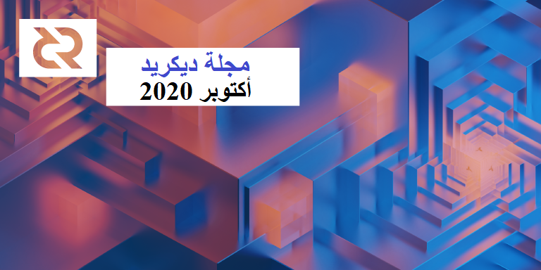

# صحيفة ديكريد لشهر أكتوبر 2020

_الصورة: إعادة الهيكلة 1 بواسطة saender@_

الأحداث البارزة لشهر أكتوبر:

* تم إصدار مرشحي إصدار للنسخة 1.6.0، و سيتم إصدار مرشح الإصدار الثالث قريبًا بعد إدخال الإصلاحات و التحسينات وبعد إختبار المجتمع له.
* رافق الإصدار الأولي لمنتج dcrdex القابل للتطبيق على الشبكة الرئيسية أول مرشح لإطلاق الإصدار 1.6.0. وأصبح بإمكان مستخدمي واجهة خط الأوامر CLI الآن إضافة dcrdex إلى التثبيت من خلال إضافة نِقرَة إضافية إلى أمر التثبيت.
* تحول الآن انتباه العديد من أفراد المجتمع إلى الاستفادة القصوى من إصدار 1.6 عند خروجه، تحقق من قسم الانتشار لمعرفة ما يخططون له.
* احتفلت بوليتيا بسنتين من الإنتاج، تهانينا للأشخاص الذين يقفون وراء المقترحات السبعة و أربعون المعتمدة وأصحاب الحصص الذين صوتوا لصالحهم.

## الإصدار الأولي ل DCRDEX

بعد مرور أكثر من عام بقليل على الموافقة على [طلب تقديم مقترح](https://proposals.decred.org/proposals/5431da8) ومقترح [التطوير](https://proposals.decred.org/proposals/417607a) على بوليتيا، بات بوسع مستخدمي ديكريد التداول بين DCR و BTC من دون المخاطرة بأموالهم ومعلوماتهم الشخصية من خلال منصات المُبادلات الاحتجازية.

أعقب أول [إصدار](https://github.com/decred/dcrdex/releases/tag/release-v0.1.0) منتج قابل للتطبيق بحد أدنى إصدار تصحيح [v0.1.1](https://github.com/decred/dcrdex/releases/tag/release-v0.1.1) سريع وهو الأحدث حاليا. 

تفضل بزيارة الموقع [dex.decred.org](https://dex.decred.org/) لبدء الاستخدام، أو اتبع [الدليل](https://www.publish0x.com/block-commons/how-to-get-on-dcrdex-mvp-xolpzmv) بواسطة richardred@، أو شاهده أثناء العمل في مقطع [الفيديو](https://twitter.com/Decred_News/status/1320184172749721600). يمكن الاطلاع على أحدث دفتر للطلبات في لوحة معلومات [السوق](https://explorer.dcrdata.org/market) في dcrdata، مع المزيد من البيانات العامة للمتابعة.

> أريد أن أشكر جميع مختبرينا السابقين على تعليقاتكم وصبركم بينما نمضي قدمًا في هذا المشروع. لقد قمنا بمراعاة الكثير من التعليقات التقييمية، وحللنا عددًا من مشاكل واجهة المستخدم/تجربة المستخدم، وقمنا بإصلاح بعض الأخطاء التي ظهرت في سيناريوهات استرداد المطابقة. ([chappjc@](https://matrix.to/#/!mlRZqBtfWHrcmgdTWB:decred.org/$AQsNUyN7WWfYR6IhOgtGckBAecXP5ASXCYKFBpNWrcM))

تهانينا للجميع لإطلاق الإصدار!

## مرشحات الإصدار للنسخة 1.6

يمكن إجراء الاختبارات [هنا](https://github.com/decred/decred-binaries/releases) على مرشحات الإصدار ل dcrd و dcrwallet و Decrediton و dcrlnd. يرجى الأخذ في الاعتبار أنه على الرغم من وجود الميزات الرئيسية والتي تعمل في ديكريديتون، إلا أنه سوف يتم توفير عدد من التحسينات على واجهة المستخدم وإصلاحات الأخطاء في مرشح الإصدار الثالث.

كما هو الحال دائمًا، [تحقق من الثنائيات](https://docs.decred.org/advanced/verifying-binaries/) قبل تشغيلها.

الإصدار 1.6 سيكون واحدا من أكبر إصدارات ديكريد من أي وقت مضى. إذا كنت ترغب في المساعدة في الإنتشار، فيرجى التحقق من هذا [القسم](https://xaur.github.io/decred-news/journal/202010.html#outreach) أدناه.

## التطوير

ما لم يُذكر خلاف ذلك، فإن العمل المَذْكُور هنا يشتمل على حالة "الدمج إلى الرئيسي”. وهذا يعني أن العمل قد تم استكماله ومراجعته ودمجه في كود المصدر الذي يمكن للمستخدمين المتقدمين بناءه وتشغيله، ولكنه ليس متاحًا بعد في ثنائيات الإصدار للمستخدمين العاديين.

**[dcrd](https://github.com/decred/dcrd)**

تم طرح مرشحي الإصدار 1 و 2 للنسخة للإختبار العام. يمكنك قراءة ملاحظات إصدار RC2 والحصول على كود المصدر [هنا](https://github.com/decred/dcrd/releases/tag/release-v1.6.0-rc2). نرحب بتقارير الأخطاء [هنا](https://github.com/decred/dcrd/issues).

العمل المضمن في الإصدار 1.6:

* تم تغيير كود التعدين لتحديد أولويات المعاملات ذات [الرسوم الإجمالية](https://github.com/decred/dcrd/pull/1829) الأعلى بناء على أسلافها في مجمع الذاكرة (المعروفة أيضًا باسم الفرع يدفع للأصْلِ)
* فحص [استنفاد](https://github.com/decred/dcrd/pull/2398) التذاكر لمنع سيناريو نظري عندما يكون مجمع التذاكر منخفض للغاية مع إمكانية أن تصبح السلسلة غير قابلة للاسترداد في حال إضافة كتل معينة
* توليد قالب كتلة محسن للكتل [المرفوضة](https://github.com/decred/dcrd/pull/2397)
* تعديلات وإصلاحات متعددة لقانون الخزينة الجديد
* أداة لإنشاء الشهادات [المعاد كتابتها](https://github.com/decred/dcrd/pull/2425) لدعم المزيد من حالات الاستخدام (مثل عدم تضمين اسم المضيف والواجهة في الشهادة أو تحديد أي من الخوارزميات الأربعة المدعومة)
* تحسين [عُدَّةُ اختبار](https://github.com/decred/dcrd/pull/2329) توليد السلسلة
* [ترحيل](https://github.com/decred/dcrd/pull/2446) قاعدة البيانات الثابتة لدعم التحديث من الإصدار 1.4
* للتحديث من عملاء أقدم حيث أن قاعدة البيانات قديمة جدًا و لا يمكن ترحيلها، أصبحت إعادة تنزيل السلسلة من البداية تدار بشكل [تلقائي](https://github.com/decred/dcrd/pull/2449) بحيث لا تتطلب أي تدخل يدوي من المستخدم

استمر العمل المدمج بعد نقطة التفرع للإصدار 1.6:

* استمرت الملحمة لتغطية [rpcserver](https://github.com/decred/dcrd/issues/2069) مع الاختبارات
* تمت إعادة تنظيم حزمة `mining` لتسهيل الاختبار والملاحة

**[dcrwallet](https://github.com/decred/dcrwallet)**

* السماح لحسابات المحفظة أن تكون [مشفرة](https://github.com/decred/dcrwallet/pull/1823) بشكل فردي ومقفلة، حيث يكون لكل منها عبارة مرور خاصة بها
* أوامر للاستعلام وتعيين [سياسة التصويت](https://github.com/decred/dcrwallet/pull/1897) لمعاملات إنفاق الخزينة التي تم إنشاؤها بواسطة مفاتيح معينة
* أوامر لتعيين سياسة التصويت لمعاملات tspend [الفردية](https://github.com/decred/dcrwallet/pull/1905)
* طلب مصادقة [شهادة TLS](https://github.com/decred/dcrwallet/pull/1867) لعملاء gRPC وإتاحتها لعملاء JSON-RPC. هذه طريقة أكثر أمانًا للبرامج للتواصل مع dcrwallet. وقد تم تحديث مشاريع أخرى لدعم هذا التغيير (ديكريديتون و بوليتيا وdcrlnd وغيرها).
* السماح لعملاء gRPC [بقفل/فتح](https://github.com/decred/dcrwallet/pull/1883) المحفظة مرة واحدة ثم استدعاء المناهج دون [عبارة المرور](https://github.com/decred/dcrwallet/pull/1880)
* التعامل بشكل أفضل مع [الرصيد](https://github.com/decred/dcrwallet/pull/1879) [المنخفض](https://github.com/decred/dcrwallet/pull/1875) عند شراء التذاكر
* تتبع [حالة](https://github.com/decred/dcrwallet/pull/1866) رسوم تذاكر vspd للتعامل مع حالات فشل معالجة رسوم vspd
* إصلاحات متعددة لتحصيص vspd
* إصلاحات لرسائل `getminingstate` و `getinitstate` الجديدة

**[ديكريديتون](https://github.com/decred/decrediton)**

* دعم [أبراج مراقبة](https://github.com/decred/decrediton/pull/2638) الشبكة البرقية
* تحسينات متعددة لواجهة المستخدم/تجربة المستخدم (UX) [لطرق عرض الشبكة البرقية](https://github.com/decred/decrediton/pull/2641)
* [المشتري](https://github.com/decred/decrediton/pull/2577) التلقائي الأولي للتذكرة لـ vspd الجديد
* [شراء](https://github.com/decred/decrediton/pull/2729) التذاكر يدويًا باستخدام vspd الجديد
* الدمج الأولي لشراء التذاكر المقرونة ب [CSPP](https://github.com/decred/decrediton/pull/2773)
* إضافة [إدراج](https://github.com/decred/decrediton/pull/2747) تذاكر vspd
* تم [الترحيل](https://github.com/decred/decrediton/pull/2705) من [trezor.js](https://github.com/trezor/trezor.js) المهملة إلى [Trezor Connect API](https://github.com/trezor/connect)
* إظهار [رمز](https://github.com/decred/decrediton/pull/2666) وضع SPV على الشريط الجانبي
* عرض [عدد النظراء](https://github.com/decred/decrediton/pull/2685) على الشريط الجانبي
* علامة تبويب جديدة [لحالة](https://github.com/decred/decrediton/pull/2813) التذكرة
* تذكر [آخر](https://github.com/decred/decrediton/pull/2789) موفر خدمة تصويت تم استخدامه
* تسليط الضوء على كلمات البذرة التي ليست في محلها في عرض [إدخال البذرة](https://github.com/decred/decrediton/pull/2683)
* تحديث الترجمة [البرتغالية](https://github.com/decred/decrediton/pull/2782)
* استمرار إعادة هيكلة المكونات الوظيفية ووحدات CSS
* ما يقارب 60 إصلاحًا للأخطاء

قيد التطوير:

* إضافة دعم [تحصيص](https://github.com/decred/decrediton/issues/2681) ل Trezor. نظرًا لأن [التغييرات](https://github.com/trezor/trezor-firmware/pull/1249) المطلوبة في برنامج Trezor الثابت قد تستغرق وقتًا طويلاً ليتم دمجها في المراحل الأولى، فقد [قرر](https://github.com/decred/decrediton/issues/2681#issuecomment-714265711) مطورو ديكريد تجربة البرامج الثابتة المخصصة الخاصة بنا.
* التشغيل الآلي [لإختبار](https://github.com/decred/decrediton/pull/2659) واجهة المستخدم

**[بوليتيا](https://github.com/decred/politeia)**

* تضمين [صور](https://github.com/decred/politeiagui/pull/2158) Markdown
* إصلاحات الأخطاء وتعديلات واجهة المستخدم لـبوليتيا و نظام إدارة المتعاقد CMS

قيد التطوير:

* التشغيل الآلي [لإختبار واجهة المستخدم](https://github.com/decred/politeiagui/pull/2151)

تحديث على ترحيل خلفية tlog:

> لدينا مثيل شبكة الإختبار وما زلنا في طور اختبار كل شيء وإصلاح الأخطاء. كما يجري العمل على طرق إثبات عدم التضمين وتغطية الاختبار. (lukebp@)

**[vspd](https://github.com/decred/vspd)**

- تحسينات وإصلاحات الأخطاء

**[dcrpool](https://github.com/decred/dcrpool)**

* دعم تحديث الخزينة [DCP-6](https://github.com/decred/dcrpool/pull/252)
* سيتم مصادرة المدفوعات [الصغيرة جدًا](https://github.com/decred/dcrpool/pull/254) للمشاركين في التَجَمّع كرسوم للتَجَمّع. أحد أسباب ذلك هو أن المدفوعات الصغيرة جدًا ستفشل في معاملة الدفع على أي حال. وهناك سبب آخر يتمثل في أنها تعمل كحافز للمساهمة بموارد كافية في التَجَمّع للحصول على تعويضات عادية عندما تعدن كتلة وتثبط المساهمة في العمل المتقطع وغير المنتظم.
* تم بذل الكثير من العمل لدعم [Postgres](https://github.com/decred/dcrpool/issues/257) كخلفية لقاعدة البيانات
* عرض مدفوعات [رسوم التَجَمّع](https://github.com/decred/dcrpool/pull/249) المعلقة والمؤرشفة على صفحة المشرف
* إعادة هيكلة كود [الدفع للمكافأة](https://github.com/decred/dcrpool/pull/250)
* العديد من التحسينات لاختبار الكود

**[dcrlnd](https://github.com/decred/dcrlnd)**

* تم التحديث إلى [النسخة 0.11.1](https://github.com/decred/dcrlnd/pull/103) لكود lnd عن طريق نقل المئات من التزامات المرحلة الأولية. لتشعر بحجم عمل النقل، يمكنك التحقق من [قائمة](https://github.com/decred/dcrlnd/blob/master/docs/upstream-prs.csv) التغييرات الأولية التي تمت معالجتها.
* تم التحديث إلى أحدث نسخة ل dcrd وdcrwallet

تقوم dcrlnd بإعداد الإصدار 0.3.0 ليتم إصداره مع الإصدار الكبير 1.6 من البرامج الأساسية (dcrd و dcrwallet وDecrediton). ملاحظات الإصدار [هنا](https://github.com/decred/dcrlnd/blob/master/docs/release-notes/release-notes-0.3.0.md).

**[dcrdex](https://github.com/decred/dcrdex)**

تم دمج معظم الأعمال التي تم دمجها في أكتوبر في الإصدار الأولي [v0.1.0](https://github.com/decred/dcrdex/releases/tag/release-v0.1.0) وإصدارات المتابعة [v0.1.1](https://github.com/decred/dcrdex/releases/tag/release-v0.1.1).

* تنفيذ عقود [SegWit](https://github.com/decred/dcrdex/pull/741) الاختيارية لمقايضة BTC (توفر ~30٪ في رسوم المعاملات)
* إنشاء عناوين [إيداع](https://github.com/decred/dcrdex/pull/769) جديدة
* دعم عميل [Tor](https://github.com/decred/dcrdex/pull/738)
* تكديس [العديد](https://github.com/decred/dcrdex/pull/710) من الإشعارات وإبقائها مرئية لمدة 4 ثوانٍ تقريبًا + مجموعة من تحسينات واجهة مستخدم [الإشعارات](https://github.com/decred/dcrdex/pull/744) الأخرى
* وظيفة [تعليق/استئناف](https://github.com/decred/dcrdex/pull/705) السوق
* حل [حالة المطابقة](https://github.com/decred/dcrdex/pull/704) عند بدء التشغيل
* التغييرات على [نظام](https://github.com/decred/dcrdex/pull/700) تتبع الانتهاكات والعقوبات _(معلومات بسيطة: هل تعلم أن dcrdex به وضع `--anarchy`؟)_
* إضافة تنفيذ [الحدود](https://github.com/decred/dcrdex/pull/750) على كمية الطلبات التي قد يضعها المستخدم
* التحقق من أنه [لا يتم إنفاق](https://github.com/decred/dcrdex/pull/732) العملات التي تمول الطلبات الفارغة
* السماح للعملاء غير المتصلين [بمهلة](https://github.com/decred/dcrdex/pull/725) لإعادة الاتصال قبل إلغاء حجز طلباتهم (إلغاء)
* [حد](https://github.com/decred/dcrdex/pull/754) نقل البيانات للعملاء حتى يقوموا بتسجيل الدخول
* [تعليمات](https://github.com/decred/dcrdex/pull/764) الشبكة الرئيسية في README
* العديد من إصلاحات الأخطاء

تم دمج إجمالي 48 طلب سحب من 7 مساهمين، مع إضافة 11 ألف وحذف 5 ألف سطر من الكود.

قيد التطوير:

* [دعم](https://github.com/decred/dcrdex/pull/788) محفظة DCR SPV
* نقطة نهاية [لبيانات API](https://github.com/decred/dcrdex/pull/796) للسوق من أجل الإستهلاك العام

**[dcrandroid](https://github.com/planetdecred/dcrandroid)**

* إصلاح خطأ عدم تحديث [الرصيد](https://github.com/planetdecred/dcrandroid/pull/516)

قيد التطوير:

* دعم خصوصية [CSPP](https://github.com/planetdecred/dcrandroid/pull/520)

**[dcrios](https://github.com/planetdecred/dcrios)**

* إصلاح خطأ فقدان [الدقة](https://github.com/planetdecred/dcrios/pull/723) عند تبديل العملات

**[godcr](https://github.com/planetdecred/godcr)**

* التحديث إلى أحدث محفظة dcrlibwallet وإعادة التصميم

قيد التطوير:

* تطبيق [جديد لواجهة المستخدم](https://github.com/planetdecred/godcr/pull/260)

**[dcrdata](https://github.com/decred/dcrdata)**

* تمت [إضافة](https://github.com/decred/dcrdata/pull/1787)  بيانات dex.decred.org إلى لوحة تحكم [الأسواق](https://explorer.dcrdata.org/market) (إضافة دفاتر الطلبات والسعر بداية، وسيتم إضافة حجم التداول تاليًا)

**[dcrros](https://github.com/decred/dcrros)**

* دعم معاملات [الخزينة](https://github.com/decred/dcrros/pull/7) الجديدة في حالة ما تم تمرير DCP-6
* تغيير تنسيق معرّفات المعاملات [المعكوسة](https://github.com/decred/dcrros/pull/8) للتعبير بشكل صحيح عن رفض ديكريد للكتلة وفقًا لشروط Rosetta

**[المستندات](https://github.com/decred/dcrdocs)**

* تم التحديث إلى سِمة [مادة](https://github.com/decred/dcrdocs/pull/1131) MkDocs الأحدث لتحسين تجربة المستخدم للبحث
* تم [تحديث](https://github.com/decred/dcrdocs/pull/1134) صفحة [التعدين بإثبات العمل](https://docs.decred.org/mining/overview/) بإرشادات وقوائم ASICs والمجمعات ذات الصلة

**[dcrdevdocs](https://github.com/decred/dcrdevdocs)**

* تمت [إضافة](https://github.com/decred/dcrdevdocs/pull/89) صفحة حول إصدارات [الإنشاءات القابلة لإعادة الإنتاج](https://devdocs.decred.org/developer-guides/reproducible-builds/)

مسائل أخرى:

* نشر degeri@ [تحديثًا](https://bounty.decred.org/2020/10/status-update/) جديدًا لبرنامج مكافأة العلة
* dcrdevdocs متوفرة الآن على [IPFS و ZeroNet](https://www.reddit.com/r/decred/comments/j7cgzv/devdocs_on_ipfs_zeronet/)، فقط من باب الاحتياط 

## الأشخاص

مرحبا بالمساهمين الجدد مع دمج الكود إلى الماستر: nitronick600@ على ([dcrdocs](https://github.com/decred/dcrdocs/pull/1134))، و GuzmanPintos@ على ([dcrdocs](https://github.com/decred/dcrdocs/pull/1134))!

انظر وسائل الإعلام من أجل 4 مقابلات جديدة مع أعضاء من مجتمع ديكريد.

إحصائيات المجتمع اعتبارًا من 1 نونبر:

* متابعو التويتر: 40,818 (28+)
* المشتركين في ريديت: 9,937 (8+)
* مستخدمي غرفة الدردشة general# على الماتريكس: 222 (25+)
* مستخدمي الديسكورد: 1,432 (36+)
* مستخدمي التيليجرام: 2,394 (40-)
* المشتركين في اليوتيوب: 4,210 (0+)، المشاهدات 159 الف (3+ آلاف)
* متابعي لينكد إن: 924 (33+)
* نجوم GitHub dcrd: بلغت 566 (3+)، التفرعات: 246 (2-)

## الإدارة و الحوكمة

تلقت [الخزينة](https://explorer.dcrdata.org/address/Dcur2mcGjmENx4DhNqDctW5wJCVyT3Qeqkx) في شهر أكتوبر 12,388 DCR وأنفقت 14,748 DCR. وباستخدام معدل المتوسط اليومي لشهر أكتوبر ب DCR/USD والذي يقدر ب 12.01 دولارًا، ستكون الخزينة قد تلقت 149 ألف دولارا وأنفقت 177 ألف دولارا. ووفقًا لمتوسط السعر اليومي في شتنبر البالغ 13.26 دولارًا، فإن قيمة الفَوترة بالدولار الأميركي عن العمل المنجز في ذلك الشهر تكون قد بلغت 196 ألف دولار. واعتبارا من 4 نونبر، بلغ رصيد الخزينة 638,044 DCR (أي 7.9 مليون دولار أمريكي بسعر 12.38 دولار أمريكي).

تم التصويت على الاقتراحات المرشحة الخاصة باقتراح طلب تقديم مقترح لتغيير الرسائل على decred.org (تمت الموافقة عليها في شتنبر)، ولكن لم يتم الموافقة على أي من هذه المقترحات. وكانت النتائج كما يلي:

* [D.R.E.A.M.](https://proposals.decred.org/proposals/4532397) - بلغت نسبة الموافقة 48٪ ونسبة المشاركة 29٪ (_تجاهل تشاد في ديكريد الرفض واستمر على أية حال، لأنه تشاد_)
* شعار ["Money Evolved"](https://proposals.decred.org/proposals/02d9fc2) مع تغييرات طفيفة على الموقع - بلغت نسبة الموافقة 25٪ ونسبة المشاركة 25٪
* ديكريد - بناء [بنية تحتية](https://proposals.decred.org/proposals/d6ff458) ثورية - بلغت نسبة الموافقة 16٪ ، ونسبة المشاركة 18٪
* شعار "Money Evolved" - بالإضافة إلى خانة ["Fair"](https://proposals.decred.org/proposals/f0a00d5) وصفحة تمت إضافتها إلى الموقع - بلغت نسبة الموافقة 7٪ ، ونسبة المشاركة 17٪

تم تقديم [اقتراح](https://proposals.decred.org/proposals/c093b8a) ترجمة المحتوى والأصول من قبل kozel@ في أكتوبر وتمت الموافقة عليه في أوائل نونبر بنسبة موافقة بلغت 75٪ و نسبة مشاركة بلغت 28٪. 

سيغطي هذا الاقتراح ترجمة المنشورات وأصول ديكريد إلى 6-8 لغات، بميزانية أقصاها 33,000 دولار لتغطية 6 أشهر من العمل. هذا المقترح مزود بمتعاقدين لديهم [تاريخ](https://github.com/decredcommunity/translations/blob/master/index.md) في تسليم ترجمات محتوى ديكريد.

يضم العددين [37](https://blockcommons.red/politeia-digest/issue037/) و [38](https://blockcommons.red/politeia-digest/issue038/) لمجلة موجز بوليتيا مزيدا من التفاصيل حول مقترحات هذا الشهر.

تم [الإعلان](https://twitter.com/ParisSmithson/status/1318278630208901126) عن اقتراح مسبق من Paris Smithson لموقع WhyDecred.com على التويتر، وتمت مناقشته على [الريديت](https://www.reddit.com/r/decred/comments/jkmhbv/whydecredcom_proposal_open_talk/)، وأخيراً وصل إلى [بوليتيا](https://proposals.decred.org/proposals/8a09324) في أوائل نونبر.

نشر richardred@ [تقريرا](https://blockcommons.red/publication/politeia-at-2/) عن نشاط بوليتيا للسنة الثانية من عملها. بعض النقاط البارزة:

* تم نشر 46 مقترحاً، تمت الموافقة على 21 منها، و رفض 17، وتم التخلي عن 6 اقتراحات
* فشلت ثلاث مقترحات في الوصول إلى النصاب القانوني (لم يحدث في السنة الأولى)
* بلغ متوسط نسبة المشاركة (المتوسط) 27.9٪ بانخفاض 3,3% عن العام الأول
* بلغ متوسط الموافقة على المقترحات التي تم تمريرها 79٪، بانخفاض عن 86٪ في العام الأول
* كان هناك المزيد من مقترحات التسويق مقارنة بالعام الأول
* جاءت 48% من المقترحات من المتعاقدين (بعد أن كانت النسبة 35% في العام الأول)، ومن المرجح أن تتم الموافقة على هذه المقترحات
* كانت 10 من المقترحات في العام الثاني تطالب بتجديد التمويل، وكان معدل نجاح هذه المقترحات 80%
* كانت المقترحات ذات الأجر عن الساعة أكثر ميلاً إلى النجاح من ذات التكلفة الثابتة

## الشبكة

معدل الهاش: افتتحت معدلات [الهاش](https://explorer.dcrdata.org/charts?chart=hashrate&zoom=kfoi5rmw-kgziese8&scale=linear&bin=block&axis=time) في شهر أكتوبر على ~450 Ph/s وأغلقت على ~225 Ph/s، وبلغ قاعها عند 185 Ph/s كما بلغت ذروتها عند 551 Ph/s على مدار الشهر. [توزيع](https://miningpoolstats.stream/decred) معدلات الهاش للتجمع اعتبارا من 1 أكتوبر:

* Poolin بنسبة 37%،
* UUPool بنسبة 37%،
* lab.antpool.com بنسبة 13%،
* Huobipool بنسبة 9%،
* F2Pool بنسبة 1.2%،
* BTC.com بنسبة 1%،
* easy2mine بنسبة 0.9%،
* Luxor بنسبة 0.6%،
Coinmine بنسبة 0.02%

في 25 أكتوبر، انخفض معدل التجزئة إلى 260 واستمر بالنزول إلى أن وصل إلى 185 Ph/s في 28 أكتوبر. وقد بدأ بالتعافي السريع في الأيام الأولى من نونبر.

التحصيص: بلغ متوسط سعر التذكرة [لمدة 30 يوما](https://dcrstats.com/) 151.7 DCR (بزيادة 3.1). وتفاوت [السعر](https://explorer.dcrdata.org/charts?chart=ticket-price&zoom=kfoi5rmw-kgziese8&bin=window&axis=time&visibility=true-false&mode=stepped) ما بين 139.2 و 168.3 DCR. وقد بلغ [المبلغ المقفل](https://explorer.dcrdata.org/charts?chart=ticket-pool-value&zoom=kfoi5rmw-kgziese8&bin=block&axis=time) 6.02-6.12 مليون DCR، وهو ما يعادل 49.58-50.87% من العرض المتاح [المشارك](https://explorer.dcrdata.org/charts?chart=stake-participation&zoom=kfoi5rmw-kgziese8&bin=block&axis=time) في إثبات الحصة.

بلغ سعر التذكرة 168.28 DCR، وهو ارتفاع جديد منذ تغيير خوارزمية السعر في عام 2017.

العقد: طوال شهر [أكتوبر](https://charts.dcr.farm/d/000000014/nodes?orgId=1&from=1601510400000&to=1604188800000)، كان هناك ما متوسطه 104 عقد استماع عام و 150 عقدة إجمالية حسب dcr.farm. تم توزيع الإصدارات في شهر أكتوبر، في المتوسط، على النحو التالي: 30% يشغلون dcrd النسخة 1.5.2، و 23% dcrd النسخة 1.5.1، 8% يشغلون dcrd نسخة بناء التطوير 1.6، و %6 يشغلون dcrd النسخة 1.5.0، 3% يستخدمون dcrd النسخة 1.5 نسخة التطوير وبناء إصدارات الترشيح، 2.7% يشغلون dcrd النسخة 1.7 لبناءَات التطوير، 0.7% يشغلون dcrd النسخة 1.4، و12%% يشغلون dcrwallet النسخة 1.5.1 و 1.4%  يشغلون dcrwallet النسخة 1.5 و 0.8%يشغلون dcrwallet النسخة 1.4 و 12% يشغلون أخرى.

ساهم PermabullNino@ في النتائج التي توصل إليها مؤخرًا على السلسلة (نبض التعدين، تدفقات التذاكر، تدفقات الخزينة) في [العدد 41](https://ournetwork.substack.com/p/our-network-issue-41) من مجلة Our Network.

## الإنضمام

[stakey.net](https://stakey.net/) هو أول موفر خدمة التصويت على الشبكة الرئيسية يقوم بتشغيل برنامج vspd الجديد. وحتى 11 نونبر [صوتت](https://stakey.net/vspd-stats/) 13 تذكرة وكانت هناك 40 تذكرة حية.

> تم التحقق من أول عملية شراء خاصة لتذاكرنا باستخدام مزود خدمة التصويت عبر السلسلة. تم شراؤها دون إستعمال حساب، باستخدام أموال مختلطة بواسطة ++CoinShuffle عبر خدمة Tor onion. تقبل ما أخبرك به، إنها الخصوصية! ([stakeynet@](https://twitter.com/stakeynet) على التويتر)

تحذير: ليس لدى مؤلفي مجلة ديكريد أي فكرة عن مصداقية أي من الخدمات المذكورة أعلاه. يرجى إجراء البحوث الخاصة بك قبل الوثوق بمعلوماتك الشخصية أو الأصول إلى أي كيان.

## الانتشار

يدعو Checkmate@ أصحاب حصص ديكريد للتحضير لإصدار Hidden Hydra المعروفة أيضا بالنسخة 1.6 لديكريد. وقد جمعت المناقشات في المخططات المستقبلية ليومي الجمعة [16](https://www.reddit.com/r/decred/comments/jc6qjq/forward_thinking_friday_160_time_to_shine_16/) و[23](https://www.reddit.com/r/decred/comments/jgzs57/forward_thinking_friday_23_october_2020_the/) أكتوبر، ودعوة أخرى [للتنظيم](https://www.reddit.com/r/decred/comments/ji9gm4/calling_all_stakeholders_prepare_to_release_the/)، عشرات الأفكار حول ما يمكن فعله لنشر الكلمة حول النسخة 1.6 لديكريد و منصة المُبادلات اللامركزية لديكريد DCRDEX. ويتم [هنا](https://github.com/decredcommunity/outreach/pull/12) تجميع ورقة الملاحظات التي تضم كل ما يحتاجه داعم ديكريد (المساعدة مرحب بها).

نشرت ديكريد أمريكا اللاتينية [التقرير الرابع](https://github.com/decredcommunity/proposals/blob/master/proposals/3c02b67/updates/20201012.md) لمقترحهم الثاني الذي يسرد جميع الفعاليات البارزة والوجود الإعلامي وتطوير الأعمال والشؤون المالية. ومن بين الاستراتيجيات الجديرة بالذكر التي يجري استكشافها توسيع نطاق تواصل المطورين باللغة الإسبانية:

* تم إصدار 4 حلقات من Código Decred منذ يوليوز: مقدمة إلى [Git و GitHub](https://www.youtube.com/watch?v=RFX0P9MKLKg)، استكشاف ديكريد بلغة [البايثون](https://www.youtube.com/watch?v=FGhklclRNt0)، [التحقق](https://www.youtube.com/watch?v=U3BwnmmF1Ro) من ثنائيات ديكريد، و[محفظة DCR](https://www.youtube.com/watch?v=S2SeVZqnO9A)
* عقد مقدمة إلى ورشة عمل سلسلة الكتل و [dcrdata](https://www.youtube.com/watch?v=XSmdwWykmSo) في أكتوبر
* تضم قناة [decredES_devs@](https://t.me/decredES_devs)  الجديدة على التيليجرام أكثر من 70 مستخدم حتى وقت الكتابة

تم فتح [تحدي](https://www.talentland.talent-republic.tv/challenge/blockchain-learning-challenge-decred/) طويل الأمد لتعلم وتطوير سلسلة الكتل من قبل ديكريد أمريكا اللاتينية للتسجيل في أكتوبر وسيستمر حتى 9 دجنبر. سيحضر المشاركون في المرحلة الأولى ورش عمل للتعرف على البتكوين و سلسلة الكتل و المنظمات المستقلة اللامركزية DAO والحوكمة و dcrdata API وما إلى ذلك. في المرحلة الثانية ، سيحتاجون إلى إنشاء مشروع أصلي باستخدام بيانات سلسلة الكتل العامة لديكريد، وإصداره بترخيص ISC وتقديمه في عرض فيديو مدته 3 دقائق. ستتم جميع الاتصالات والتوجيه والدعم في قناة decredES\_devs@ على التيليجرام. سيحصل 3 فائزين على 1,500 دولار و 700 دولار و 300 دولار في DCR. تم تسجيل أكثر من 90 شخصًا من أكثر من 8 دول في أمريكا اللاتينية حتى الآن.

نشر michae2xl@ [تقريرا](https://github.com/decredcommunity/proposals/blob/master/proposals/bc20f98/updates/20201102.md) عن أنشطته في أكتوبر لاقتراح التسويق في البرازيل.

أعلن pavel@ عن إطلاق [حملة](https://www.reddit.com/r/decred/comments/jhb5do/withdecred_on_twitter_new_earned_giveaway_campaign/) هدايا جديدة من withDecred.org. وهي تستخدم مزيجاً ذكياً من أكواد الإستجابة السريعة QR وتويتر لزيادة التفاعل ونشر الرسالة في الوقت نفسه.

يحتوي موقع الويب الجديد [WhyDecred.com](https://whydecred.com/) من Paris Smithson على نسخة مسودة [للمناقشة](https://www.reddit.com/r/decred/comments/jkmhbv/whydecredcom_proposal_open_talk/) والتعليق. يأخذ هذا المشروع نهج الصورة الكبيرة من خلال شرح جميع المشاكل مع المال لدينا اليوم، ثم شرح كيف تحل ديكريد ذلك. سيتم استخدام العمل الفني عالي الجودة للتواصل. وتجري الآن مناقشة [اقتراح](https://proposals.decred.org/proposals/8a09324) رسمي لتمويل استكمال الموقع.

مشروع [winatoms.com](https://winatoms.com/) الجديد من buck54321@ جاهز للاختبار. يمكن للمستخدمين إنشاء وحل [ألغاز](https://winatoms.com/challenge/TckpZfv9RMCtTkPfFyfGjV7wjfeurpPoky7) بعضهم البعض، والفوز بـ DCR إذا كان الحل المقدم صحيحًا. يعمل حاليًا فقط على شبكة الإختبار لديكريد وحالة المشروع الحالية هي "نموذج أولي للمناقشة". قم بمتابعة [winatoms@](https://twitter.com/winatoms)  على تويتر للحصول على التحديثات.

إنجازات Monde PR لشهر أكتوبر:

* تم إنشاء/عرض أفكار قصتين للتمويل ومنشورات العملات الرقمية بما في ذلك إعلان DCRDEX
* الرد على 4 طلبات للتعليق
* حصل على 4 مقابلات إعلامية

التغطية الإخبارية المؤمنة بواسطة Monde PR:

* تمت تغطية إعلان DCRDEX بواسطة [Geek Insider](https://geekinsider.com/decred-announces-launch-of-dcrdex/)، و المجلة الإخبارية ل [Fortune’s The Ledger](https://fortune.com/2020/10/21/digital-banks-feature-product-or-business/)، و [Crowdfund Insider](https://www.crowdfundinsider.com/2020/10/168215-decred-a-security-and-scalability-focused-digital-currency-project-launches-dcrdex-a-non-custodial-exchange/)، و [Bankless Times](https://www.banklesstimes.com/2020/10/21/decred-launches-dcrdex/)، و [Crypto Comes](https://cryptocomes.com/news/decred-dcr-blockchain-veterans-break-into-defi-turf-dex-goes-live)، و [Day Crypto Trading](https://daycryptotrading.com/noticias/dcrdex-exchange-descentralizado-decred/)، و [Crypto Option](https://www.crypto-option.com/decred-announces-the-launch-of-its-first-decentralized-exchange-dcrdex/) و [Crypto Potato](https://cryptopotato.com/decred-announces-dcrdex-decentralized-exchange/)، والتي تم نشرها إلى ثلاث منافذ إخبارية بما في ذلك [CoinMarketCap](https://coinmarketcap.com/headlines/news/decred-announces-dcrdex-decentralized-exchange/) و [Bitcoin Insider](https://www.bitcoininsider.org/article/96269/decred-announces-its-first-zero-fees-decentralized-exchange-dcrdex).
* كما تم توزيع الإعلان عبر [PRweb](http://www.prweb.com/releases/decred_announces_launch_of_dcrdex_first_exchange_with_no_trading_fees_seeks_to_disrupt_billion_dollar_crypto_exchange_market/prweb17487844.htm) الذي تم التقاطه من قبل 99 منفذ إخباري بما في ذلك [MarketWatch](https://www.marketwatch.com/press-release/decred-announces-launch-of-dcrdex---first-exchange-with-no-trading-fees-seeks-to-disrupt-billion-dollar-crypto-exchange-market-2020-10-21) و [Benzinga](https://www.benzinga.com/pressreleases/20/10/n17998254/decred-announces-launch-of-dcrdex-first-exchange-with-no-trading-fees-seeks-to-disrupt-billion-dol). يمكن الاطلاع على قائمة النقابات [هنا](https://drive.google.com/file/d/161nx5O9V8gDWIZ_z6rXyvySpv32OOR9g/view?usp=sharing).
* مقال في [Cointelegraph](https://cointelegraph.com/news/defi-market-fall-showcases-how-rising-tvl-doesn-t-tell-the-full-story) يعرض تعليقًا بقلم richardred@ على سوق DeFi، تم نشره في 21 منفذًا إخباريًا بما في ذلك [Cointelegraph China](https://cointelegraphcn.com/news/defi-market-fall-showcases-how-rising-tvl-doesn-t-tell-the-full-story) و [Cointelegraph Spain](https://es.cointelegraph.com/news/defi-market-fall-showcases-how-rising-tvl-doesn-t-tell-the-full-story)
* مقالات في Cointelegraph إيطاليا و TrendOnline يعرض تعليقا من jy-p@ على البايبال التي تقدم مدفوعات العملات الرقمية

## الفعاليات

الحضور:

* 2 أكتوبر - [Hablemos Decred 15](https://twitter.com/Decred_ES/status/1310685771884625920) - الإنترنت. تحدث elian@ مع الضيف Jose Rodriguez من Bitso و Talent Land حول مستقبل التمويل اللامركزي والتوكنات غير القابلة للاستبدال واستثمارات المستقبل باستخدام تقنية سلسلة الكتل. ([الفيديو](https://www.youtube.com/watch?v=wkT01O_mRZk))
* 2 أكتوبر - [ندوة الحوكمة اللامركزية](https://twitter.com/Decred_ES/status/1310961312105672705) - الإنترنت. مثل elian@ مشروع ديكريد في ندوة مع Crypto Resources Academy و Kleros و Maker DAO. وقد دار النقاش حول أهمية ومستقبل الحوكمة اللامركزية والعملات الرقمية. ([الفيديو](https://twitter.com/Decred_ES/status/1312150389160988673))
* 8 أكتوبر — [بث مباشر على موقع Instagram من قبل Criptolugares](https://twitter.com/Decred_ES/status/1313869491160444929) — الإنترنت. تحدث elian@ مع Jose Manuel da Silva من Criptolugares لشرح نموذج الحوكمة في ديكريد، وبوليتيا، وكيفية البدء في المساهمة في المشروع. ([الفيديو](https://www.instagram.com/p/CGGZc5Gntil/))
* 9 أكتوبر - [Hablemos Decred 16](https://twitter.com/Decred_ES/status/1313526622927171585) - الإنترنت. تحدث elian@ والضيوف Anibal Cripto (مستشار تمويل العملات الرقمية) و Ezio Rojas (رئيس الأخبار في Cointelegraph en Español) حول العملات الرقمية في فنزويلا وتحديات التبني ومستقبل النقود. ([الفيديو](https://www.youtube.com/watch?v=xxNFxZJuOwA))
* 16 أكتوبر - [Hablemos Decred 17](https://es.cointelegraph.com/news/21-heads-crypto-art-show-they-will-analyze-the-intersection-between-art-and-cryptocurrencies) - مدينة مكسيكو، المكسيك. كانت الفعالية عبارة عن تقديم "21 Heads Crypto Art Show" في Bitcoin Embassy. وقد دارت الندوة حول العملات الرقمية وفن الدور المحتمل للتوكنات غير القابلة للاستبدال. ([الفيديو](https://www.youtube.com/watch?v=b89-CTM0bYk))
* 17 أكتوبر - [مقدمة إلى واجهة برمجة تطبيق سلسلة كتل ديكريد لـ (dcrdata)](https://www.eventbrite.com/e/open-source-workshop-introduccion-a-blockchain-api-de-decred-dcrdata-tickets-124107662359) - الإنترنت. استضاف pablito@ ورشة عمل حول العمل مع بيانات سلسلة كتل ديكريد. ([الفيديو](https://www.youtube.com/watch?v=XSmdwWykmSo))
* 21 أكتوبر - [CCOSS 2020](https://www.eventbrite.com.mx/e/cumbre-de-contribuidores-de-open-source-software-ccoss-2020-tickets-91491063233) - الإنترنت. CCOSS كانت فعالية إمتدت لمدة لخمسة أيام خاصة بالمصدر المفتوح. قدم adcade@ ديكريد في حديث بعنوان "نموذج المتعاقد المفتوح المصدر في مجال العملات الرقمية". ([الفيديو](https://www.youtube.com/watch?v=TuRAeBmnScQ))
* 23 أكتوبر - [Hablemos Decred 18](https://es.cointelegraph.com/news/what-new-launches-are-planned-by-the-decred-ecosystem)  - الإنترنت. اِسْتَعْرَض adcade@ و elian@ جميع التفاصيل حول المشروع وما سيتم إصداره هذا العام. ([الفيديو](https://www.youtube.com/watch?v=rjfYxi6CXyI))
* 29 أكتوبر - [سلسلة الكتل والعملات الرقمية](https://www.eventbrite.es/e/entradas-blockchain-y-criptomonedas-america-latina-evento-online-124390452191) - الإنترنت. قدم elian@ ميزات ديكريد القادمة في الإصدار 1.6. مُنظّم من قبل Territorio Bitcoin. ([الفيديو](https://www.youtube.com/watch?v=dx8D18jlr9s))
* 29 أكتوبر — [بث مباشر على موقع Instagram في Criptolugares] — الإنترنت. في هذه الحلقة الثانية المباشرة مع Criptolugares اِسْتَعْرَض elian@ آخر تحديثات ديكريد. كما كان هناك هدايا بقيمة 100 دولار أمريكي ب DCR ربحها 10 مشاركين. ([الفيديو](https://www.instagram.com/p/CG8ebPOnQg7/))
* 30 أكتوبر - [Hablemos Decred 19](https://es.cointelegraph.com/news/new-edition-of-hablemos-decred-will-deal-with-cryptomontages-in-mexico) - الإنترنت. شارك Guest Manuel Flores (مؤسس مجتمع Bitcoin Monterrey) رؤيته حول حالات الاستخدام الحقيقي للبتكوين والعملات الرقمية في المكسيك وأمريكا اللاتينية، والتبني والمستقبل حيث تكون العملات الرقمية في قلب الاقتصاد العالمي. ([فيديو](https://www.youtube.com/watch?v=ok9TVEXF8mM))

لاحظ أن فعاليات ديكريد الإسبانية كثيراً ما يتم الإعلان عنها بواسطة [Cointelegraph باللغة الأسبانية](https://es.cointelegraph.com/tags/decred).

الفعاليات القادمة:

* 11-12 دجنبر - [Cripto Latin Fest Online 2020](https://twitter.com/Criptolatinfest/status/1321588347203162112).

## وسائل الإعلام

أصبحت كل من مجلتي [ديكريد](https://www.publish0x.com/decredjournal) و [موجز بوليتيا](https://www.publish0x.com/politeia-digest) و [Block Commons](https://www.publish0x.com/block-commons) متاحة الآن على Publish0x.

مقالات مختارة:

* تعلن ديكريد عن إطلاق DCRDEX - أول منصة مُبادلات لامركزية بدون رسوم تداول تسعى إلى إخلال سوق تبادل العملات الرقمية بمليارات الدولارات بواسطة l1ndseymm@ على ([prweb.com](https://www.prweb.com/releases/decred_announces_launch_of_dcrdex_first_exchange_with_no_trading_fees_seeks_to_disrupt_billion_dollar_crypto_exchange_market/prweb17487844.htm))
* كيف تعلمت التوقف عن القلق وأحب منصة المُبادلات اللامركزية لديكريد DEX بواسطة bochinchero@ على ([publish0x.com](https://www.publish0x.com/bochinchero/how-i-learned-to-stop-worrying-and-love-the-decred-dex-xpjglkw))
* كيف تحصل على الحد الأدنى من المنتج القابل للتطبيق لمنصة المبادلات اللامركزية لديكريد DCRDEX بواسطة richardred@ على ([publish0x.com](https://www.publish0x.com/block-commons/how-to-get-on-dcrdex-xolpzmv))
* السنة الثانية من بوليتيا لديكريد بالأرقام والرسوم البيانية بواسطة richardred@ على ([blockcommons.red](https://blockcommons.red/publication/politeia-at-2/))

أشرطة الفيديو:

* البث المباشر لمنصة المبادلات اللامركزية لديكريد DCRDEX بواسطة karamble@ على ([اليوتيوب](https://www.youtube.com/watch?v=XwGJyRBjdtM))
* تيار DEX بواسطة [GhostWridah](https://twitter.com/GhostWridah) على ([اليوتيوب](https://www.youtube.com/watch?v=hwIzAQqxyt8))
* نشرة الأخبار النصف الشهرية لديكريد - 19 أكتوبر 2020 بواسطة Exitus@ على ([اليوتيوب](https://www.youtube.com/watch?v=ZC65h2sklIQ))
* Staked Podcast 0.0.4 يتحدث عن بوليتيا على ([اليوتيوب](https://www.youtube.com/watch?v=tbL_auhbsE0))
* لماذا تشغيل عقدة كاملة لديكريد؟ بواسطة Decred Society على ([اليوتيوب](https://www.youtube.com/watch?v=JX-HWGJZjoE))
* مقابلة مع Akin Sawyerr (إستراتيجي و رائد ديكريد بإفريقيا) مع Staked Podcast على ([اليوتيوب](https://www.youtube.com/watch?v=dXnA_rZwCTo))
* مقابلة مع Checkmate@ (محلل ReadySetCrypto، المضيف المشارك لبودكاست RoughConsensus@) بواسطة Staked Podcast على ([اليوتيوب](https://www.youtube.com/watch?v=U6Rcmipfuzo))
* لماذا ديكريد؟ دليل المبتدئين ل DCR بواسطة Ternio على ([اليوتيوب](https://www.youtube.com/watch?v=h0jMlrDqxyQ))

الصوتيات:

* الحلقة 11 من Rough Consensus. في هذه الحلقة ، يناقش الرجل العنكبوت وChris Dannen من Iterative Capital العملات المفتوحة المصدر و البتكوين و الديكريد و النظام التمهيدي للعملات الرقمية والمزيد. ([libsyn](https://roughconsensus.libsyn.com/episode-11-open-source-bitcoin-decred-with-chris-dannen))
* الحلقة 32 من ديكريد في العمق: Pavel - التسويق الشعبي + تنمية مجتمع الديكريد ([libsyn](https://decredindepth.libsyn.com/pavel-grassroots-marketing-growing-the-decred-community))

الفن و المتعة:

* النجوم تنتظر [تصويتك](https://twitter.com/coveryfire7777/status/1314866865781592064) بواسطة Exitus@
* [هيدرا](https://twitter.com/real_rouse_/status/1321395402248200193)  المخفية (النسخة 1.6 لديكريد) بواسطة rouse@
* ميمات [Chad](https://www.reddit.com/r/decred/comments/jc6vck/chad_memes/) بواسطة Checkmate@
* تصميم [شعار](https://twitter.com/coveryfire7777/status/1321964399431720962) ديكريد بواسطة الكلمات بواسطة Exitus@
* The Big Long: قصة ديكريد. تصدر قريبًا بواسطة ChadDegenerate@
* ستايكي بالطين: حان وقت الاسترخاء بواسطة richardred@ (18+)

الترجمة:

* تعرف على المبتكرين: كيف يهدف جيك يوكوم بيات من ديكريد إلى إعادة تعريف الحوكمة باستخدام تكنولوجيا سلسلة الكتل - [باللغة الإسبانية](https://medium.com/decred-es/conoce-a-los-disruptores-como-jake-yocom-piat-redefine-la-gobernanza-con-la-tecnolog%C3%ADa-blockchain-d959bb1ac296) بواسطة francov\_@
* كيف تحصل على الحد الأدنى من المنتج القابل للتطبيق لمنصة المبادلات اللامركزية لديكريد DCRDEX - [باللغة الإسبانية](https://medium.com/decred-es/c%C3%B3mo-instalar-y-usar-dcrdex-93c59d96f176) بواسطة pablito@
* حوكمة سلسلة الكتل - [الجزء 1](https://github.com/DecredES/traducciones/blob/master/Gobernanza-blockchain-parte-uno.md) و[الجزء 2](https://github.com/DecredES/traducciones/blob/master/Gobernanza-blockchain-parte-dos.md) باللغة الإسبانية بواسطة francov\_@
*  تمت [ترجمة](https://xaur.github.io/decred-news/) مجلة لشهر شتنبر 2020 إلى العربية بواسطة (arij@ و abdulrahman4@) والصينية بواسطة (Dominic@) والإسبانية بواسطة (francov\_@) والفيتنامية بواسطة (duyenemdo@، مرحبا بعودتك!). شكرا لكم جميعا على نشر الكلمة!

المحتويات الأخرى غير الإنجليزية:

* تم نشر "مشروع الديكريد، رحلة المال اللامركزي" في موقع إخباري عربي شهير للعملات الرقمية [satoshiat.com](https://www.satoshiat.com/2020/09/%D9%85%D8%B4%D8%B1%D9%88%D8%B9-%D8%B9%D9%85%D9%84%D8%A9-decred-%D8%A8%D8%B1%D9%85%D8%B2%D9%87%D8%A7-dcr/). المقالة شاملة تمامًا وتغطي كل شيء بدءًا من أصل وتاريخ ديكريد، وأهمية الحوكمة والإجماع الهجين، إلى آخر التطورات مثل الشبكة الرقمية والخصوصية و منصة المُبادلات الللامركزية.
* كتب rramires@ [دليلاً](https://rramires.medium.com/instala%C3%A7%C3%A3o-e-configura%C3%A7%C3%A3o-da-dcrdex-no-windows-793d78994fde) مفصلاً وسجل مقطع فيديو باللغة البرتغالية حول كيفية إعداد dcrdex على نظام التشغيل ويندوز.

## مناقشات المجتمع:

منشورات مختارة من الريديت:

* تلقى منشور الأحد التشككي ليوم [4 أكتوبر](https://www.reddit.com/r/decred/comments/j56uys/decred_skepticism_sunday_4_october_2020/) 35 تعليقًا
* جمعة التفكير المستقبلي [9 أكتوبر](https://www.reddit.com/r/decred/comments/j8btv5/forward_thinking_friday_9_october_2020_airdrops/) تخيل إسقاط جوي مع ديكريد DCR كضمان

مناقشات مختارة من التويتر:

* [يشرح](https://twitter.com/QuadraQ/status/1317335576048062464) QuadraQ كيف تعمل الديكريد على إصلاح نقاط ضعف البتكوين في خمس خطوات بسيطة
* يلاحظ Jared Tate أن منصة المُبادلات اللامركزية DEX [تغير قواعد اللعبة](https://twitter.com/jaredctate/status/1321293730125651972)
* حصلت مجلة ديكريد على أول ملخص رسمي [لموضوع](https://twitter.com/decredproject/status/1318250359740039169) التغريدة للسعي وراء أي شخص يتجنب قراءة المقال الكامل
* [اكتشف](https://twitter.com/cburniske/status/1317234859899678720) الميزات الرئيسية في الإصدار 1.6 بواسطة cburniske/@Checkmate@: "مجموعة الأموال السيادية الآمنة الكاملة"

## الأسواق

في أكتوبر تم تداول DCR بين 11.17 و 13.84 دولار أمريكي و 0.00085-0.00124. BTC. وكان متوسط ​​السعر اليومي 12.01 دولار.

* أفيد أنه تم تداول ما مجموعه 4 BTC في [26 أكتوبر](https://matrix.to/#/!mlRZqBtfWHrcmgdTWB:decred.org/$vfxOI7g-SkKc1nMIOid39Wm_Lk1OOSx-6TFxLOmkWAI) و 25 BTC في [28 أكتوبر](https://matrix.to/#/!aNnAOHkWUdNcEXRGjJ:decred.org/$BUsJJwTfvakxhAxuvgxYefQBgaJCe3oIaf6iPyDtY30) على منصة المُبادلات اللامركزية لديكريد [dcrdex](https://dex.decred.org/).
* [ارتفعت](https://jochen-hoenicke.de/queue/#0,1y) رسوم البتكوين إلى قيم لم ترى منذ فترة طويلة في نهاية أكتوبر، مما جعل معاملات dcrdex أكثر تكلفة. تم مسح مجمع الذاكرة خلال الأسبوع الأول من شهر نونبر وعادت الرسوم إلى طبيعتها.
* يمكن الاطلاع على دفاتر طلبات dcrdex في لوحة معلومات [السوق](https://explorer.dcrdata.org/market) في dcrdata. سيتبع ذلك حجم البيانات.

## الخارجية ذات الصلة

حدد Mario Laul من Placeholder [عشر أطروحات](https://medium.com/@mariolaul/ten-theses-on-decentralized-network-governance-c1a24a9d59c7) حول الحوكمة اللامركزية للشبكة. يعطي هذا التحلل عالي المستوى للمبادئ الأساسية التي تقود الشبكات طريقة أخرى للنظر إلى ديكريد.

> تعمل الحوكمة الجيدة للشبكة على مواءمة مصالح جميع أصحاب الحصص من خلال نظام مرن بدرجة كافية من الضوابط والتوازنات. إن الحوكمة غير المتوازنة أو عدم القدرة على حل الصراعات بين أصحاب الحصص الرئيسيين من الأسباب التي تؤدي إلى عدم الاستقرار، وهو الأمر الذي يشكل مشكلة خاصة بالنسبة للشبكات التي تتمتع بوضع يسمح لها بالتحول إلى بنية أساسية إدارية مهمة بالنسبة للنظام بالكامل، والتي تتمتع بقاعدة مستخدمين ضخمة للغاية.

قامت IOHK بتوزيع مبلغ 250 ألف دولار من ADA على مشروع Catalyst، والذي سيمول المشاريع المقترحة من قبل المجتمع. ووفقًا [لكوينتيليغراف](https://cointelegraph.com/news/charles-hoskinson-s-treasury-concept-is-about-to-get-its-first-real-world-test-drive-with-project-catalyst)، "Charles Hoskinson هو مؤيد كبير للخزانات اللامركزية، والتي يعتقد أنها واحدة من أعظم الابتكارات في عصرنا".

تم [نشر](https://eprint.iacr.org/2020/1126) ورقة حول المقايضات الذرية بين البتكوين و المونيرو في شتنبر وتم تمويل [اقتراح](https://ccs.getmonero.org/proposals/h4sh3d-atomic-swap-implementation.html) مماثل على نظام التمويل الجماعي المجتمعي التابع لمونيرو ، حيث جمع 2.7 ألف XMR (340 ألف دولار) في 4 أيام فقط. قامت مجموعة أخرى [بتكرار](https://medium.com/comit-network/monero-bitcoin-atomic-swap-1cab015d7af9) البروتوكول لاستخدام النصوص البرمجية 2-of-2 multisig الشائعة في البتكوين.

[علقت](https://www.coindesk.com/okex-suspends-withdrawals) منصة المُبادلات OKEx، ومقرها مالطا، جميع عمليات سحب العملات الرقمية لأن حامل المفتاح يمر بوعكة صحية وهم "يتعاونون حاليا مع مكتب الأمن العام في التحقيقات". كان التعليق لا يزال ساريا بعد أسبوع، على الرغم من تنبيه الحيتان والضجة على وسائل التواصل الاجتماعي حول نقل كبير إلى منصة الباينانس، لكن تبين أن هذا غير صحيح.

[أصدرت](https://www.justice.gov/opa/pr/attorney-general-william-p-barr-announces-publication-cryptocurrency-enforcement-framework) وزارة العدل الأميركية "إطار إنفاذ قوانين العملات الرقمية" الذي يقدم نظرة عامة على فضاء العملات الرقمية واستخداماتها غير المشروعة، والقوانين القائمة، والتحديات والاستراتيجيات الحالية لمعالجتها. وعلى غرار [إرشادات](https://www.fincen.gov/sites/default/files/2019-05/FinCEN%20Guidance%20CVC%20FINAL%20508.pdf) FinCEN من ماي 2019، تعتبر الوثيقة أكثر صلة بخدمات حفظ الأصول.

[أعلنت](https://komodoplatform.com/community-update-on-atomicdex-kyc-aml/) Komodo أنها ستنفذ إجراءات KYC/AML على شبكة السيولة AtomicDEX المدعومة رسميًا من قبل المطورين، على الرغم من أن منصة المبادلات لا تقوم بخدمات حفظ الأصول. ويذكر الإعلان شيئًا آخر يدعو للقلق إلى جانب الإجراء التنظيمي الأخير: "هناك إعادة شراء ومبادلة مقايضة للتوكنات المرتبطة بالتوكنات الشبيهة بالصكوك التي تدعم عمليات AtomicDEX، بما في ذلك الأصول مثل DEX token وأصول SuperNET وأي توكنات تتقاسم العائدات".

[اتهمت](https://www.cftc.gov/PressRoom/PressReleases/8270-20) CFTC مالكي BitMEX بتشغيل منصة تداول غير مسجلة وانتهاك لوائح CFTC، بما في ذلك عدم تطبيق إجراءات مكافحة غسيل الأموال.

أصدرت FinCEN [غرامة](https://www.coindesk.com/fincen-fines-bitcoin-mixing-ceo-60m-in-landmark-crackdown-on-helix-coin-ninja) قدرها 60 مليون دولار لمالك خلاط البتكوين الذي تم القبض عليه في فبراير. كانت الخدمة [تحفظ الأصول](https://cryptobriefing.com/bitcoin-coin-mixers-legal-crosshairs/).

أصدرت Coinbase أول [تقرير](https://blog.coinbase.com/transparency-at-coinbase-c8edf6dce4d6) شفافية لها مع تفصيل لطلبات إنفاذ القانون الواردة في النصف الأول من عام 2020.

[أعلنت](https://www.coindesk.com/paypal-new-york-conditional-bitlicense-paxos-cryptocurrency)  PayPal أنها ستسمح للمستخدمين بشراء BTC و ETH و BCH و LTC من خلال تطبيقها. لن يسمح الإصدار الأولي بعمليات الإيداع أو السحب أو إرسال العملات الرقمية إلى حسابات PayPal الأخرى. الشركة لديها تاريخ من الحسابات المجمدة تعسفيا والدعاوى القضائية المرتبطة بها.

يحذر Dustin Dreifuerst من بودكاست [Did You Know](https://didyouknowcrypto.com/ep26/) من [سيناريو](https://medium.com/@dustindreifuerst/the-coming-bitcoin-war-ff3e96db3aad) يؤدي فيه تدفق الاستثمار المؤسسي إلى تعارض مع المبادئ التي تأسست عليها العملة الرقمية.

قامت Tether [بعكس صفقة](https://cryptobriefing.com/tether-can-freeze-destroy-your-usdt/) بقيمة مليون دولار في شتنبر من قبل مستخدم أرسل الأموال عن طريق الخطأ إلى العقد الذكي لمنصة DeFi Swerve.

تم [اختراق](https://cryptobriefing.com/hackers-drain-defi-protocol-harvest-finance-24-million/) بروتوكول Harvest.finance من DeFi مقابل 24 مليون دولار بقرض سريع تلاعب في سعر العملة المستقرة على منصة Curve’s Y pool.

تم تفويته في الشهر الماضي، [نشر](https://twitter.com/AndreCronjeTech/status/1310763506170499072) Andre Cronje (من مؤسسة YFI) عقوداً لبناء منصة جديدة لممارسة الألعاب تحت إسم "Eminence"، و في غضون ساعات قليلة تم إيداع 15 مليون دولار، ثم أخذها أحد المخترقين. ثم [أعاد](https://www.coindesk.com/eminence-exploit-defi-compensated) المهاجم 8 ملايين دولار إلى عقد ذكي ل YFI تحت سيطرة Cronje، وتم توزيع هذا على ضحايا الاختراق.

شخصية DeFi الشهيرة Blue Kirby لم تعد مشهورة، بعد 3 أشهر من [التقلب السريع](https://thedailygwei.substack.com/p/the-rise-and-fall-of-blue-kirby-the) حيث انتقلوا خلالها من 0 إلى 20,000 متابع على التويتر، وحصلوا على وظيفة مع Yearn يكسبون 7 آلاف دولار شهريًا، وقاموا ببيع 500 ETH بقيمة Kirby NFT، وحصلوا على 25 YFI من Andre Cronje نفسه. بدأت الأمور تسير بشكل خاطئ بالنسبة لـ Kirby عندما شجعوا الأشخاص على تجميع عقود بيتا Eminence التي تم اختراقها، وتفاقمت قليلاً عندما صرفوا أموالهم في YFI وتم استدعاؤهم، ثم كانت هناك حادِثَة مع بعض التوكنات الجديدة ل "Off-Blue" التي كان كيربي يروج لها والتي وجد الناس أنها مشبوهة. يبدو أن شخصًا ما هدد Blue Kirby بنشر معلومات شخصية عنهم، فاختفوا بعدها وحذفوا حساباتهم وغادروا بما يقدر بمليون دولار.

حصلت Uniswap على التصويتين [الأول](https://app.uniswap.org/#/vote/1) و[الثاني](https://app.uniswap.org/#/vote/2) لنظام الحوكمة الجديد القائم على UNI، وكلاهما فشل بموافقة 97-98٪ ولكن نسبة الأصوات بنعم بلغت 3.75٪ -3.96٪ فقط، في حين أن الحد الأدنى للنصاب القانوني للتصويت بنعم هو 4٪ من توكنات UNI. سعى الاقتراح الأول إلى خفض متطلبات تقديم الاقتراح، وفي الوقت الحاضر يجب أن يكون لدى مقدم العرض أو يتم تفويضه بنسبة 1٪ على الأقل من جميع UNI، ولتمرير شرط النصاب القانوني (من 4٪ إلى 3٪). تم إنشاء الاقتراحين الأولين من قبل نفس الجهات الفاعلة، بما في ذلك بروتوكول Dharma و Gauntlet. سعى الاقتراح الثاني إلى تمديد الإنزال الجوي الأولي لمستخدمي Uniswap الذين تفاعلوا مع عقود الوكيل، مع 20٪ تقريبًا من العناوين لتلقي هذه التوكنات من مستخدمي Dharma. أدى ذلك إلى قيام بعض المشاركين [بتأطير](https://gov.uniswap.org/t/urgent-discussion-on-current-vote-reduce-uni-governance-proposal-quorum-thresholds/7117) المقترحات كنوع من محاولة الاستحواذ.

قام GitHub بإزالة مستودع مشروع [youtube-dl](https://github.com/ytdl-org/youtube-dl/) الشهير الذي يسمح بتنزيل ملفات الفيديو من YouTube دون التعامل مع واجهة مستخدم المتصفح. هذا تذكير بما قد يحدث لجميع بيانات GitHub التي لم يتم تخزينها في مستودعات Git، وهو أمر مهم بشكل خاص عند تخزين مناقشات التصميم والقرارات في المواضيع وسحب الطلبات خارج Git.

[تدمج](https://cryptonews.com/news/samsung-adds-anti-money-laundering-features-to-it-crypto-wal-7911.htm) Samsung عمليات فحص AML في هواتفها لجعل الجميع أكثر أمانًا.

نشرت حكومة المملكة المتحدة [بيانًا](https://www.gov.uk/government/publications/international-statement-end-to-end-encryption-and-public-safety)  دوليًا حول التشفير من طرف إلى طرف، اشترك في التوقيع عليه ممثلون من الولايات المتحدة وأستراليا ونيوزيلندا وكندا والهند واليابان ([يظهر](https://www.justice.gov/opa/pr/international-statement-end-end-encryption-and-public-safety) في موقع وزارة العدل). ودعا البيان شركات التكنولوجيا إلى وضع أبواب خلفية من أجل السلامة العامة. نشر فريق Matrix ردًا يشرح السبب في أن المساس بأمن وخصوصية الجميع لمكافحة إساءة استخدام أقلية الفاعلين السيئين هو أمر معيب بشكل أساسي ويقترح تدابير بديلة.

## أرسل قصتك!

إذا كنت تريد ذكر شيء ما، فالرجاء التعليق [هنا](https://github.com/xaur/decred-news/labels/next%20release). يمكن أن تدور القصة حول التطوير والبحث والإنتشار والتجار والخدمات والمحتوى الجديد وأي شيء تراه عادةً في مجلة ديكريد.

## عن هذا العدد

هذا هو العدد 31 من مجلة صحيفة ديكريد. فهرس جميع الإصدارات والمرايا والترجمات متاح [هنا](https://xaur.github.io/decred-news/).

يتم نقل معظم المعلومات الواردة من أطراف ثالثة مباشرة من المصدر بعد التحقق من الحد الأدنى لصحتها. ليس لدى مؤلفي مجلة صحيفة الديكريد القدرة على التحقق من جميع الادعاءات.رجاء إحذر من أعمال الاحتيال وقم ببحثك الخاص.

يمكنك إرسال قصة [هنا] للنظر فيها للإصدار التالي. [التعليقات](https://github.com/xaur/decred-news/blob/docs/contributing.md#feedback) و[المساهمات](https://github.com/xaur/decred-news/blob/docs/contributing.md) مرحب بها دائما

الاعتمادات (بالترتيب الأبجدي):

الكتابة والتحرير: bee وdegeri و elian و l1ndseymm و richardred

المراجعات والتعليقات: arij و bochinchero و buck54321 و davecgh و lukebp

صورة العنوان: saender

النسخة الأصلية لمجلة الديكريد لشهر أكتوبر متوفرة على هذا الرابط [هنا](https://xaur.github.io/decred-news/journal/202010.html)

تمت الترجمة إلى اللغة العربية بواسطة: arij@. قام بالمراجعة abdulrahman4@.
