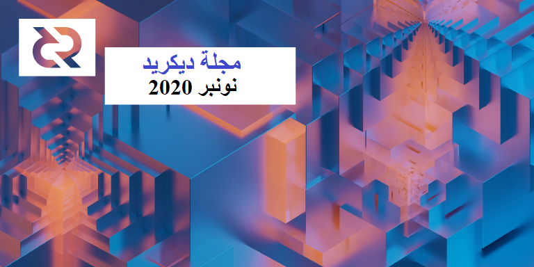

# صحيفة ديكريد لشهر نونبر 2020

_الصورة: إعادة الهيكلة II بواسطة saender@_

أبرز قصص شهر نونبر:

* تم إختبار مرشحات الإصدار للنسخة 1.6 من قبل المجتمع وتلقت العديد من إصلاحات الأخطاء وتحسينات تجربة المستخدم، و قد أصبح من الصعب الآن إيجاد مشاكل، مما يعني إقتراب خروج الإصدار الكامل.
* أصدرت dcrdex إصدار تصحيح مع بعض إصلاحات الحالات الطرفية وطقم من واجهة المستخدم والتحسينات على واجهة المستخدم الخلفية للإصدار التالي.
* تمت الموافقة على تمويل التطوير المستمر لمحافظ الهاتف المحمول ومحفظة سطح المكتب GoDCR الجديدة، كما يشمل تمويل GoDCR أيضًا رعاية مكتبة Gio التي تستخدمها للواجهة.
* يتم تهيئة VSP إلى vspd، قام أربعة موفرين بالتحديث بالفعل لدعم التذاكر الجديدة التي لا تتوفر على حساب والتي يتم خلطها اختياريًا والمقدمة من ديكريديتون في الإصدار 1.6

## مرشح الإصدار 4 للنسخة 1.6

* لدى المرشحات الجديدة الكثير من الأخطاء التي تم إصلاحها في جميع الأجزاء الأربعة للإصدار 1.6 القادم. احصل على أحدث ثنائيات مرشحات الإصدار [هنا](https://github.com/decred/decred-binaries/releases) (انقر فوق `Assets`) وتأكد من [التحقق منها](https://docs.decred.org/advanced/verifying-binaries/).

شكرًا للجميع على المساعدة في اختبار البنيات والاقتراب من الإصدار الملحمي للنسخة 1.6.

## التطوير

ما لم يُذكر خلاف ذلك، فإن العمل المَذْكُور هنا يشتمل على حالة “الدمج إلى الرئيسي”. وهذا يعني أن العمل قد تم استكماله ومراجعته ودمجه في كود المصدر الذي يمكن للمستخدمين المتقدمين بناءه وتشغيله، ولكنه ليس متاحًا بعد في ثنائيات الإصدار للمستخدمين العاديين.

**[dcrd](https://github.com/decred/dcrd)**

تم [تفعيل](https://twitter.com/degeri_crypto/status/1329980732110819331) قواعد إجماع الخزينة اللامركزية على شبكة الإختبار دون مشاكل.

تم الدمج في الفرع الرئيسي (يتم العمل على الإصدار 1.7) وتم نقله إلى فرع الإصدار للنسخة 1.6:

* تم حد تجمع الذاكرة لكيلا تتتبع إحصائيات عدد كبير من المعاملات [السابقة](https://github.com/decred/dcrd/pull/2458) غير المؤكدة. وهذا يحول دون إمكانية وقوع عدد من الهجمات المعقدة ويزيد من سرعة إنشاء قوالب الكتلة للسلاسل الكبيرة من المعاملات غير المؤكدة.
* تصحيح [معالجة حالة](https://github.com/decred/dcrd/pull/2469) تصويت الخزينة في أوامر استدعاء الإجراء البعيد RPC
* إضافة حقول جديدة لإخراج بعض أوامر استدعاء الإجراء البعيد RPC للإشارة إلى مدخلات [treasurybase](https://github.com/decred/dcrd/pull/2470) و[treasuryspend](https://github.com/decred/dcrd/pull/2472) (الأموال القادمة من الخزينة الجديدة) وتحديث المستندات
* تم إصلاح [مشكلة المزامنة](https://github.com/decred/dcrd/pull/2474) البسيطة في كود الخزانة المكتشف على شبكة الإختبار
* تم تغيير المنحنى الافتراضي لإنشاء شهادات RPC إلى P-256 لأن Chromium (المستخدم بواسطة Decrediton) تم [إزالة](https://security.stackexchange.com/questions/100991/why-is-secp521r1-no-longer-supported-in-chrome-others)  الدعم من أجل P-521 أقوى.

المدمجات الأخرى:

* اكتسبت أداة gencerts القدرة على إنشاء شهادات موقعة بواسطة شهادة CA ومفتاح محلي، مما يساعد على تقليل تعقيد التكوين
* إصلاح مشاكل التزامن
* المزيد من الاختبارات لـ [rpcserver](https://github.com/decred/dcrd/issues/2069)
* [تحديث](https://github.com/decred/dcrd/pull/2457) منطق لقاعدة البيانات المعاد تصميمها لإزالة التكرار وجعلها أسرع عند كتابة التحديثات المستقبلية

**[dcrwallet](https://github.com/decred/dcrwallet)**

* استخدام اختيار [عملة عشوائية](https://github.com/decred/dcrwallet/pull/1914) لجميع عمليات الإرسال العادية
* حفظ معاملة [رسوم موفر خدمة التصويت](https://github.com/decred/dcrwallet/pull/1915) غير المنشورة لمنع الإنفاق المزدوج عبر إعادة تشغيل المحفظة
* إرسال المعاملة [الأصلية](https://github.com/decred/dcrwallet/pull/1917) للتذكرة إلى جانب طلب عنوان رسوم موفر خدمة التصويت (لتسجيل التذكرة بشكل أسرع، يجب على موفر خدمة التصويت أن يكون على دراية بالناتج الذي يمول التذكرة، التي تأتي عادة من "المعاملة المقسمة" التي يتم استخراجها في نفس الكتلة ولا تظهر دائمًا على الفور من قبل موفر خدمة التصويت)
* الإستخدام السليم [لتغيير الحساب](https://github.com/decred/dcrwallet/pull/1919) لدفع رسوم موفر خدمة التصويت عند إجراء شراء تذكرة مختلطة، من أجل منع استخدام التغيير غير المختلط في الحساب المختلط (لم يكن هناك تسريب للخصوصية لأن التحصيص المختلط بموفر خدمة التصويت لم يتم إصداره بعد ولم يكن هناك مثل هذه المشكلة في التحصيص الفردي المختلط)
* جعل الحد الأقصى لرسوم موفر خدمة التصويت [قابلة للتكوين](https://github.com/decred/dcrwallet/pull/1933)
* إصلاحات الأخطاء وتحديثات الوثائق

**[Decrediton](https://github.com/decred/decrediton)**

* تحديث [برنامج](https://github.com/decred/decrediton/pull/2932) Trezor الثابت (خطوة نحو دعم التحصيص ب Trezor)
* تمت إعادة صياغة صفحة [الخصوصية](https://github.com/decred/decrediton/pull/2987) من أجل البساطة، بعد [التصميم](https://github.com/decred/decrediton/issues/2965) المحدث
* [صفحة المساعدة](https://github.com/decred/decrediton/pull/2885) التي تقدم ميزات الخصوصية
* إظهار [السجلات](https://github.com/decred/decrediton/pull/2888) على صفحة الخصوصية
* القدرة على السماح بإرسال معاملات من حسابات [غير](https://github.com/decred/decrediton/pull/2909) الحسابات المختلطة
* عرض أداة الترشيح للمعاملات [المختلطة](https://github.com/decred/decrediton/pull/2926)
* تم إصلاح وجهة [التغيير](https://github.com/decred/decrediton/pull/2889) الخاطئة لمحافظ الخصوصية
* [تصفية](https://github.com/decred/decrediton/pull/2854) المقترحات التي أنهت التصويت حسب حالتها إما موافق عليها أو مرفوضة
* عدم السماح [بإغلاق](https://github.com/decred/decrediton/pull/3005) ديكريديتون أثناء تشغيل بعض العمليات
* إلحاق حزمة [AppImage](https://github.com/decred/decrediton/pull/2864) حيث تأتي ديكريديتون كملف واحد قابل للتنفيذ (كأثر جانبي، يتيح ذلك لمستخدمي GNOME تجنب الاضطرار إلى تشغيله عبر سطر الأوامر)
* إزالة الحد [الأقصى للمحافظ](https://github.com/decred/decrediton/pull/2886)
* تحديث الترجمة [الصينية](https://github.com/decred/decrediton/pull/2927)
* إضافة [ترجمات](https://github.com/decred/decrediton/pull/2974) جزئية جديدة لكل من العربية والإيطالية والبولندية
* العديد من تعديلات واجهة المستخدم

تم إصلاح حوالي 60 خطأ في أكتوبر و ~65 في نونبر. تتطلب القائمة المتزايدة لميزات ديكريديتون المزيد من قوة الإختبارات النارية. شكراً جزيلاً لكل المختبرين الذين يساعدون في تحسين ديكريديتون!

قيد التطوير:

* الانتقال إلى [grpc-js](https://github.com/decred/decrediton/pull/2936) لتقليل وقت الإنشاء والحجم الثنائي بشكل كبير
* الاختبارات الآلية لصفحات [البدء](https://github.com/decred/decrediton/pull/2659) و[الإعدادات](https://github.com/decred/decrediton/pull/2957)
* شراء تذكرة [Trezor](https://github.com/decred/decrediton/pull/2869) على شبكة الإختبار

**[بوليتيا](https://github.com/decred/politeia)**

* التحقق من [كود TOTP](https://github.com/decred/politeia/pull/1212) عند تسجيل الدخول (تلك الأكواد المكونة من 6 أرقام للمصادقة ذات عاملين)
* تضمين [الصور](https://github.com/decred/politeiagui/pull/2201) في المستندات
* العديد من [إصلاحات التصميم](https://github.com/decred/politeiagui/pull/2197)
* [الاختبار](https://github.com/decred/politeiagui/pull/2151) الآلي لواجهة المستخدم باستخدام [cypress](https://www.cypress.io/)
* إصلاحات الأخطاء

CMS:

* البنية التحتية لتتبع [إحصائيات نشاط](https://github.com/decred/politeia/pull/1185) GitHub والتي سيتم استخدامها لضمان تطابق تقدم المطورين مع ساعات الفوترة
* إحصائيات الفواتير السابقة ومساهمات GitHub على صفحة الفاتورة لمساعدة المشرفين في المراجعة
* إصلاحات متعددة

قيد التطوير:

* دعم الواجهة الأمامية [لتسجيل الدخول](https://github.com/decred/politeiagui/pull/2127) إلى برنامج TOTP

**[vspd](https://github.com/decred/vspd)**

* عدم رفض التذاكر ذات خيارات التصويت [غير الصالحة](https://github.com/decred/vspd/pull/199) (من المستحسن عدم إيقاف تسجيل التذاكر عندما لا يكون العميل أو الخادم محدثًا، موضح [هنا](https://github.com/decred/vspd/issues/197#issuecomment-739478813))
* قبول [المعاملة الأصلية](https://github.com/decred/vspd/pull/205) الاختيارية في طلب عنوان الرسوم (انظر قسم dcrwallet أعلاه)
* إصلاح الأخطاء وتنظيف الكود

**[dcrpool](https://github.com/decred/dcrpool)**

* اكتمل تنفيذ [Postgres](https://github.com/decred/dcrpool/pull/282). يتم الآن تشغيل جميع اختبارات قاعدة البيانات على كل من Bolt و Postgres. وتسمح قاعدة بيانات BoltDB بنشر مثيل واحد فقط من dcrpool لأنها عبارة عن قاعدة بيانات أساسية/قيمة مضمنة. وبإستخدام Postgres، يمكن نشر مثيلات متعددة من dcrpool على نفس قاعدة بيانات Postgres.
* استخراج حزمة [الأخطاء](https://github.com/decred/dcrpool/pull/284) لدعم استخراج قاعدة البيانات في الحزمة الخاصة بها
* إصلاح الأخطاء وتنظيف الكود

**[dcrlnd](https://github.com/decred/dcrlnd)**

* تمت إضافة [مرفق](https://github.com/decred/dcrlnd/pull/117) [IPC](https://en.wikipedia.org/wiki/Inter-process_communication) للسماح بالعمليات الأصلية (مثل Decrediton) بالتحكم في عملية dcrlnd

تضمن [نقل](https://github.com/decred/dcrlnd/pull/103) التغييرات في أكتوبر من المراحل الأولية ل [0.11.1 lnd](https://github.com/lightningnetwork/lnd/releases/tag/v0.11.1-beta) إصلاح [اثنين](https://lists.linuxfoundation.org/pipermail/lightning-dev/2020-October/002858.html) من [نقاط الضعف](https://lists.linuxfoundation.org/pipermail/lightning-dev/2020-October/002857.html) التي قد تؤدي إلى فقدان الأموال. المزيد من المعلومات الأساسية من المكتشف [هنا](https://lists.linuxfoundation.org/pipermail/lightning-dev/2020-October/002859.html) و[هنا](https://lists.linuxfoundation.org/pipermail/lightning-dev/2020-October/002855.html).

يوصى بالتحديث إلى [العلامة](https://github.com/decred/dcrlnd/tags) الرئيسية الأخيرة أو علامة مرشح الإصدار dcrlnd.

**[dcrdex](https://github.com/decred/dcrdex)**

تم إصدار تصحيح [الإصدار 0.1.3](https://github.com/decred/dcrdex/releases/tag/v0.1.3) لإصلاح مشكلة تعطل العميل المحتملة وبعض المشكلات الأصغر. تتوفر الثنائيات كجزء من [مرشح الإصدار 4 للنسخة 1.6](https://github.com/decred/decred-binaries/releases/tag/v1.6.0-rc4).

مدمج في الفرع الرئيسي:

* [إغلاق المفاتيح](https://github.com/decred/dcrdex/pull/800) على أنماط مربعات الحوار
* يعتمد [التأكيد](https://github.com/decred/dcrdex/pull/805) على صفحة تفاصيل الطلب
* معاملات الاسترداد [المجمعة](https://github.com/decred/dcrdex/pull/797) لتوفير بعض العملات عند رسوم المعاملات
* إعلام مرئي عند [إبطال](https://github.com/decred/dcrdex/pull/798) طلب
* المزيد من الرسوم البيانية [التفاعلية](https://github.com/decred/dcrdex/pull/837) (تمييز الطلبات المتأرجحة على مخطط العمق والمزيد)
* تمت [إزالة](https://github.com/decred/dcrdex/pull/827) TUI _(: أشكال الحياة النهائية، مع سقوط القليل من الدموع :)_
* عدم السماح بالتداول أثناء [مزامنة](https://github.com/decred/dcrdex/pull/785) سلسلة الكتل
* تشغيل تدقيق العقد بشكل [غير متزامن](https://github.com/decred/dcrdex/pull/819) لعدم حظر الرسائل الواردة والأنشطة الأخرى للتداول
* تحسين تسلسل [الاغلاق](https://github.com/decred/dcrdex/pull/787)
* تجنب أخطاء المحفظة [المقفلة](https://github.com/decred/dcrdex/pull/817)
* تحسين استخدام [الذاكرة](https://github.com/decred/dcrdex/pull/794) لدفاتر الطلبات
* قابلية تهييء [حدود المجموعة](https://github.com/decred/dcrdex/pull/815) للمستخدمين الجدد والمستخدمين الذين لديهم سجل مبادلة جيد
* وظائف المشرف لاسترداد [بيانات السوق](https://github.com/decred/dcrdex/pull/771)
* [عدة إختبارات](https://github.com/decred/dcrdex/pull/820) أسرع وأكثر ثراءً
* [تحميل](https://github.com/decred/dcrdex/pull/717) بوت اختبار مع "برامج" قابلة للتخصيص لإجهاد النظام
* [إرساء](https://github.com/decred/dcrdex/pull/836) dexc
* المواصفات [لبروتوكول استدعاء الإجراء البعيد](https://github.com/decred/dcrdex/pull/702) لعميل DEX لمساعدة البرامج الأخرى غير dexctl (مثل Decrediton) على استخدام عميل DEX
* تم إصلاح العديد من الحالات الطرفية

تم [دمج](https://github.com/decred/dcrdex/pulls?q=is%3Apr+merged%3A2020-11-01..2020-11-30+sort%3Aupdated-asc) إجمالي 37 طلب سحب من 6 مساهمين، مع إضافة 7 آلاف وحذف 4 آلاف سطرًا من الكود.

قيد التطوير:

* [الحد الأقصى](https://github.com/decred/dcrdex/pull/842) لتقدير الطلب
* [سمعة](https://github.com/decred/dcrdex/pull/848) المستخدم
* [استئناف](https://github.com/decred/dcrdex/pull/856) المبادلات من قاعدة البيانات
* [نقاط نهاية واجهة برمجة تطبيقات](https://github.com/decred/dcrdex/pull/796) بيانات السوق للسماح للأطراف الخارجية والمواقع الإلكترونية بسحب البيانات من منصة المُبادلات اللامركزية DEX

**[dcrandroid](https://github.com/planetdecred/dcrandroid)**

تم دمجه في مكتبة dcrlibwallet المشتركة:

* القدرة على إرسال [مدخلات مخصصة](https://github.com/planetdecred/dcrlibwallet/pull/165) (لدعم ميزات [التحكم في العملة](https://nopara73.medium.com/coin-control-is-must-learn-if-you-care-about-your-privacy-in-bitcoin-33b9a5f224a2))
* منع أكثر من محفظة واحدة من استخدام [نفس البذرة](https://github.com/planetdecred/dcrlibwallet/pull/138)

قيد التطوير:

* عرض [مقترحات](https://github.com/planetdecred/dcrandroid/pull/503) بوليتيا
* دعم [vspd](https://github.com/planetdecred/dcrlibwallet/pull/163)

**[dcrios](https://github.com/planetdecred/dcrios)**

* الترجمة [الفرنسية](https://github.com/planetdecred/dcrios/pull/726)
* إصلاحات الأخطاء وتعديلات واجهة المستخدم

قيد التطوير:

* [مقترحات](https://github.com/planetdecred/dcrios/pull/715) بوليتيا
* وضع [الخصوصية](https://github.com/planetdecred/dcrios/pull/727)

**[godcr](https://github.com/planetdecred/godcr)**

* [إصلاح شامل لواجهة المستخدم](https://github.com/planetdecred/godcr/pull/262)

قيد التطوير:

* دعم [vspd](https://github.com/planetdecred/godcr/pull/263)
* [مقترحات](https://github.com/planetdecred/godcr/pull/254) بوليتيا

**[dcrdata](https://github.com/decred/dcrdata)**

* إصلاحات الأخطاء لصفحة الأسواق

**[dcrros](https://github.com/decred/dcrros)**

* تم التحديث إلى [النسخة 1.4.5](https://github.com/coinbase/rosetta-specifications/releases/tag/v1.4.5) لمواصفات Rosetta
* تغطية [اختبار الوحدة](https://github.com/decred/dcrros/pull/9) لكل مكالمة خدمة في الجهة الخلفية ومعظم مسارات الكود
* تحسين التعامل مع [الاتصال](https://github.com/decred/dcrros/pull/11) بـ dcrd
* إرجاع [قائمة النظير](https://github.com/decred/dcrros/pull/12)  وحالة المزامنة
* جعل أساليب واجهة برمجة تطبيقات للبناء قابلة للاستخدام في المثيل [غير المتصل](https://github.com/decred/dcrros/pull/13) حسب المواصفات

**[decred.org](https://github.com/decred/dcrweb)**

* تحويل البيانات الصحفية إلى صفحات [منفصلة](https://github.com/decred/dcrweb/pull/931)
* تحديثات المحتوى

مسائل أخرى:

* حصلت أداة [الإصدار](https://github.com/decred/release) على مجموعة من التحديثات لأتمتة المزيد من خطوات عملية الإصدار

## الأشخاص

مرحبا بالمساهمين الجدد مع دمج الكود إلى الماستر: HlloWrld@ على ([dcrweb](https://github.com/decred/dcrweb/commits?author=HlloWrld)).

إحصائيات المجتمع اعتبارًا من 1 دجنبر

* متابعو التويتر: 40,897 (79+)
* المشتركين في ريديت: 9,982 (45+)
* مستخدمي غرفة الدردشة general# على الماتريكس: 253 (31+)
* مستخدمي الديسكورد: 1,501
* مستخدمي التيليجرام: 2,339 (55-)
* المشتركين في اليوتيوب: 4,250 (40+)، المشاهدات 162 الف (3+ آلاف)
* متابعي لينكد إن: 932 (8+)
* نجوم GitHub dcrd: بلغت 567 (1+)، التفرعات: 246 (0+)

## الإدارة و الحوكمة

تلقت [الخزينة](https://explorer.dcrdata.org/address/Dcur2mcGjmENx4DhNqDctW5wJCVyT3Qeqkx) في شهر نونبر 11,975 DCR وأنفقت 13,846 DCR. وباستخدام معدل المتوسط اليومي لشهر نونبر ب DCR/USD والذي يقدر ب 18.19 دولارًا، ستكون الخزينة قد تلقت 218 ألف دولارا وأنفقت 252 ألف دولارا. ووفقًا لمتوسط السعر اليومي في أكتوبر البالغ 12.01 دولارًا، فإن قيمة الفَوترة بالدولار الأميركي عن العمل المنجز في ذلك الشهر تكون قد بلغت 166 ألف دولار. واعتبارا من 4 دجنبر، بلغ رصيد الخزينة 636,385 DCR (أي 16.4 مليون دولار أمريكي بسعر 25.69 دولار أمريكي).

تم نشر 4 مقترحات في أكتوبر، وتمت الموافقة على ثلاث وتم التخلي عن اقتراح واحد.

* طلب [اقتراح](https://proposals.decred.org/proposals/e5c8051) GoDCR من raedah@ ميزانية قدرها 60 ألف دولار لمواصلة تطوير (8 أشهر) محفظة سطح مكتب Go-native باستخدام مكتبة [Gio](https://gioui.org/). يتضمن هذا الاقتراح رعاية قدرها 1,000 دولار شهريًا لـ Gio، والتي أصبح GoDCR مشروعًا رائدًا لها. تمت الموافقة عليه بدعم 92٪ و نسبة مشاركة بلغت 38٪.
* طلب [اقتراح](https://proposals.decred.org/proposals/bc499c9) متعلق بمحافظ الهاتف المحمول من raedah@ بمبلغ 44 ألف دولار أمريكي لمدة 8 أشهر أخرى من العمل على محافظ Android و iOS. تشترك كل من محافظ الهاتف المحمول و GoDCR في مكون [dcrlibwallet](https://github.com/planetdecred/dcrlibwallet)، والذي يسمح لجميع الثلاثة بالوصول إلى الميزات الجديدة المضافة إليه. حصل على موافقة 93٪ تأييد و نسبة مشاركة بلغت 38٪.
* طلب [اقتراح] من joegruff@ لتطوير تطبيق الأندرويد للماسح الضوئي لعنوان الديكريد مبلغ 3,000 دولار أمريكي للعمل الذي تم إنجازه بالفعل (كان التطبيق مفتوح المصدر وفي متجر Google Play لمدة عام) و6,000 دولار أمريكي كحد أقصى للتحديثات الضرورية والميزات الجديدة. وحسب الطلب الشائع في التعليقات [وافق](https://proposals.decred.org/proposals/3943bff/comments/15) Joe على إضافة دعم المرشحات المدمجة لتحسين الخصوصية، وحتى العمل طواعية إذا لزم الأمر (لأنه فات الأوان لتعديل المقترح باستخدام هذه الميزة). كان التصويت متوترًا حيث ظل التأييد [أقل](https://explorer.dcrdata.org/proposal/decred-address-scanner) من 60٪ معظم الوقت، ولكن في النهاية تمت الموافقة على الاقتراح بنسبة 67٪ و نسبة مشركة بلغت 34٪. 
* طلب [اقتراح](https://proposals.decred.org/proposals/8a09324) من paris\_smithson@ لتمويل إنتاج الأعمال الفنية والتسويق لـ [WhyDecred.com](https://www.whydecred.com/) في الأصل 16,800 دولار لتمويل 16 عملًا فنيًا، وتم تعديله لإسقاط الطلب بمقدار 10 آلاف دولار (إلى 6,800 دولار)، قبل أن يتم التخلي عنه في النهاية مع فكرة أن الموقع سيكتمل قبل تقديم اقتراح آخر.

يضم [العدد 39](https://blockcommons.red/politeia-digest/issue039/) من مجلة موجز بوليتيا المزيد من التفاصيل حول مقترحات هذا الشهر.

تم إعادة تنظيم مستودع [decredcommunity/proposals](https://github.com/decredcommunity/proposals) من أجل هيكل متسق. ويحتفظ المستودع حاليا ب52 تحديثًا ل 13 اقتراحا. يرجى إرسال تحديثات لمقترحاتك لأنها تساعد على جمعها في مكان واحد (مقابل البحث عنها عبر المحادثات و الريديت) والحماية من الضياع. _(إستدعي bee@ إذا كنت لا تريد مواجهة GitHub بمفردك)_

## الشبكة

معدل الهاش: افتتحت معدلات [الهاش](https://explorer.dcrdata.org/charts?chart=hashrate&zoom=kgw9asu9-ki79jtll&scale=linear&bin=block&axis=time) في شهر نونبر على ~226 Ph/s وأغلقت على ~293 Ph/s، وبلغ قاعها عند 215 Ph/s كما بلغت ذروتها عند 566 Ph/s على مدار الشهر. [توزيع](https://miningpoolstats.stream/decred) معدلات الهاش للتجمع اعتبارا من 1 دجنبر:

* UUPool بنسبة 44%،
* Poolin بنسبة 35%،
* easy2mine بنسبة 13%،
* Huobipool بنسبة 2.6%،
* Antpool بنسبة 2%،
* F2Pool بنسبة 1.6%،
* BTC.com بنسبة 1.2%،
* Luxor بنسبة 1%،
Coinmine بنسبة 0.02%

التحصيص: بلغ متوسط سعر التذكرة [لمدة 30 يوما](https://dcrstats.com/) 158.66 DCR (بزيادة 6.96). وتفاوت [السعر](https://explorer.dcrdata.org/charts?chart=ticket-price&zoom=kgw9asu9-ki79jtll&bin=window&axis=time&visibility=true-false&mode=stepped) ما بين 139.3 و 188.9 DCR. وقد بلغ [المبلغ المقفل](https://explorer.dcrdata.org/charts?chart=ticket-pool-value&zoom=kgw9asu9-ki79jtll&scale=linear&bin=block&axis=time) 6.09-6.61 مليون DCR، وهو ما يعادل 49.88-53.64% من العرض المتاح [المشارك](https://explorer.dcrdata.org/charts?chart=stake-participation&zoom=kgw9asu9-ki79jtll&scale=linear&bin=block&axis=time) في إثبات الحصة.

بلغ سعر التذكرة مرة أخرى إلى أعلى مستوى له في 188.85 DCR في حين بلغت نسبة المشاركة في التحصيص (وحدات DCR مقفلة في التذاكر) أعلى مستوى لها في كل الأوقات بنسبة 53.6%.

العقد: طوال شهر [نونبر](https://charts.dcr.farm/d/000000014/nodes?orgId=1&from=1604188800000&to=1606780800000)، كان هناك ما متوسطه114 عقد استماع عامة و 166 عقدة إجمالية حسب dcr.farm. تم توزيع الإصدارات في شهر نونبر، في المتوسط، على النحو التالي: 28% يشغلون dcrd النسخة 1.5.2، و 20% dcrd النسخة 1.5.1، 13% يشغلون dcrd نسخة بناء التطوير 1.6، و %5 يشغلون dcrd النسخة 1.5.0، 3.4% يشغلون dcrd النسخة 1.7 لبناءَات التطوير، 3% يستخدمون dcrd النسخة 1.5 نسخة التطوير وبناء مرشحات الإصدار، 1.1% يشغلون dcrd النسخة 1.4، و12% يشغلون dcrwallet النسخة 1.5.1 و 2.5% يشغلون dcrwallet النسخة 1.6 نسخة التطوير وبناء مرشحات الإصدار، و 1.3% يشغلون dcrwallet النسخة 1.5، و 1.3% يشغلون dcrwallet النسخة 1.4 و 9% يشغلون أخرى.

في أخبار أخرى:

* عالجت شبكة الديكريد [500,000](https://twitter.com/decredproject/status/1324674240268898304) كتلة!
* هناك حساب [CoinShuffle_BOT@](https://twitter.com/CoinShuffle_BOT) [جديد](https://twitter.com/CoinShuffle_BOT/status/1324444980308594689) يقوم بالتغريد حول إحصاءات المزج اليومية لـديكريد
* توصلت [دراسة](https://coinmetrics.io/bitcoin-an-unprecedented-experiment-in-fair-distribution/) توزيع الثروة التي أجرتها Coin Metrics إلى أن الديكريد تأتي في المرتبة الثانية بعد البتكوين بواسطة قياس عامل توزيع الشبكة (ملاحظة: تستند NDF إلى العناوين ويمكن التحكم في العديد من العناوين بواسطة الشخص نفسه، المناقشة [هنا](https://www.reddit.com/r/decred/comments/jrsrbk/network_distribution_factor_ndf_btc_has_the/))

## الإنضمام

مرحباً بخدمة [vsp.decredcommunity.org](https://vsp.decredcommunity.org/) الجديدة التي تشغل مثيل الشبكة الرئيسية لبرنامج vspd الجديد. وحتى كتابة هذا التقرير، كانت لديه حوالي 70 تذكرة حية و30 تذكرة مصوتة.

قام الموفرون الحاليون [decredbrasil.com](https://vspd.decredbrasil.com/) و [99split.com](https://vspd.99split.com/) و [stakeminer.com](https://vsp.stakeminer.com/) بإطلاق مثيلات vspd بالإضافة إلى خوادم dcrstakepool الحالية المدرجة في [decred.org/vsp](https://decred.org/vsp/).

حتى كتابة هذا التقرير لدينا ما مجموعه 5 خدمات vspd على الشبكة الرئيسية للاختيار من بينها. شكرا لكم جميعا على دعم طريقة [أكثر خصوصية](https://blog.decred.org/2020/06/02/A-More-Private-Way-to-Stake/) للتحصيص.

يقوم موفر خدمة التصويت لـ [Stakey.net](https://stakey.net/) الآن بنشر تحديثات الحالة والدعم على [Mastodon](https://citadel.stakey.net/@support).

[أعلن](https://twitter.com/staked_us/status/1329173484598124546) Staked إغلاق موفر خدمة التصويت لديكريد لعدم قدرته على الاستمرار من الناحية الاقتصادية. واعتبارًا من 8 دجنبر، لا تزال الديكريد معروضةً على [الموقع] وتظهر صفحة [إحصائيات](https://decred.staked.us/stats) موفر خدمة التصويت 133 مستخدِمًا نشطًا مع إجمالي 308 مستخدِمًا و 31 تذكرة حية.

[أعلنت](https://twitter.com/Hotbit_Korea/status/1331412789416534017) Hotbit Korea أنها ستدرج سوق DCR / KRW في 26 نونبر.

تحذير: ليس لدى مؤلفي مجلة ديكريد أي فكرة عن مصداقية أي من الخدمات المذكورة أعلاه. يرجى إجراء البحوث الخاصة بك قبل الوثوق بمعلوماتك الشخصية أو الأصول إلى أي كيان.

## التبني

تم [استخدام](https://twitter.com/Decred_BR/status/1328848031832215553) dcrtime من قبل VotoLegal لتسجيل التبرعات والختم الزمني لحملة الانتخابات البلدية في البرازيل 2020. ووفقًا لما ذكرته [Geek Insider](https://geekinsider.com/decred-blockchain-for-brazil-municipal-elections/)، تم تعقب أكثر من 24 ألف تبرع بإجمالي أكثر من 600 ألف دولار أمريكي في 19 نونبر. ([المناقشة](https://www.reddit.com/r/decred/comments/jw4l9o/decred_blockchain_used_in_brazil_election/))

## الانتشار

لمواجهة التحدي الطويل الأمد المتمثل في[ نشر المحتوى والأخبار](https://www.reddit.com/r/decred/comments/jz0bq1/decred_skepticism_sunday_22_november_2020/gd9auhx/)، قام Exitus@ وآخرون بتجميع مجموعة عمل تسويق على التيليجرام للمساعدة في التنسيق:

> قد ثبت حتى الان أنها قوة منتجة وإيجابية. إذا كان أي شخص يرغب في المشاركة وإضافة قيمة، فيرجى مراسلتي.

خادم Mastodon الذي أطلقه مزود خدمة التصويت Stakey.net لحساب [الدعم](https://citadel.stakey.net/@support) الخاص بهم مفتوح لمجتمع الديكريد عبر رابط الدعوة [هذا](https://citadel.stakey.net/invite/tZ2Cm5FX). [Mastodon](https://docs.joinmastodon.org/) هو بديل تدوين صغير مفتوح المصدر وذاتي الاستضافة لتويتر وهو جزء من [Fediverse](https://en.wikipedia.org/wiki/Fediverse).

الديكريد مدرجة الآن كراعٍ على [gioui.org](https://gioui.org/).

نشرت ديكريد بالإسبانية [التقرير](https://github.com/decredcommunity/proposals/blob/master/proposals/3c02b67/updates/20201120.md) الشهري الخامس للأنشطة والنفقات لاقتراحهم الثاني الذي ينتهي في دجنبر. وقد تم نشر [تقرير](https://github.com/DecredES/Monthly_reports/blob/master/Final_Report_June_December_2020.md) نهائي كبير يغطي الفترة من يونيو إلى دجنبر مع [الاقتراح الثالث](https://proposals.decred.org/proposals/350f64b) لمواصلة الجهود.

كان لتحدي تعلم سلسلة الكتل (الذي شارك في تنظيمه Decred in Spanish و Talent Land Network) 6 مشاريع وصلت إلى النهائيات. نشر المشاركون كود المصدر على GitHub وقدموا مشاريعهم في مقاطع فيديو قصيرة. قام 5 حكام بتقييم كل مشروع في 5 مجالات (مقدار البيانات التي تم استخدامها وكيف، ومدى أصالة الفكرة وصلتها بالديكريد، ومدى سهولة استخدام التطبيق، ومدى صقله، ومدى جودة توثيق الأشياء). ملخص النهائيات بجميع التصنيفات والروابط موجود [هنا](https://github.com/DecredES/Challenge/blob/main/Proyectos-Finalistas.md)، وفيديو الجائزة النهائية [هنا](https://www.youtube.com/watch?v=CQTitBVUMMY).

نشر michae2xl@ [تقريرًا](https://github.com/decredcommunity/proposals/blob/master/proposals/bc20f98/updates/20201203.md) عن أنشطته في نونبر بشأن اقتراح البرازيل للتسويق.

إنجازات Monde PR لشهر نونبر:

* خلق و الترويج لقصة واحدة على منشورات المالية و العملات الرقمية
* الرد على 3 طلبات للتعليق
* حصلت على مقابلتين إعلاميتين

التغطية الإخبارية المؤمنة بواسطة Monde PR:

* ظهر richardred@ في [بودكاست Hitechies](https://www.hitechies.com/richard-red-at-decred-talks-to-pramod-dhakal/) يتحدث فيه عن اللامركزية ومستقبل DeFi
* ظهر jy-p@ في [بودكاست Crypto Conversation](https://bravenewcoin.com/insights/podcasts/how-the-decred-dex-plans-to-disrupt-the-crypto-exchange-market) يتحدث فيه عن إطلاق منصة المبادلات اللامركزية لديكريد DCRDEX
* مقال في [Crypto Briefing](https://cryptobriefing.com/politicians-brazil-use-decred-record-political-donations/) يعرض تعليقًا من jy-p@ حول استخدام ديكريد في الانتخابات البرازيلية، موزع على 6 منافذ إخبارية بما في ذلك Coin Market Cap
* مقال في [Cryptonomist](https://en.cryptonomist.ch/2020/11/19/elections-in-brazil-donations-on-blockchain/) يعرض تعليقًا من jy-p@ حول استخدام ديكريد في الانتخابات البرازيلية، موزع على 3 منافذ إخبارية بما في ذلك [Bitcoin Ethereum News](https://ms.bitcoinethereumnews.com/blockchain/elections-in-brazil-donations-on-blockchain-the-cryptonomist/)
* مقال في [Geek Insider](https://geekinsider.com/decred-blockchain-for-brazil-municipal-elections/) يعرض تعليقًا من jy-p@ حول استخدام ديكريد في الانتخابات البرازيلية
* مقال في [Blockchain Latino America](https://blockchainlatinoamerica.com/blockchain/blockchain-para-donaciones-transparentes/) يعرض تعليقًا من jy-p@ حول استخدام ديكريد في انتخابات البرازيل
* مقال في [Explica.co](https://www.explica.co/ripples-waves-and-xrp-ahead-on-weekly-top-with-more-than-50-hikes/) حول استخدام ديكريد في الانتخابات البرازيلية
* مقال في [Cointelegraph](https://cointelegraph.com/news/friendliest-of-them-all-these-could-be-the-best-countries-for-crypto) يعرض تعليقًا من jy-p@ على أن الولايات المتحدة هي الدولة الأكثر صداقة للعملات الرقمية، وتم نشرها في 33 منفذًا إخباريًا بما في ذلك [Cointelegraph Italy](https://it.cointelegraph.com/news/friendliest-of-them-all-these-could-be-the-best-countries-for-crypto) و [Investing.com](https://www.investing.com/news/cryptocurrency-news/friendliest-of-them-all-these-could-be-the-best-countries-for-crypto-2353744)
* مقال في [Master of Nodes](https://mastersofnodes.com/decred-blockchain-system-implemented-in-brazil-municipal-elections) يعرض تعليقًا من jy-p@ حول استخدام ديكريد في الانتخابات البرازيلية
* ظهر lukebp@ على بودكاست [Digital Cash Network podcast](https://odysee.com/@DigitalCashNetwork:c/Decred:6) بحيث تحدث عن نموذج حوكمة ديكريد
* مقال في [Cointelegraph](https://cointelegraph.com/news/decred-co-founder-explains-rationale-behind-bitcoin-bull-and-bear-cycles) يعرض تعليقًا من jy-p@ على دورات سوق البتكوين الصاعدة والهابطة، تم نشره في 17 منفذًا إخباريًا بما في ذلك [Cointelegraph Germany](https://de.cointelegraph.com/news/decred-co-founder-explains-rationale-behind-bitcoin-bull-and-bear-cycles) و [Cointelegraph Brazil](https://cointelegraph.com.br/news/decred-co-founder-explains-rationale-behind-bitcoin-bull-and-bear-cycles) و [Cointelegraph Italy](https://it.cointelegraph.com/news/decred-co-founder-explains-rationale-behind-bitcoin-bull-and-bear-cycles)

## الفعاليات

الحضور

* 2 نونبر - قمة سلسلة الكتل بأمريكا اللاتينية - الإنترنت. ألقى elian@ حديثًا بعنوان "الحوكمة في البروتوكولات العامة" حول أوجه التشابه والاختلاف بين العديد من سلاسل الكتل العامة وكيف تبرز ديكريد من بينها. ([الفيديو](https://www.youtube.com/watch?v=SiMoxHS8AAk&list=PLiJAJqCfjxwIR6q1W0bidE9W4369KMjzz))
* 5 نونبر - [Hablemos Decred 20](https://twitter.com/Decred_ES/status/1323671501212684288) - الإنترنت. تحدث elian@ و Fernando Quiros من Cointelegraph بالإسبانية عن حالات الاستخدام المحتملة لتكنولوجيا سلسلة الكتل والعملات الرقمية في سياق الصحافة والتواصل والإعلان. ([الفيديو](https://www.youtube.com/watch?v=V1tl600djBA))
* 9 نونبر - [Talent Land Latinoamerica](https://www.talentland.talent-republic.tv/) - الإنترنت. تحدث adcade@ وelian@ و francov\_@ وpablito@ عن "أموالنا، قواعدنا: التخلي عن العملات الوطنية". ([الفيديو](https://www.youtube.com/watch?v=B0tEYQ2l_RM))
* 12 نونبر - [Hablemos Decred 21](https://twitter.com/Decred_ES/status/1326279642169348096) - الإنترنت. انضم إليه الضيف Cristobal Pereira (الرئيس التنفيذي لشركة LatAmTech) لتلخيص قمة سلسلة الكتل بأمريكا اللاتينية ومناقشة وجهات نظر النظام البيئي لأمريكا اللاتينية. ([الفيديو](https://www.youtube.com/watch?v=sTaghDgY5k8))
* 19 نونبر - [Hablemos Decred 22](https://twitter.com/Decred_ES/status/1328819770876162049) - الإنترنت. انضم إليه الضيف Joaquin Moreno لمناقشة موضوع "الشركات تشتري البتكوين، هل أنت مستعد؟" ([الفيديو](https://www.youtube.com/watch?v=N2hxP8I6hbM))
* 19 نونبر - [جامعة السلفادور](https://twitter.com/addcade/status/1329605293081288709) - الإنترنت. تحدث adcade@ مع طلاب كلية الاقتصاد حول العملات الرقمية وفرص ديكريد والحوكمة وفرص المساهمة. إستمر المؤتمر لمدة ساعتين لمدة ساعتين مع حضور 77 شخصًا، ثم إمتد لساعة أخرى بحضور حوالي 45 شخصًا.
* 27 نونبر — [Hablemos Decred 23](https://twitter.com/Decred_ES/status/1331372082354130946) — الإنترنت. انضم إلى caibarrad@ ديكريد بالإسبانية Felipe Montoya لمناقشة أوجه الشبه والاختلاف بين "تقنيات السجل الموزعة" و"العملات الرقمية". ([الفيديو](https://www.youtube.com/watch?v=tu5OqKQhSbk))
* 28 نونبر - اتفاقية شراكة مع OMJD - الدار البيضاء، المغرب. بعد لقاء عبر الإنترنت مع المنظمة المغربية لصناع القرار الشباب (OMJD) في يوليوز، وقعت arij@ اتفاقية لمدة عامين معهم من أجل عقد لقاءات وورش عمل ومؤتمرات حول تقنية ديكريد و سلسلة الكتل لصالح الشباب.

تستمر فعاليات الديكريد بالإسبانية في تلقي الإعلانات في [Cointelegraph باللغة الإسبانية](https://es.cointelegraph.com/tags/decred).

تم تحديث [مستودع الفعاليات](https://github.com/decredcommunity/events) الخاص بنا الذي يعمل كمصدر رئيسي لبيانات الفعاليات أعلاه باستخدام "تقنية" جديدة. يتم الآن حفظ المعلومات الأساسية حول الفعاليات في [ملفات YAML](https://github.com/decredcommunity/events/tree/master/index) (التي يمكن قراءتها بواسطة البشر)، وتتطلب كتابة قدر أقل من النثر من [التقارير](https://github.com/decredcommunity/events/tree/master/reports) الكاملة. يتيح لنا هذا الهيكل إنشاء [موقع ويب جميل](https://decredcommunity.github.io/events/index/) حيث تحصل كل فعالية على رابط جيد بكل شيء يتعلق بها. وهذا من شأنه أن يساعد في إعداد التقارير وتبادل المعرفة. لإدراج فعاليتك، يُرجى اتباع [هذه الخطوات](https://github.com/decredcommunity/events/blob/master/docs/submit-index.md).

## وسائل الإعلام

مقالات مختارة:

* نظرة عامة حول حوكمة Polkadot بواسطة richardred@ على ([blockcommons.red](https://blockcommons.red/crypto-governance-research/overviews/polkadot/))
* نظرة عامة حول حوكمة Uniswap / SushiSwap بواسطة richardred@ على ([blockcommons.red](https://blockcommons.red/crypto-governance-research/overviews/uniswap/))

أشرطة الفيديو:

* تحديث نشرة أخبار ديكريد النصف الشهرية - الإصدار الجديد 1.6 قادم ومنصة المبادلات اللامركزية لديكريد حية! بواسطة Exitus@ على ([اليوتيوب](https://www.youtube.com/watch?v=mYfOr4e9MZ8))
* تحديث نشرة أخبار ديكريد النصف الشهرية - تقدم في مجال التطوير، زيادة مستوى المشاركة في التحصيص إلى أعلى مستوى - والمزيد! بواسطة Exitus@ على ([اليوتيوب](https://www.youtube.com/watch?v=13YGyb27z5E))
* ديكريد - سلسلة الكتل الهجينة بواسطة Decred Society على ([اليوتيوب](https://www.youtube.com/watch?v=dszDzH0OlEo))
* Luke Powell يتحدث عن حوكمة ديكريد، الإجماع الهجين، والخزينة اللامركزية الجديدة على Digital Cash Network ([اليوتيوب](https://www.youtube.com/watch?v=4_EafyDcJvk)، و [odysee.com](https://odysee.com/@DigitalCashNetwork:c/Decred:6)، و [anchor.fm](https://anchor.fm/digitalcashnetwork))
* مقابلة مع Permabull Niño المعروف ب (PermabullNino@) بواسطة Staked Podcast على ([اليوتيوب](https://www.youtube.com/watch?v=nRryWFk_l7k))
* مقابلة مع Le\_Hibou\_ المعروف ب (Frenchy\_LeDegen@) بواسطة Staked Podcast على ([اليوتيوب](https://www.youtube.com/watch?v=N5BnEB6MDLs))
* مقابلة مع L.O.L. DEFI المعروف ب (loldefi@) بواسطة Staked Podcast على ([اليوتيوب](https://www.youtube.com/watch?v=eqpafR0E1SA))
* Crypto Convo — إدواردو ليما من بودكاست Staked مع DubDigital على ([اليوتيوب](https://www.youtube.com/watch?v=ErezLZ-SG5o))

الإصدار الصوتي من بودكاست Staked متوفر على [anchor.fm](https://anchor.fm/staked-podcast). تهانينا على تحقيق [1,000](https://twitter.com/stakedpodcast/status/1326856050465792008) تنزيل/بث!

الصوتيات:

* Hitechies Podcast - يتحدث Richard Red و Pramod Dhakalrr عن تحديات DeFi، و ETH، والصناعة المصرفية، ومستقبل أنظمة الدفع والمزيد. (([hitechies.com](https://www.hitechies.com/richard-red-at-decred-talks-to-pramod-dhakal/))
* Crypto Conversation 074 - كيف تخطط منصة المبادلات اللامركزية لديكريد لزعزعة سوق تبادل العملات الرقمية بواسطة jy-p@ على ([bravenewcoin.com](https://bravenewcoin.com/insights/podcasts/how-the-decred-dex-plans-to-disrupt-the-crypto-exchange-market)، و [اليوتيوب](https://www.youtube.com/watch?v=i3LQza2sYNQ))
* الحلقة 33 من ديكريد في العمق - يتحدث Seth Simmons عن خصوصية ديكريد و المونيرو على ([libsyn](https://decredindepth.libsyn.com/seth-simmons-dcr-monero-privacy))
* الحلقة 12 من Rough Consensus: دخلت البتكوين سوق الصين. انضم إلى الفتيان ck\_SNARKs@، المضيف المشارك ل POVCryptoPod@ و مجلة البتكوين، لمناقشة اعتماد البتكوين، والدروس المستفادة من دورات ازدهار وتراجع العملات البديلة، ودور السعر في فضاء العملة الرقمية، والمزيد. ([libsyn](https://roughconsensus.libsyn.com/episode-12-bitcoin-has-entered-the-china-shop-w-ck_snarks))
* الحلقة 13 من Rough Consensus: الاستقلال الرقمي والحرية. انضم فرانك براون (thefrankbraun@) إلى فرقة سبايدرمان في محادثة واسعة النطاق تغطي: المجتمعات الرقمية لسايبربانك والخصوصية والحرية في العصر الرقمي ودور BTC و DCR و Scrit وآخرين في مستقبل أكثر إشراقًا. ([libsyn](https://roughconsensus.libsyn.com/episode-13-digital-autonomy-and-freedom-with-frank-braun))

الفن و المتعة:

* [ملصق](https://twitter.com/coveryfire7777/status/1324430999212744704) دعوة الفضاء للمنظمة المستقلة اللامركزية لديكريد Decred DAO بواسطة Exitus@
* ديكريد، [سكينة الجيش السويسري](https://twitter.com/_Checkmatey_/status/1324835192100413441) للمال السليم بواسطة Checkmate@
* مقطع دعائي [للتنين المخفي ذو الرؤس المتعددة](https://twitter.com/New_Copernicus/status/1333518011861372928) بواسطة New\_Copernicus@
* ألقِ نظرةً على تصميمات سلع OfficialCrypto في [Redbubble](https://officialcryptos.redbubble.com/) _(هل تعلم أن شعار ديكريد يطابق تمامًا "[Real Defi](https://twitter.com/OfficialCryptos/status/1325421754777526272)")_؟

الترجمة:

* كيف تعلمت التوقف عن القلق وحب منصة المُبادلات اللامركزية لديكريد DEX - [بالإسبانية](https://github.com/DecredES/traducciones/blob/master/Monero-y-Decred-son-el-nuevo-Bitcoin.md) بواسطة _\francov@
* المونيرو و الديكريد هما البتكوين الجديدة - [باللغة الإسبانية](https://github.com/DecredES/traducciones/blob/master/Monero-y-Decred-son-el-nuevo-Bitcoin.md) بواسطة _\francov@
* فائدة أصول العملة الرقمية المشفرة - [باللغة الإسبانية](https://github.com/DecredES/traducciones/blob/master/La-utilidad-de-los-criptoactivos.md) بواسطة _\francov@
* تمت [ترجمة](https://xaur.github.io/decred-news/) مجلة لشهر أكتوبر 2020 إلى العربية بواسطة (arij@ و abdulrahman4@) والصينية بواسطة (Dominic@) والإسبانية بواسطة (_\francov@) والفيتنامية بواسطة (duyenemdo@).يمكن للقراء الفيتناميين أيضًا متابعة فعاليات غشت. شكرا لكم جميعا لعملكم المتواصل!
* إذا ترجمت محتوى الديكريد، فتعال وقل مرحبًا في غرفة الدردشة [translations#](https://chat.decred.org/#/room/#translations:decred.org).

## مناقشات المجتمع:

منشورات مختارة من الريديت:

* بدأ Forward Thinking ليوم _السبت_ 14 نونبر مع إقتراح لإختيار "إعادة تسعير ديكريد" [كالحديث](https://www.reddit.com/r/decred/comments/jtx4y2/forward_thinkingsaturday_14_november/) الجديد
* إنشاء عناوين [multisig](https://www.reddit.com/r/decred/comments/jvhxea/how_to_create_a_decred_multisig_wallet/)
* مجموعة من [الأفكار التسويقية](https://www.reddit.com/r/decred/comments/jx989d/tiny_marketing_ideas/) الأصلية بواسطة u/oiezz وآخرين
* لماذا [التعتيم](https://www.reddit.com/r/decred/comments/k39r3v/not_showing_result_of_a_votation_before_it_ends/) على الأصوات فكرة سيئة
* قابلية تطبيق [لغات النصوص](https://www.reddit.com/r/decred/comments/k3ioxi/how_feasible_is_to_implement_a_scripting_language/) عالية المستوى مثل Miniscript أو Minsc أو RGB إلى الديكريد

مناقشات مختارة من التويتر:

* يوضح مخطط PermabullNino@ [لتدفقات القيمة](https://twitter.com/PermabullNino/status/1323330573444632576) على dcrdex سبب عدم ضرورة إدخال توكن في عملية التداول
* قام withdecred@ بتعبئة [موضوع تغريدة](https://twitter.com/withdecred/status/1325147231935098880) ترويجي بحقائق عن الديكريد

## الأسواق

في نونبر تم تداول DCR بين 11.71 و 24.78 دولار أمريكي و 0.00086-0.00135 BTC. وكان متوسط ​​السعر اليومي 18.19 دولار.

[أظهرت](https://twitter.com/TheTIEIO/status/1334586246606319623) نسبة الفائدة المكتسبة (TIE) وجود ارتباط بين DCR/USD المتصاعد ومتوسط ​​حجم التغريدات خلال 30 يومًا.

[لوحظ](https://twitter.com/Mr_DEX89/status/1326602830053068802) إنخفاض حاد بسبب الذعر إلى BTC 0.00075 على منصة الباينانس

في 12 نونبر، [أبلغ](https://matrix.to/#/!mlRZqBtfWHrcmgdTWB:decred.org/$ZPdL5sG-IwT034pc7FldzbijUOjAe3u0ja1OkcabU_g) jy-p@ أنه قد تم تداول 191 ألف DCR إجمالاً على منصة المبادلات اللامركزية. أي بمتوسط 10 BTC باليوم

بإمكان الراغبين في إلقاء نظرة خاطفة على DCRDEX من دون تثبيت أي شيء التحقق من [البث](https://www.youtube.com/channel/UCSxEsULY1DUBsjdkZTbkKRA) على اليوتيوب على مدار الساعة وطيلة أيام الأسبوع.

## الخارجية ذات الصلة

تم [العثور](https://www.reddit.com/r/bsv/comments/jq9jv3/and_its_gone_popular_bsv_multisig_provides_no/) على استبدال P2SH في محفظة Electrum الخاص ب BSV معطلاً بشكل أساسي، مما يسمح لأي شخص بإنفاق العملات  الموجودة في التجزئات المتعددة التوقيع على سلسلة BSV.

تم [اختراق](https://rekt.ghost.io/value-defi-rekt/) بروتوكول Value DeFi مقابل 7 ملايين دولار، على الرغم من أن المهاجم أعاد 2 مليون دولار إلى عنوان العقد لأسباب غير معروفة. تم تنفيذ الاستغلال بقرض سريع، بعد أقل من 24 ساعة من قيام Value DeFi بالتغريد (تم حذفه الآن) للتفاخر بالأمن القوي مع "منع هجوم القرض السريع".

تم [اختراق](https://medium.com/originprotocol/urgent-ousd-has-hacked-and-there-has-been-a-loss-of-funds-7b8c4a7d534c) العملة المستقرة OUSD بقرض سريع يستخدم لإجراء هجوم إعادة الدخول، لطباعة وإعادة (تخفيض) OUSD بما يعادل العرض المتداول بالكامل تقريبًا، مما يسمح للمتسلل باستخراج 7 ملايين دولار من القيمة.

تم استخدام قرض سريع [لاستغلال](https://decrypt.co/46575/group-uses-flash-loan-to-game-maker-protocol-governance) نظام حوكمة MakerDAO، من خلال اقتراض ما قيمته 7 ملايين دولار من توكنات MKR واستخدامها للتصويت قبل سداد القرض على الفور. وكانت استجابة MakerDAO [تتلخص](https://forum.makerdao.com/t/urgent-flash-loans-and-securing-the-maker-protocol/4901) في تعطيل بعض الوظائف التنفيذية في حالة تمكن المهاجم من الوصول إليها، وتمديد فترة التهدئة التي يستطيع المجتمع خلالها الاستجابة للمقترحات غير المتوقعة التي يتم تمريرها. لن يتم الكشف عن مثل هذا الضعف إذا طُلب من حاملي MKR قفل التوكنات لبعض الوقت من أجل التصويت - أو إذا كان مبلغ MKR المتاح للاقتراض أقل من المبلغ المتضمن شرعياً في نظام الحوكمة.

تم [دمج](https://github.com/bitcoin/bitcoin/pull/19953) تطبيق Soft-fork لتوقيعات Schnorr و Taproot في Bitcoin Core في أكتوبر، ولكن حتى الآن لا يوجد اتفاق حول طريقة [تفعيل](https://www.coindesk.com/taproot-ready-bitcoin-developers-debate-activation) التغيير على الشبكة. هناك أيضًا [نقاش](https://twitter.com/nikzh/status/1332246112196063232) لا يحظى بشعبية مفاده أن Taproot سيجعل وضع خصوصية البتكوين أسوأ للمستخدمين العاديين من خلال تقديم نظام عنوان آخر. سيضيف Taproot نوعًا جديدًا من توقيع Schnorr، والذي سيسمح بمزيد من المرونة مع محافظ التوقيعات المتعددة ولتبدو هذه المعاملات مثل المعاملات العادية.

تم [إصدار](https://www.coindesk.com/ethereum-2-0-contract-deposit-mainnet) عقد إيداع سلسلة Ethereum 2.0 beacon في أوائل نونبر ووصل إلى الهدف 540,000 eth المودع في 24 نونبر، مع وصول 150,000 eth النهائي قبل ساعات فقط من الموعد النهائي المحدد للإطلاق في 1 دجنبر. سلسلة beacon هي المرحلة الأولى من 4 مراحل للإطلاق والترحيل إلى Ethereum 2.0، في هذا الشكل الأولي، الغرض الوحيد للسلسلة هو ضمان بقاء مدققي إثبات الحصة على توافق.

[حدث](https://www.coindesk.com/bitcoin-cash-has-split-into-two-new-blockchains-again) أحدث تفرع للبتكوين كاش في نونبر، وهذه المرة ينصب الخلاف على تمويل مطوري ABC. كانت لحرب التجزئة هذه [فائزًا](https://abc.coin.dance/blocks/hashrate) واضحًا، حيث اجتذبت سلسلة BCHN (بدون تمويل المطورين) كل قوة التعدين تقريبًا. قبل التفرع، [لوحظ](https://twitter.com/philip_gradwell/status/1326452365004861440) أن أكثر من مليون BCH تنتقل إلى منصات المُبادلات (بيع أصل محفوف بالمخاطر وتلقي عملات مقسمة هما سببان شائعان للقيام بذلك).

شهدت شبكة الإيثيريوم [اضطرابًا](https://www.coindesk.com/ethereums-hard-fork-disruption) في 11 نونبر. فقد قامت نسخة حديثة من برنامج عقدة Geth في صمت بإصلاح خطأ جماعي كان خاملاً لأكثر من عام. وبما أن كود الإجماع قد غير، فقد أصبحت عُرضة لخطر تفرع صلب غير مقصود. اكتشف أحد البائعين الخطأ بشكل مستقل ورأى أن غالبية العقد قد تم تحديثها، قرر اختباره [في الإنتاج](https://twitter.com/jinglanW/status/1326651349912719360) ومعرفة ما سيحدث. ولدهشة الجميع، كانت Infura من بين أقلية من العقد التي تشغل البرامج القديمة، وهي موفرة خدمة شهيرة تستخدمها "dapps" للمزامنة مع شبكة الإيثيريوم. أوقفت المعاملة التي تسبب الأخطاء البرمجية Infura ومجموعة من تطبيقات التمويل "اللامركزية" التي اعتمدت عليها، بما في ذلك Metamask و MakerDAO و Uniswap و Compound وغيرها. كما أوقفت الباينانس وغيرها من منصات التداول بعد ملاحظة تاريخ المعاملات المتضارب. وقد نجحت "إينفوروا" في حل هذه القضية في غضون ساعات ونشرت [تحليلا لعملية التشغيل بعد إتمامها](https://blog.infura.io/infura-mainnet-outage-post-mortem-2020-11-11/) تشرح فيه الأسباب التي أدت إلى عدم التحديثن وأظهرت خطر حلول الإجماع الصامتة. ونشر مطور الإيثيريوم أيضًا تقريرًا بعد [تحليل عملية التشغيل بعد إتمامها](https://gist.github.com/karalabe/e1891c8a99fdc16c4e60d9713c35401f) لـ Geth، والذي أوضح أن الإصلاح تم بصمت لعدم جذب الانتباه غير المرغوب فيه من المهاجمين. ومن بين أمور أخرى، تعلمنا الحادثة أن نشر الحلول الحاسمة يمثل تحديًا لأنه يمثل مقايضة بين إبلاغ الجهات الفاعلة الجيدة وعدم إبلاغ الجهات السيئة.

مشروع أراجون في [طريقه](https://aragon.org/blog/lightweight-process) لإيقاف تشغيل توكن ANJ الذي تم تقديمه قبل عام كتوكن لاستخدامه مع "محكمة أراجون"، وهي خدمة لتسوية المنازعات للمنظمة المستقلة اللامركزية لأراجون. يُنظر إلى توكن ANJ الآن على أنه عائق أمام نجاح محكمة أراجون، وسيتم شراؤه من قبل حاملي ANT عن طريق إصدار تضخم بنسبة 1-5٪ لحاملي ANJ.

[صادرت](https://www.coindesk.com/u-s-seized-more-than-1b-in-silk-road-linked-bitcoin-seeks-forfeiture-bloomberg) السلطات الأمريكية 69,370 BTC (وتفرعات) بقيمة حوالي 1 مليار دولار، على ما يبدو بموافقة متسلل لم يذكر اسمه كان قد سرق الأموال من طريق الحرير في 2013.

## عن هذا العدد

هذا هو العدد 32 من مجلة صحيفة ديكريد. فهرس جميع الإصدارات والمرايا والترجمات متاح [هنا](https://xaur.github.io/decred-news/).

يتم نقل معظم المعلومات الواردة من أطراف ثالثة مباشرة من المصدر بعد التحقق من الحد الأدنى لصحتها. ليس لدى مؤلفي مجلة صحيفة الديكريد القدرة على التحقق من جميع الادعاءات.رجاء إحذر من أعمال الاحتيال وقم ببحثك الخاص.

يمكنك إرسال قصة [هنا](https://github.com/xaur/decred-news/labels/next%20release) للنظر فيها للإصدار التالي. [التعليقات](https://github.com/xaur/decred-news/blob/docs/contributing.md#feedback) و[المساهمات](https://github.com/xaur/decred-news/blob/docs/contributing.md) مرحب بها دائما

الاعتمادات (بالترتيب الأبجدي):

الكتابة والتحرير: adcade وbee وdegeri و elian و l1ndseymm و richardred

المراجعات والتعليقات: davecgh و dnldd و  jholdstock و JoeGruff و lukebp

صورة العنوان: saender

التمويل: خزينة الديكريد

النسخة الأصلية لمجلة الديكريد لشهر نونبر متوفرة على هذا الرابط [هنا](https://xaur.github.io/decred-news/journal/202011.html)

تمت الترجمة إلى اللغة العربية بواسطة: arij@. قام بالمراجعة abdulrahman4@.

