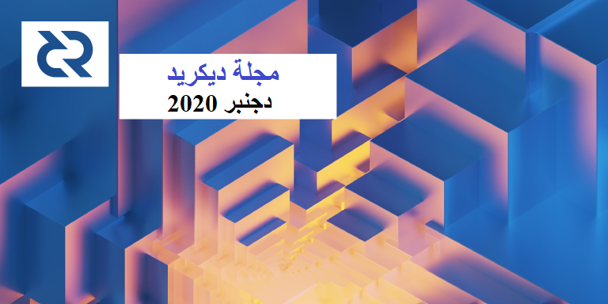

# صحيفة ديكريد لشهر دجنبر 2020

_الصورة: إعادة الهيكلة III بواسطة saender@_

سنة جديدة وسعيدة للجميع!

أبرز أحداث شهر دجنبر:

* بعد شهر آخر من الصقل، يبدو الإصدار 1.6 بالفعل لامعًا جدًا. كما يتم الإستعداد لإطلاق مرشح الإصدار الخامس.
* في دجنبر، أصبحت مقاييس السلسلة أكثر جموحا، مع قفزة كبيرة في سعر التذكرة الذي وصل الى 191 DCR
* إرتفعت مقاييس وسائل الإعلام أيضًا، مع إختراق مشروع الديكريد لمستوى المقاومة الرئيسي.
* تم شطب DCR من Upbit، مما تسبب في ارتفاع السعر، وتمت إضافة تداول الهامش إلى العديد من منصات المبادلات الأخرى.

## التطوير

ما لم يُذكر خلاف ذلك، فإن العمل المَذْكُور هنا يشتمل على حالة "الدمج إلى الرئيسي". وهذا يعني أن العمل قد تم استكماله ومراجعته ودمجه في كود المصدر الذي يمكن للمستخدمين المتقدمين بناءه وتشغيله، ولكنه ليس متاحًا بعد في ثنائيات الإصدار للمستخدمين العاديين.

**[dcrd](https://github.com/decred/dcrd)**

تم الدمج في الفرع الرئيسي، و و تم تحميله عكسيا إلى الإصدار 1.6:

* تم تصحيح [حسابات الرسوم](https://github.com/decred/dcrd/pull/2530) لإصلاح بعض المعاملات التي يتم اعتبارها أقل أولوية في بعض سيناريوهات إعادة التنظيم
* تم إدراج [إنتهاكات](https://github.com/decred/dcrd/pull/2533) DCP-5 في القائمة البيضاء. فبسبب خطأ تم إصلاحه منذ ذلك الحين، تم قبول 5 كتل مع إصدار الكتلة القديمة 6 عندما تم تحديث معظم الشبكة بالفعل إلى الإصدار 7. وكانت هذه الكتل صالحة لولا ذلك، وتم إدراجها الآن في القائمة البيضاء للسماح بمزامنة السلسلة بالكامل بدون نقاط تفتيش.

تم الدمج في الفرع الرئيسي:

* تم نقل [فحوصات السياق](https://github.com/decred/dcrd/pull/2481) من وظائف السلامة/الموقع إلى المواقع المناسبة لاستعادة القيود المقصودة التي كانت موجودة قبل عمل الخزينة اللامركزية. ستكون هذه ضرورية لفصل أمر معالجة الكتلة من أمر التنزيل.
* تم تغيير دلالات [التخزين المؤقت لكتلة](https://github.com/decred/dcrd/pull/2488) السلسلة الرئيسية لتكون أقل اعتماداً عند ترتيب رؤية بيانات الكتلة
* تم استخراج إدارة الكتل في حزمة [`netsync`](https://github.com/decred/dcrd/pull/2500) الخاصة بها لتحسين إمكانية اختبارها والمزامنة مع الشبكة بشكل أكثر تنظيما من المصادقة بالإجماع
* العديد من التغييرات الأخرى في اتجاه تنزيل كتلة [متعدد النظراء](https://github.com/decred/dcrd/issues/1145)
* إضافة [أداة اختبار](https://github.com/decred/dcrd/pull/2480) التعدين التي ستجعل من السهل إضافة تغطية الاختبار وستساعد على تحسين كود إنشاء قالب الكتلة
* تم تغيير [مصادقة](https://github.com/decred/dcrd/pull/2486) خادم RPC لاستخدام HMAC-SHA256 بمفتاح عشوائي فريد لكل بدء تشغيل للتغلب على فئات معينة من هجمات تفريغ الذاكرة
* المزيد من تغطية اختبار [rpcserver](https://github.com/decred/dcrd/issues/2069)
* تم تحديث أماكن متعددة لاتباع [أفضل الممارسات](https://github.com/decred/dcrd/issues/2181) لمعالجة الأخطاء
* كود أصغر واختبار التحديثات في جميع المجالات

تم [دمج](https://github.com/decred/dcrd/pulls?q=is%3Apr+merged%3A2020-12-01..2020-12-31+sort%3Aupdated-asc) إجمالي 51 طلب سحب و 92 إيداع من 6 مساهمين، مع إضافة 10 آلاف وحذف 8 آلاف سطر من الكود.

في أخبار أخرى، كان هناك إيداعات في 30 دجنبر و 1 يناير ولكن لحسن الحظ لم يكن هنالك أي إيداعات في 31 دجنبر!

**[dcrwallet](https://github.com/decred/dcrwallet)**

* اختيار [عملة عشوائية](https://github.com/decred/dcrwallet/pull/1937) لدفع رسوم موفر خدمة التصويت (يتيح هذا أيضا إعادة المحاولة وإكمال بعض مشتريات تذاكر موفر خدمة التصويت التي كانت تفشل دائما من قبل)
* تم إصلاح المخرجات الثابتة [غير المنشورة](https://github.com/decred/dcrwallet/pull/1941) التي يتم إستعمالها لتمويل المعاملات الأخرى (حدثت مع رسوم موفر خدمة التصويت التي تبقى في حالة غير منشورة حتى يتم تقديم التذكرة مع موفر خدمة التصويت)
* إعادة هيكلة الكود

قيد التطوير:

* القدرة على [استيراد](https://github.com/decred/dcrwallet/pull/1945) حسابات التصويت المستمدة من بذرة مختلفة (لدعم التحصيص بواسطة Trezor)

**[Decrediton](https://github.com/decred/decrediton)**

* إضافة زر لخلط [جميع الأموال](https://github.com/decred/decrediton/pull/3041)
* تمت إضافة [ملاحظات الإصدار](https://github.com/decred/decrediton/pull/3048) 1.6 والصور المتحركة
* تحديث الترجمة (العربية والصينية والألمانية واليابانية والإيطالية والبولندية والإسبانية)
* حوالي 23 إصلاح وتعديل واجهة المستخدم

من المحتمل جدًا أن يكون هناك مرشح إصدار 5 قريبًا لإصلاح بعض المشكلات المتبقية.

**[بوليتيا](https://github.com/decred/politeia)**

* تمت إزالة [CSRF](https://github.com/decred/politeia/pull/1356) من المسارات العامة لمنع إمكانية ربط الأصوات المتدفقة بواسطة توكن CSRF. كان تأثير الخصوصية ضئيلًا: يتطلب ربط توكنات CSRF بالأصوات المتقطعة كتابة كود إضافي، حيث أنه لا يتم تلقائياً بواسطة مكتبة CSRF المستخدمة.
* اختبارات واجهة المستخدم من طرف إلى طرف [لتعديل](https://github.com/decred/politeiagui/pull/2227) المقترح
* إزالة مشروط تسجيل الخروج المزعج ونقل وظيفة "تسجيل الخروج بشكل دائم" والتي نادرًا ما يتم إستخدامها إلى علامة التبويب "الحساب"
* أمر `politeiavoter`  جديد خاص [بالتحقق](https://github.com/decred/politeia/pull/1355) من الأصوات
* تحسينات تجربة المستخدم لمعالجة فواتير نظام إدارة المتعاقد ومراجعتها
* إصلاحات أخطاء بوليتيا و نظام إدارة المتعاقد

تحديث إدماج tlog من lukebp@:

> تمت إضافة القدرة على استرداد الطابع الزمني الكامل (إثبات التضمين) لأي جزء من البيانات المقدمة من المستخدم. ولا يزال العمل على الواجهة الأماية مستمرًا. وقد إكتملت ميزة فرع tlog للخلفية وسنبدأ عملية مراجعة الكود.

**[vspd](https://github.com/decred/vspd)**

* رفض [الطوابع الزمنية](https://github.com/decred/vspd/pull/215) المعاد استخدامها أو القديمة
* المزيد من تغطية الاختبار لكود قاعدة البيانات
* إصلاحات أصغر والتحضيرات لإصدار الإصدار 1.0

**[dcrpool](https://github.com/decred/dcrpool)**

* نقطة نهاية [للمعدن المنفرد](https://github.com/decred/dcrpool/pull/274)
* حفظ [معلومات العميل](https://github.com/decred/dcrpool/pull/293) في قاعدة البيانات وإتاحتها على أي مثيل dcrpool
* دعم أداة [التحقق](https://github.com/decred/dcrpool/pull/294) من تجمع NiceHash (تسمح له بالاتصال بـ dcrpool والاستعلام عن الإحصائيات الأساسية)

**[dcrdex](https://github.com/decred/dcrdex)**

* زر [طلب الحد الأقصى](https://github.com/decred/dcrdex/pull/842) الجديد الذي يقوم بتعبئة حقول الكمية بأقصى قدر ممكن استنادًا إلى السوق وجانب السوق ورصيد المحفظة
* نقاط نهاية واجهة برمجة تطبيقات [بيانات السوق](https://github.com/decred/dcrdex/pull/796) العامة عبر HTTP و WebSockets
* إظهار [معرّف الحساب](https://github.com/decred/dcrdex/pull/825)(https://github.com/decred/dcrdex/pull/825) لكل خادم DEX
* تفضيل النواتج [المؤكدة](https://github.com/decred/dcrdex/pull/865) لتمويل طلبات BTC
* [استئناف](https://github.com/decred/dcrdex/pull/856) المبادلة من قاعدة البيانات (أفضل من الطريقة السابقة مع كود أقل)
* السماح للتطبيقات بإيلاء الإهتمام بعناوين [IPv6](https://github.com/decred/dcrdex/pull/899)
* تحسين الألوان للتمييز بين طلبات البيع والشراء
* العديد من إصلاحات الأخطاء وتحديثات التبعية

تم [دمج](https://github.com/decred/dcrdex/pulls?q=is%3Apr+merged%3A2020-12-01..2020-12-31+sort%3Aupdated-asc) إجمالي 28 طلب سحب من 7 مساهمين، مع إضافة 8 آلاف وحذف 5 آلاف سطر من الكود.

يقترب إطلاق إصدار التصحيح [0.1.4](https://github.com/decred/dcrdex/milestone/10).

**[dcrandroid](https://github.com/planetdecred/dcrandroid)**

* الإشعار عند [جلب](https://github.com/planetdecred/dcrandroid/pull/523) عوامل التصفية cfilters
* إصلاحات الأخطاء

أُدمجت في مكتبة dcrlibwallet المشتركة:

* دعم [vspd](https://github.com/planetdecred/dcrlibwallet/pull/163)
* طريقة الاستعلام عن معلومات حول [نظراء](https://github.com/planetdecred/dcrlibwallet/pull/160) SPV المتصلين
* تحديثات الإعتمادية وإصلاح الأخطاء

لاحظ أن الميزات المضافة إلى dcrlibwallet أصبحت متاحة للاستهلاك بواسطة dcrandroid و dcrios و godcr ، على افتراض أن هذه التطبيقات تضيف واجهة مستخدم ضرورية.

**[dcrios](https://github.com/planetdecred/dcrios)**

* اختبارات واجهة المستخدم [التلقائية](https://github.com/planetdecred/dcrios/pull/707) لبعض السيناريوهات باستخدام XCUI

**[godcr](https://github.com/planetdecred/godcr)**

* واجهة [اختيار العملة](https://github.com/planetdecred/godcr/pull/261)
* [إخطارات](https://github.com/planetdecred/godcr/pull/274) عند نسخ النص أو إنشاء المعاملة
* تصميم جديد لواجهة المستخدم لصفحة [المحافظ](https://github.com/planetdecred/godcr/pull/276) الرئيسية
* تعديلات واجهة المستخدم
* إصلاحات الأخطاء وتحسينات

واجهة برمجة التطبيقات (API) للتطبيقات الزائدة مطلوبة لتنفيذ التصاميم المطلوبة لـ Godcr بالكامل. وقد استرعي انتباه فريق Gio على Slack إلى هذا الأمر ويتم التعامل معه كأولوية.

**[tinydecred](https://github.com/decred/tinydecred)**

قيد التطوير:

* البرنامج النصي [لاسترداد](https://github.com/decred/tinydecred/pull/194) الأموال من محافظ الويب القديمة لـ Copay (كان أحدها سابقًا في wallet.decred.org). لقد ساعد البرنامج النصي بالفعل في استرداد أموال الشبكة الرئيسية لشخص ما.

**[dcrros](https://github.com/decred/dcrros)**

* دعم [وضع عدم الاتصال](https://github.com/decred/dcrros/pull/14) لتحقيق المواصفات الكاملة [لواجهة API الخاصة بالبناء](https://www.rosetta-api.org/docs/construction_api_introduction.html)، حيث يتم تنفيذ عمليات معينة فقط في الحالات غير المتصلة

**[decred.org](https://github.com/decred/dcrweb)**

* إزالة المساهمين [غير النشطين](https://github.com/decred/dcrweb/pull/935)
* تحديثات التبعية

مسائل أخرى:

* قام باحثون من Electric Capital بتعيين معظم [المستودعات](https://www.reddit.com/r/decred/comments/k9g76v/decred_developer_ecosystem_repositories/) في النظام البيئي لديكريد وبنوا أداة لتصور نشاطهم

## الأشخاص

مرحبا بالمساهمين الجدد مع دمج الكود إلى الماستر: piotrdelikat@ على ([decrediton](https://github.com/decred/decrediton/commits?author=piotrdelikat))!

إحصائيات المجتمع اعتبارًا من 2يناير:

* متابعو التويتر: 41,320 (423+)
* المشتركين في ريديت: 10,051 (69+)
* مستخدمي غرفة الدردشة general# على الماتريكس: 287 (34+)
* مستخدمي الديسكورد: 1,723(222+)
* مستخدمي التيليجرام: 2,338 (1-)
* المشتركين في اليوتيوب: 4,300 (44+)، المشاهدات 165 الف (+3 آلاف)
* متابعي لينكد إن: 944 (12+)
* نجوم GitHub dcrd: بلغت 570 (3+)، التفرعات: 247 (1+)

بعض النقاط البارزة من الإحصائيات التي [نتتبعها](https://github.com/decredcommunity/social-media-stats):

* كسر تويتر مشروع الديكريد [decredproject@](https://twitter.com/decredproject) ["المقاومة"](https://github.com/decredcommunity/social-media-stats/blob/graphs/graphs/index.md) السحرية لـ 41 ألف متابع بقفزة غير عادية مع زيادة 423
* كسر [ريديت](https://www.reddit.com/r/decred/) 10 آلاف مشارك: مرحى:
* حصل [الديسكورد](https://discord.gg/GJ2GXfz) على نسبة لطيفة بزيادة 14٪
* حصلت غرفة التيليجرام لتداول الديكريد [DecredTrading](https://t.me/DecredTrading) على زيادة 72٪ من المستخدمين، ب 158 مشترك جديد (الله يوفقنا)
* حصل [Checkmate@](https://twitter.com/_Checkmatey_) على زيادة 11٪ من المتابعين (3.5 ألف) وقام بعمل ألف تغريدة في أخرى ~34 يوميًا)
* كسبت غرفة التيليجرام [DecredES](https://t.me/DecredES) على حوالي 245 مشارك جديد بزيادة 18٪
* تتوفر [CoinMarketCap](https://coinmarketcap.com/currencies/decred/) على 17.8 ألف مراقب لـديكريد

شكرا لسفراء الديكريد على جميع المنصات لزيادة الوعي حول المشروع!

## الإدارة و الحوكمة

تلقت [الخزينة](https://explorer.dcrdata.org/address/Dcur2mcGjmENx4DhNqDctW5wJCVyT3Qeqkx) في شهر دجنبر 12,099 DCR وأنفقت 7,466 DCR. وباستخدام معدل المتوسط اليومي لشهر دجنبر ب DCR/USD والذي يقدر ب 31.07 دولارًا، ستكون الخزينة قد تلقت 376 ألف دولارا وأنفقت 232 ألف دولارا. ووفقًا لمتوسط السعر اليومي في نونبر البالغ 18.19 دولارًا، فإن قيمة الفَوترة بالدولار الأميركي عن العمل المنجز في ذلك الشهر تكون قد بلغت 136 ألف دولار. واعتبارا من 5 يناير، بلغ رصيد الخزينة 641,260 DCR (أي 30.2 مليون دولار أمريكي بسعر 47.16 دولار أمريكي).

تم تقديم مقترحين وتم التصويت عليهما في دجنبر:

* طلب [الاقتراح](https://proposals.decred.org/proposals/350f64b) الثالث الذي تقدم به فريق الديكريد الإسبانية مبلغ 14,800 دولار لتمويل ستة أشهر من العمل، مع تخفيض قيمته من طلب أولي قدره 42,000 دولار، مع إزالة العناصر المتعلقة بتحدي Talent Land Blockchain و Codigo Decred. تم رفض هذا الاقتراح بنسبة تصويت بنعم بلغت 54%، بعد أن فشل في تلبية عتبة 60٪ - بلغت نسبة المشاركة 37٪.
* تم تقديم [مقترح](https://proposals.decred.org/proposals/5ce1636) ديكريد هاكاثون و أمريكا اللاتينية بعد إزالة عنصر الهاكاثون في اقتراح تسويق أمريكا اللاتينية، والأشخاص الذين يقفون وراءه هم أعضاء في الفريق الإسباني. طلب الاقتراح ميزانية قصوى قدرها 17,000 دولار لإنشاء مواد للهاكاثون وتنفيذ برنامجين للهاكاثون، مع تخصيص 3,500 دولار من الميزانية للجوائز. وقد رفض الاقتراح بنسبة تصويت بنعم بلغت 50,2٪، وبنسبة مشاركة بلغت 36٪.

دجنبر هو الشهر الأخير للفوترة بالنسبة لمقترحات التسويق التي تقدمت بها [الولايات المتحدة](https://proposals.decred.org/proposals/c830ea5) و[أمريكا اللاتينية](https://proposals.decred.org/proposals/3c02b67) و[البرازيل](https://proposals.decred.org/proposals/bc20f98). سيحتاج المتعاقدون الذين يعملون لديهم إلى تقديم مقترحات التجديد للبقاء ممولين.

نشر JoeGruff@ ثلاثة [تحديثات](https://github.com/decredcommunity/proposals/tree/master/proposals/3943bff/updates)  قصيرة للتقدم والنفقات لاقتراح [الماسح الضوئي للعنواين](https://proposals.decred.org/proposals/3943bff) الخاص به.

في حين أنه لم تكن هنالك مقترحات في شهر دجنبر، هنالك بالفعل إقتراحين جديدين في شهر يناير، لتجديد تمويل منصة المُبادلات اللامركزية لديكريد [DCRDEX](https://proposals.decred.org/proposals/d462ac3) و فيديوهات [ديكريد في العمق](https://proposals.decred.org/proposals/391108e)  (تحت الإدارة الجديدة).

أخذت مجلة موجز بوليتيا استراحة في دجنبر لكنها ستعود قريبًا.

## الشبكة

معدل الهاش: افتتحت معدلات [الهاش](https://explorer.dcrdata.org/charts?chart=hashrate&zoom=ki3ivfpm-kjej4ggy&scale=linear&bin=block&axis=time) في شهر دجنبر على ~292 Ph/s وأغلقت على ~340 Ph/s، وبلغ قاعها عند 240 Ph/s كما بلغت ذروتها عند 452 Ph/s على مدار الشهر. [توزيع](https://miningpoolstats.stream/decred) معدلات الهاش للتجمع اعتبارا من 1 يناير:

* UUPool بنسبة 42%،
* Poolin بنسبة 35%،
* easy2mine بنسبة 12%،
* F2Pool بنسبة 3.9%،
* Antpool بنسبة 2.7%،
* Huobipool بنسبة 2.6%،
* BTC.com بنسبة 1.3%،
* Luxor بنسبة 1.2%،
Coinmine بنسبة 0.02%

التحصيص: بلغ متوسط سعر التذكرة [لمدة 30 يوما](https://dcrstats.com/) 163.9 DCR (بزيادة 5.2). وتفاوت [السعر](https://explorer.dcrdata.org/charts?chart=ticket-price&zoom=ki3ivfpm-kjej4ggy&axis=time&visibility=true-false&mode=stepped) ما بين 150.6 و 190.99 DCR. وقد بلغ [المبلغ المقفل](https://explorer.dcrdata.org/charts?chart=ticket-pool-value&zoom=ki3ivfpm-kjej4ggy&scale=linear&bin=block&axis=time) 6.42-6.68 مليون DCR، وهو ما يعادل 52.01-54.20% من العرض المتاح [المشارك](https://explorer.dcrdata.org/charts?chart=stake-participation&zoom=ki3ivfpm-kjej4ggy&scale=linear&bin=block&axis=time) في إثبات الحصة.

شهر آخر، رقم قياسي آخر تم تحطيمه. بلغ سعر التذكرة ذروته عند 190.9 DCR ومشاركة الحصة عند 54.2٪.

العقد: طوال شهر [دجنبر](https://charts.dcr.farm/d/000000014/nodes?orgId=1&from=1606780800000&to=1609459200000)، كان هناك ما متوسطه 87 عقد استماع عامة و 200 عقدة إجمالية حسب dcr.farm. تم توزيع الإصدارات في شهر دجنبر، في المتوسط، على النحو التالي: 27% يشغلون dcrd النسخة 1.5.2، 21% يشغلون dcrd نسخة بناء التطوير 1.6، و 16% dcrd النسخة 1.5.1، 5% يشغلون dcrd النسخة 1.7 لبناءَات التطوير، و %5 يشغلون dcrd النسخة 1.5.0، 3% يستخدمون dcrd النسخة 1.5 نسخة التطوير وبناء مرشحات الإصدار، 0.7% يشغلون dcrd النسخة 1.4، و10% يشغلون dcrwallet النسخة 1.5.1 و 1.3% يشغلون dcrwallet النسخة 1.6 نسخة التطوير وبناء مرشحات الإصدار، و 1% يشغلون dcrwallet النسخة 1.5، و0.7% يشغلون dcrwallet النسخة 1.4 و 9% يشغلون أخرى.

أبلغ Checkmate@ عبر النشرة الإخبارية ل [Our Network](https://ournetwork.substack.com/p/our-network-issue-50-part-2) أن عددًا من المقاييس على السلسلة تصل إلى أعلى مستوياتها على الإطلاق.

أبلغ PermabullNino@ عن [زيادة](https://twitter.com/PermabullNino/status/1338497116864438273) قدرها 500 ألف DCR في رصيد مجمع التذاكر على مدار 28 يومًا.

الشبكة الرئيسية للشبكة البرقية تنمو ببطء. طوال عام 2020، كان هناك متوسط ​​15 عقدة و 30 قناة و سعة ب 6 DCR. اعتبارًا من 8 يناير، كان هنالك 24 عقدة و 42 قناة وسعة إجمالية تبلغ 8.7 DCR وفقًا [لخريطة لخريطة الشبكة البرقية](https://ln-map.jamieholdstock.com/) ل jholdstock@.

## الإنضمام

أطلق موفرا خدمة التصويت [Ultravsp](https://ultravsp.uk/) (Ultrapool سابقًا) و [Ubiq](https://dcrvsp.ubiqsmart.com/) مثيلات الشبكة الرئيسية لبرنامج التصويت [vspd](https://github.com/decred/vspd) الجديد. ستستمر خوادم [dcrstakepool](https://github.com/decred/dcrstakepool) الخاصة بهم في العمل على [legacy.ultravsp.uk](https://legacy.ultravsp.uk/) و [dcr.ubiqsmart.com](https://dcr.ubiqsmart.com/)، على التوالي.

لاحظ أن Ultravsp اضطر إلى الترحيل من ultrapool.eu إلى نطاق المملكة المتحدة [ultravsp.uk](https://ultravsp.uk/) بسبب [فوضى نطاق](https://www.theregister.com/2021/01/05/brexit_81000_eu_domains/) Brexit، ولن يكون هناك إعادة توجيه تلقائي بسبب التعقيد الباهظ في إعداده. وقد تم إخطار مستخدمي موفري خدمة التصويت الذين اشتروا التذاكر مؤخرًا عبر البريد الإلكتروني.

[أضافت](https://twitter.com/BittrexExchange/status/1341801493964308482) البيتريكس ميزة [التبادل الفوري](https://bittrex.com/instant) التي تتيح للمستخدمين شراء الأصول بسرعة باستخدام البطاقة الإئتمانية أو الرصيد النقدي الموجود في منصة المبادلات. وقد تم الإبلاغ أن هذه الميزة تعمل بالنسبة ل DCR.

مكنت منصة الباينانس  [التداول بالهامش](https://www.binance.com/en/support/announcement/d3614081a4254d1c815eb07e09f6cda8) لأزواج DCR/BTC و DCR/USDT، وأعلنت عن عرض ترويجي بدون فائدة لمدة أسبوع واحد لاقتراض DCR. ([مناقشة](https://www.reddit.com/r/decred/comments/k8gy0d/margin_trading_for_dcr_enabled_on_binance/)) :supervillain:

[أضافت](https://twitter.com/MXC_Exchange/status/1334707659900035075) [منصة المُبادلات MXC](https://www.mxc.com/) خمسة أضعاف هامش الرافعة المالية للتداول بزوج DCR/USDT بالإضافة إلى زوج DCR/USDT العادي الذي أدرجته في عام 2019.

[أعلنت](https://twitter.com/bitexencom/status/1339858540614266880) منصة المُبادلات [Bitexen](https://www.bitexen.com/) التركية عن إدراج DCR ضمن 11 [أصلًا](https://destek.bitexen.com/portal/tr/kb/articles/bitexen-11-adet-yeni-coin) آخر.

يدعم مجمع التبادل الفوري [Swapzone](https://swapzone.io/)، و الذي يتخذ من مالطا مقراً له، منذ [ماي](https://twiter.com/swapzoneio/status/1263049492963774465) أو قبل ذلك، ولكن لم يتم رصده من قبل الرادار الخاص بنا حتى دجنبر و قد تمت إضافته إلى صفحة [منصات التبادل](https://decred.org/exchanges/) على decred.org.

قامت Upbit الكورية [بشطب](https://www.reddit.com/r/decred/comments/kfu4sb/whats_going_on_in_korea_upbit/) DCR، على ما يبدو في خلاف مع مهمة الديكريد لحماية الخصوصية الفردية. :supervillain:

تحذير: ليس لدى مؤلفي مجلة ديكريد أي فكرة عن مصداقية أي من الخدمات المذكورة أعلاه. يرجى إجراء البحوث الخاصة بك قبل الوثوق بمعلوماتك الشخصية أو الأصول إلى أي كيان.

## الانتشار

نشر فريق الديكريد بالإسبانية [التقرير السادس](https://github.com/decredcommunity/proposals/blob/master/proposals/3c02b67/updates/20201211.md) النهائي لاقتراحهم الثاني. وقد انتهى التصويت على اقتراحهم الثالث بنسبة كبيرة بلغت 54.5% مع 50.2% بنعم ولكن لم يصل إلى الحد الأدنى المطلوب وهو 60%. ويقوم الفريق بجمع [الملاحظات](https://www.reddit.com/r/decred/comments/kkb97s/what_are_your_thoughts_on_the_decred_in_spanish/)  على الريديت ويخطط لما يجب القيام به بعد ذلك.

نشر michae2xl@ [التقرير](https://github.com/decredcommunity/proposals/blob/master/proposals/bc20f98/updates/20210105.md) النهائي الذي يغطي أنشطة دجنبر لمقترح التسويق البرازيلي.

إنجازات Monde PR لشهر دجنبر:

* إبتكار و الترويج قصتين على منشورات المالية و العملات الرقمية

التغطية الإخبارية المؤمنة بواسطة Monde PR:

* أجرت [NASDAQ Trade Talks](https://www.nasdaq.com/videos/tradetalks:-how-can-blockchain-can-be-used-in-elections) مقابلة مع jy-p@ وتحدث فيها عن استخدام الديكريد في الانتخابات البرازيلية. تم ذكر المقابلة في مقالات لاحقة في كل من [Coin Journal](https://coinjournal.net/news/decred-bounces-off-42-after-spiking-50/) و [Crypto Potato](https://cryptopotato.com/decred-dcr-pumps-50-as-social-sentiment-surges/) و [Coin Market Cap](https://coinmarketcap.com/headlines/signals/decred-co-founder-on-nasdaq-tradetalks-decred/) و [CryptoMode](https://cryptomode.com/5-reasons-why-you-shouldnt-overlook-decred-dcr/)
* تم عرض تفاصيل إطلاق DCRDEX واستخدام الديكريد في الانتخابات البرازيلية في [Cointelegraph](https://cointelegraph.com/news/bitcoin-bull-market-pulls-kusama-ksm-decred-dcr-and-qtum-price-higher)
* أجرى برنامج [Geek Insider Podcast](https://www.youtube.com/watch?v=mYK_Awn1wTk) مقابلة مع jy-p@ حيث تحدث عن أصل الديكريد، وإطلاق برنامج DCRDEX واستخدام الديكريد في الانتخابات البرازيلية
* تم عرض تفاصيل إطلاق DCRDEX في [Brave New Coin](https://bravenewcoin.com/insights/decred-price-analysis-active-addresses-hit-all-time-highs-as-trend-metrics)
* ظهرت تعليقات من مقابلة jy-p@ مع Cointelegraph حول دورات الصعود و النزول للبتكوين في كل من [Forex Academy](https://www.forex.academy/how-to-spot-bitcoin-bull-bear-cycles-beginners-edition/) و [Inside Bitcoin](https://insidebitcoins.com/news/bitcoin-btc-price-prediction-november-29-2020-2)
* تم عرض تعليقات jy-p@ حول تحديات الأمن الخاصة بـ Ledger في مجلة [The Union Journal](https://www.theunionjournal.com/ledger-cto-discusses-wallets-safety-after-multiple-security-setbacks/)

## الفعاليات

الحضور

* 3 دجنبر - [Hablemos Decred 24](https://decredcommunity.github.io/events/index/20201203.1)  - الإنترنت. ناقش elian@ وpablito@ مدى خصوصية العملات الرقمية.
* 5 دجنبر - [المؤتمر العالمي لسلسلة الكتل](https://decredcommunity.github.io/events/index/20201205.1) - ووهان، الصين. لم يكن هناك فعالية رسمية لديكريد لكن التقى Dominic@ بأصدقاء قدامى في Cobo Wallet و F2Pool وآخرين لتعريفهم بالإصدار 1.6 القادم وقواعد الإجماع الجديدة.
* 10 دجنبر -  [Hablemos Decred 25](https://decredcommunity.github.io/events/index/20201210.1) - الإنترنت. اجتمع فريق الديكريد الإسباني لمراجعة العمل لمدة عام في منظمة مستقلة لامركزية، ما هو الجيد و ما هو السيئ وما الجديد لسنة 2021.
* 11 دجنبر - [Cripto Latin Fest Online 2020](https://decredcommunity.github.io/events/index/20201211.1) - الإنترنت. شارك في تنظيمه Paxful Latam، كانت الديكريد راعيةً لكبار الشخصيات. قدم elian@ نقاط حوار مشتركة لديكريد و برنامج التنين المخفي ذو الرؤوس المتعددة القادم، والذي حصل على 1,600 مشاهدات على الفيسبوك و ما يقارب 800 مشاهدة على اليوتيوب. و في ندوة أخرى تحدث عن كيفية منع عمليات الاحتيال على العملات الرقمية.
* 16 دجنبر - [UAM Xochimilco](https://twitter.com/addcade/status/1338544856344317953) - مكسيكو سيتي، المكسيك. تحدثت adcade@ عن منظمة الديكريد و بوليتيا في مختبر Aula Multimedia التابع لجامعة UAM Xochimilco.
* 18 دجنبر -[السنة الجديدة في Crypto Resources!](https://decredcommunity.github.io/events/index/20201218.1) — الإنترنت. نظمت أكاديمية Crypto Resources فعالية نهاية السنة ودعت شركاء مثل الديكريد و Bitso و Prime XBT DAI و Binance وغيرهم. خلال ندوة الحوكمة، عرض  كيف تعمل حوكمة الديكريد، ودور بوليتيا و لامركزية الخزينة.
* 24 دجنبر - [ديكريد إسألني أي شيء](https://decredcommunity.github.io/events/index/20201224.1) - الإنترنت. تم إجراء فعالية إسألني أي شيء لـ OKEx في المجتمع الإسباني على [التيليجرام](https://t.me/OKExLATAM) مع حوالي 500 مستخدم. تم طرح أكثر من 30 سؤالًا حول حوكمة الديكريد والخصوصية والتطورات المستقبلية والتاريخ و منصة المُبادلات اللامركزية. كان هنالك أيضا هدية ب DCR (20 دولارًا من OKEx و 30 دولارًا من الديكريد بالإسبانية). انضم أكثر من 30 عضوًا جديدًا إلى قناة [DecredES@](https://t.me/DecredES).
* 30 دجنبر - [هدية رأس السنة من الديكريد الإسبانية](https://decredcommunity.github.io/events/index/20201230.1) - للمشاركة ، كان على الأشخاص الانضمام إلى تيليجرام DecredES@ وإخبارهم بما يعجبهم في الديكريد. من بين 28 تعليقًا، تم اختيار 9 من أفضل التعليقات بناءً على معرفة وفهم المشروع وحصلوا على 3 DCR في المجموع.

تتوفر المعلومات الواردة أعلاه بتفصيل أكبر في [متعقب الفعاليات](https://decredcommunity.github.io/events/index/) لدينا الذي يتم إنشاؤه لتعلم ما يعمل وتحسين الإبلاغ عن جهود التسويق. شكرًا للجميع على [إرسال](https://github.com/decredcommunity/events/blob/master/docs/submit-index.md) الفعاليات ومراجعتها.

## وسائل الإعلام

أكمل mm@ سلسلته من 7 أجزاء حول حوكمة سلسلة الكتل:

* يقدم [الجزء الأول](https://stakey.club/en/blockchain-gov-part1/) العملات الرقمية وطباعة الأموال والبتكوين
* يغطي [الجزء الثاني](https://stakey.club/en/blockchain-gov-part2/) التكنولوجيا الكامنة وراء العملات الرقمية وأمن إثبات العمل والحوافز والتضخم
* يشرح [الجزء الثالث](https://stakey.club/en/blockchain-gov-part3/) أنواع البنية الأساسية ((بدون إذن/ مصرح به، عام/خاص)، وحوكمة البتكوين، والخصوصية والتبادلية، وتطبيقات سلسلة الكتل بخلاف الأموال الرقمية (خاصة التصويت الإلكتروني)
* يقدم [الجزء الرابع](https://stakey.club/en/blockchain-gov-part4/) المبادئ الأساسية لمشروع الديكريد (الأمن، الإجماع، التمويل، الجلد في اللعبة) ويقارنها مع نهجي إثبات العمل و إثبات الحصة المحضة
* يقيِّم [الجزء الخامس](https://stakey.club/en/blockchain-gov-part5/) أمن سلسلة الكتل وحوكمة البتكوين مقابل الديكريد باستخدام محاكاة هجوم [InvalidationGame](https://github.com/mmartins000/invalidationgame) ل mm@، مع مراعاة الهجمات الخارجية والداخلية. ويقدم التقرير، من بين تفاصيل أخرى، تقديرات منفصلة لنفقات رأس المال ونفقات التشغيل اللازمة لمهاجمة البتكوين والديكريد.
* يختبر [الجزء السادس](https://stakey.club/en/blockchain-gov-part6/) عددا من الفرضيات مقابل البيانات الحقيقية (تتضمن المواضيع ارتباط المقاييس على السلسلة بالسعر، وإقبال الناخبين، ونموذج المربعات الصغرى العادية، وغير ذلك)
* يختتم [الجزء 7](https://stakey.club/en/blockchain-gov-part7/) السلسلة من خلال تلخيص نتائج المحاكاة والنتائج المتعلقة بالأمن وما يمكن أن تقدمه الديكريد للعالم

> لا يهدف مشروع الديكريد فقط إلى توفير بديل للأنظمة المالية التي تعتمد على طرف ثالث موثوق به وعلى الأشخاص الذين يعتمدون على حسن نية المؤسسات المالية العملاقة، بل يهدف أيضاً إلى إظهار كيف يمكن أن يحدث التصويت الإلكتروني بطريقة آمنة وشفافة.

يتوفر الكود في Python/R/SQL المستخدم في البحث على [GitHub](https://github.com/mmartins000?tab=repositories).

مقالات مختارة:

* تحليل أسعار الديكريد -وصلت العناوين النشطة إلى أعلى مستوياتها على الإطلاق حيث تقلبت مقاييس الاتجاه الصعودي بواسطة Josh Olszewicz على ([bravenewcoin.com](https://bravenewcoin.com/insights/decred-price-analysis-active-addresses-hit-all-time-highs-as-trend-metrics)) - يأتي مع إصدار [الفيديو](https://www.youtube.com/watch?v=oCYZS_qJ7us)

أشرطة الفيديو:

* تحديث أخبار الديكريد النصف الشهرية - تم تجديد صفحة الخصوصية، والكثير من تحديثات التطوير، إقتراب إطلاق برنامج الديكريد 1.6، و المزيد! بواسطة Exitus@ على ([اليوتيوب](https://www.youtube.com/watch?v=-3s9_jMWNuA))
* ارتفاع سنوي جديد لديكريد بواسطة Decred Society على ([اليوتيوب](https://www.youtube.com/watch?v=qw-ohbTObeo))
* الديكريد مثالية للمدخرين بواسطة Decred Society على ([اليوتيوب](https://www.youtube.com/watch?v=zYDT0n59C7k))
* تحليل العملة الرقمية الديكريد - الملك DCR يستيقظ! كل عمل له رد فعل معاكس ومساو! بواسطة DubDigital ([اليوتيوب](https://www.youtube.com/watch?v=kqAD_PSgyME))
* يتحدث جيك يوكوم بيات عن الديكريد و سلسلة الكتل في Geek Insider ([اليوتيوب](https://www.youtube.com/watch?v=mYK_Awn1wTk))
* كيف يمكن استخدام سلسلة الكتل في الانتخابات؟ مع جيك يوكوم بيات وجيل مالاندرينو من NASDAQ TradeTalks ([اليوتيوب](https://www.youtube.com/watch?v=pBSn_CdQYts))
* الحلقة 0.0.5 من بودكاست Staked: تحديث حالة البودكاست وإعلان بخصوص الديكريد و Eduardo ([اليوتيوب](https://www.youtube.com/watch?v=BbBcngzuxCw))
* مقابلة مع BTC_Uncle@ عبر بودكاست Staked ([اليوتيوب](https://www.youtube.com/watch?v=__7LTz3nQKk)، [مقطع](https://www.youtube.com/watch?v=3ubS_27FEhE) قصير عن السبب وراء إختياره لديكريد)
* مقابلة مع عمار نصير (Amarooni) عبر بودكاست Staked ([اليوتيوب](https://www.youtube.com/watch?v=g0bFMuHXrkU))
* الجلسة الختامية للتحليل على السلسلة لعام 2020 لما يحدث على سلسلة البتكوين و الديكريد بواسطة Checkmate@ على ([اليوتيوب](https://www.youtube.com/watch?v=g60ovCl54OA))
* Decred Deep Dive: إقتراب إطلاق برنامج التنين المخفي ذو الرؤوس المتعددة! بواسطة Checkmate@ على ([اليوتيوب](https://www.youtube.com/watch?v=3AxBa-EE8RM)، [المناقشة](https://www.reddit.com/r/decred/comments/klz8ue/decred_deep_dive_hidden_hydra/))

الصوتيات:

* الحلقة 14 من بودكاست Rough Consensus: إعادة صياغة مجريات السوق الصاعدة. يشارك Checkmate@ وPermabullNino@ أفكارهما حول أعلى مستويات البتكوين على الإطلاق و ETH 2.0 و DCR 1.6 وغيرها. على ([libsyn](https://roughconsensus.libsyn.com/episode-14-rehashing-bull-market-happenings))
* الحلقة 15 من بودكاست Rough Consensus: يتحدث Mav من Ready Set Crypto عن الصورة الكبيرة للعملات الرقمية. على ([libsyn](https://roughconsensus.libsyn.com/episode-15-the-next-paradigm-with-mav-ready-set-crypto))

الفن و المتعة:

* مضحك، تغطية ديكريد لمسلسل [صراع العروش](https://streamable.com/iam635) بواسطة degeri@
* "[لا يعلمون](https://twitter.com/aithzakaria1/status/1335706207395450880) أنني أتوفر على الديكريد" بواسطة aithzakaria1@
* إنه [وقت](https://twitter.com/aithzakaria1/status/1330999761634258948) الديكريد يا بن! بواسطة aithzakaria1@
* البقاء على قيد الحياة من خلال التكيف - تصميم [السلع](https://twitter.com/OfficialCryptos/status/1338551937818562561) بواسطة OfficialCryptos@
* الديكريد [تخترق CMC](https://twitter.com/exitusdcr/status/1343774006344880130) بقوة بواسطة Exitus@
* [دولة الأمة الرقمية](https://twitter.com/AGNFAB1/status/1338963085537718275) بواسطة AGNFAB@
* شارك New\_Copernicus@ المزيد من المقاطع التشويقية عن [برنامج التنين المخفي ذو الرؤوس المتعددة](https://twitter.com/New_Copernicus/status/1336044535370092546)، [الديكريد إلى أسفل حفرة الأرنب](https://twitter.com/New_Copernicus/status/1339649654842126337)، [عطلات سعيدة مبهجة](https://twitter.com/New_Copernicus/status/1341665478935076865)! و[سنة جديدة سعيدة](https://twitter.com/New_Copernicus/status/1344509258176622593)!

الترجمة:

* الترجمة العربية لمقالة "الديكريد: من أين بدأت؟" تم نشرها على موقع أخبار العملات الرقمية [satoshiat.com](https://www.satoshiat.com/2020/12/%d8%a7%d9%84%d8%af%d9%8a%d9%83%d8%b1%d9%8a%d8%af-%d9%85%d9%86-%d8%a3%d9%8a%d9%86-%d8%a8%d8%af%d8%a3%d8%aa%d8%9f/)
* من المقالات العامة مثل "فائدة الأصول الرقمية" إلى الأكثر تقنية "تعزيز أمن المحافظ الرقمية" و "الديكريد: التحقق من صحة التوقيعات الرقمية" من stakey.club تم ترجمتها إلى الإسبانية بواسطة _\francov@ (أنظر مستودع الترجمة الإسبانية على [GitHub](https://github.com/DecredES/traducciones) و على [Medium](https://medium.com/decred-es))
*  تمت [ترجمة](https://xaur.github.io/decred-news/) مجلة لشهر نونبر 2020 إلى العربية بواسطة (arij@ و abdulrahman4@) والصينية بواسطة (Dominic@) والإسبانية بواسطة (_\francov@). شكرًا لكم جميعًا على نشر أخبار الديكريد!
* يتم تتبع جميع الترجمات المعروفة في [هذا الفهرس](https://github.com/decredcommunity/translations/blob/master/index.md) الذي يحتوي على 305 عنصرًا حتى وقت الكتابة

المحتويات الأخرى غير الإنجليزية:

* "ارتفعت العملة الرقمية الديكريد بنسبة 50٪ وتجاوزت عملات DeFi" على ([es.cointelegraph.com](https://es.cointelegraph.com/news/the-decred-cryptocurrency-increased-by-50-and-surpassed-defi-coins))
* سجلت arij@ مقدمة محسنة بكثير عن الديكريد على ([اليوتيوب](https://www.youtube.com/watch?v=k6xXL_ttSDI))

## مناقشات المجتمع:

منشورات مختارة من الريديت:

* إضافة [ERC-20](https://www.reddit.com/r/decred/comments/khnc35/adding_erc20_to_the_dex/) إلى منصة المُبادلات اللامركزية لديكريد DCRDEX
* هل [إنتقال البيع والشراء](https://www.reddit.com/r/decred/comments/kho4db/is_churning_useful_with_coinshuffle/) (الإرسال الذاتي) مفيد مع ++CoinShuffle؟ (تلميح: CSPP هو حافز غير تافه لتحصيص DCR)
* [مقايضات](https://www.reddit.com/r/decred/comments/k6dn93/what_are_the_trade_offs_for_decreds_privacy/) ميزات الخصوصية لديكريد
* فوائد التغييرات القادمة على نظام موفر خدمة التصويت من منظور مشغل [موفر خدمة التصويت](https://www.reddit.com/r/decred/comments/k9hegy/upcoming_changes_in_16_for_proofofstake_using_vsps/)

مناقشات مختارة من التويتر:

* يذكر Ammarooni@ أن 15 دجنبر يشهد [الذكرى السنوية الخامسة](https://twitter.com/Ammarooni/status/1338898342722605057) [لإعلان](https://bitcointalk.org/index.php?topic=1290358.0) الديكريد لأول مرة على منتدى bitcointalk
* نبذة قصيرة عن [تاريخ](https://twitter.com/lefebvre_dustin/status/1333816694922485761) وضع كود الديكريد بغض النظر عن العوالق، بواسطة Dustorf@

## الأسواق

في دجنبر تم تداول DCR بين 24.01 و 41.59 دولار أمريكي و 0.0012-0.0020 BTC. وكان متوسط ​​السعر اليومي 31.07 دولار.

مع الإرتفاع الهائل لسعر البتكوين، كان سعر الديكريد  يرتفع أيضًا بالدولار الأمريكي دون أن يفقد الكثير من قيمته ب BTC.

تم تداول DCR [بشكل غير عادي](https://www.reddit.com/r/decred/comments/kfu4sb/whats_going_on_in_korea_upbit/) بحيث وصل سعرها إلى 350 دولارًا على Upbit حتى تم شطبها هناك.

خلال 48 يومًا من تشغيل DCRDEX، تم [تداول](https://ournetwork.substack.com/p/our-network-issue-50-part-2) 600 ألف DCR، وهو ما يمثل 30٪ الحجم المتداول على منصة الباينانس خلال نفس الفترة. على عكس أي منصة مبادلات مركزية، فإن هذا الحجم أكثر موثوقية ويصعب الإحتيال به.

[نشر](https://twitter.com/TheBochinchero/status/1339202616153284608) bochinchero@ أول مقالة تحليلية له على السلسلة لديكريد، مقترحًا مقاييس تقييم جديدة:

> القيمة المحققة للتحصيص هي مقياس مشابه للقيمة المحققة ولكنه يطبق حصريا على العملات المتداولة داخل تجمع التذاكر، ويعامل بشكل أساسي كل تذكرة على أنها ناتج معاملة غير منفقة. يوفر تقييمًا أكثر دقة لرأس المال المُقفل في أمن وحوكمة الشبكة. و خلال عمليات البيع الحادة السابقة، تصرفت كقاعدة نفسية، وهي نقطة الألم القصوى، حيث يتدخل مشترو الملاذ الأخير.

[أعلن](https://twitter.com/_Checkmatey_/status/1338418991212052485) Checkmate@ إطلاق عن موقع checkonchain.com مع الكثير والكثير (الكثير) من الرسوم البيانية:

> الآن، هذا شيء كنت أعمل عليه لفترة طويلة جدًا. إذا كنت تريد ميزة جادة في هذا السوق، فاحرص على الانتباه إلى القلب النابض للسلسلة. سيتم إطلاق دورة متقدمة شاملة لتعلم كيفية تطبيق كل مقياس بشكل صحيح قريبًا.

## الخارجية ذات الصلة

تم [اختراق](https://www.coindesk.com/cover-protocol-plans-new-token-after-attack) بروتوكول Cover، وهو مشروع تأمين ل DeFi "يسمح لمستخدمي DeFi بالحماية من مخاطر العقود الذكية"، وقام المهاجم بتعدين 40 كوينتيليون من توكنات COVER، وتصفية هذه مقابل 4 ملايين دولار، وولكنه قام لاحقًا بإعادة الأموال إلى العقد الذكي. والآن ينظر الفريق في إنشاء نسخة جديدة من توكن مع مع لحظة إنتقائية لإعادة الأموال لحملة وإلا فإن هذه التوكنات الإضافية التي تتألف من أربعين كوينتيليون ستفسد إقتصاد التوكنات.

تم اختراق الرئيس التنفيذي ل Nexus Mutual مقابل 8.3 مليون دولار عندما خدعه مهاجم لتوقيع معاملة أرسلت كل NXM إلى محفظة المهاجم. قام المهاجم [بغسل](https://coingeek.com/nexus-mutual-attacker-cashes-out-3-million/) 2.7 مليون دولار ب BTC، وهذا أدى إلى انخفاض سعر NXM، ثم أرسلوا رسالة على سلسلة كتل الإيثيريوم يعرض إعادة الباقي (حتى تتمكن NXM من تجنب المزيد من الألم) مقابل [فدية](https://coingeek.com/nexus-mutual-attacker-wants-3-million-in-ransom-money/) قدرها 2.8 مليون دولار ب ETH.

كان أبرز تلاعب لشهر دجنبر يخص [Compounder finance](https://www.coindesk.com/compounder-developers-implicated-alleged-smart-contract-rug-pull)، والتي هرب مطوروها بمبلغ 10.8 مليون دولار من أموال المستثمرين بعد استخدام باب خلفي مخفي في العقود.

كانت [Warp Finance](https://decrypt.co/52125/warp-finance-recovers-5-8-million-days-after-hack) هي أكبر ضحية لهجمات شهر ديسمبر من القروض السريعة، حيث بلغ حجم الثغرة 7.7 مليون دولار، ولكن تمت إعادة 5.85 مليون دولار إلى حامليها. يمكن القول أن هذا هو أكبر إسترجاع للأموال لإختراق في شهر دجنبر، لكن COVER يُعَد منافساً لهذا اللقب لأنه برغم أن المبلغ الذي يتم إعادته بالدولار كان أصغر، فإنه يمثل نسبة سخيفة من إجمالي COVER.

أنهت Gitcoin [سنة 2020 بقوة](https://gitcoin.co/blog/gitcoin-year-in-review/) بجولتها الثامنة من التمويل بالإيثيريوم مع مجمع نَقْدِيّ مطابق بقيمة 450 ألف دولار، كما تم [الانتهاء](https://electriccoin.co/blog/zcash-gitcoin-grants-round-1-retrospective/) من الجولة الأولى من التمويل بعملة غير الإيثيريوم لمشاريع الزيكاش، حيث تم الاستغناء عن 25 ألف دولار من المجمع النَقْدِيّ المطابق من مؤسسة الزيكاش ولكن جذب 156 تبرعًا فقط بلغ مجموعها 2,137 دولار.

تم [تقديم](https://www.coindesk.com/us-lawmakers-introduce-bill-that-would-require-stablecoin-issuers-to-obtain-bank-charters) مشروع قانون في الكونجرس الأمريكي من شأنه أن يطلب من مصدري العملات المستقرة الحصول على مواثيق بنكية، مما يتطلب موافقة مجلس الاحتياطي الفيدرالي والهيئات الأخرى المختلفة قبل تداول أي عملات.

[تحول](https://www.coindesk.com/self-hosted-bitcoin-wallets-become-front-line-in-fight-over-crypto-regulations) الخط الأمامي في لوائح العملات الرقمية إلى "المحافظ المستضافة ذاتيا" (أي العملات الرقمية ذاتية الإيداع) ودرجة العناية الواجبة التي تتطلبها منصات المُبادلات لإجراء المعاملات التي تشمل هذه الكيانات المشكوك فيها.

أعلنت Bittrex أنها [ستزيل](https://www.coindesk.com/bittrex-to-delist-privacy-coins-monero-dash-and-zcash) عملات الخصوصية المونيرو و الزيكاش و الداش في 15 يناير، دون إبداء سبب محدد. وقبل حوالي شهر من ذلك تم [إزالة](https://www.coindesk.com/shapeshift-delists-privacy-coin-zcash-over-regulatory-concerns) نفس العملات بواسطة ShapeShift.

كما أصبحت Bittrex منصة المُبادلات الحادية عشرة التي [تحذف](https://decrypt.co/52855/even-bittrex-is-halting-trading-of-xrp) XRP، بعد أسبوع من اتهام هيئة الأوراق المالية الأمريكية لشركة Ripple Labs بجمع 1.3 مليار دولار عن طريق بيع العملة في مبيعات الأوراق المالية غير المسجلة. وهذا يذكرنا بأن جمع الأموال يمثل مخاطرة نظامية طويلة الأجل قد تأتي بنتائج عكسية بعد سنوات من العرض الأولي للعملة.

في محاولة للتخلص من المنظمين، غيرت Libra الخاصة بـالفيسبوك [علامتها التجارية](https://www.forbes.com/sites/jasonbrett/2020/12/02/facebooks-libra-renamed-to-diem-prior-to-stablecoin-launch) إلى Diem وأسقطت التطلع إلى دعمها بسلة من العملات لصالح دعم الدولار الأمريكي المباشر.

تم الآن [الكشف](https://cointelegraph.com/news/ledger-data-leak-a-simple-mistake-exposed-270k-crypto-wallet-buyers) علنًا عن تسرب لليجر لبيانات العملاء، والذي تم الإبلاغ عنه في شهر يوليوز. في الإعلان الأصلي، ذكرت ليدجر أنه تم الوصول إلى معلومات أكثر تفصيلاً مثل العنوان الفعلي لـ تسعة آلاف و خمسمائة عميل، ولكن يبدو [الآن](https://www.ledger.com/message-ledgers-ceo-data-leak/) أن هذه المعلومات تم جمعها لـ 272 ألف عميل.

## دعم مجلة الديكريد على شبكة الإنترنت!

لا نعرف ما الذي فعلتموه يا رفاق لكن مجلة الديكريد لشهر نونبر شهدت نشاطا خارجا عن المألوف. بحيث حصدت أكثر من 100 إعجاب على التويتر من متوسط ​​60، و وأكثر من ألف تصفيق على Medium مقابل حوالي 300 في العادي، لتصل إلى [أفضل 10](https://medium.com/tag/decentralized-exchange/archive/2020/12) منشورات في دجنبر  المُشار إليها ب "DEX" على Medium، و آراء جيدة على Publish0x، وهكذا.

شكرًا لكم على الضغط على كل هذه الأزرار! يرجى الإستمرار في جلب الإنتباه إلى أفضل مشروع للعملة الرقمية.

## عن هذا العدد

هذا هو العدد 33 من مجلة صحيفة ديكريد. فهرس جميع الإصدارات والمرايا والترجمات متاح [هنا](https://xaur.github.io/decred-news/).

يتم نقل معظم المعلومات الواردة من أطراف ثالثة مباشرة من المصدر بعد التحقق من الحد الأدنى لصحتها. ليس لدى مؤلفي مجلة صحيفة الديكريد القدرة على التحقق من جميع الادعاءات.رجاء إحذر من أعمال الاحتيال وقم ببحثك الخاص.

يمكنك إرسال قصة [هنا](https://github.com/xaur/decred-news/labels/next%20release) للنظر فيها للإصدار التالي. [التعليقات](https://github.com/xaur/decred-news/blob/docs/contributing.md#feedback) و[المساهمات](https://github.com/xaur/decred-news/blob/docs/contributing.md) مرحب بها دائما

الاعتمادات (بالترتيب الأبجدي):

الكتابة والتحرير: bee وdegeri و l1ndseymm و lukebp و richardred

المراجعات والتعليقات: davecgh و elian و JoeGruff و oshorefueled

صورة العنوان: saender

التمويل: خزينة الديكريد

النسخة الأصلية لمجلة الديكريد لشهر دجنبر متوفرة على هذا الرابط [هنا](https://xaur.github.io/decred-news/journal/202012.html)

تمت الترجمة إلى اللغة العربية بواسطة: arij@. قام بالمراجعة abdulrahman4@.
