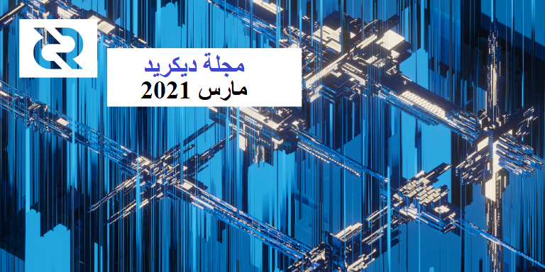

# صحيفة ديكريد لشهر مارس 2021

_الصورة: التدرج الهيكلي بواسطة saender@_

أبرز أحداث شهر مارس:

* تمت الموافقة على التصويت بالإجماع لتمكين نظام الخزينة الجديد، والذي من المفترض أن يتم تفعيله في حوالي 7 مايو، وحينها سيتم فصل العقد التي تشغل البرامج الأقدم من الإصدار 1.6 عن الشبكة.
* تم إصدار النسخة 1.6.2 في أوائل أبريل، حيث تعمل على إصلاح عدد من المشاكل المتعلقة بالخلط وتذاكر موفر خدمة التصويت، بالإضافة إلى تحسين استقرار عُقَد التحقق البسيط من الدفع، من بين تحسينات أخرى.
* اكتمل أخيرًا الترحيل الملحمي لـبوليتيا إلى واجهة تخزين خلفية جديدة أكثر مرونة وقابلة للتوسع، والتي كانت قيد التطوير لأكثر من عام!
* استقر مجتمع ديكريد على حيوان روحي للمشروع، الثور الأمريكي المهيب!

المحتويات:

* [التفرع قادم](#التفرع-قادم)
* [التطوير](#التطوير)
* [الأشخاص](#الأشخاص)
* [الإدارة و الحوكمة](#الإدارة-و-الحوكمة)
* [الشبكة](#الشبكة)
* [الإنضمام](#الإنضمام)
* [الانتشار](#الانتشار)
* [الفعاليات](#الفعاليات)
* [وسائل الإعلام](#وسائل-الإعلام)
* [مناقشات المجتمع](#مناقشات-المجتمع)
* [الأسواق](#الأسواق)
* [الخارجية ذات الصلة](#الخارجية-ذات-الصلة)
* [عن هذا العدد](#عن-هذا-العدد)

## التفرع قادم

تم [تمرير](https://explorer.dcrdata.org/agenda/treasury) تصويت الإجماع لتمكين نظام الخزينة الجديد وسيتم تفعيل القواعد الجديدة في حوالي 7 مايو. ستتوقف العقد الأقدم من الإصدار 1.6 عن المزامنة، لذا يرجى التحديث للبقاء على الشبكة. يمكنك تتبع الأيام المتبقية [هنا](https://voting.decred.org/).

يحتوي الإصدار الأخير من الإصدار 1.6.2 على إصلاحات للعديد من الأخطاء المتعلقة بالتحصيص بإستعمال موفري خدمة التصويت والخلط، بالإضافة إلى تحسين عملية التحقق البسيط من الدفع. راجع ملاحظات الإصدار الكامل والتنزيلات [هنا](https://github.com/decred/decred-binaries/releases/tag/v1.6.2)، ولا تنس [التحقق](https://docs.decred.org/advanced/verifying-binaries/) منها قبل التثبيت.

## التطوير

ما لم يُذكر خلاف ذلك، فإن العمل المَذْكُور هنا يشتمل على حالة "الدمج إلى الرئيسي". وهذا يعني أن العمل قد تم استكماله ومراجعته ودمجه في كود المصدر الذي يمكن للمستخدمين المتقدمين [بناءه وتشغيله](https://medium.com/@artikozel/the-decred-node-back-to-the-source-part-one-27d4576e7e1c)، ولكنه ليس متاحًا بعد في ثنائيات الإصدار للمستخدمين العاديين.

<a id="dcrd" />

**[dcrd](https://github.com/decred/dcrd)**

تم الدمج في الإصدار الرئيسي ونسخة الإصدار 1.6.2:

* إرسال الإعلانات [السريعة للكتل](https://github.com/decred/dcrd/pull/2606) فقط لأقران العقد الكاملة، مع عدم إرسالها للعملاء خفيفي الوزن الذين لا يمكنهم التعامل معها بشكل صحيح. يعمل هذا على تحسين استقرار اتصال التحقق البسيط من الدفع، ونتيجة لذلك، يجب أن تحتاج محافظ التحقق البسيط من الدفع إلى عدد أقل من عمليات الإصلاح.

الإضافة الرئيسية للشهر هي الحزمة الجديدة للتعامل مع [العناوين القياسية](https://github.com/decred/dcrd/pull/2610) التي من الأسهل اتباعها واستخدامها من الكود الذي يحل محلها. كما أنها أكثر عمومية، مما يسمح بإضافة أنواع جديدة من العناوين في المستقبل. وإذا كنت قد تساءلت يوما عن كيفية ارتباط "البرامج النصية" و"العناوين"، أو كيف يختلف "المعيار" عن "الإجماع"، فتحقق من [الملف التمهيدي](https://github.com/decred/dcrd/tree/master/txscript/stdaddr) الجديد للحزمة أو اتبع الأمثلة والاختبارات الشاملة لفهم كيفية عملها بشكل كامل. شكرا لجميع المراجعين و مرحبا بالقادمين الجدد — من الجيد دائما الحصول على زوج جديد من العيون!

تشكل مجموعة العناوين الجديدة، إلى جانب التغييرات الأخرى المدمجة المتصلة بالعناوين، جزءًا من إرساء بعض الأسس والهياكل الأساسية الأولية وصولا إلى التصويت بالإجماع في المستقبل.

الأعمال المدمجة الأخرى:

* خيار عدم طباعة [الطوابع الزمنية](https://github.com/decred/dcrd/pull/2608) في السجلات
* كشف أكثر دقة [لعنوان IP الخاص](https://github.com/decred/dcrd/pull/2571) لإصلاح بعض إعدادات UPnP
* زيادة تغطية الاختبار لـ `rpcserver` وذاكرة التخزين المؤقت الجديدة لإخراج المعاملات غير المنفقة

<a id="dcrwallet" />

**[dcrwallet](https://github.com/decred/dcrwallet)**

تم الدمج في الإصدار الرئيسي ونسخة الإصدار 1.6.2:

* منع عمليات الإرسال [منخفضة الرسوم](https://github.com/decred/dcrwallet/pull/2011) إلى خادم الخلط، والتي يتم رفضها الآن
* [معالجة مخرجات المعاملات غير المنفقة](https://github.com/decred/dcrwallet/pull/2013) الثابتة لتجنب الخلط بين أخطاء "عدم كفاية الرصيد" عندما يكون الرصيد المتبقي كافيا لشراء تذكرة واحدة أخرى
* تحديث [خيارات التصويت](https://github.com/decred/dcrwallet/pull/2016) لتذاكر vspd باستخدام الأمر `setvotechoices`، إذا تم إعداد مقدم خدمة التصويت في إعدادات dcrwallet
* [أمر](https://github.com/decred/dcrwallet/pull/2020) `accountunlocked` جديد للإبلاغ عن تشفير الحساب وحالة القفل (مطلوب لـ DCRDEX ولكنه مفيد أيضًا بشكل عام)
* علامة التكوين لتعطيل [تسجيل](https://github.com/decred/dcrwallet/pull/2014) الملفات

<a id="decrediton" />

**[Decrediton](https://github.com/decred/decrediton)**

قام إصدار التصحيح 1.6.2 بإصلاح العديد من الأخطاء وتحديث مكتبة الوَصْلة المؤقتة لديكريد و [الإتصال بالتريزور](https://github.com/decred/decrediton/pull/3340)

تم الدمج في الفرع الرئيسي:

* استخدم مكون شريط [التمرير](https://github.com/decred/decrediton/pull/3046) الجديد من مكتبة pi-ui
* نظرة عامة على [الأرصدة](https://github.com/decred/decrediton/pull/3319) المعاد تنظيمها
* عرض قائمة مخرجات المعاملات غير المنفقة المحولة إلى [صيغة](https://github.com/decred/decrediton/pull/3323)
* تحسين تخطيط النماذج المتعلقة [بتريزور](https://github.com/decred/decrediton/pull/2956)
* تم تحديث المشروع إلى أحدث نسخة ل [Electron 12](https://github.com/decred/decrediton/pull/3318) و [Webpack 5](https://github.com/decred/decrediton/pull/3322)
* أنهى 25 طلب سحب عاما من مهمة ترحيل كود البرنامج إلى أسلوب برمجة React الحديث مع [المكونات](https://github.com/decred/decrediton/issues/2438) الوظيفية ومجموعة التعليمات و[وحدات CSS](https://github.com/decred/decrediton/issues/2439)
* زيادة تغطية اختبار واجهة المستخدم
* ~ 11 إصلاحًا للأخطاء

تم [دمج](https://github.com/decred/decrediton/pulls?q=is%3Apr+merged%3A2021-03-01..2021-03-31+sort%3Aupdated-asc) إجمالي 53 طلب سحب من 5 مساهمين، وتغيير 504 ملفًا، مع إضافة 14.5 ألف وحذف 14.7 ألف سطر من الكود. بدون الكثير من التغييرات الملموسة للمستخدم، تعني هذه الأعداد الكبيرة أسس كثيرة من تحديثات البنية التحتية "التي تتم خلف الكواليس" لتسهيل التطوير المستقبلي.

قيد التنفيذ: إدماج [DCRDEX](https://github.com/decred/decrediton/pull/3356) وتحديثات التصميم.

<a id="politeia" />

**[بوليتيا](https://github.com/decred/politeia)**

تم [دمج](https://github.com/decred/politeia/pull/1180) الترحيل الملحمي إلى خلفية تخزين أكثر [مرونة](https://twitter.com/lukebp_/status/1376238020563767303) وقابلية للتطوير بعد ما يقارب من عام من التطوير. وعلى مستوى عالٍ، يقدم لنا ما يلي:

* قابلية التوسع - لم تعد مقيدة بنظام الملفات لمثيل واحد
* يتم فصل الطوابع الزمنية والبيانات، مما يسمح بفرض رقابة حقيقية (وحذف) البيانات دون مفاضلات محرجة. ضع في اعتبارك أن الرقابة تزيل البيانات فقط ولكن ليس السجل الذي يثبت أن الخادم قد شاهدها، أي أن "مسار التدقيق" غير قابل للتغيير.
* القدرة على استرداد دليل تشفير ذي طابع زمني لأي جزء من البيانات، على سبيل المثال تعليق واحد. لم تكن هناك طريقة سهلة للقيام بذلك في الواجهة الخلفية لـ Git.
* بنية البرنامج المساعد المناسبة حيث يمكن للمكونات الإضافية تمديد "السجلات" ذات الطابع الزمني العام مع وظائف إضافية، مثل التعليقات أو التصويت على التذاكر. يمكن تشغيل المكونات الإضافية وإيقاف تشغيلها في ملف الإعداد دون كتابة الكود.
* واجهة برمجة تطبيقات `politeiad` مبسطة
* تمت إعادة كتابة واجهة برمجة التطبيقات `politeiawww` لتكون عامة وغير محددة التطبيق بينما تتعامل المكونات الإضافية مع المسارات المتخصصة
* تحقق من [طلب السحب](https://github.com/decred/politeia/pull/1180) لمزيد من التفاصيل

أعادت تغييرات [الواجهة الخلفية](https://github.com/decred/politeia/pull/1180) و[الواجهة الأمامية](https://github.com/decred/politeiagui/pull/2306) كتابة الكثير من كود بوليتيا كما يتضح من الإحصائيات: تمت إضافة 51 ألف سطر وحذف 42 ألفًا وتغيير 474 ملفًا.

بالنسبة للمطورين، تمثل علامة الإصدار [0.2.0](https://github.com/decred/politeia/releases/tag/v0.2.0) آخر التزام يدعم الواجهة الخلفية لـ Politeiad Git، وواجهات برمجة التطبيقات للإصدار 1 من politeiad، والكثير من واجهات برمجة التطبيقات (API) الخاصة بـالنسختين `www/v1` و `www/v2` ل politeiawww.

يرحب بالجميع للانضمام إلى فريق اختبار النسخة الجديدة على [test-proposals2.decred.org](https://test-proposals2.decred.org/).

تغييرات أخرى:

* تم وضع وضع أداة سطر الأوامر politeiavoter بشكل [عشوائي](https://github.com/decred/politeia/pull/1368) حقا بدلا من استخدام فترات زمنية مجمعة عشوائية

> على المدى القصير، سنركز على تطوير الميزات التي أخذت المقعد الخلفي خلال هذه التحسينات البنيوية. أشياء مثل تحديث المقترحات من المؤلف، إطلاق منتدى مثل ريديت للمجتمع الذي يعمل على بوليتيا، إضافة استطلاعات رأي غير رسمية لأصحاب الحصص، وغيرها.
>
> الفكرة على المدى الطويل هي أن تصبح بوليتيا مخزن بيانات قابل للإعداد مختوم بالطابع الزمني بحيث يكون بمثابة الأساس لجميع أنواع حالات الاستخدام. ([lukebp@](https://twitter.com/lukebp_/status/1376259489704337408))

<a id="dcrpool" />

**[dcrpool](https://github.com/decred/dcrpool)**

[صدر](https://twitter.com/dnldd/status/1376476239062564868) مرشح الصدار للنسخة القادمة 1.2.0 للإختبار. راجع [ملاحظات الإصدار](https://github.com/decred/dcrpool/releases/tag/v1.2.0-rc2) للحصول على قائمة كاملة بإصلاحات الأخطاء والتحسينات واثنين من التغييرات العاجلة.

تم الدمج في الفرع الرئيسي:

* إصلاح حفظ المدفوعات [المؤرشفة](https://github.com/decred/dcrpool/pull/309)
* تعطيل واجهة مستخدم [البحث](https://github.com/decred/dcrpool/pull/310) عن الحساب في مجموعات فردية حيث لا تكون متوفرة
* تمت إعادة تسمية علامة الإعداد `homedir--` ب `appdata--` لتكون متوافقة مع البرامج الأخرى

<a id="dcrlnd" />

**[dcrlnd](https://github.com/decred/dcrlnd)**

اكتشف matheusd@ اختراقًا مثيرًا للاهتمام يسمح للمرء بتنفيذ عقود محددة المدة (PTLC) مع تغييرات طفيفة جدًا في كود الشبكة البرقية الحالي المصمم للعقود المقفلة زمنياً (HTLC).

تُعد PTLC (العقود المحددة المدة) تطورًا مثيرًا في الشبكة البرقية لقدرتها على معالجة [قيود](https://suredbits.com/payment-points-monotone-access-structures/) HTLCs (العقود المقفلة زمنياً) المستخدمة حاليًا، ولحالات الاستخدام الجديدة التي أصبحت ممكنة.

والواقع أن الاختراق الذي تم تمكينه من العقود المحددة المدة كان بسيطاً _بالنسبة ل matheusd@_ إلى الحد الذي جعله قادراً أيضاً على بناء كود مثير للاهتمام يسمى شجرة الصفقات متعددة الاسترداد (MRTTREE) معه، ونموذج أولي للتبرع/الدفع عبر الشبكة البرقية على رأس ذلك. يتكون النظام من [dcrlnd](https://github.com/decred/dcrlnd/compare/v0.3.1...matheusd:ptlc-poc) المصححة، و[خادم](https://github.com/matheusd/mrttree) PoC لتنسيق شجرة معاملات متعددة الاسترداد، و [Decrediton](https://github.com/matheusd/decrediton/commits/mrttree_poc) مصححة. تم شرح الرياضيات في [رسالة بريد إلكتروني](https://lists.linuxfoundation.org/pipermail/lightning-dev/2021-March/002983.html) إلى القائمة البريدية لـ lightning-dev و[فيديو](https://www.youtube.com/watch?v=m1sQGHUKU7I) تقديمي (يبدأ العرض التوضيحي لمدفوعات الشبكة البرقية في وضع عدم الاتصال عند حوالي [الدقيقة 15](https://www.youtube.com/watch?v=m1sQGHUKU7I&t=915s)).

الاختراق تجريبي ويحتاج إلى بعض التحقيقات الجادة في التشفير للتأكد من أنه آمن. ومع ذلك، فإن هذا العمل مثير للاهتمام في سياق [تذاكر](https://blog.decred.org/2019/11/11/LN-Multi-Owner-Tickets/) الشبكة البرقية متعددة المالكين (وهو شكل أفضل لتقسيم التذاكر)، بالإضافة إلى حالات الاستخدام الأخرى التي تم تمكينها بواسطة أشجار المعاملات متعددة الاسترداد مثل التبرعات خارج السلسلة والتمويل الجماعي. على عكس الإنشاءات المبنية على العقود المقفلة زمنياً لأشجار معاملات الاسترداد المتعددة المذكورة في [منشور](https://blog.decred.org/2019/11/11/LN-Multi-Owner-Tickets/) المدونة الأصلي، فإن العنصر المستند إلى العقود المحددة المدة لا يحتاج إلى كود تشغيل جديد: كود تشغيل Schnorr checkig الحالي (أو أي كود تشغيل جديد المضاف في النهاية) كاف لتمكينه.

يمكنك معرفة المزيد عن الشبكة البرقية لديكريد في الحلقة الخاصة ب matheusd@ من ديكريد في العمق، يبدأ عند [الدقيقة](https://www.youtube.com/watch?v=O6oIrRsZnMQ&t=27m54s) 28.

<a id="cspp" />

**[cspp](https://github.com/decred/cspp)**

* تم جعل الحد الأدنى من [عدد الأقران](https://github.com/decred/cspp/pull/64) قابلاً للإعداد بالنسبة للخوادم التي ترغب في زيادته لتوفير عمليات خلط ذات جودة أعلى
* دعم [LOGFLAGS](https://github.com/decred/cspp/pull/66) لتسجيل أكثر مرونة

<a id="dcrdex" />

**[DCRDEX](https://github.com/decred/dcrdex)**

* القدرة على إعادة تعيين وتغيير [كلمة المرور](https://github.com/decred/dcrdex/pull/978)
* القدرة على [تعطيل](https://github.com/decred/dcrdex/pull/985) الحساب
* السماح [بفرز](https://github.com/decred/dcrdex/pull/955) جدول الطلبات الخاص بك
* الإشارة إلى الحالة [غير المتصلة](https://github.com/decred/dcrdex/pull/989)
* دعم [التشفير](https://github.com/decred/dcrdex/pull/1023) والقفل المستند إلى الحساب لمحافظ DCR (سيتم استخدام هذا بواسطة Decrediton لقفل حساب التداول فقط وليس حساب الآخرين)
* السماح [بجلسات](https://github.com/decred/dcrdex/pull/1012) متعددة المصادق عليها (لتسجيل الدخول في متصفحات مختلفة في نفس الوقت)
* إرسال أحدث تقدير [لمعدل الرسوم](https://github.com/decred/dcrdex/pull/1000) إلى العميل لدعم عملاء التحقق من الدفع البسيط، وتحسين تقديرات الطلبات وتشديد الأمن
* إرسال بيانات [المعاملات](https://github.com/decred/dcrdex/pull/804) الخام لاستيعاب عملاء التحقق البسيط من الدفع الذين ليس لديهم مجمع ذاكرة وهم في الظلام حتى يتم استخراج معاملة العقد (وهذا أيضا يجعل العملية أكثر قوة ضد الانتشار الضعيف للمعاملة على الشبكة)
* [إطار آلي](https://github.com/decred/dcrdex/pull/956) لإختبار شبكة محاكاة الإيثيريوم أثناء التطوير
* وضع الأسس لدعم [البتكوين كاش](https://github.com/decred/dcrdex/pull/944)
* إضافة [إصدار](https://github.com/decred/dcrdex/pull/959) قاعدة البيانات وإنشاء بيانات التداول التاريخية (وحدات التخزين والارتفاعات والانخفاضات، إلخ)
* تم التحديث لاستخدام [Webpack 5](https://github.com/decred/dcrdex/pull/990) والوحدات النمطية الأخرى الأحدث
* تم تحديث [dex.decred.org](https://dex.decred.org/) بمرئيات جديدة رائعة بواسطة 30000fps@

تم [دمج](https://github.com/decred/dcrdex/pulls?q=is%3Apr+merged%3A2021-03-01..2021-03-31+sort%3Aupdated-asc) إجمالي 25 طلب سحب من 6 مساهمين، مع إضافة 22 ألفًا وحذف 9 آلاف سطر من الكود.

قيد التطوير: دعم الإيثيريوم، و بروتوكول تسجيل جديد (أكثر قوة + يدعم مدفوعات الرسوم في الأصول التعسفية)، والإدماج التجريبي ل [Electron](https://github.com/decred/dcrdex/pull/999)، والعديد من التحسينات الأخرى.

تحظى تعليقات خبراء الإيثيريوم بشأن [عقود المقايضة](https://github.com/decred/dcrdex/issues/1001) المستخدمة بتقدير كبير.

راجع المعالم الرئيسية للإصدارين [0.2](https://github.com/decred/dcrdex/milestone/6) و [0.3](https://github.com/decred/dcrdex/milestone/12) لتتبع تقدم الإصدارات التالية.

<a id="dcrios" />

**[dcrios](https://github.com/planetdecred/dcrios)**

قيد التطوير:

* إظهار [مقترحات](https://github.com/planetdecred/dcrios/pull/715) بوليتيا
* تنفيذ [الخلط](https://github.com/planetdecred/dcrios/pull/727)
* تحديث dcrlibwalet إلى أحدث الوحدات النمطية لديكريد وتصحيح مشاكل المزامنة

<a id="godcr" />

**[godcr](https://github.com/planetdecred/godcr)**

* واجهة مستخدم جديدة لصفحة [الإرسال](https://github.com/planetdecred/godcr/pull/320)
* تحديث واجهة المستخدم لصفحات [النظرة العامة](https://github.com/planetdecred/godcr/pull/338) و[الحساب](https://github.com/planetdecred/godcr/pull/348)
* إضافة صفحة [عن البرنامج](https://github.com/planetdecred/godcr/pull/352)
* إضافة التحصيص وغيرها من المعلومات إلى صفحة [تفاصيل](https://github.com/planetdecred/godcr/pull/337) الحساب
* تعديل [مدخلات](https://github.com/planetdecred/godcr/pull/341) النص
* صفحة [التصحيح](https://github.com/planetdecred/godcr/pull/346) مع السجلات
* بدء [المزامنة](https://github.com/planetdecred/godcr/pull/343) عند بدء تشغيل التطبيق بعد إدخال عبارة المرور
* طلب [عبارة المرور](https://github.com/planetdecred/godcr/pull/324) عند مزامنة محفظة مستعادة للسماح بإنشاء العنوان
* تنظيف الكود وإصلاح الأخطاء

قيد التطوير: صفحة [مقترحات](https://github.com/planetdecred/godcr/pull/331) بوليتيا ومزيد من العمل على واجهة المستخدم.

<a id="dcrdata" />

**[dcrdata](https://github.com/decred/dcrdata)**

* [تحديد](https://github.com/decred/dcrdata/pull/1808) عدد العناوين المسموح بها في طلبات POST

<a id="dcrdevdocs" />

**[dcrdevdocs](https://github.com/decred/dcrdevdocs)**

* تم نقل صفحة [ملحقات البرنامج النصي](https://devdocs.decred.org/developer-guides/script-extensions/) من dcrdocs

<a id="dcrweb" />

**[decred.org](https://github.com/decred/dcrweb)**

* إدراج مثيلات [vspd](https://github.com/decred/dcrweb/pull/965) في صفحة [موفر خدمة التصويت](https://decred.org/vsp/)
* تحديث صفحة [منصات المُبادلات](https://decred.org/exchanges/)

<a id="dcraddrscanner" />

**[الماسح الضوئي لعنوان ديكريد](https://github.com/decred/dcraddrscanner)**

* نقل مستودع الكود إلى  [decred](https://github.com/decred/dcraddrscanner) org
* تغيير الترخيص إلى ISC لتلبية متطلبات F-Droid

بالإضافة إلى [Google Play](https://play.google.com/store/apps/details?id=com.joegruff.decredaddressscanner) و التحميل المباشر من [APK](https://github.com/decred/dcraddrscanner/releases/tag/v1.08)، فإن التطبيق متاح الآن أيضاً على [F-Droid](https://f-droid.org/en/packages/com.decred.decredaddressscanner/)!

<a id="dcrmapper" />

**[مخطّط ديكريد](https://github.com/jholdstock/dcrmapper)**

أصدر jholdstock@ موقعًا إلكترونيًا يحتوي على [خريطة العالم](https://nodes.jholdstock.uk/) للعقد وعَدَد كل [وكيل مستخدم](https://nodes.jholdstock.uk/user_agents). كود المصدر متاح [هنا](https://github.com/jholdstock/dcrmapper). يمكنك إيجاد الشبكة التجريبية للموقع [هنا](https://testnet-nodes.jholdstock.uk/). سيستمتع Unix greybeards ب [386 نسق](https://nodes.jholdstock.uk/?theme=386).

<a id="ticketsplitting" />

**[تقسيم التذكرة](https://docs.decred.org/proof-of-stake/ticket-splitting/)**

قام bee@ بتجميع [مستند](https://github.com/decredcommunity/wiki/blob/master/wiki/ticket-splitting-v1.6.md) شامل يضم جميع المعارف الحديثة حول تقسيم التذاكر وبرمجيات الإصدار 1.6. الأهداف الرئيسية:

* سيعمل حل تقسيم التذاكر الحالي مع برنامج الإصدار 1.5.2 حتى حوالي 7 مايو 2021، عندما يتوقف عن المزامنة
* يوافق الجميع على أن تقسيم التذاكر أمر جيد، ولكن لا توجد حاليا موارد احتياطية لتخصيصها، نظرا لانخفاض الطلب (81 تذكرة مقسمة شهريا والتي تمثل حوالي 0.2% من جميع التذاكر).
* الحل الذي يمكن أن نتتبعه أولاً هو تصحيح [العميل](https://github.com/matheusd/dcr-split-ticket-matcher) لدعم المصادقة الجديدة في إصدار 1.6 من dcrwallet
* هذه فرصة جيدة للمطورين الجدد للتعرف على ديكريد مع جعل تحصيص ديكريد ميسور التكلفة

مسائل أخرى:

* تلقى [decredpower.com](https://decredpower.com/) عددًا كبيرًا من الروابط الجديدة وتعديلات التصميم
* [أفاد](https://bounty.decred.org/2021/03/status-update/) برنامج إيجاد العلة أنه عالج إجمالي 157 طلبًا وأن 15 منهم كانوا مؤهلين للحصول على تعويضات. تهانينا لـ [proabiral@](https://twitter.com/proabiral) الذي تم إدراجه في [قاعة المشاهير](https://bounty.decred.org/)!

_الصورة: تصميم مخطط ديكريد المستقبلي_

## الأشخاص

مرحبا بالمساهمين الجدد مع دمج الكود إلى الماستر: tuhalang@ على ([godcr](https://github.com/planetdecred/godcr/commits?author=tuhalang))!

إحصائيات المجتمع اعتبارًا من 2 أبريل:

* متابعو [التويتر](https://twitter.com/decredproject): 43,628 (706+)
* المشتركين في [ريديت](https://www.reddit.com/r/decred/): 10,797 (238+)
* مستخدمي غرفة الدردشة general# على [الماتريكس](https://chat.decred.org/): 407 (25+)
* مستخدمي [الديسكورد](https://discord.gg/GJ2GXfz): 1,409 (35-)
* مستخدمي [التيليجرام](https://t.me/Decred): 2,594 (76+)
* المشتركين في [اليوتيوب](https://www.youtube.com/decredchannel): 4,460 (40+)، المشاهدات 179 الف (+4 آلاف)
* نجوم GitHub [dcrd](https://github.com/decred/dcrd): بلغت 589 (5+)، التفرعات: 255 (3+)

تم اكتشاف نشاط ملحوظ عبر حوالي 90 حسابًا [متتبعًا](https://github.com/decredcommunity/social-media-stats):

* شهد كل من التويتر و الريديت و التيليجرام شهرًا آخر من النمو الجيد
* حصل [CoinGecko](https://www.coingecko.com/en/coins/decred)  على أكثر من 409 إعجاب (ليصل إلى 9,516) منذ منتصف مارس عندما بدأنا في تتبعه
* حساب مشروع ديكريد على Gap عمره 11 شهرًا ولكنه لا يضم سوى 7 متابعين. نرحب بأي تواصل لمساعدته على النمو.
* اكتسب [Checkmate@](https://twitter.com/_Checkmatey_) الملقب بـ "الآلة" أزيد من 1,816 متابعًا (+35٪، ليصل إلى 7,042)، وينشر ألف تغريدة أخرى من خلال 34 تغريدة يوميًا تقريبًا
* اكتسب [PermabullNino@](https://twitter.com/PermabullNino) أزيد من 398 متابعًا (+ 13٪، ليصل إلى 3,391)
* حصل [ConsensusRough@](https://twitter.com/ConsensusRough) على نسبة مدهشة بلغت 34٪ من المتابعين (ليصل إلى 580)
* حصل تيليجرام [decredbr@](https://t.me/decredbr) على زيادة 6٪ من المستخدمين (ليصل إلى 384)
* حصل تويتر [Decred_ES@](https://twitter.com/Decred_ES) على زيادة 6٪ من المتابعين (ليبلغ 1,365)
* شهد تدوينات فيسبوك [DECRED BRasil](https://www.facebook.com/groups/decredbrasil/) إنخفاضًا ملحوظًا خلال 30 يومًا من 50 إلى 19 تدوينة

ما ورد أعلاه هو أهم النقاط البارزة، ولكن يمكنك الاطلاع على التقارير الكاملة لشهري [مارس](https://decredcommunity.github.io/social-media-stats/posts/20210407.1) و[فبراير](https://decredcommunity.github.io/social-media-stats/posts/20210306.1) في مكان مخصص جديد _(يمكن أن يناسب /*جميع /*أرقامي -- bee@)_.

شكرا لسفراء ديكريد على جميع المنابر لزيادة الوعي حول المشروع!

## الإدارة و الحوكمة

تلقت [الخزينة](https://explorer.dcrdata.org/address/Dcur2mcGjmENx4DhNqDctW5wJCVyT3Qeqkx) في شهر مارس 11,531 DCR وأنفقت 4,196 DCR - من ناحية أخرى، فإن 3,010 من هذا المبلغ كانت دفعًا متأخرًا لفواتير شهر يناير، وبالتالي فإن المبلغ المدفوع لفواتير فبراير كان فقط 1,184 DCR. وباستخدام معدل المتوسط اليومي لشهر مارس ب DCR/USD والذي يقدر ب 161.01 دولارًا، ستكون الخزينة قد تلقت 1.86 مليون دولار أمريكي وأنفقت 676 ألف دولار أمريكي. بلغت قيمة الأرقام التي تمت فوترتها بالدولار الأمريكي للأعمال السابقة في شهر فبراير 135 ألف دولار أمريكي (بسعر 113.76 دولارًا) و 163 ألف دولار كمدفوعات متأخرة لشهر يناير (بسعر 54.25 دولارًا). واعتباراً من 4 أبريل، بلغ رصيد الخزينة 663,658 DCR (أي ما يقارب 124 مليون دولار أمريكي بسعر 187.04 دولارًا أمريكيًا).

تم نشر ثلاثة مقترحات في مارس.

* قدّر [اقتراح](https://proposals.decred.org/proposals/e1cda44) الإشراف لسنة 2021 ميزانية قدرها 8,800 دولار (بحد أقصى 16,500 دولار) للعام، وتمت الموافقة عليه بنسبة دعم 93.4٪ ونسبة مشاركة بلغت 36٪.
* يطلب [اقتراح](https://proposals.decred.org/proposals/76eba5a) التصميم لتغطية ما تبقى من 2021 مبلغا أقصاه 58,850 دولارا، وأبلغ عن نقص في الإنفاق على الاقتراح السابق بحيث لم يستخدم سوى 60% من ميزانيته. ويرتبط معظم قصور في الإنفاق بالمجالات الفرعية للهوية والاتصالات البصرية. وقد نشر [هنا](https://github.com/decred/dcrdesign/issues/252) تقرير سجل العمل المتعلق بالاقتراح السابق.
* [اقتراح](https://proposals.decred.org/proposals/95a1409) محتوى الفيديو (المرحلة 3) جاهز للتجديد بميزانية أقصاها 18,800 دولار لمدة 6 أشهر أخرى، ومساهمان جديدان (karamble@ وDecredSociety@). تم استخدام 41٪ فقط من الميزانية خلال المرحلة السابقة.

نشر bee@ قائمة بجميع المقترحات [المعتمدة النشطة](https://decredcommunity.github.io/proposals/approved) لتتبع تلك التي ستنتهي قريبا.

يضم [العدد 41](https://blockcommons.red/politeia-digest/issue041/) من مجلة موجز بوليتيا المزيد من التفاصيل حول مقترحات الشهر.

## الشبكة

**معدل الهاش**: افتتحت معدلات [الهاش](https://explorer.dcrdata.org/charts?chart=hashrate&zoom=kkf13di6-kltwy2po&scale=linear&bin=block&axis=time) في شهر مارس على ~410 Ph/s وأغلقت على ~496 Ph/s، وبلغ قاعها عند 228 Ph/s كما بلغت ذروتها عند 620 Ph/s على مدار الشهر.

توزيع معدل التجزئة الذي تم [الإبلاغ](https://miningpoolstats.stream/decred) عنه بواسطة المجمعات في 1 أبريل: Antpool بنسبة 37%، و Poolin بنسبة 29%، و F2Pool بنسبة 10%، و easy2mine بنسبة 8%، و Luxor بنسبة 1.3%، و BTC.com بنسبة 1.3%، و Coinmine بنسبة 0.04%، و UUPool بنسبة 0.04%، وأخرى غير معروفة بنسبة 13%.

توزيع 1,000 كتلة تم [تعدينها](https://miningpoolstats.stream/decred) بالفعل قبل 1 أبريل: Poolin بنسبة 30%، و Antpool بنسبة 27%، و F2Pool بنسبة 8%، و easy2mine بنسبة 4%، و Luxor بنسبة 2%، و BTC.com بنسبة 1.6%، و Coinmine بنسبة 0.1%، وأخرى غير معروفة بنسبة 27%.

يبدوا أن أعلى معدل تجزئة ل UUPool قد إنتقل إلى Antpool و F2Pool.

**التحصيص**: تراوح [سعر التذكرة](https://explorer.dcrdata.org/charts?chart=ticket-price&zoom=kln9bt1o-kn255ihw&axis=time&visibility=true-true&mode=stepped) بين 154.3 و 221.5 DCR، [بمتوسط](https://dcrstats.com/) ​​30 يومًا عند 178.0 DCR (ناقص 3.7). في الأشهر الثلاثة الأولى من عام 2021، شهد سعر التذكرة أعلى تذبذب منذ تغيير خوارزمية السعر في عام 2017، حيث يتأرجح بين ~150 و ~220.

بلغ [المبلغ المقفل](https://explorer.dcrdata.org/charts?chart=ticket-pool-value&zoom=kln9bt1o-kn255ihw&scale=linear&bin=block&axis=time) 7.10-7.46 مليون DCR، مما يعني أن 56.0-58.7٪ من العرض المتاح [شارك](https://explorer.dcrdata.org/charts?chart=stake-participation&zoom=kln9bt1o-kn255ihw&scale=linear&bin=block&axis=time) في إثبات الحصة - لقد بلغ مرة أخرى أعلى مستوياته على الإطلاق.

مقدم خدمة التصويت: في 1 أبريل، تم حجز 6.6 ألف تذكرة مباشرة بواسطة خوادم vspd و 4.0 آلاف تذكرة بواسطة خوادم dcrstakepool القديمة. مقارنةً بفاتح مارس، تم ترحيل أكثر من 2.2 ألف تذكرة إلى نظام vspd الجديد. أبلغ مقدمو خدمات التصويت القديمون عن 11 ألف مستخدم نشط وإجمالي 22 ألف مستخدم. استحوذ جميع مزودي خدمة التصويت معًا (17 قديمًا و 11 جديدًا) على 26٪ من مجموع التذاكر.

**العقد**: طوال شهر مارس، كان هناك حوالي 215 عقدة يمكن الوصول إليها وفقًا لـ [dcrextdata](https://dcrextdata.planetdecred.org/nodes).

إصدارات العقد اعتبارًا من [لقطة](https://nodes.jholdstock.uk/user_agents) 1 أبريل (إجمالي 247، dcrd فقط): النسخة 1.6.1 - 32٪، النسخة 1.6.0 - 32٪، النسخة 1.5.1 - 10٪، النسخة 1.5.2 - 8٪، النسخة 1.7 لبناءَات التطوير- 8٪، نسخة التطوير 1.6 - 6٪، النسخة 1.5.0 - 2.4٪، النسخة 1.6.2 - 1.2٪.

زادت حصة [العملات المختلطة](https://explorer.dcrdata.org/charts?chart=coin-supply&zoom=kln9bt1o-kn255ihw&bin=day&axis=time&visibility=true-true-true) تدريجيًا من 39٪ إلى 44٪. تفاوتت [الكمية المختلطة](https://explorer.dcrdata.org/charts?chart=privacy-participation&zoom=jzk95g03-kncehhc0&bin=day&axis=time) اليومية بين 200 و 350 ألف DCR.

شهدت [الشبكة البرقية](https://ln-map.jholdstock.uk/) لديكريد اعتبارًا من 1 أبريل، 34 عقدة (بزيادة 4 عقد)، و 60 قناة (4+) بسعة إجمالية قدرها 20 DCR (بزيادة 3.2).

تُظهر الرسوم البيانية التي شاركها Checkmate@ زيادة حجم [المعاملات](https://twitter.com/_Checkmatey_/status/1372684156908437508) (حجم 2021 يبدو أكثر دراماتيكية عند [تعديله](https://twitter.com/_Checkmatey_/status/1369787880776691712) لتداول العرض) وكيف ارتفعت حصة [الرسوم](https://twitter.com/_Checkmatey_/status/1375608621417996288) في إجمالي مكافأة الكتلة من 0.01٪ إلى 0.12٪ منذ أكتوبر 2020.

[شارك](https://www.reddit.com/r/decred/comments/m547to/not_focusing_on_split_tickets_will_affect_us/gr0in3e/) matheusd@ الرسوم البيانية لمشتريات التذاكر المقسمة [حسب الشهر](https://github.com/decredcommunity/wiki/blob/files/files/20210315.1.png) (80 في المتوسط​، وتصدرت 127 في مارس 2020) وعدد [المشاركين](https://github.com/decredcommunity/wiki/blob/files/files/20210315.2.png) (4 هو الأكثر شيوعًا).

## الإنضمام

أعلن مقدم خدمة التصويت [decred.raqamiya.net](https://decred.raqamiya.net/) أنه سيتم إغلاقه. وحتى 5 أبريل، كان [يتوفر](https://decred.raqamiya.net/stats) على 128 مستخدمًا نشطًا و 284 مستخدمًا في الإجمال، و 52 تذكرة حية، وأكثر من 20 ألف تذكرة تم التصويت عليها منذ عام 2017. أظهر مزود خدمة التصويت واجهة مستخدم مخصصة، وإشعارات عبر البريد الإلكتروني على التذاكر التي تم التصويت عليها، و 4 خوادم تصويت في 3 قارات. تطلب [الصفحة الرئيسية](https://decred.raqamiya.net/) عدم شراء أي تذاكر جديدة، ولكن سيتم دعم التذاكر الحية حتى يتم استدعائها جميعًا. شكرا على خدمتكم!

[أعلنت](https://twitter.com/_cexz_/status/1366501324536299523) منصة مُبادلات [CexZ](https://www.cexz.ca/) عن قائمة إدراج DCR/BTC وجاءت [لزيارة](https://www.reddit.com/r/decred/comments/lvl8i0/decred_dcr_added_to_the_btc_market/) r/decred.

تحذير: ليس لدى مؤلفي مجلة ديكريد أي فكرة عن مصداقية أي من الخدمات المذكورة أعلاه. يرجى إجراء البحوث الخاصة بك قبل الوثوق بمعلوماتك الشخصية أو الأصول إلى أي كيان.

## الانتشار

انفجر [الشعار](https://twitter.com/BisonContent/status/1370827335973416960) الجديد للثور الأمريكي في مارس، وبلغ ذروته في  تغريدات ديكريد الثور الأمريكي مما أدى إلى فتح حساب تويتر بإسم [BisonContent@](https://twitter.com/BisonContent) خاص بمحتوى الثور الأمريكي. أجريت معظم أبحاث الثور الأمريكي في غرفة محادثات [trading#](https://chat.decred.org/#/room/#trading:decred.org) (تمت الإشارة إليه ما يقارب من 400 مرة). تعود [الإشارات](https://matrix.to/#/!hxDOGQVaUlvoqMMcOB:decred.org/$CWpMA7avAE_gWjVVwGglZPIAxxEO-QJ1WwqfT4JfIrw) الأولى إلى دردشات 2019 حول Bison Trails، وهي شركة بنية تحتية لسلسلة الكتل في مدينة نيويورك (والتي تعرض [خدمات ديكريد](https://bisontrails.co/decred/) الآن!). لكن الضجة بدأت حقًا عندما تم العثور على صلة أقوى مع ديكريد من قبل Void@ و karamble@ في [ورقة بحثية](https://www.researchgate.net/publication/281933407_Collective_decision_making_during_group_movements_in_European_bison_Bison_bonasus) عام 2015 بعنوان ""اتخاذ القرار الجماعي أثناء التحركات الجماعية للثور الأوروبي، Bison bonasus".

> التنسيق الجماعي وتزامن الأنشطة أمران أساسيان للحفاظ على تماسك المجموعات أثناء التحركات الجماعية. وتتأثر القرارات الجماعية الناشئة عن هذا التزامن بالعوامل الإيكولوجية والاجتماعية الديمغرافية. (…) ومن الأرجح أن أن يتم إتباع صاحب المبادرة إذا سار في الاتجاه الذي أشارت إليه أغلبية الأفراد، مما يشير إلى _عملية التصويت_.

تم إنشاء قناة تليجرام بإسم [DCRann@](https://t.me/DCRann) لتعكس الإعلانات المهمة وتقلل الإعتماد على التويتر

شارك pavel@ المزيد من [الأفكار](https://github.com/decredcommunity/proposals/blob/master/proposals/2bf72e/updates/20210313.md) عن تشغيل اقتراح [withDecred.org](https://proposals.decred.org/proposals/2bf72e6). في المجموع تم توزيع 11.6 DCR في 5 جولات. كان الناس منخرطين في تويتر حتى بدون حصولهم على مكافأة. و كان حث الأشخاص على زيارة [الموقع](https://withdecred.org/) تحديا، حتى مع التغريدات التي تمت رعايتها. ومن الشائع لدى مستخدمي تويتر أن يستهلكوا بسرعة ويعجبوا/يعيدوا التغريد إذا أحبوا المحتوى. مع وضع ذلك في الاعتبار، تم اختزال محتوى الموقع إلى [عاصفة تغريدات](https://twitter.com/withdecred/status/1325147231935098880) عملاقة مثبتة على ملف تعريف التويتر.

تحظى التقارير الواردة من تجارب التوعية مثل تلك المذكورة أعلاه بالتقدير لأنها تساعد المجتمع على معرفة ما يصلح وما لا يصلح، وتحسن في نشر رسالتنا.

إنجازات Monde PR لشهر مارس:

* إنشاء وعرض قصتين على منشوارت المالية و العملات الرقمية
* الرد على طلب واحد للتعليق
* تأمين مقابلة إعلامية واحدة

التغطية الإعلامية المؤمنة بواسطة Monde PR:

* ظهر jy-p@ على بودكاست [Finance Magnates](https://www.financemagnates.com/cryptocurrency/interview/decreds-jake-yocom-piatt-on-bitcoin-blockchain-governance-dcr-more/) حيث تحدث عن البتكوين، و حوكمة سلسلة الكتل، و ديكريد، و قد تم توزيعه على أربع منافذ إخبارية بما في ذلك [Tech Centry](https://techfans.co.uk/decreds-jake-yocom-piatt-on-bitcoin-blockchain-governance-dcr-more/)

تذكير للجميع، إذا كانت لديك تغريدة رائعة أو محتوى تريد مشاركته، فلا تتردد في طرحه على غرفة محادثات [media#](https://chat.decred.org/#/room/#media:decred.org) واطلب إعادة تغريد عبر decredproject@.

_الصورة: قوة الثور الأمريكي_

# الفعاليات

الحضور:

* 12-14 مارس - [هاكاثون ناياريت 2021](https://decredcommunity.github.io/events/index/20210312.1) - الإنترنت. رعت ديكريد باللغة الإسبانية الهاكاثون الذي نظمته وزارة التربية والتعليم في ناياريت. لإعداد المشاركين، استضاف الفريق الإسباني أسبوع التدريب التعليمي لسلسلة الكتل، والذي يتكون من 5 ندوات عبر الإنترنت. تم تقسيم مجموع جوائز الهاكاثون البالغة 1,000 دولار على النحو التالي: 500 دولار للمركز الأول و 300 دولار للمركز الثاني و 200 دولار مقسمة على باقي المشاركين العشرين الذين قدموا المشاريع النهائية. بعد الهاكاثون، تم عمل جلسة تعليمية للفائزين لمعرفة كيفية استخدام Decrediton ومحافظ الهاتف المحمول ومعلومات عامة حول كيفية تخزين واستخدام العملات الرقمية. استمرت لمدة 3 ساعات وأتيحت للفائزين فرصة طرح الأسئلة أثناء استلام جوائزهم. مزيد من التفاصيل [هنا](https://decredcommunity.github.io/events/index/20210312.1).
* 15 مارس - [حالة تبني العملة الرقمية في المغرب](https://decredcommunity.github.io/events/index/20210315.1) - الإنترنت. تمت دعوة arij@ لإجراء مقابلة مع Tony Obiajuru من برنامج InsideBlockchain#\ على قناة CryptoTvplus حيث تحدثت عن حالة تبني العملات الرقمية في المغرب، وعن ديكريد وعملها في المشروع.

## وسائل الإعلام

مقالات مختارة:

* قدمت arij@ من "مشروع العملة الرقمية الديكريد" تعليقًا على [CoinDesk](https://www.coindesk.com/crypto-is-banned-in-morocco-but-bitcoin-purchases-are-soaring) حول حالة تبني العملة الرقمية في المغرب. تمت ترجمة المقال إلى أكثر من 4 لغات وانتشر قليلاً في الأخبار الإلكترونية المغربية. [علق](https://www.youtube.com/watch?v=yWLNOlKbhtc) محافظ البنك المركزي المغربي على المقال، قائلاً إنهم شكلوا لجنة لدراسة العملات المشفرة والعملات الرقمية للبنك المركزي لمواكبة الابتكار، وأن البتكوين ليست نقودًا لأنها مضاربة وغير منظمة، ولكن في النهاية لا يمكن منع الأشخاص من استخدامها. كمتابعة، أطلق بنك المغرب مقطع [فيديو](https://www.youtube.com/watch?v=38N24GrUTxY) يثني عن استخدام البتكوين لأنها تمثل مخاطرة كبيرة.
* تم ذكر الإصدار 1.6.1 من ديكريد و "التفرع الصلب المفعل بالمستخدم" لإضفاء اللامركزية على الخزينة في إصدار f2pool الذي يُنشر كل أسبوعين في العددين [09-مارس](https://f2pool.io/mining/pow-round-up/20210309-pow-round-up/) و [23-مارس](https://f2pool.io/mining/pow-round-up/20210323-pow-round-up/) من مجلة PoW Round-Up
* ما هي الديكريد؟ بقلم صموئيل شيروود ([exodus.com](https://www.exodus.com/blog/what-is-decred/))

أشرطة الفيديو:

* مقابلة مباشرة لماتيوس ديجيوفاني مع elima\_iii@ في ديكريد في العمق على ([اليوتيوب](https://www.youtube.com/watch?v=O6oIrRsZnMQ)) - الخزينة الجديدة، أكواد التشغيل، الشبكة البرقية وغيرها
*  فيديو تعليمي عن تحصيص ديكريد - تحديث 2021 بواسطة Exitus@ ([اليوتيوب](https://www.youtube.com/watch?v=olWfTqw16OQ))
* إستكشاف ديكريد و التحليل على السلسلة بواسطة Real Vision على ([realvision.com](https://www.realvision.com/shows/the-interview-crypto/videos/exploring-decred-and-on-chain-analysis/)) - مقابلة مع Checkmate@، يمكنك مشاهدة عينة مجانية على [اليوتيوب](https://www.youtube.com/watch?v=SLr-XTqPL4s) (يذكر التخفيض غير المسبوق في سيولة البتكوين) أو الحلقة الكاملة عن طريق الاشتراك في الموقع
* العقود المحددة المدة، وشجرة الصفقات متعددة الاسترداد، ومدفوعات الشبكة البرقية غير المتصلة بالإنترنت بواسطة على matheusd@ ([اليوتيوب](https://www.youtube.com/watch?v=m1sQGHUKU7I))
* تحديث أخبار ديكريد - لا مركزية الخزينة البالغة قيمتها 110 مليون دولار، والتصويت على الحوكمة على السلسلة، وأعلى مستوى على الإطلاق للشبكة والمزيد بواسطة Exitus@ على ([اليوتيوب](https://www.youtube.com/watch?v=yX9zfO_2KTo))
* تحليل سعر ديكريد - 24 مارس 2021 بواسطة Josh Olszewicz من Brave New Coin ([اليوتيوب](https://www.youtube.com/watch?v=5UyRni0rjHc)) - _ديكريد تضرب و تسحق_

الصوتيات:

* يتحدث جيك يوكوم بيات من ديكريد عن البتكوين، وحوكمة سلسلة الكتل، و ديكريد والمزيد بواسطة Rachel McIntosh ([اليوتيوب](https://www.youtube.com/watch?v=SOoCbr51sus)، نسخة نصية معدلة في [financemagnates.com](https://www.financemagnates.com/cryptocurrency/interview/decreds-jake-yocom-piatt-on-bitcoin-blockchain-governance-dcr-more/))

الترجمة:

* تمت إضافة ترجمات باللغة الإسبانية إلى بعض مقاطع الفيديو الأكثر مشاهدة [للقناة](https://www.youtube.com/decredchannel): فيديو تعليمي عن [كيفية التحصيص](https://www.youtube.com/watch?v=m5lcm6yttEk)، و[العقدة الكاملة وتور](https://www.youtube.com/watch?v=B-5O_GBcbV0) على Raspberry Pi، [عرض تفصيلي عن الحوكمة](https://www.youtube.com/watch?v=1QiC0btcf7E) مع Checkmate@، الحلقة 15 من Decred Assembly عن [ديكريد و ASIC](https://www.youtube.com/watch?v=7K2sDhyjQys)، و[تحديث أخبار](https://www.youtube.com/watch?v=cZx4azGOvqQ) 14 فبراير، و آخر حلقة[ لديكريد في العمق](https://www.youtube.com/watch?v=O6oIrRsZnMQ) مع matheusd@.
* تمت [ترجمة](https://xaur.github.io/decred-news/)  مجلة ديكريد لشهر فبراير 2021 إلى العربية (arij@ و abdulrahman4@) والصينية (Dominic@) والإسبانية (_\francov@). شكراً لكم جميعاً على نشر أخبار ديكريد!

## مناقشات المجتمع:

منشورات مختارة من الريديت:

* [أنماط](https://www.reddit.com/r/decred/comments/lzr2w8/decredbitcoin_chart/) غريبة على الرسم البياني للسعر
* مجموعة من [الأشياء الصعبة](https://www.reddit.com/r/decred/comments/m3k31o/161_things_ive_learned/) في التحصيص المختلط في النسخة 1.6.1 لمحفظة ديكريديتون وكيفية حلها
* دعوة إلى [دورة](https://www.reddit.com/r/decred/comments/m618sa/decred_is_in_the_2021_ultimate_crypto_tournament/) استطلاع على التويتر (والمفارقة في الترويج لها لمجتمع مهووس بتقنية التصويت القوية)
* ملاحظات عن المقاومة [الكَمِيّة](https://www.reddit.com/r/decred/comments/m6w2ue/q_re_quantum_resistance/)
* [إثارة إهتمام](https://www.reddit.com/r/decred/comments/marjaa/generating_media_for_upcoming_consensus_vote/) وسائل الإعلام حول آخر تصويت بالإجماع (وتحديات نشر الخبر)
* أصبح [حديث السعر](https://www.reddit.com/r/decred/comments/mg5hhj/has_anybody_noticed_that_decred_has_finally/) الأخير لشهر مارس ذكيًا مرة أخرى وقارن ديكريد ب Python

مناقشات مختارة من التويتر:

* يواصل jy-p@ الحديث في الإتجاه [المعاكس](https://twitter.com/behindtext/status/1368655110449094657)  عن إنشاء نظام مالي أكثر عدلاً
* [يقترح](https://twitter.com/Ammarooni/status/1367655623698096128) ammarooni@ التحدث أكثر عن قيمة الدولار الأمريكي المقفلة في التذاكر لأنها تتجاوز 1 مليار هو إنجاز كبير
* [ربط](https://twitter.com/TheBochinchero/status/1375072938106445824) bochinchero@ ارتفاع الأسعار بزيادة مشاركة الحصة وإقبال الناخبين ونشاط الاختلاط، وأشار إلى أن قابلية الاستبدال تكون قوية عندما تكون ضخمة:

>أكثر من 43٪ من العرض المتاح لديكريد بالدولار مختلط وغير منفق الآن. يجادل البعض بأن تمكين الخصوصية أو السجل الشفاف لا يمكن أبدًا استبدالهما حقًا ... بصراحة لا يمكنني التفكير في ممثل عقلاني يقبل عملة عن طيب خاطر، لكنه يرفض نصف العملات المتداولة. ([TheBochinchero@](https://twitter.com/TheBochinchero/status/1375072954493636608))

## الأسواق

في مارس، تم تداول DCR بين 140.16-180.60 دولارًا أمريكيًا / BTC 0.00275-0.00310. وكان متوسط ​​السعر اليومي 161.01 دولار.

نشر PermabullNino@ أن بيانات ديكريد على السلسلة في نمط الوحش، حيث أنها إستقرت على وحدات محلية أكثر أربع مرات من البتكوين في شهر فبراير.

قام Checkmate@ بتحديث مخطط [المقارنة](https://twitter.com/_Checkmatey_/status/1369769392884436992) الخاص به بين "عملات Lindy" مقابل البتكوين حيث ارتفع من 10 آلاف دولار إلى 58 ألف دولار. تستمر ديكريد في التميز.

## الخارجية ذات الصلة

الكارثة الكبيرة التي شهدتها Defi في شهر مارس كانت تخص عملة PAID، والتي تعرضت [لهجوم](https://cointelegraph.com/news/paid-network-exploiter-nets-3-million-in-infinite-mint-attack) تعدين لانهائي أدى إلى قيام المهاجم بإصدار 180 مليون دولار من عملة PAID لأنفسهم، ولكنهم على ما يبدو لم يتمكنوا إلا من الاستيلاء على 3 ملايين دولار أميركي من القيمة من خلال تحويلها إلى شيء آخر دون خفض قيمة توكنات PAID بسرعة (إنخفاض بنسبة 85% في مرحلة واحدة). بعد [تقييم الموقف](https://paidnetwork.medium.com/paid-network-attack-postmortem-march-7-2021-9e4c0fef0e07)، تم توضيح أن المهاجم تمكن من الوصول إلى المفتاح الخاص لنشر العقد الأصلي واستخدمه "لتحديث" العقود حتى يتمكنوا من تعدين توكنات جديدة. سيتم استخدام التحليل الانتقائي لـ "إعادة تعيين" توكن PAID لمسح توكنات المهاجم التي لم يتمكنوا من بيعها قبل اكتشافها.

تتعامل SushiSwap مع [معضلة](https://decrypt.co/62522/defi-exchange-sushiswap-faces-an-880-million-dilemma) كبيرة حول كيفية توزيع التوكنات التي تدين بها لمزودي السيولة من أكتوبر 2020 ، وكان لدى التوكنات "فترة استحقاق" ستة أشهر، وقد أثيرت مسألة كيفية توزيعها في يناير 2021. صوّت حاملو SUSHI بالفعل ضد االإسقاط الجوي المباشر للتوكنات واختاروا آلية المطالبة التي ستكلف رسوم المطالبين، ولكن تبين بعد ذلك أن كود العقد الذكي قد تم تعديله بحيث لم يعد بإمكان المستخدمين الذين تفاعلوا معه المطالبة به من خلال عقود ذكية لطرف ثالث (مثل Harvest.finance، التي يدين مستخدموها بنسبة 5-6٪ من هذه التوكنات). السبب الذي قدمه المطورون الذين نشروا هذا التحديث هو القلق من أن "المزارع الطفيلية" سوف تتخلص من تخصيصات التوكنات الخاصة بهم. الأحدث هو أن هذه المزارع يمكنها تقديم مقترحات حول كيفية توزيع مخصصاتها، ليراجعها مجتمع Sushiswap.

[وافق](https://www.coindesk.com/cosmos-vote-approve-inter-blockchain-communication) ناخبو كوزموس على بروتوكول "تفاعل سلسلة الكتل المتبادل IBC" بأغلبية تتراوح بين 112 مليون إلى خمسة وسبعين، وهو يَعِدُ بتمكين الاتصال الآمن بين سلاسل الكتل التي تفي بمعايير معينة. ونظرًا لأن Cosmos هي سلسلة الكتل الوحيدة التي تدعم معيار IBC هذا، فهي ليست مفيدة جدًا حاليًا، ولكن من المحتمل أن تضيف سلاسل الكتل الأخرى المستندة إلى Tendermint دعمًا قريبًا أيضًا.

تم تضمين EIP 1559 من للإيثيريوم في التفرع الصلب المسمى بلندن، كما تقرر في [دعوة](https://www.youtube.com/watch?v=xWfR-WxjmYg) المطورين الأساسيين في 5 مارس. سيغير برنامج EIP 1559 بشكل أساسي كيفية حساب رسوم المعاملات ودفعها، وكسب دعم معظم المستخدمين والمطورين من خلال الوعد بتحسين تجربة المستخدم بشكل كبير. ومع ذلك، فقد [أشار](https://twitter.com/_Checkmatey_/status/1366831390424068098) المعدنون إلى [معارضة](https://www.coindesk.com/ethereum-improvement-proposal-1559-london-hard-fork) هذا التغيير، حيث عارضه أكثر من 60٪ لأنه سيتداخل مع مصدر واحد للدخل بالنسبة لهم. ويشير [التحليل](https://insights.deribit.com/market-research/miners-will-accept-eip-1559-here-is-why/) من Hasu إلى أن المعدنين سيوافقون على أي حال حيث لا يزال بإمكانهم كسب ربح جيد من مكافآت الكتلة وقيمة التعدين القابلة للاستخراج (MEV)، في حين يمكن تفسير البديل على أنه هجوم على الشبكة ومن المرجح أن يلحق الضرر بسعر ETH (وبالتالي الحد الأدنى للمعدنين).

قامت هيئة الضرائب في المملكة المتحدة [بتحديث](https://www.coindesk.com/uk-tax-authority-updates-treatment-of-crypto-assets-to-incorporate-staking) توجيهاتها لمعالجة أصول العملات الرقمية لتغطية التحصيص لأول مرة - وهذا يجب أن يعامل بنفس الطريقة التي يعامل بها دخل التعدين حاليا، ولكن قد يفتح الباب أمام معاملة متباينة في المستقبل.

[تلقى](https://twitter.com/6102bitcoin/status/1367376460214853632) المدافع عن الخصوصية 6102bitcoin@ تقريرًا يفيد بأن Bitstamp Europe طلبت من مستخدميها شرح معاملة CoinJoin التي تم إجراؤها باستخدام محفظة Wasabi بعد فترة وجيزة من الانسحاب، وتم تقديم هذا الطلب بعد _أشهر من النشاط_. وقد أشارت أحد [الردود](https://twitter.com/thibm_/status/1367613186950766603) إلى أن المشغلين يتعرضون لضغوط من قبل الحكومات التي تفرض هذه القواعد، مثل ترخيص مزودي خدمات الأصول الرقمية الفرنسي (DASP) الذي يطلب فحص التبديل على السلسلة في كلا الاتجاهين (الواردة والصادرة). في وقت سابق ، أصدرت Bitstamp [أخبارًا](https://cointelegraph.com/news/bitstamp-crypto-exchange-users-bemoan-additional-kyc-requirements) عن مطالبة عميل مقيم في هولندا بمشاركة كمية غير عادية من المعلومات الشخصية، بما في ذلك صافي الثروة والدخل السنوي، وإثبات الإقامة، وأصول الأموال النقدية والعملات الرقمية.

تم [تعليق](https://www.coindesk.com/youtube-suspends-coindesk) حساب CoinDesk على اليوتيوب لمدة يوم 1 تقريبا، بعد ما يبدو أنه تم إزالة قناتهم عن طريق الخطأ.

يبدو أن طريقة جديدة لصرف العملة الرقمية قد شاعت في روسيا، أو "[الكنز المدفون](https://www.nasdaq.com/articles/russias-darknet-criminals-have-novel-crypto-cash-out-system%3A-buried-treasure-2021-03-22)"، أوتغيير أماكن تسليم الأموال لأماكن محددة.

## عن هذا العدد

هذا هو العدد 36 من مجلة صحيفة ديكريد. فهرس جميع الإصدارات والمرايا والترجمات متاح [هنا](https://xaur.github.io/decred-news/).

يتم نقل معظم المعلومات الواردة من أطراف ثالثة مباشرة من المصدر بعد التحقق من الحد الأدنى لصحتها. ليس لدى مؤلفي مجلة صحيفة الديكريد القدرة على التحقق من جميع الادعاءات.رجاء إحذر من أعمال الاحتيال وقم ببحثك الخاص.

يمكنك إرسال قصة [هنا](https://github.com/xaur/decred-news/labels/next%20release) للنظر فيها للإصدار التالي. [التعليقات](https://github.com/xaur/decred-news/blob/docs/contributing.md#feedback) و[المساهمات](https://github.com/xaur/decred-news/blob/docs/contributing.md) مرحب بها دائما

الاعتمادات (بالترتيب الأبجدي):

الكتابة والتحرير: bee و degeri و l1ndseymm و richardred

المراجعات والتعليقات: arij و davecgh و dnldd و jholdstock و JoeGruff و lukebp و matheusd

صورة العنوان: saender

التمويل: أصحاب حصص الديكريد

النسخة الأصلية لمجلة الديكريد لشهر مارس متوفرة على هذا الرابط [هنا](https://xaur.github.io/decred-news/journal/202103)

تمت الترجمة إلى اللغة العربية بواسطة: arij@. قام بالمراجعة abdulrahman4@.
