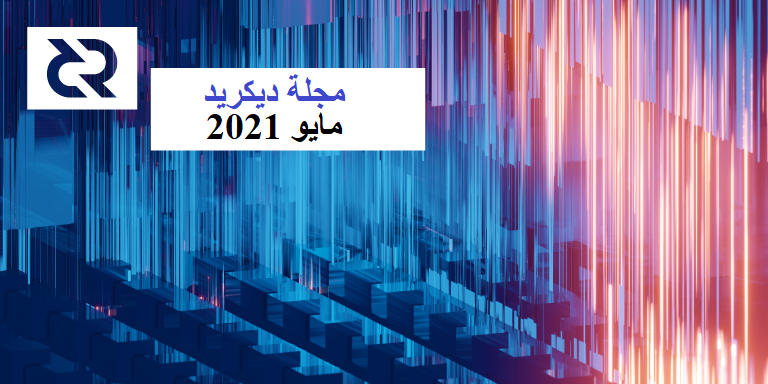
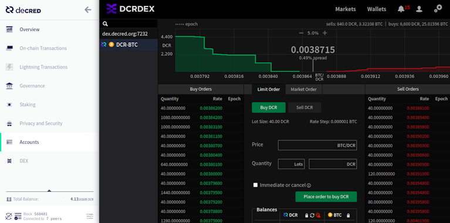
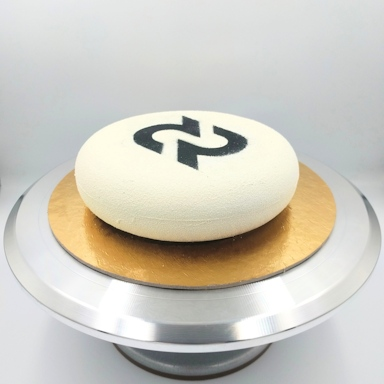

# صحيفة ديكريد لشهر مايو 2021

_الصورة: التَّكْعِيبِيَّة التصاعدية بواسطة saender@_

أبرز أحداث شهر مايو:

* يتلقى نظام الخزينة الجديد بفعالية مكافآت الكتل وقد تم اختباره بالفعل مع الموافقة على أول معاملات الإنفاق الجديدة وتعدينها.
* تم إصدار النسخة 1.6.3 من برنامج العقدة والمحفظة لإصلاح بعض المشكلات المتعلقة بالتحصيص بإستخدام مزود خدمة التصويت، وإضافة بعض من أحدث الميزات.
* تم إصدار النسخة 0.2.0 من برنامج منصة المبادلات اللامركزية لديكريد DCRDEX، والتي تتضمن أكثر من ثلاثة أشهر من العمل، وتمت إضافة إدماج البرنامج التجريبي ل DCRDEX إلى الإصدار 1.6.3 من ديكريديتون.

المحتويات:
* [إصدار النسخة التصحيحية 1.6.3](#إصدار-النسخة-التصحيحية-1.6.3)
* [تفعيل الخزينة الجديدة](تفعيل-الخزينة-الجديدة)
* [التطوير](#التطوير)
* [الأشخاص](#الأشخاص)
* [الإدارة و الحوكمة](#الإدارة-و-الحوكمة)
* [الشبكة](#الشبكة)
* [النظام البيئي](#النظام-البيئي)
* [الإنضمام](#الإنضمام)
* [الانتشار](#الانتشار)
* [وسائل الإعلام](#وسائل-الإعلام)
* [مناقشات](#مناقشات)
* [الأسواق](#الأسواق)
* [الخارجية ذات الصلة](#الخارجية-ذات-الصلة)

## إصدار النسخة التصحيحية 1.6.3

يعمل الإصدار الأخير من محفظة واجهة المستخدم الرسومية ديكريديتون الرئيسية الخاصة بنا على إصلاح المشكلات المتعلقة بالتحصيص باستعمال مزود خدمة التصويت، ويجعل المحفظة "أكثر روعة" من خلال فتح الحسابات بشكل دقيق، ويضيف إدماجا تجريبيًا [لإصدار DCRDEX](DCRDEX#) الجديد. يتم تحديث برنامج سطر الأوامر ل dcrwallet أيضًا مع التحصيص باستعامل مزود خدمة التصويت الذي يقوم بإصلاحات وتحسينات.

يرجى من مستخدمي ديكريديتون أن يكونوا على علم بما يلي:

* تظهر علامة التبويب DEX في الوضع الكامل فقط وتكون مخفية في وضع التحقق البسيط للدفع SPV
* تحتاج إلى تشغيل Bitcoin Core ومزامنته بالكامل لاستخدام علامة التبويب DEX
* تم التحديث الخاص بتنزيل نظام تشغيل الويندوز لإصلاح [خطأ](https://github.com/decred/decrediton/pull/3469) الدليل الافتراضي للبتكوين، إذا حصلت على المثبت قبل 25 مايو، فيرجى التنزيل مرة أخرى وإعادة التثبيت

اطلع على ملاحظات الإصدار الكاملة والتنزيلات [هنا](https://github.com/decred/decred-binaries/releases/tag/v1.6.3). كما هو الحال دائمًا، احترم طقوس [التحقق](https://docs.decred.org/advanced/verifying-binaries/) من التوقيع لضمان تشغيل ثنائيات غير معدلة.

## تفعيل الخزينة الجديدة

تم تفعيل قواعد الإجماع الجديدة في 8 مايو. وبدءًا من الكتلة [552,448](https://explorer.dcrdata.org/block/00000000000000001c6fc262b2673d94827f87daa329b0bdeb7866562ef919cf)، أصبحت 10% من مكافآت الكتلة تتدفق إلى [حساب الخزينة](https://explorer.dcrdata.org/treasury) الجديد ولم تعد تتدفق إلى [العنوان القديم](https://explorer.dcrdata.org/address/Dcur2mcGjmENx4DhNqDctW5wJCVyT3Qeqkx).

والفرق الرئيسي هو أن أصحاب الحصة في ديكريد هم من يتحكم في حساب الخزينة الجديد. يتطلب الإنفاق من العنوان القديم فقط معاملة موقعة من مجموعة ديكريد القابضة LLC ("DHG")، وهي كيان مؤسسي إتفاقي تم إنشاؤه لبدء تشغيل ديكريد. لا يمكن الإنفاق من الحساب الجديد إلا إذا صوت أصحاب الحصة للموافقة على معاملة "إنفاق الخزينة" الخاصة ("tspend").

تم تحديد عملية تصويت متطورة لدعمها في اقتراح تغيير ديكريد 6 وتم تنفيذها في إصدار البرنامج 1.6. وبعبارات بسيطة، الخطوات الرئيسية هي:

* ينشئ القائمون على بوليتيا معاملة إنفاق tspend مطابقة لمتطلبات معينة (عدم إنفاق الكثير من المال، مع فترة انقضاء ليست طويلة، وموقعة من أحد المفتاحين المسموح بهما بالإجماع، إلخ).
* يتم نشر المعاملة في مجمع الذاكرة mempool وتبدأ محافظ التصويت في التصويت عليها
* يستمر التصويت لمدة تصل إلى 12 يومًا ولكن يمكن "تقصير الدائرة" في غضون 7 أيام تقريبًا إذا أصبحت النتيجة غير قابلة للتغيير بأي أصوات متبقية
* يمكن لما يصل إلى 17,280 تذكرة تم استدعاؤها للتصويت خلال هذه الفترة أن تدلي بأصوات معاملات الإنفاق tspend (جنبًا إلى جنب مع الموافقة على الكتلة العادية وأصوات التحديث بالإجماع)
* إذا مر التصويت، يتم تضمين المعاملة في كتلة (حتى يوم واحد بعد ذلك) ويتم الدفع للمتعاقدين

تم اختبار نظام الخزينة الجديد بنجاح على الشبكة الرئيسية بسرعة بعد بدء التشغيل. وفي 10 أمايو، [أُبلغ](https://twitter.com/decredproject/status/1391877816292151296) أصحاب الحصة بإعداد محافظ التصويت الخاصة بهم. ثم في 12 مايو، تم بث عملية اختبار صغيرة [لمعاملة](https://explorer.dcrdata.org/tx/7507bcc72bfde895065034e12e6d462f2360163cd0c879f0db35514f9456b2c1) إنفاق tspend على الشبكة. وكانت أقرب نافذة تصويت في 13 - 24 من مايو، ولكن تم "تقصير دائرة" التصويت  بعد تراكم 6,755 بنعم و تصويت واحد بلا على مدى 9 أيام. ومن بين 12,550 تذكرة كانت لديها فرصة للتصويت في تلك الفترة ، صوتت 54% منها بنشاط. تم تعدين معاملة الإنفاق tspend في الكتلة [556,416](https://explorer.dcrdata.org/block/000000000000000000b8bed4b8511e3c5197d3eee6372db2ba199481e14d5376).

اعتبارا من إصدار البرنامج 1.6.3، يتم دعم تصويت معاملات الإنفاق tspend من قبل "الناخبين المنفردين" فقط والذين يديرون محافظ التصويت 24/7 (ما يناهز 77٪ من جميع أصحاب الحصص اعتبارا من 1 يونيو). والعمل [جار](https://github.com/decred/decrediton/issues/3184) لتمكين هذا لناخبي مقدمي خدمة التصويت.

سيصبح التصويت على إنفاق الخزينة عملية شهرية مهمة لدفع الأموال للأشخاص الذين يبنون ديكريد. [يُنصح](https://twitter.com/decredproject/status/1391877959410233344) الناخبون الفرديون بالاستعداد للتصويت القادم من خلال تهيئة محافظ التصويت الخاصة بهم باستخدام الأمر التالي:

    dcrctl --wallet settreasurypolicy "03f6e7041f1cf51ee10e0a01cd2b0385ce3cd9debaabb2296f7e9dee9329da946c" "yes or no"

يعبر هذا الأمر عن ثقتك بإدارة الخزينة الحالية ومفتاحها `03f6e704...`، ويحدد كيف ستصوت محفظتك على المصروفات الموقعة من قبلها. يمكنك التحقق من هذا المفتاح في [DCP-0006](https://github.com/decred/dcps/blob/master/dcp-0006/dcp-0006.mediawiki) أو في [مصدر التعليمات البرمجية](https://github.com/decred/dcrd/blob/master/chaincfg/mainnetparams.go#L389). التصويت شبه آلي مع هذا التكوين لمرة واحدة، ولكن من الممكن التصويت على معاملات الإنفاق tspend الفردية عند الحاجة إلى تحكم أكثر دقة.

تهانينا لجميع المساهمين بهذا الإنجاز وشكرًا لجميع المساهمين الذين جعلوه حقيقة واقعة!

## التطوير

ما لم يُذكر خلاف ذلك، فإن العمل المَذْكُور هنا يشتمل على حالة "الدمج إلى الرئيسي". وهذا يعني أن العمل قد تم استكماله ومراجعته ودمجه في كود المصدر الذي يمكن للمستخدمين المتقدمين [بناءه وتشغيله](https://medium.com/@artikozel/the-decred-node-back-to-the-source-part-one-27d4576e7e1c)، ولكنه ليس متاحًا بعد في ثنائيات الإصدار للمستخدمين العاديين.

<a id="dcrd" />

**[dcrd](https://github.com/decred/dcrd)**

* نقل الكود للتعامل مع [توقيع](https://github.com/decred/dcrd/pull/2642) البرامج النصية القياسية إلى الحزمة الفرعية الخاصة به من أجل التحضير للتقسيم المستقبلي للتعامل مع البرنامج النصي القياسي من الكود الأساسي للإجماع
* تم تحديث برنامج OpenBSD [للتحكم في تشغيل البرنامج النصي](https://github.com/decred/dcrd/pull/2646) لـميزات 6.9
* تمت إعادة صياغة معالجة [نسخة](https://github.com/decred/dcrd/pull/2651) التطبيق لتحليله من سلسلة واحدة، وهو أسهل في الإدارة وأكثر مقاومة للخطأ
* إجراء إغلاق آمن عند تلقي إشارة [SIGHUP](https://github.com/decred/dcrd/pull/2645)
* إضافة [نسخة](https://github.com/decred/dcrd/pull/2650) البرنامج النصي إلى نتيجة `gettxout` RPC. ستصبح نسخة البرنامج النصي أكثر أهمية في المستقبل عند تقديم نسخة جديدة.
* [تدفق](https://github.com/decred/dcrd/pull/2649) قاعدة بيانات كتلة إلى القرص قبل قاعدة بيانات مخرجات المعاملات غير المنفقة للتأكد من إمكانية استرداد الأخيرة بعد إيقاف تشغيل جزئي
* أعيد تنظيم المنطق المتعلق [بالمخرجات المعاملات غير المنفقة](https://github.com/decred/dcrd/pull/2652) لتحسين الفصل بين الشواغل. وهذا يجعل من الأسهل متابعة التدفق ويمهد الطريق للوصول إلى الحد الأمثل لقاعدة بيانات مخرجات المعاملات غير المنفقة.

<a id="dcrwallet" />

**[dcrwallet](https://github.com/decred/dcrwallet)**

دمج في الفرع الرئيسي والإصدار 1.6.3:

* تحسين الاستدلال لإنشاء [معاملات مقسمة](https://github.com/decred/dcrwallet/pull/2034) إضافية لإصلاح المزيد من أخطاء رصيد غير كافي عند شراء التذاكر
* [اختيار المدخلات](https://github.com/decred/dcrwallet/pull/2035) الثابتة عند دفع رسوم مزود خدمة التصويت، وحل مشكلتين: الأولى حيث لا يتم استخدام المدخلات المقصودة ويمكن أن تظل مغلقة، والأخرى حيث يمكن دفع رسوم مزود خدمة التصويت من الحساب الخاطئ، مما قد يؤدي إلى إضعاف خصوصية محافظ الخلط
* ضمان استخدام [حسابات](https://github.com/decred/dcrwallet/pull/2037) المحفظة المقصودة لدفع رسوم مزود خدمة التصويت وتلقي التغيير عند مزامنة تذاكر مزود خدمة التصويت الفاشلة
* [إصلاحات](https://github.com/decred/dcrwallet/pull/2046) [متعددة](https://github.com/decred/dcrwallet/pull/2045) [لتتبع](https://github.com/decred/dcrwallet/pull/2048) التذاكر التي يديرها مزود خدمة التصويت فيما يتعلق بجدولة دفع الرسوم ومعالجة الأخطاء والإلغاءات ومعاملات الرسوم منتهية الصلاحية
* ضمان [عدم وجود ازدواجية](https://github.com/decred/dcrwallet/pull/2042) في دفع الرسوم، وأن كل ذلك يتم تتبعه بواسطة عميل مقدم خدمة التصويت
* إيقاف التشغيل بطريقة آمنة عند استقبال إشارة [SIGHUP](https://github.com/decred/dcrwallet/pull/2039)
* إضافة نقطة نهاية gRPC جديدة تعرض التذاكر والرسوم التي [يتتبعها](https://github.com/decred/dcrwallet/pull/2040) عميل مزود خدمة التصويت (المستخدم من قبل ديكريديتون)

دمج في الفرع الرئيسي:

* تعرض طريقة [`gettxout`](https://github.com/decred/dcrwallet/pull/1903) المنفذ  معلومات حول مخرجات المعاملة غير المنفقة، وهو أمر مطلوب لـ DCRDEX لتشغيل محفظة ديكريد في [وضع التحقق البسيط من الدفع](https://github.com/decred/dcrdex/pull/788)
* تم تنفيذ الطرق للحصول على عوامل التصفية cfilters ([مرشحات الكتلة المدمجة](https://bitcoinops.org/en/topics/compact-block-filters/)) وأفضل كتلة. هذه تشبه تطبيقات dcrd وتمكن أيضًا DCRDEX من إدارة وحدات ديكريد في وضع SPV.

<a id="decrediton" />

**[Decrediton](https://github.com/decred/decrediton)**

دمج في الفرع الرئيسي والإصدار 1.6.3:

* السماح [بإرسال](https://github.com/decred/decrediton/pull/3446) الأموال بين الحسابات في محافظ الخصوصية (باستثناء الحساب المخلوط)
* إظهار عرض "معالجة التذاكر المدارة"  فقط عند [الحاجة](https://github.com/decred/decrediton/pull/3457)
* إصلاح عرض صفحة فارغة عند بدء التشغيل بدلا من [شريط التحميل](https://github.com/decred/decrediton/pull/3449)
* إصلاح عبارة المرور غير الصحيحة تسمح [بتجاوز](https://github.com/decred/decrediton/pull/3454) هجرة أمن الحسابات
* إصلاح [قفل](https://github.com/decred/decrediton/pull/3453) حساب المحفظة لمنع قفل الحسابات التي تتم فيها معالجة تذاكر مزود خدمة التصويت، ولكن أيضا لقفل أي حسابات لم تعد بحاجة إلى إلغاء قفلها
* استخدام Lodash باستمرار [لفحص النوع](https://github.com/decred/decrediton/pull/3135)
* إصلاح عدم [إلغاء قفل](https://github.com/decred/decrediton/pull/3476)  الحسابات غير المخلوطة والتي تم تغييرها عندما يكون المشتري التلقائي للتذكرة في وضع الخصوصية
* إصلاح [الدليل](https://github.com/decred/decrediton/pull/3469) الافتراضي للبتكوين على نظام التشغيل الويندوز

دمج في الفرع الرئيسي:

* إصلاح معالجة القيمة [الصفرية](https://github.com/decred/decrediton/pull/3468) عند "المحافظة على الرصيد"
* إدخال برنامج نصي [للتحميل المسبق](https://github.com/decred/decrediton/pull/3397) مع القيام بتحويل بعض الاتصالات بين العمليات الرئيسية وعمليات إعادة التحميل إلى نهج أكثر قوة باستخدام `invoke/handle`. هذه هي الخطوة الأولى نحو عزل جميع المكالمات المتعلقة بالعقدة بحيث يمكن إيقاف تشغيل إدماج العقدة في كود واجهة المستخدم الرئيسي.

<a id="politeia" />

**[Politeia](https://github.com/decred/politeia)**

تم تخصيص معظم العمل لتحديث كود واجهة المستخدم والاختبار وإصلاح الأخطاء بعد التحديث الضخم لواجهة الخلفية الجديدة للتخزين وواجهة برمجة التطبيقات الجديدة.

* تحديث نسخة [حول بوليتيا](https://github.com/decred/politeiagui/pull/2378)
* تقديم توكن المقترح في [موضوع](https://github.com/decred/politeia/pull/1417) إشعار بالبريد الإلكتروني.
* المعالجة المستمرة للتوكنات [القصيرة](https://github.com/decred/politeiagui/pull/2365) للمقترحات عبر قاعدة كود واجهة المستخدم
* إصلاح أخطاء واجهة المستخدم المتعددة المتعلقة [بالتعليقات](https://github.com/decred/politeiagui/pull/2384)
* إصلاح [الوَمَضات](https://github.com/decred/politeiagui/pull/2395)  أثناء التحميل الأولي لواجهة المستخدم
* إصلاح الأخطاء في خلفيتان أخرتان و 14 خطأً في واجهة المستخدم
* إصلاح إختبارات [الوحدة](https://github.com/decred/politeiagui/pull/2364) و إختبارات [نهاية إلى نهاية](https://github.com/decred/politeiagui/pull/2383) للعمل مع واجهة برمجة التطبيقات الخلفية الجديدة
* تحديثات التبعية وتنظيف الكود وتحسين واجهة برمجة التطبيقات

نظام إدارة المتعاقد (CMS):

* تغيير [استعراض](https://github.com/decred/politeia/pull/1351) النظراء للفاتورة من على أساس مجال المؤلف إلى على أساس مجال بند الفاتورة. وسيتيح ذلك للمتعاقدين استعراض جميع الأعمال التي تحمل فواتير في مجالهم حتى وإن كانت تصدر عن متعاقدين في مجالات أخرى. والمجالات الحالية هي التطوير والبحث والتصميم والتسويق.
* إضافة المزيد من [إشعارات](https://github.com/decred/politeia/pull/1353) البريد الإلكتروني: "سيكون تقديم الفواتير في الوقت المناسب أمرًا أكثر أهمية بمجرد أن يصبح الدفع من الخزينة آليًا بالكامل، لذلك من المقرر إجراء مزيد من الإزعاج".
* تحديث المستندات وتنظيف الكود
* إصلاح الأخطاء في 4 خلفيات و واجهة مستخدم واحدة

تم [إصدار](https://github.com/decred/politeia/releases/tag/v1.0.1) النسخة 1.0.1 لبوليتيا بما في ذلك جميع إصلاحات وتحسينات الواجهة الخلفية المذكورة أعلاه.

يمكن الآن تتبع التقدم نحو الإصدار 1.1.0 على صفحة [Milestones](https://github.com/decred/politeia/milestones).

<a id="vspd" />

**[vspd](https://github.com/decred/vspd)**

* إضافة [روابط](https://github.com/decred/vspd/pull/247) مستكشف الكتلة لمعاملات التذاكر والرسوم إلى واجهة المستخدم
* إضافة أفضل [ارتفاع](https://github.com/decred/vspd/pull/254) للكتلة إلى استجابة الحالة (مفيد للكشف عن مقدمي خدمة التصويت المتوقفين)
* ملء [ارتفاع شراء](https://github.com/decred/vspd/pull/250) التذاكر لجميع التذاكر المؤكدة وعرضها على صفحة المشرف
* تحسين [جماليات](https://github.com/decred/vspd/pull/263) صفحة الإدارة
* إضافة إطار عمل [لتحديثات](https://github.com/decred/vspd/pull/242) قاعدة البيانات
* تحسين التسجيل عند [التعافي](https://github.com/decred/vspd/pull/255) من فشل معالجة الطلب
* إضافة معلمات [التكوين](https://github.com/decred/vspd/pull/249) لحجم السجل الأقصى وملفات السجل القصوى التي سيتم الإحتفاظ بها
* [إزالة](https://github.com/decred/vspd/pull/260) معاملات الرسوم المؤكدة من قاعدة البيانات، وتقليل استخدام القرص [بضعفين](https://github.com/decred/vspd/pull/243#issuecomment-844945549)
* تخزين كل تذكرة في [حزمة قاعدة البيانات](https://github.com/decred/vspd/pull/243) الخاصة بها. بالاقتران مع التحسين السابق، فإنه يسمح بالتداول بنسبة 40٪ أكثر في استخدام القرص لإدخال أسرع بنسبة 50٪ تقريبًا وتكرار أسرع بنسبة 85٪ تقريبًا على التذاكر.

<a id="dcrstakepool" />

**[dcrstakepool](https://github.com/decred/dcrstakepool)**

* إصلاح [عدم التوافق](https://github.com/decred/dcrstakepool/pull/636) بين dcrstakepool (برنامج مزود خدمة التصويت القديم) والإصدار 1.6.3 من dcrwallet في بعض التكوينات [النادرة](https://github.com/decred/dcrwebapi/pull/139#issuecomment-843101864)

<a id="dcrpool" />

**[dcrpool](https://github.com/decred/dcrpool)**

* لا تحاول تشغيل نسخة قاعدة البيانات [أحدث](https://github.com/decred/dcrpool/pull/326) مما كان متوقعا
* التعامل مع [إشارات](https://github.com/decred/dcrpool/pull/327) إيقاف تشغيل `SIGTERM` و `SIGHUP`
* إصلاح [حظر](https://github.com/decred/dcrpool/pull/324) إشعارات السلسلة عن طريق معالجة الدفع وإضافة حل بديل لخلل [معالجة إعادة تنظيم](https://github.com/decred/dcrwallet/issues/1740) dcrwallet

إصلاح المشكلات في النسخة الثالثة 1.2.0 [لمرشح](https://github.com/decred/dcrpool/releases/tag/v1.2.0-rc3) الإصدار المكتشفة منذ مرشح الإصدار 2 ، ولكن تظل حالات فشل تأكيد المعاملة الأولى في الكتلة بدون حل. تم تأجيل الإصدار حتى إشعار آخر بينما يستكشف الفريق الحلول.

<a id="dcrdex" />

**[DCRDEX](https://github.com/decred/dcrdex)**

تم الافراج عن الإصدار 0.2.0 ل DCRDEX! يتضمن أكثر من 3 أشهر من العمل منذ إصدار النسخة 0.1.5. و من أبرز التغييرات:

* تحسينات واجهة المستخدم وقابلية الاستخدام بما في ذلك التصميم سريع الاستجابة ومخطط العمق التفاعلي
* دعم تحكم العميل بواسطة ديكريديتون واستخدام حساباته
* استيراد/تصدير الحساب
* الدعم التجريبي للبتكوين كاش (BCH)

تحقق من الإشعارات المهمة والقائمة الكاملة للتغييرات في [ملاحظات الإصدار](https://github.com/decred/decred-binaries/releases/tag/v1.6.3#dcrdex-v020). ترشد [صفحة منصة المُبادلات اللامركزية لديكريد DEX](https://dex.decred.org/) عبر خطوات تثبيت مبسطة. يمكن للمستخدمين الأكثر تقدمًا الحصول على الثنائيات [هنا](https://github.com/decred/decred-binaries/releases/tag/v1.6.3#downloads-v163) وتثبيتها يدويًا. لا تنس [التحقق](https://docs.decred.org/advanced/verifying-binaries/) من التنزيلات للتأكد من أنها جاءت بدون تعديل.

دُمِج في الفرع الرئيسي:

* الدعم الأولي لأصول [الإيثيريوم](https://github.com/decred/dcrdex/pull/979) من جانب الخادم
* عدم السماح [بالتغيير](https://github.com/decred/dcrdex/pull/1055) إلى محفظة لا يمكنها تسوية الصفقات النشطة للمستخدم
* إصلاح مشكلة بعيدة المنال وطويلة الأمد مع تحديث [النتيجة](https://github.com/decred/dcrdex/pull/1083) للمستخدمين غير المتصلين بالإنترنت
* تحديث [لأحدث](https://github.com/decred/dcrdex/pull/953) حزم dcrd و dcrwallet

هناك الكثير من العمل المثير نحو [الحدث الرئيسي 0.3](https://github.com/decred/dcrdex/milestone/12) قيد التطوير، وأبرزها الإيثيريوم والتحقق البسيط من الدفع.

<a id="dcrandroid" />

**[dcrandroid](https://github.com/planetdecred/dcrandroid)**

* عدم السماح بالإرسال من حسابات [غير مخلوطة](https://github.com/planetdecred/dcrandroid/pull/541)
* إضافة [تأخيرات](https://github.com/planetdecred/dcrandroid/pull/542) في إدخال كلمة المرور لمقاومة هجمات الولوج بقوة
* عرض المعاملات المتعلقة [بالتحصيص](https://github.com/planetdecred/dcrandroid/pull/543) في صفحة نظرة عامة
* تحديث [التبعيات](https://github.com/planetdecred/dcrandroid/pull/546) واستبدال استخدامات "++CoinShuffle" بـ "StakeShuffle"
* الإستمرار في [تشغيل الشاشة](https://github.com/planetdecred/dcrandroid/pull/553) حتى يكتمل الخلط أو يتم إلغاؤه
* عرض [تنسيق](https://github.com/planetdecred/dcrandroid/pull/557) النص المنسق لمقترحات بوليتيا (بدون استخدام WebView)
* تحديث الترجمات الصينية والفرنسية
* إصلاح إدراج محفظة [المشاهدة فقط](https://github.com/planetdecred/dcrandroid/pull/560) كمصدر عند إرسال الأموال

تم دمجه في مكتبة [dcrlibwallet](https://github.com/planetdecred/dcrlibwallet) المشتركة:

* إضافة كود لجلب [وصف](https://github.com/planetdecred/dcrlibwallet/pull/192) الاقتراح والتبديل من حفظ ملفات الاقتراح إلى تحميلها عند الطلب
* دمج [شهادة](https://github.com/planetdecred/dcrlibwallet/pull/193) TLS موقعة لـ [cspp.decred.org](https://cspp.decred.org/) وهو أمر مطلوب عند استخدام الشبكة الرئيسية
* إصلاح الأخطاء المتعلقة بالرصيد و بوليتيا

<a id="dcrios" />

**[dcrios](https://github.com/planetdecred/dcrios)**

* تنفيذ [وضع الخصوصية](https://github.com/planetdecred/dcrios/pull/727) مع الإعداد الإرشادي للخلاط
* عرض [ما يعادل بالدولار الأمريكي](https://github.com/planetdecred/dcrios/pull/746) من رصيد DCR للمحفظة في صفحة نظرة عامة
* إضافة [تأخيرات](https://github.com/planetdecred/dcrios/pull/749) في إدخال كلمة المرور لمقاومة هجمات الولوج بقوة
* عرض [المحفظة](https://github.com/planetdecred/dcrios/pull/776) التي تنتمي إليها المعاملات، عند تواجد أكثر من محفظة في صفحة نظرة عامة
* عرض [إشعارات](https://github.com/planetdecred/dcrios/pull/766) أكثر تحديدا لمعاملات التحصيص (التذاكر المصوتة أو الملغاة)
* إظهار [تنسيق](https://github.com/planetdecred/dcrios/pull/773) النص المنسق لمقترحات بوليتيا (بدون استخدام UIWebView)
* إصلاح قائمة [حسابات](https://github.com/planetdecred/dcrios/pull/765) غير صحيحة للإرسال منها
* إضافة الدعم لنظام iOS 11
* ~ 17 إصلاحًا للأخطاء وتعديلات على واجهة المستخدم

<a id="godcr" />

**[godcr](https://github.com/planetdecred/godcr)**

* الصفحات المنفذة: نظرة عامة على [التذاكر](https://github.com/planetdecred/godcr/pull/395) و[قائمة التذاكر](https://github.com/planetdecred/godcr/pull/406) و[استعادة المحفظة](https://github.com/planetdecred/godcr/pull/386)
* تنفيذ زر [Max](https://github.com/planetdecred/godcr/pull/396) لتعيين الحد الأقصى لمبلغ DCR الذي يمكن إرساله
* إضافة إرسال حقول الإدخال بالضغط على [Enter](https://github.com/planetdecred/godcr/pull/414)
* إضافة [تحميل](https://github.com/planetdecred/godcr/pull/400) الرسوم المتحركة لبعض الوسائط
* الدعم الأولي [للوضع الليلي](https://github.com/planetdecred/godcr/pull/401)
* إضافة البنية التحتية [لترجمة](https://github.com/planetdecred/godcr/pull/426) اللغة
* إصلاح مايقارب 14 خطأً

قام Elias Naur (مبتكر مكتبة Gio التي تدير godcr) بمراجعة كود واجهة المستخدم وشارك [توصياته](https://paste.sr.ht/~eliasnaur/cea1d29d6a5f96668b5e166c2f39ef596974574f). تم إنشاء المشكلات لمعالجتها، وقد تم الإنتهاء من البعض منها بالفعل (على سبيل المثال [409#](https://github.com/planetdecred/godcr/issues/409)، [411#](https://github.com/planetdecred/godcr/issues/411)، [416#](https://github.com/planetdecred/godcr/issues/416)).

<a id="dcrdata" />

**[dcrdata](https://github.com/decred/dcrdata)**

* [النسخة الأولية](https://github.com/decred/dcrdata/pull/1824) من الصفحة الجديدة [`/treasury`](https://dcrdata.decred.org/treasury)
* [عرض](https://github.com/decred/dcrdata/pull/1827) معاملات إنفاق الخزينة على صفحة مجمع الذاكرة "[mempool](https://dcrdata.decred.org/mempool)"، ومعاملات الإنفاق tspend مع الأصوات بنعم/لا على صفحة معاملات التصويت بالتذكرة، وعدد الأصوات على صفحة المعاملات الخاصة بـ tspend
* إضافة نقطة نهاية أبسط للاستفسار عن [أسعار الصرف](https://github.com/decred/dcrdata/pull/1826)
* إضافة حصة العملات [المخلوطة](https://github.com/decred/dcrdata/pull/1825) إلى [الصفحة الرئيسية](https://dcrdata.decred.org/) (تحت التوزيع)

<a id="dcrdocs" />

**[المستندات](https://github.com/decred/dcrdocs)**

* تمت إزالة [HTML المضمن](https://github.com/decred/dcrdocs/pull/1168) للصور - خطوة نحو تجميع جميع المستندات [كملف PDF](https://github.com/decred/dcrdocs/issues/923) واحد
* عدة تحديثات بخصوص التحصيص بإستعمال [vspd](https://github.com/decred/dcrdocs/pull/1171)

<a id="dcrweb" />

**[decred.org](https://github.com/decred/dcrweb)**

* تم [تحديث](https://github.com/decred/dcrweb/pull/982) صفحة [`/release`](https://decred.org/release/) للنسخة 1.6.3
* تحسين [علامات تحسين محركات البحث](https://github.com/decred/dcrweb/pull/979)
* إزالة المساهمين [غير النشطين](https://github.com/decred/dcrweb/pull/990)
* تحديث صفحة [`/exchanges`](https://decred.org/exchanges/)
* تمت إضافة قسم[ محافظ الأجهزة](https://github.com/decred/dcrweb/pull/989) في صفحة [`/wallets`](https://decred.org/wallets/)

مسائل أخرى:

* [تحديث](https://bounty.decred.org/2021/05/status-update/) برنامج مكافأة إيجاد العلة: تمت معالجة ما مجموعه 180 عملية إرسال حتى الآن، 16 منها مؤهلة للحصول على تعويضات
* تم استخراج [تهيئة سمة](https://github.com/decredcommunity/jekyll-themes) Jekyll خفيفة الوزن في مستودعها الخاص لإعادة استخدامها. يسمح بنشر عدد قليل من صفحات Markdown بدون نصوص تتبع الطرف الثالث. يمكنك رؤيته أثناء العمل على مواقع الويب المصغرة [للفعاليات](https://decredcommunity.github.io/events/index/) و[المقترحات](https://decredcommunity.github.io/proposals/) ومشاريع [إحصائيات الوسائل الاجتماعية](https://decredcommunity.github.io/social-media-stats/).
* تتطلب الترجمات صيانة مستمرة. انضم إلى غرفة الدردشة [translations#](https://chat.decred.org/#/room/#translations:decred.org) للتنسيق مع المترجمين والمطورين الآخرين.

## الأشخاص

مرحبا بالمساهمين الجدد مع دمج الكود إلى الماستر: LasTshaMAN@ على ([بوليتيا](https://github.com/decred/politeia/commits?author=LasTshaMAN))!

إحصائيات المجتمع اعتبارًا من 1 يونيو:

* متابعو [التويتر](https://twitter.com/decredproject): 45,724 (1,333+)
* المشتركين في [ريديت](https://www.reddit.com/r/decred/): 11,190 (203+)
* مستخدمي غرفة الدردشة general# على [الماتريكس](https://chat.decred.org/): 467 (33+)
* مستخدمي [الديسكورد](https://discord.gg/GJ2GXfz): 1,787 (221+)
* مستخدمي [التيليجرام](https://t.me/Decred): 2,705 (60+)
* المشتركين في [اليوتيوب](https://www.youtube.com/decredchannel): 4,540 (40+)، المشاهدات 186 الف (بزيادة 4 آلاف)
* نجوم GitHub [dcrd](https://github.com/decred/dcrd): بلغت 598 (7+)، التفرعات: 255 (1+)

تم [نشر](https://decredcommunity.github.io/social-media-stats/posts/20210604.1) ملخص ماي عن ديناميكيات وسائل التواصل الاجتماعي المثيرة للاهتمام، مع جداول لتسهيل القراءة. نقدر التعليقات لفهم مدى قيمة هذه التقارير.

## الإدارة و الحوكمة

تلقت الخزينة في شهر مايو 11,342 DCR (تم إرسال 2,564 إلى [العنوان القديم](https://explorer.dcrdata.org/address/Dcur2mcGjmENx4DhNqDctW5wJCVyT3Qeqkx)، و 8,778 إلى [النظام الجديد](https://explorer.dcrdata.org/treasury)) بقيمة 1.97 مليون دولار بمتوسط ​​سعر مايو البالغ 173.47 دولارًا. لم يتم إنفاق أي وحدات DCR في مايو. في 2 يونيو، تم إنفاق 698 DCR من العنوان القديم لفواتير أبريل، بقيمة 121 ألف دولار أمريكي بسعر شهر مايو، أو 139 ألف دولار أمريكي بسعر فوترة شهر أبريل البالغ 198.60 دولارًا أمريكيًا. واعتبارًا من 3 يونيو، بلغ رصيد الخزينة المجمع 683,438 DCR (أي ما يعادل 107 مليون دولار أمريكي بسعر 156 دولارًا أمريكيًا).

شهد شهر مايو تقديم اقتراح واحد والموافقة عليه، وحصل اقتراح التطوير المستمر لـبوليتيا (المبين بالتفصيل في عدد [الشهر الماضي](https://github.com/xaur/decred-news/blob/master/journal/202104.md) على موافقة 98.4٪ ونسبة مشاركة 44٪.

تمت [إضافة](https://twitter.com/_Checkmatey_/status/1392266971228430338) مخططات الخزينة على موقع [checkonchain.com](http://checkonchain.com/) للمساعدة في قرارات الحوكمة حول النفقات.

## الشبكة

**معدل الهاش**: افتتحت معدلات [الهاش](https://explorer.dcrdata.org/charts?chart=hashrate&zoom=ko2vefoc-kpf16yhd&scale=linear&bin=block&axis=time) في شهر مايو على ~418 Ph/s وأغلقت على ~351 Ph/s، وبلغ قاعها عند 234 Ph/s كما بلغت ذروتها عند 497 Ph/s على مدار الشهر.

يبدو أن هناك علاقة بين ارتفاع الأسعار من ديسمبر إلى أبريل من حوالي 25 إلى 200 دولار أمريكي وارتفاع معدل الهاش من 350 إلى 450-550 Ph/s. ثم في الاتجاه المعاكس، حدث تصحيح السعر في الفترة من 17 إلى 23 أبريل مع نزول معدل التجزئة من ~450 إلى ~250 Ph/s. وفي الآونة الأخيرة، كان انخفاض التجزئة في الفترة من 10 إلى 23 مايو مرتبطًا بانخفاض الأسعار من 200 إلى ~110 دولارًا أمريكيًا.

توزيع معدل الهاش الذي تم [الإبلاغ عنه](https://miningpoolstats.stream/decred) بواسطة المجمعات في 1 يونيو: Poolin بنسبة 39%، و F2Pool بنسبة %17، و Antpool بنسبة 3%، و BTC.com بنسبة 1.6%، و Luxor بنسبة 1.3%، و Huobipool بنسبة 0.4%، و UUPool بنسبة 0.1%، و Coinmine بنسبة 0.05%، و okex بنسبة 0.01%، وأخرى بنسبة 38%.

يتطابق توزيع 1,000 [كتلة معدنة](https://miningpoolstats.stream/decred) بالفعل مع معدل التجزئة المبلغ عنه. يتم تقسيم الكتل المعدنة غير المحددة بين 4 عناوين: [Dsacz](https://explorer.dcrdata.org/address/DsaczRtjC31N6XVV69qcBoyR2BEEmjRDay3) بنسبة 25%، [DsR4G](https://explorer.dcrdata.org/address/DsR4GSVsMxShvk6dpod9DBTbX7DuZhE2jjs) بنسبة 7%، [DsbNN](https://explorer.dcrdata.org/address/DsbNNnupnCWd9MrHycs1NvwrtfhSYKF6ZGB) بنسبة 4%، [DsaWD](https://explorer.dcrdata.org/address/DsaWDBxVjxtV1ugqXsV3PGmAD4jLwryvSX3) بنسبة 0.2%،

**التحصيص**: تراوح [سعر التذكرة](https://explorer.dcrdata.org/charts?chart=ticket-price&zoom=ko2vefoc-kpf16yhd&axis=time&visibility=true-true&mode=stepped) بين 173 و 198 DCR، [بمتوسط](https://dcrstats.com/) ​​30 يومًا عند 183.7 DCR (ناقص 2.1).

بلغ [المبلغ المقفل](https://explorer.dcrdata.org/charts?chart=ticket-pool-value&zoom=ko2vefoc-kpf16yhd&scale=linear&bin=block&axis=time) 7.39-7.62 مليون DCR، مما يعني أن 57.2-58.7% من العرض المتاح [شارك](https://explorer.dcrdata.org/charts?chart=stake-participation&zoom=ko2vefoc-kpf16yhd&scale=linear&bin=block&axis=time) في إثبات الحصة.

**مقدم خدمة التصويت**: في 1 يونيو، تمت إدارة 8,200 (1,100+) تذاكر حية بواسطة خوادم vspd و 1,100 ألف (1,100-) بواسطة خوادم dcrstakepool القديمة التي [لا تزال مدرجة](https://decred.org/vsp/). إجمالا، تمكن 12 من مقدمي خدمات التصويت القديمة و 13 من مقدمي خدمات التصويت الجديدة من إدارة 22.5٪ من مجمع التذاكر. وقد قام مقدمو خدمات التصويت القديمة الذين تم حذفهم مؤخرًا ولكن ما زالوا نشطين بإدارة 61 تذكرة حية.

في 14 مايو، تم [اكتشاف](https://github.com/decred/dcrwebapi/issues/138) أن أربعة من مزودي خدمات التصويت القديمة لم يجروا تحديثا لقواعد الإجماع الجديدة وتم فصلهم عن الشبكة في 8 مايو، بينما كانوا يحملون 350 تذكرة لعملائهم. تمت تحديث الجميع باستثناء واحد لمواصلة تقديم تذاكرهم، بينما تغير موقع [stakepool.dcrstats.com](https://stakepool.dcrstats.com)  إلى وضع الصيانة وتوقف عن الإبلاغ عن الإحصائيات.

**العقد**: طوال شهر مايو، كان هناك حوالي 215 عقدة يمكن الوصول إليها وفقًا لـ [dcrextdata](https://dcrextdata.planetdecred.org/nodes).

إصدارات العقد اعتبارًا من [لقطة](https://nodes.jholdstock.uk/user_agents) 1 يونيو (إجمالي 252، dcrd فقط): النسخة 1.6.2 - 42٪، النسخة 1.6.0 - %21، النسخة 1.6.1 - 17٪، النسخة 1.7 لبناءَات التطوير - 8٪، النسخة 1.6 لبناءَات التطوير - 4٪، النسخة 1.5.2 - 3٪، النسخة 1.5.1 - %2.7، النسخة 1.5.0 - %0.8.

## النظام البيئي

مرحبًا بمثيل [vspd](https://github.com/decred/vspd) الجديد [123.dcr.rocks](https://123.dcr.rocks/) من [thefrankbraun@](https://twitter.com/thefrankbraun). رسوم الخدمة هي 0.49٪ و[تقع](https://twitter.com/thefrankbraun/status/1389014142095437825) محافظ التصويت في 3 مراكز بيانات في قارتين. منذ أن تم إدراجه في 1 مايو، صوتت بالفعل 430 تذكرة وأدارت 650 تذكرة حية اعتبارا من يونيو 8.

تمت [إزالة](https://github.com/decred/dcrwebapi/pull/140) مزود خدمة التصويت القديم [dcrpool.dittrex.com](https://dcrpool.dittrex.com) من [القائمة](https://decred.org/vsp/) ولكنه لا يزال على الإنترنت يراقب آخر تذكرة حية له. صوتت الخدمة على ما أزيد من 800 تذكرة منذ [نوفمبر 2018](https://github.com/decred/dcrwebapi/pull/48). تم رفع نسخة vspd البديلة من Dittrex، في انتظار أول تذكرة تم التصويت عليها لتتم إضافتها إلى القائمة.

لم تتعامل جميع منصات المُبادلت مع تحديث الإجماع السادس لـديكريد بسلاسة:

* تم تحديث باينانس مسبقًا ولم تتأثر بالتفرع عند حدوثه
* علقت Bittrex عند الكتلة [552,447](https://explorer.dcrdata.org/block/552447) - الكتلة الأخيرة تلتزم بقواعد الإجماع القديمة. ذكرت [صفحة الحالة](https://global.bittrex.com/Status) الخاصة بهم أنه تم تعطيل محفظة DCR وتحت عنوان "صيانة المحفظة"، والتي تغيرت إلى "عادي" في 13 مايو تقريبًا.
* [غردت](https://twitter.com/PoloSupport/status/1390916088397852675) Poloniex بأن محفظة DCR الخاصة بها قد تم تعطيلها من أجل "الصيانة" (حوالي 4 ساعات بعد تحديث الإجماع)، و[غرّدت](https://twitter.com/PoloSupport/status/1395727656251973639) مرة أخرى في 21 مايو بأنه أعيد تمكينها

منذ حوالي 17 مايو، أبلغ مستخدمو Ledger Live عن مشكلات تتعلق بالمزامنة وإرسال DCR. يقول التحديث الأخير على [صفحة الحوادث](https://status.ledger.com/incidents/j1sypv88pgs6) لليدجر إن الإصلاح كان قيد الاختبار في 20 مايو، لكن [تغريدة](https://twitter.com/Ledger_Support/status/1400429510827388929) 3 يونيو تؤكد أن المشكلة لا تزال دون حل. اعتبارًا من 8 يونيو، تبلغ [صفحة الحالة](https://status.ledger.com/) عن انقطاع في DCR و 75٪ من وقت التشغيل خلال الـ 90 يومًا الماضية.

تم حذف الخدمات التالية من decred.org:

* [instaex.io](https://instaex.io/) - الموقع معطل
* [fexpro.net](https://fexpro.net/) - أخطاء متعلقة بالشهادة
* [changenow.io](https://changenow.io) - زوج تداول DCR [غير متاح](https://github.com/decred/dcrweb/pull/988) لأكثر من 3 أشهر
* [transak.com](https://global.transak.com/) - [لم يعد](https://github.com/decred/dcrweb/issues/984) يدعم شراء DCR
* تمت [إزالة](https://github.com/decred/dcrweb/issues/983) 6 مكاتب OTC حيث لم يكن أي منهم يذكر DCR بنشاط

قامت [MarketplaceGOLD](https://marketplacegold.com/) بتجميع قائمة التجار الذين [يقبلون DCR](https://marketplacegold.com/crypto/186-decred-dcr) عالميًا و[أعلنت](https://www.reddit.com/r/decred/comments/nbcvob/where_decred_dcr_is_accepted_locally_and_globally/) عن ذلك في منتدى r/decred.

تحذير: ليس لدى مؤلفي مجلة ديكريد أي فكرة عن مصداقية أي من الخدمات المذكورة أعلاه. يرجى إجراء البحث الخاص بك قبل الوثوق بمعلوماتك الشخصية أو أصولك لأي شخص.

انضم إلى دردشة [services#](https://chat.decred.org/#/room/#services:decred.org) لمتابعة تحديثات النظام البيئي لديكريد.

## الإنتشار

إنجازات Monde PR لشهر مايو:

* إنشاء/عرض قصتين على منشورات التمويل و العملات الرقمية
* الرد على 12 طلبًا للتعليق/فرص العلاقات العامة
* تأمين مقابلتين إعلاميتين

التغطية الإعلامية المؤمنة بواسطة Monde PR:

* مقال في [Brave New Coin](https://bravenewcoin.com/insights/crypto-market-forecast-week-of-may-3rd-2021) يعرض أخبارًا عن تفعيل الخزينة اللامركزية
* مقال في [CoinDesk](https://www.coindesk.com/bitcoiners-future-consensus-2018-2021) يعرض تعليقًا بواسطة lukebp@ حول تجربته في Consensus. تم نشر المقال على موقع [Yahoo! Finance](https://finance.yahoo.com/news/8-400-bitcoiners-went-hilton-200356039.html)
* تمت تغطية إعلان إدماج DCRDEX من قبل [Bankless Times](https://www.banklesstimes.com/2021/05/27/decred-announces-initial-dcrdex-integration-into-decrediton-wallet/) و [Crowdfund Insider](https://www.crowdfundinsider.com/2021/05/175918-digital-currency-project-decred-announces-initial-integration-of-its-decentralized-exchange-into-decrediton-wallet/). تم نشر مقالة Crowdfund Insider على [Crypto News BTC](https://cryptonewsbtc.org/2021/05/28/digital-currency-project-decred-announces-initial-integration-of-its-decentralized-exchange-into-decrediton-wallet/) و [MCC Exchange][MCC Exchange](https://mcc.exchange/2021/05/27/digital-currency-project-decred-announces-initial-integration-of-its-decentralized-exchange-into-decrediton-wallet/) و [MoneyNow](https://moneynow.cc/decreds-virtual-currency-allocation-announces-initial-integration-of-its-decentralized-wallet-into-decrediton-wallet/). تمت تغطية الإعلان أيضًا بواسطة [CryptoNEXA](https://www.cryptonexa.com/2021/06/02/decred-and-zcash-lead-the-weekly-top/) و [CriptoNoticias](https://www.criptonoticias.com/mercados/decred-zcash-lideran-top-semanal-mercado-halla-plena-recuperacion/) و [Crypto News](https://cryptonews.com/news/polygon-enjin-decred-uniswap-and-horizen-led-the-market-last-10514.htm). تم نشر مقالة Crypto News في [IQ Stock Market](https://www.iqstockmarket.com/n/polygon-enjin-decred-uniswap-horizen-led-market-last-week-2325136/).

## وسائل الإعلام

مقالات مختارة:

* التكنولوجيا الضخمة على ستيرويد:  لماذا سيكون العقد الأول من القرن الحادي والعشرين "عقد المنظمة المستقلة اللامركزية" بقلم [دومينيك فريسبي](https://en.wikipedia.org/wiki/Dominic_Frisby) على ([MoneyWeek](https://moneyweek.com/investments/alternative-finance/bitcoin-crypto/603213/decade-of-the-dao-decentralised-autonomous-organisation))
* التفكير بصوت عال رقم 2: الرسوم البيانية المتعمقة لديكريد بواسطة PermabullNino@ على ([substack.com](https://permabullnino.substack.com/p/thinking-out-loud-2-decred-charting))

أشرطة الفيديو:

* العرض المحدود للعملة - أساسيات ديكريد بواسطة phoenixgreen@ ([اليوتيوب](https://www.youtube.com/watch?v=pRIEiCvBYPE))
* لماذا الحوكمة مهمة - أساسيات ديكريد بواسطة phoenixgreen@ ([اليوتيوب](https://www.youtube.com/watch?v=hrL4sS8HuXg))
* تحديث النشرة الإخبارية لديكريد - أُطْلِقت المنظمة المستقلة اللامركزية التي يحركها أصحاب الحصة و البالغ قيمتها 150 مليون دولار أمريكي، و سيتم دمج DCRDEX في المحفظة، و كذلك الإصدار 1.6.2 و المزيد من المواضيع بواسطة Exitus@ ([اليوتيوب](https://www.youtube.com/watch?v=S_asvjm4lFI))
* لماذا سيكون هذا هو عقد المنظمة المستقلة اللامركزية - التكنولوجيا الضخمة على ستيرويد بواسطة دومينيك فريسبي ([اليوتيوب](https://www.youtube.com/watch?v=dQLN-DNnVKU))
* ديسمبر 2021: عملة DCR (شرح ديكريد) بواسطة Layah Heilpern من Exodus ([اليوتيوب](https://www.youtube.com/watch?v=Kkb4BWmth7k))
* تحليل سعر ديكريد - 26 مايو 2021 بواسطة Josh Olszewicz من Brave New Coin ([اليوتيوب](https://www.youtube.com/watch?v=LUg_DXUHdmg))
* مناقشة ديكريد مع جيك يوكوم بيات بإستضافة دومينيك فريسبي ([اليوتيوب](https://www.youtube.com/watch?v=ZCfIM8IHurU)) - لمح jy-p@ إلى ترقية تقنية الخلط باستخدام تشفير ما بعد الكم

المتعة و الفن:

* الألعاب مزورة - الثورة لن تكون مركزية karamble@ ([تويتر](https://twitter.com/karamblez/status/1398087058892148740))
* [Lego Stakey](https://twitter.com/Talha_Habib/status/1398268623572111362) من صنع حاملي ديكريد صغار السن
* كان jz@ مشغولاً بعلامة التصنيف [RealDecredMemes#](https://twitter.com/hashtag/RealDecredMemes): [مخطط/قائمة](https://twitter.com/jz_bz/status/1391442849808408580) جوهر DCR، [نسر الحرية](https://twitter.com/jz_bz/status/1392177374008053760)، مستويات [تنوير](https://twitter.com/jz_bz/status/1395560884433473537) الناخبين، [أفكار عشوائية](https://twitter.com/jz_bz/status/1396211915098136578)
* يرسل CoinDesk [إشارات متضاربة](https://twitter.com/CoinDesk/status/1395432897834848256) حول تعاطفهم مع Stakey

الترجمة:

* تمت [ترجمة](https://xaur.github.io/decred-news/) مجلة ديكريد لشهر أبريل 2021 إلى العربية (arij@ و abdulrahman4@) والصينية (Dominic@). شكراً لكم جميعاً!

محتويات أخرى بلغات أجنبية:

* تغطية الخزينة الجديدة لديكريد بواسطة [CriptoNoticias](https://www.criptonoticias.com/comunidad/protocolo-decred-esta-5-dias-descentralizar-tesoreria/)
* يبدو أن Dominic@ يدير سراً بودكاست جديد لديكريد باللغة الصينية مع نشر 3 حلقات تم بالفعل: [أولاً](https://twitter.com/wanbihou/status/1383625001098649602) مع مهندس أجهزة مجهول حول الأحداث في المجتمع، و[الثاني](https://twitter.com/wanbihou/status/1388412787076984832) حول الحوكمة باستخدام decreder، و[الثالث] مع Mable Jiang من 51% Podcast (حيث كان Dominic@ [ضيفا](https://podcasts.apple.com/cn/podcast/51-with-mable-jiang-presented-by-multicoin-capital/id1540917284?l=en&i=1000515571194) مؤخرا)

## المناقشات

مواضيع مختارة من الريديت:

* [إثبات المكان و الزمان](https://www.reddit.com/r/decred/comments/n2sdwq/thoughts_on_alternatives_to_proof_of_work/) (PoST) لشيا كبديل لإثبات العمل (PoW)
* صنعت صديقتي هذه [الكعكة](https://www.reddit.com/r/decred/comments/n7l6ca/my_gf_made_this_deliciously_looking_cake_full_of/) اللذيذة الممتلئة بديكريد
* ديكريد: [مشروع رائد](https://www.reddit.com/r/decred/comments/ncnmca/decred_a_moonshot_and_the_continuity_of_proof_of/)، واستمرارية الإجماع بإثبات العمل
* هل [ما زلنا بحاجة](https://www.reddit.com/r/decred/comments/njdrw6/do_we_still_need_centralized_exchanges/) إلى مُبادلات مركزية؟
* لماذا تستحق ديكريد [نسبة غير صفرية](https://www.reddit.com/r/decred/comments/nors4z/why_decred_is_worth_a_nonzero_percentage_of/) من القيمة السوقية للبتكوين

مناقشات مختارة من التويتر:

* [نقاش](https://twitter.com/lukebp_/status/1388987670832074758) طويل بين lukebp@ وBuckPerley@ حول الحوكمة الرسمية مقابل الحوكمة غير الرسمية

> حققت المنظمة المستقلة اللامركزية لديكريد معلما جديدا في مجال العملات الرقمية بالكامل: صندوق الثروة السيادية الرقمية.
>
> شبكة ديكريد هي أقرب شيء إلى دولة الأمة الرقمية.
>
> منظمة مستقلة لا مركزية من الطبقة الأولى لها خزينة خاصة بها، منصة مُبادلات خاصة بها، عملتها الخاصة، ومحفظتها الخاصة. ([@ammarooni](https://twitter.com/Ammarooni/status/1390869248910794753))

 

_والكعك الخاص بها!_

## الأسواق

في مايو، تم تداول DCR بين 90.4-229.4 دولارًا أمريكيًا/ BTC 0.0027-0.0047. وكان متوسط ​​السعر اليومي 173.47 دولار.

نشر PermabullNino@ "[رسوما بيانية متعمقة](https://permabullnino.substack.com/p/thinking-out-loud-2-decred-charting)" مع الكثير من المقاييس التي تنفرد بها ديكريد والتعليقات الموجزة. ويبدو أن مستويات 40 دولاراً  و 0.004 مستويات هامة للعديد من المعدنين و أصحاب الحصص.

[تشير](https://permabullnino.substack.com/p/pb-banter-5-7-2021) سلسلة ["Permabullish Banter"](https://permabullnino.substack.com/) الغير المتعلقة بديكريد من إنتاج PermabullNino@ إلى أن طابعة العملات المستقرة في وضع الطباعة المستمرة "brr" الكامل، وبعض [الأفكار](https://permabullnino.substack.com/p/pb-banter-5-25-2021) عن USDC.

قام Checkmate@ بتحديث موقع [checkonchain.com](https://checkonchain.com/) بمخططات جديدة تتعقب [خزينة ديكريد](https://www.reddit.com/r/decred/comments/nakdpc/new_decred_onchain_metric_charts_live/) و [حجم](https://twitter.com/_Checkmatey_/status/1391743198242885634) تداول DCRDEX.

تم تداول ألف DCR و 1,400 BTC على منصة المُبادلات اللامركزية لديكريد [DCRDEX](https://dex.decred.org/) في مايو، بمتوسط ​​12 ألف DCR و 46 BTC من حجم التداول اليومي.

## الخارجية ذات الصلة

وصلت [الإشارة](https://taproot.watch/) لتفعيل Taproot على البتكوين إلى مستوى يتجاوز 90٪ (اعتبارًا من أوائل يونيو عند 97٪ تقريبًا) ومن المقرر أن يتم قفلها في وقت ما في يونيو عندما تنتهي نافذة الإشارات الحالية.

وبحسب ما [ورد](https://www.coindesk.com/iran-central-bank-ban-trading-crypto-mined-abroad) حظر البنك المركزي الإيراني تداول العملات الرقمية "المعدنة في الخارج"، في محاولة لوقف هروب رأس المال. لا يزال يُسمح للشركات الإيرانية بالحصول على العملات الرقمية من المعدنين الإيرانيين المسجلين، لاستخدامها في المدفوعات الدولية.

قام مجمع تعدين البيتكوين Marathon Mining [بتعدين](https://www.coindesk.com/marathon-miners-censor-bitcoin-transactions-ofac-compliant) كتلة وصفتها بأنها "متوافقة تمامًا مع اللوائح الأمريكية"، بعد أن خضعت للرقابة من الكيانات التي تعتقد أنها خاضعة لعقوبات من قبل وزارة الخزينة الأمريكية أو شاركت في نشاط الويب المظلم. على الرغم من جهودهم ، فقد تمكنت بعض معاملات السوق المظلمة من الدخول في هذه الكتلة التي كان يُقصد بها أن تكون علامة فارقة للرقابة على البتكوين.

بعد أن انتقد إيلون موسك الخصائص البيئية للبتكوين و[توقفت](https://twitter.com/elonmusk/status/1392602041025843203) تيسلا عن قبولها كمدفوعات، انضم إلى مايكل سايلور وآخرين [للترويج](https://www.forbes.com/sites/ninabambysheva/2021/05/24/elon-musk-and-michael-saylor-lead-effort-by-bitcoin-miners-to-address-environmental-concerns/) لمجلس جديد لتعدين البتكوين لتعزيز الشفافية في استخدام الطاقة والتعجيل بمبادرات الاستدامة في جميع أنحاء العالم.

[لاحظت](https://www.coindesk.com/ark-cathie-wood-crash-esg-movement) كاثي وود من Ark في Consensus أن مخاوف ESG (البيئة الاجتماعية والحوكمة) مع البتكوين تعني أن "الكثير من عمليات الشراء المؤسسية قد توقفت مؤقتًا"، ونسبت الفضل إلى Elon Musk لدوره في هذه الحركة.

[صوت](https://snapshot.org/#/poolpool.pooltogether.eth/proposal/QmfDcwyhMyhiTmszt8EX1a2vGfJzAN5TcXGMUwm7W7G7rq) PoolTogether DAO، المرتبط بـ Pool Together lottery والتحكم في أكثر من 50 ٪ من جميع التوكنات لـ POOL، [لتنويع](https://gov.pooltogether.com/t/ptip-11-treasury-diversification/963) المقتنيات من خلال بيع 5.38 ٪ من جميع التوكنات لـ POOL، التي يسيطر عليها حاليًا DAO، إلى مجموعة مختارة من رؤوس الأموال الاستثمارية للاتفاق عليها مبلغ 7 مليون دولار أمريكي. سيقفل زمنيا على توكنات POOL التي تم شراؤها من قبل رؤوس الأموال الاستثمارية بفترة إغلاق مدتها عام واحد، وتستحق على مدى عام واحد بعد ذلك.

هذا جزء من [اتجاه](https://www.coindesk.com/synthetix-baderdao-sushiswap-lido-dao-treasuries) حديث واضح للمنظمات المستقلة اللامركزية لتنويع ممتلكاتها.

كانت أكبر ضحية لفشل القرض بدون رصيد للإيثيريوم في شهر مايو هي xToken، حيث [استغل](https://www.theblockcrypto.com/post/104667/defi-protocol-xtoken-exploit-attack)  أحد المهاجمين الأخطاء في عقدين مختلفين في نفس المعاملة، وحقق ربحًا قدره 24.5 مليون دولار بعد دفع رسوم معاملة بقيمة 21,900 دولار للحصول على قرض بدون رصيد.

تقدم Binance Smart Chain الآن [منافسة](https://www.crowdfundinsider.com/2021/05/175611-defi-hack-analysis-project-pancakebunny-attacked-via-major-200-million-flash-loan-vulnerability/) مع الإيثيريوم في نفايات حرق حصص DeFi، بعد أن تم ضرب التوكنات لـ BUNNY مقابل 200 مليون دولار من التوكنات التي تمت طباعتها بشكل خاطئ بعد استغلال اقتصادي مع قروض بدون رصيد، كما خمنت.

تعمل Coinbase على [توسيع](https://decrypt.co/72109/coinbase-says-its-a-media-company-really) نطاق صلاحياتها لتصبح أيضًا شركة إعلامية، وتذهب مباشرة إلى جمهورها بمحتوى من نوع "التحقق من صحة الأخبار" الذي تمت الموافقة عليه من قبل قسم التسويق.

هذا كل شيء لشهر مايو. شارك قصصك في العدد التالي في غرفة دردشة [journal#](https://chat.decred.org/#/room/#journal:decred.org)  التي رفعت عنها السرية.

## عن هذا العدد

هذا هو العدد 38 من مجلة صحيفة ديكريد. فهرس جميع الإصدارات والمرايا والترجمات متاح [هنا](https://xaur.github.io/decred-news/).

يتم نقل معظم المعلومات الواردة من أطراف ثالثة مباشرة من المصدر بعد التحقق من الحد الأدنى لصحتها. ليس لدى مؤلفي مجلة صحيفة الديكريد القدرة على التحقق من جميع الادعاءات.رجاء إحذر من أعمال الاحتيال وقم ببحثك الخاص.

الاعتمادات (بالترتيب الأبجدي):

الكتابة والتحرير: bee و degeri و l1ndseymm و richardred

المراجعات والتعليقات: chappjc و davecgh و dnldd و jholdstock و karamble و lukebp و matheusd و oshorefueled

صورة العنوان: saender

التمويل: أصحاب حصص الديكريد

النسخة الأصلية لمجلة الديكريد لشهر مايو متوفرة على هذا الرابط [هنا](https://xaur.github.io/decred-news/journal/202105)

تمت الترجمة إلى اللغة العربية بواسطة: arij@. قام بالمراجعة abdulrahman4@.

