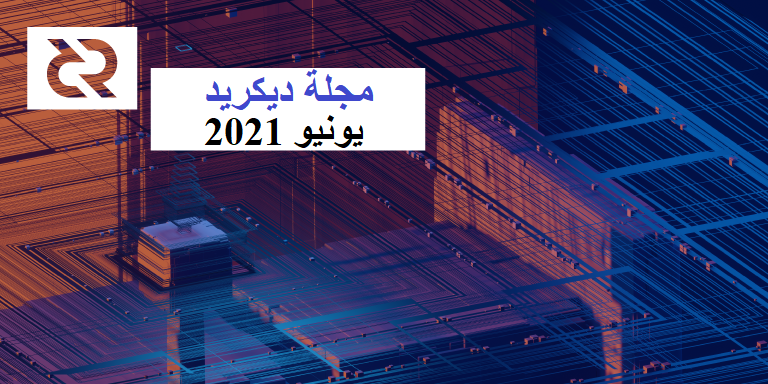
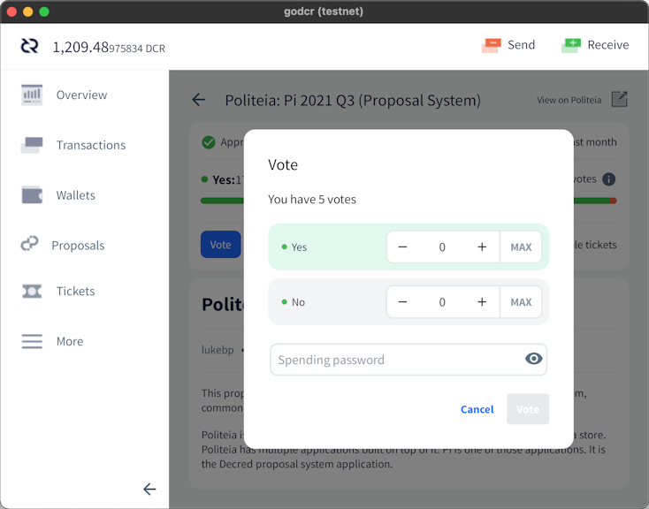
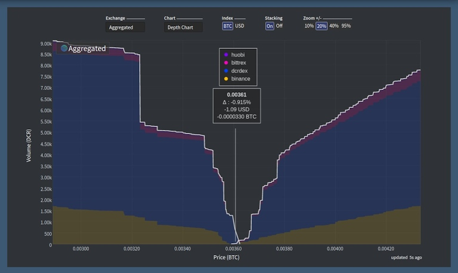

# صحيفة ديكريد لشهر يونيو 2021

_الصورة: الشبكية الأساسية بواسطة saender@_

أبرز أحداث شهر يونيو:

* تمت الموافقة على تحديث قادم للإجماع على بوليتيا مما يجعل تغييرات الإجماع المستقبلية أسهل وأكثر موثوقية وأمنًا.
* شهد خلل في التدقيق في إنفاق الخزينة حدًّا منخفضا للغاية، مما سيتطلب تحديثا بالإجماع لإصلاحه.
* تمت الموافقة على ثلاثة مقترحات على منصة بوليتيا بنسبة مشاركة عالية (~47٪) والتصويت بنعم (97-99٪) - مكافأة إيجاد العلة والترجمات والنسخة الصريحة لتحديثات التغيير بالإجماع.
* شهد معدل تجزئة إثبات العمل انخفاضًا كبيرًا، والذي من المحتمل أن يكون مرتبطًا بقمع التعدين داخل الصين.

المحتويات:

* [خلل الخزينة الجديدة](#خلل-الخزينة-الجديدة)
* [التطوير](#التطوير)
* [الأشخاص](#الأشخاص)
* [الإدارة و الحوكمة](#الإدارة-و-الحوكمة)
* [الشبكة](#الشبكة)
* [النظام البيئي](#النظام-البيئي)
* [الانتشار](#الانتشار)
* [الفعاليات](#الفعاليات)
* [وسائل الإعلام](#وسائل-الإعلام)
* [مناقشات](#مناقشات)
* [الأسواق](#الأسواق)
* [الخارجية ذات الصلة](#الخارجية-ذات-الصلة)

## خلل الخزينة الجديدة

تم تجميد المدفوعات من الخزينة الجديدة لعدة أشهر بسبب خطأ في تنفيذ سياسة الإنفاق. أدت معاملة إنفاق الخزانة الاختبارية التي تم تعدينها في [22 مايو](https://explorer.dcrdata.org/tx/7507bcc72bfde895065034e12e6d462f2360163cd0c879f0db35514f9456b2c1) إلى حالة تم التغاضي عنها في آلية الأمان التي تحمي من إنفاق الكثير من وحدات DCR في فترة زمنية قصيرة. وخلال الأشهر القليلة المقبلة، يمكن إنفاق حوالي 0.15 DCR فقط من الخزينة الجديدة، وهي نسبة منخفضة جدًا بحيث لا يمكن دفعها للمتعاقدين.

في حين أن هذا يعد تأخيرًا مؤسفًا في الهجرة إلى الخزينة اللامركزية والعمل الإضافي لإصلاح الخطأ، فقد تم إنشاء خطة الترحيل للتعامل مع أي حالات مثل هذه. جميع الأموال في الشبكة آمنة وسوف تستمر مدفوعات المتعاقدين من الخزينة القديمة. يتطلب إصلاح خوارزمية الأمان تغيير إجماع آخر [قيد التطوير](https://github.com/decred/dcps/pull/20).

اقرأ القصة الكاملة للخلل في [منشور المدونة](https://blog.decred.org/2021/06/25/Treasury-Expenditure-Policy-Bug/) ومواضيع التغريدات على التويتر بواسطة [matheusd@](https://twitter.com/matheusd_tech/status/1409928455974699013) و [lukebp@](https://twitter.com/lukebp_/status/1409929016400822279).

في ملاحظة جانبية، يذكرنا هذا الحادث بأنه حتى كود الإجماع الذي تمت [مراجعته](https://github.com/decred/dcrd/pull/2170) واختباره بشكل مكثف ليس محصنًا ضد الأخطاء، ولكن من الأسهل إصلاحه عند وجود عملية تحديث محددة جيدًا وغير مثيرة للجدل.

# التطوير

ما لم يُذكر خلاف ذلك، فإن العمل المَذْكُور هنا يشتمل على حالة "الدمج إلى الرئيسي". وهذا يعني أن العمل قد تم استكماله ومراجعته ودمجه في كود المصدر الذي يمكن للمستخدمين المتقدمين [بناءه وتشغيله](https://medium.com/@artikozel/the-decred-node-back-to-the-source-part-one-27d4576e7e1c)، ولكنه ليس متاحًا بعد في ثنائيات الإصدار للمستخدمين العاديين.

<a id="dcrd" />

**[dcrd](https://github.com/decred/dcrd)**

تمت إعادة صياغة الطريقة التي يتم بها التعامل مع البرامج النصية القياسية لمعالجة العديد من المشكلات طويلة الأمد.

للحصول على خلفية سريعة، فإن "[البرامج النصية](https://devdocs.decred.org/developer-guides/transactions/txscript/overview/)" هي أوامر صغيرة مخزنة داخل [المعاملات](https://devdocs.decred.org/developer-guides/transactions/transaction-format/) التي تستهلك عملات "إدخال" من المعاملات السابقة وتخلق عملات "إخراج" جديدة للمستلم. "البرامج النصية القياسية" هي مجموعة فرعية من جميع البرامج النصية المسموح بها وفقًا للإجماع والتي تغطي معظم العمليات المفيدة (إرسال الأموال، والتخزين، والصيغ المتعددة، وما إلى ذلك) المُحسَّنة لتحقيق الكفاءة وأمن الشبكة. عادةً ما [ترفض](https://github.com/decred/dcrd/pull/2656#issuecomment-851105968) عقد الشبكة الرئيسية قبول المعاملات المستقلة وترحيلها (تلك التي ليست جزءًا من كتلة) التي تحتوي على برامج نصية غير قياسية.

يضيف [الكود المعاد صياغته](https://github.com/decred/dcrd/pull/2656) حزمة جديدة تسمى stdscript تدعم إصدارات مختلفة من البرامج النصية (كان من الصعب دعمها سابقًا ومطلوبة للتحديث التالي للإجماع)، وتوفر واجهة برمجة تطبيقات أكثر راحة للمطورين (بما في ذلك مساعدي المقايضات الذرية والتوقيع المتعدد) ويحسن الفصل بين "قياسي" و "إجماع" (نقطة ارتباك شائعة للمطورين الجدد). بالإضافة إلى ذلك، تم تشديد سياسة ما تعتبره البرامج النصية "قياسية" بشكل أكبر للمساعدة في ضمان أن النصوص النموذجية تشغل مساحة أقل على السلسلة وتقييد الحالات التي لا معنى لها.

كالعادة، يأتي هذا التغيير الكبير في سلسلة من الالتزامات سهلة الفهم مع الأوصاف المفيدة، والاختبارات، والمعايير، والأمثلة، وكلها منتهية [بـملف تمهيدي](https://github.com/decred/dcrd/blob/62950c2b8b8d831cacf6f2ec46216e420d2658cc/internal/staging/stdscript/README.md) جديد وشامل.

ركزت عدد من [التغييرات](https://github.com/decred/dcrd/pulls?q=standardness+is%3Apr+merged%3A2021-06-01..2021-06-30+sort%3Aupdated-asc) الأخرى على إزالة استخدامات الكود القياسي من كود الإجماع، لأن سياسة ما يعتبر "قياسيًا" قد تتغير في أي وقت دون أن تتطلب تغييراً بالإجماع وبالتالي يجب ألا يتأثر كود الإجماع.

تم تقديم [اقتراح](https://proposals.decred.org/record/3a98861) لتطوير التغيير الإجماعي التالي والموافقة عليه. سيمنع هذا التحديث عمليًا التفرعات اللينة لتبسيط تغييرات الإجماع المستقبلية و[تحسين الأمن](https://proposals.decred.org/record/3a98861/comments/8). بمجرد تفعيله، ستبدأ العقد الكاملة في رفض المعاملات والبرامج النصية للإصدارات الأحدث التي لا يفهمونها، بدلاً من تجاهلها والاعتقاد بأنها لا تزال تتحقق من صحة السلسلة بشكل كامل.

> فالتفرعات الناعمة هي في المقام الأول نتاج الأنظمة الأقل قدرة التي تعاني من أوجه قصور تقنية وتفتقر إلى عمليات الحوكمة الرسمية اللازمة لنشر هذه الأنظمة دون جدال ([davecgh@](https://proposals.decred.org/record/3a98861)).

بفضل عملية ديكريد الخالية من الدراما لتنسيق التفرع الصلب ومجتمعها المنخرط للغاية أصبح من الممكن الإبتعاد عن التفرعات اللينة.

<a id="dcrwallet" />

**[dcrwallet](https://github.com/decred/dcrwallet)**

* خيار [لرفض](https://github.com/decred/dcrwallet/pull/2054) الكتل عشوائيًا (مخصص للاختبار ولا يمكن استخدامه على الشبكة الرئيسية)
* تحديث لأحدث [وحدات dcrd](https://github.com/decred/dcrwallet/pull/2056)، بما في ذلك `stdaddr` الجديد
* أزيلت محاولات التصويت أو الإلغاء عندما [لا يكون](https://github.com/decred/dcrwallet/pull/2062) المفتاح الخاص متاحا (ينبغي أن يحول دون حدوث بعض الأخطاء لدى ticketbuyer)
* استخدام [وصلات](https://github.com/decred/dcrwallet/pull/1983) متعددة عند شراء تذاكر الشراء الآلي (قد يؤدي إلى تباطؤ الخلط إذا كان لدى حساب التمويل نواتج محدودة من المعاملات غير المنفقة)

<a id="decrediton" />

**[Decrediton](https://github.com/decred/decrediton)**

مواجهة المستخدم:

* وضع [علامة تبويب منصة المبادلات اللامركزية DEX](https://github.com/decred/decrediton/pull/3505) باللون الرمادي وإظهار أيقونات التلميحات بدلاً من إخفائها في وضع التحقق من الدفع البسيط (لقد أربك هذا الأمر الكثير من الأشخاص)
* إضافة خيارات [متقدمة](https://github.com/decred/decrediton/pull/3487) لاستعادة المحفظة (تعطيل تحديثات نوع العملة وتعيين حد الفجوة)
* السماح [بعبارات المرور الفارغة](https://github.com/decred/decrediton/pull/3470) لدعم ميزة [عبارة مرور](https://wiki.trezor.io/Passphrase) Trezor
* السماح بإدخال عبارات المرورعلى [Trezor](https://github.com/decred/decrediton/pull/3496) نفسه بدلا من طلبه في ديكريديتون (النموذج T فقط)
* تنفيذ تصميم واجهة مستخدم جديد لعرض [الحوكمة](https://github.com/decred/decrediton/pull/3467) (كلا المقترحات وتغييرات الإجماع)
* إدماج مكون [إدخال نص](https://github.com/decred/decrediton/pull/3398) من مكتبة [pi-ui](https://github.com/decred/pi-ui). لدعم مواصفات تصميم ديكريديتون، تم [تحديثه](https://github.com/decred/pi-ui/pull/326) بميزات جديدة يمكن للمشاريع الأخرى المستندة إلى React الآن استخدامها أيضًا.
* ~ 10 إصلاحات للأخطاء

تتضمن التغييرات التي تواجه المطورين استكمال العديد من التحسينات الأمنية التي كانت في طور الإعداد لفترة طويلة:

* اختبارات تلقائية [لإرسال](https://github.com/decred/decrediton/pull/3489) و[استلام](https://github.com/decred/decrediton/pull/3490) و[تصدير](https://github.com/decred/decrediton/pull/3493) طرق العرض
* [تهيئة Webpack](https://github.com/decred/decrediton/pull/3503) المعاد تنظيمها وتنظيفها وتحسينها
* تم تعطيل [إدماج العقدة](https://github.com/decred/decrediton/pull/3486) في كود واجهة المستخدم بحيث لم يعد بإمكانه الوصول إلى واجهات برمجة تطبيقات Electron والعقدة ذات المستوى المنخفض مباشرة. هذه ميزة أمنية مهمة وممارسة [موصى بها](https://www.electronjs.org/docs/tutorial/security#2-do-not-enable-nodejs-integration-for-remote-content) في تطوير تطبيق Electron الحديث.
* تمكين [عزل السياق](https://github.com/decred/decrediton/pull/3492) في النافذة الرئيسية - ميزة [أمن](https://www.electronjs.org/docs/tutorial/security#3-enable-context-isolation-for-remote-content) مهمة أخرى تقيد كود واجهة المستخدم
* مكنت ميزة [`webSecurity`](https://github.com/decred/decrediton/pull/3500) من تشديد الطلبات الخارجية (وهذا أيضًا أصلح وضع التطوير على Windows)
* تقليل [التبعيات](https://github.com/decred/decrediton/pull/3509) للاعتماد بشكل أقل على كود الجهة الخارجية وتحسين الأمن عن طريق تقليل سطح هجوم سلسلة التوريد المحتمل
* إدخال حوار تأكيد أكثر أمنا واستخدامه لتأكيد [وصول مقدمي خدمات التصويت](https://github.com/decred/decrediton/pull/3515) و[توقيع المعاملات](https://github.com/decred/decrediton/pull/3519)

<a id="politeia" />

**[Politeia](https://github.com/decred/politeia)**

مواجهة المستخدم:

* إضافة زر للوصول إلى [الماركداون الخام](https://github.com/decred/politeiagui/issues/2415)
* عرض حالة الدفع [الائتماني للاقتراح](https://github.com/decred/politeiagui/pull/2417) (يعطي فكرة عن موعد استخدام الاعتمادات لتقديم مقترحات جديدة)
* عرض [لافتة](https://github.com/decred/politeiagui/pull/2456) عندما يقوم المستخدم بعرض مقترحات `proposals-archive.decred.org` لتقليل الارتباك عند النقر فوق شعار الموقع
* مظهر محسّن لزر [الوضع المسطح](https://github.com/decred/politeiagui/pull/2434)
* إضافة اسم الاقتراح إلى [مواضيع](https://github.com/decred/politeia/pull/1440) البريد الإلكتروني
* ~ 13 إصلاحًا للأخطاء

الواجهة الخلفية وواجهة خط الأوامر:

* تم [تحديث](https://github.com/decred/politeia/pull/1235) `politeiavoter` إلى واجهة برمجة التطبيقات الجديدة التي تم إصدارها في [الإصدار 1.0.0](https://github.com/decred/politeia/releases/tag/v1.0.0)
* [سيحاول](https://github.com/decred/politeia/pull/1438) `politeiavoter` الآن التصويت على أخطاء الخادم
* إضافة تطبيق [MySQL](https://github.com/decred/politeia/pull/1419) لقاعدة بيانات المستخدم. يجب ترحيل البيانات من CockroachDB لإزالة هذه التبعية ويكون لديك قاعدة بيانات واحدة فقط للتعامل معها. تم تحديد اختيار MySQL بواسطة [tlog](https://github.com/decred/politeia/issues/1392) (الذي [لا](https://github.com/google/trillian/issues/1298) يدعم PostgreSQL).
* تم تحديث [الملفات التمهيدية](https://github.com/decred/politeia/pull/1421) مع إرشادات الإعداد للحصول على نسخة بوليتيا كاملة وتشغيلها _(المساهمون الجدد، لا تنتظروا أكثر!)_
* تمت إضافة [المستندات](https://github.com/decred/politeia/pull/1435) المفقودة إلى أدوات `pictl` و `politeiaverify`
* [آثار مكدس](https://github.com/decred/politeia/pull/1428) أكثر وضوحا
* تغطية اختبارية لإدارة [المستخدم](https://github.com/decred/politeia/pull/1235) والجلب
* ~ 2 إصلاحات للأخطاء

نظام إدارة المتعاقد (CMS):

* السماح باستخدام [المقترحات المؤرشفة](https://github.com/decred/politeia/pull/1422) في الفواتير
* إضافة تعقب [للإنفاق](https://github.com/decred/politeia/pull/1431) من الخزينة الجديدة (لتحديد ما إذا كان قد تم دفع الفاتورة)
* حساب [نفقات](https://github.com/decred/politeia/pull/1429) الاقتراح الثابت وإحضار نسخة الفاتورة الصحيحة

شارك lukebp@ [مقدمة تعليمية](https://twitter.com/lukebp_/status/1407089424924610572) لطيفة حول كيفية تحقيق بوليتيا لقدرتها القوية على تدقيق التشفير.

<a id="vspd" />

**[vspd](https://github.com/decred/vspd)**

مواجهة المستخدم:

* إضافة [حصة](https://github.com/decred/vspd/pull/264) التذاكر الحية لمزود خدمة التصويت، بالإضافة إلى النسبة المئوية الملغاة، إلى الصفحة الرئيسية واستجابة واجهة برمجة التطبيقات للحالة
* السماح للمسؤولين بتعيين [رسالة](https://github.com/decred/vspd/pull/269) مخصصة سيتم عرضها على صفحة الويب وإعادتها بواسطة واجهة برمجة تطبيقات الحالة عند إغلاق مزود خدمة التصويت
* تعديلات في واجهة المستخدم [لصفحة المشرف](https://github.com/decred/vspd/pull/274)
* تحسين [ذاكرة التخزين المؤقتة](https://github.com/decred/vspd/pull/270) (يمنع المستخدمين من رؤية الموارد القديمة)

داخلي:

* مقارنة [نصوص](https://github.com/decred/vspd/pull/267) المعاملات بدلا من عناوينها عند التحقق من دفع الرسوم (هذا أصح وأكثر كفاءة ويصلح بعض الحالات الدقيقة)
* [تصفية](https://github.com/decred/vspd/pull/265) تذاكر قاعدة البيانات بأكثر من ضعف السرعة
* ضمان تعيين [ارتفاع شراء التذاكر](https://github.com/decred/vspd/pull/277) لجميع التذاكر
* تحسين [معالجة](https://github.com/decred/vspd/pull/271) الاغلاق
* إعادة تصميم [ذاكرة التخزين المؤقت لواجهة المستخدم الرسومية](https://github.com/decred/vspd/pull/273) لإعادة إستخدامها بشكل أفضل

<a id="dcrpool" />

**[dcrpool](https://github.com/decred/dcrpool)**

يأتي [هنا](https://twitter.com/dnldd/status/1409819702654910465) الإصدار 1.2.0 مع ما يقرب من عام كامل من التطوير منذ الإصدار 1.1.0. شاهد جميع الإصلاحات والتحسينات في ملاحظات الإصدار.

تم دمجه في الفرع الرئيسي والإصدار 1.2.0:

* إعادة صياغة تتبع [تأكيد](https://github.com/decred/dcrpool/pull/334) المعاملة الأولية في الكتلة لحل المشكلات المتبقية

<a id="dcrdex" />

**[DCRDEX](https://github.com/decred/dcrdex)**

* تقارير أكثر دقة عن [حالة الطلبات](https://github.com/decred/dcrdex/pull/1094)
* إضافة نظرة عامة على [رسوم التداول](https://github.com/decred/dcrdex/pull/1074) إلى الملف التمهيدي
* تحسين [التحقق](https://github.com/decred/dcrdex/pull/1077) من صحة المطابقة
* تخزين [الطلبات المؤرشفة](https://github.com/decred/dcrdex/pull/1071) بشكل منفصل لتسريع معالجة الطلبات المفعلة
* تحقق من [إصدارات البرنامج النصي](https://github.com/decred/dcrdex/pull/1107) (استخدم طرقًا مختلفة لـ dcrd الإصدارين 1.6 و1.7) واستعد للتعامل مع إصدارات البرامج النصية المختلفة (الإصدار 0.2 [الفرع الخلفي](https://github.com/decred/dcrdex/pull/1108))

<a id="dcrandroid" />

**[dcrandroid](https://github.com/planetdecred/dcrandroid)**

* خيار [لإرسال الصرف](https://github.com/planetdecred/dcrandroid/pull/568) إلى الحساب غير المختلط (يتم خلطه قبل الاستخدام)، والإشارة إلى الحساب الذي سينقل الصرف إليه في صفحة الإرسال
* التمييز بين [المزيج](https://github.com/planetdecred/dcrandroid/pull/565) ذا العلامة الفريدة وذا الأيقونة
* تحديث الترجمة [الفرنسية](https://github.com/planetdecred/dcrandroid/pull/567)
* ~ 3 إصلاحات للأخطاء

مدمج في [dcrlibwallet](https://github.com/planetdecred/dcrlibwallet) (مكتبة أساسية لتطبيقات Android/iOS و godcr):

* إضافة عوامل تصفية للعثور على معاملات [التحصيص](https://github.com/planetdecred/dcrlibwallet/pull/201) [المختلطة](https://github.com/planetdecred/dcrlibwallet/pull/195) أو المتنوعة
* إضافة [إحصائيات](https://github.com/planetdecred/dcrlibwallet/pull/201) حول المعاملات ونشاط التحصيص
* خيار لإرسال [الصرف](https://github.com/planetdecred/dcrlibwallet/pull/199) إلى الحساب غير المختلط
* إصلاح رصيد [غير كافٍ](https://github.com/planetdecred/dcrlibwallet/pull/189) عند دفع رسوم تذكرة vspd

<a id="dcrios" />

**[dcrios](https://github.com/planetdecred/dcrios)**

* خيار [لإرسال الصرف](https://github.com/planetdecred/dcrios/pull/807) إلى الحساب غير المختلط (يتم خلطه قبل الاستخدام)، والإشارة إلى الحساب الذي سينقل الصرف إليه في صفحة الإرسال
* منع [سكون](https://github.com/planetdecred/dcrios/pull/798) الشاشة أثناء المزامنة أو إعادة المسح أو الخلط
* قائمة [منسدلة](https://github.com/planetdecred/dcrios/pull/738) أكثر مرونة في قائمة المحافظ
* تمييز [الخلطات](https://github.com/planetdecred/dcrios/pull/801) مع علامة وأيقونة فريدة
* تعديلات واجهة المستخدم
* ~ 7 إصلاحات للأخطاء

<a id="godcr" />

**[godcr](https://github.com/planetdecred/godcr)**

مواجهة المستخدم:

* المشاهدات المنفذة: [نشاط التذاكر](https://github.com/planetdecred/godcr/pull/439)، [الإحصائيات](https://github.com/planetdecred/godcr/pull/445)، [نموذج](https://github.com/planetdecred/godcr/pull/468) مقترحات التصويت، [صفحة البداية](https://github.com/planetdecred/godcr/pull/465) التي تظهر أثناء تحميل المحافظ
* إضافة [تلميحات](https://github.com/planetdecred/godcr/pull/448) توضيحية للتذاكر
* السماح بالإنتقال إلى [الصفحة السابقة](https://github.com/planetdecred/godcr/pull/491)
* إظهار أسماء [الحسابات](https://github.com/planetdecred/godcr/pull/467) على مدخلات ومخرجات المعاملة
* الحد من [عرض](https://github.com/planetdecred/godcr/pull/444) المحتوى عند توسيع النافذة
* العديد من إصلاحات الأخطاء وتعديلات واجهة المستخدم

المطور:

* إستخراج الكود القابل لإعادة الاستخدام [للصفحات](https://github.com/planetdecred/godcr/pull/459) و[النماذج](https://github.com/planetdecred/godcr/pull/460) و[الإشعارات](https://github.com/planetdecred/godcr/pull/464) و[محدد الحساب](https://github.com/planetdecred/godcr/pull/484) (جنبًا إلى جنب مع إعادة البناء والتنظيف)
* معاد بنائه لتحسين استخدام [dcrlibwallet](https://github.com/planetdecred/godcr/pull/475)
* استبدال أزرار الصفحات الفرعية العامة بالمثيلات [المحلية](https://github.com/planetdecred/godcr/pull/492) لكل صفحة (إصلاح الصفحات المتداخلة مع بعضها البعض)
* تنفيذ المزيد من [التوصيات](https://paste.sr.ht/~eliasnaur/cea1d29d6a5f96668b5e166c2f39ef596974574f) من Elias Naur (مبتكر مكتبة Gio UI)

تقترب godcr من مرحلة الاختبار العام. نتطلع إلى الإصدارات التجريبية.

<a id="dcrdata" />

**[dcrdata](https://github.com/decred/dcrdata)**

* إضافة أداة [swapscan](https://github.com/decred/dcrdata/pull/1828) التي تفحص سلاسل كتل ديكريد و البتكوين لإيجاد معاملات المقايضة ومخرجات ملف CSV
* تمت إزالة [جافا سكريبت المضمنة](https://github.com/decred/dcrdata/pull/1832) من صفحة المخططات
* إضافة [حرف تحويل](https://github.com/decred/dcrdata/pull/1836) صارم ل HTML لأي شيء قد يحتوي على مدخلات المستخدم
* إزالة التبعية على [المحاور](https://github.com/decred/dcrdata/pull/1833) لتقديم الطلبات من كود واجهة المستخدم
* إصلاح [الإتصال](https://github.com/decred/dcrdata/pull/1837) ب Bittrex

مسائل أخرى:

* تم دمج [دعم تحصيص](https://github.com/trezor/trezor-firmware/pull/1249) ديكريد في [مستودع](https://github.com/trezor/trezor-firmware/blob/master/core) البرامج الثابتة لـ Trezor Model T وتم تضمينه في [الإصدار](https://github.com/trezor/trezor-firmware/blob/e67b3ab214a96885397f613fe8117c8193adcc0b/core/CHANGELOG.md) 2.4.0. هناك حاجة إلى مزيد من العمل في نهاية Decrediton ولكن هذا يعد علامة فارقة كبيرة.
* أعلن fst\_nml@ عن مكافأة قدرها 100 ألف دولار لبناء إدماج الديكريد مع [THORChain](https://docs.thorchain.org/) - وهو بروتوكول سيولة لامركزي عبر سلسلة يعتمد على Tendermint و Cosmos واستخدام مخططات Threshold Signature. التطوير [قيد التقدم](https://twitter.com/THORChain/status/1410176914619179009) بالفعل ([مناقشة](https://www.reddit.com/r/decred/comments/o14da0/decred_community_member_willing_to_put_up_100k_to/)).

## الأشخاص

مرحبا بالمساهمين الجدد مع دمج الكود إلى الماستر: vibros68@ على ([politeiagui](https://github.com/decred/politeiagui/commits?author=vibros68)) و x-walker-x@ على ([politeiagui](https://github.com/decred/politeiagui/commits?author=x-walker-x))!

إحصائيات المجتمع اعتبارًا من 1 يوليو:

* متابعو [التويتر](https://twitter.com/decredproject): 46,919 (1,195+)
* المشتركين في [ريديت](https://www.reddit.com/r/decred/): 11,322 (132+)
* مستخدمي غرفة الدردشة general# على [الماتريكس](https://chat.decred.org/): 501 (34+)
* مستخدمي [الديسكورد](https://discord.gg/GJ2GXfz): 1,933 (146+)
* مستخدمي [التيليجرام](https://t.me/Decred): 2,733 (28+)
* المشتركين في [اليوتيوب](https://www.youtube.com/decredchannel): 4,570 (30+)، المشاهدات 188 الف (بزيادة 2 آلاف)
* نجوم GitHub [dcrd](https://github.com/decred/dcrd): بلغت 601 (3+)، التفرعات: 256 (1+)

يمكن العثور على ملخص يونيو لديناميات وسائل التواصل الاجتماعي غير العادية [هنا](https://decredcommunity.github.io/social-media-stats/posts/20210711.1).

## الإدارة و الحوكمة

تلقت [الخزينة الجديدة] في شهر يونيو 10,510 DCR بقيمة 1.4 مليون دولار بمتوسط ​​سعر يونيو 131.52 دولار. تم إنفاق 1,460 DCR (من عنوان الخزينة القديمة) للدفع للمتعاقدين، بقيمة 192 ألف دولار بسعر يونيو، أو 253 ألف دولار بمعدل فواتير مايو البالغ 173.47 دولارًا. و اعتبارًا من 2 يوليو، بلغ الرصيد المشترك [للخزينة القديمة](https://dcrdata.decred.org/address/Dcur2mcGjmENx4DhNqDctW5wJCVyT3Qeqkx) والجديدة 692,988 DCR (أي ما يقارب 91.4 مليون دولار أمريكي بسعر 131.88 دولارًا أمريكيًا).

لم يتم تعدين أول معاملة حقيقية من الخزينة الجديدة بسبب [الخطأ](https://github.com/xaur/decred-news/blob/master/journal/202106.md#new-treasury-bug) الموصوف سابقًا وتم الدفع للمتعاقدين من الخزينة القديمة بدلاً من ذلك. على الرغم من أنها لم تنجح [كما هو مخطط لها](https://twitter.com/behindtext/status/1402628975676035078)، فقد أظهرت تلك الصفقة مشاركة عالية من الناخبين على السلسلة ودعمًا كبيرًا لإدارة الخزينة الحالية: 11,943 تذكرة من أصل 17,280 تذكرة صوتت بنعم وصفر صوتوا بلا - مع نسبة مشاركة بلغت 69٪. يمكن أن ترتفع الحصيلة أكثر عندما يتم تنفيذ تصويت TSPEND لمستخدمي مزود خدمة التصويت، الذين يمتلكون حاليًا حوالي 20٪ من التذاكر الحية.

تم نشر ثلاثة مقترحات على بوليتيا، وتمت الموافقة عليها جميعها مع تقييمات موافقة قوية.

* حقق اقتراح [الصيغة التفصيلية لتحديثات تغيير الإجماع](https://proposals.decred.org/record/3a98861) علامة فارقة جديدة للموافقة مع 99.9% من الأصوات بنعم و13 تذكرة فقط صوتت ضد الاقتراح مع نسبة إقبال بلغت 47%.
* عاد التكرار الرابع [لاقتراح](https://proposals.decred.org/record/e1f104b) مكافأة إيجاد العلة بجدول دفع معزز وتمت الموافقة عليه بنسبة 98.5٪ من الأصوات بنعم ونسبة مشاركة بلغت 47٪. أي بزيادة 0.5٪ من الأصوات بنعم و نسبة مشاركة أكثر ب 15٪ مقارنة [بالمرحلة الثالتة](https://proposals.decred.org/proposals/2170df6). [يشكر](https://twitter.com/degeri_crypto/status/1409714139396591617) degeri@ أصحاب الحصص على القدر المتزايد من الإيمان والثقة.
* تمت الموافقة على المرحلة الثانية من [اقتراح](https://proposals.decred.org/record/af9942a) الترجمة الكبير بموافقة 97.3٪ ونسبة إقبال بلغت 46٪ - بزيادة كبيرة في الدعم من 75٪ بنعم و نسبة إقبال ب 28٪ مقارنة [بالاقتراح الأول](https://proposals.decred.org/proposals/c093b8a).

للحصول على مزيد من التفاصيل حول مقترحات هذا الشهر راجع [العدد 43](https://blockcommons.red/politeia-digest/issue043/) من موجز بوليتيا .

## الشبكة

**معدل الهاش**: افتتحت معدلات [الهاش](https://dcrdata.decred.org/charts?chart=hashrate&zoom=kpb32srm-kqn8vbkn&scale=linear&bin=block&axis=time) في شهر يونيو عند 369 Ph/s وأغلقت عند ~73 Ph/s، وبلغ قاعها عند 61 Ph/s كما بلغت ذروتها عند 438 Ph/s على مدار الشهر.

كما ترون أعلاه، شهد شهر يونيو انخفاضًا كبيرًا في معدل التجزئة بسبب انتقال المعدنين من الصين بسبب [الحظر](https://www.coindesk.com/chinas-bitcoin-mining-crackdown-is-a-boon-for-miners-elsewhere) الأخير. يظهر هذا بشكل خاص في العملات المعدنة بواسطة ASIC مثل ديكريد و [البتكوين](https://twitter.com/krugermacro/status/1409484360651317250).

توزيع معدل الهاش الذي تم [الإبلاغ عنه](https://miningpoolstats.stream/decred) بواسطة المجمعات في 1 يوليو: Poolin بنسبة 37%، و F2Pool بنسبة %28، و Antpool بنسبة 8%، و BTC.com بنسبة 5%، و Luxor بنسبة 5%، و Huobipool بنسبة 1%، و UUPool بنسبة 0.2%، و Coinmine بنسبة 0.1%.

يتطابق توزيع 1,000 [كتلة معدنة](https://miningpoolstats.stream/decred) بالفعل مع معدل التجزئة المبلغ عنه. يتم تقسيم الكتل المعدنة غير المحددة بنسبة 15٪ بين نفس العناوين الأربعة كما في [السابق](https://github.com/xaur/decred-news/blob/master/journal/202105.md).

**التحصيص**: تراوح [سعر التذكرة](https://dcrdata.decred.org/charts?chart=ticket-price&zoom=kpb32srm-kqn8vbkn&axis=time&visibility=true-true&mode=stepped) بين 168 و 208 DCR، [بمتوسط](https://dcrstats.com/) ​​30 يومًا عند 184.7 DCR (ناقص 1).

بلغ [المبلغ المقفل](https://dcrdata.decred.org/charts?chart=ticket-pool-value&zoom=kpb32srm-kqn8vbkn&scale=linear&bin=block&axis=time) 7.33-7.72 مليون DCR، مما يعني أن 56.1-59% من العرض المتاح [شارك](https://dcrdata.decred.org/charts?chart=stake-participation&zoom=kpb32srm-kqn8vbkn&scale=linear&bin=block&axis=time)  في إثبات الحصة.

**مقدم خدمة التصويت**: في 1 يوليو، تمت إدارة 8,000 (200-) تذاكر حية بواسطة خوادم vspd و 600 (500-) بواسطة خوادم dcrstakepool القديمة التي [لا تزال مدرجة](https://decred.org/vsp/). إجمالا، تمكن 12 من مقدمي خدمات التصويت القديمة و 13 من مقدمي خدمات التصويت الجديدة من إدارة 20.9٪ من مجمع التذاكر، بانخفاض من 22.7٪ في 1 يونيو. كما قام مقدمو خدمات التصويت القديمة الذين تم حذفهم ولكنهم ما زالوا نشطين بإدارة 26 تذكرة حية (35-).

**العقد**: طوال شهر يونيو، كان هناك حوالي 216 عقدة يمكن الوصول إليها وفقًا لـ [dcrextdata](https://analytics.planetdecred.org/nodes).

إصدارات العقد اعتبارًا من [لقطة](https://nodes.jholdstock.uk/user_agents) 1 يوليو (إجمالي 256، dcrd فقط): النسخة 1.6.2 - 53٪، النسخة 1.6.0 - %19، النسخة 1.6.1 - 13%، النسخة 1.7 لبناءَات التطوير - 7٪، النسخة 1.6 لبناءَات التطوير - 3٪، النسخة 1.5.1 - 2.8٪، النسخة 1.5.2 - %2.

تراوحت حصة [العملات المختلطة](https://dcrdata.decred.org/charts?chart=coin-supply&zoom=jzh4wow9-ks9hgjcu&bin=day&axis=time&visibility=true-true-true) بين 43.7 و 47.0٪ وحققت أعلى مستوى جديد على الإطلاق.

شهدت [الشبكة البرقية](https://ln-map.jholdstock.uk/) لديكريد 34 عقدة (1+)، و 60 قناة (7+) بسعة إجمالية تبلغ 21.8 (بزيادة 4.7)، اعتبارًا من 1 يوليو.

## النظام البيئي

 [أزال] موقع [stakey.net](https://stakey.net/) واجهة الويب لمثيل dcrstakepool القديم. سيتم الحفاظ على محافظ التصويت وواجهة برمجة التطبيقات (API) حتى ينتقل المستخدمون إلى vspd. و اعتبارًا من 1 يوليو، تمكن مزود خدمة التصويت القديم الخاص بـ stakey.net من إدارة 63 تذكرة حية، مع إنخفاض ب 134 مقارنة بفاتح يونيو. وقد أصبح مثيل vspd الخاص به هو الأكبر، حيث يدير أكثر من 2,200 تذكرة حية.

للحفاظ على اللامركزية ، يوصى بتجنب مقدمي الخدمات الذين يتحكمون في عدد كبير جدا من التذاكر. لكن stakey.net يشكل "مشكلة" هنا، لأنه مزود خدمة التصويت الوحيد المعروف الذي يقدم خدمة Tor المخفية. مقدمي الخدمات الآخرين مدعوون إلى المسابقة!

تقوم dcr.farm الآن بإعادة التوجيه إلى [مثيل vspd](https://vsp.dcr.farm/) الخاصة بها، لكن infertux@ [أكدت](https://github.com/decred/dcrwebapi/issues/146#issuecomment-865451784) أن محافظها القديمة مازالت قيد العمل و ستظل كذلك حتى تقوم جميع التذاكر بالتصويت (لاتزال هنالك 32 تذكرة حية اعتبارًا من 22 يونيو). يمكن التحقق من حالة محافظ تقوم dcr.farm الآن بإعادة التوجيه إلى نسخة vspd الخاصة بها ، لكنinfertux أكدت أن محافظها القديمة قد ارتفعت وستظل حتى التصويت على جميع التذاكر (بقي 32 ساريًا اعتبارًا من 22 يونيو). يمكن التحقق من حالة محافظ dcr.farm القديمة ومحافظ vspd في الصفحة المخصصة [للحالة](https://stats.uptimerobot.com/46PWkSrZD).

صوّت مزود خدمة التصويت القديم [YieldWallet](https://yieldwallet.io/) على آخر تذكرة له وتم إغلاقه نهائيًا. شكرًا على خدمتكم!

مزود خدمة التصويت الجديد من crypto-synergy.net موجود على [الشبكة الرئيسية](https://vspd.synergy-crypto.net/) و [شبكة الإختبار](https://vspd-testnet.synergy-crypto.net/). يُبلغ مثيل الشبكة الرئيسية عن أول تذكرة تم التصويت عليها  (وهو الشرط المطلوب بالنسبة لجميع مقدمي عمليات التصويت الجدد) ولكنه يحتاج إلى اجتياز [المراجعة](https://github.com/decred/dcrwebapi/pull/147) ليتم إدراجه في [decred.org/vsp](https://decred.org/vsp/).

في هذه المرحلة، يمتلك مقدمو خدمات التصويت القديمون أقل من 1.4٪ من مجموع التذاكر و [يوصى](https://twitter.com/JamieHoldstock/status/1405069123453784065) بالتحديث إلى vspd لتجنب مخاطر فقدان التذاكر، على سبيل المثال في سيناريو يتم فيه تفعيل تحديث بالإجماع آخر بينما _لا_ يتم تصحيح [dcrstakepool](https://github.com/decred/dcrstakepool) لمتابعة السلسلة.

يوصى مستخدمي Ledger Live [بالتحديث](https://www.ledger.com/ledger-live) إلى الإصدار 2.29.0 أو إصدار أحدث حيث تم إصلاح [مشكلات](https://status.ledger.com/incidents/j1sypv88pgs6) المزامنة وإرسال DCR. استمر الاضطراب بين [الإشارات](https://status.ledger.com/incidents/j1sypv88pgs6) الأولى للإصدار وإصدار [النسخة 2.29.0](https://github.com/LedgerHQ/ledger-live-desktop/releases/tag/v2.29.0) حوالي 22 يومًا.

قامت [WazirX](https://wazirx.com/) الهندية [بتمكين](https://twitter.com/WazirXIndia/status/1408022090750496776) تداول DCR/INR و DCR/USDT. كانت DCR جزءًا من عملية ["الإدراج السريع"](https://blog.wazirx.com/rapid-listing-initiative-on-wazirx/) حيث يبدأ التداول في وقت أقرب ولكن خيارات الإيداع والسحب محدودة حتى اكتمال الإندماج الكامل. وفي حالة هذا الإدراج، فإن عمليات الإيداع والسحب بين المحافظ بين WazirX و Binance [متاحة](https://twitter.com/WazirXIndia/status/1407655011925073921) بدون رسوم. [استحوذت](https://www.binance.com/en/blog/404105749895733248/Binance-Acquires-Indias-Leading-Digital-Asset-Platform-WazirX-to-Launch-Multiple-FiattoCrypto-Gateways) Binance على WazirX في عام 2019.

ولمن فاتهم الأمر،  هناك خدمتان أقل شهرة في النظام البيئي الأوسع لديكريد يستحقان تسليط الضوء عليهما. واحد هو بديل متواضع لتويتر من موقع stakey.net:

> _قلعة ديكريد_ هذه هي مثيل Mastodon سريع وآمن وحديث بشكل متواضع مع توفر خادم مراقب ونسخ احتياطية ليلية خارج الموقع. مفتوحة لمجتمع ديكريد. (دعوة الرابط [هنا](https://citadel.stakey.net/@support/105249104743040856))

وهناك مثال آخر هو [مثيل PeerTube](https://tube.decredcommunity.org/videos/recently-added) الخاص بـ karamble@ والذي يعكس محتوى فيديو ديكريد لزيادة المرونة واللامركزية.

تحذير: ليس لدى مؤلفي مجلة ديكريد أي فكرة عن مصداقية أي من الخدمات المذكورة أعلاه. يرجى إجراء البحث الخاص بك قبل الوثوق بمعلوماتك الشخصية أو أصولك لأي كيان.

انضم إلى دردشة [services#](https://chat.decred.org/#/room/#services:decred.org) لمتابعة تحديثات النظام البيئي لديكريد.

## الإنتشار

إنجازات Monde PR لشهر يونيو:

* عرض قصة واحدة على منشورات التمويل و العملات الرقمية
* الرد على 6 طلبات للتعليق/فرص العلاقات العامة
* تأمين مقابلتين إعلاميتين

التغطية الإعلامية المؤمنة بواسطة Monde PR:

* مقال في [CryptoNexa](https://www.cryptonexa.com/2021/06/02/decred-and-zcash-lead-the-weekly-top/) يعرض أخبارًا حول إدماج DCRDEX في Decrediton
* مقال في [Benzinga](https://www.benzinga.com/markets/cryptocurrency/21/06/21722413/chicken-soup-for-the-bitcoin-soul) يعرض تعليقًا من jz@ حول الخوف وعدم اليقين والشك والخوف من تضييع الفرص في مجال العملات الرقمية. تم توزيع القطعة على ثلاث منشورات بما في ذلك [Yahoo! Finance](https://finance.yahoo.com/news/chicken-soup-bitcoin-soul-131625705.html) و [Explica.co](https://www.explica.co/cryptocurrency-chicken-soup-for-the-bitcoin-soul.html).
* مقال في [NerdWallet](https://www.nerdwallet.com/article/investing/is-bitcoin-safe) يعرض تعليقًا بواسطة jy-p@ حول كيفية تخزين العملات الرقمية
* مقالة في NerdPalet عرض تعليقًا من قبل jy-p@ حول كيفية شراء العملات الرقمية. تم نشرالمقال على 42 منشورا بما في ذلك [Nasdaq](https://www.nasdaq.com/articles/what-to-do-when-cryptocurrency-is-crashing-2021-06-30)، [MSN Money](https://www.msn.com/en-us/money/savingandinvesting/what-to-do-when-cryptocurrency-is-crashing/ar-AALCJYT)، [Yahoo! Finance](https://finance.yahoo.com/news/cryptocurrency-crashing-130055734.html) و [SF Gate](https://www.sfgate.com/business/personalfinance/article/What-to-Do-When-Cryptocurrency-Is-Crashing-16283912.php).

## الفعاليات:

الحضور:

* 12 يونيو - الأسبوع العربي للبلوك تشين 2021 - الإنترنت. قدمت arij@ الحوكمة على السلسلة وخارجها وأمثلة لكل منهما في ديكريد (انظر الروابط والشرائح في  [التقرير](https://decredcommunity.github.io/events/index/20210612.1)).

## وسائل الإعلام

مقالات مختارة:

* خطأ في سياسة إنفاق الخزانة بواسطة matheusd@ على ([blog.decred.org](https://blog.decred.org/2021/06/25/Treasury-Expenditure-Policy-Bug/))
* التمويل الجماعي مع حقوق التصويت - ميزة قاتلة لـ للمنظمة المستقلة اللامركزية لديكريد بواسطة ammarooni@ على ([medium](https://ammarooni.medium.com/crowdfunding-with-voting-rights-a-killer-feature-of-the-decred-dao-78cf608e3498))

أشرطة الفيديو:

* تحديث النشرة الإخبارية لديكريد - الإصدار 1.6.3، إدماج منصة المُبادلات اللامركزية لديكريد، أول إنفاق لخزينة المنظمة المستقلة اللامركزية، تحقيق رقم قياسي جديد للتحصيص و المزيد من الأخبار من تقديم Exitus@ على ([اليوتيوب](https://www.youtube.com/watch?v=JXbcBKnUgYc))
* هل ينبغي للأموال أن تكون خصوصية - أساسيات ديكريد من تقديم phoenixgreen@ على ([اليوتيوب](https://www.youtube.com/watch?v=1iCpzXC6WBw))
* تطور الخزينة - أساسيات ديكريد من تقديم phoenixgreen@ على ([اليوتيوب](https://www.youtube.com/watch?v=hk2USZ-MxqM))
* إمداد العملات و توزيعها - أساسيات ديكريد من تقديم phoenixgreen@ على ([اليوتيوب](https://www.youtube.com/watch?v=mGhOOVUP1Dg))
* بلوغ نقطة 13 مليون - أساسيات ديكريد من تقديم phoenixgreen@ على ([اليوتيوب](https://www.youtube.com/watch?v=iDCo9VOVSKU))
* الديكريد - أهم الأسباب وراء هذه العملة الرقمية! بواسطة Ripe For Investing على ([اليوتيوب](https://www.youtube.com/watch?v=JnBb5uiTSFU))
* يتحدث إلينا دون جون المعروف باسم PurpleSuede22 عن الأسرار وراء نجاح ديكريد! بواسطة [CryptoND1](https://twitter.com/CryptoND1) على ([اليوتيوب](https://www.youtube.com/watch?v=dHif4vuIenA))
* مراجعة العملة - ديكريد من قبل Spencer Tarring على ([اليوتيوب](https://www.youtube.com/watch?v=eEZZVgMEYVs))
* لماذا تعتبر ديكريد ورقة رابحة بواسطة Todd F. Maki على ([التويتر](https://twitter.com/toddfmaki/status/1401734301243232259)، [الجزء الثاني](https://twitter.com/toddfmaki/status/1401812413947604992))
* OfficialCryptos@ الآن على [اليوتيوب](https://www.youtube.com/channel/UC6_TA2_NBf5i99vFKsqgbKQ)

المتعة و الفن:

* الاشياء فى [المرآة](https://twitter.com/OfficialCryptos/status/1400149513462026241) اوضح مما تبدو عليه
* كاثي على [البيسون](https://twitter.com/OfficialCryptos/status/1400737260753018882)

الترجمة:

* تمت [ترجمة](https://xaur.github.io/decred-news/) المجلة المنشورة مايو 2021 إلى العربية (arij@ و abdulrahman4@) والصينية (Dominic@). تم طرح إصدار أبريل باللغة الإسبانية أيضًا. شكرا لكم جميعا!

## المناقشات

أخبار أنظمة الاتصالات:

* شهدت الماتريكس تدهورًا في الأداء بسبب محاولة واسعة النطاق لتسجيل [حسابات الروبوت](https://twitter.com/matrixdotorg/status/1409873992454967304) بشكل مجمّع والبريد العشوائي على الشبكة.

مواضيع مختارة من الريديت:

* استخدام الطاقة ومصادر الطاقة [المتجددة](https://www.reddit.com/r/decred/comments/o931uc/random_question_dcr_pow_and_renewables/) في التعدين بإثبات العمل في ديكريد
* [الفكرة التسويقية](https://www.reddit.com/r/decred/comments/o2g8c2/dex_decentralized_exchange/) القوية لمنصة المبادلات اللامركزية لديكريد بواسطة atweiden@
* [مكافأة](https://www.reddit.com/r/decred/comments/o14da0/decred_community_member_willing_to_put_up_100k_to/) إدماج THORChain ومقارنتها بـ DCRDEX

مناقشات مختارة من التويتر:

* يطرح sumiflow@ على منصات المُبادلات [سؤالًا صعبًا](https://twitter.com/Sumiflow/status/1410003328780619777) حول خيارات الإدراج الخاصة بهم
* lukebp@ حول كيفية عدم اعتماد De"Fi" على عدد قليل من النقاط المركزية التي يمكن [حظرها](https://twitter.com/lukebp_/status/1409280372970508301) بشكل تافه
* أظهر lukebp@ سبب كون بوليتيا مشروعا _ضخمًا_، مع أمثلة حية:

> خضعت بوليتيا لتحديث كبير هذا العام وهي تقوم بأشياء لا يقوم بها أحد آخر.
> 
> (إيضاحات تقنية...)
> 
> إذن لماذا هذا أمر مهم؟ هذا يوفر لنا دليلا لا يمكن دحضه على أن اقتراحي موجود في ارتفاع الكتلة 552,071 ولم يتم تغييره منذ ذلك الحين. لا يوجد موقع إنتاج آخر يوفر هذا المستوى من الشفافية وقابلية التدقيق المشفرة لبياناته. ([lukebp@](https://twitter.com/lukebp_/status/1407089424924610572))

## الأسواق

في يونيو، تم تداول DCR بين 87.66-174.59 دولارًا أمريكيًا/BTC 0.00298-0.00468. وكان متوسط ​​السعر اليومي 131.52 دولارًا.

_من يستطيع مقاومة هذه السيولة؟_

## الخارجية ذات الصلة

تجري عملية هجرة واسعة النطاق لمعدني البيتكوين (وغيرهم) و التجزئة من الصين، ويتم تغطيتها في جميع [منشورات](https://www.forbes.com/sites/zinnialee/2021/06/23/bitcoin-mining-companies-exiting-china-as-authorities-crackdown-on-cryptocurrencies/) [الأعمال](https://www.bloomberg.com/news/articles/2021-06-20/bitcoin-drops-as-hashrate-declines-with-china-mining-crackdown) [السائدة](https://www.cnbc.com/2021/06/15/chinas-bitcoin-miner-exodus-.html). تم بدء الهجرة الجماعية بعد أن أصدرت السلطات الصينية تصريحات بشأن اتخاذ إجراءَات صارمة ضد تعدين البيتكوين، ثم أوضحت عدة مقاطعات للمعدنين أنه يتعين عليهم التوقف. إحدى المشكلات التي تواجهها شركات التعدين في نقل أجهزة التجزئة الخاصة بها هي السعر المرتفع الحالي للشحن الدولي.

[مول](https://www.coindesk.com/tor-project-zcash-open-major-grants-zomg-arti-coding-language-upgrade) برنامج المنح الكبرى المفتوحة لزيكاش (ZOMG) مشروع تور بمبلغ 670,000 دولار أميركي، لاستخدامه في دفع رواتب المطورين أثناء عملهم على (تطبيق Rust Tor) - مما يجعل Tor أكثر سهولة في الوصول إلى التطبيقات الأخرى ، بما في ذلك Zcash.

[ينظر](https://thedefiant.io/uniswap-lobby/) مجتمع Uniswap في تمويل "صندوق الدفاع السياسي ل DeFi" بمبلغ يتراوح بين 27 و 40 مليون دولار أمريكي، والغرض من الصندوق هو "تثقيف واضعي السياسات، وتحقيق الوضوح التنظيمي ل DeFi، ودعم DeFi، والحوكمة اللامركزية، وتشجيع بروتوكولات DeFi الأخرى على المساهمة بالأفكار والدعم". ومع تقدم هذا الصندوق من خلال مرحلة [التحقق من درجة الحرارة](https://gov.uniswap.org/t/temperature-check-funding-a-political-defense-of-defi/12557) و[التحقق من الإجماع](https://gov.uniswap.org/t/consensus-check-uni-should-fund-a-political-defense-organization-for-decentralized-finance-copy/12717)، أصبح "صندوق تعليم DeFi" الأكثر عمومية بحلول وقت [التصويت](https://app.uniswap.org/#/vote/0/1) (الذي انتهى في نهاية يونيو بموافقة 84%).

[ينظر](https://www.theblockcrypto.com/post/108561/the-first-dao-lawsuit-proposal-asks-if-curve-should-protect-its-ip) مشروع Curve DeFi في إنفاذ حقوقه في الملكية الفكرية أمام المحكمة. وهناك [اقتراح](https://gov.curve.fi/t/cip-xx-enforce-curves-ip-rights/1890/3) قيد المناقشة من شأنه أن يشهد قيام أعضاء Curve DAO بالتماس وإقرار أو رفض المقترحات من شركات المحاماة، فيما يتصل بإغلاق المشاريع المنافسة التي نسخت كود Curve (يتضمن النص على "عدم منح أو ضمن أي ترخيص أو حق استنساخ أو توزيع أو أي حق آخر فيما يتعلق به".

كان هناك تهافت على بروتوكول Iron Titanium، والذي جعله [يحفز](https://www.coindesk.com/iron-finance-defi-titan-iron-price-drop) انخفاضه السريع وغير القابل للإلغاء إلى الصفر بمجرد استيفاء بعض شروط التداول النادرة.

ومن المفارقات أن "SafeDollar" الذي يحمل عنوان "SafeDollar" ذهب أيضًا إلى الصفر هذا الشهر بعد تعرضه [للاختراق](https://securityboulevard.com/2021/06/safedollar-stablecoin-not-safe-nor-stable-hack-sends-value-to-zero/)، حيث نهب المهاجم ما يقرب من 248,000 دولار من التوكنات.

[عانت](https://twitter.com/THORChain/status/1409630489611182081) THORChain التي كان بعض أعضاء المجتمع ديكريد يتعاملون معها لإدماج DCR، لأول هجوم خبيث لها. أشار [تقييم الموقف](https://twitter.com/THORChain/status/1409736048960180227) إلى أن 140 ألف دولار تم أخذها من خلال استغلال خطأ منطقي في وحدة ETH Bifrost. توقفت الشبكة لمدة 6 ساعات أثناء إجراء الإصلاح. قالت THORChain إنها ستغطي الخسائر التي يتكبدها المستخدمون من أموال الخزينة.

هذا كل شيء لشهر يونيو. شارك بتحديثاتك للإصدار التالي في غرفة الدردشة [journal#](https://chat.decred.org/#/room/#journal:decred.org).

## عن هذا العدد

هذا هو العدد 39 من مجلة صحيفة ديكريد. فهرس جميع الإصدارات والمرايا والترجمات متاح [هنا](https://xaur.github.io/decred-news/).

يتم نقل معظم المعلومات الواردة من أطراف ثالثة مباشرة من المصدر بعد التحقق من الحد الأدنى لصحتها. ليس لدى مؤلفي مجلة صحيفة الديكريد القدرة على التحقق من جميع الادعاءات.رجاء إحذر من أعمال الاحتيال وقم ببحثك الخاص.

الاعتمادات (بالترتيب الأبجدي):

الكتابة والتحرير: bee و degeri و l1ndseymm و richardred

المراجعات والتعليقات: davecgh و lukebp و raedah

صورة العنوان: saender

التمويل: أصحاب حصص الديكريد

النسخة الأصلية لمجلة الديكريد لشهر يونيو متوفرة على هذا الرابط [هنا](https://github.com/xaur/decred-news/blob/master/journal/202106.md)

تمت الترجمة إلى اللغة العربية بواسطة: arij@. قام بالمراجعة abdulrahman4@.

