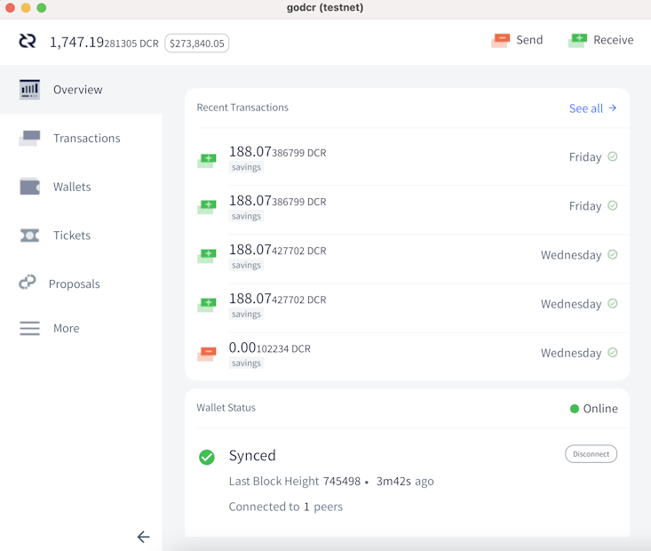

# صحيفة ديكريد لشهر يوليو 2021

_الصورة: مقياس القرب بواسطة saender@_

أبرز أحداث شهر يوليو:

* يتم تطوير ثلاث تغييرات في الإجماع في مراحل مختلفة، كما يجتذب إلغاء التذاكر بالفعل بعض التغطية الصحفية.
* تقدم قوي في جميع المستودعات المعتادة - اِقْتَطَعت dcrd نسبة 10% أخرى من وقت التحميل الأولي لسلسلة الكتل، كما قامت  منصة المُبادلات اللامركزية لديكريد DCRDEX بإدماج البرنامج الرئيسي ل ETH.
* لقد كان شهرًا كبيرًا لإجراء المقابلات، حيث تم تسجيل حلقات ديكريد في العمق مع عدد من أعضاء المجتمع المعروفين، وبعض المنشورات والبودكاستات الأخرى التي تعرض مقابلات مع مطوري المشروع.

المحتويات:

* [التطوير](#التطوير)
* [الأشخاص](#الأشخاص)
* [الإدارة و الحوكمة](#الإدارة-و-الحوكمة)
* [الشبكة](#الشبكة)
* [النظام البيئي](#النظام-البيئي)
* [الانتشار](#الانتشار)
* [الفعاليات](#الفعاليات)
* [وسائل الإعلام](#وسائل-الإعلام)
* [مناقشات](#مناقشات)
* [الأسواق](#الأسواق)
* [الخارجية ذات الصلة](#الخارجية-ذات-الصلة)

## التطوير

ما لم يُذكر خلاف ذلك، فإن العمل المَذْكُور هنا يشتمل على حالة "الدمج إلى الرئيسي". وهذا يعني أن العمل قد تم استكماله ومراجعته ودمجه في كود المصدر الذي يمكن للمستخدمين المتقدمين [بناءه وتشغيله](https://medium.com/@artikozel/the-decred-node-back-to-the-source-part-one-27d4576e7e1c)، ولكنه ليس متاحًا بعد في ثنائيات الإصدار للمستخدمين العاديين.

<a id="dcrd" />

**[dcrd](https://github.com/decred/dcrd)**

* تحديث تنفيذ `UtxoBackend` لاستخدام `leveldb` مباشرة بدلاً من استخدام حزمة `database`. ينتج عن هذا تنزيل أولي لسلسلة الكتل أسرع بنسبة 10٪ وتقليل استخدام الذاكرة بنسبة 12٪ تقريبًا.
* تم تغيير فهرس الكتلة لاستخدام [المفاتيح القصيرة](https://github.com/decred/dcrd/pull/2685)، مما أدى إلى توفير حوالي 30 ميغا بايت في الذاكرة
* إضافة [حدود](https://github.com/decred/dcrd/pull/2675) الحجم لطلبات RPC للمساعدة في تقوية الخادم ضد إساءة الاستخدام المحتملة في التكوينات غير القياسية على الشبكات سيئة التكوين
* إضافة فحص أكثر صرامة [لمصدر](https://github.com/decred/dcrd/pull/2676) وصلات الويب.
* إصلاحات أصغر وتنظيف

في هذه المرحلة، لدينا 3 تغييرات إجماع قادمة في مراحل مختلفة من التطوير:

* العودة إلى سياسة إنفاق الخزينة المقترحة في الأصل ([لإصلاح الإنفاق](https://github.com/xaur/decred-news/blob/master/journal/202106.md#new-treasury-bug) من الخزينة الجديدة) والتي تتوفر على مسودة [اقتراح تغيير ديكريد](https://github.com/decred/dcps/pull/20) ومسودة [طلب سحب](https://github.com/decred/dcrd/pull/2680)
* لدى تحديثات النسخة الصريحة [مقترح](https://github.com/decred/dcrd/pull/2680) معتمد وبعض كود الدعم الذي تم إدماجه بالفعل (مثل معالجة النص القياسي التي غطيناها في يونيو)
* لدى الإلغاءَات التلقائية للتذكرة [مقترح](https://proposals.decred.org/record/e2d7b7d) معتمد

إحدى الفوائد الأقل وضوحًا لإلغاء التذكرة التلقائي هي أنه يبسط تنفيذ [تقسيم التذكرة](https://www.reddit.com/r/decred/comments/ot8x7o/decred_memelord_13_part_tweet_thread_113_decreds/h6w1vnk/).

<a id="dcrwallet" />

**[dcrwallet](https://github.com/decred/dcrwallet)**

* إضافة نظام RPC تسمح لـ Decrediton باكتشاف العناوين النشطة بشكل أكثر كفاءة
* إضافة نظام RPC [لإلغاء](https://github.com/decred/dcrwallet/pull/2061) التذاكر في وضع التحقق من الدفع البسيط SPV (أيضًا لـ Decrediton)
* إصلاح مشاكل التزامن عند [فتح](https://github.com/decred/dcrwallet/pull/2067) المحفظة

<a id="decrediton" />

**[Decrediton](https://github.com/decred/decrediton)**

واجهة المستخدم:

* إضافة نافذة [تأكيد البذرة](https://github.com/decred/decrediton/pull/3521) إلى تدفق إنشاء المحفظة
* تحسين تصميم واجهة المستخدم لصفحة [توصيل](https://github.com/decred/decrediton/pull/3530) محفظة الشبكة البرقية
* نقاط [توقف](https://github.com/decred/decrediton/pull/3525) تخطيط استجابة مبسطة (لتسهيل الإندماج مع منصة المُبادلات اللامركزية لديكريد DCRDEX)
* عدم السماح ببعض [الأحرف](https://github.com/decred/decrediton/pull/3511) الإشكالية في أسماء المحفظة
* إصلاح تحديد عوامل [تصفية المعاملات](https://github.com/decred/decrediton/issues/3528) في صفحة "سجل المعاملات"
* ما يقارب 7 إصلاحات أخرى

داخلي:

* تم ترحيلها إلى [واجهة برمجة تطبيقات بوليتيا](https://github.com/decred/decrediton/pull/3495) الجديدة
* التشغيل الآلي لاختبارات لصفحة [المعاملات](https://github.com/decred/decrediton/pull/3518)
* إزالة استخدام مكتبة تسجيل [winston](https://github.com/decred/decrediton/pull/3536) لتقليل شجرة تبعية المشروع (وسطح هجوم سلسلة التوريد)

_تحديث صفحة إعداد الشبكة البرقية على ديكريديتون_

<a id="politeia" />

**[Politeia](https://github.com/decred/politeia)**

واجهة المستخدم:

* الحصول على [بيانات وصفية](https://github.com/decred/politeiagui/pull/2469) إضافية للمقترح مثل حد التمويل بالدولار الأمريكي وتاريخ البدء وتاريخ الانتهاء المقدر والمجال. سيسمح لنا ذلك بتحسين وأتمتة التحقق من صحة فاتورة المتقاعد، وكذلك إنشاء إحصائيات الاقتراح على بوليتيا.
* إضافة [معدل الحد](https://github.com/decred/politeia/pull/1448) لإشعارات البريد الإلكتروني لمنع السلوك الضار
* إظهار من قام [بممارسة الرقابة](https://github.com/decred/politeiagui/pull/2454) على السجل، لماذا، ومتى
* تحسين تجربة المستخدم لتنزيل [حزم الاقتراحات](https://github.com/decred/politeiagui/pull/2453)
* منع بعض عناصر [Markdown](https://github.com/decred/politeiagui/pull/2494) في التعليقات لمنع إساءة استخدام حجم النص
* عرض [الحيز المخصص](https://github.com/decred/politeiagui/pull/2484) أثناء تحميل بيانات الاقتراح
* إظهار [تحذير](https://github.com/decred/politeiagui/pull/2500) بشأن فقدان البيانات المحتمل عند حفظ المسودات
* 11 إصلاحًا لأخطاء الواجهة الأمامية و إصلاح واحد لأخطاء في الواجهة الخلفية

داخلي و التطوير:

* السماح بقيم متعددة في [إعدادات البرنامج المساعد](https://github.com/decred/politeia/pull/1451)
* إضافة تغطية اختبار للتحقق من [صحة الاقتراح](https://github.com/decred/politeia/pull/1453)
* التشغيل الآلي لاختبارات واجهة المستخدم [لقائمة المقترحات](https://github.com/decred/politeiagui/pull/2473)
* مستندات موسعة للمطور
* إصلاح واحد لأخطاء الواجهة الأمامية و سبعة أخطاء في الواجهة الخلفية

نظام إدارة المتعاقد (CMS):

* إصلاح واحد لأخطاء الواجهة الأمامية و و سبعة أخطاء في الواجهة الخلفية
* يتم تمييز التغييرات التي تنتظر النشر بعلامة `pi-not-deployed` في كل من مستودعات [politeiagui](https://github.com/decred/politeiagui/issues?q=label%3Api-not-deployed) و [بوليتيا](https://github.com/decred/politeia/pulls?q=label%3Api-not-deployed). وبطريقة مماثلة، يتم تسمية التغييرات في نطاق [مقترح](https://proposals.decred.org/record/91cfcc8)  التطوير بـ [`91cfcc8`](https://github.com/decred/politeia/issues?q=label%3A91cfcc8).

<a id="dcrdex" />

**[DCRDEX](https://github.com/decred/dcrdex)**

واجهة المستخدم:

* التعامل مع محاولات التسجيل [برصيد غير كافٍ](https://github.com/decred/dcrdex/pull/1092)
* تسجيل معاملات [استرداد المُقايضة](https://github.com/decred/dcrdex/pull/1110) حتى يتمكن المستخدم من إنقاذ الأموال عند فقد الوصول إلى العميل ولكن السجلات لا تزال متاحة
* إضافة [تصدير](https://github.com/decred/dcrdex/pull/1109) الطلبات في ملف CSV
* تجميع الطلبات التي لها [نفس السعر](https://github.com/decred/dcrdex/pull/1090) في صف جدول واحد
* إظهار السعر الحالي في [عنوان](https://github.com/decred/dcrdex/pull/1117) نافذة المتصفح
* عرض أخطاء الطلب في [النموذج](https://github.com/decred/dcrdex/pull/1093) بدلاً من جرس الإشعار
* أزيد من أربع إصلاحات للأخطاء

داخلي:

* السماح فقط بطلب واحد [مسبق للصور](https://github.com/decred/dcrdex/pull/1106) على العميل للحماية من سلوك الخادم الضار
* جعل حجم اللوت ومعدل السعر [كمعلمات للسوق](https://github.com/decred/dcrdex/pull/1102) بدلاً من معلمات الأصول
* تحديثات [تبعيات](https://github.com/decred/dcrdex/pull/1111) npm
* الإنتقال إلى حزمة [`stdaddr`](https://github.com/decred/dcrdex/pull/1096) الخاصة بـ dcrd
* أزيد من أربع إصلاحات للأخطاء

دعم الإيثيريوم:

* البنية التحتية لأساسيات ل [ETH](https://github.com/decred/dcrdex/pull/1005) من جانب العميل (تم تعطيل استخدام الشبكة الرئيسية في الوقت الحالي)
* تخزين رصيد ETH بوحدات [gwei](https://github.com/decred/dcrdex/pull/1078) لتناسب الأعداد الصحيحة 64 بت
* تنفيذ [حالة مزامنة](https://github.com/decred/dcrdex/pull/1082) ETH ومعلومات معدل الرسوم (مع حل بديل، [مطلوب](https://github.com/ethereum/go-ethereum/issues/23099) ميزة Geth المفقودة)

تم [التحميل العكسي](https://github.com/decred/dcrdex/commits/release-v0.2) لبعض الإصلاحات لإصدار 0.2.1 قادم.

بدأ العمل في استبدال رسوم التسجيل [بسندات الأمانة](https://github.com/decred/dcrdex/pull/1120) حيث يقوم المستخدمون بإغلاق الأموال لاستخدام DCRDEX ([كمثبط](https://twitter.com/lukebp_/status/1412061031061508098) ضد السلوك السيئ) ولكن يمكنهم استردادها بعد فترة زمنية معينة. يؤدي هذا إلى إنشاء تكلفة زمنية لاستخدام DCRDEX بدلاً من التكلفة النقدية.

<a id="dcrandroid" />

**[dcrandroid](https://github.com/planetdecred/dcrandroid)**

علق raedah@ على السؤال المتعلق بمتى سيتم دعم التحصيص في تطبيقات الهاتف المحمول:

> تم بناء دعم النمط الجديد للتحصيص ب vspd في dcrlibwallet لـ godcr وهو حاليًا في الاختبار النهائي. بعد إصدار godcr، سيكون من السهل على المطورين استيراد نفس وظيفة التحصيص إلى تطبيقات الهاتف المحمول. لا يوجد حافز قوي لإعطاء الأولوية لبناء واجهة مستخدم التحصيص على الهاتف المحمول على الرغم من وجود محفظة أجهزة وظيفية يمكن إقرانها بها.  ([2021-07-19](https://www.reddit.com/r/decred/comments/okrlg1/mobile_staking/h5rps6h/))

<a id="dcrios" />

**[dcrios](https://github.com/planetdecred/dcrios)**

تحديث الترجمة [الفيتنامية](https://github.com/planetdecred/dcrios/pull/809)

<a id="godcr" />

**[godcr](https://github.com/planetdecred/godcr)**

* تنفيذ [عارض HTML](https://github.com/planetdecred/godcr/pull/469) لعرض النص المنسق بأنماط
* تنفيذ أداة [تبديل](https://github.com/planetdecred/godcr/pull/487) مخصصة
* [إخفاء](https://github.com/planetdecred/godcr/pull/493) أرصدة التحصيص والحسابات المستوردة عندما لا تتوفر فيهم الأموال
* تمت إضافة صفحة [الترخيص](https://github.com/planetdecred/godcr/pull/516)
* تحديثات واجهة المستخدم وتنظيف الكود الشامل لـ: قائمة [المقترحات](https://github.com/planetdecred/godcr/pull/513) والتفاصيل، [المحفظة](https://github.com/planetdecred/godcr/pull/496)، [المحافظ](https://github.com/planetdecred/godcr/pull/493)، [الإرسال](https://github.com/planetdecred/godcr/pull/524)، [StakeShuffle](https://github.com/planetdecred/godcr/pull/534)، والعديد من صفحات [التذاكر](https://github.com/planetdecred/godcr/pull/539)
* تجميع الصفحات والنماذج في [حزم](https://github.com/planetdecred/godcr/pull/512)
* أزيد من ستة إصلاحات للأخطاء

_صفحة نظرة عامة ل godcr_

<a id="dcrdata" />

**[dcrdata](https://github.com/decred/dcrdata)**

واجهة المستخدم:

* إصلاح تغيير [حالة التصويت](https://github.com/decred/dcrdata/pull/1838) في صفحة الاقتراحات
* إصلاح [حد نصاب](https://github.com/decred/dcrdata/pull/1813) جدول الأعمال
* تغيير صفحة الكتل لإستخدام المصطلحين ["موافق عليه" و "مرفوض"](https://github.com/decred/dcrdata/pull/1841) بدلاً من "صالح"/"غير صالح"

الشؤون الداخلية و التطوير:

* [تحسين](https://github.com/decred/dcrdata/pull/1840) المزامنة الأولية، وجدول متجهات الإخراج وذاكرة التخزين المؤقت للعنوان وأداء صفحة البحث
* [تحسين](https://github.com/decred/dcrdata/pull/1844) الأداء وبدء التشغيل
* التحول من تشفير gob إلى [التسلسل](https://github.com/decred/dcrdata/pull/1843) المخصص لمجموعة التذاكر، مما يجعل بدء التشغيل أسرع بنحو 5 ثوانٍ
* إصلاح [تنظيف](https://github.com/decred/dcrdata/pull/1842) جدول نواتج المتجهات
* إضافة [أداة اختبار](https://github.com/decred/dcrdata/pull/1778) باستخدام سلسلة simnet بدلاً من لقطة dcrdata

<a id="dcrdocs" />

[المستندات](https://github.com/decred/dcrdocs)**

* إصلاح [الروابط](https://github.com/decred/dcrdocs/pull/1177) المعطلة
* إزالة مستندات [gominer](https://github.com/decred/dcrdocs/pull/1178)
* [تحديث](https://github.com/decred/dcrdocs/pull/1174) [أرشيف](https://docs.decred.org/governance/consensus-rule-voting/consensus-vote-archive/) التصويت بالإجماع

<a id="dcrweb" />

**[decred.org](https://github.com/decred/dcrweb)**

* إضافة النسبة المئوية للتذاكر [الملغاة](https://github.com/decred/dcrweb/pull/993) إلى قائمة مزودي خدمة التصويت
* عرض [كل من](https://decred.org/) البيانات الصحفية وآخر المنشورات على الصفحة الرئيسية ل [decred.org](https://decred.org/)
* إضافة [البيان الصحفي](https://decred.org/press/2021-05-25_dex_decrediton/) حول إدماج DCRDEX في Decrediton

<a id="woocommerce-plugin" />

**[WooCommerce Plugin](https://github.com/karamble/decred-woocommerce-plugin)**

أصدر karamble@ مكونًا إضافيًا جديدًا لقبول مدفوعات DCR في متاجر [WooCommerce](https://en.wikipedia.org/wiki/WooCommerce). يمكنه إنشاء عناوين الدفع باستخدام XPUB لحساب المحفظة (المفتاح العام الممتد). وبهذه الطريقة، تستخدم كل دفعة عنوانًا فريدًا جديدًا بينما لا يمكن لخادم الويب الخاص بالمتجر الوصول إلى المحفظة.

_صفحة المكون الإضافي للدفع ل WooCommerce_

مسائل أخرى:

* لقد فاتنا تمامًا اثنين من [مستودعات](https://github.com/metaclips/politeia-rs) [Rust](https://github.com/metaclips/rustdcr) الصغيرة التي تنفذ واجهات برمجة التطبيقات لديكريد، على الرغم من عدم تلقيهما أي إيداعات جديدة منذ نوفمبر-ديسمبر 2020
* [أبلغ](https://bounty.decred.org/2021/07/status-update/) برنامج مكافأة إيجاد العلة عن إحصائيات في نهاية المرحلة الثالثة (30 يونيو): تمت معالجة إجمالي 193 طلبًا، مع 18 منها مؤهلًا للحصول على تعويضات. كما تمت زيادة مبالغ المكافآت القصوى.

# الأشخاص

مرحبا بالمساهمين الجدد مع دمج الكود إلى الماستر: briancolecoinmetrics@ على ([dcrd](https://github.com/decred/dcrd/commits?author=briancolecoinmetrics)) و devchoplife@ على ([godcr](https://github.com/planetdecred/godcr/commits?author=devchoplife)) و jcezetah@ على ([godcr](https://github.com/planetdecred/godcr/commits?author=jcezetah))!

تحقق من المقابلات الجديدة مع أعضاء المجتمع fst\_nml@ و Dominic Frisby و Notsofast في قسم [وسائل الإعلام](https://github.com/xaur/decred-news/blob/master/journal/202107.md#media).

إحصائيات المجتمع اعتبارًا من 1 أغسطس:

* متابعو [التويتر](https://twitter.com/decredproject): 47,586 (667+)
* المشتركين في [ريديت](https://www.reddit.com/r/decred/): 11,449 (127+)
* مستخدمي غرفة الدردشة general# على [الماتريكس](https://chat.decred.org/): 513 (12+)
* مستخدمي [الديسكورد](https://discord.gg/GJ2GXfz): 1,960 (27+)
* مستخدمي [التيليجرام](https://t.me/Decred): 2,833 (100+)
* المشتركين في [اليوتيوب](https://www.youtube.com/decredchannel): 4,600 (30+)، المشاهدات 191 الف (بزيادة 3 آلاف)

## الإدارة و الحوكمة

في يوليو، تلقت [الخزينة](https://dcrdata.decred.org/treasury) الجديدة 11,338 DCR بقيمة 1.44 مليون دولار بمتوسط ​​سعر يوليو 127.48. تم إنفاق 770 DCR للدفع للمتعاقدين، بقيمة 98 ألف دولار بسعر يوليو، أو 101 ألف دولار بمعدل فواتير يونيو البالغ 131.52 دولارًا. اعتبارًا من 2 أغسطس، بلغ الرصيد المشترك للخزينة [القديمة](https://dcrdata.decred.org/address/Dcur2mcGjmENx4DhNqDctW5wJCVyT3Qeqkx) والجديدة 703,655 DCR (أي ما يعادل 96.3 مليون دولار أمريكي بسعر 136.80 دولارًا أمريكيًا).

تلقت الخزينة القديمة ["تبرعًا"](https://explorer.dcrdata.org/tx/2411c14283d5810e0d7f6d1f174e42cb4cf536fb2f7dd51b96d63c9087766e10) غير عادي بقيمة 90 DCR من معاملة مخلوطة.

تم نشر 4 مقترحات جديدة في يوليو، ولا يزال اثنان منهما قيد المناقشة حتى وقت كتابة هذا التقرير.

* [اقتراح](https://proposals.decred.org/record/ae609f1) من frizzers@ لعمل فيلم وثائقي ذا حقوق متروكة يمكن مشاركته بحرية، استنادًا إلى كتابه "Daylight Robbery"، بتكلفة 300 ألف دولار.
* قُدِّم [اقتراح](https://proposals.decred.org/record/51c4128) لتمويل الأشخاص لحضور معرض Crypto Expo Dubai في أكتوبر 2021 خيارين، الأول بتكلفة 21,240 دولارًا لنقل 4 ممثلين لديكريد إلى دبي لحضور المؤتمر، و الثاني بتكلفة 26,240 دولارًا أمريكيًا للدفع أيضًا مقابل مقابل وصلة عرض تقديمي في الفعالية. سيختار szl@ خيارًا واحدًا بناءً على ملاحظات المجتمع.
* تم سحب [اقتراح](https://proposals.decred.org/record/a3fa55f) لتمويل مسلسل خيال علمي من 3 أجزاء من قبل مالكه.
* تمت الموافقة على المقترحات الخاصة [بتغيير](https://proposals.decred.org/record/e2d7b7d) إجماع الإبطال التلقائي للتذاكر (بنسبة موافقة بلغت 95٪، ونسبة مشاركة 51٪)، و[روبوت](https://proposals.decred.org/record/2895755) مخططات تويتر (بنسبة موافقة بلغت 85٪، ونسبة مشاركة 46٪).

للمزيد من التفاصيل حول مقترحات الشهر راجع الإصدارين [44](https://blockcommons.red/politeia-digest/issue044/) و [45](https://blockcommons.red/politeia-digest/issue045/) من موجز بوليتيا.

# الشبكة

**معدل الهاش**: افتتحت [معدلات الهاش](https://dcrdata.decred.org/charts?chart=hashrate&zoom=kqhwurpw-kru2wj65&scale=linear&bin=block&axis=time) في شهر يوليو عند 71 Ph/s وأغلقت عند ~316 Ph/s، وبلغ قاعها عند 70 Ph/s كما بلغت ذروتها عند 334 Ph/s على مدار الشهر.

توزيع معدل الهاش الذي تم [الإبلاغ عنه](https://miningpoolstats.stream/decred) بواسطة المجمعات في 1 أغسطس: Poolin بنسبة 58%، و F2Pool بنسبة 23%، و Antpool بنسبة 6%، و BTC.com بنسبة 4%، و Easy2Mine بنسبة 4%، و Luxor بنسبة 2.3%، و Huobipool بنسبة 1%، و CoinMine بنسبة 0.09%، و OKEx بنسبة 0.08%، و UUPool بنسبة 0.06%. يتطابق توزيع 1,000 كتلة معدنة بالفعل قبل 1 أغسطس بشكل وثيق مع معدل التجزئة المبلغ عنه.

تتعافى معدلات التجزئة من [أحداث](https://www.coindesk.com/chinas-bitcoin-mining-crackdown-is-a-boon-for-miners-elsewhere) يونيو في الصين وتنضم مجمعات تعدين جديدة إلى الشبكة.

**التحصيص**: تراوح [سعر التذكرة](https://dcrdata.decred.org/charts?chart=ticket-price&zoom=kqhwurpw-kru2wj65&bin=window&axis=time&visibility=true-true&mode=stepped) بين 146.3-203.2 DCR، [بمتوسط](https://dcrstats.com/) 190.7 DCR (6+) على مدار 30 يوما.

بلغ [المبلغ المقفل](https://dcrdata.decred.org/charts?chart=ticket-pool-value&zoom=kqhwurpw-kru2wj65&scale=linear&bin=block&axis=time) 7.43-7.88 مليون DCR، مما يعني أن 56.3-59.8% من العرض المتاح [شارك](https://dcrdata.decred.org/charts?chart=stake-participation&zoom=kqhwurpw-kru2wj65&scale=linear&bin=block&axis=time) في إثبات الحصة.

شهد سعر التذكرة انخفاضًا غير معتاد دون أدنى مستوياته لعام 2020، لكنه تعافى سريعًا بدعم قوي للشراء.

**مقدم خدمة التصويت**: في 1  أغسطس، تمت إدارة ما يقارب 8,600 (600+) تذاكر حية بواسطة خوادم vspd المدرجة و ما يقارب 400 (200-) بواسطة خوادم dcrstakepool القديمة المدرجة. إجمالا، تمكن 11 من مقدمي خدمات التصويت القديمة و 14 من مقدمي خدمات التصويت الجديدة من إدارة22.9٪ (2%+) من مجمع التذاكر. كما قام مقدمو خدمات التصويت القديمة الذين تم حذفهم ولكنهم ما زالوا نشطين بإدارة 12 تذكرة حية (14-).

**العقد**: طوال شهر يوليو، كان هناك حوالي 211 عقدة يمكن الوصول إليها وفقًا لـ [dcrextdata](https://dcrextdata.planetdecred.org/nodes).

إصدارات العقد اعتبارًا من [لقطة](https://nodes.jholdstock.uk/user_agents) 1 أغسطس (250 عقدة ل dcrd): النسخة 1.6.2 - 57%، النسخة 1.6.0 - 16%، النسخة 1.6.1 - 13%، النسخة 1.7 لبناءَات التطوير - 7%، النسخة 1.6 لبناءَات التطوير - 3%، النسخة 1.5.2 - 2%، النسخة 1.5.1 - 1.6%.

شهدت [الشبكة البرقية](https://ln-map.jholdstock.uk/) 36 عقدة (2+)، و66 قناة (6+) بسعة إجمالية قدرها 25.5 DCR (3.7+)، اعتبارًا من 1 أغسطس.

مرحبًا بمثيل vspd الجديد [dcrvsp.dittrex.com](https://dcrvsp.dittrex.com/)، الذي يأتي ليحل محل مزود خدمة التصويت القديم الذي تم [حذفه](https://github.com/decred/dcrwebapi/pull/140) في مايو وأغلق في يوليو.

صوّت موفر خدمة التصويت القديم [pool.d3c.red](https://pool.d3c.red) من karamble@ على التذكرة النهائية وتم إغلاقه. نرحب بالمستخدمين في الخادم البديل على [vsp.decredcommunity.org](https://vsp.decredcommunity.org/).

حتى الآن، تم شطب 8 من مقدمي خدمات التصويت القديمة (3 عمليات إغلاق، حالة واحدة غير معروفة، 4 ما زالوا يصوتون) و 9 ما زالوا مدرجين. يلخص هذا [الجدول](https://github.com/decred/vspd/issues/231#issuecomment-774877129) حالة الانتقال إلى [نظام مزود خدمة التصويت](https://blog.decred.org/2020/06/02/A-More-Private-Way-to-Stake/) الجديد. [من المستحسن](https://twitter.com/JamieHoldstock/status/1405069123453784065) أن يقوم مستخدمو موفر خدمة التصويت القديم بالتحديث إلى vspd لتجنب مخاطر التذاكر المفقودة عندما يتوقف dcrstakepool عن العمل (على سبيل المثال، إذا تم تفعيل تحديث الإجماع الجديد).

تم تحديث [قائمة مزودي خدمة التصويت](https://decred.org/vsp/) لإظهار النسبة المئوية للتذاكر الملغاة، وهو مقياس مفيد عند اختيار مزود خدمة التصويت.

أعلنت شركة [ViaBTC](https://www.viabtc.com/) عن [إطلاق](https://viabtc.medium.com/viabtc-pool-unveils-dcr-on-chain-co-governance-under-hybrid-consensus-61fcbd133a55) تعدين DCR، الذي يحتفل به "كرنفال التعدين بدون رسوم" حتى 25 أغسطس. يدعم المجمع [طرق](https://support.viabtc.com/hc/en-us/articles/4403972374297-DCR-Mining-Pool-Launched-Mine-with-ZERO-Fees-For-30-days) الدفع +PPS و PPLNS و SOLO.

يقوم تجمع [OKEx pool](https://www.okex.com/pool) بتعدين DCR منذ [أغسطس 2020](https://www.okex.com/academy/en/how-to-earn-cryptocurrency-with-okex-pool) أو قبل ذلك، ولكن في يوليو قام أخيرًا بتعدين بعض الكتل، وفقًا لـ [miningpoolstats.stream](https://miningpoolstats.stream/decred).

[أعلنت](https://twitter.com/bitfinex/status/1421032832848302081) [Bitfinex](https://www.bitfinex.com/) مسبقًا عن إدراج DCR و[نشرت](https://twitter.com/bitfinex/status/1423210403774009345) في أوائل أغسطس أنه قد بدأ تداول DCR / USD على منصتها.

تحذير: ليس لدى مؤلفي مجلة ديكريد أي فكرة عن مصداقية أي من الخدمات المذكورة أعلاه. يرجى إجراء البحث الخاص بك قبل الوثوق بمعلوماتك الشخصية أو أصولك لأي كيان.

انضم إلى دردشة [services#](https://chat.decred.org/#/room/#services:decred.org) لمتابعة تحديثات النظام البيئي لديكريد.

## الإنتشار

إنجازات Monde PR لشهر يوليو:

* عرض قصة واحدة على منشورات التمويل و العملات الرقمية
* عرض ديكريد على 4 فرص للعلاقات العامة
* تأمين مقابلتين إعلاميتين

التغطية الإعلامية المؤمنة بواسطة Monde PR:

* أجريت مقابلة مع lukebp@ من قبل بودكاست Geek Insider، المعروف بإسم [Geek Speak](https://www.youtube.com/watch?v=a9IQyMf_724)، حيث تمت تغطية جميع الجوانب الرئيسية لديكريد.
* مقال في [The Street](https://www.thestreet.com/personal-finance/should-you-worry-about-crypto-crashing-nw) يعرض تعليقًا من jy-p@ حول كيفية شراء العملات الرقمية، تم توزيعه على NerdWallet
* مقال في [MarketWatch](https://www.marketwatch.com/story/what-to-do-when-your-digital-assets-take-a-dive-11625258295) يعرض تعليقًا من jy-p@ حول كيفية شراء العملات الرقمية، تم توزيعه على NerdWallet. تم توزيع المقال أيضًا على 7 منشورات أخرى بما في ذلك [MSN](https://www.msn.com/en-us/money/savingandinvesting/what-to-do-when-your-digital-assets-take-a-dive/ar-AALOVNE).
* تمت تغطية الأخبار حول اجتياز ديكريد للتصويت لإجراء تغيير إجماع على عمليات إلغاء التذاكر بواسطة [Bankless Times](https://www.banklesstimes.com/2021/07/28/decred-continues-to-evolve-without-contentious-hard-forks/) و [Crowdfund Insider](https://www.crowdfundinsider.com/2021/07/178473-decred-dcr-a-virtual-currency-focused-on-security-and-scalability-to-enhance-user-experience/) و [Geek Insider](https://geekinsider.com/no-contentious-hardforks-as-decred-evolves/). تمت مقابلة lukebp@ أيضًا بواسطة بودكاست Crypto و Cigars للتحدث عن قابلية تحديث ديكريد.
* نشرت Finder.com نتائج دراستها الاستقصائية حول توقعات العملات الرقمية، والتي تضمنت اقتباسات من jz@ في مقال عن [توقعات سعر البتكوين](https://www.finder.com/bitcoin-btc-price-prediction) ومقالة عن [توقعات سعر Doge](https://www.finder.com/hk/dogecoin-doge-price-prediction). تم التقاط الأخبار من قبل [The Block News](https://theblocknews.io/finders-experts-predict-dogecoin-price-should-hit-1-21-by-2025-and-3-60-by-2030/) و [FinBold](https://finbold.com/50-of-crypto-experts-expect-bitcoin-to-overtake-global-finance-by-2040/) و [CryptoKnowmics](https://www.cryptoknowmics.com/news/crypto-experts-optimistic-for-bitcoin-believes-btc-will-replace-fiat-currency-by-2040-in-hyperbitcoinisation) و [Bitcoin News](https://news.bitcoin.com/crypto-experts-predict-bitcoin-price-rising-to-318417-by-december-2025/) ومقال ثان في [Bitcoin News](https://news.bitcoin.com/finders-experts-predict-dogecoin-price-should-hit-1-21-by-2025-and-3-60-by-2030/) و[The Hack Posts](https://thehackposts.com/crypto-experts-predict-bitcoin-price-rising-to-318417-by-december-2025-markets-and-prices-bitcoin-news/). تشير المقالات إلى أن ديكريد كانت جزءًا من لجنة مكونة من 42 خبيرًا أكملوا الاستطلاع، بما في ذلك ممثلين من Thomson Reuters، وكلية UCL للإدارة وجامعة أستراليا الغربية.
* تم إجراء مقابلة مع raedah@ من أجل سلسلة The Future is Now التي تصدرها مجلة Authority، حيث تحدث عن كل الأشياءالمتعلقة بديكريد والعملات الرقمية، بما في ذلك الخصوصية والحوكمة، و Decred كيف أن ديكريد هي أول منظمة مستقلة لامركزية في فضاء العملات الرقمية و كيف تم إستعمال ديكريد في انتخابات البرازيل.

يجمع مؤلف StakeShuffle\_ bot@ [التعليقات](https://twitter.com/StakeShuffle_/status/1418895005050155011) حول المقاييس التي يجب تنفيذها في مرحلة التطوير التالية. ستوفر التغريدات ذات المخططات التي تم إنشاؤها محتوى محدثًا يمكن استخدامه في محادثات التويتر.

## الفعاليات:

الحضور:

* 5 يوليو - [Talent Land Digital](https://github.com/decredcommunity/events/pull/95) - الإنترنت. أعطى pablito@ كلمة رئيسية مدتها 25 دقيقة حول "ماهية ديكريد" (34 ألف مشاهدة) وورشة عمل مدتها 58 دقيقة بعنوان "مقدمة لسلسلة الكتل باستخدام dcrdata API" (47 ألف مشاهدة). ديكريد هي الراعي البرونزي لـ Talent Land.
* 10 يوليو - [YOUCATHON: Youth For Change & Action (100 % Digital)](https://decredcommunity.github.io/events/index/20210710.1) - اليوسفية، المغرب. نظمت مدرسة علوم الكمبيوتر YouCode هاكاثون بين حرمين جامعيين في اليوسفية وآسفي، متصلين عبر مؤتمر بالفيديو. تمت دعوة arij@ للحديث عن تقنية سلسلة الكتل. في حديثها الذي استغرق 80 دقيقة، شرحت التكنولوجيا وعرضت محفظة ديكريد و بوليتيا. تتعلق الأسئلة بكيفية استخدام هذا في إنشاء التطبيقات وما هي الفرص المتاحة للعمل في مشاريع ديكريد و بوليتيا ، لذلك أوضحت arij@ دورها في ديكريد وكيفية الانضمام.
* منذ أوائل عام 2021 ديكريد هي داعمة [للبرنامج التعليمي](https://twitter.com/IECarballo/status/1417491314191519751) حول تكنولوجيا العملات الرقمية وتقنية سلسلة الكتل التي تنظمها كلية إدارة الأعمال التابعة للجامعة الكاثوليكية في الأرجنتين ومنظمة Bitcoin Argentina غير الحكومية.

## وسائل الإعلام

مقالات مختارة:

* صعود وهبوط العملات الرقمية للبنك المركزي من قبل ammarooni@ على ([bitcoinmagazine.com](https://bitcoinmagazine.com/culture/rise-fall-central-bank-digital-currency))

أشرطة الفيديو:

* ما ما هي ديكريد؟ | منظمة مستقلة لامركزية | بوليتيا | عملة ديكريد بواسطة MarketSquare على ([اليوتيوب](https://www.youtube.com/watch?v=s8hAwP0JvE4))
* أمن سلسلة الكتل - أساسيات ديكريد بواسطة phoenixgreen@ على ([اليوتيوب](https://www.youtube.com/watch?v=BsKV7fiWdqE))
* تكلفة الهجوم - أساسيات ديكريد بواسطة phoenixgreen@ على ([اليوتيوب](https://www.youtube.com/watch?v=RXV8dGZ9HEk))
* الأمن الهجين - أساسيات ديكريد بواسطة phoenixgreen@ على ([اليوتيوب](https://www.youtube.com/watch?v=QgInCQTbw4s))
* تحليل سعر ديكريد - 1 يوليو 2021 بواسطةBrave New Coin على ([اليوتيوب](https://www.youtube.com/watch?v=rtpCGv63Tm8))
* حديث مبرمجين محتدم مع ... مطور سلسلة كتل ديكريد Luke Powell - في 05 يوليو 2021 بواسطة Meredith Loughran من GeekInsider على ([اليوتيوب](https://www.youtube.com/watch?v=VLZRriYx8qM) و [periscope](https://www.pscp.tv/w/c7IKyDFQbUtxVmduRHpqb1l8MWt2SnBvb0FaZG9HRadTE0sJ4V5iChp6FerysRgxlLOi8yj07WsN_joUocji))
* مقابلة fst\_nml@ على بودكاست ديكريد في العمق (مباشر): إدماج ديكريد و Thorchain بواسطة elima\_iii@ على ([اليوتيوب](https://www.youtube.com/watch?v=vGjqqVN4qDs))
* الحلقة 39 من ديكريد في العمق - Dominic Frisby - التسويق + صناعة الأفلام + المنظمة المستقلة اللامركزية بواسطة elima\_iii@ على ([اليوتيوب](https://www.youtube.com/watch?v=WpMKGsQLxic))
* الحلقة 40 من ديكريد في العمق - مقابلة Notsofast مع elima\_iii@ على ([اليوتيوب](https://www.youtube.com/watch?v=ryyJ25EXqKI))

الصوتيات:

*تم تحميل حلقات ديكريد في العمق الجديدة على [Libsynn](https://decredindepth.libsyn.com/)

المتعة و الفن:

* تصوير نماذج [الحوكمة](https://twitter.com/OfficialCryptos/status/1410731577546477568) بواسطة OfficialCryptos@

الترجمة:

* تمت [ترجمة](https://xaur.github.io/decred-news/) مجلة ديكريد لشهر يونيو 2021 إلى العربية (arij@ و abdulrahman4@) والصينية (Dominic@). كما تم إصدار نسخة مايو باللغة الإسبانية. شكراً جزيلاً لجميع المترجمين لبقائهم معنا لفترة طويلة!

إذا كانت لديك ترجمات لا نعلم عنها، فيرجى مشاركتها في غرفة دردشة [translations#](https://chat.decred.org/#/room/#translations:decred.org).

## المناقشات

مواضيع مختارة من الريديت:

* أفكار حول كيفية [جذب المطورين](https://www.reddit.com/r/decred/comments/ohcr5q/how_attact_developers_to_join_decred_community/) للانضمام إلى مجتمع ديكريد
* تعليقات متعددة على شراء [ASICs](https://www.reddit.com/r/decred/comments/occ45q/buy_decred_asic_where_when_what_do_you_think_guys/) وربحيتها

مناقشات مختارة من التويتر:

* يسلط [موضوع](https://twitter.com/lukebp_/status/1418216538193203200) lukebp@ عن تغيير إجماع الإلغاء التلقائي للتذكرة الضوء على أن المزيد من العمل على كود الإجماع الحاسم للمهام التي يقوم بها المطورون خارج الفريق الأصلي هو خطوة مهمة نحو تحقيق اللامركزية في المشروع. الميزة الثانية هي أن هذا التغيير يوضح عرض القيمة الأساسية لـديكريد - القدرة على تحسين الطبقة الأساسية لواجهة المستخدم.
* [لخص](https://twitter.com/decredmemelord/status/1420227949970685956) decredmemelord@ بعض الإنجازات الرئيسية للمشروع في العام الماضي

## الأسواق

في يوليو، تم تداول DCR بين 91.70-158.46 دولارًا أمريكيًا/BTC 0.00338-0.00381. وكان متوسط ​​السعر اليومي 127.48 دولارًا.

## الخارجية ذات الصلة

تعرضت Thorchain لهجومين هذا الشهر. [الأول](https://decrypt.co/76215/thorchain-tapping-treasury-repay-5m-ethereum-after-attack) أثر على مزودي سيولة ETH، والذين تم استنزاف مجمعاتهم من 5 ملايين دولار، وسيتم تعويضهم من خزينة Thorchain. وحصل [الهجوم الثاني](https://www.coindesk.com/thorchain-8-million-exploit-bifrost) على 8 ملايين دولار عن طريق خداع بروتوكول Bifrost التابع للشبكة لتلقي أصول مزيفة - كان من الممكن أن يكون أسوأ بكثير لولا ميول الهاكر [الواضحة](https://twitter.com/THORChain/status/1418360743523618825) للإختراق. ومع ذلك، يبدو أن الأمور تتحسن بالنسبة ل Thorchain، حيث ترك المهاجم الأخير [تعليمات](https://news.bitcoin.com/thorchain-trolled-by-hacker-after-two-successful-seven-figure-exploits/) حول كيفية تحسين الأمن.

صوتت Uniswap [لتمويل](https://www.coindesk.com/defi-gets-proactive-about-policy-thanks-to-a-20m-grant-from-the-uniswap-community) "صندوق تعليم DeFi" بمبلغ 1 مليون UNI (تبلغ قيمتها نحو 20 مليون دولار أميركي)، وقد تم تداول نصف هذا المبلغ على الفور مقابل USDC. تم وصف هذا الاقتراح في الأصل بأنه "صندوق دفاع سياسي"، لدفع للممثلين الذين يمكنهم الدفاع عن موقف DeFi مع المنظمين. كانت هناك بعض [الانتقادات](https://decrypt.co/75841/uniswap-proposal-sparks-blowback-after-grantees-dump-10m-uni-tokens) للدور الذي لعبته حيتان UNI المرتبطين بمقدمي المقترحات في الموافقة على هذا الاقتراح.

[تغلق](https://www.coindesk.com/shapeshift-to-shut-down-airdrop-fox-tokens-to-decentralize-itself-out-of-existence) منظمة ShapeShift أبوابها في محاولة "لإخراج نفسها نحو اللامركزية". فهي تقوم بالإنزال الجوي لتوكنات FOX إلى مستخدميها وكذلك مستخدمي عدد من بروتوكولات DeFi، وسيتم استخدام هذه التوكنات  لإدارة المنظمة المستقلة اللامركزية (والتي تتلقى أيضًا حصة من التوكنات). يعد airdrop معقدًا لأنه يغطي مجموعة من سلاسل الكتل ، ولكن سيكون لدى المستخدمين 100 يوم فقط للمطالبة بتوكنات FOX الخاصة بهم قبل أن تعود إلى المنظمة المستقلة اللامركزية.

هذا كل ما لدينا لشهر يوليو. شارك بتحديثاتك للإصدار التالي في غرفة الدردشة [journal#](https://chat.decred.org/#/room/#journal:decred.org).

## عن هذا العدد

هذا هو العدد 40 من مجلة صحيفة ديكريد. فهرس جميع الإصدارات والمرايا والترجمات متاح [هنا](https://xaur.github.io/decred-news/).

يتم نقل معظم المعلومات الواردة من أطراف ثالثة مباشرة من المصدر بعد التحقق من الحد الأدنى لصحتها. ليس لدى مؤلفي مجلة صحيفة الديكريد القدرة على التحقق من جميع الادعاءات.رجاء إحذر من أعمال الاحتيال وقم ببحثك الخاص.

الاعتمادات (بالترتيب الأبجدي):

الكتابة والتحرير: bee و degeri و l1ndseymm و richardred

المراجعات والتعليقات: davecgh و Karamble و lukebp و raedah

صورة العنوان: saender

التمويل: أصحاب حصص الديكريد

النسخة الأصلية لمجلة الديكريد لشهر يوليو متوفرة على هذا الرابط [هنا](https://xaur.github.io/decred-news/journal/202107)

تمت الترجمة إلى اللغة العربية بواسطة: arij@. قام بالمراجعة abdulrahman4@.

