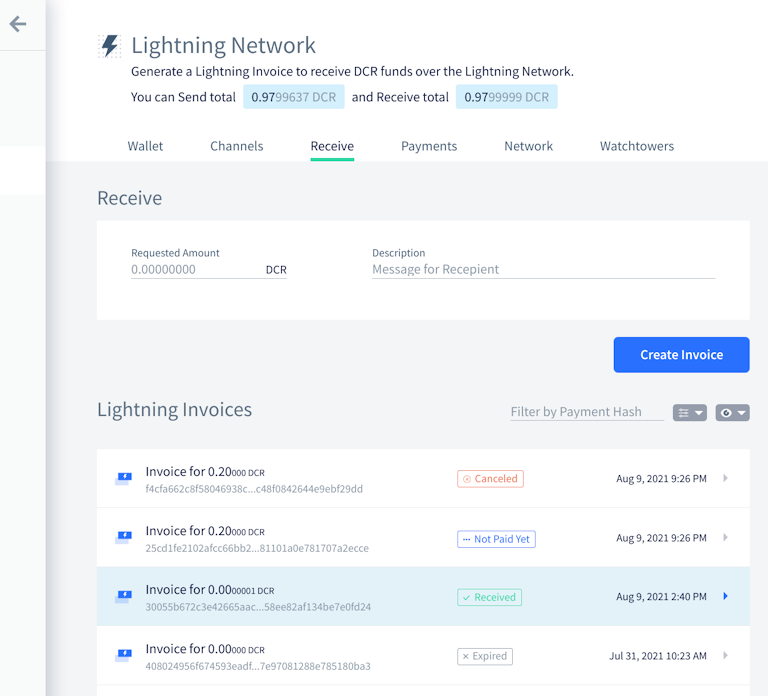
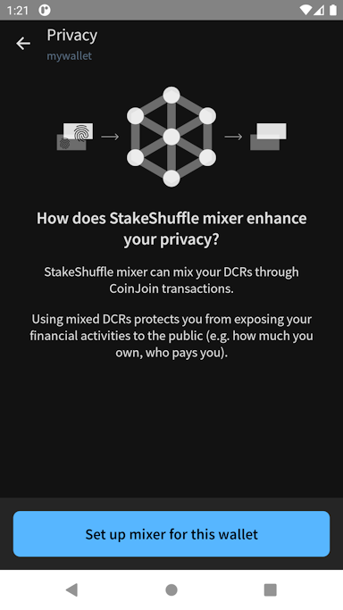

# صحيفة ديكريد لشهر أغسطس 2021

_الصورة: الحالة المرسلة بواسطة saender@_

* تم إصدار النسخة 1.1.0 لبوليتيا ونشرها بموقع المقترحات، والتي تضيف ميزات جديدة، بما في ذلك البيانات الوصفية الموسعة وواجهة المستخدم المحسّنة.
* وأخيرا حقق سعر التذكرة أعلى مستوى له على الإطلاق عند 321، والذي تجاوز الارتفاعات التي حدثت في تاريخ ديكريد، مما يمهد الطريق للإشارة إلى إرتفاع جديد غير مسبوق لأسعار التذاكر دون أي تأهيل بشأن الارتفاع المبكر في الأسعار.
* تقدم قوي في مجموعة من مستودعات برمجيات ديكريد، بما في ذلك التقدم في 3 مقترحات مختلفة لتغيير ديكريد (7 و 8 و 9)، وفيما يخص منصة المبادلات اللامركزية لديكريد، فإنه يتم مراجعة عقد Solidity لتداول ETH على شبكة الإختبار.

المحتويات:

* [التطوير](#التطوير)
* [الأشخاص](#الأشخاص)
* [الإدارة و الحوكمة](#الإدارة-و-الحوكمة)
* [الشبكة](#الشبكة)
* [النظام البيئي](#النظام-البيئي)
* [الانتشار](#الانتشار)
* [الفعاليات](#الفعاليات)
* [وسائل الإعلام](#وسائل-الإعلام)
* [الأسواق](#الأسواق)
* [الخارجية ذات الصلة](#الخارجية-ذات-الصلة)

## التطوير

ما لم يُذكر خلاف ذلك، فإن العمل المَذْكُور هنا يشتمل على حالة "الدمج إلى الرئيسي". وهذا يعني أن العمل قد تم استكماله ومراجعته ودمجه في كود المصدر الذي يمكن للمستخدمين المتقدمين [بناءه وتشغيله](https://medium.com/@artikozel/the-decred-node-back-to-the-source-part-one-27d4576e7e1c)، ولكنه ليس متاحًا بعد في ثنائيات الإصدار للمستخدمين العاديين.

<a id="dcrd" />

**[dcrd](https://github.com/decred/dcrd)**

تم [دمج](https://github.com/decred/dcrd/pull/2680) تنفيذ التغيير بالإجماع [لعكس سياسة إنفاق الخزينة](https://github.com/decred/dcps/blob/master/dcp-0007/dcp-0007.mediawiki) (DCP-7) (بعد بعض [الاستعدادات](https://github.com/decred/dcrd/pull/2679) لتسهيل المراجعة). وإذا ما اجتاز التصويت، فإن الحد الأقصى للإنفاق سوف يستند إلى الدخل التاريخي للخزينة وليس إلى إنفاقها التاريخي، وهو ما يفسح بدوره المجال أمام القدرة على استخدام الخزينة اللامركزية الجديدة.

العمل المدمج من أجل التغيير بالإجماع [للإلغاء التلقائي للتذاكر](https://github.com/decred/dcps/blob/master/dcp-0009/dcp-0009.mediawiki) (DCP-9):

* إضافة طريقة لوضع جميع التذاكر التي [ستنتهي صلاحيتها](https://github.com/decred/dcrd/pull/2701) في الكتلة التالية
* التصويت الموحد و[التحقق](https://github.com/decred/dcrd/pull/2702) من الإلغاء
* إضافة وظيفة لإنشاء معاملة [إلغاء](https://github.com/decred/dcrd/pull/2707) لتذكرة معينة

الأعمال المدمجة الأخرى:

* [تعريفات](https://github.com/decred/dcrd/pull/2713) للتغيير بالإجماع [لتحديثات الإصدار الصريح](https://github.com/decred/dcps/blob/master/dcp-0008/dcp-0008.mediawiki) (DCP-8)
* تحسين قيم الرياضيات [المحسوبة مسبقًا](https://github.com/decred/dcrd/pull/2690) لجعل التحقق من التوقيع أسرع ب 10% و ثنائيات `dcrd` أصغر ب 400 كيلو بايت تقريبًا
* إعادة كتابة كود [تحويل NAF](https://github.com/decred/dcrd/pull/2695) لتجنب جميع عمليات تخصيص الكومة والتبديل إلى خوارزمية أسرع، وإزالة حوالي 1٪ أخرى من وقت التحقق من التوقيع
* إضافة طرق لإنشاء واستعادة [لقطات](https://github.com/decred/dcrd/pull/2715) من المعاملة الأولى القابلة للإنفاق في مخرجات الكتلة (ستسمح باختبارات أكثر كفاءة)
* تمت إضافة خيار التكوين لأقصى حجم [لملف السجل](https://github.com/decred/dcrd/pull/2711) قبل تدويره وضغطه

<a id="dcrwallet" />

**[dcrwallet](https://github.com/decred/dcrwallet)**

* إضافة دعم أداة الخلط و مزود خدمة التصويت لطلب JSON-RPC لشراء تذكرة [`purchaseticket`](https://github.com/decred/dcrwallet/pull/2064)
* إضافة طلب [`processunmanagedticket`](https://github.com/decred/dcrwallet/pull/2075) JSON-RPC لتعيين تذكرة موجودة لمزود خدمة التصويت الذي تم تكوينه في ملف تكوين المستخدم
* إضافة [تخزين](https://github.com/decred/dcrwallet/pull/2068) مضيف مزود خدمات التصويت والمفتاح العام لكل تذكرة في قاعدة بيانات المحفظة (يتيح إجراء فحص أكثر كفاءة لحالة رسوم التذاكر)
* إصلاح بعض عناوين [المراقبة](https://github.com/decred/dcrwallet/pull/2076) المكررة (كان ذلك يؤدي إلى اختناق معالجة الكتل في المحافظ المستخدمة بكثرة)
* إصلاح بعض حالات [التعليق](https://github.com/decred/dcrwallet/pull/2081) عند قفل أو إغلاق المحفظة
* معالجة [إعادة التنظيم الثابتة](https://github.com/decred/dcrwallet/pull/2084) والمحسّنة في وضع مزامنة التحقق من الدفع البسيط

<a id="decrediton" />

**[Decrediton](https://github.com/decred/decrediton)**

* إضافة زر [لإلغاء](https://github.com/decred/decrediton/pull/3506) التذاكر أثناء فتح المحفظة في وضع التحقق من الدفع البسيط
* استعيض عن وضع حد للفجوة بإجراءَات [استخدام عنوان اكتشاف](https://github.com/decred/decrediton/pull/3532) من المحاولة الأولى (التي لديها حد فجوة خاص بها)
* تصميم واجهة مستخدم جديد لصفحات [الإرسال](https://github.com/decred/decrediton/pull/3538) و [الإستلام](https://github.com/decred/decrediton/pull/3537) للشبكة البرقية

_صفحة الإستلام بالشبكة البرقية على ديكريديتون_

<a id="politeia" />

**[Politeia](https://github.com/decred/politeia)**

تم إصدار النسخة 1.1.0 لبوليتيا و نشرها على موقع [proposals.decred.org](https://proposals.decred.org/). أبرز ما جاء في هذا الإصدار:

* يطلب من مؤلفي المقترحات الآن ملء مبلغ التمويل وتواريخ البدء والانتهاء والمجال، عند تقديم المقترحات (تُظهر المقترحات الأخيرة مثل [هذه](https://proposals.decred.org/record/58d9f46) البيانات الجديدة في الأعلى)
* [الجمع](https://github.com/decred/politeiagui/pull/2431) بين علامتي التبويب `قيد المناقشة` و`التصويت` في علامة التبويب `تحت المراجعة` لمساعدة المستعملين على معرفة ما إذا كان يجري التصويت على أي مقترحات
* إمكانية مشاهدة الماركداون الخام
* إمكانية معرفة من قام بمراقبة الاقتراح ولماذا
* العديد من إصلاحات وتحسينات واجهة المستخدم/تجربة المستخدم
* تم الحد من معدل إخطارات البريد الإلكتروني لمنع المستخدمين الخبيثين من تفعيل الكثير منهم والإشارة على بوليتيا كخادم بريد مزعج
* نقل قاعدة بيانات المستخدم إلى MySQL من أجل إزالة CockroachDB باعتبارها معتمدة وليس لديها سوى مثيل قاعدة بيانات واحدة لإدارته

لمزيد من التفاصيل، تحقق من ملاحظات الإصدار في مستودعات [politeia](https://github.com/decred/politeia/releases/tag/v1.1.0) و [politeiagui](https://github.com/decred/politeiagui/releases/tag/v1.1.0).

تم دمج التغييرات التي تواجه المستخدم في الإصدار الرئيسي (النسخة السابقة 1.1.0):

* السماح للمستخدم [لمقارنة](https://github.com/decred/politeiagui/pull/2524) أي نسختين للمقترحات
* الإبراز الفوري للتعليقات على [الأصوات](https://github.com/decred/politeiagui/pull/2520) مع إظهار خطأ عند فشل طلب الخادم
* ~ 7 إصلاحات للأخطاء

_مقارنة التغييرات في مقترحات بوليتيا_

التغييرات في النهاية الخلفية والداخلية وسطر الأوامر (ما بعد النسخة 1.1):

* التحقق من [كلمة المرور](https://github.com/decred/politeia/pull/1490) قبل العمليات الباهظة الثمن للمحفظة في أمر `التصويت politeavoter`
* قيم [العملة](https://github.com/decred/politeia/pull/1488) التي يمكن قراءتها من قبل الإنسان في أداة المخرجات `pictl` (على سبيل المثال عند تقديم مقترحات جديدة معها)
* إضافة حماية CSRF إلى مسار [تسجيل الدخول](https://github.com/decred/politeia/pull/1481)
* إضافة [حالات الفوترة](https://github.com/decred/politeia/pull/1480) (مفعلة، مغلقة، مكتملة) لتحديد ما إذا كان بإلإمكان إصدار فاتورة مقابل الاقتراح المعتمد
* طلب توقيع حقول [البيانات الإضافية](https://github.com/decred/politeia/pull/1487) عند نشر التعليقات أو تعديلها، والسماح فقط بهذه البيانات إذا تم تكوينها في المكوِّن الإضافي `للتعليقات` (الغرض من هذه الحقول هو توسيع المكون الإضافي `للتعليقات` بوظائف جديدة)
* السماح لمؤلفي الاقتراح بنشر [التحديثات](https://github.com/decred/politeia/pull/1491) على المقترحات المعتمدة. يبدأ كل تحديث سلسلة تعاليق جديدة حيث يمكن للمستخدمين الرد والتصويت، حتى يقوم المسؤول بوضع علامة على الاقتراح إما منته أو مغلق.
* زيادة تغطية الاختبار

<a id="vspd" />

**[vspd](https://github.com/decred/vspd)**

* تحسينات معالجة [الإشارات](https://github.com/decred/vspd/pull/293) المنقولة من مشاريع أخرى
* إصلاحات وصيانة صغيرة

<a id="dcrlnd" />

**[dcrlnd](https://github.com/decred/dcrlnd)**

* تم التحديث إلى [أحدث](https://github.com/decred/dcrlnd/pull/138) نسخة ل dcrd و dcrwallet
* تمت إضافة [برنامج نصي](https://github.com/decred/dcrlnd/pull/139) لإنشاء شبكة محاكاة للاختبار
* إضافة [دعم التحقق البسيط من الدفع SPV](https://github.com/decred/dcrlnd/pull/140) في وضع محفظة مدمجة (وضع محفظة مدمجة + وضع التحقق البسيط من الدفع يسمح بتشغيل dcrland الحاجة إلى كل من dcrd وdcrwalet)

<a id="dcrdex" />

**[DCRDEX](https://github.com/decred/dcrdex)**

واجهة المستخدم:

* إصلاح نظام بيانات [اعتماد](https://github.com/decred/dcrdex/pull/1015) العميل. يتم الآن اشتقاق المفاتيح الخاصة لكل حساب DEX جديد من تطبيق فردي للبذور والمفتاح العام للخادم. كما يتم استبدال كلمة مرور التطبيق الوحيد المستخدمة لتشفير بيانات المستخدم الحساسة بزوج من المفاتيح حيث يتم تشفير المفتاح "الداخلي" بالمفتاح "الخارجي". وهذا يزيل الحاجة إلى إعادة تشفير كل البيانات المحمية عندما تتغير كلمة السر (والمفتاح الخارجي).
* تمت إضافة نقطة نهاية لإرجاع [بذور التطبيق](https://github.com/decred/dcrdex/pull/1149) إذا تم توفير كلمة مرور التطبيق الصحيحة
* تمت إضافة مربع اختيار [لتذكر كلمة المرور](https://github.com/decred/dcrdex/pull/1119) طوال مدة الجلسة
* إعلام المستخدم بالأسواق المتاحة وأحجام اللوتات قبل دفع رسوم [التسجيل](https://github.com/decred/dcrdex/pull/1135)
* السماح للعملاء [بإلغاء](https://github.com/decred/dcrdex/pull/1133) الطلبات أثناء تعليق السوق
* إصلاح مشاكل [التمرير](https://github.com/decred/dcrdex/pull/1142)

داخلي:

* استخدام [مرشحات مدمجة](https://github.com/decred/dcrdex/pull/954) على العميل لتحديد مكان عمليات إعادة استرداد عقود الطرف المقابل بدلا من سحب الكتل دائما للتحقق منها
* لا تبث المقايضات إذا كان هناك أي مشكلة في توليد أو توقيع [معاملة الاسترداد](https://github.com/decred/dcrdex/pull/1166)
* دعم [التدويل](https://github.com/decred/dcrdex/pull/1051) الأولي على العميل (في كود Go و HTML و JS)
* تحقق تلقائيا مما إذا كانت القوالب [المترجمة](https://github.com/decred/dcrdex/pull/1167) تحتاج إلى إعادة إنشائها
* إصلاح بعض [توقف](https://github.com/decred/dcrdex/pull/1150) الاغلاق
* إصلاح و تحسين اختبار [إعادة التنظيم](https://github.com/decred/dcrdex/pull/669)

دعم الإيثيريوم:

* النسخة الأولية من [العقدالذكي](https://github.com/decred/dcrdex/pull/1019) ل Solidity الخاص بمقايضات ETH. كما يقول [الملف التمهيدي](https://github.com/decred/dcrdex/tree/a7046c670b4f824b7b5e237c9efcecbd8fc5e604/dex/networks/eth/contracts)، فإنه لم يتم اختباره وغير آمن للاستخدام على الشبكة الرئيسية والغرض منه أن يكون [إثباتا للمفهوم](https://en.wikipedia.org/wiki/Proof_of_concept#Software_development)  لمقايضات ETH. أنتج طلب السحب هذا قدرًا كبيرًا من المعرفة حول أمن الإيثيريوم والعقد، وجلب اختبار [الكود](https://github.com/decred/dcrdex/blob/a7046c670b4f824b7b5e237c9efcecbd8fc5e604/client/asset/eth/rpcclient_harness_test.go#L706) لثغرة هجوم إعادة الدخول.
* إضافة تقريبية [لتكلفة](https://github.com/decred/dcrdex/pull/1157) المقايضة بالغاز

معظم هذه التغييرات تتعلق [بالمعلم الرئيسي للإصدار 0.3](https://github.com/decred/dcrdex/milestone/12)، ولكن تم نقل بعضها إلى فرع الإصدار [v0.2.x](https://github.com/decred/dcrdex/commits/release-v0.2).

تحقق من [الحلقة 42](https://www.youtube.com/watch?v=dRjAalxS3r8) لديكريد في العمق حيث أجاب chappjc@ على أسئلة المجتمع حول منصة المُبادلات اللامركزية لديكريد DCRDEX والعمل كمطور ديكريد.

<a id="dcrandroid" />

**[dcrandroid](https://github.com/planetdecred/dcrandroid)**

تم الدمج في مكتبة [dcrlibwallet](https://github.com/planetdecred/dcrlibwallet) (المشتركة من قبل dcrandroid و dcrios و godcr):

* دعم تصويت [بوليتيا](https://github.com/planetdecred/dcrlibwallet/pull/202)
* مرشح لجلب التذاكر [غير المعدنة](https://github.com/planetdecred/dcrlibwallet/pull/205) (التي لا تتوفر على تأكيدات)
* إضافة خاصية لمعرفة الوقت المتبقي حتى التغيير التالي [لسعر التذكرة](https://github.com/planetdecred/dcrlibwallet/pull/204)

تم الدمج في dcrandroid:

* تنفيذ [الوضع الليلي](https://github.com/planetdecred/dcrandroid/pulls?q=is%3Apr+dark+merged%3A2021-08-01..2021-08-31+sort%3Aupdated-asc)
* إضافة مربع حوار [تفاصيل](https://github.com/planetdecred/dcrandroid/pull/573) معاملة التذاكر
* تحديث الترجمة [الفرنسية](https://github.com/planetdecred/dcrandroid/pull/576)
* [تحديث](https://github.com/planetdecred/dcrandroid/pull/571) التبعيات وترحيلها إلى نمط كود Kotlin
* إصلاح [ثغرة](https://github.com/planetdecred/dcrandroid/pull/581) "StrandHogg" (ثغرة قد تخطف فيها التطبيقات الضارة مهام Android)

 

_الوضع الليلي للخصوصية و الإستلام في dcrandroid_

<a id="dcrios" />

**[dcrios](https://github.com/planetdecred/dcrios)**

* تحقيق الحد الأدنى من هدف النشر إلى نظام التشغيل [iOS 12](https://github.com/planetdecred/dcrios/pull/816)
* ~ 2 إصلاحات للأخطاء

<a id="godcr" />

**[godcr](https://github.com/planetdecred/godcr)**

* تنفيذ تصويت [بوليتيا](https://github.com/planetdecred/godcr/pull/542)
* عرض معلومات أكثر عن قوائم و تفاصيل [المعاملة](https://github.com/planetdecred/godcr/pull/582)
* إضافة [إشعارات](https://github.com/planetdecred/godcr/pull/518) سطح المكتب عند اكتشاف معاملة أو اقتراح وارد جديد
* نظام جديد [للإخطارات](https://github.com/planetdecred/godcr/pull/540) داخل التطبيق (toast) ونظام التشغيل
* عرض الوقت المتبقي حتى تغيير [سعر التذكرة](https://github.com/planetdecred/godcr/pull/565) التالي
* إخطارات مخصصة لمعاملة [التحصيص](https://github.com/planetdecred/godcr/pull/560)
* تنفيذ الملاحة [الخلفية](https://github.com/planetdecred/godcr/pull/557)
* إضافة [حوامة](https://github.com/planetdecred/godcr/pull/488) لأدوات بيانات التذاكر
* إدخال [LinearLayout](https://github.com/planetdecred/godcr/pull/563) لتبسيط كود التخطيط
* إعادة هيكلة وتنظيف الكود
* ~ 20 إصلاحًا للأخطاء

_المرشح المخلوط ل godcr_

<a id="dcrdata" />

**[dcrdata](https://github.com/decred/dcrdata)**

* تم ترحيلها إلى [واجهة برمجة تطبيقات الجديدة لبوليتيا](https://github.com/decred/dcrdata/pull/1829)
* تحديثات التبعية وإعادة بناء تعليماتها البرمجية استعدادًا لإصدار فرع النسخة 6.0

مسائل أخرى:

* نشر برنامج مكافأة إيجاد العلة [تحديثًا](https://bounty.decred.org/2021/08/status-update/): تم تصحيح ثغرات أمنية والإعلان عنها وإضافة مؤلفيها إلى [قاعة المشاهير](https://bounty.decred.org/#hall_of_fame).

## الأشخاص

تهانينا للمتعاقدين الجدد الذين حصلوا على ترخيص متعاقدي ديكريد (DCC): [vibros68@](https://github.com/vibros68)!

أجرى raedah@ [مقابلة](https://medium.com/authority-magazine/the-future-is-now-steven-wagner-of-raedah-group-on-how-their-technological-innovation-will-shake-4f272ced222f) شيقة مع مجلة Authority تحدث فيها عن مجموعة متنوعة من المواضيع وخبراته في الحياة وديكريد.

> _هل يمكنك أن تعطينا "اقتباس درس الحياة" المفضل لديك؟ هل يمكنك مشاركة كيف أثر ذلك في حياتك ؟_
>
> قال Jiddu Krishnamurti في بعض كتبه :"لا يمكنك شرب كلمة ماء"، و "إذا كان الماء نظيفا، اشربه". كانت هذه مؤشرات بسيطة حول الواقع بأن الكلمة أو الفكرة ليست هي نفسها الشيء، وأننا سنحتاج إلى أن نكون قادرين على استخدام حكمنا الخاص لتحديد ما إذا كان الشيء جيدا بدلا من البحث عن بعض السلطة الخارجية لتقول لنا ما هو حقيقي أو جيد أو صائب. وألقى مناقشات حول كوننا مصدر سلطتنا في حياتنا بدلا من أن نسلم سلطتنا للآخرين أو للمؤسسات الاجتماعية. لقد كان أفضل نوع من المعلمين لأنه لم يكن يريد أن يكون معلمًا لأحد. لقد أراد فقط أن يبعدهم، و يعيد لهم قوتهم. و أفضل رجال الأعمال الذين أعرفهم يفعلون ذلك أيضًا. ولا يتمثل هدفهم في جعل الشركة تعتمد عليهم من أجل خلق الأمن الوظيفي، بل في حل المشاكل وأتمتة عملهم بحيث لا تعود هناك حاجة إلى دورهم. وعند هذه النقطة، يمكنهم الانتقال إلى حل التحدي التالي.

تحقق من المقابلات الجديدة في قسم [وسائل الإعلام](https://g8thub.com/xaur/decred-news/blob/master/journal/202108.md#media) لمقابلات جديدة أخرى مع أعضاء المجتمع ديكريد.

إحصائيات المجتمع اعتبارًا من 1 سبتمبر:

* متابعو [التويتر](https://twitter.com/decredproject): 48,161 (575+)
* المشتركين في [ريديت](https://www.reddit.com/r/decred/): 11,597 (148+)
* مستخدمي غرفة الدردشة general# على [الماتريكس](https://chat.decred.org/): 522 (9+)
* مستخدمي [الديسكورد](https://discord.gg/GJ2GXfz): 2,124 (164+)
* مستخدمي [التيليجرام](https://t.me/Decred): 2,846 (13+)
* المشتركين في [اليوتيوب](https://www.youtube.com/decredchannel): 4,610 (10+)، المشاهدات 194 الف (بزيادة 3 آلاف)

## الإدارة و الحوكمة

في أغسطس، تلقت [الخزينة](https://dcrdata.decred.org/treasury) الجديدة 10,942 DCR بقيمة 1.76 مليون دولار بمتوسط ​​سعر أغسطس 161.24. تم إنفاق 845 DCR للدفع للمتعاقدين، بقيمة 136 ألف دولار بسعر أغسطس، أو 108 ألف دولار بمعدل فوترة يوليو البالغ 127.48 دولارًا. اعتبارًا من 2 سبتمبر، بلغ الرصيد المشترك للخزينة [القديمة](https://dcrdata.decred.org/address/Dcur2mcGjmENx4DhNqDctW5wJCVyT3Qeqkx) والجديدة 713,371 DCR (أي ما يعادل 129 مليون دولار أمريكي بسعر 187.50 دولارًا أمريكيًا).

تم نشر اقتراحين جديدين في أغسطس، وبدأ التصويت على كلاهما في أوائل سبتمبر:

* [اقتراح](https://proposals.decred.org/record/58d9f46) ثالث من Monde PR لتجديد جهود العلاقات العامة بواسطة lindseymmc@ لسنة أخرى بتكلفة 42.000 دولار.
* [اقتراح](https://proposals.decred.org/record/150cf81) من finstreet21@ لإنتاج سلسلة من مقاطع الفيديو التعليمية حول ديكريد للسوق الهندي، بتكلفة 9.800 دولار مقسمة على ثلاثة معالم.

تم رفض الاقتراحين المقدمين في يوليو واللذين تم التصويت عليهما في أغسطس:

* تم رفض [اقتراح](https://proposals.decred.org/record/ae609f1) تمويل فيلم وثائقي من قبل frizzers@ بتكلفة 295.000 دولار بنسبة موافقة بلغت 12.5٪ ونسبة مشاركة 67٪.
* تم رفض اقتراح تمويل المشاركة في معرض دبي للعملات الرقية بنسبة موافقة 37.5٪ و نسبة مشاركة 67٪.

للحصول على مزيد من التفاصيل حول مقترحات الشهر راجع [الإصدار 46](https://blockcommons.red/politeia-digest/issue046/) لموجز بوليتيا.

## الشبكة

**معدل الهاش**: افتتحت [معدلات الهاش](https://dcrdata.decred.org/charts?chart=hashrate&zoom=krrqjgnz-kt1oo9gz&scale=linear&bin=block&axis=time) في شهر أغسطس عند 316 Ph/s وأغلقت عند ~360 Ph/s، وبلغ قاعها عند 164 Ph/s كما بلغت ذروتها عند 413 Ph/s على مدار الشهر.

توزيع معدل الهاش الذي تم [الإبلاغ عنه](https://miningpoolstats.stream/decred) بواسطة المجمعات في 1 سبتمبر: Poolin بنسبة 36%، و F2Pool بنسبة 29%، و Antpool بنسبة 16%، و BTC.com بنسبة 8%، و Easy2Mine بنسبة 5%، و Luxor بنسبة 3%، و ViaBTC بنسبة 1.6%، و Huobipool بنسبة 1.3%، و OKEx بنسبة 0.14%، و CoinMine بنسبة 0.08%، و UUPool بنسبة 0.07%. تستند هذه النسب المئوية إلى معدل الهاش 244 Ph/s المنسوب إلى التجمعات المعروفة ولا تشمل معدل الهاش ~90 Ph/s من معدنين غير معروفين. أكد توزيع 1000 كتلة معدنة بالفعل قبل 1 سبتمبر هذه الأرقام.

**التحصيص**: تراوح [سعر التذكرة](https://dcrdata.decred.org/charts?chart=ticket-price&zoom=krrqjgnz-kt1oo9gz&axis=time&visibility=true-true&mode=stepped) بين 120.1-321.6 DCR، [بمتوسط](https://dcrstats.com/) 193.8 DCR (3.1+) على مدار 30 يوما.

بلغ [المبلغ المقفل](https://dcrdata.decred.org/charts?chart=ticket-pool-value&zoom=krrqjgnz-kt1oo9gz&scale=linear&bin=block&axis=time) 7.23-8.12 مليون DCR، مما يعني أن 54.5-61.1% من العرض المتاح [شارك](https://dcrdata.decred.org/charts?chart=stake-participation&zoom=krrqjgnz-kt1oo9gz&scale=linear&bin=block&axis=time) في إثبات الحصة.

انخفض سعر التذكرة إلى 120 DCR ثم ارتفع إلى أعلى مستوى جديد على الإطلاق عند 321.6 DCR. وصلت نسبة المشاركة في التحصيص أيضًا إلى أعلى مستوى جديد لها على الإطلاق عند 61.1٪.

**مقدم خدمة التصويت**: في 1 سبتمبر، تمت إدارة ما يقارب 8,600 (500-) تذاكر حية بواسطة خوادم vspd المدرجة و ما يقارب 250 (150-) بواسطة خوادم dcrstakepool القديمة المدرجة. إجمالا، تمكن 11 من مقدمي خدمات التصويت القديمة و 15 من مقدمي خدمات التصويت الجديدة من إدارة 21٪ (1.9%-) من مجمع التذاكر. كما قام مقدمو خدمات التصويت القديمة الذين تم حذفهم ولكنهم ما زالوا نشطين بإدارة 40 تذكرة حية.

**العقد**: طوال شهر أغسطس، كان هناك حوالي 205 عقدة يمكن الوصول إليها وفقًا لـ [dcrextdata](https://dcrextdata.planetdecred.org/nodes).

إصدارات العقد اعتبارًا من [لقطة](https://nodes.jholdstock.uk/user_agents) 1 سبتمبر (252 عقدة ل dcrd): النسخة 1.6.2 - 56%، النسخة 1.6.0 - 14%، النسخة 1.6.1 - 12%، النسخة 1.7 لبناءَات التطوير - 13%، النسخة 1.6 لبناءَات التطوير - 2.4%، النسخة 1.5.2 - 2%، النسخة 1.5.1 - 0.4%.

تراوحت حصة [العملات المخلوطة](https://dcrdata.decred.org/charts?chart=coin-supply&zoom=jyefppu5-kub1inpe&bin=day&axis=time&visibility=true-true-true) بين 46.1-50.5٪ وتجاوزت [معلمة](https://twitter.com/lukebp_/status/1427980967789187076) 50٪. تفاوتت الكمية المخلوطة اليومية بين 200 و 786 ألف وحدة ديكريد وحققت أيضًا رقمًا قياسيًا جديدًا.

تم تلخيص العديد من الأرقام القياسية الجديدة بشكل جيد في أحدث ملخص للمقاييس على السلسلة بواسطة bochinchero@.

## النظام البيئي

نرحب بمزود خدمة التصويت [الجديد](https://github.com/decred/dcrwebapi/pull/147) في [synergy-crypto.net](https://vspd.synergy-crypto.net/) برسوم 0.75٪ (وشكر إضافي لتشغيل مثيل [شبكة الإختبار](https://vspd-testnet.synergy-crypto.net/)).

تمت إزالة مزودي خدمة التصويت القديم التالية من [القائمة](https://decred.org/vsp/) العامة:

* [dcr.farm](https://dcr.farm) - تم إعادة توجيه صفحتها القديمة إلى [vspd](https://vsp.dcr.farm/) منذ يونيو (عندما [كان لديها](https://github.com/decred/dcrwebapi/issues/146#issuecomment-865451784) 32 تذكرة حية)
* [stakey.net](https://stakey.net) - تم استبدال الصفحة بواجهة مستخدم vspd، لكن [واجهة برمجة التطبيقات القديمة](https://stakey.net/api/v2/stats) الخاصة بها لا تزال مدرجة وتبلغ عن عدد التذاكر الحية المتبقية (38 اعتبارًا من 1 سبتمبر)

أغلق موقع raqamiya.net مزود خدمة التصويت القديم الخاص به. بدأت إجراءات الإغلاق في مارس عندما تم [شطبه](https://github.com/decred/dcrwebapi/pull/132) وتم إخطار المستخدمين عبر البريد الإلكتروني والموقع الإلكتروني و[مجلة ديكريد لشهر مارس](https://github.com/xaur/decred-news/blob/master/journal/202103.md#integrations) بعدم شراء أي تذاكر جديدة. ثم واصلت الرقمية التصويت على التذاكر الموجودة لمدة 4 أشهر تقريبًا قبل إغلاقها في 16 أغسطس. فات عدد قليل من المستخدمين جميع الإشعارات واستمروا في تخصيص التذاكر لمزود خدمة التصويت هذا حتى النهاية، مما أدى إلى 11 تذكرة حية في لحظة الإغلاق. يمكن أن يحدث هذا مع أي مزود خدمة تصويت قديم لأن [dcrstakepool](https://github.com/decred/dcrstakepool) ليس لديه طريقة لرفض تسجيلات التذاكر (على عكس بروتوكول vspd الجديد).

بالنسبة لأي شخص لا يزال يستخدم مزود خدمة التصويت القديم، يوصى بالتبديل إلى [موفري vspd](https://decred.org/vsp/) لتجنب مخاطر التذاكر الضائعة، على سبيل المثال نتيجة للإغلاق أو إذا توقف dcrstakepool عن العمل مع تحديثات الإجماع القادمة. اعتبارًا من 1 سبتمبر، أدار مقدمو خدمات التصويت القديمون أقل من 300 تذكرة، أو 0.7٪ من مجموع التذاكر.

منصات المُبادلات الجديدة التي تم إدماجها:

* أطلقت Bitfinex تداول DCR/USD
* مكنت منصة المُبادلات Bitcoin.com تداول DCR مقابل الأزواج BTC و ETH و USDT

قامت Hotbit Korea بإزالة زوج DCR/KRW الخاص بها، كما [ورد](https://twitter.com/DecredKorea/status/1425751145796956167) من DecredKorea@ (تم إطلاق الزوج في نوفمبر 2020).

تحذير: ليس لدى مؤلفي مجلة ديكريد أي فكرة عن مصداقية أي من الخدمات المذكورة أعلاه. يرجى إجراء البحث الخاص بك قبل الوثوق بمعلوماتك الشخصية أو أصولك لأي كيان.

انضم إلى دردشة [services#](https://chat.decred.org/#/room/#services:decred.org) لمتابعة تحديثات النظام البيئي لديكريد.

## الإنتشار

قلصت Monde PR عملها لشهر بعد شهر من انتهاء [اقتراحها الثاني](https://proposals.decred.org/proposals/c81926b) في يوليو. حافظت l1ndseymm@ على استمرار الفرص الحالية وأجابت على الاستفسارات الواردة أثناء العمل على [الاقتراح الثالث](https://proposals.decred.org/record/58d9f46) الذي يبدأ في سبتمبر.

## الفعاليات:

أصبحت ديكريد داعمةً لبرنامج تعليمي حول تقنية سلسلة الكتل و العملات الرقمية الذي تنظمه كلية إدارة الأعمال التابعة للجامعة الكاثوليكية في الأرجنتين ومنظمة Bitcoin Argentina غير الحكومية. تمت [دعوة](https://matrix.to/#/!clHjlICBEtCtAdTupf:decred.org/$-CkRPUnXB8spWofBTk3nA3UAr2u4ofpCIzaoCJuoUag) ديكريد نتيجة للاتصالات السابقة بين Bitcoin Argentina وفريق التواصل [الإسباني](https://twitter.com/Decred_ES) لدينا، وسيتم تضمينها في المواد التسويقية (إلى جانب العلامات التجارية الأخرى). تبدأ [ورشة العمل](http://uca.edu.ar/es/blockchain-y-criptoactivos) في سبتمبر 8 وستستمر لمدة 10 أسابيع.

## وسائل الإعلام

مقالات مختارة:

* الجزء الأول من The Suppressor: حرب الاستنزاف بواسطة tacorevenge@ على ([medium](https://medium.com/@tacorevenge/the-suppressor-part-1-war-of-attrition-3081a61b202b))
* المستقبل هو الآن: يتحدث ستيفن واغنر من مجموعة Raedah عن كيفية تأثير ابتكاراتهم التكنولوجية على المشهد التكنولوجي بقلم فوتيس جورجياديس ([medium](https://medium.com/authority-magazine/the-future-is-now-steven-wagner-of-raedah-group-on-how-their-technological-innovation-will-shake-4f272ced222f))

واحدة من أكثر العملات الرقمية ربحية بالنسبة للتعدين هي تلك التي ربما لم تسمع بها من قبل، وقد ارتفعت بنسبة 1.300٪ عن أدنى مستوى لها في عام 2020. كما يشرح Josh Metnick، الرئيس التنفيذي لمزرعة التعدين، ما هي العملات الرقمية وأي من المعدنين والمجمعات التي يجب استخدامها. بواسطة Laila Maidan على ([businessinsider.com](https://www.businessinsider.com/profitable-crypto-to-mine-according-to-ceo-mining-farm-navier-2021-8)، و paywalled [إلى حد ما](https://twitter.com/exitusdcr/status/1429414135582937088))

> قال متنيك: "إنه مشروع شرعي للغاية. وبشكل نسبي، كما هو الحال في سنوات العملات الرقمية، كان موجودًا منذ فترة. وهناك بعض الأشخاص الأذكياء والأخلاقيين المشاركين فيه".

أشرطة الفيديو:

* الحلقة 41 من ديكريد في العمق - مع الضيوف Stephen Palley و Gabriel Shapiro (من Lexnode) و Luke Powell بواسطة elima\_iii@ على [اليوتيوب](https://www.youtube.com/watch?v=9TXoyRv_Z8U)
* الحلقة 42 من ديكريد في العمق - Jonathan Chappelow + منصة المُبادلات اللامركزية لديكريد DCRDEX بواسطة elima\_iii@ على [اليوتيوب](https://www.youtube.com/watch?v=dRjAalxS3r8)
* النشرة الإخبارية لديكريد لشهر أغسطس - حوكمة سلسلة الكتل قيد التنفيذ، ارتفاعات جديدة للشبكة، مقترحات مثيرة والمزيد! بواسطة Exitus@ ([اليوتيوب](https://www.youtube.com/watch?v=6ifueUAWy_c))
* نظام التصويت بالتذاكر لديكريد - أساسيات ديكريد بواسطة phoenixgreen@ ([اليوتيوب](https://www.youtube.com/watch?v=LEO0vHdY3gs))
* التثقيف في المجال الضريبي و ديكريد بواسطة phoenixgreen@ ([اليوتيوب](https://www.youtube.com/watch?v=-26obfV2e84))
* يتم تطوير ديكريد لشيء كبير بواسطة phoenixgreen@ ([اليوتيوب](https://www.youtube.com/watch?v=n6ATfW_vnCg))
* تحليل سعر ديكريد - 4 أغسطس 2021 بواسطة Brave New Coin ([اليوتيوب](https://www.youtube.com/watch?v=NOlvAI43VSY))

تم ذكر ديكريد بواسطة Chris Burniske في مقابلة يوليو على [Original Sins of Crypto](https://www.youtube.com/watch?v=gLbzfZKf_ro&t=1h05m42s) مع Jason Yanowitz من Blockworks:

> جايسون: كيف تثق رغم ذلك ... مثل، الجميع ديمقراطيون، حتى يحصلوا على السلطة ثم تفسد السلطة. أنا أحب مفهوم المنظمة المستقلة اللامركزية DAO وأحب مفهوم التمويل اللامركزي DeFi ولكن قلقي الأكبر هو، هل نحن فقط نثق في هؤلاء "المديرين التنفيذيين لـ DeFi DAO" بأنهم سيقومون بإضفاء اللامركزية والتخلي عن السلطة؟
>
> كريس: هذا يعتمد حقًا على نشأة المنظمة المستقلة اللامركزية. ليست كل المنظمات المستقلة اللامركزية متساوية. و بالنسبة لي لا يزال المعيار الذهبي لكيفية خلق منظمة مستقلة لامركزية هو ديكريد.

الترجمة:

* تمت [ترجمة](https://xaur.github.io/decred-news/) مجلة ديكريد لشهر يوليو 2021 إلى العربية (arij@ و abdulrahman4@) والصينية (Dominic@) والإسبانية (_\francov@). شكرا لجميع المترجمين على نشر الكلمة!

إذا كانت لديك ترجمات لا نعلم عنها، فيرجى مشاركتها في غرفة دردشة [translations#](https://chat.decred.org/#/room/#translations:decred.org).

## الأسواق

في أغسطس، تم تداول DCR بين 126.50-181.26 دولارًا أمريكيًا/BTC 0.0032-0.0038. وكان متوسط ​​السعر اليومي 161.24 دولارًا.

[تعرض](https://twitter.com/longtermdaily/status/1433148588608004097) dcrdata الآن [السعر](https://explorer.dcrdata.org/market?chart=candlestick&xc=dcrdex&bin=1d) وسجل [حجم](https://explorer.dcrdata.org/market?chart=volume&xc=dcrdex&bin=1d) التداول لزوج BTC/DCR في DCRDEX.

_تم عرض حجم منصة المبادلات اللامركزية لديكريد DCRDEX أخيرًا_

نشر مساهم غامض جديد tacorevenge@ [الجزء الأول](https://medium.com/@tacorevenge/the-suppressor-part-1-war-of-attrition-3081a61b202b) من التحقيق في الكيان القامع الذي يشتبه بعض أفراد المجتمع في التلاعب في أسواق DCR.

_البيع بشكل غريب و بكميات كبيرة_

## الخارجية ذات الصلة

أصبح بعض المشرعين الأمريكيين انتقائيين بشكل مدهش بشأن خوارزميات الإجماع واستبعدوا فقط [التعدين بإثبات العمل](https://news.bitcoin.com/white-house-backs-crypto-tax-amendment-endorsing-proof-of-work-infrastructure-bill/) من تعريف "السماسرة" - والذي يتضمن "أي شخص (يتعين النظر فيه) مسؤول عن أي خدمة تنفذ عمليات نقل الأصول الرقمية ويقدمها بانتظام". وقد تم [انتقاد](https://twitter.com/jchervinsky/status/1421150347788263433) هذا التعريف الواسع على أنه يمكن تطبيقه على كل جهة فاعلة اقتصادية تقريبا في هذا المجال، وأصبح موضوعًا لجهود ضغط العملات الرقمية لاستبدال تلك اللغة بأخرى أكثر تحديدًا وتستبعد صراحة جميع المدققين ومطوري البرامج. وكانت هناك صيغة لمشروع القانون حظيت بتأييد عدد من أعضاء مجلس الشيوخ كان من شأنها أن تشدد الصياغة بهذه الطريقة، ولكن نظرا لإجراءات مجلس الشيوخ، لم يتم النظر في إدخال أي تعديلات وتم [إحالة](https://www.coindesk.com/markets/2021/08/10/us-senate-sends-infrastructure-bill-to-house/) مشروع القانون الذي يتضمن التعريف الواسع النطاق إلى مجلس النواب.

قامت A16Z، وهي شركة رأسمالية لها حصص في العديد من شبكات العملات الرقمية، [بنشر](https://a16z.com/2021/08/26/open-sourcing-our-token-delegate-program/) "برنامج تفويض التوكنات". تشرح الوثيقة لماذا قررت A16Z تفويض حقوقها في التصويت (فهي تمتلك العديد من التوكنات بحيث ستكون عملية صنع القرار مركزية بخلاف ذلك). كما تشرح كيف يختارون المندوبين، حيث يتم توجيه حوالي 50٪ من مندوبيهم إلى مؤسسات جامعية والباقي إلى شركات ناشئة وغير ربحية.

تسبب اقتراح Uniswap من Flipside crypto في بعض [الجدل](https://twitter.com/DuneAnalytics/status/1428250340139356164) في المجتمع لأنه انتشر من خلال الجولات المبكرة من التصويت، وكان سيستخدم قيمة 25 مليون دولار من UNI لتوليد العائد الذي دفع فريق Flipside لإنتاج "تحليلات تمكين المجتمع". وكانت إحدى القضايا التي أثيرت هي أن الكيانات المسماة للإشراف على المنحة تشمل أشخاصا سيستفيدون منها. لم يكن جميع مقدمي التحليلات الآخرين متأثرين بمحاولة Flipside للحصول على UNI لتمويل 8 موظفين بدوام كامل لشركتهم.

لقد وصلت هوس NFT إلى مرتفعات جديدة مع إسقاط الجوي [LOOT](https://techcrunch.com/2021/09/03/loot-games-the-crypto-world) (بالنسبة للمغامرين)، وصور مع نص أبيض يصف مواد لعبة المغامرة على خلفية سوداء، والتي سرعان ما كانت تباع مقابل 10 ETH لكل منها. والفكرة وراء LOOT هي أنه بمجرد تحديد نطاق العناصر وندرتها في البداية، سيضيف الأشخاص جميع الجوانب المرتبطة عادةً بالألعاب (التمثيل المرئي للعنصر، والإحصائيات، وعالم اللعبة لاستخدامه فيه) بعد ذلك. يبدو أنه تم إيلاء القليل من الاهتمام لتحفيز هذا العمل حتى الآن ، ولكن يبدو أن الميزة الرئيسية لـ LOOT في هذه المرحلة تخول حاملها لتلقي مجموعة من الإسقاطات الجوية الفارغة بالمثل. هل ننتقل إلى الماضي "نبنيها وسوف يأتون"، لكي "نبيعهم بعض العناصر النائبة بسعر مرتفع ولا بد أن يظهر شخص ما ويبنيها"؟

أيضًا، يبدو أنه تم [التلاعب](https://twitter.com/IAMTHETORN/status/1434401460876369923) بالإسقاط الجوي ل LOOT بشدة من قبل الأشخاص ذوي المعرفة المتخصصة، والذين تمكنوا من ضمان العناصر النادرة في حقائبهم.

تم [بيع](https://www.cnbc.com/2021/09/01/banksy-website-promotes-fake-nft-in-apparent-hack.html) نسخة مزيفة من Banksy NFT مقابل 300 ألف دولار بعد أن تم اختراق موقع فنان الجرافيتي على ما يبدو لإضافة صفحة تقدم NFT وترتبط بقوائمها في Opensea. أعاد المحتال لاحقًا ETH للمشتري لأسباب غير مذكورة.

هذا كل ما لدينا لشهر أغسطس. شارك بتحديثاتك للإصدار التالي في غرفة الدردشة [journal#](https://chat.decred.org/#/room/#journal:decred.org).

## عن هذا العدد

هذا هو العدد 41 من مجلة صحيفة ديكريد. فهرس جميع الإصدارات والمرايا والترجمات متاح [هنا](https://xaur.github.io/decred-news/).

يتم نقل معظم المعلومات الواردة من أطراف ثالثة مباشرة من المصدر بعد التحقق من الحد الأدنى لصحتها. ليس لدى مؤلفي مجلة صحيفة الديكريد القدرة على التحقق من جميع الادعاءات.رجاء إحذر من أعمال الاحتيال وقم ببحثك الخاص.

الاعتمادات (بالترتيب الأبجدي):

الكتابة والتحرير: bee و degeri و richardred

المراجعات والتعليقات: davecgh و l1ndseymm و lukebp و matheusd

صورة العنوان: saender

التمويل: أصحاب حصص الديكريد

النسخة الأصلية لمجلة الديكريد لشهر يوليو متوفرة على هذا الرابط [هنا](https://xaur.github.io/decred-news/journal/202108)

تمت الترجمة إلى اللغة العربية بواسطة: arij@. قام بالمراجعة abdulrahman4@.

