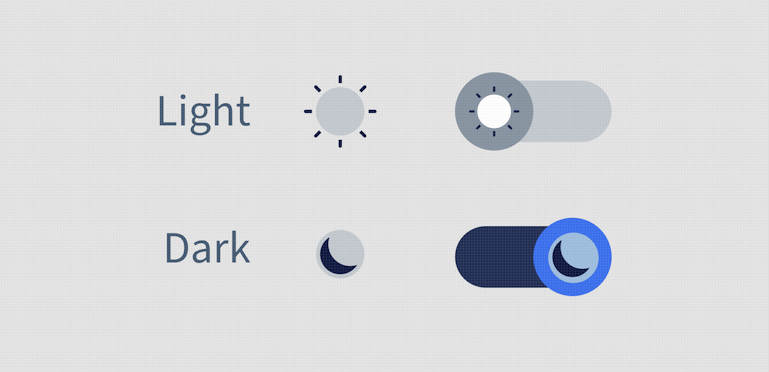
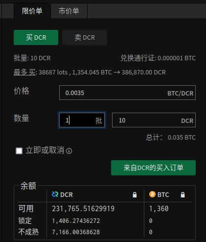
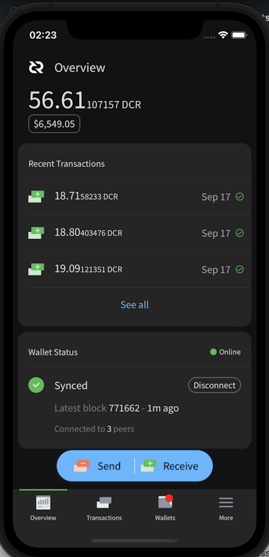

# صحيفة ديكريد لشهر سبتمبر 2021 
 
 
  
_الصورة: ساحة Fourier بواسطة saender@_ 
  
أبرز أحداث سبتمبر: 
  
- تم الانتهاء من العمل على تغييرات الإجماع DCP-8 و DCP-9، وهي جاهزة لتقديمها للتصويت على السلسلة حتى يتم المصادقة عليها. 
- تم تحديث بوليتيا إلى الإصدار 1.2، مع إضافة ميزات مثل تحديثات الاقتراح والقدرة على إجراء مقارنات بين أي نسختين من الاقتراح. 
- شهدت محافظ الهواتف المحمولة التي تعمل بنظامي Android و iOS إصدارات جديدة في متاجر التطبيقات الخاصة بها. 
- وصلت محفظة GoDCR إلى أول شبكة اختبار وظيفية لها، مما يدل على ما تم تحقيقه من خلال هذا المشروع حتى الآن، حيث تم نشر ومناقشة اقتراح استمرار تمويل GoDCR. 
  
المحتويات: 
  
- [التطوير](#التطوير) 
- [الأشخاص](#الأشخاص) 
- [الإدارة و الحوكمة](#الإدارة-و-الحوكمة) 
- [الشبكة](#الشبكة) 
- [النظام البيئي](#النظام-البيئي) 
- [الانتشار](#الانتشار) 
- [وسائل الإعلام](#وسائل-الإعلام) 
- [الأسواق](#الأسواق) 
- [الخارجية ذات الصلة](#الخارجية-ذات-الصلة) 
  
## التطوير 
  
ما لم يُذكر خلاف ذلك، فإن العمل المَذْكُور هنا يشتمل على حالة “الدمج إلى الرئيسي”. وهذا يعني أن العمل قد تم استكماله ومراجعته ودمجه في كود المصدر الذي يمكن للمستخدمين المتقدمين بناءه وتشغيله، ولكنه ليس متاحًا بعد في ثنائيات الإصدار للمستخدمين العاديين. 
  
<a id="dcrd" /> 
  
** [dcrd](https://github.com/decred/dcrd) ** 
  
_dcrd هو تطبيق عقدة كامل يعمل على تشغيل شبكة ديكريد نظير لنظير  حول العالم._ 
  
تحديثات النسخة الصريحة لتغييرات الإجماع ([DCP-8](https://github.com/decred/dcps/blob/master/dcp-0008/dcp-0008.mediawiki)): 
  
- تم [تنفيذ](https://github.com/decred/dcrd/pull/2716) قواعد الإجماع الجديدة. وبمجرد تفعيلها، سيتم رفض المعاملات غير المعروفة وإصدارات البرنامج النصي حتى يتم تمكينها بشكل صريح من خلال تغيير إجماع آخر. كما ستظل وحدات ديكريد التي كانت قابلة للإنفاق قبل التفعيل قابلة للإنفاق. سيوفر هذا التغيير أمنًا أكبر للشبكة ويسمح للمطورين بكتابة المزيد من التعليمات البرمجية المضادة للأخطاء، كما هو موضح في تعليقات [الاقتراح](https://proposals.decred.org/record/3a98861) ل [DCP-8](https://github.com/decred/dcps/blob/master/dcp-0008/dcp-0008.mediawiki)، [المناقشة](https://github.com/decred/dcrd/pull/2719#issuecomment-909535320) الأخيرة للتطوير. 
- نشر davecgh@ [تحديثًا للمقترح](https://proposals.decred.org/record/3a98861/comments/21) يفيد بأن جميع أعمال تطوير dcrd قد اكتملت 
  
التغيير بالإجماع للإلغاء التلقائي للتذاكر ([DCP-9](https://github.com/decred/dcps/blob/master/dcp-0009/dcp-0009.mediawiki)): 
  
- [الاستعدادات](https://github.com/decred/dcrd/pull/2718): إضافة الاختبارات، و تعريفات الأجندة، مع إعادة تنظيم الكود ليتناسب مع التغييرات القادمة. كما تم تقديم أولوية معاملة جديدة لضمان دوام إنشاء الإلغاء التلقائي. لتصبح القائمة الكاملة للأولويات: الأصوات (الأعلى) > الإلغاء التلقائي > التذاكر > المعاملات العادية والإلغاء (الأدنى). 
- [التنفيذ](https://github.com/decred/dcrd/pull/2720) الفعلي للتغيير بالإجماع. بمجرد التفعيل، سيُطلب من الكتل أن تضم الإلغاءَات لجميع التذاكر المفقودة أو المنتهية الصلاحية اعتبارًا من هذه الكتلة. كما ستسمح القواعد الجديدة بإلغاء القفل على حوالي [مائتا ألف وحدة ديكريد](https://github.com/decredcommunity/proposals/blob/master/proposals/e2d7b7d/docs/unrevoked-missed-tickets.md) عالقة في تذاكر مفوتة غير ملغاة. 
- نشر rstdaut2@ [تحديثًا للمقترح](https://proposals.decred.org/record/e2d7b7d/comments/19) يفيد بأنه قد تم الإنتهاء جميع أعمال تطوير dcrd 
  
أعمال مدمجة أخرى: 
  
- تم تنفيذ [تنقية](https://github.com/decred/dcrd/pull/2641) إنفاق السجل والتي تؤخر إزالة مدخلات إنفاق السجل حتى لا يتم استخدامها مرة أخرى (هذا ضروري [للفهرسة غير المتزامنة](https://github.com/decred/dcrd/issues/1470) التي من شأنها تسريع عملية التحقق من صحة الكتلة) 
- إضافة المزيد من الاختبارات لبرنامج إدارة العناوين و [فصلها](https://github.com/decred/dcrd/pull/2596) عن حزمة `wire`، استعدادًا للتغييرات القادمة في بروتوكول wire 
- تثبيت صور [Docker](https://github.com/decred/dcrd/pull/2735) و[إجراءات](https://github.com/decred/dcrd/pull/2736) GitHub بواسطة الهاشات بدلاً من العلامات لتحسين أمن سلسلة التوريد 
- إعادة صياغة [Docker](https://github.com/decred/dcrd/pull/2740) لتوفير صورة تركز على الأمن. فهو لا يتضمن سوى نظائر ثنائية خاصة بنظام ديكريد ("distroless") ويديرها كمستخدم بدون إمتيازات. وتبلغ الصورة النهائية الجديدة حوالي 10 ميغابايت، مقارنة بـ 1 غيغابايت تقريبًا في الإصدارالسابق. 
- تم تحديث الكود لاستخدام ميزات [Go 1.16](https://github.com/decred/dcrd/pull/2722) 
تم تحديث الرسم البياني [للتسلسل الهرمي](https://github.com/decred/dcrd/pull/2744) للوحدة 
  
يتم التحضير لإطلاق إصدار ضخم ل dcrd... بما في ذلك 3 تصويتات بالإجماع، ومزامنة أسرع بنسبة 30٪، و المزيد. ([rstaudt2@](https://twitter.com/rstaudt2/status/1443668800679858181)) 
  
<a id="dcrwallet" />
  
**[dcrwallet](https://github.com/decred/dcrwallet)** 
  
_dcrwallet هو خادم محفظة يستخدمه سطر الأوامر وتطبيقات المحفظة الرسومية._ 
  
- السماح بمعالجة [رسوم مزود خدمة التصويت](https://github.com/decred/dcrwallet/pull/2058) للتذاكر التي تم شراؤها بالفعل عند إيقاف مشتري التذاكر 
- تغيير [الحد](https://github.com/decred/dcrwallet/pull/2086) الافتراضي لمشتري التذاكر `ticketbuyer` إلى تذكرة واحدة كحد أقصى لكل كتلة 
- السماح [بتعطيل](https://github.com/decred/dcrwallet/pull/2088) اكتشاف الحساب (يسمح بتحسين العملاء الذين لا يحتاجون إليه مثل dcrlnd) 
- تمت إضافة خيار التكوين لأقصى [حجم سجل](https://github.com/decred/dcrwallet/pull/2077) قبل تدويره 
- تم تحديث الكود إلى [Go 1.16](https://github.com/decred/dcrwallet/pull/2085) وأحدث وحدات [dcrd](https://github.com/decred/dcrwallet/pull/2087) 
- إصلاح بعض المشكلات المتعلقة بمعالجة وتأكيد [مدفوعات الرسوم](https://github.com/decred/dcrwallet/pull/2083) للتذاكر المدارة بواسطة مقدم خدمات التصويت 
- إصلاح [حساب الرسوم](https://github.com/decred/dcrwallet/pull/2057) للمعاملات متعددة التوقيعات 
- إصلاح مشكلة محتملة [للسرعة](https://github.com/decred/dcrwallet/pull/2089) في وضع التحقق البسيط من الدفع SPV 
  
<a id="decrediton" /> 
  
**[Decrediton](https://github.com/decred/decrediton)** 
  
_ديكريديتون هي تطبيق محفظة لسطح المكتب كامل الميزات مع ميزة التصويت مدمجة، وميزة الخلط ب StakeShuffle، والشبكة البرقية، والتداول على منصة المُبادلات اللامركزية DEX للديكريد، والمزيد. يتم تشغيلها مع سلسلة الكتل كاملة أو بدونها (وضع التحقق البسيط من الدفع SPV)._ 
  
- نفذت تصميم واجهة مستخدم جديد لعلامة تبويب [قنوات الشبكة البرقية](https://github.com/decred/decrediton/pull/3543) 
تحديث [عبارات مرور](https://github.com/decred/decrediton/pull/3546) جميع الحسابات عند تغيير عبارة المرور الخاصة 
- إصلاح بعض المشكلات المتعلقة بمزامنة [حالة دفع](https://github.com/decred/decrediton/pull/3545) رسوم مزود خدمة التصويت 
- إصلاح 3 أخطاء عند [إنشاء](https://github.com/decred/decrediton/pull/3554) المحفظة 
- إصلاح [أخطاء](https://github.com/decred/decrediton/pull/3561) مزود خدمة التصويت القديمة التي تظهر في وضع مزود خدمة التصويت الجديد 
إصلاح روابط [التصفح](https://github.com/decred/decrediton/pull/3558) المفقودة 
- إصلاح [التعتيم](https://github.com/decred/decrediton/pull/3555) عند استعادة محفظة تريزور 
- إصلاح [الأعطال](https://github.com/decred/decrediton/pull/3548) الناتجة عن معالجة معاملات كبيرة جدًا 
- إصلاح [التغيير](https://github.com/decred/decrediton/pull/3553) من الإرسال المخلوط الذي يتم إرساله إلى عنوان خاطئ 
  
 
  
_صفحة قنوات الشبكة البرقية على ديكريديتون_ 
  
<a id="politeia" /> 
  
**[بوليتيا](https://github.com/decred/politeia)** 
  
_بوليتيا هي نظام المقترحات لديكريد. يتم استخدامها لطلب التمويل من خزينة ديكريد._ 
  
تمت [إضافة](https://twitter.com/lukebp/status/1442540461244043264) ميزة جديدة و إصدار لإصلاح الأخطاء على موقع [بوليتيا](https://proposals.decred.org/)! أهم ميزات الإصدار 1.2.0: 
  
- تحديثات مؤلف الاقتراح للمقترحات الموافق عليها 
- مقارنة أي نسختين من المقترحات 
- زر تضمين الصورة 
- تحديثات متفائلة للتصويت على التعليقات الفورية 
- الخادم: حالة فوترة الاقتراح، لإضفاء الطابع الرسمي على ما إذا كانت الفواتير مسموح بها أم لا 
- الخادم: حالة اقتراح موحد لتبسيط العملاء 
- الخادم: زيادة الأمن والاستقرار 
  
لمزيد من التفاصيل تحقق من ملاحظات الإصدار في مستودعات [بوليتيا](https://github.com/decred/politeia/releases/tag/v1.2.0) و [politeiagui](https://github.com/decred/politeiagui/releases/tag/v1.2.0). 
  
تم دمج التغييرات التي تواجه المستخدم في سبتمبر: 
  
- إدماج [حالة](https://github.com/decred/politeiagui/pull/2609) جديدة للمقترحات وقدرة المشرف على تعيين حالة الفوترة 
- تحسين واجهة المستخدم [لـتضمين الصور](https://github.com/decred/politeiagui/pull/2567) 
-عرض مشروط تسجيل الدخول عند [انتهاء صلاحية](https://github.com/decred/politeiagui/pull/2541) جلسة المستخدم 
- إضافة [العلامات الوصفية لـ SEO](https://github.com/decred/politeiagui/pull/2614) لتحسين التنسيب في نتائج البحث وتمكين معاينات لطيفة على  التويتر و الفيسبوك  
- تحديث تصميم [تبديل](https://github.com/decred/politeiagui/pull/2588) الوضع المظلم 
- ~ 18 إصلاحات أخطاء واجهة المستخدم الرسومية و ~ 3 تحسينات 
  
تغييرات الواجهة الخلفية والداخلية وسطر الأوامر: 
  
-  تمت إضافة [حالة الاقتراح](https://github.com/decred/politeia/pull/1515)     الموحدةالتي تعمل كمصدر واحد للبيانات الوصفية للاقتراح من المكونات الإضافية المختلفة، وبالتالي إزالة التعقيد من العملاء وكذلك تقليل الحمل على الخادم. يمكن الاستعلام عن الحالة الجديدة باستخدام الأمر `pictl proposalsummaries`. 
- تمت إضافة واجهات عالية المستوى [لفحص نظام الملفات](https://github.com/decred/politeia/pull/1512) للتحقق من سلامة البيانات وإعادة بناء ذاكرة التخزين المؤقت عند بدء التشغيل. وسيتم [تنفيذ](https://github.com/decred/politeia/issues/1511) تطبيقات المكونات الفردية بشكل منفصل. 
تنفيذ إعادة بناء ذاكرة التخزين المؤقت [لمخزون السجلات](https://github.com/decred/politeia/pull/1520) عند تمكين فحص نظام الملفات باستخدام `fsck--` 
-إضافة خيار لحفظ مخرجات نتائج التصويت  `pictl` كملف [CSV](https://github.com/decred/politeia/pull/1478) 
- تمت إضافة [مهلات](https://github.com/decred/politeia/pull/1505) القراءة والكتابة لكل من خوادم `politeiad` و `politeiawwww` 
- إعادة تصميم البرامج الوسيطة في خوادم[`politeiad`](https://github.com/decred/politeia/pull/1507) و [`politeiawww`](https://github.com/decred/politeia/pull/1506) مع إضافة حدود قراءة لطلبات العميل ورسائل WebSocket 
- تمت إضافة [أحجام الصفحات](https://github.com/decred/politeia/pull/1518) إلى استجابات السياسة 
- إضافة الوثائق: مستندات [واجهة برمجة التطبيقات المصدرة](https://github.com/decred/politeia/pull/1497)، نظرة عامة على نظام [البرنامج المساعد](https://github.com/decred/politeia/pull/1519)، وكتابة [اختبارات E2E](https://github.com/decred/politeiagui/pull/2591) 
- إصلاح [تسرب](https://github.com/decred/politeia/pull/1500) الذاكرة 
- ~ 4 إصلاحات أخرى لأخطاء الواجهة الخلفية 
- زيادة تغطية اختبار الواجهة الخلفية وواجهة المستخدم من طرف إلى طرف 
  
 
  
_أيقونة بوليتيا في الوضع المظلم. تهنئة خاصة لمصممينا @MariaPleshkova و linnutee@! _ 
  
<a id="vspd" /> 
  
**[vspd](https://github.com/decred/vspd)** 
  
_vspd هو برنامج خادم لتشغيل موفر خدمة التصويت. يصوت موفر خدمة التصويت نيابة عن مستخدميه على مدار الساعة طوال أيام الأسبوع ولا يمكنه سرقة الأموال._ 

- إضافة [الرسم التخطيطي](https://github.com/decred/vspd/pull/296) للبنية إلى [دليل النشر](https://github.com/decred/vspd/blob/master/docs/deployment.md) 
- تحديث معالجة [أخطاء](https://github.com/decred/vspd/pull/295) dcrd 
- [مقارنة](https://github.com/decred/vspd/pull/294) قيمة أكثر موثوقية في الاختبارات 
  
<a id="dcrpool" /> 
  
**[dcrpool](https://github.com/decred/dcrpool)** 
  
_dcrpool هو برنامج خادم لتشغيل تجمع التعدين._ 
  
- تم تحديثه لاستخدام ميزات [Go 1.16](https://github.com/decred/dcrpool/pull/335) 
- إصلاح معالجة الكتل التي [أعيد تنظيمها](https://github.com/decred/dcrpool/pull/336) خارج السلسلة 
  
<a id="dcrlnd" /> 
  
**[dcrlnd](https://github.com/decred/dcrlnd)** 
  
_dcrlnd هو برنامج عقدة الشبكة البرقية لديكريد. تتيح الشبكة البرقية المعاملات الفورية ومنخفضة التكلفة._ 
  
- إضافة مفتاح لحفظ [ملفات تعريف الذاكرة](https://github.com/decred/dcrlnd/pull/144) 
  
<a id="dcrdex" /> 
  
**[DCRDEX](https://github.com/decred/dcrdex)** 
  
_DCRDEX هي منصة تبادلات غير إحتجازية للتداول غير الموثوق به، مدعومة بالمقايضات الذرية._ 
  
مواجهة المستخدم: 
  
- تمت إضافة [رسم بياني بالشموع اليابانية](https://github.com/decred/dcrdex/pull/1208) مع التاريخ 
- التعرف على [`rpcconnect`](https://github.com/decred/dcrdex/pull/1206) معلمة تكوين للبتكوين 
  
 
  
_الرسم البياني بالشموع اليابانية ل DCRDEX. ليست نصيحة استثمارية._ 
  
تغييرات النهاية الخلفية والداخلية: 
  
- إضافة بنية تحتية لدفع رسوم التسجيل في [الأصول](https://github.com/decred/dcrdex/pull/1202) بخلاف DCR، وتنفيذ رسوم التسجيل ب BTC 
-إعادة البناء للتحضير لدعم التحقق البسيط [من الدفع للبتكوين](https://github.com/decred/dcrdex/pull/1089) 
- [تحديد معدل](https://github.com/decred/dcrdex/pull/1192) أكثر دقة للحماية من هجمات الشبكة 
- [تحسين استعادة](https://github.com/decred/dcrdex/pull/1183) الحساب من البذور 
- تبسيط إجراءات تغيير [أحجام اللوت](https://github.com/decred/dcrdex/pull/1212) (الحد الأدنى لمبلغ التجارة) 
- اكتشاف الحسابات [في وقت مبكر](https://github.com/decred/dcrdex/pull/1201) من التدفق (لدعم رسوم الأصول المتعددة) 
- إجراء فحص مبسط [لملكية](https://github.com/decred/dcrdex/pull/1193) المحفظة عند تغيير إعدادات المحفظة 
- إضافة تطبيق سطر أوامر [`usermatches`](https://github.com/decred/dcrdex/pull/1213) لاسترداد بيانات المطابقة وحفظها بتنسيق CSV 
  
العمل نحو التدويل: 
  
-إضافة دعم [الترجمة](https://github.com/decred/dcrdex/pull/1127) لواجهة مستخدم الويب 
- نظام محسن لترجمة [الإخطارات](https://github.com/decred/dcrdex/pull/1197) 
- تمت إضافة مفتاح `dexc` لإعادة ترجمة القوالب بسرعة فائقة (يسمح بالتكرار بشكل أسرع)
- تمت إضافة الترجمة [البرتغالية](https://github.com/decred/dcrdex/pull/1185) و [الصينية](https://github.com/decred/dcrdex/pull/1207) 
  
 
  
_معاينة الترجمة الصينية على منصة التبادلات اللامركزية لديكريد DCRDEX_ 
  
التغييرات الداخلية نحو دعم الإيثيريوم: 
  
-إضافة أداة [للتحقق](https://github.com/decred/dcrdex/pull/1203) من عقد المقايضة المنشور على شبكة الإيثيريوم (يمكن استخدامها لاكتشاف التغيير غير المتوقع في العقد) 
- إضافة فك التشفير والتحقق من صحة [المعاملات](https://github.com/decred/dcrdex/pull/1215) أثناء وجودها في تجمع الذاكرة (يسمح بالفشل السريع قبل أن يتم تعدين معاملة غير صحيحة) 
- تنفيذ تقدير [الحد الأقصى للطلب](https://github.com/decred/dcrdex/pull/1184) الذي قد تضعه المحفظة 
  
<a id="dcrandroid" /> 
  
**[محفظة ديكريد (الأندرويد)](https://github.com/planetdecred/dcrandroid)** 
  
تم إصدار النسخة 1.6.1 لمحفظة ديكريد على [متجر جوجل بلاي](https://play.google.com/store/apps/details?id=com.decred.dcrandroid.mainnet)! 
  
يمكن للمستخدمين المهتمين بالخصوصية الحصول الآن على APK المُوَقَّع مباشرة من [إصدار GitHub](https://github.com/planetdecred/dcrandroid/releases/tag/v1.6.1). 
  
دمج في سبتمبر: 
  
-إضافة خيار الإعدادات لاختيار [سمة](https://github.com/planetdecred/dcrandroid/pull/582) التطبيق 
- السماح بمحاولات فتح المحفظة باستخدام عبارة مرور [فارغة](https://github.com/planetdecred/dcrandroid/pull/585)
 
  
دمجت في مكتبة [dcrlibwallet](https://github.com/planetdecred/dcrlibwallet) (التي تشترك فيها محافظ Android/iOS و GoDCR): 
  
- إضافة استعلامات بيانات مختلفة لدعم نظرة عامة على [التحصيص](https://github.com/planetdecred/dcrlibwallet/pull/206) في محافظ متعددة 
  
انظر [المقترح](https://proposals.decred.org/record/6db3c4e) الجديد لمحافظ الهاتف النقال على خارطة طريق التطوير للفترة 2021ـ2022. 
  
<a id="dcrios" /> 
  
**[محفظة ديكريد (iOS)](https://github.com/planetdecred/dcrios)** 
  
تم إصدار النسخة 1.6.1 لمحفظة ديكريد على [متجر Apple](https://apps.apple.com/us/app/decred-wallet/id1462247643)!
 
دمج في سبتمبر: 
  
- تم تنفيذ [الوضع المظلم](https://github.com/planetdecred/dcrios/pull/812) 
- [إعلام](https://github.com/planetdecred/dcrios/pull/853) المستخدمين بأنه لا يمكن حذف الحسابات بمجرد إنشائها 
- السماح بمحاولات فتح المحفظة باستخدام عبارة مرور [فارغة](https://github.com/planetdecred/dcrios/pull/827) 
- ~ 5 إصلاحات للأخطاء و ~ 2 تعديلات لواجهة المستخدم 
  
 
  
_نظرة عامة على الوضع المظلم لمحفظة iOS_ 
  
<a id="godcr" /> 
  
**[GoDCR](https://github.com/planetdecred/godcr)** 
  
_GoDCR هو تطبيق محفظة سطح المكتب خفيف الوزن مع تحصيص مدمج والخصوصية وتصفح بوليتيا._ 
  
أول بناء لشبكة الإختبار [متاح](https://twitter.com/planetdecred/status/1441164793470087187) للمعاينة! قم بتنزيله من [إصدار الجيتهوب](https://github.com/planetdecred/godcr/releases) وتحقق من التواقيع. إذا كنت تخطط للبحث عن الأخطاء، يوصى بالبناء من أحدث [مصدر](https://github.com/planetdecred/godcr)  للحصول على جميع إصلاحات الأخطاء الحديثة. 
  
تم دمج التغييرات التي تواجه المستخدم: 

- تقسيم تدفق النسخ الاحتياطي للبذور الكبيرة إلى [مراحل](https://github.com/planetdecred/godcr/pull/587) 
- تمت إضافة رابط ["الوضع المتقدم"](https://github.com/planetdecred/godcr/pull/614) إلى صفحة الإرسال، مما يسمح بتحديد العملات يدويًا لإنفاقها في المعاملة ([تُعرف](https://en.bitcoin.it/wiki/Privacy#Coin_control) ميزة الخصوصية هذه أيضًا باسم  ["التحكم في العملة"]( https://bitcoin.design/guide/payments/send/coin-selection/#manual-coin-selection-aka-coin-control)) 
- إضافة تأثيرات [التمرير](https://github.com/planetdecred/godcr/pull/586)  إلى العديد من عناصر واجهة المستخدم 
- إظهار تقدم [إعادة الفحص](https://github.com/planetdecred/godcr/pull/629) في نظرة عامة 
- تحسين تجربة المستخدم [لإنشاء](https://github.com/planetdecred/godcr/pull/622)المحافظ والحسابات 
-السماح بإغلاق [القوائم المنسدلة](https://github.com/planetdecred/godcr/pull/616) من خلال النقر بالخارج 
- تحسين عرض [جداول الماركداون](https://github.com/planetdecred/godcr/pull/529)  
- إحضار وعرض [التذاكر](https://github.com/planetdecred/godcr/pull/567) المعاد بنائها 
- تحسين تجربة المستخدم [لنماذج](https://github.com/planetdecred/godcr/pull/626) اختيار اللغة والعملات 
- تمت إضافة [الإسبانية](https://github.com/planetdecred/godcr/pull/521) ترجمة 
-إصلاح الرموز [الضبابية](https://github.com/planetdecred/godcr/pull/618) على درجات دقة أعلى 
- ~ 7 تعديلات أخرى لواجهة المستخدم و 17 إصلاحا للأخطاء 
  
التغييرات الداخلية والمتعلقة بالمطور: 
  
- إصلاح البناء على [FreeBSD](https://github.com/planetdecred/godcr/pull/627) 
- إضافة [makefile](https://github.com/planetdecred/godcr/pull/628) لإدارة عمليات بناء نظام التشغيل المستهدفة 
- [تضمين](https://github.com/planetdecred/godcr/pull/620) الأصول في التطبيق الثنائي 
  
 
 
  
_تنشئة بذور GoDCR_ 
  
قيد التطوير: 
  
- إدماج [منصة التبادلات اللامركزية](https://github.com/planetdecred/godcr/pull/637) (بناء على [الدعم](https://github.com/planetdecred/dcrlibwallet/pull/210) الأساسي في dcrlibwalet) 
  
تحقق من [الاقتراح الثاني ل GoDCR](https://proposals.decred.org/record/f7d9fc8) للحصول على تحديث الحالة وخريطة طريق 2021-2022. 
  
<a id="dcrdata" /> 
  
**[dcrdata](https://github.com/decred/dcrdata)** 
  
_dcrdata هو مستكشف لسلسلة كتل والبيانات خارج السلسلة مثل مقترحات بوليتيا، والأسواق، غيرها._ 
  
التغييرات التي تواجه المستخدم: 
  
- تنفيذ الرسم البياني [للشموع اليابانية](https://github.com/decred/dcrdata/pull/1854) لمنصة التبادلات اللامركزية لديكريد على صفحة [السوق](https://explorer.dcrdata.org/market?chart=candlestick&xc=dcrdex&bin=1d) 
- عرض المعاملات و[إصدارات](https://github.com/decred/dcrdata/pull/1863) البرنامج النصي على صفحة المعاملات 
- إضافة دعم [نوع العنوان](https://devdocs.decred.org/developer-guides/addresses/) الدفع إلى [المفتاح العام](https://github.com/decred/dcrdata/pull/1871) (P2PK) 
- استعادة  [إشعارات](https://github.com/decred/dcrdata/pull/1866) سطح المكتب
- إضافة [علامات وصفية لتحسين محركات البحث (SEO)](https://github.com/decred/dcrdata/pull/1870)  للحصول على نتائج بحث ومعاينات أجمل في وسائل التواصل الاجتماعي 
- ~ 2 إصلاحات للأخطاء 
  
التغييرات الداخلية: 
  
- التحول إلى التنفيذ الجديد ل [trylock](https://github.com/decred/dcrdata/pull/1868) 
- تقليل [الاعتماد](https://github.com/decred/dcrdata/pull/1855) على حزم RPC الخاصة بـ dcrd 
- تم التحديث إلى أحدث إصدار من [dcrd](https://github.com/decred/dcrdata/pull/1849) 
- إزالة تبعية [notify.js](https://github.com/decred/dcrdata/pull/1867) المهجورة 
  
نصيحة: يمكن الوصول إلى إصدار تطوير bleeding edge من dcrdata على [tip.dcrdata.org](https://tip.dcrdata.org/). 
  
<a id="dcrdevdocs" /> 
  
**[dcrdevdocs](https://github.com/decred/dcrdevdocs)** 
  
_dcrdevdocs هو رمز مصدر [لوثائق مطور](https://devdocs.decred.org/) ديكريد._ 
  
- تمت إضافة [الوضع المظلم](https://github.com/decred/dcrdevdocs/pull/97) _ (بالطبع) _ 
- إزالة [HTML المضمنة](https://github.com/decred/dcrdevdocs/pull/98) (يساعد على اكتشاف الروابط المعطلة) 
- تحديث [إصدارات](https://github.com/decred/dcrdevdocs/pull/99) McDocs و Python 
  
مسائل أخرى: 
  
- حصل برنامج [مكافأة إيجاد العلة](https://bounty.decred.org/) على [تحديثين](https://github.com/decred/dcrbounty/pull/83)  [للنطاق](https://github.com/decred/dcrbounty/pull/81): استبدال dcrstakepool بـ vspd، وإزالة dcrdocs، وتوضيح القواعد للمقايضة الذرية. 
  
  
## الأشخاص 
  
مرحبا بالمساهمين الجدد مع دمج الكود إلى الماستر: naveensrinivasan@ على ([dcrd](https://github.com/decred/dcrd/commits?author=naveensrinivasan))! 
  
إحصائيات المجتمع اعتبارًا من 2 أكتوبر: 
  
- متابعو [التويتر](https://twitter.com/decredproject): 48,673 (512+) 
- المشتركين في [ريديت](https://www.reddit.com/r/decred/): 11,954 (357+) 
- مستخدمي غرفة الدردشة general# على [الماتريكس](https://chat.decred.org/): 535 (13+) 
- مستخدمي [الديسكورد](https://discord.gg/GJ2GXfz): 2,077 (47-) 
- مستخدمي [التيليجرام](https://t.me/Decred): 2,909 (63+) 
- المشتركين في [اليوتيوب](https://www.youtube.com/decredchannel): 4,610 (0+), المشاهدات: 196 ألف (بزيادة ألفان) 
  
  
## الإدارة و الحوكمة 
  
في سبتمبر، تلقت [الخزينة](https://dcrdata.decred.org/treasury) الجديدة 10,274 DCR بقيمة 1.44 مليون دولار بمتوسط سعر سبتمبر البالغ 139.56 دولارًا أمريكيًا. تم إنفاق  590 DCR  للدفع للمتعاقدين، بقيمة 82 ألف دولار بسعر سبتمبر، أو 95 ألف دولار بمعدل فوترة أغسطس البالغ 161.24 دولارًا. اعتبارًا من 2 أكتوبر، بلغ الرصيد المشترك للخزينة [القديمة](https://dcrdata.decred.org/address/Dcur2mcGjmENx4DhNqDctW5wJCVyT3Qeqkx) والجديدة 723,528 DCR (أي ما يعادل 83.5 مليون دولار أمريكي بسعر 115.45 دولارًا أمريكيًا). 
  
تم تقديم مقترحين جديدين، كلاهما من @raedah، لطلب تمويل متجدد لـمحافظ [GoDCR](https://proposals.decred.org/record/f7d9fc8) و [الهاتف النقال](https://proposals.decred.org/record/6db3c4e). 
  
بلغت مشاركة الناخبين مستويات جديدة، حيث شهدت كلا الأصوات هذا الشهر إقبالا أعلى من المستوى القياسي السابق. 
  
- تمت الموافقة على [اقتراح](https://proposals.decred.org/record/58d9f46) العلاقات العامة من Monde بموافقة 97.5٪ ونسبة مشاركة 75٪. 
- تم رفض [اقتراح](https://proposals.decred.org/record/150cf81) تمويل سلسلة الفيديوهات التعليمية للسوق الهندي، من @finstreet21، بموافقة 45٪ ونسبة مشاركة 77٪. 
  
ميزة الاقتراح التي طال انتظارها [تحديثات المؤلف](https://github.com/decred/politeia/issues/1473) متاحة الآن على بوليتيا  وقد تم استخدامها بالفعل من قبل [مقترحين](https://proposals.decred.org/record/e2d7b7d) [للتطوير](https://proposals.decred.org/record/3a98861) للإبلاغ عن التقدم المحرز. 

للمزيد من التفاصيل حول مقترحات الشهر راجع الإصدارين [العدد 46](https://blockcommons.red/politeia-digest/issue046/) و  [العدد 47](https://blockcommons.red/politeia-digest/issue047/) من موجز بوليتيا. 
  
  
## الشبكة 
  
**معدل الهاش**: افتتحت [معدلات الهاش](https://dcrdata.decred.org/charts?chart=hashrate&zoom=kszlo86g-ku72gu79&scale=linear&bin=block&axis=time) في شهر سبتمبر عند ~ 355 Ph/s وأغلقت عند ~ 228  Ph/s، وبلغ قاعها عند 190 Ph/s كما بلغت ذروتها عند 449 Ph/s على مدار الشهر. 
  
توزيع معدل الهاش الذي [تم الإبلاغ عنه](https://miningpoolstats.stream/decred) بواسطة المجمعات في 1  أكتوبر: Poolin بنسبة 36%، و F2Pool بنسبة 25%، و Antpool بنسبة 22%، و BTC.com بنسبة 5%، و ViaBTC بنسبة 4%، و Luxor بنسبة 3%، و Huobipool بنسبة 1%، و CoinMine بنسبة 0.15%، و OKEx بنسبة 0.13% يتطابق توزيع 1,000 كتلة [معدنة](https://miningpoolstats.stream/decred) بالفعل قبل 1 أكتوبر بشكل وثيق مع معدل التجزئة المبلغ عنه. 
  
**التحصيص**: تراوح [سعر التذكرة](https://dcrdata.decred.org/charts?chart=ticket-price&zoom=kszlo86g-ku72gu79&axis=time&visibility=true-true&mode=stepped) بين 192.8-210.8 DCR، [بمتوسط](https://dcrstats.com/)  199.4 DCR بزيادة 5.6 وحدة ديكريد. 
  
بلغ [المبلغ المقفل](https://dcrdata.decred.org/charts?chart=ticket-pool-value&zoom=kszlo86g-ku72gu79&scale=linear&bin=block&axis=time) 7.69-8.16 مليون DCR، مما يعني أن  57.7-61.1٪ من العرض المتاح [شارك]( https://dcrdata.decred.org/charts?chart=stake-participation&zoom=kszlo86g-ku72gu79&scale=linear&bin=block&axis=time) في إثبات الحصة. 
  
يبدو أن أسعار التذاكر قد وصلت إلى عتبة نسبية بين طرفين. 
  
**مقدم خدمة التصويت**: في 1 أكتوبر، تمت إدارة ما يقارب 7,600  تذاكر حية (-500) بواسطة خوادم vspd [المدرجة](https://decred.org/vsp/) و ما يقارب 220 (-30) بواسطة خوادم dcrstakepool القديمة المدرجة.  إجمالا، تمكن 8 من مقدمي خدمات التصويت القديمة و 15 من مقدمي خدمات التصويت الجديدة من إدارة 19% (2%+) من مجمع التذاكر. كما قام مقدمو خدمات التصويت القديمة الذين تم حذفهم ولكنهم ما زالوا نشطين بإدارة 29 تذكرة حية (14-). 
  
**العقد**: طوال شهر سبتمبر، كان هناك حوالي 204 عقدة يمكن الوصول إليها وفقًا لـ [dcrextdata](https://dcrextdata.planetdecred.org/nodes). 
  
إصدارات العقد اعتبارًا من [لقطة](https://nodes.jholdstock.uk/user_agents) 1 أكتوبر (257 عقدة ل dcrd): النسخة 1.6.2 - 55%، النسخة 1.6.0 - 13%، النسخة 1.6.1 - 12%، النسخة 1.7 لبناءَات التطوير - 14%، النسخة 1.6 لبناءَات التطوير - 2.7%، النسخة 1.5.2 - 2%، النسخة 1.5.1 - 1.2%. 
  
تراوحت حصة [العملات المخلوطة](https://dcrdata.decred.org/charts?chart=coin-supply&zoom=jza9l4a5-kuoqy2o0&bin=day&axis=time&visibility=true-true-true) بين 50.3-52.2٪ وحققت أعلى مستوى جديد على الإطلاق بينما حطم مجموع العملات المختلطة غير المنفقة  علامة 7 ملايين. 
  
تفاوت [المبلغ اليومي المخلوط](https://dcrdata.decred.org/charts?chart=privacy-participation&zoom=jza9l4a5-kuoqy2o0&bin=day&axis=time) بين 240 و 550 ألف وحدة ديكريد. 

## النظام البيئي 
  
يُنصح مستخدمي Matrix بتحديث عملائهم (وعلى الأخص Element) لتصحيح [الثغرة الأمنية](https://matrix.org/blog/2021/09/13/vulnerability-disclosure-key-sharing/) التي تم الكشف عنها في 13 سبتمبر. إذا تم اختراق حساب المستخدم (إما عن طريق اختراق مباشر لبيانات اعتماد الحساب، أو عن طريق خادم محلي مخترق)، فقد يكون من الممكن في ظروف معينة قراءة الرسائل المشفرة المرسلة إلى هذا الحساب من جهات الاتصال الضعيفة. وأشار الكشف، "أن الخطر الأكبر على المستخدمين الموجودين في غرف مشفرة تحتوي على خوادم ضارة. يمكن لمشرفي الخوادم الضارة محاولة انتحال هوية أجهزة المستخدمين للتجسس على الرسائل المرسلة من قبل العملاء المعرضين للهجوم في تلك الغرفة ". كإجراء أمن إضافي، يمكنك مراجعة الجلسات النشطة وإزالة أي جلسات قديمة أو مشبوهة. 
  
تمت إزالة مقدم خدمة التصويت القديم [decredvoting.com](https://decredvoting.com/) من [قائمة مزودي خدمة التصويت](https://decred.org/vsp/) لتسهيل ترحيل المستخدم إلى [نظام vspd](https://blog.decred.org/2020/06/02/A-More-Private-Way-to-Stake/) الجديد. لا تزال محافظ التصويت على الإنترنت للتصويت على التذاكر المتبقية (9 تذاكر اعتبارًا من 1 أكتوبر). يعمل Decred Voting [منذ عام 2018](https://www.reddit.com/r/decred/comments/9c6s3l/new_voting_service_provider_aka_stake_pool_is_now/) وهو معروف بتطوير ميزات متقدمة مثل [إشعارات](https://www.reddit.com/r/decred/comments/9oepq6/decredvotingcom_now_supporting_automatic_email/) البريد الإلكتروني على التذاكر التي تم التصويت عليها و[لوحة معلومات](https://www.reddit.com/r/decred/comments/hbofz4/tired_of_keeping_track_of_your_staking_activities/) تحليلات التذاكر المخصصة، ولدعم أصحاب الحصص الصغار  [بالتعليم](https://medium.com/decred/dcr-ticket-splitting-all-you-need-to-know-b8edc6b65db3) على تقسيم التذاكر و [الميزات](https://www.reddit.com/r/decred/comments/euqd4h/introducing_split_ticket_dashboard_on/) لتسهيل استخدامها. 
  
بالنسبة لأي شخص لا يزال يستخدم موفر خدمة التصويت القديم، يوصى بالتبديل إلى [مزودي vspd](https://decred.org/vsp/)  لتجنب خطر فقدان التذاكر، على سبيل المثال في حالة إيقاف موفر خدمة التصويت القديم أو توقفه عن العمل مع تحديثات الإجماع القادمة. اعتبارا من 1 أكتوبر، تمكن جميع مزودي خدمة التصويت القديمة من إدارة أقل من 250 تذكرة، أو 0.6 ٪ من تجمع التذاكر. 
  
[شارك](https://www.reddit.com/r/decred/comments/pp8uu4/decred_dcr_dollar_cost_averaging_dca_calculator/)  u/daryledesilva [آلة حاسبة](https://dcacryptocalculator.com/decred) لمتوسط ​​التكلفة بالدولار لديكريد. 
  
تحذير: ليس لدى مؤلفي مجلة ديكريد أي فكرة عن مصداقية أي من الخدمات المذكورة أعلاه. يرجى إجراء البحث الخاص بك قبل الوثوق بمعلوماتك الشخصية أو أصولك لأي كيان. 
  
انضم إلى دردشة [services#](https://chat.decred.org/#/room/#services:decred.org) لمتابعة تحديثات النظام البيئي لديكريد. 
  
## الإنتشار 
  
تم تحديث منشور r/decred المثبت للوافدين الجدد: [مرحبًا بكم في ديكريد: تطور المال](https://www.reddit.com/r/decred/comments/pqsmgf/welcome_to_decred_money_evolved/).  
  
قام @davecgh بتسليحنا [بخطاب](https://www.reddit.com/r/decred/comments/ppmkdm/opinions_on_long_term_value_of_decred_not_asking/hd5kvp0/) جديد و رائع لديكريد يجيب عن مدى قيمة ديكريد على المدى الطويل. نسخة التويتر [هنا](https://twitter.com/rstaudt2/status/1443257842920734727).  
  
إنجازات Monde PR لشهر سبتمبر: 
  
- تم تمرير [اقتراح](https://proposals.decred.org/record/58d9f46) العلاقات العامة في 14 سبتمبر 
- تحديث تقويم العلاقات العامة ليشمل الإعلانات القادمة ونشاط العلاقات العامة 
- عرض ديكريد على فرصتين للعلاقات العامة 
- تأمين مقابلتين إعلاميتين 
  
تأمين المقالات الإخبارية التالية: 
  
تمت مقابلة @lukebp بواسطة بودكاست [Cigars and Crypto Podcast](https://www.cigarsandcrypto.com/episode-175-luke-powell-of-the-decred-project/)، والتي غطت كل الأشياء المتعلقة بديكريد 
   
## وسائل الإعلام 
  
مقالات مختارة: 
  
تحليل سلسلة كتل ديكريد - الجزء 3 بواسطة @richardred على ([blockcommons.red](https://blockcommons.red/post/dcr-on-chain-3/)) - يستكشف الرؤى التي يمكن العثور عليها من خلال تطبيق تجميع العناوين على جميع التذاكر في التجمع على ارتفاعات كتلة محددة. ملاحظة: لا تزال هناك مشكلتان يجب إصلاحهما مع النتائج.  
البحث المتعمق في مجموعة عناوين ديكريد بواسطة @richardred على ([blockcommons.red](https://blockcommons.red/publication/clustering-deep-dive/)) - تقرير فرعي متخصص في تحديات التجميع، يتضمن العديد من الرسوم البيانية التي توضح سلوك التصويت للمجموعات المختلفة (المستخدمين)، وكيف يبدو عندما يكون هناك خطأ ما في مجموعة . 
نظرة عميقة حول كيفية عمل أفضل 10 منظمات مستقلة لامركزية بواسطة Andrey Sergeenkov على [coinmarketcap.com](https://coinmarketcap.com/alexandria/article/a-deep-dive-into-how-the-top-daos-work)) 
  
أشرطة الفيديو: 
  
مقاومة للتفرع - أساسيات ديكريد بواسطة @phoenixgreen ([اليوتيوب](https://www.youtube.com/watch?v=P2LrIcF_8qw)) 
كيف تقاوم ديكريد التفرعات؟ - أساسيات ديكريد بواسطة @phoenixgreen ([اليوتيوب](https://www.youtube.com/watch?v=pmQiU3zycU0)) 
- الحلقة 43 من ديكريد في العمق - Chris Dannen + التفكير التصميمي + مستقبل ديكريد بواسطة @ elima\_iii ([اليوتيوب](https://www.youtube.com/watch?v=Cj6PmMza9RQ))  
- تحليل سعر ديكريد - 15 سبتمبر 2021 بواسطة Brave New Coin ([اليوتيوب](https://www.youtube.com/watch?v=qOpLpdBCMI4)) 
  
الصوتيات: 
  
- Cigars and Crypto 175- لوك باول من مشروع ديكريد ([cigarsandcrypto.com](https://www.cigarsandcrypto.com/episode-175-luke-powell-of-the-decred-project/)) 
- تم بث سلسلة Decred Society بواسطة phoenixgreen@ مباشرة على [Apple Podcasts](https://podcasts.apple.com/us/podcast/decred-society/id1586826872). 
  
الترجمة: 
  
- [النشرة الإخبارية لديكريد لشهر أغسطس](https://www.youtube.com/watch?v=6ifueUAWy_c) - باللغة الصينية (Dominic@)، نشرت على منصات الفيديو الصينية مثل [Bilibili](https://www.bilibili.com/video/BV1QA411c77W) و [Weibo](https://weibo.com/6824123103/KvXMCaDEW) و [WeChat](https://mp.weixin.qq.com/s/l1RO1Mkb9LNQK2Z2x1mkyw) 
- تمت [ترجمة](https://xaur.github.io/decred-news/) مجلة ديكريد لشهر أغسطس 2021 إلى العربية (arij@ و abdulrahman4@) والصينية (Dominic@) واللغة الإسبانية (_\francov@). شكراً جزيلاً لجميع المترجمين لبقائهم معنا لفترة طويلة!  
  
شارك ترجماتك في غرفة الدردشة [#translations](https://chat.decred.org/#/room/#translations:decred.org). 
  
 
  
_إذا كان هذا هو الشكل الذي يبدو عليه تحليل السلسلة، أريد تغيير وظيفتي (@bee)_ 
  
## الأسواق 
  
في سبتمبر تم تداول DCR بين 96.14-185.79 دولار أمريكي/ BTC 0.0023-0.0038. وكان متوسط السعر اليومي 139.56 دولارًا.  
  
 
  
_حجم التداول لشهر سبتمبر على منصة التبادلات اللامركزية لديكريد_ 
  
## الخارجية ذات الصلة 
  
تم [استغلال](https://www.coindesk.com/business/2021/09/17/3m-in-ether-stolen-from-sushiswaps-miso-launchpad/) تطبيق "سوشي ميسو" لسرقة عائدات الإنزال الجوي للتوكنات غير القابلة للتبديل NFT (3 مليون دولار أمريكي لـ Kia Sedonas من Jay Pegs Auto Mart). وقد تم [التعرف](https://www.coindesk.com/tech/2021/09/17/3m-was-stolen-but-the-real-steal-is-these-kia-sedonas-say-anonymous-developers/) على المهاجم (من خلال استخدامه لمجال ENS) كمطور سوشي، الذي كان قد أدخل الكود في الطرف الأمامي الذي من شأنه أن يرسل الأموال إلى عنوانه الخاص. وأُعيدت الأموال فيما بعد. 
  
نشر تطبيق Compound DeFi عقودًا ذكية جديدة [منحت](https://www.coindesk.com/tech/2021/09/30/defi-money-market-compound-overpays-15m-in-comp-rewards-in-possible-exploit/) ما قيمته 80 مليون دولار من توكنات COMP بطرق غير مقصودة. طلب المؤسس روبرت ليشنر من المستلمين إعادة التوكنات، ووصفها بأنها [معضلة](https://www.coindesk.com/tech/2021/10/01/compound-founder-says-80m-bug-presents-moral-dilemma-for-defi-users/) أخلاقية، بعد أن أشار في البداية إلى أن الأشخاص الذين لا يعيدون التوكنات يمكن أن يتم تمرير تفاصيلهم إلى سلطات تحصيل الضرائب. أحد الجوانب المثيرة للاهتمام في القصة هو أن المشكلة تم تحديدها بسرعة كبيرة، ولكن لأن تغيير العقود يتطلب عملية حوكمة لم تكن هناك طريقة لنشر حل سريع وتم استنزاف جميع الأموال الضعيفة. 
  
تم [استغلال](https://www.zdnet.com/article/coinbase-sends-out-breach-notification-letters-after-6000-accounts-had-funds-stolen/) مستخدمي Coinbase، بحيث يبدو أن حوالي 6,000 مستخدم تم اختراق تفاصيل تسجيل الدخول الخاصة بهم في مكان آخر، ثم تكبدوا خسائر من حسابات Coinbase الخاصة بهم بعد أن استغل المهاجمون عيبًا في عملية استرداد الرسائل النصية الثنائية في Coinbase لتجاوز هذه الحماية وسحب أموال الضحايا.  في [خطاب](https://oag.ca.gov/system/files/09-24-2021%20Customer%20Notification.pdf) إشعار للعملاء، قالت Coinbase إن الخلل قد تم إصلاحه وسيتم تعويض جميع العملاء المتأثرين.  يأتي هذا بعد [الاستياء](https://www.zdnet.com/article/coinbase-sends-out-breach-notification-letters-after-6000-accounts-had-funds-stolen/) العام من خدمة عملاء Coinbase في الصيف. 
  
لا يزال قانون هيكل سوق الأصول الرقمية وحماية المستثمرين، الذي تم [تقديمه](https://beyer.house.gov/news/documentsingle.aspx?DocumentID=5307) في يوليو، يشهد [تغطية](https://www.jdsupra.com/legalnews/new-us-digital-assets-bill-casts-wide-5957884/) ومناقشة، مما يشير إلى أنه سيحظى باهتمام جاد من المشرعين. يعد القانون المقترح أحد أوسع التشريعات لمعالجة الأصول الرقمية وسيوضح كيف ستقع الأنواع المختلفة من الأصول ضمن اختصاص وكالات الإنفاذ المختلفة. كما سيركز التعريف المقترح للأوراق المالية على حقوق الملكية أو حقوق التصويت في الكيان المصدر (الشركة)، باستثناء التصويت على مسائل سلسلة الكتل مثل إنشاء الكتلة. هناك أيضًا جانب حيث يعتبر بيع التوكنات لمنتج غير مكتمل والذي سيتم تمويل إنتاجه من خلال بيع التوكنات (أي نموذج ICO) بمثابة أوراق مالية. لا يمكن إنشاء العملات المستقرة أو استخدامها دون موافقة وزير الخزينة، وسيحصل الاحتياطي الفيدرالي على السلطة لإصدار عملة رقمية للبنك المركزي الأمريكي. 
 
هذا كل شيء لشهر سبتمبر. شارك بتحديثاتك للإصدار التالي في غرفة الدردشة [journal#](https://chat.decred.org/#/room/#journal:decred.org). 
  
## عن هذا العدد 
  
هذا هو العدد 42 من مجلة صحيفة ديكريد. فهرس جميع الإصدارات والمرايا والترجمات متاح [هنا](https://xaur.github.io/decred-news/). 
  
يتم نقل معظم المعلومات الواردة من أطراف ثالثة مباشرة من المصدر بعد التحقق من الحد الأدنى لصحتها. ليس لدى مؤلفي مجلة صحيفة الديكريد القدرة على التحقق من جميع الادعاءات. رجاء إحذر من أعمال الاحتيال وقم ببحثك الخاص. 
  
الاعتمادات (بالترتيب الأبجدي): 
  
- الكتابة والتحرير: bee و degeri و l1ndseymm و richardred 
- المراجعات والتعليقات: davecgh و lukebp 
- صورة العنوان: saender 
- التمويل: أصحاب حصص الديكريد
- النسخة الأصلية لمجلة الديكريد لشهر أغسطس متوفرة على هذا الرابط [هنا](https://xaur.github.io/decred-news/journal/202109)
- تمت الترجمة إلى اللغة العربية بواسطة: arij@. قام بالمراجعة abdulrahman4@.
  
  

