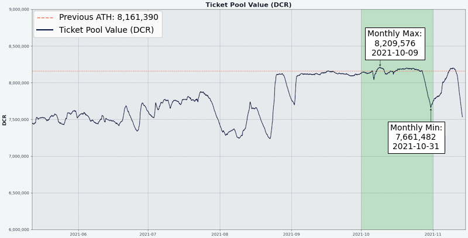

# صحيفة ديكريد لشهر أكتوبر 2021

_الصورة: موقع العقدة الخارجية عن بعد بواسطة saender@_ 

أبرز أحداث شهر أكتوبر:

- احتفلت بوليتيا بعامها الثالث من العمل وقد حظيت بشهر تطوير آخر حافل.
- تم تمويل اقتراح محافظ المحمول من @raedah لمدة عام آخر.
- رُفض اقتراح GoDCR ولكن يجري إعداد اقتراح منقح. ويستمر التطوير من أجل صقل المحفظة تحضيرًا للإصدار الرئيسي
- تتيح التغييرات المدمجة في منصة المبادلات اللامركزية لديكريد DCRDEX دفع رسوم التسجيل ب BTC واستخدام محفظة التحقق البسيط من الدفع المضمنة دون تشغيل العقدة الكاملة للبتكوين.

المحتويات:
  
- [التطوير](#التطوير)
- [الأشخاص](#الأشخاص)
- [الإدارة و الحوكمة](#الإدارة-و-الحوكمة)
- [الشبكة](#الشبكة)
- [النظام البيئي](#النظام-البيئي)
- [الانتشار](#الانتشار)
- [وسائل الإعلام](#وسائل-الإعلام)
- [الأسواق](#الأسواق)
- [الخارجية ذات الصلة](#الخارجية-ذات-الصلة)
  
## التطوير
  
ما لم يُذكر خلاف ذلك، فإن العمل المَذْكُور هنا يشتمل على حالة “الدمج إلى الرئيسي”. وهذا يعني أن العمل قد تم استكماله ومراجعته ودمجه في كود المصدر الذي يمكن للمستخدمين المتقدمين بناءه وتشغيله، ولكنه ليس متاحًا بعد في ثنائيات الإصدار للمستخدمين العاديين.
  
<a id="dcrd" />
  
**[dcrd](https://github.com/decred/dcrd)** 
  
_dcrd هو تطبيق عقدة كامل يعمل على تشغيل شبكة ديكريد نظير لنظير  حول العالم._

التغييرات المدمجة:

تم تحديث الفهارس (المعاملة، العنوان، والعنوان الموجود) بشكل [غير متزامن](https://github.com/decred/dcrd/pull/2219) لتسريع المسار الرئيسي للتحقق من صحة الكتلة وكود الاتصال. مما سيسمح بنشر التصويت بشكل أسرع ويساعد على تمهيد الطريق لتحسينات أخرى ونماذج المزامنة وآليات أفضل لاستعادة البيانات المتلفة.
تم تبسيطها لاستخدام [نقطة تفتيش](https://github.com/decred/dcrd/pull/2763) واحدة فقط مؤخرًا، نظرًا لأن نقاط التفتيش الوسيطة لم تعد ضرورية مع مزامنة [الترويسات الأولية](https://github.com/decred/dcrd/pull/2555)
تحسين اتساق ووضوح [اختبارات](https://github.com/decred/dcrd/pull/2757) `txscript`
إصلاح معالجة عمليات إسترجاع التذاكر التلقائية عند [فصل](https://github.com/decred/dcrd/pull/2768) الكتلة أثناء إعادة تنظيم السلسلة
إصلاح [سباق](https://github.com/decred/dcrd/pull/2758) البيانات في إدارة عناوين النظراء
إصلاح أدوات [`findcheckpoint`](https://github.com/decred/dcrd/pull/2759) و [`addblock`](https://github.com/decred/dcrd/pull/2760)
تمت إضافة دعم [libFuzzer](https://llvm.org/docs/LibFuzzer.html) إلى مجموعة اختبارات [التشويش المستمرة](https://github.com/degeri/dcrd-continuous-fuzz) في dcrd

<a id="dcrwallet" />

**[dcrwallet](https://github.com/decred/dcrwallet)**

_dcrwallet هو خادم محفظة يستخدمه سطر الأوامر وتطبيقات المحفظة الرسومية._ 

تنفيذ طرق [`getblockheader`](https://github.com/decred/dcrwallet/pull/2098) و [`getcurrentnet`](https://github.com/decred/dcrwallet/pull/2102) في وضع التحقق البسيط من الدفع (ليتم استخدامه بواسطة DCRDEX)
إضافة حقل [`spv`](https://github.com/decred/dcrwallet/pull/2094) إلى نتيجة `walletinfo` للتمييز بين أوضاع المزامنة
إصلاح [فقدان المزامنة](https://github.com/decred/dcrwallet/pull/2099) في وضع التحقق البسيط من الدفع

<a id="decrediton" />

**[Decrediton](https://github.com/decred/decrediton)**
  
_ديكريديتون هي تطبيق محفظة لسطح المكتب كامل الميزات مع ميزة التصويت مدمجة، وميزة الخلط ب StakeShuffle، والشبكة البرقية، والتداول على منصة المُبادلات اللامركزية DEX للبورصة، والمزيد. يتم تشغيلها مع سلسلة الكتل كاملة أو بدونها (وضع التحقق من الدفع البسيط SPV)._

التغييرات التي تواجه المستخدم:

تنفيذ تصميم جديد لواجهة المستخدم في علامة التبويب [نظرة عامة على الشبكة البرقية](https://github.com/decred/decrediton/pull/3551). تم تجميع علامات تبويب المحفظة والشبكة وأبراج المراقبة ضمن علامة تبويب متقدمة مقدمة حديثًا.
تصميم واجهة مستخدم جديد [لنماذج](https://github.com/decred/decrediton/pull/3534)  المحفظة مع إضافة تبديل رؤية كلمة المرور
إضافة القدرة على استخدام [مزود خدمة التصويت عشوائي(https://github.com/decred/decrediton/pull/3560) في عمليات شراء التذاكر التلقائية (مع رسوم قصوى قابلة للتهيئة)
التمكين التلقائي للتشفير الجديد [لكل حساب](https://github.com/decred/decrediton/pull/3579) للمحافظ الجديدة
تحسين قابلية استخدام [مُحدد مزود خدمة التصويت](https://github.com/decred/decrediton/pull/3563)
~13 إصلاحًا للأخطاء

داخلي:

تحديث إدماج DEX عبر [libdexc](https://github.com/decred/decrediton/pull/3549) للاستفادة من ميزات الإصدار 0.3 القادم (واجهة مستخدم مترجمة، واستعادة من البداية، واكتشاف الحسابات الحالية)
تم التحديث إلى [Electron 15](https://github.com/decred/decrediton/pull/3571)
إضافة أداة واجهة مستخدم رسومية جديدة [لترجمة](https://github.com/decred/decrediton/pull/3569) السلاسل و[دليل](https://github.com/decred/decrediton/blob/master/app/i18n/community_translators.md) لمترجمي المجتمع
الاختبارات التلقائية لعروض [الحسابات](https://github.com/decred/decrediton/pull/3577)

_نظرة عامة على الشبكة البرقية لديكريديتون_

<a id="politeia" />
  
**[بوليتيا](https://github.com/decred/politeia)**
  
_بوليتيا هي نظام المقترحات لديكريد. يتم استخدامها لطلب التمويل من خزينة ديكريد._

التغييرات التي تواجه المستخدم:

تمت إضافة طريقة قياسية لإظهار أي تغيير في الحالة. يتم عرض المشرف الذي فرض الرقابة أو تخلى عن الاقتراح جنبا إلى جنب مع السبب الذي أعطاه لتغيير الحالة.
دعم تغييرات [متعددة](https://github.com/decred/politeiagui/pull/2629) في حالة الفواتير. الإعداد التلقائي هو السماح بتغيير حالة الفوترة مرة واحدة فقط (من نشط إلى مكتمل أو مغلق)، ولكنه إعداد قابل للتكوين. في حالة ما إذا ارتكب أحد المشرفين خطأً، فيمكن لمشرف النظام تحديث الإعداد مؤقتًا للسماح بتصحيح الخطأ. من الممكن أيضًا [تعطيل](https://github.com/decred/politeia/pull/1533) تغييرات الحالة مؤقتًا.
تحسين وتوحيد [خطأ الهوية](https://github.com/decred/politeiagui/pull/2623). يتم عرض نفس الخطأ الآن في أي وقت يحاول المستخدم كتابة البيانات إلى بوليتيا دون تحميل هويتهم النشطة في المتصفح. توجه رسالة الخطأ إلى صفحة تفاصيل المستخدم لإصلاح المشكلة.
إصلاح المشاكل المتعددة الموجودة في [تعليقات](https://github.com/decred/politeiagui/pull/2638) تجربة المستخدم الخاصة بالتنقل: فقد تفضيلات الترشيح، وزر الرجوع لا يعمل بشكل صحيح، وبطء تحميل سلاسل الرسائل الفردية، وميض واجهة المستخدم
~5 إصلاحات أخرى للأخطاء

التغييرات في أداة سطر أوامر `politeiavoter`:

تغيير أسلوب طريقة [التصويت الأولية](https://github.com/decred/politeia/pull/1556) (إرسال بطيء للأصوات). في السابق كانت ترسل الأصوات بالتسلسل بفترات زمنية عشوائية. لقد ثبت أن هذا هش لأن إرسالًا بطيئًا/فاشلاً كان يؤخر جميع الأصوات الأخرى. تستخدم الطريقة الجديدة عمليات تصويت موازية مستقلة تبدأ في أوقات عشوائية ولا تؤثر على بعضها البعض، مما يجعل عملية التصويت أكثر قوة.
إضافة خيارًا للإيقاف إذا لم يتم الانتهاء من التصويت الأولي [بوقت إضافي](https://github.com/decred/politeia/pull/1542) كافٍ قبل نهاية التصويت. فهو ينبه المستخدم لضبط المعلمات بحيث يترك وقتًا كافيًا (12 ساعة تلقائيًا) لإعادة محاولة أي تصويتات فاشلة، والتي قد تحدث بسبب ضعف الاتصالات أو Tor.
إعادة طباعة [أسماء](https://github.com/decred/politeia/pull/1548) الاقتراح في أمر `inventory`

تغييرات الواجهة الخلفية والداخلية:

تمت إضافة واجهة برمجة التطبيقات للحصول على [تغييرات حالة](https://github.com/decred/politeia/pull/1526) الفوترة
السماح بجلب تغييرات حالة الفواتير على [دفعات](https://github.com/decred/politeia/pull/1535)
استخدام سياسة الخادم [لحجم الصفحة](https://github.com/decred/politeiagui/pull/2622)
إضافة فحوصات سلامة البيانات للمكونات الإضافية الخاصة ب [`ticketvote`](https://github.com/decred/politeia/pull/1531)و[`comments`](https://github.com/decred/politeia/pull/1544)
إضافة أمر `pictl` جديد لاختبار [تدفق ](https://github.com/decred/politeia/pull/1551)RFP
~4 إصلاحات للأخطاء

إعادة البناء استعدادًا [لإعادة كتابة طبقة المستخدم](https://github.com/decred/politeia/issues/1479) (أكبر جزء من العمل لاقتراح الربع الثالث لعام 2021):

تمت إعادة تنظيم قاعدة كود politeiawww لنقل واجهات برمجة التطبيقات القديمة إلى حزمة [`legacy`](https://github.com/decred/politeia/pull/1523). سيؤدي ذلك إلى تسهيل إعادة كتابة طبقة المستخدم لاستخدام بنية البرنامج المساعد والسماح بالتدرج الأفقي.
إستخراج حزمة [`logger`](https://github.com/decred/politeia/pull/1527) للسماح للمكونات الإضافية بتكوين التسجيل الخاص بها وتصبح قائمة بذاتها
إستخراج حزمة [`websockets`](https://github.com/decred/politeia/pull/1529) (ستسهل توسيع نطاق الخوادم)
استخراج معالجة [التكوين](https://github.com/decred/politeia/pull/1536) في الحزمة الخاصة به وإعدادات منفصلة لواجهة برمجة التطبيقات القديمة لإزالة أسهل في المستقبل
نقل طرق التعامل مع [الهوية](https://github.com/decred/politeia/pull/1530) إلى أماكن أكثر ملاءمة
تمت إضافة [متجر جلسة](https://github.com/decred/politeia/pull/1555) عام (سيحل محل المتجر [القديم](https://github.com/decred/politeia/pull/1554) الذي لم يكن لديه فصل مناسب عن الشواغل)

_لا توجد أموال مجانية على بوليتيا_

<a id="vspd" />
  
**[vspd](https://github.com/decred/vspd)**
  
_vspd هو برنامج خادم لتشغيل موفر خدمة التصويت. يصوت موفر خدمة التصويت نيابة عن مستخدميه على مدار الساعة طوال أيام الأسبوع ولا يمكنه سرقة الأموال._

تم التحديث إلى أحدث إصدار ل [dcrd RPC](https://github.com/decred/vspd/pull/297). منذ هذا الإيداع، سيتوقف vspd عن العمل نظير الإصدار 1.6 ل dcrd ويبدأ في استهداف فرع `master`.
السماح بتعيين عنوان توقيع [بديل](https://github.com/decred/vspd/pull/287) لدعم التحصيص بواسطة مزود خدمة التصويت بإستخدام تريزور

<a id="dcrlnd" />
  
**[dcrlnd](https://github.com/decred/dcrlnd)**
  
_dcrlnd هو برنامج عقدة الشبكة البرقية لديكريد. تتيح الشبكة البرقية المعاملات الفورية ومنخفضة التكلفة._

 * إجراء اكتشاف الحساب [مرة واحدة](https://github.com/decred/dcrlnd/pull/145) فقط للمحافظ المضمنة (لا ينطبق على المحافظ البعيدة التي يتم التحكم فيها خارجيًا)
تحسين مستندات [البدء السريع](https://github.com/decred/dcrlnd/pull/146) وإضافة مستند جديد يلخص [أوضاع التشغيل](https://github.com/decred/dcrlnd/blob/master/docs/operation_modes.md) الأربعة (مزامنة dcrd أو SPV، المحفظة عن بُعد أو المضمنة)

<a id="dcrdex" />
  
**[DCRDEX](https://github.com/decred/dcrdex)**
  
_DCRDEX هي منصة تبادلات غير إحتجازية للتداول غير الموثوق به، مدعومة بالمقايضات الذرية._

التغييرات التي تواجه المستخدم:

إعادة صياغة تدفق السجل لقبول [الأصول](https://github.com/decred/dcrdex/pull/1223) الأخرى من غير DCR
إضافة [نظرة عامة](https://github.com/decred/dcrdex/pull/1232) على الأسعار الحالية والتغييرات على مدار 24 ساعة إلى الشريط الجانبي الأيسر
تحسين تسلسل [ التسجيل](https://github.com/decred/dcrdex/pull/1234) وتصميم النموذج/الرسوم المتحركة
إضافة دعم [التحقق البسيط للدفع للبتكوين](https://github.com/decred/dcrdex/pull/1230) للتداول مقابل BTC دون إدارة السلسلة الكاملة للبتكوين. بنيت فوق [Neutrino](https://github.com/lightninglabs/neutrino) و [btcwallet](https://github.com/btcsuite/btcwallet) (_الاستثمار القديم يؤتي ثماره!_).
بدء [فحص](https://github.com/decred/dcrdex/pull/1249) محفظة التحقق البسيط للدفع للبتكوين من تاريخ معين لتوفير الوقت
تتطلب المفاتيح العامة الموسعة ["zpub"](https://github.com/decred/dcrdex/pull/1255) ولكنها تعرض التحويل من "xpub" للتسهيل. هذا لمشغلي الخادم الراغبين في قبول رسوم التسجيل ب BTC.
~6 إصلاحات للأخطاء

التغييرات الداخلية:

دعم [حسابات ](https://github.com/decred/dcrdex/pull/1210)HD المتعددة لنفس التطبيق الأساسي، للسماح بتسجيل حسابات إضافية إذا تم تعليق الحساب الأولي. يؤدي هذا التغيير أيضًا إلى إيقاف الحسابات القديمة بمفاتيح عشوائية لضمان إمكانية اشتقاق جميع الحسابات الجديدة من التطبيق الأساسي.
إعادة تصميم عميل الواجهة الخلفية لديكريد لدعم تنفيذات [المحفظة](https://github.com/decred/dcrdex/pull/1227) البديلة. سيتم استخدام هذا لدمج منصة المبادلات اللامركزية لديكريد DCRDEX في GoDCR.

التقدم المحرز نحو دعم الإيثيريوم:

تنفيذ عدة [أساليب الواجهة الخلفية](https://github.com/decred/dcrdex/issues/1154) ([المقايضة](https://github.com/decred/dcrdex/pull/1218) وتقديرات [الاسترداد](https://github.com/decred/dcrdex/pull/1219)، طلبات [التمويل](https://github.com/decred/dcrdex/pull/1221)، [توقيع](https://github.com/decred/dcrdex/pull/1228) الرسائل، والمزيد)
إضافة وظيفة لبدء [مجموعة](https://github.com/decred/dcrdex/pull/1251) من المقايضات المتعددة في نفس المعاملة (يوفر الغاز)
[إشتقاق](https://github.com/decred/dcrdex/pull/1225) المحفظة الداخلية للإيثيريوم من بذرة تطبيق DEX

_نظرة عامة على أسواق DCRDEX. البيانات المعروضة ليست حقيقية._

<a id="dcrios" />

**[محفظة ديكريد (iOS)](https://github.com/planetdecred/dcrios)**

عرض أرصدة غير صفرية مع [ثمانية كسور عشرية](https://github.com/planetdecred/dcrios/pull/857)
إصلاح الألوان وأيقونات الوضع المظلم

<a id="godcr" />
  
**[GoDCR](https://github.com/planetdecred/godcr)**
  
_GoDCR هو تطبيق محفظة سطح المكتب خفيف الوزن مع تحصيص مدمج والخصوصية وتصفح بوليتيا._

التغييرات التي تواجه المستخدم:

إضافة زر [لإخفاء](https://github.com/planetdecred/godcr/pull/646) رصيد المحفظة بسرعة لزيادة خصوصية المستخدم للحذر
إضافة [تذكير](https://github.com/planetdecred/godcr/pull/663) لعمل نسخة احتياطية من الكلمات الأولية
دورة حقول الإدخال باستخدام [مفتاح الحقول](https://github.com/planetdecred/godcr/pull/640)
توحيد [مصطلحات](https://github.com/planetdecred/godcr/pull/645) كلمات المرور والبذور
إظهار المزيد من التفاصيل في [تلميحات](https://github.com/planetdecred/godcr/pull/638) اقتراح بوليتيا
عرض الوقت منذ [آخر تحديث](https://github.com/planetdecred/godcr/pull/642) لبيانات بوليتيا
تحسين معلومات [الوقت](https://github.com/planetdecred/godcr/pull/666) في صفحة المعاملات
إضافة شريط [التمرير](https://github.com/planetdecred/godcr/pull/664) القابل للسحب على القوائم الطويلة
السماح بكلمة مرور [فارغة](https://github.com/planetdecred/godcr/pull/625) في بعض الحالات
~10 إصلاحات للأخطاء
التغييرات الداخلية:

تنفيذ تأثير [تمييز](https://github.com/planetdecred/godcr/pull/630) قابل للنقر مخصص بلون وحدود قابلة للتكوين وإعادة استخدامها عبر التطبيق
تم التحديث إلى أحدث [Gio](https://github.com/planetdecred/godcr/pull/665) وإزالة الكود الذي لم يعد مطلوبًا
* دعم الكود المخصص في [حقول الإدخال](https://github.com/planetdecred/godcr/pull/677)

تم الدمج في مكتبة dcrlibwallet (يتشارك فيه محافظ الأندرويد و iOS و GoDCR):

تم التحديث [لأحدث](https://github.com/planetdecred/dcrlibwallet/pull/209) الوحدات النمطية dcrd و dcrwallet و dcrdata
إضافة وظيفة للحصول على [الطابع الزمني](https://github.com/planetdecred/dcrlibwallet/pull/208) لآخر مزامنة مع بوليتيا

_عرض مقترحات GoDCR_

استمر التطوير بالرغم من رفض [اقتراح ](https://proposals.decred.org/record/f7d9fc8)GoDCR الثاني (49٪ نعم). نتطلع إلى الإصدار المنقح وإنشاءات التطبيق الجديدة.

<a id="dcrdata" />
  
**[dcrdata](https://github.com/decred/dcrdata)**
  
_dcrdata هو مستكشف لسلسلة كتل والبيانات خارج السلسلة مثل مقترحات بوليتيا، والأسواق، غيرها._
  
تحديث [تبعيات](https://github.com/decred/dcrdata/pull/1875) [ديكريد](https://github.com/decred/dcrdata/pull/1874)
 التحديث إلى [Bootstrap 5](https://github.com/decred/dcrdata/pull/1872)

## الأشخاص

مرحبا بالمساهمين الجدد مع دمج الكود إلى الماستر: AdimekweEbuka@ على ([godcr](https://github.com/planetdecred/godcr/commits?author=AdimekweEbuka))!  
إحصائيات المجتمع اعتبارًا من 2 نوفمبر:

- متابعو [التويتر](https://twitter.com/decredproject): 49,503 (830+)
- المشتركين في [ريديت](https://www.reddit.com/r/decred/): 12,248 (294+)
- مستخدمي غرفة الدردشة general# على [الماتريكس](https://chat.decred.org/): 551 (16+)
- مستخدمي [الديسكورد](https://discord.gg/GJ2GXfz): 2,267 (+190)
- مستخدمي [التيليجرام](https://t.me/Decred): 2,940 (31+)
- المشتركين في [اليوتيوب](https://www.youtube.com/decredchannel): 4,620 (+10), المشاهدات: 197 ألف (بزيادة ألف)
  
  
## الإدارة و الحوكمة
  
في أكتوبر، تلقت [الخزينة](https://dcrdata.decred.org/treasury) الجديدة 10,678 DCR بقيمة 1.3 مليون دولار بمتوسط سعر الشهر البالغ 121.57 دولارًا أمريكيًا. تم إنفاق  974 DCR  للدفع للمتعاقدين، بقيمة 118 ألف دولار بسعر أكتوبر، أو 136 ألف دولار بمعدل فوترة سبتمبر البالغ 139.56 دولارًا. اعتبارًا من 1 نوفمبر، بلغ الرصيد المشترك للخزينة [القديمة](https://dcrdata.decred.org/address/Dcur2mcGjmENx4DhNqDctW5wJCVyT3Qeqkx) و[الجديدة](https://dcrdata.decred.org/treasury) 723,528 DCR (أي ما يعادل 83.5 مليون دولار أمريكي بسعر 112.42 دولارًا أمريكيًا).

تم تقديم [اقتراح](https://proposals.decred.org/record/c1f5b5c) واحد هذا الشهر، بحيث يعود @ammarooni مع اقتراح يراجع فيه [اقتراح](https://proposals.decred.org/proposals/9e1d644) الكتاب السابق لإزالة الكتاب لصالح تدفق مستمر من المقالات ومحتوى وسائل الاعلام، والميمات واللقاءات.

تم التصويت على الاقتراحين المقدمين من @raedah هذا الشهر، وتمت الموافقة على الاقتراح الخاص [بمحافظ الهاتف المحمول](https://proposals.decred.org/record/6db3c4e) بنسبة 97.2٪ بنعم مع نسبة مشاركة بلغت 66٪، بينما تم رفض اقتراح مواصلة تمويل [GoDCR](https://explorer.dcrdata.org/proposal/f7d9fc852e309b31) بموافقة 49٪ ونسبة مشاركة بلغت 73٪.

للحصول على مزيد من التفاصيل حول مقترحات الشهر راجع [العددين ](https://blockcommons.red/politeia-digest/issue047/)47 [و ](https://blockcommons.red/politeia-digest/issue048/)48 لموجز بوليتيا.

نشرrichardred الأرقام والرسوم البيانية للعام الثالث لبوليتيا. أبرز ماجاء فيها:

نشر 31 مقترحا، تمت الموافقة على 20 منها، ورفض 11، والتخلي عن مقترحان
تحسن متوسط ​​(معدل) مشاركة الناخبين بشكل كبير حيث بلغ 46٪ في العام الثالث، مقارنة بـ 31٪ في العام الأول و 28٪ في العام الثاني
ازدادت مقترحات تطوير البرمجيات من حيث العد والميزانيات ودعم الناخبين
انخفضت مقترحات التسويق في العدد بحيث لم تعد هي النوع السائد، ولا سيما عدد مقترحات التسويق التي تنتهي بنسبة موافقة منخفضة للغاية
ارتفعت نسبة المقترحات المقدمة من المتعاقدين  من 48٪ في العام الثاني إلى 77٪ في العام الثالث
عدد التذاكر المخلوطة (تلك التي تتمتع بخصوصية إضافية) آخذ في الازدياد
إحصائيات الثلاث سنوات: تم نشر 128 اقتراحًا، تمت الموافقة على 66 منها، ورفض 42، وتم التخلي عن 20 منها

_السنة الثالثة لبوليتيا_

## الشبكة 
  
**معدل الهاش**: افتتحت [معدلات الهاش](https://dcrdata.decred.org/charts?chart=hashrate&zoom=ku5ml4us-kvgwhe37&scale=linear&bin=block&axis=time) في شهر أكتوبر عند ~237 Ph/s وأغلقت عند ~284 Ph/s، وبلغ قاعها عند 164 Ph/s كما بلغت ذروتها عند 323 Ph/s على مدار الشهر. 
  
توزيع معدل الهاش الذي [تم الإبلاغ عنه](https://miningpoolstats.stream/decred) بواسطة المجمعات في 1  نوفمبر: Poolin بنسبة 43%، و F2Pool بنسبة 29%، و Antpool بنسبة 10%، و BTC.com بنسبة 6.4%، و ViaBTC بنسبة 6%، و Luxor بنسبة 4.5%، و Huobipool بنسبة 0.5%، و OKEx بنسبة 0.4%، و CoinMine بنسبة 0.2%

توزيع  1,000 كتلة تم [تعدينها](https://miningpoolstats.stream/decred) بالفعل بحلول 1 نوفمبر: Poolin بنسبة 42%، و F2Pool بنسبة 31%، و Antpool بنسبة 9%، و BTC.com بنسبة 7%، و Luxor بنسبة 5%، و ViaBTC بنسبة 5%، و OKEx بنسبة 0.7%، و أخرى غير معروفة بنسبة 0.2%
 

_ معدل التجزئة لديكريد من مايو إلى أكتوبر 2021_

**التحصيص**: تراوح [سعر التذكرة](https://dcrdata.decred.org/charts?chart=ticket-price&zoom=ku5ml4us-kvgwhe37&axis=time&visibility=true-true&mode=stepped) بين 139.7-209.7 DCR، [بمتوسط](https://dcrstats.com/)  191.6 DCR (-7.8) خلال 30 يوما
  
بلغ [المبلغ المقفل](https://dcrdata.decred.org/charts?chart=ticket-pool-value&zoom=ku5ml4us-kvgwhe37&scale=linear&bin=block&axis=time) 7.65-8.20 مليون DCR، مما يعني أن 56.7-61.1% من العرض المتاح [شارك](https://dcrdata.decred.org/charts?chart=stake-participation&zoom=ku5ml4us-kvgwhe37&scale=linear&bin=block&axis=time) في إثبات الحصة. 

_مجمع تذاكر ديكريد مايو-أكتوبر 2021_

**مقدم خدمة التصويت**: في 1 نوفمبر، تمت إدارة ما يقارب 7,400  تذاكر حية (—200) بواسطة خوادم vspd [المدرجة](https://decred.org/vsp/) و ما يقارب 224 (+4) بواسطة خوادم dcrstakepool القديمة المدرجة.  إجمالا، تمكن 7 من مقدمي خدمات التصويت القديمة و 15 من مقدمي خدمات التصويت الجديدة من إدارة 18.9% (-0.1%) من مجمع التذاكر.
 
**العقد**: طوال شهر سبتمبر، كان هناك حوالي 200 عقدة يمكن الوصول إليها وفقًا لـ [dcrextdata](https://dcrextdata.planetdecred.org/nodes). 
  
إصدارات العقد اعتبارًا من [لقطة](https://nodes.jholdstock.uk/user_agents) 1 نوفمبر (245 عقدة ل dcrd): النسخة 1.6.2 - 59%، النسخة 1.7 لبناءَات التطوير - 13%، النسخة 1.6.0 - 12%، النسخة 1.6.1 - 9%، النسخة 1.6 لبناءَات التطوير - 3%، النسخة 1.5.2 - 2%، النسخة 1.5.1 - 0.8%. 
  
تراوحت حصة [العملات المخلوطة](https://dcrdata.decred.org/charts?chart=coin-supply&zoom=jz3q3lq8-l0s732o6&scale=linear&bin=day&axis=time&visibility=true-true-true) بين 52.3-54.4٪ وحققت أعلى مستوى جديد على الإطلاق حيث تجاوز مجموع العملات المخلوطة غير المنفقة 7.3 مليون.

## النظام البيئي

