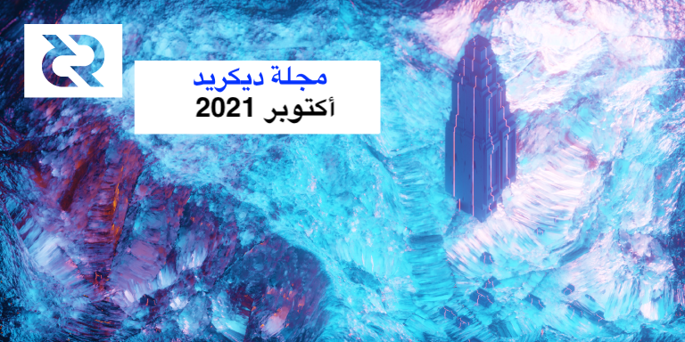
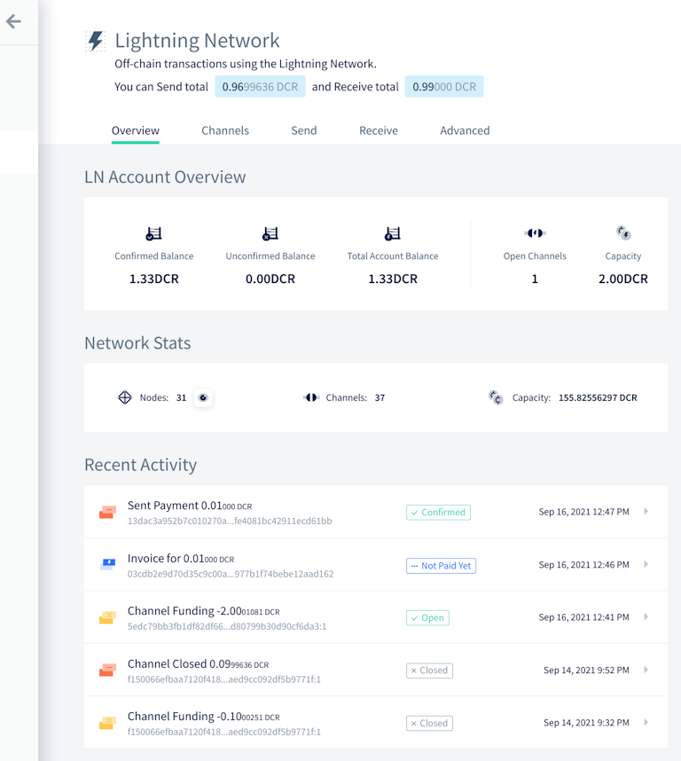
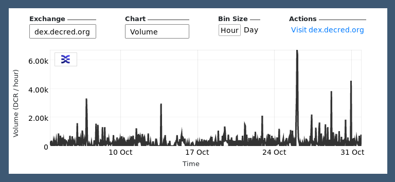

# صحيفة ديكريد لشهر أكتوبر 2021

 
  
_الصورة: موقع العقدة الخارجية عن بعد بواسطة saender@_  
  
أبرز أحداث شهر أكتوبر:

- احتفلت بوليتيا بعامها الثالث من العمل وقد حظيت بشهر تطوير آخر حافل.
- تم تمويل اقتراح محافظ المحمول من @raedah لمدة عام آخر.
- رُفض اقتراح GoDCR ولكن يجري إعداد اقتراح منقح. ويستمر التطوير من أجل صقل المحفظة تحضيرًا للإصدار الرئيسي
- تتيح التغييرات المدمجة في منصة المبادلات اللامركزية لديكريد DCRDEX دفع رسوم التسجيل ب BTC واستخدام محفظة التحقق البسيط من الدفع المضمنة دون تشغيل العقدة الكاملة للبتكوين.

المحتويات: 
  
- [التطوير](#التطوير) 
- [الأشخاص](#الأشخاص) 
- [الإدارة و الحوكمة](#الإدارة-و-الحوكمة) 
- [الشبكة](#الشبكة) 
- [النظام البيئي](#النظام-البيئي) 
- [الانتشار](#الانتشار) 
- [وسائل الإعلام](#وسائل-الإعلام) 
- [الأسواق](#الأسواق) 
- [الخارجية ذات الصلة](#الخارجية-ذات-الصلة) 
  
## التطوير 
  
ما لم يُذكر خلاف ذلك، فإن العمل المَذْكُور هنا يشتمل على حالة “الدمج إلى الرئيسي”. وهذا يعني أن العمل قد تم استكماله ومراجعته ودمجه في كود المصدر الذي يمكن للمستخدمين المتقدمين بناءه وتشغيله، ولكنه ليس متاحًا بعد في ثنائيات الإصدار للمستخدمين العاديين. 
  
<a id="dcrd" /> 
  
** [dcrd](https://github.com/decred/dcrd) ** 
  
_dcrd هو تطبيق عقدة كامل يعمل على تشغيل شبكة ديكريد نظير لنظير  حول العالم._ 
  
التغييرات المدمجة:

* تم تحديث الفهارس (المعاملة، العنوان، والعنوان الموجود) بشكل [غير متزامن](https://github.com/decred/dcrd/pull/2219) لتسريع المسار الرئيسي للتحقق من صحة الكتلة وكود الاتصال. مما سيسمح بنشر التصويت بشكل أسرع ويساعد على تمهيد الطريق لتحسينات أخرى ونماذج المزامنة وآليات أفضل لاستعادة البيانات المتلفة.
* تم تبسيطها لاستخدام [نقطة تفتيش](https://github.com/decred/dcrd/pull/2763) واحدة فقط مؤخرًا، نظرًا لأن نقاط التفتيش الوسيطة لم تعد ضرورية مع مزامنة [الترويسات الأولية](https://github.com/decred/dcrd/pull/2555)
* تحسين اتساق ووضوح [اختبارات](https://github.com/decred/dcrd/pull/2757) `txscript`
* إصلاح معالجة عمليات إسترجاع التذاكر التلقائية عند [فصل](https://github.com/decred/dcrd/pull/2768) الكتلة أثناء إعادة تنظيم السلسلة
* إصلاح [سباق](https://github.com/decred/dcrd/pull/2758) البيانات في إدارة عناوين النظراء
* إصلاح أدوات [`findcheckpoint`](https://github.com/decred/dcrd/pull/2759) و [`addblock`](https://github.com/decred/dcrd/pull/2760)
* تمت إضافة دعم [libFuzzer](https://llvm.org/docs/LibFuzzer.html) إلى مجموعة اختبارات [التشويش المستمرة](https://github.com/degeri/dcrd-continuous-fuzz) في dcrd

<a id="dcrwallet" />
  
**[dcrwallet](https://github.com/decred/dcrwallet)** 
  
_dcrwallet هو خادم محفظة يستخدمه سطر الأوامر وتطبيقات المحفظة الرسومية._ 
  
* تنفيذ طرق [`getblockheader`](https://github.com/decred/dcrwallet/pull/2098) و [`getcurrentnet`](https://github.com/decred/dcrwallet/pull/2102) في وضع التحقق البسيط من الدفع (ليتم استخدامه بواسطة DCRDEX)
* إضافة حقل [`spv`](https://github.com/decred/dcrwallet/pull/2094) إلى نتيجة `walletinfo` للتمييز بين أوضاع المزامنة
* إصلاح [فقدان المزامنة](https://github.com/decred/dcrwallet/pull/2099) في وضع التحقق البسيط من الدفع
  
<a id="decrediton" /> 
  
**[Decrediton](https://github.com/decred/decrediton)** 
  
_ديكريديتون هو تطبيق محفظة لسطح المكتب كامل الميزات مع ميزة التصويت مدمجة، وميزة الخلط ب StakeShuffle، والشبكة البرقية، والتداول على منصة المُبادلات اللامركزية DEX للديكريد، والمزيد. يتم تشغيلها مع سلسلة الكتل كاملة أو بدونها (وضع التحقق البسيط من الدفع SPV)._ 
  
التغييرات التي تواجه المستخدم:

* تنفيذ تصميم جديد لواجهة المستخدم في علامة التبويب [نظرة عامة على الشبكة البرقية](https://github.com/decred/decrediton/pull/3551). تم تجميع علامات تبويب المحفظة والشبكة وأبراج المراقبة ضمن الطرح الحديث لعلامة التبويب "خيارات متقدمة" .
* تصميم واجهة مستخدم جديد [لنماذج](https://github.com/decred/decrediton/pull/3534)  المحفظة مع إضافة تبديل رؤية كلمة المرور
* إضافة القدرة على استخدام [مزود خدمة التصويت عشوائي](https://github.com/decred/decrediton/pull/3560) في عمليات شراء التذاكر التلقائية (مع رسوم قصوى قابلة للتهيئة)
* التمكين التلقائي للتشفير الجديد [لكل حساب](https://github.com/decred/decrediton/pull/3579) للمحافظ الجديدة
* تحسين قابلية استخدام [مُحدد مزود خدمة التصويت](https://github.com/decred/decrediton/pull/3563)
* ~13 إصلاحًا للأخطاء

داخلي:

* تحديث إدماج DEX عبر [libdexc](https://github.com/decred/decrediton/pull/3549) للاستفادة من ميزات الإصدار 0.3 القادم (واجهة مستخدم مترجمة، واستعادة من البداية، واكتشاف الحسابات الحالية)
* تم التحديث إلى [Electron 15](https://github.com/decred/decrediton/pull/3571)
* إضافة أداة واجهة مستخدم رسومية جديدة [لترجمة](https://github.com/decred/decrediton/pull/3569) السلاسل و[دليل](https://github.com/decred/decrediton/blob/master/app/i18n/community_translators.md) لمترجمي المجتمع
* الاختبارات التلقائية لعروض [الحسابات](https://github.com/decred/decrediton/pull/3577)

_نظرة عامة على الشبكة البرقية لديكريديتون_
  
<a id="politeia" /> 
  
**[بوليتيا](https://github.com/decred/politeia)** 
  
_بوليتيا هي نظام المقترحات لديكريد. يتم استخدامها لطلب التمويل من خزينة ديكريد._ 
  
التغييرات التي تواجه المستخدم:

* تمت إضافة طريقة قياسية لإظهار أي تغيير في الحالة. يتم عرض المشرف الذي فرض الرقابة أو تخلى عن الاقتراح جنبا إلى جنب مع السبب الذي أعطاه لتغيير الحالة.
* دعم تغييرات [متعددة](https://github.com/decred/politeiagui/pull/2629) في حالة الفواتير. الإعداد التلقائي هو السماح بتغيير حالة الفوترة مرة واحدة فقط (من نشط إلى مكتمل أو مغلق)، ولكنه إعداد قابل للتكوين. في حالة ما إذا ارتكب أحد المشرفين خطأً، فيمكن لمشرف النظام تحديث الإعداد مؤقتًا للسماح بتصحيح الخطأ. من الممكن أيضًا [تعطيل](https://github.com/decred/politeia/pull/1533) تغييرات الحالة مؤقتًا.
* تحسين وتوحيد [خطأ الهوية](https://github.com/decred/politeiagui/pull/2623). يتم عرض نفس الخطأ الآن في أي وقت يحاول المستخدم كتابة البيانات إلى بوليتيا دون تحميل هويتهم النشطة في المتصفح. توجه رسالة الخطأ إلى صفحة تفاصيل المستخدم لإصلاح المشكلة.
* إصلاح المشاكل المتعددة الموجودة في [تعليقات](https://github.com/decred/politeiagui/pull/2638) تجربة المستخدم الخاصة بالتنقل: فقد تفضيلات الترشيح، وزر الرجوع لا يعمل بشكل صحيح، وبطء تحميل سلاسل الرسائل الفردية، وميض واجهة المستخدم
* ~5 إصلاحات أخرى للأخطاء

التغييرات في أداة سطر أوامر `politeiavoter`:

* تغيير أسلوب طريقة [التصويت الأولية](https://github.com/decred/politeia/pull/1556) (إرسال بطيء للأصوات). في السابق كانت ترسل الأصوات بالتسلسل بفترات زمنية عشوائية. لقد ثبت أن هذا هش لأن إرسالًا بطيئًا/فاشلاً كان يؤخر جميع الأصوات الأخرى. تستخدم الطريقة الجديدة عمليات تصويت موازية مستقلة تبدأ في أوقات عشوائية ولا تؤثر على بعضها البعض، مما يجعل عملية التصويت أكثر قوة.
* إضافة خيارًا للإيقاف إذا لم يتم الانتهاء من التصويت الأولي [بوقت إضافي](https://github.com/decred/politeia/pull/1542) كافٍ قبل نهاية التصويت. فهو ينبه المستخدم لضبط المعلمات بحيث يترك وقتًا كافيًا (12 ساعة تلقائيًا) لإعادة محاولة أي تصويتات فاشلة، والتي قد تحدث بسبب ضعف الاتصالات أو Tor.
* إعادة طباعة [أسماء](https://github.com/decred/politeia/pull/1548) الاقتراح في أمر `inventory`

تغييرات الواجهة الخلفية والداخلية:

* تمت إضافة واجهة برمجة التطبيقات للحصول على [تغييرات حالة](https://github.com/decred/politeia/pull/1526) الفوترة
* السماح بجلب تغييرات حالة الفواتير على [دفعات](https://github.com/decred/politeia/pull/1535)
* استخدام سياسة الخادم [لحجم الصفحة](https://github.com/decred/politeiagui/pull/2622)
* إضافة فحوصات سلامة البيانات للمكونات الإضافية الخاصة ب [`ticketvote`](https://github.com/decred/politeia/pull/1531)و[`comments`](https://github.com/decred/politeia/pull/1544)
* إضافة أمر `pictl` جديد لاختبار [تدفق ](https://github.com/decred/politeia/pull/1551)RFP
* ~4 إصلاحات للأخطاء

إعادة البناء استعدادًا [لإعادة كتابة طبقة المستخدم](https://github.com/decred/politeia/issues/1479) (أكبر جزء من العمل لاقتراح الربع الثالث لعام 2021):

* تمت إعادة تنظيم قاعدة كود politeiawww لنقل واجهات برمجة التطبيقات القديمة إلى حزمة [`legacy`](https://github.com/decred/politeia/pull/1523). سيؤدي ذلك إلى تسهيل إعادة كتابة طبقة المستخدم لاستخدام بنية البرنامج المساعد والسماح بالتدرج الأفقي.
* إستخراج حزمة [`logger`](https://github.com/decred/politeia/pull/1527) للسماح للمكونات الإضافية بتكوين التسجيل الخاص بها وتصبح قائمة بذاتها
* إستخراج حزمة [`websockets`](https://github.com/decred/politeia/pull/1529) (ستسهل توسيع نطاق الخوادم)
* استخراج معالجة [التكوين](https://github.com/decred/politeia/pull/1536) في الحزمة الخاصة به وإعدادات منفصلة لواجهة برمجة التطبيقات القديمة لإزالة أسهل في المستقبل
* نقل طرق التعامل مع [الهوية](https://github.com/decred/politeia/pull/1530) إلى أماكن أكثر ملاءمة
* تمت إضافة [متجر جلسة](https://github.com/decred/politeia/pull/1555) عام (سيحل محل المتجر [القديم](https://github.com/decred/politeia/pull/1554) الذي لم يكن لديه فصل مناسب عن الشواغل)

_لا توجد أموال مجانية على بوليتيا_
  
<a id="vspd" /> 
  
**[vspd](https://github.com/decred/vspd)** 
  
_vspd هو برنامج خادم لتشغيل موفر خدمة التصويت. يصوت موفر خدمة التصويت نيابة عن مستخدميه على مدار الساعة طوال أيام الأسبوع ولا يمكنه سرقة الأموال._ 

* تم التحديث إلى أحدث إصدار ل [dcrd RPC](https://github.com/decred/vspd/pull/297). منذ هذا الإيداع، سيتوقف vspd عن العمل نظير الإصدار 1.6 ل dcrd ويبدأ في استهداف فرع `master`.
* السماح بتعيين عنوان توقيع [بديل](https://github.com/decred/vspd/pull/287) لدعم التحصيص بواسطة مزود خدمة التصويت بإستخدام تريزور
  
<a id="dcrlnd" /> 
  
**[dcrlnd](https://github.com/decred/dcrlnd)** 
  
_dcrlnd هو برنامج عقدة الشبكة البرقية لديكريد. تتيح الشبكة البرقية المعاملات الفورية ومنخفضة التكلفة._ 
  
* إجراء اكتشاف الحساب [مرة واحدة](https://github.com/decred/dcrlnd/pull/145) فقط للمحافظ المضمنة (لا ينطبق على المحافظ البعيدة التي يتم التحكم فيها خارجيًا) 
* تحسين مستندات [البدء السريع](https://github.com/decred/dcrlnd/pull/146) وإضافة مستند جديد يلخص [أوضاع التشغيل](https://github.com/decred/dcrlnd/blob/master/docs/operation_modes.md) الأربعة (مزامنة dcrd أو SPV، المحفظة عن بُعد أو المضمنة)

<a id="dcrdex" /> 
  
**[DCRDEX](https://github.com/decred/dcrdex)** 
  
_DCRDEX هي منصة تبادلات غير إحتجازية للتداول وغير مركزية، مدعومة بالمقايضات الذرية._ 
  
التغييرات التي تواجه المستخدم:
  
* إعادة صياغة تدفق السجل لقبول [الأصول](https://github.com/decred/dcrdex/pull/1223) الأخرى من غير DCR
* إضافة [نظرة عامة](https://github.com/decred/dcrdex/pull/1232) على الأسعار الحالية والتغييرات على مدار 24 ساعة إلى الشريط الجانبي الأيسر
* تحسين تسلسل [ التسجيل](https://github.com/decred/dcrdex/pull/1234) وتصميم النموذج/الرسوم المتحركة
* إضافة دعم [التحقق البسيط للدفع للبتكوين](https://github.com/decred/dcrdex/pull/1230) للتداول مقابل BTC دون إدارة السلسلة الكاملة للبتكوين. بنيت فوق [Neutrino](https://github.com/lightninglabs/neutrino) و [btcwallet](https://github.com/btcsuite/btcwallet) (_الاستثمار القديم يؤتي ثماره!_).
* بدء [فحص](https://github.com/decred/dcrdex/pull/1249) محفظة التحقق البسيط للدفع للبتكوين من تاريخ معين لتوفير الوقت
* تتطلب المفاتيح العامة الموسعة ["zpub"](https://github.com/decred/dcrdex/pull/1255) ولكنها تعرض التحويل من "xpub" للتسهيل. هذا لمشغلي الخادم الراغبين في قبول رسوم التسجيل ب BTC.
* ~6 إصلاحات للأخطاء

التغييرات الداخلية:

* دعم [حسابات ](https://github.com/decred/dcrdex/pull/1210)HD المتعددة لنفس التطبيق الأساسي، للسماح بتسجيل حسابات إضافية إذا تم تعليق الحساب الأولي. يؤدي هذا التغيير أيضًا إلى إيقاف الحسابات القديمة بمفاتيح عشوائية لضمان إمكانية اشتقاق جميع الحسابات الجديدة من التطبيق الأساسي.
* إعادة تصميم عميل الواجهة الخلفية لديكريد لدعم تنفيذات [المحفظة](https://github.com/decred/dcrdex/pull/1227) البديلة. سيتم استخدام هذا لدمج منصة المبادلات اللامركزية لديكريد DCRDEX في GoDCR.

التقدم المحرز نحو دعم الإيثيريوم:

* تنفيذ عدة [أساليب الواجهة الخلفية](https://github.com/decred/dcrdex/issues/1154) ([المقايضة](https://github.com/decred/dcrdex/pull/1218) وتقديرات [الاسترداد](https://github.com/decred/dcrdex/pull/1219)، طلبات [التمويل](https://github.com/decred/dcrdex/pull/1221)، [توقيع](https://github.com/decred/dcrdex/pull/1228) الرسائل، والمزيد)
* إضافة وظيفة لبدء [مجموعة](https://github.com/decred/dcrdex/pull/1251) من المقايضات المتعددة في نفس المعاملة (يوفر الغاز)
* [إشتقاق](https://github.com/decred/dcrdex/pull/1225) المحفظة الداخلية للإيثيريوم من بذرة تطبيق DEX

_نظرة عامة على أسواق DCRDEX. البيانات المعروضة ليست حقيقية._
  
<a id="dcrios" /> 
  
**[محفظة ديكريد (iOS)](https://github.com/planetdecred/dcrios)** 

* عرض أرصدة غير صفرية مع [ثمانية كسور عشرية](https://github.com/planetdecred/dcrios/pull/857)
* إصلاح الألوان وأيقونات الوضع المظلم
  
<a id="godcr" /> 
  
**[GoDCR](https://github.com/planetdecred/godcr)** 
  
_GoDCR هو تطبيق محفظة سطح المكتب خفيف الوزن مع تحصيص مدمج والخصوصية وتصفح بوليتيا._ 
  
التغييرات التي تواجه المستخدم:

* إضافة زر [لإخفاء](https://github.com/planetdecred/godcr/pull/646) رصيد المحفظة بسرعة لزيادة خصوصية المستخدم للحذر
* إضافة [تذكير](https://github.com/planetdecred/godcr/pull/663) لعمل نسخة احتياطية من الكلمات الأولية
* دورة حقول الإدخال باستخدام [مفتاح الحقول](https://github.com/planetdecred/godcr/pull/640)
* توحيد [مصطلحات](https://github.com/planetdecred/godcr/pull/645) كلمات المرور والبذور
* إظهار المزيد من التفاصيل في [تلميحات](https://github.com/planetdecred/godcr/pull/638) اقتراح بوليتيا
* عرض الوقت منذ [آخر تحديث](https://github.com/planetdecred/godcr/pull/642) لبيانات بوليتي
* تحسين معلومات [الوقت](https://github.com/planetdecred/godcr/pull/666) في صفحة المعاملات
* إضافة شريط [التمرير](https://github.com/planetdecred/godcr/pull/664) القابل للسحب على القوائم الطويلة
* السماح بكلمة مرور [فارغة](https://github.com/planetdecred/godcr/pull/625) في بعض الحالات
* ~10 إصلاحات للأخطاء

التغييرات الداخلية:

* تنفيذ تأثير [تمييز](https://github.com/planetdecred/godcr/pull/630) قابل للنقر مخصص بلون وحدود قابلة للتكوين وإعادة استخدامها عبر التطبي
* تم التحديث إلى أحدث [Gio](https://github.com/planetdecred/godcr/pull/665) وإزالة الكود الذي لم يعد مطلوبًا
* دعم الكود المخصص في [حقول الإدخال](https://github.com/planetdecred/godcr/pull/677)

تم الدمج في مكتبة dcrlibwallet (يتشارك فيه محافظ الأندرويد و iOS و GoDCR):

* تم التحديث [لأحدث](https://github.com/planetdecred/dcrlibwallet/pull/209) الوحدات النمطية dcrd و dcrwallet و dcrdata
* إضافة وظيفة للحصول على [الطابع الزمني](https://github.com/planetdecred/dcrlibwallet/pull/208) لآخر مزامنة مع بوليتيا

_عرض مقترحات GoDCR_

استمر التطوير بالرغم من رفض [اقتراح ](https://proposals.decred.org/record/f7d9fc8)GoDCR الثاني (49٪ نعم). نتطلع إلى الإصدار المنقح وإنشاءات التطبيق الجديدة.

<a id="dcrdata" /> 
  
**[dcrdata](https://github.com/decred/dcrdata)** 
  
_dcrdata هو مستكشف لسلسلة كتل والبيانات خارج السلسلة مثل مقترحات بوليتيا، والأسواق، غيرها._ 

* تحديث [تبعيات](https://github.com/decred/dcrdata/pull/1875) [ديكريد](https://github.com/decred/dcrdata/pull/1874)
* التحديث إلى [Bootstrap 5](https://github.com/decred/dcrdata/pull/1872)

## الأشخاص 

مرحبا بالمساهمين الجدد مع دمج الكود إلى الماستر: AdimekweEbuka@ على ([godcr](https://github.com/planetdecred/godcr/commits?author=AdimekweEbuka))!

إحصائيات المجتمع اعتبارًا من 2 نوفمبر:

- متابعو [التويتر](https://twitter.com/decredproject): 49,503 (830+)
- المشتركين في [ريديت](https://www.reddit.com/r/decred/): 12,248 (294+)
- مستخدمي غرفة الدردشة general# على [الماتريكس](https://chat.decred.org/): 551 (16+)
- مستخدمي [الديسكورد](https://discord.gg/GJ2GXfz): 2,267 (+190)
- مستخدمي [التيليجرام](https://t.me/Decred): 2,940 (31+)
- المشتركين في [اليوتيوب](https://www.youtube.com/decredchannel): 4,620 (+10), المشاهدات: 197 ألف (بزيادة ألف)

## الإدارة و الحوكمة 
  
في أكتوبر، تلقت [الخزينة](https://dcrdata.decred.org/treasury) الجديدة 10,678 DCR بقيمة 1.3 مليون دولار بمتوسط سعر الشهر البالغ 121.57 دولارًا أمريكيًا. تم إنفاق  974 DCR  للدفع للمتعاقدين، بقيمة 118 ألف دولار بسعر أكتوبر، أو 136 ألف دولار بمعدل فوترة سبتمبر البالغ 139.56 دولارًا. اعتبارًا من 1 نوفمبر، بلغ الرصيد المشترك للخزينة [القديمة](https://dcrdata.decred.org/address/Dcur2mcGjmENx4DhNqDctW5wJCVyT3Qeqkx) و[الجديدة](https://dcrdata.decred.org/treasury) 723,528 DCR (أي ما يعادل 83.5 مليون دولار أمريكي بسعر 112.42 دولارًا أمريكيًا).

تم تقديم [اقتراح](https://proposals.decred.org/record/c1f5b5c) واحد هذا الشهر، بحيث يعود @ammarooni مع اقتراح يراجع فيه [اقتراح](https://proposals.decred.org/proposals/9e1d644) الكتاب السابق لإزالة الكتاب لصالح تدفق مستمر من المقالات ومحتوى وسائل الاعلام، والميمات واللقاءات.

تم التصويت على الاقتراحين المقدمين من @raedah هذا الشهر، وتمت الموافقة على الاقتراح الخاص [بمحافظ الهاتف المحمول](https://proposals.decred.org/record/6db3c4e) بنسبة 97.2٪ بنعم مع نسبة مشاركة بلغت 66٪، بينما تم رفض اقتراح مواصلة تمويل [GoDCR](https://explorer.dcrdata.org/proposal/f7d9fc852e309b31) بموافقة 49٪ ونسبة مشاركة بلغت 73٪.

للحصول على مزيد من التفاصيل حول مقترحات الشهر راجع [العددين ](https://blockcommons.red/politeia-digest/issue047/)47 [و ](https://blockcommons.red/politeia-digest/issue048/)48 لموجز بوليتيا.

نشر @richardred الأرقام والرسوم البيانية للعام الثالث لبوليتيا. أبرز ماجاء فيها:

* نشر 31 مقترحا، تمت الموافقة على 20 منها، ورفض 11، والتخلي عن مقترحان
* تحسن متوسط (معدل) مشاركة الناخبين بشكل كبير حيث بلغ 46٪ في العام الثالث، مقارنة بـ 31٪ في العام الأول و 28٪ في العام الثاني
* ازدادت مقترحات تطوير البرمجيات من حيث العد والميزانيات ودعم الناخبين
* انخفضت مقترحات التسويق في العدد بحيث لم تعد هي النوع السائد، ولا سيما عدد مقترحات التسويق التي تنتهي بنسبة موافقة منخفضة للغاية
* ارتفعت نسبة المقترحات المقدمة من المتعاقدين  من 48٪ في العام الثاني إلى 77٪ في العام الثالث
* عدد التذاكر المخلوطة (تلك التي تتمتع بخصوصية إضافية) آخذ في الازدياد
* إحصائيات الثلاث سنوات: تم نشر 128 اقتراحًا، تمت الموافقة على 66 منها، ورفض 42، وتم التخلي عن 20 منها

_السنة الثالثة لبوليتيا_
  
## الشبكة 
  
**معدل الهاش**: افتتحت [معدلات الهاش](https://dcrdata.decred.org/charts?chart=hashrate&zoom=ku5ml4us-kvgwhe37&scale=linear&bin=block&axis=time) في شهر أكتوبر عند ~237 Ph/s وأغلقت عند ~284 Ph/s، وبلغ قاعها عند 164 Ph/s كما بلغت ذروتها عند 323 Ph/s على مدار الشهر. 
  
توزيع معدل الهاش الذي [تم الإبلاغ عنه](https://miningpoolstats.stream/decred) بواسطة المجمعات في 1  نوفمبر: Poolin بنسبة 43%، و F2Pool بنسبة 29%، و Antpool بنسبة 10%، و BTC.com بنسبة 6.4%، و ViaBTC بنسبة 6%، و Luxor بنسبة 4.5%، و Huobipool بنسبة 0.5%، و OKEx بنسبة 0.4%، و CoinMine بنسبة 0.2%

توزيع  1,000 كتلة تم [تعدينها](https://miningpoolstats.stream/decred) بالفعل بحلول 1 نوفمبر: Poolin بنسبة 42%، و F2Pool بنسبة 31%، و Antpool بنسبة 9%، و BTC.com بنسبة 7%، و Luxor بنسبة 5%، و ViaBTC بنسبة 5%، و OKEx بنسبة 0.7%، و أخرى غير معروفة بنسبة 0.2%
 

_ معدل التجزئة لديكريد من مايو إلى أكتوبر 2021_

**التحصيص**: تراوح [سعر التذكرة](https://dcrdata.decred.org/charts?chart=ticket-price&zoom=ku5ml4us-kvgwhe37&axis=time&visibility=true-true&mode=stepped) بين 139.7-209.7 DCR، [بمتوسط](https://dcrstats.com/)  191.6 DCR (-7.8) خلال 30 يوما
  
بلغ [المبلغ المقفل](https://dcrdata.decred.org/charts?chart=ticket-pool-value&zoom=ku5ml4us-kvgwhe37&scale=linear&bin=block&axis=time) 7.65-8.20 مليون DCR، مما يعني أن 56.7-61.1% من العرض المتاح [شارك](https://dcrdata.decred.org/charts?chart=stake-participation&zoom=ku5ml4us-kvgwhe37&scale=linear&bin=block&axis=time) في إثبات الحصة. 

_مجمع تذاكر ديكريد مايو-أكتوبر 2021_

**مقدم خدمة التصويت**: في 1 نوفمبر، تمت إدارة ما يقارب 7,400  تذاكر حية (—200) بواسطة خوادم vspd [المدرجة](https://decred.org/vsp/) و ما يقارب 224 (+4) بواسطة خوادم dcrstakepool القديمة المدرجة.  إجمالا، تمكن 7 من مقدمي خدمات التصويت القديمة و 15 من مقدمي خدمات التصويت الجديدة من إدارة 18.9% (-0.1%) من مجمع التذاكر.
 
**العقد**: طوال شهر سبتمبر، كان هناك حوالي 200 عقدة يمكن الوصول إليها وفقًا لـ [dcrextdata](https://dcrextdata.planetdecred.org/nodes). 
  
إصدارات العقد اعتبارًا من [لقطة](https://nodes.jholdstock.uk/user_agents) 1 نوفمبر (245 عقدة ل dcrd): النسخة 1.6.2 - 59%، النسخة 1.7 لبناءَات التطوير - 13%، النسخة 1.6.0 - 12%، النسخة 1.6.1 - 9%، النسخة 1.6 لبناءَات التطوير - 3%، النسخة 1.5.2 - 2%، النسخة 1.5.1 - 0.8%. 
  
تراوحت حصة [العملات المخلوطة](https://dcrdata.decred.org/charts?chart=coin-supply&zoom=jz3q3lq8-l0s732o6&scale=linear&bin=day&axis=time&visibility=true-true-true) بين 52.3-54.4٪ وحققت أعلى مستوى جديد على الإطلاق حيث تجاوز مجموع العملات المخلوطة غير المنفقة 7.3 مليون.

## النظام البيئي 

تمت [إزالة](https://github.com/decred/dcrwebapi/pull/153) مزود خدمة التصويت القديم stakepool.eu من [قائمة موفري خدمة التصويت](https://decred.org/vsp/) لتسهيل ترحيل المستخدم إلى [نظام vspd الجديد](https://blog.decred.org/2020/06/02/A-More-Private-Way-to-Stake/). لا يزال التصويت على التذاكر الحية المتبقية متاحًا عبر الإنترنت (7 تذاكر اعتبارًا من 1 نوفمبر). تم إطلاق مزود خدمة التصويت هذا في مايو 2016 بالاسم الرمزي India، بعد 3 أشهر فقط من [ولادة](https://dcrdata.decred.org/block/1) ديكريد. شكرا على 5 سنوات من الخدمة!

قام مزود خدمة التصويت القديم من 99split.com بالتعامل مع آخر تذاكر حية نهائية له وتم إغلاقه. لقد قام بالخدمة منذ أواخر عام 2019 وكان أحد البائعين القلائل الذين دعموا بنشاط تقسيم التذاكر من خلال تنسيق الجلسات وإنشاء [مقاطع فيديو](https://www.youtube.com/watch?v=StF7GF5W_eM) [تعليمية](https://www.youtube.com/watch?v=QOBjep3Ll7E) سهلة الاستخدام. نرحب بالمستخدمين في [مثيل vspd الجديد](https://vspd.99split.com/) مع رسوم 0.99٪ و ألف و سبعمائة تذكرة مصوتة.

بالنسبة لأي شخص لا يزال يستخدم مزود خدمة التصويت القديم، يوصى بالتبديل إلى [موفري ](https://decred.org/vsp/)vspd لتجنب مخاطر التذاكر المفوتة، على سبيل المثال في حالة إغلاق مزود خدمة التصويت القديم أو توقفه عن العمل مع تحديثات الإجماع القادمة. اعتبارا من 1 نوفمبر ، تمكن جميع مزودي خدمة التصويت القديمة من إدارة أقل من 260 تذكرة أو 0.6 ٪ من مجمع التذاكر.

تحذير: ليس لدى مؤلفي مجلة ديكريد أي فكرة عن مصداقية أي من الخدمات المذكورة أعلاه. يرجى إجراء البحث الخاص بك قبل الوثوق بمعلوماتك الشخصية أو أصولك لأي كيان.

## الإنتشار 
  
إنجازات Monde PR لشهر أكتوبر:

* عرضت قصة واحدة على منشورات المالية و العملات الرقمية
* قامت بتأمين أربع مقابلات إعلامية

قامت بتأمين المقالات الإخبارية التالية:

* قامت بتغطية الأخبار حول وصول ديكريد إلى 77٪ من مشاركة الناخبين والاحتفال بثلاث سنوات من بوليتيا بواسطة [Crowdfund Insider](https://www.crowdfundinsider.com/2021/10/182204-decentralized-digital-currency-project-decred-dcr-reaches-governance-milestone-of-77-voter-participation/)

ردًا على سؤال شائع "ما الأخبار في ديكريد وإلى أين تتجه؟" كتب @bee [ملخصًا](https://www.reddit.com/r/decred/comments/q1402a/weekly_many_musings_mondays/hfji878/) للتطورات الأخيرة والأهداف المتوسطة الأجل.

يهنئ @cryptotivo الجميع بـ 600 ألف من الكتل “الرتيبة":

> 👂 هل سمعت عن الاختراق الرائع ل #ديكريد؟
<
< ماذا عن توقف الدعم الأخير عن #ديكريد؟
<
< نعم، أنا أيضًا لأنهم غير موجودين.
<
< أنتجت #ديكريد مؤخرًا كتلتها رقم 600,000.
<
< هذه 6OO,OOO كتلة مجانية.
<
< تهانينا للفريق وأصحاب الحصص والحكماء. 🎖️ ([@cryptotivo](https://twitter.com/cryptotivo/status/1451632443665047557))

## وسائل الإعلام 
  
مقالات مختارة: 
  
* السنة الثالثة من ديكريد بوليتيا بالأرقام والرسوم البيانية بواسطة @richardred على ([blockcommons.red](https://blockcommons.red/publication/politeia-at-3/))
* بلغت ديكريد علامة بارزة للحوكمة بنسبة 77٪ من مشاركة الناخبين ([decred.org](https://decred.org/press/2021-10-27_decred_hits_governance_milestone/)، نسخة معدلة منشورة على [crowdfundinsider.com](https://www.crowdfundinsider.com/2021/10/182204-decentralized-digital-currency-project-decred-dcr-reaches-governance-milestone-of-77-voter-participation/))
* القامع الجزء 2: التحليل على السلسلة بواسطة tacorevenge على ([medium](https://medium.com/@tacorevenge/the-suppressor-part-2-on-chain-analysis-6561c5a478c4))
  
أشرطة الفيديو: 
  
* عرض تقدم GoDCR بتاريخ 9 أكتوبر ([التويتر](https://twitter.com/planetdecred/status/1446927031887745027))
* الحلقة 44 من ديكريد في العمق - مع Coin Artist - نظرة تاريخية عن ديكريد + التوكنات الغير قابلة للإستبدال NFT + الميتافيرس + Neon District بواسطة @elima\_iii ([اليوتيوب](https://www.youtube.com/watch?v=PCcH04oVs18))
* WDYT : أفكار بشأن ديكريد؟ الترند على CoinMarketCap بواسطة NFT Daily News ([اليوتيوب](https://www.youtube.com/watch?v=f7Q5j22vrCM))
* تحليل سعر الديكريد - 20 أكتوبر 2021 بواسطة Brave New Coin ([اليوتيوب](https://www.youtube.com/watch?v=A0o8k1sECEk))
  
الترجمة: 
  
* المستقبل هو الآن: ستيفن واغنر من مجموعة Raedah يتحدث عن كيفية تأثير ابتكاراتهم التكنولوجية على المشهد التكنولوجي - [باللغة الإسبانية](https://medium.com/decred-es/politeia-digest-47-septiembre-4-octubre-3-2021-3cb3bb3e6c01) بواسطة _\francov@
* العدد 47 لموجز بوليتيا - [باللغة الإسبانية](https://medium.com/decred-es/politeia-digest-47-septiembre-4-octubre-3-2021-3cb3bb3e6c01) بواسطة _\francov@
* تمت [ترجمة](https://xaur.github.io/decred-news/) مجلة ديكريد لشهر سبتمبر 2021 إلى العربية (arij@ و abdulrahman4@) والصينية (Dominic@) والإسبانية (_\francov@). شكرا للجميع على البقاء في الجوار!

المحتويات الأخرى غير الإنجليزية:

* عرض ديكريد باللغة الإسبانية بواسطة @elian ([اليوتيوب](https://www.youtube.com/watch?v=H3Ffr5-kzxY))
* Decred erklärung deutsch - die blockchain mit Lightning Network ([YouTube](https://www.youtube.com/watch?v=BG4cUkDmP7g)
  
## الأسواق 
  
في أكتوبر، تم تداول DCR بين 102.40-140.10 دولارًا أمريكيًا مقابل BTC 0.0018-0.0025. وكان متوسط ​​السعر اليومي 121.57 دولارًا.

نشر @tacorevenge [الجزء الثاني](https://medium.com/@tacorevenge/the-suppressor-part-2-on-chain-analysis-6561c5a478c4)  من التحقيق في كيان القامع الذي يشتبه في أنه يتلاعب بأسواق DCR. هذه المرة تم استخدام التحليل على السلسلة لمعرفة كيفية تدفق الأموال بين المعدنين ومنصات المبادلات المركزية و DCRDEX.

_حجم تداول منصة المبادلات اللامركزية لديكريد لشهر أكتوبر_
  
## الخارجية ذات الصلة 
  
تقوم الزيكاش [باستطلاع رأي](https://electriccoin.co/blog/coin-holder-poll-results-summary/) حاملي العملات الخاصة بها مرة أخرى، هذه المرة حول موضوع تغيير آلية الإجماع بعيدًا عن إثبات العمل. 85٪ من 41,000 من وحدات الزيكاش (0.3% من العرض المتداول) الذي صوت وضع التحول من إثبات العمل كأولوية رقم واحد للمشروع. الهدف هو الابتعاد تمامًا عن إثبات العمل، إلى شكل من أشكال إثبات الحصة أو ما يعادله.

[كشف](https://www.coindesk.com/tech/2021/10/25/why-everyone-is-mad-at-sam-altmans-worldcoin/) Sam Altman وغيره من رؤوس الأموال الاستثمارية في وادي السيليكون عن رؤيتهم للدخل الأساسي العالمي أنه يتوجب على الأشخاص تقديم دالات تجزئة تعمل من خلال مقلة العين الفريدة للمطالبة بها، وقد تجمع المدافعون عن الخصوصية ليقولوا إنها فكرة سيئة. الملامح البارزة هي الماسحات الضوئية على شكل كرة العين التي تذكرنا بالخيال العلمي البائس، و 20٪ من التعدين القبلي ل رؤوس الأموال الاستثمارية.

يتعلق [الجدل](https://www.coindesk.com/tech/2021/10/08/airdrop-ethics-vc-firm-draws-ire-following-25m-ribbon-finance-exploit/)  الأخير حول الإسقاط الجوي للتحصيص بالعائد للتمويل اللامركزي ل Ribbon Finance، حيث نجح باحث واحد من Divergence Ventures في استيفاء المعايير المؤهلة بمئات المحافظ المختلفة وتلقى توكنات بقيمة 2.5 مليون دولار. وقد لاحظ باحث مستقل النمط وحدد مالك المحفظة من خلال الارتباط بنطاق ENS، و[اقترحوا](https://twitter.com/gabagooldoteth/status/1446498569603756033) نسخها على التويتر، لكنها انفجرت وانتهى الأمر بـ Divergence Ventures بإعادة جميع التوكنات المسقطة جواً.

تم [اختراق](https://rekt.news/cream-rekt-2/) شركة Cream Finance مقابل 130 مليون دولار، وهو ثاني اختراق رئيسي في الأشهر الثلاثة الماضية. استخدم هذا الهجوم قرضًا سريعًا لإقراض واقتراض الأموال بشكل متكرر عبر عنوانين واستفاد من ضعف الأسعار لاستنزاف العديد من مجمعات السيولة الخاصة بـ Cream. ويشير [تحليل](https://mudit.blog/cream-hack-analysis/) أجراه أحد المطلعين على DeFi إلى أن هذا الاختراق تم تنفيذه بواسطة مطور DeFi ماهر، يعمل على الأرجح في مشروع منافس. ترك المهاجم أيضًا رسالة غامضة يبدو أنها تسخر من قائمة المشاريع ويلقي باللوم على مطوري برنامج Yearn، وبدأ بعض مطوري DeFi في الإشارة إلى "[الحرب](https://decrypt.co/84840/behind-defi-war-words-aave-yearn)" في تغريداتهم.

تم [اختراق](https://decrypt.co/83681/defi-protocol-indexed-finance-hacked-for-16-million-team-finds-hacker) بروتوكول DeFi Indexed Finance مقابل 16 مليون دولار، لكن تم تحديد هوية المهاجم. قصة كيفية التعرف على المهاجم قصة مثيرة للاهتمام، حيث تتضمن تعديلاً على ويكيبيديا قاموا به لوصف أنفسهم بأنهم "عالم رياضيات بارز”. وقد اتضح لاحقًا أن المهاجم [مراهق](https://www.coindesk.com/tech/2021/10/22/after-stealing-16m-this-teen-hacker-seems-intent-on-testing-code-is-law-in-the-courts/)، وبدلاً من إعادة الأموال، أو 90٪ منها، قرروا اختبار تخمين "الكود هو القانون" في المحكمة لمعرفة ما إذا كان بإمكانهم الاحتفاظ بمكافأة قرضهم السريع.

تم [خداع](https://cryptobriefing.com/hacker-admits-to-stealing-88-eth-then-returns-it/) مجتمع Creature Toadz NFT من قبل مهاجم نشر رابطًا مزيفًا لتعدين العملة في الديسكورد الخاص بهم - في 45 دقيقة قبل إزالته، تم إرسال 88 ETH إلى المهاجم. وتمت إعادة الأموال بسرعة بعد اكتشاف هوية المتسلل.

في عالم يقوم فيه الشخص بالقيام بأي شئ للنجاح من خلال [الأموال الغير قانونية](https://www.youtube.com/watch?v=cbI31x3FpS0)،  قامت AnubisDAO [بالتخلي عن المشروع و الهروب](https://decrypt.co/84924/anubisdao-investors-lose-60-million-in-alleged-rug-pull) ب 60 مليون دولار من أموال المستثمرين ، بعد 20 ساعة من بيع التوكن الأولي لهذا التوكن الجديد للكلب بدون موقع ويب. هناك بعض الخلاف حول ما إذا كان الهجوم قد تم تنفيذه من قبل شخص مطلع في المشروع أو شخص قام بخداع أحد المطلعين على المشروع.

تم إطلاق وكالة أنباء جديدة للعملات الرقمية، وتديرها منظمة مستقلة لامركزية، [PubDAO](https://decrypt.co/84755/pubdao-media-dao-decentralized-news-wire).

[تدرس](https://decrypt.co/84831/patreon-creators-fans-crypto-social-tokens) خدمة الرعاية الشعبية Patreon إسقاط الحظر المفروض على مستخدميها الذين يقدمون ويروجون للتوكنات الاجتماعية على منصتهم.

عاد مشروع قانون البنية التحتية سيئ السمعة بقيمة 1 تريليون دولار إلى مجلس النواب واكتشف شخص ما حكما أكثر فظاعة لمكافحة العملات الرقمية: [6050I](https://unchainedpodcast.com/not-reporting-info-on-some-transaction-partners-could-soon-be-a-felony/). سيتطلب هذا الحكم من متلقي الأصول الرقمية، في كثير من الحالات، جمع مجموعة متنوعة من المعلومات حول المرسل وإبلاغ مصلحة الضرائب الأمريكية بذلك في غضون 15 يومًا. لم يتم اكتشاف هذا الحكم إلا مؤخرا، ولكن [يبدو](https://twitter.com/jchervinsky/status/1456275741398683648) أنه قد فات الأوان بالفعل للقيام بأي شيء بشأن تعديل مشروع قانون البنية التحتية عند مروره عبر مجلس النواب.

أحدث [بدعة](https://www.wsj.com/articles/tungsten-cubes-bitcoin-gamestop-crypto-investors-11635431036) للعملات الرقمية ليست سلسلة كتل جديدة ولكنها كتل صغيرة من التنجستن، والتي يشتريها الناس للمسها والاحتفاظ بها. لم يستغرق الأمر وقتًا طويلاً حتى يأتى شخص ما بـ [Tungsten DAO](https://twitter.com/tungsten_dao) الذي قام بتعدين NFT يمثل كتلة كبيرة جدًا من التنجستن، و[باع](https://www.theverge.com/2021/11/3/22761305/tungsten-cube-meme-nft-crypto-midwest) هذا مقابل 250,000 دولار، إلى حامل يحق له زيارته مرة واحدة في السنة للمشاهدة واللمس (إنه ثقيل جدًا بحيث لا يمكن حمله أو تسليمه).

هذا كل شيء لشهر أكتوبر. شارك بتحديثاتك للإصدار التالي في غرفة الدردشة [journal#](https://chat.decred.org/#/room/#journal:decred.org).
  
## عن هذا العدد 
  
هذا هو العدد 43 من مجلة صحيفة ديكريد. فهرس جميع الإصدارات والمرايا والترجمات متاح [هنا](https://xaur.github.io/decred-news/).

يتم نقل معظم المعلومات الواردة من أطراف ثالثة مباشرة من المصدر بعد التحقق من الحد الأدنى لصحتها. ليس لدى مؤلفي مجلة صحيفة الديكريد القدرة على التحقق من جميع الادعاءات.رجاء إحذر من أعمال الاحتيال وقم ببحثك الخاص.

الاعتمادات (بالترتيب الأبجدي):

الكتابة والتحرير: bee و bochinchero و degeri و richardred و l1ndseymm

المراجعات والتعليقات: davecgh و lukebp

صورة العنوان: saender

التمويل: أصحاب حصص الديكريد

النسخة الأصلية لمجلة الديكريد لشهر أكتوبر متوفرة على هذا الرابط [هنا](https://xaur.github.io/decred-news/journal/202110)

تمت الترجمة إلى اللغة العربية بواسطة: arij@. قام بالمراجعة abdulrahman4@.

