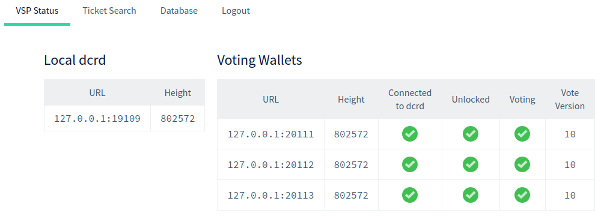
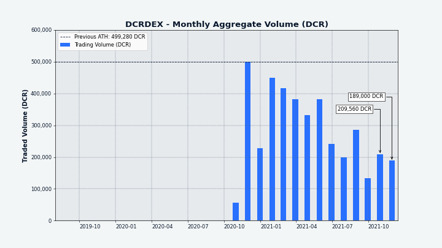

# صحيفة ديكريد لشهر نوفمبر 2021

_الصورة: مركز العقدة عن بعد II بواسطة @saender_

أبرز أحداث شهر نوفمبر:

* تم نشر ومناقشة اقتراح ضخم لتغيير توزيع مكافآت كتلة ديكريد بحيث يحصل معدني إثبات العمل على حصة أقل بكثير، وتمت الموافقة عليه الآن.
* موّل المجتمع اقتراحاً للإنتشار بعد رفضه بتصويت على بوليتيا.
* النسخة 1.3.0 لبوليتيا حية ويتم إستخدامها حالياً، مما يجلب تحسينات في معالجة وضع المقترحات، وتحسينات واجهة المستخدم الرسومية، والاختبار نهاية إلى نهاية.
* تم تطوير حزمتين جديدتين قابلتين لإعادة الاستخدام في dcrd، واحدة للأغراض العامة للأعداد الصحيحة الكبيرة والأخرى لبناء تطبيقات ديكريد.

المحتويات:

- [التطوير](#التطوير)
- [الأشخاص](#الأشخاص)
- [الإدارة و الحوكمة](#الإدارة-و-الحوكمة)
- [الشبكة](#الشبكة)
- [النظام البيئي](#النظام-البيئي)
- [الانتشار](#الانتشار)
- [وسائل الإعلام](#وسائل-الإعلام)
- [الأسواق](#الأسواق)
- [الخارجية ذات الصلة](#الخارجية-ذات-الصلة)

## التطوير

ما لم يُذكر خلاف ذلك، فإن العمل المَذْكُور هنا يشتمل على حالة “الدمج إلى الرئيسي”. وهذا يعني أن العمل قد تم استكماله ومراجعته ودمجه في كود المصدر الذي يمكن للمستخدمين المتقدمين بناءه وتشغيله، ولكنه ليس متاحًا بعد في ثنائيات الإصدار للمستخدمين العاديين.

<a id="dcrd" />

**[dcrd](https://github.com/decred/dcrd)**

_dcrd هو تطبيق عقدة كامل يعمل على تشغيل شبكة ديكريد نظير لنظير  حول العالم._

تم إصلاح خطأ بسيط في الإجماع حيث لم يتم الكشف عن التذاكر التي قامت بالتصويت على إنفاق الخزينة  وتم الإبلاغ عنها بشكل خاطئ على أنها مفقودة في بعض طلبات RPC. والأهم من ذلك، لا يمكن أن يتسبب الخطأ في حدوث تفرع غير مقصود ويؤثر فقط على البيانات التي يتم تقديمها عبر RPC. لا يزال مجمع التذاكر الحية دقيقًا ولن تتأثر جميع الأصوات والمدفوعات. وسيتطلب الإصلاح ترحيل قاعدة البيانات.

مرحبًا بـ [`uint256`](https://github.com/decred/dcrd/pull/2787)، حزمة جديدة تطبق عمليات حسابية لعدد صحيح 256 بت خالية من التخصيص بدرجة عالية. لديها القدرة على تسريع مزامنة السلسلة الأولية بنسبة 5-10٪ عند استخدامها بدلاً من الأعداد الصحيحة الكبيرة للمكتبة القياسية. تركز الحزمة بشدة على الأداء والدقة، وتتميز بالحسابات، والمقارنة المنطقية، والمنطق الأحادي، والتحولات بالبت، والتحويل من / إلى الأنواع ذات الصلة، ودعم التنسيق الكامل - كل ذلك يتم تقديمه مع واجهة برمجة تطبيقات مريحة، وتغطية اختبار كاملة، ومعايير. للحصول على جرعة كاملة من فرحة المخترق، اتبع كيفية ظهور [أكثر من 59 ايداعا](https://github.com/decred/dcrd/pull/2787/commits) مع ملف تمهيدي شامل في النهاية.

أصبحت حزمة `uint256` الخطوة الأولى في [خطة طويلة المدى](https://github.com/decred/dcrd/issues/2786) لتطوير وحدة `primitives` جديدة. سيصبح لبنة أساسية جديدة لكود الإجماع من خلال دمج المفاهيم الأساسية مثل المعاملات ورؤوس الكتل والكتل وتعريفات قفل التسلسل، والتي تنتشر حاليًا عبر حزم متعددة. ستعمل التجريدات المكررة على تحسين الوضوح من خلال التمييز بين المبادئ الأولية للإجماع وبروتوكول مشاركة البيانات، والسماح بتحسينات كبيرة في الأداء.

تقدم حزمة `stdscript` (محاولة لفصل "المواصفات القياسية" عن معالجة النص "بالإجماع" ، لتجنب التغييرات غير المقصودة للإجماع):

* إضافة دعم البرنامج النصي [قابل للتنقيح](https://github.com/decred/dcrd/pull/2803). وهذا شكل خاص من البرنامج النصي للمفتاح العام الذي لا يمكن إنفاقه وهو آمن للتنقيح من مجموعة مخرجات المعاملات غير المنفقة (UTXO) لحفظ الذاكرة. فهو مفيد بشكل أساسي في إرساء البيانات في سلسلة الكتل، كما يستخدمه [الطابع الزمني](https://timestamp.decred.org/) و [بوليتيا](https://proposals.decred.org/).
* إضافة دعم لتحديد عدد [التوقيعات](https://github.com/decred/dcrd/pull/2805) المطلوبة بواسطة برنامج نصي
* إضافة استخراج [العناوين](https://github.com/decred/dcrd/pull/2807) من الأشكال القياسية المعترف بها لنصوص المفاتيح العامة
* تم [نقل](https://github.com/decred/dcrd/pull/2810) الحزمة `stdscript` من منطقة التدريج الداخلية إلى وحدة `txscript` وهي الآن جاهزة للاستهلاك
* تم [تحويل](https://github.com/decred/dcrd/pull/2808) جميع الحزم لاستخدام حزمة `stdscript` الجديدة. لتسهيل المراجعة، تم تقسيم التغيير إلى 50 إيداعاً صغيرًا بحيث يبني كل شيء ويجتاز جميع الاختبارات في كل خطوة على الطريق.
* إضافة طرق [لاستخراج](https://github.com/decred/dcrd/pull/2816) تجزئة المفتاح العام وتجزئة النص من البرامج النصية ذات الصلة بالنص، مما يساعد العديد من التطبيقات التي لا تهتم بنوع البرنامج النصي المحدد (شراء تذكرة، مكافأة التصويت، الإستعادة، التغيير، إلخ)

التغييرات المدمجة الأخرى:

* ملء وفحص بيانات [إثبات الغش](https://github.com/decred/dcrd/pull/2804) للمعاملات التي تدخل في مجمع الذاكرة. وتشمل هذه البيانات كمية المدخلات، وارتفاع الكتلة، ومؤشر في تلك الكتلة، وتسمح بالكشف الفعال عن المعاملات الاحتيالية التي تحاول إنفاق أكثر مما توفره مدخلاتها. وكمكافأة، يسمح أيضا بحساب الرسوم بكفاءة دون إبطاء تحميل بيانات السلسلة أو الحاجة إلى مؤشر كامل للتعاملات.
* تم [فصل](https://github.com/decred/dcrd/pull/2776) كود التحديث عن الكود الأساسي ليظل أكثر استقرارًا مع تطور الكود الأساسي
* ضبط الفاصل الزمني [ping](https://github.com/decred/dcrd/pull/2796) لمنع حالات قطع الاتصال غير المرغوب فيها في سيناريوهات زمن الوصول العالي
* تحسين استخدام الذاكرة في حزمة [`netsync`](https://github.com/decred/dcrd/pull/2825)
* إعادة صياغة المنطق لتنزيل [الكتل التالية](https://github.com/decred/dcrd/pull/2828) ليكون أكثر توافقًا مع تنزيلات الكتل المتوازية من نظراء متعددين
* إصلاح حالة الحافة في [ترحيل](https://github.com/decred/dcrd/pull/2798)  قاعدة بيانات مخرجات المعاملة غير المنفقة (لم يؤثر على بناءَات الإصدار)
* إصلاح [الجمود](https://github.com/decred/dcrd/pull/2806) عند الإغلاق (لم يؤثر على بناءَات الإصدار)
* إصلاح [التدفق](https://github.com/decred/dcrd/pull/2778) الزائد في عملية إضافة ModNScalar ذات الوقت الثابت المحسّن

_يوم آخر لتحسين DCRD_

<a id="dcrwallet" />

**[dcrwallet](https://github.com/decred/dcrwallet)**

_dcrwallet هو خادم محفظة يستخدمه سطر الأوامر وتطبيقات المحفظة الرسومية._ 

* إصلاح [الانفصال](https://github.com/decred/dcrwallet/pull/2105) عن النظراء

<a id="decrediton" /> 

**[Decrediton](https://github.com/decred/decrediton)**

_ديكريديتون هو تطبيق محفظة لسطح المكتب كامل الميزات مع ميزة التصويت مدمجة، وميزة الخلط ب StakeShuffle، والشبكة البرقية، والتداول على منصة المُبادلات اللامركزية DEX للديكريد، والمزيد. يتم تشغيلها مع سلسلة الكتل كاملة أو بدونها (وضع التحقق البسيط من الدفع SPV)._

التغييرات التي تواجه المستخدم:

* تنفيذ تصميم واجهة مستخدم جديدًا [لتأكيد عرض البذور](https://github.com/decred/decrediton/pull/3594) لتبسيط تجربة المستخدم المؤلمة لإدخال الكلمات الأولية
* إضافة قابلية استعادة حساب [منصة المبادلات اللامركزية](https://github.com/decred/decrediton/pull/3552) من بذرة منصة المبادلات اللامركزية
إضافة قابلية تحديد [دليل](https://github.com/decred/decrediton/pull/3572) التثبيت المخصص لمحفظة البتكوين. تمت إزالة أي محاولات لتحديث ملف `bitcoin.conf` الحالي.
* إخفاء واجهة مستخدم شراء تذكرة مزود خدمة التصويت [القديمة](https://github.com/decred/decrediton/pull/3587) كخطوة أولى لإزالتها
* ~ 7 إصلاحات للأخطاء

داخلي:

* إعادة إستخدام مكون [علامات التبويب](https://github.com/decred/decrediton/pull/3592) من مكتبة pi-ui
* إضافة اختبارات آلية لـ: مكون الصفحة المبوبة و[صفحات](https://github.com/decred/decrediton/pull/3584) [الصفحة الرئيسية](https://github.com/decred/decrediton/pull/3598) والخصوصية والأمن

التغييرات في مكتبة pi-ui (مشتركة بين ديكريديتون و بوليتيا):

* دعم التغيير البرمجي لقيمة [منتقي التاريخ](https://github.com/decred/pi-ui/pull/375)
* تحسين إمكانية تخصيص [علامات التبويب](https://github.com/decred/pi-ui/pull/376) ومكونات [CopyableText](https://github.com/decred/pi-ui/pull/382)
* إضافة مكونات [لترقيم](https://github.com/decred/pi-ui/pull/396) الصفحات و[إبراز](https://github.com/decred/pi-ui/pull/404) النص
* [تحديثات](https://github.com/decred/pi-ui/pull/379) التبعية وlinter
* التحديث لتتناسب مع مواصفات التصميم الجديدة
* ~ 3 إصلاحات للأخطاء

<a id="politeia" />

**[بوليتيا](https://github.com/decred/politeia)**

_بوليتيا هي نظام المقترحات لديكريد. يتم استخدامها لطلب التمويل من خزينة ديكريد._

إصدار [بوليتيا](https://proposals.decred.org/) الجديد حي! مميزات الإصدار 1.3.0:

* حالات الفواتير (ستعمل على تحسين التنقل والحماية من الفواتير غير الصالحة)
* حالة الاقتراح تشير إلى مرحلة دورة حياة الاقتراح
* علامات تحسين محركات البحث (SEO) للحصول على نتائج أفضل لمحرك البحث
* مختلف تحسينات واجهة المستخدم الرسومية لتجربة المستخدم
* التصويت الأولي المتوازي في politeiavoter للحصول على خصوصية وموثوقية أفضل
* بنية تحتية جديدة للاختبار الشامل
* تحضيرات قاعدة البيانات لإعادة كتابة طبقة المستخدم

لمزيد من التفاصيل، تحقق من ملاحظات الإصدار في مستودعات [politeia](https://github.com/decred/politeia/releases/tag/v1.3.0) و [politeiagui](https://github.com/decred/politeiagui/releases/tag/v1.3.0)، أو تجول من خلال [العرض التفصيلي](https://twitter.com/lukebp/status/1462881215346880524) لتغريدة @lukebp على التويتر.

* استخدام [تنسيق تاريخ](https://github.com/decred/politeiagui/pull/2640) لا لبس فيه مثل 08` سبتمبر 2021`
* صلاح نظام تصفح [العودة](https://github.com/decred/politeiagui/pull/2658)
* ~ 10 إصلاحات أخرى للأخطاء

التغييرات الداخلية لواجهة المستخدم الرسومية:

* إضافة إطار عمل موسع لكتابة [الاختبارات الشاملة](https://github.com/decred/politeiagui/pull/2624)، بما في ذلك أدوات تحاكي استجابات واجهة برمجة التطبيقات، وإنشاء البيانات، ودليل إرشادي
* إضافة المزيد من الاختبارات الشاملة لمنع تكرار الأخطاء

التغييرات في الخلفية:

* [منع](https://github.com/decred/politeia/pull/1575) مقترحات طلب تقديم المقترحات من تغيير حالة الفوترة (لا يمكنهم طلب الفوترة من الخزينة، على عكس طلبات تقديم المقترحات)
* إدخال حالة [`موافق عليها`](https://github.com/decred/politeia/pull/1578) للمقترحات التي لا يمكن أن تطلب فاتورة من الخزينة (مثل RFP)، للتمييز بين الحالة `المفعلة` التي يمكن أن تطلب فاتورة
* تنفيذ [جلسة](https://github.com/decred/politeia/pull/1564) التخزين ب MySQL
* تنفيذ فحوصات سلامة البيانات للمكوِّن الإضافي [`usermd`](https://github.com/decred/politeia/pull/1581) ("بيانات تعريف المستخدم"). هذا هو الفحص النهائي اللازم لمتابعة [استيراد](https://github.com/decred/politeia/issues/1425) مقترحات Git القديمة إلى المخزن الجديد.
* السماح بتعيين [حالة](https://github.com/decred/politeia/pull/1583) المقترحات التي تم إنشاؤها باستخدام الأمر `pictl seedproposals` (يساعد في الاختبار)
* إضافة طباعة [إحصائيات وقت](https://github.com/decred/politeia/pull/1585) التنفيذ إلى الأمر `pictl` للمساعدة في اختبار الأداء
* ~ 2 إصلاحات للأخطاء

أداة سطر الأوامر `politeiavoter`:

* السماح لما يصل إلى 100 [باقات](https://github.com/decred/politeia/pull/1565) متوازية
* إعادة صياغة [مخرج المساعدة](https://github.com/decred/politeia/pull/1580) ليكون أكثر فائدة ويتطابق مع `dcrctl`. أيضًا، يتصل بالمحفظة فقط عند الحاجة إليها.
* تصحيح [القيم الافتراضية](https://github.com/decred/politeia/pull/1568) في ملف التكوين وتحديث نموذج التكوين

ومن السمات البارزة لتطوير بوليتيا هي خطوة ما قبل الإصدر الرسمي لاختبار جميع التغييرات في كل من [الخلفية](https://github.com/decred/politeia/issues/1573) و[واجهة المستخدم الرسومية](https://github.com/decred/politeiagui/issues/2653).

<a id="vspd" />

**[vspd](https://github.com/decred/vspd)**

_vspd هو برنامج خادم لتشغيل موفر خدمة التصويت. يصوت موفر خدمة التصويت نيابة عن مستخدميه على مدار الساعة طوال أيام الأسبوع ولا يمكنه سرقة الأموال._

* الإبلاغ عن [حالة](https://github.com/decred/vspd/pull/302) مثيل dcrd في كل من صفحة المسؤول وحالة نقطة نهاية API
* إظهار عنوان التوقيع البديل في [نتيجة البحث](https://github.com/decred/vspd/pull/303) عن التذاكر
* توضيح [المصطلحات](https://github.com/decred/vspd/pull/307) حول "عنوان التوقيع البديل"
* إضافة حل لتتبع التذاكر [المسترجعة](https://github.com/decred/vspd/pull/301) (لن تكون هناك حاجة عند تفعيل الإسترجاع التلقائي للتذاكر)
* تحديد عنوان [عميل ](https://github.com/decred/vspd/pull/308)IP من الرؤوس التي تم تعيينها بواسطة خادم الوكيل العكسي
* دعم دليل مخصص [لإطار الاختبار الآلي](https://github.com/decred/vspd/pull/309)

_حالة صفحة  مشرف مزود خدمة التصويت_

<a id="dcrpool" />
 
**[dcrpool](https://github.com/decred/dcrpool)**

_dcrpool هو برنامج خادم لتشغيل تجمع التعدين._

* [التحديث](https://github.com/decred/dcrpool/pull/337) لإصدارات `الرئيسي` dcrd و dcrwallet (هذا يكسر التوافق مع الإصدار 1.6)

<a id="dcrlnd" /> 

**[dcrlnd](https://github.com/decred/dcrlnd)**

_dcrlnd هو برنامج عقدة الشبكة البرقية لديكريد. تتيح الشبكة البرقية المعاملات الفورية ومنخفضة التكلفة._

<a id="cspp" />

**[cspp](https://github.com/decred/cspp)**

cspp_ هو خادم لتنسيق عمليات خلط العملات باستخدام بروتوكول CoinShuffle++. إنه غير إحتجازي، أي لا يحتفظ بأي أموال._

* يحدث الخلط الآن كل [15 دقيقة](https://github.com/decred/dcrdocs/pull/1188)، بعد أن كان 20 دقيقة

<a id="dcrdex" />

**[DCRDEX](https://github.com/decred/dcrdex)**

_DCRDEX هي منصة تبادلات غير إحتجازية للتداول وغير مركزية، مدعومة بالمقايضات الذرية._

التغييرات التي تواجه المستخدم:

* إظهار [الحالة](https://github.com/decred/dcrdex/pull/1287) التفصيلية للتذاكر المسترجعة المتطابقة (إستعادة الأموال قيد الإنتظار أو المستردة أو معوضة أو مكتملة)

شارك @chappjc [لمحة عامة](https://twitter.com/chappjc/status/1457750847845195777)  سهلة الاستعمال عن السمات المضافة مؤخرا مثل رسوم الأصول المتعددة أو محفظة البتكوين التحقق البسيط من الدفع المدمجة.

التغييرات الداخلية:

* إضافة الدعم لمحافظ [التحقق البسيط من الدفع ل ](https://github.com/decred/dcrdex/pull/788)DCR
* [حالة مزامنة](https://github.com/decred/dcrdex/pull/1271) أكثر دقة لمحفظة BTC
* إزالة [نقاط نهاية](https://github.com/decred/dcrdex/pull/1272) الحظر وإلغاء الحظر لأنه تم التعامل معها بالفعل في مكان آخر ولأن الحظر/إلغاء الحظر الذي بدأه المشغل غير متوافق مع تكوين الشبكة أو نظام المستخدم المتدرج/المترابط (مفهومان مستقبليان)
* تخزين [المطابقات النشطة](https://github.com/decred/dcrdex/pull/1263) في حاوية تخزين منفصلة بدلاً من تمييزها على أنها نشطة أو متقاعدة
* إضافة [حدود](https://github.com/decred/dcrdex/pull/1288) السعر للطرق الجديدة
* ~ 7 إصلاحات للأخطاء

التقدم المحرز نحو دعم الإيثيريوم:

* تم التنفيذ: جلب [بيانات المعاملات](https://github.com/decred/dcrdex/pull/1279) الأولية، و[التحقق](https://github.com/decred/dcrdex/pull/1273) من صحة العقد الأساسي، ووظيفة [المقايضة](https://github.com/decred/dcrdex/pull/1248)، ووظيفة [SwapConfirmations](https://github.com/decred/dcrdex/pull/1315)
* [تعبئة](https://github.com/decred/dcrdex/pull/1305) بنية المقايضة (إعادة ترتيبها بشكل أساسي) لتوفير 5-15٪ من الغاز عند التهيئة واسترداد المقايضات
* إزالة الوظيفة [لبدء](https://github.com/decred/dcrdex/pull/1262) مقايضة واحدة لصالح النسخة المجمعة، من أجل تقليل كود العقد الذكي والعميل + كود الخادم حولها (كود أقل، مراجعة أسهل)
* تحديث عقد المبادلة [لاسترداد](https://github.com/decred/dcrdex/pull/1274) المقايضات على دفعات أيضًا
* [قفل](https://github.com/decred/dcrdex/pull/1291) الأموال لاسترداد محتمل
* حساب [الرصيد المعلق](https://github.com/decred/dcrdex/pull/1303) مع الأخذ في الاعتبار المعاملات الواردة والصادرة المعلقة
* [إعادة هيكلة](https://github.com/decred/dcrdex/pull/1301) كبيرة لعميل ETH لاستدعاء الطرق بشكل أكثر مباشرة، وتنفيذ إصدارات العقد، والتبديل إلى معاملات EIP-1559، والمزيد

_ادفع رسوم التسجيل بعملات أخرى لتوفير المزيد من DCR_

* إبلاغ المستخدم عند عدم توفر [الاتصال](https://github.com/planetdecred/dcrandroid/pull/604) بالإنترنت وإيقاف المزامنة مؤقتًا
* استخدام مصطلح ["كلمات البذرة"](https://github.com/planetdecred/dcrandroid/pull/600) باستمرار
* تحديث الترجمة [الفرنسية](https://github.com/planetdecred/dcrandroid/pull/586)
* إصلاح [الروابط](https://github.com/planetdecred/dcrandroid/pull/599) التي تنقل إلى موقع الاقتراحات

<a id="dcrios" />

**[Decred Wallet (iOS)](https://github.com/planetdecred/dcrios)**

* إصلاح رموز [علامات التبويب النشطة](https://github.com/planetdecred/dcrios/pull/874)
* إصلاح [إغلاق](https://github.com/planetdecred/dcrios/pull/872) القائمة المنسدلة عند النقر خارجاً

<a id="godcr" />

**[GoDCR](https://github.com/planetdecred/godcr)**
  
_GoDCR هو تطبيق محفظة سطح المكتب خفيف الوزن مع تحصيص مدمج والخصوصية وتصفح بوليتيا._

* تنفيذ تصميم واجهة مستخدم جديد لصفحة [التحصيص](https://github.com/planetdecred/godcr/pull/679) (أعيدت تسميتها من التذاكر)
* تنفيذ واجهة مستخدم جديدة [للحوكمة](https://github.com/planetdecred/godcr/pull/691) مع صفحة ترحيب جديدة
تحديث تصميم صفحة [الإعدادات](https://github.com/planetdecred/godcr/pull/684)
* عرض ملخص حساب [الخلط](https://github.com/planetdecred/godcr/pull/701) في صفحة نظرة عامة
* إضافة قابلية الإنفاق من الحساب [غير المخلوط](https://github.com/planetdecred/godcr/issues/674) (لأولئك الذين يعرفون ما يفعلونه)
* ~ 9 إصلاحات للأخطاء

تم الدمج في مكتبة [dcrlibwallet](https://github.com/planetdecred/dcrlibwallet) (مشتركة بواسطة محافظ Android / iOS و GoDCR):

* إضافة حزمة [`dexdcr`](https://github.com/planetdecred/dcrlibwallet/pull/210) للسماح لتطبيقات العميل بدمج DCRDEX

< مرحبا، بعد دراسة متأنية، قرر فريق Planet Decred أننا سنؤخر النسخة 2 من اقتراح GoDCR حتى يكون لدينا إصدارالشبكة الرئيسية. وبسبب ذلك، يرجى ترقب نشر النسخة 2 من اقتراح GoDCR في وقت ما في يناير. يجب الإنتهاء من العمل على الشبكة الرئيسية  بحلول نهاية العام. (@monsa00 في [2021-12-02](https://matrix.to/#/!gruHpujXftcsHcghjx:planetdecred.org/$GJ7PliGPTamNznbE7D82QfK05Hm6wQpogg8x2aQkCmw))

<a id="dcrros" />

**[dcrros](https://github.com/decred/dcrros)**

_dcrros هي خدمة وسيطة توفر الوصول إلى شبكة ديكريد عبر Rosetta API._

* وُصفت النسخة 0.1.0 بأنها أول إصدار رسمي ل dcrros. وهو يتضمن النسخة الأساسية من برمجيات ديكريد 1.6.0 وينفذ مواصفات نسخة روزيتا 1.4.10. انظر القائمة الكاملة للمميزات في [ملاحظات الإصدار](https://github.com/decred/dcrros/blob/master/docs/release-notes/release-notes-0.1.0.md).
* تم التحديث لاستخدام [أحدث](https://github.com/decred/dcrros/pull/23) إصدار لديكريد 1.6.2 و الإصدار 0.7.2 ل Rosetta SDK. تمت أيضًا إضافة علامة `—offline` لتبسيط تشغيل مثيلات dcrros غير المتصلة بالإنترنت (على سبيل المثال لإنشاء المعاملات والتوقيع، ربما في إعداد الفجوة الهوائية).
* تم إصدار التغيير أعلاه كإصدار [0.1.1](https://github.com/decred/dcrros/pull/24)

<a id="dcrdocs" />

**[dcrdocs](https://github.com/decred/dcrdocs)**

_dcrdocs هو كود المصدر [لوثائق مستخدم](https://docs.decred.org/) ديكريد._

* [تحديث](https://github.com/decred/dcrdocs/pull/1190) موضوع مستندات mkdocs و صقل مصادر الماركداون

 <a id="dcrweb" />

**[decred.org](https://github.com/decred/dcrweb)**
 
_dcrweb هو الكود المصدري لموقع decred.org._
 
* [إضافة](https://github.com/decred/dcrweb/pull/1018) [النشرة الصحفية](https://decred.org/press/2021-10-27_decred_hits_governance_milestone/) لمعلم الحوكمة
* إضافة [أسماء المؤلفين](https://github.com/decred/dcrweb/pull/1015) إلى مواد التغطية الصحفية
* تحديث مكتبة الرسوم المتحركة [Lottie](https://github.com/decred/dcrweb/pull/1020)، مع تحديد الرسوم المتحركة على صفحات [الإصدار](https://decred.org/release/) و[التاريخ(https://decred.org/history/)

مسائل أخرى:

* حصل تطبيق [timestamp.decred.org](https://timestamp.decred.org/) على العديد من [الإصلاحات](https://github.com/decred/dcrtimegui/pull/122) الصغيرة ونسخة محسّنة بمصطلحات متسقة
* تم [تحويل](https://twitter.com/roasbeef/status/1460809483714584582) رمز البرنامج النصي للتخصيص الصفري من dcrd إلى btcd  مما أدى إلى تسريع التحميل الأولي لسلسلة الكتل بحوالي 20%

## الأشخاص

احصائيات المجتمع اعتبارًا من 1 ديسمبر: 

* متابعو [التويتر](https://twitter.com/decredproject): 50,116 (+613)
* المشتركين في [ريديت](https://www.reddit.com/r/decred/): 12,406 (+158)
* مستخدمي غرفة الدردشة general# على [الماتريكس](https://chat.decred.org/): 585 (+34)
* مستخدمي [الديسكورد](https://discord.gg/GJ2GXfz): 2,223 (-44)
* مستخدمي [التيليجرام](https://t.me/Decred): 3,030 (+90)
* المشتركين في [اليوتيوب](https://www.youtube.com/decredchannel): 4,620 (+0), المشاهدات: 198 ألف (بزيادة ألف) 

## الإدارة و الحوكمة

في نوفمبر، تلقت [الخزينة](https://dcrdata.decred.org/treasury) الجديدة 10,206 DCR بقيمة 1.1 مليون دولار بمتوسط ​​سعر الشهر البالغ 108.13 دولار. تم إنفاق  1,995 DCR  للدفع للمتعاقدين، بما في ذلك 974 DCR لشهر سبتمبر، و 1,021 DCR لشهر أكتوبر. تبلغ قيمة الأخيرة 110 ألف دولار أمريكي بسعر نوفمبر، أو 124 ألف دولار أمريكي بمتوسط سعر فواتير أكتوبر البالغ 121.57 دولارًا أمريكيًا.  اعتبارًا من 6 ديسمبر، بلغ الرصيد المشترك للخزينة [القديمة](https://dcrdata.decred.org/address/Dcur2mcGjmENx4DhNqDctW5wJCVyT3Qeqkx) و[الجديدة](https://dcrdata.decred.org/treasury) 743,661 DCR (أي ما يعادل 73 مليون دولار أمريكي بسعر 98.01 دولارًا أمريكيًا).

تم تقديم مقترحين جديدين هذا الشهر:

* تم تقديم [اقتراح](https://proposals.decred.org/record/427e1d4) لتغيير تقسيم الدعم (مكافأة الكتلة) من الإعداد الحالي (60/30 إثبات الحصة/إثبات العمل) لصالح إثبات الحصة (10/80) بواسطة @jy-p. تمت الموافقة على الاقتراح في أوائل ديسمبر بموافقة 92٪ ونسبة إقبال 78٪، ومن المتوقع أن يكتمل العمل في غضون أسابيع قليلة بتكلفة لا تزيد عن 30 ألف دولار، وسيسري التغيير بمجرد تقديمه والتصويت عليه من خلال اقتراح تغيير الإجماع. انتهى الاقتراح بجمع 166 تعليقًا على بوليتيا (رقم قياسي جديد) و أزيد من 60 تعليقا على [الريديت](https://www.reddit.com/r/decred/comments/r3jq5a/change_powpos_subsidy_split_from_6030_to_1080/).
* [اقتراح](https://proposals.decred.org/record/0ff082d) لتمديد أعمال الاتصالات والمحتوى لفريق ديكريد عربية بمبلغ 10,600 دولار لمدة 10 إلى 12 شهرًا أخرى - في الفترة السابقة تم تقليص الفعاليات الشخصية ونقص إنفاق الميزانية. تمت الموافقة على هذا الاقتراح في أوائل ديسمبر بموافقة 98٪ ونسبة إقبال 61٪.

تم [رفض اقتراح](https://proposals.decred.org/record/c1f5b5c) @ammarooni للتعليم الاقتصادي والإنتشار  بموافقة 33.6٪ ونسبة مشاركة 70٪. ومع ذلك، لم تكن هذه نهاية القصة حيث وضع عمار عنوانًا للتبرعات، وسرعان ما [وصل](https://twitter.com/Ammarooni/status/1458541211673931778) إلى هدف 12 ألف دولار عبر 30 معاملة مختلفة. وهو الآن "مشحون مثل البيسون" ومستعد لتقديم البرنامج المقترح.

المرجو من أي شخص يقوم بالتصويت عبر سطر الأوامر أن يقوم بالتحديث:

> إذا كنت تستخدم politeiavoter في التصويت على الاقتراح، تأكد من التحديث إلى الإصدار 1.3.0 politiavoter قبل الجولة التالية من التصويت. قد لا تعمل إعادة محاولة الأصوات الفاشلة بشكل صحيح إذا لم تقم بذلك. ([@lukebp](https://twitter.com/lukebp/status/1464627255108419586))

راجع [العدد ](https://blockcommons.red/politeia-digest/issue049/)49 لموجز بوليتيا للحصول على مزيد من التفاصيل حول مقترحات الشهر.

## الشبكة

**معدل الهاش**: افتتحت [معدلات الهاش](https://dcrdata.decred.org/charts?chart=hashrate&zoom=kvddhno1-kwon4zhl&scale=linear&bin=block&axis=time) في شهر نوفمبر عند ~278 Ph/s وأغلقت عند ~437 Ph/s، وبلغ قاعها عند 221 Ph/s كما بلغت ذروتها عند 441 Ph/s على مدار الشهر.

_معدلات هاش ديكريد_

توزيع معدل الهاش الذي [تم الإبلاغ عنه](https://miningpoolstats.stream/decred) بواسطة المجمعات في 1  ديسمبر: AntPool بنسبة 36%، و Poolin بنسبة 34%، و F2Pool بنسبة 13%، و ViaBTC بنسبة 7%، و Luxor بنسبة 6%، و BTC.com بنسبة 3%، و OKEx بنسبة 0.4%، و CoinMine بنسبة 0.16%.

**التحصيص**: تراوح [سعر التذكرة](https://dcrdata.decred.org/charts?chart=ticket-price&zoom=kvddhno1-kwon4zhl&axis=time&visibility=true-true&mode=stepped) بين 139.1-327.8 DCR، [بمتوسط](https://dcrstats.com/)  203.6 DCR (+12.0) خلال 30 يوما.

بلغ [المبلغ المقفل](https://dcrdata.decred.org/charts?chart=ticket-pool-value&zoom=kvddhno1-kwon4zhl&scale=linear&bin=block&axis=time) 7.42-8.19 مليون DCR، مما يعني أن 54.7-60.5% من العرض المتاح [شارك](https://dcrdata.decred.org/charts?chart=stake-participation&zoom=kvddhno1-kwon4zhl&scale=linear&bin=block&axis=time) في إثبات الحصة.

_تأرجح سعر التذكرة_

**مقدم خدمة التصويت**: في 1 ديسمبر، تمت إدارة ما يقارب 6,800  تذاكر حية (-600) بواسطة خوادم vspd [المدرجة](https://decred.org/vsp/) و ما يقارب 195 (-29) بواسطة خوادم dcrstakepool القديمة المدرجة.  إجمالا، تمكن 7 من مقدمي خدمات التصويت القديمة و 15 من مقدمي خدمات التصويت الجديدة من إدارة 17.5% (1.4%-) من مجمع التذاكر.

**العقد**: طوال شهر نوفمبر، كان هناك حوالي 186 عقدة يمكن الوصول إليها وفقًا لـ [dcrextdata](https://dcrextdata.planetdecred.org/nodes).

إصدارات العقد اعتبارًا من [لقطة](https://nodes.jholdstock.uk/user_agents) 1 ديسمبر (إجمالي 208، dcrd فقط): النسخة 1.6.2 - 61%، النسخة 1.7 لبناءَات التطوير - 13%، النسخة 1.6.0 - 12%، النسخة 1.6.1 - 7%، النسخة 1.6 لبناءَات التطوير - 3.4%، النسخة 1.5.2 - 2.4%، النسخة 1.5.1 - 0.5%.

_StakeShuffled DCR_

## النظام البيئي

شهدت تجمعات التعدين الصينية اضطرابًا نتيجة [للرقابة](https://www.theblockcrypto.com/post/125533/china-crypto-censorship-media-mining-pools) على الإنترنت و[مشكلات ](https://www.techspot.com/news/92397-major-mining-pools-facing-connectivity-issues-amid-chinese.html)DNS، وأطلق البعض مجالات [بديلة](https://twitter.com/ViaBTC/status/1465221867631886337) استجابةً لذلك. يبدو أن هذا قد تسبب في إعادة توزيع معدل هاش ديكريد، في حين أن إجمالي معدل الهاش لم يتأثر كثيرًا.

[أعلنت](https://f2pool.io/mining/updates/#20211015) F2Pool أنها ستغلق عملياتها في الأراضي الصينية بحلول نهاية عام 2021. وأعقب ذلك إغلاق مجمعات تعدين للعديد من العملات بما في ذلك XMR، على الرغم من أن مجمع DCR كان [متصلاً بالإنترنت](https://www.f2pool.com/) مع 46 Ph/s اعتبارًا من 1 ديسمبر.

أبلغ مستخدمو Ledger Live عن مشكلات في إرسال DCR من هذه المحفظة. بسبب حساب الرسوم غير الصحيح، ستعلق المعاملات في تجمع الذاكرة ويقفل على العملات. تم [العثور](https://www.reddit.com/r/decred/comments/qoe0hu/ledger_live_sending_issues_and_workarounds/) على حل بديل حيث يمكن استخدام ميزة التحكم في العملة لإلغاء القفل على الأموال.

[أبلغ](https://www.reddit.com/r/decred/comments/qru7vx/decred_is_the_majority_place_holder_of_the/) أحدهم أن DCR أصبحت صاحبة المركز الرئيسي (27%) في مؤشر الخصوصية ل FTX، الذي يتتبع 9 عملات خصوصية، على الرغم من أن هذا يبدو وكأنه خطأ في إعادة التوازن ومن المفترض أن يكون وزن DCR أقل.

تحذير: ليس لدى مؤلفي مجلة ديكريد أي فكرة عن مصداقية أي من الخدمات المذكورة أعلاه. يرجى إجراء البحث الخاص بك قبل الوثوق بمعلوماتك الشخصية أو أصولك لأي كيان.

## الإنتشار

لدى ديكريد الآن [قناة ](https://odysee.com/@Decred)Odysee حيث تم نسخ محتوى [اليوتيوب](https://www.youtube.com/c/DecredChannel)، للإحتياط فقط. كمكافأة، فإنه يسمح بمشاهدة مقاطع فيديو ديكريد دون زيارة يوتيوب وجوجل. Odysee مدعوم من [LBRY](https://lbry.com)، وهو بروتوكول لامركزي لتوزيع عادل وقوي للمحتوى (مع إختيارية تحقيق الدخل). يرجى دعم فيديوهات ديكريد إذا ما كنت تستخدم هذه المنصة.

تم الإعلان التجريبي لمجلة ديكريد لشهر أكتوبر على صفحة [الإنتسغرام](https://www.instagram.com/decredproject/p/CWRRcJPp3zr/) لديكريد،  بالإضافة إلى جميع القنوات الموجودة. نرحب بمستخدمي الإنتسغرام لدعم الحساب أو تقديم المشورة بشأن كيفية تنميته.

أخيرًا وليس آخرًا، قام شخص ما بتسجيل [حساب ](https://onlyfans.com/decred) OnlyFans لـديكريد . من الصعب التعليق أكثر.

إنجازات Monde PR لشهر نوفمبر:

عرضت 4 قصص/فرص للعلاقات العامة على منشورات المالية و العملات الرقمية

تأمين المقالات الإخبارية التالية:

* تمت مقابلة @jy-p في برنامج Benzinga's Moon[ أو ](https://www.youtube.com/watch?v=0My2w4p2-PE)Bust Show، حيث تحدث عن جميع الأشياء المتعلقة بديكريد
* أجرت [مجلة ](https://medium.com/authority-magazine/jonathan-zeppettini-on-the-5-things-you-need-to-understand-in-order-to-successfully-invest-in-2f09bff32e48)Authority مقابلة مع @jz حول كيفية الاستثمار بنجاح في العملات الرقمية المشفرة. تحتوي المقالة على العديد من الإشارات إلى ديكريد.

## وسائل الإعلام

مقالات مختارة:

* ديكريد: عملة رقمية مشفرة من الدرجة الأولى بواسطة Andy Hecht على ([investing.com](https://www.investing.com/analysis/decred-a-top-tier-cryptocurrency-200609428))
* جوناثان زيبيتيني من ديكريد حول 5 أشياء تحتاج إلى فهمها من أجل الاستثمار بنجاح في العملة الرقمية المشفرة بواسطة Tyler Gallagher من مجلة Authority على ([medium](https://medium.com/authority-magazine/jonathan-zeppettini-on-the-5-things-you-need-to-understand-in-order-to-successfully-invest-in-2f09bff32e48))

< عليك أن تفهم نفسك وأن الرحلة ستكون تجربة تعليمية لا تنتهي أبدًا. من وجهة نظري، هناك ثلاث سمات سترغب أيضًا في صقلها إذا كنت ترغب في الحصول على أي فرصة للنجاح : الصبر والانضباط والتركيز. كما هو الحال مع أي نوع من الاستثمار، ستحدد هذه النتائج نتيجتك. (@jz)

أشرطة الفيديو:

* تحديث السوق - مقابلة ديكريد - على Moon or bust بواسطة Logan Ross من Benzinga ([اليوتيوب](https://www.youtube.com/watch?v=0My2w4p2-PE)) - يتحدث @jy-p عن ديكريد و يجيب عن الأسئلة من الدردشة، يبدأ عند الدقيقة 29

الصوتيات:

* لا يوجد قمة. تحليل البتكوين على السلسلة مع Glassnode على ([bravenewcoin.com](https://bravenewcoin.com/insights/podcasts/there-is-no-top-bitcoin-on-chain-analysis-with-glassnode)، [اليوتيوب](https://www.youtube.com/watch?v=6LJGaNGw4Us)، و [mp3](https://traffic.libsyn.com/secure/thecryptoconversation/MATE_FIN.mp3)) - يتحدث @Checkmate عن ديكريد عند حوالي الدقيقة 35

الترجمة:

* العدد 48 لموجز بوليتيا - باللغة الإسبانية بواسطة francov\_@
* تمت [ترجمة](https://xaur.github.io/decred-news/) مجلة ديكريد لشهر أكتوبر 2021 إلى العربية (arij@ و abdulrahman4@) والصينية (Dominic@) والإسبانية (_\francov@). شكرا لكم على كل العمل الشاق!

## الأسواق

في نوفمبر، تم تداول DCR بين 91.36 و 121.75 دولارًا أمريكيًا مقابل BTC 0.0016-0.0019. وكان متوسط السعر اليومي 108.13 دولارًا.

الرسم البياني لحجم التداول على منصة المبادلات اللامركزية لديكريد من :@bochinchero

الرسوم البيانية لحجم التداول على منصة المبادلات اللامركزية لديكريد من :@bochinchero

_حجم التداول اليومي على DCRDEX_

_ حجم التداول الشهري لـ DCRDEX_

## الخارجية ذات الصلة

[جمدت](https://www.coindesk.com/business/2021/11/12/binance-freezes-doge-withdrawals-as-users-report-being-asked-to-return-coins-they-dont-have/)  باينانس عمليات سحب DOGE بعد معالجة مجموعة من طلبات السحب القديمة [على ما يبدو](https://twitter.com/dogecoin_devs/status/1458868925039464451) عن طريق الخطأ بعد التحديث. وأفاد مستخدمو باينانس بأنه طُلب منهم إعادة DOGE  التي لم تكن موجودة في حساباتهم، وأبلغوا بأنهم لن يتمكنوا بعد الآن من إجراء عمليات السحب حتى يعيدوا DOGE. [ساهم](https://twitter.com/elonmusk/status/1463085111600205825) Elon Musk في زيادة الوعي بالقضية من خلال انتقاد الباينانس على التويتر. نشرت الباينانس لاحقًا [نسختها](https://www.binance.com/en/blog/community/the-inside-story-on-doge-withdrawals-421499824684903102) من القصة مؤكدة أن المشكلة كانت بسبب تحديث محفظتها بينما كانت بها معاملات قديمة عالقة، والتي أعيد بثها بعد ذلك بنجاح. يوضح التفسير أن عمليات سحب DOGE كانت معطلة لمدة 17 يومًا حتى يتمكنوا من "إعادة إنشاء المحفظة”.
[قدمت](https://electriccoin.co/blog/ecc-roadmap-calls-for-focus-on-wallet-proof-of-stake-and-interoperability/) ECC خارطة طريق جديدة لزيكاش والتي ستشهد تحول المشروع إلى إجماع إثبات الحصة على مدى السنوات الثلاث المقبلة، مع التركيز على قابلية التشغيل البيني عبر السلاسل ودمج ميزات الحوكمة في المحفظة. والمجال الآخر الذي يجري استكشافه من أجل زيكاش هو "[الأصول المحمية](https://electriccoin.co/blog/update-ecc-research-and-paths-forward-for-zsas/)"، وبيانات الأصول الأخرى على سلسلة زيكاش، ولكن التقرير ما يزال محايدا بشأن ما إذا كان ذلك سيكون مفيدا وجديرا بالاهتمام. وقد استندت هذه الأولويات إلى تصويت [أعضاء المنتدى](https://vote.heliosvoting.org/helios/elections/5dd57b92-01ed-11ec-a0a8-ae3066fac55d/view) و[حاملي العملات](https://electriccoin.co/blog/coin-holder-poll-results-summary/).

أجرت بولكادوت [تصويتا](https://vote.polkadot.network/) بالتوكن لتقرر مستقبل علامتهم التجارية ، واتبعت أسلوب التصويت الرباعي الذي قلل من وزن حسابات تصويت الحيتان وانتقى الناخبون بين شعارين واتجاهات الهوية. كان اختيار الاتجاهات موجها بالأحاسيس. بدأت عملية مراجعة هذه الأصول في ديسمبر 2020، وتم [تمويلها](https://polkadot.polkassembly.io/bounty/0#4f1773e7-159c-4aa4-be6f-2594092c4fa7) بميزانية قدرها 10,000 يورو. تم إجراء التصويت النهائي لاختيار أحد التصميمات المتنافسة على صفحة مخصصة ومن المحتمل أن تكون هذه هي المرة الأولى التي صوتت فيها معظم الحسابات البالغ عددها 2097 - نظرًا لأن واجهة التصويت الخاصة بمقترحات التمويل يصعب الوصول إليها كثيرًا.

قام مجتمع من المستثمرين المشوهين بتشكيل  ConstitutionDAO [لمحاولة](https://www.vice.com/en/article/qjb8av/constitutiondao-aftermath-everyone-very-mad-confused-losing-lots-of-money-fighting-crying-etc) شراء نسخة نادرة من الدستور الأمريكي، وجمعو 40 مليون دولار ب ETH ولكن بعد ذلك [خسرو](https://www.vice.com/en/article/qjb8xv/hedge-fund-ceo-who-bailed-out-gamestop-short-seller-bought-the-constitution) المزاد لصالح الرئيس التنفيذي لصندوق التحوط، كين غريفين. تسبب هذا في الكثير من الحيرة بشأن ما سيحدث للأموال التي تم المساهمة بها، مع الإعلان عن توكن جديد وإلغاءه، وتقلب سعر التوكن PEOPLE الذي حصل عليه المساهمون في DAO بشكل كبير. قرر المشروع في النهاية إنهاء العمل لأنه لا يمكن التوصل إلى اتفاق حول كيفية المضي قدمًا بدون نسخة من الدستور، ويمكن للمساهمين استعادة ETH (لكن رسوم المعاملات ستستهلك معظم أو كل مساهمات المساهمين الصغار) أو المطالبة بتوكنات PEOPLE الخاصة بهم.

تم [التوقيع](https://twitter.com/jchervinsky/status/1461384347974615041) على مشروع قانون البنية التحتية سيئ السمعة ليصبح قانونًا، ومن المقرر أن يدخل حيز التنفيذ في 1 يناير 2024. تم [تقديم](https://twitter.com/jerrybrito/status/1461317078175072263) مشروع قانون من الحزبين لمعالجة مخاوف مجتمع العملات الرقمية بشأن مشروع قانون البنية التحتية.

وفي الوقت نفسه، يبدو أن نهج الاتحاد الأوروبي [لتنظيم](https://eur-lex.europa.eu/legal-content/EN/TXT/?uri=CELEX%3A52020PC0593) أسواق أصول العملات الرقمية [يسير](https://www.reddit.com/r/CryptoCurrency/comments/r218s7/the_most_important_piece_of_regulation_on/) بطريقة أكثر قياسًا ويرسم حدودًا أكثر وضوحًا حول ما ومن يتم تنظيمه.

أثار مفهوم NFT ومعجبيه ردود فعل سلبية من بعض المجتمعات عبر الإنترنت - ابتعد [Creative Commons](https://twitter.com/creativecommons/status/1463964199785271308) و [Discord](https://arstechnica.com/gaming/2021/11/discord-ceo-backs-away-from-hinted-nft-integration-after-backlash/) بأنفسهم عن المواد المتعلقة بـ NFT، بينما تم [إلغاء](https://twitter.com/BadWritingTakes/status/1450965836701831175) مشروع NFT للكتاب الشباب بعد حملة Twitter ضده.

[أعلنت](https://bitcoinmagazine.com/business/jack-dorsey-square-decentralized-bitcoin-exchange-proposal-announced-tbdex) Square عن ورقة بيضاء توضح بالتفصيل اقتراحها بشأن امنصة المبادلات اللامركزية، tbDEX. ثم [غيرت](https://squareup.com/us/en/press/square-changes-name-to-block) Square اسمها إلى Block.

تمت إضافة ETH كخيار عملة من قبل دار مزادات [Sothebys](https://decrypt.co/85841/sothebys-live-ethereum-bids-banksy-auctions)، مع قبول عروض ETH الحية أثناء المزاد وعرضها على الموجز - يمكن أيضًا السداد بعملة البتكوين أو الدولار الأمريكي أو الأوراق النقدية.

[منعت](https://www.coindesk.com/policy/2021/11/11/sec-stops-wyoming-based-dao-from-registering-2-digital-tokens/) لجنة الأوراق المالية والبورصة اثنتين من "المنظمات المستقلة اللامركزية" التي تتخذ من وايومنغ مقراً لها من تسجيل التوكنات الرقمية كأوراق مالية لأنهما قدمتا أوراقا ناقصة.

هذا كل شيء لشهر نوفمبر. شارك بتحديثاتك للإصدار التالي في غرفة الدردشة[#journal](https://chat.decred.org/#/room/#journal:decred.org).

## عن هذا العدد

هذا هو العدد 44 من مجلة صحيفة ديكريد. فهرس جميع الإصدارات والمرايا والترجمات متاح [هنا](https://xaur.github.io/decred-news/).

يتم نقل معظم المعلومات الواردة من أطراف ثالثة مباشرة من المصدر بعد التحقق من الحد الأدنى لصحتها. ليس لدى مؤلفي مجلة صحيفة الديكريد القدرة على التحقق من جميع الادعاءات.رجاء إحذر من أعمال الاحتيال وقم ببحثك الخاص.

الاعتمادات (بالترتيب الأبجدي):

* الكتابة والتحرير: bee و bochinchero و degeri و richardred و l1ndseymm
* المراجعات والتعليقات: davecgh و jz و lukebp
صورة العنوان: saender
* التمويل: أصحاب حصص الديكريد
* النسخة الأصلية لمجلة الديكريد لشهر أكتوبر متوفرة على هذا الرابط [هنا](https://medium.com/decred/decred-journal-november-2021-e45209d059f8#6637)
* تمت الترجمة إلى اللغة العربية بواسطة: arij@. قام بالمراجعة abdulrahman4@.

