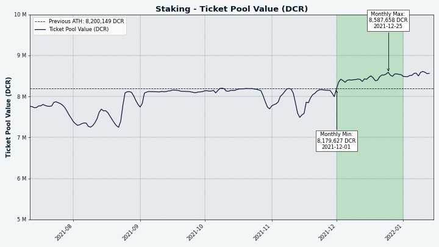
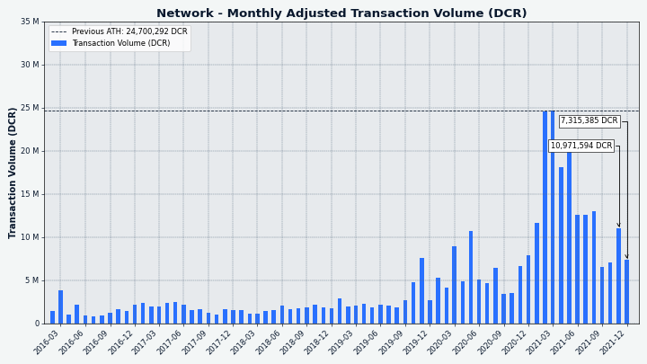
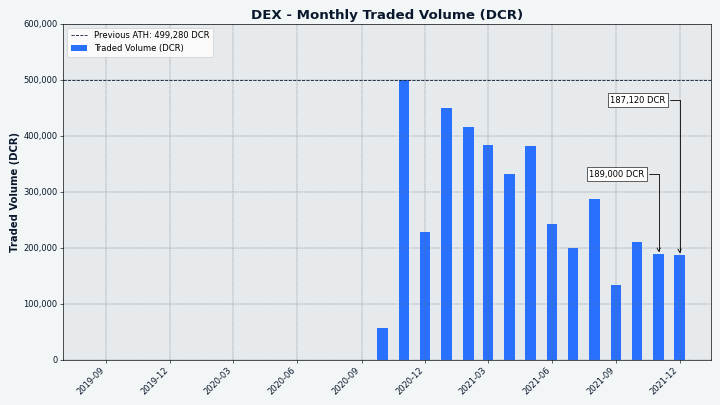

# مجلة ديكريد لشهر ديسمبر 2021

_الصورة: Nodetropolis بواسطة @saender_

أبرز أحداث شهر ديسمبر:

* تمت الموافقة على الدفعة الأولى من ديكريد للمتعاقدين من الخزينة الجديدة بتصويت لامركزي وتم إرسالها.
* تم الانتهاء من أعمال التطوير الخاصة بتغيير الإجماع ل DCP-10. سيؤدي ذلك إلى تغيير تقسيم مكافأة إثبات العمل/إثبات الحصة من 60٪/30٪ إلى 10٪/80٪.
* تم نشر إصدار النسخة 1.3.1 لبوليتيا لإصلاح و صقل الأخطاء.
* تم تعيين سجلات مشاركة جديدة في أنظمة التصويت على المقترحات، و التحصيص، و الخلط.
* تم فتح أول مرشحين للإصدار 1.7 للاختبار في أوائل يناير.
* تم نشر اقتراح لتمويل المرحلة الثالثة من تطوير DCRDEX في أوائل يناير.

المحتويات:

* [النسخة 1.7 لاختبار الإصدار](#النسخة-1.7-لاختبار-الإصدار)
* [التصويت على إنفاق الخزينة](#التصويت-على-إنفاق-الخزينة)
* [التطوير](#التطوير)
* [الأشخاص](#الأشخاص)
* [الإدارة و الحوكمة](#الإدارة-و-الحوكمة)
* [الشبكة](#الشبكة)
* [النظام البيئي](#النظام-البيئي)
* [الانتشار](#الانتشار)
* [وسائل الإعلام](#وسائل-الإعلام)
* [الأسواق](#الأسواق)
* [الخارجية ذات الصلة](#الخارجية-ذات-الصلة)
* [مستقبل مجلة ديكريد](#مستقبل-مجلة-ديكريد)
* [حول](#حول)

## النسخة 1.7 لاختبار الإصدار

بناءَات مرشح الإصدار للنسخة القادمة 1.7 "Based Bison" [متاحة للاختبار](https://github.com/decred/decred-binaries/releases). تأكد من التحقق من التنزيلات قبل التشغيل. لمزيد من الأمن، يمكن استخدام [عملات شبكة الاختبار](https://devdocs.decred.org/environments/testnet/) للاختبار حتى يتم إصدار الإصدار النهائي.

كل المساعدة لجعل الإصدار النهائي خاليًا من الأخطاء ومصقولًا هو موضع تقدير كبير. الرجاء الإبلاغ عن أي مشكلات في غرفة الدردشة #support على [Matrix](https://chat.decred.org/#/room/#support:decred.org) أو [Discord](https://discord.com/channels/349993843728449537/350007452152102923) أو [Telegram](https://t.me/DecredSupport) أو مباشرةً في [مستودع الجيتهوب](https://github.com/decred) المناسب. صيد جيد!
    
## التصويت على إنفاق الخزينة

بدءًا من [الدفع](https://xaur.github.io/decred-news/journal/202112#governance) عن أعمال نوفمبر، سيتم سداد المدفوعات للمتعاقدين من الآن فصاعدًا من الخزينة الجديدة بعد عملية التصويت اللامركزية.

إذا كنت تستخدم أدوات سطر الأوامر للتصويت الفردي، فيرجى تعيين تفضيلاتك بالطريقة التالية:

    dcrctl --wallet settreasurypolicy "03f6e7041f1cf51ee10e0a01cd2b0385ce3cd9debaabb2296f7e9dee9329da946c" "yes or no"
    
يحدد هذا الأمر كيفية تصويت محفظتك لمعاملات إنفاق الخزينة ("tspends") الموقعة بواسطة هذا المفتاح. يمثل المفتاح `03f6e704...` الإدارة الحالية للخزينة ويضع الأمر ثقتك بها.

يمكنك التحقق من هذا المفتاح في [DCP-0006](https://github.com/decred/dcps/blob/master/dcp-0006/dcp-0006.mediawiki#chain-parameters) أو في [كود المصدر](https://github.com/decred/dcrd/blob/79f15b7f7269f3e139e1ce6ff7bf00d787a48a73/chaincfg/mainnetparams.go#L485). التصويت شبه آلي باستخدام هذا التكوين لمرة واحدة، ولكن من الممكن التصويت على معاملات الإنفاق الفردي عند الحاجة إلى مزيد من التحكم الدقيق.

في الوقت الحالي، لا يمكن التصويت على نفقات tspends إلا من قبل المصوتين الفرديين، أما بالنسبة لدعم مقدمي خدمة التصويت فهو في طور الإعداد للسماح لمستخدمي ديكريديتون بالمشاركة.

اقرأ عدد [مايو](https://xaur.github.io/decred-news/journal/202105#new-treasury-activated) حول كيفية عمل العملية وقسم [الحوكمة](https://xaur.github.io/decred-news/journal/202112#governance) حول كيفية تنفيذ أول إنفاق حقيقي في ديسمبر.

## التطوير

ما لم يُذكر خلاف ذلك، فإن العمل المَذْكُور هنا يشتمل على حالة “الدمج إلى الرئيسي”. وهذا يعني أن العمل قد تم استكماله ومراجعته ودمجه في كود المصدر الذي يمكن للمستخدمين المتقدمين بناءه وتشغيله، ولكنه ليس متاحًا بعد في ثنائيات الإصدار للمستخدمين العاديين.

<a id="dcrd" />

**[dcrd](https://github.com/decred/dcrd)**

_dcrd هو تطبيق عقدة كامل يعمل على تشغيل شبكة ديكريد نظير لنظير  حول العالم._

تم الانتهاء من أعمال التطوير للتغيير القادم لتقسيم الدعم "إثبات العمل/إثبات الحصة إلى 10/80"، بما في ذلك [تعريفات](https://github.com/decred/dcrd/pull/2847) جدول الأعمال، و[التصويت بالإجماع](https://github.com/decred/dcrd/pull/2848) مع قواعد الإجماع الجديدة و الإختبارات، ووثيقة [DCP-10](https://github.com/decred/dcps/pull/23) التي تحتوي على التفاصيل التقنية. وهناك علاوة صغيرة من هذا التغيير هي أنه سيزيد من حد العرض النظري من 20,999,999.99800912 إلى عرض أكثر إرضاءًا 21,000,000.00015952 DCR.

تم إطلاق الحزمة الأولية `primitives` الجديدة بوظائف [إثبات العمل](https://github.com/decred/dcrd/pull/2788) الأولية وحسابات جذور [شجرة ](https://github.com/decred/dcrd/pull/2826)Merkle ووظائف إنشاء أدلة [التضمين](https://github.com/decred/dcrd/pull/2827) والتحقق منها (جنبًا إلى جنب مع الاختبارات الكاملة والمعايير والمستندات). وتعتمد وظائف إثبات العمل الجديدة على حزمة `uint256` المحسّنة الجديدة وهي أسرع بكثير من تلك المستخدمة حاليًا. `primitives` هي [خطة](https://github.com/decred/dcrd/issues/2786) إعادة بناء ضخمة لجمع كود الإجماع الأساسي في مكان واحد.

التغييرات المدمجة الأخرى:

* تقديم المعلمة [`AssumeValid`](https://github.com/decred/dcrd/pull/2839) وخيار التكوين لتخطي بعض عمليات التحقق من الصحة قبل الكتلة المحددة (والتي يُفترض أنها صالحة). مقارنة باستخدام نقاط التحقق لنفس الغرض، يسمح `AssumeValid` بتخطي المزيد من أعمال التحقق من الصحة ويمنح مرونة أكبر لمشغلي العقدة والمطورين (للاختبار).
* إضافة طريقة [اشتقاق](https://github.com/decred/dcrd/pull/2845) مفتاح فرعي إضافية تتوافق تمامًا مع معيار [BIP-32](https://github.com/bitcoin/bips/blob/master/bip-0032.mediawiki)، ليتم استخدامها بواسطة DCRDEX. تختلف طريقة ديكريد الحالية عن المعيار لأسباب قديمة.

الصيانة وإعادة البناء والتنظيف:

* نقل حزمة uint256 من منطقة الإنشاء الداخلية وإصدارها كنسخة 1.0.0 من الوحدة النمطية [`math/uint256`](https://github.com/decred/dcrd/pull/2842) الجديدة. كانت الخطة الأصلية هي الاحتفاظ بها داخل الوحدة الأولية، لكن هذه الخطوة تسمح بإصدارها عاجلاً لخدمة المشاريع خارج ديكريد. يعكس الموقع الجديد أيضًا بشكل أفضل أنه حزمة للأغراض العامة، على عكس `primitives`، والتي ستركز على تفاصيل ديكريد.
* العمل الأولي لتجديد [حظر الأقران](https://github.com/decred/dcrd/pull/2554) وحظر تعقب النتائج في حزمة `banmanager`
* تم تغيير خادم RPC [لإرسال](https://github.com/decred/dcrd/pull/2835) المعاملات مباشرة الآن حيث لم تعد هناك حاجة إلى توصيلها عبر `netsync`
* تحديث تبعيات الوحدة للإصدار القادم

<a id="dcrwallet" />

**[dcrwallet](https://github.com/decred/dcrwallet)**

_dcrwallet هو خادم محفظة يستخدمه سطر الأوامر وتطبيقات المحفظة الرسومية._ 

* تمت إضافة معلمة اختيارية لتعيين [سياسة](https://github.com/decred/dcrwallet/pull/2053) تصويت الخزينة الخاصة بمفتاح الخزينة أو هاش التذكرة (سيتم استخدامها من قبل التحصيص بمزود خدمة التصويت)
* إرجاع معلومات أكثر فائدة من التحقق من صحة العنوان في طرق [gRPC](https://github.com/decred/dcrwallet/pull/2091) و [JSON-RPC](https://github.com/decred/dcrwallet/pull/2096)
* إضافة طريقة gRPC [لاستيراد](https://github.com/decred/dcrwallet/pull/2116) المفتاح العام الممتد
* إضافة طريقة gRPC لاستيراد [حسابات التصويت](https://github.com/decred/dcrwallet/pull/1945) المشتقة من بذرة مختلفة (يمكن استخدامها بواسطة التحصيص بواسطة Trezor و vspd)
* تم التحديث إلى وحدة [`cspp/v2`](https://github.com/decred/dcrwallet/pull/2111) التي تتضمن مفتاح إضافي للتبادل بعد الكمي
* إضافة خيار تكوين [للحد](https://github.com/decred/dcrwallet/pull/2107) من اتصالات خادم CSPP لكل مبلغ تغيير
* الإنتقال إلى حزمة [`stdscript`](https://github.com/decred/dcrwallet/pull/2108) الجديدة من dcrd
* إصلاح المشكلات المحتملة في عمليات [إعادة التنظيم](https://github.com/decred/dcrwallet/pull/2110) 1-العميقة في وضع التحقق من الدفع البسيط
* إصلاح [`listreceivedbyaccount`](https://github.com/decred/dcrwallet/pull/2119) بحسابات BIP-44 المستوردة

<a id="decrediton" /> 

**[Decrediton](https://github.com/decred/decrediton)**

_ديكريديتون هو تطبيق محفظة لسطح المكتب كامل الميزات مع ميزة التصويت مدمجة، وميزة الخلط ب StakeShuffle، والشبكة البرقية، والتداول على منصة المُبادلات اللامركزية DEX للديكريد، والمزيد. يتم تشغيلها مع سلسلة الكتل كاملة أو بدونها (وضع التحقق البسيط من الدفع SPV)._

مواجهة المستخدم:

* إضافة [عامل تصفية](https://github.com/decred/decrediton/pull/3609) حسب معرف المعاملة إلى عروض سجل المعاملات و سجل التذاكر
* تحديث وحدة [DCRDEX](https://github.com/decred/decrediton/pull/3608) لوضعها في ميزات الإصدار 0.4
* إضافة [دعم تجريبي للتحقق البسيط من الدفع](https://github.com/decred/decrediton/pull/3615) لمحافظ DCRDEX لديكريد
* تم إصلاح 3 مشكلات في العرض لمحافظ [المشاهدة فقط](https://github.com/decred/decrediton/pull/3607)
* إصلاح مشكلة تحديث [الشهادات](https://github.com/decred/decrediton/pull/3616) لبعض المحافظ القديمة

داخلي:

* إعادة استخدام بعض المكونات الإضافية من مكتبة pi-ui ([النص البارز](https://github.com/decred/decrediton/pull/3606)، [مرقم الصفحات](https://github.com/decred/decrediton/pull/3603)، [التبديل](https://github.com/decred/decrediton/pull/3604)، [الأزرار](https://github.com/decred/decrediton/pull/3610) والأيقونات)
* إدخال العديد من التحسينات الإنتاجية لأداة [المترجم](https://github.com/decred/decrediton/pull/3588)
* تحديث السلاسل [الإنجليزية](https://github.com/decred/decrediton/pull/3618) للترجمة وإزالة ملفات Transifex القديمة

التغييرات في مكتبة pi-ui (مشتركة بين ديكريديتون و بوليتيا):

* إضافة مكون أيقونة [قابل للنقر](https://github.com/decred/pi-ui/pull/405)
* إضافة أيقونات جديدة [لديكريديتون](https://github.com/decred/pi-ui/pull/406)
* تم تحديث مكون [التحديد](https://github.com/decred/pi-ui/pull/407) لمطابقة مواصفات التصميم الجديدة

إذا كنت ترغب في إضافة أو تحديث ترجمة ديكريديتون، فيرجى السؤال في غرفة الدردشة [#translations](https://chat.decred.org/#/room/#translations:decred.org).

<a id="politeia" />

**[بوليتيا](https://github.com/decred/politeia)**

_بوليتيا هي نظام المقترحات لديكريد. يتم استخدامها لطلب التمويل من خزينة ديكريد._

إصدار بوليتيا 1.3.1 لإصلاح الأخطاء وإصدار التنظيف مباشر على موقع [المقترحات](https://proposals.decred.org/) على الويب. تحقق من ملاحظات الإصدار في مستودعات [politeia](https://github.com/decred/politeia/releases/tag/v1.3.1) و [politeiagui](https://github.com/decred/politeiagui/releases/tag/v1.3.1) للحصول على تفاصيل التغييرات.

التغييرات التي تواجه المستخدمين التي تم دمجها في ديسمبر:

* تمت إزالة [زر رابط](https://github.com/decred/politeiagui/pull/2678) Markdown من شريط أدوات المحرر لمنع أخطاء المستخدم
* إصلاح فقدان مقترح منشور و [التواريخ](https://github.com/decred/politeiagui/pull/2680) المحررة
* إصلاح تنزيل [الطوابع الزمنية](https://github.com/decred/politeiagui/pull/2685) للتصويت
* إصلاح قائمة المستخدم [للمحاذاة](https://github.com/decred/politeiagui/pull/2682)
* إصلاح [التحميل](https://github.com/decred/politeiagui/pull/2674) اللانهائي على القائمة المعتمدة من قبل المشرف

تغييرات واجهة المستخدم الرسومية الداخلية:

* إضافة البيانات التي تحاكي [إنشاء](https://github.com/decred/politeiagui/pull/2676) المقترحات وتدفق [التحرير](https://github.com/decred/politeiagui/pull/2692)، لتمكين اختبار واجهة المستخدم الآلي دون الاتصال بخلفية

تطبيق سطر أوامر politeiavoter:

* تحسين الإبلاغ عن الأخطاء ["تم التصويت بالفعل"](https://github.com/decred/politeia/pull/1594)
* [تحسين تجربة المستخدم](https://github.com/decred/politeia/pull/1601)  لإعدادات `—hoursprior` و `—voteduration`
* إصلاح [إيقاف](https://github.com/decred/politeia/pull/1592) العملية باستخدام Ctrl-C

تغييرات الخلفية:

* السماح باسترداد جميع [تعليقات الأصوات](https://github.com/decred/politeia/pull/1598) دون تحديد عامل تصفية معرف المستخدم (تم طلب ذلك لتحليل عملية الاقتراح بشكل أفضل)
* إضافة [ذاكرة تخزين مؤقت](https://github.com/decred/politeia/pull/1586) لحالة الاقتراح لتسريع تحميل المقترحات المعتمدة
* تنفيذ مجموعة القراءَات [المتزامنة](https://github.com/decred/politeia/pull/1584) لتحسين الأداء
* تم تحويل [أحجام صفحات](https://github.com/decred/politeia/pull/1604) المسار إلى إعدادات البرنامج المساعد لإزالة التكرار وجعلها قابلة للتكوين بسهولة بواسطة مشرف النظام
* ضمان [الترتيب](https://github.com/decred/politeia/pull/1607) المتسق للسجلات المعادة
* إخبار العملاء إذا كان مسموحًا بالتعليقات ببيانات إضافية في [سياسة](https://github.com/decred/politeia/pull/1602) الاستجابة
* إصلاح معالجة لأكثر من 32,767 صوتًا عن طريق تحميل السجلات في استعلامات SELECT [المتعددة](https://github.com/decred/politeia/pull/1605)

<a id="dcrlnd" /> 

**[dcrlnd](https://github.com/decred/dcrlnd)**

_dcrlnd هو برنامج عقدة الشبكة البرقية لديكريد. تتيح الشبكة البرقية المعاملات الفورية ومنخفضة التكلفة._

*  تحديث لأحدث [وحدات](https://github.com/decred/dcrlnd/pull/151) ديكريد

<a id="cspp" />

**[cspp](https://github.com/decred/cspp)**

cspp_ هو خادم لتنسيق عمليات خلط العملات باستخدام بروتوكول CoinShuffle++. إنه غير إحتجازي، أي لا يحتفظ بأي أموال._

* تم تنفيذ تبادل مفاتيح ما [بعد الكم](https://github.com/decred/cspp/pull/73) بناءً على [NTRU Prime](https://ntruprime.cr.yp.to/index.html) 4591^761 المبسط. يحدث تبادل المفاتيح هذا بالإضافة إلى تبادل المفاتيح x25519 كما في السابق ، بحيث إذا تم اكتشاف ضعف في [sntrup4591761](https://github.com/companyzero/sntrup4591761)، فلن يقل الأمان إلى أي شيء أسوأ من x25519 فقط.
* إضافة [علامات](https://github.com/decred/cspp/pull/76) إلى رسائل تبادل المفاتيح الموقعة لمنع تزوير التوقيع
* التحقق من جميع الرسائل الموقعة بحثًا عن [توقيعات](https://github.com/decred/cspp/pull/78) صالحة (تدقيق الكود في المستقبل إذا كان سيتم استخدامه كجزء من بروتوكول التنسيق اللامركزي)

<a id="dcrdex" />

**[DCRDEX](https://github.com/decred/dcrdex)**

_DCRDEX هي منصة تبادلات غير إحتجازية للتداول وغير مركزية، مدعومة بالمقايضات الذرية._

تم وضع علامة على مرشحي الإصدار الأولية للإصدار القادم الضخم 0.4. يمكن للمستخدمين المتقدمين التحقق من فرع [`release-v0.4`](https://github.com/decred/dcrdex/tree/release-v0.4) وقراءة [ملاحظات الإصدار](https://github.com/decred/dcrdex/blob/release-v0.4/docs/release-notes/release-notes-0.4.0.md) مع إرشادات التحديث، أو تجربة DCRDEX المدمجة في [الإصدارات المرشحة](https://github.com/decred/decred-binaries/releases) لديكريديتون.

تغييرات مواجهة المستخدم التي تم دمجها في ديسمبر:

* إصلاح [حجم](https://github.com/decred/dcrdex/pull/1368) مخططات العمق والشموع
* تغيير طريقة [اشتقاق](https://github.com/decred/dcrdex/pull/1341) المفاتيح من التطبيق الأولي لاستخدام BIP-32 الصارم (للتوافق مع المزيد من المحافظ)
* إضافة تطبيق سطر أوامر [`assetseed`](https://github.com/decred/dcrdex/pull/1324) الذي يأخذ بذرة تطبيق DEX ويشتق بذرة المحفظة + زوج كلمة مرور لأصل معين. قد يكون الأخير قابلاً للاستخدام في بعض برامج المحفظة للوصول إلى الأموال خارج تطبيقات DEX (مثل btcwallet).
* [عدم السماح](https://github.com/decred/dcrdex/pull/1367) بمحافظ وصف Bitcoin Core الجديدة حتى تدعم طريقة تصدير المفتاح المطلوبة

التغييرات الداخلية:

* الانتقال إلى حزمة [`stdscript`](https://github.com/decred/dcrdex/pull/1308) الجديدة لـ dcrd
* تحديثات [التبعية](https://github.com/decred/dcrdex/pull/1354) النهائية استعدادًا لإصدار النسخة 0.4
* تم [النقل الخلفي](https://github.com/decred/dcrdex/pull/1338) للعديد من الإصلاحات إلى فرع الإصدار 0.2 نظرًا لأن كلا الإصدارين 0.3 والإصدار 0.4 يعتمدان على الإصدار غير المطروح 1.7 من dcrd و dcrwallet

التقدم نحو دعم الإيثيريوم:

* تنفيذ ~8 [طرق](https://github.com/decred/dcrdex/issues/1154) أساسية أخرى من قائمة مراجعة طويلة مكونة من 27 عنصرًا. على طول الطريق، يتم إعادة هيكلة قاعدة الكود باستمرار لدعم الأصول المستندة إلى الحساب مثل الإيثيريوم (تم إنشاء DCRDEX في الأصل للعملات القائمة على مخرجات المعاملات الغير المنفقة).
* إضافة التحقق من [صحة التمويل](https://github.com/decred/dcrdex/pull/1293) للأصول القائمة على الحساب
* التعامل مع [إصدارات](https://github.com/decred/dcrdex/pull/1339) مختلفة من عقد المقايضة
* إضافة [أسباب](https://github.com/decred/dcrdex/pull/1362) الفشل إلى عقد المقايضة
* إضافة خيار تكوين المحفظة [لحد رسوم](https://github.com/decred/dcrdex/pull/1344) الغاز
* الاستقرار على تعريف أبسط لـ ["معرف العملة"](https://github.com/decred/dcrdex/pull/1326) لـلإيثيريوم
* تبسيط الكشف عن عمليات [إعادة التنظيم](https://github.com/decred/dcrdex/pull/1322) وإضافة برنامج نصي لاختبارها
* إصلاح حساب [رصيد](https://github.com/decred/dcrdex/pull/1321) العميل
* [مواكبة](https://github.com/decred/dcrdex/pull/1309#issuecomment-977380539) التفرعات الصلبة  للإيثريوم وكسر التغييرات في toolchain

تحقق من [مقترح](https://proposals.decred.org/record/3326c82)  التطوير الجديد للحصول على تقرير عن المرحلة 2 وخارطة الطريق للمرحلة 3.

<a id="dcrios" />

**[محفظة ديكريد (iOS)](https://github.com/planetdecred/dcrios)**

* السماح للمستخدم [بإخفاء رصيد المحفظة](https://github.com/planetdecred/dcrios/pull/873) لتحسين الخصوصية
* إخطار المستخدم عندما تكون [مساحة التخزين](https://github.com/planetdecred/dcrios/pull/881) منخفضة
* الإستخدام المستمر لمصطلح ["كلمات البذرة"](https://github.com/planetdecred/dcrios/pull/878)

<a id="godcr" />

**[GoDCR](https://github.com/planetdecred/godcr)**

_GoDCR هو تطبيق محفظة سطح المكتب خفيف الوزن مع تحصيص مدمج والخصوصية وتصفح بوليتيا._

*  تنفيذ الخطوات [الأولية](https://github.com/planetdecred/godcr/pull/676) لتدفق DEX (إنشاء كلمة مرور التطبيق، دفع رسوم التسجيل، تحديد خادم DEX)
*  إضافة خيارات لإيقاف إشعارات [بوليتيا](https://github.com/planetdecred/godcr/pull/721) و[المعاملات](https://github.com/planetdecred/godcr/pull/736) 
*  جعل من الصعب الإرسال بطريق الخطأ من الحساب [غير المخلوط](https://github.com/planetdecred/godcr/pull/712) (قد يؤدي ذلك إلى التراجع عن مكاسب الخصوصية الناتجة عن الخلط)
*  ~17 إصلاحًا للأخطاء

تم الدمج في مكتبة [dcrlibwallet](https://github.com/planetdecred/dcrlibwallet) (مشتركة بواسطة محافظ Android/iOS و GoDCR):

* تحديث [تبعيات](https://github.com/planetdecred/dcrlibwallet/pull/214) DCRDEX المحدثة لضمها إلى دعم محفظة التحقق من الدفع البسيط ديكريد الجديدة
* إضافة ميزات عميل DEX إلى مدير [MultiWallet](https://github.com/planetdecred/dcrlibwallet/pull/212)

يمكن تتبع التقدم نحو إصدار النسخة 1.0 [هنا](https://github.com/planetdecred/godcr/milestone/2).

<a id="dcrdata" />

**[dcrdata](https://github.com/decred/dcrdata)**

_dcrdata هو مستكشف لبيانات سلسلة كتل ديكريد و البيانات خارج السلسلة مثل مقترحات بوليتيا والأسواق والمزيد._

* إزالة [فهرس](https://github.com/decred/dcrdata/pull/1845) قاعدة بيانات زائد عن الحاجة
* فرض الحد الأدنى من [الإصدار](https://github.com/decred/dcrdata/pull/1880) المطلوب من PostgreSQL
* تحديث التبعيات: [npm](https://github.com/decred/dcrdata/pull/1881)، و [النسخة 0.4 لمنصة المبادلات اللامركزية لديكريد](https://github.com/decred/dcrdata/pull/1878)، و حزمة [`stdscript`](https://github.com/decred/dcrdata/pull/1879) ل dcrd

مسائل أخرى:

* نشر برنامج مكافأة إيجاد العلة [تحديثًا](https://bounty.decred.org/2021/12/status-update/) للحالة: تمت معالجة 209 عملية تقديم طوال الوقت وكانت 19 عملية تقديم منها مؤهلة للحصول على تعويضات. سيتم الكشف عن تقديم واحد ثانوي بمجرد تحديث عدد كافٍ من المستخدمين إلى الإصدار 1.7 القادم.
* نشر@fst\_nml تحديثًا [للتقدم](https://twitter.com/fst_nml/status/1474951827812585472) في إدماج ديكريد+THORChain مع أول مقايضات DCR ناجحة مقابل BCH و RUNE على privatenet. يوجد [سجل تطوير](https://github.com/alexdcox/thorchain-decred-work-log) مفصل للعمل والتحديات.

## الأشخاص

إحصائيات المجتمع اعتبارًا من 2 يناير:

* متابعو [التويتر](https://twitter.com/decredproject): 50,916 (+800)
* المشتركين في [ريديت](https://www.reddit.com/r/decred/): 12,488 (+82)
* مستخدمي غرفة الدردشة general# على [الماتريكس](https://chat.decred.org/): 599 (+14)
* مستخدمي [الديسكورد](https://discord.gg/GJ2GXfz): 2,175 (-48)
* مستخدمي [التيليجرام](https://t.me/Decred): 3,160 (+130)
* المشتركين في [اليوتيوب](https://www.youtube.com/decredchannel): 4,640 (+20)، المشاهدات: 200 ألف (بزيادة ألفان)

## الإدارة و الحوكمة

في ديسمبر، تلقت [الخزينة](https://dcrdata.decred.org/treasury) الجديدة 10,252 بقيمة 816 ألف دولار بمتوسط سعر ديسمبر البالغ 79.59 دولارًا. تم إنفاق  1,006 DCR  للدفع للمتعاقدين، بقيمة 80 ألف دولار أمريكي بسعر ديسمبر، أو 109 ألف دولار أمريكي بمعدل فوترة نوفمبر البالغ 108.13 دولارًا أمريكيًا. واعتبارًا من 6 يناير، بلغ الرصيد المشترك للخزينة [القديمة](https://dcrdata.decred.org/address/Dcur2mcGjmENx4DhNqDctW5wJCVyT3Qeqkx) و[الجديدة](https://dcrdata.decred.org/treasury) 753,934 DCR (47.8 مليون دولار أمريكي بسعر 63.37 دولارًا أمريكيًا).

تمت الموافقة على أول إنفاق لـديكريد من الخزينة الجديدة بتصويت لامركزي!

في 18 ديسمبر، تم بث [المعاملة](https://dcrdata.decred.org/tx/f57f2f35abcfc58cb8d45da6315982610203c1335ee0d68b36240f22c24a557a) التي تدفع 1,006 DCR للمتعاقدين إلى الشبكة جنبًا إلى جنب مع [إعلان](https://twitter.com.com/decredproject/status/1472050886830702597) مع تعليمات حول كيفية التصويت والتحقق من مفتاح الخزانة. بدأ التصويت في أواخر 18 ديسمبر وانتهى في 28 ديسمبر عندما تم تعدين المعاملة في الكتلة [619,776](https://dcrdata.decred.org/block/619776). من أصل 17,280 تذكرة مؤهلة كحد أقصى، صوتت 6,269 بـ "نعم" و "0" صوتت بـ "لا" بحلول 28 ديسمبر، مما أدى إلى عدد لا يمكن التغلب عليه من الأصوات ب "نعم" وأطلق نظام "الاِخْتصار" لإنهاء التصويت قبل يومين من الحد الأقصى لمدة 12 يومًا. سمحت هذه الخوارزمية باتخاذ القرار بشكل أسرع والدفع للمتعاقدين في وقت سابق.

في يونيو، فشلت المحاولة الأولى للدفع من الخزينة الجديدة بسبب [خطأ](https://xaur.github.io/decred-news/journal/202106#new-treasury-bug) جعل نظام الأمن عدوانيًا للغاية ويمنع الدفع. كان هذا التصويت لا يزال ملحوظًا [لإظهار](https://xaur.github.io/decred-news/journal/202106#governance) مشاركة رائعة في التذاكر بنسبة 69٪ ودعمًا بنسبة 100٪. منذ ذلك الحين تم الدفع للمتعاقدين من الخزينة القديمة، ولكن في الآونة الأخيرة انتهى الحد غير المرغوب فيه البالغ 0.15 DCR وسمح بالبدء في سداد مدفوعات كاملة من الخزينة الجديدة. تم [تطوير](https://github.com/decred/dcps/blob/master/dcp-0007/dcp-0007.mediawiki) تغيير الإجماع لتصحيح السلوك ومنع هذا السيناريو في المستقبل، وسيبدأ التصويت لتفعيله عندما يقوم عدد كاف من المستخدمين بالتحديث إلى الإصدار القادم 1.7.

في بوليتيا، أدى التصويت على [اقتراح](https://proposals.decred.org/record/427e1d4) تغيير مكافأة الكتلة إلى كشف خطأ منع احتساب بعض الأصوات المتأخرة. بدأ في 9 ديسمبر 18:36 بالتوقيت العالمي عندما تجاوز أعلى معدل مشاركة للناخبين 32,767 صوتًا (78٪ من جميع التذاكر المؤهلة) ووصل إلى حد داخلي غير مقصود. في الـ 25 ساعة المتبقية من التصويت، لم يكن العملاء قادرين على الإدلاء بأصواتهم أو بدء عمليات تصويت جديدة مع politeiavoter (لا يزال من الممكن استمرار عملية التصويت التي بدأت قبل آخر 25 ساعة تقريبًا). الأهم من ذلك، أن الخطأ لم يكن من الممكن أن يغير نتيجة التصويت، فعلى سبيل المثال حتى لو صوتت 8,752 تذكرة مؤهلة متبقية جميعها بلا، فلا يزال عليها أن تمر بنسبة 79٪ بنعم. تم تضمين الإصلاح ونشره مع الإصدار 1.3.1، انظر [#1605](https://github.com/decred/politeia/pull/1605) للحصول على التفاصيل التقنية. هذا الخطأ يتعلق فقط بتصويت بوليتيا، فإنه لا يؤثر على تصويت الإجماع الذي سيتم تشغيله من خلال إصدار النسخة 1.7.0.

نشاط الاقتراح في ديسمبر:

* تمت [الموافقة](https://proposals.decred.org/record/427e1d4) على اقتراح تغيير توزيع مكافآت الكتلة بواسطة تصويت بوليتيا بنسبة موافقة بلغت 91.7٪  و نسبة مشاركة بلغت 79٪. وقد جمع أيضًا سجلًا من 166 تعليقًا.
* تم تقديم [اقتراح](https://proposals.decred.org/record/1a290d8) لمزيد من التمويل لبوت التويتر [@StakeShuffle_](https://twitter.com/StakeShuffle_). سيغطي المبلغ المطلوب البالغ 1,684 دولارا العمل المنجز لتحسين الروبوت والاستضافة لعام 2022.

راجع [العدد ](https://blockcommons.red/politeia-digest/issue050/)50 من موجز بوليتيا للحصول على مزيد من التفاصيل حول مقترحات الشهر.

## الشبكة

**معدل الهاش**: افتتحت [معدلات الهاش](https://dcrdata.decred.org/charts?chart=hashrate&zoom=kwlns8ia-kxwxs928&scale=linear&bin=block&axis=time) لشهر ديسمبر عند ~430 Ph/s وأغلقت عند ~380 Ph/s، وبلغ قاعها عند 247 Ph/s كما بلغت ذروتها عند 535 Ph/s على مدار الشهر.

توزيع معدل الهاش الذي [تم الإبلاغ عنه](https://miningpoolstats.stream/decred) بواسطة المجمعات في 2 يناير: Poolin بنسبة 47%، و AntPool بنسبة 26%، و F2Pool بنسبة 10%، و ViaBTC بنسبة 7%، و Luxor بنسبة 6%، و BTC.com بنسبة 3%، و OKEx بنسبة 0.3%، و CoinMine بنسبة 0.1%. يتطابق توزيع 1,000 كتلة تم [تعدينها](https://miningpoolstats.stream/decred) بالفعل قبل 2 يناير بشكل وثيق مع الأرقام المبلغ عنها.

**التحصيص**: تراوح [سعر التذكرة](https://dcrdata.decred.org/charts?chart=ticket-price&zoom=kwlns8ia-kxwxs928&axis=time&visibility=true-true&mode=stepped) بين 191.9-233.3 DCR، [بمتوسط](https://dcrstats.com/)  214.7 DCR (+11.1) خلال 30 يوما.

بلغ [المبلغ المقفل](https://dcrdata.decred.org/charts?chart=ticket-pool-value&zoom=kwlns8ia-kxwxs928&scale=linear&bin=block&axis=time) 8.07-8.60 مليون DCR، مما يعني أن 59.2-62.7% من العرض المتاح [شارك](https://dcrdata.decred.org/charts?chart=stake-participation&zoom=kwlns8ia-kxwxs928&scale=linear&bin=block&axis=time) في إثبات الحصة.

_ما تم تحصيصه... لا يمكن عدم تحصيصه_

**مقدم خدمة التصويت**: في 2 يناير، تمت إدارة ما يقارب 6,550  تذاكر حية (-250) بواسطة خوادم vspd [المدرجة](https://decred.org/vsp/) و ما يقارب 171 (-28) بواسطة خوادم dcrstakepool القديمة المدرجة.  إجمالا، تمكن 7 من مقدمي خدمات التصويت القديمة و 15 من مقدمي خدمات التصويت الجديدة من إدارة 16.7% (-0.8%) من مجمع التذاكر. تمكن ثلاثة مزودي خدمة التصويت القديمة غير المدرجة ولكن ما زالوا نشطين من إدارة 39 (-6) تذكرة حية.

يتجه عدد التذاكر التي يديرها مقدمو خدمة التصويت إلى الانخفاض منذ يونيو 2021 على الأقل عندما بدأت هذه المتابعة عند حوالي 9,300 تذكرة (22.7٪ من مجموع التذاكر).

**العقد**: طوال شهر ديسمبر، كان هناك حوالي 180 عقدة يمكن الوصول إليها وفقًا لـ [dcrextdata](https://dcrextdata.planetdecred.org/nodes).    
    
إصدارات العقد اعتبارًا من [لقطة](https://nodes.jholdstock.uk/user_agents) 1 يناير (إجمالي 216، dcrd فقط): النسخة 1.6.2 - 62%، النسخة 1.7 لبناءَات التطوير - 13%، النسخة 1.6.0 - 10%، النسخة 1.6.1 - 8%، النسخة 1.6 لبناءَات التطوير - 3%، النسخة 1.5.2 - 2.3%، النسخة 1.5.1 - 1.4%.

تراوحت حصة [العملات المخلوطة](https://dcrdata.decred.org/charts?chart=coin-supply&zoom=jz3q3lq8-l0s732o6&scale=linear&bin=day&axis=time&visibility=true-true-true) بين 54.4-56.9٪ وحققت أعلى مستوى جديد على الإطلاق حيث تجاوز مجموع العملات المخلوطة غير المنفقة 7.8 مليون.

شهد عام 2021 أعلى حجم للمعاملات:

## النظام البيئي

غردت [Bybit](https://www.bybit.com/) أن تداول DCR/USDT مباشر. يقع مقر منصة المبادلات في سنغافورة.    
    
[أعلنت](https://www.reddit.com/r/decred/comments/rhp4p0/decred_mining_pools_and_network_charts/) PoolBay عن [لوحة معلومات](https://poolbay.io/crypto/54/decred) ومخططات جديدة لمجمع التعدين لديكريد، كبديل لـ [MiningPoolStats](https://miningpoolstats.stream/decred).

تحذير: ليس لدى مؤلفي مجلة ديكريد أي فكرة عن مصداقية أي من الخدمات المذكورة أعلاه. يرجى إجراء البحث الخاص بك قبل الوثوق بمعلوماتك الشخصية أو أصولك لأي كيان.

## الإنتشار

يتم الآن نشر الإعلانات ديكريد أيضًا على [Odysee](https://odysee.com/@Decred:c)، بالإضافة إلى جميع محتويات الفيديو المنعكسة من اليوتيوب. يمكن لمستخدمي Odysee أو شبكة [LBRY](https://lbry.com) دعم محتوى ديكريد عن طريق إعطاء بقشيش أو تحصيص LBC (يمكن سحب العملات المحصصة في أي وقت).

تم إلغاء تفعيل جسر الدردشة بين غرفتي التيليجرام و الماتريكس ل  #101 ل [@Decred](https://t.me/Decred) بسبب وجود كمية كبيرة من البريد العشوائي. تمت إزالة البريد العشوائي تلقائيًا بواسطة روبوتات الإشراف على جانب التيليجرام ولكن كان لا بد من تنظيفها يدويًا في غرفة الماتريكس. لا يزال الجسر بين غرف الماتريكس و Discord #101 موجودًا.

ظهر اقتراح تغيير مكافأة الكتلة الذي نوقش بشدة على [Hacker News](https://news.ycombinator.com/item?id=29530099).

إنجازات Monde PR لشهر ديسمبر:

* عرضت قصتين/فرص للعلاقات العامة على منشورات المالية و العملات الرقمية

قامت بتأمين المقالات الإخبارية التالية:

* تم ذكر ديكريد كأفضل عملة رقمية في [CoinDesk](https://www.coindesk.com/business/2021/12/01/shiba-inu-memes-are-the-future-of-money/). تم نشر المقال على [Nasdaq](https://www.nasdaq.com/articles/shiba-inu%3A-memes-are-the-future-of-money) و [Yahoo!](https://finance.yahoo.com/news/shiba-inu-memes-future-money-171404107.html).
* مقال في [Finder.com](https://www.finder.com/ke/ripple-xrp-price-prediction) يعرض تعليقًا من @jz على الريبل

## وسائل الإعلام

مقالات مختارة:

* الحلقة 45 من ديكريد في العمق مع جيك يوكوم بيات تغيير تقسيم دعم إثبات العمل/إثبات الحصة بواسطة @elima\_iii على ([YouTube](https://www.youtube.com/watch?v=dPDak2o9VSk))
* تحليل سعر ديكريد - 17 ديسمبر 2021 بواسطة Brave New Coin ([YouTube](https://www.youtube.com/watch?v=B_KGCBiabEI))
* مقالة في [Finder.com](https://www.finder.com/ke/ripple-xrp-price-prediction) يعرض تعليقًا من @jz على الريبل
* مقالة في [Geek Culture](https://medium.com/geekculture/which-two-altcoins-could-overtake-ethereum-in-the-ongoing-bull-run-84316d955cc0) يعرض تعليقًا من @jz على الإيثيريوم. تم نشر المقال أيضًا في خدمة [Concierge](https://coincierge.de/2021/top-investor-sicher-diese-zwei-altcoins-werden-ethereum-im-laufenden-bull-run-noch-ueberholen/).
    
الترجمة:

* تمت [ترجمة](https://xaur.github.io/decred-news/) مجلة ديكريد لشهر نوفمبر 2021 إلى العربية (arij@ و abdulrahman4@) والصينية (Dominic@). شكرا لكم جميعا!

## الأسواق

في ديسمبر، تم تداول DCR بين 60.05 و 110.95 دولارًا أمريكيًا مقابل BTC 0.00129-0.00234. وكان متوسط السعر اليومي 79.59 دولارًا.

## الخارجية ذات الصلة

إن Sushiswap AMM DEX هو موضوع [فضيحة](https://rekt.news/sushiswap-scandal/) بعد أن تبين أن 0xMaki قد أُجبرت على التخلي عن دورها من قبل مجموعة من كبار المطورين وأن الفريق ممزق بسبب الصراع الداخلي.

كانت BadgerDAO موضوع [اختراق](https://badger.com/technical-post-mortem) يتضمن مفتاح Cloudflare API تم اختراقه، والذي تم استخدامه لحقن كود خبيث لمجموعة فرعية من مستخدمي الموقع، مما أدى إلى خسارة 130 مليون دولار من الأصول، مع استرداد 9 ملايين دولار حتى الآن و[نداء](https://www.vice.com/en/article/v7dv4a/hacked-cryptocurrency-platform-begs-hacker-to-please-return-dollar119-million) ليتم إرجاع المزيد من قبل الهاكر. لم تتم إعادة الأموال، وانتقل مجتمع BadgerDAO إلى تحديد طريقة [لتعويض](https://www.coindesk.com/tech/2021/12/16/after-130m-hack-badgers-restitution-plan-tests-limits-of-dao-governance/) ضحايا الاختراق. هناك ديناميكية مثيرة للاهتمام تعمل هنا حيث تنقسم الأموال المسروقة إلى ثلاث شرائح بآليات علاج مختلفة - وكان أكبر 10 حاملي التوكنات هم الأكثر تضررًا، مما يمثل خسارة لا تستطيع الخزينة تغطيتها بالأموال المتاحة. إحدى الضحايا الرئيسية لاختراق BadgerDAO كانت شبكة Celsius، التي [قيل](https://cryptopotato.com/celsius-network-reportedly-lost-50-million-in-the-120-million-badgerdao-hack/) إنها خسرت 50 مليون دولار.

أصبح مستخدمو منصة تداول NFT الشهيرة OpenSea مؤهلين للمطالبة [بتوكن](https://decrypt.co/89325/sos-token-aidrop-opendao-opensea-what-you-need-to-know-explainer) جديد (SOS) في 24 ديسمبر، وبحلول 26 ديسمبر، طالبت به أكثر من 200,000 محفظة. لم يتم إنتاج التوكن من قبل OpenSea أنفسهم، الذين ألمحوا بدلاً من ذلك إلى الاكتتاب العام الأولي، ولكن تم إصداره بواسطة مطور باسم مستعار، باستخدام السجل العام لتداولات OpenSea NFT لتحديد الأهلية للمطالبة بـ SOS. بلغت القيمة السوقية لـ SOS 200 مليون دولار في غضون يومين، حيث تم تمرير الأصوات الأولية لإنشاء حوافز توفير السيولة وتفاصيل توزيع توكنات أخرى. تتضمن خطط إصدار SOS حجز 20٪ لتقديم الدعم لمستخدمي OpenSea، وخاصة ضحايا الاختراق.

تحرك مدققي EOS [لمنع](https://www.theblockcrypto.com/post/126801/eos-community-halts-payments-worth-250-million-in-eos-to-block-one-and-brock-pierce) دفع مبلغ 250 مليون دولار من EOS إلى Block.one. كان من المقرر أن تحصل Block.one على 67 مليون EOS خلال فترة 6-7 سنوات، مع ذهاب نصف هذه التوكنات إلى Brock Pierce. يأتي هذا كجزء من نزاع مستمر حول الملكية الفكرية لـ EOS ، والتي يرغب مجتمع المدققين في الحصول عليها ولكن تحتفظ بها حاليًا منصة المبادلات Bullish (الأسباب غير واضحة).

قامت منصة تمويل السلع العامة Gitcoin [بإلغاء تنشيط](https://twitter.com/gitcoin/status/1469046914226307127) منحة لأحد الفرق المستفيدة لأن الفريق أجرى بعض الأنشطة في إيران وتم إلغاء تمويله مؤخرًا من قبل Consensys. كما [أكملت](https://twitter.com/gitcoin/status/1471635072952389632) Gitcoin أيضًا الجولة 12 من برنامج المنح، والتي شهدت تبرعًا بقيمة 3.1 مليون دولار من 27.2 ألف متبرع.

عقد "The Internet Computer" جولة [تصويت](https://medium.com/dfinity/the-internet-computers-long-term-r-d-plans-motion-proposals-guide-dce6fdcd697d) رئيسية للموافقة على الاتجاه المستقبلي لأعمال البحث والتطوير، مع 25 اقتراحًا مختلفًا للتصويت عليها وامتناع مؤسسة DFINITY عن التصويت. كانت فترة التصويت على هذه المقترحات 24 ساعة فقط وتمت الموافقة على جميع المقترحات الـ 25 بموافقة 5-6٪ (الحد الأدنى لمتطلبات التصويت بنعم هو 3٪) وقليل جدًا من المعارضة.

هذا كل شيء لشهر ديسمبر. شكرا للقراءة!

## مستقبل مجلة ديكريد  
    
> 45 شهرًا من مجلة ديكريد كانت رحلة رائعة، لكن الأعداد الأخيرة كانت تزداد صعوبة بسبب قلة الوقت والطاقة. أخطط للتوقف عن إنتاج مجلة ديكريد بعد هذا العدد، والاستراحة، والقيام بأشياء أخرى كنت أرغب في القيام بها في ديكريد وغيرها.
> 
> سأكون متواجدًا في الدردشات لمساعدة أي شخص يرغب في تولي إنتاج مجلة ديكريد، إما كما يبدو اليوم، أو بشكل محدث لجعله أفضل.
> 
> شكراً لجميع المساهمين والمترجمين والأهم من ذلك القراء على هذه الرحلة الرائعة! (@bee)

## عن هذا العدد

هذا هو العدد 45 من مجلة صحيفة ديكريد. فهرس جميع الإصدارات والمرايا والترجمات متاح [هنا](https://xaur.github.io/decred-news/).

يتم نقل معظم المعلومات الواردة من أطراف ثالثة مباشرة من المصدر بعد التحقق من الحد الأدنى لصحتها. ليس لدى مؤلفي مجلة صحيفة الديكريد القدرة على التحقق من جميع الادعاءات.رجاء إحذر من أعمال الاحتيال وقم ببحثك الخاص.

الاعتمادات (بالترتيب الأبجدي):

* الكتابة والتحرير: bee و bochinchero و degeri و richardred و l1ndseymm
* المراجعات والتعليقات: davecgh و lukebp
صورة العنوان: saender
* التمويل: أصحاب حصص الديكريد
* النسخة الأصلية لمجلة الديكريد لشهر ديسمبر متوفرة على هذا الرابط [هنا](https://medium.com/decred/decred-journal-december-2021-376a27e7cc4e)
* تمت الترجمة إلى اللغة العربية بواسطة: arij@. قام بالمراجعة abdulrahman4@.

