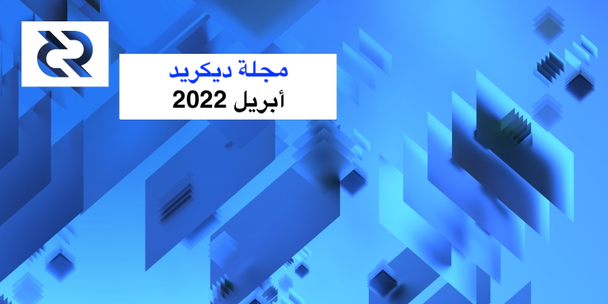
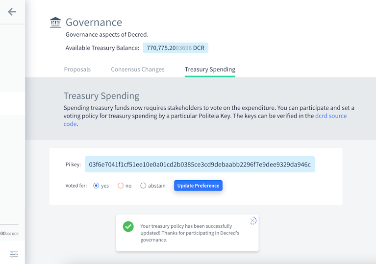
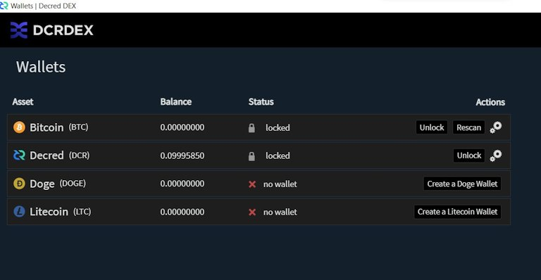
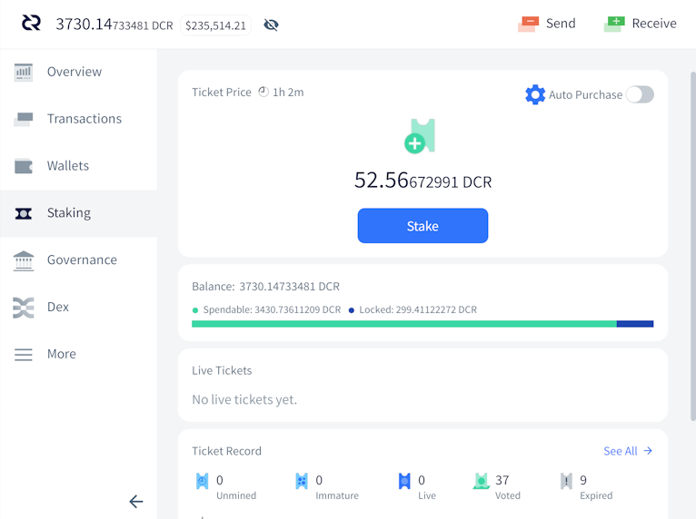
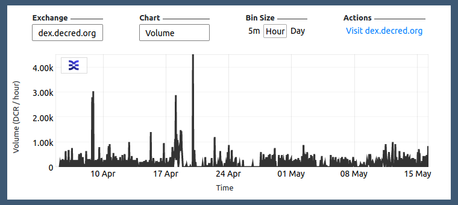

# مجلة ديكريد لشهر أبريل 2022

_الصورة: بنيات موضوعية بواسطة @saender_

عادت مجلة ديكريد! يغطي هذا العدد أخبار أبريل، مع استثناءَات قليلة.

أبرز الأحداث:
  
* تمت الموافقة على جميع التغييرات بالإجماع الأربعة DCP0007-DCP0010 من خلال تصويت أصحاب الحصص بدعم إجماعي (~99.7%) في أبريل، وتم تفعيلها جميعًا في 8 مايو، لذا فإن أي عقد تعمل بإصدارات قديمة سيتم فصلها عن الشبكة.
* في مارس، تم تحويل غالبية الأموال الموجودة في عنوان الخزينة القديمة، أكثر من 610.000 DCR، إلى الخزينة الجديدة التي تتطلب موافقة أصحاب الحصص على الإنفاق.
* تم إصدار النسخة 1.7.2 من برنامج ديكريد العقدة والمحفظة في 11 مايو، وهو يعمل على إصلاح بعض الأخطاء وإضافة ميزة التصويت على إنفاق الخزينة لمستخدمي ديكريديتون.
* حتى الآن في عام 2022، تم نشر أربعة مقترحات على منصة بوليتيا، تمت الموافقة عليها جميعًا بدعم يفوق 96٪ - كما تم تمديد التمويل لتطوير بوليتيا و منصة التداولات اللامركزية لديكريد، جنبا إلى جنب مع إنتاج الفيديو و بوت التويتر @StakeShuffle_.

المحتويات:
  
* [التطوير](#التطوير)
* [الأشخاص](#الأشخاص)
* [الإدارة و الحوكمة](#الإدارة-و-الحوكمة)
* [الشبكة](#الشبكة)
* [النظام البيئي](#النظام-البيئي)
* [الفعاليات](#الفعاليات)
* [الانتشار](#الانتشار)
* [وسائل الإعلام](#وسائل-الإعلام)
* [مناقشات المجتمع](#مناقشات-المجتمع)
* [الأسواق](#الأسواق)
* [الخارجية ذات الصلة](#الخارجية-ذات-الصلة)

## التطوير

ما لم يُذكر خلاف ذلك، فإن العمل المَذْكُور هنا يشتمل على حالة "الدمج إلى الرئيسي". وهذا يعني أن العمل قد تم استكماله ومراجعته ودمجه في كود المصدر الذي يمكن للمستخدمين المتقدمين [بناءه وتشغيله](https://medium.com/@artikozel/the-decred-node-back-to-the-source-part-one-27d4576e7e1c)، ولكنه ليس متاحًا بعد في ثنائيات الإصدار للمستخدمين العاديين.

<a id="dcrd" />

**[dcrd](https://github.com/decred/dcrd)**

_dcrd هو تطبيق عقدة كامل يعمل على تشغيل شبكة ديكريد نظير لنظير  حول العالم._

* تمت إزالة جميع إستدعاءَات الإجراء عن بُعد والكود المرتبط [بالتذاكر المفوتة والمنتهية الصلاحية](https://github.com/decred/dcrd/pull/2911). مع تغيير الإجماع الخاص [بالإسترجاعات التلقائية للتذاكر](https://github.com/decred/dcps/blob/master/dcp-0009/dcp-0009.mediawiki)، لن تحتاج المحافظ حقا إلى إستدعاءَات الإجراء عن بُعد بعد الآن. فبالإضافة إلى خفض تكاليف الصيانة، تفتح هذه الإزالة تحسينات الأداء لقاعدة بيانات التذاكر.
* [تحسين](https://github.com/decred/dcrd/pull/2912) عمليات التحقق من تحديث النسخة القديمة للكتلة.
* إضافة وثائق لما هو متوقع [لطلبات السحب الخلفية](https://github.com/decred/dcrd/pull/2934).
* تم إصلاح [حالة واحدة  للمسرى](https://github.com/decred/dcrd/pull/2932) والنقل إلى الخلف للإصلاح إلى الإصدار 1.7.2 من التصحيح.
* تحسينات الكود المختلفة، والتنظيف، والتحسينات الأخرى، خاصةً بالنسبة [لتغيير الإجماع الخاص بدعم التقسيم](https://proposals.decred.org/record/427e1d4).

إحراز مزيد من التقدم نحو وحدة [`المواد الأولية`](https://github.com/decred/dcrd/issues/2786):

* تنفيذ [الدعم لذاكرة التخزين](https://github.com/decred/dcrd/pull/2920) مع وظائف لحساب الدعم لإثبات العمل والأصوات والخزينة. كما يتضمن مجموعة كاملة من الاختبارات والمعايير.

<a id="decrediton" />

**[Decrediton](https://github.com/decred/decrediton)**

_ديكريديتون هو تطبيق محفظة لسطح المكتب كامل الميزات مع ميزة التصويت مدمجة، وميزة الخلط ب StakeShuffle، والشبكة البرقية، والتداول على منصة المُبادلات اللامركزية DEX للديكريد، والمزيد. يتم تشغيلها مع سلسلة الكتل كاملة أو بدونها (وضع التحقق البسيط من الدفع SPV)._

* تم إصدار النسخة 1.7.2 من ديكريديتون في 11 مايو مع أكثر من شهرين من التحسينات والإصلاحات (بما في ذلك كل ما ورد أدناه). يتم حث المستخدمين على [التحديث](https://decred.org/wallets/).
* تحقق من ملاحظات الإصدار [هنا](https://github.com/decred/decred-binaries/blob/master/release-notes.md#decrediton-v172). كما هو الحال دائمًا، تحقق من [التنزيلات](https://docs.decred.org/advanced/verifying-binaries/) قبل التثبيت.

إدماج DCRDEX:

* لم يعد وضع التحقق من الدفع البسيط [تجريبيًا](https://github.com/decred/decrediton/pull/3739)  لـ DCRDEX. يمكن للمستخدمين الوصول إلى علامة التبويب DEX أثناء تشغيل ديكريديتون في وضع SPV.
* سيتم [تخطي تسجيل الدخول](https://github.com/decred/decrediton/pull/3749) إلى DEX بمجرد بدء تشغيل DEX مبدئيًا. هذا من شأنه أن يجعل تحميل DEX أسرع ويحسن التدفق.
* تم تحديث وحدة DCRDEX إلى [الإصدار 0.4.3](https://github.com/decred/decrediton/pull/3748) مع بعض الميزات الجديدة وإصلاحات الأخطاء المهمة. المزيد في قسم DEX.

تحسينات الرقابة على مزود خدمة التصويت:

* تحسين صفحة تفاصيل التصويت لإظهار [تحذير](https://github.com/decred/decrediton/pull/3732) إذا كانت خيارات التصويت بالإجماع التي يقدمها مقدم خدمة التصويت تختلف عن تلك المحددة في محفظة المستخدم. ستعرض الصفحة أيضًا مقدم خدمة التصويت الذي أدار التذكرة، والمعاملة التي أنفقتها (صوّتت بها).
* تمت إضافة معلومات [تصويت الكتلة](https://github.com/decred/decrediton/pull/3733) إلى صفحة التصويت (صلاحية الكتلة الأخيرة، إصدار التصويت، بتات التصويت).
* يوجد [تنبيه](https://github.com/decred/decrediton/pull/3736) الآن في علامة تبويب الحوكمة عند استخدام أي مقدم خدمة التصويت غير مطور. قد لا يتمكن مقدم خدمة التصويت الذي يدير برنامجًا أقدم من استخدام جميع تفضيلات التصويت عند التصويت على تذاكر المستخدمين.

التغييرات الأخرى:

* تم إدراج [علامة تبويب إنفاق الخزينة](https://github.com/decred/decrediton/pull/3718). هذا هو المكان الذي سيصوت فيه المستخدمون على إنفاق الخزينة.
* تمت إضافة طرق عرض [البرنامج التعليمي](https://github.com/decred/decrediton/pull/3669) المعاد تصميمه ضمن علامة التبويب الإعدادات والتي تغطي العديد من جوانب ديكريد.
* تحتوي علامة التبويب التحصيص الآن على [مخطط معلوماتي](https://github.com/decred/decrediton/pull/3740) لمشتري التذاكر لأول مرة، لتذكير المستخدمين بأساسيات نظام التصويت المعتمد على التذاكر في ديكريد.
* تحسينات الأداء في [علامة تبويب تاريخ المعاملة](https://github.com/decred/decrediton/pull/3745). والجدير بالذكر أن الصفوف يتم تحميلها الآن تدريجياً باستخدام التمرير اللانهائي، مما سيقلل من الاختناقات والبطء. تمت إضافة تسليط الضوء على آخر صف تم النقر عليه لتتبع موقع المستخدم في القائمة.
* أصبح التشفير لكل حساب الآن تلقائيًا [للمحافظ المسترجعة](https://github.com/decred/decrediton/pull/3746).
* المزيد من تغطية اختبار واجهة المستخدم التلقائية.
* ~5 إصلاحات للأخطاء.

_التصويت على إنفاق الخزينة الآن في ديكريديتون!_

_اقرأ الدليل دون مغادرة ديكريديتون!_

<a id="politeia" />

**[بوليتيا](https://github.com/decred/politeia)**

_بوليتيا هي نظام المقترحات لديكريد. يتم استخدامها لطلب التمويل من خزينة ديكريد._

نهاية خلفية، تم إدماجه:

* تم [إصلاح](https://github.com/decred/politeia/pull/1633) [خطأين](https://github.com/decred/politeia/pull/1635) في رمز الترحيل (لم يؤثر على التشغيل العادي لـبوليتيا).

نهاية خلفية، جاري التنفيذ:
  
* [استيراد المقترحات القديمة](https://github.com/decred/politeia/issues/1425) إلى قاعدة بيانات بوليتيا الجديدة. اكتملت أداة جديدة [لتحويل](https://github.com/decred/politeia/pull/1631) البيانات القديمة إلى تنسيق جديد. التالي هو أداة [الاستيراد](https://github.com/decred/politeia/pull/1632) لتحميل البيانات المحولة إلى قاعدة بيانات الإنتاج بوليتيا.

تغييرات واجهة المستخدم التي تواجه المستخدم:

* تمت إضافة مكون جديد للتعديل والعرض وإيجاد الاختلاف في [الماركداون](https://github.com/decred/politeiagui/pull/2741)، لاستبدال حزمة `react-mde` المهجورة. يجب أن يعزز هذا تعديل واجهة المستخدم وتحسين اختلاف الخط.
* تمت إضافة [التمرير اللانهائي](https://github.com/decred/politeiagui/pull/2750) إلى قائمة المقترحات.
* تم تجديد [تحميل أصحاب الحصص](https://github.com/decred/politeiagui/pull/2755) للمقترحات.
* صفحة [تفاصيل الاقتراح](https://github.com/decred/politeiagui/pull/2723) المعاد تنفيذه باستخدام أحدث المكونات.
* استخدام عرض الماركداون الجديد ومعالجة الأخطاء في [المكوِّن الإضافي للتعليقات](https://github.com/decred/politeiagui/pull/2758).

تغييرات واجهة مستخدم المطور:

* تم تنفيذ [نظام التخطيط](https://github.com/decred/politeiagui/pull/2748)  الجديد على الصفحة الرئيسية. يتم الآن إعادة استخدام العناصر الأساسية للتخطيط مثل العمود والصف من مكتبة pi-ui.
* إضافة [مكون مشروط](https://github.com/decred/politeiagui/pull/2749) مشترك.
* إضافة [علامة لتكوين الملحقات](https://github.com/decred/politeiagui/pull/2754) عند إنشاء تطبيقات شبيهة ببوليتيا باستخدام أداة واجهة سطر الأوامر الجديدة `newapp`.
 * ميزات وإصلاحات جديدة في [مكتبة pi-ui](https://github.com/decred/pi-ui) المشتركة (تطبيق السمات الافتراضية، وتعريف أدوات الأزرار، وأساسيات التخطيط، وما إلى ذلك).

<a id="cspp" />

**[cspp](https://github.com/decred/cspp)**

_cspp هو خادم لتنسيق عمليات خلط العملات باستخدام بروتوكول CoinShuffle++. إنه غير إحتجازي، أي لا يحتفظ بأي أموال._

تم الإعلان عن البحث والتطوير لاستبدال CoinShuffle++ أحادي الخادم بنموذج نظير إلى نظير:
  
> سنبدأ في محاكاة هذا (cspp نظير لنظير مقابل خادم واحد) قريبًا.

>
  
> ومن المتوقع أن يكون التعامل مع التسجيل والمهل الزمنية أكثر فوضوية، ولكن يجب أن يكون ذلك ممكنا. بقدر ما أستطيع أن أقول، فإن نموذج التهديد الرئيسي هو تقسيم الهجمات، سواء كانت خارجية أو داخلية. \[[@behindtext](https://twitter.com/behindtext/status/1506941924585967619), 2022-03-24\]
  
<a id="dcrdex" />

**[DCRDEX](https://github.com/decred/dcrdex)**

_DCRDEX هي منصة تبادلات غير إحتجازية للتداول وغير مركزية، مدعومة بالمقايضات الذرية._

يتم تحقيق إنجاز مثير في تطوير DCRDEX. تم الآن الانتهاء من وضع التحقق من الدفع البسيط للاستخدام في ديكريديتون. كما تمت إضافة دجكوين. تحرز زيكاش و الإيثيريوم تقدمًا ثابتًا على شبكة الإختبار. و قد أصبح دعم خدمة طور المخفية جاهزًا. تم توضيح واجهة المستخدم الخاصة بالتسجيل، والتي كانت مربكة بعض الشيء بالنسبة للبعض.

دعم الأصول:

* أصبح كود اللايتكوين يستخدم و [يتطلب Segwit](https://github.com/decred/dcrdex/pull/1554).
* تمت إضافة دعم [لدوجكوين](https://github.com/decred/dcrdex/pull/1558) (بما في ذلك أداة [تغيير التسلسل](https://github.com/decred/dcrdex/pull/1596) المخصصة للكتلة للتعامل مع كتل التعدين المدمجة).  
* تم ربط معاملات الإيثيريوم الآن [بـ ](https://github.com/decred/dcrdex/pull/1572)etherscan في صفحة الطلبات.
* الاستعدادات لدعم [التوكنات](https://github.com/decred/dcrdex/pull/1399) القائمة على الإيثريوم.

تغييرات أخرى:

* تمت إضافة دعم [خدمة Tor المخفي](https://github.com/decred/dcrdex/pull/1575). يقدم هذا الأخير معالجة خاصة لمضيفي DEX ذات onion names.
* تم [تحديث واجهة مستخدم](https://github.com/decred/dcrdex/pull/1589) تسجيل منصة المبادلات اللامركزية  لحساب الإصدار 3 ل .onion addresses. توضح واجهة المستخدم أيضًا عملية رسوم التسجيل.
* [تحسينات الخصوصية](https://github.com/decred/dcrdex/pull/1584) للحماية من هجمات كشط الذاكرة التي تستهدف كلمات مرور المستخدم والبذور.
* معالجة أفضل لحالة انتهاء صلاحية العقد على [الخادم](https://github.com/decred/dcrdex/pull/1541) و[العميل](https://github.com/decred/dcrdex/pull/1548).
* إصلاحات الأخطاء المختلفة والتحسينات.

> تشكل الإصدار 0.5 مع الكثير من التغييرات الكبيرة.. تم دمج الأحمال بالفعل، ويتم مراجعة تسريع المبادلة مع معاملات CPFP، ودعم حساب DCR المخلوط، ودعم إصدار MWEB لمشروع LTC، و الزيكاش، ودعم محفظة Electrum (التحقق من الدفع البسيط للعديد من الأصول مع المحافظ الحالية/الخارجية)،و التي كنا نتركها مُعلّقة عن وقت الذروة. \[[@chappjc](https://matrix.to/#/!zefvTnlxYHPKvJMThI:decred.org/$sH4VqshHQ7s-yUkldhYG7SGlVpPlyCjExbiLkCoX9Y0), 2022-05-13\]

_العديد من المحافظ!_
 
<a id="dcrandroid" />

**[محفظة ديكريد (نظام الأندرويد)](https://github.com/planetdecred/dcrandroid)**

* [إزالة شعار](https://github.com/planetdecred/dcrandroid/pull/623) DCR من أكواد QR.
* إضافة أيقونة معلومات توضح كيفية تحديد [حجم بايت](https://github.com/planetdecred/dcrandroid/pull/606) المعاملة وكيف تؤثر على الرسوم.
* يتم إخطار المستخدم إذا كانت [مساحة القرص المتوفرة](https://github.com/planetdecred/dcrandroid/pull/607) منخفضة.
* تمت إضافة رمز [لإخفاء وإظهار](https://github.com/planetdecred/dcrandroid/pull/601) رصيد المحفظة في صفحة النظرة العامة.
* تمت إعادة صياغة [صفحة إرسال المعاملة](https://github.com/planetdecred/dcrandroid/pull/624) لتزويد المستخدمين بمزيد من السياق لمعاملة ناجحة.
* منع المستخدمين من استعادة محافظ مكررة من [نفس البذرة](https://github.com/planetdecred/dcrandroid/pull/629)، وكذلك من استيراد محافظ المشاهدة فقط باستخدام نفس المفتاح العمومي الموسع xpub.
* أصبحت صفحة استعادة مدخلات البذور الآن أكثر [حماية من لقطات الشاشة](https://github.com/planetdecred/dcrandroid/pull/614). كما لم تعد معاينة نافذة التطبيق تظهر في محول المهام.
* تحديث الترجمة [الفرنسية](https://github.com/planetdecred/dcrandroid/pull/605).
* ~ 4 إصلاحات للأخطاء وتعديلات وتحسينات أخرى.

_احتفظ برصيد DCR لنفسك!_

<a id="dcrios" />

**[محفظة ديكريد (نظام iOS)](https://github.com/planetdecred/dcrios)**

* يمكن للمستخدمين استخدام [القياسات الحيوية](https://github.com/planetdecred/dcrios/pull/883) مثل Touch ID/Face ID لكلمة المرور/رقم التعريف الشخصي من أجل عمليات الإنفاق الخاصة بهم.
* تمت إضافة رمز المعلومات لشرح [حجم المعاملة بالبايت](https://github.com/planetdecred/dcrios/pull/876) والرسوم الخاصة بها.
* تمت إعادة صياغة [مربع حوار](https://github.com/planetdecred/dcrios/pull/902) الإرسال بنجاح.
* تمت إزالة شعار DCR من [كود الاستجابة السريعة](https://github.com/planetdecred/dcrios/pull/903) للإستلام.
* تم تحسين تدفق إعداد [حساب الخصوصية](https://github.com/planetdecred/dcrios/pull/906).
* منع استعادة [محافظ مكررة](https://github.com/planetdecred/dcrios/pull/905) من نفس البذرة.
* تعديلات متنوعة وإصلاحات الأخطاء وتحسينات أخرى.

<a id="godcr" />

**[GoDCR](https://github.com/planetdecred/godcr)**

_GoDCR هو تطبيق محفظة سطح المكتب خفيف الوزن مع تحصيص مدمج والخصوصية وتصفح بوليتيا._

تم إصدار النسخة 1.7.0 من GoDCR في 11 مايو! هذا هو أول إصدار على الشبكة الرئيسية بعد ما يقرب من 8 أشهر من التطوير والتحسين منذ الإصدار 0.9.0 على شبكة الإختبار. احصل على [التنزيلات وملاحظات الإصدار](https://github.com/planetdecred/godcr/releases/tag/v1.7.0) وتحقق من أنها موقعة بالفعل من قبل `release@planetdecred.org` (ينتهي المفتاح بـ A3C9EB3218CC3E8).
  
تم الدمج في أبريل:

* إظهار الرصيد [المتاح/المقفل](https://github.com/planetdecred/godcr/pull/826) على صفحة التحصيص.
* تمت إضافة [مربع اختيار](https://github.com/planetdecred/godcr/pull/890) لنقل الأموال عند إعداد الخلاط.
* منع استعادة [المحافظ المكررة](https://github.com/planetdecred/godcr/pull/891) من نفس البذرة أو نفس المفتاح العام الموسع.
* يتم عرض تفاصيل الاقتراح في [مشروط](https://github.com/planetdecred/godcr/pull/901) بدلاً من تعريف الأدوات.
* منع استخدام الحساب المبدئي في [StakeShuffle](https://github.com/planetdecred/godcr/pull/904).
* إصلاح إحتمال [إعادة استخدام العنوان](https://github.com/planetdecred/godcr/pull/899) في صفحة الاستلام. كما سيتم حظر الوصول إلى صفحات الإرسال والاستلام حتى اكتمال المزامنة.
* ~ 14 إصلاحًا للأخطاء، و 10 تعديلات على واجهة تجربة المستخدم، وإعادة هيكلة الكود.
* تم تحديث محفظة [dcrlibwallet](https://github.com/planetdecred/dcrlibwallet) الأساسية لتقديم ميزات وإصلاحات جديدة لمحافظ Android و iOS و GoDCR.

قيد التطوير:

* الإدماج الأولي [لمنصة المبادلات اللامركزية](https://github.com/planetdecred/godcr/issues/619)، وتحديداً [إعداد المحفظة](https://github.com/planetdecred/godcr/pull/798) و[التسجيل في منصة المبادلات اللامركزية](https://github.com/planetdecred/godcr/pull/900).

_نظرة عامة على رصيد GoDCR. لا تنظر إليه فقط، اضغط على الزر!_

مسائل أخرى:
* تحديثات [Go 1.18](https://github.com/decred/dcrctl/pull/45) في العديد من المستودعات.
* تم تحديث برنامج مكافأة إيجاد العلة لديكريد. تمت معالجة ما مجموعه 228 طلبًا حتى الآن، 21 منها مؤهلة للحصول على تعويضات. يمكن الآن الإعلان عن تفاصيل ثلاث نقاط ضعف. تهانينا لـ @Al1ex و @aditi\_singghh الذين تم إدراجهم في قاعة المشاهير! شكرًا لعضو المجتمع [@degeri](https://twitter.com/degeri_crypto) على إدارة برنامج مكافأة إيجاد العلة لديكريد.

## الأشخاص

مرحبا بالمساهمين الجدد مع دمج الكود إلى الماستر: @Juneezee على ([dcrdex](https://github.com/decred/dcrdex/commits?author=Juneezee)) و @yaroyazeed على ([dcrandroid](https://github.com/planetdecred/dcrandroid/commits?author=yaroyazeed))!

أصبح لتحديثات أخبار ديكريد وجها جديدا. [@Dajana_DCR](https://twitter.com/DajanaDcr) تساعد الآن @Exitus  كمضيفة أخبار، مما غير الأمور! حصد [مقطع الفيديو الأول](https://www.youtube.com/watch?v=BSHywc5qRzU&t=38s) الخاص بها أكثر من 1000 مشاهدة و 101 إعجاب.

إحصائيات المجتمع اعتبارًا من 2 مايو (مقارنة بالإحصائيات من مجلة ديسمبر):

* متابعو [التويتر](https://twitter.com/decredproject): 54,862 (بزيادة 987 شهريًا، +3,946)
* المشتركين في [ريديت](https://www.reddit.com/r/decred/): 12,621 (بزيادة 33 شهريًا ،+133)
* مستخدمي غرفة الدردشة general# على [الماتريكس](https://chat.decred.org/): 662 (بزيادة 16 شهريًا ،+63)
* مستخدمي [الديسكورد](https://discord.gg/GJ2GXfz): 2,293 (بزيادة 30 شهريًا، +118)
* مستخدمي [التيليجرام](https://t.me/Decred): 2,828 (ناقص 83 شهريًا، -332)
المشتركين في [اليوتيوب](https://www.youtube.com/decredchannel): 4,639 (-1)، المشاهدات: 207 ألف (بزيادة 7 آلاف، أي ما يزيد عن 1,800 شهريا) \*

_* تم تصحيحه من "214 ألف (بزيادة 14 ألف، + ما يزيد عن 3,400 شهريا)" في _2022-05-21

## الإدارة و الحوكمة

في أبريل، تلقت [الخزينة](https://dcrdata.decred.org/treasury) الجديدة 9,481 DCR بقيمة 575 ألف دولار بمتوسط سعر أبريل البالغ 60.62 دولارًا. تم إنفاق 1,152 DCR من عنوان الخزينة القديم للدفع للمتعاقدين، بقيمة 70 ألف دولار بسعر أبريل، أو 66 ألف دولار بسعر الفواتير لشهر مارس البالغ 57.22 دولارًا.

في فبراير-مارس، تم تحويل حوالي 617 ألف DCR من عنوان الخزينة القديم إلى حساب الخزينة الجديد الذي يتطلب موافقة أصحاب الحصص للإنفاق منه.

اعتبارًا من 10 مايو، بلغ الرصيد المشترك للخزينة [القديمة](https://dcrdata.decred.org/address/Dcur2mcGjmENx4DhNqDctW5wJCVyT3Qeqkx) و[الجديدة](https://dcrdata.decred.org/treasury) 788,247 DCR (أي ما يعادل 32.7 مليون دولار أمريكي بسعر 41.52 دولارًا أمريكيًا). لا تزال حوالي 46 ألف DCR في الخزينة القديمة، أو حوالي 6٪ من الإجمالي.

منذ الإصدار الأخير من مجلة ديكريد ([ديسمبر 2021](202112.md))، تم نشر أربعة مقترحات على بوليتيا، تمت الموافقة عليها جميعًا.

تمت الموافقة على [اقتراح](https://proposals.decred.org/record/4475472) إستمرار تطوير منصة بوليتيا في مارس بميزانية قدرها 138,600 دولار  بموافقة 97٪ ونسبة مشاركة 55٪. يسمح هذا بتمويل تطوير منصة بوليتيا حتى يوليو 2022.

تمت الموافقة في مارس على [اقتراح](https://proposals.decred.org/record/6e9b633) من @Exitus لتمويل إنتاج محتوى الفيديو بمبلغ 32,000 دولار، والذي سيغطي ما تبقى من عام 2022، بموافقة 98٪ ونسبة مشاركة 55٪.

تمت الموافقة على [اقتراح](https://proposals.decred.org/record/1a290d8) لمواصلة المرحلة 2 من بوت التويتر  @StakeShuffle\_  بمبلغ 1,684 دولارًا مع موافقة 96٪ ونسبة مشاركة 55٪.

في يناير، تمت الموافقة على [اقتراح](https://proposals.decred.org/record/3326c82) مواصلة المرحلة الثالثة من تطوير منصة المبادلات اللامركزية لديكريد DCRDEX بمبلغ 370,000 دولار بدعم 97٪ و 57٪ إقبال على التذاكر.

تمت الموافقة على جميع التغييرات الاجماعية التي تم نشرها كجزء من الإصدار 1.7 من قبل الناخبين بنتائج تصويت مشابهة جدًا: نسبة موافقة ب 99.9٪ من 60٪ من التذاكر التي صوتت (على عكس الامتناع، وهو ما فعله ما يقارب 40٪)، كان هناك فقط 61 صوتًا ضد [تغيير تقسيم الدعم](https://proposals.decred.org/record/427e1d4) (مقابل 23,664 صوتًا بنعم). بالنظر إلى معارضة اقتراح تقسيم الدعم الذي تم التعبير عنه في بعض الأوساط، تشير النتيجة إلى أن الأطراف المشتكية إما لم يكن لديها الكثير/أو أي تذاكر أو اختارت عدم التصويت بلا لسبب ما.

تم تفعيل التغييرات في 8 مايو، فبجانب  تقسيم الدعم الجديد ([DCP-10](https://github.com/decred/dcps/blob/master/dcp-0010/dcp-0010.mediawiki)) هناك سياسة إنفاق الخزانة الثابتة ([DCP-7](https://github.com/decred/dcps/blob/master/dcp-0007/dcp-0007.mediawiki))، وتحديثات الإصدارات الصريحة ([DCP-8](https://github.com/decred/dcps/blob/master/dcp-0008/dcp-0008.mediawiki))، والإستعادة التلقائية للتذاكر ([DCP-9](https://github.com/decred/dcps/blob/master/dcp-0009/dcp-0009.mediawiki)).

## الشبكة 
  
**معدل الهاش**: افتتحت [معدلات الهاش](https://dcrdata.decred.org/charts?chart=hashrate&zoom=l1ezonii-l2odxr6y&bin=day&axis=time) في شهر أبريل عند ~261 Ph/s وأغلقت عند ~331 Ph/s، وبلغ قاعها عند 212 Ph/s كما بلغت ذروتها عند 370 Ph/s على مدار الشهر.  
  
توزيع معدل الهاش الذي [تم الإبلاغ عنه](https://miningpoolstats.stream/decred) بواسطة المجمعات في 10 مايو: Poolin بنسبة 52%، و ViaBTC بنسبة 24%، و F2Pool بنسبة 8%، و AntPool بنسبة 6%، و Luxor بنسبة 5%، و BTC.com بنسبة 3%،و CoinMine و OKEx بأقل من 1٪.

توزيع  1,000 كتلة تم [تعدينها](https://miningpoolstats.stream/decred) بالفعل قبل 10 مايو: Poolin بنسبة 51%، و ViaBTC بنسبة 16%، و DsV1GF7 بنسبة 9%، و Luxor بنسبة 4%، و BTC.com بنسبة 4%، و F2Pool بنسبة 3.6%، و CoinmMine بنسبة 0.4%، و DsX51bV بنسبة 0.1% و أخرى غير معروفة بنسبة 12%.

**التحصيص**: تراوح [سعر التذكرة](https://dcrdata.decred.org/charts?chart=ticket-price&zoom=l1ezonii-l2odxr6y&bin=window&axis=time&visibility=true-true&mode=stepped) بين 195-228 DCR ، [بمتوسط](https://dcrstats.com/) 214.2  DCR خلال 30 يوما.

بلغ [المبلغ المقفل](https://dcrdata.decred.org/charts?chart=ticket-pool-value&zoom=l1ezonii-l2odxr6y&bin=block&axis=time) 8.58-8.89 مليون DCR، مما يعني أن 61.4%-63.0% من العرض المتاح [شارك](https://dcrdata.decred.org/charts?chart=stake-participation&zoom=l1ezonii-l2odxr6y&bin=block&axis=time) في إثبات الحصة.  
  
يمثل إجمالي العرض الذي يتم تحصيصه 63.03% **أعلى مستوى جديد على الإطلاق!**

  
  
_نحن فقط نقوم بالتحصيص. أكثر قليلاً مرة أخرى. لا شيء لرؤيته هنا!_
  
**مقدم خدمة التصويت**: في 10 مايو، تمت إدارة حوالي 6,780  تذاكر حية بواسطة 15 خادم [مدرج](https://decred.org/vsp/) ل vspd، أو 16.6٪ من مجموع التذاكر. يمثل هذا ارتفاعا صغيرا بحوالي 230 تذكرة أو  0.4٪+ من مجموع التذاكر، مقارنةً بآخر لقطة في الثاني من يناير.

لم يعد من الممكن التصويت على التذاكر القديمة (dcrstakepool) منذ 8 مايو عندما تفرعت السلسلة على القواعد الجديدة. في 10 مايو، أبلغ مقدمو خدمات التصويت السبعة المدرجون و واحد غير مدرج عن 125 تذكرة ولكن هذا الرقم قديم. توقف خمسة منهم عن التصويت بين مايو 2021 وفبراير 2022. وقد تبقيت 27 تذكرة حية لدى الثلاثة من مزودي خدمة التصويت الذين عملوا حتى النهاية في 8 مايو.

**العقد**: طوال شهر أبريل، كان هناك حوالي 175 عقدة يمكن الوصول إليها وفقًا [لتحليلات ](https://analytics.planetdecred.org/nodes)PD.

إصدارات العقد اعتبارًا من [لقطة](https://nodes.jholdstock.uk/user_agents) 10 مايو (إجمالي 187، dcrd فقط): النسخة 1.7.1 - 49%، النسخة 1.7.0 - 17%، النسخة 1.7 لبناءَات التطوير - 9%، النسخة 1.6.2 - 5%، النسخة 1.8.0 لبناءَات التطوير - 4%، النسخة 1.6.0 - 2%، النسخة 1.7.2 - 2%، النسخة 1.5.2 - 2%، وأخرى - 7%.  
  
تراوحت حصة [العملات المخلوطة](https://dcrdata.decred.org/charts?chart=coin-supply&zoom=jz3q237o-la8vk000&scale=linear&bin=day&axis=time&visibility=true-true-true) بين 57.9٪ -59.3٪. وقد تفاوتت [الكمية المخلوطة](https://dcrdata.decred.org/charts?chart=privacy-participation&zoom=jzuht6o0-l33oao00&bin=day&axis=time) بشكل يومي ما بين 290 و 450 ألف.

شهدت [الشبكة البرقية](https://ln-map.jholdstock.uk/) لديكريد 45 عقدة و 78 قناة بسعة إجمالية 41.5 DCR اعتبارًا من 10 مايو - وهي قفزة جيدة منذ يناير 36 عقدة و 66 قناة وسعة 25.5 DCR.

## النظام البيئي 

يتم إضافة مقدم خدمة تصويت جديد بعنوان [big.decred.energy](https://github.com/decred/dcrwebapi/pull/161) يديره [@DCR_uncle](https://twitter.com/DCR_Uncle) إلى قائمة مزودي خدمة التصويت الرسمية.

تحذير: ليس لدى مؤلفي مجلة ديكريد أي فكرة عن مصداقية أي من الخدمات المذكورة أعلاه. يرجى إجراء البحث الخاص بك قبل الوثوق بمعلوماتك الشخصية أو أصولك لأي كيان.

## الإنتشار

إنجازات Monde PR:

* عرضت ديكريد على 8 من مشغلي العلاقات العامة في المنشورات المالية والعملات الرقمية.
* ردت على طلب واحد للتعليق.
  
قامت بتأمين المقالات الإخبارية التالية:
  
* تم عرض @jy-p في فيلم وثائقي ل ARTE-TV بعنوان "هل العملات الرقمية المشفرة أموال أفضل؟". تم بث الفيلم الوثائقي على قناة ARTE TV باللغتين [الفرنسية](https://www.arte.tv/fr/videos/101938-007-A/42-la-reponse-a-presque-tout/) و[الألمانية](https://www.arte.tv/de/videos/101938-007-A/sind-kryptowaehrungen-das-bessere-geld/)، كما تم بثه على الإنترنت. هنا الإصدار مع [الترجمة الإنجليزية](https://vimeo.com/694783460) (كلمة المرور Db9p6ki).
* أجرى [Coin Rivet](https://coinrivet.com/decred-founder-reveals-how-it-bounced-back-from-miner-manipulation/) مقابلة مع @jy-p وتحدث فيها عن تقدم ديكريد منذ عام 2018 وتغيير تقسيم الدعم. تم نشر المقال على موقع [Yahoo! Finance](https://finance.yahoo.com/news/decred-founder-reveals-bounced-back-135936130.html).
* مقال في [Cryptopolitan](https://www.cryptopolitan.com/20-quotes-about-bitcoin-predictions/#8_Jake_Yocom-Piatt) يعرض تعليقًا من @jy-p عن البتكوين.
* مقال في [Finder](https://www.finder.com/litecoin-ltc-price-prediction) يعرض تعليقًا من @jz عن اللايتكوين.

## الفعاليات

الحضور:

* حضر @Exitus لقاء [العملات الرقمية](https://twitter.com/exitusdcr/status/1506118577035825157) في Hashhouse في ميديلين، كولومبيا. هناك أبلغ الحضور عن ديكريد وميزاتها الفريدة.
* تمت دعوة [إنصاف نوري](https://twitter.com/in_insaf/status/1506976446044114944) (arij@) للحديث عن تكنولوجيا البلوكشين و ديكريد في تدريب لمدة نصف يوم تم تنظيمه لأعضاء AEFDS Deroua، المغرب.

## وسائل الإعلام

* كتب [@Applesaucesome](https://twitter.com/applesaucesome1/status/1517024462222336000) [برنامجًا تعليميًا عن العقدة الكاملة](https://medium.com/@applesaucesome.dcr/decred-full-node-on-digital-ocean-92b904922291) لديكريد القائمة على السحابة باستخدام Digital Ocean.

> **قد تسأل لماذا يجب تشغيل العقدة الكاملة؟**
>
> **العقد الكاملة هي العمود الفقري لـديكريد. من خلال التحقق من صحة المعاملات وبثها دون الاعتماد على أطراف ثالثة، فإنها تساعد في الحفاظ على لامركزية الشبكة. كما تضيف كل عقدة كاملة تمت إضافتها إلى الشبكة الأمن والقوة.**

هنالك أيضًا [برامج تعليمية عن Raspberry Pi](https://www.youtube.com/watch?v=B-5O_GBcbV0).

تعرف على [decredsociety.com](https://www.decredsociety.com/) - موقع ويب جديد مخصص للأفكار والأخبار والجوانب الأخرى ذات الصلة بديكريد بواسطة @phoenixgreen. كما سينشر @Applesaucesome معلومات تقنية ومعلومات أخرى متعلقة بأسواق ديكريد.
    
مقالات مختارة:
 
* [أفضل 10 عملات للخصوصية وكيفية شرائها](https://www.binance.com/en/blog/fiat/top-10-privacy-coins--how-to-buy-them-421499824684903655) بواسطة Binance (إحتلت ديكريد المرتبة 4)
* [يرتفع سعر ديكريد بنسبة 45٪ في يوم واحد قبل ثلاثة أسابيع من التفرع الصلب الكبير](https://cointelegraph.com/news/decred-price-soars-45-in-one-day-three-weeks-before-a-major-hard-fork) بواسطة Yashu Gola من Cointelegraph
* [انتشار العقوبات يجعل من توكنات الخصوصية الرهان الساخن في أسواق العملات الرقمية المشفرة](https://www.coindesk.com/markets/2022/04/13/spread-of-sanctions-makes-privacy-tokens-the-hot-bet-in-crypto-markets/) بواسطة Lyllah Ledesma من CoinDesk
* [التنبؤ بسعر ديكريد: هذا هو سبب تصاعد سعر DCR نحو الأعلى](https://www.investingcube.com/decred-price-prediction-heres-why-dcr-is-going-vertical-cryptocurrencies/) بواسطة Crispus Nyaga من InvestingCube

أشرطة الفيديو:

* [تحديث أخبار ديكريد - جار التصويت على السلسلة، النسخة 1.7.1 من dcrd، تحديثات الشبكة البرقية، تغيير الدعم + مضيف جديد!](https://www.youtube.com/watch?v=BSHywc5qRzU) بواسطة @Exitus
* [البرنامج التعليمي عن منصة المبادلات اللامركزية لديكريد: التداول نظير لنظير بإستعمال المقايضة الذرية](https://www.youtube.com/watch?v=XaE_xzGKjeQ) بواسطة @Exitus
* [مستكشف كتلة ديكريد - الجزء 1 من سلسلة DCRDATA](https://www.youtube.com/watch?v=o4Cye1CRThs) بواسطة @phoenixgreen
* [التفرع الصلب مقابل التفرع اللين - أساسيات ديكريد](https://www.youtube.com/watch?v=DmkQrk3OInU) بواسطة @phoenixgreen
* [ما هي عملة ديكريد وكيف تعمل؟](https://www.youtube.com/watch?v=30waU59s4Jk) بواسطة كالكين ميديا

بدأت مبادرة البث المباشر الشهرية الجديدة بواسطة @phoenixgreen و @Exitus تسمى "ديكريد وحالة السوق". نرحب بأي أعضاء مجتمع متحمسين للانضمام!

* [العقوبات، المصادرة و الرقابة](https://www.youtube.com/watch?v=t3KQ4UhNNOI) بواسطة @Exitus و @phoenixgreen
* [العملات المستقرة و المنظمات المستقلة اللامركزية](https://www.youtube.com/watch?v=a5W_90nuJQ8) بواسطة @Exitus و @phoenixgreen

أشرطة فيديو التيك التوك:

* [حديث التيك توك عن أهمية خزينة DCR](https://www.tiktok.com/@decred_crypto/video/7081478628759833861) بواسطة @Exitus و @DCR\_Dajana
*  [فيديو التيك التوك عن إشارة كاثي وود لديكريد](https://twitter.com/DajanaDcr/status/1511162514779914241)  بواسطة @Exitus و @DCR\_Dajana

المتعة و الفن:

* [ديكريد بإمكانها القيام بالعديد من الأشياء](https://twitter.com/exitusdcr/status/1513394638446542849) بواسطة Exitus@
* [فن المقايضة الذرية على منصة المبادلات اللامركزية لديكريد](https://twitter.com/exitusdcr/status/1518466782037745666) بواسطة Exitus@
* [ديكريد رمضان](https://twitter.com/DecredArabia/status/1509991552382349312) بواسطة DecredArabia@

يرجى نشر الميمات الخاصة بك في قناة `#DCR Memes` على الديسكورد أو الماتريكس!

المحتويات الأخرى غير الإنجليزية:

منشورات الريديت المختارة:

* يرد المطور الرئيسي لديكريد @davecgh [لانتقادات معدني إثبات العمل عن تقسيم الدعم 10/80](https://www.reddit.com/r/decred/comments/ueaqrt/when_is_the_108010_system_is_gonna_take_place/i6zx6v6/?context=3)

مناقشات مختارة من التويتر:

* [تتبع العرض مقابل الطلب لديكريد](https://twitter.com/PermabullNino/status/1516441186763952140) بواسطة @PermaBullNino
* [لامركزية ديكريد](https://twitter.com/behindtext/status/1520039910350237698) بواسطة @jy-p
* [تعلم الأعمال الداخلية لـديكريد](https://twitter.com/DCR_Uncle/status/1515224110682415106) بواسطة @DCR\_Uncle
* [مقارنة بين إثبات العمل و إثبات الحصة](https://twitter.com/behindtext/status/1514626081902505985) بواسطة @jy-p
  
ارتفع سعر ديكريد بنسبة 45٪ تقريبا إلى أكثر من 86 دولارا في يوم واحد في 18 أبريل، وهو أعلى مستوى له في أربعة أشهر. كان هذا الضخ للأسف قصير الأجل.

-حجم منصة المبادلات اللامركزية لشهري أبريل و مايو بديكريد-

_الحجم الشهري لمنصة المبادلات اللامركزية بديكريد_

## الخارجية ذات الصلة
  
ترتبط آخر الأخبار الكبيرة التي يبدو أنها تؤثر على أسواق العملات الرقمية بانهيار LUNA وفك ربط العملة المستقرة المرتبطة بها (UST) - كما أن هنالك ادعاءَات بأن هذا كان مدفوعًا بممثل باع التوكنات لفترة وجيزة للاستفادة من هذا الاحتمال. أحدث تطور في وقت كتابة هذا التقرير (12 مايو) هو [إيقاف](https://www.coindesk.com/business/2022/05/12/luna-issuer-terra-halts-blockchain-after-week-of-losses/) سلسلة كتل Terra لمنع هجمات الحوكمة لأن قيمة LUNA قد انخفضت بشكل كبير وأصبحت سلسلة الكتل بأكملها معرضة للخطر، وسيقوم المدققون بالتنسيق لإعادة تشغيل السلسلة. هذا هو أهم فشل لـ «العملة المستقرة» في الحفاظ على قيمتها حتى الآن، حيث وصلت LUNA إلى تقييم قدره 41 مليار دولار مما وضعها في أعلى 10 قمم سوقية للعملات الرقمية، لكنها سرعان ما فقدت 97.5٪ من هذه القيمة مع إلغاء ربط UST و[اتضح](https://thedefiant.io/do-kwon-terra-luna-spiral-humility/) أن المؤسس Do Kwon كان وراء العديد من العملات المستقرة الفاشلة الأخرى. لا تزال هذه الكارثة تتكشف ولكن يبدو أنها ستؤدي إلى خسائر كبيرة للأشخاص الذين استثمروا في نظام Terra البيئي ووثقوا في مفهوم العملة المستقرة - كما أنها تجذب بالفعل [اهتمام](https://thedefiant.io/ust-meltdown-regulation-yellen/) متزايد للمنظمين على العملة المستقرة وفضاء DeFi.

في أبريل، صوت مجتمع JUNO [لمصادرة](https://www.coindesk.com/layer2/2022/04/29/juno-blockchain-community-officially-votes-to-revoke-whales-tokens/) ملايين الدولارات من التوكنات من محفظة المستخدم الذي اتهم بالتلاعب في الإنزال الجوي للحصول على 10٪ من جميع التوكنات التي تم إسقاطها جواً. بعد استطلاع الرأي الأولي في مارس الذي فضل إلغاء توكنات الحوت، تقدم حاملها وادعى أن التوكنات تنتمي إلى عملائه. ومع ذلك، تم تمرير التصويت لمنع الوصول إلى جميع توكنات المستخدم بموافقة 74٪، وقال إنه يفكر في اتخاذ إجراء قانوني إذا لم تتم إعادة التوكنات إلى العملاء الذين يمتلكونها.

تم [اختراق](https://cointelegraph.com/news/the-aftermath-of-axie-infinity-s-650m-ronin-bridge-hack) جسر Ronin Bridge، المرتبط بـ Axie Infinity play لكسب اللعبة، مقابل 600 مليون دولار في مارس، عندما تمكن أحد المهاجمين من الوصول إلى المفاتيح الخاصة لأربعة مدققين يديرهم Sky Mavis (منشئو اللعبة) وواحد بواسطة "Axie DAO"، و كان هذا كافيا لهم للسيطرة وسرقة الأموال. [يبدو](https://twitter.com/ericgoldenx/status/1508844665881116674) أن المهاجمين حاولوا أيضًا الاستفادة من هجومهم عن طريق البيع على المكشوف لتوكنات RON و AXS، ولكن نظرًا لعدم ملاحظة أحد الأموال المفقودة لمدة أسبوع، فقد تمت تصفية صفقة البيع على المكشوف للمهاجم قبل انتشار الأخبار. في أبريل، [كشفت](https://twitter.com/chainalysis/status/1514645221027594245) Chainalysis أن مجموعة Lazarus في كوريا الشمالية هي المستفيد من الاختراق.

كانت Yuga Labs مشغولة في عام 2022 - في [الحصول](https://techcrunch.com/2022/03/11/bored-apes-maker-yuga-labs-acquires-cryptopunks-nft-collection/) على حقوق Cryptopunks NFTs وجعلت شروط استخدام BAYC مطابقة و[إطلاق](https://nftnow.com/news/bayc-official-apecoin-token-launch/) توكن APE ليكون بمثابة عملة لنظامهم البيئي في مارس، ثم [إصدار](https://www.coindesk.com/business/2022/05/01/bayc-team-raises-285m-with-otherside-nfts-clogs-ethereum/) سندات للوصول إلى BAYC metaverse (Otherside) في أبريل. وقد نجح إطلاق سندات Otherside في جمع 285 مليون دولار لمختبرات Yuga، ولكن تم [انتقاده](https://decrypt.co/99256/bored-ape-creators-slammed-nightmare-ethereum-nft-land-drop) على نطاق واسع بسبب وضع التشغيل والتنفيذ السيئين الذي جعل المستخدمين ينفقون 180 مليون دولار في رسوم ETH في مزاد أسعار الغاز على عقود ذكية سيئة التحسين.

ظهرت العملة الرقمية بعدة طرق في الصراع بين روسيا وأوكرانيا، حيث كان لدى أوكرانيا [بالفعل](https://fortune.com/2022/01/31/ukraine-crypto-superpower-russia-crisis-investors-bitcoin/) سياسة وموقف متطوران عن العملات الرقمية قبل الغزو الروسي. في الأيام الأولى من الحرب، [دعت](https://www.ft.com/content/f3778d00-4c9b-40bb-b91c-84b60dd09698) الحكومة الأوكرانية إلى التبرعات بالعملات الرقمية وتلقتها، حيث تلقت في شهر واحد أكثر من 100 مليون دولار من التبرعات بهذه الطريقة. ومع ذلك، بحلول أبريل، [تغيرت نبرة](https://fortune.com/2022/04/22/ukraine-government-banning-crypto-purchases-with-national-currency/) الحكومة الأوكرانية تجاه العملات الرقمية، وأدى احتمال تدفقات رأس المال الخارجية إلى إضعاف العملة الوطنية إلى قيام الحكومة بحظر شراء العملات الرقمية بالعملة المحلية، والحد من عمليات الشراء بالعملات الأجنبية إلى 3,300 دولار شهريًا.

حظي احتمال استخدام روسيا للعملات الرقمية للتهرب من العقوبات المالية [بتغطية](https://www.whitecase.com/publications/alert/us-regulators-seek-prevent-use-crypto-circumvent-russia-sanctions) كبيرة، لكن [يبدو](https://theconversation.com/are-russias-elite-really-using-cryptocurrency-to-evade-sanctions-179559) أن هناك القليل من الدلائل على استخدام الدولة الروسية للعملات الرقمية، على الرغم من أن عدد معاملات التجزئة الأصغر حجمًا قد نما بشكل كبير منذ أوائل عام 2022.

هذا كل شيء لشهر أبريل. شارك بتحديثاتك للإصدار التالي في غرفة الدردشة [journal#](https://chat.decred.org/#/room/#journal:decred.org).
  
## عن هذا العدد 
  
هذا هو العدد 46 من مجلة صحيفة ديكريد. فهرس جميع الإصدارات والمرايا والترجمات متاح [هنا](https://xaur.github.io/decred-news/).

يتم نقل معظم المعلومات الواردة من أطراف ثالثة مباشرة من المصدر بعد التحقق من الحد الأدنى لصحتها. ليس لدى مؤلفي مجلة صحيفة الديكريد القدرة على التحقق من جميع الادعاءات.رجاء إحذر من أعمال الاحتيال وقم ببحثك الخاص.

الاعتمادات (بالترتيب الأبجدي):

الكتابة والتحرير: bee و bochinchero و Exitus و l1ndseymm و richardred

المراجعات والتعليقات: chappjc و davecgh

صورة العنوان: saender

التمويل: أصحاب حصص الديكريد

النسخة الأصلية لمجلة الديكريد لشهر أبريل متوفرة على هذا الرابط [هنا](https://xaur.github.io/decred-news/journal/202204)

تمت الترجمة إلى اللغة العربية بواسطة: arij@.
