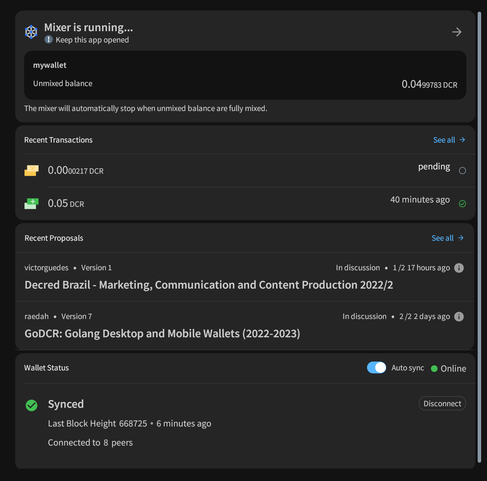

# مجلة ديكريد لشهر مايو 2022

_الصورة: منظور متأصل بواسطة saender@_

كان شهر مايو شهرًا ملحميًا لـديكريد:

* تم تفعيل تغييرات الإجماع الأربعة (DCP0007-10) التي وافق عليها الناخبون مؤخرًا على الشبكة الرئيسية.
* كان هناك إصداران مؤقتان لإصلاح الأخطاء في البرنامج الرئيسي، الإصدار 1.7.2 والإصدار 1.7.3.
* تم إصدار النسخة 1.7.0 من GoDCR، الإصدار الأول المخصص لاستخدام الشبكة الرئيسية - وتم نشر اقتراح جديد للتمويل.
* تم إطلاق مجلة ديكريد، وهي عبارة عن منصة جديدة لاستضافة ومشاركة أخبار ديكريد والمحتويات الأخرى بإدارة phoenixgreen@.
* تم الآن استرجاع جميع التذاكر القديمة الفاشلة التي لم يتم استرجاعها من قبل أصحابها بفضل تفعيل DCP-0009.
* تم نشر أربعة مقترحات جديدة على بوليتيا.

المحتويات:
  
* [تفعيل أربعة تغييرات بالإجماع](#تفعيل-أربعة-تغييرات-بالإجماع)
* [إصدار النسختين 1.7.2 و 1.7.3 للبرنامج الرئيسي](#إصدار-النسختين-1.7.2و-1.7.3-للبرنامج-الرئيسي)
* [إصدار النسخة 1.7.0 ل GoDCR](#إصدار-النسخة-1.7.0-ل-GoDCR)
* [إصدار النسخة 1.7.0 لمحافظ الأندرويد و iOS](#إصدار-النسخة-1.7.0-لمحافظ-الأندرويد-و-iOS)
* [التطوير](#التطوير)
* [الأشخاص](#الأشخاص)
* [الإدارة و الحوكمة](#الإدارة-و-الحوكمة)
* [الشبكة](#الشبكة)
* [النظام البيئي](#النظام-البيئي)
* [الانتشار](#الانتشار)
* [الفعاليات](#الفعاليات)
* [وسائل الإعلام](#وسائل-الإعلام)
* [مناقشات المجتمع](#مناقشات-المجتمع)
* [الأسواق](#الأسواق)
* [الخارجية ذات الصلة](#الخارجية-ذات-الصلة)

## تفعيل أربعة تغييرات بالإجماع

تم تفعيل جميع [تحديثات الإجماع](https://docs.decred.org/governance/consensus-rule-voting/consensus-vote-archive/) الأربعة المضافة في الإصدار 1.7 والتي تمت الموافقة عليها من قبل أصحاب الحصص في 8 مايو، في [الكتلة 657,280](https://dcrdata.decred.org/block/657280):

- اقتراح تغيير ديكريد [DCP-0007](https://github.com/decred/dcps/blob/master/dcp-0007/dcp-0007.mediawiki) - تم إصلاح الخوارزمية التي تحدد الحد الأقصى للإنفاق الشهري من الخزانة الجديدة، ويجب ألا تتداخل بعد الآن مع سداد المدفوعات الشهرية للمتعاقدين.
- اقتراح تغيير ديكريد [DCP-0008](https://github.com/decred/dcps/blob/master/dcp-0008/dcp-0008.mediawiki) - ترفض العقد الآن إصدارات المعاملات الأحدث التي لا يمكنها التعامل معها، ويلزم الآن تحديثات إجماع صريحة لتحديد الإصدارات الأحدث والسماح بها. سيكون من الأسهل والأقل عرضة للخطأ أن تتوحد جميع الجهات الفاعلة في نظام ديكريد البيئي مع التغييرات بالإجماع المستقبلية. قد يقول بعض المهندسين أن التحقق الكامل من صحة العقد التي ترفض البيانات التي لا يمكنهم التحقق منها بالكامل هي الطريقة المعقولة الوحيدة للعمل. مع هذا التحديث، تضاعف ديكريد من التفرع الصلب باعتباره الطريقة الأكثر أمانًا وموثوقية لتحديث الإجماع، "لأننا نستطيع”.
- اقتراح تغيير ديكريد [DCP-0009](https://github.com/decred/dcps/blob/master/dcp-0009/dcp-0009.mediawiki) - يقوم المعدنون الآن باسترجاع التذاكر المفوتة والمنتهية الصلاحية تلقائيًا. هذا يزيل الإحباط  الكبير للمستخدم  من التعامل مع عمليات الاسترجاع، وخاصة ألم فقدان نصوص الاسترداد (غير المدعومة). أصبح كود المحفظة وواجهة المستخدم الرسومية أكثر بساطة، وأصبح التحصيص أسهل.
- اقتراح تغيير ديكريد [DCP-0010](https://github.com/decred/dcps/blob/master/dcp-0010/dcp-0010.mediawiki) - يتم إعادة توجيه 50٪ من مكافأة كل كتلة من معدني إثبات العمل إلى ناخبي إثبات الحصة، مما يغير الانقسام من 60/30/10 إلى 10/80/10 لـصالح إثبات العمل/إثبات الحصة/الخزينة. نأمل أن يؤدي هذا إلى إعادة التوازن بين العرض والطلب على DCR وتقليل قدرة الجهات الخبيثة على التلاعب بالأسواق. كنتيجة ثانوية، فإن مكافآت إثبات الحصة المرتفعة تجعلها أكثر جاذبية لتحصيص وحدات ديكريد. كان هذا هو [الاقتراح الأكثر نقاشًا](https://proposals.decred.org/record/427e1d4) حتى الآن، و مع ذلك فإن أصحاب الحصص صوتوا بنعم وبعد حوالي 6 أشهر أصبح مفعلا.

ولعل هذا هو أكبر تحديث بالإجماع في تاريخ ديكريد.

## إصدار النسختين 1.7.2 و 1.7.3 للبرنامج الرئيسي

تم [إصدار](https://twitter.com/decredproject/status/1524430609543831553) النسخة 1.7.2 ل dcrd و dcrwallet في 11 مايو - أحدث إصدار حتى وقت كتابة هذه المجلة. حصلت dcrd على إصلاح لحالة نادرة ويصعب الوصول إليها عند تمكين الفهرسة الاختيارية. كما تلقت dcrwallet إصلاحًا لرسالة التحقق `verifymessage`، وتمكين تغيير عبارة مرور المحفظة العامة، وبعض التغييرات الداخلية/تغييرات المطور. [ملاحظات الإصدار](https://github.com/decred/decred-binaries/releases/tag/v1.7.2).

أضاف [الإصدار 1.7.2 لديكريديتون](https://github.com/decred/decred-binaries/releases/tag/v1.7.2#decrediton-v172) دعمًا للتصويت على إنفاق الخزينة، والمزيد من المعلومات في التحصيص بمزود خدمة التصويت، و تحديث وحدة منصة المبادلات اللامركزية لديكريد، والعديد من إصلاحات الأخطاء. وقد [تبعه](https://twitter.com/decredproject/status/1528430113355878401) الإصدار 1.7.3 في 18 مايو بإصلاحات لنظام التشغيل macOS 10.15 وتحديد خيارات التصويت على إنفاق الخزينة. [ملاحظات الإصدار](https://github.com/decred/decred-binaries/releases/tag/v1.7.3).

[تحقق من التنزيلات](https://docs.decred.org/advanced/verifying-binaries/) للتأكد من عدم تعديلها. يتم توقيع الملفات باستخدام مفتاح فرعي لإصدار ديكريد ينتهي بـ `6D897EDF518A031D` (ينتهي المفتاح الأساسي بـ `6DF634AA7608AF04`).

## إصدار النسخة 1.7.0 ل GoDCR

تم [الإعلان](https://www.reddit.com/r/decred/comments/uwa6w2/godcr_desktop_wallet_for_decred_written_purely_in/) عن إطلاق الشبكة الرئيسية لـ GoDCR لأول مرة  في 23 مايو بعد ما يقرب من 8 أشهر من التطوير منذ إصدار النسخة 0.9.0 للشبكة التجريبية.

يتم دعم الميزات التالية:

* أساسيات المحفظة الإرسال/الاستلام
* التحصيص (مع الشراء التلقائي للتذاكر)
* خصوصية المحفظة بواسطة StakeShuffle
* التصويت على المقترح
* التصويت على تغيير قاعدة الإجماع
* توقيع الرسالة
* استعادة المحفظة
* تعمل على Linux و macOS و Windows و FreeBS

[قم بالتنزيل من هنا](https://github.com/planetdecred/godcr/releases/tag/v1.7.0) وتحقق من أن  التوقيع من `release@planetdecred.org` (ينتهي المفتاح بـ `A3C9EB3218CCC3E8`).

هذه مجرد بداية لـ GoDCR. التالي هو التداول على منصة المبادلات اللامركزية لديكريد، واختيار العملات، والتصويت على إنفاق الخزينة، والهدف الطموح هو بناء تطبيقات سطح المكتب والأجهزة المحمولة من قاعدة كود موحدة واحدة. تحقق من [المقترح](https://proposals.decred.org/record/0ef42e5) الذي يسعى لتمويل هذا العمل في 2022-2023.

_الصورة: نظرة عامة على GoDCR تعرض ملخصًا لكل نظام فرعي._

## إصدار النسخة 1.7.0 لمحافظ الأندرويد و iOS

تم إصدار النسخة 1.7.0 لمحافظ الأندرويد و iOS في 11 مايو.

تتضمن التغييرات منذ الإصدار 1.6.1 ما يلي:

* تحديث الوحدات النمطية لديكريد إلى النسخة 1.7.0
* تحديث شهادة خادم الخلط
* تحسينات الإعداد اليدوي للخصوصية
* إصلاحات الأخطاء والتحسينات الطفيفة الأخرى

يتوفر تطبيق iOS للشبكة الرئيسيةعلى [App Store](https://apps.apple.com/us/app/decred-wallet/id1462247643) وإصدار الشبكة التجريبية على [TestFlight](https://testflight.apple.com/join/7KL4VnB2).

تطبيق الأندرويد متاح في متجر [Play Store](https://play.google.com/store/apps/details?id=com.decred.dcrandroid.mainnet). بالنسبة للمستخدمين المتقدمين، يوجد [تنزيل ](https://github.com/planetdecred/dcrandroid/releases/tag/v1.7.0)APK جديد موقّع بواسطة مفتاح إصدار Planet Decred.

## التطوير

ما لم يُذكر خلاف ذلك، فإن العمل المَذْكُور هنا يشتمل على حالة "الدمج إلى الرئيسي". وهذا يعني أن العمل قد تم استكماله ومراجعته ودمجه في كود المصدر الذي يمكن للمستخدمين المتقدمين [بناءه وتشغيله](https://medium.com/@artikozel/the-decred-node-back-to-the-source-part-one-27d4576e7e1c)، ولكنه ليس متاحًا بعد في ثنائيات الإصدار للمستخدمين العاديين.

<a id="dcrd" />

**[dcrd](https://github.com/decred/dcrd)**

_dcrd هو تطبيق عقدة كامل يعمل على تشغيل شبكة ديكريد نظير لنظير  حول العالم._

كان الاتجاه العام في مايو هو زيادة الاستفادة من تغييرات الإجماع التي تم تفعيلها مؤخرًا، من خلال إضافة تحسينات وإزالة التعليمات البرمجية غير الضرورية.

* تم تحسين [تشذيب عقدة التحصيص](https://github.com/decred/dcrd/pull/2943) باستخدام رأسيات الكتل بدلاً من نقاط التفتيش (تقليل الاعتماد على الأخير). تعد عمليات المزامنة المستندة إلى الرأس أكثر كفاءة وتمهد الطريق للتنزيلات متعددة النظراء.
* تم [إصلاح خطأ رسوم](https://github.com/decred/dcrd/pull/2948) الاسترجاع بأثر رجعي والذي سمح لأحد الأطراف بزيادة الرسوم المدفوعة لمعدني طرف آخر في المعاملات المجزأة. لم يتم استغلال هذا مطلقًا على الشبكة الرئيسية ولا يمكن استغلاله منذ تفعيل جدول أعمال الاسترجاع التلقائي.
* إعادة صياغة منطق [رفض الكتلة القديمة](https://github.com/decred/dcrd/pull/2945) لاستبدال استخدام نقاط التفتيش بكتلة افتراضيا صالحة `assumevalid` (المشفرة في كل إصدار). تم توضيح الدلالات لتعكس أن «نقاط التفتيش» تستخدم الآن فقط للتعامل مع التفرعات القديمة ولم تعد تستخدم للتحسينات (التي تعتمد الآن على طرق أخرى). تم استبدال خيار واجهة خط الأوامر `--nocheckpoints` بـ `—allowoldforks`. مع هذا التغيير، يتم تقليل دور نقاط التفتيش إلى الحد الأدنى، وهو أمر مرغوب فيه لأنها نوع من الحل البديل.
* تمت إزالة [مؤشر العنوان](https://github.com/decred/dcrd/pull/2930) المهجور جنبًا إلى جنب مع أعلام واجهة سطر الأوامر المرتبطة (`--addrindex` و `--dropaddrindex`) و`searchrawtransactions` JSON-RPC. من منظور التطوير كان فهرس العنوان يكلف الكثير من النفقات للحفاظ عليه، ولم يتم استخدامه من قبل أي شيء ملحوظ، ولم يوفر بسهولة ما يريده معظم الناس من العناوين على أي حال، وهوالرصيد الكامل بدلاً من كل المعاملات الفردية. جميع المعلومات التي تم تقديمها، والمزيد، متاحة عبر dcrdata.
* تمت إضافة وظيفة لإجراء [فحوصات سلامة المعاملات الأساسية](https://github.com/decred/dcrd/pull/2949) إلى وحدة `blockchain/standalone`، وهو أمر جيد للمستهلكين (مثل DCRDEX) نظرًا لأن هذه الوحدة تحتوي على عدد قليل جدًا من التبعيات.
* تم تنفيذ [تخزين إثبات الرأسيات](https://github.com/decred/dcrd/pull/2938) مع تحديث أحادي الاتجاه لقاعدة البيانات. سيؤدي ذلك إلى تجنب إعادة حساب تجزئات الايداع عن طريق تخزينها/تحميلها من القرص. يبدو مفهوم "إيداعات رأس الكتلة" مخيفًا، ولكنه جزء من التكنولوجيا القوية التي تستحق التعلم عنها. تم وصفه جيدًا في [الاقتراح](https://proposals.decred.org/proposals/0a1ff84)، ولكن باختصار، هذه الإيداعات هي بصمات صغيرة لبيانات سلسلة الكتل التي تسمح ببناء تطبيقات خفيفة الوزن سريعة وآمنة. يوجد حاليًا نوع واحد فقط من الايداع - "فلاتر الكتلة المدمجة" التي تسمح للمحافظ الخفيفة بالعثور على معاملات المستخدمين بسرعة وأمان. يمكن إضافة المزيد من الإيداعات لحالات الاستخدام الأخرى في المستقبل.
* تم صنع حزمة [`blockchain`](https://github.com/decred/dcrd/pull/2952) داخلية ولم يتم تصديرها. هذا جزء من جهد شامل مستمر لتقليل العدد الإجمالي للحزم والوحدات النمطية المصدرة لتقليل عبء الصيانة، وفي النهاية الوصول إلى النقطة التي سيكون من الممكن اتباع [الإصدار الدلالي](https://semver.org/) لها لوحدة الجذر.
* الاستمرار [بتنظيف](https://github.com/decred/dcrd/pull/2954) [الكود](https://github.com/decred/dcrd/pull/2922) الذي تم تمكينه في تغييرات الإجماع الأخيرة.

<a id="dcrwallet" />

**[dcrwallet](https://github.com/decred/dcrwallet)**

صدر مع إصدار التصحيح 1.7.2:

* [إصلاح](https://github.com/decred/dcrwallet/pull/2150) التحقق من الرسائل الموقعة.
* [إضافة](https://github.com/decred/dcrwallet/pull/2148) `walletpubpassphrasechange` إلى أساليب JSON-RPC. يسمح بتغيير عبارة المرور العامة للمحفظة.
* مضيف مزود خدمة التصويت إلى معلومات التذكرة التي تم إرجاعها، مما يتيح لتطبيقات المحفظة معرفة مقدم خدمة التصويت الذي تتم إدارة التذكرة بواسطته.
* تمت [إزالة](https://github.com/decred/dcrwallet/pull/2153) جميع وظائف استرجاع التذاكر. الآن بعد أن تم إنشاء الاسترجاعات تلقائيًا، ليست هناك حاجة للمحافظ للتعامل معها.

تم الدمج في الفرع الرئيسي `master`:

* تحديثات [التوافق](https://github.com/decred/dcrwallet/pull/2158) مع أحدث تغييرات dcrd فيما يتعلق بالتذاكر المفوتة والمنتهية الصلاحية.
* تم [إصلاح](https://github.com/decred/dcrwallet/pull/2164) خطأ في الأمر getstakeinfo (بسبب التغييرات المتعلقة بالتذاكر منتهية الصلاحية).

<a id="decrediton" />

**[Decrediton](https://github.com/decred/decrediton)**

_ديكريديتون هو تطبيق محفظة لسطح المكتب كامل الميزات مع ميزة التصويت مدمجة، وميزة الخلط ب StakeShuffle، والشبكة البرقية، والتداول على منصة المُبادلات اللامركزية DEX للديكريد، والمزيد. يتم تشغيلها مع سلسلة الكتل كاملة أو بدونها (وضع التحقق البسيط من الدفع SPV)._

تم الدمج والإصدار مع تصحيحي مايو النسخة 1.7.2 و النسخة 1.7.3:

* يمكن للمستخدمين الآن جلب [هاش معاملة رسوم مزود خدمة التصويت وحالة الرسوم](https://github.com/decred/decrediton/pull/3752) من تفاصيل المعاملة. إذا أظهرت معاملة الرسوم المستلمة حالة مؤكدة لتذكرة غير منفقة ولكن dcrwallet تعتقد أنه لم يتم تأكيدها بعد، يقوم التطبيق بمعالجة الحالة وتحديثها في الخلفية.
* تم إجراء تحسينات على [حالة التذاكر وعرض تاريخ التذاكر](https://github.com/decred/decrediton/pull/3751). كما تتذكر الآن علامات التبويب أوضاع التمرير الخاصة بها بعد العودة من صفحة تفاصيل المعاملة. يتم تحميل الصفوف تدريجياً باستخدام وظيفة التمرير اللانهائية.
* تمت [إزالة وظيفة استرجاع](https://github.com/decred/decrediton/pull/3754) التذاكر. فبعد أن تم إنشاء الاسترجاع [التلقائي](https://proposals.decred.org/record/e2d7b7d)، ليست هناك حاجة للمحافظ للتعامل معها.
* ~7 إصلاحات للأخطاء

_الصورة: تعرض ديكريديتون معلومات إضافية عن مزود خدمة التصويت لكل تذكرة._

<a id="politeia" />

**[بوليتيا](https://github.com/decred/politeia)**

_بوليتيا هي نظام المقترحات لديكريد. يتم استخدامها لطلب التمويل من خزينة ديكريد._

تغييرات الخلفية:

* عميل tlog لديه الآن [الحزمة الخاصة به](https://github.com/decred/politeia/pull/1636) في politeiad (مطلوب [لاستيراد](https://github.com/decred/politeia/pull/1632) المقترحات القديمة).
* تم [تحديث](https://github.com/decred/politeia/pull/1642) إصدار Trillian إلى 1.4.1.
* تم إصلاح [خطأ التاريخ الأدنى لبدء](https://github.com/decred/politeia/pull/1637) الاقتراح.
* إصلاح  [فحص خطأ CSRF](https://github.com/decred/politeia/pull/1638).
* تم إصلاح [رسائل الخطأ](https://github.com/decred/politeia/pull/1640 المتعلقة بتواريخ البدء والانتهاء.
* تمت [إعادة كتابة وظيفة التعليقات الإضافية ](https://github.com/decred/politeia/pull/1641)fsck لإصلاح العديد من الأخطاء. “fsck” اختصار لعبارة “فحص نظام الملفات” وهو مسؤول عن التحقق من إدماج البيانات وإعادة بناء ذاكرات التخزين المؤقت.

تغييرات واجهة المستخدم الرسومية:

* تم إصلاح [مكون نموذج التعليق](https://github.com/decred/politeiagui/pull/2760) عن طريق استبدال `formik` بـ ` react-hook-form`.
* إعادة تنفيذ [الشريط الجانبي](https://github.com/decred/politeiagui/pull/2764) للصفحة الرئيسية و [مشروط الرابط الخارجي](https://github.com/decred/politeiagui/pull/2768) و [شريط التنقل](https://github.com/decred/politeiagui/pull/2763) في [بنية البرنامج المساعد الجديد لواجهة المستخدم الرسومية](https://github.com/decred/politeiagui/tree/master/plugins-structure#politeiagui---plugins-structure).
* تم إصلاح العديد من الأخطاء المتعلقة [بتواريخ بدء/انتهاء الاقتراح](https://github.com/decred/politeiagui/pull/2771).

التغييرات في مكتبة pi-ui (عناصر واجهة المستخدم الشائعة لبوليتيا و ديكريديتون):

* دعم التنقل [بلوحة المفاتيح](https://github.com/decred/pi-ui/pull/446) في أداة `DatePicker`.
* تمت إضافة [أيقونة المعلومات](https://github.com/decred/pi-ui/pull/447) مع تعريف الأدوات إلى حقل إدخال النص.

<a id="vspd" />

**[vspd](https://github.com/decred/vspd)**

_vspd هو برنامج خادم لتشغيل موفر خدمة التصويت. يصوت موفر خدمة التصويت نيابة عن مستخدميه على مدار الساعة طوال أيام الأسبوع ولا يمكنه سرقة الأموال._

- 12 ايداعاً تمثل تحسينات مختلفة للكود وإعادة تشكيله.

<a id="dcrlnlpd" />

**[dcrlnlpd](https://github.com/decred/dcrlnlpd)**

_يشير مصطلح dcrlnpd إلى البرنامج الخفي لمقدم السيولة للشبكة البرقية لديكريد_

تعرف على أحدث مشروع في النظام البيئي للشبكة البرقية لديكريد:

> تسمح هذه الخدمة بتشغيل مزود سيولة الشبكة البرقية في شبكة ديكريد.
>
> يتيح موفر السيولة هذا للعملاء عن بُعد طلب العقدة المرتبطة بمزود السيولة لفتح قناة الشبكة البرقية مرة أخرى إلى العميل المقدم الطلب. يتيح ذلك للعميل المقدم الطلب الحصول على بعض النطاق الترددي الوارد لتلقي مدفوعات الشبكة البرقية.
>
> لإنشاء القناة، يتقاضى موفر السيولة بعض المبلغ المحدد كنسبة مئوية من حجم القناة المطلوب. \[[الملف التمهيدي](https://github.com/decred/dcrlnlpd/blob/941743f09e2d01d5bae36b492de38e49c9565510/README.md)\]

<a id="dcrdex" />

**[DCRDEX](https://github.com/decred/dcrdex)**

_DCRDEX هي منصة مبادلات غير احتجازية للمُبادلات غير الموثوقة، مدعومة بالمقايضات الذرية._

التغييرات التي تواجه المستخدم:

* تمت إضافة الدعم [لتسريع معاملات البتكوين](https://github.com/decred/dcrdex/pull/1555) باستخدام تقنية [الولد يدفع الرسوم الزائدة للوالد](https://bitcoinops.org/en/topics/cpfp/). ستظهر صفحة الطلبات زرًا إذا كان الطلب قابلاً للتسريع. عند النقر فوق الزر، تظهر نافذة منبثقة تسمح للمستخدم باختيار رسوم أعلى.
تمت إضافة زر إلى صفحة المحافظ [لإعادة إنشاء محفظة التحقق البسيط من الدفع للبتكوين](https://github.com/decred/dcrdex/pull/1507)، حيث لا تزال هناك العديد من الطرق التي يمكن أن تتلف بها.
* دعم تحديث [شهادة TLS](https://github.com/decred/dcrdex/pull/1602) للخادم مع واحدة مقدمة من المستخدم.

التغييرات الداخلية وتغييرات المطورين:

* السماح [بالإختبار الآلي](https://github.com/decred/dcrdex/pull/1550) على الشبكة التجريبية لعميل الإيثيريوم.
* تم [تعميم](https://github.com/decred/dcrdex/pull/1603) الإختبارات الآلية Simnet للعمل مع جميع الأصول المدعومة حاليًا.
* تم تنفيذ [المرحلة الثالثة](https://github.com/decred/dcrdex/pull/1530) من إصلاح اقتطاع رسالة التوقيع. من الصعب إصلاح الخلل عند "نشره" على العديد من الخوادم والعملاء المتعاونين، لكن المطورين لديهم [خطة ذكية من أربعة مراحل](https://github.com/decred/dcrdex/pull/1526)  لذلك.
* تم الإنتقال الآن إلى Bitcoin Cash [testnet4](https://github.com/decred/dcrdex/pull/1606) بعد أن أصبحت من الدرجة الأولى في BCHD. كما تمت إضافة برنامج تشفير مخصص لعناوين [CashAddr](https://www.reference.cash/protocol/blockchain/encoding/cashaddr/) الخاصة بـ BCH.
* تمت إضافة طرق [لحساب متوسط الرسوم](https://github.com/decred/dcrdex/pull/1597) لأحدث كتلة (كتل) ب BTC/DOGE/LTC/BCH. كما تم تنفيذ ذاكرة تخزين مؤقت لمنع عمليات الفحص المتكررة بين الكتل، والتراجع إذا لم تكن هناك بيانات كافية لتقدير الرسوم.
* التحديث إلى الوحدات الجديدة من [btcsuite و ](https://github.com/decred/dcrdex/pull/1542)go-ethereum.
* تحديث التبعية للبناء بواسطة [Node.js 18](https://github.com/decred/dcrdex/pull/1617).
* يسمح الترميز الآن ببيانات المعاملات لفترة أطول من 65,535 بايت.
* تمت إعادة صياغة [وظيفة الانتظار وإعادة التجربة](https://github.com/decred/dcrdex/pull/1623) العامة لتتناقص تدريجياً (تبطئ) بعد بضع محاولات أولية متكررة.
* إصلاحات الأخطاء المختلفة وتحديثات التبعية والتحسينات.

أثناء العمل على DCRDEX، قدم المطورون [مساهمات مختلفة](https://twitter.com/blockchainbuck/status/1532146821300101120) في مشاريع المنبع: [btcd](https://github.com/btcsuite/btcd/commits?author=chappjc) و [btcwallet](https://github.com/btcsuite/btcwallet/commits?author=chappjc) و [go-ethereum](https://github.com/ethereum/go-ethereum/pull/24533) و [neutrino](https://github.com/lightninglabs/neutrino/commits?author=chappjc) و [zcash](https://github.com/zcash/zcash/commits?author=buck54321) وغيرها.

بدأ فريق المطورين مناقشة حول [إعادة تسمية ](https://www.reddit.com/r/decred/comments/v3gxa8/should_we_rebrand_decred_dex/)DCRDEX ويقبلون أفكار الاسم والشعار.

> ربما وجدت بائعًا لإجراء تدقيق على عقود المقايضة الذرية الخاصة بنا من Solidity. وتجدر الإشارة إلى أن عقودنا بسيطة للغاية، فنحن أقل من الحد الأدنى لحجم الطلبات. هذا ما يحدث عندما لا تحاول استخراج رسوم التداول ولا توجد وظائف إدارية. \[[@blockchainbuck](https://twitter.com/blockchainbuck/status/1527105721724190722)\]

_الصورة: تسمح DCRDEX بتسريع المبادلات عندما تكون الشبكة مشغولة ولكنك تريد هذا التداول في في أسرع وقت ممكن._

<a id="dcrios" />

**[محفظة ديكريد (نظام iOS)](https://github.com/planetdecred/dcrios)**

تمت إضافة [سير عمل بناء](https://github.com/planetdecred/dcrios/pull/907) على GitHub لضمان بناء dcrios دون أي أخطاء.
تم [تحديث](https://github.com/planetdecred/dcrios/pull/899) اختبارات واجهة المستخدم الآلية.

<a id="godcr" />

**[GoDCR](https://github.com/planetdecred/godcr)**

_GoDCR عبارة عن محفظة واجهة مستخدم رسومية خفيفة الوزن لسطح المكتب مع دعم التحصيص، والخصوصية، والتصويت على بوليتيا، والتصويت بالإجماع، والمزيد._

* يتم الآن تصفية [الحساب الافتراضي](https://github.com/planetdecred/godcr/pull/910) عند تمكين الخصوصية.
* يمكن التحقق من جميع [الرسائل الموقعة](https://github.com/planetdecred/godcr/pull/918)، وإزالة القيود المفروضة على عناوين المحفظة الشخصية فقط.
* تمت [إضافة](https://github.com/planetdecred/godcr/pull/923) نماذج إعادة التوجيه إلى صفحة التصحيح (الإرسال إلى docs.decred.org) وصفحة تفاصيل المعاملة (الإرسال إلى مستكشف الكتلة).
* تمت إعادة صياغة معالجة [الحدث الرئيسي](https://github.com/planetdecred/godcr/pull/907) ليكون أقل عرضة للخطأ وأكثر كفاءة.
* تمت إضافة خيار [استيراد محفظة المشاهدة](https://github.com/planetdecred/godcr/pull/943) فقط إلى شاشة البداية.
* يتم [تمكين الخصوصية تلقائيًا](https://github.com/planetdecred/godcr/pull/936) عند إنشاء محفظة جديدة.
* تم [تحديث](https://github.com/planetdecred/godcr/pull/934) Gio إلى أحدث إصدار مستقر.
* استبدل [شريط التنقل السفلي](https://github.com/planetdecred/godcr/pull/948) الشريط الجانبي بأحجام شاشة أقل من 479 بكسل (للأجهزة المحمولة).
* [إصلاحات](https://github.com/planetdecred/godcr/pull/957) لأعطال المحفظة وعناوين الاقتراح.
* تم إصلاح الخلل حيث تم عرض [الرصيد المقفل غير الصحيح](https://github.com/planetdecred/godcr/pull/956) في علامة التبويب التحصيص.
* إصلاح البناءَات على [Android](https://github.com/planetdecred/godcr/pull/924) و [FreeBSD](https://github.com/planetdecred/godcr/pull/914).
* ~ 6 إصلاحات أخطاء أخرى وبعض التحسينات.

[تعمل](https://proposals.decred.org/record/0ef42e5/comments/31) إصدارات GoDCR على نظامي Android و iOS بالفعل في بعض السعات، على الرغم من أنه لا يزال هناك الكثير من العمل لتحسين تجربة مستخدم الهاتف المحمول/اللمس.

_الصورة: نظرة أولية لـ GoDCR تعمل على هاتف محمول محاكي ل OS._

<a id="dcrdata" />

**[dcrdata](https://github.com/decred/dcrdata)**

_dcrdata هو مستكشف لبيانات سلسلة كتلة ديكريد وبيانات خارج السلسلة مثل مقترحات ديكريد والأسواق والمزيد._

* تم تحديث [التبعيات](https://github.com/decred/dcrdata/pull/1913) للبناء باستخدام Node.js 16 و 18.

<a id="dcrweb" />

**[decred.org](https://github.com/decred/dcrweb)**

_dcrweb هو الكود المصدري لموقع decred.org ._

* [تحديث روابط](https://github.com/decred/dcrweb/pull/1033) غرفة الدردشة.
* تمت [إضافة](https://github.com/decred/dcrweb/pull/1035) إصدار النشرة الإعلامية للتغيير بالإجماع لمكافأة إثبات العمل/إثبات الحصة.
* [إزالة](https://github.com/decred/dcrweb/pull/1037) منصات المبادلات البائدة.

**مسائل أخرى**

* dcrseeder: تمت [إزالة](https://github.com/decred/dcrseeder/pull/50) بذور DNS أخيرًا، وإصلاح صغير [لتشذيب أقرانهم المعطلين](https://github.com/decred/dcrseeder/pull/47) بحزم أكبر.

## الأشخاص

مرحبا بالمساهمين الجدد لأول مرة مع دمج الكود إلى الماستر خلال الفترة ما بين يناير و مارس:

- arjundashrath ([dcrd](https://github.com/decred/dcrd/commits?author=arjundashrath))
- liukun ([dcrd](https://github.com/decred/dcrd/commits?author=liukun))
- monsa00 ([godcr](https://github.com/planetdecred/godcr/commits?author=monsa00))
- ukane-philemon على ([dcrdata](https://github.com/decred/dcrdata/commits?author=ukane-philemon) و [dcrdex](https://github.com/decred/dcrdex/commits?author=ukane-philemon) و [vspd](https://github.com/decred/vspd/commits?author=ukane-philemon))

لم تكن لدينا مجلة ديكريد لهذه الأشهر ولكن لم يفت الأوان بعد لتحية المساهمين الجدد. مرحبا بكم معنا!

إحصائيات المجتمع اعتبارًا من 1 يونيو (مقارنة بـ 2 مايو):

* متابعو [التويتر](https://twitter.com/decredproject): 54,474 (-388)
* المشتركين في [ريديت](https://www.reddit.com/r/decred/): 12,631 (+10)
* مستخدمي غرفة الدردشة general# على [الماتريكس](https://chat.decred.org/): 677 (+15)
* مستخدمي [الديسكورد](https://discord.gg/GJ2GXfz): 2,305 (+12)
* مستخدمي [التيليجرام](https://t.me/Decred): 2,858 (+30)
المشتركين في [اليوتيوب](https://www.youtube.com/decredchannel): ~4,630 (-9)، المشاهدات: 209 ألف (بزيادة ألفان)

راجع تقرير [يونيو ](https://decredcommunity.github.io/social-media-stats/posts/20220604.1)2022 عن أداء وسائل التواصل الاجتماعي لديكريد للحصول على نظرة أكثر تعمقا على أرقام شهر فبراير مقابل شهر يونيو.

## الإدارة و الحوكمة

في في مايو، تلقت [الخزينة](https://dcrdata.decred.org/treasury) الجديدة 9,407 بقيمة 390 ألف دولار بمتوسط ​​سعر هذا الشهر البالغ 41.46 دولارًا. تم إنفاق 2,950 DCR من عنوان الخزينة القديم للدفع للمتعاقدين، بقيمة 122 ألف دولار بمعدل شهر مايو، أو 179 ألف دولار بمعدل فواتير أبريل البالغ 60.62 دولارًا. كانت هذه المدفوعات لتغطية فواتير المتعاقدين لشهري مارس وأبريل.

اعتبارًا من 12 يونيو، بلغ الرصيد المشترك [للخزينة القديمة](https://dcrdata.decred.org/address/Dcur2mcGjmENx4DhNqDctW5wJCVyT3Qeqkx) و[الخزينة الجديدة](https://dcrdata.decred.org/treasury) 795,673 DCR (أي ما يعادل 23.9 مليون دولار أمريكي بسعر 30.09 دولار أمريكي).

تم تقديم [اقتراح](https://proposals.decred.org/record/0ef42e5) جديد من قبل مجموعة Raedah Group لتمويل GoDCR، وهي محفظة واجهة المستخدم الرسومية لسطح المكتب المبنية بلغة Go والتي ستحل أيضًا محل محافظ الهاتف المحمول الحالية مع استمرار التطوير. يطلب هذا الاقتراح تمويلا بقيمة 250 ألف دولار لمدة 12 شهرًا، وهو مبلغ أكبر من [الاقتراح السابق](https://proposals.decred.org/record/f7d9fc8) الذي تم رفضه بفارق ضئيل في أكتوبر 2021. ترجع الميزانية الإضافية إلى عدد أكبر من العمال، ومدة أطول وتغطي صيانة محافظ Android/iOS الحالية. تم تخفيض الميزانية من 300 ألف دولار في البداية استجابة لبعض التعليقات.

تم نشر أربعة مقترحات على بوليتيا في مايو:

* المقترح من Exitus@ لتمويل مجلة ديكريد و موجز بوليتيا حتى ديسمبر 2022. كانت مجلة ديكريد غير نشطة لمدة 3 أشهر منذ أن أعلن bee@[ عن التوقف](202112.md#the-future-of-decred-journal)، حتى تولى Exitus@ قيادة إصدار أبريل وفي النهاية تقديم اقتراح جديد كامل. تم نشر تقرير مفصل عن المنجزات والشؤون المالية لمقترح 2021 [هنا](https://github.com/decredcommunity/proposals/blob/master/proposals/1d74b88/updates/20220521.md)، مع إحصائيات رئيسية تبلغ 24,800 دولار تم إنفاقها من 39,000 دولار لإصدار 12 عددًا من مجلة ديكريد و 10 أعداد من موجز بوليتيا. الميزانية الجديدة محددة بمبلغ 33,000 دولار.
* [الاقتراح](https://proposals.decred.org/record/7057e0b) المقدم من kozel@ لتمويل محتوى ديكريد وترجمات الأصول طوال عام 2022. أبلغ تقرير عن المرحلة الثانية أنه تم إنفاق 8,180 دولارًا فقط من أصل 33,000 دولار، لذلك سيكون الحد الأدنى للمرحلة الثالثة 20,000 دولار.
* [اقتراح](https://proposals.decred.org/record/da2f32d) تمويل استمرار برنامج Bug Bounty حتى ديسمبر 2023. خلال الأشهر الـ 12 الماضية، كانت تكاليف التشغيل ما يقارب 2,100 دولار وتم دفع ما يقارب 1,000 دولار كمكافآت. تمت زيادة مدة الاقتراح الجديد من 12 إلى 18 شهرًا، ويتم تقسيم الميزانية بين 5,000 دولار لتكاليف التشغيل وما يصل إلى 100,000 دولار لمدفوعات المكافآت. تم نقل الإدارة من degeri@ إلى jholdstock@.
* طلب [اقتراح](https://proposals.decred.org/record/6bdffcb) من @Juliana 3,575 دولارًا لتنظيم 3 فعاليات في جامعات في أوغندا في عام 2022، مع توقع 30 شخصًا في كل فعالية.

لمتابعة نشاط الاقتراحات بين يناير ومايو راجع العدد 51 من موجز بوليتيا.

## الشبكة 
  
**معدل الهاش**: افتتحت [معدلات الهاش](https://dcrdata.decred.org/charts?chart=hashrate&zoom=l2im68kw-l3x1522f&bin=block&axis=time) في شهر مايو عند ~345 Ph/s وأغلقت عند ~115 Ph/s، وبلغ قاعها عند 74 Ph/s كما بلغت ذروتها عند 381 Ph/s على مدار الشهر.

_الصورة: انخفاض متوقع في معدل التجزئة بعد تقليل مكافأة التعدين._ 
  
توزيع معدل الهاش الذي [تم الإبلاغ عنه](https://miningpoolstats.stream/decred) بواسطة المجمعات في 1 يونيو: Poolin بنسبة 55%، و ViaBTC بنسبة 20%، و F2Pool بنسبة 7%، و AntPool بنسبة 7%، و Luxor بنسبة 5%، و BTC.com بنسبة 4%،و CoinMine بنسبة 0.3%.

توزيع  1,000 كتلة تم [تعدينها](https://miningpoolstats.stream/decred) بالفعل قبل 1 يونيو: Poolin بنسبة 55%، و ViaBTC بنسبة 20%، و F2Pool بنسبة 8%، و DsV1GF7 بنسبة 6.5%، و BTC.com بنسبة 6%، و Luxor بنسبة 4%، و CoinmMine بنسبة 0.2%، و DsmLNFC بنسبة 0.1%.

**التحصيص**: تراوح [سعر التذكرة](https://dcrdata.decred.org/charts?chart=ticket-price&zoom=l2im68kw-l3x1522f&axis=time&visibility=true-true&mode=stepped) بين 217-231 DCR، [بمتوسط](https://dcrstats.com/) 223.6 DCR (+9.4) خلال 30 يوما.

بلغ [المبلغ المقفل](https://dcrdata.decred.org/charts?chart=ticket-pool-value&zoom=l2im68kw-l3x1522f&scale=linear&bin=block&axis=time) 8.78-9.07 مليون DCR، مما يعني أن 62.6-63.9% من العرض المتاح [شارك](https://dcrdata.decred.org/charts?chart=stake-participation&zoom=l2im68kw-l3x1522f&scale=linear&bin=block&axis=time) في إثبات الحصة. كل من قيم DCR والنسبة المئوية هي أعلى مستوى جديد على الإطلاق لديكريد.

[تم إسترجاع](https://github.com/decred/dcrd/pull/2861#issuecomment-1144049589) جميع التذاكر المفوتة و المنتهية الصلاحية، مما أدى إلى فتح إجمالي 175,957 DCR من 1,719 تذكرة (متوسط السعر 103 DCR لكل تذكرة). تم نقل ما يقارب 45 ألف من DCR بالفعل، بينما من المحتمل أن يتم فقد ما تبقى من 131 ألف DCR بسبب فقدان البذور وأسباب أخرى. كانت إحدى التذاكر المسترجعة من كتلة قديمة 767، في الوقت الذي ظهرت فيه الشكاوى الأولى بشأن [ارتفاع سعر التذكرة](https://forum.decred.org/threads/are-you-still-purchasing-at-current-price-4-55-dcr.840/).

يتم إسترجاع جميع الأصوات الجديدة المفوتة تلقائيًا، وقد تم إسترجاع أول صوت في الكتلة [657295](https://dcrdata.decred.org/block/657295).

**مقدم خدمة التصويت**: في 1 يونيو، تمت إدارة حوالي 6,900  (+120) تذاكر حية بواسطة 16 خادم [مدرج](https://decred.org/vsp/) ل vspd، أو 16.8% من مجموع التذاكر (+0.2%).

لم يعد من الممكن التصويت على التذاكر القديمة (dcrstakepool) منذ 8 مايو عندما دخلت السلسلة في القواعد الجديدة. على عكس جميع مزودي خدمات التصويت القدامى الآخرين/المتوقفين، في 1 يونيو أفاد كل من coinmine.pl و decredbrasil.com أنهم على ارتفاع كتلة حالية ويحملون مجتمعين 19 تذكرة حية. لسنا متأكدين من كيفية حدوث ذلك ولا يتم تضمين هذه التذاكر في الإحصائيات أعلاه.

**العقد**: طوال شهر مايو، كان هناك حوالي 185 عقدة يمكن الوصول إليها وفقًا [لتحليلات PD](https://analytics.planetdecred.org/nodes).

إصدارات العقد اعتبارًا من [لقطة](https://nodes.jholdstock.uk/user_agents) 1 يونيو (إجمالي 160، dcrd فقط): النسخة 1.7.1 - 41%، النسخة 1.7.2 - 20%، النسخة 1.7.0 - 12%، النسخة 1.7.0 لبناءَات التطوير - 9%، النسخة 1.8.0 لبناءَات التطوير - 4%، النسخة 1.6.x - 6%، النسخة 1.5.x - 4%.

_الصورة: تصاعد نسبة العرض المخلوط وغير المنفق._

## النظام البيئي

* مزود خدمة التصويت [big.decred.energy VSP](https://github.com/decred/dcrwebapi/pull/161) من [@DCR_Uncle](https://twitter.com/DCR_Uncle) [متاح](https://twitter.com/DCR_Uncle/status/1527138204175847424) الآن في قائمة مزودي خدمة التصويت برسوم 1٪.
* تم اكتشاف مثيل ثانٍ لوحدة عرض الشبكة البرقية لديكريد على [decred.lighting](https://decred.lighting/)، و التي تعمل بنفس الكود كالذي يوجد في [ln-map.jholdstock.uk](https://ln-map.jholdstock.uk/).

تحذير: ليس لدى مؤلفي مجلة ديكريد أي فكرة عن مصداقية أي من الخدمات المذكورة أعلاه. يرجى إجراء البحث الخاص بك قبل الوثوق بمعلوماتك الشخصية أو أصولك لأي كيان.

## الإنتشار

إنجازات Monde PR:

* عرضت تحديثين للأخبار على وسائل الإعلام للمنشورات المالية والعملات الرقمية.
* عرض خبر واحد
* ردت على ثلاث طلبات للتعليق.
* تأمين مقابلتين إعلاميتين.

تأمين المقالات الإخبارية التالية:

* تمت تغطية تحول ديكريد إلى نموذج الإجماع بإثبات الحصة بالأغلبية من قبل [Invezz](https://invezz.com/news/2022/05/09/decred-shifts-to-majority-proof-of-stake-consensus-model/)، والذي يضم تعليقًا من jy-p@. نشرت Invezz القصة بتسع لغات أخرى بما في ذلك [الفرنسية](https://invezz.com/fr/actualites/2022/05/09/decred-passe-au-modele-de-consensus-majoritaire-proof-of-stake/) و[الإيطالية](https://invezz.com/it/notizie/2022/05/10/decred-passa-al-modello-proof-of-stake/). تم نشر القصة في 4 منشورات بما في ذلك [Bitcoin Insider](https://www.bitcoininsider.org/article/164786/decred-shifts-majority-proof-stake-consensus-model) و [Crypto News](https://cryptonews.net/news/altcoins/6288659/).
* تمت تغطية إصدار GoDCR بواسطة [CryptoNinjas](https://www.cryptoninjas.net/2022/05/23/decred-blockchain-introduces-new-cross-chain-spv-based-wallet-godcr/) و [E-Crypto News](https://e-cryptonews.com/decred-launches-godcr-wallet-with-enhanced-privacy-features/). تم نشر مقالة CryptoNinjas في 3 منشورات بما في ذلك [BitcoinEthereumNews](https://bitcoinethereumnews.com/blockchain/decred-blockchain-introduces-new-cross-chain-spv-based-wallet-godcr-cryptoninjas/) و [Global Online Money](https://globalonlinemony.com/decred-blockchain-introduces-new-cross-chain-spv-based-wallet-godcr-cryptoninjas/).

## الفعاليات

الحضور:

* استضاف كل من arij@ و khalidesi@ كشك ديكريد خلال يومين من [EMEC EXPO](https://twitter.com/in_insaf/status/1526979202951655425) (المعرض الدولي للتحول الرقمي) في الدار البيضاء، المغرب، أجابا على العديد من الأسئلة حول كيفية عمل ديكريد والقضايا التي تحلها.
* [تحدث](https://twitter.com/Decred_BR/status/1529089788199976960) إدسون نيتو عن ديكريد في [Bitconf](https://www.instagram.com/p/Cd6sL2wLHU7/) في ساو باولو، البرازيل.

**الفعاليات القادمة**

* 30 يونيو - لقاء اجتماعي لديكريد في شيكاغو، الولايات المتحدة الأمريكية. تقول المصادر إنه سيكون هناك سترة ديكريد واحدة على الأقل.

_الصورة: تقديم Edson Neto في Bitconf._

## وسائل الإعلام

تم [إطلاق](https://twitter.com/DecredSociety/status/1530562659006939136) [مجلة ديكريد](https://www.decredmagazine.com/) بواسطة phoenixgreen@ لجمع جميع محتوى ديكريد في مكان واحد، ومنح الكُتَّاب الجدد منصة، وأرشفة المحتوى السابق الرائع (بما في ذلك [مجلة ديكريد](https://www.decredmagazine.com/tag/decred-journal/)). هذا الأخير ذو قيمة لأن مواقع الويب والمدونات عادة ما «يتبخر» محتواها بمرور الوقت ويصبح من الصعب أو المستحيل استعادتها. حتى كتابة هذا التقرير، تم استيراد حوالي 300 منشور ووافق 8 مؤلفين على إضافة محتواها. تهدف مجلة ديكريد إلى أن تكون بديلاً ل [decredsociety.com](https://www.decredsociety.com/) التي تم إطلاقها في وقت سابق كمشروع تجريبي.

**مقالات مختارة:**

* [دليل إعداد عقدة الشبكة البرقية لديكريد](https://gist.github.com/dcr-uncle/11b30f44e73b55cc31fb75881f9b4643) بواسطة@DCR\_Uncle
* [تم إطلاق أكبر تصويت إجماع في سلسلة الكتل في التاريخ!](https://www.decredmagazine.com/the-bigest-blockchain-consensus-vote-in-history-goes-live/) بواسطة phoenixgreen@
* [تمرد إثبات العمل](https://www.decredmagazine.com/the-pow-rebellion/)  بواسطة phoenixgreen@

**أشرطة الفيديو:**

* [منصة المبادلات نظير لنظير - ديكريد وحالة السوق](https://www.youtube.com/watch?v=vqzaEdtmCsI) بواسطة phoenixgreen@ و Exitus@
* [الملخص الشهري لديكريد - زيادة ب 2.66 في مكافآت التحصيص، وتحديثات التطوير، مع تفرع صلب قادم!](https://www.youtube.com/watch?v=uOHiDTj9Prs) بواسطة Exitus@ و DajanaDcr@
* DCRDATA [استعراض الكتلة - أساسيات ديكريد](https://www.youtube.com/watch?v=nsMrdK45cK8) بواسطة phoenixgreen@ - متوفر أيضا [كمدونة](https://www.decredmagazine.com/dcrdata-looking-into-a-block/)
* DCRDATA [مخططات إثبات العمل - أساسيات ديكريد](https://www.youtube.com/watch?v=t_pcHfJS0uw) بواسطة phoenixgreen@ - متوفر أيضا [كمدونة](https://www.decredmagazine.com/dcrdata-proof-of-work-charts/)
* DCRDATA [مخططات إثبات الحصة - أساسيات ديكريد](https://www.youtube.com/watch?v=eRtogHA_2_w) بواسطة phoenixgreen@ - متوفر أيضا [كمدونة](https://www.decredmagazine.com/dcrdata-proof-of-stake-charts/)
* [آلة التعدين هذه هادئة ومربحة ومعطلة، ما الذي يحدث؟!](https://www.youtube.com/watch?v=skv8RehpaaU) (آلة التعدين DR5 و تغيير الدعم) بواسطة VoskCoin@
* [زادت مكافآت تحصيص ديكريد للتو بمقدار 2.6 مرة! لننشر الخبر!](https://twitter.com/DajanaDcr/status/1526306473051045892) (TikTok) بواسطة DajanaDcr@ و Exitus@
* [استعراض تاريخ كود ديكريد](https://twitter.com/karamblez/status/1528173850642505728) بواسطة karamble@

**الصوتيات:**

* مقاطع الفيديو الخاصة بـ phoenixgreen@ (المعروف أيضًا باسم Decred Society) متوفرة [بتنسيق البودكاست على ](https://anchor.fm/decred-society/)anchor.fm.

## مناقشات المجتمع

منشورات الريديت المختارة:

* [الطابَع المُمَيّز للمشاركة الأسبوعية](https://www.reddit.com/r/decred/comments/v0eus3/weekly_contribution_streaks_tards_unite/) هو نشاط أسبوعي جديد من u/ersfbddfgwe يسعى إلى كسر الحاجز العقلي المشترك «لا يمكنني المساهمة بأي شيء لأنني لست مطورًا:(“. ”القواعد“ بسيطة: ما عليك سوى الظهور والكتابة عن _أي شيء_ فعلته، كبيرًا أو صغيرًا، مع عنوان DCR اختياري للحصول على نصائح. هناك نقاش مستمر حول كيفية ترتيب المساهمات ومكافأتها بشكل أفضل.
* في [موضوع تعدين ديكريد](https://www.reddit.com/r/decred/comments/unh7nn/decred_mining/)، شارك المعدنون تحديات تعدين DCR بعد أن تم تخفيض حصة المكافأة الجماعية من 60٪ إلى 10٪.

مناقشات التويتر المختارة:

* تنفيذ [محافظ تداول التحقق البسيط من الدفع](https://twitter.com/blockchainbuck/status/1531156971759575040) لـ DCRDEX. ماذا يعني ذلك ولماذا يركز المطورون على التحقق البسيط من الدفع. - بقلم buck54321@
* تنفيذ سير عمل مخصص لإنشاء [محافظ Ethereum ERC-20](https://twitter.com/blockchainbuck/status/1527105720285552641). ما هي التوكنات التي يجب علينا إستعمالها ولماذا؟ - بقلم buck54321@

## الأسواق

في مايو، تم تداول DCR بين 30.00 دولارًا أمريكيًا و 58.68 دولارًا أمريكيًا/BTC 0.00103-0.00190. وقد بلغ متوسط السعر اليومي 41.46 دولارًا.

ينشر applesaucesome@ التحليل الفني لـ DCR والعملات الرقمية والسوق الأوسع على موقع [Decred Magazine](https://www.decredmagazine.com/author/applesaucesome/) الجديد، حوالي مرة واحدة في الأسبوع.

في مايو، سهلت منصة المبادلات اللامركزية لديكريد DCRDEX تداول حوالي 74[ ألف DCR](https://github.com/bochinchero/dcrsnapshots/tree/main/2022-05/700)، أي ما يعادل حوالي 3 مليون دولار أمريكي.

## الخارجية ذات الصلة

يتزايد الاهتمام على التداول الداخلي في مجال العملات الرقمية. عرضت صحيفة وول ستريت  [مقالًا](https://www.wsj.com/articles/crypto-might-have-an-insider-trading-problem-11653084398) عن التداول الداخلي المشتبه به حول الإدراج على Binance و Coinbase و FTX. وقد تم إجراء التحليل بواسطة Argus Inc بناءً على سجلات سلسلة الكتل العامة.

تم [القبض](https://www.cnbc.com/2022/06/01/former-opensea-employee-charged-in-first-ever-nft-insider-trading-case.html) الآن على مدير منتج OpenSea السابق ناثانيال تشاستين، الذي فقد وظيفته بسبب الاستفادة من إدراج NFTs على الصفحة الأولى لـ OpenSea في سبتمبر، ووجهت إليه تهمة التداول الداخلي من قبل المدعين العامين في المنطقة الجنوبية بنيويورك. على الرغم من أن NFTs المعنية ليست الأوراق المالية المعتادة التي تنطبق عليها قوانين التداول الداخلي، إلا أن المدعي العام يزعم أن Chastain قد أضر بصاحب عمله (OpenSea) باختلاس المعلومات.

[فقد](https://www.buzzfeednews.com/article/sarahemerson/seth-green-bored-ape-stolen-tv-show) الممثل Seth Green التوكن الغير القابل للاستبدال Bored Ape في حادثة تصيد، مما زاد من أهمية حقيقة أن القرد كان من المقرر أن يلعب دور البطولة في عرض جديد كان يطوره، White Horse Tavern. وفي يونيو، دفع جرين فدية قدرها 260 ألف دولار لتأمين عودة القرد، بحيث يمكن أن يستمر العرض (دون إثارة الكثير من أسئلة حقوق النشر حول ما إذا كان يمكن استخدام صورة القرد المسروق).

هذا كل شيء لشهر مايو. شارك بتحديثاتك للإصدار التالي في غرفة الدردشة [#journal](https://chat.decred.org/#/room/#journal:decred.org).

## عن هذا العدد 
  
هذا هو العدد 47 من مجلة صحيفة ديكريد. فهرس جميع الإصدارات والمرايا والترجمات متاح [هنا](https://xaur.github.io/decred-news/).

يتم نقل معظم المعلومات الواردة من أطراف ثالثة مباشرة من المصدر بعد التحقق من الحد الأدنى لصحتها. ليس لدى مؤلفي مجلة صحيفة الديكريد القدرة على التحقق من جميع الادعاءات.رجاء إحذر من أعمال الاحتيال وقم ببحثك الخاص.

الاعتمادات (بالترتيب الأبجدي):

الكتابة والتحرير: bee و bochinchero و Exitus و l1ndseymm و richardred

المراجعات والتعليقات: davecgh و matheusd وphoenixgreen

صورة العنوان: saender

التمويل: أصحاب حصص الديكريد

النسخة الأصلية لمجلة الديكريد لشهر مايو متوفرة على هذا الرابط [هنا](https://xaur.github.io/decred-news/journal/202205).

تمت الترجمة إلى اللغة العربية بواسطة: arij@. قام بالمراجعة abdulrahman4@.

