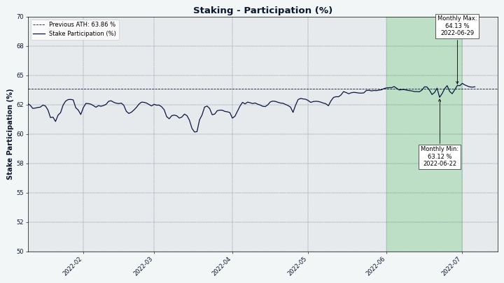
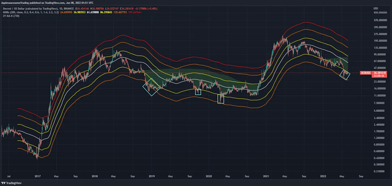

# مجلة ديكريد - يونيو 2022

أبرز الأحداث لشهر يونيو:

* اجتاز العقد الذكي للإيثيريوم المستخدم في منصة المبادلات اللامركزية لديكريد DCRDEX أول تدقيق له مع نتائج رائعة.
* كانت منصة بوليتيا نشطة بالموافقة على 3 مقترحات، ورفض واحد وتقديم 3 مقترحات جديدة.
* تمت الموافقة على أول معاملة إنفاق على الخزينة  بموجب سياسة الإنفاق المصححة (DCP-7).
* تم إدراج ديكريد في منصتين للمبادلات Guardarian و BitPanda.

المحتويات:

* [التطوير](#التطوير)
* [الأشخاص](#الأشخاص)
* [الإدارة و الحوكمة](#الإدارة-و-الحوكمة)
* [الشبكة](#الشبكة)
* [النظام البيئي](#النظام-البيئي)
* [الفعاليات](#الفعاليات)
* [الانتشار](#الانتشار)
* [وسائل الإعلام](#وسائل-الإعلام)
* [مناقشات المجتمع](#مناقشات-المجتمع)
* [الأسواق](#الأسواق)
* [الخارجية ذات الصلة](#الخارجية-ذات-الصلة)

## التطوير

  ما لم يُذكر خلاف ذلك، فإن العمل المَذْكُور هنا يشتمل على حالة "الدمج إلى الرئيسي". وهذا يعني أن العمل قد تم استكماله ومراجعته ودمجه في كود المصدر الذي يمكن للمستخدمين المتقدمين [بناءه وتشغيله](https://medium.com/@artikozel/the-decred-node-back-to-the-source-part-one-27d4576e7e1c)، ولكنه ليس متاحًا بعد في ثنائيات الإصدار للمستخدمين العاديين.

### dcrd

_[dcrd](https://github.com/decred/dcrd) هو تطبيق عقدة كامل يعمل على تشغيل شبكة ديكريد من نظير إلى نظير حول العالم._

* [تحسين](https://github.com/decred/dcrd/pull/2957) حساب العمل التراكمي باستخدام حزمة الأعداد الصحيحة الجديدة ذات التخصيص الصفري 256[ بت](https://github.com/decred/dcrd/pull/2787). والنتيجة هي استخدام أقل من 100 ميجا بايت في المتوسط، ووقت مزامنة أولي لسلسلة الكتل أسرع بنسبة 5٪.
* دعم [الإغلاق النظيف](https://github.com/decred/dcrd/pull/2958) على المزيد من متغيرات Unix وعلى Windows (يتم تشغيله بواسطة أحداث مثل تسجيل دخول المستخدم أو إغلاق نافذة المحطة أو إغلاق النظام).
* [الترتيب العكسي](https://github.com/decred/dcrd/pull/2956) الذي تضاف به المعاملات إلى مجمع الذاكرة أثناء إعادة الربط لتصحيح حساب إحصاءَات سلسلة المعاملات في ظل ظروف خاصة. يساعد هذا التغيير في ضمان قيام المعدنين بزيادة الرسوم على سلاسل المعاملات الكبيرة عبر عمليات إعادة الربط. لم تكن هناك مشاكل مع الكود القديم حتى الآن لأن الكتل ليست ممتلئة وإعادة الربط نادرة.
* [إزالة](https://github.com/decred/dcrd/pull/2961) كود تنقيح مجلة الإنفاق الذي أصبح غير ضروري مع إزالة فهرس العناوين.
* إعلان [رفض](https://github.com/decred/dcrd/pull/2963) معاملات `treasurybase` المستقلة. اعتبارًا من تفعيل DCP-6، يجب أن يكون لكل كتلة معاملة `treasurybase` تدفع الإعانة المطلوبة إلى الخزينة. "المستقلة" هي معاملات غير مؤكدة والتي لا تنتمي إلى الكتلة. لا تعتبر `treasurybases` منطقية باعتبارها معاملات مستقلة لأنها تكون صحيحة فقط عندما تكون جزءًا من عملية إنشاء الكتلة. لقد تم رفضها ضمنيًا بالفعل وهذا التغيير يجعلها أكثر وضوحًا كشكل من أشكال الترميز الدفاعي في حالة انتهاك التغييرات المستقبلية لتلك الافتراضات الضمنية.
* تمت إزالة السياسة التي سمحت بنقل المعاملات منخفضة الرسوم/المجانية وتعدينها. لقد خدمت غرضها في الماضي على حساب بعض الجوانب السلبية. الآن هي غير ضرورية ويمكن للمستخدمين رفع أولوية المعاملات "العالقة" باستخدام معاملات إضافية (المعروفة أيضًا باسم الولد يدفع للوالد - CPFP). كما تم استبعاد أعلام واجهة سطر الأوامر ذات الصلة `--norelaypriority` و `—limitfreerelay`.
* ~ 5 طلبات تحسين صغيرة.

### dcrwallet

_[dcrwallet](https://github.com/decred/dcrwallet)هو خادم محفظة تستخدمه تطبيقات سطر الأوامر والمحفظة الرسومية._

* [لا تتطلب](https://github.com/decred/dcrwallet/pull/2168) دعم مرشحات الإصدار 1 المدمجة عند الاستفسار عن بذر HTTPS للعقد.

### Decrediton

_[Decrediton](https://github.com/decred/decrediton) ديكريديتون هو تطبيق محفظة لسطح المكتب كامل الميزات مع ميزة التصويت مدمجة، وميزة الخلط ب StakeShuffle، والشبكة البرقية، والتداول على منصة المُبادلات اللامركزية DEX للديكريد، والمزيد. يتم تشغيلها مع سلسلة الكتل كاملة أو بدونها (وضع التحقق البسيط من الدفع SPV)._

*  إضافة [تجزئة التذكرة](https://github.com/decred/decrediton/pull/3770) المسترجعة إلى صفحة معاملة الإسترجاع.
* تم إصلاح [زر تحميل محتمل الذي لا ينتهي](https://github.com/decred/decrediton/pull/3769) على علامة تبويب إنفاق الخزينة.
* إصلاح [التمرير الذي لا يعمل](https://github.com/decred/decrediton/pull/3771) عند تعطيل الرسوم المتحركة لواجهة المستخدم.
* توسيع الإختبارات الآلية للتحقق من الإصلاحات الأخيرة.

### Politeia

_[بوليتيا](https://github.com/decred/politeia) هي نظام المقترحات لديكريد. يتم استخدامها لطلب التمويل من خزينة ديكريد_

التغييرات الخلفية:

* تم تحديث وتحسين [منطق التعامل مع الإشارات](https://github.com/decred/politeia/pull/1644) في politeavoter من خلال دعم SIGTERM. على نظام التشغيل Windows، سيؤدي ذلك إلى إغلاق politeavoter بشكل نظيف إذا تم إيقاف تشغيل المستخدم أو إذا تم إغلاق النظام.
* تحسين [تسجيل الهوية](https://github.com/decred/politeia/pull/1647) في أداة dbutil.
* تحسين [التعامل مع الأخطاء](https://github.com/decred/politeia/pull/1650) في تنفيذ مستودع MySQL ذي القيمة الرئيسية.
* طلبي سحب لتحسينات صغيرة.

 تغييرات واجهة المستخدم الرسومية:

* دعم تخصيص [رأسية القائمة المنسدلة](https://github.com/decred/pi-ui/pull/455).
* إصلاح تقديم [التعليقات الفارغة](https://github.com/decred/politeiagui/pull/2783).
* تحسينات و تعديلات صغيرة.

ترحيل واجهة المستخدم الرسومية إلى [بنية البرنامج المساعد](https://github.com/decred/politeiagui/tree/master/plugins-structure#politeiagui---plugins-structure) الجديد:

* تم تنفيذ [المستمعين العامين](https://github.com/decred/politeiagui/pull/2769) الذين يمكنهم الاشتراك والتفاعل مع الإجراءات والتغييرات في أي ملحقات.
* [التحسينات المرئية](https://github.com/decred/politeiagui/pull/2780) للمقترحات: التعامل مع المقترحات الخاضعة للرقابة/المهجورة، والتعامل مع القوائم الفارغة، وجعل الشعار قابلاً للنقر.
* تنفيذ صفحة [الاقتراح الجديدة](https://github.com/decred/politeiagui/pull/2751).
* تحسين تجربة المستخدم وتسليم [النسخة المختلفة للاقتراح](https://github.com/decred/politeiagui/pull/2789).
* إصلاح التنقل إلى [الروابط الخارجية](https://github.com/decred/politeiagui/pull/2793).
* إصلاح الرابط إلى [التعليقات](https://github.com/decred/politeiagui/pull/2802) في قائمة المقترحات.
* تم إصلاح سمة واجهة المستخدم الرسومية التي [لا يتم حفظها](https://github.com/decred/politeiagui/pull/2801) في تحديث الصفحة.

### vspd

_[vspd](https://github.com/decred/vspd) هو برنامج خادم لتشغيل موفر خدمة التصويت. يصوت موفر خدمة التصويت نيابة عن مستخدميه على مدار الساعة طوال أيام الأسبوع ولا يمكنه سرقة الأموال._

* المزيد من إعادة البناء لإزالة المتغيرات الإجمالية لجعل الكود أكثر قابلية لإعادة الاستخدام.

### الشبكة البرقية

_dcrlnd هو برنامج عقدة الشبكة البرقية لديكريد. تتيح الشبكة البرقية معاملات فورية ومنخفضة التكلفة._

* تمت إضافة خدمة جديدة لاستدعاء إجراء عن بُعد [لمزامنة السلسلة الأولية](https://github.com/decred/dcrlnd/pull/158) تتيح تتبع تقدم عملية مزامنة السلسلة الأولية وهي مفيدة للعملاء الذين يتصلون بمثيل dcrdlnd الذي لا يزال في مرحلة بدء التشغيل المبكرة لتقديم تعليقات أفضل للمستخدم.
* تم إصلاح [الموقع المتوقع](https://github.com/decred/dcrlnd/pull/159) لملف `peers.json` عند تشغيل تثبيت dcrwallet مضمن في وضع التحقق البسيط من الدفع.
* 4 إيداعات مع تعديلات صغيرة.

### DCRDEX

_[DCRDEX](https://github.com/decred/dcrdex) هي منصة مبادلات غير احتجازية للمُبادلات غير الموثوقة، مدعومة بالمقايضات الذرية._

التغييرات التي تواجه المستخدم:

* إضافة الدعم لحسابات [وحدات ديكريد المخلوطة](https://github.com/decred/dcrdex/pull/1498).
* تم تغيير زر الإلغاء [بالقرص الدوار](https://github.com/decred/dcrdex/pull/1640) والإبلاغ عن أي أخطاء في النموذج.
* إصلاح [عرض عمر الطلب](https://github.com/decred/dcrdex/pull/1667) عندما تكون ساعة نظام الخادم متأخرة عن ساعة العميل.
* السماح للمستخدمين بالتبديل بين [أسماء المضيف المختلفة](https://github.com/decred/dcrdex/pull/1605) لنفس خادم منصة المبادلات اللامركزية.
* تمت إضافة [إجراء إرسال](https://github.com/decred/dcrdex/pull/1611) لا يطرح الرسوم من المبلغ، على عكس إجراء السحب.
* تمت إضافة دعم التحقق البسيط من الدفع [لمحافظ DCR الأصلية (المدمجة)](https://github.com/decred/dcrdex/pull/1633).
* تمت إضافة دعم لمحافظ الوصف التي أصبحت تلقائية في [Bitcoin Core v23](https://bitcoincore.org/en/releases/23.0/) .

تقدم دعم الأصول:

* تمت إضافة [نتائج](https://twitter.com/blockchainbuck/status/1532546291783319552) أول [تدقيق للعقود الذكية](https://github.com/decred/dcrdex/pull/1643) للإيثيريوم الذي أجرته InterFi Network (منعكس في [مستودعهم](https://github.com/interfinetwork/smart-contract-audits/blob/audit-updates/DecredDEX_AuditReport_InterFi.pdf))). خلص التدقيق إلى أن كود Solidity له "شدة مخاطر منخفضة" و "مخاطر مركزية منصة المبادلات اللامركزية لديكريد المرتبطة بالمالك النشط هي منعدمة”.
* تم التحديث إلى أحدث [محول برمجي ل ](https://github.com/decred/dcrdex/pull/1679)Solidity.
* إضافة  الدعم لـ [Zcash](https://github.com/decred/dcrdex/pull/1570) (فك تشفير الكتل والمعاملات، وتوقيع المدخلات والاختبارات).
* تم التحديث إلى [الإصدار 0.21.2 للايتكوين](https://github.com/decred/dcrdex/pull/1536). كما تمت إضافة فك تشفير مخصص لبيانات الكتلة والمعاملات لدعم  [كتل الامتداد](https://github.com/litecoin-project/lips/blob/master/lip-0002.mediawiki) الجديدة للايتكوين و[سلسلة MimbleWimble الجانبية](https://github.com/litecoin-project/lips/blob/master/lip-0003.mediawiki).
* [تعميم](https://github.com/decred/dcrdex/pull/1656) اختبار التحميل لدعم جميع الأسواق.

التغييرات الداخلية والمطوّرة والتغييرات الأخرى:

* إصلاح الرياضيات التي [تفتح أموال](https://github.com/decred/dcrdex/pull/1642) ذات أحجام حصص صغيرة.
* طباعة [نسخة ومعلومات توافق](https://github.com/decred/dcrdex/pull/1645) أفضل في مخرجات dexcctl.
* تمت إضافة أداة المساعدة لتشغيل مجموعات مختلفة من [اختبارات توافق](https://github.com/decred/dcrdex/pull/1632) العميل على شبكة المحاكاة.
* إضافة[ المعايرة](https://github.com/decred/dcrdex/pull/1629) بحيث لن يتم  يتم تشغيل معالجة الكتل الجديدة بشكل متكرر أكثر من كل 10 ثوانٍ. على سبيل المثال في الإيثريوم في بعض الأحيان يتم إنشاء عدة كتل في ثانية واحدة.
* تم تقليل [تنازع القفل](https://github.com/decred/dcrdex/pull/1563) وإصلاح تسرب الذاكرة في كود المقايضة.
* ~ 7 إصلاحات وتعديلات صغيرة.
~ 9 إصلاحات للأخطاء.

### GoDCR

 _[GoDCR](https://github.com/planetdecred/godcr) عبارة عن محفظة واجهة مستخدم رسومية خفيفة الوزن لسطح المكتب مع دعم التحصيص، والخصوصية، والتصويت على بوليتيا، والتصويت بالإجماع، والمزيد._

تطوير الميزات:

* السماح باستعادة المحافظ من [مفتاح خاص سداسي عشري](https://github.com/planetdecred/godcr/pull/950). يعرض أيضًا الرمز السداسي العشري للمفتاح الخاص على صفحة النسخ الاحتياطي للمحفظة.
* عندما يتم تشغيل الخصوصية، سيسمح مشتري تذاكر الآلية فقط [بتحديد حساب مخلوط](https://github.com/planetdecred/godcr/pull/958) لتمويل مشتريات التذاكر. كما أنه يعيد ضبط التكوين الذي تم حفظه في وقت سابق لمنع الاستخدام العرضي للأموال غير المخلوطة.
* تمت إضافة محدد أصول الرسوم إلى تدفق [تسجيل منصة المبادلات اللامركزية](https://github.com/planetdecred/godcr/pull/900).

تعديلات الأجهزة المحمولة:

* ~ 11 إصلاحًا وتغييرًا لتحسين قابلية الاستخدام [لتخطيطات الأجهزة المحمولة](https://github.com/planetdecred/godcr/pull/963).
* ~ 11 [تصليحًا إضافيًا](https://github.com/planetdecred/godcr/pull/971) لشاشات الهاتف المحمول.

تحديثات تصميم واجهة المستخدم:

* تم بدء التحديث [لتصميم ‘الإصدار ](https://github.com/planetdecred/godcr/pull/969)2’. يؤدي ذلك إلى إضافة التنقل الرئيسي للتطبيق وتنفيذ صفحة اختيار المحفظة.
* تم تحديث [طرق عرض](https://github.com/planetdecred/godcr/pull/996) المحفظة لدعم الأصول المتعددة. عند التنفيذ الكامل، يمكن للمستخدمين اختيار إنشاء محفظة ديكريد أو البتكوين، وهذا سيكمل الإدماج في تداول منصة المبادلات اللامركزية.
* نسخة جديدة [للتنسيق](https://github.com/planetdecred/godcr/pull/1002) والتصميم لعلامة التبويب “المزيد".
* تم تحديث صفحة [أدوات الأمن](https://github.com/planetdecred/godcr/pull/998) لتصميم الإصدار 2.

التغييرات الداخلية:

* تمت [ترجمة](https://github.com/planetdecred/godcr/pull/906) متغيرات السلسلة الجديدة لتسهيل الترجمة إلى اللغات الأخرى.
* التحديث إلى [إصدار جديد ل gioui](https://github.com/planetdecred/godcr/pull/964)
*  إعادة صياغة الصفحة و مشروط [التصفح](https://github.com/planetdecred/godcr/pull/972) لإزالة الازدواجية وفصل المشاكل.
* تمت إضافة [اختبارات الوحدة](https://github.com/planetdecred/godcr/pull/980) لحزمة`app`. كما تمت إضافة اختبارات التشغيل إلى سير عمل GitHub.

إصلاحات الأخطاء:

* تم إصلاح [عدم القدرة على الوصول](https://github.com/planetdecred/godcr/pull/970) إلى قائمة إعدادات المحفظة الخاصة بالمشاهدة فقط.
* تم إصلاح [العطل](https://github.com/planetdecred/godcr/pull/954) عند حذف محفظة المشاهدة فقط.
* تم إصلاح [العطل](https://github.com/planetdecred/godcr/pull/979) عند فتح صفحة الحوكمة.
* تم إصلاح نافذة [موجه الأوامر](https://github.com/planetdecred/godcr/pull/973) التي تظهر بشكل غير مقصود على نظام التشغيل الويندوز.
* إصلاح الأزرار التي [لا تعمل](https://github.com/planetdecred/godcr/pull/1000) على علامة تبويب الحوكمة. مع إصلاح تعطل التطبيق بسبب القسمة على صفر.
* تم إصلاح [معالجة الحدث الرئيسي](https://github.com/planetdecred/godcr/pull/974) لحزمة gioui المحدثة.

_الصورة: التصميم المحسن لتخطيط الهاتف المحمول على GoDCR._

### dcrdata

_[dcrdata](https://github.com/decred/dcrdata) هو مستكشف لبيانات سلسلة كتلة ديكريد وبيانات خارج السلسلة مثل مقترحات ديكريد والأسواق والمزيد._

* استخدام [لوحة واجهة برمجة التطبيقات](https://github.com/decred/dcrdata/pull/1917) في واجهة المستخدم.
* تمت إزالة الدعم التجريبي ل  [CockroachDB](https://github.com/decred/dcrdata/pull/1902).
* إصلاح عرض [حالة التصويت](https://github.com/decred/dcrdata/pull/1919) غير الصحيحة.
* بدأت دورة التطوير لإصدار 6.2 من تطبيق dcrdata والذي سيستهدف الإصدار 1.8 ل Decred/dcrd. كما تمت ترقية وحدة dcrdata إلى الإصدار 8 مع إدخال التغييرات الأولية وإعادة البناء.

### TinyDecred

_[TinyDecred](https://github.com/decred/tinydecred) هي مجموعة أدوات Python لدمج ديكريد. والتي تتضمن محفظة واجهة مستخدم ضوئية خفيفة مبنية على PyQt5._

شارك buck54321@ [تحديثًا](https://matrix.to/#/!pzavcGbNMqkWfglXQD:decred.org/$ci88l_0Qa7W_uNgz12KXXs5fV49FmFjmuANJMAWevcg) للإصدار الثاني من TinyDecred الذي كان يعمل عليه منذ أوائل عام 2021:

*  هناك محافظ التحقق من الدفع البسيط للبتكوين وديكريد التي يمكن استيرادها واستخدامها في Python (أو أي لغة أخرى مع واجهة وظيفة أجنبية C [FFI](https://en.wikipedia.org/wiki/Foreign_function_interface)).
* منذ أن انتقلت مجموعة من كود المحفظة إلى اللغة البرمجية Go، ببالإستخدام المباشر ل dcrwallet، أصبح من الممكن الآن (مع بعض التعديلات الطفيفة على dcrlnd) استخدام TinyWallet 2 في الشبكة البرقية.
* تم تصميم TinyWallet 2 لتكون متاحة من خلال أي نظام أساسي يدعم تطبيقات الويب. يتضمن ذلك جميع أنظمة سطح المكتب والأجهزة المحمولة الرئيسية وملحقات المتصفح.
* لإثبات التكنولوجيا، قامت TinyWallet بنموذج أولي لمحادثة خاصة داخل المحفظة عبر الشبكة البرقية، وموقع ويب يمكن لمحفظتك التفاعل معه لتوجيه المستخدم إلى فتح قناة الشبكة البرقية وحتى العثور على آخرين لإضافتهم إلى دفتر العناوين الخاص بهم.
* سيتم إدماج منصة المبادلات اللامركزية في TinyWallet 2 لتداول DCR/BTC مباشرة في المحفظة.

لا يزال الكثير من هذا قيد التنفيذ ولكنه مشوق للغاية بالفعل. اقرأ [المنشور الكامل](https://matrix.to/#/!pzavcGbNMqkWfglXQD:decred.org/$ci88l_0Qa7W_uNgz12KXXs5fV49FmFjmuANJMAWevcg) في Matrix وانضم إلى غرفة الدردشة [#tinydecred](https://matrix.to/#/#tinydecred:decred.org/) لمتابعة التطوير.

### المستندات

_[dcrdocs](https://github.com/decred/dcrdocs) هو الكود المصدري لوثائق مستخدم ديكريد._

* تمت إضافة [التصويتات بالاجماع ](https://github.com/decred/dcrdocs/pull/1197)1.7 إلى أرشيف التصويت بالإجماع. تمت أيضًا إضافة إصدارات وتواريخ إصدار من برنامج ديكريد الذي نفذ تغييرات الإجماع هذه.
* تحديثات [DCP-10](https://github.com/decred/dcps/blob/master/dcp-0010/dcp-0010.mediawiki): [أرقام ورسوم بيانية جديدة](https://github.com/decred/dcrdocs/pull/1198) [لصفحة الإصدار](https://docs.decred.org/advanced/issuance/)، [قيم مكافآت الكتلة](https://github.com/decred/dcrdocs/pull/1202) المحدثة على الصفحة الرئيسية للمستندات.
* إصلاحات للصور في [الوضع الليلي فقط](https://github.com/decred/dcrdocs/pull/1199).
تم [تغيير](https://github.com/decred/dcrdocs/pull/1200) الرسوم البيانية لصفحة الإصدار إلى SVG نظرًا لأنها تتسع بشكل أفضل ويسهل تعديلها إذا لزم الأمر في المستقبل.
* تم [تحديث اسم خادم ](https://github.com/decred/dcrdocs/pull/1204) ++Coinshuffle إلى [mix.decred.org](https://mix.decred.org/). لاحظ أنه يستخدم أيضًا شهادة جديدة.

_الصورة: التوقعات المحدثة لإصدار وحدات ديكريد._

### decred.org

_[dcrweb](https://github.com/decred/dcrweb) هو الكود المصدري لموقع decred.org._

* تمت إضافة [إخلاء المسؤولية إلى صفحة منصات التبادلات](https://github.com/decred/dcrweb/pull/1043) لإعلام المستخدمين بأن DCRDEX فقط هو ذاتية الحفظ ولن تطلب معلومات إضافية.
* تمت إزالة [صفحة المساهمين](https://github.com/decred/dcrweb/pull/1047) بعد مناقشات متعددة توصلت إلى إجماع عام على أنها تعكس الواقع بشكل سيء.
* تم [تحديث](https://github.com/decred/dcrweb/pull/1048) مشغل ويب Hugo و nginx و Lottie.
* تمت إزالة [صفحة الإصدار ](https://github.com/decred/dcrweb/pull/1049)1.6 القديمة.
* تمت [إضافة](https://github.com/decred/dcrweb/pull/1044) GoDCR إلى صفحة المحافظ.

### مسائل أخرى

*  نشر degeri@ [آخر تحديث](https://github.com/decred/dcrbounty/pull/88) له لبرنامج مكافأة إيجاد العلة. تم الكشف عن أحد تقارير الثغرات الأمنية - كانت محافظ Android و iOS تفتقر إلى حماية لقطة الشاشة وتم إصلاح ذلك. تهانينا لـ trapp3rhat@ للانضمام إلى قاعة المشاهير!

## الأشخاص

إحصائيات المجتمع اعتبارًا من 1 يوليو (مقارنة بـ 1 يونيو):

*  متابعو [التويتر](https://twitter.com/decredproject): 54,380 (-94)
* المشتركين في [ريديت](https://www.reddit.com/r/decred/): 12,636 (+5)
* مستخدمي غرفة الدردشة general# على [الماتريكس](https://chat.decred.org/): 689 (+12)
* مستخدمي [الديسكورد](https://discord.gg/GJ2GXfz): 2,326 (+21)
* مستخدمي [التيليجرام](https://t.me/Decred): 2,810 (-48)
* المشتركين في [اليوتيوب](https://www.youtube.com/decredchannel): ~4,630 (+0)، المشاهدات: 210 ألف (بزيادة ألف)

## الإدارة و الحوكمة

في يونيو، تلقت [الخزينة](https://dcrdata.decred.org/treasury) الجديدة 9,134 DCR بقيمة 256 ألف دولار بمتوسط سعر يونيو البالغ 28.06 دولارًا. تم إنفاق 2,426 DCR من عنوان الخزينة القديم للدفع للمتعاقدين، بقيمة 68 ألف دولار بمعدل شهر يونيو، أو 100 ألف دولار بمعدل فواتير مايو البالغ 41.46 دولارًا.

مع تفعيل اقتراح تغيير ديكريد DCP-007 كان من الممكن مرة أخرى الدفع للمتعاقدين من الخزينة الجديدة باستخدام الطريقة المناسبة التي وافق عليها أصحاب الحصص. وصلت هذه [المعاملة](https://explorer.dcrdata.org/tx/18cede674d4d47919e7fcdb48fef0f56162a1a2f9536d5f08ac70e093a14e4f5)  إلى عتبة التصويت المطلوبة (مع 4,822 صوتًا بنعم و 0 صوتًا بلا) في 27 يونيو، مما يعني أن التصويت انتهى في 10 أيام مقابل 12 يومًا ممكنًا بالكامل بسبب ضمان تمريره بغض النظر عن الأصوات المتبقية، وبالتالي فإن نسبة المشاركة بين التذاكر البالغ عددها 14,400 التي أتيحت لها فرصة التصويت كانت 33٪ (أعلى من النصاب القانوني البالغ 20٪). كان هناك 23 ناتجًا، مما يشير إلى أنه تم الدفع إلى هذا العدد من المتعاقدين/الوسطاء في هذا الشهر، بمبالغ تتراوح من 2.87 DCR إلى 767 DCR. تحقق من [إصدار مايو](202105.md#new-treasury-activated) 2021 للحصول على ملخص حول كيفية عمل الخزينة الجديدة.

اعتبارًا من 3 يوليو، بلغ الرصيد المشترك للخزينة [القديمة](https://dcrdata.decred.org/address/Dcur2mcGjmENx4DhNqDctW5wJCVyT3Qeqkx) و[الجديدة](https://dcrdata.decred.org/treasury) 799,639 DCR (أي مايعادل 17.9 مليون دولار أمريكي بسعر 22.39 دولارًا أمريكيًا).

تم تقديم ثلاثة مقترحات جديدة في يونيو:

*  يطلب [اقتراح ديكريد البرازيل](https://proposals.decred.org/record/7f1d013) ميزانية قدرها 22,000 دولار لإنتاج محتوى وسائل الإعلام و الفعاليات في البرازيل، بقيادة @victorguedes.
* يطلب [اقتراح ](https://proposals.decred.org/record/0ef42e5)GoDCR مبلغ 250,000 دولار، بعد أن تم تعديله من 300,000 دولار في [البداية ](https://proposals-archive.decred.org/proposals/e5c8051)، لمواصلة تطوير GoDCR لمدة عام واحد. تم تمويل GoDCR في البداية من قبل الخزينة ولكن تم رفض [طلب ثان](https://proposals.decred.org/record/f7d9fc8) للحصول على تمويل بقيمة 200,000 دولار في أكتوبر 2021 من قبل أصحاب الحصص بنسبة 49٪ من الأصوات بنعم و 73٪ من الإقبال.
* طلبت مجلة [Decred Magazine](https://proposals.decred.org/record/3bb2c7e) مبلغ 34,000 دولار أمريكي لمدة عام من إنتاج المحتوى وتجميعه على الموقع الإلكتروني الجديد [DecredMagazine.com](https://www.decredmagazine.com/)، بقيادة @phoenixgreen.

وقد جرى التصويت على أربعة مقترحات، تمت الموافقة على ثلاثة منها، ولم يبلغ مقترح واحد شرط النصاب القانوني:

* تمت الموافقة على [اقتراح](https://proposals.decred.org/record/4fdef29) تمويل مجلة ديكريد و موجز بوليتيا بنسبة 99٪ من الأصوات و 56٪ من الإقبال.
* تمت الموافقة على [اقتراح](https://proposals.decred.org/record/7057e0b) تمويل ترجمة محتوى ديكريد والأصول بنسبة 99٪ بنعم و نسبة إقبال ب 56٪.
* تمت الموافقة على [اقتراح](https://proposals.decred.org/record/da2f32d) تمويل استمرار برنامج مكافأة إيجاد العلة بنسبة 99٪ من الأصوات و نسبة إقبال ب 56٪.
* تم رفض [اقتراح](https://proposals.decred.org/record/6bdffcb) تمويل فعاليات جامعية في أوغندا بنسبة 47٪ بنعم ونسبة إقبال 6٪.

راجع [إصدار مايو](https://github.com/xaur/decred-news/blob/master/journal/202205.md#governance) للحصول على ملخص عن المقترحات التي تم التصويت عليها و [العدد 52](https://blockcommons.red/politeia-digest/issue052/) من موجز بوليتيا للحصول على مزيد من التفاصيل حول مقترحات يونيو.

## الشبكة

**معدل الهاش**: افتتحت [معدلات الهاش](https://dcrdata.decred.org/charts?chart=hashrate&zoom=l3n3qjwe-l5batou0&bin=block&axis=time&visibility=true-false) في شهر يونيو عند ~117 Ph/s وأغلقت عند ~85 Ph/s، وبلغ قاعها عند 68 Ph/s كما بلغت ذروتها عند 132 Ph/s على مدار الشهر.

_الصورة: استقر معدل الهاش إلى حد ما حوالي 100 Ph/s._

توزيع معدل الهاش الذي [تم الإبلاغ عنه](https://miningpoolstats.stream/decred) بواسطة المجمعات في 1 يوليو: Poolin بنسبة 51%، و ViaBTC بنسبة 20%، و F2Pool بنسبة 17%، و AntPool بنسبة 7%، و BTC.com بنسبة 4%، و LuxorTech بنسبة 1.2%،و CoinMine بنسبة 0.5%.

توزيع  1,000 كتلة تم [تعدينها](https://miningpoolstats.stream/decred) بالفعل قبل 1 يوليو: Poolin بنسبة 50%، و ViaBTC بنسبة 20%، و BTC.com بنسبة 5%، و LuxorTech بنسبة 1.3%، و CoinmMine بنسبة 0.3%، و أخرى غير معروفة بنسبة 24.1%.

**التحصيص**: تراوح [سعر التذكرة](https://dcrdata.decred.org/charts?chart=ticket-price&zoom=l3n3qjwe-l5batou0&axis=time&visibility=true-true&mode=stepped) بين 216-235 DCR، [بمتوسط](https://dcrstats.com/) 223.7 DCR (+0.1) خلال 30 يوما.

بلغ [المبلغ المقفل](https://dcrdata.decred.org/charts?chart=ticket-pool-value&zoom=l3n3qjwe-l5batou0&scale=linear&bin=block&axis=time) 8.97-9.17 مليون DCR، مما يعني أن 62.9-**64.2%** من العرض المتاح [شارك](https://dcrdata.decred.org/charts?chart=stake-participation&zoom=l3n3qjwe-l5batou0&scale=linear&bin=block&axis=time) في إثبات الحصة.

_الصورة: تصاعد المشاركة في إثبات الحصة._

**مقدم خدمة التصويت**: في 1 يوليو، تمت إدارة حوالي 7,150 (+250) تذكرة حية بواسطة خوادم vspd المدرجة. إجمالاً، تمكن 16 مقدم خدمة التصويت من إدارة 17.3٪ من مجموع التذاكر (+0.5٪).

أكبر ثلاثة رابحين هم موقع stocky.com (+408، + 19٪) و ultravsp.uk (+295، + 101٪) و stakeminer.com (+127، + 23٪).

**العقد**: طوال شهر يونيو، كان هناك حوالي 180 عقدة قابلة للوصول وفقًا [لتحليلات ](https://analytics.planetdecred.org/nodes)PD.

إصدارات العقدة التي تم التقاطها بواسطة جهاز رسم الخرائط لديكريد في 1 يوليو (إجمالي 118، dcrd فقط): النسخة 1.7.1 - 41%، النسخة 1.7.2 - 26%، النسخة 1.7.0 - 12%، النسخة 1.7.0 لبناءَات التطوير - 8%، النسخة 1.8.0 لبناءَات التطوير - 3.4%، سلاسل النسخة 1.6 - 6.8%، سلاسل النسخة 1.5 - 0.9%، سلاسل النسخة 1.4 - 2.5%.

تراوحت حصة [العملات المخلوطة](https://dcrdata.decred.org/charts?chart=coin-supply&zoom=jz3q237o-la8vk000&scale=linear&bin=day&axis=time&visibility=true-true-true) بين 59.8-**60.2%**. وقد تفاوتت [الكمية المخلوطة](https://dcrdata.decred.org/charts?chart=privacy-participation&zoom=l3n3qjwe-l5batou0&bin=day&axis=time) بشكل يومي ما بين 160 و 455 ألف.

شهدت [الشبكة البرقية](https://ln-map.jholdstock.uk/) لديكريد 44 عقدة (-1) و 72 قناة (-6) بسعة إجمالية 36.7 DCR (-4.8) اعتبارًا من 1 يوليو (مقارنة بـ 1 يونيو).

## النظام البيئي 

[أعلنت](https://www.reddit.com/r/decred/comments/v7mske/more_ways_to_buy_decred/) [Guardarian](https://guardarian.com/) أن بيع وشراء DCR مقابل العملات النقدية الورقية أمر ممكن على منصتها. العملات النقدية الورقية المدعومة هي اليورو والدولار الأمريكي والجنيه الإسترليني، ويمكن إرسالها عبر معالجات الدفع مثل MasterCard و Visa و SWIFT و SEPA والمدفوعات الأسرع. تذهب مدفوعات العملات النقدية الورقية مباشرة إلى الحساب المصرفي للمستخدم، بينما تنتقل العملات الرقمية المشفرة المشتراة مباشرة إلى محفظة المستخدم. يوجد حد أدنى للشراء (30 يورو) وتضاف رسوم الخدمة (2.49 يورو) إلى منصات المبادلات. Guardarian مرخصة في إستونيا.

أعلنت [Bitpanda](https://www.bitpanda.com/en) أن DCR[ مدرجة](https://twitter.com/bitpanda/status/1537047267647037442) على منصة مبادلاتها واعترفت بالحوكمة المفتوحة والتمويل المستدام. [يقع المقر الرئيسي](https://en.wikipedia.org/wiki/Bitpanda) لشركة Bitpanda في فيينا، النمسا.

[كشفت](https://twitter.com/BisonPool/status/1540362478588203011) BisonPool أنها ستكون خدمة حفظ تسمح للمستخدمين بالمشاركة بأقل من تذكرة كاملة (مؤخرًا حوالي 220 DCR). جاء هذا الكشف بعد [مضايقة](https://twitter.com/BisonPool/status/1537812247283744769) على التويتر لإظهار تذكرة تم شراؤها من 3 أجزاء حول 80 DCR لكل منها. لاقى الإعلان [بعض الانتقادات](https://matrix.to/#/!ggjLwhBHTjsMROezFf:decred.org/$Ixlkkg5b0Pf7p6WMsz8X7etigqAg9p6XSCkp8EyN-9c) في غرفة Matrix #media لطبيعة خدمة الحفظ. قامت BisonPool [بالرد](https://matrix.to/#/!ggjLwhBHTjsMROezFf:decred.org/$Pn_E4JWbdTKheQ8NfwKFDm5auZLIhPSUv2ruCmFs-cs) وشرح رؤيتهم واستراتيجيتهم.

> يمكنك نشر وظيفة واختيار dcr كعملة دفع، وإضافتها فقط من أجل طاقم البيسون 😉 \[[@Toussaint](https://matrix.to/#/!lDZCzVQjFoJsXMPkvr:decred.org/$uxS2SUWZRUVbKH9DMiok_uuiomuZmq82q7bI61wDuW0)\]

[نشر](https://twitter.com/jz_bz/status/1535350896091189249) @jz نصًا برمجيًا عن كيفية إعداد عقدة ديكريد على النظام الشائع القائم على Linux distros باستخدام أمر بسيط `curl -L node.dcr.pw | bash`. من الممارسات الجيدة عدم تشغيل الكود بشكل أعمى من الإنترنت وقراءته قبل التنفيذ (يتكون النص من 40 سطرًا فقط).

قد يجد مستخدمو مزود خدمة التصويت هاذان الجدولين مفيدين لتحديد المزود الذي يجب استخدامه: أحدهما يلخص [كيفية إغلاق](https://github.com/decred/vspd/issues/231#issuecomment-774877129) مزودي خدمة التصويت القدامى، والآخر يوضح كيف قام مشغلو خدمة التصويت [بتحديث](https://github.com/decred/vspd/issues/231#issuecomment-1046703692) خوادمهم (كلما كان أقرب كلما كان أفضل).

تداولت شائعات عن إغلاق مجمع تعدين ديكريد Luxor على [موقع Reddit](https://www.reddit.com/r/decred/comments/v6d0lw/luxor_shutdown_their_dcr_mining_pool/) بعد أن تلقى أحد المستخدمين رسالة بريد إلكتروني يطلب فيها سحب جميع الأموال بحلول 10 يونيو. ظهر في لقطة شاشة البريد الإلكتروني خطأ واقعي ملحوظ "تتجه ديكريد نحو نظام إثبات الحصة". بينما [خفضت](https://github.com/decred/dcps/blob/master/dcp-0010/dcp-0010.mediawiki) ديكريد حصة المكافآت الخاصة بالمعدنين من 60% إلى 10%، لا توجد نية أو حتى مناقشة للتبديل نحو نظام إثبات الحصة خالص. اعتبارًا من 9 يوليو، لم يكن هناك تعليق رسمي من [@LuxorTechTeam](https://twitter.com/LuxorTechTeam)  ولا تزال واجهة برمجة التطبيقات الخاصة بهم تبلغ عن معدل تجزئة يبلغ 1.5 Ph / s (1.5% من إجمالي 95 Ph/s للشبكة) و 107 من المعدنين.

تحذير: ليس لدى مؤلفي مجلة ديكريد أي فكرة عن مصداقية أي من الخدمات المذكورة أعلاه. يرجى إجراء البحث الخاص بك قبل الوثوق بمعلوماتك الشخصية أو أصولك لأي كيان.

انضم إلى غرفة الدردشة [#ecosystem](https://chat.decred.org/#/room/#ecosystem:decred.org) لمتابعة تحديثات النظام البيئي لديكريد.

## الإنتشار

إنجازات Monde PR:

* عرضت ديكريد على خمس فرص للعلاقات العامة.
* ردت على طلب للتعليق.
* حصلت على مقابلة إعلامية.

تأمين المقالات الإخبارية التالية:

* مقابلة بالفيديو بين [Invezz](https://invezz.com/news/2022/06/01/co-founder-jake-yocom-piatt-discusses-alternate-stores-of-value-to-bitcoin/) و jy-p@ يتحدث فيها عن نموذج حوكمة ديكريد، ونموذج إثبات العمل/إثبات الحصة الهجين، وخزينة المشروع، والخصوصية، والتوقعات المستقبلية، وكيف نقارن مع البتكوين.
* نشرت Invezz القصة بعشر لغات أخرى بما في ذلك [الهولندية](https://invezz.com/nl/nieuws/2022/06/01/mede-oprichter-jake-yocom-piatt-bespreekt-alternatief-oppotmidd-voor-bitcoin/) و[السويدية](https://invezz.com/sv/nyheter/2022/06/01/medgrundaren-jake-yocom-piatt-diskuterar-alternativa-vardebutiker-till-bitcoin/).
* تم نشر القصة أيضًا في ثلاث منشورات بما في ذلك [Bitcoin Insider](https://www.bitcoininsider.org/article/168719/co-founder-jake-yocom-piatt-discusses-alternate-stores-value-bitcoin) و [Crypto News BTC](https://cryptonewsbtc.org/2022/06/01/co-founder-jake-yocom-piatt-discusses-alternate-stores-of-value-to-bitcoin/).
* ظهر jy-p@ على [بودكاست ](https://coinjournal.net/news/interview-with-decred-project-lead-jake-yocom-piatt/)CoinJournal يتحدث فيه عن مجموعة من المواضيع بما في ذلك الأموال السيادية واللامركزية الحقيقية و منصات المبادلات اللامركزية والخصوصية.
* نشرت CoinJournal المقابلة على موقعيها في [النرويج](https://coinjournal.net/no/nyheter/intervju-med-decred-prosjektleder-jake-yocom-piatt/) و[فنلندا](https://coinjournal.net/fi/uutiset/haastattelussa-decred-projektin-johtaja-jake-yocom-piatt/).
* تم نشر المقابلة أيضًا على [Bitcoin Insider](https://www.bitcoininsider.org/article/172467/interview-decred-project-lead-jake-yocom-piatt).

## الفعاليات

**الحضور:**

* [وقعت](https://decredcommunity.github.io/events/index/20220601.1) arij@ شراكة مع JCI المغربية، وهي الفرع الأول لمنظمة [غرفة الشباب العالمية الناشئة](https://en.wikipedia.org/wiki/Junior_Chamber_International) غير الحكومية في إفريقيا والعالم العربي. تشمل الشراكة توفير التدريب لأعضاء هذه المنظمة والشركات الأخرى فيما يتعلق بتقنية البلوكشين و تكنولوجيا ديكريد.

**الفعاليات القادمة:**

* في 6-7 أكتوبر، ستشارك ديكريد في [منتدى العملات الرقمية](https://twitter.com/Decred_BR/status/1540102065128603649) في ساو باولو، البرازيل.

## وسائل الإعلام

نمت [مجلة ديكريد](https://www.decredmagazine.com/) بمقدار 12 مشاركة في يونيو وتواصل العمل كمرآة [لمجلة ديكريد](https://www.decredmagazine.com/tag/decred-journal/) و [موجز بوليتيا](https://www.decredmagazine.com/tag/politeia-digest/) مع ميزات جميلة مثل الصفحات خفيفة الوزن وتعمل بشكل جيد بدون JavaScript. قام phoenixgreen@ بعمل 3 مقاطع فيديو حول مجلة ديكريد::

* [نظرة عامة على مجلة ديكريد](https://www.youtube.com/watch?v=OQ9adrXDJNo)
* [كيف تصبح مساهمًا](https://www.youtube.com/watch?v=g2BE1GoNE98)
* [الخصوصية والترجمات والدعم](https://www.youtube.com/watch?v=RJy8Ky7Ovhc)

مطلوب مؤلفون! أراد الكتاب! تواصل مع phoenixgreen@ على غرفة الدردشة [#writers](https://chat.decred.org/#/room/#writers:decred.org) على الماتريكس أو [@DecredSociety](https://twitter.com/DecredSociety) على تويتر.

**أشرطة الفيديو:**

* [مقابلة ديكريد: يناقش الشريك المؤسس Jake Yocom-Piatt بديل مخازن القيمة نسبة إلى البتكوين](https://www.youtube.com/watch?v=_QsWw4EDPyg) بواسطة Dan Ashmore لـ Invezz
* [تغيير القواعد - ديكريد وحالة السوق مع Dave Collins - المطور الرئيسي](https://www.youtube.com/watch?v=9rzyYxS3T74) بواسطة Exitus@ و phoenixgreen@
*  [مخططات النمو والتبني ل ](https://www.youtube.com/watch?v=KXfqaYyCUmE)DCRDATA بواسطة phoenixgreen@ - متوفر أيضًا [كمدونة](https://www.decredmagazine.com/dcrdata-growth-and-adoption-charts/)
* GoDCR [: محفظة التحقق البسيط من الدفع و الخفيفة الوزن جديدة لـديكريد - نظرة عامة سريعة](https://www.youtube.com/watch?v=IDilYl3GhKw) بواسطة @Exitus
* DCRDATA[ - مقارنة البيانات على السلسلة](https://www.youtube.com/watch?v=BDKgjgHN83A) بواسطة phoenixgreen@ - متوفر أيضًا [كمدونة](https://www.decredmagazine.com/dcrdata-comparing-on-chain-data/)
* [مقابلة مع جيك يوكوم بيات: السيادة والخصوصية ، ديكريد ليومنا هذا](https://www.youtube.com/watch?v=EAiIAbKQAjI) مع Joe K.B. و Dan Ashmore من CoinJournal - متوفر أيضًا على [Spotify](https://open.spotify.com/episode/7fB2BUmg8zFoIt1F7wZU4l)

**المتعة و الفن:**

* أنشأ u/ersfbddfgwe [مقطعًا موسيقيًا](https://soundcloud.com/openbeats/ob1) كجزء من فكرة Open Beats، والتي تهدف إلى توفير موسيقى من صنع المجتمع يمكن استخدامها مجانًا لأي محتوى مرتبط بـديكريد 

**الترجمة:**

* تمت [ترجمة](https://xaur.github.io/decred-news/) مجلة ديكريد لشهر أبريل 2022 إلى العربية (arij@) والصينية (Dominic@). تمت ترجمة إصدار مايو 2022 أيضًا إلى الصينية (Dominic@). شكرا لكم جميعا!

## مناقشات المجتمع

منشورات الريديت المختارة:

* [هل يجب علينا إعادة تسمية منصة تبادلات ديكريد؟](https://www.reddit.com/r/decred/comments/v3gxa8/should_we_rebrand_decred_dex/) بواسطة buck54321@. جمع bee@ 12 فكرة اسم تم نشرها حتى الآن في [جدول واحد](https://gist.github.com/xaur/5527e5ed280a448e56a62751ab636f14). “[QuackDEX](https://www.reddit.com/r/decred/comments/v3gxa8/should_we_rebrand_decred_dex/ib4o30g/)” لديه فرصة.
* حضيت مبادرة المساهمات الأسبوعية بأسبوعها [الأول](https://www.reddit.com/r/decred/comments/v5ipch/weekly_contributions_week_1/) و [الثاني](https://www.reddit.com/r/decred/comments/vav9h6/weekly_contributions_week_2/) و[الثالث](https://www.reddit.com/r/decred/comments/vg6rpn/weekly_contributions_week_3/) حيث حاول بعض المساهمين القدامى تمهيدها بتقديماتهم. أي شيء بدءًا من تشغيل عقدة كاملة إلى إنشاء سلسلة تغريدات رائعة أو حساب meme، لذلك لا تتردد في المشاركة!

مناقشات التويتر المختارة:

* علق jy-p@ على البنوك المركزية التي تضع نفسها في زاوية حيث يتعين على نظام الاحتياطي الفيدرالي الاختيار بين [السماح بالتضخم أو التسبب في ركود](https://twitter.com/behindtext/status/1537151269357375490)، مما يوفر [فرصة كبيرة للعملات الرقمية](https://twitter.com/behindtext/status/1537587436905439232)، على الرغم من أنه ليس من المتوقع أن تكون رحلة سلسة.
* قام فيتاليك بوتيرين [التشجيع بطريقة غير مباشرة](https://twitter.com/VitalikButerin/status/1540233065368354817) على  “تصميمات حقبة 2013-15 حيث تتداخل كتل إثبات العمل و إثبات الحصة” ردًا على استطلاع دان روبنسون حول تغيير البتكوين، لكنه [امتنع عن ذكر أي مشروع محدد](https://cointelegraph.com/news/decred-an-innovative-cryptocurrency-or-a-well-arranged-scam) ينفذ هذه التصميمات، على أمل بناء الترقب والنقاش بين الجمهور.

  ## الأسواق

في يونيو، تم تداول DCR بين 20.00 دولارًا أمريكيًا و 41.19 دولارًا أمريكيًا/BTC 0.00102-0.00141. وقد بلغ متوسط السعر اليومي 28.06 دولارًا.

نشر @Applesaucesome [عرضين](https://www.decredmagazine.com/bottom-calling/) عامين [للسوق](https://www.decredmagazine.com/bear-market-blues/) كل أسبوعين مع مخططات وتعليقات عن العملات الرقمية والسوق الأوسع.

> إذا قمنا بتشغيل كلا المؤشرين يمكننا أن نجد أن هناك التقاء قوي بين الاثنين. إذا قمت بإقران مناطق شراء MA Multiplier لمدة عامين جنبًا إلى جنب مع حركة السعر داخل أسفل معظم نطاقات Mayer Multiple، فستجد أنه كان بإمكانك تخزينها بقوة في تلك المناطق ثم انتظار السوق الهابطة. هل سيكون الأمر ذاته؟ الوقت فقط سيخبرنا. أيضًا، لا تتصرف بطريقة غير مسؤولة بأموالك.

_الصورة: قد يشير كل من مؤشري MA Multiplier و Mayer Multiplier لمدة عامين إلى مناطق شراء. أم لا. تداول بحكمة._

## الخارجية ذات الصلة

شهدت أسواق العملات الرقمية انخفاضا كبيرا في شهر يونيو، وعلى الرغم من أن هذا يتزامن مع عمليات البيع في السوق العادية على نطاق أوسع، إلا أن فضاء العملات الرقمية شهد قضاياه الخاصة حول إفلاس الكيانات المركزية والمخاوف من الديون المعدومة المعدية التي يمكن أن تقضي على اللاعبين المؤثرين في أسواق العملات الرقمية. و يتعلق أحد المواضيع الرئيسية لعمليات المناقلة هاته ب  Three Arrows Capital (3AC)، وهو صندوق تحوط تعرض بشدة لانهيار LUNA ثم بدأ [يكافح](https://www.wsj.com/articles/battered-crypto-hedge-fund-three-arrows-capital-considers-asset-sales-bailout-11655469932) من أجل تلبية طلبات الهامش مع انخفاض أسعار أصول العملات الرقمية - والذي تم إحداثه جزئيًا ببيع احتياطي البتكوين لمؤسسة Terra لمحاولة دعم السعر المنهار لـ TerraUSD. تم تسليط الضوء على غموض المعاملات بين هذه الكيانات المركزية من خلال سلوك مؤسسي 3AC، الذين كانوا سابقًا مستخدمين نشطين لوسائل التواصل الاجتماعي  والذين ورد أنهم خدعوا كل شخص يدين لصندوقهم بأموال لفترة طويلة. وقد تم [الكشف](https://www.coindesk.com/business/2022/06/29/genesis-faces-hundreds-of-millions-in-losses-as-3ac-exposure-swamps-crypto-lenders-sources/) ببطء على مدار شهر يونيو عن أن العديد من اللاعبين الكبار في هذا المجال قد وضعوا أموالًا مع 3AC (والتي بدورها وضعت مبالغ كبيرة في بروتوكول Anchor بعائد 20٪ على TerraUSD) ولن نتوقع الآن إستعادة الكثير من هذه الأموال. ومن اللافت للنظر أن مثل هذه الأحداث المهمة لأسواق العملات الرقمية كانت معروفة في الغالب لبعض الوقت من خلال التحقيقات على السلسلة للأطراف المهتمة التي تشارك نتائجها على التويتر - وأن الكيانات على السلسلة التي كانت هذه الأطراف تتعامل معها توقفت بشكل جيد نسبيًا عند اضطراب السوق، وتصرفت كما كان متوقع منها وكما كان يتوقع المراقبون.

كشفت التحقيقات على السلسلة أيضًا عن أشياء كان المشاركون في السوق يفضلون الحفاظ على سريتها، مثل السعر الذي سيتم به تصفية مراكزهم ذات الرافعة المالية. يبدو أنه تم إجبار بيع الأصول لتلبية طلبات الهامش على منصات DeFi التي نبهت المراقبين إلى مشكلات 3AC. وبالنسبة لخدمة Solana للإقراض المتسلسل Solend، كان سعر تصفية حوت معين وحجم مركزه (أكبر من 95٪ من ودائع المجمع) مقلقًا بما يكفي لإجراء تصويت لتحديد ما إذا كان يجب منح Solend Labs "صلاحيات طارئة" لاتخاذها السيطرة على أموال هذا الحوت وتصفية مركزهم بالبيع المباشر بطريقة لا تسبب فوضى لمستخدمي Solend بشكل عام.

حدث بعض [الصراع](https://www.coindesk.com/business/2022/06/14/gaming-dao-merit-circle-ygg-terminate-relationship/) بين المنظمات المستقلة اللامركزية في DAO في مجال "إلعب لتكسب"، مع تصويت Merit Circle مسبقًا لـ "استرداد" استثمار Yield Guild Games (YGG) في التوكنات الخاصة بهم - بسعر أقل بكثير من سعر السوق الحالي. وقد أثار هذا العديد من الأسئلة حول ما إذا كان يمكن لأعضاء DAO التصويت من جانب واحد لتغيير شروط الصفقة التي أدخلتها المنظمة المستقلة اللامركزية - الأمور معقدة بشكل كبير بسبب [سرية](https://twitter.com/Crypt0_lawyer/status/1536826577945862144) العقد بين الشركات/ المنظمات المستقلة اللامركزية. يبدو أن بعض أعضاء "المنظمات المستقلة اللامركزية" قد توصلوا إلى [اتفاق](https://www.coindesk.com/business/2022/06/14/gaming-dao-merit-circle-ygg-terminate-relationship/) لإنهاء هذا دون تدخل قانوني محتمل معقد ومكلف.

لاستخدام Lido، يقوم المرء بإيداع ETH ويتلقى stETH، والذي سيكون قابلاً للاسترداد مقابل وحدات ETH على السلسلة الجديدة بعد بضعة أشهر من حدوث "الدمج" - لذا فإن ETH المحصص غير السائل، ولكن يمكن للمرء بيع stETH. كان فقدان التكافؤ بين ETH و stETH عامل ضغط خاص لـ [Celsius](https://decrypt.co/102812/celsius-liquidity-crunch-lido-staked-ethereum-steth)، والتي كانت تعتمد على التكافؤ بين ETH/stETH لكي تعمل منتجاتها على النحو المنشود. كانت Celsius واحدة من الشركات التي تورطت في وضع الديون المعدومة المعدية، بسبب مبالغ كبيرة للمودعين و[تجميد السحوبات](https://www.cnbc.com/2022/06/20/celsius-asks-users-for-more-time-to-fix-issues-after-withdrawal-freeze.html) بسبب عدم القدرة على تلبية الطلب.

اقترب الاتحاد الأوروبي من  [الانتهاء من معالجته](https://www.coindesk.com/policy/2022/06/29/eu-finalizes-crypto-money-laundering-rules/) التنظيمية للعديد من جوانب معاملات العملات الرقمية. كانت العديد من جوانب اللائحة معروفة لبعض الوقت، ولكن كانت هناك حاجة إلى التفاوض في اللحظة الأخيرة لتحديد العتبات عندما يحتاج النقل بين محفظة CASP (مزودي خدمة أصول العملات الرقمية) ومحفظة “الحفظ” للتحقق من هوية المستلم. بالنسبة لعمليات النقل بين مزودي خدمة أصول العملات الرقمية، يجب عليهم التحقق من سيطرة بعضهم البعض على العناوين. عندما يطلب العميل السحب إلى عنوان عهدة، يجب عليه تحديد الهوية، وعندما يتعلق الأمر بمحفظته الخاصة، يجب عليه التحقق من التحكم في العنوان عندما تتجاوز قيمة التحويل 1000 يورو. المعاملات بين الأقران ليس لها متطلبات الإبلاغ. ستشهد الجوانب [الراسخة منذ فترة طويلة](https://twitter.com/paddi_hansen/status/1540640287923380225) من اللائحة حواجز كبيرة أمام إصدار العملات المستقرة، بما في ذلك العملات المستقرة "الخوارزمية".

[عاد](https://thedefiant.io/makerdao-radical-makeover-plan/) مؤسس Maker DAO (MKR)، رون، إلى منتدى الحوكمة هذا الشهر، حاملاً معه بعض الخطط الجذرية لتغيير حوكمة Maker في شكل “[خطة المرحلة النهائية](https://thedefiant.io/makerdao-radical-makeover-plan/)”. كان رون غائبًا عن المشهد منذ حل المؤسسة، وعاد تمامًا كما كان الأشخاص الذين كانوا يملأون الفراغات التي تركها في حوكمة Maker بطرق مختلفة يقدمون مقترحاتهم الخاصة حول كيفية عمل الأشياء إلى أصحاب الحصص في Maker. قوبلت ثلاثة مقترحات كانت قيد المناقشة لبعض الوقت بمقاومة في تصويتها الرسمي حيث أن معدلات المشاركة في تصويت MKR حددت [أعلى مستوى جديد على الإطلاق](https://thedefiant.io/makerdao-governance-proposals/)، مع تصويت 33٪ كحد أقصى في اقتراح LOVE-001 - وهو اقتراح كان سيقدم "وحدة الرقابة الأساسية"، وهُزم بنسبة 60٪ بالتصويت بلا. المقترحات الثلاثة الكبيرة لتغيير كيفية عمل Maker DAO هُزمت جميعها، مع [إعادة تسجيل](https://dirtroads.substack.com/p/-42-valkyrie-makerdao-and-our-side) الأصوات في مرحلة متأخرة كبيرة وعودة ظهور مؤسس مشارك آخر كان قد اختلف مع المشروع منذ فترة طويلة لكنه احتفظ بحصة تصويت كبيرة وعاد للتصويت بلا على كل شيء، مع  إلقاء [خطبة مليئة بالكلمات البذيئة](https://forum.makerdao.com/t/a-few-thoughts-before-i-finish-voting/16078) ضد قرار المجتمع بإيقاف آلية إعادة الشراء والحرق.

هذا كل شيء لشهر يونيو. شارك بتحديثاتك للإصدار التالي في غرفة الدردشة [#journal](https://chat.decred.org/#/room/#journal:decred.org).

## عن هذا العدد 
  
هذا هو العدد 48 من مجلة صحيفة ديكريد. فهرس جميع الإصدارات والمرايا والترجمات متاح [هنا](https://xaur.github.io/decred-news/).

يتم نقل معظم المعلومات الواردة من أطراف ثالثة مباشرة من المصدر بعد التحقق من الحد الأدنى لصحتها. ليس لدى مؤلفي مجلة صحيفة الديكريد القدرة على التحقق من جميع الادعاءات.رجاء إحذر من أعمال الاحتيال وقم ببحثك الخاص.

الاعتمادات (بالترتيب الأبجدي):

الكتابة والتحرير: bee و bochinchero و Exitus و l1ndseymm و richardred

المراجعات والتعليقات: davecgh و buck54321

التمويل: أصحاب حصص الديكريد

النسخة الأصلية لمجلة الديكريد لشهر يونيو متوفرة على هذا الرابط [هنا](https://xaur.github.io/decred-news/journal/202206).

تمت الترجمة إلى اللغة العربية بواسطة: arij@. قام بالمراجعة abdulrahman4@.

