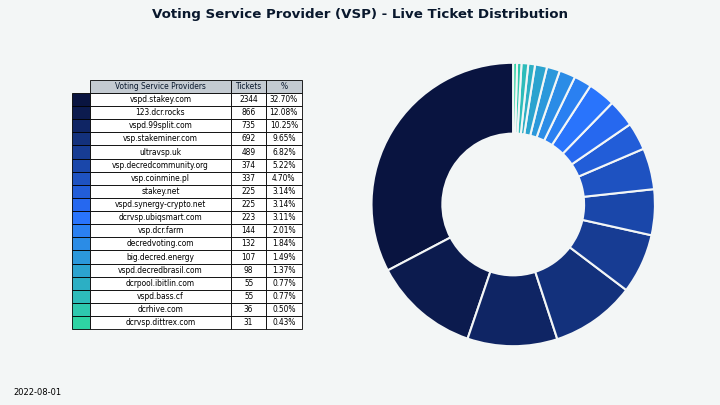
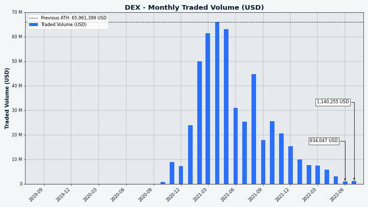

# مجلة ديكريد لشهر يوليو 2022

_الصورة: صناعة الأخبار بواسطة  OfficialCryptos@_

أبرز الأحداث لشهر يوليو:

* أضافت منصة المبادلات اللامركزية لديكريد DCRDEX دعمًا لنوع جديد من محفظة البتكوين، وتم دمج دعم محفظة التحقق البسيط من الدفع ل Electrum
* تقترب بوليتيا من إصدار جديد بمقترحات قديمة مستوردة وبنية إضافية جديدة لواجهة المستخدم الرسومية
* بعد رفض اقتراح لمواصلة تمويل GoDCR، أعلن الفريق أنهم لن يكملوا العمل عليه بعد الآن
* ذكر jy-p@ في مقابلة أنه كان يعمل على شيئ يخص الشبكة البرقية، وهي طريقة جديدة لاستخدام الشبكة البرقية وهي بالفعل مكتملة الميزات وسيتم تقديمها للعلن لأول مرة في غضون الشهرين المقبلين

المحتويات:

* [التطوير](#التطوير)
* [الأشخاص](#الأشخاص)
* [الإدارة و الحوكمة](#الإدارة-و-الحوكمة)
* [الشبكة](#الشبكة)
* [النظام البيئي](#النظام-البيئي)
* [الانتشار](#الانتشار)
* [وسائل الإعلام](#وسائل-الإعلام)
* [مناقشات المجتمع](#مناقشات-المجتمع)
* [الأسواق](#الأسواق)
* [الخارجية ذات الصلة](#الخارجية-ذات-الصلة)

## التطوير

  ما لم يُذكر خلاف ذلك، فإن العمل المَذْكُور هنا يشتمل على حالة "الدمج إلى الرئيسي". وهذا يعني أن العمل قد تم استكماله ومراجعته ودمجه في كود المصدر الذي يمكن للمستخدمين المتقدمين [بناءه وتشغيله](https://medium.com/@artikozel/the-decred-node-back-to-the-source-part-one-27d4576e7e1c)، ولكنه ليس متاحًا بعد في ثنائيات الإصدار للمستخدمين العاديين.

### dcrd

_[dcrd](https://github.com/decred/dcrd) هو تطبيق عقدة كامل يعمل على تشغيل شبكة ديكريد من نظير إلى نظير حول العالم._

التحسينات:

* تم [التنفيذ المباشر](https://github.com/decred/dcrd/pull/2971) لإنشاء المفتاح الخاص لمنحنى secp256k11 لاستبدال الإصدار العام في المكتبة القياسية بأي كود محول مطلوب. ليس فقط هذا التنفيذ أكثر كفاءة بشكل ملحوظ، سواء من حيث سرعة التنفيذ وتخصيص الذاكرة، بل أنه من الناحية النظرية أكثر أمنا لأنه ليس لديه تحيز modulo الموجد في تنفيذ المكتبة القياسية.
* تم [تحسين كود التعدين](https://github.com/decred/dcrd/pull/2977) في وحدة المعالجة المركزية بشكل كبير وهو مفيد للتعدين على شبكة التجارب. كما تمت إعادة صياغة كود تتبع إحصائيات السرعة لتحسين الدقة والأداء. قبل هذا التغيير، كان معدل التجزئة ~0.5 Mh/s ويمكن استخدام ما يصل إلى إثنتان من الذاكرة المركزية بكفاءة. وقد تم تحسين كود معدل التجزئة عند 1.2 Mh/s في ذاكرة مركزية واحدة وأكثر من 10 Mh/s مع 10 ذاكرات مركزية.

مسائل أخرى:

* تمت إزالة [أدوات البذور ل ](https://github.com/decred/dcrd/pull/2974)planetdecred.org في كل من الشبكة الرئيسية و الشبكة التجريبية حسب طلب المشرف.
* تم إعادة تنسيق [تعليقات المستند](https://github.com/decred/dcrd/pull/2976) في المستودع بأكمله باستخدام gofmt في Go 1.19 الجديد. إن القيام بكل ذلك دفعة واحدة في إيداع واحد ينقذ الإيداعات المستقبلية من فوضى إضافية.
* إصلاح [بث التذاكر الفائزة](https://github.com/decred/dcrd/pull/2968) عندما يكون هناك العديد من المرشحين التاليين للكتلة ("رأسيات السلسلة") وبعضهم لا يتوفر لديهم بيانات الكتلة الخاصة بهم. لم تتمكن محافظ التصويت المتصلة ب  dcrd في هذه الحالة من إعادة بدء التصويت للكتل بسبب الخطأ.
* تحسينات صغيرة

_الصورة: يوم آخر في تطوير dcrd._

### dcrwallet

_[dcrwallet](https://github.com/decred/dcrwallet) هو خادم محفظة تستخدمه تطبيقات سطر الأوامر والمحفظة الرسومية._

مشتري التذاكر:

* لا تحاول [خلط الصرف](https://github.com/decred/dcrwallet/pull/2171) إذا لم يتم ضبط خادم ++CoinShuffle.

استخدام JSON-RPC وسطر الأوامر عبر `dcrctl`:

* تم إصلاح مشكلة عدم رؤية أمر `signrawtransasction`  [للمفاتيح الخاصة](https://github.com/decred/dcrwallet/pull/2173) المتوفرة لتوقيع مدخلات P2PKH.

قيد التطوير:

* إضافة طلبات للسماح لـديكريديتون بالحصول على سياسات التصويت الخاصة [بمعاملات الإنفاق المعلقة(https://github.com/decred/dcrwallet/pull/2172) وتحديثها.

### Decrediton

_[ديكريديتون](https://github.com/decred/decrediton) هو تطبيق محفظة لسطح المكتب كامل الميزات مع ميزة التصويت مدمجة، وميزة الخلط ب StakeShuffle، والشبكة البرقية، والتداول على منصة المُبادلات اللامركزية DEX للديكريد، والمزيد. يتم تشغيلها مع سلسلة الكتل كاملة أو بدونها (وضع التحقق البسيط من الدفع SPV)._

قيد التطوير - يتم إدخال [التصويت على معاملات TSpend الفردية](https://github.com/decred/decrediton/pull/3787) في ديكريديتون:

*  ستعرض علامة التبويب إنفاق الخزينة معاملات الإنفاق TSpends المعلقة والقدرة على التصويت.
* في عرض الصفحة الرئيسية سيرى المستخدمون إشعارات بشأن معاملات الإنفاق Tspends الجديدة المفعلة والتي لم يتم التصويت عليها بعد.
* ستظهر صفحة تفاصيل التذاكر مفتاح الخزينة وخيارات تصويت معاملات الإنفاق TSpend التي تم تحديدها على مزود خدمة التصويت.

### بوليتيا

_[بوليتيا](https://github.com/decred/politeia) هي نظام المقترحات لديكريد. يتم استخدامها لطلب التمويل من خزينة ديكريد_

* تمت إزالة القدرة على استخدام LevelDB كمخزن ذي قيمة رئيسية لـ tstore، والذي أصبح الآن MySQL بشكل تلقائي. نظرًا لأن MySQL مطلوب من قبل Trillian على أي حال، فإن إزالة الواجهة الخلفية للتخزين البديلة تبسط إعداد politeiad وتسهل صيانة الكود.
* تم تحديث الواجهة الخلفية tstore للسماح [بالكتابة فوق](https://github.com/decred/politeia/pull/1652) الإدخالات الموجودة. يحفظ tstore البيانات في خطوتين: حفظ البيانات في مخزن القيمة الرئيسية، ثم إلحاق التجزئة الخاصة به في شجرة Trillian. تؤدي الكتابة فوق الإدخالات الحالية إلى إصلاح عدم القدرة على إعادة إرسال البيانات غير المتغيرة إذا فشلت الخطوة الثانية.

الواجهة الخلفية - المكوِّن الإضافي لـ `ticketvote`:

* تمت إضافة [الطابع الزمني](https://github.com/decred/politeia/pull/1653) لتغيير حالة التصويت الأخير إلى بنية ملخص التصويت. هذا يسمح بسحب بيانات أقل عند إعادة بناء جرد الأصوات.
* إعادة كتابة [ذاكرة التخزين المؤقت](https://github.com/decred/politeia/pull/1649)  ل `ticketvote` مع واجهة برمجة التطبيقات المحسنة، وتوثيق أفضل، وحفظ البيانات في قاعدة بيانات المخزن بدلاً من نظام الملفات. وبالمثل، تم نقل [ذاكرة التخزين المؤقت لملخصات التصويت](https://github.com/decred/politeia/pull/1657) و[ذاكرة التخزين المؤقت لإرسالات التصويت](https://github.com/decred/politeia/pull/1658)  من نظام الملفات إلى store الذي يوفر ذاكرة تخزين إضافية.
* تم تنفيذ [وظيفة ](https://github.com/decred/politeia/pull/1659)fsck للمكوِّن الإضافي `ticketvote` والتي تعيد إنشاء جميع ذاكرات التخزين المؤقت الخاصة بها.

الواجهة الخلفية - المقترحات القديمة:

*  تمت [إضافة أمر `import`](https://github.com/decred/politeia/pull/1632) إلى أداة `legacypoliteia`. بحيث تستورد بيانات JSON إلى الواجهة الخلفية ل tstore التي تم إنشاؤها أثناء تنفيذ أمر `convert`. يسمح الأمران `convert` و `import`) بترحيل معظم البيانات من الإصدار السابق من بوليتيا إلى الإصدار الحالي. لا يتم استيراد توقيعات العميل والخادم لأنها لا تتطابق مع البيانات المحولة. كان لا بد من التحقيق في بعض غرابة Trillian ومعالجتها باختبارات وحلول بديلة مكثفة.

الواجهة الخلفية - تغييرات أخرى:

* تم إصلاح خطأ قبول [التعليقات الفارغة](https://github.com/decred/politeia/pull/1655).
* تمت إزالة [كود websockets القديم](https://github.com/decred/politeia/pull/1660) الذي لم يتم استخدامه مطلقًا لأي شيء.
* تنظيف و تعبئة الكود.
* تحسينات و تعديلات مختلفة و غيرها.

تطبيق سطر أوامر "politeaivoter":

* دمج [معالجة خطأ التهيئة](https://github.com/decred/politeia/pull/1648) لتغطية المزيد من الحالات باستمرار.

واجهة المستخدم الرسومية لبوليتيا:

* تمت إزالة  [المقترحات القديمة](https://github.com/decred/politeiagui/pull/2762) المشفرة ومعالجتها بواسطة الكود، بعد أن تم ترحيلها الآن إلى قاعدة بيانات بوليتيا الحالية.
* العديد من التعديلات والتحسينات و 8 إصلاحات.

تقدم واجهة المستخدم الرسومية لبوليتيا نحو [بنية البرنامج المساعد](https://github.com/decred/politeiagui/tree/master/plugins-structure#politeiagui---plugins-structure) الجديد:

*  إظهار وسيلة تحذير [للروابط الخارجية](https://github.com/decred/politeiagui/pull/2804).
* يمكن لكل مكون إضافي الآن [تصدير "تأثيرات"](https://github.com/decred/politeiagui/pull/2800) يمكن للمطورين إعادة استخدامها وتأليفها في تطبيقاتهم الشبيهة بـبوليتيا. على سبيل المثال، عندما يقوم المستخدم بالتمرير إلى نهاية القائمة، يمكن استدعاء الكود لجلب الدفعة التالية من المقترحات/ التعليقات/ملخصات التصويت من المكونات الإضافية المسؤولة عن هذه الميزات القابلة للتوصيل.

تمت إضافة [حزمة واجهة سطر أوامر](https://github.com/decred/politeiagui/pull/2827) `politeiagui-scripts`. يقوم بتفكيك التكوين الشائع ويوفر 7 أوامر لتطوير واختبار الملحقات والتطبيقات.

### cspp

_[cspp](https://github.com/decred/cspp) هو خادم لتنسيق عمليات خلط العملات باستخدام بروتوكول ++CoinShuffle. إنه غير احتجازي، أي لا يحتفظ بأي أموال._

* [يقول jy-p@  إنه أحرز تقدمًا كبيرًا](https://www.youtube.com/watch?v=1RBBNnrPqc0&t=123) مع jrick@ على الخلط من نظير إلى نظير لخدمة خصوصية StakeShuffle لديكريد. يعتمد StakeShuffle حاليًا على خادم مركزي في [mix.decred.org](https://mix.decred.org/).

### DCRDEX

_[DCRDEX](https://github.com/decred/dcrdex) هي منصة مبادلات غير احتجازية للمُبادلات غير الموثوقة، مدعومة بالمقايضات الذرية._

التغييرات العامة التي تواجه المستخدم:

* عرض [مكافئات العملات الورقية](https://github.com/decred/dcrdex/pull/1600) في أماكن مختلفة من واجهة المستخدم.
* إضافة دعم عام [لإعادة تشكيل المحفظة المباشرة](https://github.com/decred/dcrdex/pull/1686) وتنفيذها من أجل BTC. يسمح هذا بإعادة إنشاء العملات المقفلة بعد تغيير تكوين المحفظة. قبل هذا التغيير، كانت إعادة تشكيل محفظة بأوامر مباشرة تفتح الأموال ولكن محاولة استخدامها أدت إلى خطأ.
* تم تنفيذ التخزين المؤقت [لمعدل الرسوم وانتهاء صلاحيته](https://github.com/decred/dcrdex/pull/1721) لحل مشكلة طويلة الأمد تتعلق باستخدام معدل الرسوم الذي عفا عليه الزمن. تم أيضًا تحسين كيفية جلب معدل الرسوم المتكرر من مصادر مختلفة (المحفظة، دفتر الطلبات، واجهة برمجة التطبيقات الخارجية).
* توضيح الرسالة حول [تعطيل خادم منصة المبادلات اللامركزية ](https://github.com/decred/dcrdex/pull/1634)DEX. باستخدام ميزات اكتشاف الحساب الحديثة، يمكن تعطيل الخادم وإعادة تمكينه حسب الحاجة دون دفع رسوم التسجيل مرة أخرى.
* تحسين [استخدام الموارد](https://github.com/decred/dcrdex/pull/1684) عند كتابة السعر.
* إصلاح عرض [النسبة المئوية المملوءة](https://github.com/decred/dcrdex/pull/1711) لعمليات الشراء في السوق.
* إصلاح حصول المستخدمون على [رصيد إكمال الطلب](https://github.com/decred/dcrdex/pull/1707) للطلبات الملغاة في ظروف نادرة.

تغييرات داخلية عامة/تغييرات أخرى:

* فرض التحقق من [تنسيق الكود](https://github.com/decred/dcrdex/pull/1699) أثناء إنشاء CI من أجل التناسق.

دعم ديكريد:

* دعم [المصدر الخارجي](https://github.com/decred/dcrdex/pull/1654) لتقديرات رسوم المعاملات لمحافظ ديكريد (المعارف الدقيقة لواجهة برمجة التطبيقات ل dcrdata)، لتكون بمثابة احتياطي عندما لا تتمكن المحفظة من الحصول على تقدير الرسوم محليًا.
* تم إصلاح مراقبة الكتلة لمحافظ التحقق البسيط من الدفع لديكريد وتحسين [رسائل خطأ الاتصال](https://github.com/decred/dcrdex/pull/1701).

دعم الأصول الشبيهة بالبتكوين والبتكوين:

* دعم إضافي لمحافظ التحقق البسيط من الدفع الشائعة  ل  [Electrum SPV](https://github.com/decred/dcrdex/pull/1607)  (BTC و LTC و BCH).  يمكن لعميل منصة المبادلات اللامركزية DEX التواصل مع محفظة Electrum المحلية (الحد الأدنى للإصدار 4.2) واستخدام أمواله في التداول.
* تمت إضافة تأخير قصير [لإرسال وحدات الزيكاش ZEC](https://github.com/zcash/zcash/issues/6045) بعد تعدين كتلة في اختبارات التحميل، لحل مشكلة في [تحديد مخرجات](https://github.com/zcash/zcash/issues/6045) Zcash.
*حديث الحد الأدنى من [إصدار ](https://github.com/decred/dcrdex/pull/1735)Bitcoin Core المطلوب إلى النسخة 0.21 (و النسخة 0.22 لاستخدام محافظ الواصف).
* إصلاح تحطم المحفظة الأصلية للتحقق البسيط من الدفع للبتكوين بعد [إرسال مبلغ صغير جدًا](https://github.com/decred/dcrdex/pull/1705)  ("مقدار ضئيل") ، والذي لا ينبغي السماح به.
* تم إصلاح إنشاء محفظة BTC أصلية [برسوم صغيرة جدًا](https://github.com/decred/dcrdex/pull/1657).

دعم الإيثيريوم:

* زيادة [سقف رسوم غاز](https://github.com/decred/dcrdex/pull/1692) ETH لعمليات الاسترداد عندما تكون الرسوم الأساسية مرتفعة للغاية.
* تمت إضافة القدرة على [تصدير محفظة ](https://github.com/decred/dcrdex/pull/1648)ETH إلى Metamask.
* تم تغيير كيفية اشتقاق [المفتاح الخاص لمحفظة ](https://github.com/decred/dcrdex/pull/1702)ETH ليكون له تدبير إضافي حيث يتم إنشاء رمز تذكُري Ethereum BIP-39 mnemonic، ثم يتم اشتقاق المفتاح الخاص من تلك البذرة. هذا يترك الباب مفتوحًا لتصدير كلمات البذور ومفتاح الحساب الخاص في المستقبل.
* تمت إضافة اختبار [للتجاوز الحسابي](https://github.com/decred/dcrdex/pull/1722) في عقد Ethereum Solidity. بدءًا من النسخة 0.8.0 ل Solidity، _يجب_ إعادة المعاملة تلقائيًا إذا كان هناك تجاوز. تتم إضافة الاختبار فقط في حالة تقليل إصدار Solidity المستخدم في منصة المبادلات اللامركزية لديكريد DCRDEX بطريقة ما إلى ما دون النسخة 0.8.0، أو في حالة إزالة إصدارات Solidity المستقبلية هذه الحماية. مهما كان ذلك بعيد الاحتمال، التأكد من الأمن أفضل من الندم.

_الصورة: تعرض منصة المبادلات اللامركزية لديكريد DCRDEX مكافِئات العملات الورقية النقدية لتسهيل الانتقال من النظام المالي القديم._
  ### GoDCR
  _[GoDCR](https://github.com/planetdecred/godcr) عبارة عن محفظة واجهة مستخدم رسومية خفيفة الوزن لسطح المكتب مع دعم التحصيص، والخصوصية، والتصويت على بوليتيا، والتصويت بالإجماع، والمزيد._

* تحديث [صفحة المعاملات](https://github.com/planetdecred/godcr/pull/893) (تحسين عرض صف المعاملات، عدد كل نوع معاملة في قائمة التصفية المنسدلة، و غيرها).
* تنفيذ [تصميم صفحة نظرة عامة](https://github.com/planetdecred/godcr/pull/1008) جديدة.
* تم تحديث صفحة إعدادات المحفظة إلى [أحدث واجهة مستخدم](https://github.com/planetdecred/godcr/pull/1007).
* إصلاح [معالجة](https://github.com/planetdecred/godcr/pull/1023) حذف المحفظة.
* تنفيذ تصميم جديد [لعلامة التبويب التحصيص](https://github.com/planetdecred/godcr/pull/1016).
* العديد من إصلاحات الأخطاء وتعديلات واجهة المستخدم.
* تحديثات الترجمة

قيد التطوير:

* واجهة برمجة تطبيقات مبسطة في dcrlibwallet [لسحب البيانات](https://github.com/planetdecred/dcrlibwallet/pull/255) من مستكشف كتل dcrdata ومنصات المبادلات.
* تصميم جديد [لصفحة ](https://github.com/planetdecred/godcr/pull/1024)StakeShuffle.
* تصميم جديد [لصفحة المعاملات](https://github.com/planetdecred/godcr/issues/1025).
* وظيفة [البحث عن المقترح](https://github.com/planetdecred/godcr/pull/1027).

_الصورة: تصميم جديد لصفحة التحصيص على GoDCR._

### dcrdata

_[dcrdata](https://github.com/decred/dcrdata) هو مستكشف لبيانات سلسلة كتلة ديكريد وبيانات خارج السلسلة مثل مقترحات ديكريد والأسواق والمزيد._

* تمت إضافة صفحة [التحقق من توقيع الرسالة](https://github.com/decred/dcrdata/pull/1911) ونقطتي نهاية HTTP API جديدتين للاستخدام في النصوص والتطبيقات. كما تمت إضافة [محدد طلب أساسي](https://github.com/decred/dcrdata/commit/c9d07773f51cc93186d6c4d1c1f74f8c170f297d) مع افتراضي 2 MiB، نزولا من 10 MiB.

قيد التطوير:

*  كشف المزيد من [آليات الخزينة](https://github.com/decred/dcrdata/pull/1918) مثل تقدم النصاب، التاريخ التقريبي بدء/انتهاء التصويت، ومفاتيح Pi المستخدمة، والمزيد.
* يبحث المطورون في [مشاكل الترقيم](https://github.com/decred/dcrdata/issues/1925) على صفحة الخزينة.

### المستندات

_[dcrdocs](https://github.com/decred/dcrdocs) هو الكود المصدري لوثائق مستخدم ديكريد._

*  تم تحديث المستندات المتعلقة [بتطبيقات سطر الأوامر](https://github.com/decred/dcrdocs/pull/1193) لتتناسب مع إصدار النسخة 1.7.2، والدعم المذكور لشريحة Apple M1 وأنظمة BSD.
* تم [تحديث وإعادة تنظيم](https://github.com/decred/dcrdocs/pull/1195) دليل [استخدام مستكشف الكتلة](https://docs.decred.org/getting-started/using-the-block-explorer/) لمعالجة بعض [الالتباس](https://www.reddit.com/r/decred/comments/uqrdpa/dcr_data_looking_into_a_block_decred_fundamentals/i8su4lb/) في ريديت.

### decred.org

_[dcrweb](https://github.com/decred/dcrweb) هو الكود المصدري لموقع decred.org._

* تم [تنظيف](https://github.com/decred/dcrweb/pull/1052) روابط [وسائل التواصل الاجتماعي](https://decred.org/community/). والجدير بالذكر أنه تمت إزالة وسائل التواصل الاجتماعي الصينية المحددة بسبب الافتقار إلى السيطرة والاشراف المناسب على هذه القنوات.

### مسائل أخرى:

رداً على سؤال مجتمعي "ما الذي ترغب من ديكريد تطويره بعد ذلك ؟" ألقى jy-p@ [ملخص خبر تشويقي](https://www.youtube.com/watch?v=1RBBNnrPqc0&t=2462): "لهذا جواب بسيط.  لقد طورته، وهو جاهز تقريبًا، وهو يملأ فجوة كانت لدينا منذ فترة طويلة جدًا، وهي تتضمن الشبكة البرقية. لن أقول الكثير غير ذلك. يمكنك التفكير في الأمر على هذا النحو. هناك مجموعة كاملة من المشاكل من حولنا اليوم. هناك واحد منهم يجعلني مجنونًا تمامًا وسأحاول معالجته. "أيا يكون هذا الشيء، يمكن تقدير المدة الزمنية المتبقية للعمل المتبقي للإدماج و واجهة المستخدم الرسومية "بشهرين تقريبًا".

## الأشخاص

تهانينا للمتعاقدين الجدد الذين منحوا تصريح متعاقدي ديكريد (DCC) في مايو ويونيو:

* @philemon (تحت إسم [@ukane-philemon](https://github.com/ukane-philemon) على GitHub، التطوير)
* @zippycorners (تحت إسم [@matthawkins90](https://github.com/matthawkins90) على GitHub، التطوير)

تمت مقابلة مطوري ديكريد [@dreacot (GoDCR)](https://www.decredmagazine.com/introducing-decred-developer-dreacot/) و [@VictorGuedes (Politeia)](https://www.decredmagazine.com/introducing-decred-developer-victorguedes/) بواسطة @phoenixgreen على مجلة ديكريد.

إحصائيات المجتمع اعتبارًا من 1 أغسطس (مقارنة بـ 1 يوليو):

*  متابعو [التويتر](https://twitter.com/decredproject): 54,306 (-74)
* المشتركين في [ريديت](https://www.reddit.com/r/decred/): 12,633 (-3)
* مستخدمي غرفة الدردشة general# على [الماتريكس](https://chat.decred.org/): 707 (+18)
* مستخدمي [الديسكورد](https://discord.gg/GJ2GXfz): 1,765 (-561 - تم إزالة المستخدمون غير نشطين)
* مستخدمي [التيليجرام](https://t.me/Decred): 2,773 (-37)
* المشتركين في [اليوتيوب](https://www.youtube.com/decredchannel): ~4,630 (+0)، المشاهدات: 212 ألف (بزيادة ألفان)

## الإدارة و الحوكمة

في يوليو، تلقت [الخزينة](https://dcrdata.decred.org/treasury) الجديدة 9,204 DCR بقيمة 220 ألف دولار بمتوسط سعر يوليو البالغ 23.93 دولار. تم إنفاق 3,205 DCR للدفع للمتعاقدين، بقيمة 77 ألف دولار بسعر يوليو، أو 90 ألف دولار بمعدل فواتير يونيو البالغ 28.06 دولارًا.

تم تعدين [معاملة](https://explorer.dcrdata.org/tx/453e713358bb3c5662ebc1f58c50c50ceb66a950dae925701d8e25a3c4c72d4e)  إنفاق الخزينة في 24 يوليو، وكان لديها 20 ناتجًا يتراوح من 2.8 DCR إلى 1,184 DCR. تمت الموافقة على المعاملة بأغلبية 4,590 صوتا و 7 صوت بلا.

اعتبارًا من 8 أغسطس، بلغ الرصيد المشترك للخزينة [القديمة](https://dcrdata.decred.org/address/Dcur2mcGjmENx4DhNqDctW5wJCVyT3Qeqkx) والخزينة [الجديدة 807,000 DCR (أي مايقارب 30.7 مليون دولار أمريكي بسعر 38.01 دولارًا أمريكيًا).

لم تكن هناك مقترحات جديدة في يوليو. تمت الموافقة على [اقتراح](https://proposals.decred.org/record/3bb2c7e) مجلة ديكريد في يوليو بموافقة 87٪ وإقبال 28٪. تم رفض مقترحين آخرين، لـ GoDCR (موافقة 20٪، إقبال 57٪) و مقترح التسويق لديكريد البرازيل (موافقة 19٪، إقبال 57٪).

للمزيد من التفاصيل حول مقترحات الشهر راجع [العدد 53](https://blockcommons.red/politeia-digest/issue053/) من موجز بوليتيا.

## الشبكة

**معدل الهاش**: افتتحت [معدلات الهاش](https://dcrdata.decred.org/charts?chart=hashrate&zoom=l4vb70eb-l6cmn0q7&scale=linear&bin=block&axis=time) في شهر يوليو عند ~87 Ph/s وأغلقت عند ~85 Ph/s، وبلغ قاعها عند ~44 Ph/s كما بلغت ذروتها عند 116 Ph/s على مدار الشهر.

_الصورة: يواصل معدل التجزئة البحث عن توازن جديد._

توزيع 42 Ph/s من معدل الهاش الذي [تم الإبلاغ عنه](https://miningpoolstats.stream/decred) بواسطة المجمعات في 1 أغسطس: Poolin بنسبة 36%، و ViaBTC بنسبة 36%، و F2Pool بنسبة 13%، و BTC.com بنسبة 9%، و AntPool بنسبة 6%، و CoinMine بنسبة 1%.

توزيع  1,000 كتلة تم [تعدينها](https://miningpoolstats.stream/decred) بالفعل بحلول 1 أغسطس: Poolin بنسبة 42%، و ViaBTC بنسبة 30%، و BTC.com بنسبة 8%، و CoinmMine بنسبة 1%، و أخرى غير معروفة بنسبة 19%.

_الصورة: توزيع معدل تجزئة التجمع._

**التحصيص**: تراوح [سعر التذكرة](https://dcrdata.decred.org/charts?chart=ticket-price&zoom=l4vb70eb-l6cmn0q7&axis=time&visibility=true-true&mode=stepped) بين 215-238 DCR، [بمتوسط](https://dcrstats.com/) 226.8 DCR (+3.1) خلال 30 يوما.

بلغ [المبلغ المقفل](https://dcrdata.decred.org/charts?chart=ticket-pool-value&zoom=l4vb70eb-l6cmn0q7&scale=linear&bin=block&axis=time) 9.12-9.25 مليون DCR، مما يعني أن 63.7-64.5% من العرض المتاح [شارك](https://dcrdata.decred.org/charts?chart=stake-participation&zoom=l4vb70eb-l6cmn0q7&scale=linear&bin=block&axis=time) في إثبات الحصة.

_الصورة: أعلى مستوى للمشاركة في التحصيص._

**مقدم خدمة التصويت**: في 1 أغسطس، تمت إدارة حوالي 7,170 (+20) تذكرة حية بواسطة خوادم vspd المدرجة. إجمالاً، تمكن 18 مقدم خدمة التصويت من إدارة  17.4٪ من مجموع التذاكر (+ 0.1٪.

_الصورة: توزيع التذاكر المدارة بواسطة مقدمو خدمة التصويت._

**العقد**: إصدارات العقدة التي تم التقاطها بواسطة [مصمم خرائط ديكريد](https://nodes.jholdstock.uk/user_agents) في 9 أغسطس (إجمالي 127، dcrd فقط): النسخة 1.7.1 - 39%، النسخة 1.7.2 - 25%، النسخة 1.7.0 - 11%، النسخة 1.7.0 لبناءَات التطوير - 7%، النسخة 1.8.0 لبناءَات التطوير - 4%، سلاسل النسخة 1.6 - 3%، سلاسل النسخة 1.5 - 0.7%، سلاسل النسخة 1.4 - 0.7%.

_الصورة: توزيع إصدار عقدة dcrd_

تراوحت حصة [العملات المخلوطة](https://dcrdata.decred.org/charts?chart=coin-supply&zoom=jz3q237o-la8vk000&scale=linear&bin=day&axis=time&visibility=true-true-true) بين 60.6-60.8%. وقد تفاوتت [الكمية المخلوطة](https://dcrdata.decred.org/charts?chart=privacy-participation&zoom=l4pct44v-l6ik5xc0&bin=day&axis=time&visibility=true-false) بشكل يومي ما بين 244 و 509 ألف DCR.

شهدت [الشبكة البرقية](https://ln-map.jholdstock.uk/) لديكريد 45 عقدة (+1) و 78 قناة (+6) بسعة إجمالية 36.9 DCR (+0.2)، اعتبارًا من 9 أغسطس.

## النظام البيئي

تم إدراج مزودي خدمة تصويت جديدين على decred.org و ديكريديتون: [vspd.bass.cf](https://vspd.bass.cf/) بواسطة [@cryptocoiner69](https://github.com/decred/dcrwebapi/pull/162) (رسوم بنسبة 0.2٪) و [dcrhive.com](https://dcrhive.com/) بواسطة @kozel (رسوم بنسبة 0.7٪). يخطط @kozel لاستخدام رسوم مزود خدمة التصويت المكتسبة [لتوفير السيولة](https://www.reddit.com/r/decred/comments/vt0wrt/dcr_hive_a_new_lowish_fee_vsp_coming_to_your/) لفائدة الشبكة البرقية لديكريد - وهو حافز جديد مثير للاهتمام يجب أخده بعين الإعتبار عند اختيار مزود خدمة التصويت.

خفضت Binance تأكيدات DCR المطلوبة من 20 إلى 6 تأكيدات [وفقًا لـ ](https://matrix.to/#/!lDZCzVQjFoJsXMPkvr:decred.org/$XSPP3KlRoIcNt3cqBG9ZbgTnwu88Kr6VcwPDTNEGZo4?via=decred.org&via=matrix.org&via=planetdecred.org)@jz.

تم إطلاق [BisonPool](https://bisonpool.org/) رسميًا. يعتبر BisonPool نوعًا جديدًا من تجمعات إثبات الحصة التي تمكن جميع حاملي ديكريد من ربح مكافآت  إثبات الحصة، حتى لو لم يتمكنوا من شراء تذكرة كاملة بمفردهم. لجعل هذا ممكنًا، تجمع BisonPool مستخدمي ديكريد لشراء التذاكر. يتم تقسيم مكافآت التذاكر بين المشاركين بناءً على مقدار وحدات ديكريد الذي كانوا قادرين على تقديمها. شاهد الإعلان على [الريديت](https://www.reddit.com/r/decred/comments/vyydm1/bisonpool_is_now_live/).

لا يستطيع المستخدمون التحكم في تفضيلات التصويت لتذاكرهم على BisonPool.

تجدر الإشارة إلى أن هذه خدمة احتجازية، مما يعني أن BisonPool تتحكم في أموال المستخدم. هناك خطر من إمكانية سرقة وحدات ديكريد الخاصة بك إذا اخترت استخدام هذه الخدمة. هوية من يدير BisonPool غير معروفة للمجتمع. تذكر، ليست مفاتيحك، ليست أموالك.

تحذير: ليس لدى مؤلفي مجلة ديكريد أي فكرة عن مصداقية أي من الخدمات أعلاه. يرجى إجراء بحثك الخاص قبل الوثوق بمعلوماتك الشخصية أو أصولك لأي كيان.

انضم إلى غرفة الدردشة [#ecosystem](https://chat.decred.org/#/room/#ecosystem:decred.org) لمتابعة تحديثات النظام البيئي لديكريد.

## الإنتشار

إنجازات Monde PR:

* عرضت ديكريد على فرصتين للعلاقات العامة.
* تم الرد على طلبين للتعليق.
* تأمين مقابلة إعلامية واحدة.
* الحصول على 2 من الصحفيين المستقلين للكتابة لمجلة ديكريد.

تأمين المقالات الإخبارية التالية:

* مقال في [Finder](https://www.finder.com/id/ethereum-eth-price-prediction) يعرض تعليقًا من jz@ عن توقعات الإيثيريوم لعام 2022.
* مقال في [Finder](https://www.finder.com.au/solana-sol-price-prediction) يعرض تعليقًا من jz@ عن توقعات سولانا لعام 2022.
* مقال في [Finder](https://www.finder.com/nz/litecoin-ltc-price-prediction) يعرض تعليقًا من jz@ عن توقعات اللايتكوين لعام 2022.
* مقال في [Finder](https://www.finder.com/id/dogecoin-doge-price-prediction) يعرض تعليقًا من jz@ عن توقعات Dogecoin لعام 2022.
* مقال في [Cointelegraph](https://cointelegraph.com/news/3ac-a-10b-hedge-fund-gone-bust-with-founders-on-the-run) يعرض تعليقًا من jz@ حول ما أدى إلى سقوط Three Arrows Capital. تم تجميع المقال في 44 منشورًا بما في ذلك [Crypto News Canada](https://cryptonewscanada.com/3ac-a-10b-hedge-fund-gone-bust-with-founders-on-the-run/) و [The Switzerland Times](https://www.theswitzerlandtimes.com/3ac-a-10-billion-hedge-fund-goes-bankrupt-with-founders-on-the-run/) و [Bitcoin Insider](https://www.bitcoininsider.org/article/176949/3ac-10b-hedge-fund-gone-bust-founders-run).

## وسائل الإعلام

تحديث [مجلة ديكريد](https://www.decredmagazine.com/):

> في يوليو، نشرنا 10 مقالات جديدة وأضفنا جميع محتويات "Decred Assembly" السابقة إلى الأرشيف. لدينا مساهم رسمي جديد - Tivra.
>
> لدى مجلة ديكريد الآن 297 منشورًا و 50 مشتركًا في الرسائل الإخبارية و 6 حملات نشطة على وسائل التواصل الاجتماعي. لست متأكدًا من كيفية إظهار المشاركة الكاملة لوسائل التواصل الاجتماعي، ولكن وفقًا لإحصائياتي على مدار الثلاثين يومًا الماضية، كانت هناك 48 مشاركة جديدة، و 309 نقرات على المنشورات، و 375 إعجابًا، و 56 إعادة تغريد، وتم نشر المحتوى إلى 887 متابعًا عبر الكل حسابات. \[phoenixgreen@\]

لدى مجلة ديكريد  قناة التويتر الخاصة بها الآن، [تابع decredmagazine@](https://twitter.com/decredmagazine) للحصول على قصص وإعلانات جديدة.

مطلوب مؤلفون! تواصل مع phoenixgreen@ على غرفة الشات [#writers](https://chat.decred.org/#/room/#writers:decred.org) على الماتريكس، أو [DecredSociety@](https://twitter.com/DecredSociety) على التويتر.

**مقالات مجلة ديكريد:**

* [تقديم مطور ديكريد dreacot@](https://www.decredmagazine.com/introducing-decred-developer-dreacot/) بواسطة phoenixgreen@
* [الكرة السحرية رقم 8، هل هذا هو القاع؟](https://www.decredmagazine.com/magic-8-ball-is-this-the-bottom/) التحليل الفني بواسطة Applesaucesome@
* [المال السليم الذي يتكرر و يتطور](https://www.decredmagazine.com/decred-iterates-where-bitcoin-is-weak-broken/) بواسطة RonnieAmato@
*  [تردد، شك، وجرعة شهرية من التحليل الفني التخميني](https://www.decredmagazine.com/indecision-doubt-and-a-monthly-dose-of-hopium/) بواسطة Applesaucesome@

**أشرطة الفيديو:**

* [شرح ديكريد - تحسين اللامركزية وقابلية التوسع باستخدام آلية إجماع هجينة(https://www.youtube.com/watch?v=VjbYtYFkYI4) بواسطة Crypto Sketch 101
* [محدثات النشرة الإخبارية لديكريد - أول منظمة لامركزية مستقلة تدفع المدفوعات مع قواعد جديدة، وتدقيق عقد DEX Solidity، و أعلى مستوى على الإطلاق للوحدات المخلوطة للخصوصية والمزيد!](https://www.youtube.com/watch?v=QOCC4INo2TM) بواسطة Exitus@
* [ما هي ديكريد ؟ توقعات أسعار DCR (موضح بالرسوم المتحركة)](https://www.youtube.com/watch?v=Gpa-xADhtow) بواسطة Blockchain Side
* DCRDATA[ التفاصيل التي تحدد المشروع - أساسيات ديكريد](https://www.youtube.com/watch?v=Y6U_iWYQb9A) بواسطة phoenixgreen@

**البث المباشر:**

* [الاقتصاد ذو المستويين - ديكريد وحالة السوق مع ](https://www.youtube.com/watch?v=1RBBNnrPqc0)Jake Yocom-Piatt و Exitus@ و phoenixgreen@

**المتعة و الفن:**

* [ترتقي ديكريد لتتطورو تتكيف](https://www.decredmagazine.com/decred-stairs-to-evolve-and-adapt/) بواسطة OfficialCryptos@ ([التغريدة](https://twitter.com/decredmagazine/status/1551255007118458883))
* [إحصائيات الخلط لديكريد بواسطة StakeShuffle](https://twitter.com/karamblez/status/1551637047038853122) موضحة بالرسوم بواسطة karamble@

## مناقشات المجتمع

منشورات الريديت المختارة:

* توقفت مبادرة المساهمات الأسبوعية مؤقتًا لمدة شهر ولكنها [عادت بإصدار رابع](https://www.reddit.com/r/decred/comments/w7qg79/weekly_contributions_edition_4_bounty_pool_2_dcr/) لمدة أطول ومجموعة مكافآت من DCR 2 (بالإضافة إلى DCR 1 تعهد به أحد المشاركين للحصول على ثاني أفضل مساهمة إذا كان هناك واحد). يسير التمهيد بجد ولكن لا يزال هناك المزيد من الأفكار التي يجب تجربتها قبل الاستسلام.

## الأسواق

في يوليو، تم تداول DCR بين 20.86 دولارًا أمريكيًا و 29.10 دولارًا أمريكيًا/BTC 0.00104-0.00134. وقد بلغ متوسط السعر اليومي 23.93 دولارًا.

شارك Applesaucesome@ [مراجعتين](https://www.decredmagazine.com/indecision-doubt-and-a-monthly-dose-of-hopium/) [للسوق](https://www.decredmagazine.com/magic-8-ball-is-this-the-bottom/) مع رسوم بيانية وتعليقات عن العملات الرقمية والسوق الأوسع، و "الجيل القادم من الهيبوم" في القطعة الأخيرة.

_الصورة: الحجم الشهري لـ DCRDEX بالدولار الأمريكي._

## الخارجية ذات الصلة

مجموعة الأشخاص الذين يشيرون إلى أنفسهم باسم "Bitcoin Maximalists" تجزؤ و [تقلص](https://www.coindesk.com/layer2/2022/07/06/nic-carter-and-the-case-for-bitcoin-mediumism/)، كما  شهد شهر يوليو بعض الارتدادات والانفصالات الكبيرة. قدم نيك كارتر لسنوات عديدة رواية مؤيدة لعملة البتكوين في وسائل الإعلام بشكل كامل، وكسب احترام الكثيرين في المجتمع - ولكن عندما تم تعيين أحدث استثمار لصندوقه Castle Island Ventures من قبل Bitcoin Maximalists على التويتر، شن نيك هجومًا مطولًا ضدهم، داعيًا إلى سوء خطوات تلك المجموعة وإخفاقاتها ونأى بنفسه عنها. و في وقت لاحق من الشهر، اعترض Samson Mow، الذي يعتبره الكثيرون العقل المدبر للتطرف، على [تعليق](https://twitter.com/TheBlueMatt/status/1556448996159377414) من مطور البتكوين منذ فترة طويلة Matt Carralo وغرد أنه يجب على الناس [تذكر](https://twitter.com/Excellion/status/1556508492822745089) Matt كشخص قدم خطأ تضخمي إلى البتكوين - شعور مثير للجدل أثار انتقادات من العديد من مطوري البتكوين الآخرين، مشيرين إلى أن عمل التطوير يخضع للمراجعة من قبل فريق كامل من الأشخاص وحطه من قدر Matt لإدلائه بتعليقاته هو نوع من السلوك السام الذي يدفع الناس بعيدًا عن البتكوين. كما [أعلن](https://coincodecap.com/lead-bitcoin-core-maintainer-to-leave) أحد مشرفي Bitcoin Core الرئيسيين بعد ذلك بوقت قصير أنهم سيتنحون عن هذا الدور.

قامت Tesla [ببيع](https://www.coindesk.com/business/2022/07/20/tesla-sold-936m-worth-of-bitcoin-in-second-quarter/) 75% من ممتلكاتها من BTC في الربع الثاني من عام 2022، بقيمة 936 مليون دولار وقت البيع. كما احتفظت شركة Microstrategy، التي تبذل جهدًا كبيرًا في شراء BTC،  لكنها تحملت “رسوم انخفاض القيمة” البالغة 918 مليون دولار. وقد استقال مايكل سايلور، المعروف [بفنان ميم](https://dailycoin.com/top-10-crazy-things-michael-saylor-said-about-bitcoin/) البتكوين المتطرف، من منصبه كرئيس تنفيذي "[للتركيز على شراء البيتكوين](https://www.coindesk.com/business/2022/08/02/microstrategy-replaces-saylor-as-ceo-with-companys-president-saylor-to-become-executive-chairman/)"، لكنه لا يزال مسيطرًا على غالبية أسهم الشركة في التصويت ورئيسًا لمجلس الإدارة.

تمت [سرقة](https://www.reuters.com/world/china/hacker-claims-have-stolen-1-bln-records-chinese-citizens-police-2022-07-04/) تفاصيل مليار مواطن صيني وإتاحتها على منتدى قراصنة الإنترنت المظلم. كان الرئيس التنفيذي لشركة الباينانس CZ من أوائل الذين [غردوا](https://twitter.com/cz_binance/status/1543700689611792386) حول هذا الموضوع، مشيرًا إلى أنه سيتم زيادة عمليات التحقق من تهديد للباينانس في المنطقة المتأثرة، وتكهن بحدوث الاختراق لأن [مطورًا سرب مفاتيحه](https://twitter.com/cz_binance/status/1543905416748359680) في منشور مدونة. هذا دليل آخر على أن أفضل طريقة لحماية بيانات المستخدم هي عدم جمعها في المقام الأول.

تفتتح مؤسسة Solana Foundation "[سفارة](https://www.coindesk.com/layer2/2022/07/28/is-solana-leading-crypto-into-retail-or-trailing-apple/)" في مدينة نيويورك - وهي وحدة من نوع متجر Apple حيث سيتمكن الأشخاص من إلقاء نظرة على Solana NFTs والتحقق من هاتف Solana القادم.

هذا كل شيء لشهر يوليو. شارك بتحديثاتك للإصدار التالي في غرفة الدردشة [#journal](https://chat.decred.org/#/room/#journal:decred.org).

## عن هذا العدد 
  
هذا هو العدد 49 من مجلة صحيفة ديكريد. فهرس جميع الإصدارات والمرايا والترجمات متاح [هنا](https://xaur.github.io/decred-news/).

يتم نقل معظم المعلومات الواردة من أطراف ثالثة مباشرة من المصدر بعد التحقق من الحد الأدنى لصحتها. ليس لدى مؤلفي مجلة صحيفة الديكريد القدرة على التحقق من جميع الادعاءات.رجاء إحذر من أعمال الاحتيال وقم ببحثك الخاص.

الاعتمادات (بالترتيب الأبجدي):

- الكتابة والتحرير: bee و bochinchero و Exitus و jz و l1ndseymm و phoenixgreen و richardred
المراجعات والتعليقات: buck54321
- صورة العنوان: OfficialCryptos
- التمويل: أصحاب حصص الديكريد

النسخة الأصلية لمجلة الديكريد لشهر يوليو متوفرة على هذا الرابط [هنا](https://xaur.github.io/decred-news/journal/202207).

تمت الترجمة إلى اللغة العربية بواسطة: arij@. قام بالمراجعة abdulrahman4@.
