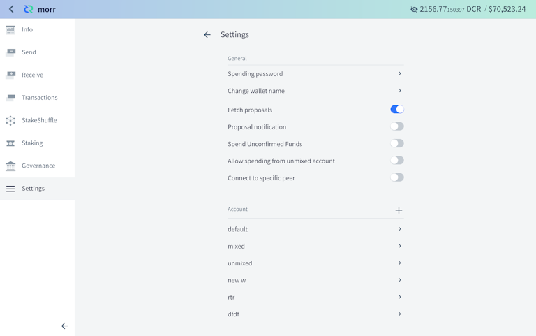
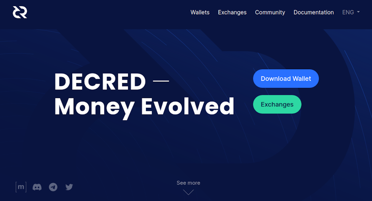
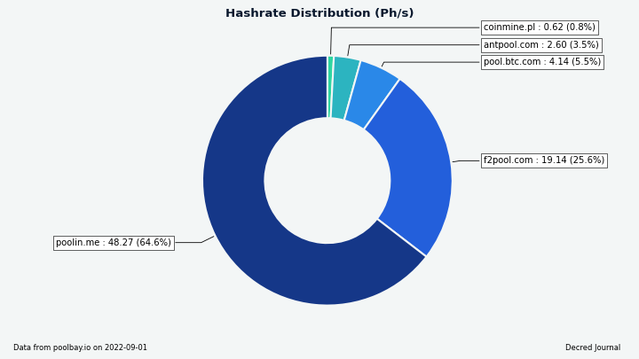
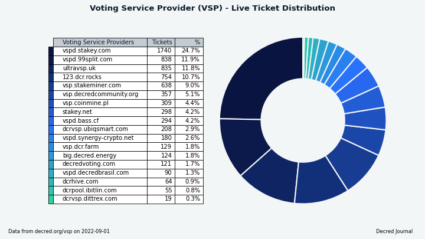
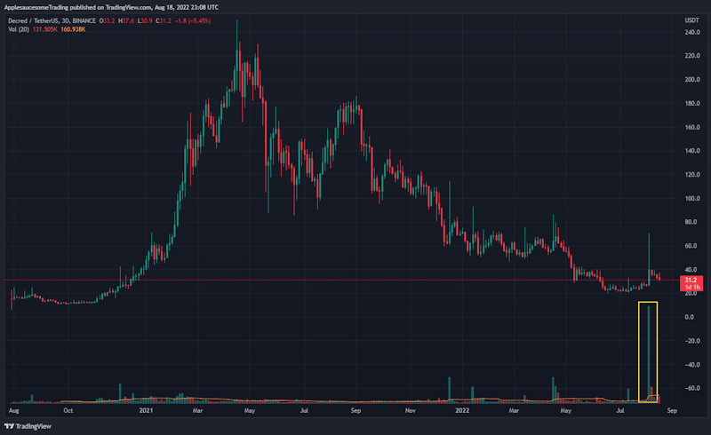

# مجلة ديكريد لشهر أغسطس 2022

_الصورة: "مستوحاة" من تصميم decred.org الجديد الخاص بـ saender@._

أبرز أحداث شهر أغسطس:

* تم اقتراح إصلاح موقع decred.org وتم إقراره ونشره.
* تم إصدار النسخة 1.4.0 لبوليتيا، وتتضمن الميزات الجديدة نافذة مدتها 5 دقائق لتحرير تعليقات الفرد.
* تم إصدار النسخة 0.5.2 لمنصة المبادلات اللامركزية لديكريد ويمكن تشغيله بالفعل من قبل المتداولين غير الصبورين الذين لا يرغبون في انتظار إدماج تحديث ديكريديتون الجاري العمل عليه.
* تم إصدار النسخة 1.7.4 من برنامج ديكريد الأساسي ككود مصدر فقط لإصلاح شبكة اختبار تم إيقافها بواسطة معدني ASIC.

المحتويات:

* [إصدار النسخة 1.4.0 لبوليتيا](#إصدار-النسخة-1.4.0-لبوليتيا)
* [التطوير](#التطوير)
* [الأشخاص](#الأشخاص)
* [الإدارة و الحوكمة](#الإدارة-و-الحوكمة)
* [الشبكة](#الشبكة)
* [النظام البيئي](#النظام-البيئي)
* [الانتشار](#الانتشار)
* [وسائل الإعلام](#وسائل-الإعلام)
* [مناقشات المجتمع](#مناقشات-المجتمع)
* [الأسواق](#الأسواق)
* [الخارجية ذات الصلة](#الخارجية-ذات-الصلة)

## إصدار النسخة 1.4.0 لبوليتيا

إصدار بوليتيا الجديد ساري المفعول بعد 8 أشهر من التطوير! تشمل النقاط البارزة ما يلي:

* كان استيراد المقترحات القديمة هو الجزء الأكبر من العمل لهذا الإصدار. الآن جميع المقترحات متاحة في [proposals.decred.org](https://proposals.decred.org/) ولا يوجد موقع أرشيف منفصل.
* يمكن تعديل التعليقات في 5 دقائق مباشرة بعد نشرها.
* يتم عرض سبب الرقابة والمنسق للمقترحات الخاضعة للرقابة.
* تحسين مسودات تجربة المستخدم.
* العمل الأولي للبنية الجديدة لبناء تطبيقات الشبيهة ببوليتيا.

شاهد ملاحظات الإصدار الكاملة في مستودعات [politeia](https://github.com/decred/politeia/releases/tag/v1.4.0) و [politeiagui](https://github.com/decred/politeiagui/releases/tag/v1.4.0).

## التطوير

ما لم يُذكر خلاف ذلك، فإن العمل المَذْكُور هنا يشتمل على حالة "الدمج إلى الرئيسي". وهذا يعني أن العمل قد تم استكماله ومراجعته ودمجه في كود المصدر الذي يمكن للمستخدمين المتقدمين [بناءه وتشغيله](https://medium.com/@artikozel/the-decred-node-back-to-the-source-part-one-27d4576e7e1c)، ولكنه ليس متاحًا بعد في ثنائيات الإصدار للمستخدمين العاديين.

### dcrd

_[dcrd](https://github.com/decred/dcrd) هو تطبيق عقدة كامل يعمل على تشغيل شبكة ديكريد من نظير إلى نظير حول العالم._

تم إصدار النسخة 1.7.4 ل dcrd لإصلاح خوارزمية التعدين على شبكة الإختبار على النحو المفصل أدناه. كان كودا مصدريًا يتم إصداره فقط لأنه مخصص بشكل أساسي للمطورين.

تم دمجها إلى الفرع الرئيسي `master` وتم تحويلها إلى الإصدار 1.7.4:

* فرض [تناقص الصعوبة](https://github.com/decred/dcrd/pull/2978) على شبكة الإختبار. عادةً لا يُتوقع وجود ASICs على شبكة الاختبار ويتم تعدين الكتل باستخدام تعدين "بطيء" لوحدة المعالجة المركزية (CPU)، نظرًا لأنه من غير المعقول طلب أجهزة عالية الطاقة لتشغيل شبكة الإختبار. كما أنه لا يوجد حافز مالي لأن عملات شبكة الإختبار ليس لها قيمة ولأن معدني ASIC لديهم خيار أفضل لتعدين العملات الشبكة الرئيسية من أجل الربح. وعلى الرغم من ذلك، فإن معدل تجزئة غير عادي يبلغ ~78 Th/s (ما يعادل 2 من Antminer DR5) انضم إلى شبكة الاختبار ديكريد و قام بالتعدين لمدة 5 ساعات تقريبًا، مما زاد من الصعوبة وأدى إلى توقف الشبكة بشكل فعال. وللحد من نوع الألعاب التي يمكن أن تلعبها ASICs على  شبكة الاختبار، تم تقديم قاعدتين جديدتين: الحد الأقصى للصعوبة المسموح بها والحد الأقصى لمعدل إنتاج الكتلة بمجرد الوصول إلى أقصى صعوبة. وهذا من شأنه أن يبقي التعدين في وحدة المعالجة المركزية ممكناً حتى في وجود وحدات معالجة الرسومات و ASIC. وتجدر الإشارة إلى أن هذا الحل مناسب فقط على شبكة اختبار حيث لا توجد قيمة نقدية حقيقية قيد التشغيل وبالتالي لا تنطبق ميكانيكا نظرية اللعبة النموذجية. وهذا من شأنه أن يبقي التعدين بوحدة المعالجة المركزية ممكناً حتى في وجود وحدات معالجة الرسومات ووحدات معالجة الرسومات. وتجدر الإشارة إلى أن هذا الحل مناسب فقط على شبكة الاختبار حيث لا توجد قيمة نقدية حقيقية على المحك وبالتالي لا تنطبق ميكانيكا نظرية اللعبة النموذجية.
* تحسين معالجة الكتل التي تضم عدد قليل جدًا من أصوات التذاكر [لنسخ المعاملات العادية](https://github.com/decred/dcrd/pull/2978/commits/659b7fed1f225861b8b689ead1a0466099992479) أيضًا في نموذج كتلة بديل بالإضافة إلى معاملات التحصيص. وهذا يجعل إنشاء القالب أكثر قوة في حالة الإنفاق المكرر ويساعد على ضمان إضافة جميع المعاملات في كتلة غير صالحة (منخفضة التصويت) إلى قوالب الكتل البديلة. في السابق تم نسخ جميع المعاملات أيضًا ولكن فقط في الكتلة التالية، لذلك يزيل هذا التغيير أي تأخير غير ضروري.

تم الدمج في الفرع  الرئيسي نحو النسخة 1.8:

* تم جعل إجراء اختبارات سلسلة الكتل `blockchain` التي تعمل لفترة أطول [تشتغل بالتوازي](https://github.com/decred/dcrd/pull/2988) لتقليل وقت الاختبار الإجمالي إلى النصف تقريبًا.
* تمت إزالة جميع الكود المتعلق [باللقطات السابقة للبرنامج النصي](https://github.com/decred/dcrd/pull/2989) الآن حيث تمت إزالة فهرس العناوين ولا توجد مفهرسات أخرى تتطلب الوصول إلى البرامج النصية السابقة.
* الصيانة والإصلاحات الأصغر.

### dcrwallet

_[dcrwallet](https://github.com/decred/dcrwallet) هو خادم محفظة تستخدمه تطبيقات سطر الأوامر والمحفظة الرسومية._

تم الدمج في الفرع الرئيسي `master` و تم التحويل إلى إصدار نسخة المصدر فقط 1.7.4:

* تنفيذ طريقة لاستيراد [المفاتيح العمومية](https://github.com/decred/dcrwallet/pull/2177) العشوائية والعناوين المشتقة منها. تم دعمها فقط لمحافظ المشاهدة فقط.
* تمت إضافة نقاط تفتيش إلى [tesnet3 ذات التفرع الصلب](https://github.com/decred/dcrwallet/pull/2178) إلى القواعد الجديدة المطبقة في dcrd. يتم استخدام نقاط التفتيش لدفع المحفظة إلى السلسلة المقصودة غير المصوتة نظرًا لأن عملها الكلي أقل بكثير من السلسلة التي يتم إعادة تشكيلها.

تم الدمج في الفرع الرئيسي:

* تم تحديث [اختبارات الصعوبة](https://github.com/decred/dcrwallet/pull/2181) لقواعد التناقص الجديدة على testnet3.

### dcrctl

_[dcrctl](https://github.com/decred/dcrctl) هو خادم محفظة تستخدمه تطبيقات سطر الأوامر والمحفظة الرسومية._

* تم تحديث أحدث [وحدات ](https://github.com/decred/dcrctl/pull/49)Go وإصدارات [عمل ](https://github.com/decred/dcrctl/pull/48)GitHub.

### Decrediton

_[Decrediton](https://github.com/decred/decrediton) ديكريديتون هو تطبيق محفظة لسطح المكتب كامل الميزات مع ميزة التصويت مدمجة، وميزة الخلط ب StakeShuffle، والشبكة البرقية، والتداول على منصة المُبادلات اللامركزية DEX للديكريد، والمزيد. يتم تشغيلها مع سلسلة الكتل كاملة أو بدونها (وضع التحقق البسيط من الدفع SPV)._

* تمت إضافة القدرة على [تحديث](https://github.com/decred/decrediton/pull/3785) نافذة DEX باستخدام مفتاح F5.
* تستخدم صفحة إنفاق الخزينة الآن [مفاتيح ](https://github.com/decred/decrediton/pull/3776)testnet Pi على شبكة الاختبار ولديها روابط مناسبة للتحقق منها في كود مصدر dcrd.
* تم تصحيح "StakeShuffle++" إلى "StakeShuffle" في [علامة التبويب الخصوصية](https://github.com/decred/decrediton/pull/3779).
* ~ 4 إصلاحات وتحديثات داخلية أخرى.

### بوليتيا

_[بوليتيا](https://github.com/decred/politeia) هي نظام المقترحات لديكريد. يتم استخدامها لطلب التمويل من خزينة ديكريد_

التغييرات الخلفية:

* تحسين و تعزيز التحقق في الأمر [`dbutil -migrate`](https://github.com/decred/politeia/pull/1667) (يُستخدم للترحيل من قاعدة بيانات مستخدم إلى أخرى).
* تخزين [إصدار التطبيق](https://github.com/decred/politeia/pull/1671) كسلسلة واحدة لتبسيط عملية الإصدار.
* [تحديثات](https://github.com/decred/politeia/pull/1672) مختلفة لـ Go 1.19 (تكوين عنصر التكوين، إجراءات GitHub، تنسيق linter، و[تنسيق الكود](https://github.com/decred/politeia/pull/1673)).
* حذف [جلسات المستخدم المنتهية الصلاحية](https://github.com/decred/politeia/pull/1669) عند بدء التشغيل. كما تمت إعادة كتابة الاختبارات الخاصة بقاعدة بيانات الجلسة لإصلاح العديد من المشكلات.
* تم تحديث الأمر [`dbutil -dump`](https://github.com/decred/politeia/pull/1676) للعمل مع كل تطبيقات قاعدة بيانات المستخدم.
* تجميد [أشجار Trillian](https://github.com/decred/politeia/pull/1670) التي تتوافق مع سجلات بوليتيا التي لم تعد تسمح بالتحديثات (مثل الحجب أو الأرشفة). يختلف استخدام بوليتيا لـ Trillian تمامًا عن حالة الاستخدام المقصودة وينتج عنه تحميل كبير لوحدة المعالجة المركزية. يجب أن يؤدي تجميد بعض الأشجار إلى تقليلها.

واجهة المستخدم الرسومية الحالية:

* الاحتفاظ [بعلامة النصاب القانوني](https://github.com/decred/politeiagui/pull/2836) للمقترحات المقبولة والمرفوضة.
* تم إصلاح خطأ [التوقيع غير الصحيح](https://github.com/decred/politeiagui/pull/2842) الشائع للمفاتيح الجديدة التي تم استخدامها قبل التسجيل على الخادم.
* تم إصلاح خطأين مع [مقترحات ](https://github.com/decred/politeiagui/pull/2845)RFP القديمة و 6 أخطاء مع [تعليقات](https://github.com/decred/politeiagui/pull/2852) المقترحات القديمة.

إعادة إنتاج واجهة المستخدم الرسومية على [بنية الملحق](https://github.com/decred/politeiagui/tree/master/plugins-structure#politeiagui---plugins-structure) الجديدة:

* إلغاء تكرار تكوينات Babel[ و ](https://github.com/decred/politeiagui/pull/2838)Jest المشتركة.
* تمت إضافة معلومات مختلفة إلى ملحق `pi`: حالة الاقتراح، ومدة التصويت، والنصاب القانوني، وتغييرات حالة الفواتير، ورسائل الخطأ.
* تمت إضافة [اختبارات شاملة](https://github.com/decred/politeiagui/pull/2803) تعتمد على Cypress.
* تنفيذ [طلبات و مقترحات](https://github.com/decred/politeiagui/pull/2848) تقديم المقترحات.
* إعادة استخدام عرض [نقاط التوقف](https://github.com/decred/politeiagui/pull/2849) من pi-ui. تتحكم نقاط التوقف في التصميم المستخدم لمطابقة حجم شاشة المستخدم.
* ~5 إصلاحات
* إعادة هيكلة وتنظيف الكود

مكتبة pi-ui المشتركة:

* أصبحت [نقاط التوقف المخصصة](https://github.com/decred/pi-ui/pull/459) قابلة لإعادة الاستخدام داخليًا ومن خلال التطبيقات التي تستهلك pi-ui. كما تم توصيل PostCSS لمعالجة CSS.

_الصورة: عرض اقتراح RFP المحدث في بوليتيا._

### الشبكة البرقية

_dcrlnd هو برنامج عقدة الشبكة البرقية لديكريد. تتيح الشبكة البرقية معاملات فورية ومنخفضة التكلفة._

البرنامج الخفي للشبكة البرقية:

* إضافة [الإجراء عن بعد](https://github.com/decred/dcrlnd/pull/163) `EnforcePing`. هذا يسمح للمتصلين بتوجيه dcrlnd إلى ping النظير المحدد وانتظار الرد. إذا لم يتم تلقي الرد، يتم قطع اتصال النظير.
* تمت إضافة ميزة [الكشف عن المماطلة وفصل](https://github.com/decred/dcrlnd/pull/162) الأقران. هذا ضروري للتعامل مع المواقف التي يتم فيها إيقاف تشغيل الكمبيوتر الذي يقوم بتشغيل dcrlnd ثم استئنافه بعد مرور الوقت الكافي حتى يتم قطع اتصال النظير البعيد.
* تقليل [مهلة خمول النظير](https://github.com/decred/dcrlnd/commit/02793bc8d7e2fb1b0775f24b87bad4c892e62ba9) إلى 1 دقيقة و 30 ثانية، أقل من 5 دقيقة. مهلة 5 دقائق معطلة مفرطة وتمنع الاكتشاف المبكر الصحيح للأقران المتوقفين.

[البرنامج الخفي لمزود السيولة](https://github.com/decred/dcrlnlpd):

* تم تكوين [إجراءات ](https://github.com/decred/dcrlnlpd/pull/5)GitHub للبنيات الآلية.
* تم توثيق كيفية [سيطرة](https://github.com/decred/dcrlnlpd/pull/4) البرنامج على القنوات الخارجية.
* تمت إضافة دعم [تشفير ](https://github.com/decred/dcrlnlpd/pull/6)TLS.

### DCRDEX

_[DCRDEX](https://github.com/decred/dcrdex) هي منصة مبادلات غير احتجازية للمُبادلات غير الموثوقة، مدعومة بالمقايضات الذرية._

تم إطلاق النسخة 0.5.2 من DCRDEX! تحقق من إصدار [النسخة 0.5.0](https://github.com/decred/dcrdex/releases/tag/v0.5.0) أولاً للحصول على قائمة طويلة من الميزات والإصلاحات والإرشادات للترقية من الإصدار 0.4. بدءًا من [الإصدار ](https://github.com/decred/dcrdex/releases/tag/v0.5.2)0.5.2، تنشر DCRDEX الآن ثنائياتها الخاصة. كما هو الحال دائمًا، يوصى بشدة [بالتحقق](https://docs.decred.org/advanced/verifying-binaries) منها.

لاحظ أنه لم يكن هناك إعلان حتى الآن لأن DCRDEX تنسق مع المكونات الأخرى (مثل Decrediton).

تغييرات أغسطس المدرجة في الإصدار 0.5:

* تم نقل [محتويات ](https://github.com/decred/dcrdex/pull/1714)wiki إلى [docs/wiki](https://github.com/decred/dcrdex/tree/master/docs/wiki) في المستودع الرئيسي. الآن جميع المستندات في مكان واحد ويمكن تحديثها ومراجعتها من قبل المزيد من المساهمين عبر سير عمل طلب السحب.
* إعادة كتابة جزء كبير من [README](https://github.com/decred/dcrdex/pull/1747) لإصدار النسخة 0.5.
* تم التحديث لاستخدام [قواعد testnet3](https://github.com/decred/dcrdex/pull/1773) الجديدة وتبديل مستكشف كتلة LTC من bitaps.com إلى sochain.com.
* تضمين موارد الموقع باستخدام [`go:embed`](https://github.com/decred/dcrdex/pull/1710).
* تحديث الترجمة [الألمانية](https://github.com/decred/dcrdex/pull/1815).
* صيانة الكود.

إصلاحات أغسطس المضمنة في الإصدار 0.5:

* تم إصلاح العديد من [مشكلات تعليق](https://github.com/decred/dcrdex/pull/1732) محفظة العميل.
* تم إصلاح [الجمود](https://github.com/decred/dcrdex/pull/1756) في محفظة التحقق البسيط للدفع للبتكوين.
* إصلاح [تبديل نوع المحفظة](https://github.com/decred/dcrdex/pull/1759) إلى التحقق البسيط من الدفع.
* تم إصلاح العديد من المشكلات المتعلقة [بالجمود والقفل](https://github.com/decred/dcrdex/pull/1739) في محرك التداول.
* تم إصلاح الحاجة إلى [تحديث صفحة المحافظ](https://github.com/decred/dcrdex/pull/1757) يدويًا بعد إنشاء المحفظة.
* إصلاح عرض [حالة المطابقة](https://github.com/decred/dcrdex/pull/1772) للمطابقات الملغاة.
* ~10 إصلاحات أخرى للعميل و ~2 إصلاحات خلفية/داخلية.

التغييرات في مواجهة المستخدم نحو الإصدار التالي النسخة 0.6:

* تم [نقل](https://github.com/decred/dcrdex/pull/1715) وثائق المستخدم النهائي (المتداول) إلى [وثيقته الخاصة](https://github.com/decred/dcrdex/blob/master/docs/wiki/Client-Installation-and-Configuration.md).
* تم تحسين دقة مخطط الشموع اليابانية باستخدام [سعر المطابقة](https://github.com/decred/dcrdex/pull/1781) الأولى والأخيرة للحقبة من أجل معدل بداية ونهاية الشمعة.
* إعادة تصميم [صفحة المحافظ](https://github.com/decred/dcrdex/pull/1700). الأسلوب الجديد سريع الاستجابة ويتكيف مع أحجام شاشات سطح المكتب والجهاز اللوحي والهاتف المحمول.
* تعديل سياسة [إلغاء الطلبات](https://github.com/decred/dcrdex/pull/1682) لمعاقبة الإلغاء السريع للغاية. إذا كان الطلب موجودًا لمدة حقبة كاملة واحدة على الأقل، فلا يزال من الممكن إلغاؤه "مجانًا" (دون الإضرار بدرجة سمعة المستخدم). يجب أن يحسن هذا تجربة التداول [البشرية](https://github.com/decred/dcrdex/pull/1682#issuecomment-1165059876).
* تنفيذ [إعادة تكوين المحفظة المباشرة](https://github.com/decred/dcrdex/pull/1786) لـ DCR و ETH. يسمح بتتبع العملات المقفلة بشكل صحيح عبر التغييرات في تكوين المحفظة.

تغييرات الخلفية والمطور نحو إصدار النسخة 0.6 التالي:

* تم [نقل](https://github.com/decred/dcrdex/pull/1793) دليل تثبيت الخادم إلى [المستند الخاص به](https://github.com/decred/dcrdex/blob/master/docs/wiki/Server-Installation.md).
* تم تحديث التبعيات لأحدث btcsuite و go-ethereum و go-bip39 والحد الأدنى لـ Go 1.18.
*  تمت إضافة دليل للبدء [بكتابة اختبارات التضبيب](https://github.com/decred/dcrdex/pull/1766).
* التشغيل الآلي لعملية [linting الخاصة بالماركداون](https://github.com/decred/dcrdex/pull/1796) لضمان التنسيق المتسق.
* وقت انتظار المعاملة أصبح [قابلاً للتكوين](https://github.com/decred/dcrdex/pull/1789) بواسطة مشغل الخادم. هذا هو الحد الأقصى للوقت الذي سيبحث فيه الخادم عن المعاملات التي أبلغ عنها العميل قبل الخطأ.
* تم تحديث  [اعتمادات](https://github.com/decred/dcrdex/pull/1792) Node.js لدورة التطوير النسخة 0.6.
* يتم الآن إنشاء نماذج الصفحات المترجمة [في وقت التشغيل](https://github.com/decred/dcrdex/pull/1826). مما يزيل الحاجة إلى إعادة إنشائها يدويًا ويبسط تحديث الترجمات أو إضافة لغات جديدة.
* دعم كلاً من الإصدار 1.7 والإصدارات قيد التطوير 1.8 من [dcrd و dcrwallet](https://github.com/decred/dcrdex/pull/1822).
* صيانة الكود.
* ~11 إصلاحًا للعميل و ~2 إصلاحات خلفية/داخلية.

دعم الإيثيريوم:

* تم تمكين [تداول التوكن](https://github.com/decred/dcrdex/pull/1622) على واجهة المستخدم مع تدفق إنشاء محفظة جديدة لمحافظ التوكن التي تتضمن خطوة لمزامنة السلسلة الأم (مثل الإيثيريوم).

_الصورة: نسق DCRDEX لأجهزة الكمبيوتر اللوحي._

### GoDCR

_[GoDCR](https://github.com/planetdecred/godcr) عبارة عن محفظة واجهة مستخدم رسومية خفيفة الوزن لسطح المكتب مع دعم التحصيص، والخصوصية، والتصويت على بوليتيا، والتصويت بالإجماع، والمزيد._

* تعطيل صفحات الاستلام والإرسال والخلط [لمحافظ المشاهدة فقط](https://github.com/planetdecred/godcr/pull/1051).
* تم تحديث [صفحة إعدادات المحفظة(https://github.com/planetdecred/godcr/pull/1036) إلى النسخة 2 لتصميم واجهة المستخدم.
* تم تحديث [صفحة إعدادات المستوى الأعلى](https://github.com/planetdecred/godcr/pull/1035) إلى النسخة 2 لتصميم واجهة المستخدم.
* تنفيذ [تنسيق إنفاق الخزينة](https://github.com/planetdecred/godcr/pull/975).
* تم تحديث [اللون والأيقونة](https://github.com/planetdecred/godcr/pull/1028) على الشريط العلوي.
* تم إصلاح العطل في [تفاصيل الاقتراح](https://github.com/planetdecred/godcr/pull/1045) عند تحليل جزء معين من الماركداون.
* تم إصلاح [تعطل التطبيق](https://github.com/planetdecred/godcr/pull/1048) بعد اكتمال استعادة المحفظة.
* إصلاح لون نص الشريط العلوي في [الوضع المظلم](https://github.com/planetdecred/godcr/pull/1049).

المكتبة المشتركة ل dcrlibwallet:

* إضافة وظيفة  لحفظ [سياسة معاملة إنفاق التصويت](https://github.com/planetdecred/dcrlibwallet/pull/253) محليًا وفي مزودي خدمات التصويت الذين يديرون التذاكر.
* تم تحديث تبعية [dcrwallet](https://github.com/planetdecred/dcrlibwallet/pull/263).
* تم استخراج بوليتيا في [حزمة مستقلة](https://github.com/planetdecred/dcrlibwallet/pull/262).
* تم تنفيذ واجهة برمجة تطبيقات لجلب البيانات من [الخدمات الخارجية](https://github.com/planetdecred/dcrlibwallet/pull/255) مثل مستكشف الكتل dcrdata ومنصات التبادل.

_الصورة: تصميم جديد للإعدادات في GoDCR._

### dcrdata

_[dcrdata](https://github.com/decred/dcrdata) هو مستكشف لبيانات سلسلة كتلة ديكريد وبيانات خارج السلسلة مثل مقترحات ديكريد والأسواق والمزيد._

* [تحديثات](https://github.com/decred/dcrdata/pull/1931) التبعية وسلسلة الأدوات.
* إصلاح [ترقيم](https://github.com/decred/dcrdata/pull/1929) صفحات معاملات الخزينة.
* تم إصلاح رصيد [الخزينة غير الصحيح](https://github.com/decred/dcrdata/pull/1930) على الصفحة الرئيسية.
* ~3 إصلاحات أصغر.

### decred.org

_[dcrweb](https://github.com/decred/dcrweb) هو الكود المصدري لموقع decred.org._

تم إصلاح [Decred.org](https://decred.org/) بالكامل كما وافق عليه أصحاب المصلحة في مقترح [D.R.E.A.M. 2: Dream Harder](https://proposals.decred.org/record/5ef57f7). الرسائل الجديدة هي "ديكريد - المال المتطور”.

ملخص [تغييرات الموقع](https://github.com/decred/dcrweb/pull/1056):

* إصلاح شامل للنسق والأسلوب.
* تحديث رسائل باستخدام كلمات قوية ولغة بسيطة.
* تمت إضافة أقسام الدعم والمنشورات إلى [صفحة المجتمع](https://decred.org/community/).
* تمت إزالة صفحة فرعية `/chat` (أعيد توجيهها إلى [chat.decred.org](https://chat.decred.org)).
* تمت إزالة الصفحات الفرعية `/brief`،  `/sustainable`، `/adaptable`، `/security`، و  `/history`.
* تمت إزالة مجمعات التحصيص القديمة من [قائمة مزود خدمة التصويت](https://decred.org/vsp/).

التفاصيل التقنية:

* يتم تنفيذ الموقع قدر الإمكان بدون JavaScript. يتم استخدام JS من أجل: شريط التنقل العلوي على الهاتف المحمول، وتحميل جدول مزود خدمة التصويت، وروابط التنزيل الخاصة بنظام التشغيل على الصفحة الرئيسية.
* تم بناء الموقع السابق على محرر السحب والإفلات Webflow. تم استبدال Webflow CSS بـ Bootstrap.
* تم تجميع جميع مواقع CSS (بما في ذلك Bootstrap) من مصدر SCSS.
* لا يحتوي الموقع الجديد على أي مقاطع فيديو أو رسوم متحركة ل Lottie، لذلك تمت إزالة جميع CSS/JS لتلك المقاطع.
* تم توحيد ملفات البيانات (`apps.yml` و `current_release.yml` و `links.yml`) لإزالة الازدواجية. جميع روابط المحفظة والإصدارات موجودة الآن في ملف واحد [`wallets.yml`](https://github.com/decred/dcrweb/blob/master/src/data/wallets/wallets.yml).
* تم استبدال خط SourceSansPro بمزيج من Poppins و Inter. يبقى SourceCodePro خط monospace.

التغييرات الأخرى للموقع:

* تم تحديث رابط [دعم الماتريكس](https://github.com/decred/dcrweb/pull/1060). الآن يقوم [decred.org/matrix-support](https://decred.org/matrix-support/) بإعادة التوجيه إلى غرفة الشات support# في خادم Element المستضاف ذاتيًا.
* تمت إزالة 7 من [منصات التبادل والمحافظ المتوفقة](https://github.com/decred/dcrweb/pull/1059). كما تم تحديث الروابط.

_الصورة: تصميم جديد ل decred.org._

### مسائل أخرى:

* تم التحديث إلى [Go 1.19](https://tip.golang.org/doc/go1.19) وإسقاط الدعم لـ 1.17 في مستودعات مختلفة.
* تمت [إزالة](https://bounty.decred.org/2022/08/mobile-wallets-no-longer-in-scope/) محافظ الهاتف المحمول التي تعمل بنظامي Android و iOS من نطاق برنامج Bug Bounty بسبب نقص المطورين الداعمين.

## الأشخاص

مرحبًا بالمساهمين الجدد لأول مرة مع الكود المدمج في الفرع الرئيسي:

* Abirdcfly على ([dcrd](https://github.com/decred/dcrd/commits?author=Abirdcfly))
* herculesbrito على ([Decrediton](https://github.com/decred/decrediton/commits?author=herculesbrito))
* norwnd على ([dcrd](https://github.com/decred/dcrd/commits?author=norwnd))

أجرى phoenixgreen@ مقابلة مع أعضاء مجتمع ديكريد [João Paulo Sant'Anna](https://www.decredmagazine.com/introducing-decred-community-member-joao-paulo-santanna/) (مشرف [@DecredBR](https://twitter.com/Decred_BR)) و [Philemon](https://www.decredmagazine.com/introducing-decred-developer-philemon/) (مطور في DCRDEX و dcrdata ومشاريع أخرى) في مجلة ديكريد.

إحصائيات المجتمع اعتبارًا من 1 سبتمبر (مقارنة بـ 1 أغسطس):

*  متابعو [التويتر](https://twitter.com/decredproject): 54,751 (+445)
* المشتركين في [ريديت](https://www.reddit.com/r/decred/): 12,647 (+14)
* مستخدمي غرفة الدردشة general# على [الماتريكس](https://chat.decred.org/): 714 (+7)
* مستخدمي [الديسكورد](https://discord.gg/GJ2GXfz):  1,796 (+31)
* مستخدمي [التيليجرام](https://t.me/Decred): 2,884 (+111)
* المشتركين في [اليوتيوب](https://www.youtube.com/decredchannel): 4,640 (+10)، المشاهدات: 214 ألف (بزيادة ألفان)

## الإدارة و الحوكمة

في أغسطس، تلقت [الخزينة](https://dcrdata.decred.org/treasury) الجديدة 9,219 DCR بقيمة 294 ألف دولار بمتوسط سعر أغسطس البالغ 31.93 دولارًا. تم إنفاق 3,788 DCR للدفع للمتعاقدين، بقيمة 121 ألف دولار بمعدل شهر أغسطس، أو 91 ألف دولار بمعدل فواتير يوليو البالغ 23.93 دولارًا.

تم تعدين [معاملة إنفاق الخزينة](https://explorer.dcrdata.org/tx/c3f990e6c43babdfb782be90ca58ca6f6f8b6bcd3da96a622aba098d4e88c012) في 27 أغسطس، وكان لها 23 مخرجًا يتراوح من 0.7 DCR إلى 1,168 DCR. تمت الموافقة على ال معاملة بـ 6,795 صوتًا بنعم و 0 صوتًا بلا.

اعتبارًا من 3 سبتمبر، بلغ الرصيد المشترك للخزينة [القديمة](https://dcrdata.decred.org/address/Dcur2mcGjmENx4DhNqDctW5wJCVyT3Qeqkx) و[الجديدة](https://dcrdata.decred.org/treasury) 810,984 DCR (24.3 مليون دولار أمريكي بسعر 29.95 دولارًا أمريكيًا).

تم نشر اقتراح واحد والموافقة عليه في أغسطس. D.R.E.A.M. 2: تم تقديم Dream Harder من قبل jy-p@ بالعمل مع jholdstock@ و jz@ و saender@ لإنتاج موقع نموذجي decred.org منقح على غرار [مقترح D.R.E.A.M](https://proposals.decred.org/record/b243fa7). حصل  الاقتراح على أفضل استجابة تصويت (موافقة 48٪) لكنه يتم تمريره [لطلب اقتراح الرسائل](https://proposals.decred.org/record/0917c1d) ل decred.org والذي تم البت فيه في سبتمبر، وقد تمت الموافقة على الاقتراح الحالي بنشر التصميم/الرسائل الجديدة بتكلفة قدرها 7,660 دولارا (منها 3 آلاف دولار مخصصة للترجمات) بتصويت 97% نعم وإقبال 59%.

راجع [العدد 53](https://blockcommons.red/politeia-digest/issue053/) لموجز بوليتيا للحصول على مزيد من التفاصيل حول اقتراح الشهر.

## الشبكة

**معدل الهاش**: افتتحت [معدلات الهاش](https://dcrdata.decred.org/charts?chart=hashrate&zoom=l5vqeg6f-l7pjl52i&scale=linear&bin=block&axis=time) في شهر أغسطس عند ~ 44 Ph/s وأغلقت عند ~ 70 Ph/s، وبلغ قاعها عند 38 Ph/s كما بلغت ذروتها عند 84 Ph/s على مدار الشهر.

_الصورة: يتعافى معدل الهاش من أدنى المستويات._

توزيع 75 Ph/s لمعدل الهاش الذي [تم الإبلاغ عنه](https://miningpoolstats.stream/decred) بواسطة المجمعات في 1 سبتمبر: Poolin بنسبة 65%، و F2Pool بنسبة 26%، و BTC.com بنسبة 5.5%، و AntPool بنسبة 3.5%، و CoinMine بنسبة 0.6%.

توزيع 1,000 كتلة تم تعدينها بالفعل بحلول 1 سبتمبر:  Poolin بنسبة 61%، و BTC.com بنسبة 5%، و CoinMine بنسبة 0.7% و أخرى غير معروفة بنسبة 33%.

_الصورة: توزيع معدل هاش التجمع.

**التحصيص**: تراوح [سعر التذكرة](https://dcrdata.decred.org/charts?chart=ticket-price&zoom=l5vqeg6f-l7pjl52i&axis=time&visibility=true-true&mode=stepped) بين 22-239 DCR، [بمتوسط](https://dcrstats.com/) 230.2 DCR (+3.4) خلال 30 يوما.

بلغ [المبلغ المقفل](https://dcrdata.decred.org/charts?chart=ticket-pool-value&zoom=l5vqeg6f-l7pjl52i&scale=linear&bin=block&axis=time) 9.22-9.39 مليون DCR، مما يعني أن  63.9-65.0 من العرض المتاح [شارك]](https://dcrdata.decred.org/charts?chart=stake-participation&zoom=l5vqeg6f-l7pjl52i&scale=linear&bin=block&axis=time) في إثبات الحصة. هذا هو أعلى مستوى جديد على الإطلاق للمشاركة في إثبات الحصة ولقيمة مجموع التذاكر.

**مقدم خدمة التصويت**: في 1 سبتمبر، تمت إدارة حوالي 7,050 (-120) تذكرة حية بواسطة خوادم vspd [المدرجة](https://decred.org/vsp/). إجمالاً، تمكن 18 مقدم خدمة التصويت من إدارة 17.3٪ من مجموع التذاكر (-0.1٪).

_الصورة: توزيع التذاكر التي يديرها مقدمو خدمة التصويت._

**العقد**: إصدارات العقدة التي تم التقاطها بواسطة [جهاز رسم الخرائط لديكريد](https://nodes.jholdstock.uk/user_agents) في 1 سبتمبر (إجمالي 176، dcrd فقط): النسخة 1.7.1 - 31%، النسخة 1.7.2 - 29%، النسخة 1.7.4 - 18%، النسخة 1.7.0 - 8.5%، النسخة 1.8.0 لبناءَات التطوير - 3%، النسخة 1.7.0 لبناءَات التطوير - 1%، وأخرى بنسبة 10%.

_الصورة: توزيع إصدار عقدة dcrd._

تراوحت حصة [العملات المخلوطة](https://dcrdata.decred.org/charts?chart=coin-supply&zoom=jz3q237o-la8vk000&scale=linear&bin=day&axis=time&visibility=true-true-true) بين 60.8-60.9%. وقد تفاوتت [الكمية المخلوطة](https://dcrdata.decred.org/charts?chart=privacy-participation&zoom=l5vqeg6f-l7pjl52i&bin=day&axis=time) بشكل يومي ما بين 233 و 546 ألف.

شهدت [الشبكة البرقية](https://ln-map.jholdstock.uk/) لديكريد 42 عقدة (3-) و 68 قناة (10-) بسعة إجمالية 35.4 DCR (-1.5) اعتبارًا من 1 سبتمبر.

## النظام البيئي

أعلن مزود خدمة التصويت [synergy-crypto.net](https://vspd.synergy-crypto.net/) على موقعه على الإنترنت أنه سيغلق ولا يقبل تذاكر جديدة. سيتم التصويت على التذاكر ذات الرسوم المدفوعة بالفعل كالمعتاد (180 تذكرة اعتبارًا من 1 سبتمبر).

[أعلن](https://support.viabtc.com/hc/en-us/articles/9197412971417-Announcement-on-Putting-Offline-DCR-Mining-Pool) ViaBTC في 5 أغسطس أنها ستغلق تجمع تعدين وحدات DCR في 10 أغسطس. طُلب من المستخدمين سحب أو تحويل وحدات DCR بحلول 17 أغسطس، وسيتم تحويل أي وحدات DCR متبقية بحلول هذا الموعد النهائي تلقائيًا إلى USDT.

تمت [إزالة](https://github.com/decred/dcrweb/pull/1059) ما مجموعه 7 خدمات متوقفة من [صفحة منصات التبادل](https://decred.org/exchanges/) على decred.org ([CoinSwitch](https://coinswitch.co/) و [Sequoir](https://www.sequoir.com/) (سابقًا Vertbase) و [Evercoin](https://evercoin.com/home) و [Bitcoin.com](https://exchange.bitcoin.com/)) و من [صفحة المحافظ](https://decred.org/wallets/) ([Ownbit](https://ownbit.io/) و [AnyBit](https://www.anybit.io/) و [Atomic Wallet](https://atomicwallet.io/) و [Evercoin](https://evercoin.com/)). اعتبارًا من 12 سبتمبر، لا يزال هنالك 22 منصة تبادل تابعة لجهات خارجية و 6 محافظ خارجية مدرجة.

تحذير: ليس لدى مؤلفي مجلة ديكريد أي فكرة عن مصداقية أي من الخدمات المذكورة أعلاه. يرجى إجراء البحث الخاص بك قبل الوثوق بمعلوماتك الشخصية أو أصولك لأي كيان.

انضم إلى غرفة الدردشة [#ecosystem](https://chat.decred.org/#/room/#ecosystem:decred.org) لمتابعة تحديثات النظام البيئي لديكريد.

## الإنتشار

إنجازات Monde PR:

* عرضت ديكريد على فرصتين للعلاقات العامة.
* ردت على 3 طلبات للتعليق.

تأمين المقالات الإخبارية التالية:

* مقال في [Forbes Advisor](https://www.forbes.com/advisor/investing/cryptocurrency/what-are-meme-coins-are-they-worth-investing-in/) يعرض تعليقًا من jz@ حول ميزة عملات الميم. تم توزيع القطعة على 3 منشورات بما في ذلك [Nasdaq](https://www.nasdaq.com/articles/what-are-meme-coins-are-they-worth-investing-in).
* مقال في [Cointelegraph](https://cointelegraph.com/news/bitcoin-lightning-network-vs-visa-and-mastercard-how-do-they-stack-up) يعرض تعليقًا من jy-p@ حول كيفية تكدس الشبكة البرقية للبتكوين ضد Solana و Visa. تم نشر القطعة في 30 منشورًا بما في ذلك [Bitcoin Insider](https://www.bitcoininsider.org/article/181590/bitcoin-lightning-network-vs-visa-and-mastercard-how-do-they-stack) و [Crypto News Canada](https://cryptonewscanada.com/bitcoin-lightning-network-vs-visa-and-mastercard-how-do-they-stack-up/).
* كما ظهرت مقالة Cointelegraph بالبرتغالية على [Cointelegraph Brazil](https://cointelegraph.com.br/news/bitcoin-lightning-network-vs-visa-and-mastercard-how-do-they-stack-up).

## وسائل الإعلام

**احصائيات مشاركة مجلة ديكريد لشهر أغسطس:**

* إجمالي عدد المقالات على مجلة ديكريد: 305
* عدد المشتركين في النشرة الإخبارية: 55
*المشاركات والنشرات الجديدة المرسلة: 13
*الحملات النشطة لوسائل التواصل الاجتماعي: 5
*المشاركات على وسائل التواصل الاجتماعي: 75
*النقرات على المنشورات: 224
*الإعجابات: 412
*إعادة التغريدات: 73
* متابعو وسائل التواصل الاجتماعي عبر جميع المنصات والحسابات: 927

نرحب بمستخدمي تويتر لدعم [@Decredmagazine](https://twitter.com/decredmagazine) بالمتابعات والإعجابات والتغريدات للمساعدة في نشر الرسالة.

**مقالات مختارة:**

*[تقديم عضو مجتمع ديكريد ](https://www.decredmagazine.com/introducing-decred-community-member-joao-paulo-santanna/)João Paulo Sant’Anna بواسطة phoenixgreen@
*[تقديم مطور ديكريد Philemon بواسطة phoenixgreen@
*[كيف ساهمت ديكريد في انتخابات أكثر شفافية في البرازيل](https://www.decredmagazine.com/how-decred-how-decred-contributed-to-a-more-transparent-election-in-brazil/) بواسطة @Joáo
* [الشركة الإلكترونية من نظير إلى نظير](https://www.decredmagazine.com/peer-to-peer-electronic-corporation/) بواسطة Tivra@
* [التحليل الفني لنقاط الانعطاف](https://www.decredmagazine.com/inflection-points/) بواسطة Applesaucesome@

**أشرطة الفيديو:**

* [الإنفاق اللامركزي للخزينة - أساسيات ديكريد](https://www.youtube.com/watch?v=A0NR5ySIqoI) بواسطة phoenixgreen@
* [خزينة ديكريد DCRDATA - أساسيات ديكريد](https://www.youtube.com/watch?v=lQebfO6qIoo) بواسطة phoenixgreen@
* [لماذا ستنفجر ديكريد! توقع سعر العملة الرقمية المشفرة DCR$!](https://www.youtube.com/watch?v=0PerKqUmmfU) بواسطة Minted Max - أفضل من فيديو نموذجي للحديث عن الأسعار
* [ديكريد ومستقبل web3 - حالة السوق مع ](https://www.youtube.com/watch?v=n3welZEDchU)BlockchainBuck بواسطة phoenixgreen@ و @Exitus
* [تحديث النشرة الإخبارية لديكريد - أعمال التطوير تتزايد عبر العديد من المستودعات - الشبكة البرقية و منصة المبادلات اللامركزية و بوليتيا و المنظمة المستقلة اللامركزية و غيرها من المستودعات الأخرى](https://www.youtube.com/watch?v=EPcUkmaaJlQ) بواسطة Exitus@

**المتعة و الفن:**

* [موقع جديد على التيك توك](https://twitter.com/exitusdcr/status/1565090356651237379) بواسطة DCRDajana@
* [نبضات قلب ديكريد](https://www.decredmagazine.com/decred-heartbeat/) بواسطة OfficialCryptos@

**الترجمة:**

* حصلت مجلة ديكريد من أبريل إلى يوليو 2022 على إجمالي 6 [ترجمات](https://xaur.github.io/decred-news/) جديدة. بفضل arij@ (العربية) وDominic@ (الصينية) و kozel@ (البولندية)!

المحتوى غير إنجليزي:

* [ما هو مشروع التوكن الرقمي ديكريد؟](https://www.youtube.com/watch?v=B8Y3-z9Bs9A) بواسطة Be Coin (العربية)
* [سعر ديكريد DCR ينفجر، هل أشتري أم لا؟](https://www.youtube.com/watch?v=6cWhwYQ9tbE) بواسطة Crypto for EveryOne (بالفرنسية، "سعر ديكريد ينفجر، هل أشتري أم لا؟")

## مناقشات المجتمع

منشورات الريديت المختارة:

* [هل يمكن أن يحدث شيء مثل حظر Tornado Cash لديكريد؟](https://www.reddit.com/r/decred/comments/x2c7u5/can_something_like_tornado_cash_ban_happen_to/)

مناقشات التويتر المختارة:

* elima\_iii@ لديه مسودة من ورقته البحثية، والتي تركز على [ديكريد وقانون الابتكار المالي المسؤول المقترح.](https://twitter.com/elima_iii/status/1563655328209723404).
* لدى phoenixgreen@ [موضوع  تغريدة حول تجاربه باستخدام منصة المبادلات اللامركزية لديكريد](https://twitter.com/DecredSociety/status/1564625492795441153)  لبيع وحدات ديكريد مقابل وحدات البتكوين باستخدام تقنية المقايضة الذرية للمنصة.

## الأسواق

في أغسطس، تم تداول DCR بين 25.60 دولارًا أمريكيًا و 70.40 دولارًا أمريكيًا/BTC 0.00114-0.00306. وقد بلغ متوسط السعر اليومي 31.93 دولارًا.

تشير [مراجعة](https://www.decredmagazine.com/inflection-points/) أخرى لأسواق العملات المشفرة والأسهم بواسطة Applesaucesome@ إلى أرقام غير عادية في ضخ سعر DCR لشهر أغسطس:

> كان حجم تلك الشمعة هائلاً. وأعني ضخمًا. فقط في زوج ، كان هناك ما يقارب من 2 مليون وحدة ديكريد يتم تداولها ذهابًا وإيابًا. هذا يمثل 14٪ من العرض الإجمالي. ملاحظة: هذا لا يعني أنه تم شراء أو بيع الكثير،  ولكن إجمالي المبلغ الإجمالي الذي تم شراؤه + بيعه.

*الاقتباس التالي ليس نصيحة مالية:*

> في الختام، من المحتمل أن تتراجع الأسواق ولكن إذا كنت مضاربًا على الصعود، فقد تكون هذه فرصة شراء قوية أخيرة. إذا كنت مضارب نزولي، فسيكون هذا هو الوقت المناسب لبيع المزيد. لا يزال سوق العملات الرقمية المشفرة يبدو فظيعًا الآن لكنني لن أبيع.

_الصورة: الحجم الشهري لمنصة المبادلات اللامركزية بالدولار الأمريكي._

## الخارجية ذات الصلة

تمت إضافة Tornado Cash، وهي خدمة خلط الإيثيريوم، إلى قائمة عقوبات مكتب مراقبة الأصول الأجنبية من قبل [الخزينة الأمريكية](https://home.treasury.gov/news/press-releases/jy0916)، لدورها في تسهيل غسل عائدات الاختراق من قبل كوريا الشمالية. تغطي العقوبات مجموعة من عناوين الإيثيريوم المرتبطة بأداة الخلط، وفي أعقاب العقوبات التي تم الكشف عنها مباشرة، كان بعض المتصيدون [يرسلون](https://www.coindesk.com/policy/2022/08/09/someone-is-trolling-celebs-by-sending-eth-from-tornado-cash/) كميات صغيرة من وحدات الإيثير ETH المخلوطة من Tornado إلى محافظ المشاهير لتشويه أموالهم. سرعان ما [أدرجت](https://twitter.com/bantg/status/1556712790894706688) Circle خمسة و سبعون ألف دولار من USDC تنتمي إلى مستخدمي  Tornado في القائمة السوداء. كما [أزالت](https://www.theregister.com/2022/08/10/github_tornado_cookies/) GitHub مستودعات Tornado Cash وأيضًا حسابات 3 مطورين على الأقل عملوا عليها.

بعد يومين، تم [القبض](https://www.fiod.nl/arrest-of-suspected-developer-of-tornado-cash/)  على المطور الذي عمل في Tornado Cash، المسمى Alexey Pertsev، في أمستردام من قبل دائرة المعلومات المالية والتحقيقات الهولندية، للاشتباه في المساعدة في تسهيل غسيل الأموال. تحتجز السلطات الهولندية بيرتسيف لمدة 3 أشهر حتى يمكن ترتيب المحاكمة، لكن حتى الآن لم يتم اتهامه بارتكاب جريمة محددة، و[نفت](https://www.coindesk.com/policy/2022/08/26/wife-of-pertsev-arrested-tornado-cash-developer-denies-russia-secret-service-links/) زوجته صلتهم بالتجسس الروسي.

تم [الكشف](https://www.coindesk.com/layer2/2022/08/04/master-of-anons-how-a-crypto-developer-faked-a-defi-ecosystem/) عن نظام DeFi البيئي الكامل على Solana (بروتوكول Sabre) ليكون من عمل شقيقين ، والكثير من حسابات المطورين المزيفة ، وبعض التقنيات لحساب الأصول المزدوجة أو الثلاثية في البروتوكول.

تدعم Maker DAO عملة DAI المستقرة منذ إطلاقها في عام 2019 وتعمل إدارتها على تحديد كيفية تطور نظام MKR البيئي. يبدو أن معظم المشاركين في إدارة Maker DAO يتفقون على أن الأمر لا يسير على ما يرام ويحتاج إلى التغيير، ولكن هناك خلافات حول كيفية تغييره. قدم مؤسس MKR، رون كريستنسن، في [نشرة بودكاست](ttps://www.youtube.com/watch?v=UJ_kfHdCLUk) حديثة، حجة مفادها أن الأشخاص الذين يعملون في DAO كانوا مرتاحين للغاية ويحاولون توسيع المنظمة بطرق تناسبهم. قام Hasu (باحث في العملات الرقمية المشفرة باسم مستعار، ومندوب حوكمة MKR) بتمثيل جانب المساهمين في DAO الذين يمكن أن يروا أن حاملي MKR قد تم تقديمهم بقرارات اقتراح دون المستوى لم يكونوا مناسبين دائمًا للإجابة عليها - ولكن العديد من المقترحات لإنشاء مجموعات أساسية جديدة والتي من شأنها أن توفر نوعًا معينًا من المعلومات الاستخبارية لحاملي التوكنات التي تم رفضها مؤخرًا.تضيف أحد [مواضيع تغاريد التويتر](https://twitter.com/g_dip/status/1564716178819653632) حول هذا الموضوع فصيلًا ثالثًا، متطرفي اللامركزية الذين يرغبون في رؤية العقود الذكية مغلقة أو «متحجرة» بحيث لا يمكن تغييرها استجابة لتغيير التنظيم. ومع ذلك، فإن Rune هو الشخصية الرئيسية التي بشرت عودتها من شبه التقاعد بتغيير في الاتجاه بعيدًا عما كان يخطط له مساهمو DAO وفي بعض الحالات داعمو VC. قدم Rune خطة ملحمية «End Game» لكنها طويلة ومعقدة للغاية، مقسمة إلى العديد من مشاركات المنتدى الطويلة، لذلك ليس من الواضح عدد الأشخاص الذين يدعمون ذلك.

تم تداول [مقاطع فيديو مسربة](https://cryptoleaks.info/case-no-3) للمحامي كايل روش يتفاخر بعمله مع Ava Labs (من شبكة Avalanche)، والتي تضمنت ربط مشاريع منافسة أخرى بدعاوى قضائية تافهة. [نفت](https://www.coindesk.com/business/2022/08/29/obvious-nonsense-prominent-blockchains-founder-dismisses-smear-campaign-allegation/) معامل Ava الرواية المثيرة لترتيبها مع الشركة التي نشرتها Crypto Leaks، وقد [انسحب](https://www.coindesk.com/business/2022/08/31/crypto-lawyer-kyle-roche-withdraws-from-tether-bitfinex-tron-and-bitmex-lawsuits-after-cryptoleaks-scandal/) Kyle Roche من عدد من دعاوى الدعوى الجماعية المذكورة أعلاه.

هذا كل شيء لشهر أغسطس. شارك بتحديثاتك للإصدار التالي في غرفة الدردشة [#journal](https://chat.decred.org/#/room/#journal:decred.org).

## عن هذا العدد 
  
هذا هو العدد 50 من مجلة صحيفة ديكريد. فهرس جميع الإصدارات والمرايا والترجمات متاح [هنا](https://xaur.github.io/decred-news/).

يتم نقل معظم المعلومات الواردة من أطراف ثالثة مباشرة من المصدر بعد التحقق من الحد الأدنى لصحتها. ليس لدى مؤلفي مجلة صحيفة الديكريد القدرة على التحقق من جميع الادعاءات.رجاء إحذر من أعمال الاحتيال وقم ببحثك الخاص.

الاعتمادات (بالترتيب الأبجدي):

- الكتابة والتحرير: bee و bochinchero و Exitus و jz و l1ndseymm و phoenixgreen و richardred
المراجعات والتعليقات: davewcgh
- التمويل: أصحاب حصص الديكريد

النسخة الأصلية لمجلة الديكريد لشهر أغسطس متوفرة على هذا الرابط [هنا](https://xaur.github.io/decred-news/journal/202208).

تمت الترجمة إلى اللغة العربية بواسطة: arij@. قام بالمراجعة abdulrahman4@.
