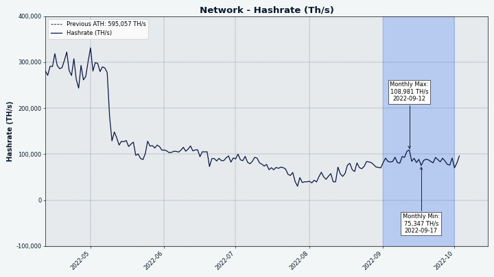
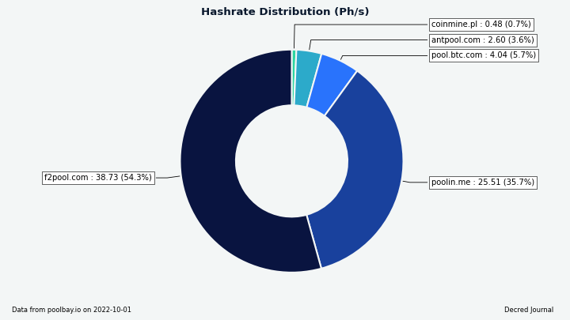
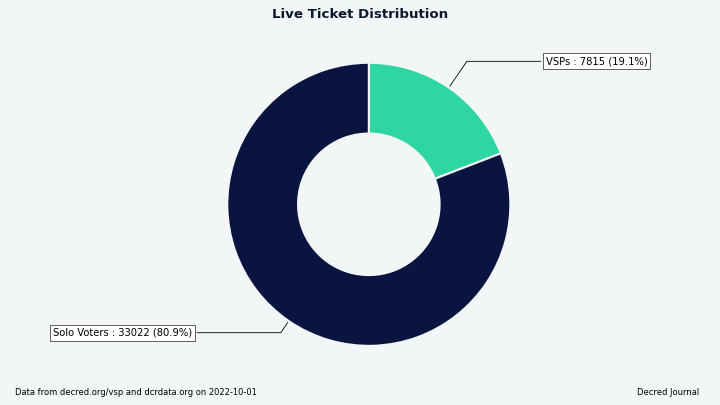

# مجلة ديكريد لشهر سبتمبر 2022

_الصورة: عمل فني بواسطة _OfficialCryptos@

أبرز أحداث شهر سبتمبر:

* جعل الإصدار العام 0.5 لمنصة المبادلات اللامركزية لديكريد من التداول الخاضع للوصاية الذاتية بدون ترخيص أكثر سهولة مع العديد من التحسينات، بما في ذلك المزيد من خيارات المحفظة التي لا تتطلب التنزيل الكامل لسلسلة الكتل.
* تم توفير التداول المباشر لزوج اللايتكوين على  dex.decred.org.
* تلقى موقع decred.org مجموعة من التحديثات بما في ذلك أربعة ترجمات محدثة.
* عدد عقد الشبكة البرقية لديكريد وسعتها آخذ في الارتفاع.

المحتويات:

* [إصدار النسخة 0.5 لمنصة المبادلات اللامركزية لديكريد](#إصدار-النسخة -0.5-لمنصة-المبادلات-اللامركزية-لديكريد)
* [تمكين تداول LTC على dex.decred.org](#تمكين-تداول-LTC-على-dex.decred.org)
* [التطوير](#التطوير)
* [الأشخاص](#الأشخاص)
* [الإدارة و الحوكمة](#الإدارة-و-الحوكمة)
* [الشبكة](#الشبكة)
* [النظام البيئي](#النظام-البيئي)
* [الانتشار](#الانتشار)
* [وسائل الإعلام](#وسائل-الإعلام)
* [مناقشات المجتمع](#مناقشات-المجتمع)
* [الأسواق](#الأسواق)
* [الخارجية ذات الصلة](#الخارجية-ذات-الصلة)

## إصدار النسخة 0.5 لمنصة المبادلات اللامركزية لديكريد

كان الإصدار 0.5.3 من منصة المبادلات اللامركزية لديكريد أول إصدار تم [الإعلان عنه للعموم](https://twitter.com/decredproject/status/1575900485864853504) في سلسلة الإصدار 0.5. الإصدار 0.5 يجعل التداول أكثر سهولة واستقرارًا وملاءمة. التغييرات الرئيسية منذ الإصدار 0.4:

* محفظة ديكريد خفيفة الوزن مدمجة. تم بالفعل دعم استخدام dcrwallet أو ديكريديتون في وضع التحقق البسيط من الدفع (ليس العقدة الكاملة)، ولكن الآن لا يلزم أي برنامج محفظة خارجي لتداول وحدات ديكريد. ومع ذلك، يجب على المستخدمين الاستمرار في برنامج محفظة ديكريد الحالي الذي يحتوي على جميع ميزات الحوكمة التي تجعل ديكريد رائعة.
* استخدام محافظ Electrum في تداول BTC و LTC. تتمتع محافظ Electrum بخصوصية ضعيفة ولكنها تحظى بشعبية كبيرة وسهلة الاستخدام، لذلك يمكن لعدد أكبر من الأشخاص التداول على DCRDEX الآن.
* يمكن لـ DCRDEX الآن العمل مع تكوينات حساب مخلوط عند استخدام dcrwallet أو Decrediton كمحفظة DCR خارجية، مما يسمح باستخدام ميزات خصوصية ديكريد تلقائيًا عند التداول.
* يمكن تعيين خيارات المقايضة في وقت وضع كل طلب بدلاً من إعدادات المحفظة. وهذا يشمل التحجيم المسبق للأموال لتجنب القفل المفرط على الأموال، وتحديد معدلات أعلى لرسوم الشبكة.
* تم تحسين عناصر التحكم في الإرسال/السحب، مما يسمح بمسح كامل للمحفظة مطروحًا منه رسوم المعاملات، أو إرسال مبلغ دقيق مثل معظم المحافظ.
* عرض رمز الاستجابة السريعة لعناوين الاستلام للمحفظة.
* تسريع مقايضة البتكوين باستخدام معاملات CPFP لزيادة معدل رسوم المقايضة في حالة ارتفاع رسوم الشبكة. لم يكن هذا مطلوبًا كثيرًا مؤخرًا، ولكن حدثت زيادات سريعة في معدلات رسوم البتكوين في الماضي حيث سيكون هذا ذا قيمة.
* عرض قيمة العملة الورقية. عند تمكين المستخدم، سيتم استخدام أسعار الصرف الحالية بالدولار الأمريكي لجميع الأصول لإظهار القيم المكافئة بالعملة الورقية على واجهة المستخدم.
* دعم محافظ البتكوين "descriptor" الآن. ينطبق هذا فقط على مستخدمي برنامج Bitcoin Core (وليس محفظة BTC المضمنة)، الذين يختارون أيضًا إنشاء هذا النوع من المحفظة التي أصبحت الخيار التلقائي في الإصدارات المستقبلية من Bitcoin Core.
* إعادة فحص واستعادة وظائف محفظة BTC التحقق البسيط من الدفع  المدمجة. يمكنك الآن أيضًا إعادة تكوين محفظة BTC المدمجة "birthday" لتغيير نطاق إعادة المسح (المحافظ الأصغر أسرع في المسح).
* تصميم Windows التجريبي الذي يبدأ عميل DEX بدون محطة طرفية، وبأيقونة علبة النظام. يجب أن يبدو هذا أكثر طبيعية لمستخدمي Windows.
* دعم أحدث برمجيات Litecoin Core (الإصدار 0.21) التي أدخلت MWEB (العناوين الخاصة). ملاحظة: تستخدم العناوين العادية فقط في الصفقات.
* الدعم  الأولي ل Zcash (ZEC) باستخدام عناوين zcashd غير المحمية للتداول. ملاحظة: لم يتم توفير أزواج تداول ZEC  بعد على dex.decred.org.

في حين أن DCRDEX أكثر تعقيدًا مقارنة بمنصات المبادلات  التقليدية ، فمن الجدير بالذكر مدى سهولة الوصول إليه كتطبيق سطح مكتب. عميل DEX هو ملف واحد لا يتطلب أي تثبيت. يتم تحميل واجهة المستخدم بسرعة من الملفات المحلية. الإصدارات متاحة لأنظمة Windows و macOS و Linux (x64 و ARM و RISC-V CPUs) وحتى FreeBSD و OpenBSD.

تحقق من ملاحظات الإصدار الكاملة للحصول على القائمة الكاملة للميزات الجديدة والإصلاحات وتعليمات التحديث. اعتبارًا من الكتابة، كان الإصدار الأخير هو الإصدار 0.5.4 ويأتي مع ثنائيات مستقلة يمكن استخدامها بشكل مستقل عن Decrediton. كما هو الحال دائمًا، نوصي بالتحقق من الملفات قبل التشغيل.

## تمكين تداول LTC على dex.decred.org

_الصورة: أزواج LTC متوفرة على dex.decred.org!_

يشعر بعض المستخدمين [بالارتباك](https://twitter.com/SoapboxBueller/status/1575909321136754688) بشكل طبيعي بسبب مستويين من دعم الأصول على منصة المبادلات اللامركزية لديكريد:

1. يتم إضافة أصل جديد أولاً في "الكود". هذا لا يضيف تلقائيًا أزواج تداول جديدة على الخادم الرسمي (dex.decred.org) وهذه المرحلة غير مرئية لمستخدميها النهائيين. و مع ذلك يتم الإعلان عن إدماج الكود، لأنه مَعْلَمٌ مهم لمن يتابع المشروع، وشيء قد تجربه خوادم الطرف الثالث.

2. بعد الاختبار والتحضير الكافي، يتم بث الأزواج الجديدة على الخادم الرسمي.

اعتبارًا من كتابة هذا التقرير، يدعم [dex.decred.org](https://dex.decred.org) تداول DCR و BTC و LTC. قد يقوم مشغلو الخوادم الخارجية بتمكين أصول تجريبية إضافية، مدعومة حاليًا: BCH و DOGE و ZEC و ETH.

## التطوير

ما لم يُذكر خلاف ذلك، فإن العمل المَذْكُور هنا يشتمل على حالة "الدمج إلى الرئيسي". وهذا يعني أن العمل قد تم استكماله ومراجعته ودمجه في كود المصدر الذي يمكن للمستخدمين المتقدمين [بناءه وتشغيله](https://medium.com/@artikozel/the-decred-node-back-to-the-source-part-one-27d4576e7e1c)، ولكنه ليس متاحًا بعد في ثنائيات الإصدار للمستخدمين العاديين.

### dcrd

_[dcrd](https://github.com/decred/dcrd) هو تطبيق عقدة كامل يعمل على تشغيل شبكة ديكريد من نظير إلى نظير حول العالم._

كان سبتمبر في الغالب حول التحسين والتنظيف:

* تحسين إنشاء قوالب الكتل لعدم جلب [المدخلات للمعاملة الأولى](https://github.com/decred/dcrd/pull/2994) في الكتلة (تلك التي تنشئ عملات جديدة) لأنه لا يمكن أن يكون لديها مدخلات.
* [تحسين الذاكرة](https://github.com/decred/dcrd/pull/2993) المستخدمة في نسخ نصوص المعاملات.
* تم إيقاف خيار واجهة سطر الأوامر [`--blockminsize`](https://github.com/decred/dcrd/pull/3002). يسمح هذا بإضافة معاملات منخفضة الرسوم أو مجانية إلى الكتلة بينما تكون الكتلة أقل من الحد الأدنى المحدد للحجم. تمت [إزالة](https://github.com/decred/dcrd/pull/2964) السياسة التي تسمح بترحيل مثل هذه المعاملات منخفضة الرسوم/المجانية (واستبدلت بتقنية Child Pays For Parent) وبالتالي لم تعد هناك حاجة إلى خيار واجهة سطر الأوامر هذا.
* إعادة صياغة [ذاكرة التخزين المؤقت لمخرجات المعاملات غير المنفقة](https://github.com/decred/dcrd/pull/2995) لتحسين قوتها وتحسينها وتصحيح بعض corner cases التي يصعب الوصول إليها. توفر ذاكرة التخزين المؤقت هذه وصولاً سريعًا إلى العملات  المتداولة (المعروفة أيضًا باسم مخرجات المعاملات غير المنفقة - UTXO) وهي ضرورية للأداء، لأن كل كتلة تنفق بشكل أساسي العملات  الموجودة وتخلق عملات جديدة. و نظرًا لأنه كود مهم للإجماع، فقد تم تقسيم إعادة الصياغة إلى 19 تغييرًا مستقلاً لتسهيل المراجعة.
* تمت إضافة نقل قاعدة بيانات [لإزالة مخرجات المعاملات غير المنفقة التي لا يمكن إنفاقها](https://github.com/decred/dcrd/pull/2996). على وجه التحديد، العملات  التي تم إنشاؤها بواسطة معاملة `treasurybase` (الجزء 10٪ من مكافأة الكتلة التي تذهب إلى الخزينة) لا يمكن إنفاقها بشكل مباشر، وبالتالي لا ينبغي أن تأخذ مساحة في قاعدة بيانات مخرجات المعاملات غير المنفقة.
* تمت إزالة mempool وكود التعدين الذي يتعامل مع [سياسة ترحيل المعاملات منخفضة الرسوم والمجانية](https://github.com/decred/dcrd/pull/3003). تم إهمال خيار ذات الصلة `blockprioritysize--` والحقول الموجودة في استجابة `getrawmempool`.
* ~6 طلبات سحب صيانة أخرى (إعادة بناء، تحديثات، تنظيف).

### dcrwallet

_[dcrwallet](https://github.com/decred/dcrwallet) هو خادم محفظة تستخدمه تطبيقات سطر الأوامر والمحفظة الرسومية._

* احترام [تكوين الوكيل](https://github.com/decred/dcrwallet/pull/2184) لإتصالات البذور الخاصة بالتحقق البسيط من الدفع و نظير لنظير.

### Decrediton

_[Decrediton](https://github.com/decred/decrediton) ديكريديتون هو تطبيق محفظة لسطح المكتب كامل الميزات مع ميزة التصويت مدمجة، وميزة الخلط ب StakeShuffle، والشبكة البرقية، والتداول على منصة المُبادلات اللامركزية DEX للديكريد، والمزيد. يتم تشغيلها مع سلسلة الكتل كاملة أو بدونها (وضع التحقق البسيط من الدفع SPV)._

* تحديث [وحدة ](https://github.com/decred/decrediton/pull/3791)dcrdex إلى الإصدار 0.5.2.
* تحديث [الترجمة الألمانية](https://github.com/decred/decrediton/pull/3798).
* إعادة إستخدام [نقاط توقف الوسائط](https://github.com/decred/decrediton/pull/3799) من مكتبة [pi-ui](https://github.com/decred/pi-ui/pull/459). يؤدي هذا إلى إزالة تعريفات حجم الشاشة المكررة من 154 ملفًا وجعلها متسقة مع واجهة المستخدم الرسومية لبوليتيا.

### بوليتيا

_[بوليتيا](https://github.com/decred/politeia) هي نظام المقترحات لديكريد. يتم استخدامها لطلب التمويل من خزينة ديكريد_

الواجهة الخلفية:

* إصلاح ترتيب [تحديثات مؤلف الاقتراح](https://github.com/decred/politeia/pull/1679).

إعادة صياغة واجهة المستخدم الرسومية على [بنية البرنامج المساعد](https://github.com/decred/politeiagui/tree/master/plugins-structure#politeiagui---plugins-structure) الجديد:

* أزيد من أربعة تحسينات [لعرض الهاتف](https://github.com/decred/politeiagui/pull/2857) المحمول من أجل التعليقات وأزرار التخفيض وصفحة الاقتراح وما إلى ذلك.
* تمت إضافة [اختبارات الوحدة](https://github.com/decred/politeiagui/pull/2840) لتهيئة التطبيق.
* إصلاح [أخطاء التخزين](https://github.com/decred/politeiagui/pull/2856) المكتشفة خلال الاختبارات الجديدة.

مكتبة pi-ui (مشتركة بين Politeia و Decrediton):

* تحسين الأحجام في [عرض الهاتف المحمول](https://github.com/decred/pi-ui/pull/462).
* إصلاح [العرض المزدوج](https://github.com/decred/pi-ui/pull/463) للنوافذ المنبثقة.

### vspd

_[vspd](https://github.com/decred/vspd) هو برنامج خادم لتشغيل موفر خدمة التصويت. يصوت موفر خدمة التصويت نيابة عن مستخدميه على مدار الساعة طوال أيام الأسبوع ولا يمكنه سرقة الأموال._

* تم نقل كود vspd إلى [دليل ](https://github.com/decred/vspd/pull/352)`cmd`. إنها الخطوة الأخيرة [لإزالة المتغيرات الإجمالية](https://github.com/decred/vspd/issues/339) وتسمح ببناء العديد من الملفات التنفيذية من مستودع واحد.
* جعل [النسخ الاحتياطية لقاعدة البيانات](https://github.com/decred/vspd/pull/353) اختيارية. النسخ الاحتياطية مطلوبة فقط بواسطة vspd وليس عن طريق كود الاختبار أو الأدوات القادمة المستقبلية (مثل [مدقق التصويت](https://github.com/decred/vspd/pull/335)).

### الشبكة البرقية

_dcrlnd هو برنامج عقدة الشبكة البرقية لديكريد. تتيح الشبكة البرقية معاملات فورية ومنخفضة التكلفة._

[البرنامج الخفي لمزود السيولة](https://github.com/decred/dcrlnlpd):

* تم تغيير [سياسة إغلاق القنوات](https://github.com/decred/dcrlnlpd/pull/7) من سياسة مطلقة (إغلاق جميع القنوات التي لا تلبي شروط السياسة) إلى سياسة نسبية (بناءً على تسجيل النشاط لكل قناة). يبدأ تطبيق السياسة فقط بعد انخفاض رصيد المحفظة على السلسلة إلى ما دون معامل التكوين الجديد. والنتيجة المقصودة هي أن القنوات لن تغلق ما لم يطلب مزود السيولة عملات معدنية لتمويل قنوات جديدة، مفضلاً إغلاق القنوات بمزيج من النشاط المنخفض خلال فترة تشغيله. هذه سياسة أكثر فائدة في الوضع الحالي للشبكة البرقية لديكريد بسبب انخفاض معدلات الاستخدام.

### DCRDEX

_[DCRDEX](https://github.com/decred/dcrdex) هي منصة مبادلات غير احتجازية للمُبادلات غير الموثوقة، مدعومة بالمقايضات الذرية._

تم الدمج في الإصدار 0.5.3:

* تمت إضافة [واجهة برمجة التطبيقات الاحتياطية للحصول على معلومات الرسوم](https://github.com/decred/dcrdex/pull/1695) من مصادر خارجية. بالنسبة لمحافظ استدعاء الإجراء البعيد RPC للبتكوين (مثل محفظة Bitcoin Core المحلية)، فإنها ستستخدم واجهة برمجة تطبيقات [mempool.space](https://mempool.space/).
* إصلاح [معلومات رسوم](https://github.com/decred/dcrdex/pull/1827) المبادلة/الاسترداد و إضافة الأعمدة لأصول الرسوم الأساسية وعروض الأسعار إلى ملف تصدير CSV.
* تم إصلاح أربع [حالات الحافة](https://github.com/decred/dcrdex/pull/1849) المرتبطة بقطع الاتصال أثناء التداولات والاستجابات غير الصحيحة من الخادم.
* إصلاح خلل [الفَيْضُ الحِسابِيٌّ للحقبة دلتا](https://github.com/decred/dcrdex/pull/1872) للشموع.
* تمت إزالة [المنفذ الافتراضي](https://github.com/decred/dcrdex/commit/e9ca06d353c7aa1f66a120ac8b9b8a6cc021983e) لـ Electrum.
* التحميل العكسي للعديد من [الإصلاحات الأخرى](https://github.com/decred/dcrdex/pull/1850) من الفرع الرئيسي `master`.

التغييرات التي تواجه المستخدم المدمجة في الفرع الرئيسي `master`:

* عرض [الرسوم التقديرية](https://github.com/decred/dcrdex/pull/1688) عند سحب الأموال.
* تحسين الإخطارات [للطلبات المقدمة](https://github.com/decred/dcrdex/pull/1803).
* إضافة زر [لتعطيل المحفظة](https://github.com/decred/dcrdex/pull/1804).
* تمت إضافة [محفظة مدمجة بسيطة للتحقق من الدفع SPV للبتكوين كاش](https://github.com/decred/dcrdex/pull/1635). تعني كلمة "مدمجة" أن المحفظة تتم إدارتها بالكامل بواسطة منصة المبادلات اللامركزية دون الحاجة إلى تنزيل/ تثبيت/تكوين برنامج خارجي (محفظة BCH)، بينما تعني "SPV" أنها تعمل بدون تنزيل سلسلة كتل BCH. يعتمد هذا حاليًا على [تفرع مؤقت](https://github.com/buck54321/neutrino-bch) من [gcash/neutrino](https://github.com/gcash/neutrino) مع تغييرات إضافية مطلوبة بواسطة DCRDEX، حتى يتم دمج هذه التغييرات بواسطة المشروع التحضيري ل gcash.
* تمت إضافة [محفظة التحقق البسيط من الدفع المدمجة للايتكوين](https://github.com/decred/dcrdex/pull/1750)، على غرار محفظة BCH.
* إظهار [الطلبات المطابقة مؤخرًا](https://github.com/decred/dcrdex/pull/1663).
* إظهار [رمز لوحة النظام](https://github.com/decred/dcrdex/pull/1828) على أنظمة التشغيل Windows و macOS و Linux.
* تم إصلاح [حجم](https://github.com/decred/dcrdex/pull/1837) السوق غير الصحيح على صفحة المحافظ.
* تم إصلاح [الترتيب المربك لخطوات التداول](https://github.com/decred/dcrdex/pull/1830) على صفحة الطلبيات وإضافة عرض للخطوات المستقبلية التي يمكن توقعها.
* ~ خمسة إصلاحات أخرى.

التغييرات الداخلية المدمجة في الفرع الرئيسي `master`:

* تم استبدال استخدامات طريقة `settxfee` باستخدام [وسيطة أكثر قوة `fee_rate`](https://github.com/decred/dcrdex/issues/1706) ل `sendtoaddress`. وهي مدعومة فقط من قبل الإصدارات الحديثة من Bitcoin Core ونسخها. ستستمر المحافظ المستندة إلى Bitcoin Core الأقدم في استخدام Settxfee (BCH و DOGE و ZEC).
* تمت إضافة أداة للبحث عن [ترجمات](https://github.com/decred/dcrdex/pull/1835) الإشعارات المفقودة. أيضًا، ستعود الإشعارات إلى السلاسل الإنجليزية إذا كانت الترجمة مفقودة.
* لن يقبل العملاء بعد الآن توقيعات [الرسائل الناقصة](https://github.com/decred/dcrdex/pull/1526) - وهو خطأ لم يتم فيه تجزئة بيانات الرسائل في بعض الأماكن قبل التوقيع أو التحقق منها. يشرح طلب السحب سبب صعوبة استغلال هذا الخطأ ولكن من الصعب أيضًا إصلاحه. هذا التغيير هو الخطوة الأخيرة في الخطة المكونة من أربعة مراحل لطرح الإصلاح بأقل قدر من التعطيل للعملاء القدامى.
* ~ ستة إصلاحات أخرى.
* ~ ثمان تغييرات لصيانة الكود والاختبار والتوثيق.

دعم الإيثيريوم:

* استعادة [Babysit](https://github.com/decred/dcrdex/pull/1638) واسترداد المعاملات. على عكس عملات مخرجات المعاملات غير المنفقة، تتطلب قدرة الإيثيريوم على استبدال معاملة بأخرى بنفس المعاملة غير المنفقة المزيد من التتبع المتضمن.
* [تحسين الرسوم المدفوعة](https://github.com/decred/dcrdex/pull/1752) بعد أن يتم تعدين المعاملة. بالنسبة للأصول المستندة إلى الإيثيريوم، لا يمكن معرفة الرسوم المحددة المدفوعة مسبقًا.

الصفحة الرئيسية [dex.decred.org](https://dex.decred.org/):

* إعادة كتابة نص [كيف تبدأ](https://github.com/decred/dexweb/pull/26).
* تمت إضافة [أيقونات جميلة](https://github.com/decred/dexweb/pull/27) لجميع الأصول المدعومة الستة.

تهدف منصة المبادلات اللامركزية لديكريد DCRDEX إلى دعم التداول باستخدام محافظ خفيفة الوزن، وهو ما يمثل دفعة هائلة لتجربة المستخدم مقارنة بالحاجة إلى تنزيل سلاسل الكتل كاملة. بالنسبة لـديكريد، فإنها تستخدم بروتوكول التحقق البسيط من الدفع الأصلي الخاص بها، وبالنسبة إلى البتكوين، فإنها تعتمد على محفظة [Neutrino](https://github.com/lightninglabs/neutrino) من Lightning Labs (والتي تعتمد في حد ذاتها على btcsuite - أصل ديكريد). ومع ذلك، [لا يتم صيانة](https://github.com/decred/dcrdex/pull/1750#issuecomment-1201859406) تفرعات Neutrino للايتكوين و البتكوين كاش  بشكل جيد، لذلك قام الفريق بإنشاء تفرعات [neutrino-bch](https://github.com/dcrlabs/neutrino-bch) و [neutrino-ltc](https://github.com/dcrlabs/neutrino-ltc) حيث يمكن دمج التغييرات التي تحتاجها منصة المبادلات اللامركزية لديكريد DCRDEX بسرعة. اعتبارًا من كتابة هذا التقرير، كان لديهم إصلاحات مفقودة في مستودعاتهم الأولية لـ LTC و BCH.

_الصورة: الرسوم التقديرية عند السحب من DCRDEX._

_الصورة: تشيرأيقونة لوحة النظام إلى أن عميل DEX قيد التشغيل._

_الصورة: أيقونات للأصول المدعومة في dex.decred.org._

### المستندات

_[dcrdocs](https://github.com/decred/dcrdocs) هو الكود المصدري [لوثائق المستخدم](https://docs.decred.org/) لديكريد_.

* تم [نقل](https://github.com/decred/dcrdocs/pull/1206) صفحات [موجز الأعمال](https://docs.decred.org/getting-started/business-brief/) الخاص بديكريد و[تاريخ المشروع](https://docs.decred.org/getting-started/project-history/) من موقع ديكريد القديم إلى قسم "الشروع في العمل" في [docs.decred.org](https://docs.decred.org/).

### decred.org

_[dcrweb](https://github.com/decred/dcrweb) هو الكود المصدري لموقع decred.org._

الترجمات:

* تلقت البنية التحتية للترجمات أداة تنظيف و[أداة واجهة المستخدم الرسومية](https://github.com/decred/dcrweb/pull/1058) لتحديث الترجمات ([رائدة](https://github.com/decred/decrediton/pull/3569) في Decrediton)، جنبًا إلى جنب مع [تعليمات](https://github.com/decred/dcrweb/pull/1073) الاستخدام.
* تمت إضافة/تحديث الترجمات [الصينية](https://github.com/decred/dcrweb/pull/1067) و[العربية](https://github.com/decred/dcrweb/pull/1068) و[الألمانية](https://github.com/decred/dcrweb/pull/1069) و[البولندية ](https://github.com/decred/dcrweb/pull/1070).

[عمليات إعادة التوجيه](https://github.com/decred/dcrweb/pull/1061) للصفحات المنقولة/المحذوفة:

* إعادة توجيه `/brief` و `/history` إلى مواقعهم الجديدة على [docs.decred.org](https://docs.decred.org/).
* إعادة توجيه المساهمون `/contributors` إلى [أعضاء ديكريد على ](https://github.com/orgs/decred/people)GitHub org.
* تمت إزالة الصفحات آمنة ومستدامة وقابلة للتكيف وستظهر "الصفحة غير موجودة" مع رابط نحو الصفحة الرئيسية.

أخرى:

* تمت إضافة [الجزء 2 من تحليل سلسلة الكتل](https://blockcommons.red/post/dcr-on-chain-2/) ل richardred@ إلى [التغطية](https://github.com/decred/dcrweb/pull/1066) الصحفية.
* ~ 2 إصلاحات أخرى.

[dcrwebapi](https://github.com/decred/dcrwebapi) (تستخدم بشكل أساسي لإدراج مزودي خدمة التصويت في Decrediton و decred.org):

* تم إضافة [ارتفاع الكتلة](https://github.com/decred/dcrwebapi/pull/167) ونسبة الشبكة التقديرية لاستجابة مزود خدمة التصويت. بخلاف الطابع الزمني المحدث الأخير (المعروض حاليًا في [قائمة مزود خدمة التصويت](https://decred.org/vsp/))، يسمح ارتفاع الكتلة بتحديد ما إذا كان مزود خدمة التصويت قد توقف بشكل أكثر دقة.
* إزالة [نقاط النهاية غير المستخدمة](https://github.com/decred/dcrwebapi/pull/170). يتم استبدال الشخص الذي يحصل على عرض العملة (`gcs`) [بواجهة برمجة تطبيقات dcrdata](https://github.com/decred/dcrdata#apis) التي تمت صيانتها بشكل أفضل (نقطة النهاية العرض `/supply`)، في حين أن عدد التنزيلات (`dc`) كان مجرد تقدير تقريبي للغاية بناءً على توجيه أساسي. إذا كنت تعرف أي شخص يستخدم نقاط النهاية هذه، فيرجى الإبلاغ ذلك في [المسألة 169](https://github.com/decred/dcrwebapi/issues/169).

الترجمات البرمجية:

* تم إنشاء [صفحة حالة جديدة](https://decredcommunity.github.io/translations/status) لتتبع مدى تحديث ترجمات برامج ديكريد وأين تحتاج إلى المساعدة. تتبع حاليًا موقع Decrediton و DCRDEX و decred.org.

## الأشخاص

مرحبًا بالمؤلفين الجدد لأول مرة في مجلة ديكريد: Joao Paulo [Joao Paulo Sant'Anna da Silva](https://www.decredmagazine.com/author/joao/) و [Wahid Pessarlay](https://www.decredmagazine.com/author/wahid/) (الذي كتب أيضًا لـ [Cointelegraph](https://cointelegraph.com/authors/wahid-pessarlay)).

قصص وأفكار شخصية جديدة يشاركها أعضاء مجتمع ديكريد :[Brian Stafford](https://medium.com/authority-magazine/brian-buck-stafford-of-decred-on-the-future-of-money-and-banking-45f25305b409) (@buck54321) في مجلة Authority و [Ronnie Amato](https://www.decredmagazine.com/introducing-decred-community-member-ronnie-amato/) (@MadScrilla1) على مجلة ديكريد و [@h3la1 و @Tivra](https://www.youtube.com/watch?v=jz6lX9TMvdY&t=1m20s) في البث المباشر للمائدة المستديرة للمجتمع.

> هل يمكنك أن تعطينا «اقتباس درس الحياة» المفضل لديك ؟
> 
> خذ نفسا. \[@buck54321\]

> إذا كان ذلك ممكنًا، فهل هناك أي شيء يمكن للمجتمع القيام به لمساعدتك في عملك ؟
> 
> ابقيني صادقا. تحدى تأكيداتي وانتقاداتي. العب دور محامي الشيطان وتواصل معي لأي سبب من الأسباب، خاصة إذا كنت مهتمًا بتنظيم اللقاءَات. يمكن أن أكون منفتحًا على السفر والاستضافة. \[@MadScrilla1\]

إحصائيات المجتمع اعتبارًا من 1 أكتوبر (مقارنة بـ 1 سبتمبر):

*  متابعو [التويتر](https://twitter.com/decredproject): 54,019 (-732)
* المشتركين في [ريديت](https://www.reddit.com/r/decred/): 12,637 (-10)
* مستخدمي غرفة الدردشة general# على [الماتريكس](https://chat.decred.org/): 720 (+6)
* مستخدمي [الديسكورد](https://discord.gg/GJ2GXfz): 1,821 (+25)
* مستخدمي [التيليجرام](https://t.me/Decred): 2,891 (+7)
* المشتركين في [اليوتيوب](https://www.youtube.com/decredchannel): 4,650 (+10)، المشاهدات: 215,726 (1,444+)

## الإدارة و الحوكمة

في سبتمبر، تلقت [الخزينة](https://dcrdata.decred.org/treasury) الجديدة 8,848 DCR بقيمة 241 ألف دولار بمتوسط سعر سبتمبر البالغ 27.19 دولارًا. تم إنفاق 3,089 DCR للدفع للمتعاقدين، بقيمة 84 ألف دولار بمعدل شهر سبتمبر، أو 99 ألف دولار بمعدل فواتير أغسطس البالغ 31.93 دولارًا.

تم تعدين [معاملة إنفاق الخزينة](https://dcrdata.decred.org/tx/c8a4d7fae86645449561a3b414ac7df0ea33b5de03e58ded345ad71c485c9c6b)  في 24 سبتمبر، وكان لديها 28 ناتجًا يتراوح من 1 DCR إلى 961 DCR. تمت الموافقة على المعاملة بأغلبية 6,856 صوتًا بنعم و 0 بلا.

اعتبارًا من 10 أكتوبر، بلغ الرصيد المشترك للخزينة [القديمة](https://dcrdata.decred.org/address/Dcur2mcGjmENx4DhNqDctW5wJCVyT3Qeqkx) و[الجديدة](https://dcrdata.decred.org/treasury) 817,745 DCR (أي مايعادل 20.9 مليون دولار أمريكي بسعر 25.51 دولارًا أمريكيًا).

لم يتم نشر أي مقترحات على بوليتيا في سبتمبر، ولكن تم نشر [اقتراح](https://proposals.decred.org/record/d5221a9) علاقات عامة جديد من @lindseymmc في 1 أكتوبر.

تم نشر [فكرة اقتراح](https://www.reddit.com/r/decred/comments/xd2ixd/partnership_between_fio_protocol_and_decred/) على ريديت تقترح شراكة بين FIO Protocol و ديكريد، فهي لا تطلب التمويل ولكنها بدلاً من ذلك تعرض دفع منحة إدماج لمن سيقوم بالعمل لدمج FIO ضمن برنامج ديكريد. FIO هي مبادرة Interwallet Operability مع توكنها الخاص.

تم نشر [تحديث](https://proposals.decred.org/record/4475472) على اقتراح بوليتيا (فوت في أغسطس) معلناً أنه تم تحديث الموقع إلى الإصدار 1.4.0، مع دخول معظم العمل في استيراد الخلفية القديمة لمقترحات Git إلى Trillian، جنبًا إلى جنب مع بعض الميزات الجديدة مثل السماح بالتعديلات على التعليقات في غضون 5 دقائق من نشرها.

## الشبكة

**معدل الهاش**: افتتحت [معدلات الهاش](https://dcrdata.decred.org/charts?chart=hashrate&zoom=l796eq4a-l8vp7dzk&scale=linear&bin=day&axis=time) لشهر سبتمبر عند ~ 82 Ph/s وأغلقت عند ~ 91 Ph/s، وبلغ قاعها عند 75 Ph/s كما بلغت ذروتها عند 109 Ph/s على مدار الشهر.

_الصورة: معدل هاش ديكريد._

توزيع معدل الهاش 71 Ph/s الذي [تم الإبلاغ عنه](https://poolbay.io/crypto/54/decred) من قبل المجمعات في 1 أكتوبر: F2Pool بنسبة 54%، و Poolin بنسبة 36%، و BTC.com بنسبة 6%، و (على الأرجح) AntPool بنسبة 3.6%، و CoinMine بنسبة 0.7%، و أخرى غير معروفة  بنسبة 0.3%.

توزيع  1,000 كتلة تم [تعدينها](https://miningpoolstats.stream/decred) بالفعل قبل 1 أكتوبر: F2Pool بنسبة 49%، و Poolin بنسبة 44%، و BTC.com بنسبة 4%، و AntPool بنسبة 3%، و CoinmMine بنسبة 0.3%.

_الصورة: توزيع معدل هاش التجمع._

**التحصيص**: تراوح [سعر التذكرة](https://dcrdata.decred.org/charts?chart=ticket-price&zoom=l796eq4a-l8vp7dzk&axis=time&visibility=true-true&mode=stepped) بين  221-239  DCR، [بمتوسط](https://dcrstats.com/) 229.1 DCR (-1.1) خلال 30 يوما.

بلغ [المبلغ المقفل](https://dcrdata.decred.org/charts?chart=ticket-pool-value&zoom=l796eq4a-l8vp7dzk&scale=linear&bin=day&axis=time)  9.28-9.43 مليون DCR، مما يعني أن  64.1-64.9 من العرض المتاح [شارك](https://dcrdata.decred.org/charts?chart=stake-participation&zoom=l796eq4a-l8vp7dzk&scale=linear&bin=day&axis=time) في إثبات الحصة.

**مقدم خدمة التصويت**: قام الـ 18 من [مقدمي خدمة التصويت المدرجين](https://decred.org/vsp/) بإدارة ما يقرب من 7,820 (+770) تذكرة حية، والتي كانت تمثل 19.1٪ من مجموع التذاكر (1.8٪+) اعتبارًا من 1 أكتوبر.

أكبر الرابحين في سبتمبر هم vspd.bass.cf (+726) و vspd.stakey.com (+443). اعلم أن الأخير لديه [مشكلات في واجهة برمجة التطبيقات ](https://github.com/decred/dcrwebapi/pull/171) منذ 20 سبتمبر وأن إحصائيات التذكرة التي أبلغت عنها غير دقيقة.

_الصورة: توزيع التذاكر التي يديرها مقدمو خدمة التصويت._

_الصورة: توزيع التذاكر الفردية مقابل التذاكر التي يديرها مزود خدمة التصويت._

_الصورة: التذاكر الشهرية المفوتة منذ 2016._

**العقد**: رصد [جهاز رسم الخرائط لديكريد](https://nodes.jholdstock.uk/user_agents) 118 عقدة في 1 أكتوبر: 
العقد: لاحظ Decred Mapper 118 عقدة في 1 أكتوبر: النسخة 1.7.1 - 38%، النسخة 1.7.2 - 29%، النسخة 1.7.4 - 14%، النسخة 1.7.0 - 10%، أخرى - 9٪.

ملاحظة: كانت [النسخة dcrd  1.7.4](https://github.com/decred/dcrd/releases/tag/release-v1.7.4) إصدارًا للمطورين فقط بهدف رئيسي هو إصلاح [شبكة الاختبار المتوقفة]( https://github.com/xaur/decred-news/blob/master/journal/202208.md#dcrd ).

_الصورة: توزيع إصدار عقدة dcrd._

تراوحت حصة [العملات المخلوطة](https://dcrdata.decred.org/charts?chart=coin-supply&zoom=jz3q237o-la8vk000&scale=linear&bin=day&axis=time&visibility=true-true-true) بين 60.8-60.9٪. وقد تفاوتت [الكمية المخلوطة](https://dcrdata.decred.org/charts?chart=privacy-participation&bin=day&axis=time) بشكل يومي ما بين 290 و 493 ألف.

شهد مستكشف [الشبكة البرقية](https://ln-map.jholdstock.uk/) لديكريد 70 عقدة (28+) و 105 قناة (37+) بسعة إجمالية 42.5 DCR (+7.1) اعتبارًا من 1 أكتوبر.

شكراً ل @bochinchero لجعل مجلة ديكريد أقل مللاً مع المخططات. يمكنك العثور على المخططات التي نختارها هنا والعديد من المخططات الأخرى في مستودع [dcrsnapshots](https://github.com/bochinchero/dcrsnapshots).

## النظام البيئي 

تمت [إزالة](https://github.com/decred/dcrweb/pull/1064) KuCoin من [قائمة منصات المبادلات](https://decred.org/exchanges/)  بعد بلاغ بأنها لم تقبل ودائع DCR. بعد أسبوعين [أعلنوا](https://www.kucoin.com/news/en-kucoin-opens-mainnet-dcr-tokens-deposit-and-withdrawal-services-20220924) أن ودائع وسحوبات DCR ممكنة.

أعلنت Huobi أنها [ستزيل 7 عملات خصوصية بما في ذلك DCR](https://www.huobi.com/support/en-us/detail/104917015223952) "لحماية أصول مستخدمينا"، وتمت [إزالتها](https://github.com/decred/dcrweb/pull/1081) أيضًا من قائمة منصات المبادلات.

أضاف Cryptohunt [صفحة لديكريد](https://www.cryptohunt.it/projects/decred). تهدف الخدمة إلى جعل العملات الرقمية المشفرة في [متناول](https://medium.com/@cryptohunt/about-cryptohunt-9668aa77412f) الوافدين الجدد من خلال توفير صفحات معلومات بسيطة لمشاريع العملات الرقمية المشفرة الشهيرة.

تحذير: ليس لدى مؤلفي مجلة ديكريد أي فكرة عن مصداقية أي من الخدمات أعلاه. يرجى إجراء بحثك الخاص قبل الوثوق بمعلوماتك الشخصية أو أصولك لأي كيان.

انضم إلى دردشة النظام البيئي [#ecosystem](https://chat.decred.org/#/room/#ecosystem:decred.org) لمتابعة تحديثات النظام البيئي لـديكريد.

## الإنتشار

إنجازات Monde PR:

* عرض تحديث إخباري.
* تأمين مقابلة إعلامية واحدة.
* تم الرد على ثلاث طلبات للتعليق.

تأمين المقالات الإخبارية التالية:

* ظهر buck54321 في سلسلة مجلة Authority حول [مستقبل المال والخدمات المصرفية](https://medium.com/authority-magazine/brian-buck-stafford-of-decred-on-the-future-of-money-and-banking-45f25305b409). تتضمن القطعة غوصًا عميقًا في منصة المبادلات اللامركزية لديكريد DCRDEX وفوائد نظير إلى نظير، جنبًا إلى جنب مع نقاط عن الشبكة البرقية، وأهمية العهدة الذاتية، واللامركزية.
* تم اقتباس jz@ في [Axios](https://www.axios.com/2022/09/15/privacy-coins-test-crypto-exchanges-comfort-with-compliance)، حول كيفية تضمين مستقبل العملة المشفرة ضمانات خصوصية قوية، ردًا على حذفHuobi Global لديكريد وستة عملات خصوصية أخرى.

## الفعاليات

**الحضور:**

* ذكر بول روزنبرغ ديكريد في Hackers Congress Paralelni Polis (براغ، جمهورية التشيك). لقد كان تطبيقًا صغيرًا على شريحة واحدة ولكن بفكرة مهمة:

> Scrit ،Decred ،BCH ،BTC، أيا كان.. **استخدمها**.
> ابدء بنشر الأسعار بالوحدات الصغيرة؛ دع الناس يتعلمون كيفية التحويل.
> قم بإعداد الوسطاء إذا أردت.
> خذ عامًا للانتقال إذا لزم الأمر، لكن يجب أن نستخدم أموالنا.

## وسائل الإعلام

**احصائيات مشاركة مجلة ديكريد لشهر سبتمبر:**

* إجمالي عدد المقالات على مجلة ديكريد: 318
* عدد المشتركين في النشرة الإخبارية: 66
* المشاركات والنشرات الجديدة المرسلة: 13
* الحملات النشطة لوسائل التواصل الاجتماعي: 12
* المشاركات على وسائل التواصل الاجتماعي: 151
* الإعجابات: 662
* إعادة التغريدات: 114
* متابعو وسائل التواصل الاجتماعي عبر جميع المنصات والحسابات: 973

نرحب بمستخدمي تويتر لدعم [@Decredmagazine](https://twitter.com/decredmagazine) بالمتابعات والإعجابات والتغريدات للمساعدة في نشر الرسالة.

مجلة ديكريد قادمة أيضًا إلى Instagram - تابع [@decredmagazine](https://www.instagram.com/decredmagazine/).

**مقالات مختارة:**

* [العملات المستقرة على ديكريد](https://www.decredmagazine.com/stablecoins-on-decred/) بقلم Anon - ورقة مفاهيمية نُشرت في منتدى ديكريد في عام 2018، تم إحياؤها على مجلة ديكريد
* Brian 'Buck' Stafford[ من ديكريد عن مستقبل المال والأعمال المصرفية](https://medium.com/authority-magazine/brian-buck-stafford-of-decred-on-the-future-of-money-and-banking-45f25305b409) من تأليف Jason Hartman لمجلة Authority
* [ضوء في نهاية النفق](https://www.decredmagazine.com/decred-light-at-the-end-of-the-tunnel/) - تحليل تقني ل DCR بواسطة @Applesaucesome
* [التقرير الشهري ل Monde PR لشهر أغسطس 2022](https://www.decredmagazine.com/mondepr-august-2022/) بقلم phoenixgreen@
* [تقديم عضو مجتمع ديكريد Ronnie Amato](https://www.decredmagazine.com/introducing-decred-community-member-ronnie-amato/) بواسطة phoenixgreen@
* [المكان الذي يبدو فيه كل شيء سيئًا ولكني أنشر الكثير من التفاؤل](https://www.decredmagazine.com/the-one-where-i-post-lots-of-hopium/) - التحليل الفني لـ DCR بواسطة Applesaucesome@
* [تهدف ريو دي جانيرو إلى أن تصبح عاصمة العملات الرقمية المشفرة](https://www.decredmagazine.com/rio-de-janeiro-aims-to-be-a-crypto-capital/) بواسطة @João
* [تطلق ديكريد الإصدار 0.5 لمنصة المبادلات اللامركزية ل DCRDEX مما يجعل التداولات الآمنة المدعومة بالمقايضة الذرية أكثر سهولة](https://decred.org/news/2022-09-28_decred_releases_dcrdex_0.5/) - بيان صحفي على decred.org
* [تسعى ديكريد من خلال الإصدار 0.5 لمنصة المبادلات اللامركزية لديكريد لإجراء مقايضات ذرية نظير لنظير أكثر سهولة](https://www.decredmagazine.com/decred-pushes-for-highly-convenient-p2p-atomic-swaps-with-dcrdex-v0-5/) بقلم Wahid Pessarlay

**أشرطة الفيديو:**

* [المائدة المستديرة المجتمعية لديكريد - المنظمات المستقلة اللامركزية والحوكمة والتسويق وامنصة المبادلات اللامركزية والمزيد](https://www.youtube.com/watch?v=jz6lX9TMvdY) بواسطة @Exitus و @phoenixgreen، والتي تضم @WasPraxis و @h3la1 و @MadScrilla1
* [الملخص الشهري لديكريد - موقع ويب جديد، تحديثات التطوير، بوليتيا 1.4.0، مقالات + مقابلات والمزيد!](https://www.youtube.com/watch?v=7IPj3rWmNY8) بواسطة Exitus@
* [صفحة سوق DCRDATA - أساسيات ديكريد](https://www.youtube.com/watch?v=6YW9JiMT2w8) بواسطة @phoenixgreen - متوفر أيضًا [كمنشور نصي](https://www.decredmagazine.com/dcrdata-making-markets-decred-fundamentals/)
* [أضافت DCRDEX التبادل اللامركزي بالمقايضة الذرية للايتكوين](https://twitter.com/karamblez/status/1573453810005348353) - الرسوم المتحركة بواسطة karamble@
* [لماذا تتوفر ديكريد علي منصة المبادلات الخاصة بها؟ - سلسلة ](https://www.youtube.com/watch?v=7mx3TCPS5rU)DCRDEX بواسطة phoenixgreen@ - متوفر أيضًا [كمنشور نصي](https://www.decredmagazine.com/why-does-decred-have-its-own-exchange/)

**المتعة و الفن:**

* صنع @fjsixfjdksfi [لحنا موسيقيا ثانيًا](https://soundcloud.com/openbeats/ob2) (+ [نسخة مكررة](https://soundcloud.com/openbeats/ob2_looped)) في سلسلة Open Beats، متاحًا للاستخدام المجاني في المحتوى المرتبط بديكريد (تم تفويته في يونيو)
* [ديكريد السحلية المدرعة](https://www.decredmagazine.com/decred-the-armoured-lizard/) بواسطة @OfficialCryptos
* صنع @richardred [فيديو تعريفي لمدة دقيقة واحدة يشرح كيفية عمل DCRDEX](https://www.youtube.com/watch?v=_0kInW0_QuA) مع عرض DEX Flow بواسطة GhostWridah@ - متوفر أيضًا على [التويتر](https://twitter.com/RichardRed0x/status/1576014662537138176)

**الترجمة:**

* [Coin des tages: Decred (DCR)](https://www.youtube.com/shorts/6PfekNUZq_k) بواسطة KryptoZenny ("عملة اليوم: ديكريد(DCR)")
* [Decred Deepdive: Was steckt hinter der crypto?](https://www.youtube.com/watch?v=SssaKluRSJI) بواسطة TaiikN Crypto ("Decred Deepdive: ما وراء العملات الرقمية المشفرة؟")

## مناقشات المجتمع

ناقش خمسة من أعضاء المجتمع الحوكمة والتسويق و DEX والعديد من الموضوعات الأخرى في [حلقة Community Roundtable](https://www.youtube.com/watch?v=jz6lX9TMvdY) الجديدة على قناة ديكريد على اليوتيوب.

منشورات الريديت المختارة:

* [الشراكة بين FIO Protocol و ديكريد](https://www.reddit.com/r/decred/comments/xd2ixd/partnership_between_fio_protocol_and_decred/) - تمت إعادة نشر الاقتراح لأنه لم يستوف معايير بوليتيا لوجود فريق يقوم بالعمل. أجاب sirashtvm@ على الأسئلة حول كيفية عمل بروتوكول FIO على Reddit وأيضًا [على ](https://matrix.to/#/!qYpAAClAYrHaUIGkLs:decred.org/$MhR2C154GfT_UzqZVAzmHPe3TrGl_OJp7diBmlS2JcU)Matrix.
* [إدراج ديكريد في منصة المبادلات Phemex](https://www.reddit.com/r/decred/comments/xqeqg8/listing_of_decred_token_on_phemex_exchange/) - فكرة شراكة أخرى بواسطة @sirashtvm حيث سيتم إدراج DCR في منصة المبادلات Phemex ومقرها سنغافورة، تمت مناقشتها أيضًا [على Matrix](https://matrix.to/#/!qYpAAClAYrHaUIGkLs:decred.org/$BPzC-9nhy3gfgCNNXTXw8QTfV31DVrLVdERfGYqHPTk?via=decred.org&via=matrix.org&via=planetdecred.org). كانت نقطة الخلاف الرئيسية هي «رسوم التسويق» البالغة 30 ألف دولار التي تطلبها Phemex لتمويل مسابقات التداول (20 ألف دولار) و “حملة المؤثرين KOL + AMA” (10 آلاف دولار). [انتهت](https://www.reddit.com/r/decred/comments/xqeqg8/listing_of_decred_token_on_phemex_exchange/ir0m9nz/) الفكرة عندما أصبح معروفًا أن ممثل Phemex غير مهتم بمزيد من المناقشة.
* [المساهمات الأسبوعية - الإصدار الخاص ](https://www.reddit.com/r/decred/comments/xsacjg/weekly_contributions_special_edition_bounty_pool/) - نما تجمع الجوائز إلى 4 DCR و يواصل @fjsixfjdksfi التكرار على الشكل والقواعد. ركز هذا الإصدار على (على سبيل المثال وليس حصريا) الترويج لأزواج اللايتكوين الجديدة على DCRDEX.

مناقشات التويتر المختارة:

* [ظهر الإصدار 0.5.3 من DCRDEX بدعم Litecoin ](https://twitter.com/decredproject/status/1575900485864853504)

## الأسواق

في سبتمبر، تم تداول DCR بين 23.30 دولارًا أمريكيًا و 34.70 دولارًا أمريكيًا/BTC 0.00124-0.00175. وقد بلغ متوسط السعر اليومي 27.19 دولارًا.

*ما يلي ليس نصيحة استثمارية.*

تغطية جديدة للسوق من Applesaucesome@: [ضوء في نهاية النفق](https://www.decredmagazine.com/decred-light-at-the-end-of-the-tunnel/) و[الذي يبدو فيه كل شيء سيئًا ولكني أنشر الكثير من التفاؤل](https://www.decredmagazine.com/the-one-where-i-post-lots-of-hopium/).

> لن أقوم بتلطيف الأجواء، كل شيء يبدو سيئًا حقًا. الأسهم و العملات الرقمية المشفرة، كل شيء. تم تصحيح كل الزخم المكتسب من الأسابيع الماضية. لكن كما نعلم جميعًا، هذا هو المكان الذي يتم فيه تصفية الجميع... أو نستسلم مرة أخرى للمرة التاسعة. 🙃 \[2022-09-25\]

_الصورة: "زوج ديكريد ب  BTC مثير حقًا للمشاهدة عند التصغير." - Applesaucesome@_

تم إجراء التحليل الفني لـ DCR على اليوتيوب بواسطة [More Crypto Online](https://www.youtube.com/watch?v=oP1-Ie5jFzo) ("إنه أحد أفضل مخططات العملات الرقمية الموجودة ولكن لا يوجد ضمان لنجاحها")، و Jacob Crypto Bury، و [Schulz & Team Analytik](https://www.youtube.com/watch?v=begoqsTKdOI&t=586s)  (الألمانية).

_الصورة: الحجم الشهري لـ DCRDEX بالدولار الأمريكي._

## الخارجية ذات الصلة

[أوضح](https://home.treasury.gov/taxonomy/term/1546) مكتب مراقبة الأصول الأجنبية كيف يفترض أن تعمل العقوبات المفروضة على عناوين Tornado Cash. الأشخاص الذين تلقوا مبالغ رمزية غير مرغوب فيها من Tornado Cash (كان شخص ما يتصيد) ينتهكون من الناحية الفنية العقوبات ولكن يمكنهم ملء استمارة ممتلكات محظورة لتجنب الملاحقة القضائية.

[تلاحق](https://blockworks.co/coinbase-users-across-georgia-milk-price-bug-for-100x-profit/)  Coinbase الجورجيين الذين استفادوا من علة أدت إلى خطأ في تسعير Georgian Lari ي لمدة 7 ساعات وحصول المتداولين على 100 ضعف Lari مقابل عملاتهم المشفرة. اتصلت Coinbase ببنوكها وتم إغلاق حساباتها في انتظار استرداد الأموال المسحوبة.

[أكملت](https://www.coindesk.com/tech/2022/09/15/the-ethereum-merge-is-done-did-it-work/) Ethereum "الدمج" للتبديل من إجماع إثبات العمل إلى إثبات الحصة، وخفض استخدام الطاقة بنسبة 99.95٪ وتقليل معدل إصدار ETH الجديد في هذه العملية.

قدمت لجنة تداول السلع الآجلة (CFTC) [شكوى](https://www.cftc.gov/PressRoom/PressReleases/8590-22) ضد Ooki DAO لانتهاكها قانون تبادل السلع. تم فرض غرامة قدرها 250,000 دولار أمريكي على شركة bZeroX LLC، التي حاولت التحايل على الإنفاذ من خلال تطبيق اللامركزية للتحكم في بروتوكول Ooki DAO. أشارت لجنة تداول السلع الآجلة (CFTC) الآن إلى أنها تلاحق أي شخص مشارك في Ooki DAO، والتي تصفها بأنها "جمعية غير مدمجة". [يبدو](https://www.coindesk.com/policy/2022/10/11/fear-may-be-keeping-crypto-group-ooki-dao-from-mounting-defense-against-cftc/) أن حاملي التوكنات لـ Ooki DAO يخشون التصويت على المقترحات المتعلقة بكيفية الرد، خشية أن يضعوا أنفسهم أمام المزيد من المشاكل الفردية من خلال التصويت، وهناك خطر قد أنهم قد يخسرون بشكل تلقائي إذا لم يستجيب DAO بحلول 14 أكتوبر.

يتم [حل](https://www.coindesk.com/layer2/2022/09/20/lessons-from-a-defi-dao-divorce/) عملية اندماج بين مجتمعين من DeFi (FEI و RARI) بعد انقسام حاد حول كيفية تعويض ضحايا Fuse، وهو منتج DeFi لمشروعهم المشترك الذي تم اختراقه مقابل 80 مليون دولار. في أعقاب الاختراق، تمت الموافقة على اقتراح حوكمة أولي لتعويض جميع الضحايا بشكل كامل، لكن قيادة اFEI (التي كانت لديها الأموال لتسعد جميع الضحايا) قررت أنه لم يكن اقتراحًا مناسبًا ولم يتابع تنفيذه. استغرق الأمر 4 مقترحات للتوصل إلى حل يمكن أن توافق عليه جميع الأطراف، وتضمن حل الشراكة بين المشاريع وإعطاء حاملي الرموز وسيلة للخروج.

هذا كل شيء لشهر سبتمبر. شارك بتحديثاتك للإصدار التالي في غرفة الدردشة [#journal](https://chat.decred.org/#/room/#journal:decred.org).

## عن هذا العدد 
  
هذا هو العدد 51 من مجلة صحيفة ديكريد. فهرس جميع الإصدارات والمرايا والترجمات متاح [هنا](https://xaur.github.io/decred-news/).

يتم نقل معظم المعلومات الواردة من أطراف ثالثة مباشرة من المصدر بعد التحقق من الحد الأدنى لصحتها. ليس لدى مؤلفي مجلة صحيفة الديكريد القدرة على التحقق من جميع الادعاءات.رجاء إحذر من أعمال الاحتيال وقم ببحثك الخاص.

الاعتمادات (بالترتيب الأبجدي):

- الكتابة والتحرير: bee و bochinchero و Exitus و jz و l1ndseymm و phoenixgreen و richardred
- المراجعات والتعليقات: davecgh و jholdstock و karamble
- صورة العنوان: OfficialCryptos
- التمويل: أصحاب حصص الديكريد

النسخة الأصلية لمجلة الديكريد لشهر سبتمبر 2022 متوفرة على هذا الرابط [هنا](https://xaur.github.io/decred-news/journal/202209).

تمت الترجمة إلى اللغة العربية بواسطة: arij@. قام بالمراجعة abdulrahman4@.
