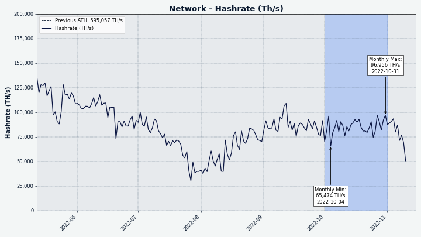
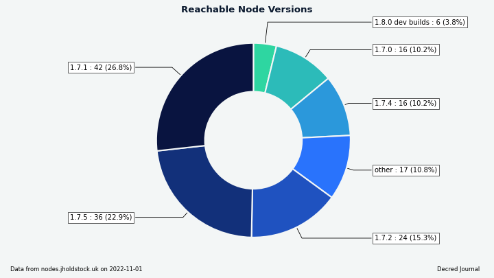

# مجلة ديكريد لشهر أكتوبر 2022

_الصورة: بدون عنوان بواسطة Exitus@_

أبرز أحداث أكتوبر:

* تم إصدار تصحيحات النسخة 1.7.5 للبرنامج الرئيسي لديكريد و النسخة 0.5.4 ل DCRDEX.
* تم استخدام خدمة الطوابع الزمنية لديكريد (timestamp.decred.org) في وضع طابع زمني على وثائق الحملة السياسية للمرشحين في الانتخابات البرازيلية.
* تلقى decred.org جولة أخرى من التحديثات، بما في ذلك صفحة الأخبار الجديدة حيث يمكنك العثور على أحدث إصدارات المجلة.
* تم الاحتفاظ بخدمات Monde PR لمدة عام آخر بعد اقتراح ناجح بمعدل موافقة 66٪.

المحتويات:

* [إصدار النسخة 1.7.5 للبرنامج الأساسي](#إصدار-النسخة-1.7.5-للبرنامج-الأساسي)
* [التطوير](#التطوير)
* [الأشخاص](#الأشخاص)
* [الإدارة و الحوكمة](#الإدارة-و-الحوكمة)
* [الشبكة](#الشبكة)
* [النظام البيئي](#النظام-البيئي)
* [الانتشار](#الانتشار)
* [وسائل الإعلام](#وسائل-الإعلام)
* [مناقشات المجتمع](#مناقشات-المجتمع)
* [الأسواق](#الأسواق)
* [الخارجية ذات الصلة](#الخارجية-ذات-الصلة)

## إصدار النسخة 1.7.5 للبرنامج الأساسي

مميزات [إصدار النسخة ](https://twitter.com/decredproject/status/1581003123287461888)1.7.5:

* حصلت **dcrd** على تحديثات ذاكرة التخزين المؤقت لمخرجات المعاملات غير المنفقة لتحسين قوتها، وتحسينها، وتصحيح بعض الحالات المهمة التي يصعب الوصول إليها والتي تتضمن مزيجًا من الإبطال اليدوي للكتلة، والتدفق المقيد بشروط، وعمليات إيقاف التشغيل المتتالية المشروطة.
* اكتسبت **dcrwallet** طريقة لاستيراد المفاتيح العامة لمحافظ المشاهدة فقط، وطرق gRPC لإرشاد مقدمي خدمات التصويت إلى كيفية التصويت على إنفاق الخزينة. تشمل الإصلاحات: يحترم `signrawtransaction` الآن المفاتيح الخاصة التي تم تمريرها إليه، ولم يعد مشتري التذاكر التلقائية يحاول خلط التغيير إذا كان الخادم غير معروف، ولم تعد قائمة العقد التي تم اكتشافها من الموردين مقتصرة على إصدار ملغى للتحقق البسيط من الدفع. أخيرًا، يفرض هذا الإصدار التفرع الصلب ل testnet3 لمنع ASIC من إيقاف شبكة الاختبار.
* تم تحديث **Decredition** بشكل أساسي بسبب إصلاح حاسم تم تضمينه في إصدار 0.5.4 ل DCRDEX. تتضمن التغييرات الأخرى إصلاح زر التحميل اللامنتهي في علامة التبويب إنفاق الخزينة.

قم بزيارة [إصدار ](https://github.com/decred/decred-binaries/releases)GitHub للحصول على قائمة كاملة بالتغييرات والتنزيلات. كما هو الحال دائمًا ، نوصي [بالتحقق من الملفات](https://docs.decred.org/advanced/verifying-binaries) قبل التشغيل.

يجب على مستخدمي التطبيق المستقل ل **DCRDEX** التحديث إلى [أحدث إصدار من هنا](https://github.com/decred/dcrdex/releases)، وذلك لتجنب المشكلات المتعلقة بمعاملات معينة ل Taproot على البتكوين، والتي تم إصلاحها في الإصدار 0.5.4 والإصدار 0.5.5.

## التطوير

ما لم يُذكر خلاف ذلك، فإن العمل المَذْكُور هنا يشتمل على حالة "الدمج إلى الرئيسي". وهذا يعني أن العمل قد تم استكماله ومراجعته ودمجه في كود المصدر الذي يمكن للمستخدمين المتقدمين [بناءه وتشغيله](https://medium.com/@artikozel/the-decred-node-back-to-the-source-part-one-27d4576e7e1c)، ولكنه ليس متاحًا بعد في ثنائيات الإصدار للمستخدمين العاديين.

### dcrd

_[dcrd](https://github.com/decred/dcrd) هو تطبيق عقدة كامل يعمل على تشغيل شبكة ديكريد من نظير إلى نظير حول العالم._

* استخدام [سياق الخادم](https://github.com/decred/dcrd/pull/3011)  عند الاتصال بالنظراء لجعل إيقاف التشغيل أكثر استجابة.
* استخدام [السياق في اختبارات ](https://github.com/decred/dcrd/pull/3012)RPC. هذا يسمح بأمرين: اختبار أن كل من الإلغاء وإيقاف التشغيل يعملان بشكل صحيح، وأن تكون قادرًا على إلغاء الاختبار إذا لزم الأمر.
* التأكد من إضافة عنوان النظير إلى [مدير العناوين](https://github.com/decred/dcrd/pull/3013). مما يساعد في تسريع اكتشاف العقد الجديدة على الشبكة من خلال ضمان إضافتها إلى قائمة العناوين التي يجب تجربتها من أجل بناء سمعة عندما لم يتم استعمالها من قبل.

### dcrwallet

_[dcrwallet](https://github.com/decred/dcrwallet) هو خادم محفظة تستخدمه تطبيقات سطر الأوامر والمحفظة الرسومية._

* إصلاحات متعددة [لاستخدام السياق](https://github.com/decred/dcrwallet/pull/2188). تُستخدم "السياقات" للإشارة إلى الخدمات المختلفة التي تعمل بشكل متزامن والتي يجب أن تتوقف كجزء من إيقاف تشغيل المحفظة بشكل رشيق.

### Decrediton

_[Decrediton](https://github.com/decred/decrediton) ديكريديتون هو تطبيق محفظة لسطح المكتب كامل الميزات مع ميزة التصويت مدمجة، وميزة الخلط ب StakeShuffle، والشبكة البرقية، والتداول على منصة المُبادلات اللامركزية DEX للديكريد، والمزيد. يتم تشغيلها مع سلسلة الكتل كاملة أو بدونها (وضع التحقق البسيط من الدفع SPV)._

* تحديث وحدة DCRDEX إلى [الإصدار ](https://github.com/decred/decrediton/pull/3812)0.5.3 ثم إلى [الإصدار 0.5.4](https://github.com/decred/decrediton/pull/3816). يتضمن الأخير إصلاحًا حاسمًا لتوزيع كتلة البتكوين.
* تحديث [ترجمة السلاسل الإنجليزية](https://github.com/decred/decrediton/pull/3807). يتم فحص قاعدة التعليمات البرمجية بشكل دوري بحثًا عن النص المعروض على واجهة المستخدم ويتم تجميع هذا النص في [ملف خاص](https://github.com/decred/decrediton/blob/master/app/i18n/translations/original.json) يمكن ترجمته باستخدام أداة ويب مساعدة. بمعنى آخر، النسخ الأصلية حديثة والآن حان الوقت [للترجمة](https://decredcommunity.github.io/translations/status#decrediton).

### بوليتيا

_[بوليتيا](https://github.com/decred/politeia) هي نظام المقترحات لديكريد. يتم استخدامها لطلب التمويل من خزينة ديكريد_

تطبيق سطر أوامر `politeiavoter`:

* [منطق التصويت](https://github.com/decred/politeia/pull/1682) الموحد عن طريق إنشاء أصوات غير موقعة أولاً ثم الحصول على التوقيعات من المحفظة. هذا النهج أبسط وأقل عرضة للخطأ.

إعادة صنع واجهة المستخدم الرسومية على [بنية البرنامج المساعد الجديد](https://github.com/decred/politeiagui/tree/master/plugins-structure#politeiagui---plugins-structure):

* وضع حيّز التّطبيق أداة [البحث عن إقتراح التصويت](https://github.com/decred/politeiagui/pull/2863).
* وضع حيّز التّطبيق [تحديثات مؤلف](https://github.com/decred/politeiagui/pull/2860) الاقتراح، ومعاينات التعليقات التي تم الرد عليها في الوضع الثابت، وروابط التعليق الفردي.
* تم تنفيذ [تحميل تصويتات](https://github.com/decred/politeiagui/pull/2865) اقتراح.
* تم تحسين [تقسيم الكود وتقسيم ذاكرة التخزين المؤقت](https://github.com/decred/politeiagui/pull/2868)، وتقليل حجم حزمة التطبيقات من 1.5 ميجابايت إلى 0.7 ميجابايت (حجم غير مضغوط).
* الإصلاحات وإعادة البناء.

مكتبة pi-ui (مشتركة بينبوليتيا و ديكريديتون):

* [تحسين البناء](https://github.com/decred/pi-ui/pull/466) وتمكين الضغط، مما يقلل حجم الحزمة من 740 كيلوبايت إلى 430 كيلوبايت.
* تحسينات التبعية والاختبار.

### الشبكة البرقية

_dcrlnd هو برنامج عقدة الشبكة البرقية لديكريد. تتيح الشبكة البرقية معاملات فورية ومنخفضة التكلفة._

* يستمر الطابع الزمني [لآخر رسالة ثرثرة تم تلقيها](https://github.com/decred/dcrlnd/pull/165) للآن. عند إعادة التشغيل، يتم إرساله إلى نظير بعيد لطلب الرسائل منذ ذلك الطابع الزمني. يسمح هذا للعقد التي كانت غير متصلة بالإنترنت لبعض الوقت بجلب رسائل الثرثرة الفائتة (على وجه الخصوص، `ChannelUpdates`) لتحديث العرض المحلي للشبكة بشكل صحيح. قبل هذا التغيير، يمكن أن تفوت العقدة التي ظلت غير متصلة بالإنترنت لفترة من الزمن العديد من `ChannelUpdate`-s وتضع علامة غير صحيحة على القنوات الحالية على أنها زومبي في قاعدة البيانات.
* [الصيانة](https://github.com/decred/dcrlnd/pull/165): تحديث الحد الأدنى من إصدار Go إلى 1.18، وتحديثه للتنسيق الجديد، وذاكرة التبعية.

### DCRDEX

_[DCRDEX](https://github.com/decred/dcrdex) هي منصة مبادلات غير احتجازية للمُبادلات غير الموثوقة، مدعومة بالمقايضات الذرية._

[إصدار النسخة ](https://github.com/decred/dcrdex/releases/tag/v0.5.4)0.5.4:

*  تحديث المرحلة العليا ل btcd لإصلاح الفشل الحرج [لتحليل كتلة البتكوين](https://github.com/decred/dcrdex/pull/1897). توجد الآن كتل على شبكتي الرئيسية و التجربة للبتكوين و التي  تتضمن المعاملات الأكبر Taproot التي لا يمكن إلغاء تسلسلها بواسطة إصدار btcd ل 0.23.1 والإصدارات الأقدم. تؤثر المشكلة على المتلقين الذين يستخدمون عقدة كاملة (RPC) أو المحافظ البسيطة للتحقق من الدفع.

دمج التغييرات التي تواجه المستخدم في الإصدار الرئيسي `master`:

* إظهار التطابقات الجديدة ديناميكيًا [دون الحاجة إلى إعادة تحميل](https://github.com/decred/dcrdex/pull/1864) صفحة الطلبات.
* إعادة تصميم [صفحة الأسواق](https://github.com/decred/dcrdex/pull/1825) وجعلها تستجيب عبر تخطيطات سطح المكتب والجهاز اللوحي والهاتف المحمول.
* رفض [العناوين غير الصالحة](https://github.com/decred/dcrdex/pull/1840) في نموذج الإرسال. مع إصلاح التعامل أيضًا عندما يكون تقدير الرسوم غير مدعوم أو فاشل، بحيث يكون الإرسال ممكنًا حتى بدون تقديرات الرسوم.
* دعم [مسار المحفظة المخصص](https://github.com/decred/dcrdex/pull/1870) لمحافظ Electrum. كما تم أيضًا دعم محافظ Electrum غير المحمية (تلك التي لا تحتوي على كلمة مرور).
* إظهار خطأ عندما يحاول المستخدم تسجيل الخروج أثناء وجود [طلبات مفعلة](https://github.com/decred/dcrdex/pull/1904).
* تمت إضافة [نموذج](https://github.com/decred/dcrdex/pull/1916) لحذف السجلات المؤرشفة (الطلبات والمطابقات) من العميل، وخيار لتصدير السجلات المحذوفة كملفات CSV.
* تحديث [الترجمة الصينية](https://github.com/decred/dcrdex/pull/1871).
* تم إصلاح [زر الطلب المعجل](https://github.com/decred/dcrdex/pull/1847) الذي لا يختفي بعد أن يتم تعدين معاملة المقايضة.
* تم إصلاح حالة يمكن للعملاء فيها البقاء غير مدركين  [لإلغاء طلباتهم](https://github.com/decred/dcrdex/pull/1865) بسبب تعليق السوق القادم.
* تم إصلاح حالة يمكن للعملاء فيها البقاء غير مدركين  [لإلغاء طلباتهم](https://github.com/decred/dcrdex/pull/1865) بسبب تعليق السوق القادم.
* ~2 إصلاحات أخرى للأخطاء.

التغييرات الداخلية وتغييرات المطورين:

* تحسينات عديدة لاختبار الاستقرار ونظام الترجمة والوثائق.
* انتهاء [مهلة الطلب](https://github.com/decred/dcrdex/pull/1915) عند إغلاق اتصال WebSocket، لتجنب حدوث توقف عند إيقاف التشغيل.
* إصلاح استرداد [المحافظ غير المتصلة](https://github.com/decred/dcrdex/pull/1891)  مع إضافة الدعم لاستعادة المحافظ المعطلة.
* إصلاح حساب [الرصيد المقفل](https://github.com/decred/dcrdex/pull/1918) لـ ZEC. يتطلب ذلك تنفيذ حل بديل للمحفظة التي لا تفتح تلقائيا قفل العملات المنفقة. تتطلب DOGE و ZEC حاليًا هذه المراوغة.
* إصلاح و تحسين [اختبارات شبكة المحاكاة](https://github.com/decred/dcrdex/pull/1909). تُجرى معظم الاختبارات مرتين، بالتناوب بين المُصنِّع والمتلقي بين العملاء. لقد ساعد هذا في اكتشاف بعض الأخطاء.
* إصلاح تحليل قالب HTML للمفاتيح التي تحتوي على [فاصِله خطِيه قصيره](https://github.com/decred/dcrdex/pull/1923) (مرحبًا بك [@norwnd](https://github.com/decred/dcrdex/commits?author=norwnd) في DCRDEX!).
* ~2 إصلاحات أخرى للأخطاء.

دعم الإيثيريوم:

* تحسين إدارة اتصال [محفظة ETH](https://github.com/decred/dcrdex/pull/1893).
* تمت إضافة [حدود الغاز](https://github.com/decred/dcrdex/pull/1894) في محافظ ETH و توكن ETH بحيث يمكن ملء ربع حد الغاز الخاص بالكتلة عن طريق عملية مقايضة أو استرداد. يجب أن يمنع هذا بعض الطلبات الضخمة [غير القابلة للمقايضة](https://github.com/decred/dcrdex/issues/1771).
* تم تنفيذ [عميل ](https://github.com/decred/dcrdex/pull/1832)RPC للتواصل مع عقدة الإيثيريوم عبر اتصالات WebSockets أو HTTP أو IPC.

سندات الدقة:

* تنفيذ الأسس [لسندات الدقة](https://github.com/decred/dcrdex/pull/1818) ل DCR: هيكل معاملات السندات، واجهات مشتركة لإنشاء/ بث/استرداد السندات (للعميل)، والتحليل والتحقق من صحة معاملة السندات (للخادم). ستحل [سندات الدقة](https://en.wikipedia.org/wiki/Fidelity_bond) المقفلة زمنيا محل نظام رسوم التسجيل الحالي. سيتم استرداد السندات من قبل المستخدم الذي نشر السند بعد فترة زمنية معينة، لإنشاء تكلفة فرصة لاستخدام DCRDEX بدلاً من تكلفة نقدية بسيطة. كما أنه شرط أساسي لبناء [شبكة الخادم](https://github.com/decred/dcrdex/issues/1765). ولجعل الانتقال أكثر سلاسة، يحتفظ العميل والخادم بجميع آلات رسوم التسجيل القديمة، ويستمر العملاء في استخدام نظام التسجيل القديم في الوقت الحالي.

_الصورة: صفحة السوق المعاد تصميمها على DCRDEX، تخطيط سطح المكتب. البيانات المبينة ليست حقيقية (على سبيل الاحتياط). _

## المستندات

_[dcrdocs](https://github.com/decred/dcrdocs) dcrdocs هو الكود المصدري [لوثائق مستخدم](https://docs.decred.org/) ديكريد._

* تحديث [مظهر mkdocs-material](https://github.com/decred/dcrdocs/pull/1210). إحدى الميزات الجديدة هي البطاقات الاجتماعية التي يتم إنشاؤها تلقائيًا والتي يتم عرضها كمعاينات للرابط على سبيل المثال تويتر.
* تمت إعادة صياغة بعض عناوين الصفحات لتكون أكثر منطقية عند عرضها بمفردها (على سبيل المثال "نظرة عامة" تصبح "نظرة عامة على الحوكمة").

### decred.org

_[dcrweb](https://github.com/decred/dcrweb) هو الكود المصدري لموقع decred.org._

* نقل [محتوى التدويل (الترجمة) إلى أدلة فرعية](https://github.com/decred/dcrweb/pull/1086). يعمل هذا على إصلاح مشكلة عدم عرض البيانات الصحفية المترجمة بلغات غير الإنجليزية ، والسماح بإزالة أكثر من 100 ملف فارغ.
* تمت إضافة [رابط `/vsp`](https://github.com/decred/dcrweb/pull/1084) إلى التذييل حتى يتمكن المستخدمون من العثور بسهولة على مزودي خدمة التصويت.
* تمت إعادة تسمية "الصحافة" ب "الأخبار" و[إضافة رابط](https://github.com/decred/dcrweb/pull/1084) إلى `/news` في شريط التنقل الرئيسي، مما يسهل الوصول إلى [أخبار ديكريد](https://decred.org/news/).
* تمت إضافة عدد كبير من [المنشورات الإخبارية](https://github.com/decred/dcrweb/pull/1084) المكونة من الإصدارات السابقة.
* التأكد من [فرز](https://github.com/decred/dcrweb/pull/1084) العناصر الإخبارية دائمًا حسب التاريخ.
* تمت إضافة [مرشحات الفئة](https://github.com/decred/dcrweb/pull/1090) إلى`/news`. يسمح هذا للمشاهدين بالتبديل بسهولة بين إصدارات البرامج و مجلة ديكريد والبيانات الصحفية والتغطية الإعلامية لديكريد. كل فئة لها [رابط مباشر](https://decred.org/news/#software_releases)  وتعمل بدون JavaScript.
* تمت إضافة ترجمة "الأخبار" [للبولندية والصينية](https://github.com/decred/dcrweb/pull/1084).
* تم إصلاح النصوص والأزرار [المتداخلة](https://github.com/decred/dcrweb/pull/1084) على صفحة الصحافة.

_الصورة: صفحة الأخبار على decred.org._

### مسائل أخرى:

[dcrseeder](https://github.com/decred/dcrseeder) - زاحف العقدة الذي يبني قائمة من عقد ديكريد الموثوقة وتستخدمها العقد الجديدة لتمهيد اتصالها:

* لا تقم بإضافة عناوين [RFC6598](https://github.com/decred/dcrseeder/pull/54) ([Carrier-Grade NAT](https://en.wikipedia.org/wiki/Carrier-grade_NAT)). يجب ألا يقوم برنامج dcrseeder الشامل بإعادة هذه العناوين إلى العقد ديكريد لأنها محجوزة للشبكات الخاصة ولا يمكن الاتصال بها بشكل موثوق من أي عقدة على الإنترنت.
* تم تحويلها لاستخدام حزمة [`netip`](https://github.com/decred/dcrseeder/pull/55) لإدارة عناوين الشبكة.
* التحقق مما إذا كان وقت تشغيل العقدة [طويلاً بما يكفي](https://github.com/decred/dcrseeder/pull/57) ليتم اعتباره “جيدًا”.

[الإصدار](https://github.com/decred/release) - أداة التشغيل الآلي لإنشاء [بنى قابلة للتكرار](https://reproducible-builds.org/) من برنامج ديكريد:

* تم [تحديثه](https://github.com/decred/release/pull/64) لبناء إصدار 1.7.5 للبرنامج الأساسي، إصدار 0.5.4 ل DCRDEX، وإصدار 1.4.0 لبوليتيا.
* استخدام حل DNS الأصلي للنظام على [Windows](https://github.com/decred/release/pull/65) وعلى macOS[ و ](https://github.com/decred/release/pull/66)OpenBSD، بدلاً من حل Go الاحتياطي.

## الأشخاص

لدينا مقابلتان جديدتان مع أعضاء مجتمع ديكريد.

شارك [Tiago Alves Dulce](https://www.decredmagazine.com/tiago-alves-dulce-developer-q-a/) (@tiagoalvesdulce) قصته وأفكاره حول المساهمة كمطور لبوليتيا.

> كان فيكتور  شغوفًا جدًا بالعملات الرقمية المشفرة وكان يعرضها علينا طوال الوقت. كنت أنا وفرناندو لا نزال متشككين في ذلك. في نهاية عام 2017، بدأ فيكتور في المساهمة في ديكريد، وقررنا إلقاء نظرة عليها. لقد أحببنا ما رأيناه. لقد كانت فرصة جيدة للمساهمة في مشروع رائع مفتوح المصدر، وبدأنا في القيام بذلك في بداية عام 2018. مع مرور الوقت، بحثت أكثر فأكثر عن المشروع وأصبحت متحمسًا جدًا له.

انضم إدواردو ليما (@elima\_iii) إلى حلقة حالة السوق للحديث عن ورقته البحثية القانونية “ولكن من المسؤول عن ديكريد؟”، ووضعه مع المشروع والعديد من الموضوعات الأخرى.

> أعتقد أن بعض أبطال كل هذا، من الحريات المدنية، بصدق، هم مطورو البرامج. الأشخاص الذين يبنون التكنولوجيا. (...) ديكريد هي نوع من إثبات المستقبل بالفعل، ولكن إذا لم نكافح من أجل حقنا في منصات المبادلات نظير لنظير، إذا لم نكافح من أجل حقنا في الخصوصية، وإذا لم نكافح من أجل حقنا في عدم التعرض للرقابة وعدم الحظر، ولديك الإجراءات القانونية الواجبة قبل أن يتم أخذ أصولك وتجميدها للتو، إذا لم نقاتل من أجل هذه الأشياء، فلن يتم منحها لنا. ولذا أقول شكراً لهؤلاء المطورين هناك.

إحصائيات المجتمع اعتبارًا من 1 نوفمبر (مقارنة بـ 1 أكتوبر):

*  متابعو [التويتر](https://twitter.com/decredproject): 53,954 (-65)
* المشتركين في [ريديت](https://www.reddit.com/r/decred/): 12,632 (-5)
* مستخدمي غرفة الدردشة general# على [الماتريكس](https://chat.decred.org/): 726 (+6)
* مستخدمي [الديسكورد](https://discord.gg/GJ2GXfz): 1,857 (+36)
* مستخدمي [التيليجرام](https://t.me/Decred): 2,862 (-29)
* المشتركين في [اليوتيوب](https://www.youtube.com/decredchannel): 4,640 (-10)، المشاهدات: 218 ألف (بزيادة ألفان)

## الإدارة و الحوكمة

في أكتوبر، تلقت [الخزينة](https://dcrdata.decred.org/treasury) الجديدة 8,850 DCR بقيمة 232 ألف دولار بمتوسط سعر أكتوبر البالغ 26.27 دولار. تم إنفاق 2,645 DCR للدفع للمتعاقدين، بقيمة 69 ألف دولار بسعر أكتوبر، أو 72 ألف دولار بمعدل الفواتير لشهر سبتمبر البالغ 27.19 دولارًا.

تضمنت [معاملة إنفاق الخزينة](https://dcrdata.decred.org/tx/f79381e591ef46c9ed911d936a9c329d62ac63cd9674d9c2db5855d2e4317358) 31 مخرجا يتراوح من 2.3 DCR إلى 1,028 DCR لتسديد مدفوعات المتعاقدين.

اعتبارًا من 1 نوفمبر، بلغ الرصيد المشترك للخزينة [القديمة](https://dcrdata.decred.org/address/Dcur2mcGjmENx4DhNqDctW5wJCVyT3Qeqkx) و[الجديدة](https://dcrdata.decred.org/treasury) 824,840 DCR (22.5 مليون دولار أمريكي بسعر 27.28 دولارًا أمريكيًا).

تمت الموافقة على [اقتراح](https://proposals.decred.org/record/d5221a9) لمواصلة الاحتفاظ بخدمات Monde PR لمدة عام آخر بتكلفة 48,000 دولار أمريكي بنسبة 66٪ من الأصوات بنعم ونسبة إقبال الناخبين 59٪.

تم تقديم [اقتراح](https://proposals.decred.org/record/0848cc9) لتمويل العمل المنجز على بوت  تويتر [@dcrtimestampbot](https://twitter.com/dcrtimestampbot) بتكلفة 1,955 دولارًا من قبل coinshuffle\_bot@.

للمزيد من التفاصيل حول مقترحات الشهر راجع [العدد 54](https://blockcommons.red/politeia-digest/issue054/) من موجز بوليتيا.

## الشبكة

**معدل الهاش**: افتتحت [معدلات الهاش](https://dcrdata.decred.org/charts?chart=hashrate&scale=linear&bin=day&axis=time) في شهر أكتوبر عند ~70 Ph/s  وأغلقت عند ~97 Ph/s، وبلغ قاعها عند 65  Ph/s كما بلغت ذروتها عند 97 Ph/s على مدار الشهر.

_الصورة: هاشرات تجزئة._

توزيع  84 Ph/s  من معدل الهاش الذي [تم الإبلاغ عنه](https://poolbay.io/crypto/54/decred) بواسطة المجمعات في 1 نوفمبر: F2Pool بنسبة 59%، و Poolin بنسبة 26%، و AntPool بنسبة 5%، و BTC.com بنسبة 4.6%، و CoinMine بنسبة 0.6%.

توزيع  1,000 كتلة تم [تعدينها](https://miningpoolstats.stream/decred) بالفعل بحلول 1 نوفمبر: F2Pool بنسبة 57%، و Poolin بنسبة 33%، و(على الأرجح) AntPool بنسبة 6%، و BTC.com بنسبة 3.6%، و CoinmMine بنسبة 0.9%.

_الصورة: توزيع معدل تجزئة التجمع._

**التحصيص**: تراوح [سعر التذكرة](https://dcrdata.decred.org/charts?chart=ticket-price&axis=time&visibility=true-true&mode=stepped) بين 224-246 DCR، [بمتوسط](https://dcrstats.com/) 233.7 DCR (+4.6)) خلال 30 يوما.

بلغ [المبلغ المقفل](https://dcrdata.decred.org/charts?chart=ticket-pool-value&scale=linear&bin=day&axis=time) 9.33-9.51 مليون DCR، مما يعني أن  64.0-65.0% من العرض المتاح [شارك](https://dcrdata.decred.org/charts?chart=stake-participation&scale=linear&bin=day&axis=time) في إثبات الحصة.

_الصورة: كسر تحصيص ديكريد 9.5 مليون._

**مقدم خدمة التصويت**: أدار [مقدمو خدمات التصويت الـ 17 المدرجون](https://decred.org/vsp/) بشكل جماعي ما يقارب 6,800 (-1,020) تذكرة حية، والتي تمثل 16.7٪ من مجموع التذاكر (-2.4%) اعتبارًا من 1 نوفمبر. ملاحظة: تستثني هذه الأرقام vspd.stakey.com، التي لديها [مشكلات في واجهة برمجة التطبيقات](https://github.com/decred/dcrwebapi/pull/171) وتبلغ عن بيانات قديمة. كان آخر تقرير جديد لها هو 1,332 تذكرة حية في 3 أكتوبر، بعضها لا يزال حيا وإحصائيات مزود خدمة التصويت الحقيقية كانت أعلى قليلاً في 1 نوفمبر.

أكبر الرابحين في أكتوبر هم 99split.com (+790) و decredcommunity.org (+233) و 123.dcr.rocks (+76) و big.decred.energy (+71).

**العقد**: سجل [مصمم خرائط ديكريد](https://nodes.jholdstock.uk/user_agents) في 1 نوفمبر 157 عقدة dcrd: النسخة 1.7.0 - 10%، النسخة 1.7.1 - 27%، النسخة 1.7.2 - 15%، النسخة 1.7.4 - 10%، النسخة 1.7.5 - 23%، النسخة 1.8.0 لبناءَات التطوير - 4%، وأخرى 11%.

_الصورة:  نسخ عقد dcrd  التي يمكن الوصول إليها_

تراوحت حصة [العملات المخلوطة](https://dcrdata.decred.org/charts?chart=coin-supply&zoom=jz3q237o-la8vk000&scale=linear&bin=day&axis=time&visibility=true-true-true) بين 60.7-61.0%. وقد تفاوتت [الكمية المخلوطة](https://dcrdata.decred.org/charts?chart=privacy-participation&bin=day&axis=time) بشكل يومي ما بين 293 و 461 ألف DCR.

شهدت [الشبكة البرقية](https://ln-map.jholdstock.uk/) لديكريد 69 عقدة (-1) و 112 قناة (+7) بسعة إجمالية تبلغ 46.9 DCR (+4.4)، اعتبارًا من 1 نوفمبر. شكرًا ل karamble@ لتوفير البيانات أثناء صيانة خريطة الشبكة البرقية.

## النظام البيئي

يواجه أكبر مزود لخدمات التصويت [stakey.com](http://vspd.stakey.com/) مشكلات منذ حوالي 20 سبتمبر عندما كان لديه 2183 تذكرة، أو 28٪ من جميع تذاكر مزودي خدمة التصويت و 5٪ من جميع التذاكر الحية. لا تستجيب [نقطة نهاية واجهة برمجة التطبيقات](https://vspd.stakey.com/api/v3/vspinfo) والبيانات التي يتم إرجاعها بواسطة [واجهة برمجة تطبيقات مزود خدمة تصويت](https://api.decred.org/?c=vsp) is outdated. Service operator @dema501 [commented](https://github.com/decred/dcrwebapi/pull/171#issuecomment-1279775352) decred.org قديمة. علق مشغل الخدمة dema501@ أن محافظ التصويت تعمل ولكن خادم واجهة برمجة التطبيقات في طي النسيان. كما يؤكد مخطط الأصوات الفائتة في dcrdata أنه لم تكن هناك ارتفاعات في التذاكر المفوتة اعتبارًا من 14 نوفمبر.

[أضافت](https://twitter.com/binance/status/1582933735019663361) منصة باينانس وحدات ديكريد إلى برنامج [الربح البسيط على المنتجات المرنة](https://www.binance.com/en/support/announcement/binance-adds-new-assets-to-simple-earn-flexible-products-2022-10-20-87e0f4b74c884d83b09ae4f3c2fd7b82). تتيح الخدمة للفرد إيداع وحدات ديكريد لفترة زمنية مرنة والحصول على مكافآت يومية (حوالي 2.5٪ تقريبًا وفقًا [لتقرير واحد](https://matrix.to/#/!teQafvHMYpIbqLIieU:decred.org/$pmPmtx4rOLeKs5NUZl-Dg4YxgUZQwGQwd5hQLkqRT3g?via=decred.org&via=matrix.org&via=t2bot.io)). [حلت](https://www.binance.com/en/support/announcement/introducing-simple-earn-the-evolution-of-binance-savings-binance-staking-b067f764f4f14e5aa46cca1bf2b55ab8) Simple Earn محل منصات Binance Savings و Binance Staking، ومكون [المنتجات المرنة](https://www.binance.com/en/support/faq/get-started-with-binance-simple-earn-flexible-products-3bd1a6eba20a445da1e94bf6cfa52e80) هو اسم جديد للادخار المرن.

تحديثات decred.org:

* تمت إضافة [ChangeNOW](https://github.com/decred/dcrweb/pull/1093) إلى [صفحة منصات التبادلات](https://decred.org/exchanges/).
* تمت إزالة [محافظ الهاتف المحمول](https://github.com/decred/dcrweb/pull/1092) التي تعمل بنظامي Android و iOS من صفحة المحافظ لأنه لم يعد يتم صيانتها.

تبني ديكريد:

* تم الختم الزمني خطط الحكومة من المرشح الرئاسي البرازيلي لولا دا سيلفا ومرشح حكومة ساو باولو فرناندو حداد على سلسلة كتل ديكريد لمكافحة الأخبار الكاذبة. يمكن التحقق من ذلك عن طريق تنزيل ملفات PDF من [الإعلان](https://haddadoficial.com.br/lula-e-haddad-registram-plano-de-governo-em-blockchain-para-evitar-fake-news/)، وحساب SHA-256 الخاصة بهم والتحقق من هذه التجزئة على [timestamp.decred.org](https://timestamp.decred.org/). سابقًا في البرازيل، تم استخدام الطابع الزمني لديكريد في [حملة](https://web.archive.org/web/20181106225509/https://www.obrasilfelizdenovo.com/haddad-blockchain-bitcoin-plano-governo/) حداد الرئاسية لعام 2018، وفي [الانتخابات البلدية](https://www.decredmagazine.com/how-decred-how-decred-contributed-to-a-more-transparent-election-in-brazil/) لساو باولو لعام 2020 عبر منصة [VotoLegal](https://blockchain.votolegal.com.br/).

تحذير: ليس لدى مؤلفي مجلة ديكريد أي فكرة عن مصداقية أي من الخدمات أعلاه. يرجى إجراء بحثك الخاص قبل الوثوق بمعلوماتك الشخصية أو أصولك لأي كيان.

انضم إلى غرفة الدردشة [#ecosystem](https://chat.decred.org/#/room/#ecosystem:decred.org) لمتابعة تحديثات النظام البيئي لديكريد.

## الإنتشار

إنجازات Monde PR:

* عرض تحديث إخباري واحد.
* تأمين مقابلتين إعلاميتين.
* تم الرد على 5 طلبات للتعليق.

تأمين المقالات الإخبارية التالية:

* تمت مقابلة @jy-p على [Digital Cash Network Podcast](https://www.youtube.com/watch?v=SzUtXnoJBbc)، وتحدث عن نموذج الإجماع الهجين الخاص بديكريد.
* تم نشر مقال Axios يعرض تعليقات من @jz حول مستقبل العملات الرقمية المشفرة والخصوصية على [NYC Crypto](https://nyccrypto.io/?p=96803).
* مقال في [BeInCrypto](https://br.beincrypto.com/planos-governo-lula-haddad-registrados-blockchain/)  حول كيفية استخدام سلسلة كتل ديكريد في الانتخابات الرئاسية البرازيلية لمكافحة الأخبار المزيفة.

## وسائل الإعلام

**مقالات مختارة:**

* ظهر إصدار DCRDEX 0.5 مع دعم Litecoin في [أفضل مدونة إشارات FTX الأسبوعية](https://blog.blockfolio.com/this-week-in-signal-teams-iota-decred-thorswap-7248bedfe56c)
* [فهم سبب كره الناس لـ NFTs (والعملات الرقمية المشفرة)](https://blockcommons.red/post/nfts/) بواسطة richardred@ (_حوالي 171 دقيقة من القراءة، أراك غدًا!_)
* [إنشاء محتوى تسويقي لسوق العملات الرقمية المشفرة](https://www.decredmagazine.com/creation-of-marketing-content-for-the-crypto-market/) بواسطة @Joao
* [أسئلة و أجوبة للمطور ](https://www.decredmagazine.com/tiago-alves-dulce-developer-q-a/)Tiago Alves Dulce بواسطة phoenixgreen@
* [هل عملات الخصوصية دليل على المستقبل؟](https://www.decredmagazine.com/are-privacy-coins-future-proof/) بواسطة @MadScrilla1
* [ديكريد مقابل الزيكاش: مقارنة صادقة](https://www.decredmagazine.com/decred-vs-zcash-a-honest-comparison/) بواسطة @Joao

**احصائيات مشاركة مجلة ديكريد لشهر أكتوبر:**

* إجمالي عدد المقالات على مجلة ديكريد: 334
* عدد المشتركين في النشرة الإخبارية: 72
* المشاركات والنشرات الجديدة المرسلة: 16
الحملات النشطة لوسائل التواصل الاجتماعي: 15
*الحملات المكتملة على وسائل التواصل الاجتماعي: 17
* المشاركات على وسائل التواصل الاجتماعي: 120
* الإعجابات: 557
* إعادة التغريدات: 110
* متابعو وسائل التواصل الاجتماعي عبر جميع المنصات والحسابات: 1,020

**أشرطة الفيديو:**

* [ولكن من المسؤول عن ديكريد؟ - ديكريد وحالة السوق بمشاركة إدواردو ليما](https://www.youtube.com/watch?v=COfKWnl7IYs) بواسطة phoenixgreen@ و Exitus@ - مناقشة [الورقة البحثية القانونية](https://twitter.com/elima_iii/status/1567977181682479105) @elima_iii ([مستند Google](https://docs.google.com/document/d/1xiFYTU5aFthkUs9gIK1elNKJACsaZf4r/edit)، [منقولة](https://www.decredmagazine.com/whos-in-charge-of-decred-state-of-the-market/))
* [منصة المبادلات نظير لنظير - المستقبل هنا - منصة المبادلات اللامركزية لديكريد](https://www.youtube.com/watch?v=oBrJgG-x9UY) بواسطة phoenixgreen@ -  متوفر أيضًا [كمنشور نصي](https://www.decredmagazine.com/peer-to-peer-exchange-the-future-is-here-decred-dcrdex/)
* [نظرة أولية على منصة المبادلات اللامركزية لديكريد - أساسيات DecredDEX ](https://www.youtube.com/watch?v=S4fVlYmo2Vk) بواسطة phoenixgreen@ -  متوفر أيضًا [كمنشور نصي](https://www.decredmagazine.com/dcrdex-first-look-decreddex-fundamentals/)
* [اكتشاف صفحة أسواق منصة المبادلات اللامركزية لديكريد - أساسيات DCRDEX](https://www.youtube.com/watch?v=S4fVlYmo2Vk) بواسطة @phoenixgreen - متوفر أيضًا [كمنشور نصي](https://www.decredmagazine.com/dcrdex-first-look-decreddex-fundamentals/)
* [مستجدات النشرة الإخبارية لديكريد - يستخدم رئيس البرازيل المستقبلي ختم الوقت، وأسواق LTC في منصة المبادلات اللامركزية، و الإصدار 1.7.5 ل dcrd](https://www.youtube.com/watch?v=OOWQ7sxr43E) بواسطة @Exitus
* [جايك يوكوم بيات عن نظام ديكريد الهجين إثبات العمل/إثبات الحصة المشاكل العدائية للمعدنين](https://www.youtube.com/watch?v=SzUtXnoJBbc) بواسطة Joël Valenzuela من Digital Cash Network - متوفر أيضًا [كبودكاست](https://anchor.fm/digitalcashnetwork/episodes/Jake-Yocom-Piatt-on-Decreds-PoWPoS-Hybrid-And-Hostile-Miner-Troubles-e1q1b0t)

تتوفر العديد من مقاطع فيديو ديكريد بتنسيق صوتي على بودكاست [Decred Magazine](https://anchor.fm/decred-magazine) على Anchor وجميع منصات البودكاست الشائعة مثل Spotify أو Apple. تمت إعادة تسميتها من [Decred Society](https://anchor.fm/decred-society) لجعلها بودكاست مجتمعي بدلاً من بودكاست شخصي. إذا كنت تحب الاستماع أثناء التنقل، فجربها.

**المتعة و الفن:**

* [تحمل ديكريد جميع البطاقات](https://www.decredmagazine.com/decred-holding-all-cards/) بواسطة @OfficialCryptos - تتوفر سلعة بهذا التصميم [على RedbubbleRedbubble](https://www.redbubble.com/people/OfficialCryptos/explore?page=1&sortOrder=recent) (ويبدو أنها مختومة زمنيا!)
* [ديكريد هي المال المتطور](https://www.decredmagazine.com/decred-is-money-evolved/)! بواسطة @OfficialCryptos

**الترجمة:**

* حصلت مجلة ديكريد لشهري أغسطس و سبتمبر 2022 على [ترجمتين](https://xaur.github.io/decred-news/) جديدتين. بفضل arij@ (العربية) و Dominic@ (الصينية)!

**المحتوى الغير إنجليزي:**

*[Lula e Haddad registram plano de governo em blockchain para evitar fake news](https://haddadoficial.com.br/lula-e-haddad-registram-plano-de-governo-em-blockchain-para-evitar-fake-news/) (البرتغالية) - تمت تغطية القصة بواسطة h[Cointelegraph Brasil](https://cointelegraph.com.br/news/lula-and-haddad-register-government-plan-on-blockchain) و [BeInCrypto](https://br.beincrypto.com/planos-governo-lula-haddad-registrados-blockchain/).

_الصورة: سلع ديكريد بواسطة @OfficialCryptos._

## مناقشات المجتمع

منشورات الريديت المختارة:

* [تبني الفساد](https://www.reddit.com/r/decred/comments/yhaqfe/embrace_degeneracy/) - فكرة من u/ersfbdfgwe لاستهداف التسويق والعلامات التجارية للاتجاهات الحديثة المنحطة.

## الأسواق

في أكتوبر، تم تداول DCR بين 23.50 دولارًا أمريكيًا و 29.90 دولارًا أمريكيًا/BTC 0.00128-0.00152. وقد بلغ متوسط السعر اليومي 26.27 دولارًا.

_الصورة: الحجم الشهري لـ DCRDEX بالدولار الأمريكي._

## الخارجية ذات الصلة

كان شهر أكتوبر شهرًا كبيرًا لاختراق واستغلال العملات المشفرة، وبحلول اليوم الثالث عشر، كان هناك [بالفعل](https://www.coindesk.com/tech/2022/10/13/october-becomes-worst-month-for-crypto-hacks-with-two-weeks-to-go/) 11 هجومًا مختلفًا من DeFi حصل خلالها المتسللون على 718 مليون دولار. إحدى الميزات البارزة هي Mango Markets، التي [تعرضت](https://www.coindesk.com/markets/2022/10/12/how-market-manipulation-led-to-a-100m-exploit-on-solana-defi-exchange-mango/) للاستغلال بقيمة 100 مليون دولار عندما تلاعب المتداول ببعض الأسعار لاقتراض جميع الأصول على المنصة. قام أحد المهاجمين [بالتغريد](https://twitter.com/avi_eisen/status/1581326197241180160) عن "استراتيجية تداول مربحة للغاية" كانوا قد انخرطوا فيها، بعد أن تم التفاوض على تسوية مع المنصة والتي من شأنها أن تسمح للمودعين الآخرين باستعادة الوصول إلى أموالهم. غرابة أخرى في القصة هي أن المهاجم قدم اقتراحًا لحل الموقف بدون تهم جنائية ثم [صوت](https://twitter.com/alex_valaitis/status/1580017142132805632) لصالحه ببعض التوكنات التي حصلوا عليها من الاستغلال.

قامت كيم كارداشيان [بالتسوية](https://www.coindesk.com/business/2022/10/03/us-sec-charges-kim-kardashian-for-promoting-ethereummax/) مع لجنة الأوراق المالية والبورصات، ووافقت على دفع 1.26 مليون دولار مقابل الترويج الضمني ل EthereumMax في عام 2021. وقد قام رئيس لجنة الأوراق المالية والبورصات Gary Gensler [بالترويج](https://twitter.com/GaryGensler/status/1576897535427448832) لهذا باعتباره فوزًا كبيرًا.

تمت الموافقة على اقتراح Rune الخاص ب “Endgame” لـ MakerDAO، وقد [لوحظ](https://twitter.com/SebVentures/status/1584875892555268096) أن غالبية تصويت MKR المفوض له يخضع لسيطرة Rune. [صوتت](https://cointelegraph.com/news/makerdao-goes-ahead-with-500m-investment-in-treasuries-and-bonds) MakerDAO أيضًا للموافقة أولاً على صفقة تجريبية بقيمة 1 مليون دولار من سندات الخزانة الأمريكية المحفوظة لدى Coinbase، بعد ذلك مع [التأكيد](https://cointelegraph.com/news/makerdao-goes-ahead-with-500m-investment-in-treasuries-and-bonds) على أنه سيتم استثمار 1.6 مليار دولار مع Coinbase بهذه الطريقة، وتحقيق عائد بنسبة 1.5 ٪ من شأنه أن يدعم تطوير البروتوكول والأعمال الأخرى .

هذا كل شيء لشهر أكتوبر. شارك بتحديثاتك للإصدار التالي في غرفة الدردشة [#journal](https://chat.decred.org/#/room/#journal:decred.org).

## عن هذا العدد 
  
هذا هو العدد 52 من مجلة صحيفة ديكريد. فهرس جميع الإصدارات والمرايا والترجمات متاح [هنا](https://xaur.github.io/decred-news/).

يتم نقل معظم المعلومات الواردة من أطراف ثالثة مباشرة من المصدر بعد التحقق من الحد الأدنى لصحتها. ليس لدى مؤلفي مجلة صحيفة الديكريد القدرة على التحقق من جميع الادعاءات.رجاء إحذر من أعمال الاحتيال وقم ببحثك الخاص.

الاعتمادات (بالترتيب الأبجدي):

- الكتابة والتحرير: bee و bochinchero و Exitus و jz و karamble و l1ndseymm و phoenixgreen و richardred
- المراجعات والتعليقات: davecgh
- صورة العنوان: Exitus
- التمويل: أصحاب حصص الديكريد

النسخة الأصلية لمجلة الديكريد لشهر أكتوبر 2022 متوفرة على هذا الرابط [هنا](https://xaur.github.io/decred-news/journal/202210).

تمت الترجمة إلى اللغة العربية بواسطة: arij@. قام بالمراجعة abdulrahman4@.
