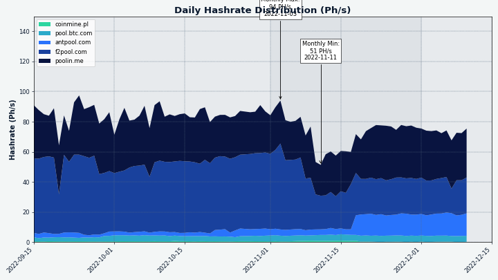

# مجلة ديكريد لشهر نوفمبر 2022

_الصورة: بدون عنوان بواسطة Exitus@._

أبرز أحداث شهر نوفمبر:

* كانت هناك إصدارات جديدة لإصلاح الأخطاء من Decrediton (النسخة 1.7.6) و DCRDEX (النسخة 0.5.7).
* أبرز أخبار العملات الرقمية المشفرة لشهر نوفمبر 2022 هي حل احتيال FTX، مع توقفهم عن معالجة عمليات السحب التي أدت إلى موجة من العدوى التي أثرت على عدد من منصات المبادلات والأرصدة الرفيعة المستوى. يجب أن تجعل هذه الأحداث المزايا غير الاحتجازية و “إثبات الاحتياطيات” لمنصة المبادلات اللامركزية لديكريد أكثر بروزًا.
* تمت إعادة تفعيل dcrtimestampbot@ على التويتر بعد الموافقة الناجحة على اقتراح تمويله. يأتي ذلك بعد الاستخدام البارز لسلسلة ديكريد لتحديد الطابع الزمني في الانتخابات الوطنية البرازيلية التي اختتمت في أكتوبر، حيث قام كل من لولا وحداد، العمدة السابق لساو باولو، بوضع ختم زمني لخططهما للحوكمة على سلسلة ديكريد لمكافحة الأخبار المزيفة.

المحتويات:

* [إصدار النسخة 1.7.6 لديكريديتون](#إصدار-النسخة-1.7.6-لديكريديتون)
* [إصدار النسخة 0.5.7 لمنصة المبادلات اللامركزية لديكريد](#إصدار-النسخة-0.5.7.-لمنصة-المبادلات-اللامركزية-لديكريد)
* [التطوير](#التطوير)
* [الأشخاص](#الأشخاص)
* [الإدارة و الحوكمة](#الإدارة-و-الحوكمة)
* [الشبكة](#الشبكة)
* [النظام البيئي](#النظام-البيئي)
* [الانتشار](#الانتشار)
* [الفعاليات](#الفعاليات)
* [وسائل الإعلام](#وسائل-الإعلام)
* [مناقشات المجتمع](#مناقشات-المجتمع)
* [الأسواق](#الأسواق)
* [الخارجية ذات الصلة](#الخارجية-ذات-الصلة)

## إصدار النسخة 1.7.6 لديكريديتون

يصلح هذا الإصدار بعض المشكلات مع منصة المبادلات اللامركزية (تم تحديث الوحدة للإصدار 0.5.6)، بالإضافة إلى إصلاح واحد لنظام التشغيل الويندوز:

* منصة المبادلات اللامركزية: إصلاح معالجة  بعض معاملات Bitcoin Taproot.
* منصة المبادلات اللامركزية: إصلاح فتح المحفظة في بعض إعدادات المحفظة المخلوطة لديكريد.
* منصة المبادلات اللامركزية: تم إصلاح حالة المزامنة المضللة في المحافظ المضمنة لديكريد.
* تم إصلاح تحليل اسم المجال باستخدام خوادم DNS البديلة التي تم تكوينها في الويندوز.

احصل على [أحدث إصدار](https://github.com/decred/decred-binaries/releases) على GitHub. كما هو الحال دائمًا، نوصي [بالتحقق من الملفات](https://docs.decred.org/advanced/verifying-binaries) قبل التشغيل.

## إصدار النسخة 0.5.7 لمنصة المبادلات اللامركزية لديكريد

يتقدم تطبيق منصة المبادلات اللامركزية المستقل قليلاً عن إصدار ديكريديتون المذكور أعلاه، بما في ذلك هذه التغييرات منذ الإصدار 0.5.6:

* تم إصلاح الحالة التي قد يفشل فيها العميل في إكمال إلغاء الأمر، مما يؤدي إلى بقاء الأمر في الكتاب على الخادم.
* تمت إضافة الإلغاء التلقائي للأوامر الواردة من الخادم والتي لا يعرفها العميل ، مع إصلاح بعض حالات الحافة.

يأتي هذا الإصدار أيضًا مع توقيع بواسطة مفتاح @chappjc `761D6A0BEB286C9B6A65DD053F857EEA746C64D1`، مما يجعل من الممكن [التحقق](https://docs.decred.org/advanced/verifying-binaries) من تنزيلات DEX حتى تكون متاحة كجزء من إصدار [البرنامج الأساسي](https://github.com/decred/decred-binaries/releases) التالي.

يمكن تنزيل أحدث تطبيق منصة المبادلات اللامركزية من [هنا](https://github.com/decred/dcrdex/releases).

## التطوير

ما لم يُذكر خلاف ذلك، فإن العمل المَذْكُور هنا يشتمل على حالة "الدمج إلى الرئيسي". وهذا يعني أن العمل قد تم استكماله ومراجعته ودمجه في كود المصدر الذي يمكن للمستخدمين المتقدمين [بناءه وتشغيله](https://medium.com/@artikozel/the-decred-node-back-to-the-source-part-one-27d4576e7e1c)، ولكنه ليس متاحًا بعد في ثنائيات الإصدار للمستخدمين العاديين.

### dcrd

_[dcrd](https://github.com/decred/dcrd) هو تطبيق عقدة كامل يعمل على تشغيل شبكة ديكريد من نظير إلى نظير حول العالم._

تم الدمج في الفرع الرئيسي `master`:

* تحديث [تجربة النظير للطابع الزمني](https://github.com/decred/dcrd/pull/3014) قبل محاولة الاتصال به.
* تبسيط كيفية تخزين المعاملات الأولية و[أوصافها](https://github.com/decred/dcrd/pull/3015) الإضافية في مجمع الذاكرة.
* تم تعديل [إدارة الذاكرة](https://github.com/decred/dcrd/pull/3016)  لتقليل وقت وحدة المعالجة المركزية في جمع البيانات المهملة. باستخدام هذا دچرد ، يمكن إجراء مزامنة السلسلة الأولية بنسبة تصل إلى 10٪ بشكل أسرع على حساب استخدام المزيد من الذاكرة. فائدة جانبية لطيفة هي أنه يمكن الآن لمسؤولي النظام المتقدمين  ضبط هذا السلوك باستخدام متغير البيئة.
* تم [تمكينه](https://github.com/decred/dcrd/pull/3017) وتعيينه كإصدار بروتوكول نظير إلى نظير [افتراضي](https://github.com/decred/dcrd/pull/3019) جديد لم يعد يستخدم رسالة الرفض `reject`. تم توريث الرسالة من مصدر كود btcsuite الأصلي واستخدمت للإشارة إلى أن معاملة أو كتلة ["مرفوضة"](https://en.bitcoin.it/wiki/Protocol_documentation#reject) من قبل النظير. كان استخدام هذه الرسالة لأي شيء إلى حد كبير غير موثوق به أو غير صحيح وتم تقديم [اقتراح](https://github.com/decred/dcrd/issues/2546) لإزالتها. لن يرسل الأقران الذين يتفاوضون على إصدار البروتوكول الجديد هذا رسائل رفض `reject` ويعتبرونها انتهاكًا إذا تلقوها. لن يعاقب أي أقران يتفاوضون على نسخة قديمة على إرسال `reject` وسيتم تجاهله من قبل العقد الجديدة.
* تمت إضافة [أحداث ](https://github.com/decred/dcrd/pull/3020)IPC جديدة لإخطار العملية الرئيسية بالعنوان والمنفذ المخصصين لـ dcrd. في التكوينات حيث يتم التحكم في dcrd من خلال عملية أخرى مثل Decrediton أو المشغل الآلي للاختبار، تحتاج هذه العملية الأم إلى معرفة العناوين والمنافذ التي يستخدمها dcrd لواجهة P2P (التحدث إلى الشبكة العامة) وواجهة RPC (الاتصالات المحلية مع المحافظ وغيرها عملاء). يوفر هذا التغيير طريقة موثوقة لاكتشاف منافذ dcrd عندما يتم تعيينها عشوائيًا بواسطة نظام التشغيل وعدم تكوينها بواسطة العملية الأصلية.
* الاستجابة الدائمة لطلبات [`getheaders`](https://github.com/decred/dcrd/pull/3030) من النظراء. لن يستجيب المنطق السابق لـ `getheaders` إذا لم يتم اعتبار السلسلة المحلية متزامنة تمامًا مع الشبكة. في نموذج مزامنة "الكتل أولاً" القديم، ساعد ذلك في تجنب بعض حالات الزاوية غير المرغوب فيها، مثل تنزيل الكتل دون داع. كان لها جوانب سلبية أيضًا، مثل العقدة التي قد تبدو غير مستجيبة أو متوقفة لنظرائها، بينما تكون نشطة وببساطة ليس لديها أي بيانات مثيرة للاهتمام لمشاركتها. في نموذج مزامنة “الرؤوس أولاً” الحالي، لم يعد هذا القيد ضروريًا، ولم يعد تقديم الرؤوس قبل أن يُعرف النظير بأنه حالي يؤدي إلى سلوك غير مرغوب فيه.

خادم RPC:

* تم تحسين معالجة فصل عميل WebSocket وإصلاح الرسائل الزائفة عند فصل عملاء WebSocket.
* تم تعديل [دورة حياة](https://github.com/decred/dcrd/pull/3025) عملاء WebSocket لاستخدام السياقات، وهي أكثر مرونة لكود الاتصال.
* تمت إضافة [دعم الإلغاء](https://github.com/decred/dcrd/pull/3027) لطلب `getwork` ومعالجة محسّنة لطلبات `getwork` المتزامنة المتعددة. يجب أن يفيد هذا بعض تكوينات التعدين. يتم استخدام getwork بواسطة برنامج التعدين لاستقصاء العقدة باستمرار للعمل الجديد الذي يتم توزيعه بعد ذلك على أجهزة التعدين. إنها طريقة شائعة جدًا للعملات التي يتم تعدينها، ومع ذلك يتم تشجيع معدني ديكريد على استخدام اشتراك الإخطار [`notifywork`](https://github.com/decred/dcrd/blob/0e7920ce30257aa1aced00e34ac637423f50965e/docs/json_rpc_api.mediawiki#notifywork) الأكثر كفاءة.

تم نقل إطار اختبار RPC إلى المستودع الجديد المسمى [`dcrtest`](https://github.com/decred/dcrtest). يتصل الإطار بحالة dcrd ويقودها عبر [واجهة ](https://bitcoin.stackexchange.com/questions/24163/what-does-the-bitcoin-rpc-mean-and-how-is-it-used)RPC. يتم استخدامه لكتابة اختبارات مستوى الإدماج التي تمارس ميزات وسلوكيات ثنائية dcrd المجمعة بالكامل. البقاء في مستودع منفصل الآن، يوفر وظائف أجمل من حيث اختيار إصدار معين من dcrd لاختباره من خلال الاستفادة من نظام وحدة Go بدلاً من تجميع أحدث فرع رئيسي `master` بصفة دائمة. يسمح هذا لمستهلكي إطار الاختبار، مثل dcrlnd، بتوفير المزيد من ضمان الجودة من خلال الاختبار مقابل إصدارات الإصدار من dcrd بالإضافة إلى أحدث فرع رئيسي `master`.

### dcrwallet

_[dcrwallet](https://github.com/decred/dcrwallet) هو خادم محفظة تستخدمه تطبيقات سطر الأوامر والمحفظة الرسومية._

* تم تحديث [الإصدار الرئيسي](https://github.com/decred/dcrwallet/pull/2189) من وحدة `decred.org/dcrwallet` إلى الإصدار 3، وتحديث جميع تبعيات الوحدات النمطية الحالية قيد التطوير من dcrd إلى الإصدارات الرئيسية المقابلة لها، وإزالة الكود غير المستخدم.
* السماح [بتوصيل الإجابات](https://github.com/decred/dcrwallet/pull/2191) على المطالبات `—create` بالعمل بشكل صحيح ليس فقط لمطالبة عبارة المرور الأولية، ولكن للتأكيد أيضًا. يساعد هذا في أتمتة إنشاء المحفظة (على سبيل المثال عن طريق تمرير جميع الإجابات من ملف نصي).
* لم تعد [استعادة محفظة](https://github.com/decred/dcrwallet/pull/2192) البذور السداسية تتطلب سطرًا جديدًا إضافيًا. يساعد هذا أيضًا عمليات النشر [غير التفاعلية](https://github.com/decred/dcrwallet/issues/2190) (التلقائية) لـ dcrwallet.
* تمت إضافة طلبات RPC للسماح لديكريديتون بالحصول على [سياسات إنفاق المعاملات قيد الإنتظار](https://github.com/decred/dcrwallet/pull/2172) وتحديثها.

### Decrediton

_[Decrediton](https://github.com/decred/decrediton) ديكريديتون هو تطبيق محفظة لسطح المكتب كامل الميزات مع ميزة التصويت مدمجة، وميزة الخلط ب StakeShuffle، والشبكة البرقية، والتداول على منصة المُبادلات اللامركزية DEX للديكريد، والمزيد. يتم تشغيلها مع سلسلة الكتل كاملة أو بدونها (وضع التحقق البسيط من الدفع SPV)._

[إصدار النسخة ](https://github.com/decred/decred-binaries/releases/tag/v1.7.6)1.7.6:

* [تحديث](https://github.com/decred/decrediton/pull/3834) وحدة منصة المبادلات اللامركزية لديكريد إلى الإصدار 0.5.6 (إصلاحات الأخطاء لـ BTC و DCR) وإضافة الكود إلى نافذة DEX.

نحو الإصدار التالي على الفرع الرئيسي `master`، تم [إعادة تصميم](https://github.com/decred/decrediton/pull/3690) مشغل المحفظة Wallet Launcher:

* تمت إضافة برامج تعليمية عن الإعداد إلى المشغل.
* إضافة التدرجات إلى بطاقات المحفظة. يتم حفظ التدرج اللوني لكل محفظة في ملف التكوين.
* نقل شريط التقدم المعاد تصميمه إلى الأسفل.
* تمت إزالة مكون `RescanWallet`. تم الآن دمج تقدم إعادة الفحص في شريط التقدم ويتم عرض قائمة دروس الإعداد أثناء التقدم.
* تم تقديم مؤشر شريط تقدم جديد لعملية جلب رأسيات الكتل.
* تمت إضافة خيار إعداد محفظة Trezor.
* تمت إضافة نموذج التشغيل الآلي للمحفظة. يتم حفظ اختيار المستخدم في التكوين.

منصة المبادلات اللامركزية:

* تمت [إزالة](https://github.com/decred/decrediton/pull/3800) خطوات إعداد محفظة البتكوين لصالح محفظة BTC المدمجة التي توفرها وحدة منصة المبادلات اللامركزية. تمت إضافة اختبارات لعروض وإجراءات منصة المبادلات اللامركزية.
* عند تغيير [عبارة مرور المحفظة](https://github.com/decred/decrediton/pull/3822)، يمكن للمستخدمين إدخال كلمة مرور تطبيق منصة المبادلات اللامركزية لجعلها على علم بعبارة مرور المحفظة الجديدة. يعمل هذا على إصلاح تجربة المستخدم لتغيير عبارة المرور المربكة لأولئك الذين يستخدمون منصة المبادلات اللامركزية عبر ديكريديتون.
* تم حل مشكلة [عدم تشغيل](https://github.com/decred/decrediton/pull/3831) نافذة منصة المبادلات اللامركزية بعد إعادة تحميل واجهة المستخدم.

تحديثات تجربة المستخدم:

* تمت [إضافة روابط](https://github.com/decred/decrediton/pull/3778) إلى التذاكر التي تم إنفاقها ورسوم مزود خدمة التصويت في صفحة تفاصيل المعاملات. هذه الروابط مفتوحة الآن محليًا في ديكريديتون بدلاً من الإرسال إلى dcrdata. إذا لم تكن المعاملة المرتبطة في الذاكرة بعد (على سبيل المثال، قديمة جدًا)، فسيتم جلبها من dcrwallet في الخلفية.
* تمت إضافة خطوة التشغيل لإعادة إرسال تفضيلات التصويت إلى [مزودي خدمة التصويت الذين تم تحديثهم](https://github.com/decred/decrediton/pull/3738) مؤخرًا. تُفقد خيارات التصويت بالإجماع التي يتم إرسالها إلى مزود خدمة التصويت الذي يشغل برامج قديمة لأن مزود خدمة التصويت ليس على دراية بأصوات الإجماع الجديدة. إذا تم تحديث مزود خدمة التصويت هذا، فقد يكون من [الضروري](https://github.com/decred/decrediton/issues/3723) إعادة إرسال خيارات التصويت إليه، حتى يتمكن من التصويت على أجندات الإجماع الأخيرة مع التذاكر التي يديرها.
* تمت إضافة [روابط إلى المستندات](https://github.com/decred/decrediton/pull/3802) في شكل دلالات علامة استفهام في جميع أنحاء المحفظة.
* إعادة تصميم [صفحات ](https://github.com/decred/decrediton/pull/3570)Trezor.
* تحسين تدفق [شراء تذكرة واحدة](https://github.com/decred/decrediton/pull/3819) مخلوطة عن طريق أتمتة الخطوات: تعطيل الخلاط، شراء التذكرة، وإعادة تمكين الخلاط.
* يتم الآن تحديث تفضيلات التصويت [بشكل غير متزامن](https://github.com/decred/decrediton/pull/3801). أبلغ المطور bgptr@ أن العملية أصبحت أسرع ثلاث مرات على الشبكة الرئيسية (3 ثوانٍ مقابل 11 ثانية). كما تم تحسين معالجة الأخطاء.

تغييرات أخرى:

* أعيدت تسمية الحزمة `win32ipc` ب `dcrwin32ipc` [لتجنب الارتباك](https://github.com/decred/decrediton/pull/3828) مع حزمة بعيدة مشبوهة تحمل نفس الاسم. تم تحديد أنه لم يكن هناك أي خطر على برنامج ديكريد من هذه الحزمة المشبوهة الأخرى وأن وحدة ديكريدتون كانت دائمًا محملة من الأصول المبنية محليًا.
* تم تجديد كود [معالجة المعاملات](https://github.com/decred/decrediton/pull/3777) لتحسين الأداء وتمكين الاختبار الآلي.
* تمت إزالة جميع [الكود القديم ذي الصلة بأداة مجمع التحصيص](https://github.com/decred/decrediton/pull/3808). تم أيضًا تنظيف بنية الشفرة المتعلقة بشراء التذاكر والمشتري الآلي. تُظهر علامة تبويب الخصوصية الآن بشكل صحيح أنه يتم إنشاء عمليات المزج كل عشرة دقائق، وليس عشرون دقيقة.
* تمت إضافة ترجمات [أساسية ومتقدمة](https://github.com/decred/decrediton/blob/fabcf6b81d50ac11c9502af0117d654c21e8c3bc/app/i18n/community_translators.md) [للغة اليونانية](https://github.com/decred/decrediton/pull/3719).
* تطبيق [إعدادات الوكيل](https://github.com/decred/decrediton/pull/3803) على dcrd و dcrwallet عندما يكون نوع الوكيل هو SOCKS5. باستخدام هذا، يمكن للمستخدمين تكوين dcrd و dcrwallet للتواصل عبر شبكة Tor.
* زيادة تغطية الاختبارات الآلية لواجهة المستخدم.
* تحديثات التبعية، بما في ذلك التبديل إلى [Node 16](https://github.com/decred/decrediton/pull/3837) و [Electron 18](https://github.com/decred/decrediton/pull/3832).

الإصلاحات:

* إصلاح [الإغلاق](https://github.com/decred/decrediton/pull/3804) غير المرغوب فيه لحساب المحفظة الذي يستخدمه المشتري الآلي للتذاكر.
* تم إصلاح [تقدير وقت](https://github.com/decred/decrediton/pull/3815) تنزيل سلسلة الكتل أثناء المزامنة.
* تم إصلاح الميزة المفقودة [لإعادة القفل](https://github.com/decred/decrediton/pull/3819) بعد شراء ناجح أو فاشل للتذكرة، أو مشتري آلي أو تشغيل خلاط، وما إلى ذلك. تظهر حالة قفل الحساب الآن على صفحة الحسابات لتسهيل التتبع.
* إصلاح [مشاهدات المعاملات](https://github.com/decred/decrediton/pull/3789): اقتطاع العناوين الطويلة وأسماء الحسابات، وإظهار معاملة إنفاق التذكرة، وإصلاح عرض الهاش، وإصلاح بعض التذاكر التي تم الإبلاغ عنها بشكل غير صحيح على أنها فردية.
* تم إصلاح عدم القدرة على [إغلاق القنوات غير النشطة](https://github.com/decred/decrediton/pull/3796) في علامة التبويب الشبكة البرقية.
* تم إصلاح المشكلة حيث فقد [التركيز](https://github.com/decred/decrediton/pull/3839) بين كلمات البذور عند استعادة محفظة تريزور.

أدوات التطوير والمستندات:

* توثيق كيفية تثبيت و تحديث أدوات تطوير [Electron devtools](https://github.com/decred/decrediton/pull/3825).
* إضافة البرامج النصية لتحليل [حجم الحزمة](https://github.com/decred/decrediton/pull/3826).

_الصورة: إعادة تصميم تشغيل ديكريديتون. ثقف نفسك عن ديكريد أثناء مزامنة محفظتك._

_الصورة: إعادة تصميم Trezor في ديكريديتون._

### بوليتيا

_[بوليتيا](https://github.com/decred/politeia) هي نظام المقترحات لديكريد. يتم استخدامها لطلب التمويل من خزينة ديكريد_

جميع التغييرات أدناه تتعلق بإعادة صنع واجهة المستخدم الرسومية على [بنية البرنامج المساعد](https://github.com/decred/politeiagui/tree/master/plugins-structure#politeiagui---plugins-structure) الجديد.

[تحسين الملاحة](https://github.com/decred/politeiagui/pull/2866):

* تمت إضافة خدمة ملاحة إلى الحزمة الأساسية `core`. `core` هو بناء أساسي للكتلة ويمكن استخدام خدماته من أي ملحق أو تطبيق شبيه ببوليتيا.
* تحديث عنوان الصفحة ديناميكيًا وفقًا لاسم الاقتراح.
* تمت إضافة مكون رابط "العودة" قابل لإعادة الاستخدام وإصلاح الأخطاء القديمة.

مسائل أخرى:

* بناء واختبار [العقد 18 و ](https://github.com/decred/politeiagui)19.
* إضافة [الاختبارات](https://github.com/decred/politeiagui/pull/2876) لمكونات واجهة المستخدم الشائعة.
* تمت إضافة [مجموعة أدوات](https://github.com/decred/politeiagui/pull/2869) لتبسيط التهيئة وتكوين المكونات الإضافية وخدماتها.
* تمت إضافة [سير عمل ](https://github.com/decred/politeiagui/pull/2873)GitHub Actions لبناء واختبار إعادة تصميم واجهة المستخدم الرسومية الجديدة بشكل منفصل عن تطبيق واجهة المستخدم الرسومية الحالي.
* تم تنفيذ عرض ["المقترحات المقدمة"](https://github.com/decred/politeiagui/pull/2877) الأولية في صفحة "حساب المستخدم".
* إصلاح معالجة بعض [الأخطاء](https://github.com/decred/politeiagui/pull/2872) التي يتم إرجاعها من الخادم، مع إصلاح/تحديث الإختبارات الشاملة.

### vspd

_[vspd](https://github.com/decred/vspd) هو برنامج خادم لتشغيل موفر خدمة التصويت. يصوت موفر خدمة التصويت نيابة عن مستخدميه على مدار الساعة طوال أيام الأسبوع ولا يمكنه سرقة الأموال._

*  تمت إضافة [أداة التحقق من التصويت `vote-validator`](https://github.com/decred/vspd/pull/335). يسمح ذلك لمسؤولي مزودي خدمة التصويت بالتحقق من أن نشر vspd الخاص بهم يصوت بشكل صحيح وفقًا لتفضيلات المستخدم.
* تضمين [إيداع ](https://github.com/decred/vspd/pull/357)Git في سلسلة إصدار التطبيق.
* إضافة [وحدة عميل HTTP قابلة لإعادة الاستخدام](https://github.com/decred/vspd/pull/359) لعملاء واجهة برمجة تطبيقات vspd. سيكون هذا مفيدًا لأدوات dcrwallet و dcrwebapi والاختبار مثل v3tool.
* تحسينات [بناء النظام](https://github.com/decred/vspd/pull/362).

### الشبكة البرقية

_dcrlnd هو برنامج عقدة الشبكة البرقية لديكريد. تتيح الشبكة البرقية معاملات فورية ومنخفضة التكلفة._

* تم تحديث [أحدث](https://github.com/decred/dcrlnd/pull/168) إصدارات اختبار dcrd و dcrwallet. يتطلب هذا إصلاح معدن شبكة المحاكاة لحساب خطأ استنفاد التذكرة الذي يمكن أن يحدث أثناء التعدين.
* تمت إضافة [خيار](https://github.com/decred/dcrlnd/pull/170) تبديل سياسة الفجوة عند إنشاء عناوين جديدة إلى Wrap بدلاً من الخيار الافتراضي في dcrwallet. يعمل هذا على إصلاح [مشكلة](https://github.com/decred/dcrlnd/issues/169) حيث تؤدي محاولة إنشاء عنوان لـ lnwallet لفتح قناة أو إغلاقها إلى حدوث خطأ.

### DCRDEX

_[DCRDEX](https://github.com/decred/dcrdex) هي منصة مبادلات غير احتجازية للمُبادلات غير الموثوقة، مدعومة بالمقايضات الذرية._

[إصدار النسخة ](https://github.com/decred/dcrdex/releases/tag/v0.5.5)0.5.5:

* تم إصلاح المراجعة السيئة لـ goleveldb التي جاءت من go-ethereum عن طريق [خفض تصنيفها](https://github.com/decred/dcrdex/pull/1938)  يدويًا.
* تم إصلاح مشكلة أخرى تتعلق [بمعاملات Taproot الكبيرة](https://github.com/decred/dcrdex/pull/1936) على الشبكة الرئيسية للبتكوين عن طريق تحديث btcd مرة أخرى.

[إصدار النسخة ](https://github.com/decred/dcrdex/releases/tag/v0.5.6)0.5.6:

* إصلاح عدم قفل [الحساب غير المخلوط](https://github.com/decred/dcrdex/pull/1954) في بعض تكوينات الحساب المخلوطة، من أجل منع فشل استرداد المبالغ المستردة.
* إصلاح الإبلاغ قبل الأوان على [جاهزية](https://github.com/decred/dcrdex/pull/1955)  محافظ DCR المدمجة.

[إصدار النسخة 0.5.7](https://github.com/decred/dcrdex/releases/tag/v0.5.7):

* إلغاء الطلبات [التي لا يعرفها](https://github.com/decred/dcrdex/pull/1889) العميل. يعمل هذا على إصلاح مجموعة متنوعة من حالات الحافة التي تصادف عشوائيا حيث يمكن للعميل أن يفقد بعض أوامره (على سبيل المثال باستخدام ملف قاعدة بيانات فاسد، أو الفشل في حفظ الطلبات، وما إلى ذلك).
* تم إصلاح الخلل حيث أن [الطلبات](https://github.com/decred/dcrdex/pull/1971) ستكون موقوفة/غير موجودة عند العميل ولكن لا يزال حجزه على الخادم. يمكن أن يحدث ذلك إذا بدأ العميل في إلغاء طلب التداول، وفشل في الاستجابة [لطلب الصورة السابقة](https://github.com/decred/dcrdex/blob/75bb91da9b2f65b52835cb8235bcc1a7fd7b893b/spec/orders.mediawiki#order-commitment) من الخادم (على سبيل المثال عن طريق قطع الاتصال لفترة وجيزة)، ووضع علامة غير صحيحة على طلب التداول على أنه تم [إلغاؤه](https://github.com/decred/dcrdex/pull/1971)، بينما في الواقع فشل الإلغاء ولا يزال طلب التجارة محجوزا على الخادم.

فيما يلي التغييرات المدمجة في الفرع الرئيسي `master` نحو الإصدار الرئيسي التالي.

التغييرات التي تواجه المستخدم، العميل:

* تمت إضافة [روبوت صانع السوق](https://github.com/decred/dcrdex/pull/1738). يستخدم الروبوت بعض الإشارات الداخلية والخارجية (اختياريًا) لحساب سعر البيع والشراء المثالي و "هامش نقطة التعادل"، وهو الفارق الذي تساوي عنده رسوم معاملة تسلسل الشراء والبيع ربحها. يمكن استخدام هذه القيم كمدخلات في واحدة من ومس "استراتيجيات الفجوة"، والتي تحدد انتشار الهدف. تم تصميم الكود لدعم المزيد من إجراءَات التداول في المستقبل. تمت إضافة واجهة المستخدم لإنشاء وتكوين ومراقبة روبوتات صانع السوق الحالية.
* دعم إضافي للتداولات "ذاتية الإدارة" عند [تعطل الخادم](https://github.com/decred/dcrdex/pull/1866). يحتاج العملاء إلى طريقة لإكمال التداولات المبتدئة حتى لو انخفض الخادم أو فقد معلومات السوق في ظروف غامضة.
* تم تسجيل [مسار](https://github.com/decred/dcrdex/pull/1951)  قاعدة البيانات الآن عند بدء التشغيل.
* جعل وضع الطلب [أكثر استجابة](https://github.com/decred/dcrdex/pull/1887). سيتم إغلاق نموذج الطلب قريبًا وسيستمر تقديم الطلب في الخلفية.
* إظهار أو إخفاء [خيارات الطلبات المتقدمة](https://github.com/decred/dcrdex/pull/1885) بشكل تلقائي.
* تم إصلاح الخلل حيث لم يتم عرض [أسعار النقود الورقية](https://github.com/decred/dcrdex/pull/1974). تم تقليل تواتر جلب أسعار النقود الورقية لتجنب الوصول إلى حدود المعدل.
* ~ ستة إصلاحات وتعديلات صغيرة.

محفظة البتكوين، العميل:

* يمكن للمستخدمين الآن [رؤية وإدارة النظراء](https://github.com/decred/dcrdex/pull/1931) الذين تتصل بهم محافظ التحقق البسيط من الدفع للبتكوين، بالإضافة إلى إضافة نظراء جدد.

سندات الإخلاص (العميل والخادم):

* تم تنفيذ المزيد من [اللبنات الأساسية للكتلة](https://github.com/decred/dcrdex/pull/1819): تمت إضافة رسائل لإدارة السندات، وتغيير إدارة حساب الخادم إلى نظام متدرج، وتحديث قاعدة بيانات الخادم لتتبع روابط العميل. لن يكون هناك إبطال للسندات بسبب السلوك السيئ، وبدلاً من ذلك، فإن مستوى المستخدم هو التوازن بين "قوة" الرابطة ودرجة سلوكهم. قد يحتاج المستخدمون الذين يسيئون التصرف إلى قفل المزيد من الأموال في سندات إضافية لاستعادة مستواهم والتداول مرة أخرى.

الخادم:

* سيتم التعطيل سريعًا إذا لم يتم تفعيل [مؤشر المعاملات](https://github.com/decred/dcrdex/pull/1973) للأصول الشبيهة بالبتكوين. من الضروري لعملية منصة المبادلات اللامركزية، بدون الفهرس، ستفشل منصة المبادلات اللامركزية في البحث عن المعاملات.
* إصلاح حساب [رسوم ](https://github.com/decred/dcrdex/pull/1965)DOGE.

_الصورة: مساعد الروبوت الخاص بصانع السوق في DCRDEX._

### dcrdata

_[dcrdata](https://github.com/decred/dcrdata) هو مستكشف لبيانات سلسلة كتل ديكريد وخارج السلسلة مثل مقترحات بوليتيا والأسواق وغيرها._

* تم إصلاح مراجعة goleveldb[ السيئة](https://github.com/decred/dcrdata/pull/1934) التي كانت تكسر كود قاعدة بيانات dcrd.
* تم إصلاح العديد من أخطاء الواجهة الأمامية، والأهم من ذلك تلك المتعلقة [بإنفاق وإضافات الخزينة](https://github.com/decred/dcrdata/pull/1933).

### Rosetta

_[dcrros](https://github.com/decred/dcrros) هي خدمة برامج وسيطة توفر الوصول إلى شبكة ديكريد عبر واجهة برمجة تطبيقات Rosetta._

* تم [التحديث](https://github.com/decred/dcrros/pull/27) إلى الإصدار 1.7.5 لديكريد.
* تم تبديل الإصدار الثابت من Dockerfile لاستخدام [الإصدار v0.2.0](https://github.com/decred/dcrros/pull/30) المعلَّم مؤخرًا من `dcrros`.
* بدأت [دورة التطوير](https://github.com/decred/dcrros/pull/31) التالية للإصدار 0.3: تم التحديث إلى أحدث حزم dcrd، وتهيئة CI المحدثة، والتحول إلى dcrtest الجديد لإجراء اختبارات الإدماج.

### مسائل أخرى:

في قسم الأبحاث، نشر matheusd@ OP_PEEL[: تجمعات عملات قابلة للخروج من جانب واحد](https://matheusd.com/post/op_peel/). يزيل `OP_PEEL` العديد من القيود المفروضة على مفهوم [MRTTREE](https://matheusd.com/post/ln-split-tickets-01-mrttree/) السابق لبناء تذاكر مرخصة متعددة المالكين على الشبكة البرقية.

> الهدف الرئيسي لإدخال `OP_PEEL` هو بناء مجمعات أموال متعددة المستخدمين، يتم تقديمها كناتج واحد للمعاملات غير المنفقة على السلسلة، بحيث يمكن لأي مشارك فردي في المجمع استرداد حصصه من جانب واحد دون الحاجة إلى بروتوكولات تنسيق المجموعة الكاملة أو حتى الجزئية لمرحلة الاسترداد من العقد.

قد يكون مفهوم `OP_PEEL` طريقة جيدة لتنفيذ التذاكر متعددة المالكين (المعروفة أيضًا باسم"تقسيم التذاكر")، ولكن يمكن للتطبيقات الأخرى البناء عليها أيضًا.

## الأشخاص

نرحب بالمساهمين الجدد لأول مرة:

* @Xk9eboF6 (ترجمات ديكريديتون باللغة اليونانية)
* Blockchain Jew (مؤلف [مجلة ديكريد](https://www.decredmagazine.com/author/blockchain/))
* Hassan Maishera (مؤلف [مجلة ديكريد](https://www.decredmagazine.com/author/hassan/))

في الإصدار الأخير من الأسئلة و الأجوبة على مجلة ديكريد، شارك المطور cli\_query@ طريقه من التداول في منصات التبادلات الاجنبية إلى الغوص في العملات المشفرة الرقمية و ديكريد.

> كان الشعور غير عادي، والقدرة على القيام بالعمل والحصول على أجر من خلال بروتوكول لامركزي هو أمر قوي للغاية. حقيقة أنك تحتاج ببساطة إلى تقديم عمل صادق وإضافة قيمة إلى المجتمع أمر مذهل بالنسبة لي.

إحصائيات المجتمع اعتبارًا من 2 ديسمبر (مقارنة بـ 1 نوفمبر):

*  متابعو [التويتر](https://twitter.com/decredproject): 53,734 (-220)
* المشتركين في [ريديت](https://www.reddit.com/r/decred/): 12,634 (+2)
* مستخدمي غرفة الدردشة general# على [الماتريكس](https://chat.decred.org/): 729 (+3)
* مستخدمي [الديسكورد](https://discord.gg/GJ2GXfz): 1,878 (+21)، تم التحقق منه لينشر: 936 (بدأنا في تتبعه مرة أخرى)
* مستخدمي [التيليجرام](https://t.me/Decred): 2,894 (+32)
* المشتركين في [اليوتيوب](https://www.youtube.com/decredchannel): 4,640 (+0)، المشاهدات: 219 ألف (+ ألف)

## الإدارة و الحوكمة

في نوفمبر، تلقت [الخزينة](https://dcrdata.decred.org/treasury) الجديدة 8,473 DCR بقيمة 186 ألف دولار بمتوسط سعر نوفمبر البالغ 21.92 دولارًا. تم إنفاق 2,646 DCR للدفع للمتعاقدين، بقيمة 58 ألف دولار بسعر نوفمبر، أو 70 ألف دولار بمعدل فاتورة أكتوبر البالغ 26.27 دولارًا.
تضمنت [معاملة إنفاق الخزينة](https://dcrdata.decred.org/tx/95ebb23a0846417eb1aa6a59bf6b4ad49d8cd72ff44c869d4af366fd1aef402e) 25 ناتجًا لتسديد مدفوعات المتعاقدين، تتراوح من 3 DCR إلى 1,108 DCR. تمت الموافقة عليها في 5 ديسمبر بالإجماع بنعم. كانت هذه موافقة سريعة (تسمى أيضًا "موافقة الدائرة القصيرة" في [المواصفات](https://github.com/decred/dcps/blob/master/dcp-0006/dcp-0006.mediawiki)) في 10 أيام بدلاً من 12 يومًا كحد أقصى للتصويت. بلغ إقبال الناخبين 49٪ مع 7,037 صوتًا بنعم من أصل 14,339 صوتًا مؤهلًا كان لها فرصة للتصويت في فترة التصويت القصيرة. يمكن العثور على عرض أكثر تفصيلاً لمعاملة إنفاق الخزينة في [مثيل التدريج](https://tip.dcrdata.org/tx/95ebb23a0846417eb1aa6a59bf6b4ad49d8cd72ff44c869d4af366fd1aef402e) لـ dcrdata وسيصل قريبًا إلى المثيل الرئيسي لمستكشف الكتلة.

اعتبارًا من 10 ديسمبر، بلغ الرصيد المشترك للخزينة [القديمة](https://dcrdata.decred.org/address/Dcur2mcGjmENx4DhNqDctW5wJCVyT3Qeqkx) و[الجديدة](https://dcrdata.decred.org/treasury) 830,186 DCR (17.8 مليون دولار أمريكي بسعر 21.48 دولارًا أمريكيًا).

_الصورة: سجل رصيد الخزينة._

_الصورة: التدفقات الداخلية والخارجية الشهرية للخزينة._

تمت الموافقة على [اقتراح](https://proposals.decred.org/record/0848cc9) تمويل بوت التويتر [@dcrtimestampbot](https://twitter.com/dcrtimestampbot) بمبلغ 1،950 دولارًا بنسبة 91.4 ٪ من الأصوات بنعم والإقبال بنسبة 33٪. بعد يوم واحد من الموافقة، [نشر](https://proposals.decred.org/record/0848cc9/comments/13) cli\_query@ تحديثًا على بوليتيا يقول إن الروبوت نشط بموجب الملكية الجديدة.

## الشبكة

**معدل الهاش**: افتتحت [معدلات الهاش](https://dcrdata.decred.org/charts?chart=hashrate&scale=linear&bin=day&axis=time) لشهر نوفمبر عند ~ 87 Ph/s وأغلقت عند ~ 68 Ph/s، وبلغ قاعها عند 50 Ph/s كما بلغت ذروتها عند 93 Ph/s على مدار الشهر.

_الصورة: معدل هاش ديكريد._

توزيع معدل الهاش 75 Ph / s الذي [أبلغت](https://miningpoolstats.stream/decred) عنه المجمعات في 1 ديسمبر: Poolin بنسبة 43%، و F2Pool بنسبة 32%، و AntPool  بنسبة 19%، و BTC.com  بنسبة 5%، و CoinMine بنسبة 0.4%.

توزيع  1,000 كتلة تم [تعدينها](https://miningpoolstats.stream/decred) بالفعل بحلول 1 ديسمبر:  Poolin بنسبة 51%، و F2Pool بنسبة 32%، و (على الأرجح) AntPool بنسبة 10%، و BTC.com بنسبة 6%، و CoinmMine بنسبة 0.2%.

_الصورة: توزيع معدل هاش التجمع._

_الصورة: التوزيع التاريخي لتجمع معدل تجزئة.`_

**التحصيص**: تراوح [سعر التذكرة](https://dcrdata.decred.org/charts?chart=ticket-price&axis=time&visibility=true-true&mode=stepped) بين  226-237 DCR، [بمتوسط](https://dcrstats.com/) 231.5 DCR (-2.2) خلال 30 يوما.

بلغ [المبلغ المقفل](https://dcrdata.decred.org/charts?chart=ticket-pool-value&scale=linear&bin=day&axis=time) 9.44-9.55 مليون DCR، مما يعني أن   64.1-65.1 من العرض المتاح [شارك](https://dcrdata.decred.org/charts?chart=stake-participation&scale=linear&bin=day&axis=time) في إثبات الحصة.

**مقدم خدمة التصويت**: قام الـ [17 من مقدمي خدمة التصويت المدرجين](https://decred.org/vsp/) بإدارة ما يقرب من  6,930 (+130) تذكرة حية، والتي كانت تمثل  16.8٪ من مجموع التذاكر (0.1٪+) اعتبارًا من 1 ديسمبر. ملاحظة: هذه الأرقام لا تشمل vspd.stakey.com، التي تمتلك [مشاكل في واجهة برمجة التطبيقات](https://github.com/decred/dcrwebapi/pull/171) وتبلغ عن بيانات قديمة.

أكبر الرابحين في نوفمبر هم ultravsp.uk (+497) و decredvoting.com (+83).

_الصورة: توزيع التذاكر التي يديرها مقدمو خدمة التصويت._

**العقد**: رصد [جهاز رسم الخرائط لديكريد](https://nodes.jholdstock.uk/user_agents) 112 عقدة في 1 ديسمبر: 
النسخة 1.7.1 - 27%، النسخة 1.8.0 لبنائات التطوير - 17%، النسخة 1.7.5 - 17%، النسخة 1.7.2 - 13%، النسخة 1.7.0 - 13%، النسخة 1.7.4 - 4%، و أخرى 11%.

_الصورة: إصدارات عقدة dcrd قابلة للوصول._

_الصورة: التوزيع التاريخي لإصدار dcrd، بيانات من nodes.jholdstock.uk._

ملاحظة: كانت [النسخة dcrd  1.7.4](https://github.com/decred/dcrd/releases/tag/release-v1.7.4) إصدارًا للمطورين فقط بهدف رئيسي هو إصلاح [شبكة الاختبار المتوقفة]( https://github.com/xaur/decred-news/blob/master/journal/202208.md#dcrd ).

_الصورة: توزيع إصدار عقدة dcrd._

تراوحت حصة [العملات المخلوطة](https://dcrdata.decred.org/charts?chart=coin-supply&zoom=jz3q237o-la8vk000&scale=linear&bin=day&axis=time&visibility=true-true-true) بين 61.0-61.1٪. وقد تفاوتت [الكمية المخلوطة](https://dcrdata.decred.org/charts?chart=privacy-participation&bin=day&axis=time) بشكل يومي ما بين 265 و 445 ألف DCR.

شهد مستكشف [الشبكة البرقية](https://ln-map.jholdstock.uk/) لديكريد 67 عقدة (-2) و 104 قناة (-8) بسعة إجمالية 40.6 DCR (-6.3) اعتبارًا من 1 ديسمبر. شكراً ل karamble@ لتوفير البيانات أثناء إجراء [خريطة الشبكة البرقية](https://ln-map.jholdstock.uk/) اعمال صيانة.
شكراً ل @bochinchero لتحسين المخططات وإضافة مخططات جديدة. مجموعات الرسوم البيانية الكاملة متاحة [هنا](https://github.com/bochinchero/dcrsnapshots) لإعادة الاستخدام.

## النظام البيئي

سيتم الآن عكس إعلانات ديكريد في [Fediverse](https://en.wikipedia.org/wiki/Fediverse) على [@decred](https://dcr.pw/@decred) على dcr.pw. قم بمتابعته إذا كنت تستخدم Mastodon أو مثيل آخر متوافق مع ActivityPub.

لدى مجتمع Fediverse ما مجموعه 3 خدمات لديكريد الآن: مثيل Mastodon في citadel.stakey.net للشبكات الاجتماعية (رابط الدعوة)، مثيل PeerTube في tube.decredcommunity.org يعكس مقاطع فيديو اليوتيوب، و [@decred](https://dcr.pw/@decred) آخر لمتابعة إعلانات المشروع. نظرًا لأنهم جميعًا يتحدثون بروتوكول ActivityPub، فمن الممكن الحصول على كل من الإعلانات النصية ومقاطع الفيديو الجديدة في نفس الجدول الزمني للحساب.

تم تفعيل بوت ختم الوقت على التويتر مرة أخرى. اذكر [@dcrtimestampbot](https://twitter.com/dcrtimestampbot) في تغريدتك وسيحفظها الروبوت في IPFS، والطابع الزمني على سلسلة كتل ديكريد، والرد بروابط لعرض الإثبات والنسخة المحفوظة. في الوقت الحالي، يقتصر الروبوت على حفظ تغريدة واحدة فقط (أي لا توجد سلاسل رسائل) تذكر الروبوت مباشرةً. يمكن استخدام هذا للإدلاء ببيان وحمايته من التعديلات. يمكن لقراصنة Python الراغبين في المساعدة في تحسين الروبوت العثور على الكود المصدري [هنا](https://github.com/JC60522/dcr_timestampbot).

تمت إزالة محافظ ديكريد لنظامي Android و iOS من مواقع [Google Play](https://play.google.com/store/apps/details?id=com.decred.dcrandroid.mainnet) و [Apple Store](https://apps.apple.com/us/app/decred-wallet/id1462247643) المعلن عنها في [الإصدار ](https://www.reddit.com/r/decred/comments/umye1t/decred_mobile_wallet_v170_has_been_released_for/)v1.7.0 (مايو 2022)، بالإضافة إلى تنزيلات APK من [إصدار ](https://github.com/planetdecred/dcrandroid/releases)Android. لا يزال [كود المصدر](https://github.com/planetdecred) متاحًا على GitHub.

[زادت](https://matrix.to/#/!teQafvHMYpIbqLIieU:decred.org/$YgdoiqEwjnnrJIKugu6p6u95Edf9YsRHQpz-HmEoSaU?via=decred.org&via=matrix.org) Binance الحصة الشخصية لعرض الربح البسيط [Simple Earn](https://www.binance.com/en/support/announcement/binance-adds-new-assets-to-simple-earn-flexible-products-2022-10-20-87e0f4b74c884d83b09ae4f3c2fd7b82) الخاص بها لـ DCR من 15 DCR إلى 300 DCR لكل شخص، وزادت أيضًا العائد من 2.5٪ إلى 3.5٪.

أكملت [Poloniex](https://poloniex.com) [صيانتها](https://twitter.com/PoloSupport/status/1486355294493888512) لمدة 10 أشهر لمحفظة DCR والتي بدأت بعد يومين من [إصدار ](https://github.com/decred/decred-binaries/releases/tag/v1.7.0)v1.7.0. تعمل عمليات الإيداع والسحب مرة أخرى وهناك زوج تداول جديد لـ DCR/USDT.

انضم إلى دردشة [#ecosystem](https://chat.decred.org/#/room/#ecosystem:decred.org) لمتابعة تحديثات النظام البيئي لديكريد.

تحذير: ليس لدى مؤلفي مجلة ديكريد أي فكرة عن مصداقية أي من الخدمات أعلاه. يرجى إجراء بحثك الخاص قبل الوثوق بمعلوماتك الشخصية أو أصولك لأي كيان.

## الإنتشار

إنجازات Monde PR:

* عرض تحديث إخباري واحد
* تأمين ثلاث مقابلات إعلامية
* تم الرد على 13 طلبًا للتعليق

تأمين المقالات الإخبارية التالية:

* مقال في [Fintech Times](https://thefintechtimes.com/new-use-for-blockchain-setting-the-record-straight-in-political-battles/) حول كيفية استخدام سلسلة كتل ديكريد لمكافحة الأخبار الكاذبة في الانتخابات الرئاسية البرازيلية، ويضم تعليقًا من @jy-p. تم نشر القطعة في [UK Economy News](https://ukeconomynews.co.uk/new-use-for-blockchain-setting-the-record-straight-in-political-battles/).
* مقال في Cointelegraph يعرض تعليقًا من @jz يصف ملحمة FTX بأنها "لحظة Lehman Brothers للعملات الرقمية المشفرة”. تم تجميع القطعة في 24 منشورًا بما في ذلك [The New York Ledger](https://thenyledger.com/markets/crypto/ftx-collapse-the-crypto-industrys-lehman-brothers-moment/) و [Investing.com](https://www.investing.com/news/cryptocurrency-news/ftx-collapse-the-crypto-industrys-lehman-brothers-moment-2942288).
* ظهر @jy-p على بودكاست [Invezz Podcast](https://podcast.invezz.com/2000526/11675106) يتحدث عن كيفية استخدام سلسلة كتل ديكريد في الانتخابات الرئاسية البرازيلية. كما نشرت Invezz [مقالاً](https://invezz.com/news/2022/11/11/video-blockchain-and-elections-jake-yocom-piatt/) حول المقابلة تم توزيعه على منشورين وترجمته إلى 9 لغات.
* مقال في [The Manual](https://www.themanual.com/culture/what-experts-say-will-happen-next-for-crypto/) يعرض تعليقًا من jz@ حول مستقبل العملات الرقمية المشفرة بعد انهيار FTX. تم نشر المقال في [Canada Today](https://canadatoday.news/ca/why-experts-say-ftx-failure-is-a-turning-point-not-the-end-for-crypto-155389/).
* مقال في [The Fintech Times](https://thefintechtimes.com/sustainable-crypto-alternatives-to-mining-with-decred-sellix-and-omnia-markets/) يعرض تعليقًا من @jy-p على بدائل التعدين المستدامة للعملات الرقمية المشفرة. تم توزيع القطعة على خمسة منشورات بما في ذلك [UK Economy News](https://ukeconomynews.co.uk/sustainable-crypto-alternatives-to-mining-with-decred-sellix-and-omnia-markets/) و [NYC Crypto](https://nyccrypto.io/?p=106617).
* ظهر @jy-p على بودكاست [Cryptonews.com Podcast](https://cryptonews.com/exclusives/jake-yocom-piatt-co-founder-of-decred-on-blockchain-fixing-political-voting-campaign-spending-and-privacy.htm) يتحدث عن كيف يمكن لسلسة الكتل توفير حلول للتصويت السياسي والإنفاق والخصوصية. تم نشر المقابلة مع 7 منشورات بما في ذلك [Daily Crypto](https://dailycrypto.us.com/jake-yocom-piatt-co-founder-of-decred-on-blockchain-fixing-political-voting-campaign-spending-and-privacy/) و [Smart Investor](https://smartinvestor.online/jake-yocom-piatt-co-founder-of-decred-on-blockchain-fixing-political-voting-campaign-spending-and-privacy-ep-182/).

## الفعاليات

**الفعاليات القادمة:**

* تم اختيار @arij كعضو في لجنة الدورة السابعة عشرة من أمسية رواد الأعمال التي استضافتها JCI Casablanca، المغرب، حول موضوع “ريادة الأعمال النسائية”، حيث ستشارك تجربتها في العمل مع مشروع ديكريد وتجربة العمل في مجال سلسلة الكتل كإمرأة. ومن المقرر عقد الفعالية في 20 ديسمبر.

## وسائل الإعلام

**مقالات مختارة:**

* [استخدام جديد لسلسة الكتل: وضع الأمور في نصابها الصحيح في المعارك السياسية](https://thefintechtimes.com/new-use-for-blockchain-setting-the-record-straight-in-political-battles/) بواسطة Francis Bignell لـ Fintech Times
* [موقف ديكريد من الرقابة في سلسلة الكتل](https://www.decredmagazine.com/decreds-stand-on-censorship-in-the-blockchain/) بواسطة BlockchainJew@
* [استخدم الرئيس البرازيلي الجديد سلسلة كتل ديكريد لتحسين حملته!](https://www.decredmagazine.com/brazil-new-president-uses-decred-blockchain-to-improve-his-camapign/) بواسطة @Joao
* FTX [ - اللعب بأموال الناس](https://www.decredmagazine.com/ftx-playing-with-other-peoples-money/) - إعادة نشر موضوع تغريدة التويتر ل @jy-p كمقال في مجلة ديكريد
* [نظرة عامة على حزمة تكنولوجيا في ديكريد](https://www.decredmagazine.com/decreds-technology-stack-overview/) بواسطة phoenixgreen@
* [تنمو ديكريد مع الحوكمة الرشيدة](https://www.decredmagazine.com/decred-grows-with-good-governance/) بواسطة @OfficialCryptos
* [مراجعة أمن منصة المبادلات اللامركزية](https://www.decredmagazine.com/reviewing-dex-security/) بواسطة BlockchainJew@
* [سؤال وجواب للمطور cli_query](https://www.decredmagazine.com/cli_query-developer-q-a/) بواسطة phoenixgreen@
* [ديكريد مقابل اللايتكوين: أفضل بدائل البتكوين؟](https://www.decredmagazine.com/decred-vs-litecoin-best-alternatives-for-bitcoin/) بواسطة @Joao
* [يزيد انهيار FTX من الحاجة إلى منصات المبادلات اللامركزية](https://www.decredmagazine.com/ftxs-collapse-intensifies-the-need-for-decentralized-exchanges/) بواسطة HassanMaishera@

**احصائيات مشاركة مجلة ديكريد لشهر نوفمبر:**

* إجمالي عدد المقالات على مجلة ديكريد: 349
* عدد المشتركين في النشرة الإخبارية: 77
* المشاركات والنشرات الجديدة المرسلة: 16
* الحملات النشطة لوسائل التواصل الاجتماعي: 16
* الحملات المكتملة على وسائل التواصل الاجتماعي: 24
* المشاركات على وسائل التواصل الاجتماعي: 147
* الإعجابات: 823
* إعادة التغريدات: 198
* متابعو وسائل التواصل الاجتماعي عبر جميع المنصات والحسابات: 1,040

_الصورة: نظرة عامة على حزمة تكنولوجيا ديكريد._

**أشرطة الفيديو:**

* Decred Community Roundtable[ - ديكريد كسوق للتشغيل البيني](https://www.youtube.com/watch?v=EGRtpI9oPHc) بواسطة Exitus@ وphoenixgreen@، ويضم @h3la1 و @MadScrilla1 و @c12hz وDCR\_Uncle@
* [إكمال تداول نظير لنظير على منصة المبادلات اللامركزية لديكريد  - أساسيات منصة المبادلات اللامركزية لديكريد](https://www.youtube.com/watch?v=xr2Fmg5FMH8) بواسطة phoenixgreen@
* [سلسلة الكتل والانتخابات، جيك يوكوم بيات، و ديكريد](https://invezz.com/news/2022/11/11/video-blockchain-and-elections-jake-yocom-piatt/) بواسطة Dan Ashmore لأجل Invezz - متوفر أيضًا على [اليوتيوب](https://www.youtube.com/watch?v=cEQv7YdX2sM) و[كبودكاست](https://podcast.invezz.com/2000526/11675106)
* [سيناريوهات التداول - أساسيات منصة المبادلات اللامركزية لديكريد](https://www.youtube.com/watch?v=6c6McCUMhMQ) بواسطة phoenixgreen@
* [منصة المبادلات اللامركزية لديكريد تتيح الوصول إلى العملات الورقية سواءًا لبيعها أو لشرائها- أساسيات منصة المبادلات اللامركزية لديكريد](https://www.youtube.com/watch?v=PM8HGR_CUv4) بواسطة phoenixgreen@
* [جيك يوكوم بيات، الشريك المؤسس لـديكريد ، حول إصلاح سلسلة الكتل للتصويت السياسي والإنفاق على الحملات والخصوصية](https://www.youtube.com/watch?v=xUqRw4mxjW0) بواسطة Matt Zahab لـ CryptoNews Podcast الحلقة 182. متاح أيضًا [كنص كامل](https://cryptonews.com/exclusives/jake-yocom-piatt-co-founder-of-decred-on-blockchain-fixing-political-voting-campaign-spending-and-privacy.htm) و[كملف بودكاست](https://www.buzzsprout.com/1735660/11757590-182-jake-yocom-piatt-on-on-blockchain-fixing-political-voting-campaign-spending-and-privacy).

تتوفر العديد من مقاطع الفيديو لديكريد في تنسيق صوتي على بودكاست ](https://anchor.fm/decred-magazine)Decred Magazine و على Anchor وجميع منصات البودكاست الشائعة مثل Spotify أو Apple.

تحتوي قناتنا على YouTube الآن على رابط قصير جديد [@DecredTV](https://www.youtube.com/@DecredTV). يتم أيضًا عرض مقاطع الفيديو على [Odysee](https://odysee.com/@Decred:c).

**المقاطع الصوتية**:

* عُقد أول لقاء Decred Spaces في 21 نوفمبر بعنوان [النقاش المفتوح لديكريد - الحيازة الذاتية هي المَلِك](https://twitter.com/i/spaces/1OdKrzMMXOXKX). تتيح فضاءَات التويتر للمستخدمين إجراء محادثات نشطة في الوقت الفعلي، مع انضمام المستخدمين ومغادرتهم كما يحلو لهم. يمكن للمستخدمين طلب القدرة على التحدث من المضيفين الذين يشغلون الفضاء. حاليًا، يمكن فقط لمستخدمي الأجهزة المحمولة التحدث، بينما يمكن لمستخدمي الويب الاستماع فقط. تم ضبط 333 مستخدمًا. التسجيل متاح أيضًا على Anchor.

**الترجمة:**

* تمت [ترجمة](https://xaur.github.io/decred-news/) مجلة ديكريد لشهري سبتمبر و أكتوبر 2022 إلى اللغة العربية (arij@ و @abdulrahman4). شكرا لنشر الكلمة!

** محتوى غير إنجليزي: **

* [مقدمة مختصرة عن ديكريد](https://www.youtube.com/watch?v=MyPbjxKsp1M) من Just Crypto (اللغة العربية)

## مناقشات المجتمع

منشورات الريديت المختارة:

* [يتم دعم دفاتر طلبات منصة المبادلات اللامركزية لديكريد بالكامل في جميع الأوقات](https://www.reddit.com/r/decred/comments/yqqohv/dcrdex_completing_a_p2p_trade_dcrdex_fundamentals/) - يقول u/jet\_user أنه من غير المألوف أن يستغرق الأمر ألف تذكير لتلحق
* [بودكاست جديد مع المؤسس المشارك لديكريد - تحسن سلسلة الكتل مناقشة عملية التصويت السياسي](https://www.reddit.com/r/decred/comments/z7r6rv/new_podcast_w_cofounder_of_decred_blockchain/) (19 تعليقًا)

مناقشات التويتر المختارة:

* [سيتوفر دعم الإيثيريوم و التوكنات على منصة المبادلات اللامركزية لديكريد في الإصدار التالي، ربما خلال شهر أو شهرين على الأكثر](https://twitter.com/chappjc/status/1597372673314934787) بواسطة @chappjc

> لا يكون إقراض منصات المبادلات المركزية لأصول العملاء لأجل قصير ممكنًا إلا عندما يكون لدى منصة المبادلات وصاية على تلك الأصول.
> 
> غالبًا ما يتم قطع هذه القروض بشكل مباشر ضد مصالح العملاء الذين يمتلكون الأصول، مما يخلق حوافز غير متوازنة.
> 
>المسار الأخلاقي الوحيد للمضي قدمًا هو منصات المبادلات اللامركزية (dex) بسبب هذا الاختلال في الحوافز.
> 
> وينبغي ألا تحتفظ منصات التبادلات بأي أصول، بل ينبغي لها أن تيسر التداولات ببساطة عن طريق توجيه الرسائل بين الأطراف المقابلة. \[[@behindtext](https://twitter.com/behindtext/status/1591553998653427714)\]

## الأسواق

في نوفمبر، تم تداول DCR بين 18.30 دولارًا أمريكيًا و 28.80 دولارًا أمريكيًا/BTC 0.00115-0.00146. وقد بلغ متوسط السعر اليومي 21.92 دولارًا.

_الصورة: الحجم الشهري لـ DCRDEX بالدولار الأمريكي._

## الخارجية ذات الصلة

[صادر](https://www.justice.gov/usao-sdny/pr/us-attorney-announces-historic-336-billion-cryptocurrency-seizure-and-conviction) مكتب المدعي العام الأمريكي أكثر من 50,000 BTC (بقيمة 3.36 مليار دولار) والتي تم الحصول عليها على ما يبدو من خلال "مخطط متطور مصمم لسرقة البيتكوين من سوق طريق الحرير الشهير”. تضمن المخطط المعقد إيداع BTC ثم طلب سحب هذا المبلغ على الفور (أي في نفس الثانية) عدة مرات، والتي ستتم معالجتها على النحو الواجب بواسطة خادم طريق الحرير في ذلك الوقت. تمت مصادرة BTC من James Zhong، إلى جانب بعض النقود والأسهم والمعادن الثمينة. تم تخزين بعض BTC "على جهاز كمبيوتر ذو لوحة واحدة تم غمره تحت البطانيات في علبة فشار مخزنة في خزانة الحمام". قام Zhong بتبادل BCH التي تراكمت لعناوينهم مقابل المزيد من BTC في منصة مبادلات خارجية للعملات الرقمية المشفرة، وقد يكون هذا قد لعب دورًا في السماح للسلطات بتعقبه.

[تقدمت](https://www.protocol.com/bulletins/ftx-bankruptcy-sam-bankman-fried) منصة مبادلات العملات الرقمية المشفرة FTX بطلب الحماية من الإفلاس وأوقفت جميع عمليات السحب لمواقعها الدولية والأمريكية، مما أثر على [أكثر من](https://www.reuters.com/technology/ftx-officials-contact-with-us-regulators-filing-2022-11-15/) مليون مستخدم. بدأ انهيار FTX [بقصة](https://www.coindesk.com/business/2022/11/02/divisions-in-sam-bankman-frieds-crypto-empire-blur-on-his-trading-titan-alamedas-balance-sheet/) على CoinDesk حول تسريب ميزانية عمومية لشركة Alameda Research (إحدى شركات Sam Bankman-Fried) تشير إلى أنها كانت تعتمد بشكل كبير على توكنات FTT (لبورصة FTX) التي كانت تضع فيها قيمة أعلى من السوق. أشعل CZ من Binance النار من خلال اقتراح أن Binance ستقوم بتصفية ممتلكاتها الكبيرة من FTT في ضوء هذه المعلومات. حاولت Alameda دعم سعر FTT لبعض الوقت لكنها انخفضت بشكل كبير وهذا جعلهم معسرين، مما أدى إلى سلسلة من طلبات السحب من مستخدمي FTX المذعورين بشكل متزايد والتي لم تتمكن FTX في النهاية من تلبيتها. وقد أكد SBF أن شيئًا ما كان خاطئًا للغاية من خلال التغريد بأن Binance ستتدخل وتشتري FTX لضمان قدرة جميع العملاء على الوصول إلى أموالهم، وهو ترتيب [انهار](https://twitter.com/binance/status/1590449161069268992) في غضون يوم واحد، وفي غضون أيام قليلة كانت هناك تقارير عن أن SBF كان تبحث عن حزمة إنقاذ بقيمة 9.4 مليار دولار من المستثمرين. بعد إعلان الإفلاس، بدأ جزء كبير من أرصدة العملات الرقمية المشفرة في FTX في التحرك، يبدو أنه تم «اختراقه» من قبل أحد المطلعين (السابقين). [انتقد](https://www.theguardian.com/technology/2022/nov/17/ftx-enron-crypto-collapse-john-ray-unprecedented) المسؤول المعين FTX باعتبارها واحدة من أسوأ الشركات التي رآها على الإطلاق (أدار إفلاس Enron من بين شركات أخرى). كان SBF يغرد ويجري مقابلات بشكل متقطع طوال الملحمة، [ضد](https://www.coindesk.com/layer2/2022/12/02/sam-bankman-frieds-self-incrimination-tour/) نصيحة محاميه (الذين أسقطوه كعميل)، وكان العديد من معلقي العملات الرقمية المشفرة [يأسفون](https://www.coindesk.com/layer2/2022/11/30/ftxs-collapse-was-a-crime-not-an-accident/) للمعاملة اللطيفة نسبيًا التي تلقاها في الصحافة السائدة.

كان هناك عدد من شركات العملات الرقمية المشفرة البارزة التي كافحت مع [عدوى](https://www.coindesk.com/markets/2022/11/23/ftx-contagion-revives-dreaded-2022-crypto-knell-the-withdrawal-halt/) انهيار FTX/Alameda وتفكك "عملات Sam". اضطرت بورصة Gemini إلى [إيقاف](https://www.bankingdive.com/news/blockfi-bankruptcy-gemini-genesis-halt-withdrawal-redemption-ftx-lawsuit/636715/) عمليات السحب مؤقتًا وعلقت BlockFi عمليات السحب أولاً ثم قدمت طلبًا [للإفلاس](https://blockfi.com/November28-ClientUpdate). قامت شركة Genesis للوساطة في Digital Currency Group [بتعليق](https://www.forbes.com/sites/jonathanponciano/2022/11/16/crypto-lender-genesis-suspends-withdrawals-ftx-collapse-created-unprecedented-market-turmoil/) عمليات السحب، بينما رأت شركة Grayscale Trust، وهي شركة أخرى تابعة لـ DCG، أن GBTC يتداول بخصم 45٪ مقابل BTC، حيث [فشلوا](https://www.cnbc.com/2022/11/21/grayscale-wont-share-proof-of-reserves-due-to-security-concerns.html) في تقديم "إثبات الاحتياطيات" نهائيًا.

إثبات الاحتياطيات (PoR) هو وسيلة للحفاظ على صدق منصات المبادلات من خلال نشر العناوين التي يحتفظون فيها بأموال العملاء، من الناحية المثالية جنبًا إلى جنب مع قائمة الالتزامات، في أعقاب انهيار FTX، شهدت PoR اهتمامًا متجددًا ونفذت [العديد](https://www.coindesk.com/tech/2022/11/17/proof-of-reserves-emerges-as-a-favored-way-to-prevent-another-ftx/) من منصات المبادلات نسخًا منه لطمأنة العملاء بأن أصولهم محفوظة بأمان. لدى Nic Carter [موقع على شبكة الإنترنت](https://niccarter.info/proof-of-reserves/) يوضح المفهوم وتقوم بتتبع منصات المبادلات التي قامت بتنفيذ نوعًا من PoR. كانت هناك [تساؤلات](https://beincrypto.com/crypto-exchanges-gate-io-and-crypto-com-appear-to-be-faking-proof-of-reserves/) أثيرت حول بعض جهود منصات المبادلات لتنفيذ PoR، ولا سيما Crypto.com "عن طريق الخطأ" التي ترسل أكثر من 400 مليون دولار من Ethereum إلى Gate.io التي اعتبرت محاولة محتملة للغش من قبل أحد منصات المبادلات أو كلتاهما.

صوت مجتمع Cosmos Hub [لرفض](https://cryptobriefing.com/why-was-cosmos-hubs-atom-2-0-proposal-rejected/) الورقة البيضاء الرئيسية والمثيرة للجدل ATOM 2.0 والتي اقترحت تغييرات كبيرة في التوكنات و مستوى  آليات الإجماع الجديد للشبكة. حظي التصويت بإقبال كبير، حيث شاركت 73.4٪ من جميع توكنات ATOM، وبينما صوت 47.5٪ بنعم، صوت 37.4٪ بـ «NoWithVeto»، وأي أكثر من 33.4٪ من أصوات NoWithVeto تعني رفض الاقتراح. تم [وصف](https://twitter.com/buchmanster/status/1592213474700333056)  الاقتراح بأنه اقتراح إشارة، وقد جاء من مجموعة متنوعة من الشخصيات داخل المجتمع بما في ذلك أحد المؤسسين المشاركين، ومن المرجح أن العديد من جوانب الوثيقة الطويلة ستعود لتصويت محدد على تنفيذها الفني بعد تمت معالجة التعليقات من المجتمع.

[توفي](https://cointelegraph.com/news/makerdao-co-founder-nikolai-mushegian-dies-at-29-in-puerto-rico) أحد مؤسسي MakerDAO، نيكولاي موشيغيان، بعد حادث غرق واضح، وعُثر على جثته على شاطئ في بورتوريكو معروف بالتيارات القوية. كان Mushegian [يغرد](https://twitter.com/delete_shitcoin/status/1585918718088970241) على موقع تويتر حول خروج وكالة المخابرات المركزية والموساد لإيذائه أو تعذيبه قبل وقت قصير من وفاته.

[خسرت](https://www.coindesk.com/policy/2022/11/07/lbry-sold-tokens-as-securities-federal-judge-rules/) شبكة محتوى LBRY، المعروفة بتطبيق Odysee للفيديو، قضيتها طويلة الأمد ضد هيئة الأوراق المالية والبورصات لبيعها توكنات LBRY باعتبارها أمانًا غير مسجل. أصدر القاضي حكمًا موجزًا مفاده أن التوكنات لـ LBRY كانت أوراقًا مالية بوضوح، مع التعليقات التي ألقت شبكة واسعة وستشهد تصنيف غالبية التوكنات على أنها أوراق مالية.

هذا كل شيء لشهر نوفمبر. شارك بتحديثاتك للإصدار التالي في غرفة الدردشة [#journal](https://chat.decred.org/#/room/#journal:decred.org).

## عن هذا العدد 
  
هذا هو العدد 53 من مجلة صحيفة ديكريد. فهرس جميع الإصدارات والمرايا والترجمات متاح [هنا](https://xaur.github.io/decred-news/).

يتم نقل معظم المعلومات الواردة من أطراف ثالثة مباشرة من المصدر بعد التحقق من الحد الأدنى لصحتها. ليس لدى مؤلفي مجلة صحيفة الديكريد القدرة على التحقق من جميع الادعاءات.رجاء إحذر من أعمال الاحتيال وقم ببحثك الخاص.

الاعتمادات (بالترتيب الأبجدي):

- الكتابة والتحرير: bee و bochinchero و Exitus و jz و karamble و l1ndseymm و phoenixgreen و richardred
- المراجعات والتعليقات: davecgh
- صورة العنوان: OfficialCryptos
- التمويل: أصحاب حصص الديكريد

النسخة الأصلية لمجلة الديكريد لشهر نوفمبر 2022 متوفرة على هذا الرابط [هنا](https://xaur.github.io/decred-news/journal/202211).

تمت الترجمة إلى اللغة العربية بواسطة: arij@. قام بالمراجعة abdulrahman4@.
