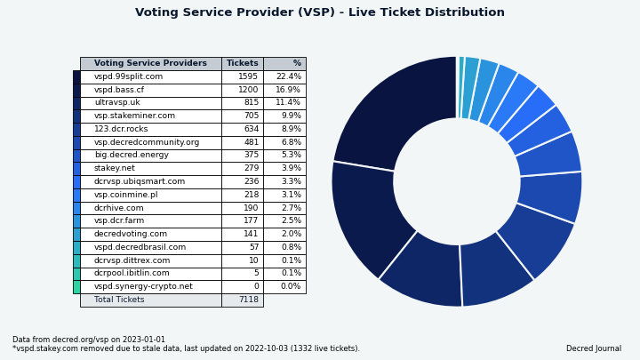
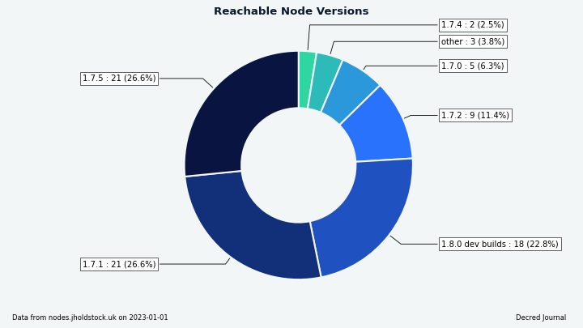

# مجلة ديكريد لشهر ديسمبر

_الصورة: عمل فني  ل Bison Relay بواسطة _@saender

أبرز أحداث شهر ديسمبر:

* تم تقديم Bison Relay وإطلاقها، وتستخدم شبكة المراسلة المبتكرة هذه التي تعزز الخصوصية والمقاومة للبريد العشوائي الشبكة البرقية لديكريد لإرفاق التكاليف بالرسائل وردع الرسائل غير المرغوب فيها، وهي مفتوحة الآن للاستخدام.
* زاد عدد عقد  الشبكة البرقية وسعتها بشكل كبير بعد إطلاق Bison Relay، حيث فتح المستخدمون الجدد القنوات وبدأوا في الدفع مقابل الرسائل.
* تم إصدار النسخة  0.5.8 ل DCRDEX بخيارات متقدمة جديدة.

المحتويات:

* [إطلاق Bison Relay](#إطلاق-bison-relay)
* [إصدار النسخة 0.5.8 لمنصة المبادلات اللامركزية لديكريد](#إصدار-النسخة-0.5.8-لمنصة-المبادلات-اللامركزية-لديكريد)
* [التطوير](#التطوير)
* [الأشخاص](#الأشخاص)
* [الإدارة و الحوكمة](#الإدارة-و-الحوكمة)
* [الشبكة](#الشبكة)
* [النظام البيئي](#النظام-البيئي)
* [الانتشار](#الانتشار)
* [الفعاليات](#الفعاليات)
* [وسائل الإعلام](#وسائل-الإعلام)
* [مناقشات المجتمع](#مناقشات-المجتمع)
* [الأسواق](#الأسواق)
* [الخارجية ذات الصلة](#الخارجية-ذات-الصلة)

## إطلاق Bison Relay

Bison Relay هي منصة وسائط اجتماعية جديدة من نظير إلى نظير مع حماية قوية ضد الرقابة والمراقبة والإعلان. يتم تشفير الرسائل بشكل شامل لضمان أن المستلمين المعنيين فقط هم من يمكنهم رؤية المحتويات. لا توجد حسابات ويتم تصغير البيانات الوصفية بحيث لا يتمكن مشغلو الخادم من رؤية محتويات الرسالة أو المرسل أو المتلقي أو الدردشة التي يشارك فيها المستخدم. تسمح المدفوعات المضمنة بتحقيق الدخل من المحتوى عبر الوصول إلى المحتوى المدفوع أو الإكرامية.

يأتي الإصدار الأولي مع الميزات التالية (قائمة غير كاملة):

* محادثات مباشرة
* إرسال الملفات
* مجموعات الدردشة
* إنشاء مشاركات أطول باستخدام Markdown والصور
* التعليق على المنشورات
* موجز الأخبار بمحتوى من المستخدمين الذين انضممت إليهم
* نقل المنشورات (إعادة النشر)
* التواصل مع المستخدمين الآخرين عبر ملفات الدعوة المرسلة عبر قناة متاحة، أو عبر Bison Relay مباشرة (تربطك  جهات الاتصال الحاليةالخاصة بك بجهات الاتصال الخاصة بهم، ويعرف أيضًا باسم تبادل المفاتيح بوساطة)
* إرسال واستلام البقشيش بوحدات ديكريد عبر الشبكة البرقية لديكريد
* مشاركة الملفات بسعر اختياري يدفعه المستخدمون مقابل الولوج
* إنشاء الفواتير ودفعها
* واجهة المستخدم الرسومية وتطبيقات سطر الأوامر لأجهزة Linux و macOS و Windows

تعمل المدفوعات لإرسال الرسائل واستلامها كحماية من البريد العشوائي، لكن Bison Relay رخيص الاستخدام، وقد يستمر 0.1 DCR لأشهر للدردشة المنتظمة.

سيرغب معظم المستخدمين في تنزيل تطبيق واجهة المستخدم الرسومية من [هنا](https://github.com/companyzero/bisonrelay/releases)، والحصول على الملف المسمى `bisonrelay-xxx` لنظام التشغيل الخاص بك. لا تحتوي التنزيلات على تجزئة أو توقيعات حتى الآن ولكن سيتم إضافتها في المستقبل.

تعلم كيفية استخدام Bison Relay:

* [الميزات](https://bisonrelay.org/features/) الرسمية و[البرامج التعليمية](https://bisonrelay.org/tutorial/)
* [نظرة عامة من دقيقتين في تحديث النشرة الإخبارية لديكريد](https://www.youtube.com/watch?v=K6Cu4Gi7Lp0)
* [إعدادالنسخة 0.1.1 من Bison Relay على macOS](https://www.youtube.com/watch?v=L4jm-VMPmBo)
* [نظرة أولية و لمحة عامة عن خصائص النسخة 0.1.1](https://www.youtube.com/watch?v=ukRkQC4IXoo)
* [موجز الأخبار - ربط وإنشاء واستخدام الماركداون](https://www.youtube.com/watch?v=NuKVAp4fIBY)

بمجرد الإعداد، اقرأ [دليل التشغيل](https://chat.decred.org/#/room/!GHnoHXSgkVAsUknRUg:decred.org/$tdpPg8WYSQGCizeGngYeoXSG_lCBrTnDxcuLGiZbfuI?via=decred.org&via=matrix.org&via=zettaport.com) واتصل بـ kozel@ على Matrix للحصول على دعوتك الأولية (الدعوات).

يمكن للمستخدمين المتقدمين أيضًا التحقق من [تطبيق خط الأوامر brclient](https://github.com/companyzero/bisonrelay/releases) و[كود مصدر الخادم](https://github.com/companyzero/bisonrelay#server) و[المستندات التقنية](https://github.com/companyzero/bisonrelay/tree/master/doc).

لفهم الدافع وراء Bison Relay، تحقق من المنشورات بواسطة jy-p@:

* [مشاكل التواصل التي تواجه ديكريد](https://blog.decred.org/2022/12/02/What-is-wrong-with-Decred/) مع المنافذ ومنصات التواصل الاجتماعي الحالية
* [المشاكل المتأصلة في الويب اليوم](https://blog.decred.org/2022/12/09/Trapped-in-the-Web/)
* يشرح [إعلان Bison Relay](https://blog.decred.org/2022/12/14/Bison-Relay-The-Sovereign-Internet/) الأولي التصميم عالي المستوى للنظام ولماذا كان مطلوبًا لتسهيل حرية التعبير وحرية الارتباط
* إعلان [تويتر](https://twitter.com/behindtext/status/1603470873503141903)

> الاستنتاج هو أن ديكريد يجب أن تحاول تنمية شبكتها دون التسويق التقليدي. الطريق للمضي للأمام ليس من خلال، ولكن حوله. [ما هو الخطأ في ديكريد؟]

## إصدار النسخة 0.5.8 لمنصة المبادلات اللامركزية لديكريد

يعمل هذا الإصدار على إصلاح المشكلات المتعلقة بطلب أسعار العملة الورقية من مصادر خارجية، ويضيف خيارات لمستخدمي سطر الأوامر المتقدمين وواجهة برمجة تطبيقات GO التي تسمح بتخطي العمليات التي تستغرق وقتًا طويلاً عند بدء التشغيل وإيقاف التشغيل.

تتوفر النسخة 0.5.8 كتطبيق مستقل ل DEX [هنا](https://github.com/decred/dcrdex/releases).

## التطوير

ما لم يُذكر خلاف ذلك، فإن العمل المَذْكُور هنا يشتمل على حالة "الدمج إلى الرئيسي". وهذا يعني أن العمل قد تم استكماله ومراجعته ودمجه في كود المصدر الذي يمكن للمستخدمين المتقدمين [بناءه وتشغيله](https://medium.com/@artikozel/the-decred-node-back-to-the-source-part-one-27d4576e7e1c)، ولكنه ليس متاحًا بعد في ثنائيات الإصدار للمستخدمين العاديين.

### dcrd

_[dcrd](https://github.com/decred/dcrd) هو تطبيق عقدة كامل يعمل على تشغيل شبكة ديكريد من نظير إلى نظير حول العالم._

* تقديم مرشحات معروفة عندما يطلبها الأقران مع طلب [`getcfilterv2`](https://github.com/decred/dcrd/pull/3035) بصفة دائمة. في السابق، لم تكن العقدة تخدم المرشحات حتى تتم مزامنة سلسلتها بالكامل مع الشبكة. كان هذا القيد موروثًا من منطق مرشحات bloom القديمة، حيث ساعد في تجنب انخفاض الأداء، خاصة أثناء مزامنة السلسلة الأولية. الجانب السلبي هو أن العقدة قد تبدو غير مستجيبة أو متوقفة في مجموعة متنوعة من سيناريوهات الإنتاج والاختبار. تم استبدال مرشحات bloom بمرشحات الإصدار 2 وهي رخيصة نسبيًا للتقديم الآن، لذلك يمكن أن تستجيب العقدة دائمًا لطلبات `getcfilterv2`، حتى قبل مزامنة السلسلة بالكامل.
* تم تحديث [وثائق](https://github.com/decred/dcrd/pull/3032) واجهة برمجة التطبيقات JSON-RPC للوسائل المستخدمة لاكتشاف المعاملات المطابقة لمعايير معينة: `loadtxfilter` و `notifynewtransactions` و `rescan`. تمت [إزالة](https://github.com/decred/dcrd/pull/3034) المعلومات الخاصة بوسائل واجهة برمجة التطبيقات والإخطار التي تم حذفها.
* تغييرات صغيرة و عمليات التنظيف.

### dcrwallet

_[dcrwallet](https://github.com/decred/dcrwallet) هو خادم محفظة تستخدمه تطبيقات سطر الأوامر والمحفظة الرسومية._
  
- تمت إضافة مفتاح [`--cpuprofile`](https://github.com/decred/dcrwallet/pull/2195) لالتقاط بيانات أداء وحدة المعالجة المركزية وحفظها في ملف.
- تمت إضافة استخراج [نفقات الخزينة الجديدة في وضع التحقق من الدفع البسيط](https://github.com/decred/dcrwallet/pull/2194). سيتم استخدام هذا بواسطة Decrediton لتفعيل تصويت TSpend في المزيد من السيناريوهات.
- تعديل منطق [شراء التذاكر](https://github.com/decred/dcrwallet/pull/1946) لدعم التحصيص بالتريزوز في التغييرات القادمة على ديكريديتون. يؤدي هذا التغيير إلى توصيل بعض الكود الموجود معًا، وستركز التغييرات المستقبلية على صيانة التذاكر وإعادة دفع الرسوم الفاشلة لمزود خدمة التصويت. يعد تحصيص ديكريد المخزن على محفظة التريزور ميزة مطلوبة كثيرًا، لذا إليك بعض الخلفية. يمثل الجمع بين توقيع المعاملات مع التريزور ونظام تحصيص ديكريد والنظام الأحدث لتفويض أصوات التذاكر لمقدمي خدمة التصويت (VSP) عددًا من التحديات. أحدهما هو أن مزود خدمة التصويت يحتاج إلى مفتاح خاص لعنوان التصويت للتصويت باستخدام التذكرة، لكن التريزور لا تسمح بتصدير المفاتيح الخاصة مباشرة. أمر آخر هو أن ديكريديتون تحتاج إلى توقيع تفضيلات التصويت لكل تذكرة يديرها مزود خدمة التصويت، لكن مطالبة التريزور بالتوقيع على كل رسالة هو تجربة مستخدم سيئة. للتغلب على هذه البيانات، سيتم استخدام جزء من البيانات الخاصة التي يمكن الحصول عليها من التريزور لاشتقاق مفاتيح للتصويت وتوقيع تفضيلات التصويت.
- تحديث التبعيات لأدوات سطر الأوامر التكميلية: movefunds، و repaircfilters، و sweepaccount.

### Decrediton

_[Decrediton](https://github.com/decred/decrediton) ديكريديتون هو تطبيق محفظة لسطح المكتب كامل الميزات مع ميزة التصويت مدمجة، وميزة الخلط ب StakeShuffle، والشبكة البرقية، والتداول على منصة المُبادلات اللامركزية DEX للديكريد، والمزيد. يتم تشغيلها مع سلسلة الكتل كاملة أو بدونها (وضع التحقق البسيط من الدفع SPV)._

- تم تحديث وحدة DCRDEX إلى الإصدار 0.5.7 والتي تعمل على إصلاح العديد من حالات الحافة حول [إلغاء الطلب](https://github.com/decred/decrediton/pull/3840).
- تقديم التصويت على [نفقات المعاملات الفردية](https://github.com/decred/decrediton/pull/3787). إذا تمت إدارة أي تذاكر من قبل مزودي خدمة التصويت، فسيتم إرسال تفضيلات تصويت التذاكر التي تم تغييرها إلى موفري خدمة التصويت. إذا تم الكشف عن عمليات إنفاق معاملات جديدة غير مُصوت عليها، فسيتم عرض إشعار على الصفحة الرئيسية. سيتم عرض سياسات التصويت الحالية لمفاتيح الخزينة ومعاملات الإنفاق الفردية في صفحة تفاصيل التذكرة.
- توسيع تغطية الاختبار الآلي لواجهة المستخدم.
 

_الصورة: تصويت معاملة الإنفاق في ديكريديتون._

### بوليتيا

_[بوليتيا](https://github.com/decred/politeia) هي نظام المقترحات لديكريد. يتم استخدامها لطلب التمويل من خزينة ديكريد_

- بناء واختبار pi-ui مقابل [العقدة 18 و ](https://github.com/decred/pi-ui/pull/468)19.
- إصلاحات الإختبار.

### vspd

_[vspd](https://github.com/decred/vspd) هو برنامج خادم لتشغيل موفر خدمة التصويت. يصوت موفر خدمة التصويت نيابة عن مستخدميه على مدار الساعة طوال أيام الأسبوع ولا يمكنه سرقة الأموال._

- تمت إزالة [التحقق من عنوان الرسوم المكرر](https://github.com/decred/vspd/pull/361) الذي لم يتم قياسه جيدًا (استغرق الأمر 500 مللي ثانية تقريبًا لإدراجه في قاعدة بيانات 100 ألف تذكرة). لم يتم ملاحظة تكرار عناوين الرسوم في التطوير أو الاختبار أو الإنتاج.

### DCRDEX

_[DCRDEX](https://github.com/decred/dcrdex) هي منصة مبادلات غير احتجازية للمُبادلات غير الموثوقة، مدعومة بالمقايضات الذرية._
  
[إصدار النسخة ](https://github.com/decred/dcrdex/releases/tag/v0.5.8)0.5.8:

- تمت إضافة [خيارات Core API](https://github.com/decred/dcrdex/pull/1568) لتخطي العمليات التي تستغرق وقتًا طويلاً عند بدء التشغيل وإيقاف التشغيل. يقوم `NoAutoWalletLock` بتعطيل قفل المحفظة عند الإغلاق، وهو أمر مفيد لتجنب عملية فتح محتملة [طويلة جدًا](https://github.com/decred/dcrdex/pull/1568#discussion_r998877146). يقوم `NoAutoDBBackup` بتعطيل النسخ الاحتياطية التلقائية لقاعدة البيانات عند إيقاف التشغيل. في حين يوجه `UnlockCoinsOnLogin` المحفظة لفتح أي عملات (مخرجات) مقفلة بشكل فردي عند تسجيل الدخول أو إنشاء المحفظة، وهذا يؤدي إلى أتمتة الاسترداد اليدوي من [المشكلات](https://github.com/decred/dcrdex/pull/1568#discussion_r998880897) المتعددة التي تسببها التقطع في الاتصالات والأعطال أثناء وضع الطلب. يمكن أيضًا تعيين هذه الخيارات باستخدام مفاتيح التبديل الجديدة لتطبيق سطر أوامر `dexc`، ولكنها مخصصة حقًا للأشخاص الذين يكتبون كود Go الخاص بهم للتحكم في عميل DEX عبر `Core` API.
- إصلاح معالجة الطلبات الفاشلة [لأسعار العملات الورقية](https://github.com/decred/dcrdex/commit/2ae50bb7617706c62b86e4b16b684744c995c818) من الخدمات الخارجية، وتعديل وتيرتها لتجنب الوصول إلى حدود الاسعار.

تم دمج التغييرات أدناه في الفرع الرئيسي `master` تجاه الإصدارات المستقبلية.

الإيثيريوم:
 
-  تمت إضافة دعم العميل والخادم للمقايضات باستخدام [شبكة الاختبار ل ](https://github.com/decred/dcrdex/pull/1733)USDC.
- تمت إضافة قدرة عميل وخادم DEX على الاتصال عبر [WebSocket المصادق عليه](https://github.com/decred/dcrdex/pull/1963) بعقدة Geth الكاملة. يتيح ذلك للمستخدمين تشغيل Geth على جهاز منفصل.

سندات الإخلاص (العميل):

- تم دمج الدفعة الثالثة من تنفيذ [سندات الإخلاص](https://github.com/decred/dcrdex/pull/1820)، بناءً على واجهة برمجة التطبيقات ذات المستوى الأدنى وكود الخادم الذي تمت إضافته في أكتوبر ونوفمبر. تضيف هذه المجموعة كود العميل الداخلي لإنشاء السندات وتخزينها ونشرها وتأكيدها واستردادها، بالإضافة إلى أمر تطبيق `dexc` لنشر السندات من سطر الأوامر. تم تقسيم تنفيذ السندات إلى مراحل لجعل المراجعة ممكنة والتقدم بالتوازي مع العديد من التطورات الأخرى. التالي هو صيانة طبقة الحساب وتجديد السندات والإعدادات ومكونات واجهة المستخدم.
- تم توثيق السندات في [المواصفات](https://github.com/decred/dcrdex/pull/1994).
- للتلخيص، ستحل [سندات الإخلاص](https://en.wikipedia.org/wiki/Fidelity_bond) المقفلة زمنيًا محل نظام رسوم التسجيل الحالي. سيقوم المستخدمون بقفل العملات في السندات والحصول على أذونات للتداول، طالما أن مستوى السندات لديهم مرتفع بما فيه الكفاية (ربما تعويض السلوك التجاري السيئ مثل إلغاء الطلبات كثيرًا). عندما لا تكون هناك حاجة إلى الوصول إلى التداول، يمكن استرداد السند لاستعادة العملات. نظام السندات هو شرط أساسي لبناء [شبكة خادم](https://github.com/decred/dcrdex/issues/1765).

تغييرات العملاء الأخرى:

- إعادة بناء تسلسل [تسجيل الدخول](https://github.com/decred/dcrdex/pull/1903) للتعامل بشكل أفضل مع محاولات تسجيل الدخول المتعددة وتجنب تكرار خطوات التهيئة. تمت إضافة تحذير يطالب بإلغاء قفل المحافظ في أسرع وقت ممكن لمعالجة التداولات النشطة.
- إعادة بناء [تقدير الرسوم](https://github.com/decred/dcrdex/pull/1967) الشائعة بالنسبة للأصول الشبيهة بالبتكوين وإضافة مقدر رسوم خارجي لـ DOGE. يعد تقدير الرسوم الخارجية مفيدًا كبديل للمحافظ (الخفيفة) SPV وأيضًا محافظ RPC (الكاملة) التي بدأت مؤخرًا عندما لم تتم معايرة تقدير الرسوم الخاصة بها بعد.
- تمت إضافة القيم الافتراضية](https://github.com/decred/dcrdex/pull/1981) للمحافظ التي تم إنشاؤها عبر RPC. هذا للمساعدة في الاختبار على شبكة الإختبار simnet.
- تم نقل المزيد من [ملفات ترجمة](https://github.com/decred/dcrdex/pull/1980) السلاسل.
- تم ضبط [ضغط](https://github.com/decred/dcrdex/pull/1987) قاعدة البيانات لتوفير مساحة أكبر والإبلاغ عن التوفير بشكل أكثر دقة.
- تمت إضافة المزيد من التقارير التفصيلية عن [التقدم](https://github.com/decred/dcrdex/pull/1997) أثناء تسجيل الدخول.
- تمت إضافة [الترجمة العربية](https://github.com/decred/dcrdex/pull/1898) والتعديلات المطلوبة لعرض النص من اليمين إلى اليسار.
- إصلاح [حذف ملف سجل](https://github.com/decred/dcrdex/pull/1946) محفظة التحقق البسيط من الدفع أثناء استرداد المحفظة.
- إصلاح [قيمة العملات النقدية](https://github.com/decred/dcrdex/pull/1983) في نموذج الإرسال دون أن تشمل رسوم المعاملة.
- إصلاح معالجة خيار [الحجم المسبق للأموال](https://github.com/decred/dcrdex/pull/1988). ينشئ هذا الخيار "معاملة مقسمة" إضافية لإعداد مبلغ محدد من الأموال اللازمة للطلب، مما يجنب قفل أموال أكثر مما هو مطلوب، ولكن على حساب دفع رسوم إضافية مقابل التقسيم. كما يتجنب الإصلاح  التحجيم المسبق للمعاملة  في حالة عدم وجود فائدة. وكذلك، أصبحت تجربة المستخدم أكثر اتساقًا من خلال العرض الدائم للخيار مع توضيح سبب إيقاف تشغيله. وأخيرًا، يعمل إصلاح آخر على تعطيل التحجيم المسبق [لطلبات السوق الفورية](https://www.investopedia.com/terms/i/immediateorcancel.asp) حيث يجب تنفيذها بسرعة.
- إصلاحات أخرى.

_الصورة: أول تداول بين USDC و DCR على شبكة الاختبار._

### dcrdata

_[dcrdata](https://github.com/decred/dcrdata) هو مستكشف سلسلة كتل ديكريد و البيانات خارج السلسلة مثل مقترحات بوليتيا والأسواق والمزيد._

التغييرات التي تواجه المستخدم:

- أصبحت قواعد [التصويت على الخزينة](https://github.com/decred/dcrdata/pull/1918) والتقدم أسهل في الفهم والمتابعة. ستوضح صفحات معاملات إنفاق الخزينة كيفية مقارنة الأصوات الحالية بالحد الأدنى من النصاب القانوني ومتطلبات النسبة المئوية "نعم"، وتواريخ التقويم التقريبية لبدء التصويت ونهايته، ومفتاح بوليتيا الذي قام بتوقيع معاملة الانفاق، والمزيد. يمكن مشاهدة مثال معاملة الإنفاق الأخيرة [هنا](https://tip.dcrdata.org/tx/49f141f51421a499d319bc617a4430f87db3a73ffa605dee8408eefb081bd11b).
- تم إصلاح خطأ نادر حيث تم عرض [المعاملات المرفوضة](https://docs.decred.org/governance/overview/#block-voting) التي تم تضمينها لاحقًا في كتلة معتمدة [بشكل غير صحيح على أنها غير منفقة](https://github.com/decred/dcrdata/pull/1938). تأثرت أقل من 20 معاملة في تاريخ السلسلة بأكمله.
- إصلاحات أخرى وتعديلات على واجهة المستخدم.

تغييرات المطور وواجهة برمجة التطبيقات:

- تمت إزالة بعض [واردات ](https://github.com/decred/dcrdata/pull/1887)dcrwallet لتبسيط التحديثات على وحدات dcrd الجديدة.
- تمت إزالة شرط تشغيل dcrd مع تمكين مؤشر العنوان لأنه تمت [إزالته من dcrd](https://github.com/decred/dcrd/pull/2930). كما تمت إزالة استخدام طريقة معاملات البحث في dcrd `searchrawtransactions` (التي تعتمد على فهرس العنوان) لصالح قاعدة بيانات dcrdata الخاصة التي تحتوي على جميع المعلومات اللازمة.
- تمت إضافة حقلين إلى [واجهة برمجة التطبيقات لبيانات المعاملات](https://github.com/decred/dcrdata/pull/1946): الشجرة `tree` (تخزن كتل ديكريد المعاملات في الأشجار العادية وأشجار التحصيص) والنوع `type`  (يمكن أن تكون معاملات ديكريد معاملات عادية `regular`، أو التذكرة `ticket`، أو `vote`، أو الاسترجاع `revocation`، أو المعاملة الأولية `coinbase`، أو قاعدة الخزانة `treasurybase`، أو إضافة الخزينة `treasury add`، أو إنفاق الخزانة `treasury spend`).

_الصورة: dcrdata، أصبح من الأسهل الآن تتبع تقدم تصويت معاملة الإنفاق._

### Bison Relay

_[Bison Relay](https://github.com/companyzero/bisonrelay) هي منصة وسائط اجتماعية جديدة من نظير إلى نظير مع حماية قوية ضد الرقابة والمراقبة والإعلان، مدعومة من الشبكة البرقية لديكريد._

تم الكشف عن Bison Relay بعد سنتين من [التطوير](https://blog.decred.org/2022/12/14/Bison-Relay-The-Sovereign-Internet/) الأولي من قبل Company 0. يمكن العثور على تفاصيل المستخدم النهائي في [الإعلان](https://github.com/xaur/decred-news/blob/master/journal/202212.md#bison-relay-launch) أعلاه، وهنا سنركز على التكنولوجيا والتغييرات الأخيرة في المصدر.

نظرة عامة على مجموعة تكنولوجيا Bison Relay:

- تمت كتابة [الخادم](https://github.com/companyzero/bisonrelay#server) بلغة البرمجة Go ويستخدم PostgreSQL للتخزين.
- تمت كتابة [عميل سطر الأوامر](https://github.com/companyzero/bisonrelay#cli-client) بلغة البرمجة Go ويقوم بتنفيذ [واجهة مستخدم نصية](https://en.wikipedia.org/wiki/Text-based_user_interface) مماثلة لـ Irssi أو WeeChat.
- [عميل واجهة المستخدم الرسومية](https://github.com/companyzero/bisonrelay/tree/master/bruig) هو تطبيق متعدد المنصات يقوم بنتفيذ بروتوكول Bison Relay مكتوب بلغة Dart و Flutter ومكتبة Go. [Flutter](https://flutter.dev) هي منصة واعدة لبناء تطبيقات واجهة المستخدم الرسومية عبر الأنظمة الأساسية لسطح المكتب الرئيسي (Linux و macOS و Windows) وأنظمة الأجهزة المحمولة (Android و iOS) من قاعدة بيانات واحدة.
- يتم تشفير جميع اتصالات العميل إلى الخادم بشكل مزدوج باستخدام نفق TLS كطبقة خارجية وصندوق سر `NaCl secretbox` كطبقة داخلية.
- يتم تشفير جميع اتصالات العميل إلى العميل [بسقاطة مزدوجة](https://signal.org/docs/specifications/doubleratchet/) (طبقة ثالثة من التشفير) بمفاتيح يمتلكها العملاء فقط.
- يمكن العثور على مزيد من التفاصيل في دليل المستندات](https://github.com/companyzero/bisonrelay/tree/39015e62770ae6b18e73599a6fe497ceec463047/doc) و[نظرة عامة على البروتوكول](https://github.com/companyzero/bisonrelay/blob/39015e62770ae6b18e73599a6fe497ceec463047/rpc/README.md#protocol).

تطبيق واجهة المستخدم الرسومية، التغييرات الصادرة في الإصدار [v0.1.1](https://github.com/companyzero/bisonrelay/releases/tag/v0.1.1):

- تم إصلاح [مشكلات](https://github.com/companyzero/bisonrelay/pull/13) متعددة مع الإخطارات والتخطيط وتنسيق الأرقام.
- تم إصلاح مشكلة [تعطل](https://github.com/companyzero/bisonrelay/pull/21) المستخدم بعد إعداد غير مكتمل للبذرة مع إضافة خيار [لحذف](https://github.com/companyzero/bisonrelay/pull/42) محفظة غير مكتملة.
- تم إصلاح لون الخط غير المقروء في [بصمات الخادم](https://github.com/companyzero/bisonrelay/pull/21).
- تم إصلاح الوصول إلى [حد الفجوة](https://github.com/companyzero/bisonrelay/pull/39) عند فتح قنوات الشبكة البرقية.
- إصلاحات أخرى.

تطبيق واجهة المستخدم الرسومية، تغييرات الفرع الرئيسي `master` نحو الإصدار التالي:

- تمت إضافة حفظ/استعادة [مسودة الرسائل](https://github.com/companyzero/bisonrelay/pull/43) غير المرسلة عند التغيير إلى/من عرض آخر.
- تمت إضافة صفحة [استعادة البذور](https://github.com/companyzero/bisonrelay/pull/58).
- تمت إضافة زر [لنسخ البذور](https://github.com/companyzero/bisonrelay/pull/58) إلى الحافظة.
- دعم إضافي لحفظ واستعادة ملفات [النسخ الاحتياطي للقناة الثابتة](https://docs.decred.org/lightning-network/backups/) (SCB). لا يمكن استرداد الأموال المقفلة في قنوات شبكة البرق من بذور المحفظة وحدها. يتم تخزين بيانات الاسترداد التي لا يمكن إنشاؤها من البذور في ملفات النسخ الاحتياطي للقناة الثابتة.
- تم تغيير [عنوان النافذة](https://github.com/companyzero/bisonrelay/pull/64) إلى "Bison Relay”.

تطبيق واجهة المستخدم الرسومية، تحسين الإعداد:

- عرض [الاتجاهات ](https://github.com/companyzero/bisonrelay/pull/58) على صفحة الدردشات الفارغة لإضافة الأموال وإنشاء القنوات والتواصل مع المستخدمين الآخرين باستخدام الدعوات.

تطبيق واجهة المستخدم الرسومية، الإصلاحات:

- إصلاح [الضبط البؤري التلقائي](https://github.com/companyzero/bisonrelay/pull/43) الناقص لحقل الإدخال عند تبديل الدردشات.
- إصلاح لون النص [غير القابل للقراءة](https://github.com/companyzero/bisonrelay/pull/64) في أماكن متعددة.

تطبيق واجهة سطر الأوامر:

- الحد من [العنوان المعروض](https://github.com/companyzero/bisonrelay/pull/57) إلى 255 حرفًا.
- محاذاة [الطوابع الزمنية للتعليقات](https://github.com/companyzero/bisonrelay/pull/60) نحو اليمين.
- تمت إضافة خيار لاستيراد [نسخة احتياطية من القناة الثابتة](https://github.com/companyzero/bisonrelay/pull/65) عند استعادة محفظة حالية من البذرة.
- إصلاح العطل عند [نقل المنشور](https://github.com/companyzero/bisonrelay/issues/52).

موقع [bisonrelay.org](https://bisonrelay.org) هو موقع ثابت تم إنشاؤه باستخدام Hugo و Bootstrap و SCSS. كود مصدر الموقع [عام](https://github.com/companyzero/bisonrelay-web) أيضًا.

تغييرات موقع الويب في ديسمبر:

- [استعدادات الإصدار](https://github.com/companyzero/bisonrelay-web/commit/05d95d8a2bc04b63659aea930036f1e1c3db87e2).
- تحريك [السهم المنسدل](https://github.com/companyzero/bisonrelay-web/commit/0c0ff8e3ac90883ec68d7664b3b1e737ad38f9ac).
- إضافة نسخة [لصفحة الميزات](https://github.com/companyzero/bisonrelay-web/commit/207cf5aba58dfb2aedb5ad5483a126254c9c4b60).
- تمت إضافة [صفحة](https://github.com/companyzero/bisonrelay-web/commit/70a6eac099d4b440b52c2884f26a8638d840ab4d) [البرنامج التعليمي](https://github.com/companyzero/bisonrelay-web/commit/aca241b3dfa6010b85fe7076fb27ccdef4c66622).

تم [الإعلان](https://www.youtube.com/watch?v=K6Cu4Gi7Lp0&t=47s)  عن الخطط المستقبلية لـ Bison Relay في BR نفسها:

> نحن نصمم المجموعة التالية من الميزات لـ br، والتي تتضمن القدرة على الحصول على نوع من "الصفحات"، لكل من المحتوى وكواجهة متجر. يتمثل التكرار الحالي لهذه الميزة في أنه يمكن للعميل توفير "صفحات" يمكن للعملاء الآخرين الذين يتم تبادل المفاتيح عرضها والتفاعل معها بطريقة ما. \[@jy-p بتاريخ 2022-12-18\]

## الأشخاص

نرحب بالمساهمين الجدد:

- c12 (@c12hz مؤلف مجلة ديكريد، على التويتر)

إحصائيات المجتمع اعتبارًا من 4 يناير (مقارنة بـ 2 ديسمبر):

*  متابعو [التويتر](https://twitter.com/decredproject): 53,392 (-342)
* المشتركين في [ريديت](https://www.reddit.com/r/decred/): 12,648 (+14)
* مستخدمي غرفة الدردشة general# على [الماتريكس](https://chat.decred.org/): 738 (+9)
* مستخدمي [الديسكورد](https://discord.gg/GJ2GXfz): 1530 (-348 - مستخدمون غير نشطين تم تطهيرهم)، تم التحقق من نشرهم: 929 (-7)
* مستخدمي [التيليجرام](https://t.me/Decred): 2,872 (-22)
* المشتركين في [اليوتيوب](https://www.youtube.com/decredchannel): 4,640 (+0)، المشاهدات: 221 ألف (+ ألفان)

[لوحظ](https://chat.decred.org/#/room/!ggjLwhBHTjsMROezFf:decred.org/$ym0IL1s6fWqw9iu21vnMzVm1jmR0kdPm_4V3fKkV5Zs?via=decred.org&via=matrix.org&via=planetdecred.org) أن حساب [@decredproject](https://twitter.com/decredproject) الرئيسي الخاص بنا قد تم تفعيله 2 من 4 عمليات حظر: Ghost Ban و Reply Deboosting، وفقًا لـ [Twitter Shadowban Check](https://shadowban.jp/). وبحسب ما ورد، منذ وقت ليس ببعيد، كانت جميع الـ 4 نشطة. [يشرح](https://twitter.com/behindtext/status/1610663633498869760) هذا التقرير وغيره إلى حد ما أداء التويتر الذي شوهد حتى الآن.

## الإدارة و الحوكمة

في ديسمبر، تلقت [الخزينة](https://dcrdata.decred.org/treasury) الجديدة 8,712 DCR بقيمة 172 ألف دولار بمتوسط سعر ديسمبر البالغ 19.79 دولارًا. تم إنفاق 3,907 DCR للدفع للمتعاقدين(ولكن لم تتم الموافقة على المعاملة/تعدينها حتى 3 يناير)، بقيمة 77 ألف دولار بمعدل شهر ديسمبر، أو 86 ألف دولار بمعدل فواتير نوفمبر البالغ 21.92 دولارًا.

تضمنت [معاملة إنفاق الخزينة](https://dcrdata.decred.org/tx/49f141f51421a499d319bc617a4430f87db3a73ffa605dee8408eefb081bd11b) 24 مخرجا لتسديد مدفوعات المتعاقدين، تتراوح من 5 DCR إلى 1,270 DCR.

اعتبارًا من 7 يناير، بلغ الرصيد المشترك للخزينة [القديمة](https://dcrdata.decred.org/address/Dcur2mcGjmENx4DhNqDctW5wJCVyT3Qeqkx) و[الجديدة](https://dcrdata.decred.org/treasury) 834.055 DCR (15.6 مليون دولار أمريكي بسعر 18.70 دولارًا أمريكيًا).

لم تكن هناك مقترحات جديدة منشورة على بوليتيا في ديسمبر.

## الشبكة

**معدل الهاش**: افتتحت [معدلات الهاش](https://dcrdata.decred.org/charts?chart=hashrate&scale=linear&bin=day&axis=time) لشهر ديسمبر عند ~ 67  Ph/s وأغلقت عند ~ 68 Ph/s، وبلغ قاعها عند 58 Ph/s كما بلغت ذروتها عند 91 Ph/s على مدار الشهر.

_الصورة: معدل هاش ديكريد._

تم [الإبلاغ](https://miningpoolstats.stream/decred) عن توزيع معدل الهاش 75 Ph/s بواسطة المجمعات في 1 يناير: Poolin بنسبة 55%، و F2Pool بنسبة 38%، و BTC.com بنسبة 5%، و AntPool بنسبة 2.7%.

توزيع  1,000 كتلة تم [تعدينها](https://miningpoolstats.stream/decred) بالفعل بحلول 4 يناير: Poolin بنسبة 55%، و F2Pool بنسبة 36%، وعلى الأرجح BTC.com بنسبة 5%، وعلى الأرجح AntPool بنسبة 2.6%، و CoinmMine بنسبة 0.4% وأخرى غير معروفة بنسبة 0.9%.

_الصورة: توزيع معدل هاش التجمع._

_الصورة: التوزيع التاريخي لمجمع التجزئة_.

**التحصيص**: تراوح [سعر التذكرة](https://dcrdata.decred.org/charts?chart=ticket-price&axis=time&visibility=true-true&mode=stepped) بين 234-244 DCR، [بمتوسط](https://dcrstats.com/) 234.8 DCR (+3.3) خلال 30 يوما.

بلغ [المبلغ المقفل](https://dcrdata.decred.org/charts?chart=ticket-pool-value&scale=linear&bin=day&axis=time) 9.46-9.62 مليون DCR (أعلى مستوى جديد على الإطلاق)، مما يعني أن 64.0-64.8٪ من العرض المتاح [شارك](https://dcrdata.decred.org/charts?chart=stake-participation&scale=linear&bin=day&axis=time) في إثبات الحصة.

**مقدم خدمة التصويت**: قام الـ 17 من [مقدمي خدمة التصويت المدرجين](https://decred.org/vsp/) بإدارة ما يقرب من  7,120 (+190) تذكرة حية، والتي كانت تمثل  17.2٪ من مجموع التذاكر (+ 0.4٪) اعتبارًا من 1 يناير. هذه الأرقام تستثني vspd.stakey.com بسبب [بيانات واجهة برمجة التطبيقات القديمة](https://github.com/decred/dcrwebapi/pull/171).

أكبر الرابحين في ديسمبر هم vspd.bass.cf (+371) و big.decred.energy (+179) و vspd.99split.com (+178).

_الصورة: توزيع التذاكر التي يديرها مقدمو خدمة التصويت._

**العقد**: رصد [جهاز رسم الخرائط لديكريد](https://nodes.jholdstock.uk/user_agents) 79 عقدة في 1 يناير: 
النسخة 1.7.5 - 27%، النسخة 1.7.1 - 27%، نسخة بناءات التطوير 1.8.0 - 23%، النسخة 1.7.2 - 11%، النسخة 1.7.0 - 6%، النسخة 1.7.4 - 2.5%، أخرى - 4%.

_الصورة: إصدارات عقد dcrd القابلة للوصول._

_الصورة: التوزيع التاريخي لإصدار dcrd، بيانات من nodes.jholdstock.uk._

تراوحت حصة [العملات المخلوطة](https://dcrdata.decred.org/charts?chart=coin-supply&zoom=jz3q237o-la8vk000&scale=linear&bin=day&axis=time&visibility=true-true-true) بين  61.1-61.4٪، أو 9.02-9.10 مليون DCR (أعلى مستوى جديد على الإطلاق). وقد تفاوتت [الكمية المخلوطة](https://dcrdata.decred.org/charts?chart=privacy-participation&bin=day&axis=time) بشكل يومي ما بين 291 و 479 ألف DCR.

كان لإطلاق Bison Relay تأثير كبير على الشبكة البرقية لديكريد. مقارنة الإحصائيات من عقدة @karamble التي لوحظت في 1 ديسمبر و 19 ديسمبر: العقد 67 -> 120، القنوات 104 -> 212، السعة 40.6 -> 91.1.

تم إجراء نسخ احتياطي لمستكشف [الشبكة البرقية](https://ln-map.jholdstock.uk/) لديكريد وأبلغ عن 130 عقدة، 233 قناة بسعة إجمالية 100.7 DCR، اعتبارًا من 4 يناير. تختلف هذه الإحصائيات اعتمادًا على عقدة الشبكة البرقية. على سبيل المثال، أبلغت عقدة @karamble عن 144 عقدة و 312 قناة وسعة 154 DCR في 4 يناير.

## النظام البيئي 

تمت [إزالة](https://github.com/decred/dcrwebapi/pull/172) مقدم خدمة التصويت vspd.synergy-crypto.net من واجهة برمجة التطبيقات بعد التصويت على التذاكر الحية المتبقية. كان يخدم منذ يونيو 2021 وصوت على ما مجموعه 892 تذكرة. تم تنفيذ الإغلاق بشكل نظيف: توقف قبول التذاكر الجديدة في أغسطس 2022 وعلى مدار الأشهر الأربعة التالية، صوتت جميع التذاكر الحية.

أعادت Poloniex تمكين سوق DCR/BTC الذي تم تجميده منذ 30 سبتمبر عندما [غردت](https://twitter.com/PoloSupport/status/1575745498933522432) منصة المبادلات بأن محفظة DCR لا تزال قيد الصيانة (منذ يناير 2022). تم إعادة تمكين السوق لأول مرة في 28 نوفمبر ولكن سرعان ما تم تجميده مرة أخرى لمدة أسبوع آخر حتى تم ترميمه بالكامل في 5 ديسمبر.

كانت Binance ترفض عمليات سحب DCR لمدة 10 أيام تقريبًا. [ظهرت](https://chat.decred.org/#/room/!teQafvHMYpIbqLIieU:decred.org/$T5Mv2ATD2vgdbAlbIZ7BNGjRTNNWwPqIvzrfELK4vXc?via=decred.org&via=matrix.org&via=t2bot.io)  التقارير الأولى عن عمليات السحب المرفوضة في 12 ديسمبر. وقد تم سحب بعضها في 14 ديسمبر، لكن في اليوم التالي تم تعليق المزيد من عمليات السحب. شاركت Binance معلومات متضاربة حول سبب العطل. أطلق عليه دعم [تويتر](https://twitter.com/BinanceHelpDesk/status/1603293107633594369) "إجراء الصيانة القياسي". في إحدى بطاقات الدعم، أشاروا إلى أن شبكة DCR "مشغولة"، لكنهم كشفوا لاحقًا عن عدم وجود أموال كافية في المحفظة الساخنة. لا تسرد "[تحديثات صيانة المحفظة](https://www.binance.com/en/support/announcement/c-157?navId=157)" أية مشاركات حول المشكلة حتى وقت كتابة هذا التقرير. تم حل المشكلة في حوالي 22 ديسمبر. كانت سلسلة الكتل تعمل كما هو متوقع ولم تظهر أي انقطاعات أو مشكلات في أي مكان آخر في الشبكة.

انضم إلى دردشة النظام البيئي [#ecosystem](https://chat.decred.org/#/room/#ecosystem:decred.org) لمتابعة تحديثات النظام البيئي لـديكريد.

تحذير: ليس لدى مؤلفي مجلة ديكريد أي فكرة عن مصداقية أي من الخدمات أعلاه. يرجى إجراء بحثك الخاص قبل الوثوق بمعلوماتك الشخصية أو أصولك لأي كيان.

## الإنتشار

إنجازات Monde PR:

* عرض تحديث إخباري واحد.
* تأمين مقابلة إعلامية واحدة.
* عرض 8 عمليات تعليق.

تأمين المقالات الإخبارية التالية:

مقال في [CoinJournal](https://coinjournal.net/news/expert-panel-what-mistakes-should-users-avoid-when-attempting-to-buy-cryptocurrencies/) يعرض تعليقًا من @jy-p على الأخطاء التي يجب تجنبها عند شراء العملات الرقمية المشفرة.
مقال في [CoinJournal](https://coinjournal.net/news/expert-panel-what-is-your-biggest-tip-for-a-user-just-getting-into-crypto/) يعرض تعليقًا من @jy-p يعطي فيه نصائح لمن يدخلون العملات الرقمية المشفرة لأول مرة.
مقال في [CoinJournal](https://coinjournal.net/news/expert-panel-what-are-the-3-most-important-things-to-look-out-for-when-choosing-a-crypto-platform-to-sign-up-to/) يعرض تعليقًا من @jy-p حول كيفية اختيار منصة مبادلات العملات الرقمية المشفرة.
مقال في [Cryptonews](https://cryptonews.com/news/today-in-crypto-decred-launches-social-media-messaging-platform-opera-announces-a-suite-of-security-features-t-systems-mms-participates-in-chainlink-staking.htm) حول إطلاق Bison Relay.
مقال في [Invezz](https://invezz.com/news/2022/12/16/decred-launches-new-social-media-platform-bison-relay/) حول إطلاق Bison Relay.
تم إجراء مقابلة مع @jy-p بواسطة برنامج [Piece of the Py show](https://www.youtube.com/watch?v=OS_AOyMdAeU)، حيث ناقش إطلاق Bison Relay، واستخدام ديكريد في انتخابات البرازيل 2022 وإطلاق النسخة 0.5 من منصة المبادلات اللامركزية لديكريد.
مقال في [BeInCrypto](https://beincrypto.com/focus-on-decentralization-and-empower-users-in-2023-says-industry/) يعرض تعليقًا من jz@ حول التركيز على اللامركزية في عام 2023، مع ذكر DCRDEX.

## الفعاليات

**الحضور:**

* حضرت arij@ حلقة نقاش بعنوان "ريادة الأعمال النسائية" نظمتها اللجنة المشتركة الدولية بالدار البيضاء (كجزء من النسخة السابعة عشر من الحدث المسائي لريادة الأعمال). تحدثت عن تجربتها مع صناعة تكنولوجيا المعلومات، والعملات الرقمية المشفرة، وكيف تعمل المنظمة المستقلة اللامركزية ديكريد وكيف يبدو العمل من أجلها. انظر [التقرير](https://decredcommunity.github.io/events/index/20221220.1) لمزيد من التفاصيل والروابط.

## وسائل الإعلام

مقالات مختارة:

* [ما هو الخطأ في ديكريد؟](https://blog.decred.org/2022/12/02/What-is-wrong-with-Decred/) بواسطة @jy-p
* [احتضان التفكك، الجزء 1 - ديكريد NFT](https://www.decredmagazine.com/embracing-degeneracy-part-1-decred-nfts/) بواسطة @c12hz
* [محاصر في الويب](https://blog.decred.org/2022/12/09/Trapped-in-the-Web/) بواسطة @jy-p
Bison Relay[: الإنترنت السيادية](https://blog.decred.org/2022/12/14/Bison-Relay-The-Sovereign-Internet/) بواسطة @jy-p
* [شبكة الويب العالمية نظير لنظير](https://www.decredmagazine.com/the-p2p-world-wide-web-bison-relay/) بواسطة @phoenixgreen
* [تخيل مستقبل Bison Relay](https://www.decredmagazine.com/imagining-the-future-of-bison-relay/) بواسطة @c12hz
* [ماذا تفعل DCRD؟](https://www.decredmagazine.com/what-does-dcrd-do/)  بواسطة phoenixgreen@ و zippycorners@
* [ديكريد مقابل البتكوين: من البداية إلى النهاية!](https://www.decredmagazine.com/decred-vs-bitcoin-from-start-to-the-end/) بواسطة @Joao
* [اختراق واجهة وهم وسائل التواصل الاجتماعي](https://www.decredmagazine.com/breaking-through-the-facade-of-social-media-delusion/) بواسطة @BlockchainJew
* [ديكريد 2022 ملخص نهاية العام](https://www.decredmagazine.com/decred-2022-end-of-year-summary/)  بواسطة phoenixgreen@
* [تعلم من عام 2022](https://www.decredmagazine.com/ftx-a-learning-from-2022/)  بقلم HassanMaishera@

**إحصائيات مشاركة مجلة ديكريد اعتبارًا من ديسمبر:**

* إجمالي عدد المقالات على مجلة ديكريد: 371
* عدد المشتركين في النشرة الإخبارية: 83
* مجموع الرسائل الإخبارية المرسلة: 22
* الحملات النشطة على وسائل التواصل الاجتماعي: 25
* الحملات المكتملة على وسائل التواصل الاجتماعي: 27
* المشاركات على مواقع التواصل الاجتماعي: 214
* الإعجابات: 1,040
* إعادة التغريدات: 169
* متابعو وسائل التواصل الاجتماعي عبر جميع المنصات والحسابات: 1,090

**أشرطة الفيديو:**

* 2022[ عام السوق منخفضة الأسعار - ديكريد وحالة السوق](https://www.youtube.com/watch?v=PO2byx7D8z0) مع كل من @phoenixgreen و@Exitus و @Tivra ([إصدار صوتي(https://anchor.fm/decred-magazine/episodes/2022-the-year-of-the-bear---Decred-and-the-state-of-the-market-e1rnn2k) للبودكاست)
* [ديكريد وثورة المقايضة الذرية - أساسيات منصة المبادلات اللامركزية لديكريد](https://www.youtube.com/watch?v=JyBoe1z5h9U) بواسطة phoenixgreen@ - متاح أيضًا [كبودكاست صوتي](https://anchor.fm/decred-magazine/episodes/Decred-and-the-Atomic-Swap-Revolution---DCRDEX-Fundamentals-e1s85ne) و[كمنشور نصي](https://www.decredmagazine.com/decred-and-the-atomic-swap-revolution/)
* [إعداد الإصدار 0.1.1 ل Bison Relay على ](https://www.youtube.com/watch?v=L4jm-VMPmBo)macOS بواسطة phoenixgreen@
* [النظرة الأولية (الإصدار 0.1.1) - ](https://www.youtube.com/watch?v=ukRkQC4IXoo)Bison Relay بواسطة phoenixgreen@
* [محادثتي مع مؤسس/الرئيس التنفيذي لديكريد ](https://www.youtube.com/watch?v=OS_AOyMdAeU)Jake بواسطة Py Patel في Piece of the Py Show
* [أخبار ديكريد - Bison Relay دردشة نظير لنظير + وسائل التواصل الاجتماعي على الشبكة البرقية هنا! تحديثات كبيرة في التطوير!](https://www.youtube.com/watch?v=K6Cu4Gi7Lp0) بواسطة @Exitus

**المقاطع الصوتية:**

تسجيلات فضاءَات التويتر الجديدة:

- Bison Relay[ : الإنترنت السيادي](https://twitter.com/i/spaces/1ZkKzXlVvZqJv) بواسطة @Tivra و @kozel يضم العديد من أفراد المجتمع. تم ضبط 1,700 شخص (مباشر + مسجل). أيضًا على [Anchor](https://anchor.fm/decred-magazine/episodes/Bison-Relay-The-Sovereign-Internet-e1sebd4) ومنصات البودكاست الأخرى.
- [استكشاف إمكانيات وسائل التواصل الاجتماعي اللامركزية](https://twitter.com/i/spaces/1ypKddnRQZvKW) - بواسطة @Tivra  و @kozel كما يضم العديد من أفراد المجتمع، حوالي 550 شخصًا تابعوا. ([Anchor](https://anchor.fm/decred-magazine/episodes/Bison-Relay---Exploring-Possibilities-of-Decentralized-Social-Media---Decred-Twitter-Space-e1smab7))

**المتعة و الفن:**

- صورة Bison Relay تطلق [البرق](https://twitter.com/karamblez/status/1604033417519177728) بواسطة Karamble@
- 2023[: ديكريد ملحمة العملات الرقمية المشفرة](https://www.decredmagazine.com/2023-decred-a-crypto-odyssey/) بواسطة @OfficialCryptos

**الترجمة:**

حصلت مجلة ديكريد من سبتمبر إلى نوفمبر على إجمالي 4 [ترجمات](https://xaur.github.io/decred-news/) جديدة إلى الصينية (Dominic@) والبولندية (@kozel). شكرا لنشر الكلمة!

**المحتوى غير إنجليزي:**

[Decred Une Crypto Trop Meconnue 🧐 Pour Combien dE Temps ? 🔥 Par des anciens DEV du Bitcoin 💎](https://www.youtube.com/watch?v=GeSpRLr3_94) (نظرة عامة على المشروع + التحليل الفني باللغة الفرنسية)

## الأسواق

في ديسمبر، تم تداول DCR بين 18.20 دولارًا أمريكيًا و 24.80 دولارًا أمريكيًا و BTC 0.00110-0.00145. وقد بلغ متوسط السعر اليومي 19.79 دولارًا.

شهد سوق DCR/USDT الجديد في Poloniex متوسط الحجم اليومي حوالي 1,070 DCR، أعلى بكثير من 230 DCR/يوم على زوج DCR/BTC القديم. ومن المثير للاهتمام، أن سوق DCR/BTC تم تجميده في الأسبوع الأول بينما كان DCR/USDT نشطًا.

_الصورة: الحجم الشهري لـ DCRDEX بالدولار الأمريكي._

## الخارجية ذات الصلة

في نوفمبر، تم [تسريب](https://www.coindesk.com/policy/2022/11/15/privacy-enhancing-crypto-coins-could-be-banned-under-leaked-eu-plans/) خطط لحظر العملات الرقمية المشفرة المعززة للخصوصية في الاتحاد الأوروبي. تم طرح الخطط من قبل المسؤولين التشيكيين الذين يرأسون المحادثات حاليًا. سيتم حظر مزودي خدمة أصول العملات الرقمية المشفرة والمؤسسات الأخرى من الاحتفاظ بالعملة الرقمية المشفرة المعززة للخصوصية أو لمسها بموجب الاقتراح.

في البرازيل، [أقر](https://decrypt.co/116011/brazil-crypto-payments)  الكونجرس مشروع قانون لتنظيم مدفوعات العملة الرقمية المشفرة، وسيسمح للبنوك بتقديم خدمات حول أصول العملة الرقمية المشفرة، كما يغطي أشياء مثل نقاط الخطوط الجوية.

تم [القبض](https://decrypt.co/118045/mango-markets-attacker-avraham-eisenberg-arrested-charged-with-market-manipulation-offenses) على Avraham Eisenberg، الرجل في الواجهة الذي حصل على الائتمان العام لـ "استراتيجية التداول عالية الربحية" التي استنزفت Mango Markets بقيمة 110 مليون دولار، ووجهت إليه تهمة التلاعب بالسوق.

اتهم SBF بعدد من الجرائم ووافق على [تسليمه](https://cointelegraph.com/news/sbf-signs-extradition-papers-set-to-return-to-face-charges-in-the-us) إلى الولايات المتحدة، حيث تم الإفراج عنه بكفالة بمبلغ 250 مليون دولار بشرط أن يبقى في منزل والديه. تم [الاحتفاظ](https://decrypt.co/118298/sbf-keep-bail-bond-cosigners-secret-like-lawyers-for-ghislaine-maxwell) بأسماء بعض الشركاء الأثرياء الذين غطوا جزءًا من السند، بشكل غير عادي. من المقرر أن تبدأ المحاكمة في أكتوبر 2023.

تم [الكشف](https://twitter.com/fintechfrank/status/1601295493102911488) عن أن مزودي أخبار وأبحاث العملات الرقمية المشفرة المشهورين The Block يتم تمويلهم سراً من قبل SBF من خلال Alameda، ويبدو أنه تم تقديم ثلاثة قروض إلى الرئيس التنفيذي لشركة Block McCaffrey، تم استخدام أحدها [لشراء](https://www.axios.com/2022/12/09/bankman-fried-funded-crypto-news-site-block) شقة في جزر الباهاما. يبدو أنه لم يكن أي من موظفي التحرير في Block على علم بالترتيب بين SBF و McCaffrey، الذي استقال الآن.

كان الصندوق الإئتماني للبتكوين Grayscale [محيرًا](https://seekingalpha.com/article/4563283-grayscale-bitcoin-trust-rating-upgrade) ومخيفًا لبعض المستثمرين، حيث [ارتفع](https://ycharts.com/companies/GBTC/discount_or_premium_to_nav) «خصمه على NAV» (سعر سهم من الصندوق مقابل قيمة مبلغ البتكوين الذي يمثله سهم واحد) إلى 45٪. في صيف 2022، تم رفض طلب Grayscale لتحويل الصندوق إلى ETF، لذلك فهو عالق حاليًا في وضع لا يمكن للمستثمرين فيه المطالبة بـ BTC التي تخولهم أسهمهم، على الرغم من أن هذا القرار قيد الاستئناف. Grayscale ملك لشركة Digital Currency Group، التي تمتلك أيضًا مقرض العملات الرقمية المشفرة[المتعثر](https://www.forbes.com/sites/dereksaul/2023/01/05/crypto-broker-genesis-cuts-30-of-staff-reportedly-mulls-bankruptcy/)  Genesis، والذي اضطر إلى تعليق عملياته في أعقاب انهيار FTX، وفي يناير خفضت 30٪ من قوتها العاملة. تمتلك Digital Currency Group العديد من الشركات في مجال العملات الرقمية المشفرة، وكانت هناك بعض التكهنات حول أي من هذه [الشركات](https://dcg.co/portfolio/)  قد تبيعها لإنقاذ الشركات المتعثرة. تشمل مقتنياتهم CoinDesk، التي حطمت القصة حول FTX والتي تسببت في الصعوبات الحالية لـ DCG. كانت مقتنيات العملة الرقمية المشفرة لـ DCG موضع بعض الجدل، حيث كان [رفض](https://cryptopotato.com/grayscale-says-no-to-proof-of-reserves/) Grayscale المشاركة في تقديم "إثبات الاحتياطيات" أحد العوامل التي تسببت في الشك في البداية - على الرغم من أن Coinbase قد صعدت [لتضمن](https://www.cryptopolitan.com/coinbase-clears-about-grayscale-reserves) الاحتفاظ بأصولها بأمان.

لقد كان [عامًا صعبًا](https://www.forbes.com/sites/colinharper/2022/12/23/bitcoin-mining-in-2022-the-year-boom-turned-to-bust/) بالنسبة لمعدني البتكوين، ولا سيما صناعة أمريكا الشمالية التي نمت بسرعة مدعومة بالائتمان الرخيص في عام 2021 واجتذبت الفجوة المتبقية عندما حظرت الصين تعدين إثبات العمل. نظرًا لانخفاض سعر BTC بنسبة 63٪ في عام 2022، أصبحت الصناعة أكثر قدرة على المنافسة، مما أدى إلى انخفاض ربحية التعدين بنسبة 70٪. ومع اتضاح المشكلات، انخفضت قيمة أفضل آلات التعدين بنسبة 85٪ وانخفضت قيمة أسهم شركات التعدين من 80 إلى 98٪. في ديسمبر، [تقدمت](https://bitcoinmagazine.com/legal/bitcoin-miner-core-scientific-bankruptcy) شركة Core Scientific، إحدى أكبر شركات تعدين العملات الرقمية المشفرة في الولايات المتحدة، بطلب إفلاس.

يستعد مجلس الاحتياطي الفيدرالي الأمريكي [لإطلاق](https://www.federalreserve.gov/paymentsystems/fednow_about.htm) "FedNow" في مايو ويوليو 2023، وهو نسخة من الدولار الرقمي لمؤسسات الإيداع التي سيتمكن عملاؤها من الوصول إليها واستخدامها مباشرة للمعالجة الفورية والتسوية على مدار الساعة طوال أيام الأسبوع 365 أيام في السنة. هذا يختلف عن أي عملات رقمية للبضائع تواجه البيع بالتجزئة ، والتي لم يتم التخطيط لها بشكل نشط حتى الآن في الولايات المتحدة ولكن تم إجراء بعض التجارب.

[يسعى](https://www.cityam.com/bank-of-england-ramps-up-cbdc-ambitions-after-offering-200000-wallet-contract-to-bidders/) بنك إنجلترا بنشاط للحصول على تطبيقات من الشركات لبناء نموذج أولي لتطبيق محفظة الهاتف المحمول وموقع إلكتروني للتاجر وخادم خلفي للسجل الأساسي - وتقديم ميزانية قدرها 200 ألف جنيه إسترليني للإدخال الفائز.

واجهت ConsenSys [رد فعل عنيفًا](https://www.coindesk.com/tech/2022/11/24/ethereum-software-firm-consensys-reveals-it-collects-user-data/) بشأن تحديث لسياسة الخصوصية الخاصة بها في نوفمبر، حيث اعترض المستخدمون على جمع معلومات عنوان IP من خلال موفر RPC Infura وربطها بالعناوين وأرصدة الحسابات. أوضح [رد](https://uk.finance.yahoo.com/news/consensys-metamask-crypto-wallet-response-130000872.html) من ConsenSys في ديسمبر أنهم يجمعون البيانات فقط لأحداث "الكتابة" (مثل إجراء معاملة) وليس عندما يتحقق المستخدم فقط من أرصدته، وأنهم كانوا يفعلون ذلك منذ عام 2018. وقد تعهدوا بعدم تخزين بيانات IP جنبًا إلى جنب مع بيانات الوصول إلى الحساب، وتسهيل تغيير موفر RPC من خلال الواجهة على المستخدمين.

أطلقت Sia برنامج المنح المجتمعية في سبتمبر، وقدمت [تحديثًا](https://blog.sia.tech/grants-program-update-november-2022-83dd4a7e266e) في نوفمبر. هناك لجنة صغيرة تستعرض المقترحات وحتى الآن وافقوا على اقتراحين - تهدف Lume Web إلى "استخدام Skynet لتمكين Sia من العمل كشبكة إنترنت"، وتحصل على 80 ألف دولار، و Sia Satellite، والتي ستسمح للأشخاص بالدفع مقابل استخدام تخزين Sia ببطاقة ائتمان، 26 ألف دولار. في ديسمبر، أفاد [تحديث](https://blog.sia.tech/grants-program-update-december-2022-f7be5f103d13)  آخر بأن اقتراح Fabstir قد تمت الموافقة عليه بمبلغ 40 ألف دولار، ويخطط للتعاون مع Lume Web في جوانب أخرى من "منصة web3"، مثل وسائل التواصل الاجتماعي للاقتصاد المبدع مع المبيعات والإكراميات. تم رفض الاقتراحين الآخرين، ولكن مع وجود خيار التعديل وإعادة الإرسال.

راجعت المنظمة المستقلة اللامركزية Osmosis DAO (Osmosis هي منصة DeFi رئيسية على Cosmos) عام [2022](https://osmosis.zone/blog/osmosis-2022-retrospective). كان هناك 278 [اقتراحًا](https://www.mintscan.io/osmosis/proposals)، تم رفض 26 منها، لذلك تم تمرير 90٪ من المقترحات. يبدو أن أحد المعالم البارزة كان «التحصيص الفائق السيولة» (المعروف أيضًا باسم «التحصيص السائل العكسي)»، والذي يسمح لمقدمي السيولة بربط التوكنات التي يحصلون عليها بحيث يمكن تحصيص OSMO الأساسي للمساهمة في تأمين سلسلة الكتل. تم تفويض حقوق التصويت في البداية جنبًا إلى جنب مع حصة في اختيار المصادق عليه، لكن [اقتراح](https://www.mintscan.io/osmosis/proposals/252) الحوكمة الناجح سمح لاحقًا لمصنعي LP بتجاوز أصوات المصادق المختار. [وافق](https://www.mintscan.io/osmosis/proposals/186) ناخبو Osmosis أيضًا على اقتراح منح مجتمعية بميزانية 1.5 مليون OSMO لمدة 6 أشهر وتلقى الكيان الذي يدير البرنامج 70 ألف دولار شهريًا بالإضافة إلى 100 ألف دولار أولي - تم [تجديد](https://www.mintscan.io/osmosis/proposals/362) البرنامج في نوفمبر.

[وافق](https://decrypt.co/117590/how-balancer-dao-achieved-peace-with-a-clever-whale-named-humpy) مجتمع Balancer DAO على [معاهدة سلام](https://forum.balancer.fi/t/bip-128-peace-treaty/4128) مع حوت VEBAL (توكن حوكمة Balancer) الذي أصبح يُعرف باسم Humpy. Humpy هو أكبر مالك BAL ومزود للسيولة، واستخدم قوته التصويتية للسيطرة على حوكمة Balancer وزيادة معدلات العائد لمجمعات السيولة التي كانوا يستخدمونها شخصيًا. تم حشد مطوري Balancer والمجتمع للتخفيف من التعامل الذاتي مع Humpy ولكن Humpy كان لا يزال قادرًا على جني أرباح كبيرة من خلال توجيه مكافآت BAL إلى التجمعات التي أنشأوها بمستويات رسوم عالية. تمت الموافقة على معاهدة السلام بالإجماع تقريبًا من قبل مجتمع veBAL في تصويت بالتوكنات، ووافق Humpy على عدم زيادة وضع BAL الخاص بهم أكثر من ذلك والتخلص من جزء كبير منه، بمساعدة أعضاء المجتمع لتنظيم التبادلات خارج منصة المبادلات.

[أعلنت](https://finance.yahoo.com/news/internet-computer-brings-smart-contract-130000045.html) مؤسسة DFINITY عن إطلاق إدماج البتكوين مع كمبيوتر الإنترنت (IC)، حيث يعمل IC كطبقة ثانية للبتكوين بدون جسر مركزي.

[أطلق](https://www.bbc.co.uk/news/business-63995563) دونالد ترامب مجموعته الخاصة من NFT، حيث باع 45,000 صورة من "بطاقة التداول" تظهره مرتديًا أزياء مختلفة مقابل 99 دولارًا لكل منها. تم سك جميع NFTs في غضون 24 ساعة وكانت مجموعة NFT شائعة للتداول في البداية، وارتفع السعر الأدنى في المرحلة الثانوية إلى أكثر من 200 دولار. ستخول NFTs أصحابها للوصول إلى بعض الأنشطة المتعلقة بترامب، وهذه التصاريح في [يناير](https://decrypt.co/119055/nft-zoom-call-donald-trump-selling-under-25) يتم إسقاطها جوا إلى حامليها، ولكنها لا تثبت أنها مربحة للتداول، مع تذاكر رمزية للوصول إلى مكالمات Zoom الجماعية مع تغيير أيدي دونالد بأقل من 25 دولارًا للقطعة.

هذا كل شيء لشهر ديسمبر. شارك بتحديثاتك للإصدار التالي في غرفة الدردشة [#journal](https://chat.decred.org/#/room/#journal:decred.org).

## عن هذا العدد 
  
هذا هو العدد 54 من مجلة صحيفة ديكريد. فهرس جميع الإصدارات والمرايا والترجمات متاح [هنا](https://xaur.github.io/decred-news/).

يتم نقل معظم المعلومات الواردة من أطراف ثالثة مباشرة من المصدر بعد التحقق من الحد الأدنى لصحتها. ليس لدى مؤلفي مجلة صحيفة الديكريد القدرة على التحقق من جميع الادعاءات.رجاء إحذر من أعمال الاحتيال وقم ببحثك الخاص.

الاعتمادات (بالترتيب الأبجدي):

- الكتابة والتحرير: bee و bochinchero و Exitus و jz و l1ndseymm و phoenixgreen و richardred
- المراجعات والتعليقات: davecgh و jholdstock و JoeGruff
- صورة العنوان: saender
- التمويل: أصحاب حصص الديكريد

النسخة الأصلية لمجلة الديكريد لشهر ديسمبر 2022 متوفرة على هذا الرابط [هنا](https://xaur.github.io/decred-news/journal/202212).

تمت الترجمة إلى اللغة العربية بواسطة: arij@. قام بالمراجعة abdulrahman4@.
