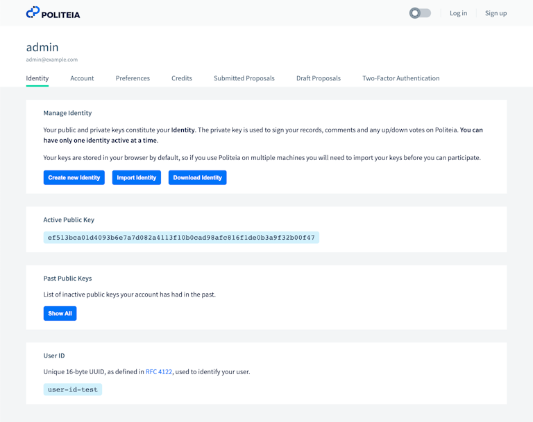
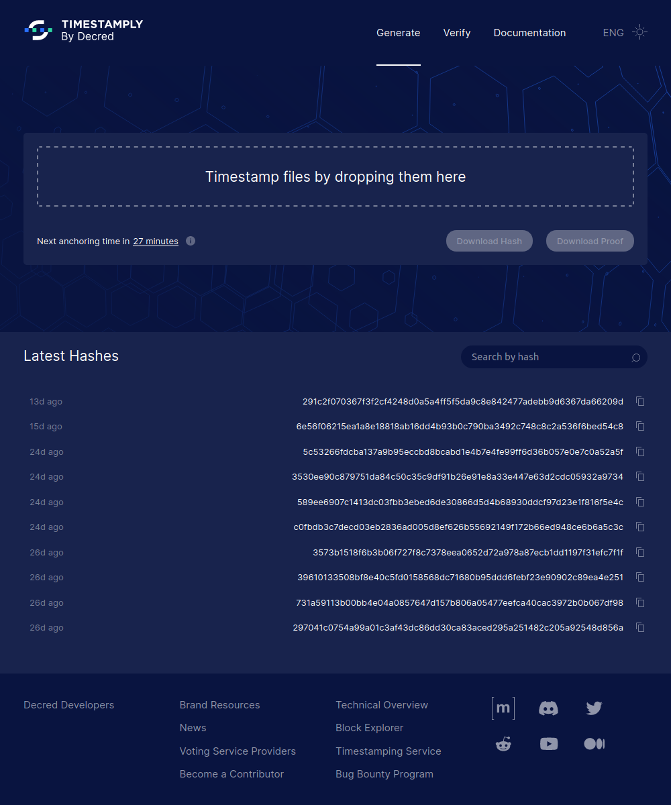
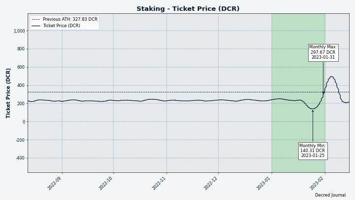
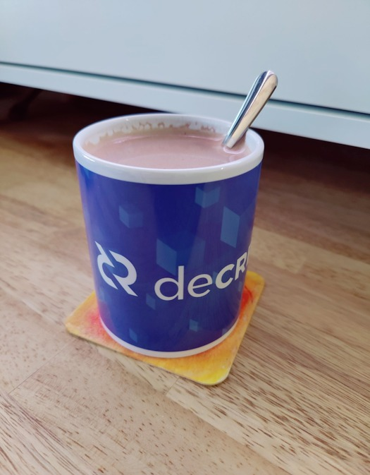

# مجلة ديكريد لشهر يناير 2023

_الصورة: بومة ديكريد بواسطة officialcryptos@_

أبرز الأحداث لشهر يناير:

* تمت الموافقة على تمويل إعادة صياغة لموقع Timestamply لتسهيل الختم الزمني لسلسلة DCR  وهو متاح بالفعل للاختبار.
* نُشرت 8 مقترحات على منصة بوليتيا، وبحلول وقت النشر، انتهى التصويت عليها جميعًا، وتمت الموافقة على 5 مقترحات ورفضت 3 مقترحات.
* تلقت Bison Relay تحديثًا لجودة الحياة مع العديد من الإصلاحات والتحسينات ، في النسخة 0.1.3.

المحتويات:

* [النسخة 0.1.3 ل Bison Relay](#النسخة-0.1.3-ل-bison-relay)
* [التطوير](#التطوير)
* [الأشخاص](#الأشخاص)
* [الإدارة و الحوكمة](#الإدارة-و-الحوكمة)
* [الشبكة](#الشبكة)
* [النظام البيئي](#النظام-البيئي)
* [الانتشار](#الانتشار)
* [الفعاليات](#الفعاليات)
* [وسائل الإعلام](#وسائل-الإعلام)
* [مناقشات المجتمع](#مناقشات-المجتمع)
* [الأسواق](#الأسواق)
* [الخارجية ذات الصلة](#الخارجية-ذات-الصلة)

# النسخة 0.1.3 ل Bison Relay

جلب [الإصدار الجديد v0.1.3](https://github.com/companyzero/bisonrelay/releases/tag/v0.1.3) العديد من إصلاحات الأخطاء وتحسينات نوعية الحياة المكتشفة أثناء الاختبارات المجتمعية المبكرة.  إصدارات AppImage متاحة الآن لمستخدمي Linux.

احصل على أحدث إصدار من [محدد التنزيل](https://bisonrelay.org/download/) الجديد أو مباشرة من [GitHub](https://github.com/companyzero/bisonrelay/releases).

توجه إلى قسم [Bison Relay](#bison-relay) للحصول على قائمة مفصلة بالتغييرات في الإصدار 0.1.3 وما بعده.

## التطوير

ما لم يُذكر خلاف ذلك، فإن العمل المَذْكُور هنا يشتمل على حالة "الدمج إلى الرئيسي". وهذا يعني أن العمل قد تم استكماله ومراجعته ودمجه في كود المصدر الذي يمكن للمستخدمين المتقدمين [بناءه وتشغيله](https://medium.com/@artikozel/the-decred-node-back-to-the-source-part-one-27d4576e7e1c)، ولكنه ليس متاحًا بعد في ثنائيات الإصدار للمستخدمين العاديين.

### dcrd

_[dcrd](https://github.com/decred/dcrd) هو تطبيق عقدة كامل يعمل على تشغيل شبكة ديكريد من نظير إلى نظير حول العالم._

* تعديل الطريقة التي [تنتقى فيها المعاملات منتهية الصلاحية](https://github.com/decred/dcrd/pull/3042) من مجمع الذاكرة لقبول أفضل ارتفاع حالي بدلاً من البحث عنها داخليًا. هذا جزء من جهد أكبر لتسهيل التفكير في حالة مجمع الذاكرة عن طريق إزالة الافتراضات المخفية.
* تحديث [صورة ](https://github.com/decred/dcrd/pull/3043)Docker إلى الإصدارات الأحدث من Go و Alpine Linux.
* تكوين حاوية Docker [لإعادة توجيه إشارة SIGTERM](https://github.com/decred/dcrd/pull/3044) إلى مثيل dcrd الجاري بحيث يتم إيقاف تشغيلها بأمان عند إيقاف الحاوية.
* تحسين وتوسيع [وثائق ](https://github.com/decred/dcrd/pull/3045)Docker.
* تحسين اختيار الأقران في مدير العناوين للتخفيف من [الاستخدام المرتفع لوحدة المعالجة المركزية](https://github.com/decred/dcrd/pull/3047) المكتشف عن طريق اختبار منصة المبادلات اللامركزية DEX باستخدام محفظة التحقق البسيط من الدفع لديكريد.

### dcrwallet

_[dcrwallet](https://github.com/decred/dcrwallet) هو خادم محفظة تستخدمه تطبيقات سطر الأوامر والمحفظة الرسومية._

* تمت إضافة خيار [`watchlast` option](https://github.com/decred/dcrwallet/pull/2196) للحد من العناوين التي تتم مشاهدتها في البداية، مما يؤدي بدوره إلى تحسين استخدام موارد بدء التشغيل وأدائها. سيفيد ذلك المحافظ الكبيرة جدًا التي تحتوي على العديد من العناوين القديمة التي لا يُتوقع استخدامها مرة أخرى.

### بوليتيا

_[بوليتيا](https://github.com/decred/politeia) هي نظام المقترحات لديكريد. يتم استخدامها لطلب التمويل من خزينة ديكريد_

جميع التغييرات أدناه تتعلق بإعادة صنع واجهة المستخدم الرسومية على [بنية البرنامج المساعد](https://github.com/decred/politeiagui/tree/master/plugins-structure#politeiagui---plugins-structure) الجديد.

الصفحات المعاد تنفيذها:

* صفحات [تفاصيل المستخدم](https://github.com/decred/politeiagui/pull/2884). تم إعادة هيكلة جميع التعليقات المرئية والنماذج والرسائل، كما تم استخلاص عناصر واجهة المستخدم المشتركة لإعادة الاستخدام، وتم إصلاح العديد من مشكلات واجهة المستخدم والاستجابة مع تحسينات طفيفة في التصميم.
* [صفحات جلسة المستخدم](https://github.com/decred/politeiagui/pull/2887)، بما في ذلك التسجيل وتسجيل الدخول وتسجيل الخروج وإعادة تعيين كلمة المرور والتحقق من البريد الإلكتروني.
* [صفحات المشرف](https://github.com/decred/politeiagui/pull/2891) للاقتراحات التي لم يتم التحقق منها والبحث عن المستخدمين.
* [صفحات الاقتراح](https://github.com/decred/politeiagui/pull/2892) بما في ذلك صفحات التحرير والصفحات الخام.
* هناك [مشكلة رئيسية](https://github.com/decred/politeiagui/issues/2875) تتعقب الصفحات التي تمت إعادة تنفيذها.

تغييرات أخرى:

* إعادة تشكيل تطبيق بوليتيا عالي المستوى لاستخدام [مجموعة الأدوات](https://github.com/decred/politeiagui/pull/2881) الجديدة لتوصيل المكونات الإضافية معًا.
* تمت إضافة [التحقق](https://github.com/decred/politeiagui/pull/2889) من صحة جميع النماذج على بوليتيا، بما في ذلك رسائل الخطأ، والتحكم في تقديم النموذج.
* ~5 إصلاحات أخرى في واجهة المستخدم الرسومية ومكتبة pi-ui.

_الصورة: صفحة حساب المستخدم في واجهة المستخدم الرسومية لبوليتيا المعاد صياغتها._

### cspp

_[cspp](https://github.com/decred/cspp) هو خادم لتنسيق عمليات خلط العملات باستخدام بروتوكول CoinShuffle++. وهو غير احتجازي، أي لا يحتفظ بأي أموال._

* التقاط عنوان IP ونوع الرسالة عند [فشل الإرسال إلى العميل](https://github.com/decred/cspp/pull/79).
* تم إصلاح [خطأ البروتوكول](https://github.com/decred/cspp/pull/80) الذي تسبب في فشل التحقق من صحة التوقيع إذا استخدم العميل والخادم أحجامًا مختلفة من نوع العدد الصحيح، مثل اتصال عميل 32 بت بخادم 64 بت. هذا الإصلاح هو تغيير فاصل للبروتوكول (سيحتاج العملاء إلى التحديث لاستخدام الإصلاح).
* تم التحديث [لأحدث](https://github.com/decred/cspp/pull/81) وحدات DCRD.

### DCRDEX

_[DCRDEX](https://github.com/decred/dcrdex) هي منصة مبادلات غير احتجازية للمُبادلات غير الموثوقة، مدعومة بالمقايضات الذرية._

تغييرات العميل:

* تم تحديث العديد من [تبعيات الويب](https://github.com/decred/dcrdex/pull/1996). 
* تحديث تهيئة Docker: [تحسين الصور الأساسية](https://github.com/decred/dcrdex/pull/2030)، تم التحويل إلى عميل DEX [للعمل كمستخدم غير جذري](https://github.com/decred/dcrdex/pull/2035)، و[استبعاد الملفات غير الضرورية](https://github.com/decred/dcrdex/pull/2077). من بين أمور أخرى، يساعد دمج عميل DEX [في Umbrel](https://proposals.decred.org/record/8d83046).
* السماح [بالإقرار وإخفاء](https://github.com/decred/dcrdex/pull/2044) التحذير الذي يذكّر بإبقاء عميل DEX قيد التشغيل حتى تستقر جميع التداولات.
* تطوير مربع اختيار تجربة المستخدم [بنمط موحد](https://github.com/decred/dcrdex/pull/2002) عبر جميع الأشكال.
* عرض [المحفظة](https://github.com/decred/dcrdex/pull/2071) المفقودة إذا لم يتم العثور عليها عند بدء التشغيل.
* تمت إضافة [حدود](https://github.com/decred/dcrdex/pull/2070) متسقة لجميع حقول الإدخال والقوائم المنسدلة ومربعات الاختيار.
* حفظ بعض [تفضيلات المستخدم](https://github.com/decred/dcrdex/pull/1975) عبر عمليات تبديل/تحديث الصفحة وإعادة تشغيل عميل منصة المبادلات اللامركزية. أشياء مثل إخفاء/إظهار منصة دوك السوق اليسرى أو تحديد المحفظة المختارة في صفحة المحافظ.

إصلاحات العميل:

* تم إصلاح قفزات [تقدم المزامنة](https://github.com/decred/dcrdex/pull/2008) المربكة بعد فقد الاتصالات مع جميع نظراء التحقق البسيط من الدفع.
* تطوير الكشف عن معاملات الاسترداد التي تم [بثها يدويًا](https://github.com/decred/dcrdex/pull/2011) بواسطة المستخدم (خارج عميل DEX) والتعامل معها.
* إصلاح فشل التشغيل في [أنظمة 32 بت](https://github.com/decred/dcrdex/pull/2031).
* إصلاح [مسارات الدليل](https://github.com/decred/dcrdex/pull/2018) التي منعت المحافظ المضمنة للتحقق البسيط من الدفع التي تم إنشاؤها في النسخة 0.5 من التحديث في الإصدار 0.6 القادم.
* إصلاح 4 أخطاء التزامن.

إصلاحات الخادم:

* تجنب [التَوَقُّف التام](https://github.com/decred/dcrdex/pull/2021) بعد تلقي استرداد قيمة صانع ack.
* تمت إضافة فحص سلامة لعدم إرسال [مقايضات بمعدل رسوم صفر](https://github.com/decred/dcrdex/pull/2060).

الإيثريوم:

* تمت إزالة واجهة `authrpc` [المضافة مؤخرًا](https://github.com/decred/dcrdex/pull/2047). تم العثور على أنها [مقيدة بشكل غير ضروري](https://github.com/decred/dcrdex/issues/2016#issuecomment-1369091909) من خلال عدم وجود طرق لفحص مجمع الذاكرة وحساب أحدث رصيد. في الوقت نفسه، لم يتم كسب الكثير من استخدامها في منصة المبادلات اللامركزية DEX. بالنسبة لحالات استخدام DEX، من المنطقي الاتصال بـ Geth إما عن طريق [IPC](https://en.wikipedia.org/wiki/Inter-process_communication) أو بأعلام `--http` / `—ws`. في المستقبل، قد لا تزال هناك حاجة إلى دعم RPC موثق للحصول على بيانات الإيثريوم من مزودي RPC الموثوق بهم من أطراف ثالثة. يمكن أن يؤدي هذا إلى تبسيط الاختبار بشكل كبير لأن تشغيل عقدة كاملة للإيثريوم [أمر صعب للغاية](https://github.com/decred/dcrdex/pull/2020#discussion_r1081309070).
* تطوير عرض لـ [Maker Redemption](https://github.com/decred/dcrdex/pull/1978) في الحالات التي تكون فيها المعاملة الدقيقة غير معروفة.
* تمت إضافة قدرة خادم منصة المبادلات اللامركزية على الاتصال بـ Geth عبر واجهات [HTTP و ](https://github.com/decred/dcrdex/pull/2047)WebSocket.
* تمت إضافة [المهلات](https://github.com/decred/dcrdex/pull/2051) لطلبات RPC بحيث تنتهي صلاحية الطلبات الطويلة جدًا لموفري RPC ويتم إلغاؤها.
* لا يتم اعتبار المعاملات قيد الإنتظار (غير المعدنة) عند حساب الرصيد إذا كان موفر RPC يفتقر إلى [الأساليب المطلوبة](https://github.com/decred/dcrdex/pull/2059) للقيام بذلك.
* إصلاح [عدم حفظ](https://github.com/decred/dcrdex/pull/2055) تكوين المحفظة بعد عملية إعادة التهيئة.
* تم إصلاح [زر الإعدادات](https://github.com/decred/dcrdex/pull/2053) المفقود لتوكنات .ERC-20
* إصلاح الحد الأدنى/الحد الأقصى [لتقديرات الرسوم](https://github.com/decred/dcrdex/pull/2057) المعروضة للمبادلات مع الأصول "التوكنات". يتم دفع رسوم مقايضة التوكنات في الأصل الأساسي. على سبيل المثال، عند شراء DCR مقابل USDC، يتم دفع رسوم جانب USDC من التجارة في ETH.

تغييرات أخرى:

* تم تحديث صفحة المواصفات [الأساسية](https://github.com/decred/dcrdex/pull/2001) (أحدث إصدار [هنا](https://github.com/decred/dcrdex/blob/master/spec/fundamentals.mediawiki)).

قيد التطوير:

* دعم [DigiByte](https://github.com/decred/dcrdex/pull/1993) (DGB).

## الوثائق

_[dcrdocs](https://github.com/decred/dcrdocs) هو الكود المصدري [لوثائق مستخدم](https://docs.decred.org/) ديكريد._

* تمت [إضافة الحوكمة على السلسلة وفقرات بوليتيا](https://github.com/decred/dcrdocs/pull/1212) إلى صفحة [تاريخ المشروع](https://docs.decred.org/getting-started/project-history/) . كما تمت إضافة نقاط الجدول الزمني أيضًا.

### decred.org

_[dcrweb](https://github.com/decred/dcrweb) هو الكود المصدري لموقع [decred.org](https://decred.org/)._

* تم ترتيب ملفات لغة التدويل من خلال [استبدال](https://github.com/decred/dcrweb/pull/1107) علامات الاقتباس المتجاهلة لتقليل احتمال وقوع أخطاء.
* تحسين نسخة [Hugo](https://github.com/decred/dcrweb/pull/1108).

### Bison Relay

_[Bison Relay](https://github.com/companyzero/bisonrelay) هي منصة تواصل اجتماعية جديدة نظير إلى نظير مع حماية قوية ضد الرقابة والمراقبة والإعلانات، مدعومة من الشبكة البرقية لديكريد._

تغييرات واجهة المستخدم الرسومية في إصدار v0.1.3:

* تمت إضافة نصوص بناء لنظامي [Linux](https://github.com/companyzero/bisonrelay/pull/85) (AppImage و tar) و [Windows](https://github.com/companyzero/bisonrelay/pull/88) (MSIX).
* جعل الاشتراك وإلغاء الاشتراك في المنشورات [غير متزامنة](https://github.com/companyzero/bisonrelay/pull/86). هذا يعالج الحالة التي يكون فيها المستخدم المستهدف غير متصل بالشبكة وسيستغرق وقتًا طويلاً للرد على طلب الاشتراك.
* تمت إضافة [رموز المشغل ](https://github.com/companyzero/bisonrelay/pull/94) المناسبة لأنظمة التشغيل المختلفة.

إصلاحات واجهة المستخدم الرسومية في الإصدار 0.1.3:

* يمكن الآن [نسخ](https://github.com/companyzero/bisonrelay/pull/72) رسائل الخطأ ولصقها في تقارير الأخطاء.
* إصلاح [عنوان الخادم](https://github.com/companyzero/bisonrelay/pull/81) في صفحة التكوين الجديدة.
* إصلاح خطأ ثابت عند محاولة تحويل [تنزيل كبير مسدد](https://github.com/companyzero/bisonrelay/pull/91).
* تم إصلاح ا[لضبط تلقائي للصورة المفقود في حقل كلمة المرور](https://github.com/companyzero/bisonrelay/pull/92) الذي يظهر بعد بدء تشغيل التطبيق. يمكن أيضًا تقديم كلمة المرور باستخدام مفتاح Enter الآن.
* تم [إصلاح](https://github.com/companyzero/bisonrelay/pull/96) الروابط غير القابلة للنقر في تعليقات المنشور، وبقاء قائمة السياق مفتوحة، والصور التي لا تظهر في قائمة المنشورات.
* تم إصلاح [الأحرف الزائدة](https://github.com/companyzero/bisonrelay/pull/100) بعد الروابط.

تغييرات تطبيق سطر الأوامر في الإصدار 0.1.3:

* تمت إضافة أمر `/timestats` الذي يقوم بالإبلاغ عن [إحصائيات التوقيت](https://github.com/companyzero/bisonrelay/pull/) لمدفوعات الشبكة البرقية وإرسال الرسائل الصادرة.
* إظهار [العناوين المعلن عنها](https://github.com/companyzero/bisonrelay/pull/82) لعقد الشبكة البرقية التي تم الاستعلام عنها باستخدام أوامر `/svrnode` و `/queryroute`.
* جعل الاشتراك وإلغاء الاشتراك في المشاركات [غير متزامن](https://github.com/companyzero/bisonrelay/pull/86).

إصلاحات تطبيق سطر الأوامر في الإصدار 0.1.3:

* إصلاح تسجيل إرسال ملف  إلى [نافذة خاطئة](https://github.com/companyzero/bisonrelay/pull/71) مع إصلاح النتيجة لأمر `/winlist`.
* [مسح حقل الشهادة](https://github.com/companyzero/bisonrelay/pull/90) عند تعيين عنوان موفر سيولة شبكة برقية مخصص.
* تم إصلاح الخطأ عند محاولة نقل [ملف كبير تم شراؤه](https://github.com/companyzero/bisonrelay/pull/91).

تغييرات الخادم في الإصدار 0.1.3:

* دعم الاستماع إلى [عناوين متعددة](https://github.com/companyzero/bisonrelay/pull/89) للاتصالات.

تم دمج تغييرات تطبيق واجهة المستخدم الرسومية في الفرع الرئيسي `master` نحو الإصدار التالي:

* تحسين المؤشرات غير المقروءة والفرز في [قائمة الدردشة](https://github.com/companyzero/bisonrelay/pull/101).
* تمت إضافة زر [العودة](https://github.com/companyzero/bisonrelay/pull/112) إلى الإعدادات المتقدمة واستعادة طرق العرض.
* تمت الترقية إلى أحدث [مكتبات](https://github.com/companyzero/bisonrelay/pull/114) Dart و Flutter مع تثبيت تجزئاتها للحصول على تصميمات أكثر موثوقية.
* إصلاح عرض  [فواصل الخط](https://github.com/companyzero/bisonrelay/pull/113).

تغييرات تطبيق سطر الأوامر في الفرع الرئيسي `master`:

* تمت إضافة واجهة برمجة التطبيقات [للتحكم في ](https://github.com/companyzero/bisonrelay/pull/84)brclient من أدوات الطرف الثالث. يسمح هذا بكتابة الروبوتات (مثل روبوت جسر الماتريكس) والإدراجات الاخرى. انظر وثائق وأمثلة واجهة برمجة التطبيقات [هنا](https://github.com/companyzero/bisonrelay/tree/0d85ba164376fb5e4c3351c0d7cb76c09a52583b/clientrpc).

موقع [bisonrelay.org](https://bisonrelay.org/):

* تمت إضافة [معالج التنزيل](https://github.com/companyzero/bisonrelay-web/pull/5) الذي يوجه المستخدمين لتصحيح التنزيلات. حتى أنه يعمل مع JavaScript معطل.
* تحديث نسخة [Hugo](https://github.com/companyzero/bisonrelay-web/pull/6).
* تمت إضافة زر ربط بأحدث [ملاحظات الإصدار](https://github.com/companyzero/bisonrelay-web/pull/7).

مسائل أخرى:

* يتم [بث](https://twitter.com/behindtext/status/1615452002502205454) Bison Relay إلى جسر Matrix بشكل مباشر في غرف الدردشة br# و random# و trading#.
* ضح davecgh@ ما يحدث عندما ترسل "فقط" رسالة على Bison Relay (كيف تعمل Rendezvous Points، وكيف يتعذر على الخادم معرفة من يتحدث إلى من، وما إلى ذلك).
* [@BisonRelay](https://twitter.net/BisonRelay) هو حساب جديد على التويتر للإعلانات.
* [@BisonDigest](https://twitter.net/BisonDigest) هو حساب جديد على Twitter لإعادة نشر أفضل محتوى لـ Bison Relay.

### Timestamply

_[Timestamply](https://github.com/decred/dcrtimegui) هي خدمة مجانية لملفات الطوابع الزمنية التي تعمل بواسطة سلسلة كتل ديكريد. يثبت الطابع الزمني أن ملفًا معينًا كان موجودًا في لحظة معينة من الوقت. هذا له مجموعة من التطبيقات في حماية سلامة البيانات._

تم تغيير اسم dcrtimegui إلى Timestamply وتلقى التطبيق [إعادة تصميم كاملة](https://github.com/decred/dcrtimegui/pull/151). تتضمن بعض الميزات الجديدة ما يلي:

* تم تطوير تصميم رسومي جديد مطابق لمعايير تصميم ديكريد لديكريديتون و بوليتيا وآخر تحديث decred.org.
* أوضاع الضوء والظلام.
* لغات متعددة، بما في ذلك الترجمة البرتغالية الأولية.
* Timestamp منفصل والتحقق من الصفحات.
* عرض وقت التثبيت التالي (لم يكن من الواضح أن التثبيت يتم كل ساعة).
* قسم أحدث  تجزئة.
* تم تحسين تجربة المستخدم لتنزيل براهين متعددة.
* قائمة التجزئات ذات الختم الزمني والتحقق منها من قبل المستخدم.
* تقدم تأكيدات المعاملات لكل تجزئة.
* تحسين منطقة الإسقاط.

جاء إعادة تصميم Timestamply بعد فترة وجيزة من تلقي التطبيق بعض الاهتمام من [السياسيين البرازيليين](https://haddadoficial.com.br/lula-e-haddad-registram-plano-de-governo-em-blockchain-para-evitar-fake-news/) الذين وضعوا ملفات PDF مع خطط الحوكمة الخاصة بهم، لمكافحة انتشار المعلومات المضللة عبر إصدارات مزيفة من الملفات.

تمت الموافقة على [اقتراح](https://proposals.decred.org/record/855a506) تمويل النسخة الجديدة وينتظر نشرها في [timestamp.decred.org](https://timestamp.decred.org/). حتى ذلك الحين يمكن للمستخدمين تجربة الإصدار القادم على موقع الاختبار. كن على دراية بأن موقع الاختبار يستخدم قاعدة بيانات مختلفة وقد لا يجد تجزئة مخصصة للإصدار الحالي من التطبيق.

_الصورة: تصميم Timestamply الجديد._

## مسائل أخرى

* [أفاد ](https://twitter.com/JamieHoldstock/status/1611641784127430657) برنامج [Bug Bounty](https://bounty.decred.org/) أنه تمت معالجة 20 طلبًا في 6 أشهر من أحدث [اقتراح](https://proposals.decred.org/record/da2f32d) بقيادة jholdstock@.  فقط طلب واحد كان خطيرا كفاية لضمان دفع تعويضات.
* حصل [موقع](https://github.com/decred/dcrbounty) Bug Bounty على تحديث لـ [Hall of Fame](https://github.com/decred/dcrbounty/pull/91) بإضافة مشاركين وتصحيح النتائج و[الإشراف الداخلي](https://github.com/decred/dcrbounty/pull/92) العام لتنظيف الكود غير المستخدم وتبسيط التحديثات المستقبلية.

## الأشخاص

إحصائيات المجتمع اعتبارًا من 2 فبراير (مقارنة بـ 4 يناير):

*  متابعو [التويتر](https://twitter.com/decredproject): 53,268 (-124)
* المشتركين في [ريديت](https://www.reddit.com/r/decred/): 12,663 (+15)
* مستخدمي غرفة الدردشة general# على [الماتريكس](https://chat.decred.org/): 742 (+4)
* مستخدمي [الديسكورد](https://discord.gg/GJ2GXfz): 926 (-3)
* مستخدمي [التيليجرام](https://t.me/Decred): 2,816 (-56)
* المشتركين في [اليوتيوب](https://www.youtube.com/decredchannel): 4,640 (+0)، المشاهدات: 222 ألف (+ ألف)

## الإدارة و الحوكمة

في يناير، تلقت [الخزينة](https://dcrdata.decred.org/treasury) الجديدة 8,564 DCR بقيمة 189 ألف دولار بمتوسط سعر يناير البالغ 22.05 دولارًا.

تضمنت [معاملة إنفاق الخزينة](https://dcrdata.decred.org/tx/49f141f51421a499d319bc617a4430f87db3a73ffa605dee8408eefb081bd11b) التي تم تعدينها في 3 يناير 24 ناتجًا وتم الإبلاغ عنها [الشهر الماضي ]( https://github.com/xaur/decred-news/blob/master/journal/202212.md#governance ) على أنها دفعات للمتعاقدين (في الغالب) لفواتير نوفمبر، والتي تتراوح من 5 DCR إلى 1,270 DCR. تمت الموافقة عليها بأغلبية 6,967 صوتًا (الكل نعم) مع نسبة إقبال ناخبين ب 54٪، من أصل 12,909 تذكرة حظيت بفرصة المشاركة خلال التصويت المختصر لمدة 9 أيام. في المجموع، أنفقت 3,907 DCR تبلغ قيمتها تقريبًا 86 ألف دولار أمريكي بمعدل فاتورة شهر نوفمبر البالغ 21.92 دولارًا أمريكيًا.

يمكن العثور على جميع معاملات الإنفاق من الخزينة الجديدة [هنا](https://dcrdata.decred.org/treasury?txntype=tspend).

اعتبارًا من 30 يناير، بلغ الرصيد المشترك للخزينة [القديمة](https://dcrdata.decred.org/address/Dcur2mcGjmENx4DhNqDctW5wJCVyT3Qeqkx) و[الجديدة](https://dcrdata.decred.org/treasury) 840 ألف DCR (19.4 مليون دولار أمريكي بسعر 23.03 دولارًا أمريكيًا).

_الصورة: التدفقات الداخلة والخارجة الشهرية للخزينة._

تم نشر 8 مقترحات على منصة بوليتيا في يناير.

* طلب اقتراح [إنشاء محتوى فيديو ديكريد ](https://proposals.decred.org/record/56a439a)2023 ميزانية قدرها 45,600 دولار لمواصلة إنتاج محتوى الفيديو، بما في ذلك البث المباشر لـ DecredSociety@ "ديكريد و حالة السوق" و تحديثات النشرة الإخبارية ل Exitus@ و مقاطع الفيديو/الصور المتحركة ل karamble@ و فضاءَات التويتر ل Tivra@. تمت الموافقة عليه بنسبة 83٪ أصوات نعم و نسبة  إقبال ب 55٪.
* طلب اقتراح [ديكريد عربية للاتصالات والمحتوى ](https://proposals.decred.org/record/5b975ba) 2023 ميزانية قدرها 13،000 دولار أمريكي لمواصلة جهود الفريق لعام آخر، وتمت الموافقة عليه بنسبة 75٪ من الأصوات بنعم و 49٪ من الإقبال.
* طلب اقتراح [ترجمة المحتوى والأصول لديكريد لعام ](https://proposals.decred.org/record/31c4b5f)2023 ميزانية قدرها 33,000 دولار أمريكي لمدة عام من أعمال الترجمة، وتمت الموافقة عليه بنسبة 88٪ من الأصوات نعم والإقبال بنسبة 44٪.
* طلب اقتراح [Timestamply](https://proposals.decred.org/record/855a506) 17,300 دولارًا أمريكيًا للعمل المنجز على تطبيق ويب لخدمة الختم الزمني لـ DCR، وتمت الموافقة عليه بنسبة 88 ٪ من الأصوات نعم والإقبال بنسبة 48٪.
* طلب [اقتراح دمج DCRDEX في Umbrel](https://proposals.decred.org/record/8d83046) ميزانية قدرها 1,960 دولارًا لدمج DCRDEX مع منصة Umbrel للبرمجيات مفتوحة المصدر ذاتية الاستضافة، مما يسهل على مستخدمي Umbrel تثبيت DCRDEX. تمت الموافقة عليه بنسبة 84٪ أصوات نعم وإقبال 47٪.
* The [Rick Red Revival: طلب اقتراح البحث والمهام الأخرى المتنوعة](https://proposals.decred.org/record/f12258b) ميزانية قدرها 32,500 دولار لمزيج من أنواع المساهمة بواسطة richardred@: البحث والاختبار وكتابة البرامج والإشراف على بوليتيا والأشياء المضحكة والمساعدة المتنوعة. تم رفض الاقتراح بنسبة 56٪ أصوات نعم وإقبال 30٪.
* طلب اقتراح [تطبيق ](https://proposals.decred.org/record/49793bf)Alphaday Grant مبلغ 2,400 دولارًا لإنشاء لوحة تحكم تجمع أنواعًا مختلفة من المعلومات حول ديكريد في مكان واحد، وقد تم رفضها بنسبة 17٪ من الأصوات بنعم ومع نسبة إقبال بلغت 25٪.
* طلب اقتراح [الرعاية في رياضة السيارات](https://proposals.decred.org/record/2b19c56) 26,033 دولارًا أمريكيًا للرعاية الكاملة للسيارة لسيارة هوندا سيفيك من النوع R في سلسلة من أحداث السباق، وتم رفضه بنسبة 9٪ موافقة وإقبال بنسبة 22٪.

انظر  العددين [55](https://blockcommons.red/politeia-digest/issue055/) و [56](https://blockcommons.red/politeia-digest/issue056/) لموجز بوليتيا لمزيد من التفاصيل حول مقترحات الشهر.

_الصورة: معدل هاش ديكريد._

تم [الإبلاغ](https://miningpoolstats.stream/decred) عن توزيع معدل الهاش  81 Ph/s بواسطة المجمعات في 1 فبراير: Poolin بنسبة 64%، و F2Pool بنسبة 30%، و BTC.com بنسبة 4%، و CoinMine بنسبة 0.4%.

توزيع  1,000 كتلة تم [تعدينها](https://miningpoolstats.stream/decred) بالفعل بحلول 1 فبراير: Poolin بنسبة 61%، و F2Pool بنسبة 31%، و BTC.com بنسبة 3%، و AntPool بنسبة 4%، و CoinmMine بنسبة 0.4%.

_الصورة: التوزيع التاريخي لمجمع التجزئة_.

**التحصيص**: تراوح [سعر التذكرة](https://dcrdata.decred.org/charts?chart=ticket-price&axis=time&visibility=true-true&mode=stepped) بين 140-298 DCR، [بمتوسط](https://dcrstats.com/) 212.5 DCR (-22.3) خلال 30 يوما.

_الصورة: تجاوز سعر التذكرة حدود التحكم_

بلغ [المبلغ المقفل](https://dcrdata.decred.org/charts?chart=ticket-pool-value&scale=linear&bin=day&axis=time) 8.93-9.71 مليون DCR، مما يعني أن  59.9-65.2٪ من العرض المتاح [شارك](https://dcrdata.decred.org/charts?chart=stake-participation&scale=linear&bin=day&axis=time) في إثبات الحصة.

_الصورة: إنخفاض وتعافي سعر DCR المقفلة في إثبات الحصة._

أدى الانخفاض الحاد في حجم شراء التذاكر إلى انخفاض سعر التذكرة إلى 140 DCR، وقد لوحظ هذا المستوى آخر مرة في أكتوبر 2022 أثناء انخفاض مماثل. تم تخفيض مقدار DCR المقفل في التذاكر بمقدار 780 ألف وحدة DCR إلى 8.93 مليون وحدة ديكريد.

أدى هذا السعر المنخفض للتذكرة إلى ارتفاع كبير في شراء التذاكر مما أدى إلى ارتفاع سعر التذكرة إلى أقصى درجات تأرجح الأسعار التي شهدناها حتى الآن. تم شراء 48,624 تذكرة في يناير - وهو أعلى رقم شهري منذ الشهر الأول من ديسمبر، فبراير 2016.

**مقدم خدمة التصويت**: قام الـ 16[ من مقدمي خدمة التصويت المدرجين](https://decred.org/vsp/) بإدارة ما يقرب من   8,390 (+1270) تذكرة حية، والتي كانت تمثل   18.8٪ من مجموع التذاكر (1.6٪+) اعتبارًا من 1 فبراير. في وقت اللقطة، بلغ عدد التذاكر في مجمع التذاكر ما يقارب 44,670 تذكرة، وهو ما يزيد بنسبة 9٪ عن [الهدف](https://docs.decred.org/proof-of-stake/overview/) 40,960.

أكبر الرابحين في يناير هم vspd.99split.com (+419) و dcrhive.com (+328) و vsp.stakeminer.com (+319).

_الصورة: توزيع التذاكر التي يديرها مقدمو خدمة التصويت._

**العقد**: رصد [جهاز رسم الخرائط لديكريد](https://nodes.jholdstock.uk/user_agents) 187 عقدة dcrd في 1 فبراير: 
النسخة 1.7.5 - 33%، النسخة 1.7.1 - 21%، نسخة بناءات التطوير 1.8.0 - 13%، النسخة 1.7.2 - 13%، النسخة 1.7.0 - 9%، النسخة 1.7.4 - 3%، أخرى - 8%.

_الصورة: التوزيع التاريخي لنسخة dcrd، بيانات من nodes.jholdstock.uk. كانت البيانات حتى يناير 2023 غير مكتملة._

لقد اكتشفنا أن أعداد العقد التي أبلغنا عنها منذ [يونيو ]( https://github.com/xaur/decred-news/blob/master/journal/202206.md )2022 كانت غير مكتملة. أحد الأسباب المحتملة لذلك هو أن جهاز رسم الخرائط لديكريد كان يعتمد على طلب `GetAddr`، وتوقفت العديد من العقد عن الاستجابة لهذا الطلب لسبب ما. `GetAddr` هو جزء من بروتوكول ثرثرة الشبكة، وهو كيفية اكتشاف العقد للعقد الأخرى. الاستجابة لها أمر اختياري ، لذا فإن عدم تلقي أي رد ليس خطأً. كانت أعداد العقد التي أبلغ عنها جهاز رسم الخرائط لديكريد صحيحة في 26 يناير.

تراوحت حصة [العملات المخلوطة](https://dcrdata.decred.org/charts?chart=coin-supply&zoom=jz3q237o-la8vk000&scale=linear&bin=day&axis=time&visibility=true-true-true) بين  59.9-61.6٪. وقد تفاوتت [الكمية المخلوطة](https://dcrdata.decred.org/charts?chart=privacy-participation&bin=day&axis=time) بشكل يومي ما بين 140 و 611 ألف DCR.

_الصورة: انخفض معدل وحدات ديكريد المخلوطة وغير المنفقة بشكل طفيف._

شهد مستكشف [الشبكة البرقية](https://ln-map.jholdstock.uk/) لديكريد 147 عقدة (بزيادة 17)، و261 قناة (بزيادة 28) بسعة إجمالية تبلغ 106.1 DCR (+5.4)، اعتبارًا من 1 فبراير. تختلف هذه الإحصائيات اعتمادًا على عقدة الشبكة البرقية. على سبيل المثال، أبلغت عقدة @karamble عن 163 عقدة (بزيادة 19) و 347 قناة (بزيادة 35) و 159.7 DCR (+5.7) في نفس السعة في 1 فبراير.

## النظام البيئي

تقوم [واجهة برمجة تطبيقات قائمة مزودي خدمة التصويت](https://api.decred.org/?c=vsp) الآن بالإبلاغ عن ارتفاع الكتلة ونسبة الشبكة المقدرة. يوفر ارتفاع الكتلة مزيدًا من اليقين بشأن توقف مزود خدمة التصويت أو مزامنته بالكامل مع سلسلة الكتل. تتوفر [هنا](https://github.com/bochinchero/dcrsnapcsv) لقطات تاريخية لبيانات واجهة برمجة التطبيقات.

تم [حذف](https://github.com/decred/dcrwebapi/pull/171) موفر خدمة التصويت  stakey.com من [قائمة مزودي خدمة التصويت](https://decred.org/vsp/) بسبب [مشاكل](https://github.com/decred/dcrwebapi/pull/171#issuecomment-1279775352) في إصلاح واجهة برمجة التطبيقات الخاصة به. لا ينبغي أن تتأثر محافظ التصويت.

تمت [إزالة](https://github.com/decred/dcrweb/pull/1104) محفظة التحقق من الدفع GoDCR البسيطة من [صفحة المحافظ](https://decred.org/wallets/). لم تعد روابط التنزيل تعمل ولم تعد هذه المحفظة مدعومة/محدثة نتيجة فشل [اقتراح ](https://proposals.decred.org/record/0ef42e5)GoDCR في النجاح. [كود المصدر](https://github.com/planetdecred/godcr) لا يزال متاحا.

تم [إطلاق](https://www.reddit.com/r/decred/comments/102zzxu/dcr_hive_launches_a_ln_node_and_lowers_fees/) عقدة الشبكة البرقية الجديدة بواسطة @kozel في ln.dcrhive.com (منفذ قياسي 9735). للاحتفال بالإطلاق، عرض [مزود خدمة التصويت](https://dcrhive.com/) الخاص به رسومًا مخفضة بنسبة 0.1٪ فقط حتى 8 فبراير. في المستقبل، يخطط @kozel لإضافة مثيل مزود السيولة للشبكة البرقية، لذلك سيتمكن أي شخص يرغب في الحصول على سعة الشبكة البرقية الواردة إلى عقدته من طلبها.

انضم إلى دردشة النظام البيئي [#ecosystem](https://chat.decred.org/#/room/#ecosystem:decred.org) لمتابعة تحديثات النظام البيئي لـديكريد.

تحذير: ليس لدى مؤلفي مجلة ديكريد أي فكرة عن مصداقية أي من الخدمات أعلاه. يرجى إجراء بحثك الخاص قبل الوثوق بمعلوماتك الشخصية أو أصولك لأي كيان.

## الإنتشار

إنجازات Monde PR:

* عرضت فرصتان للتعليق
* عرضت 4 فرص إعلامية

تأمين مواضع الوسائل الإعلامية التالية:

* تمت مقابلة @jy-p على [بودكاست SlateCast](https://cryptoslate.com/podcasts/combining-proof-of-work-and-proof-of-stake-for-a-decentralized-financial-system-with-decred/) الخاص بـ CryptoSlate ، حيث تحدثت عن نهج ديكريد للرقابة والخصوصية، وخزينة المشروع ونموذج الإجماع الهجين.
* مقال في [Decred Magazine](https://www.decredmagazine.com/defi-needs-to-be-decentralized-beyond-name/) يعرض تعليقًا من jz@ حول كيفية احتياج DeFi إلى اللامركزية بما يتجاوز الاسم.

## الفعاليات

**الحضور:**

* تمت دعوة arij@ إلى DevFest الذي نظمته مجموعة مطوري Google في سطات و Women Techmakers Settat-Marrakech. تحدثت عن قوة سلسلة الكتل مع إعطاء ديكريد كمثال، وأهمية استخدام المحافظ ذاتية الاستضافة وليس منصات المبادلات المركزية. كان معظم الجمهور من المطورين وطلاب علوم الكمبيوتر، وطرح البعض أسئلة حول كيفية العمل في ديكريد أو القيام بالتدريب الداخلي. انظر المزيد من التفاصيل في [التقرير](https://decredcommunity.github.io/events/index/20230107.1).

## وسائل الإعلام

مقالات مختارة:

* [ديكريد تطلق Bison Relay: منصة تواصل ورسائل خاصة ومقاومة للرقابة](https://decred.org/news/2022-12-15-decred-launches-bison-relay/) (بيان صحفي في decred.org)
* [المستقبل هنا؟ حديث مع OpenAI حول سوق العملات الرقمية المشفرة](https://www.decredmagazine.com/future-is-here-a-talk-with-openai-about-the-crypto-market/) بواسطة Joao@
* [الخادم الشخصي الخاص Umbrel](https://www.decredmagazine.com/personal-private-server-umbrel/) بواسطة phoenixgreen@
* [ديكريد مقابل المونيرو: صراع عملات الخصوصية](https://www.decredmagazine.com/decred-vs-monero-clash-of-privacy-coins/)  بواسطة @Joao
* [يساعد تطبيق ديكريد Bison Relay المستخدمين على تحقيق الدخل من جميع أنواع المحتوى](https://www.decredmagazine.com/decreds-bison-relay-helps-users-monetize-all-types-of-content/) بواسطة @HassanMaishera
* [ديكريد عام في المراجعة (2022)](https://www.decredmagazine.com/decred-a-year-in-review-2022/) بواسطة phoenixgreen@

**إحصائيات مشاركة مجلة ديكريد اعتبارًا من يناير 2023:**

* إجمالي عدد المقالات على مجلة ديكريد: 392
* عدد المشتركين في النشرة الإخبارية: 87
* مجموع الرسائل الإخبارية المرسلة: 21
* الحملات النشطة على وسائل التواصل الاجتماعي: 26
* الحملات المكتملة على وسائل التواصل الاجتماعي: 31
* المشاركات على مواقع التواصل الاجتماعي: 132
* الإعجابات: 704
* إعادة التغريدات: 129
* متابعو وسائل التواصل الاجتماعي عبر جميع المنصات والحسابات: 1,180

يرجى ملاحظة أن Decred Magazine تنتج محتوى أكثر بكثير مما يمكن لـ [@decredproject](https://twitter.com/decredproject) إعادة تغريده (مشكلة لطيفة!)، لذا تابعها مباشرة حتى لا تفوتك أي قصة. هناك العديد من الطرق لمتابعة Decred Magazine: على [التويتر](https://twitter.com/decredmagazine) أو [Instagram](https://instagram.com/decredmagazine) أو [الفيسبوك](https://www.facebook.com/Decredmagazine) أو [موجز ](https://www.decredmagazine.com/rss/)RSS أو فقط تحقق مباشرة من [decredmagazine.com](https://www.decredmagazine.com/) أو فئة معينة أو [النشرات الإخبارية](https://www.decredmagazine.com/tag/news/) أو [موجز بوليتيا](https://www.decredmagazine.com/tag/politeia-digest/).

**أشرطة الفيديو:**

* [موجز أخبار Bison Relay 0.1 - الاتصال وإنشاء واستخدام الماركداون](https://www.youtube.com/watch?v=NuKVAp4fIBY) بواسطة phoenixgreen@
* Bison Relay -[ نظام دفع مدمج](https://www.youtube.com/watch?v=aZvnd5BvEBs) بواسطة phoenixgreen@ - متوفر أيضًا [كمنشور نصي](https://www.decredmagazine.com/built-in-payment-system-bison-relay/)
* Bison Relay[ - إدارة المحتوى](https://www.youtube.com/watch?v=1gNc_DLCddc) بواسطة phoenixgreen@  - متوفر أيضًا [كمنشور نصي](https://www.decredmagazine.com/bison-relay-manage-content/)
* [الحلقة 49 من SlateCast: الجمع بين إثبات العمل وإثبات الحصة في DeFi مع ديكريد](https://www.youtube.com/watch?v=VYDPCbb5VhE) بواسطة CryptoSlate بمشاركة jy-p@.
* [يتم تحديث Bison Relay للإصدار ](https://www.youtube.com/watch?v=EWNW91_rp1w)0.1.3 بواسطة phoenixgreen@ - متوفر أيضًا [كمنشور نصي](https://www.decredmagazine.com/bison-relay-updates-to-version-0-1-3/)

**المقاطع الصوتية:**

نظم Tivra@ المعروف أيضًا باسم [@WasPraxis](https://twitter.com/WasPraxis) خمس فضاءَات جديدة على التويتر:

* 2023[: عام عملة الخصوصية؟](https://twitter.com/i/spaces/1YqKDobzqoOxV) بمشاركة أعضاء مجتمع المونيرو (متوفر أيضًا على [Anchor](https://anchor.fm/decred-magazine/episodes/2023-The-Year-of-the-Privacy-Coin-e1t4mst) + نسخة منقحة على [اليوتيوب](https://www.youtube.com/watch?v=5ttufSLhsE0))
* [أدوات الخصوصية لعصر سيادي](https://twitter.com/i/spaces/1jMJgLyXXEyxL بمشاركة أعضاء مجتمع ديكريد و المونيرو ([Anchor](https://anchor.fm/decred-magazine/episodes/Privacy-Tools-for-a-Sovereign-Age---Decred-Twitter-Space-e1tf0g9))
* [خمسة مقترحات - مناقشة عامة](https://twitter.com/i/spaces/1YpKkgeoVqwKj) - التحدث مع مقدمي المقترحات والمجتمع حول أحدث مجموعة من المقترحات ([Anchor](https://anchor.fm/decred-magazine/episodes/Decred-Twitter-Space-5-Proposals-Up-General-Discussion-hosted-by-WasPraxis-e1tpati))
* [لماذا تعتبر الخصوصية أمرًا بالغ الأهمية لعملة تعمل بكامل طاقتها](https://twitter.com/i/spaces/1YqJDoDNrnzGV) بمشاركة المؤسس المشارك Firo لـ [Reuben Yap](https://twitter.com/reubenyap) على ([Anchor](https://anchor.fm/decred-magazine/episodes/Why-Privacy-is-Critical-for-a-Fully-Functional-Currency---Decred--Firo-Twitter-Space-e1u52o8))
* [فضاء مقترحات ](https://twitter.com/i/spaces/1jMKgLAlLXgGL)DCR - الدردشة الثانية مع أصحاب المقترحات لمناقشة أهدافهم ونتائجهم ([Anchor](https://anchor.fm/decred-magazine/episodes/DCR-Proposals-Space-e1u9f9j))

**المتعة و الفن:**

* [عرض Bison Relay على التيكتوك](https://twitter.com/exitusdcr/status/1620123207251681280) بمشاركة [@DajanaDcr](https://twitter.com/DajanaDcr)
* [ديكريد تدهش مرة](https://www.decredmagazine.com/decred-strikes-again/) أخرى بواسطة OfficialCryptos@

_الصورة: "حان وقت شوكولاتة ساخنة لديكريد" بقلم _ maitreludo@

**مسائل أخرى:**

* [موضوع](https://twitter.com/toddfmaki/status/1616283326490497025) تعليمي بواسطة toddfmaki@ حول مزودي خدمة تصويت ديكريد

**الترجمة:**

* حصلت مجلة ديكريد من نوفمبر إلى ديسمبر على ما مجموعه 3 [ترجمات](https://xaur.github.io/decred-news/) جديدة إلى العربية (@arij و @abdulrahman4) والصينية (@Dominic) والبولندية (@kozel). شكرا لكم جميعا على نشر الكلمة!
* تمت ترجمة [Bison Relay: الإنترنت السيادية](https://blog.decred.org/2022/12/14/Bison-Relay-The-Sovereign-Internet/) إلى [الصينية](https://github.com/DominicTing/decred-ZH-translations/blob/master/Bison%20Relay:%20The%20Sovereign%20Internet.md) بواسطة Dominic@ ([تغريدة](https://twitter.com/wanbihou/status/1604010848745230336))

**مناقشات المجتمع:**

* [هل يمكن لأي شيء أن يتجاوز عملة البتكوين كمخزن رئيسي للعملات الرقمية المشفرة ذات القيمة؟](https://www.reddit.com/r/decred/comments/103dkbu/can_anything_surpass_bitcoin_as_the_main_store_of/)
* [تبادل الأفكار حول  فكرة الملاحظات الورقية لديكريد](https://www.reddit.com/r/decred/comments/10m8y6r/decred_notes_idea/)
* [لماذا CPFP أفضل من RBF CPFP](https://matrix.to/#/!aNnAOHkWUdNcEXRGjJ:decred.org/$0a-UUBBdWAG0y7spLPr5TD42Q__uSV_mEbnEbAs9wtQ?via=decred.org&via=matrix.org&via=planetdecred.org). طويل جدا؛ لم يقرأ RBF (الاستبدال بالرسوم) يفتح الباب للإنفاق المزدوج، ويمكن للمرسل فقط تسريع المعاملات منخفضة الرسوم. CPFP (الإبن يدفع للوالد) لا يسمح بمضاعفة الإنفاق ويسمح لكل من المرسل والمستلم بتسريع المعاملة.
* لا تلتقط [طعم](https://twitter.com/applesaucesome1/status/1615063402514157568) [الخوف وعدم اليقين والشك](https://twitter.com/applesaucesome1/status/1612328396868009986).

## الأسواق

في يناير، تم تداول DCR بين 18.30 دولارًا أمريكيًا و 24.90 دولارًا أمريكيًا و BTC 0.00097-0.00116. وقد بلغ متوسط السعر اليومي 22.05 دولارًا.

أثناء عدم وجوده في [Decred Magazine](https://www.decredmagazine.com/author/applesaucesome/) مؤخرًا، يواصل Applesaucesome@ نشر تحليلات وتوقعات فنية لـ DCR$ على [التويتر](https://twitter.com/applesaucesome1).

_الصورة: الحجم الشهري لـ DCRDEX بالدولار الأمريكي._

## الخارجية ذات الصلة

ظهر بروتوكول Ordinals، من أجل "تسجيل" البيانات على satoshis مثل نسخة البتكوين من NFT، لأول مرة هذا الشهر و[تلقى](https://www.coindesk.com/tech/2023/01/31/bitcoin-community-erupts-in-existential-debate-over-nft-project-ordinals/) ردود فعل متباينة من مجتمع البتكوين. تم تقسيم ردود الفعل بين أولئك الذين رأوا أنها حالة استخدام ممتعة إضافية للبتكوين، وأولئك الذين رأوها على أنه محتوى غير مرغوب فيه يغزو سلسلة البتكوين والذي يجب تثبيطه أو حتى مراقبته. كان آدم باك من بين أولئك الذين بدأوا على الفور في التفكير في الطرق التي يمكن أن تحشدها تجمعات التعدين لفرض الرقابة ومنع هذا الاستخدام لعملة البتكوين، على الرغم من حذفه للتغريدة و[سحبها](https://twitter.com/adam3us/status/1620005172058669056) لاحقًا.

في أوائل فبراير تم [تعدين](https://www.coindesk.com/tech/2023/02/02/giant-bitcoin-taproot-wizard-nft-minted-in-collaboration-with-luxor-mining-pool/) أكبر معاملة للبتكوين على الإطلاق وكانت عبارة عن نقش ترتيبي "Taproot Wizard"، ملأ كتلة كاملة تقريبًا بحد 4 ميغا بايت. تم تعدين المعاملة بواسطة مجمع Luxor ودفع ثمنها بترتيب خاص مع Udi Wertheimer، أحد معالجات Taproot. تعتمد القيم الترتيبية على Taproot و SegWit أيضًا للعمل في شكلها المحدد على سلسلة  البتكوين، ولديهم بعض الاختلافات الهيكلية في كيفية عمل NFT على سلسلة كتل الإيثيريوم والسلاسل الأخرى.

تم [وصف](https://www.coindesk.com/layer2/privacyweek/2022/01/24/bitcoin-isnt-private-but-its-recent-taproot-upgrade-will-help/) [Taproot](https://bitcoinops.org/en/topics/taproot/) نفسه بأنه تحديث لخصوصية البتكوين، لأنه يسمح للمعاملات المعقدة، مثل تلك التي تتطلب تفويضًا متعدد التوقيعات أو استخدام أقفال زمنية، بالظهور على غرار المعاملات العادية، بطريقة لا تكشف عن طبيعتها. يسمح Taproot أيضًا بإكمال بعض هذه العمليات بشكل أكثر كفاءة، مما يعني دفع مبلغ أقل مقابل مساحة الكتلة. على الرغم من أن Taproot كان حيًا منذ تفعيل التفرع الخفيف في نوفمبر 2021، إلا أن استخدامه [ظل منخفضًا](https://cryptonews.com/exclusives/taproot-adoption-remains-low-but-devs-say-it-isnt-problem-for-bitcoin.htm) حتى وقت قريب، مع استخدام 0.37٪ فقط من المعاملات في أبريل 2022.

تخطط Polkadot [لتغيير](https://polkadot.network/blog/lets-talk-polkadot-opengov-part-i) حوكمتها، بهدف تحسين مستوى اللامركزية ومشاركة المجتمع. في الوقت الحالي، يتم انتخاب المجلس من قبل حاملي التوكنات ويعين لجنة فنية من خبراء المراسم، وتؤدي هذه الهيئات أدوارًا محورية في حوكمة Polkadot. وسيحل النظام الجديد أدوار المجلس واللجنة. سيتم أداء بعض وظائفهم من قبل أفراد المجتمع مباشرة، وسيتم تقديم المقترحات إلى مسارات مختلفة اعتمادًا على ما يفعلونه، وسيكون للمسارات عتبات الموافقة والأطر الزمنية الخاصة بهم، مع عملية آلية لتحديد وقت بدء التصويت وتوقفه وأي المقترحات يتم تفعيلها أولاً. ستتولى «الزمالة الأساسية» مسؤولية ضمان جودة التوكنات للتحديثات، ولكن عند أكثر من 100 عضو ستكون هذه مجموعة أكبر بكثير من اللجنة الفنية. كما سيمكن نظام الحوكمة الجديد من تفويض سلطة التصويت بمزيد من المرونة، على أساس كل نوع من أنواع الاقتراحات.

قامت مؤسسة Polkadot Web3 [بتغريد](https://twitter.com/Web3foundation/status/1618550186166620161) حجتها حول سبب عدم كون توكن DOT أمانًا ماليا، [موضحة](https://cointelegraph.com/news/polkadot-restates-its-case-that-dot-has-morphed-away-from-security-status)  الجهود التي بذلوها للامتثال لقوانين الأوراق المالية الأمريكية وأعلنت في نوفمبر 2022 أن DOT كانت قادرة على التحول إلى شيء لم يعد أمانًا ماليا.

يبدو أن Ooki DAO [مستعدة](https://cointelegraph.com/news/ooki-dao-misses-lawsuit-response-deadline-default-judgment-on-the-cards) لخسارة قضيتها مع لجنة تداول العقود الآجلة للسلع في حكم غيابي لأنه لم يتقدم أحد لتمثيل DAO بحلول الموعد النهائي في 11 يناير. حتى الآن، أثبتت لجنة تداول العقود الآجلة للسلع أنه يمكنها [تقديم](https://cointelegraph.com/news/judge-orders-cftc-to-serve-ooki-dao-founders-with-lawsuit) مقالات DAO من خلال نشرها على منتداها/Discord طالما أنها تحدد وتخدم حامل توكن واحد على الأقل أيضًا، وأشارت إلى أنها تعتبر أي شخص يشارك في إدارة الشؤون الإدارية بأي شكل من الأشكال مسؤولاً مسؤولية مشتركة عن أعمالها كشراكة غير مدمجة.

[زادت](https://www.sec.gov/news/press-release/2023-13) لجنة الأوراق المالية والبورصات على Avi Eisenberg لإضافة رسوم التلاعب في سوق Mango الخاصة بها إلى تلك التي جلبتها وزارة العدل و CFTC بالفعل. اعتبارًا من أوائل فبراير، كان أيزنبرغ [يحاول](https://www.coindesk.com/policy/2023/02/02/alleged-mango-markets-exploiter-eisenberg-waives-bail-in-first-ny-court-hearing/) التفاوض بكفالة، بعد أن كان محتجزًا منذ 26 ديسمبر.

[يحاول](https://vulcanpost.com/814224/three-arrows-capital-seeks-funding-gtx-fill-ftx-void/)  مؤسسو 3AC سيئي السمعة أن يجددو ظهورهم من بعد FTX، ويسعون للحصول على تمويل لتأسيس شركة لتداول الادعاءات التي يمتلكها متداولي العملات الرقمية المشفرة بشأن تصفيات منصات المبادلات المفلسة.

تعمل منصة DeFi Moonwell على سلسلة Moonbeam على [إيجاد](https://forum.moonwell.fi/t/explanation-of-methodology-to-calculate-the-impact-of-mip-14-on-moonwell-users/351)  طريقة لتعويض مستخدميها بعد أن تسبب تغيير المعلمة الذي وافق عليه الناخبون في فقدان جميع الضمانات الموجودة على المنصة بنسبة 99.9٪ من قوة الاقتراض وتمت تصفية الجميع، ودفع 10٪ من حجم منصبهم في الغرامات. ذهب 30٪ من غرامات التصفية إلى صندوق مجتمعي وسيتم تقديم اقتراح لسداد هذا الجزء مباشرة، وسيتم تغطية 70٪ الأخرى من قبل Gauntlet، [شريك](https://medium.com/gauntlet-networks/gauntlet-and-moonwell-partner-to-offer-dynamic-risk-management-259856b6146c) إدارة المخاطر لشركة Moonwell.

أطلقت Reddit بعض حالات الاستخدام الجديدة لـ MOONs، توكن مكافآت نقاط الكارما على ./r/cryptocurrency Moonplace هي سلسلة من 10,000 NFTs التي تمنح كل منها حاملها التحكم في مجموعة 10 × 10 من البكسل في [مساحة](https://moonplace.io/) عامة ثنائية الأبعاد. بعد 4 أيام، تم تعدين جميع NFTs، مما أدى إلى حرق 1 مليون MOON (بقيمة ~ 130 ألف دولار) وتسبب في ارتفاع مؤقت في أسعار MOONs. توجد Moonplace NFTs على شبكة Arbitrum Nova، وهو حل L2 rollup scalling لـ Ethereum.

تم [بيع](https://www.reddit.com/r/CryptoCurrency/comments/10q99w7/elite_darkweb_hacker_group_1inch_just_hacked_the/) أول إعلان دعائي ل /r/cryptocurrency أيضًا لـ MOONs (بقيمة 3,350 دولارًا)، إلى منصة المبادلات اللامركزية 1inch.

[تدرس](https://twitter.com/nixorokish/status/1620061177551417349) أكبر مجموعات تحصيص الإيثير ما إذا كان ينبغي عليها الحد من نموها الإضافي لتجنب مشكلات المركزية. Rocket Pool في طريقها للموافقة على [اقتراح](https://snapshot.org/#/rocketpool-dao.eth/proposal/0x9e093dea49dee9d1b3e43dbb6e0d8735149c5fde6ef703620970129b81d0f7f8) (RPIP-17) من شأنه أن يكرس هدف Rocket Pool لتعزيز "التحصيص الصحي ، مع بضع آليات للحد من النمو في حصتها من حصص ETH المجمعة، منها Rocket Pool يسيطر حاليا على 1.66٪. Lido، التي تسيطر على حصة أكبر بكثير من حصة ETH (29٪)، [رفضت](https://snapshot.org/#/lido-snapshot.eth/proposal/0x10abedcc563b66b1adee60825e78c387105110fa4a1e7354ab57bc9cc1e675c2) بأغلبية ساحقة نوعًا مشابهًا من المقترحات في يوليو 2022.

[نشر](https://vitalik.ca/general/2023/01/20/stealth.html) Vitalik Buterin منشور مدونة حول عناوين التخفي، واصفًا الخصوصية بأنها واحدة من أكبر التحديات المتبقية في النظام البيئي الإيثيريوم. سيتم إنشاء عناوين التخفي بواسطة المرسل من عنوان التعريف الخاص بالمستلم، والذي يمكن للمستلم فقط التحكم فيه ولكن لن يتم ربطه بهويته على السلسلة. بمعنى آخر، سيعطي نفس النوع من الخصوصية مثل إنشاء عنوان جديد لكل استلام للأصول، ولكن دون عناء الاضطرار إلى إنشاء عناوين جديدة.

تحولت حوكمة Uniswap إلى [صراع](https://www.theblock.co/post/207297/uniswap-temperature-check-spurs-feverish-backroom-maneuvering-among-crypto-vc-heavyweights) مبين مستثمري رؤوس الأموال الإستثمارية حيث يدعم كل من a16z و Jump أفكارهما الخاصة في اختيار الجسر الذي سيتم دمجه مع Binance Smart Chain. يدعم Jump Wormhole، وقوة a16z تكمن في LayerZero، ولكن الشيء المهم هو أن a16z غير قادر من الناحية التقنية على المشاركة في تصويت "temperature check" لتحديد الإدماج الذي تمت برمجته، ولكنه طلب أن يتم احتساب التوكنات التي يبلغ عددها 15 مليونًا بشكل غير رسمي كأصوات ل LayerZero. فاز Wormhole بفحص درجة الحرارة بأغلبية 11 مليون صوت، لذا فإن أصوات a16z ستكون كافية لتغيير النتيجة. إذا تعذر ذلك، يمكن أن تحاول a16z منع نشر جسر Wormhole بالتصويت ضده في تصويت على السلسلة (بافتراض أنهم سيكونون قادرين تقنيًا على ذلك).

Silvergate Capital هو البنك الذي تستخدمه العديد من منصات مبادلات العملات الرقمية المشفرة، وقد [انخفض](https://www.coindesk.com/business/2023/01/05/silvergate-cuts-40-jobs-writes-off-diem-asset-acquisition/) سهمه بمقدار 46% بعد أن أبلغ عن تدفقات خارجية بقيمة 8.1 مليار دولار من أصول العملات الرقمية المشفرة في الربع الثاني من 2022، وسرح 40% من موظفيه (حوالي 200 موظفًا) لخفض التكاليف. كان يُنظر إلى Silvergate على أنه ضحية محتملة من عدوى FTX/Genesis، مما أدى إلى تشغيل عمليات الانسحاب. أعلنت Silvergate أيضًا أنها ستشطب جميع استثماراتها البالغة 196 مليون دولار في Diem (سابقًا Facebook Libra/Zuck Bucks)، بعد أن أدركت على ما يبدو أن الكود مفتوح المصدر والعلامة التجارية المشوهة لا يساوي الكثير.

شهدت Aptos، التي يقودها مطورو Diem السابقون ولكنها لم تدفع لشركة Meta/Silvergate أي شيء مقابل أصولهم وبدلاً من ذلك [حصلت](https://siliconangle.com/2022/03/15/aptos-raises-200m-bring-diem-blockchain-back-life/) على تمويل بقيمة 200 مليون دولار من a16z ورؤوس الأموال الاستثمارية الأخرى، ارتفاعًا في سعرها في يناير مما رفع قيمتها السوقية إلى 2.4 مليار دولار، حيث أصبحت «العملة الجديدة الساخنة» لفترة.

تم [اختراق](https://twitter.com/peterktodd/status/1609655629903265795) مطور البتكوين الشهير [Luke Dashjr](https://twitter.com/LukeDashjr) وفقد نسبة كبيرة من رَصَّة BTC الخاص به، أكثر من 200 BTC. يبدو أن المتسللين كانوا قادرين على اختراق نظام Linux المستخدم، والذي منح الوصول إلى مفاتيح تشفير PGP الخاصة بـ Luke بالإضافة إلى BTC الخاصة به. تم استخدام مفاتيح PGP للتوقيع على إصدارات Bitcoin Core و Knots، لذلك يجب أن لا يثق بها المستخدمون حتى يتم حل الموقف ويفترض أن Luke Dashjr ينشر مفتاح PGP جديد.

قام كوفيزيلا [بتوثيق](https://www.vulture.com/2023/01/logan-paul-cryptozoo-scam-coffeezilla-allegations-explained.html) دور شخصية لوجان بول على موقع يوتيوب في مشروع CryptoZoo NFT، مع خلاصة أنه كان رئيسًا بين المحتالين في المشروع الذي أفرط في إثارة لعبة لم يكونوا سيقدمونها بشكل واقعي. هدد بول بمقاضاة كوفيزيلا لكنه [تراجع](https://cointelegraph.com/news/logan-paul-backflips-on-defamation-lawsuit-against-coffeezilla-apologizes) بعد ذلك عن تلك التهديدات واعتذر. لوجان بول الآن [موضوع](https://www.sportskeeda.com/esports/news-coffeezilla-reveals-class-action-lawsuit-filed-logan-paul-role-cryptozoo) دعوى جماعية بسبب دوره في CryptoZoo.

قام كوفيزيلا [بتوثيق](https://www.vulture.com/2023/01/logan-paul-cryptozoo-scam-coffeezilla-allegations-explained.html) دور شخصية لوجان بول على موقع يوتيوب في مشروع CryptoZoo NFT، مع خلاصة أنه كان رئيسًا بين المحتالين في المشروع الذي أفرط في إثارة لعبة لم يكونوا سيقدمونها بشكل واقعي. هدد بول بمقاضاة كوفيزيلا لكنه [تراجع](https://cointelegraph.com/news/logan-paul-backflips-on-defamation-lawsuit-against-coffeezilla-apologizes) بعد ذلك عن تلك التهديدات واعتذر. لوجان بول الآن [موضوع](https://www.sportskeeda.com/esports/news-coffeezilla-reveals-class-action-lawsuit-filed-logan-paul-role-cryptozoo) دعوى جماعية بسبب دوره في CryptoZoo.

هذا كل شيء لشهر يناير. شارك بتحديثاتك للإصدار التالي في غرفة الدردشة [#journal](https://chat.decred.org/#/room/#journal:decred.org).

## عن هذا العدد 
  
هذا هو العدد 55 من مجلة صحيفة ديكريد. فهرس جميع الإصدارات والمرايا والترجمات متاح [هنا](https://xaur.github.io/decred-news/).

يتم نقل معظم المعلومات الواردة من أطراف ثالثة مباشرة من المصدر بعد التحقق من الحد الأدنى لصحتها. ليس لدى مؤلفي مجلة صحيفة الديكريد القدرة على التحقق من جميع الادعاءات.رجاء إحذر من أعمال الاحتيال وقم ببحثك الخاص.

الاعتمادات (بالترتيب الأبجدي):

- الكتابة والتحرير: bee و bochinchero و Exitus و jz و l1ndseymm و phoenixgreen و richardred
- المراجعات والتعليقات: davecgh و jholdstock
- صورة العنوان: saender
- التمويل: أصحاب حصص الديكريد

النسخة الأصلية لمجلة الديكريد لشهر يناير 2023 متوفرة على هذا الرابط [هنا](https://xaur.github.io/decred-news/journal/202301).

تمت الترجمة إلى اللغة العربية بواسطة: arij@. قام بالمراجعة abdulrahman4@.
