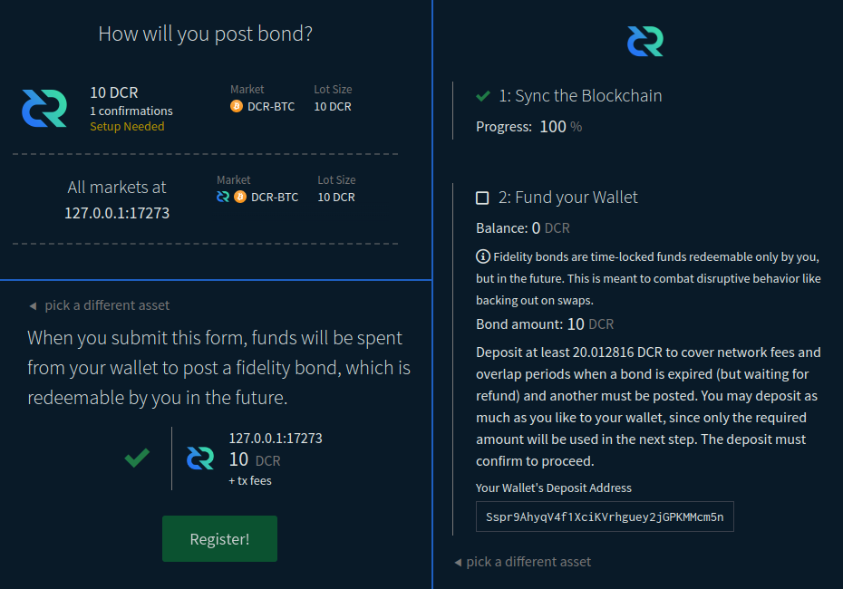
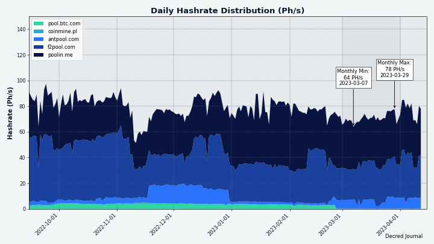
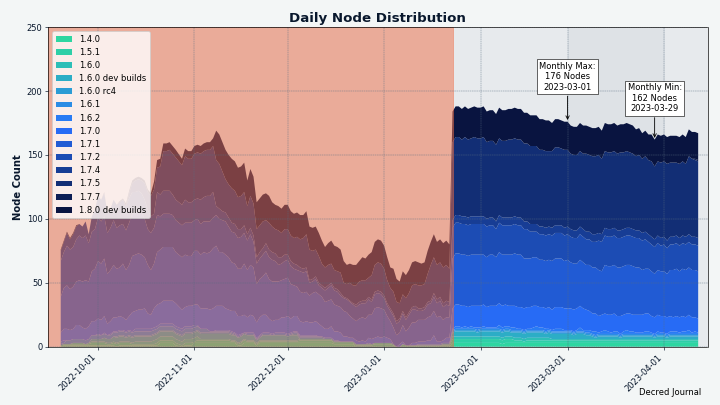

# مجلة ديكريد لشهر مارس 2023

__الصورة: بدون عنوان بواسطة Exitus@_

أبرز أحداث شهر مارس:

* تم تقديم اقتراح والموافقة عليه لتغيير مدفوعات دعم الكتلة من 10/80 لإثبات العمل/إثبات الحصة إلى 1/89، بالإضافة إلى تغيير الخوارزمية لاستبعاد الأجهزة المتخصصة.
* إصدار المرشح 1 للنسخة 0.1.6 ل Bison Relay
* يتم اختبار النسخة 0.6 لمنصة المبادلات اللامركزية لديكريد بشكل تجريبي ويتم إصدار ترشيحات الإصدار.
* مجلة ديكريد كانت واحدة من أربعة مقترحات تمت الموافقة عليها لهذا الشهر، مع ثلاثة لجوانب محددة من تطوير منصة المبادلات اللامركزية لديكريد.

المحتويات:

* [اقتراح لتغيير خوارزمية إثبات العمل وتقليل مكافآت إثبات العمل](#اقتراح-لتغيير-خوارزمية-إثبات-العمل-و-تقليل-مكافآت-إثبات-العمل)
* [إصدار المرشح 1 للنسخة 0.1.6 ل Bison Relay](#إصدار-المرشح-1-للنسخة-0.1.6-لBison-Relay)
* [التطوير](#التطوير)
* [الأشخاص](#الأشخاص)
* [الإدارة و الحوكمة](#الإدارة-و-الحوكمة)
* [الشبكة](#الشبكة)
* [الانتشار](#الانتشار)
* [الفعاليات](#الفعاليات)
* [وسائل الإعلام](#وسائل-الإعلام)
* [مناقشات المجتمع](#مناقشات-المجتمع)
* [الأسواق](#الأسواق)
* [الخارجية ذات الصلة](#الخارجية-ذات-الصلة)

## اقتراح لتغيير خوارزمية PoW إلى BLAKE3 وانقسام PoW/PoS إلى 1/89

سيحدث تغيير كبير في إجماع ديكريد واقتصادياتها. تم تقديم [اقتراح](https://proposals.decred.org/record/a8501bc) لتقليل حصة المكافآت الخاصة بإثبات العمل من 10٪ إلى 1٪، وزيادة مكافآت إثبات الحصة من 80٪ إلى 89٪، وتغيير خوارزمية التعدين من BLAKE-256 إلى BLAKE3. سيؤدي هذا إلى إزالة جميع أجهزة التعدين ASIC الحالية من الشبكة بهدف إصلاح تحديد سعر DCR. اعتبارًا من كتابة هذا التقرير، تمت الموافقة على الاقتراح. ستكون الخطوات التالية هي تنفيذ قواعد الإجماع الجديدة في التعليمات البرمجية، وإصدار نسخة جديدة من البرنامج الأساسي، والسماح للشبكة بتثبيتها والسماح لأصحاب الحصص بالتصويت لتفعيل القواعد الجديدة. كل ذلك من المفترض أن يستغرق بضعة أشهر وسيكون هناك المزيد من التواصل حول كل مرحلة على قنوات [ديكريد الرسمية](https://decred.org/community/). 

## إصدار مرشح النسخة 0.1.6 ل Bison Relay

صدر إصداران في مارس ركزا على تحسين تجربة الدردشة الجماعية.

مميزات إصدار النسخة 0.1.5:

* صفحة جديدة لإحصائيات الدفع
* كودات الاستجابة السريعة لعناوين الإيداع
* تحسين رسائل الخطأ
* تم إصلاح خروج قائمة أعضاء الدردشة الجماعية من المزامنة
* إصلاح ترتيب رسائل الدردشة الجماعية
* إصلاحات الأخطاء الأخرى وتعديلات واجهة المستخدم

مميزات  إصدار المرشح 1 للنسخة  0.1.6:

* إصدار جديد من الدردشات الجماعية مع دعم العديد من المشرفين
* إخطارات الشريط الجانبي للرسائل الجديدة
* التجميع التلقائي لدعوات الدردشة الجماعية في ملفات الدعوة
* إبراز الرسائل التي تحمل الاسم المستعار للمستخدم
* زر مشاركة جديد أكثر وضوحًا
* يتم توجيه جميع تعليقات المنشور إلى المنشور الأصلي ، ويتم تعطيل التعليقات على النسخ التي تم ترحيلها
* العديد من إصلاحات الأخطاء وتحسينات واجهة المستخدم في كل من واجهة المستخدم الرسومية وتطبيقات واجهة سطر الأوامر

احصل على أحدث إصدارات ثنائية على [GitHub](https://github.com/companyzero/bisonrelay/releases) (حتى وقت الكتابة لا تزال صفحة التنزيلات في bisonrelay.org تظهر الإصدار 0.1.4). يتم الترحيب بتقارير الأخطاء وردود الفعل في أداة [تعقب مشكلات ](https://github.com/companyzero/bisonrelay/issues)GitHub و [دردشة #](https://chat.decred.org/#/room/#br:decred.org)br على Matrix أو Bison Relay نفسها.

## التطوير

ما لم يُذكر خلاف ذلك، فإن العمل المَذْكُور هنا يشتمل على حالة "الدمج إلى الرئيسي". وهذا يعني أن العمل قد تم استكماله ومراجعته ودمجه في كود المصدر الذي يمكن للمستخدمين المتقدمين [بناءه وتشغيله](https://medium.com/@artikozel/the-decred-node-back-to-the-source-part-one-27d4576e7e1c)، ولكنه ليس متاحًا بعد في ثنائيات الإصدار للمستخدمين العاديين.

### dcrd

_[dcrd](https://github.com/decred/dcrd) هو تطبيق عقدة كامل يعمل على تشغيل شبكة ديكريد من نظير إلى نظير حول العالم._

استمر تشديد قانون التصويت لتغيير الإجماع من [الشهر الماضي](202302.md#dcrd):

* تحسين [التحقق](https://github.com/decred/dcrd/pull/3068) من صحة بدء التشغيل لمعلمات النشر لضمان تلبيتها للافتراضات التي يعتمد عليها منطق فرز الأصوات. على سبيل المثال، يتحقق من أن كل صوت يحتوي على امتناع واحد تمامًا وواحد لا خيار واحد، أو أنه لا توجد خيارات تصويت مكررة، أو أن الخيارات مشفرة بشكل صحيح في وحدات بت. قد يؤدي هذا إلى فتح التحسينات المستقبلية وتبسيط الكود المتعلق بفرز الأصوات.
* تمت إضافة التحقق من الصحة للتأكد من أن معلمات التصويت لتغيير الإجماع [لا تستخدم وحدات بت خاصة](https://github.com/decred/dcrd/pull/3073) محفوظة للموافقة على الكتلة السابقة أو رفضها.
تمت إضافة التحقق من الصحة لضمان [عدم تداخل](https://github.com/decred/dcrd/pull/3077) البتات المستخدمة بواسطة أصوات مختلفة في نفس مجموعة التصويت.
* تمت إضافة التحقق من صحة رفض اختيارات التصويت [بمعرفات فارغة](https://github.com/decred/dcrd/pull/3079) (المعرفات عبارة عن سلاسل قصيرة تلخص ما يعنيه خيار التصويت، وعادة ما تكون “نعم" `"yes"` أو “لا" `"no"` أو “ممتنع” `"abstain"`).
تمت إعادة صياغة الكود الذي يحدد منطق [مرحلة التصويت بالإجماع وفرز الأصوات](https://github.com/decred/dcrd/pull/3069) لتحسينه وتسهيل فهمه.
* تم تغيير التمثيل الداخلي لاختيار التصويت بالإجماع الفائز لتحسين إمكانية القراءة والحماية الإضافية من [إساءة استخدام](https://github.com/decred/dcrd/pull/3080) هذا الكود.
* تمت إعادة صياغة الاختبارات لكود [معالجة التصويت بالإجماع](https://github.com/decred/dcrd/pull/3075) لتسهيل فهمها، واختبار المزيد من الحالات المتميزة، والقيام بذلك [بشكل أكثر موثوقية](https://github.com/decred/dcrd/pull/3076).
* لاحظ أن التغييرات المذكورة أعلاه لا تكسر الإجماع بين الإصدارات بأي شكل من الأشكال، فهي تضيف المزيد من عمليات التحقق التي تسمح لفشل dcrd في وقت مبكر إذا اكتشفت أن أي افتراضات من خلال تم إجراؤها بواسطة كود الإجماع قد تم انتهاكها.

تغييرات أخرى:

* إعادة طلب الكتل والمعاملات في [أقرب وقت](https://github.com/decred/dcrd/pull/3067) إذا انفصل النظير الذي تم استفساره عنها. بدلاً من انتظار الإعلان عن هذه البيانات مرة أخرى لاحقًا، سيتم طلبها على الفور من أقرانها المعروفين بحيازتها.
* إصلاح التخزين المؤقت [للمخزون المعروف](https://github.com/decred/dcrd/pull/3074) للأقران الآخرين. لقد كان خطأ بسيطًا للغاية مع إمكانية التسبب في ارتفاع طفيف في حركة المرور أكثر مما هو ضروري.
* إعادة الصياغة و تحديثات [بناء التهيئة](https://github.com/decred/dcrd/pull/3081).

### dcrwallet

_[dcrwallet](https://github.com/decred/dcrwallet) هو خادم محفظة تستخدمه تطبيقات سطر الأوامر والمحفظة الرسومية._

* تمت إزالة [حساب الرصيد](https://github.com/decred/dcrwallet/pull/2203)  غير الضروري عند استخدام مشتري التذكرة ورصيد الصيانة غير ملائم أو صفر. في المحافظ الأكثر انشغالا، يؤدي هذا إلى تحسن كبير في الأداء.
* تم الترحيل إلى [عميل مزود خدمة التصويت](https://github.com/decred/dcrwallet/pull/2213) المقدم من مستودع تخزين [vspd](https://github.com/decred/vspd). إنه في الغالب نفس الكود الذي تم استعارته من dcrwallet، ولكن دمج كود مزود خدمة التصويت في مكان واحد يسمح بإزالة الازدواجية التي قد تكون غير متزامنة، مثل أكواد الخطأ وهياكل البيانات وما إلى ذلك.
* إصلاح [سباق البيانات](https://github.com/decred/dcrwallet/pull/2210) في وضع التحقق من الدفع البسيط.
* تم إصلاح إمكانية [تفويت المعاملات ذات الصلة](https://github.com/decred/dcrwallet/pull/2212)  في حالة إلغاء طلب شراء التذكرة بسبب تغيير سعر التذكرة.

### Decrediton

_[Decrediton](https://github.com/decred/decrediton) ديكريديتون هو تطبيق محفظة لسطح المكتب كامل الميزات مع ميزة التصويت مدمجة، وميزة الخلط ب StakeShuffle، والشبكة البرقية، والتداول على منصة المُبادلات اللامركزية DEX للديكريد، والمزيد. يتم تشغيلها مع سلسلة الكتل كاملة أو بدونها (وضع التحقق البسيط من الدفع SPV)._

قيد التطوير:

* بدأ @JoeGruff محاولة [إدماج](https://github.com/JoeGruffins/ledger-decred-poc) في ديكريديتون Ledger [بإثبات أولي للمفهوم](https://github.com/JoeGruffins/ledger-decred-poc) وأتبعه [مقترح](https://proposals.decred.org/record/609db9e) لجعله جاهزًا للإنتاج. يُطلب من المستخدمين حاليًا استخدام برنامج Ledger Live لإرسال/استقبال DCR من/إلى جهاز Ledger الخاص بهم، ولكن تاريخيًا كان هناك الكثير من [المشاكل التقنية](https://matrix.to/#/!MYLcxlwzxwViTaFPGo:decred.org/$fxDMmKpCE-Edb1fRQyhyy_Rjlx2HuKNGtpwSmC76nIA?via=decred.org&via=matrix.org&via=planetdecred.org) في هذا البرنامج. إن وجود دعم Ledger مباشرة في ديكريديتون سيمنح حاملي DCR خيارًا أفضل.

مسائل أخرى:

* يتم [حظر](https://github.com/decred/decrediton/issues/2681#issuecomment-1366432017) تحصيص DCR بواسطة Decrediton+Trezor مرة أخرى بسبب التغييرات المطلوبة في البرامج الثابتة. تم تقديم إصلاح إلى مستودع Trezor للبرامج الثابتة في ديسمبر ولكن لم تتم مراجعته أو دمجه بعد.

### vspd

_[vspd](https://github.com/decred/vspd) هو برنامج خادم لتشغيل موفر خدمة التصويت. يصوت موفر خدمة التصويت نيابة عن مستخدميه على مدار الساعة طوال أيام الأسبوع ولا يمكنه سرقة الأموال._

تغييرات لجعل كود vspd أسهل للإستخدام بواسطة برامج أخرى (مثل dcrwallet):

* تمت إزالة القدرة على [تجاوز التحقق من صحة توقيع الخادم](https://github.com/decred/vspd/pull/372) بوظيفة مخصصة. تمت إضافة هذه الميزة لتسهيل الاختبار ولكن تبين أنها غير ضرورية وتجعل من الصعب استخدام مكتبة عميل مزود خدمة التصويت.
* إزالة الحاجة إلى [تحويل الأخطاء](https://github.com/decred/vspd/pull/374) في كود الاتصال. وهذا مطلوب لنقل النسخة الرئيسية من الوحدة إلى الإصدار 2.

تغييرات أخرى:

* تمت إضافة [تحديد معدل](https://github.com/decred/vspd/pull/373) لطلبات تسجيل دخول المشرف (بحد أقصى 3 محاولات في الثانية)، ونموذج لتهيئة Nginx لدعمها.
* تمت إضافة [أداة تطوير](https://github.com/decred/vspd/pull/366) جديدة لاختبار الخطوات المختلفة لبروتوكول مزود خدمة التصويت: إنشاء معاملة رسوم مزود خدمة التصويت، وإرسالها إلى مزود خدمة التصويت، والاستعلام عن حالة التذكرة، وتغيير خيارات التصويت الخاصة بالتذكرة. يمكن لمشغلي مزودي خدمة التصويت استخدام هذه الأداة للتحقق من أن مقدم خدمة التصويت الخاص بهم يعمل بشكل صحيح.
* زيادة تغطية الاختبار.

### dcrpool

_[dcrpool](https://github.com/decred/dcrpool) هو برنامج خادم لتشغيل مجمع التعدين._

* تم التحديث إلى  [Go 1.18](https://github.com/decred/dcrpool/pull/338).

### الشبكة البرقية

_[dcrlnd](https://github.com/decred/dcrlnd) هو برنامج عقدة الشبكة البرقية لديكريد. تتيح الشبكة البرقية إجراء معاملات فورية ومنخفضة التكلفة._

* تم تحديثه للبناء والاختبار على [Go 1.20](https://github.com/decred/dcrlnd/pull/176).
* تحديث [التبعيات](https://github.com/decred/dcrlnd/pull/177).

[مزود سيولة الشبكة البرقية](https://github.com/decred/dcrlnlpd) (LP):

* تمت إضافة [فحوصات السلامة](https://github.com/decred/dcrlnlpd/pull/9) من جانب العميل للفشل في وقت مبكر عندما لا يكون من الممكن الحصول على قناة داخلية من مزود سيولة الشبكة البرقية LP. سيستخدم العميل سياسة الخادم لتحديد ما إذا كان الخادم يمكنه إنشاء قناة بالحجم المطلوب، وما إذا كان العميل سيكون قادرًا على دفع ثمنها. يسمح هذا بتجنب إحضار فاتورة لن يتم دفعها.
* السماح [بتهيئة](https://github.com/decred/dcrlnlpd/pull/9) سياسة انتهاء صلاحية فاتورة خادم مزود السيولة. يمكن للعميل أن يطلب من خادم مزود السيولة فتح قنوات الشبكة البرقية له. لدفع ثمن هذه الخدمة يجب على العميل دفع فاتورة تم إنشاؤها بواسطة الخادم. يمكن لمشغل الخادم الآن تكوين المدة التي تكون فيها الفاتورة صالحة، وكذلك المدة التي يجب أن ينتظرها العميل قبل طلب فاتورة جديدة.
* تحديث [التبعيات](https://github.com/decred/dcrlnlpd/pull/10).

مزود السيولة للشبكة البرقية هو برنامج يتحكم في عقدة شبكة البرقية العادية ويضيف ميزة واحدة مفيدة لها: يمكن لبرنامج العميل أن يطلب من مزود السيولة فتح قناة مرة أخرى إلى العميل. يمنح هذا العميل سعة واردة إضافية ويسمح له بتلقي المزيد من الأموال عبر الشبكة البرقية. في المقابل، يقوم مشغل مزود السيولة بتحصيل رسوم رمزية مقابل الخدمة.

نظرًا لأن Bison Relay أصبح الآن مستخدمًا رئيسيًا للشبكة البرقية لديكريد، فإنه يستفيد من التحسينات في البرنامج الأساسي للشبكة البرقية وموفر سيولة الشبكة البرقية.

### cspp

_[cspp](https://github.com/decred/cspp)  هو خادم لتنسيق عمليات خلط العملات باستخدام بروتوكول CoinShuffle++. وهو غير احتجازي، أي لا يحتفظ بأي أموال._

* تحديث [تبعيات ](https://github.com/decred/cspp/pull/89)Go.

### DCRDEX

_[DCRDEX](https://github.com/decred/dcrdex) هي منصة مبادلات غير احتجازية للمُبادلات غير الموثوقة، مدعومة بالمقايضات الذرية.

بدأ الاختبار الداخلي قبل الإصدار الرئيسي v0.6 بإصدار تجريبي واثنين من المرشحين للإصدار تم [تعليمهم](https://github.com/decred/dcrdex/tags) في مارس. سيتم تضمين جميع التغييرات المذكورة أدناه في الإصدار v0.6.

تغييرات العميل:

* تمت إزالة [عقدة البتكوين الافتراضية](https://github.com/decred/dcrdex/pull/2193) للحصول على مرشحات كتلة مدمجة في وضع التحقق البسيط من الدفع. تمت إضافته عندما كان هناك عدد قليل من عقد البيتكوين العامة الكاملة التي تدعم [BIP-157](https://bitcoin.stackexchange.com/questions/86231/whats-the-distinction-between-bip-157-and-bip-158-are-they-supported-by-bitcoi/86232#86232). الآن هناك الكثير وإزالة الافتراضي قد يحسن الاتصال لأنه غالبًا ما يكون مثقلًا.
* تم تحسين رسالة الخطأ عند فشل [تهيئة](https://github.com/decred/dcrdex/pull/2205) قاعدة البيانات، والأكثر شيوعًا عند محاولة بدء مثيل ثانٍ من dexc.

إصلاحات العميل:

* إصلاح [الفجوات الفارغة بين الشموع](https://github.com/decred/dcrdex/pull/2195) على الرسم البياني للسعر.
* تم إصلاح [الدقة](https://github.com/decred/dcrdex/pull/2208) العشرية غير المتسقة على عناصر واجهة المستخدم المختلفة.
* إصلاح إظهار [تاريخ إنشاء المحفظة](https://github.com/decred/dcrdex/pull/2236) ب UTC بدلاً من التاريخ المحلي للنظام.
* تم إصلاح ما يقارب خمسة أخطاء أخرى في واجهة المستخدم و خطأ واحد للتزامن.

الإيثيريوم، العميل:

* تم تحسين معالجة الاتصالات الضعيفة بموفري RPC عند [إيقاف تشغيل](https://github.com/decred/dcrdex/pull/2191) عميل منصة المبادلات اللامركزية.
* تمت إضافة صفحة ويكي [لدليل محفظة الايثيريوم](https://github.com/decred/dcrdex/pull/2233).
* تمت إضافة مخزن احتياطي بنسبة 20٪ إلى [تقدير الرسوم](https://github.com/decred/dcrdex/pull/2234) عند إرسال وحدات الإيثير لضمان نجاحها حتى لو ارتفعت الرسوم الأساسية للشبكة قبل الإرسال مباشرة.
* إصلاح عدم تحديث [رصيد الأصول الأصلية](https://github.com/decred/dcrdex/pull/2201) للتوكن عند إلغاء طلب يتضمن ذلك التوكن.
* إصلاح عدم ورود  [المعاملات غير المؤكدة](https://github.com/decred/dcrdex/pull/2211) في الرصيد المتاح.
* إصلاح رسائل الخطأ.

الإيثيريوم، الخادم:

* السماح لمشغلي الخادم بترتيب نقاط نهاية RPC حسب [الأولوية](https://github.com/decred/dcrdex/pull/2199) في ملف التكوين. سيتم دائمًا محاولة الاتصال الصحي بالأولوية القصوى أولاً.

سندات الإخلاص:

* [تحديثات واجهة المستخدم](https://github.com/decred/dcrdex/pull/2200) لاستبدال رسوم التسجيل بالسندات، بما في ذلك دمج السندات في حساب تدفقات الاستيراد والتصدير. يتم أخذ الحالات المختلفة في الاعتبار عند الاستعادة من نفس التطبيق أو جديد، وعند استخدام حساب منصة المبادلات اللامركزية موجود أو إنشاء حساب جديد.
* تنفيذ سندات [ممولة من ](https://github.com/decred/dcrdex/pull/2196)BTC في كل من العميل والخادم. سيكون من الممكن تبديل السندات لاستخدام أصل مختلف، على سبيل المثال من DCR إلى BTC.

تغييرات أخرى:

* تمت إضافة المزيد من عمليات [التحقق](https://github.com/decred/dcrdex/pull/2248) الصارمة من جانب الخادم للعناوين المستخدمة في المقايضات.
* تم تحديث [اعتمادات LTC](https://github.com/decred/dcrdex/pull/2268) لسحب إصلاح مهم للتعامل مع المعاملات الكبيرة.
* تحسينات في اختبار البنية التحتية، وبناء البرامج النصية، وتحديثات التبعية.

تغييرات العميل في الإصدار الرئيسي `master` نحو الإصدار التالي (من المحتمل أن يكون الإصدار 0.6.1):

* إخطار المستخدم عن  [الاتصال غير المستقر](https://github.com/decred/dcrdex/pull/2028). 
* تم إصلاح الخطأ عند [الإخفاق في الاشتراك](https://github.com/decred/dcrdex/pull/2252) في الإشعارات الجديدة للصديرة  من مزود RPC للايثيريوم.

مسائل اخرى:

* تم  [رفض](https://github.com/getumbrel/umbrel-apps/pull/430#issuecomment-1452436145) DCRDEX في متجر تطبيقات Umbrel الرسمي لأنه "بالنسبة للتطبيقات المتعلقة بالعملات الرقمية المشفرة، فنحن نقبل حصريًا التطبيقات التي تركز فقط على البتكوين". بعد أسبوعين، قاموا [بالتغريد](https://twitter.com/umbrel/status/1636068336101621760) بأن فرض الرقابة على المطورين هو مكافحة لتجارة السوق الحرة، وهو ما فاجأ بعض أفراد المجتمع في سياق الرفض. لا يزال من الممكن استخدام DCRDEX في Umbrel عبر ميزة Community App Store عن طريق إضافة مستودع DEX والتثبيت من هناك (اتبع [هذه التعليمات](https://github.com/decred/umbrel-app-store)). الفرق هو أنه يتطلب المزيد من الخطوات اليدوية ويعرض DCRDEX لعدد أقل من المستخدمين مقارنة بمتجر Umbrel App Store الرسمي المركزي.
* تم [رصد](https://twitter.com/DigiByteCoin/status/1640820963532214273) أول مقايضات على الشبكة الرئيسية مع ديجيبايت (DGB) على التويتر.

_الصورة: تحديثات واجهة المستخدم في منصة المبادلات اللامركزية لديكريد لاستبدال رسوم التسجيل بالسندات المؤجلة. تصميم واجهة المستخدم هو عمل قيد التطوير ._

### dcrdata

_[dcrdata](https://github.com/decred/dcrdata) هو مستكشف لسلسلة كتل ديكريد و البيانات خارج السلسلة مثل مقترحات بوليتيا والأسواق وغيرها._

* تمت إضافة برنامج وسيط [مضيف مسموح به](https://github.com/decred/dcrdata/pull/1958) للتأكد من أن أي قيمة صديرة مضيف `Host` تم تعيينها في صديرة الطلب موجودة في القائمة البيضاء للمضيفين. هذا يمنع قيم المضيف `Host` غير الصالحة أو غير المتوقعة حتى إذا تم نشر dcrdata بدون Nginx، والذي يهتم به عادةً.
* تم تحديث ديكريد و [و حدات Node.js](https://github.com/decred/dcrdata/pull/1952) التابعة للجهات الخارجية و [تبعيات](https://github.com/decred/dcrdata/pull/1959) Go إلى أحدث إصداراتها، وتم نقل الإصدارات إلى Go 1.19 و 1.20.

### المستندات

_[dcrdocs](https://github.com/decred/dcrdocs) هو كود المصدر [لمستخدم وثائق](https://docs.decred.org/)  ديكريد._

* تمت إضافة [إبراز بناء الصيغة](https://github.com/decred/dcrdocs/pull/1219) لإصلاح مشكلات بناء جملة الكود الذي يصعب قراءته، خاصة في الوضع المظلم.
* تم تحديث أرقام [مكافآت إثبات الحصة](https://github.com/decred/dcrdocs/pull/1220) (من 30٪ إلى 80٪) في صفحة [نظرة عامة](https://docs.decred.org/proof-of-stake/overview/) على إثبات الحصة.
* تمت إضافة [إدخال معجم](https://github.com/decred/dcrdocs/pull/1217) لـ "Redeem Script”.
* تحديث [معلومات مزود خدمة التصويت للتحصيص](https://github.com/decred/dcrdocs/pull/1217) على صفحات متعددة. يتضمن هذا إزالة معظم المراجع إلى البرامج النصية للاسترداد ، وإزالة تعليمات التحصيص "القديمة" وتبسيط تعليمات التحصيص المتبقية.
* دمج [إيجابيات وسلبيات](https://github.com/decred/dcrdocs/pull/1217) استخدام مزود خدمة التصويت والتحصيص الفردي.
* تمت إضافة [ملاحظة](https://github.com/decred/dcrdocs/pull/1217) إلى صفحة Redeem Script تشير إلى أنها لم تعد ذات صلة.
* تم تحسين صفحة [شراء التذاكر باستخدام ](https://github.com/decred/dcrdocs/pull/1217)dcrwallet. فهو يقوم الآن بفصل تذاكر التصويت والشراء إلى خطوتين منفصلتين بوضوح ويزيل أي إشارات إلى نظام dcrstakepool القديم.
* تم تحسين [بناء ](https://github.com/decred/dcrdocs/pull/1222})Docker: تم التبديل إلى صورة أصغر بكثير استنادًا إلى Alpine Linux، ونوع MIME الثابت لتغذية RSS، مع تحديث النصوص التي تفشل عند حدوث خطأ.

### مستندات التطوير

_[dcrdevdocs](https://github.com/decred/dcrdevdocs) is the source code for Decred [developer documentation](https://devdocs.decred.org/)._

* تم التحديث إلى [MkDocs Material 9](https://github.com/decred/dcrdevdocs/pull/108) مع تحسين البحث. تمت أيضًا التحديث إلى Python 3.11 و Nginx 1.22 وتحسين بنية Docker.

### decred.org

_[dcrweb](https://github.com/decred/dcrweb) هو الكود المصدري لموقع decred.org._

التغييرات في [صفحة الأخبار](https://github.com/decred/dcrweb/pull/1106):

* يتم الآن عرض اسم منفذ إخباري أكثر قابلية للقراءة بدلاً من اسم مجال موقع الويب.
* لم يعد يتم عرض المنفذ والمؤلف لإصدارات البرامج.

Docker:

* التحديثات و[التنظيف](https://github.com/decred/dcrweb/pull/1111).

### Bison Relay

_[Bison Relay](https://github.com/companyzero/bisonrelay) هي منصة وسائط اجتماعية جديدة مع حماية قوية ضد الرقابة والمراقبة والإعلان، مدعومة من الشبكة البرقية لديكريد._

تم إصدار ثنائيات المستخدم النهائي للنسخة 0.1.5  لـ Bison Relay  مع جميع التغييرات والإصلاحات التي أبلغنا عنها في [إصدار فبراير](202302.md#bison-relay). بعد أسبوع واحد فقط أصبح مرشح الإصدار 1 للنسخة 0.1.6 متاحًا للتنزيل. ستجد أدناه جميع التغييرات في مرشح الإصدار 1 للنسخة 0.1.6 و الإصدار النهائي للنسخة 0.1.6. أضاف الأخير إصلاحات طفيفة جدًا ولم يتم عمل ثنائيات له.

التغييرات الشائعة في واجهة الرسومات وواجهة سطر الأوامر في الإصدار 0.1.6:

* تحسين معالجة الأخطاء وتسجيل [المدفوعات الفاشلة](https://github.com/companyzero/bisonrelay/pull/156) (مثل الإكرامية).
* تم تنفيذ [إصدار جديد من الدردشات الجماعية](https://github.com/companyzero/bisonrelay/pull/155) الذي يقدم الدعم للعديد من المشرفين. يمكن للمشرفين دعوة أعضاء أو إزالتهم، وتعيين امتيازات المشرف أو إبطالها. لا يزال الإذن بإيقاف الدردشة الجماعية ممكنًا فقط من خلال دور المالك الخاص. سيكون لدى الدردشات الجماعية الحالية خيار للتحديث إلى الإصدار الجديد.
* تحسين نص المساعدة لإضافة [سعة استقبال الشبكة البرقية](https://github.com/companyzero/bisonrelay/pull/166).
* عدم السماح بالتعليق على [المنشورات المنقولة](https://github.com/companyzero/bisonrelay/pull/162). سيتطلب التعليق على المنشورات تبادلًا رئيسيًا مع المؤلف الأصلي. أيضًا، بمجرد استلام المنشور الأصلي من المؤلف، ستتم إزالة جميع النسخ المنقولة لصالح المنشور الأصلي.
* تم إصلاح الخطأ الذي يمنع قبول [دعوات دردشة جماعية متعددة](https://github.com/companyzero/bisonrelay/pull/154) في نفس الوقت.
* تحديثات التبعية وإعادة الهيكلة الداخلية.

تغييرات تطبيق واجهة المستخدم الرسومية في الإصدار 0.1.6:

* تمت إضافة رمز إشعار الشريط الجانبي [لرسائل الدردشة الجديدة](https://github.com/companyzero/bisonrelay/pull/157).
* إظهار [العدد غير المقروء](https://github.com/companyzero/bisonrelay/pull/157) على أنه “+1K” عندما يزيد عن 1,000.
* تجنب [مؤشر القراءة الأخيرة](https://github.com/companyzero/bisonrelay/pull/157) الزائد عن الحاجة عندما لا تكون هناك رسائل سابقة في الدردشة.
* تمت إضافة زر [منشور جديد](https://github.com/companyzero/bisonrelay/pull/159) بارز يسهل الوصول إليه من طرق عرض مختلفة.
* إضافة [إبراز الرسائل](https://github.com/companyzero/bisonrelay/pull/164) التي تتضمن لقب المستخدم.
* تمت إضافة [خطوة التحقق من البذرة](https://github.com/companyzero/bisonrelay/pull/174)  حيث يُطلب من المستخدم الإجابة عن الأسئلة المتعلقة بالبذرة.
* تمت إضافة [صفحة "عن البرنامج"](https://github.com/companyzero/bisonrelay/pull/175) مع إصدار التطبيق ومعلومات حقوق النشر.
* إصلاح خطأ segfault [عند الإغلاق](https://github.com/companyzero/bisonrelay/pull/157).
* إصلاح الأخطاء عند [مغادرة أو إيقاف](https://github.com/companyzero/bisonrelay/pull/170) الدردشات الجماعية. 
* تعديلات وإصلاحات صغيرة لواجهة المستخدم.

تغييرات تطبيق واجهة سطر الأوامر في الإصدار 0.1.6:

* تمت إضافة [الإكمال التلقائي](https://github.com/companyzero/bisonrelay/pull/163) لأسماء المستخدمين وأسماء الدردشة الجماعية إلى أوامر مختلفة.
* تمت إضافة [Alt+V](https://github.com/companyzero/bisonrelay/pull/153) كمفتاح اختصار للصق.
* تمت إضافة أمر لفك التشفير وفحص [فواتير الشبكة البرقية](https://github.com/companyzero/bisonrelay/pull/166)، وتحسين تسجيل أحداث الشبكة البرقية (مثل فتح القناة أو إغلاقها).
* عرض دعوة للدردشة الجماعية في [محادثة خاصة](https://github.com/companyzero/bisonrelay/pull/169) مع المستخدم المستضيف.
* تمت إضافة خيار لتضمين [دعوة دردشة جماعية](https://github.com/companyzero/bisonrelay/pull/178) في ملف دعوة. ستتم دعوة مستلم الدعوة إلى الدردشة الجماعية تلقائيًا بعد إكمال تبادل المفاتيح الأولي مع مقدم الدعوة.
* إصلاح [التفاف](https://github.com/companyzero/bisonrelay/pull/153) نص متعدد الأسطر.

تغييرات  [أتمتة واجهة برمجة تطبيقات](https://github.com/companyzero/bisonrelay/tree/master/clientrpc) `clientrpc` في الإصدار 0.1.6:

* تحسين معالجة [الإلغاء والإغلاق](https://github.com/companyzero/bisonrelay/issues/158) لحلقة القراءة.
* تمت إضافة طرق [لإدارة الدردشات الجماعية](https://github.com/companyzero/bisonrelay/pull/161) وإرسال الملفات.
* إصلاح [القراءة](https://github.com/companyzero/bisonrelay/pull/161) من ملف سجل إعادة تشغيل الرسالة.

مسائل أخرى و ما هو متوقع:

* يتم الآن تسليم مرفقات الصور بين Bison Relay و Matrix في كلا الاتجاهين.
* تم  [الإعلان](https://twitter.com/behindtext/status/1641080004778897408) عن الدعوات المدفوعة مسبقًا، وسوف تساعد في ضم مستخدمين جدد دون مطالبتهم بالحصول على DCR خارجيًا وتمويل محفظة Bison Relay الخاصة بهم.
* [المعلم](https://matrix.to/#/!aNnAOHkWUdNcEXRGjJ:decred.org/$oCz1kQZLJ_wc4Wwjq6z8x8numCsuZWyy7IyPWw3vDIA?via=decred.org&via=matrix.org&via=planetdecred.org) المهم التالي هو دعوات الدردشة الجماعية المدفوعة مسبقًا، والتي تجمع بين الدعوات المدفوعة مسبقًا ودعوات الدردشة الجماعية المجمعة.
* توفر التقنية الكامنة وراء Bison Relay GUI (Flutter) بنية تحتية لإنشاء تطبيقات الأجهزة المحمولة من نفس قاعدة التعليمات البرمجية. لا يزال يلزم بذل جهد لضبط واجهة المستخدم/ تجربة المستخدم لتلائم النظام الأساسي للجوّال وإصلاح حالات الحافة الخاصة بالجوال، ولكنه أسهل بكثير مقارنةً ببناء تطبيقات الأجهزة المحمولة من نقطة الصفر في مكدسات Android و iOS الأصلية.
* يخطط المطورون على المدى المتوسط لإضافة صفحات وواجهات متاجر والتي سوف تستغرق بعض العمل لتنفيذها.

### مسائل اخرى:

* [موقع](https://bounty.decred.org/) مكافأة إيجاد العلة لديكريد: تمت إضافة [قوالب بريد إلكتروني](https://github.com/decred/dcrbounty/pull/95) مع [تحسين إنشاءات ](https://github.com/decred/dcrbounty/pull/96)Docker و[إضافة](https://github.com/decred/dcrbounty/pull/94) Tanvir0x1 إلى قاعة الشرف.
* تم تحديث مواقع الويب المتعددة لاستخدام أحدث مولد موقع Hugo.

## الأشخاص

إحصائيات المجتمع اعتبارًا من 3 أبريل (مقارنة بـ 1 مارس):

*  متابعو [التويتر](https://twitter.com/decredproject): 53,189 (+125)
* المشتركين في [ريديت](https://www.reddit.com/r/decred/): 12,678 (+18)
* مستخدمي غرفة الدردشة general# على [الماتريكس](https://chat.decred.org/): 761 (+11)
* مستخدمي [الديسكورد](https://discord.gg/GJ2GXfz): 1,556 (-1)، تم التحقق منهم للنشر:  923 (-9)
* مستخدمي [التيليجرام](https://t.me/Decred): 2,619 (-137)
* المشتركين في [اليوتيوب](https://www.youtube.com/decredchannel): 4,630 (+0)، المشاهدات: 226.5 ألف (+1,900)

## الإدارة و الحوكمة

في مارس، تلقت [الخزينة](https://dcrdata.decred.org/treasury) الجديدة 8,388 DCR بقيمة 174 ألف دولار بمتوسط سعر مارس البالغ 20.69 دولارًا. تم إنفاق 4,271 DCR على للدفع للمتعاقدين، بقيمة 88 ألف دولار بسعر مارس.

تم تعدين معاملة إنفاق الخزينة في 13 مارس، وكان لديها 27 ناتجًا لتسديد مدفوعات المتعاقدين، تتراوح من 2.7 DCR إلى 1,264 DCR. وبمعدل فواتير شهر يناير البالغ 22.05 دولارًا أمريكيًا، فإن إنفاق المعاملة يعادل 94 ألف دولار أمريكي.

اعتبارًا من 13 أبريل، بلغ الرصيد المشترك للخزينة [القديمة](https://dcrdata.decred.org/address/Dcur2mcGjmENx4DhNqDctW5wJCVyT3Qeqkx) (17.8 مليون دولار أمريكي بسعر 20.90 دولارًا أمريكيًا).

تم نشر 7 مقترحات على منصة بوليتيا في مارس:

* طلب [اقتراح](https://proposals.decred.org/record/9e68dca) مجلة ديكريد و موجز بوليتيا ميزانية قدرها 40,000 دولار أمريكي وتمت الموافقة عليها بنسبة 86٪ من الأصوات نعم ونسبة إقبال 46٪.
* كانت هناك 3 مقترحات من فريق منصة المبادلات اللامركزية لديكريد والتي تمت الموافقة عليها جميعًا. طلب [الاقتراح](https://proposals.decred.org/record/ca6b749) الرئيسي لتطوير العملاء ميزانية قدرها 182 ألف دولار أمريكي وتمت الموافقة عليها بنسبة 94٪ من الأصوات بنعم و 49٪ من الإقبال. تم تمويل [اقتراح](https://proposals.decred.org/record/ae7c4fe) لتمويل العمل على حُزمة برنامج DEX كتطبيق سطح مكتب بميزانية قدرها 29,000 دولار، و 91٪ موافقة من 43٪ إقبال. تم تمويل [اقتراح](https://proposals.decred.org/record/8b1ceda) لتمويل تطوير صانع السوق وروبوت المراجحة بميزانية قدرها 73,000 دولار، وحصل على موافقة بنسبة 89٪ من 42٪ من التذاكر التي تم التصويت عليها.
* تم رفض [اقتراح](https://proposals.decred.org/record/ff64137) من Cointelegraph لإنشاء المحتوى بقيمة 50,000 دولار بنسبة 41٪ أصوات بنعم من إقبال 51٪.
* تمت الموافقة على [اقتراح](https://proposals.decred.org/record/a8501bc) من jy-p@ لتغيير تقسيم دعم إثبات العمل/إثبات الحصة إلى 1/89 وأيضًا تغيير خوارزمية إثبات العمل إلى BLAKE3، وإزالة أجهزة ASIC المصممة لتعدين DCR من الشبكة، بدعم 97٪ من 62٪ من التذاكر المؤهلة.
* يتم التصويت على اقتراح من joegruff@ لتطوير دعم ديكريديتون لأجهزة Ledger بتكلفة 20,500 دولار وقت الكتابة.

انظر  العددين [57](https://blockcommons.red/politeia-digest/issue057/) و [58](https://blockcommons.red/politeia-digest/issue058/) لموجز بوليتيا لمزيد من التفاصيل حول مقترحات الشهر.

موجز بوليتيا متاح على: [Block Commons](https://blockcommons.red/politeia-digest/) و [Decred Magazine](https://www.decredmagazine.com/tag/politeia-digest/) و [Medium](https://medium.com/politeia-digest) و [GitHub](https://github.com/RichardRed0x/politeia-digest).

## الشبكة

**معدل التجزئة**: تم افتتاح [معدل التجزئة](https://dcrdata.decred.org/charts?chart=hashrate&scale=linear&bin=day&axis=time) لشهر مارس عند 71 Ph/s~ وأغلق عند ~73 Ph/s، ووصل إلى القاع عند 64 Ph/s وبلغت ذروته عند 83 Ph/s على مدار الشهر.

_الصورة: معدل تجزئة ديكريد._

تم [الإبلاغ](https://miningpoolstats.stream/decred) عن توزيع معدل الهاش  74 Ph/s بواسطة المجمعات في 1 أبريل: Poolin بنسبة 54%، و F2Pool بنسبة 35%، و AntPool بنسبة 11%، و CoinMine بنسبة 0.2%.

توزيع  1,000 كتلة تم [تعدينها](https://miningpoolstats.stream/decred) بالفعل بحلول 3 أبريل: Poolin بنسبة 44%، و F2Pool بنسبة 43%، و AntPool بنسبة 9%، و BTC.com بنسبة 3%.

_الصورة: التوزيع التاريخي لمجمع التجزئة_.

**التحصيص**: تراوح [سعر التذكرة](https://dcrdata.decred.org/charts?chart=ticket-price&axis=time&visibility=true-true&mode=stepped) بين  223-254 DCR.

_الصورة: استقر سعر التذكرة._

بلغ [المبلغ المقفل](https://dcrdata.decred.org/charts?chart=ticket-pool-value&scale=linear&bin=day&axis=time) 9.64-9.83 مليون DCR، مما يعني أن   64.0-65.2٪ من العرض المتاح [شارك](https://dcrdata.decred.org/charts?chart=stake-participation&scale=linear&bin=day&axis=time) في إثبات الحصة.

_الصورة: وحدات ديكريد المغلقة في التذاكر مستمرة في الصعود._

**مقدم خدمة التصويت**: قام [الـ 16 من مقدمي خدمة التصويت المدرجين](https://decred.org/vsp/) بإدارة ما يقرب من    7,200 (-210) تذكرة حية، والتي كانت تمثل 17.6٪ من مجموع التذاكر (-0.8٪) اعتبارًا من 1 أبريل.

أكبر الرابحين في مارس هم ubiqsmart.com (280 تذكرة أو 155٪+) و dcrhive.com (+225 تذكرة أو 25٪+).

**العقد**: رصد [جهاز رسم الخرائط لديكريد](https://nodes.jholdstock.uk/user_agents) 162 و 176 عقدًا ل dcrd على مدار الشهر. تمت مشاهدة إصدارات 166 عقدة في 1 أبريل:النسخة 1.7.5 - 36%، النسخة 1.7.1 - 21%، نسخة بناءات التطوير 1.8.0 - 13%، النسخة 1.7.2 - 13%، النسخة 1.7.0 - 8%، النسخة 1.7.4 - 4%، أخرى - 7%.

_الصورة: التوزيع التاريخي لنسخة dcrd، بيانات من nodes.jholdstock.uk. كانت البيانات حتى يناير 2023 غير مكتملة._

تراوحت حصة [العملات المخلوطة](https://dcrdata.decred.org/charts?chart=coin-supply&zoom=jz3q237o-la8vk000&scale=linear&bin=day&axis=time&visibility=true-true-true) بين  60.5-61.1%. وقد تفاوتت [الكمية المخلوطة](https://dcrdata.decred.org/charts?chart=privacy-participation&bin=day&axis=time) بشكل يومي ما بين 317 و 495 ألف DCR.

_الصورة: تعافى العرض المخلوط من انخفاض قصير._

شهد مستكشف [الشبكة البرقية](https://ln-map.jholdstock.uk/) لديكريد 175 عقدة (بزيادة 17)، و 354 قناة (بزيادة 49) بسعة إجمالية تبلغ  129 DCR (+14)، اعتبارًا من 3 أبريل. تختلف هذه الإحصائيات اعتمادًا على عقدة الشبكة البرقية. على سبيل المثال، أبلغت عقدة karamble@ عن 175 عقدة (+0) و 376 قناة (-9) و 135 DCR (-33) في نفس السعة في 3 أبريل.

_الصورة: توزيع التذاكر التي يديرها مقدمو خدمة التصويت._

شهد مستكشف [الشبكة البرقية](https://ln-map.jholdstock.uk/) لديكريد 175 عقدة (بزيادة 17)، و 354 قناة (بزيادة 49) بسعة إجمالية تبلغ  129 DCR (+14)، اعتبارًا من 3 أبريل. تختلف هذه الإحصائيات اعتمادًا على عقدة الشبكة البرقية. على سبيل المثال، أبلغت عقدة @karamble عن 175 عقدة (+0) و 376 قناة (-9) و 135 DCR (-33) في نفس السعة في 3 أبريل.

## النظام البيئي

قامت شركة [Metal Pay](https://metalpay.com/) بتعطيل تداول DCR وفقًا [لتقرير المستخدم](https://matrix.to/#/!teQafvHMYpIbqLIieU:decred.org/$JvKPmPcgLw-bUW-7Tn2QFlqmRFtLQN0pPC-4Qq5u0yY?via=decred.org&via=matrix.org&via=t2bot.io). يتم تأكيد ذلك من خلال موقع الدعم الخاص بهم والذي لم يعد يظهر DCR في قائمة [الأصول المتاحة للتداول](https://help.metalpay.com/hc/en-us/articles/4409447985303-What-Cryptocurrencies-are-Available-for-Trading-on-Metal-Pay-). الأصول الداعمة [للودائع والسحوبات](https://help.metalpay.com/hc/en-us/articles/4409465061911-Which-Cryptocurrencies-Support-Deposit-and-Withdrawal-on-Metal-Pay-) لا تشمل أيضًا DCR، ويبدو أنها لم تفعل ذلك مطلقًا. العملات الأخرى التي تم إزالتها في نفس الدفعة مع DCR تشمل BNB و BUSD و DGB و PAX و TUSD. في الصورة الأكبر، [شطبت](https://www.reddit.com/r/CryptoCurrency/comments/zlmxj3/delisting_notice_for_select_tokens_on_metal_pay/) Metal Pay 13 أصلًا في ديسمبر بما في ذلك XMR و ZEC و DASH و BSV. منذ [نوفمبر 2022](https://web.archive.org/web/20221207223930/https://help.metalpay.com/hc/en-us/articles/4409447985303-What-Cryptocurrencies-are-Available-for-Trading-on-Metal-Pay-)، تم تخفيض قائمة الأصول القابلة للتداول من 63 إلى 15. تم إدراج شركة Metal Pay لأول مرة في DCR في [أبريل ](https://twitter.com/metalpaysme/status/1249745420206686208)2020.

لم تعمل ميزة [الشراء الفوري](https://global.bittrex.com/instant) من Bittrex مع DCR بسبب انخفاض السيولة، وفقًا [لتقرير المستخدم](https://matrix.to/#/!teQafvHMYpIbqLIieU:decred.org/$GWyVIBD5k_vDEUPxJK3QTOFqdAot8he-q4RNcxLsmqo?via=decred.org&via=matrix.org&via=t2bot.io). لم يؤثر هذا على الطلبات الحدية على واجهة التداول الكاملة.

جاء ممثل [Ledger](https://www.ledger.com/) إلى غرفة دردشة الماتريكس على ديكريد لمشاركة [تحديث الحالة](https://matrix.to/#/!teQafvHMYpIbqLIieU:decred.org/$kwC-IMBBr92cstg707O_SlLBJEtCiOt_RmVTtE6S0dI?via=decred.org&via=matrix.org&via=t2bot.io). الملخص هو: دعم ديكريد في Ledger Live معطل لبعض المستخدمين، ويستغرق إصلاحه وقتًا طويلاً، ويود Ledger إعادة توجيه المستخدمين المتأثرين إلى خدمات الطرف الثالث المتوافقة مع أجهزتهم في حالة تعطل الإدماج من جانب Ledger. لذلك سيستفيد Ledger من [الإدماج المباشر](https://proposals.decred.org/record/609db9e) القادم في ديكريديتون.

[أعلنت](https://www.reddit.com/r/decred/comments/123tn1i/binance_close_isolated_margin_for_decred_and_some/) Binance عن إلغاء إدراج أزواج DCR/BTC و DCR/USDT من الاقتراض المعزول. بالنسبة إلى السياق، كانت NEBL و XVG أيضًا جزءًا من دفعة الشطب هذه. لا يتأثر تداول DCR العادي (الفوري) بهذا. في الوقت نفسه، [زادت](https://matrix.to/#/!aNnAOHkWUdNcEXRGjJ:decred.org/$Iv4uASbdiLZIMZWbVVYFqY-motmynF19DH5MYvSRgNo?via=decred.org&via=matrix.org&via=planetdecred.org) الحصة الشخصية في منتج Simple Earn من 300 إلى 10,000 DCR للشخص الواحد. اعتبارًا من 27 مارس، أظهر Simple Earn نسبة 1.67٪ من معدل الفائدة السنوي في حين تبلغ العوائد المباشرة لتحصيص DCR حوالي 7٪/سنويًا.

أصدرت Bittrex إعلانًا كبيرًا عن [إغلاق التشغيل بالولايات المتحدة الأمريكية](https://twitter.com/BittrexExchange/status/1641879884682387457) بسبب التحديات التنظيمية والاقتصادية. وفقًا [للجدول الزمني](https://bittrex.zendesk.com/hc/en-us/articles/10080271948701) الخاص بهم، يجب أن تنتهي عمليات السحب النقدي بحلول 24 أبريل وسحب العملات الرقمية المشفرة بحلول 29 أبريل (كلما كان أقرب كان أفضل). لم تتأثر Bittrex Global (بشكل مباشر) وستواصل عملياتها للعملاء من خارج الولايات المتحدة. وجاءت هذه الخطوة بعد [تغريم](https://www.reuters.com/business/finance/crypto-exchange-bittrex-fined-53-mln-by-us-treasury-dept-2022-10-11/) Bittrex في ديسمبر 29 مليون دولار لانتهاكها العقوبات ولوائح مكافحة غسل الأموال. على الرغم من إغلاق العمليات في الولايات المتحدة، قد تتعرض Bittrex [لدعوى قضائية](https://reason.com/2023/04/19/sec-sues-crypto-exchange-bittrex-shortly-after-it-announces-its-leaving-u-s-markets/) أخرى من هيئة الأوراق المالية والبورصات لتشغيلها منصة المبادلات غير مسجلة.

انضم إلى دردشة النظام البيئي [#ecosystem](https://chat.decred.org/#/room/#ecosystem:decred.org) لمتابعة تحديثات النظام البيئي لـديكريد.

تحذير: ليس لدى مؤلفي مجلة ديكريد أي فكرة عن مصداقية أي من الخدمات أعلاه. يرجى إجراء بحثك الخاص قبل الوثوق بمعلوماتك الشخصية أو أصولك لأي كيان.

## الإنتشار

إنجازات Monde PR:

* عرض فرصتان للتعليق
* عرض 8 فرص إعلامية

تأمين مواضع الوسائل الإعلامية التالية:

* مقال في [Cointelegraph](https://cointelegraph.com/news/trezor-crypto-wallet-s-move-into-the-semiconductor-business-isn-t-for-everyone) يعرض تعليقًا من jz@ على انتقال محفظة Trezor للعملات الرقمية المشفرة إلى مجال أشباه الموصلات. تم تجميع المقال في 14 منشورًا بما في ذلك [Ethereum Today](https://www.ethereum.today/trezor-crypto-wallets-move-into-the-semiconductor-business-isnt-for-everyone/) و [Bitcoin Insider](https://www.bitcoininsider.org/article/207994/trezor-crypto-wallets-move-semiconductor-business-isnt-everyone).
* مقال في CoinDesk يعرض تعليقًا من jz@ على الآثار طويلة المدى للأزمة المصرفية الأمريكية على العملات الرقمية المشفرة. تم تجميع المقال في ثلاث منشورات بما في ذلك [Yahoo! Finance](https://finance.yahoo.com/news/crypto-observers-believe-u-banking-113017805.html) و[Markets Insider](https://markets.businessinsider.com/news/currencies/crypto-observers-believe-us-banking-crisis-could-strengthen-crypto-ecosystem-in-the-long-term-1032172484).

## الفعاليات

**الحضور:**

قدمت arij@ [عرضًا تقديميًا](https://decredcommunity.github.io/events/index/20230304.1) في Technopark Casablanca تحت عنوان "Blockchain and Entrepreneurship". بدأت بمقدمة عن حالات استخدام تقنية سلسلة الكتل وتاريخها، تلاها عرض توضيحي لديكريديتون و بوليتيا. كان الحضور من خلفيات مختلفة بما في ذلك قطاعات المالية والطاقة وتكنولوجيا المعلومات. جاءت الأغلبية ردًا على إعلان LinkedIn.
[الحدث الثاني](https://decredcommunity.github.io/events/index/20230311.1) لفريق ديكريد عربية تم تنظيمه بالاشتراك مع الاتحاد الرياضي لعين الشق والمجلس المحلي لعين الشق الدار البيضاء. قدم khalidesi@ مقدمة إلى سلاسل الكتل في اليوم الأول وتطبيق سلاسل الكتل وديكريد في اليوم الثاني. كان الموضوع هو إظهار كيف يمكن لسلسلة الكتل تحسين طريقة عمل الشركات وتعزيز المزيد من الاندماج الاقتصادي والاجتماعي.

الفعاليات القادمة:

* سيقدم elian@ آخر تحديثات ديكريد في [Monerotopia](https://monerotopia.com/) في مكسيكو سيتي في 5 و 6 و 7 مايو. سيكون لدى ديكريد كشك صغير.

## وسائل الإعلام

مقالات مختارة:

* [ديكريد مقابل ديجيبايت: سباق السرعة!](https://www.decredmagazine.com/decred-vs-digibyte/) بواسطة @Joao
* [لماذا لا تتوافق ديكريد مع  الجهاز الافتراضي للإيثيريوم؟](https://www.decredmagazine.com/why-is-decred-not-evm-compatible/) بواسطة BlockchainJew@

**احصائيات مشاركة مجلة ديكريد لشهر مارس:**

* إجمالي عدد المقالات على مجلة ديكريد: 427
* عدد المشتركين في النشرة الإخبارية: 93
* مجموع الرسائل الإخبارية المرسلة: 18
* الحملات النشطة على وسائل التواصل الاجتماعي: 35
* الحملات المكتملة على وسائل التواصل الاجتماعي: 35
* المشاركات على مواقع التواصل الاجتماعي: 127
* الإعجابات: 709
* إعادة التغريدات: 181
* متابعو وسائل التواصل الاجتماعي عبر جميع منصات وحسابات التويتر و الفيسبوك (بما في ذلك [@DecredSociety](https://twitter.com/DecredSociety)): 1,290

**أشرطة الفيديو:**

* [عرض تعليمي للطابع الزمني Timestamply - ختم الوقت لديكريد](https://www.decredmagazine.com/timestamply-tutorial/) بواسطة phoenixgreen@
* [الإصدار 0.6 لمنصة المبادلات اللامركزية لديكريد قادم - محافظ متعددة السلاسل، بوتات صانع السوق، دعم Digibyte والمزيد](https://www.decredmagazine.com/dcrdex-0-6-is-coming/) بواسطة phoenixgreen@
* [الطابع الزمني Timestamply - إعادة تصميم الوجود الرقمي للوقت](https://www.decredmagazine.com/timestamply-redesign-for-timestamping-digital-existence/) بواسطة phoenixgreen@
* [الحسابات في ديكريديتون - المال المتطور](https://www.decredmagazine.com/accounts-in-decrediton/) بواسطة phoenixgreen@

البث المباشر:

*[حالة السوق - مقترحات المحتوى والتطوير الخاصة بديكريد بمشاركة ](https://www.decredmagazine.com/state-of-the-market-content-and-development-proposals/) Cointelegraph بواسطة phoenixgreen@ و Exitus@  انضم إليهما ماثيو ويانا - متوفر أيضًا [كملف بودكاست](https://podcasters.spotify.com/pod/show/decred-magazine/episodes/State-of-the-market---Content-and-Development-Proposals-e209gfm)

**المقاطع الصوتية:**

* [العيش على العملات الرقمية المشفرة - إعادة اكتشاف الغرض الأصلي من العملات الرقمية المشفرة كنقد](https://twitter.com/i/spaces/1djGXlALNNdGZ) - يتحدث Tivra إلى [TheDesertLynx@](https://twitter.com/TheDesertLynx) الذي يعيش على العملات الرقمية المشفرة منذ عام 2016. «إذا سئمت من الخدمات المصرفية الطريفة وتريد التحرر، فهذا من أجلك». تم عكسه على [Spotify](https://podcasters.spotify.com/decred-magazine/episodes/Living-on-Crypto--Rediscovering-the-Original-Purpose-of-Crypto-as-Cash-e205aup).

**المتعة و الفن:**

* [تكافئ ](https://twitter.com/karamblez/status/1631583670732480514)Bison Relay الرسوم المتحركة بواسطة Karamble@
* [منصة المبادلات اللامركزية لديكريد - هناك طريقة أفضل](https://www.youtube.com/shorts/CpwiihYotbI) بواسطة buck54321@
* [لن يكون المستقبل مركزيًا](https://www.decredmagazine.com/the-future-will-not-be-centralised/)  بواسطة OfficialCryptos@
* Decred Pepe[ تسحق المعدنين](https://twitter.com/karamblez/status/1640492718211182592) بواسطة Karamble@
* [ماذا قلت للتو عن ديكريد؟](https://www.youtube.com/watch?v=WRL-ISUme0I)  بواسطة Laboratory for Memetic Experimentation
* [مقترح Cointelegraph على التيك توك](https://twitter.com/exitusdcr/status/1641796401725337602) بواسطة DajanaDcr@

**الترجمة:**

حصلت مجلة ديكريد من يناير إلى فبراير على ما مجموعه 3 [ترجمات](https://xaur.github.io/decred-news/) جديدة إلى العربية (arij@ و abdulrahman4@) والصينية (Dominic@) والبولندية (kozel@). شكراً يا أصدقاء!

**مناقشات المجتمع:**

* آثار الأزمة المصرفية الحالية على [أسواق العملات الرقمية المشفرة](https://twitter.com/BisonDigest/status/1636523254050324481) والقضايا ذات الصلة. تابع [BisonDigest@](https://twitter.com/BisonDigest)  للحصول على أفضل المحادثات التي تم رصدها على Bison Relay، أو أفضل من ذلك، [جربها بنفسك](https://bisonrelay.org/) حتى لا تفوت أي منها.
* [دراسة استقصائية للأفكار التسويقية الجيدة](https://twitter.com/exitusdcr/status/1639809057870721024)

**مسائل أخرى:**

* صنع decredmagazine@ ثلاث [مقاطع فيديو جديدة على التيك توك](https://www.tiktok.com/@decredmagazine)

## الأسواق

في مارس، تم تداول DCR بين USDT 17.53-25.90 و BTC 0.00068-0.00102. وقد بلغ متوسط السعر اليومي 20.69 دولارًا.

_الصورة: Applesaucesome متفائل. للمزيد تابعه على [التويتر](https://twitter.com/applesaucesome1).

_الصورة: الحجم الشهري لمنصة المبادلات اللامركزية لديكريد بالدولار الأمريكي._

## الخارجية ذات الصلة

فشلت ثلاثة بنوك أمريكية في مارس، أكبرها [بنك وادي السيليكون](https://www.nytimes.com/2023/03/10/business/silicon-valley-bank-stock.html) (SVB)، والذي كان ثاني أكبر فشل بنك أمريكي على الإطلاق. كان أحد الآثار المتتالية هو [إلغاء الربط](https://www.coindesk.com/markets/2023/03/11/usdc-stablecoin-depegs-from-1-circle-says-operations-are-normal/) المؤقت للعملة المستقرة USDC حيث ظهرت أخبار تفيد بأن ~ 10٪ من الأموال التي تدعم USDC كانت عالقة مع SVB عندما تدخلت FDIC لتولي المسؤولية قبل معالجة انسحاب Circle.

يُزعم أن مشغلي العملة المستقرة Tether استخدموا مستندات مزورة وشركات وهمية للحصول على حسابات مصرفية، في [مقال](https://www.wsj.com/articles/crypto-companies-behind-tether-used-falsified-documents-and-shell-companies-to-get-bank-accounts-f798b0a5) نشرته صحيفة وول ستريت جورنال ([رابط](https://archive.is/50s0q) غير مدفوع الأجر). راجعت وول ستريت جورنال ذاكرة تخزين مؤقت لرسائل البريد الإلكتروني من موظفي Tether والتي أشارت إلى جهد طويل الأمد للاحتفاظ بالوصول المصرفي من خلال الانخراط في مخططات مختلفة، بما في ذلك قيام شخص ما في الصين بتقديم فواتير وعقود مزيفة لإخفاء الودائع وعمليات السحب - وهي سياسة تم إيقافها في النهاية عندما كتب المالك ستيفن مور "... لن ترغب في المجادلة بأي مما سبق في قضية احتيال/غسيل أموال محتملة ".

قام نيك كارتر بتوثيق [أدلة](https://www.piratewires.com/p/2023-banking-crisis) على ما أسماه عملية Choke Point 2.0، وهي محاولة متعمدة لتقييد الوصول المصرفي لشركات العملات الرقمية المشفرة عن طريق تثبيط البنوك عن التعامل معها باستخدام وسائل مختلفة.

تم [اتهام](https://decrypt.co/124800/binance-cftc-lawsuit-crypto) Binance من قبل CFTC في شكوى واسعة النطاق تغطي عددًا من الجرائم، بما في ذلك ضعف KYC/AML الذي سمح للعملاء الأمريكيين بتداول الصكوك الاشتقاقية والأوراق المالية التي لم يتم تسجيلهم لتقديمها، وسمح بحدوث غسيل الأموال، وتداولها ضد عملائهم. تتضمن [الشكوى](https://www.docdroid.net/60YAbCz/cftc-binance-pdf) البالغ عددها 74 صفحة اقتباسات من الرسائل المرسلة بين الموظفين الداخليين، بما في ذلك الأحجار الكريمة مثل ‘أنا لا أثق في نظام تحديد المواقع الجغرافية الخاص بنا”، من مسؤول الإبلاغ عن غسيل الأموال. تشير الشكوى أيضًا إلى البتكوين و الايثيريوم كسلع، في خدمة تحديد أنشطة Binance على أنها خاضعة لاختصاص CFTC. [تفاعل](https://twitter.com/cz_binance/status/1640372505046052866) CZ مع "4" التي [تعني](https://twitter.com/cz_binance/status/1610018096122851328) "تجاهل الخوف وعدم اليقين والشك"، ولاحقًا مع [رد](https://www.binance.com/en/blog/from-cz/czs-response-to-the-cftc-complaint-2408916493005890282) أطول تلخص مقدار [استثمار](https://decrypt.co/124683/binance-cftc-lawsuit-response) Binance في الامتثال والتعاون مع المنظمين. بعض المحللين [متشائمون](https://twitter.com/adamscochran/status/1640378686397448192) بشأن فرص Binance ضد CFTC.

تم [تهديد](https://reason.com/2023/03/23/sec-to-coinbase-nice-crypto-exchange-you-got-there-itd-be-a-shame-if-something-happened-to-it/) Coinbase من قبل هيئة الأوراق المالية والبورصات (SEC) باتخاذ إجراء قانوني محتمل لانتهاكات قوانين الأوراق المالية الفيدرالية. أعلن ممثل Coinbase علنًا عن إحباط الشركة بشأن اختيار SEC غير الواضح لأصول العملات الرقمية المشفرة التي تعتبر أوراقًا مالية، واستشهد برفض SEC لتحديد أي من الأصول المحددة المتداولة على منصات Coinbase هي أوراق مالية.

رفعت لجنة الأوراق المالية والبورصات  [دعوى قضائية](https://www.sec.gov/news/press-release/2023-59) ضد جاستن صن وشركاته Tron Foundation و BitTorrent Foundation و Rainberry بسبب انتهاكات بما في ذلك بيع الأوراق المالية غير المسجلة (TRX و BTT) والتلاعب بالسوق الثانوية لـ TRX من خلال تداول واسع النطاق. كما تمت مقاضاة عدد من المشاهير الذين شاركوا للترويج لمشاريع Sun في نفس الحركة للترويج لـ TRX/BTT دون الكشف عن الترتيب، ومن بينهم Lindsey Lohan و Jake Paul و Soulja Boy و Lil Yachty. تغطي الفترة التي اتهمت فيها شركة Sun بالتداول بالغسيل أبريل 2018 إلى فبراير 2019، وخلال هذه الفترة يُزعم أن Sun قدم ما بين 4.5 مليون و 7.4 مليون TRX وأمر الموظفين بغسلها باستخدام اثنين من حساباته.

تم [القبض](https://www.coindesk.com/business/2023/03/23/do-kwon-arrested-in-montenegro-interior-minister/) على Do Kwon، من Terra/Luna infamy، في Montenegro لاستخدامه وثائق مزورة. [أعلنت](https://www.coindesk.com/consensus-magazine/2023/03/29/the-questions-that-linger-after-do-kwons-arrest/) كل من الولايات المتحدة وكوريا الجنوبية عن رغبتهما في تسليمه ومحاكمته.

تم [الانتهاء](https://optimism.mirror.xyz/Upn_LtV2-3SviXgX_PE_LyA7YI00jQyoM1yf55ltvvI) من المبادرة الثانية لتمويل السلع العامة بأثر رجعي (RetroPGF) من قبل Optimism في مارس، حيث تم توزيع 10 ملايين OP على 195 مشروعًا مختلفًا وأشخاص ساهموا بشيء ما في Optimism أو النظام البيئي للايثيريوم. تم توزيع الأموال على المستفيدين في ثلاثة أقسام مختلفة، البنية التحتية (تلقت 37٪)، الأدوات والمرافق (32٪) والتعليم (31٪). لتقرير كيفية توزيع البرنامج التشغيلي، تم [تشكيل](https://community.optimism.io/docs/governance/retropgf-2/#voting-badge-distribution) لجنة من 90 فردًا من المجتمع من خلال اختيار أفراد المجتمع باستخدام مجموعة متنوعة من الوسائل المختلفة. وصنف كل "حامل شارات" المشاريع المرشحة وتم توزيع الأموال وفقًا لمتوسط مرجح لأصواتهم.

أجرت Arbitrum، وهي طبقة ثانية للايثيريوم، عملية الإنزال الجوي التي طال انتظارها، وكان هناك جدل حول مدى توقع الظروف من قبل صيادي الإنزال الجوي. أشار [تحليل](https://mirror.xyz/x-explore.eth/AFroG11e24I6S1oDvTitNdQSDh8lN5bz9VZAink8lZ4) الإنزال الجوي إلى أنه على الرغم من القواعد لتجنب إعطاء إنزال جوي لمستخدمي Sybil ، فقد ذهب ما يصل إلى 48٪ من التوكنات التي تم إسقاطها جواً إلى عنوان كان مرتبطًا بقوة بعنوان واحد آخر على الأقل تلقى أيضًا الإنزال الجوي - حيث ذهب 22٪ لمستخدمي Sybil المتقدمين الذين لديهم آلاف العناوين المرتبطة التي تتلقى الإنزال الجوي.

بمجرد الإسقاط الجوي للتوكنات ، أصبح أصحابها (أولئك الذين لم يتخلصوا منها على الفور) من صانعي القرار في Arbitrum. في الاقتراح الأول (AIP-1) قرروا ما إذا كانوا سيخصصون 750 مليون ARB (بقيمة 1 مليار دولار) إلى مؤسسة Arbitrum، وقد تحول الأمر إلى [فوضى](https://www.coindesk.com/business/2023/04/01/arbitrums-first-governance-proposal-turns-messy-with-1b-arb-tokens-at-stake/). اعترض أعضاء المجتمع على أن يكون للمؤسسة سلطة تقديرية لإنفاق بعض هذه الأموال دون موافقة المجتمع على السلسلة، وعندما كان من الواضح أن الاقتراح يواجه صعوبة، نشرت المؤسسة [منشور مدونة](https://forum.arbitrum.foundation/t/clarity-around-the-ratification-of-aip-1/12864) يوضح أن التصويت كان للتصديق على شيء كان يحدث بالفعل، كان لدى المؤسسة الأموال بالفعل وبدأت في الواقع إنفاقها. يبدو أن هذا كان سوء فهم حول طبيعة التصويت، ولكن بعد الجدل الذي اندلع، اتخذت المؤسسة خطوات لطمأنة المجتمع بأن الـ 700 مليون المتبقية من ARB لن يتم المساس بها حتى تتم الموافقة على الاقتراح من قبل المجتمع.

يعد اختراق DeFi القياسي لهذا الشهر قصة إخبارية جيدة، لأنه أكبر [استرداد](https://twitter.com/eulerfinance/status/1643345907344379904)  للأموال على الإطلاق، من قبل فريق Euler Labs. تم [استغلال](https://cointelegraph.com/news/euler-labs-hacker-returns-all-of-the-recoverable-funds-timeline) بروتوكول Euler Finance من خلال هجوم على قرض سريع في 13 مارس، وتمكن المهاجم من الحصول على 197 مليون دولار، وتسبب في انخفاض القيمة المحجوزة في عقود Euler إلى 10 ملايين دولار. حاولت شركة Euler Labs التفاوض على إعادة 90% الأموال مع المتسلل وعندما انهارت المفاوضات قدمت مكافأة قدرها مليون دولار للحصول على معلومات حول المهاجم. على الرغم من أنه لم يتم التوصل إلى اتفاق، بدأ المهاجم في إعادة الأموال بشكل متقطع، حتى أعلنت شركة Euler Labs في نهاية المطاف في 4 أبريل أنه تم إعادة جميع “الأموال القابلة للاسترداد” وتم إلغاء المكافأة.

يبدو أن LinksDAO في طريقها [لتحقيق](https://twitter.com/LinksDAO/status/1636433901232222208) هدفها الرئيسي وشراء نادي Links Golf Club، وتحديداً Spey Bay على ساحل Moray في اسكتلندا. تم إدراج النادي مقابل 905,000 دولا ، وكان ممثلو LinksDAO هم أفضل مقدمي العطاءات، مع تأكيد البيع وسعر البيع النهائي غير معروف حتى الآن. لا يزال [يُقال](https://www.golfdigest.com/story/links-golf-club-buys-spey-bay-golf-links) أن LinksDAO تبحث عن خصائص لعبة الجولف الأمريكية ، حيث من المفترض أنه لا يمكن للعديد من أعضائها العالميين البالغ عددهم 5,400 الوصول بسهولة إلى ساحل موراي للعب جولة.

تم  [تبني](https://decrypt.co/124622/skull-satoshi-artist-says-was-wrong-bitcoin-mining) “جمجمة ساتوشي"، وهي منشأة فنية بتكليف من منظمة السلام الأخضر كجزء من حملة لتسليط الضوء على تأثير تعدين إثبات العمل، من قبل مجتمع البتكوين باعتباره ملكًا له. توصل الفنان إلى إدراك أنها ليست قضية واضحة، كما اعتقدوا عندما بدأوا في إنشاء القطعة.

 [اقترح](https://www.coindesk.com/policy/2023/03/20/florida-governor-ron-desantis-proposes-law-to-ban-cbdcs/) رون ديسانتيس، حاكم فلوريدا، تشريعًا لحظر قبول العملة الرقمية للبنك المركزي (CBDC) في الولاية. أثيرت [شكوك](https://www.coindesk.com/consensus-magazine/2023/03/22/cbdc-desantis-ban-digitaldollar/) حول ما إذا كان التشريع قابلاً للتطبيق، فمن المحتمل أن يؤدي الضغط الفيدرالي من أجل CBDC إلى إلغاء قانون الولاية الموجود مسبقًا.

نشرت دبي قوانين جديدة في فبراير تحظر إصدار واستخدام [العملات الرقمية المشفرة المعززة لإخفاء الهوية](https://www.coindesk.com/policy/2023/02/08/dubai-prohibits-privacy-coins-under-new-crypto-rules/)  مثل المونيرو.

قام بنكان بريطانيان [بتقييد](https://www.bloomberg.com/news/articles/2023-03-02/uk-banks-ramp-up-crypto-restrictions-with-new-retail-limits) وصول عملاء التجزئة إلى العملات الرقمية المشفرة. أدخلت Nationwide حدًا يوميًا قدره 5000 جنيه إسترليني على مشتريات بطاقة الخصم، مع عدم السماح باستخدام بطاقات الائتمان لشراء العملات الرقمية المشفرة. قام HSBC أيضًا بمنع عمليات شراء العملات الرقمية المشفرة باستخدام بطاقات الائتمان الخاصة به.

هذا كل شيء لشهر مارس. شارك بتحديثاتك للإصدار التالي في غرفة الدردشة [#journal](https://chat.decred.org/#/room/#journal:decred.org).

## عن هذا العدد 
  
هذا هو العدد 57 من مجلة صحيفة ديكريد. فهرس جميع الإصدارات والمرايا والترجمات متاح [هنا](https://xaur.github.io/decred-news/).

يتم نقل معظم المعلومات الواردة من أطراف ثالثة مباشرة من المصدر بعد التحقق من الحد الأدنى لصحتها. ليس لدى مؤلفي مجلة صحيفة الديكريد القدرة على التحقق من جميع الادعاءات.رجاء إحذر من أعمال الاحتيال وقم ببحثك الخاص.

الاعتمادات (بالترتيب الأبجدي):

- الكتابة والتحرير: bee و bochinchero و Exitus و jz و l1ndseymm و phoenixgreen و richardred
- المراجعات والتعليقات: davecgh
- صورة العنوان: Exitus
- التمويل: أصحاب حصص الديكريد

النسخة الأصلية لمجلة الديكريد لشهر مارس 2023 متوفرة على هذا الرابط [هنا](https://xaur.github.io/decred-news/journal/202303).

تمت الترجمة إلى اللغة العربية بواسطة: arij@. قام بالمراجعة abdulrahman4@.
