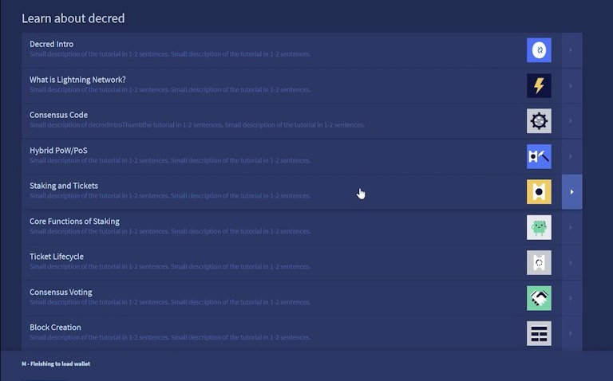
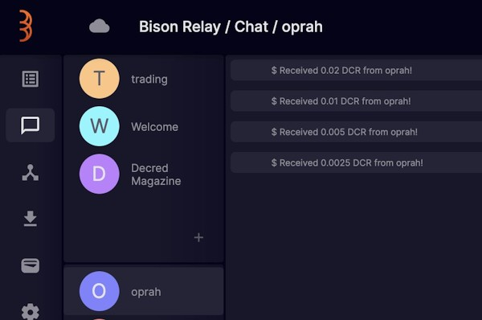
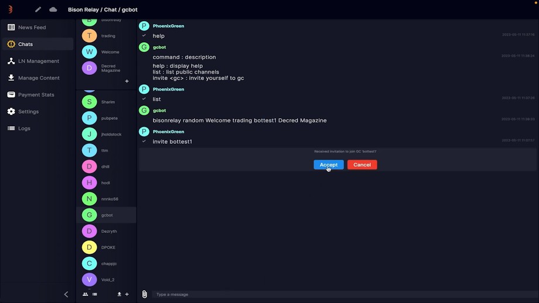
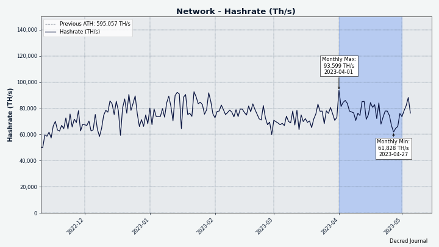
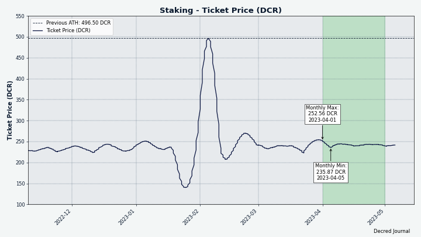

# مجلة ديكريد لشهر أبريل 2023

_الصورة: بدون عنوان بواسطة Exitus@_

أبرز أحداث شهر أبريل:

* شهدت منصة المبادلات اللامركزية لديكريد إصدارًا جديدًا رئيسيًا تسهم عن حوالي 8 أشهر من أعمال التطوير، بما في ذلك تداول ETH و USDC.
* تم إصدار النسخة 1.7.7 من برنامج ديكريد الأساسي، والذي يتميز بالتحسينات وإصلاحات الأخطاء بالإضافة إلى ميزة ta التي تسمح لمستخدمي Decrediton بالتصويت على معاملات الإنفاق الفردية.
* نشر إصدار جديد آخر من مرحل البيسون العديد من التحسينات على واجهة المستخدم و الإعداد.

المحتويات:

* [إصدار النسخة 1.7.7 للبرنامج الأساسي](#إصدار-النسخة-1.7.7.-للبرنامج-الأساسي)
* [إصدار النسخة 0.6.0 لمنصة المبادلات اللامركزية لديكريد](#إصدار-النسخة-0.6.0-لمنصة-المبادلات-اللامركزية-لديكريد)
* [إصدار النسخة 0.1.7 لمرحل البيسون](#إصدارالنسخة-0.1.7-لمرحل-بيسون)
* [التطوير](#التطوير)
* [الأشخاص](#الأشخاص)
* [الإدارة و الحوكمة](#الإدارة-و-الحوكمة)
* [الشبكة](#الشبكة)
* [الانتشار](#الانتشار)
* [الفعاليات](#الفعاليات)
* [وسائل الإعلام](#وسائل-الإعلام)
* [مناقشات المجتمع](#مناقشات-المجتمع)
* [الأسواق](#الأسواق)
* [الخارجية ذات الصلة](#الخارجية-ذات-الصلة)

## إصدار النسخة 1.7.7 للبرنامج الأساسي

مميزات [إصدار النسخة ](https://twitter.com/decredproject/status/1648190102802161671)1.7.7:

* حصلت **dcrd** على بعض التحسينات لاستخدام نطاق ترددي أقل قليلاً ووحدة المعالجة المركزية في سيناريوهات معينة.
* حصلت **dcrwallet** على العديد من إصلاحات الأخطاء وتحسينات الأداء لوضع التحقق البسيط من الدفع وشراء التذاكر والخلط. على وجه الخصوص، يفيد هذا المحافظ كثيرة الاستخدام التي تحتوي على العديد من المعاملات.
* حظيت **ديكريديتون** على التصويت لمعاملات TSpend الفردية، مع إعادة تصميم طرق عرض المشغل لتثقيف المستخدم أثناء تحميل المحفظة، وإعادة تصميم عروض تريزور، والتحديث إلي النسخة 0.6.0 لمنصة المبادلات اللامركزية لديكريد مع تداول ETH و USDC، والعديد من إصلاحات الأخطاء.
* حظيت **ديكريديتون** على التصويت لمعاملات TSpend الفردية، مع إعادة تصميم طرق عرض المشغل لتثقيف المستخدم أثناء تحميل المحفظة، وإعادة تصميم عروض تريزور، والتحديث إلي النسخة 0.6.0 لمنصة المبادلات اللامركزية لديكريد مع تداول ETH و USDC، والعديد من إصلاحات الأخطاء.

قم بزيارة [إصدار GitHub](https://github.com/decred/decred-binaries/releases) للحصول على قائمة كاملة بالتغييرات والتنزيلات. كما هو الحال دائمًا، نوصي [بالتحقق من الملفات](https://docs.decred.org/advanced/verifying-binaries) قبل التشغيل.

_الصورة: طرق عرض جديدة للمشغل - تعرف على ديكريد أثناء مزامنة المحفظة_

## إصدار النسخة 0.6.0 لمنصة المبادلات اللامركزية لديكريد

أتت النسخة 0.6.0 التي طال انتظارها بحوالي 8 أشهر من أعمال التطوير. التغييرات الرئيسية منذ النسخة 0.5:

* محافظ ETH و ERC-20 والتداول
* تسمح المحافظ الخفيفة المدمجة للبتكوين كاش (BCH) و اللايتكوين (LTC) بتخزين الأموال وتداولها دون تشغيل العقد الكاملة
* يتم استبدال رسوم التسجيل بسندات الإخلاص، وأموال مقفلة زمنيًا يمكن إعادتها إلى المستخدم
* القدرة على الاتصال بخادم منصة المبادلات اللامركزية في وضع العرض فقط
* إعادة تصميم صفحات الأسواق والمحافظ بتخطيطات مختلفة لأحجام شاشات مختلفة
* الروبوت التجريبي لصانع السوق

تغييرات ملحوظة أخرى:

* الضبط اليدوي لإدارة النظراء
* تقديرات الرسوم على صفحات الإرسال
* القدرة على تعطيل محفظة موجودة
* أرشفة بيانات الطلبات القديمة
* وضع الطلبات بسرعة أكبر
* عرض الطلبات الأخيرة على صفحة الأسواق
* العديد من التحسينات والإصلاحات في دعم Electrum ودعم الإيثيريوم وتتبع الطلبات والعرض التقديمي والإبلاغ عن الأخطاء وتقدير الرسوم والترجمات والمزيد

هناك 3 طرق للحصول على منصة المبادلات اللامركزية لديكريد:

* كجزء من [محفظة ديكريديتون](https://github.com/decred/decred-binaries/releases) (يتم دمجها بالكامل، ولا يوجد تطبيق منفصل للتشغيل، وموقعة بواسطة مفتاح إصدار  ديكريد `Decred Release`)
* تطبيق `dexc` المستقل من [إصدار البرامج الأساسية](https://github.com/decred/decred-binaries/releases) (المزيد من خيارات وحدة المعالجة المركزية ونظام التشغيل، موقعة بواسطة مفتاح إصدار ديكريد `Decred Release`)
* تطبيق `dexc المستقل من الإصدار الخاص [لمنصة المبادلات اللامركزية لديكريد](https://github.com/decred/dcrdex/releases) (يحتوي على بنية أكثر ملاءمة لنظام الويندوز مع رمز صينية النظام بدون نافذة طرفية، موقعة من قبل مطوري DEX)

يرجى أخذ الوقت الكافي لقراءة [الإخطارات المهمة](https://github.com/decred/dcrdex/releases/tag/v0.6.0) للتعرف على تفاصيل التداول غير الاحتجازي نظير لنظير.

نصائح:

* تحقق من إرشادات الفيديو الجديدة حول [إعداد منصة المبادلات اللامركزية في ديكريديتون ](https://www.decredmagazine.com/setting-up-dcrdex-0-6-in-decrediton/)و [إعداد محافظ مدمجة خفيفة لـ LTC و BCH و ](https://www.decredmagazine.com/setting-up-dcrdex-native-wallets-btc-bch-ltc/)BTC والمزيد على [@DecredTV](https://www.youtube.com/@DecredTV/videos).
* يمكن أن تكون محفظة LTC المدمجة بطيئة عند بدء التشغيل لأنها تبحث عن عقدة تدعم مرشحات الكتل المدمجة. يمكن للمستخدمين الانتقال إلى صفحة محفظة منصة المبادلات اللامركزية، والنقر على Litecoin -> Settings -> Manage Peers، وإضافة نظير يدويًا [من هذه القائمة](https://gist.github.com/chappjc/d0f26b12258f8531bb78b37f38d080a0) للمساعدة في تعزيز العملية.
* يمكن [تفعيل](https://twitter.com/blockchainbuck/status/1655933747064360967) روبوت صانع السوق عن طريق تشغيل عميل منصة المبادلات اللامركزية بعلم `--experimental` واختيار "صنع السوق" من رمز قائمة الهامبرغر. تأكد من رفع "oracle weight". يساعد الروبوت على إضافة السيولة ولكن يجب استخدامه بحذر أثناء اعتباره تجريبيًا.

_ الصورة: تحديث عرض التداول في النسخة 0.6.0 لمنصة المبادلات اللامركزية لديكريد_

_الصورة: تحديث عرض المحفظة في النسخة 0.6.0 لمنصة المبادلات اللامركزية لديكريد_

## إصدار النسخة 0.1.7 لمرحل البيسون:

لقد وصل الإصدار الجديد 4 أسابيع فقط منذ إصدار مرشح الإصدار 1 للنسخة 0.1.6. تغييرات ملحوظة في الإصدار  النهائي للنسخة 0.1.7 :

* تم تحسين تدفقات التشغيل بفضل الدعوات الجديدة الممولة مسبقًا والدعوات المدفوعة مسبقًا المستندة إلى الخادم مع الإعداد الآلي للمحفظة
* يؤدي النقر بزر الماوس الأيمن فوق اسم مستخدم إلى فتح قائمة، مما يجعل عملية تقديم البقشيش أسهل بكثير
* زر اقتراح  لتبادل المفاتيح بين مستخدمين (أي تقديم واحد إلى الآخر)
* إشعارات واجهة المستخدم للمشاركات الجديدة والتعليقات الجديدة على المشاركات الحالية
* إرسال واستقبال DCR على السلسلة (يمكن استخدامه لسحب DCR من مرحل البيسون)
* تحسين و إصلاح سلوك التصفح
* قائمة بجميع الوظائف الخاصة
* تجربة مستخدم أفضل لإضافة الملفات إلى المشاركات
* يمكن فتح الملفات المستلمة مباشرة من مرحل بيسون
* تحسين  مُثبّت macOS، التطبيق موقّع وموثّق
* مزيد من التفاصيل في قسم تطوير [مرحل البيسون](#bison-relay) أدناه
* مزيد من التفاصيل في قسم تطوير Bison Relay أدناه

احصل على أحدث إصدارات ثنائية على [GitHub](https://github.com/companyzero/bisonrelay/releases). يمكن الآن [التحقق](https://docs.decred.org/advanced/verifying-binaries) من تنزيلات مرحل البيسون بفضل التواقيع المضافة التي تم إجراؤها بواسطة نفس المفتاح الذي يوقع إصدارات ديكريد `Decred Release <release@decred.org>` ببصمة الإصبع `F516ADB7A069852C7C28A02D6D897EDF518A031D`).

تحقق من إرشادات التثبيت و إرشادات البقشيش لتجنب المشكلات الشائعة في تلقي البقشيش. يمكنك العثور على المزيد من إرشادات فيديو مرحل البيسون على [@DecredTV](https://www.youtube.com/@DecredTV/videos).

_الصورة: النسخة 0.1.7 لمرحل البيسون_

_ الصورة: بقشيش أوبرا قيد العمل في مرحل البيسون_

## التطوير

ما لم يُذكر خلاف ذلك، فإن العمل المَذْكُور هنا يشتمل على حالة "الدمج إلى الرئيسي". وهذا يعني أن العمل قد تم استكماله ومراجعته ودمجه في كود المصدر الذي يمكن للمستخدمين المتقدمين [بناءه وتشغيله](https://medium.com/@artikozel/the-decred-node-back-to-the-source-part-one-27d4576e7e1c)، ولكنه ليس متاحًا بعد في ثنائيات الإصدار للمستخدمين العاديين.

### dcrd

_[dcrd](https://github.com/decred/dcrd) هو تطبيق عقدة كامل يعمل على تشغيل شبكة ديكريد من نظير إلى نظير حول العالم._

تم تحميل التغييرات السابقة إلى [إصدار النسخة 1.7.7](https://github.com/decred/dcrd/releases/tag/release-v1.7.7):

* زيادة الحد الأدنى من إصدار Go إلى 1.17 لوحدات النظير [`peer`](https://github.com/decred/dcrd/commit/0d375e0738e5995b1c3beb303a654aefe76e4a64) و [`addrmgr`](https://github.com/decred/dcrd/commit/235233906177b5c429f0e1297cc05bafb9d60b15) لتمكين تحسينات Go Toolchain مثل [تقليم الرسم البياني للوحدة](https://go.dev/ref/mod#graph-pruning) و[تحميل الوحدة البطيئة](https://go.dev/ref/mod#lazy-loading). توفر وحدات النظير [`peer`](https://github.com/decred/dcrd/tree/8f3e249555544ff8f1991d055da1e910dbd5a88b/peer) و [`addrmgr`](https://github.com/decred/dcrd/tree/8f3e249555544ff8f1991d055da1e910dbd5a88b/addrmgr) أساسًا متينًا لبناء البرامج التي تتحدث إلى شبكة ديكريد.
* زيادة إصدار [بروتوكول](https://github.com/decred/dcrd/commit/ad501373e203aeff56e8f7f699ab442f8706694e) النظير إلى النظير الذي تستخدمه وحدة `peer` لعدم استخدام رسالة الرفض `reject` (شرحناها في عدد [-نوفمبر](202211.md#dcrd) issue)).
* إصلاح التخزين المؤقت [لمخزون](https://github.com/decred/dcrd/pull/3074) النظراء الآخرين (تحسين حركة المرور الصغيرة).
* تحسين [اختيار عناوين النظراء](https://github.com/decred/dcrd/commit/32e98be286deb3104352f81fe8c1147c1f158e29) وتخفيف الاستخدام المفرط لوحدة المعالجة المركزية في سيناريوهات شبكة التجارب.
* تم تحديث تنسيق الكود وبناء النصوص و README لـ [Go 1.20](https://github.com/decred/dcrd/pull/3087).
* تم التحديث إلى أحدث وحدة `sys` (تفاعل منخفض المستوى مع نظام التشغيل) لدعم البناء على OpenBSD مع معالجات [RISC-V](https://en.wikipedia.org/wiki/RISC-V) ذات 64 بت.
* تمت إضافة جميع التغييرات المحملة عكسيا إلى فرع الإصدار بدلاً من مجرد زيادة أرقام [إصدار الوحدة](https://github.com/decred/dcrd/commits/release-v1.7) في ملف go.mod. هذا يجعل البناء من فرع الإصدار [أسهل](https://github.com/decred/dcrd/pull/3083) لبعض المطورين.

تم دمج التغييرات في الإصدار الرئيسي نحو الإصدارات المستقبلية:

* التعريفات المضافة للأصوات القادمة بالإجماع لتغيير [تجزئة إثبات العمل](https://github.com/decred/dcrd/pull/3089) إلى [BLAKE3](https://en.wikipedia.org/wiki/BLAKE_(hash_function)#BLAKE3) و[لتخفيض مكافآت كتلة إثبات العمل](https://github.com/decred/dcrd/pull/3090). سيتم توثيق هذه التغييرات بشكل رسمي أكثر في [مقترحات تغيير ديكريد](https://github.com/decred/dcps) DCP-11 و DCP-12، على التوالي. تضيف التعريفات المعلومات الأساسية فقط مثل وصف التصويت والاختيارات وتواريخ الصلاحية. سيتم إضافة كود تنفيذ التغييرات الحقيقية بشكل منفصل.
* تنفيذ [تصويت الإجماع DCP-12](https://github.com/decred/dcrd/pull/3092). إذا تم تمريره، سيتغير تقسيم المكافأة إلى 1٪ لإثبات العمل و 89٪ لإثبات الحصة و 10٪ للخزينة.
* تمت إضافة وظيفة [لإنشاء مفتاح خاص](https://github.com/decred/dcrd/pull/3096) باستخدام مصدر مخصص للإنتروبيا. يسمح وجود مثل هذه الوظيفة في dcrd بإزالة الازدواجية من حزم ديكريد الأخرى.
* إعادة هيكلة وتنظيف الكود.
* تمت زيادة إصدارات العديد من الوحدات النمطية إلى رقم الإصدار إلى قيمة جديدة وفريدة من نوعها لتمكين تشذيب الرسم البياني للوحدة النمطية Go عبر قاعدة الكود.

### dcrwallet

_[dcrwallet](https://github.com/decred/dcrwallet) هو خادم محفظة تستخدمه تطبيقات سطر الأوامر والمحفظة الرسومية._

التحميل العكسي للتغييرات  إلى إصدار النسخة 1.7.7:

* تمت إضافة [خيار `watchlast`](https://github.com/decred/dcrwallet/pull/2196) للحد من العناوين التي تتم مشاهدتها في البداية ، مما يفيد المحافظ الكبيرة التي تحتوي على العديد من العناوين القديمة.
* إزالة [حساب الرصيد](https://github.com/decred/dcrwallet/pull/2203) غير الضروري عند استخدام المشتري الآلي للتذاكر. هذا يحسن أداء المحافظ الأكثر نشاطًا.
* تم إصلاح حالة الحافة حيث يتم إلغاء شراء التذكرة بسبب تغيير سعر التذكرة، مما يؤدي إلى [عدم اكتشاف](https://github.com/decred/dcrwallet/pull/2212) بعض معاملات المحفظة.
* تم تنفيذ طريقة أسرع [لتحديد مخرجات المعاملات العشوائية غير المنفقة](https://github.com/decred/dcrwallet/pull/2202) (المعروفة أيضًا باسم "العملات") المستخدمة لإنشاء معاملات جديدة
* تجنب إجراء [تغيير صغير في المزيج](https://github.com/decred/dcrwallet/pull/2218) بحيث لا يتم ملء الحساب غير المخلوط بهذه المخرجات الصغيرة جدًا بحيث لا يمكن خلطها، والمغرية جدًا للإنفاق معًا. "تغيير المزيج" عبارة عن نواتج خاصة لمعاملات المزيج التي يتم إنشاؤها عندما لا يتم [تقسيم](https://math.stackexchange.com/a/58558) مقدار DCR المرسل إلى المزيج بالتساوي على فئة المزيج. على سبيل المثال، انظر إلى [هذا المزيج](https://dcrdata.decred.org/tx/a87479a31814f2f08513df76ea4dcc438de9f12b04bfba89c77dd960db169656): 3.2189 DCR تدخل في المزيج وتشمل المخرجات 17 ناتجًا من فئة المزيج القياسي 0.1678 DCR (بإجمالي 2.8521 DCR) و 7 مخرجات "تغيير" ذات حجم أصغر (بإجمالي 0.3666 DCR). وفقًا لموقع [mix.decred.org](https://mix.decred.org/)، فإن تغيير المزيج ليس مجهولاً ويمكن استخدامه للإضرار بخصوصية عمليات الخلط. يمكن لـ dcrwallet إخفاء هوية مثل هذا التغيير عن طريق خلطه بعناية، ولكن لا يمكن القيام بذلك لتغيير مخرجات أصغر من 0.00264314 DCR (أصغر فئة مزيج من 0.00262144 DCR بالإضافة إلى الرسوم الافتراضية). بدلاً من إنشاء مثل هذه المخرجات الصغيرة التي لا ينبغي استخدامها على أي حال، يتم تحويل قيمتها إلى رسوم المعاملة.

تم دمج التغييرات في الفرع الرئيسي `master` نحو الإصدارات المستقبلية:

* تنظيف وتبسيط واجهة برمجة التطبيقات العامة [للكود الداخلي مزود خدمة التصويت](https://github.com/decred/dcrwallet/pull/2227). هذا جزء من دمج كود مزود خدمة التصويت في مستودع [vspd](https://github.com/decred/vspd) لتسهيل الصيانة وإعادة استخدام الكود.
* تمت إزالة [إسترجاع التذكرة](https://github.com/decred/dcrwallet/pull/2230) من عميل مزود خدمة التصويت. هذا يزيل تبعية كبيرة من كود مزود خدمة التصويت، وهو غير ضروري على أي حال لأن الإلغاء تلقائي منذ [DCP-9](https://github.com/decred/dcps/blob/master/dcp-0009/dcp-0009.mediawiki).
* إصلاح عدم احترام [الحد الأقصى لرسوم مزود خدمة التصويت](https://github.com/decred/dcrwallet/pull/2228) المحددة في التكوين والتي يتم تجاوزها دائمًا بقيمة مشفرة تبلغ 0.2 DCR. كما تم أيضًا نقل التحقق من صحة تهيئة مزود خدمة التصويت  إلى كود بدء التشغيل بحيث يتم الإبلاغ عن الخيارات غير الصالحة في وقت مبكر.
* صيانة الكود مع إصلاح واحد للتزامن.

### dcrctl

_[dcrctl](https://github.com/decred/dcrctl) هو عميل سطر أوامر لـ dcrd و dcrwallet._

* تحديثات الإصدار 1.7.7: التبديل إلى أحدث كود بناء للجيتهوب، Go 1.20، و أحدث كود ل dcrwallet.

### Decrediton

_[Decrediton](https://github.com/decred/decrediton) ديكريديتون هو تطبيق محفظة لسطح المكتب كامل الميزات مع ميزة التصويت مدمجة، وميزة الخلط ب StakeShuffle، والشبكة البرقية، والتداول على منصة المُبادلات اللامركزية DEX للديكريد، والمزيد. يتم تشغيلها مع سلسلة الكتل كاملة أو بدونها (وضع التحقق البسيط من الدفع SPV)._

التغييرات التي تمت إعادة تحميلها إلى إصدار النسخة 1.7.7:

### Decrediton

_[Decrediton](https://github.com/decred/decrediton) ديكريديتون هو تطبيق محفظة لسطح المكتب كامل الميزات مع ميزة التصويت مدمجة، وميزة الخلط ب StakeShuffle، والشبكة البرقية، والتداول على منصة المُبادلات اللامركزية DEX للديكريد، والمزيد. يتم تشغيلها مع سلسلة الكتل كاملة أو بدونها (وضع التحقق البسيط من الدفع SPV)._

التغييرات التي تمت إعادة تحميلها إلى إصدار النسخة 1.7.7:

* 34 [ايداعا](https://github.com/decred/decrediton/compare/release-v1.7.6...release-v1.7.7) مع جميع الإصلاحات والتحسينات التي تم إجراؤها منذ [نوفمبر ](202211.md#decrediton)2022.
* تم التحديث لتضمين [الإصدار 0.6.0 لمنصة المبادلات اللامركزية لديكريد](https://github.com/decred/decrediton/pull/3857).
* تم إصلاح الخلل في [نموذج الإرسال](https://github.com/decred/decrediton/pull/3855) الذي تسبب في الإبلاغ عن مبلغ DCR خاطئ أو إرساله في بعض السيناريوهات.
* إصلاح التأخير عند [فتح المحفظة](https://github.com/decred/decrediton/pull/3846) عن طريق إزالة الجلب غير الضروري لمعلومات مزود خدمة التصويت.
* تم إصلاح [حالة التحميل](https://github.com/decred/decrediton/pull/3846) في طرق إجراء عرض التذاكر المُدارة/غير المُدارة وإضافة الاختبارات إليها. تساعد هذه العروض في ضمان تسجيل جميع التذاكر لدى مزودي خدمة التصويت ودفع رسومها.
* إصلاح [عرض ETH على أنها غير مدعومة](https://github.com/decred/decrediton/pull/3861) في نافذة منصة المبادلات اللامركزية. تمت إعادة بناء [ثنائيات](https://github.com/decred/decred-binaries/releases/tag/v1.7.7) الإصدار بسرعة لتضمين هذا الإصلاح.

راجع [ملاحظات الإصدار](https://github.com/decred/decred-binaries/releases/tag/v1.7.7#decrediton-v177) للحصول على ملخص لجميع التغييرات منذ الإصدار 1.7.6.

### vspd

_[vspd](https://github.com/decred/vspd) هو برنامج خادم لتشغيل موفر خدمة التصويت. يصوت موفر خدمة التصويت نيابة عن مستخدميه على مدار الساعة طوال أيام الأسبوع ولا يمكنه سرقة الأموال._

* تم التحديث لأحدث [الوحدات النمطية لديكريد](https://github.com/decred/vspd/pull/378) من dcrd و dcrwallet.
* صيانة الكود.

### الشبكة البرقية

_[dcrlnd](https://github.com/decred/dcrlnd) هو برنامج عقدة الشبكة البرقية لديكريد. تتيح الشبكة البرقية إجراء معاملات فورية ومنخفضة التكلفة._

* تم الحمل العكسي [للتغيير](https://github.com/lightningnetwork/lnd/pull/5047) من المصدر الرئيسي للشبكة البرقية لديكريد lnd لجلب [الوظائف المتعلقة بالحساب](https://github.com/decred/dcrlnd/pull/178)  (استيراد حساب، استيراد مفتاح عام واحد، حسابات قائمة، إلخ). علاوة على ذلك، تمت إضافة بعض الميزات الأخرى: إنشاء حسابات محفظة إضافية، وتصدير مفاتيح خاصة فردية، وإنفاق مخرجات معاملات محددة غير منفقة. الهدف من هذه التغييرات هو السماح للمستخدمين بإنشاء حساب يمكن من خلاله استخراج المفاتيح الخاصة الفردية ثم إنفاقها. يستخدم هذا في مرحل البيسون لتمويل الدعوات المدفوعة مسبقًا.
* تم التحديث لأحدث [الوحدات النمطية لديكريد](https://github.com/decred/dcrlnd/pull/179) من dcrd و dcrwallet.
* تمت إضافة طلب استدعاء إجراء عن بُعد للحصول على معلومات حول [معاملة](https://github.com/decred/dcrlnd/pull/180)  تنتمي إلى محفظة الشبكة البرقية.

### cspp

_[cspp](https://github.com/decred/cspp)  هو خادم لتنسيق عمليات خلط العملات باستخدام بروتوكول CoinShuffle++. وهو غير احتجازي، أي لا يحتفظ بأي أموال._

* أفاد جيك يوكوم-بيات  (Jake Yocom-Piatt) رئيس المشروع أن [الخلط نظير لنظير](https://twitter.com/exitusdcr/status/1655095852392935425) سيحل في النهاية محل الخادم المركزي الذي ينسق عمليات الخلط حاليًا.

### DCRDEX

_[DCRDEX](https://github.com/decred/dcrdex) هي منصة مبادلات غير احتجازية للمُبادلات غير الموثوقة، مدعومة بالمقايضات الذرية._

تغييرات العميل التي تم دمجها في إصدار النسخة 0.6.0:

* عدم وضع عنوان خادم الويب في صديرة HTTP لسياسة أمن المحتوى (CSP) إذا كان [العنوان ](https://github.com/decred/dcrdex/pull/2287)IPv6. هذا إصلاح لحل بديل [لخلل في Safari](https://bugs.webkit.org/show_bug.cgi?id=201591) الذي أدى إلى [عدم تحميل](https://github.com/decred/dcrdex/issues/1652) بعض الرموز بشكل صحيح.
* تم إصلاح [تجاوز](https://github.com/decred/dcrdex/pull/2285) عدد صحيح محتمل عند حساب تأكيدات معاملة الإيثيريوم.
* بعض الإصلاحات الصغيرة.

يتم دمج كافة التغييرات الأخرى أدناه في الفرع الرئيسي ‘Master’ تجاه الإصدارات المستقبلية.

العميل:

* عرض إشعار عند [الفشل في الاتصال](https://github.com/decred/dcrdex/pull/2288) بالمحفظة.
*  الإعداد المسبق لاستخدام عنوان [`127.0.0.1`](https://github.com/decred/dcrdex/pull/2283) IPv4 عندما لا يكون محددًا في التكوين. يساعد هذا على تلبية بروتوكول [سياسة أمن المحتوى](https://developer.mozilla.org/en-US/docs/Web/HTTP/CSP) بطريقة تعمل أيضًا على التغلب على خطأ في Safari. يتجنب الإعداد الافتراضي الجديد مشكلة حيث لا يتم تحميل بعض [الأيقونات](https://github.com/decred/dcrdex/issues/1652) بشكل صحيح بسبب فشل CSP.
* تمت إضافة [ملاحظات الإصدار](https://github.com/decred/dcrdex/pull/2276) للنسخة 0.6.0.
* العرض الدائم [لمطابقات السوق](https://github.com/decred/dcrdex/pull/2307) الأخيرة. في السابق تم مسح قائمة التطابقات الأخيرة في بعض المواقف مثل إعادة تشغيل العميل.
* عرض [سعر الطلب](https://github.com/decred/dcrdex/pull/2281) حتى إذا تم تصغير مربع الطلب. معلومات  السعر (السعر) مهمة و يجب أن تكون مرئية دون الحاجة إلى النقر لتوسيع تفاصيل الطلب.
* تمت إزالة [الأصفار المتتابعة](https://github.com/decred/dcrdex/pull/2278) الزائدة من بعض عناصر واجهة المستخدم وتحسين التناسق العام لتنسيق الأرقام.
* تذكر [حجم الشمعة](https://github.com/decred/dcrdex/pull/2284) الأخير المحدد عبر عمليات إعادة تحميل الصفحة. تم تغيير حجم الشمعة الافتراضي من 5 دقائق إلى ساعة واحدة.
* تتبع تأكيدات [معاملة الاسترداد](https://github.com/decred/dcrdex/pull/2049) وإعادة تجربتها إذا لزم الأمر. هذا يعالج حالة الحافة عندما يكون مجمع الذاكرة ممتلئًا لدرجة أن المعاملات التي تدفع رسومًا أقل يتم التخلص منها وعدم تعدينها. يجب إعادة هذه المعاملات لاحقًا، ربما برسوم أعلى.
* تمت إضافة [ملاحظات الإصدار](https://github.com/decred/dcrdex/pull/2276) للنسخة 0.6.0.
* إصلاح عدم تزامن [أسعار](https://github.com/decred/dcrdex/pull/2280) السوق على الشريط الجانبي الأيسر.
* إصلاح التعامل مع [إشعارات](https://github.com/decred/dcrdex/pull/2286) الخادم التي قد تأتي قبل بدء أسواق العميل.
* تم إصلاح  خطئين صغيرين في واجهة المستخدم.

الإيثيريوم:

* عرض المزيد من [أنواع المحافظ](https://github.com/decred/dcrdex/pull/2207) ذات المغزى، مثل "استدعاء الإجراء عن بعد" لمحافظ ETH التي يدعمها موفرو بيانات الطرف الثالث و "توكن الإيثيريوم" لمحافظ USDC.
* [المستندات](https://github.com/decred/dcrdex/pull/2289) المحدّثة: تمت إزالة موفر ArchiveNode.io الذي تم إغلاقه، ونصح بعدم استخدام Flashbots.net، وإضافة نصائح لاستعادة المحفظة.
* إعادة صياغة الكود [لتدوير السندات](https://github.com/decred/dcrdex/pull/2275) لدمج سندات وحدات الإيثير بسهولة أكبر.
* تم التغيير إلى معاملات البث [لجميع موفري RPC](https://github.com/decred/dcrdex/pull/2266) بدلاً من مزود واحد مفضل فقط. يجب أن يساعد هذا في ضمان انتشار المعاملات بسرعة وتعدينها.
* تمت إضافة [رابط دليل التكوين](https://github.com/decred/dcrdex/pull/2261) إلى النماذج المتعلقة بإعداد المحفظة. كما سيتم عرض حقلين لمدخلات موفري RPC بدلاً من واحد. من المهم أن يفهم المستخدمون أن فشل المزود قد يؤدي إلى خسارة الأموال كما يجب تهيئة اثنين أو أكثر من مقدمي الخدمة للحصول على احتياطي دائم.
* تمت إضافة أداة مطور للحصول على [تقديرات الغاز](https://github.com/decred/dcrdex/pull/2050) لعمليات منصة المبادلات اللامركزية الحرجة على الإيثيريوم. سيساعد على إضافة توكنات جديدة أو إصدارات تعاقدية جديدة.

اللايتكوين:

* نقل [إصلاحات حجم المعاملات](https://github.com/decred/dcrdex/pull/2299) من [ltcd](https://github.com/ltcsuite/ltcd/pull/25) للتعامل مع بعض معاملات SegWit الكبيرة بشكل غير عادي.
* تم [اعتماد](https://github.com/ltcsuite/ltcd/issues/17#issuecomment-1506234416) بعض [كود فك تشفير](https://github.com/ltcsuite/ltcd/issues/17#issuecomment-1201877368) MimbleWimble المكتوب لمنصة المبادلات اللامركزية لديكريد في [ltcd](https://github.com/ltcsuite/ltcd/pull/31)!

الزيكاش:

* تم استبدال [استخدامات أساليب العنوان](https://github.com/decred/dcrdex/pull/2237) التي تم إلغاؤها لزيكاش. هذا يتطلب إصدار zcashd 5.4.2 أو أحدث.
* تمت إضافة [بنية أساسية](https://github.com/decred/dcrdex/pull/2250) [أولية](https://github.com/decred/dcrdex/pull/2317) للتجمعات المحمية، وهي ميزة لزيكاش تتيح الأرصدة والمعاملات الخاصة. ستقتصر المرحلة الأولى من تكامل خصوصية الزيكاش على حماية/إلغاء حماية الأموال الخاصة، والإرسال من العناوين المحمية الخاصة إلى العناوين المحمية العشوائية أو الشفافة. سيتم تضمين العناوين الشفافة فقط في نشاط المبادلة مبدئيًا.
* تم إصلاح تهجئة [الزيكاش](https://github.com/decred/dcrdex/pull/2300) عبر مصدر البرنامج.

DigiByte:

* تم اختبار مقايضات DigiByte على [الشبكة الرئيسية](https://github.com/decred/dcrdex/pull/1993#issuecomment-1487571640)، وتم [دمج](https://github.com/decred/dcrdex/pull/1993) دعم DGB ومن [المقرر إصدارها](https://github.com/decred/dcrdex/pull/1993#issuecomment-1511304826) في الإصدار القادم 0.6.1.
* يعد تشغيل عقدة DigiByte الكاملة حاليًا الخيار الوحيد لأنه يعتمد على إصدار 0.17 ل Bitcoin Core  ولا يدعم [المرشحات المدمجة](https://github.com/decred/dcrdex/issues/1992#issue-1486990539) (لذلك لا يمكن لمنصة المبادلات اللامركزية تنفيذ محفظة مدمجة خفيفة لـ DGB). يتم  [إجراء](https://github.com/DigiByte-Core/digibyte/pull/63) تحديث كبير لميزات الإصدار 22 من Bitcoin Core، لذا قد يتغير هذا في المستقبل.
* فيما يلي بعض الحقائق، أعرب أعضاء مجتمع DGB عن اهتمامهم مرة أخرى في نوفمبر 2022 وكانوا [نشطين](https://twitter.com/JohnnyLaw2021/status/1587801707790180353) على [التويتر](https://twitter.com/dgb_ycagel/status/1599944772403466241) و منصة المبادلات اللامركزية على [الجيتهوب](https://github.com/decred/dcrdex/pull/1993#issuecomment-1459097459). أنشأ chappjc@ تصحيحًا يعمل على تحسين أداء عقدة DigiByte على شبكة الاختبار لتسهيل عملية التطوير. في مارس 202 ، وافق أصحاب حصص ديكريد على دمج DGB كجزء من [الاقتراح الأخير لتطوير منصة المبادلات اللامركزية](https://proposals.decred.org/record/ca6b749) .
* علما بأن هذه المرحلة هي مجرد دعم برمجي في منصة المبادلات اللامركزية، فإن فتح أسواق DGB وتشغيلها مهمة [منفصلة](https://github.com/decred/dcrdex/pull/1993#issuecomment-1456932743).

الخادم:

* تمت إزالة متطلبات بدء تشغيل الخادم الخاصة بتهيئة رسوم [ تسجيل ](https://github.com/decred/dcrdex/pull/2293)DCR، وإزالة الكود المرتبط بشكل وثيق برسوم DCR. أصبح هذا الكود القديم قديمًا بسبب القدرة على دفع رسوم التسجيل في أصول أخرى غير DCR. الآن مع الانتقال إلى سندات الإخلاص، تم إهمال دعم رسوم تسجيل الأصول المتعددة ، لكنه سيظل متاحًا لبعض الوقت.
* إصلاح خطأ [التحقق من رصيد](https://github.com/decred/dcrdex/pull/2312) بدء التشغيل والذي يمكن أن يؤدي إلى إلغاء حجز أحد الطلبات عن طريق الخطأ.

مسائل أخرى:

* يتم إجراء العديد من التغييرات الأقل إثارة ولكنها ضرورية خلف الكواليس لإضافة أصول جديدة بسلاسة أكبر، مثل إعادة تشكيل الكود، والتنظيف، وتحسين كود البناء، وغيرها.
* سيتم نقل بعض [الإصلاحات](https://github.com/decred/dcrdex/pull/2323) المذكورة أعلاه إلى الإصدار القادم 0.6.1.
* تم الانتهاء من دمج Umbrel. تم [تحديث](https://github.com/decred/umbrel-app-store/pull/3) متجر تطبيقات Umbrel Community لديكريد بأحدث صورة Docker بما في ذلك إصدار 0.6.0 لمنصة المبادلات اللامركزية. تمت [إضافة](https://github.com/decred/dexweb/pull/34) روابط تثبيت Umbrel إلى [dex.decred.org](https://dex.decred.org/). أخيرًا، تم [الإعلان](https://twitter.com/decredproject/status/1648439889678192640) عن إصدار 0.6 لمنصة المبادلات اللامركزية على Umbrel على التويتر.
* [يُنصح](https://twitter.com/chappjc/status/1645982431571329024) مشغلي عقد اللايتكوين بتحديث عقدهم إلى الإصدار 0.21 وتمكين عوامل تصفية الكتلة المدمجة. في الوقت الحالي، يصعب على محفظة التحقق البسيط من الدفع المدمجة العثور على نظيرها الأول نظرًا لعدم وجود العديد من العقد الكاملة العامة التي تخدم المرشحات المدمجة. يمكن لمستخدمي منصة المبادلات اللامركزية لديكريد حل هذه المشكلة عن طريق إضافة أقران يدويًا [من هذه القائمة](https://gist.github.com/chappjc/d0f26b12258f8531bb78b37f38d080a0).

قيد التطوير:

* يتم [تحصيص ](https://github.com/decred/dcrdex/issues/2264)DCR مباشرة في محفظة DEX. وقد أدى ذلك إلى محاولة [لاستخراج المزيد من كود مزود خدمة التصويت](https://github.com/decred/vspd/pull/382) من dcrwallet إلى مستودع vspd لتسهيل إعادة الاستخدام.
* بوت صانع السوق. هذا جهد كبير يتضمن مهام مثل واجهة سطر الأوامر، و إطار الاختبار الذي يحاكي ظروف السوق المختلفة، ومراقبة أداء التداول، وفصل أرصدة الروبوت، والمزيد.
* [بوت المراجحة](https://github.com/decred/dcrdex/pull/2005). كلا الروبوتين جزء من [اقتراح روبوتات منصة المبادلات اللامركزية](https://proposals.decred.org/record/8b1ceda) الأخير.
* حزم DEX  [كتطبيق سطح مكتب](https://github.com/decred/dcrdex/pull/1957). سيؤدي هذا إلى تطويق واجهة المستخدم الرسومية في [WebView](https://github.com/webview/webview) بحيث تتصرف منصة المبادلات اللامركزية مثل تطبيق سطح المكتب العادي مع النافذة الخاصة بها، وأيقونة شريط المهام/النظام، والإشعارات، وما إلى ذلك، بحيث لا يحتاج المستخدمون إلى تحميل التطبيق في متصفح عادي. هذا جزء من [اقتراح التغليف](https://proposals.decred.org/record/ae7c4fe). الحزم المتخصصة لـ [Debian](https://github.com/decred/dcrdex/pull/2308) و [macOS](https://github.com/decred/dcrdex/pull/2333) قيد التطوير أيضًا. مطلوب مختبرين! انضم إلى دردشة [#dexdev](https://chat.decred.org/#/room/#dexdev:decred.org) واسأل عن كيفية المشاركة.
* [إدماج Polygon](https://github.com/decred/dcrdex/issues/2319) ([جزء من اقتراح تطوير العميل](https://proposals.decred.org/record/ca6b749)). Polygon هو حل تحجيم من الطبقة الثانية للإيثيريوم مع تنفيذ أسرع ورسوم أقل. كانت تُعرف سابقًا باسم Matic Network (توكن MATIC).
* نسخة جديدة من [العقد الذكي ل ETH للمقايضات](https://github.com/decred/dcrdex/pull/2038) التي لديها القدرة على [خفض الرسوم](https://github.com/decred/dcrdex/pull/1426) بشكل كبير.
* سندات الإخلاص الممولة في [ETH](https://github.com/decred/dcrdex/pull/2223).
* بدأ البحث الأولي لدمج [Firo](https://github.com/decred/dcrdex/pull/2270). عُرفت Firo سابقًا باسم Zcoin.

_الصورة: DigiByte قادمة إلى منصة المبادلات اللامركزية لديكريد_

_الصورة: Umbrel هي طريقة أخرى للحصول على منصة المبادلات اللامركزية لديكريد_

### decred.org

_[dcrweb](https://github.com/decred/dcrweb) هو الكود المصدري لموقع decred.org._

* تحديثات [لإصدار النسخة ](https://github.com/decred/dcrweb/pull/1115)1.7.7.

### مُرَحِّل بيسون

_[مُرَحِّل بيسون](https://github.com/companyzero/bisonrelay) هي منصة وسائط اجتماعية جديدة مع حماية قوية ضد الرقابة والمراقبة والإعلان، مدعومة من الشبكة البرقية لديكريد._

تم اختبار الميزات الجديدة لأول مرة من قبل المجتمع في مرشح الإصدار 1 الذي كشف عن بعض الأخطاء التي تم إصلاحها في الإصدار 0.1.7 النهائي.

التغييرات الشائعة في واجهة المستخدم الرسومية وتطبيقات واجهة سطر الأوامر في الإصدار 0.1.7:

* تمت إضافة تتبع التقدم و [المحاولة التلقائية لإرسال بقشيش ](https://github.com/companyzero/bisonrelay/pull/176)DCR.

تغييرات تطبيق واجهة المستخدم الرسومية في الإصدار 0.1.7:

* تمت إضافة أمر قائمة [لاقتراح](https://github.com/companyzero/bisonrelay/pull/182) مستخدم واحد لتبادل المفاتيح مع مستخدم آخر. يسمح ذلك بربط مستخدمين معًا من خلال التوسط في تبادل المفاتيح.
* جعل [الملفات المتلقاة](https://github.com/companyzero/bisonrelay/pull/190) تفاعلية: يحتوي كل ملف على رمز يشير إلى نوعه، والنقر فوق الملف يفتحه ببرنامج تم تكوينه في نظام التشغيل.
* تمت إضافة أداة تشرح مجال  [التكلفة](https://github.com/companyzero/bisonrelay/pull/196) عند مشاركة المحتوى (وهو السعر الذي سيدفعه المستخدمون لتنزيل المحتوى).
* تمت إضافة قائمة السياق عند [النقر بزر الماوس الأيمن](https://github.com/companyzero/bisonrelay/pull/198) على اسم المستخدم  في أماكن مختلفة مثل الدردشة أو قائمة المستخدمين أو الموجز أو التعليقات المنشورة. يوفر هذا وصولاً أسرع إلى البقشيش والإجراءات الأخرى على المستخدمين.
* تحسين واجهة المستخدم  [لتضمين الملفات في المنشورات](https://github.com/companyzero/bisonrelay/pull/203). فشل العديد من المستخدمين في الضغط على زر `+` لإضافة ملف، مما أدى إلى مشاركة بدون صور. تمت إزالة زر `+` المربك وإضافة الملفات الآن في إجراء واحد.
* تمت إضافة صفحة تسرد جميع [المشاركات الخاصة](https://github.com/companyzero/bisonrelay/pull/204).
* تمت إضافة [دعوات مدفوعة](https://github.com/companyzero/bisonrelay/pull/191) مسبقًا. عند استيراد مثل هذه الدعوة، ستمول DCR الخاصة به تلقائيًا محفظة مرحل بيسون للمستخدم المدعو.
* تمت إضافة إدارة حساب المحفظة (إنشاء الحسابات وإدراجها في القائمة) والقدرة على [إرسال واستقبال DCR من خلال المعاملات على السلسلة](https://github.com/companyzero/bisonrelay/pull/191) (وليس الشبكة البرقية). مع هذا يمكن أن يعمل مُرحِّل بيسون كمحفظة DCR بسيطة ، ليصبح ثالث محفظة واجهة المستخدم الرسومية مدعومة بشكل نشط بعد ديكريديتون و منصة المبادلات اللامركزية.
* تمت إضافة [الدعوات المستندة إلى الخادم](https://github.com/companyzero/bisonrelay/pull/194)  (المعروفة أيضًا باسم الدعوات المستندة إلى RV) والتي تتجنب الحاجة إلى تبادل ملفات الدعوة. وبدلاً من ذلك، يتم دفع الدعوة إلى الخادم ويتم دفع تنزيلها مسبقًا بواسطة المرسل. يجوز للمستخدم المستلم جلب هذه الدعوة دون أن يكون لديه أي أموال للدفع للخادم. إذا كانت الدعوة تحتوي على أي DCR، فيمكن استبدالها لتشغيل محفظة مستخدم جديد لاستخدام مُرحِّل بيسون.
* تمت إضافة [تدفق الإعداد الآلي](https://github.com/companyzero/bisonrelay/pull/197) باستخدام الدعوات المستندة إلى الخادم. يقوم بتنفيذ جميع مهام إعداد المحفظة إذا تم إعطاؤه مفتاح دعوة مسبق الدفع مناسب. تشمل المهام: جلب الدعوة، واسترداد الأموال، وفتح قنوات الشبكة البرقية الصادرة والداخلية، وإجراء تبادل مبدئي للمفاتيح مع المستخدم الذي أنشأ الدعوة.
* تم إصلاح  إدخال [سطر جديد](https://github.com/companyzero/bisonrelay/pull/195) غير المرغوب فيه عند إرسال مفتاح Enter والمؤشر ليس في نهاية السطر.كما تم إصلاح إرسال رسائل فارغة.
* تم إصلاح بعض [نماذج الإدخال](https://github.com/companyzero/bisonrelay/pull/198) التي لا تستجيب لمفتاح الإدخال، والذي عادةً ما يرسل النموذج.
* تم إصلاح وتحسين [سلوك تمرير](https://github.com/companyzero/bisonrelay/pull/207) الدردشة. لن تتسبب الرسائل الجديدة بعد الآن في التمرير لأسفل وفقدان موضع التمرير. بعد المغادرة والعودة إلى الدردشة، سيتم التمرير إلى الأسفل كما هو الحال في Element. كما تمت إضافة ميزة الإنتقال إلى أول رسالة غير مقروءة.
* تم إصلاح رسالة الخطأ عند استخدام ميزة [Query Route](https://github.com/companyzero/bisonrelay/pull/200) للتحقق مما إذا كان هناك مسار صالح لعقدة الشبكة البرقية المستخدمة بواسطة خادم مُرحِّل البيسون.

تم العثور على مشكلات تطبيق واجهة المستخدم الرسومية في إصدار المرشح للإصدار 0.1.7 1 وتم إصلاحه في الإصدار 0.1.7 النهائي:

* إضافة [إخطارات](https://github.com/companyzero/bisonrelay/pull/217) للوظائف الجديدة والتعليقات الجديدة على الوظائف القائمة. إذا كانت هناك عناصر غير مقروءة، فسيتم تغيير الأيقونات الموجودة على الشريط الجانبي الرئيسي، وسيتم وضع علامة على عناصر الموجز بـ “منشور جديد” أو “التعليقات الجديدة”، وستظهر التعليقات الجديدة بالخط العريض حتى ينقر المستخدم بعيدًا عن المنشور.
* تم تحديث [الأيقونات](https://github.com/companyzero/bisonrelay/pull/218) لنظامي التشغيل macOS و Windows، وتغيير اسم التطبيق من "bruig" إلى “bisonrelay".
* تم إصلاح زر إنتقال [منشور جديد](https://github.com/companyzero/bisonrelay/pull/210) إلى صفحة خاطئة.
* تم إصلاح صعوبة رؤية [الأيقونات](https://github.com/companyzero/bisonrelay/pull/220) في الوضع المظلم.
* تم إصلاح تصرف علامة تبويب المحادثات  كما لو أن [المستخدم ليس لديه جهات اتصال حتى الآن](https://github.com/companyzero/bisonrelay/issues/211) وإظهارها لموجه الدعوة الأولي، حتى يتزامن التطبيق مع الشبكة. تم استبدال هذا بتحميل الرسوم المتحركة أثناء تحميل دفتر العناوين.

تغييرات تطبيق واجهة سطر الأوامر في الإصدار 0.1.7:

* تمت إضافة خيار إلى الأمر `/channels` لإظهار [معلومات إضافية](https://github.com/companyzero/bisonrelay/pull/208) لقنوات الشبكة البرقية.
* تم إصلاح المحاولة لتحميل شهادة TLS عندما يكون مسارها فارغًا في عرض "طلب سعة الاستلام".
* تحديث [نص البناء](https://github.com/companyzero/bisonrelay/pull/209) وإزالة بقايا ZKC (سلف مُرحِّل بيسون).

تم دمج التغييرات في الفرع الرئيسي `master` نحو الإصدارات المستقبلية:

* تم إصلاح الانهيار المحتمل لتطبيق واجهة سطر الأوامر عند إدراج أرصدة [قناة الشبكة البرقية](https://github.com/companyzero/bisonrelay/pull/222) باستخدام الأمر`/ln channels`.
* تم تحديث [أنماط](https://github.com/companyzero/bisonrelay/pull/225) تطبيق واجهة المستخدم الرسومية للمنشورات الجديدة وإشعارات التعليقات الجديدة.

مسائل اخرى:

* [سيرسل](https://matrix.to/#/!GHnoHXSgkVAsUknRUg:decred.org/$FKG9OTiG-WZO7vRl_-VhS9ST_EhvjpWOLeQjs9qvcyc?via=decred.org&via=matrix.org&via=zettaport.com) بوت بقشيش أوبرا رسائل إلى المستخدمين عندما تفشل في إرسال إكرامية. بهذه الطريقة، سيتم إخطار المستلمين بالمشكلات المتعلقة بقنوات الاستقبال الخاصة بهم.
* سيتم تحديث الدردشات الجماعية العامة الحالية لدعم العديد من المشرفين واستخدام روبوت الإعداد الجديد للمشرف. يجب على أعضاء هذه الغرف التحديث إلى الإصدار 0.1.6 أو أكثر.
* سيعمل [روبوت المشرف](https://matrix.to/#/!GHnoHXSgkVAsUknRUg:decred.org/$X75ujNeIVZdUSDf2HUwdlIzbXVzYsfKj-HnkWMJwpZk) الجديد على تبسيط عملية الإعداد من خلال مساعدة المستخدمين الجدد على اكتشاف القنوات العامة ودعوتهم تلقائيًا، وإزالة انتظار الدعوة اليدوية.
* بعد الانتهاء من الإعداد، يخطط المطورون للعمل على [الصفحات والمتاجر وتطبيقات الأجهزة المحمولة](https://matrix.to/#/!GHnoHXSgkVAsUknRUg:decred.org/$oyK-Bcj3BRUfWvIcJcR4-gx-pOC7BbFRHm9KStEFmTk?via=decred.org&via=matrix.org&via=zettaport.com).

_الصورة: يمكن الآن استخدام مُرحِّل بيسون كمحفظة DCR بسيطة_

_الصورة: أصبح إكرام المستخدمين في مُرحِّل بيسون أسهل بكثير_

_الصورة: روبوت ودود يساعد على اكتشاف الدردشات العامة_

### مسائل أخرى

* اكتسبت أداة بناء [الإصدار](https://github.com/decred/release) الخاصة بديكريد [الصفة السائدة للبناء](https://github.com/decred/release/pull/90) ستستخدمها منصة المبادلات اللامركزية لديكريد مع إدماج أيقونة نظام الويندوز. كما تمت إضافة دعم OpenBSD[ على 64-](https://github.com/decred/release/pull/88)bit ARM. تم استطلاع Windows[ على 64-bit ARM](https://github.com/decred/release/commit/542b45cf593c8c6dbfa1d2d92e67bf7c21e36f0e) ولكن تمت إزالته بسبب تبعية واحدة لا تدعمه بعد.
* تم تحديث برنامج التثبيت التلقائي [لإصدار ديكريد](https://github.com/decred/decred-release)  باستخدام التجزئة والتوقيعات لإصدار النسخة 1.7.7.
* تم [تحديث](https://github.com/decred/dcrtest/pull/11) إطار عمل اختبار إدماج [dcrtest](https://github.com/decred/dcrtest/pull/11) إلى أحدث وحدات Go من dcrd.
* خلال [جلسة](https://matrix.to/#/!zefvTnlxYHPKvJMThI:decred.org/$qjda4fjr5oQaDICsfnfhSRMmmoJtYx67zBrrRQqzyrk?via=decred.org&via=matrix.org&via=planetdecred.org) نسخ البناء لإصدار النسخة 1.7.7، واجه مطورو الإصدار عدم تطابق في تصميمات go-ethereum لمنصة المبادلات اللامركزية لديكريد، والتي تبين أنها ["خلل في المترجم"](https://github.com/golang/go/issues/59500) (إنه إنجاز كبير للوصول إلى خطأ في المترجم!) وآخر خطأ في كود بناء Go. أدى التحقيق إلى تأخير الإصدار لبضعة أيام، وفي النهاية تم إصلاح كلا الخطأين وسيتم تحميل الإصلاحات في Go 1.21 و Go 1.20.4.

## الأشخاص

نرحب بالمساهمين الجدد لأول مرة:

* Jay (مؤلف [مجلةديكريد](https://www.decredmagazine.com/author/jay/)، [@h3la1](https://twitter.com/h3la1) على التويتر)

تهانينا لـ [@norwnd](https://github.com/norwnd) على الحصول على تصريح متعاقد ديكريد!

إحصائيات المجتمع اعتبارًا من 3 مايو (مقارنة بـ 3 أبريل):

* متابعو [التويتر](https://twitter.com/decredproject): 53,077 (-112)
* المشتركين في [ريديت](https://www.reddit.com/r/decred/): 12,701 (+23)
* مستخدمي غرفة الدردشة general# على [الماتريكس](https://chat.decred.org/): 763 (+2)
* مستخدمي [الديسكورد](https://discord.gg/GJ2GXfz): 61,573 (+17)، تم التحقق منهم للنشر:  921 (-2)
* مستخدمي [التيليجرام](https://t.me/Decred): 2,508 (-111)
* المشتركين في [اليوتيوب](https://www.youtube.com/decredchannel): 4,630 (+0)، المشاهدات: 228.1 ألف (+1,600)

## الإدارة و الحوكمة

في أبريل، تلقت [الخزينة](https://dcrdata.decred.org/treasury) الجديدة 7,958 DCR بقيمة 161 ألف دولار بمتوسط سعر أبريل البالغ 20.22 دولار. تم إنفاق 3,087 DCR لدفع أجور المتعاقدين، بقيمة 62 ألف دولار بمتوسط سعر أبريل

تمت الموافقة على [معاملة إنفاق الخزينة](https://dcrdata.decred.org/tx/5aa2142e4dce72d28fb3cef3e7d1b565a90655304fdd284016fb585cc96431e9) بأغلبية 6,900 صوتًا بنعم و 54٪ من الإقبال، وتم تعدينها في 16 أبريل. كان لديها 23 ناتجًا تسدد مدفوعات للمتعاقدين، تتراوح من 7 DCR إلى 1,102 DCR. من المحتمل أن يتم دفع معظم DCR مقابل عمل فبراير، وبسعر صرف الفواتير البالغ 24.03 دولارًا أمريكيًا، فإن الإنفاق على المعاملة يبلغ حوالي 74 ألف دولار.

اعتبارًا من 9 مايو، بلغ الرصيد المشترك للخزينة [القديمة](https://dcrdata.decred.org/address/Dcur2mcGjmENx4DhNqDctW5wJCVyT3Qeqkx) و[الجديدة](https://dcrdata.decred.org/treasury) 85,6305 DCR (14.5 مليون دولار أمريكي بسعر 16.96 دولارًا أمريكيًا).

_الصورة: رصيد خزينة ديكريد ب DCR_

_الصورة: رصيد خزينة ديكريد بالدولار الأمريكي_

تم تقديم اقتراحين جديدين في أبريل:

* [Decred Vanguard](https://proposals.decred.org/record/0a1b782) هي مبادرة جديدة لتمويل فريق تواصل بقيادة المجتمع بميزانية قدرها 46,784 دولارًا. سيكون هناك ما يصل إلى 25 وظيفة مدفوعة الأجر للمشاركين لتلقي 100 دولار شهريًا، بالإضافة إلى 100 دولار جوائز للمساهمات الجيدة من داخل وخارج فريق Vanguard.
* قدم BTC-ECHO، وهو موقع إخباري ألماني للعملات الرقمية، [اقتراحًا](https://proposals.decred.org/record/49e373b) يطلب 9,500 دولار للمقالات التي ترعاها 2 والترويج ذي الصلة، والتي تمتد على مدى 3 أشهر.

[اقتراح](https://proposals.decred.org/record/a8501bc) @jy-p لتغيير توزيع المكافآت بحيث يحصل معدني إثبات العمل على 1٪ فقط وتمت الموافقة على تغييرات خوارزمية التجزئة بنسبة 97٪ من الأصوات بنعم ونسبة إقبال ب 62٪. قام bee@ [بتجميع](https://github.com/decredcommunity/proposals/blob/master/proposals/a8501bc/qna.md) الأسئلة والأجوبة الأكثر شيوعًا من التعليقات النشطة للغاية على الاقتراح. تم بالفعل [دمج](https://github.com/decred/dcrd/pull/3092) أعمال التطوير اللازمة لتنفيذ تغيير DCP-12 لإتقانها.

تمت الموافقة على [اقتراح](https://proposals.decred.org/record/609db9e) من joegruff@ لتطوير دعم ديكريديتون لأجهزة Ledger بنسبة 89٪ من الأصوات نعم ونسبة إقبال ب 39٪.

راجع [العدد ](https://blockcommons.red/politeia-digest/issue059/)59 لموجز بوليتيا للحصول على مزيد من التفاصيل حول مقترحات الشهر.

## الشبكة

أعلى مستويات جديدة على الإطلاق في أبريل:

* معدل تحصيص DCR: 9,882,748.69 DCR
* وحدات ديكريد المخلوطة و غير المنفقة: 9,380,774.51 DCR
* عقد الشبكة البرقية : 192
* قنوات الشبكة البرقية: 392
* سعة الشبكة البرقية: 163.63 DCR

**معدل التجزئة**: تم افتتاح [معدل التجزئة](https://dcrdata.decred.org/charts?chart=hashrate&scale=linear&bin=day&axis=time) لشهر أبريل عند 94 Ph/s~ وأغلق عند ~ 76 Ph/s، ووصل إلى القاع عند 62 Ph/s وبلغت ذروته عند 94 Ph/s على مدار الشهر.

_الصورة: معدل تجزئة ديكريد._

توزيع 72 Ph/s من معدل الهاش التي [أبلغت](https://miningpoolstats.stream/decred) عنها المجمعات في 1 مايو: Poolin بنسبة 64٪%، و F2Pool بنسبة 30٪، و AntPool بنسبة 6٪، و CoinMine بنسبة 0.3٪.

توزيع  1,000 كتلة تم [تعدينها](https://miningpoolstats.stream/decred) بالفعل بحلول 1 مايو: Poolin بنسبة  63٪، و F2Pool بنسبة  28٪، و AntPool بنسبة 6٪، و BTC.com بنسبة 2.5٪، و CoinMine بنسبة  0.2٪.

_الصورة: التوزيع التاريخي لمجمع التجزئة_.

**التحصيص**: تراوح [سعر التذكرة](https://dcrdata.decred.org/charts?chart=ticket-price&axis=time&visibility=true-true&mode=stepped) بين  236-253 DCR.

_الصورة: استقر سعر التذكرة بشكل غير عادي في أبريل_

بلغ [المبلغ المقفل](https://dcrdata.decred.org/charts?chart=ticket-pool-value&scale=linear&bin=day&axis=time) 9.75-9.88 مليون DCR، مما يعني أن 64.6-65.3 من العرض المتاح [شارك](https://dcrdata.decred.org/charts?chart=stake-participation&scale=linear&bin=day&axis=time) في إثبات الحصة.

_الصورة: وحدات ديكريد المغلقة في التذاكر مستمرة في الصعود._

**مقدم خدمة التصويت**: قام [الـ 14 من مقدمي خدمة التصويت المدرجين](https://decred.org/vsp/) بإدارة ما يقرب من 6,960 (-240) تذكرة حية، والتي كانت تمثل  17.1٪ من مجموع التذاكر (0.5٪-) اعتبارًا من 1 مايو.

أكبر الرابحين في مارس هم ubiqsmart.com (280 تذكرة أو 155٪+) و dcrhive.com (+225 تذكرة أو 25٪+).

أكبر الرابحين في أبريل كان vspd.bass.cf (+165 تذكرة أو + 27٪). تم [شطب](https://github.com/xaur/decred-news/blob/master/journal/202304.md#ecosystem) اثنين من مقدمي خدمة التصويت.

_الصورة: توزيع التذاكر التي يديرها مقدمو خدمة التصويت._

**العقد**: رصد [جهاز رسم الخرائط لديكريد](https://nodes.jholdstock.uk/user_agents) 163 و 171 عقدًا ل dcrd على مدار الشهر. تمت مشاهدة إصدارات 166 عقدة في 1 مايو:النسخة 1.7.5 - 28%، النسخة 1.7.1 - 21%، نسخة بناءات التطوير 1.8.0 - 13%، النسخة 1.7.2 - 12%، النسخة 1.7.7 - 11%، النسخة 1.7.0 - 5%، النسخة 1.7.4 - 4%، أخرى - 7%.

_الصورة: التوزيع التاريخي لنسخة dcrd، بيانات من nodes.jholdstock.uk. كانت البيانات قبل يناير 2023 غير مكتملة._

تراوحت حصة [العملات المخلوطة](https://dcrdata.decred.org/charts?chart=coin-supply&zoom=jz3q237o-la8vk000&scale=linear&bin=day&axis=time&visibility=true-true-true) بين 61.0-61.8٪. وقد تفاوتت [الكمية المخلوطة](https://dcrdata.decred.org/charts?chart=privacy-participation&bin=day&axis=time) بشكل يومي ما بين 303 و 502 ألف DCR.

_الصورة: إجمالي الوحدات المخلوطة آخذ في الارتفاع _

_الصورة: زيادة ["حجم المعاملات المعدل"](https://coinmetrics.io/introducing-adjusted-estimates/) كما هو محدد بواسطة مقاييس العملات، في كل من DCR والدولار الأمريكي_

شهد مستكشف [الشبكة البرقية](https://ln-map.jholdstock.uk/) لديكريد 196 عقدة (+21)، 399 قناة (+45) بسعة إجمالية تبلغ 163 DCR (+34)، اعتبارًا من 1 مايو. هذه الإحصائيات مختلفة لكل عقدة. على سبيل المثال، أبلغت عقدة @karamble عن 193 عقدة (+18)، 429 قناة (+53) و 174 DCR (+39) سعة في نفس اليوم 1 مايو.

تجاوزت الشبكة البرقية لديكريد الشبكة البرقية للايتكوين في عدد العقد وعدد القنوات، وهو يقترب من السعة وفقًا [لبيانات الشبكة البرقية](https://1ml.com/litecoin/) للايتكوين من 1ML.com.

_الصورة: تشهد الشبكة البرقية الخاصة بديكريد المزيد من العقد_

أنشأ @bochinchero مخططات توضح [أرصدة أفضل عناوين التعدين](https://github.com/bochinchero/decred-pub/blob/main/MiningRewardBalance/MiningAddresses.md) مقابل تاريخ أسعار DCR والأحداث الرئيسية مثل تواريخ إطلاق ASIC وقوائم CEX. في حين أنه لا يقدم الكثير من التحليل أو التعليق من تلقاء نفسه، فإنه يساهم في البحث الجماعي لمشاركة المعدنين في القمع الخبيث لأسواق DCR، وهي الحجة الرئيسية [للاقتراح](https://proposals.decred.org/record/a8501bc) الأخير لتقليل مكافآت التعدين إلى 1٪ وتغيير خوارزمية التعدين.

_ الصورة: الرصيد المشترك لأفضل 22 عنوان تعدين مقابل تاريخ أسعار DCR _

## النظام البيئي

الخدمات المكتسبة أو المدرجة:

* [توجد](https://twitter.com/decredproject/status/1648190102802161671) أزواج جديدة من DCR/USDC و BTC/USDC و ETH/BTC في [dex.decred.org](https://dex.decred.org/). يجب تثبيت نسخة إصدار عميل DEX 0.6.0 أو أعلى لإنشاء محافظ ETH و USDC والتداول.
* تمت [إضافة](https://github.com/decred/dcrweb/pull/1114) [مُرحِّل بيسون](https://bisonrelay.org/) إلى روابط [المجتمع](https://decred.org/community/) على decred.org.
* تمت [إضافة](https://github.com/decred/dcrweb/pull/1124) [Trocador.app](https://trocador.app/) إلى [منصات المبادلات](https://decred.org/exchanges/)، وهو مبادل ميتا يعثر على عروض أسعار من خدمات مختلفة ثم يقوم بعرضها للمستخدم عبر واجهات برمجة التطبيقات الخاصة بهم. يعمل بدون JavaScript وعبر Tor (لديهم حتى عنوان URL Onion). ميزة مفيدة في Trocador هي أنه يصنف احتمالية قيام كل مزود خلفي بفرض KYC/AML بعد الحقيقة. هذا هو الخطر الأكبر في منصات المبادلات الفورية بالإضافة إلى الاحتيال المباشر. بالإضافة إلى ذلك، قد تسدد Trocador بعض المبلغ المتبادل إذا فشل مزود الواجهة الخلفية لسبب ما في إرسال الأموال أو تقديم بعض الأدلة على أمر قانوني يبرر ذلك. تم إدراج DCR في [فبراير ](https://twitter.com/TrocadorApp/status/1625487712601112576)2023.

_الصورة: تجد Trocador.app أفضل الأسعار وتبتعد عن البائعين وتحذر من مخاطر KYC_

خدمات مفقودة أو ملغاة:

* تمت [إزالة](https://github.com/decred/dcrwebapi/pull/173) مزود خدمة التصويت [dcrpool.ibitlin.com](https://dcrpool.ibitlin.com) من [قائمة مزودي خدمة التصويت](https://decred.org/vsp/) بعد أن أصبح غير متصل بالإنترنت منذ 28 فبراير، آخر مرة أبلغ فيها عن 4 تذاكر حية. كان مزود خدمة التصويت هذا يخدم منذ يناير 2021 وصوت على ما يقرب من 1,200 تذكرة مع نسبة تفويت ب 0.75٪. بلغت الرسوم 1٪ من مكافأة التذكرة.
* تمت إزالة مزود خدمة التصويت [dcrvsp.dittrex.com](https://dcrvsp.dittrex.com) من [مزودي خدمة التصويت](https://decred.org/vsp/)، وقد شوهد آخر مرة عبر الإنترنت في 4 أبريل بتذكرتين مباشرتين. أوضح المالك على GitHub أن مزود خدمة التصويت متقاعد. كانت تخدم منذ أبريل 2021 وصوتت 500 تذكرة تقريبًا، وفقدت 0.6 ٪ فقط منها. هذا واحد لديه رسوم 5٪.
* تمت [إزالة](https://github.com/decred/dcrweb/pull/1124) [Metal Pay](https://github.com/decred/dcrweb/pull/1124) من [منصات المبادلات](https://decred.org/exchanges/)، وتم تعطيل أوامر الشراء لـ DCR كما ورد في [إصدار مارس]( https://github.com/xaur/decred-news/blob/master/journal/202303.md#ecosystem).
* تمت [إزالة](https://github.com/decred/dcrweb/pull/1119) [GloBee](https://globee.com/) من [منصات المبادلات](https://decred.org/exchanges/). معالج الدفع الذي أسسته شركة Monero's fluffypony وغيرها، أصبح الآن غير متصل بالإنترنت. لم نتمكن من العثور على أي إعلان إغلاق على موقع [التويتر](https://twitter.com/GlobeeCom) أو في أي مكان آخر. آخر نظرة سريعة للموقع تم إجراؤها في [يناير](https://web.archive.org/web/20230131111854/https://globee.com/).
* [dcrstats.com](https://dcrstats.com/) غير متصلة بالإنترنت منذ أوائل أبريل تقريبًا، كانت لوحة معلومات لإحصاءات الشبكة شائعة في السنوات الأولى من ديكريد.

أخبار أخرى:

* تم [اتهام](https://reason.com/2023/04/19/sec-sues-crypto-exchange-bittrex-shortly-after-it-announces-its-leaving-u-s-markets/) Bittrex من قبل لجنة الأوراق المالية والبورصات الأمريكية بتشغيل منصة مبادلات غير مسجلة. جاء ذلك بعد وقت قصير من إعلان [مارس]( https://github.com/xaur/decred-news/blob/master/journal/202303.md#ecosystem ) أن Bittrex ستغادر الأسواق الأمريكية. حتى الآن لم نر معلومات تشير إلى أنها قد تؤثر على المستخدمين غير الأمريكيين لشركة [Bittrex Global](https://global.bittrex.com/trade/dcr-usdt).

[التغييرات](https://matrix.to/#/!lDZCzVQjFoJsXMPkvr:decred.org/$jO-Hc1bk0SGjON0JrJvLwzLNeF6pzg-bAgwXT5lv-BA) القادمة على [منصات الدردشة](https://decred.org/community/) لديكريد:

* تمت إزالة جميع جسور الدردشة باستثناء الجسر بين الماتريكس و مُرحِّل بيسون.
* من المرجح أن يتم إغلاق ديسكورد بصفة دائمة. بدون المحتوى المرتبط، قد تصبح مدينة أشباح، وبدون وجود عدد كافٍ من المشرفين الذين يراقبونها سيتم الاستيلاء عليها من قبل مرسلي المحتوى غير المرغوب فيه أو المحتالين.
* ستستمر [ديكريد](https://t.me/Decred) تيليغرام في العمل كالمعتاد بنفس القواعد ولكن بدون الجسر (تم [تعطيله]( https://github.com/xaur/decred-news/blob/master/journal/202112.md#outreach) في عام 2021 بسبب كمية كبيرة من الرسائل غير المرغوب فيها).
* تمت إعادة تسمية غرفة التيليغرام [Decred Trading](https://t.me/DecredTrading) ب [Bison Time](https://t.me/BisonTime) وتمت إزالة العلامة التجارية لديكريد.
* تم فصل غرفة التيليغرام [Decred Support](https://t.me/DecredSupport)، وقفلها، والآن يتم إعادة توجيهها إلى Matrix # support.
* ستخضع [#trading](https://matrix.to/#/!lDZCzVQjFoJsXMPkvr:decred.org/) على Matrix لقواعد الإشراف نفسها مثل غرف الدردشة الأخرى.
* [#support](https://matrix.to/#/!xUNvyzkFgiMjhvPbIi:decred.org/) على Matrix هو الدردشة *الوحيدة* التي يراقبها المطورون بنشاط. سيتم [إعادة توجيه](https://matrix.to/#/!xUNvyzkFgiMjhvPbIi:decred.org/$oC3cXW1RvLqONPyIiqOBm1Oo5tMTbbQ3ndntruO8aTw) جميع طلبات الدعم إلى دردشة Matrix هذه.

انضم إلى دردشة النظام البيئي [#ecosystem](https://chat.decred.org/#/room/#ecosystem:decred.org) لمتابعة تحديثات النظام البيئي لـديكريد.

تحذير: ليس لدى مؤلفي مجلة ديكريد أي فكرة عن مصداقية أي من الخدمات أعلاه. يرجى إجراء بحثك الخاص قبل الوثوق بمعلوماتك الشخصية أو أصولك لأي كيان.

## الإنتشار

إنجازات Monde PR

* عرض إعلان إخباري واحد
* عرضت ستة فرص إعلامية

تأمين مواضع الوسائل الإعلامية التالية:

* مقال في [Invezz](https://invezz.com/news/2023/04/17/decred-announces-dcrdex-0-6-with-support-for-ethereum-and-usdc-swaps/) حول إطلاق النسخة 0.6 لمنصة المبادلات اللامركزية لديكريد. تم نشر المقال في 5 منشورات بما في ذلك [Bitcoin Insider](https://www.bitcoininsider.org/article/212399/decred-announces-dcrdex-06-support-ethereum-and-usdc-swaps).
* مقال في [CoinJournal](https://coinjournal.net/news/decred-launches-dcrdex-0-6-the-latest-version-of-its-decentralized-exchange/) حول إطلاق النسخة 0.6 لمنصة المبادلات اللامركزية لديكريد. تم نشر المقال في ثلاث منشورات بما في ذلك [Crypto News BTC](https://cryptonewsbtc.org/2023/04/17/decred-launches-dcrdex-0-6-the-latest-version-of-its-decentralized-exchange/).
* ظهر @jy-p في بودكاست [Entangled Things Podcast](https://www.entangledthings.com/all-episodes/episode/7bef6428/quantum-and-cryptocurrency-with-jake-yocom-piatt) يتحدث عن تهديد الحوسبة الكمية للعملات الرقمية المشفرة.
* ظهر @jy-p في برنامج [MineYourBiz Show](https://www.youtube.com/watch?v=aTaEul34RsA) وهو يتحدث عن الوضع الحالي لمشروع ديكريد وميزات الخصوصية الجديدة الخاصة به.

## الفعاليات

**الفعاليات القادمة:**

@arij و @khalidesi ذاهبان إلى [GITEX AFRICA](https://www.gitexafrica.com/home) كزوار وممثلين عن Decred. هذا حدث تقني كبير سيقام في مراكش، المغرب، من 31 مايو إلى 2 يونيو. إذا كان أي شخص يخطط للحضور أو لديه اقتراحات، فيرجى الانضمام إلى غرفة الدردشة على الماتريكس [#events](https://chat.decred.org/#/room/#events:decred.org).

## وسائل الإعلام

**مقالات مختارة:**

* [هل تقدم ديكريد حلولا للمجتمع؟](https://www.decredmagazine.com/decred-offers-solutions-to-society-problems/) بواسطة @Joao
* [يتطور تعدين ديكريد](https://www.decredmagazine.com/decred-mining-evolves/) بواسطة OfficialCryptos@
* [ديكريد مقابل الداش: الحوكمة للجميع!](https://www.decredmagazine.com/decred-vs-dash/) بواسطة @Joao
* [أهم 5 أسباب لانفجار سعر ديكريد](https://www.decredmagazine.com/top-5-reasons-decreds-price-will-explode/) بواسطة @Joao
* [مفارقة الاختيار: اتخاذ قرار بين سلسلة كتل تورينج الكاملة وغير الكاملة](https://www.decredmagazine.com/the-paradox-of-choice-deciding-between-turing-complete-and-non-turing-complete-blockchains/) من قبل BlockchainJew@
* [آليات التصويت والحوافز للحوكمة في المنظمات المستقلة اللامركزية](https://mirror.xyz/0x34ddd9223D9DDb6B56F640824Af6FCC31e1deBF4/T6AUZv8Rn5rlGS9xxQNVzh7QPoo8h2CCWIwU_OYpJmk) من قبل Arhat - دراسة حول حوكمة المنظمات المستقلة اللامركزية، قام المؤلف [بتصحيح](https://twitter.com/0xArhat/status/1650753877430468608) قسم ديكريد ردًا على التعليقات
* [حديث بين المجتمعات! اليوم مع Jose Trejo من مجتمع DigiByte](https://www.decredmagazine.com/inter-community-talk-today-with-jose-trejo-from-the-digibyte-community/) بواسطة @Joao - أول حديث في سلسلة من المحادثات حيث سيجري مؤلفو مجلة ديكريد مقابلات مع أعضاء من مجتمعات العملات الرقمية المشفرة الأخرى

> مهما كانت النتيجة، سيكون العام المقبل أو الذي بعده رحلة ممتعة. إذا كنت هنا من أجل المثل العليا لـ cypherpunk (الابتكار واللامركزية والحلول غير الإحتجازية و التطوير)، فمن الصعب ألا تكون متحمسًا للمستقبل. \[[@OfficialCryptos](https://www.decredmagazine.com/decred-mining-evolves/)\]

**احصائيات مشاركة مجلة ديكريد لشهر أبريل:**

* إجمالي عدد المقالات على مجلة ديكريد: 444
* عدد المشتركين في النشرة الإخبارية: 96
* مجموع الرسائل الإخبارية المرسلة: 16
* الحملات النشطة على وسائل التواصل الاجتماعي: 46
* الحملات المكتملة على وسائل التواصل الاجتماعي: 38
* المشاركات على مواقع التواصل الاجتماعي: 212
* الإعجابات: 1,230
* إعادة التغريدات: 260
* متابعو وسائل التواصل الاجتماعي عبر جميع منصات وحسابات التويتر و الفيسبوك (بما في ذلك [@DecredSociety](https://twitter.com/DecredSociety)): 1,300

**أشرطة الفيديو:**

* [ملخص ديكور - تغيير التعدين، تقسيم الدعم الجديد، اقتراح Cointelegraph، أطنان من تحديثات التطوير!](https://www.youtube.com/watch?v=xW4JzxjYKww) بواسطة @Exitus - متوفر أيضًا [كبودكاست](https://podcasters.spotify.com/pod/pod/show/decred-magazine/episodes/Decred-Recap---Mining-Change--New-Subsidy-Split--Cointelegraph-Proposal--tons-of-Dev-Updates-e21jks5)
* [التحصيص في ديكريديتون - شراء التذاكر بالطريقة السهلة](https://www.youtube.com/watch?v=oaRTDuNVF4Y) بواسطة phoenixgreen@ - متوفر أيضًا [كمنشور نصي](https://www.decredmagazine.com/decrediton-staking-buying-tickets-the-easy-way/)
* [برنامج بقشيش أوبرا - مُرحِّل بيسون](https://www.youtube.com/watch?v=6uSFttopNnk) بواسطة phoenixgreen@ - متوفر  أيضًا [كمنشور نصي](https://www.decredmagazine.com/oprah-tipping-bot-bisonrelay/)
* إعداد الإصدار 0.6 لمنصة المبادلات اللامركزية لديكريد في ديكريديتون بواسطة phoenixgreen@ - متوفر أيضًا [كمنشور نصي](https://www.decredmagazine.com/setting-up-dcrdex-0-6-in-decrediton/)
* [إعداد محافظ منصة المبادلات اللامركزية لديكريد الأصلية (BTC و BCH و LTC)](https://www.youtube.com/watch?v=7eioER2lWmI) بواسطة phoenixgreen@ - متوفر أيضًا [كمنشور نصي](https://www.decredmagazine.com/setting-up-dcrdex-native-wallets-btc-bch-ltc/)

> مع مُرحِّل بيسون، لم تعد المنتج. لطالما كان للمحتوى الخاص بك وآرائك قيمة نقدية، ولكن الاختلاف الرئيسي هنا هو أن القيمة تخص المنشئ، وليس النظام الأساسي. \[[@phoenixgreen](https://www.youtube.com/watch?v=6uSFttopNnk)\]

البث المباشر:

* [ديكريد - تعطيل ASIC نقاش نظير لنظير على وسائل التواصل الاجتماعي بمشاركة ديف كولينز وجيك يوكوم بيات](https://www.youtube.com/watch?v=ZZmq7NVqYBA) بواسطة phoenixgreen@ و Exitus@ انضم إليهما @jy-p و @davecgh - متوفر أيضًا [كملف بودكاست](https://podcasters.spotify.com/pod/show/decred-magazine/episodes/Decred---Bricking-ASICs-and-P2P-Social-Media-discussion-feat--Dave-Collins--Jake-Yocom-Piatt-e21qf1e)
* [ما هي #ديكريد وكيف تحمي #الخصوصية؟](https://www.youtube.com/watch?v=aTaEul34RsA) بواسطة MineYourBiz بمشاركة @jy-p

**المقاطع الصوتية:**

* [الكم والعملة الرقمية المشفرة مع ](https://www.entangledthings.com/all-episodes/episode/7bef6428/quantum-and-cryptocurrency-with-jake-yocom-piatt)Jake Yocom-Piatt بواسطة Patrick Hynds و Ciprian Jichici - حلقة في Entangled Things podcast تناقش معايير التشفير وتهديد الحوسبة الكمومية على سلسلة الكتل. تعرض أيضا على [Apple Podcasts](https://podcasts.apple.com/us/podcast/quantum-and-cryptocurrency-with-jake-yocom-piatt/id1552714727?i=1000607276017) و [Buzzsprout](https://entangledthings.buzzsprout.com/1617373/12580449-quantum-and-cryptocurrency-with-jake-yocom-piatt) ومنصات أخرى.

**الترجمة:**

* [لماذا لا تتوافق الآلة الإفتراضية للإيثيريوم مع ديكريد؟](https://www.decredmagazine.com/why-is-decred-not-evm-compatible/) - [باللغة الصينية](https://github.com/DominicTing/decred-ZH-translations/blob/master/Why%20is%20Decred%20not%20EVM%20compatible%3F.md) بواسطة Dominic@
* [مفارقة الاختيار: الاختيار بين سلسلسة كتل تورينج الكاملة وغير الكاملة](https://www.decredmagazine.com/the-paradox-of-choice-deciding-between-turing-complete-and-non-turing-complete-blockchains/) - [باللغة الصينية](https://github.com/DominicTing/decred-ZH-translations/blob/master/The%20Paradox%20of%20Choice:%20Deciding%20Between%20Turing%20Complete%20and%20Non-Turing%20Complete%20Blockchains.md) بواسطة Dominic@
* حصلت مجلة ديكريد من فبراير إلى مارس على ما مجموعه 3 [ترجمات](https://xaur.github.io/decred-news/) جديدة إلى العربية (@arij و @abdulrahman4) والصينية (@Dominic) والبولندية (@kozel). شكراً لكم جميعا!

**المحتوى الغير إنجليزي:**

* [نظرة عامة عن ديكريد باللغة الكرواتية](https://www.youtube.com/watch?v=xlQH09pzmDw)  بواسطة FIMA@

**مناقشات المجتمع:**

* [منشور](https://twitter.com/exitusdcr/status/1642750459890008065) على مرحل بيسون حول  كيف أن استخدام حسابات المتابعين غير المرغوب فيها على التويتر تؤدي إلى تقليل رؤية الحساب المستهدف
* لقاء حول [مركزية العملات](https://www.reddit.com/r/decred/comments/12d8ake/one_entity_owns_2m_dcr_bad_or_good/)
[تسويق فكرة](https://twitter.com/0x69b9/status/1649089557927804928) ديكريد بواسطة 0x69b9

**مسائل أخرى:**

* اختفت [صفحة علامة ديكريد](https://bitcoinmagazine.com/tags/decred) في مجلة البتكوين. آخر مرة [شوهدت](https://web.archive.org/web/20220119175419/https://bitcoinmagazine.com/tags/decred) مع 4 مقالات. يجب أن تستمر [الروابط المباشرة](https://bitcoinmagazine.com/business/decred-sets-its-sights-decentralization-2018) في العمل.

## الأسواق

في أبريل، تم تداول DCR بين USDT 17.91-25.18 و BTC 0.00061-0.00089. وقد بلغ متوسط السعر اليومي 20.22 دولارًا.

_الصورة: الحجم الشهري لمنصة المبادلات اللامركزية لديكريد بالدولار الأمريكي._

## الخارجية ذات الصلة

واصلت Bitcoin Ordinals في [النمو](https://decrypt.co/138438/bitcoin-transactions-soar-as-ordinals-barrell-past-2-5-million-notch-daily-record)، حيث تم سك أكثر من 2.5 مليون حتى الآن، وبلغت ذروتها 223,000 في يوم واحد، مما زاد من عدد معاملات البتكوين اليومية إلى مستويات لم نشهدها منذ عام 2017. يدور الكثير من نشاط Ordinals الأخير حول معيار BRC-20 جديد لسك التوكنات القابلة للاستبدال في سلسلة.

تم [تفعيل](https://cointelegraph.com/news/ethereum-shapella-upgrade-community-celebrates-as-update-goes-live-on-mainnet) تحديث Ethereum's Shapella على الشبكة الرئيسية، مما سمح لحاملي ETH الذين كانوا يقومون بتحصيص ETH، وبعضها لسنوات، بسحبها أخيرًا من عقد التحصيص.

[أصدرت](https://www.coindesk.com/tech/2023/04/26/circle-unveils-new-method-for-moving-usdc-between-blockchains/) Circle مُصدر العملة المستقرة USDC، تفاصيل طريقة جديدة لنقل الأصول بين سلاسل الكتل بدون جسور "اقفل و عدن" والتي أثبتت أنها هدف كبير للمتسللين - يطلقون عليها اسم "بروتوكول النقل عبر السلسلة" أو CCTP.

تم [اتهام](https://www.coindesk.com/policy/2023/04/17/crypto-exchange-bittrex-violated-federal-laws-sec-charges-in-lawsuit/) منصة مبادلات العملات الرقمية المشفرة Bittrex بانتهاك قوانين الأوراق المالية من قبل لجنة الأوراق المالية والبورصات. يخص الإتهام ستة [توكنات](https://beincrypto.com/sec-6-names-tokens-securities/) على أنها أوراق مالية يجب أن تسجلها Bittrex للتداول: OMG Network (OMG) و Dash (DASH) و Algorand (ALGO) و Monolith (TKN) و NAGA (NGC) و IHT Real Estate Protocol (IHT). [يُنظر](https://twitter.com/lex_node/status/1648027888531423232) إلى تسمية داش كأداة أمنية على أنها تعكس موقفًا عدوانيًا بشكل خاص، ويتم تمويل تطوير داش من خلال مكافآت الكتلة ولا تتوفر (رسميا) على التعدين القبلي.

واصلت Coinbase جهودها للتفاعل مع هيئة الأوراق المالية والبورصات (SEC) والبحث عن توضيح حول كيفية تعريفها للأوراق المالية للعملات الرقمية المشفرة من خلال  [مقاضاة](https://www.theblock.co/post/228047/coinbase-sues-the-sec-for-answer-on-rule-specific-to-digital-assets) هيئة الأوراق المالية والبورصات في محاولة لإجبارها على إعلان معاييرها وتوضيح قراراتها.

[ظهر](https://www.coindesk.com/policy/2023/04/19/sec-chair-gensler-declines-to-say-if-ether-is-a-security-in-contentious-congressional-hearing/) Gary Gensler في جلسة استماع في الكونجرس أجاب فيها على بعض الأسئلة حول نهج SEC، ولكن ليس ما إذا كانت ETH مصنفًة كضمان. كما أصدر مقطع فيديو جديدًا يقارن الأوراق المالية للعملات الرقمية المشفرة بالكلاب التي تنتحل صفة الأسماك الذهبية، بأسلوبه المنحط المميز.

[صوت](https://www.coindesk.com/policy/2023/04/20/eu-parliament-approves-crypto-licensing-funds-transfer-rules/) البرلمان الأوروبي لصالح نظام ترخيص الأسواق في أصول العملات الرقمية المشفرة (MiCA) بنسبة 90٪ من الأصوات وإقبال 97٪، مما يمهد الطريق ليصبح قانونًا في جميع أنحاء الاتحاد الأوروبي في عام 2024. بينما تم [الترحيب](https://www.coindesk.com/policy/2023/04/21/eu-crypto-industry-applauds-mica-but-looks-to-whats-next/) باللوائح التنظيمية من قبل الصناعة من أجل الوضوح الذي ستجلبه، يشعر العديد من المتحمسين لخصوصية العملات الرقمية المشفرة [بخيبة أمل](https://twitter.com/Hermetics_/status/1651414492528492544) لأن استخدام خدمات الخلط سيؤدي إلى تصنيف الأموال على أنها عالية المخاطر. في الوقت نفسه، صوّت البرلمان لصالح تنظيم تحويل الأموال الذي سيتطلب من مشغلي العملات الرقمية المشفرة تحديد عملائهم كخطوة لمكافحة غسل الأموال - كانت أرقام التصويت النهائية 92٪ من الأصوات مع 98٪ من أعضاء البرلمان الأوروبي المؤهلين.

[حُكم](https://www.justice.gov/usao-sdny/pr/silk-road-dark-web-fraud-defendant-sentenced-following-seizure-and-forfeiture-over-34)  على James Zhong، الرجل الذي وجد أنه يمتلك أكثر من 50,000 بيتكوين حصل عليها عن طريق الاحتيال من طريق الحرير من خلال تقديم طلبات سحب متزامنة ، بالسجن لمدة عام ويوم واحد، وتم منح أوامر المصادرة لجميع BTC وما يرتبط بها الأصول التي اشتراها معها، بما في ذلك شركة قابضة عقارية ذات مسؤولية محدودة، وعملات ذهبية وفضية و[عملات  من ](https://en.bitcoin.it/wiki/Casascius_physical_bitcoins)Casascius.

هذا كل شيء لشهر أبريل. شارك بتحديثاتك للإصدار التالي في غرفة الدردشة [#journal](https://chat.decred.org/#/room/#journal:decred.org).

## عن هذا العدد 
  
هذا هو العدد 58 من مجلة صحيفة ديكريد. فهرس جميع الإصدارات والمرايا والترجمات متاح [هنا](https://xaur.github.io/decred-news/).

يتم نقل معظم المعلومات الواردة من أطراف ثالثة مباشرة من المصدر بعد التحقق من الحد الأدنى لصحتها. ليس لدى مؤلفي مجلة صحيفة الديكريد القدرة على التحقق من جميع الادعاءات.رجاء إحذر من أعمال الاحتيال وقم ببحثك الخاص.

الاعتمادات (بالترتيب الأبجدي):

* الكتابة والتحرير: bee و bochinchero و Exitus و jz و karamble و l1ndseymm و phoenixgreen و richardred
* المراجعات والتعليقات: chappjc و davecgh
* صورة العنوان: Exitus
* التمويل: أصحاب حصص الديكريد

النسخة الأصلية لمجلة الديكريد لشهر أبريل 2023 متوفرة على هذا الرابط [هنا](https://xaur.github.io/decred-news/journal/202304).

تمت الترجمة إلى اللغة العربية بواسطة: arij@. قام بالمراجعة abdulrahman4@.
