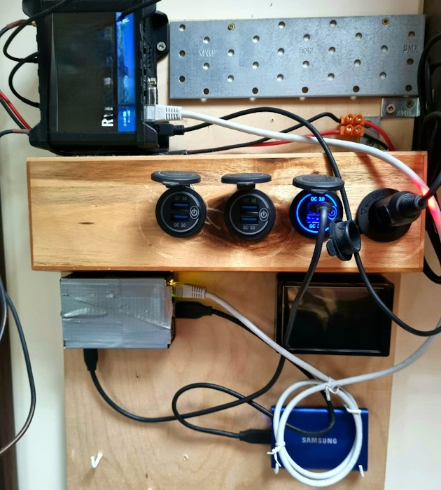
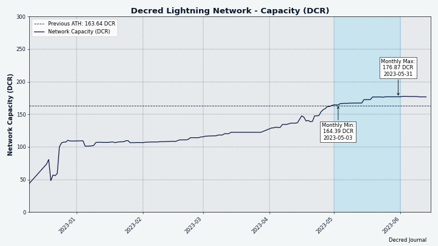
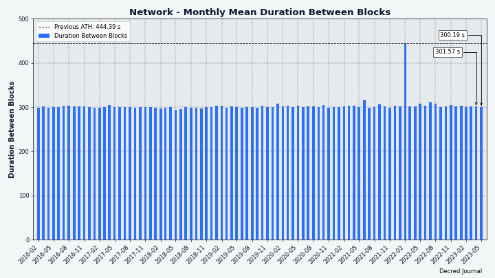
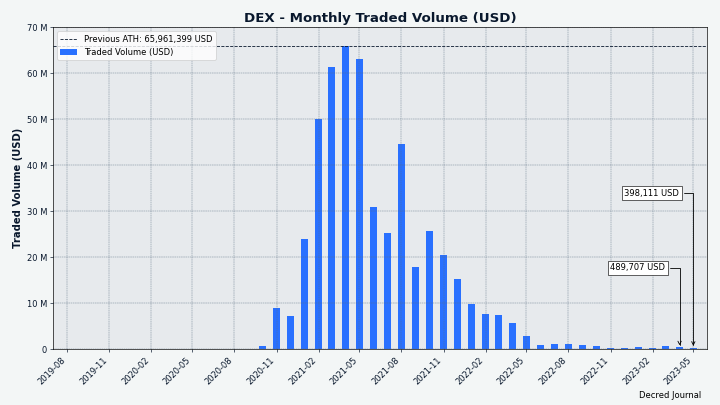

# مجلة ديكريد لشهر مايو 2023

_الصورة: عاصفة إلكترونية بواسطة Exitus@_

أبرز أحداث شهر مايو:

* تم إصدار النسخة 0.6.1  لمنصة المبادلات اللامركزية لديكريد، مع دعم Digitbyte وإصلاحات مهمة لـ LTC و ZEC.
* تمت الموافقة على اقتراح Decred Vanguard وبدأ بالفعل برنامج التواصل عبر وسائل التواصل الاجتماعي الذي يحركه المجتمع.
* تحرز مُرحِّل البيسون تقدمًا، حيث تم دمج النسخة الأولى من الصفحات بالإضافة إلى أدوات التاجر الخاصة بالمتاجر.

المحتويات:

* [إصدار النسخة 0.6.1 لمنصة المبادلات اللامركزية لديكريد](#إصدار-النسخة -0.6.1-لمنصة-المبادلات-اللامركزية-لديكريد)
* [التطوير](#التطوير)
* [الأشخاص](#الأشخاص)
* [الإدارة و الحوكمة](#الإدارة-و-الحوكمة)
* [الشبكة](#الشبكة)
* [الانتشار](#الانتشار)
* [الفعاليات](#الفعاليات)
* [وسائل الإعلام](#وسائل-الإعلام)
* [مناقشات المجتمع](#مناقشات-المجتمع)
* [الأسواق](#الأسواق)
* [الخارجية ذات الصلة](#الخارجية-ذات-الصلة)

## إصدار النسخة 0.6.1 لمنصة المبادلات اللامركزية لديكريد

يتميز إصدار DEX هذا بما يلي:

* الدعم الأولي ل DigiByte (DGB) (يتطلب محفظة عقدة كاملة تعمل جنبًا إلى جنب)
* إصلاحات مهمة للايتكوين (LTC) و الزيكاش (ZEC)
* من السهل الآن رؤية سعر الطلب في جدول الطلبات
* يتم الآن تذكر حجم شمعة الرسم البياني وتغير الحجم الافتراضي في حدود ساعة واحدة

احصل على أحدث إصدار من [تطبيق DEX المستقل](https://github.com/decred/dcrdex/releases)، أو كجزء من [ديكريديتون](https://github.com/decred/decred-binaries/releases)، أو قم بتثبيته من  [متجر تطبيقات ](https://github.com/decred/umbrel-app-store)Umbrel المخصص لديكريد. كما هو الحال دائمًا، نوصي [بالتحقق من الملفات](https://docs.decred.org/advanced/verifying-binaries) قبل التشغيل.

## التطوير

ما لم يُذكر خلاف ذلك، فإن العمل المَذْكُور هنا يشتمل على حالة "الدمج إلى الرئيسي". وهذا يعني أن العمل قد تم استكماله ومراجعته ودمجه في كود المصدر الذي يمكن للمستخدمين المتقدمين [بناءه وتشغيله](https://medium.com/@artikozel/the-decred-node-back-to-the-source-part-one-27d4576e7e1c)، ولكنه ليس متاحًا بعد في ثنائيات الإصدار للمستخدمين العاديين.

### dcrd

_[dcrd](https://github.com/decred/dcrd) هو تطبيق عقدة كامل يعمل على تشغيل شبكة ديكريد من نظير إلى نظير حول العالم._

التغييرات التي تم دمجها في الفرع الرئيسي `master` نحو الإصدارات المستقبلية:

* تنظيف [العديد من الوظائف](https://github.com/decred/dcrd/pull/3114) عن طريق إزالة [حالات الخطأ](https://github.com/decred/dcrd/pull/3110) التي لم تعد تحدث.
* في [أغسطس الماضي](202208.md#dcrd)، من أجل مكافحة هجمات ASIC على شبكة الاختبار والتأكد من أن وحدات المعالجة المركزية ستكون قادرة دائمًا على تعدين كتل اختبار جديدة، تم [تحديث شبكة الاختبار ](https://github.com/decred/dcrd/pull/2978)بحيث يتم تقليل صعوبة تعدين شبكة الاختبار بأقصى قيمة. كما تم تحديث منشئ قوالب التعدين وعامل معدن وحدة المعالجة المركزية [لإزالة منطق شبكة الاختبار](https://github.com/decred/dcrd/commit/c6e53c9ef0926f172a637a6552b744cbd6445537) القديم الذي لم يعد ساريًا هذا الشهر، نظرًا لأن جميع كتل شبكة الاختبار الجديدة تفرض قيودًا على الصعوبة.
* تمت [إزالة الطريقة الداخلية الملغاة](https://github.com/decred/dcrd/pull/3113) والتي أدرجت العملاء المشتركين الذين ينتظرون تحديثات سلسلة الكتل. نظرًا لأن هذه الطريقة كانت داخلية ، فلا داعي أبدًا لمشاركتها خارج dcrd.
* تم [اكتشاف خلل عبر ](https://github.com/decred/dcrdata/issues/1963) dcrdata حيث لم يتضمن  حساب العرض الإجمالي للعملات  الذي تم إرجاعه من خادم dcrd RPC الجديد `TreasuryBases` - وهو جزء من مكافأة كل كتلة يتدفق إلى الخزينة اللامركزية الجديدة. تم [الآن تحديث](https://github.com/decred/dcrd/pull/3112) حساب إجمالي المعروض من العملات، والذي تضمن أيضًا تحديثًا لقاعدة البيانات. وتجدر الإشارة إلى أن هذا الخطأ كان مجرد خطأ بسيط في حساب RPC لعرض العملة، ولم يؤثر على الإجماع بأي شكل من الأشكال.

قيد التطوير:

* تنفيذ تصويت إجماع تجزئة [DCP-11](https://github.com/decred/dcrd/pull/3115) إثبات العمل.

### dcrwallet

_[dcrwallet](https://github.com/decred/dcrwallet) هو خادم محفظة تستخدمه تطبيقات سطر الأوامر والمحفظة الرسومية._

نقل التغييرات الجاهزة للإصدار 1.7.x التالي:

* احترام [تكوين الوكيل](https://github.com/decred/dcrwallet/commit/7fbdd7fba71525149bf7a98dc7f8033f34a1e108) للتحقق البسيط من الدفع  واتصالات البذرة نظير لنظير. هذا لمنع تسرب التفاصيل الداخلية للشبكة.

التغييرات التي تم دمجها في الفرع الرئيسي `master` نحو الإصدارات المستقبلية:

* استخدام أحدث الإصدارات من العديد من [وحدات ](https://github.com/decred/dcrwallet/pull/2234)dcrd النمطية وعدد قليل من [التبعيات](https://github.com/decred/dcrwallet/pull/2236) للجهات الخارجية.
* السماح للمحفظة [باتباع التفرع الصلب ](https://github.com/decred/dcrwallet/pull/2232)DCP-12 في حالة ما تمت الموافقة عليه وتفعيله.
* إزالة العديد من [الأساليب الداخلية المهملة](https://github.com/decred/dcrwallet/pull/2235)، أي تلك التي أصبحت قديمة بسبب التغييرات الإجماعية [DCP-9](https://github.com/decred/dcps/blob/master/dcp-0009/dcp-0009.mediawiki) (الإلغاء التلقائي للتذاكر) و [DCP-10](https://github.com/decred/dcps/blob/master/dcp-0010/dcp-0010.mediawiki) (تغيير تقسيم دعم إثبات العمل/إثبات الحصة إلى 10/80).

### Decrediton

_[Decrediton](https://github.com/decred/decrediton) ديكريديتون هو تطبيق محفظة لسطح المكتب كامل الميزات مع ميزة التصويت مدمجة، وميزة الخلط ب StakeShuffle، والشبكة البرقية، والتداول على منصة المُبادلات اللامركزية DEX للديكريد، والمزيد. يتم تشغيلها مع سلسلة الكتل كاملة أو بدونها (وضع التحقق البسيط من الدفع SPV)._

قيد التطوير:

* [دعم السجل](https://github.com/decred/decrediton/issues/3865): إضافة [وظائف منخفضة المستوى](https://github.com/decred/decrediton/pull/3869) و[عروض واجهة المستخدم](https://github.com/decred/decrediton/pull/3874).
* نظرًا لأن التحصيص غير ممكن حاليًا مع أي محافظ أجهزة، ستتم [إزالة](https://github.com/decred/decrediton/pull/3870) طرق عرض التحصيص لتجنب الالتباس.
* تمت إضافة [أيقونة السجل](https://github.com/decred/pi-ui/pull/479) إلى مكتبة pi-ui المشتركة.

مسائل أخرى:

* تمت [إضافة](https://github.com/microsoft/winget-pkgs/pull/106493) ديكريديتون إلى مستودع حزمة [winget](https://en.wikipedia.org/wiki/Windows_Package_Manager). يمكن لمستخدم Windows الآن [تثبيته](https://matrix.to/#/!zefvTnlxYHPKvJMThI:decred.org/$25tEa195uFjzuxC0J9ecm7X8NRGUAhcrUqNvuUKfHqM?via=decred.org&via=matrix.org&via=planetdecred.org) باستخدام برنامج `winget install Decred.Decrediton`.

### vspd

_[vspd](https://github.com/decred/vspd) هو برنامج خادم لتشغيل موفر خدمة التصويت. يصوت موفر خدمة التصويت نيابة عن مستخدميه على مدار الساعة طوال أيام الأسبوع ولا يمكنه سرقة الأموال._

* تمت إضافة [الدفع التلقائي لرسوم مزود خدمة التصويت](https://github.com/decred/vspd/pull/382) من الحزمة الداخلية لـ dcrwallet إلى حزمة العميل `client` العامة لـ vspd. يسمح هذا بإعادة استخدام كود مزود خدمة التصويت من جانب العميل بواسطة برامج أخرى وهو ضروري لإدماج [تحصيص DCR](https://github.com/decred/dcrdex/pull/2290) في DCRDEX.

### الشبكة البرقية

_[dcrlnd](https://github.com/decred/dcrlnd) هو برنامج عقدة الشبكة البرقية لديكريد. تتيح الشبكة البرقية إجراء معاملات فورية ومنخفضة التكلفة._

* إضافة دعم [للاتصال المخصص](https://github.com/decred/dcrlnd/pull/182) لـ dcrwallet. يسمح لكود الشبكة البرقية بتهيئة dcrwallet للاتصال بأقران التحقق البسيط من الدفع باستخدام خادم وكيل.

### cspp

_[cspp](https://github.com/decred/cspp)  هو خادم لتنسيق عمليات خلط العملات باستخدام بروتوكول CoinShuffle++. وهو غير احتجازي، أي لا يحتفظ بأي أموال._

* منع [تكرار المدخلات](https://github.com/decred/cspp/pull/92) في وقت مبكر من عملية الخلط. قبل أن يؤدي هذا الإصلاح إلى حدوث خطأ عند إرسال معاملة الخلط، يمكن أن يفشل في جلسة الخلط ويتجنب تعيين blame.
* تحسين [تسجيل](https://github.com/decred/cspp/pull/93) جلسات الخلط لالتقاط معرف الجلسة دائمًا ورقم التشغيل وقيمة فئة المخرجات المخلوطة.
* منع معاملات CoinJoin من [تجاوز حدود حجم مجمع الذاكرة](https://github.com/decred/cspp/pull/94). قد يستبعد هذا بعض الأقران من المزيج، إذا حدث ذلك، فسيحاول الخادم إقرانهم في فترة الخلط التالية. تمت إضافة فحص لإعادة محاولة الجلسة إذا [انخفض عدد الأقران عن الحد الأدنى](https://github.com/decred/cspp/pull/95) للإعداد.

### DCRDEX

_[DCRDEX](https://github.com/decred/dcrdex) هي منصة مبادلات غير احتجازية للمُبادلات غير الموثوقة، مدعومة بالمقايضات الذرية._

التغييرات المضمنة في إصدار النسخة 0.6.1:

* تحديد سقف عالي [لسعر رسوم معاملات الزيكاش](https://github.com/decred/dcrdex/pull/2336). تحسب منصة المبادلات اللامركزية الرسوم بناءً على حجم المعاملة، لكن الزيكاش هي استثناء لأنها تستخدم حاليًا رسومًا قياسية قدرها 1,000 zats أو 0.00001 ZEC لكل معاملة، بغض النظر عن الحجم. سيتغير هذا عند تفعيل [ZIP 317](https://zips.z.cash/zip-0317)، مما يؤدي إلى زيادة الرسوم. لضمان نقل معاملات منصة المبادلات اللامركزية دائمًا وتعدينها، فإن رسوم هذا التغيير تصل إلى حوالي 0.0002-0.0003 ZEC. يتم استخدام معدل رسوم مشفر بقوة يبلغ 84 zats/byte كحل بديل لزيكاش وليس لديه طريقة سهلة لتقدير الرسوم.
* تمت إضافة دعم تداول [DigiByte](https://github.com/decred/dcrdex/pull/2323) بمحافظ العقدة الكاملة.
* تمت إضافة روابط [مستكشف الكتلة](https://github.com/decred/dcrdex/pull/2340) إلى معاملات ZEC.
* تمت إضافة خيار وقت التجميع لـ [الفاصل الزمني](https://github.com/decred/dcrdex/pull/2339) حيث يستقصي خادم منصة المبادلات اللامركزية عن كتل جديدة من الأصول الشبيهة بالبتكوين. يسمح باستخدام استقصاء أبطأ للعقد البعيدة حيث يكون الفاصل الزمني الافتراضي لمدة ثانية سريعًا جدًا.
* تم إصلاح الفشل في إعادة تكوين محفظة شبيهة بالبتكوين غير متصلة في ظروف معينة.
* إصلاح طلب إعادة التشغيل من طرف المحافظ الشبيهة بالبتكوين وليس لديها فرصة لإعادة التكوين المباشر.
* إصلاح عدم تشغيل إعادة التشغيل الكامل في بعض سيناريوهات تغيير تكوين اتصال استدعاء الإجراء البعيد.
* تم إصلاح [معرّف المعاملة](https://github.com/decred/dcrdex/pull/2342) غير الصحيح عند إرسال وحدات الزيكاش.
* تم إصلاح العديد من الإصدارات مع [السندات](https://github.com/decred/dcrdex/pull/2343) لأصول ZEC وغير SegWit.
* تم نقل ما يقارب 22 [إصلاحًا وتحسينًا](https://github.com/decred/dcrdex/pull/2323) تم إجراؤهم في الفرع الرئيسي `master` قبل مايو.

تم دمج جميع التغييرات الأخرى أدناه في الفرع الرئيسي `master` تجاه الإصدارات المستقبلية.

العميل:

* تمت إضافة [وقت استرداد الأموال](https://github.com/decred/dcrdex/pull/2042) المتوقع إلى بطاقة المطابقات. في السابق كان يمكن أن تظهر علامة "<Pending>" مربكة لساعات.
* أتمتة المزيد من الخطوات في المحفظة [تفعيل/تعطيل](https://github.com/decred/dcrdex/pull/2324). سيؤدي تعطيل محفظة الأصول الأساسية إلى تعطيل جميع محافظ التوكن لتلك السلسلة. كما سيؤدي تفعيل محفظة التوكن أيضًا إلى تفعيل محفظة الأصول الأساسية للسلسلة.
* تحسين [معالجة الطلب](https://github.com/decred/dcrdex/pull/2350) عن طريق تقليل الاتصالات باهظة الثمن لتحميل معلومات المستخدم.
* تمت استعادة [التسجيل الملون](https://github.com/decred/dcrdex/pull/2350) لطلبات HTTP إلى stdout.
* استخدام [مصادر سعر الرسوم](https://github.com/decred/dcrdex/issues/2354) الخارجية في وضع التحقق البسيط من الدفع. قبل هذا التغيير، كان من الممكن دفع رسوم عالية بشكل غير معقول عند الإرسال من محفظة التحقق البسيط من الدفع.
* تمت إزالة شرط إدخال [كلمة المرور عند إلغاء الطلب](https://github.com/decred/dcrdex/pull/2374).

البتكوين:

* تم إصلاح [المشكلات](https://github.com/decred/dcrdex/pull/2326): قد تحاول محفظة شبكة المحاكاة الاتصال بالشبكة الرئيسية، و دائمًا ما تتطلب المحافظ الشبيهة بالبتكوين إعادة التشغيل، وقد تفشل في إعادة تكوين محفظة غير متصلة في ظروف معينة.

الإيثيريوم:

* تم إجراء [الموافقات على التوكن](https://github.com/decred/dcrdex/pull/2349) كخطوة يدوية منفصلة بدلاً من الجزء التلقائي للمقايضة الأولية. من أجل تداول التوكنات (مثل USDC)، يجب الموافقة على عقد المقايضة للتعامل مع التوكنات نيابة عن المستخدم. جعله إجراءً يدويًا يتيح للمستخدمين أن يكونوا على دراية بما يحدث وألا يفاجأوا بالرسوم المرتفعة للمقايضة الأولية. يمكن إبطال الموافقة في إعدادات المحفظة.

Firo:

* تمت إضافة دعم [محفظة العقدة الكاملة](https://github.com/decred/dcrdex/pull/2270) لـ [Firo](https://firo.org/) (المعروفة سابقًا باسم Zcoin).
* التالي هو دعم [المحافظ الخفيفة](https://github.com/decred/dcrdex/issues/2346) ل Firo المستندة إلى Electrum.

حزمة التطبيق:

* تقديم سطح مكتب `dexc-desktop` جديد قابل للتنفيذ و الذي يجمع تطبيقات ويب منصة المبادلات اللامركزية في مكون WebView ليبدو وكأنه [تطبيق سطح مكتب](https://github.com/decred/dcrdex/pull/1957). سيستمر تشغيل التطبيق في الخلفية إذا كانت هناك أوامر نشطة (يمكن إغلاقه بالقوة باستخدام مفتاح `—kill` في سطر الأوامر).
* تمت إضافة البرنامج النصي لبناء [حزم ](https://github.com/decred/dcrdex/commit/ca5b1d8914b8d84bdfa4cbe28a6c97f5a20c18c4)Debian.

التغييرات الداخلية و التطوير:

* تم تحديث [تبعيات npm](https://github.com/decred/dcrdex/pull/2321).
* نقل منطق روبوت [صانع السوق](https://github.com/decred/dcrdex/pull/2320) خارج الحزمة الأساسية `Core` نحو [الحزمة الخاصة به](https://github.com/decred/dcrdex/tree/ca5b1d8914b8d84bdfa4cbe28a6c97f5a20c18c4/client/mm). هذا ضروري لتحسين البنية وإضافة المزيد من استراتيجيات الروبوت في المستقبل.
* تم تمكين [makezero](https://github.com/decred/dcrdex/pull/2344) linter من اكتشاف المزيد من الأخطاء في تخصيص الذاكرة. 
* تم تحديث سير عمل الإنشاء والاختبار لإضافة النسخة 20 ل [Node.js](https://github.com/decred/dcrdex/pull/2341) وإزالة الإصدار 16. * سيصل الإصدار 16 من Node.js إلى نهاية دورة حياته في سبتمبر 2023.
* تم تغيير طرف السلسلة و goroutines لتتبع الأقران [لإيقاف تشغيل](https://github.com/decred/dcrdex/pull/2369) أكثر سهولة.

  
_الصورة: يتطلب عقد مقايضة منصة المبادلات اللامركزية موافقة لمرة واحدة لمقايضة التوكنات الخاصة بك._

_الصورة: إعداد الطاقة الشمسية يعمل على Umbrel مع صانع السوق لمنصة المبادلات اللامركزية + المراجحة. بواسطة [@busyLightz](https://twitter.com/busyLightz/status/1654876069101436928)._

### dcrdata

_[dcrdata](https://github.com/decred/dcrdata) هو مستكشف لبيانات سلسلة كتل ديكريد وخارج السلسلة مثل مقترحات بوليتيا والأسواق والمزيد._

* إصلاح الأرقام المنخفضة قليلاً عن [مخططات رصيد العنوان](https://github.com/decred/dcrdata/pull/1962) بسبب عدم تصفية المخرجات الجانبية وغير الصحيحة.

### مُرَحِّل بيسون

_[مُرَحِّل بيسون](https://github.com/companyzero/bisonrelay) هي منصة وسائط اجتماعية جديدة مع حماية قوية ضد الرقابة والمراقبة والإعلان، مدعومة من الشبكة البرقية لديكريد._

تم دمج جميع الأعمال الواردة أدناه في الفرع الرئيسي `master` في الإصدار التالي (من المحتمل أن يكون الإصدار 0.1.8).

تطبيقات واجهة المستخدم الرسومية وواجهة سطر الأوامر:

* تم تنفيذ الإصدار الأولي لميزة [الصفحات](https://github.com/companyzero/bisonrelay/pull/224). تسمح الصفحات بتصفح المحتوى الثابت من مستخدم بعيد. يتم دعم صفحات [Markdown](https://www.markdownguide.org/) فقط. يمكن للصفحات الارتباط بصفحات مستخدمين آخرين باستخدام روابط `br://`. يتم سرد قيود التكرار الأول في [طلب السحب](https://github.com/companyzero/bisonrelay/pull/224). تعد الصفحات ميزة كبيرة ستحتاج إلى جولات من التحسينات استجابة لتعليقات المستخدمين.
* تحسين إستراتيجية [إعادة محاولة دفع الإكرامية](https://github.com/companyzero/bisonrelay/pull/236). بدلاً من القيام بمحاولات متوازية متعددة لدفع الإكراميات لمستخدم واحد، يتم تجربة الدفع لمستخدم واحد فقط في كل مرة. هذا من شأنه أن يساعد في تجنب المشاكل المتعلقة بفشل مدفوعات الإكرامية بسبب عقد الشبكة البرقية ذات السعة المنخفضة. كما ستتم إعادة محاولة المحاولة عند محاولة فاشلة لدفع الإكرامية لعدم وجود مسار الشبكة البرقية (قد يكون هذا الخطأ مؤقتًا). يمكن لتطبيق واجهة سطر الأوامر سرد محاولات مستخدم الطرف التي يتم تشغيلها باستخدام الأمر الجديد `/runningtips`.
* تمت إضافة القدرة على توصيل dcrlnd المضمنة من خلال خادم الوكيل المهيأ (مثل Tor) بكل من [تطبيق واجهة سطر الأوامر](https://github.com/companyzero/bisonrelay/pull/235) و[تطبيق واجهة المستخدم الرسومية](https://github.com/companyzero/bisonrelay/pull/239). تسمح معلمة التهيئة الجديدة لـ "circlimit" بتحديد عدد [الاتصالات المفتوحة](https://github.com/companyzero/bisonrelay/pull/234) عند استخدام الوكيل.
* إضافة [ميزة المصافحة](https://github.com/companyzero/bisonrelay/pull/246) التي تسمح للعملاء باختبار أن معدلات التشفير الخاصة بهم لا تزال تعمل.
* تم تنفيذ [سجل الدردشة المستمر](https://github.com/companyzero/bisonrelay/pull/230)  الذي يتذكر آخر 500 رسالة ويظهرها بعد إعادة تشغيل التطبيق. يتم تخزين جميع الدردشات في ملفات السجل ولكن الوصول إلى السجل من التطبيق نفسه هو تجربة مستخدم أفضل وكان طلب ميزة متكرر. تتمثل الخطة في نهاية المطاف في إضافة التحميل عند الطلب للتاريخ مع عودة المستخدم بالزمن.
* تم إصلاح [التعثرات المعطلة](https://github.com/companyzero/bisonrelay/pull/248) المحتملة عندما يحاول مستخدمان في وقت واحد تبادل المفاتيح مع بعضهما البعض. يمكن أن يحدث هذا عندما تتم إضافة مستخدمين إلى مجموعتين مختلفتين من الدردشة الجماعية حيث يوجد المستخدم الآخر بالفعل، مما يؤدي إلى تبادل اثنين من المفاتيح في نفس الوقت.

تطبيق واجهة المستخدم الرسومية:

* تمت إضافة [قائمة السياق](https://github.com/companyzero/bisonrelay/issues/216) إلى الدردشات الفردية والمحادثات الجماعية.
* تمت إضافة زر عائم [للانتقال إلى الرسائل الأخيرة](https://github.com/companyzero/bisonrelay/pull/231).
* تقييد حجم [الصور المضمنة](https://github.com/companyzero/bisonrelay/pull/244) المعروضة في الدردشات والمشاركات. تظهر الصورة الأكبر إذا تم النقر عليها. يعمل هذا على إصلاح مشكلات التمرير وأحجام الصور المختلفة.
* تم إصلاح بعض المشكلات المتعلقة [بتحديد النص](https://github.com/companyzero/bisonrelay/pull/226) وإضافة حد للارتفاع إلى كود الكتل وجعلها قابلة للتمرير. تم تفرع عنصرين من أدوات Flutter وتصحيحهما لحل المشكلات، لكن النقر المزدوج (حدد كلمة) والنقر الثلاثي (حدد فقرة) لا يزال لا يعمل.
* تم إصلاح [مشكلات شريط التمرير](https://github.com/companyzero/bisonrelay/pull/249) في طرق عرض إدارة الشبكة البرقية.
إصلاحات أصغر لسلوك التمرير والتجاوز.

تطبيق واجهة سطر الأوامر:

* تم تمكين brclient من تفويض طلبات الصفحات و المتجر إلى [برنامج آخر](https://github.com/companyzero/bisonrelay/pull/224) عبر [clientrpc API](https://github.com/companyzero/bisonrelay/tree/master/clientrpc)، وإعادة توجيه ردوده إلى مستخدمي مُرحٌِل البيسون الذين يطلبون ذلك. ستتيح هذه المرونة ميزات مفيدة في المستقبل.
* تم تمكين brclient لتفويض الطلبات إلى [موقع ويب](https://github.com/companyzero/bisonrelay/pull/224) HTTP أو HTTPS. يتيح ذلك لمستخدمي مُرحٌِل البيسون الوصول إلى موارد HTTP/HTTPS من خلال مستخدم مُرحٌِل البيسون آخر يعمل كوكيل.
* فرز المنشورات حسب [أحدث نشاط](https://github.com/companyzero/bisonrelay/pull/243). كما سيتم تمييز المنشورات غير المقروءة بلون مختلف.
* السماح باستخدام الأمر `/closechannel` مع [بادئة قصيرة](https://github.com/companyzero/bisonrelay/pull/252) لمعرّف القناة (المعرف الكامل بطول 64 حرفًا).

المتاجر:

* تم تنفيذ أسس الجانب التجاري [للمتاجر البسيطة](https://github.com/companyzero/bisonrelay/pull/224). على عكس الصفحات، تعد المتاجر موارد ديناميكية يمكنها تقديم عناصر المنتج للبيع. يضم المتجر صفحة أولى وصفحات منتجات فردية يتم إنشاؤها من الملفات المحلية. يتم إعادة تحميل المتجر تلقائيًا إذا تغير أي من ملفاته. يمكن لعميل مُرحٌِل البيسون الذي يدير المتجر تقديم صفحات المنتج، وصيانة عربات التسوق، والتعامل مع وضع الطلبات وإنشاء الفواتير. سيتم عرض الأسعار بالدولار الأمريكي ولكن سيتم الدفع ب DCR. يتم الحصول على سعر الصرف من [dcrdata](https://explorer.dcrdata.org). يتم تأمين مبلغ DCR الذي سيتم دفعه لمدة 60 دقيقة أثناء صلاحية الطلب. يدعم تطبيق واجهة سطر الأوامر المدفوعات على السلسلة فقط.
* تم تنفيذ [نماذج بسيطة](https://github.com/companyzero/bisonrelay/pull/241). يمكن عرض النماذج وملؤها وإرسالها بواسطة عملاء المتجر لإضافة عناصر إلى عربة التسوق أو لتقديم طلب.
* تمت إضافة [تفاصيل الشحن](https://github.com/companyzero/bisonrelay/pull/250) إلى الطلبات. قد تتطلب بعض المنتجات لملء معلومات الشحن.

مسائل أخرى:

* تمت إضافة [اختبارات الأداء](https://github.com/companyzero/bisonrelay/pull/245) الشاملة.
* قام JC@ بحدث داخلي في غرفة الدردشة #trading مع [هدية](https://matrix.to/#/!lDZCzVQjFoJsXMPkvr:decred.org/$FjC6ZsHaR4GBvlR9-o4E4anuqWwoq1F167CU0QPJmS4) من 20 دعوة مدفوعة مسبقًا مع 0.05 DCR لكل منها.

## الأشخاص

إحصائيات المجتمع اعتبارًا من 2 يونيو (مقارنة بـ 3 مايو):

* متابعو [التويتر](https://twitter.com/decredproject): (53,108 (+31
* المشتركين في [ريديت](https://www.reddit.com/r/decred/): 12,723 (+22)
* مستخدمي غرفة الدردشة general# على [الماتريكس](https://chat.decred.org/): 774 (+11)
* مستخدمي [الديسكورد](https://discord.gg/GJ2GXfz): 1,590 (+17)، تم التحقق منهم للنشر:   634 (-287) - تم فك جسر الديسكورد وحصل على قواعد تحقق أقوى
* مستخدمي [التيليجرام](https://t.me/Decred): 2,470 (-38)
* المشتركين في [اليوتيوب](https://www.youtube.com/decredchannel): 4,640 (+10)، المشاهدات: 229.6 ألف (+1,500)

## الإدارة و الحوكمة

في مايو، تلقت [الخزينة](https://dcrdata.decred.org/treasury) الجديدة 8,088 DCR بقيمة 139 ألف دولار بمتوسط سعر مايو البالغ 17.13 دولارًا. تم إنفاق 3,059 DCR لدفع أموال للمتعاقدين بقيمة 52 ألف دولار بنفس المعدل.

تمت الموافقة على [معاملة إنفاق الخزينة](https://explorer.dcrdata.org/tx/5efdb2de7cbea2682d389aa274a1ef79c5996201226054b28e08e286b1809519) بـ 6,722 صوتًا بنعم و {}٪ من الإقبال، وتم تعدينها في 20 مايو. كان لديها 23 ناتجًا تسدد مدفوعات للمتعاقدين، يتراوح من 4 DCR إلى 1,464 DCR. من المحتمل أن يكون معظم DCR هذه قد تم دفعها مقابل عمل أبريل، وبسعر صرف الفواتير البالغ 20.22 دولارًا، فإن الإنفاق على المعاملات يبلغ حوالي 62 ألف دولار.

اعتبارًا من 17 يونيو، بلغ الرصيد المشترك للخزينة [القديمة](https://dcrdata.decred.org/address/Dcur2mcGjmENx4DhNqDctW5wJCVyT3Qeqkx) و[الجديدة](https://dcrdata.decred.org/treasury) 85,8136 DCR (12.1 مليون دولار أمريكي بسعر 14.08 دولارًا أمريكيًا).

المقترحات التي تمت الموافقة عليها في مايو:

* تمت الموافقة على اقتراح [Decred Vanguard](https://proposals.decred.org/record/0a1b782) بميزانية قدرها 46,784 دولارًا لتمويل نمو برنامج التوعية الذي يقوده المجتمع، بنسبة 94٪ أصوات بنعم و نسبة إقبال ب 39٪.
* تمت الموافقة على اقتراح [BTC-ECHO](https://proposals.decred.org/record/49e373b) لميزانية قدرها 9,500 دولار لتجربة لمدة ثلاثة أشهر مع موقع العملات الرقمية الألماني BTC-ECHO حيث ينتجون خلالها مقالتين مدفوعتين، بنسبة 69٪ أصوات بنعم وإقبال 32٪.

للمزيد من التفاصيل حول مقترحات الشهر راجع [العدد ](https://blockcommons.red/politeia-digest/issue060/)60 لموجز بوليتيا.

## الشبكة

**معدل التجزئة**: تم افتتاح [معدل التجزئة](https://dcrdata.decred.org/charts?chart=hashrate&scale=linear&bin=day&axis=time) لشهر مايو عند 74 Ph/s~ وأغلق عند ~ 66 Ph/s، ووصل إلى أدنى مستوى عند 61 Ph/s وبلغت ذروته عند 88 Ph/s على مدار الشهر.

_الصورة: معدل تجزئة ديكريد._

توزيع  67 Ph/s من معدل الهاش التي [أبلغت](https://miningpoolstats.stream/decred) عنها المجمعات في 1 يونيو: Poolin بنسبة 40%، و F2Pool بنسبة 40%، و AntPool بنسبة 16%، و BTC.com بنسبة 5%.

**التحصيص**: تراوح [سعر التذكرة](https://dcrdata.decred.org/charts?chart=ticket-price&axis=time&visibility=true-true&mode=stepped) بين  173-334 DCR.

_الصورة: شهد سعر التذكرة تأرجحًا آخر_

بلغ [المبلغ المقفل](https://dcrdata.decred.org/charts?chart=ticket-pool-value&scale=linear&bin=day&axis=time) 9.38-9.90 مليون DCR، مما يعني أن  61.7-65.1٪ من العرض المتاح [شارك](https://dcrdata.decred.org/charts?chart=stake-participation&scale=linear&bin=day&axis=time) في إثبات الحصة.

**مقدم خدمة التصويت**: قام [الـ 14 من مقدمي خدمة التصويت المدرجين](https://decred.org/vsp/) بإدارة ما يقرب من  6,650 (-310) تذكرة حية، والتي كانت تمثل   16.8٪ من مجموع التذاكر (0.3٪) اعتبارًا من 1 يونيو.

_الصورة: توزيع التذاكر التي يديرها مقدمو خدمات التصويت_

توزيع  1,000 كتلة تم [تعدينها](https://miningpoolstats.stream/decred) بالفعل بحلول 1 يونيو: F2Pool بنسبة  40%، و Poolin بنسبة  35%، و AntPool بنسبة 17%، و BTC.com بنسبة 8%.

_الصورة: التوزيع التاريخي لمجمع التجزئة_.

**العقد**: رصد [جهاز رسم الخرائط لديكريد](https://nodes.jholdstock.uk/user_agents)  147  عقدًا ل dcrd على مدار شهر يونيوللإصدارات التالية:النسخة 1.7.7 - 25%، النسخة 1.7.1 - 21%، النسخة 1.7.5 - 18%، النسخة 1.7.2 - 10%، نسخة بناءات التطوير 1.8.0 - 9%، النسخة 1.7.0 - 7%، النسخة 1.7.4 - 3%، أخرى - 8%.

_الصورة: التوزيع التاريخي لنسخة dcrd، بيانات من nodes.jholdstock.uk. كانت البيانات قبل يناير 2023 غير مكتملة._

تراوحت حصة [العملات المخلوطة](https://dcrdata.decred.org/charts?chart=coin-supply&zoom=jz3q237o-la8vk000&scale=linear&bin=day&axis=time&visibility=true-true-true) بين 61.8-61.9٪. وقد تفاوتت [الكمية المخلوطة](https://dcrdata.decred.org/charts?chart=privacy-participation&bin=day&axis=time) بشكل يومي ما بين 143 و 497 ألف DCR.

_الصورة: حجم StakeShuffle الشهري بالدولار الأمريكي_

شهد مستكشف [الشبكة البرقية](https://ln-map.jholdstock.uk/) لديكريد 211 عقدة (+15)، 423 قناة (+24) بسعة إجمالية قدرها 176  DCR (+13)، اعتبارًا من 1 يونيو. هذه الإحصائيات مختلفة لكل عقدة. على سبيل المثال، أبلغت عقدة @karamble عن 210 عقدة (+17)، 446 قناة (+17) و سعة 182 DCR (+9) في نفس اليوم 1 يونيو.

  
_الصورة: سعة الشبكة البرقية لديكريد_

وبعض الرسوم البيانية الجديدة من bochinchero@:
  

_الصورة: يظل متوسط وقت الكتلة مستقرًا عند 5 دقائق_

_الصورة: تضيف سلسلة ديكريد ~180 ميجابايت شهريًا_

_الصورة: يمكن أن تتناسب سلسلة كتل ديكريد الكاملة مع تخزين الهاتف الذكي الحديث_

_الصورة: إصدار DCR الشهري بالدولار الأمريكي - تم تحويل المكافآت من المعدنين إلى أصحاب الحصص وسيتم التحويل قريبًا_

_الصورة: إجمالي الرسوم الشهرية - لا تزال ديكريد رخيصة للاستخدام_

يوجد الآن مخططات أكثر مما يمكن إظهاره في المجلة. يمكن العثور على الرسوم البيانية أعلاه وغيرها [هنا](https://github.com/bochinchero/dcrsnapshots) - يُنصح بشدة بإعادة الاستخدام على وسائل التواصل الاجتماعي!

## النظام البيئي

خدمات جديدة:

* تم [إطلاق](https://twitter.com/exitusdcr/status/1654626949837500416) أزواج ZEC/BTC و ZEC/USDC في [dex.decred.org](https://dex.decred.org/).
* [بدأ تشغيل](https://twitter.com/DecredSociety/status/1657750204852871173) سوق DGB/BTC. مطلوب إصدار عميل منصة المبادلات اللامركزية  0.6.1 أو أعلى، ويمكن الحصول عليه [كتطبيق مستقل](https://github.com/decred/dcrdex/releases) أو باستخدام النسخة 1.8.0 [لديكريديتون](https://github.com/decred/decred-binaries/releases). يتم دعم محفظة DGB القائمة على العقدة الكاملة فقط في البداية، ولكن قد تصبح محفظة الخفيفة المدمجة ممكنة عند إصدار النسخة 8.22 ل DigiByte.
* يمكن الآن عرض سجلات دردشة الماتريكس لديكريد [archive.matrix.org](https://archive.matrix.org/) - متصفح أرشيف دردشة جديد يحل محل [view.matrix.org](https://view.matrix.org/). تعمل الخدمة بدون جافاسكريبت ولا تتطلب حساب الماتريكس.

الخدمات المفقودة:

* تغادر [الباينانس](https://www.forbes.com/sites/digital-assets/2023/05/16/binance-exits-canada-over-concerns-of-strict-regulation/) كندا [ردًا](https://twitter.com/binance/status/1657099651210969088) على أنظمة العملات الرقمية المشفرة الأخيرة التي * تحظر منصات المبادلات المسجلة من قبول ودائع العملات المستقرة أو بيعها للعملاء دون موافقة من مسؤولي الأوراق المالية الكنديين. تشمل القيود الأخرى حظر تداول الهامش وحدود المستثمرين. وفقًا لغرفة دردشة [التداول ](https://matrix.to/#/!lDZCzVQjFoJsXMPkvr:decred.org/$Ox6W2V_jS33D6X5kOvuX6OU-TPW-8xStJL0QdLzpD8E)#trading، طُلب من العملاء عبر البريد الإلكتروني إغلاق أي مواقع مفتوحة بحلول 30 سبتمبر 2023.
* تخطط الباينانس [لإزالة 12 عملة خاصة بالخصوصية](https://cointelegraph.com/news/binance-to-delist-privacy-tokens-in-france-italy-spain-and-poland) في فرنسا وإيطاليا وبولندا وإسبانيا. اعتبارًا من 26 يونيو، لن يتمكن سكان هذه البلدان من تداول DCR. حصلت الباينانس مؤخرًا على [التراخيص](https://beincrypto.com/binance-privacy-coins-prohibition/) المناسبة في الولايات القضائية المتأثرة. جاءت هذه الخطوة بعد فترة وجيزة من [تمرير](https://cryptoslate.com/binance-delists-privacy-coins-for-european-users-amid-layoff-rumors/) أسواق أصول العملات الرقمية المشفرة (MiCA) في الاتحاد الأوروبي في 16 مايو.
* [أعلنت](https://twitter.com/Hotbit_news/status/1660496999458963458) Hotbit أنها ستغلق العمليات وتطلب سحب جميع الأصول بحلول 30 يونيو. كان تداول DCR متاحًا على hotbit.io الرئيسي منذ [أكتوبر 2019](https://twitter.com/Hotbit_news/status/1186979514741428224) وفي فرعها الكوري منذ [نوفمبر ](https://twitter.com/Hotbit_Korea/status/1331412789416534017)2020. وفقًا لبعض أعضاء المجتمع، تمت إزالة DCR منذ بعض الوقت ولا ينبغي أن يتأثر أي من مستخدمي DCR. تضمنت أسباب إنهاء منصة المبادلات ما يلي: الخسائر الناجمة عن [التحقيقات](https://help.hotbit.io/hc/en-us/articles/8074249353495) الجنائية، وتدفق الأموال من منصات المبادلات المركزية، ونموذج الأعمال غير المستدام لمحاولة إدراج عدد كبير جدًا من العملات التي تم اختراق العديد منها، وصعوبات الامتثال للأنظمة. نقلاً عن [إعلان](https://help.hotbit.io/hc/en-us/articles/14750194236823-It-s-time-to-take-a-bow) الوداع: "إما أن تتبنى التنظيم أو تصبح أكثر لامركزية". نحن نعمل على ذلك!

أخبار أخرى:

* يبدو أن Huobi لم تقم بإزالة DCR كما خططت لها في سبتمبر 2022. تمت إزالة صفحة الإعلان ولكن تتوفر [نسخة مؤرشفة](https://web.archive.org/web/20221002130913/https://www.huobi.com/support/en-us/detail/104917015223952). لا يزال تداول أزواج تداول USDT لـ DCR و 6 عملات خصوصية أخرى من تلك القائمة قائماً وتبلغ عن أحجام جيدة على CoinGecko و CoinMarketCap اعتبارًا من 12 مايو. قال مراقبون من غرفة الدردشة #trading إن DCR لم تتوقف أبدًا عن التدفق ذهابًا وإيابًا بين Huobi و Binance.
* تقدمت Bittrex بطلب [إفلاس](https://fortune.com/2023/05/08/bittrex-bankruptcy-us-filing-crypto-platform/) في الولايات المتحدة ومالطا، بعد 3 أسابيع من اتهامها من قبل هيئة الأوراق المالية والبورصات (SEC) لتشغيل بورصة أوراق مالية غير مسجلة. تقوم كلا الجهتين بمعالجة [عمليات السحب](https://www.coindesk.com/policy/2023/05/10/bittrexs-us-maltese-arms-processed-425m-in-withdrawals-since-april-1-attorney-says/) منذ أبريل.
* [أعلنت](https://twitter.com/Ledger/status/1658458714771169282) Ledger عن خدمة جديدة منتظرة خاصة ب [Ledger Recover](https://www.ledger.com/recover). تسمح Recover بتسجيل هويتك (كندا، أوروبا، المملكة المتحدة، الولايات المتحدة) والنسخ الاحتياطي لبذور المحفظة في جهات خارجية موثوقة. يتم تقسيم البذور إلى 3 أجزاء، ويتم تشفير الأجزاء باستخدام مفتاح متماثل وإرسالها إلى 3 موفري نسخ احتياطي مختلفين. يمكن إعادة بنائه لاحقًا على جهاز Ledger آخر عن طريق التحقق من المعرف والحصول على 2 من 3 أجزاء من مقدمي الخدمة. يتم دعمها على Ledger Nano X فقط حاليًا. قد يرغب مستخدمو DCR في تقييم مخاطر استخدام Ledger في ضوء هذه الميزة الجديدة، والتي تمت إضافتها في [إصدار البرنامج الثابت ](https://twitter.com/alistairmilne/status/1658381708763209729)2.2.1 و **يجب أن** تكون غير مفعلة حتى يتم تمكينها بشكل صريح. شاهد تغطية أكثر تفصيلاً في [#ecosystem](https://chat.decred.org/#/room/#ecosystem:decred.org/$LSE8W9g9a4hqu9HN4IIyqWSf6H-LwSjd-xgK8Xie7GQ).

خدمات جديدة تم اكتشافها ولكن لم يتم اختبارها من قبل المجتمع حتى الآن:

* تم [رصد](https://twitter.com/h3la1/status/1653233413200158721) [خيار دفع DCR](https://fxdreema.com/purchase) في [fxDreema](https://fxdreema.com/) - أداة إنشاء رسومية لروبوتات التداول متوافقة مع MetaTrader 4 و MetaTrader 5.
* تتميز [CryptoWallet.com](https://cryptowallet.com/) بتطبيق جوال يسمح للمستخدمين بشراء وبيع العملات الرقمية المشفرة، وتدعم عمليات التحويل VISA/MasterCard/SEPA، وتخطط لإطلاق منتج بطاقة خاص. الشركة مرخصة في إستونيا. نقدر كثيرا مساعداتكم للبحث و الاختبار.

انضم إلى دردشة النظام البيئي [#ecosystem](https://chat.decred.org/#/room/#ecosystem:decred.org) لمتابعة تحديثات النظام البيئي لـديكريد.

تحذير: ليس لدى مؤلفي مجلة ديكريد أي فكرة عن مصداقية أي من الخدمات أعلاه. يرجى إجراء بحثك الخاص قبل الوثوق بمعلوماتك الشخصية أو أصولك لأي كيان.

## الإنتشار

تمت [الموافقة](https://proposals.decred.org/record/0a1b782) على Decred Vanguard وبدأت عمليات الإنتشار الخاصة بها. تمتلك Vanguard خادم Discord الخاص بها حيث يقوم الأعضاء بالتنسيق وتطوير أفضل الأساليب وتقييم النتائج. يستفيد الأعضاء من Midjourney AI لإنشاء فن متقدم للمساعدة في إيصال رسالة ديكريد. حصل العديد من الأعضاء على Twitter Blue ويبدو أنه يعمل بشكل جيد. التحدي الرئيسي في هذه المرحلة هو تجنيد أعضاء نشطين ومنتجين، وهذا هو السبب في أن الراتب الشهري الأولي منخفض عند 100 دولار. التحدي الآخر هو التسويق في السوق الهابطة. في مايو، لم يتم تخصيص جوائز للمشاركات الكبيرة/البارزة.

يجب على أي شخص مهتم بالانضمام إلى Decred Vanguard الاتصال بـ [@Tivra](https://twitter.com/WasPraxis) أو [@Exitus](https://twitter.com/exitusdcr). إذا كنت جديدًا في ديكريد، فلا بأس - ما عليك سوى أن تكون على استعداد للتعلم والمساعدة حيثما أمكنك ذلك.

> تبدو Vanguard حقًا وكأنها شيء احتجناه لسنوات. \[@Exitus\]

_الصورة: غرفة حرب Vanguard_

إنجازات Monde PR:

* عرضت فرصة تعليق واحدة
* عرضت 7 فرص إعلامية
*تأمين مقابلة إعلامية واحدة

تأمين مواضع الوسائل الإعلامية التالية:

* تم إجراء مقابلة مع @jy-p بواسطة [Authority Magazine](https://medium.com/authority-magazine/the-future-is-now-jake-yocom-piatt-on-how-their-technological-innovation-will-shake-u-3966dc1adc22) لمناقشة العديد من جوانب ديكريد بما في ذلك: قصة أصل ديكريد، عرض Bison مُرحِّل بيسون كإنترنت سيادي، والدعم القادم للصفحات ومتاجر التجارة الإلكترونية، بوليتيا، واستخدام ديكريد في الانتخابات البرازيلية.

## الفعاليات

**الحضور:**

حضر كل من arij@ و khalidesi@ فعالية [EMEC EXPO](https://emecexpo.ma) في الدار البيضاء، المغرب، وهو حدث كبير مخصص للتقنيات الرقمية حضره ما يقارب 9 آلاف شخص. كان للفريق منصة حيث شرحوا ميزات ديكريد للزوار من مختلف المجالات، وتفاعلوا مع العديد من الشركات المغربية، والتقوا ببعض الأشخاص الذين كانوا على دراية بالمشروع بالفعل. التقرير الكامل [هنا](https://decredcommunity.github.io/events/index/20230511.1)

## وسائل الإعلام

**مقالات مختارة:**

* [تطلق منصة المبادلات اللامركزية لديكريد DCRDEX 0.6، مما يوفر مستويات جديدة من الخصوصية والأمن للمقايضات عبر السلاسل](https://decred.org/news/2023-04-18_decred_releases_dcrdex_0.6/) - البيان الصحفي لشهر أبريل متاح الآن على decred.org
* [المستقبل هو الآن: يتحدث جيك يوكوم بيات من decred.org عن كيفية تأثير ابتكاراتهم التكنولوجية على المشهد التكنولوجي](https://medium.com/authority-magazine/the-future-is-now-jake-yocom-piatt-on-how-their-technological-innovation-will-shake-u-3966dc1adc22) بواسطة Authority Magazine بمشاركة jy-p@
* [ديكريد مقابل Horizen: العملات الرقمية المشفرة لا تكفي!](https://www.decredmagazine.com/decred-vs-horizen-crypto-is-not-enough/) بواسطة Joao@ 
* [لا أريد إعجاباتك](https://www.decredmagazine.com/i-dont-want-your-likes/) بواسطة phoenixgreen@

**احصائيات مشاركة مجلة ديكريد لشهر مايو 2023:**

* إجمالي عدد المقالات على مجلة ديكريد: 460
* عدد المشتركين في النشرة الإخبارية: 100
* مجموع الرسائل الإخبارية المرسلة: 16
* الحملات النشطة على وسائل التواصل الاجتماعي: 57
* الحملات المكتملة على وسائل التواصل الاجتماعي: 41
* المشاركات على مواقع التواصل الاجتماعي: 172
* الإعجابات: 1,180
* إعادة التغريدات: 302
* متابعو وسائل التواصل الاجتماعي عبر جميع منصات وحسابات التويتر و الفيسبوك (بما في ذلك [@DecredSociety](https://twitter.com/DecredSociety)): 1,350

**أشرطة الفيديو:**

* [إكمال المقايضة  الذرية للايتكوين - النسخة 0.6 لمنصة المبادلات اللامركزية لديكريد](https://www.youtube.com/watch?v=ajHovJHxtFw)  بواسطة phoenixgreen@
* [ملخص ديكريد - تحسينات النسخة 1.7.7، المقايضة الذرية في الإصدار 0.6 لمنصة المبادلات اللامركزية - المنظمة المستقلة اللامركزية تتطور!](https://www.youtube.com/watch?v=OgupSweE94s) بواسطة Exitus@ - متوفر أيضًا [كملف بودكاست](https://podcasters.spotify.com/pod/show/decred-magazine/episodes/Decred-Recap---v1-7-7-Improvements--Atomic-Swap-DEX-v0-6---The-DAO-Evolves-e23hp9k)
* تم [تحديث مُرحِّل بيسون إلى الإصدار 0.1.7](https://www.youtube.com/watch?v=wg0k8p3arxI) بواسطة phoenixgreen@ - متوفر أيضًا [كمنشور نصي](https://www.decredmagazine.com/bison-relay-upgrades-to-version-0-1-7/)
* [التصويت على اقتراح ديكريديتون](https://www.youtube.com/watch?v=q18OVd9z-n0) بواسطة phoenixgreen@ - متوفر أيضًا [كمنشور نصي](https://www.decredmagazine.com/decrediton-proposal-voting/)
* [دعوات مُرحِّل بيسون المدفوعة مسبقًا](https://www.youtube.com/watch?v=n4_fkpyppws) بواسطة phoenixgreen@ - متوفر أيضًا [كمنشور نصي](https://www.decredmagazine.com/bison-relay-pre-paid-invitations/)
* [تقوم ديكريد بتطوير شبكة متداخلة لمنصة المبادلات اللامركزية](https://www.tiktok.com/@decred_crypto/video/7239431067764002074) على التيك توك بواسطة DajanaDcr@ و Exitus@

البث المباشر:

 * [حالة السوق - Decred Vanguard - جهود توعية جديدة](https://www.youtube.com/watch?v=UDTQFOcva5Q) بواسطة phoenixgreen@ و Exitus@ انضم إليهما Tivra@ و @h3la1 - متوفر أيضًا [كملف بودكاست](https://podcasters.spotify.com/pod/show/decred-magazine/episodes/State-of-the-market---Decred-Vanguard---A-New-Outreach-Effort-e23midd)

**المقاطع الصوتية:**

* مناقشة المجتمع على فضاء التويتر [ديكريد مقابل الزيكاش](https://twitter.com/i/spaces/1vOxwMZYqYWGB) مع Tivra@ و [ZecHub](https://twitter.com/ZecHub) - متوفر أيضا على [اليوتيوب](https://www.youtube.com/watch?v=2RStHBiWNDk)
* [فضاء التويتر](https://twitter.com/i/spaces/1jMJgLwmPLMxL) مع Tivra@ و [W0wn3r0](https://twitter.com/W0wn3r0)

** الفن والمتعة: **

* [النقش](https://twitter.com/c12hz/status/1656636523448606720) الترتيبي للبيسون بواسطة @c12hz
* [اصعد إلى العظمة](https://www.decredmagazine.com/ascend-to-greatness/) بواسطة OfficialCryptos@
* [سيف ديكريد](https://www.decredmagazine.com/decred-katana/) بواسطة OfficialCryptos@
* تصوير [مجلة ديكريد](https://twitter.com/aithzakaria1/status/1653718235588468737) بواسطة @aithzakaria1

_الصورة: ديكريد تستغني عن الصابورة. بواسطة OfficialCryptos@_

**الترجمة:**

* [خصوصية الإنترنت وسبب أهميتها](https://www.decredmagazine.com/internet-privacy-and-why-it-is-important/) - [باللغة الصينية](https://github.com/DominicTing/decred-ZH-translations/blob/master/Internet%20Privacy%20and%20Why%20it%20is%20Important.md)  بواسطة Dominic@
* تمت [ترجمة](https://xaur.github.io/decred-news/) مجلة ديكريد في أبريل 2023 إلى الصينية بواسطة  - شكرًا لك!

## الأسواق

في أبريل، تم تداول DCR بين USDT 15.19-20.59 و BTC 0.00056-0.00075. وقد بلغ متوسط السعر اليومي 17.13 دولارًا.

تم نشر تحليل أسعار DCR الخاص بالمجتمع في غرفة الدردشة:

_الصورة: يبدو أن الفتائل السعرية الفردية على DCR/USD تحدث أثناء الارتباط المنخفض بحركة سعر BTC/USD. تحليل بواسطة @saender._

_الصورة: تقييمات السوق (بالدولار الأمريكي) بناءً على محدد مقياس القيمة المحققة لتحصيص ديكريد بواسطة bochinero@_

_الصورة: تحليل مناطق تراكم DCR/USD بواسطة saender@_

_الصورة: الحجم الشهري لمنصة المبادلات اللامركزية لديكريد  بالدولار الأمريكي_

## الخارجية ذات الصلة

[واجهت](https://www.theblock.co/post/230680/ethereum-beacon-chain-finality-issue) سلسلة Ethereum' s Beacon بعض المشكلات مع الحقيقة المُطْلَقَة، حادثان عرضيان حيث توقف المصدقون في الغالب عن اقتراح الشهادات لمدة ساعة تقريبًا ولا أحد متأكد من السبب. تمكنت المعاملات على شبكة الإيثيريوم من الاستمرار وبالتالي ربما لم يلاحظ المستخدمون أي مشاكل، ولكن خلف الكواليس، كانت سلسلة beacon التي تضع اللمسات الأخيرة على كل شيء لا تعمل، لذا كانت هذه المعاملات أكثر عرضة للعودة مما كان عليه الحال في العادة. أصدر مطورو الإيثيريوم الأساسيون تصحيحات للعميلين المتأثرين بالمشكلة (Go-based [Prysm](https://github.com/prysmaticlabs/prysm) من Prysmatic Labs و Java-based [Teku](https://github.com/ConsenSys/teku) من ConsenSys)، والتي نتجت عن الحمل العالي بشكل استثنائي على العقد التي تدير هؤلاء العملاء.

توقفت شبكة وسلسلة داش في 22 مايو لمدة 16 ساعة، بسبب [خلل](https://www.dash.org/blog/dash-network-update/) ناتج عن تحديث تشفير عتبة BLS إلى معيار صناعي في الإصدار 19. أنتج الفريق الأساسي تصحيحًا سريعًا (الإصدار 19.1) لوقف نشر الإصدار 19 وهذا سمح للشبكة بالاستئناف بعد 16 ساعة من التوقف. سيتم تضمين إصلاح لهذه المشكلة ومحاولة أخرى لنشر التغييرات في الإصدار 19.2.

قام Halborn [بتوثيق](https://www.halborn.com/blog/post/halborn-discovers-zero-day-impacting-dogecoin-and-280-networks) العديد من المشكلات التي تم اكتشافها أثناء تدقيق قاعدة بيانات الدوجكوين، ولكنها تنطبق أيضًا على عدد من الفروع من نفس سلالة البتكوين، بما في ذلك اللايتكوين و الزيكاش. يشيرون إلى هذه الثغرات باسم "ثغرات Rab13s"، وستسمح أكثرها قابلية للاستغلال للمهاجمين بأخذ العقد في وضع عدم الاتصال، بينما يسمح الآخرون بتنفيذ التعليمات البرمجية عن بُعد ولكن فقط باستخدام بيانات اعتماد صالحة، مما يجعل استغلال المشكلة أكثر صعوبة.

 [وصل](https://decrypt.co/139357/bitcoin-brc-20-tokens-near-billion-market-cap-exchanges-list-ordi) معيار التوكن BRC-20 الجديد لنقوش البتكوين (NFTs) الذي تم إطلاقه في مارس إلى تقييم سوقي (افتراضي) مجمع قدره مليار دولار. تم الوصول إلى هذا الإنجاز بعد إدراج ORDI، وهو أول توكن BRC-20، في بعض منصات المبادلات الرئيسية.

 [سجلت](https://www.msn.com/en-us/money/other/bitcoin-sets-new-daily-transaction-record-amid-ordinals-trend-as-crypto-miners-face-potential-energy-tax/ar-AA1aXUjh) البتكوين رقمًا قياسيًا جديدًا في المعاملات اليومية.  [ينتشر](https://decrypt.co/140683/meme-tokens-nfts-took-over-bitcoin-now-happening-dogecoin-litecoin) الاتجاه المتمثل في تعدين التوكنات القابلة للاستبدال مع معيار BRC-20 إلى سلاسل اللايتكوين و الدوجكوين، مما يؤدي بالمثل إلى رفع مستويات نشاط المعاملات الخاصة بهم.

كان هناك بعض [الانتقادات](https://twitter.com/jratcliff/status/1655669410206457865) لعدم كفاءة تخزين بيانات BRC-20 على السلسلة ، وهي اقتراحات تشير إلى عدم قضاء الوقت في تشفير البيانات لأن النظام الثنائي يكلف أربعة أضعاف تكلفة المعاملات. تم الاختيار [على ما يبدو](https://twitter.com/hash_bender/status/1655671019498258432) بسبب الرغبة في أن تكون بيانات السلسلة قابلة للقراءة من قبل الإنسان، ولكن هناك [اقتراحات](https://twitter.com/peterktodd/status/1655694148983312387) بأن استخدام مساحة أكبر بكثير قد يكون متعمدًا من جانب المصممين.

تم [إصدار](https://lightning.engineering/posts/2023-05-16-taproot-assets-v0.2/) النسخة 0.2 ل Taproot Assets، مضيفةً مجموعة من الأدوات التي يمكن للمطورين استخدامها على شبكة الاختبار لإصدار الأصول ونقلها واكتشافها في بروتوكول Taproot Assets Protocol (Taro سابقًا). يهدف بروتوكول أصول Taproot إلى توفير طريقة أكثر قابلية للتطوير للتعامل مع الأصول في سلسلة البتكوين من خلال التعامل مع معظم المعاملات خارج السلسلة، على عكس النقوش العادية التي تستخدم مساحة الكتلة بطريقة غير فعالة وتسبب زيادة جوهرية في الرسوم لجميع مستخدمي الشبكة. يضيف الإصدار 0.2 دعمًا لـ «معاملات البتكوين الافتراضية الموقعة جزئيًا» (vPSBTs)، والتي ستسمح للمطورين بالتعامل بسهولة أكبر مع أصول Taproot. يعد دعم الشبكة البرقية للأصول والعملات المستقرة أحد الأهداف الكبيرة للإصدار المستقبلي، الموجه نحو الاستخدام في الأسواق الناشئة.

تم [إطلاق](https://protos.com/richard-hearts-pulse-launch-flops-users-stranded-hex-crashes/) Pulsechain من Richard Heart (تفرع للايثيريوم)، وهو جزء كان متوقعًا منذ فترة طويلة من نظام HEX البيئي، جنبًا إلى جنب مع منصة المبادلات اللامركزية "PulseX" (تفرع ل Uniswap). لقد كان مجتمع HEX متوقعًا كثيرًا لعمليات الإطلاق هذه، منذ سنوات قبل أن تتحول إلى تفرع من برنامج الإيثيريوم. ومع ذلك، لا يبدو أن هدف خفض الرسوم لمستخدمي HEX قد تحقق، بسبب التسلسل الطويل للمعاملات المطلوبة لربط الأصول من وإلى Pulsechain. علاوة على ذلك، جعلت مشكلات السيولة الكبيرة من الصعب على المستخدمين الحصول على PLS التي يمكنهم استخدامها لدفع رسوم الغاز، مما أدى إلى توقف العديد من المستخدمين دون النوع الصحيح من التوكنات لاستخدام الشبكة على الإطلاق، ولا تتوفر هذه التوكنات إلا بأرباح باهظة . كانت أسعار جميع التوكنات ذات الصلة في انخفاض حاد.

[وافق](https://app.aave.com/governance/proposal/224/) بروتوكول إقراض DeFi AAVE على تغيير عقوده الذكية على شبكات الايثيريوم و Polygon و Avalanche ونشره، وكان الهدف من التغيير هو ضبط حسابات أسعار الفائدة، ولكن بسبب خطأ في تنسيق الوظيفة، انتهك البروتوكول على سلسلة Polygon. لم تكن أموال المستخدمين التي تبلغ قيمتها حوالي 120 مليون دولار [متاحة](https://www.coindesk.com/tech/2023/05/23/aave-v2-users-temporarily-unable-to-access-120m-on-polygon-after-governance-bug/) بينما شق اقتراح لإصلاح الخطأ طريقه من خلال عملية الحوكمة، حيث استغرق الأمر حوالي أسبوع لحل المشكلة.

تم [الاستيلاء](https://www.coindesk.com/tech/2023/05/21/attacker-takes-over-tornado-cash-dao-with-vote-fraud-token-slumps-40/) على المنظمة المستقلة اللامركزية لتطوير خدمة خلط ETH التي أقرها مكتب مراقبة الأصول الأجنبية Tornado Cash من قبل متسلل منح نفسه 1.2 مليون توكن ل  TORN واستخدمها للموافقة على الإنفاق من صندوق الخزينة التابع للمنظمة المستقلة اللامركزية . تم تمرير الكود للسماح بالاختراق مؤخرًا ضمن اقتراح مشروع تمت الموافقة عليه من قبل عملية حوكمة Tornado DAO المعتادة. لم يؤثر الاختراق على خلاط Tornado Cash نفسه، بل على العقود الذكية المرتبطة بالمنظمة المستقلة اللامركزية . بعد بضعة أيام، قدم المهاجم اقتراحًا لإعادة ضبط التغييرات التي أجروها و[إعادة](https://crypto.news/hacker-drops-control-over-tornado-cash-as-they-use-it-to-wash-stolen-funds/) التوكنات غير المنفقة التي منحوها لأنفسهم، وإعادة السيطرة إلى المنظمة المستقلة اللامركزية بعد الحصول على حوالي 900,000 دولار من ETH المخلوطة من خلال Tornado Cash.

قامت Binance بتجميع قوائم "المشاريع التي لم تحقق تقدمًا" والتي أدرجتها للتداول ، وبدأت في [إضافتها](https://twitter.com/cz_binance/status/1656231470959063041) إلى "منطقة الابتكار"، حتى يتم شطبها إذا لم تبدأ في إظهار بعض التقدم. [أدرك](https://twitter.com/cz_binance/status/1656231889718353921) CZ بالفعل أن هذا قد يتطلب إعادة تسمية "منطقة الابتكار”.

تقدمت Bittrex [بطلب إفلاس](https://www.coindesk.com/policy/2023/05/08/us-crypto-exchange-bittrex-files-for-bankruptcy-in-delaware/) في ولاية ديلاوير ولكن مع خطة لسداد جميع ودائع أصول العملاء، ويبدو أن كيان Bittrex العالمي لم يتأثر.

تم [شطب](https://protos.com/crypto-banking-giant-silvergate-is-no-more-following-nyse-delisting/) Silvergate Capital من بورصة نيويورك وتم تصفيتها. إنها الشركة الأم لبنك سيلفرجيت، و التي كانت في يوم من الأيام أكبر شريك مصرفي للعملات الرقمية. تم [إنهاء](https://www.theguardian.com/technology/2023/mar/09/crypto-bank-silvergate-liquidation-sector-turmoil-wind-down-ftx-exchange) بنك Silvergate في مارس بعد اندفاع عمليات سحب العملاء بعد انهيار FTX مما يعني أنهم تكبدوا خسارة قدرها مليار دولار في الربع الأخير من عام 2022.

تتعافى محفظة أجهزة Ledger من [فشل](https://cointelegraph.com/news/ledger-co-founder-clarifies-there-is-no-backdoor-in-recover-firmware-update) طلب سحب في الرسائل حول ميزة النسخ الاحتياطي للبذور الجديدة، [Ledger Recover](https://www.ledger.com/recover). أضاف الرئيس التنفيذي السابق الوقود إلى النار عندما عالج المخاوف بشأن البذور التي يتم تصديرها من قبل البرنامج الثابت الجديد من خلال التصريح بأن المستخدمين كانوا يثقون بالفعل في ليدجر لعدم نشر هذا النوع من البرامج الثابتة المصدرة للبذور الخلفية، لذلك لم يستطع رؤية الصفقة الكبيرة.

[وقع](https://www.coindesk.com/policy/2023/05/16/eus-crypto-legal-framework-inches-towards-law-with-finance-ministers-sign-off/) وزراء مالية مجلس الاتحاد الأوروبي على لائحة أسواق أصول العملات الرقمية المشفرة (MiCA)، مما يعني أن أحكامها ستدخل حيز التنفيذ في يونيو أو يوليو 2024. ستطلب MiCA من شركات العملات الرقمية المشفرة السعي للحصول على تراخيص للعمل في الاتحاد الأوروبي، وتحدد متطلبات مثل الحيازات الاحتياطية للعملات المستقرة. إلى جانب MiCA، تم الاتفاق على بعض الإجراءات الجديدة لتفويض مشاركة المعلومات حول حيازات العملات الرقمية المشفرة لمواطني الاتحاد الأوروبي مع السلطات الضريبية.

تم توثيق [هجوم](https://www.kaspersky.com/blog/fake-trezor-hardware-crypto-wallet/48155/) على سلسلة التوريد من عام 2022 بجهاز تريزور تم العبث به. اشترى المستخدم الجهاز من سوق عبر الإنترنت واختفت العملات الرقمية المشفرة الخاصة به بعد حوالي شهر من بدء استخدامه. عند الفحص، تم تثبيت بعض البرامج الثابتة المراوغة والتي من شأنها أن تتنقل بين 20 بذرة محددة مسبقًا بدلاً من توليد بذرة عشوائية، وستستخدم فقط الحرف الأول لأي مجموعة كلمات مرور - بحيث يمكن للجهاز فقط إنشاء 1,280 مفتاحًا خاصًا مختلفًا، وهو رقم يمكن التحكم فيه للمهاجمين لمشاهدته.

[حُكم](https://www.coindesk.com/policy/2023/05/09/ex-coinbase-product-manager-sentenced-to-2-years-in-prison-for-insider-trading/) على إيشان واهي، مدير Coinbase المتهم بالتداول من الداخل للاستفادة من القوائم الجديدة، بالسجن لمدة 2 سنوات بعد إقراره بالذنب. قدم واهي المعلومات إلى شقيقه ورجل آخر، الذي جنى أكثر من مليون دولار من التداول على المعلومات. وأقر شقيق واهي بالذنب في سبتمبر  في التآمر لارتكاب احتيال عبر الإنترنت وحكم عليه بالسجن 10 أشهر.

هذا كل شيء لشهر مايو. شارك بتحديثاتك للإصدار التالي في غرفة الدردشة [#journal](https://chat.decred.org/#/room/#journal:decred.org).

## عن هذا العدد 
  
هذا هو العدد 59 من مجلة صحيفة ديكريد. فهرس جميع الإصدارات والمرايا والترجمات متاح [هنا](https://xaur.github.io/decred-news/).

يتم نقل معظم المعلومات الواردة من أطراف ثالثة مباشرة من المصدر بعد التحقق من الحد الأدنى لصحتها. ليس لدى مؤلفي مجلة صحيفة الديكريد القدرة على التحقق من جميع الادعاءات.رجاء إحذر من أعمال الاحتيال وقم ببحثك الخاص.

الاعتمادات (بالترتيب الأبجدي):

- الكتابة والتحرير والنشر:: bee و bochinchero و Exitus و jz و karamble و l1ndseymm و phoenixgreen و richardred و zippycorners
- المراجعات والتعليقات: davecgh
- صورة العنوان: Exitus
- التمويل: أصحاب حصص الديكريد

النسخة الأصلية لمجلة الديكريد لشهر مايو 2023 متوفرة على هذا الرابط [هنا](https://xaur.github.io/decred-news/journal/202305).

تمت الترجمة إلى اللغة العربية بواسطة: arij@. قام بالمراجعة abdulrahman4@.
