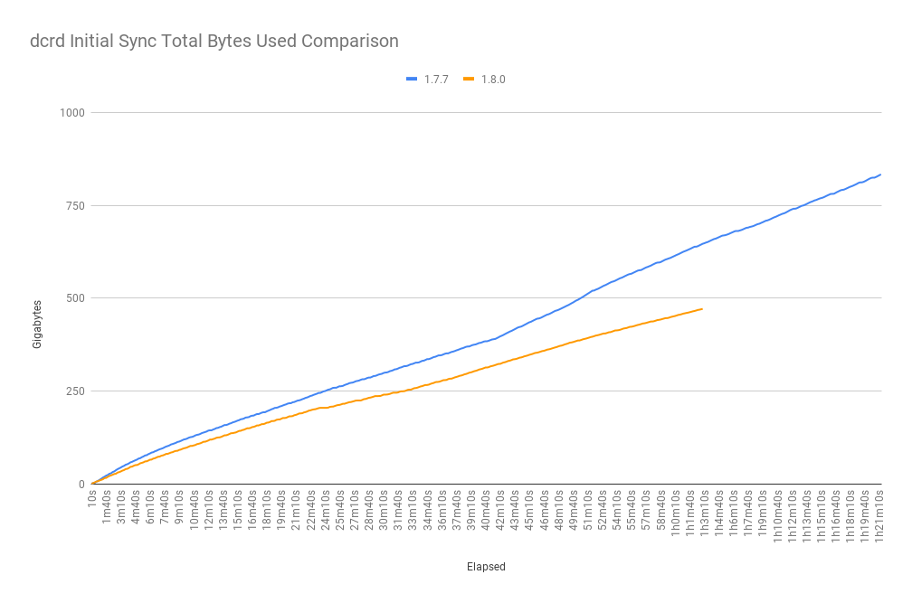
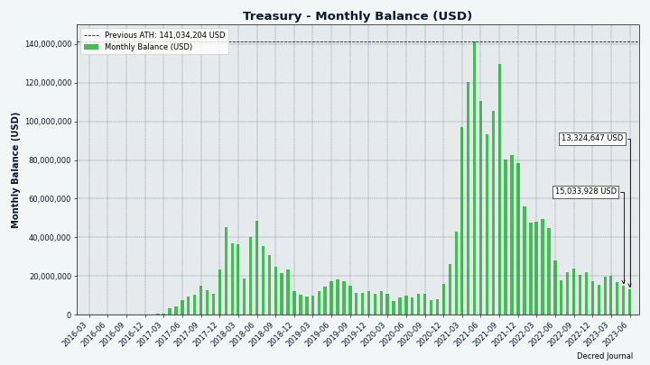
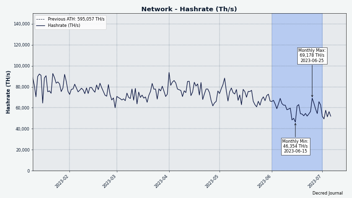
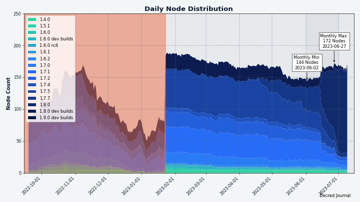
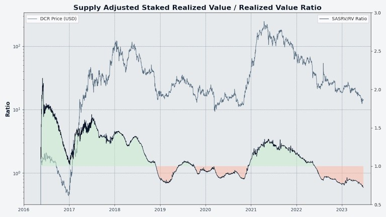

# مجلة ديكريد لشهر يونيو 2023

_الصورة: عمل فني بواسطة @Exitus_

أبرز أحداث شهر يونيو:

- تم إصدار النسخة 1.8.0 من البرنامج الأساسي لديكريد، مما أدى إلى فتح خيارات وميزات تصويت إجماع جديدة.
- تم إصدار النسخة 0.6.2 لمنصة المبادلات اللامركزية أيضًا، للتحضير للتصويت الجديد بالإجماع ونشر العديد من التحسينات الأخرى.
- بدأ التصويت للاقتراحين الجديدين المتفق عليهما (تغيير تقسيم الدعم ووظيفة تجزئة إثبات العمل) بمجرد تقدم عملية التحديث بشكل كافٍ في أوائل يوليو.
- تمت الموافقة على تمويل تطوير بنية الشبكة اللامركزية لمنصة المبادلات اللامركزية لديكريد.

المحتويات:

* [التحديث والتصويت على تغييرات الإجماع الجديدة!](#upgrade-and-vote-on-new-consensus-changes)
* [إصدار النسخة 1.8.0 للبرنامج الأساسي](#core-software-v180-release)
* [إصدار النسخة 0.6.2 لمنصة المبادلات اللامركزية لديكريد](#dcrdex-v062-release)
* [التطوير](#development)
* [الأشخاص](#people)
* [الإدارة و الحوكمة](#governance)
* [الشبكة](#network)
* [النظام البيئي](#ecosystem)
* [الانتشار](#outreach)
* [الفعاليات](#events)
* [وسائل الإعلام](#media)
* [الأسواق](#markets)
* [الخارجية ذات الصلة](#relevant-external)

<a id="upgrade-and-vote-on-new-consensus-changes" />

## التحديث والتصويت على تغييرات الإجماع الجديدة!

يتم تشجيع الجميع على التحديث إلى [أحدث إصدار من البرنامج الأساسي](https://github.com/decred/decred-binaries/releases) ليتمكنوا من التصويت على التغييرين الجديدين للإجماع واتباع السلسلة بعد تفعيلهما، إذا تمت الموافقة عليهما. للبقاء متزامنًا مع الشبكة، من المهم التحديث حتى إذا كنت لا تنوي التصويت لصالح جدول الأعمال.

لتجديد المعلومات حول حوكمة ديكريد، والتغييرات الإجماعية، والتفرعات الصلبة التي لا تقسم الشبكة، تحقق من [المستندات](https://docs.decred.org/governance/consensus-rule-voting/overview/).

يمكنك التعرف على تغييرات الإجماع في المستندات التالية:

- [تغيير تقسيم دعم إثبات العمل/إثبات الحصة إلى 1/89 وتغيير خوارزمية إثبات العمل إلى اقتراح BLAKE3](https://proposals.decred.org/record/a8501bc)
- DCP0011[: تغيير إثبات العمل إلى BLAKE3 و ASERT](https://github.com/decred/dcps/blob/master/dcp-0011/dcp-0011.mediawiki) (لم يتم نشره حتى وقت كتابة هذا التقرير)
- DCP0012[: تغيير تقسيم دعم إثبات العمل/إثبات الحصة إلى 1/89](https://github.com/decred/dcps/blob/master/dcp-0012/dcp-0012.mediawiki)

يمكن العثور على تفاصيل إضافية وتنفيذ الكود ومراجعة الكود ونتائج الاختبار في طلبات السحب  [#3115](https://github.com/decred/dcrd/pull/3115) و [#3092](https://github.com/decred/dcrd/pull/3092) التي تنفذ التغييرات على الجيتهوب.

بدأ التصويت في 4 يوليو وسيستمر حتى 1 أغسطس تقريبًا (الكتلة [786,303](https://dcrdata.decred.org/block/786303)).

يمكن تتبع تقدم التصويت في [لوحة معلومات التصويت](https://voting.decred.org/) أو [صفحة جداول أعمال ](https://dcrdata.decred.org/agendas)dcrdata.

<a id="core-software-v180-release" />

## إصدار النسخة 1.8.0 للبرنامج الأساسي

مميزات إصدار 1.8.0 المعروف أيضًا باسم ["The Forkening”](https://twitter.com/decredproject/status/1668722927661973505):

**dcrd**: تحديثان جديدان للإجماع (واللذان سيؤديان إلى تفرع السلسلة إذا تمت الموافقة عليهما)، التعدين بوحدة المعالجة المركزية BLAKE3، ورفض معاملات الرسوم المنخفضة، والعديد من التحسينات التي تؤدي إلى تقليل وقت المزامنة الأولي بنحو 20٪ وإدارة أفضل لذاكرة وقت التشغيل، وتحسين أوقات التصويت، والعديد من التحديثات الأخرى.

**dcrwallet**: دعم تغييري الإجماع الجديدين (على سبيل المثال عند التحقق من صحة الكتل أو إنشاء الأصوات)، وشراء التذاكر المخلوطة مع دعم التدرج لمزيد من الخصوصية، وجلب نفقات الخزينة في وضع التحقق البسيط من الدفع (مطلوب لتصويت TSpend في وضع التحقق البسيط من الدفع)، وطرق gRPC الجديدة للاستخدام بواسطة تطبيقات واجهة المستخدم الرسومية، وإصلاحات متعددة للأخطاء.

**ديكريديتون**: القدرة على التصويت على معاملات TSpend الفردية، مع تحديث وحدة منصة المبادلات اللامركزية لديكريد، و تحديث التخطيطات والأنماط، والعديد من إصلاحات الأخطاء والتحسين عبر جميع الصفحات/علامات التبويب.

قم بزيارة [إصدار ](https://github.com/decred/decred-binaries/releases)GitHub للحصول على قائمة كاملة بالتغييرات والتنزيلات. كما هو الحال دائمًا، نوصي [بالتحقق من الملفات](https://docs.decred.org/advanced/verifying-binaries) قبل التشغيل.

<a id="dcrdex-v062-release" />

## إصدار النسخة 0.6.2 لمنصة المبادلات اللامركزية لديكريد

من المهم التحديث إلى [إصدار لمنصة المبادلات اللامركزية ](https://github.com/decred/dcrdex/releases/tag/v0.6.2)0.6.2 للبقاء على السلسلة بعد أي تفرعات صلبة في الأشهر المقبلة. إذا لم تستخدم محفظة DCR المدمجة (المعروفة أيضًا باسم محفظة DCR الأصلية)، فقد تعمل إصدارات منصة المبادلات اللامركزية القديمة ولكن لا يزال من المستحسن التحديث.

أبرز مميزات الإصدار الجديد:

* دعم التغييرات الإجماع لبرنامج ديكريد 1.8
* تقديرات رسوم أكثر دقة لمحافظ التحقق البسيط من الدفع المضمنة لـ BTC و LTC و BCH (تأكد من تمكين "تقديرات معدل الرسوم الخارجية" في إعدادات المحفظة)
* تم تخفيض مبلغ BTC المقترح لسند التسجيل بشكل كبير
* الإصلاحات والتحسينات

تحقق من [دليل العميل](https://github.com/decred/dcrdex/wiki/Client-Installation-and-Configuration) المحدث للحصول على إرشادات خطوة بخطوة.

احصل على أحدث عميل منصة المبادلات اللامركزية [كتطبيق مستقل](https://github.com/decred/dcrdex/releases)، أو كجزء من [ديكريديتون](https://github.com/decred/decred-binaries/releases)، أو قم بتثبيته من [متجر تطبيقات ](https://github.com/decred/umbrel-app-store)Umbrel المخصص لديكريد. كما هو الحال دائمًا، نوصي [بالتحقق من الملفات](https://docs.decred.org/advanced/verifying-binaries) قبل التشغيل.

<a id="development" />

## التطوير

ما لم يُذكر خلاف ذلك، فإن العمل المَذْكُور هنا يشتمل على حالة "الدمج إلى الرئيسي". وهذا يعني أن العمل قد تم استكماله ومراجعته ودمجه في كود المصدر الذي يمكن للمستخدمين المتقدمين [بناءه وتشغيله](https://medium.com/@artikozel/the-decred-node-back-to-the-source-part-one-27d4576e7e1c)، ولكنه ليس متاحًا بعد في ثنائيات الإصدار للمستخدمين العاديين.

### dcrd

_[dcrd](https://github.com/decred/dcrd) هو تطبيق عقدة كامل يعمل على تشغيل شبكة ديكريد من نظير إلى نظير حول العالم._

دعونا أولاً نلقي نظرة على التغييرات المضمنة في الإصدار 1.8.0 الجديد.

أكبر التغييرات التي تواجه المستخدم هي الحوافز لتحديث العقد الكاملة:

* يقوم المعدنون الذين يقومون بتشغيل الإصدار 1.8 [بإنشاء إصدارات جديدة للكتلة](https://github.com/decred/dcrd/pull/3136) (10)، و في حالة ما قامت غالبية الشبكة بالتحديث [سترفض العقد إصدارات الكتلة القديمة](https://github.com/decred/dcrd/pull/3135) (9).
* تعديل منطق إشعار التصويت بحيث، بعد ارتفاع الكتلة 777,240، [لن يوافق أصحاب الحصص المصوتون على الكتل ذات الإصدارات القديمة من الكتلة](https://github.com/decred/dcrd/pull/3137). يتم تحقيق ذلك من خلال جعل dcrd لا يرسل إشعارات الكتلة الجديدة لعملاء RPC المتصلين، مثل محافظ التصويت. يجبر هذا التغيير المعدنين على الترقية إلى أحدث إصدار من الكتلة في الوقت المناسب بحيث يمكن بدء التصويت على تغييرات الإجماع الجديدة.

فيما يلي بعض الأجزاء الرئيسية التي تنفذ تحديث إجماع DCP-11، ["تغيير إثبات العمل إلى BLAKE3 و ASERT”](https://github.com/decred/dcrd/pull/3115):

* جعل *تجزئة الكتلة* و *تجزئة إثبات العمل* [منفصلين ومستقلين](https://github.com/decred/dcrd/commit/dbb6b782e0580395b3cb05333233994a70196ae7) بحيث يمكن تعديل كل تجزئة دون تغيير الأخرى. النتيجة العملية العظيمة هي أن إجماع *تجزئة الكتلة* سيبقى دون تغيير مع DCP-11، مما يعني أن جميع البرامج التي تتعامل مع التجزئة لن تحتاج إلى تعديل. تؤدي التحديثات الأصغر والمركزة إلى الحد الأدنى من التأثيرات النهائية للمستهلكين.
* إضافة [الدعم](https://github.com/decred/dcrd/commit/66a59e0d9248632575d57cf26f5f338ed60ed9f5) [لوظيفة تجزئة BLAKE3](https://en.wikipedia.org/wiki/BLAKE_(hash_function)#BLAKE3) وطرق التجزئة لحوسبة PowHashV1 (BLAKE256) القديم و[PowHashV2 (BLAKE3)](https://github.com/decred/dcrd/commit/b2878aa5c18a1a5669f769d594ec3fc4954aa779) الجديد. والجدير بالذكر أنه من غير الممكن إزالة PowHashV1 وغيرها من كود الإجماع القديم بالكامل. حتى عندما يتغير إجماع سلسة الكتل، يجب أن يظل من الممكن التحقق من صحة السلسلة القديمة. لذلك، يتم الحفاظ على كود الإجماع القديم ليكون قادرًا على التحقق من صحة سلسلة كتل ديكريد بالكامل قبل تغييرات الإجماع الأحدث. وقد وقع الإختيار ل Blake3 على تبعية الطرف الثالث [lukechampine.com/blake3](https://pkg.go.dev/lukechampine.com/blake3) - وهو تنفيذ يوازن بين الأداء وقابلية قراءة الكود، على أمل الوصول في النهاية إلى مكتبة Go القياسية. بالإضافة إلى إصدار Pure-Go، توفر الحزمة أيضًا AVX-512 وروتينًا AVX2 لزيادة الأداء. الاعتماد الإضافي الآخر هو [cpuid](https://github.com/klauspost/cpuid) - حزمة Go لاكتشاف ميزات وحدة المعالجة المركزية المتاحة.
* تم [تحديث](https://github.com/decred/dcrd/commit/6c323c18b0eb7e4035c8ceb4ac3a36230c8c9c42) الأمر `getwork` وإخطار `notifywork` websocket. يتم استخدام هذه بواسطة كود التعدين لجلب بيانات جديدة للتجزئة.
* تم تنفيذ حساب صعوبة ASERT في [كود الإجماع](https://github.com/decred/dcrd/commit/d9b1921177d4626a22c380853d6c7030a2d5c854) الذي يتحقق من صحة السلسلة، وبشكل منفصل في كود تعدين [إنشاء الكتلة](https://github.com/decred/dcrd/commit/2db55eb6e7d16aca5676cd7d473555d23b30e23f). عادة يتم تجنب تكرار الكود ولكن في هذه الحالة تم إنشاء نسختين [عن قصد](https://github.com/decred/dcrd/pull/3115#discussion_r1210399671). السبب الرئيسي هو استخدام نسخة واحدة لإيجاد الأخطاء في الأخرى، وهو مبدأ يعرف باسم [التكرار غير المتماثل](https://en.wikipedia.org/wiki/Redundancy_(engineering)#Dissimilar_redundancy). السبب الآخر هو تنفيذ تحسينات مختلفة في الإجماع وكود التعدين في المستقبل. بالنسبة لأولئك الذين يحبون الرياضيات السريعة والحيل الصغيرة، تأكد من قراءة [كود ASERT هنا](https://github.com/decred/dcrd/blob/d9b1921177d4626a22c380853d6c7030a2d5c854/blockchain/standalone/pow.go#L222).
* تنفيذ [تصويت الإجماع](https://github.com/decred/dcrd/commit/85e3701a67fa5a9a7eb418ce71fa991ede447dbb) DCP-11. سيظهر كـ `blake3pow` في برنامج التصويت.

بالإضافة إلى تغيير تجزئة إثبات العمل BLAKE3 الذي سيجعل عمال معدني ASIC لديكريد الحاليين عديمي الفائدة، ستقوم خوارزمية ASERT الجديدة بضبط الصعوبة مع كل كتلة جديدة بدلاً من كل 144 كتلة (تردد التعديل الحالي). للإشارة، يتم تحديث صعوبة التعدين في البتكوين كل 2016 كتلة، أو كل أسبوعين تقريبًا. تمثل ASERT أهدافًا صاعدة مرجحة بشكل كبير.

تعد خوارزمية ASERT أسية أيضًا، ويمكنها التعامل مع ارتفاع معدل التجزئة بشكل أفضل بكثير من الخوارزمية الحالية. سيؤدي هذا إلى تثبيط عزيمة معدني "اربح و اهرب" الذين يبحثون فقط عن مكافأة سريعة في مستوى صعوبة منخفض. يتم أيضًا التعامل بشكل أفضل مع [الانخفاضات الكبيرة في معدل التجزئة](https://github.com/decred/dcrd/pull/3115#discussion_r1205741807) الذي يتسبب في حدوث كتل بطيئة وتجربة مستخدم سيئة نتيجة لذلك. تكون الشبكة أقوى عندما يقوم المعدنون بإنشاء كتل جديدة باستمرار والحفاظ على وقت الكتلة المستهدف وهو 5 دقائق. انظر أيضا [المناقشة ذات الصلة على الماتريكس](https://matrix.to/#/!uCnoeYfbhUnvwWihzS:decred.org/$tbF9LyO1EzQ8m3JDHfX9EYnQz1zr8W0Ra73Yjtprj1M).

لتوضيح سرعة ضبط الصعوبة الجديدة، [سألنا](https://github.com/xaur/decred-news/pull/182#discussion_r1265803246) davecgh@ عن كيفية أداء الخوارزمية الجديدة في سيناريو افتراضي حيث ينخفض معدل التجزئة فجأة من 100 Ph / s إلى 20 Ph / s. التحسين هائل: استعادة وقت الكتلة المستهدف البالغ 5 دقائق سيستغرق حوالي 75 ساعة (حوالي 3.1 يومًا) في ظل الخوارزمية القديمة مقابل 20-30 دقيقة بموجب خوارزمية ASERT الجديدة.

إذا تمت الموافقة على DCP-11، بعد [فترة تحديث](https://docs.decred.org/governance/consensus-rule-voting/overview/) مدتها شهر واحد، ستتم إعادة تعيين الصعوبة إلى [قيمة محددة بتعليمات برمجية ثابتة](https://github.com/decred/dcrd/blob/a13ca3ace61d28678e1889b9a6303dd88c3dae98/chaincfg/mainnetparams.go#L115) والتي تعادل معدل تجزئة مستهدف أولي يبلغ حوالي 1.45 Th/s. هذا الرقم مهم للغاية لأنه سيتم تعديله بسرعة كبيرة بسبب خوارزمية الصعوبة الجديدة.

_الصورة: محاكاة خوارزمية صعوبة ASERT التي تتفاعل مع معدل التجزئة المستقر والمتزايد و المتناقص بسرعة._

كمرجع، تم الانتهاء من العمل الخاص بـ DCP-12 "تغيير تقسيم دعم إثبات العمل/إثبات الحصة إلى 1/89" ومناقشته في إصدار [أبريل](202304.md#dcrd). تمت مراجعة اقتراح تغيير ديكريد نفسه ونشره في يونيو، وهو [متاح الآن في مستودع مقترحات تغيير ديكريد](https://github.com/decred/dcps/blob/master/dcp-0012/dcp-0012.mediawiki).

مثل جميع تغييرات الإجماع السابقة، سيظل كود الإجماع خاملاً ويتم تفعيله فقط إذا مرت [جداول أعمال التصويت](https://voting.decred.org/) المعنية.

تم تحديث قيمتين مشفرتين كجزء من دورة تطوير الإصدار: كتلة [`AssumeValid`](https://github.com/decred/dcrd/pull/3122) و [`MinKnownChainWork`](https://github.com/decred/dcrd/pull/3123).

للإشارة، اعتبارًا من [مايو ](202205.md#development)2022، استبدل `AssumeValid` طريقة "نقاط التحقق" القديمة لتحسين التنزيلات الأولية لسلسلة الكتل. مع `AssumeValid`، يتم رفض التفرعات القديمة جدا لسلسلة الكتل، ويتم تخطي بعض فحوصات التحقق من الكتل التي هي أسلاف الكتلة الصالحة المفترضة. هذا يمكن أن يسرع بشكل كبير لتنزيلات الأولية لسلسلة الكتل. يتم التحقق من تحديثات `AssumeValid` و `MinKnownChainWork` خارجيًا وتحديدها بتعليمات برمجية ثابتة من قبل المطورين، وتستخدم افتراضيًا دون أي إجراء يتطلبه مسؤولو العقدة. ملاحظة: من الممكن تغيير هذا السلوك باستخدام الأعلام `--allowoldforks` و `--assumevalid` كما هو موضح في `dcrd --help` أو في [الكود](https://github.com/decred/dcrd/blob/255ef183f66567f1e623026eb524f9cd26fd2b23/chaincfg/mainnetparams.go#L129)، ولكن لا يوصى بذلك لمشرفي العقدة النموذجيين.

[استبدل](https://github.com/decred/dcrd/pull/2000) `MinKnownChainWork` نقاط التفتيش القديمة كطريقة أفضل لتحديد ما إذا كانت سلسلة الكتل حديثة. على عكس `AssumeValid`، لا يمكن تعطيلها وليس هناك سبب لأن هذه القيمة لا يمكن إبطالها من خلال إعادة تنظيم السلسلة. في حين أن كتلة معينة قد تصبح أو لا تصبح جزءًا من سلسلة الكتل الرئيسية، فإن الحد الأدنى من أعمال السلسلة المعروفة لا يمكن أن ينخفض أبدًا.

أخيرًا، فيما يلي تغييرات الإصدار 1.8.0 ذات الصلة بالمطورين:

* تم إصدار إصدارات وحدة جديدة كجزء من دورة الإصدار العادية. يمكن للمطورين الذين يعتمدون على dcrd الآن أن يستهلكوا وحدات Go المحدثة التالية: [addrmgr](https://github.com/decred/dcrd/pull/3121) و [blockchain](https://github.com/decred/dcrd/pull/3133) و [blockchain/standalone](https://github.com/decred/dcrd/pull/3120) و [blockchain/stake](https://github.com/decred/dcrd/pull/3131) و [chaincfg](https://github.com/decred/dcrd/pull/3125) و [connmgr](https://github.com/decred/dcrd/pull/3124) و [database](https://github.com/decred/dcrd/pull/3130) و [dcrutil](https://github.com/decred/dcrd/pull/3129) و [gcs](https://github.com/decred/dcrd/pull/3132) و [hdkeychain](https://github.com/decred/dcrd/pull/3127) و [peer](https://github.com/decred/dcrd/pull/3128) و [rpcclient](https://github.com/decred/dcrd/pull/3134) و [txscript](https://github.com/decred/dcrd/pull/3126) و [wire](https://github.com/decred/dcrd/pull/3119) و [الوحدة الرئيسية](https://github.com/decred/dcrd/pull/3138).
* تحديث إطار اختبار الادماج (dcrtest) و[إعادة تمكين اختبار الخزينة](https://github.com/decred/dcrd/pull/3118). تم [تعطيله مؤقتًا](https://github.com/decred/dcrd/issues/3093) للتغلب على مشكلة التبعية الدائرية.
* تم تحديث [تهيئة Go CI و ](https://github.com/decred/dcrd/commit/ab6d284362de7a30f623289bb1523ecc395c18ca)linters.

_الصورة: تحسين توزيع الذاكرة في إصدار dcrd 1.8.0. التوزيع الأقل هو الأفضل، فهو يترجم إلى استخدام أقل لوحدة المعالجة المركزية وأوقات مزامنة أسرع._

تم دمج العمل التالي في الفرع الرئيسي `master` نحو الإصدارات المستقبلية:

* تم التحديث لاستخدام أحدث [dcrtest](https://github.com/decred/dcrd/pull/3142)، واستبعاد [الوحدات غير المستخدمة](https://github.com/decred/dcrd/pull/3143) من الإصدارات العادية.
* تحديث [صورة Docker](https://github.com/decred/dcrd/pull/3146) لبناء ثنائي dcrd باستخدام Go و Alpine Linux الأحدث. من الجدير بالذكر أن قالب dcrd Docker لا يستمر في نظام التشغيل Alpine Linux. بعد بناء الثنائي، تتم إزالة نظام التشغيل، ويتم تشغيل dcrd في حاوية مسودة `scratch` Docker بمفردها. لا نظام تشغيل، لا مستخدم جذري، ولا حتى غلاف. [حاوية خفيفة الوزن مع أقصى درجات الأمان](https://github.com/decred/dcrd/tree/4aa67947b5b36d40bb146d5ecacb76dcb7f50a7f/contrib/docker).
* تمت [إضافة ملاحظات الإصدار للنسخة ](https://github.com/decred/dcrd/pull/3144)1.8.0.
* تنظيف [منطق اختبار قاعدة البيانات](https://github.com/decred/dcrd/pull/3147).
* تمت إضافة [قوالب ملاحظات الإصدار](https://github.com/decred/dcrd/pull/3148).
* تمت إضافة [دعم ](https://github.com/decred/dcrd/pull/3145)CI للاختبار وذاكرة التخزين المؤقت للوحدة، مما سيؤدي إلى تشغيل أسرع ل CI .CI هي مختصر للإدماج المستمر، وهي خدمة تعمل على إنشاء الكود واختباره باستمرار لضمان *إدماج* جميع التغييرات بشكل جيد. تعمل عمليات تشغيل CI الأسرع على تقليل وقت انتظار المطورين لمعرفة ما إذا كانت تغييراتهم تجتاز جميع الاختبارات. تقلل ذاكرة التخزين المؤقت وقت تشغيل CI من 10 إلى دقيقة واحدة.
* تم تحديث [المخطط الهرمي للوحدة النمطية](https://github.com/decred/dcrd/pull/3149) ليعكس بدقة تبعيات الوحدة النمطية.
*[ تحسين التعامل مع علم الاختبار](https://github.com/decred/dcrd/pull/3151)، خاصة في الحالات التي يتعذر فيها الوصول إلى أدلة الصفحة الرئيسية الافتراضية (مثل نظام التشغيل NixOS) وتحتاج إلى التغيير. بالإضافة إلى ذلك، يمكن الآن استخدام متغير البيئة [`DCRD_APPDATA`](https://github.com/decred/dcrd/pull/3152) لتجاوز الدليل الافتراضي. المتغيرات البيئية هي هي النهج المفضل لتجاوز الافتراضات في الحاويات.

التغييرات التي تم دمجها في إطار عمل [dcrtest](https://github.com/decred/dcrtest):

* تم تحديث محفظة التصويت لدعم [DCP-12](https://github.com/decred/dcrtest/pull/12) دلالات تقسيم مكافآت الكتلة على شبكة المحاكاة.
* تم تحديث محفظة التصويت لدعم [DCP-11](https://github.com/decred/dcrtest/pull/14) دلالات إثبات العمل على شبكة المحاكاة.
* تم التحديث لاستخدام أحدث تبعيات [الوحدة النمطية لديكريد](https://github.com/decred/dcrtest/pull/15) وأحدث [وحدة dcrd رئيسية](https://github.com/decred/dcrtest/pull/16).

### dcrwallet

_[dcrwallet](https://github.com/decred/dcrwallet) هو خادم محفظة تستخدمه تطبيقات سطر الأوامر والمحفظة الرسومية._

التغييرات التي تم تضمينها في الإصدار 1.8.0 الجديد:

* تأكد من أن المحفظة يمكنها التحقق بشكل صحيح من صحة الكتل المعدنة إما باستخدام BLAKE-256[ الأصلي أو تجزئة إثبات العمل ](https://github.com/decred/dcrwallet/pull/2240)BLAKE3 القادمة، وتحديث إصدار التصويت.
* لدى مشتريات التذاكر المخلوطة الآن  [تأخير عشوائي من 20 إلى 60 ثانية](https://github.com/decred/dcrwallet/pull/2244) قبل أن * تنشر المحفظة كل معاملة إلى مجمع الذاكرة. سيؤدي هذا التأثير الضئيل إلى تحسين الخصوصية من خلال جعل الأمر أكثر صعوبة على أي شخص يراقب مجمع الذاكرة لربط التذاكر معًا بناءً على الطابع الزمني المنشور.
* تم تحديث [الوحدتين dcrd و ](https://github.com/decred/dcrwallet/pull/2241)cspp إلى أحدث إصداراتها. تم إصدار النسخة 3.0.0 لوحدة dcrwallet للمستهلكين مثل vspd أو منصة المبادلات اللامركزية لديكريد أو بوليتيا.

تم دمج العمل التالي في الفرع الرئيسي `master` نحو الإصدارات المستقبلية:

* تم تحديث [README](https://github.com/decred/dcrwallet/pull/2247) للأشخاص الذين يقومون بالبناء من المصدر.
* ترقية النسخة الرئيسية [لوحدة ](https://github.com/decred/dcrwallet/pull/2248) dcrwallet قيد التطوير إلى النسخة 4 للتحضير للتغييرات المستقبلية.
* تمت إزالة خيار مهمل من تكوين المحفظة الداخلية والذي مكّن إعادة استخدام [`AddressReuse`](https://github.com/decred/dcrwallet/pull/2258) التلقائي في بعض الوظائف مثل مشتري التذاكر. تم [إهمال](https://github.com/decred/dcrwallet/pull/1442) الخيار في الأصل و[إزالته](https://github.com/decred/dcrwallet/pull/1676) من الحزمة الرئيسية لأن إعادة استخدام العناوين يضر بالخصوصية. توقفت المحفظة عن استخدام خيار `AddressReuse`، لكنها تُركت مهملة في الحزمة الداخلية للحفاظ على توافق الكود في ذلك الوقت.
* الصيانة: تعديل التسجيل وتنظيف الكود واختبار تحديثات الكود لـ Go 1.21.

العمل المنجز لدمج كود مزود خدمة التصويت في مستودع vspd:

* تم تحديث dcrwallet مع vspd و[تقليل التبعيات](https://github.com/decred/dcrwallet/pull/2238) بين عميل مزود خدمة التصويت و dcrwallet.
* نقل منطق [اختيار التذاكر غير المُدارة](https://github.com/decred/dcrwallet/pull/2257) من وحدة عميل مزود خدمة التصويت إلى وحدة المحفظة.
* إعادة التشكيل الداخلي، التنظيف، إضافة المزيد من الاختبارات.

الهدف النهائي من هذه التغييرات هو استخراج عميل مزود خدمة التصويت من dcrwallet وإلى vspd بحيث يمكن إعادة استخدامه في منصة المبادلات اللامركزية لديكريد، مما يتيح لمنصة المبادلات اللامركزية لديكريد شراء التذاكر وتسجيلها مع مزود خدمة التصويت. سيسمح عميل مزود خدمة التصويت لمنصة المبادلات اللامركزية لديكريد بتوفير ميزات تحصيص ديكريد والتصويت في وضع خفيف (التحقق البسيط من الدفع) دون الحاجة إلى تنزيل سلسلة الكتل بأكملها. يمكن أن تستفيد المحافظ الأخرى المكتوبة بلغة البرمجة Go من هذا أيضًا.

### dcrctl

_[dcrctl](https://github.com/decred/dcrctl) هو عميل سطر أوامر لـ dcrd و dcrwallet._

* تحديثات الإصدار 1.8.0: استخدم أحدث [وحدات dcrd و dcrwallet](https://github.com/decred/dcrctl/pull/60) التي تم إصدارها حتى يمكن الوصول إلى جميع وظائفها الجديدة.

### Decrediton

_[Decrediton](https://github.com/decred/decrediton) ديكريديتون هو تطبيق محفظة لسطح المكتب كامل الميزات مع ميزة التصويت مدمجة، وميزة الخلط ب StakeShuffle، والشبكة البرقية، والتداول على منصة المُبادلات اللامركزية DEX للديكريد، والمزيد. يتم تشغيلها مع سلسلة الكتل كاملة أو بدونها (وضع التحقق البسيط من الدفع SPV)._

التغييرات التي تم تضمينها في الإصدار 1.8.0 الجديد:

* تم تحديث منصة المبادلات اللامركزية لديكريد إلى [الإصدار ](https://github.com/decred/decrediton/pull/3871)0.6.1.
* تمت [إزالة صفحات التحصيص لمحافظ الأجهزة](https://github.com/decred/decrediton/pull/3870)، لأنها لا تستطيع المشاركة في التحصيص. كما تمت إضافة تحذيرات بعدم استخدام محافظ الأجهزة لتلقي أموال التحصيص أو الخزينة، لأن محافظ الأجهزة لا يمكنها إنفاق هذه الأموال.
* تمت إضافة [ملاحظات الإصدار](https://github.com/decred/decrediton/pull/3878 داخل التطبيق للنسخة 1.8.0.
* تم تحديث [الترجمة البولندية](https://github.com/decred/decrediton/pull/3850).
* تم تحديث [البيانات الوصفية للتطبيقات](https://github.com/decred/decrediton/pull/3872) للمنشورات الرسمية، كجزء من [العمل المنجز](https://github.com/microsoft/winget-pkgs/pull/106493) لإضافة ديكريديتون إلى مستودع حزم [winget](https://en.wikipedia.org/wiki/Windows_Package_Manager).
* تم إصلاح خطأ يحدث عندما يقطع الأشخاص الاتصال بين ديكريديتون ومحفظة منصة المبادلات اللامركزية. السلوك الافتراضي عند استخدام منصة المبادلات اللامركزية من ديكريديتون هو أن هناك محفظة واحدة فقط تتحكم فيها ديكريديتون وتستخدم منصة المبادلات اللامركزية ذلك ببساطة. ومع ذلك، يمكن للمستخدمين قطع هذا الاتصال وإجبار نوع محفظة منصة المبادلات اللامركزية على “التحقق البسيط من الدفع"، مما يؤدي إلى إنشاء محفظة جديدة تمامًا تُدار بالكامل بواسطة منصة المبادلات اللامركزية. ستظل محفظة ديكريديتون الرئيسية تعمل، لكنها لم تعد قادرة على التحكم في المحفظة الجديدة التي أنشأتها منصة المبادلات اللامركزية وستتسبب في حدوث أخطاء في بعض الحالات. تم [إصلاح الخطأ](https://github.com/decred/decrediton/pull/3866) من خلال عدم السماح لديكريديتون بمحاولة تغيير كلمة المرور على محفظة منصة المبادلات اللامركزية التي لم تعد تتحكم فيها. ومع ذلك، لا يزال يتعين على المستخدمين تجنب هذا التكوين غير المألوف وعدم تغيير نوع المحفظة من داخل المكون الإضافي DEX.
* تحديثات وإصلاحات طفيفة أخرى بما في ذلك بعض الأخطاء الإملائية وتبعيات الترقية.
* تم تحديث [البيانات الوصفية لتطبيقات](https://github.com/decred/decrediton/pull/3872) المنشورات الرسمية، كجزء من [العمل المنجز](https://github.com/microsoft/winget-pkgs/pull/106493) لإضافة ديكريديتون إلى مستودع حزم [winget](https://en.wikipedia.org/wiki/Windows_Package_Manager).

تم دمج العمل التالي في الفرع الرئيسي `master` نحو الإصدارات المستقبلية:

* تم التحديث إلى [النسخة 0.6.2 لمنصة المبادلات اللامركزية](https://github.com/decred/decrediton/pull/3882)، وهو مطلوب لتتبع التفرعات الصلبة لديكريد 1.8.0  بسبب تغييرات الإجماع. بالإضافة إلى ذلك، يعمل هذا على إصلاح الخطأ "احتياطي الاستجابة  قصير جدًا" والذي أبلغ عنه بعض المستخدمين.
* تحديث [الترجمة العربية](https://github.com/decred/decrediton/pull/3847).
* إصلاح نص العنصر المساعد في [الدروس التمهيدية](https://github.com/decred/decrediton/pull/3881). يضيف هذا أيضًا عملًا فنيًا مناسبًا للإصدار 1.8.
* تحديث [تبعيات الويب](https://github.com/decred/decrediton/pull/3876).
* تم التحديث إلى إصدار [Electron v23.3.8](https://github.com/decred/decrediton/pull/3884) من الإصدار 18.3.15. من بين أشياء أخرى، يسمح هذا لديكريديتون بالاتصال بأجهزة USB، وهو أمر مطلوب لبعض محافظ الأجهزة مثل Ledger. نظرًا لأن [WebUSB](https://en.wikipedia.org/wiki/WebUSB) مدمج في الإصدارات الأحدث من Electron، فهذا يعني أن المطورين ليسوا مضطرين لاستخدام التبعيات الخارجية، وهو أمر جيد للأمن.

قيد التطوير:

* كما ذكرنا [الشهر الماضي](202305.md#decrediton)، يستمر العمل [لإضافة دعم ليدجر](https://github.com/decred/decrediton/issues/3865)، لا سيما [واجهة مستخدم ليدجر](https://github.com/decred/decrediton/pull/3874)](https://github.com/decred/decrediton/pull/3874). كانت التطورات الجديدة الأكثر إثارة للاهتمام لشهر يونيو هي العمل على إضافة [وظائف خلفية](https://github.com/decred/decrediton/pull/3869) ليدجر حتى تتمكن واجهة المستخدم بالفعل من التفاعل مع ليدجر نفسه. لا تكمن الصعوبة الأساسية في التحقق من أن الوظائف تعمل على النحو المنشود فحسب، بل تكمن في [إزالة أكبر عدد ممكن من التبعيات](https://github.com/decred/decrediton/pull/3869#discussion_r1221483673) لتقليل المخاطر الهائلة [لهجمات سلسلة توريد](https://en.wikipedia.org/wiki/Supply_chain_attack) التبعية. يستخدم برنامج ليدجر [العديد من التبعيات](https://npmgraph.js.org/?q=%40ledgerhq%2Fhw-app-btc)، وإذا تعرضت أي من هذه التبعيات للخطر من قبل جهة فاعلة سيئة، فقد يعرض أمن المحفظة للخطر. لذلك، فإن مطورو ديكريد يهتمون بشدة للحصول على هذا الاندماج بشكل صحيح.

### بوليتيا

_[بوليتيا](https://github.com/decred/politeia) هي نظام اقتراح ديكريد. يتم استخدامها لطلب التمويل من خزينة ديكريد._

* تحديثات التطوير الداخلية: تتطلب إما Go 1.19[ أو 1.20](https://github.com/decred/politeia/pull/1690)؛ [تحسين](https://github.com/decred/politeia/pull/1691) [الفحص](https://github.com/decred/politeia/pull/1692) [و](https://github.com/decred/politeia/pull/1693) [التسجيل](https://github.com/decred/politeia/pull/1689).
* تم [إصلاح الخلل](https://github.com/decred/politeia/pull/1688) الذي يتسبب في تعطل خادم ويب بوليتيا عند محاولة معالجة دفعة تسجيل مستخدم جديد إذا تعذر العثور على المعاملة. الآن، إذا تعذر العثور على المعاملة، فسيرد الخادم ببساطة بأن المستخدم لم يدفع بعد.

### vspd

_[vspd](https://github.com/decred/vspd) هو برنامج خادم لتشغيل موفر خدمة التصويت. يصوت موفر خدمة التصويت نيابة عن مستخدميه على مدار الساعة طوال أيام الأسبوع ولا يمكنه سرقة الأموال._

التغييرات التي تم تضمينها في [إصدار النسخة 1.2.0](https://github.com/decred/vspd/releases/tag/release-v1.2.0):

* [صقل](https://github.com/decred/vspd/pull/390) مستندات مشرف vspd وإضافة [ملاحظات الإصدار](https://github.com/decred/vspd/pull/393) الجديدة التي تتضمن تغييرات ملحوظة منذ مارس 2022 وإرشادات التحديث.

تحديثات التطوير الداخلية: 

* تحديث [linters](https://github.com/decred/vspd/pull/384)، و[تشفير قاعدة البيانات](https://github.com/decred/vspd/pull/384) المعاد تصميمها، وتحديثها لاستخدام أحدث [وحدات](https://github.com/decred/vspd/pull/392) [dcrd](https://github.com/decred/vspd/pull/387) و [dcrwallet](https://github.com/decred/vspd/pull/388) في العميل و[الخادم](https://github.com/decred/vspd/pull/389)، مع تحديث [إطار عمل ويب](https://github.com/decred/vspd/pull/391) Gin.

التغييرات التي تم دمجها في الفرع الرئيسي `master` نحو الإصدارات المستقبلية:

* تم تحديث واجهة مستخدم ويب المشرف ل[إظهار معاملات الرسوم التي يمكن للبشر قراءتها](https://github.com/decred/vspd/pull/397) بدلاً من وحدات البايت الأولية فقط. تضمن تحسين جودة الحياة لمشرفي مزود خدمة التصويت أيضًا بعض الميزات الإضافية مثل إدخال بحث أفضل عن التذاكر وتنسيق أفضل ل JSON.

### dcrpool

_[dcrpool](https://github.com/decred/dcrpool) هو برنامج خادم لتشغيل مجمع التعدين._

* تم تحديث [تهيئة وتبعيات CI](https://github.com/decred/dcrpool/pull/340) لاستخدام وحدات Go 1.20 و PostgreSQL 15 و dcrd و dcrwallet من الإصدار 1.8.0، والاعتمادات الأحدث للجهات الخارجية، وتمكين الأدوات الإضافية للتحقق من الكود (المعروفة أيضًا باسم linters).

### الشبكة البرقية

_[dcrlnd](https://github.com/decred/dcrlnd) هو برنامج عقدة الشبكة البرقية لديكريد. تتيح الشبكة البرقية إجراء معاملات فورية ومنخفضة التكلفة._

* تم التحديث لاستخدام أحدث وحدات [dcrd](https://github.com/decred/dcrlnd/pull/184) و [dcrwallet](https://github.com/decred/dcrlnd/pull/171) من إصدار النسخة 1.8.0.
* تحسين وقت [بدء التشغيل](https://github.com/decred/dcrlnd/pull/186) لـ dcrlnd ونقل بعض التغييرات في المنبع لتسهيل الأمر. يعتمد التحسين على توفير وصول سريع للمدفوعات أثناء الرحلة وتخطي الفحص الباهظ لجميع المدفوعات التاريخية عند بدء التشغيل.
* تم تحديث مخرج `dcrlncli --version` ليكون [متسقًا](https://github.com/decred/dcrlnd/pull/185) مع برامج ديكريد الأخرى.
* تم تحديث [تكوينات CI](https://github.com/decred/dcrlnd/pull/183) للبنيات العادية وبناء Docker.
* ترقية الإصدار إلى [النسخة ](https://github.com/decred/dcrlnd/pull/171)0.4.0 ليعكس التغييرات الفاصلة منذ الإصدار 0.3.8.
* تم تحويل الاختبارات من حزمة `rpctest` القديمة من مستودع dcrd لاستخدام إطار عمل [dcrtest](https://github.com/decred/dcrtest) الجديد.

### cspp

_[cspp](https://github.com/decred/cspp)  هو خادم لتنسيق عمليات خلط العملات باستخدام بروتوكول CoinShuffle++. وهو غير احتجازي، أي لا يحتفظ بأي أموال._

* تم تغيير [مهلات الإرسال والاستلام](https://github.com/decred/cspp/pull/82) لخادم المزيج الذي تم تغييره ليتم حسابها مسبقًا بناءً على بداية المزيج. يؤدي هذا إلى تنفيذ جدول زمني أكثر قوة للمواعيد النهائية لكل خطوة من خطوات بروتوكول الخلط. تم زيادة المهلات من جانب العميل بشكل كبير. لا يحتاج العملاء إلى تتبع المواعيد النهائية للبروتوكول بدقة لأنه يتم تنسيقها بواسطة الخادم. تسمح المهلات الأكبر من جانب العميل بالمرونة لضبط المواعيد النهائية على الخادم دون الحاجة إلى تحديث برنامج العميل.
* تمت إضافة وظيفة [`StartSolver`](https://github.com/decred/cspp/commit/ea898fb6341ed8173f7cf51f8542a4df1d7e19ae) التي تسمح لعملاء RPC ببدء عملية حل الخلفية واكتشاف مشكلات بدء التشغيل في وقت مبكر قبل بدء جلسة الخلط.
* تم تحديث [التبعيات](https://github.com/decred/cspp/pull/96).

### DCRDEX

_[DCRDEX](https://github.com/decred/dcrdex) هي منصة مبادلات غير احتجازية للمُبادلات غير الموثوقة، مدعومة بالمقايضات الذرية._

التغييرات المتضمنة في إصدار النسخة 0.6.2:

* تحسين [نص مساعدة يشرح السندات](https://github.com/decred/dcrdex/pull/2402) في تدفق التسجيل. يعتمد هذا على التعليقات الواردة من المجتمع والمستخدمين الآخرين الجدد في ديكريد.
* BTC: تحسين [الوديعة الأولية المطلوبة للسندات](https://github.com/decred/dcrdex/pull/2392) لتكون أقل بكثير، حوالي 0.004 BTC (100 دولار) مقابل 0.06 BTC (1,500 دولار). هذا سيجعل من السهل على جلب مستخدمين الجدد.
* تم التحديث إلى أحدث [وحدات](https://github.com/decred/dcrdex/pull/2403) dcrd و dcrwallet من الإصدار 1.8.0.
* تم تمكين استخدام [معلومات الرسوم الخارجية](https://github.com/decred/dcrdex/pull/2391) لمحافظ التحقق من الدفع البسيطة مثل محافظ منصة المبادلات اللامركزية المدمجة أو محافظ Electrum. يعمل هذا مع الأصول القائمة على BTC: BTC و LTC و BCH. قبل هذا التغيير، كان من الممكن دفع [رسوم عالية](https://github.com/decred/dcrdex/issues/2354) بشكل غير معقول في بعض السيناريوهات.
* تحسين تحميل [أصول واجهة المستخدم الرسومية الثابتة](https://github.com/decred/dcrdex/pull/2398) في المتصفح. سيتم الآن تحميل ملفات CSS وملفات JavaScript والصور والخطوط بشكل أسرع.
* تم إصلاح الخلل حيث يمكن أن يستمر تدفق التسجيل [دون انتظار إيداع أموال سندات كافية](https://github.com/decred/dcrdex/pull/2392).
* تم إصلاح خطأ حيث كانت صفحة الإعدادات تستخدم [مبالغ مالية](https://github.com/decred/dcrdex/pull/2402) غير صحيحة للسندات.
* تمت إضافة حل بديل [لخطأ اقتطاع](https://github.com/decred/dcrdex/pull/2389) قاعدة بيانات Badger الذي قد يحدث على Windows. * تركز قاعدة بيانات Badger على كونها [مقاومة للانهيار دون فقدان أي بيانات](https://github.com/dgraph-io/badger/issues/601)، وإحدى الطرق التي يتم بها ذلك هي تخزين البيانات في الذاكرة قبل الكتابة على القرص. يتعامل Windows مع الملفات المعينة للذاكرة بشكل مختلف عن أنظمة التشغيل الأخرى من حيث أنه يقوم بتخصيص جزء كبير من الذاكرة بشكل عام قبل كتابة ملفات أصغر فيه. [يحتاج Windows إلى اقتطاع تخصيص الذاكرة](https://github.com/dgraph-io/badger/issues/744) هذا قبل الكتابة على القرص، لكن أنظمة التشغيل الأخرى لا تفعل ذلك. يجعل تحديث منصة المبادلات اللامركزية لديكريد كل شيء يعمل بسلاسة حتى بعد الأعطال، و[لا يوجد خطر فقدان البيانات](https://github.com/dgraph-io/badger/issues/476#issuecomment-388463701).

جميع التغييرات المبلغ عنها أدناه هي من أجل الإصدار التالي.

العميل:

* تمت إضافة دعم [لاتصال ](https://github.com/decred/dcrdex/pull/2345)HTTPS بين الواجهة الأمامية للعميل (واجهة مستخدم المتصفح) والواجهة الخلفية (عملية `dexc`). عند تشغيل `dexc` على شبكة عامة، يتم تمكين HTTPS افتراضيًا، وإلا يمكن فرضه بعلامة `--webtls`. سيعرض المتصفح تحذيرًا مخيفًا بشأن الشهادة الموقعة ذاتيًا ولكن يمكن تجاوزها.
* تمت إضافة [تعريفات أدوات](https://github.com/decred/dcrdex/pull/2357) لشرح أرصدة المحفظة المختلفة (المتاحة، المقفلة، غير الناضجة، احتياطيات السندات).
* تمت إضافة خيار لوحة النظام للحفاظ على [تشغيل منصة المبادلات اللامركزية](https://github.com/decred/dcrdex/pull/2367) حتى بعد إغلاق جميع النوافذ.
* تم [تحديث](https://github.com/decred/dcrdex/pull/2383) صفحة wiki الخاصة [بتثبيت العميل والتكوين](https://github.com/decred/dcrdex/wiki/Client-Installation-and-Configuration)  لجعلها أكثر وضوحًا وإيجازًا وتحديثًا مع أحدث إصدار. تتمثل إحدى الإضافات الملحوظة في ملخص جدول لأنواع المحافظ المدعومة لكل أصل.
* تم إصلاح الخلل حيث كان يظهر [زر التسريع](https://github.com/decred/dcrdex/pull/2414) للصفقات الملغاة (الملغاة).

البتكوين:

* [إعادة تدوير](https://github.com/decred/dcrdex/pull/2368) عناوين الاستعادة والاسترداد غير المستخدمة. تنشئ منصة المبادلات اللامركزية عناوين البتكوين جديدة لاستخدامها في عمليات الاسترداد (اكتمل التداول بشكل طبيعي) والمبالغ المستردة (تم إلغاء التداول واستعادة الأموال). العديد من العناوين ينتهي بها الأمر غير مستخدمة. في المحافظ الهرمية الحتمية (HD)، قد يؤدي ذلك إلى إنشاء فجوات بين العناوين المستخدمة أكبر من حد الفجوة، مما قد يتسبب في مشاكل في اكتشاف الأموال واستعادة المحافظ من البداية. لتجنب * تجاوز [حد الفجوة](https://blog.lopp.net/mind-the-bitcoin-address-gap/)، سيتم حفظ العناوين التي تم إنشاؤها والتي لم يتم استخدامها لعمليات الاسترداد أو المبالغ المستردة واستخدامها في التداولات المستقبلية.
* تم إصلاح [تعطل](https://github.com/decred/dcrdex/pull/2396) محفظة BTC المدمجة عند المزامنة. [كشف](https://github.com/decred/dcrdex/issues/1690) اختبار محافظ منصة المبادلات اللامركزية عن حدوث [عطل](https://github.com/btcsuite/btcwallet/issues/827) في كود المنبع ل btcwallet. ساهم مطورو منصة المبادلات اللامركزية في التحقيق فيه و[إصلاحه](https://github.com/btcsuite/btcwallet/pull/870).
* نفذت وظيفة [لوضع طلبات متعددة دفعة واحدة](https://github.com/decred/dcrdex/pull/2362). سيتم استخدام هذا من قبل بوتات صانع السوق وقد يفتح لك تحسينات التداول.

Polygon (MATIC):

* تم تنفيذ العديد من العناصر الأولية ذات المستوى المنخفض و[مجموعة الاختبار](https://github.com/decred/dcrdex/pull/2399) للمساعدة في تطوير دعم Polygon. كان الجهاز قادرًا على مزامنة الأرصدة وإرسال الأموال على شبكة المحاكاة و شبكة الاختبار. تمت إعادة * صياغة كود الإيثيريوم الحالي ليكون أكثر عمومية وقابلية لإعادة الاستخدام بواسطة كود Polygon.
* تمديد [مجموعة الاختبار](https://github.com/decred/dcrdex/pull/2413) لإنشاء عقدتين، ووصلهما معًا، وتعدين الكتل.

تغليف التطبيقات:

* تمت إضافة برامج نصية للتعبئة لإنشاء [مُثبِّت DMG لنظام التشغيل macOS](https://github.com/decred/dcrdex/pull/2333).
* تم إنشاء [حزمة منصة المبادلات اللامركزية لديكريد](https://aur.archlinux.org/packages/dcrdex) في مستودع مستخدم Arch (AUR). في توزيعات Linux التي تعتمد على Arch أو Arch مثل Manjaro، يمكن تثبيتها بأمر متفائل مثل `$ yay dcrdex`. تم [تحديث](https://github.com/decred/dcrdex/pull/2347) الوثائق بقائمة بالحزم الحالية والقادمة لمختلف أنظمة التغليف.

الخادم:

* تعتمد حدود الطلبات المتغيرة على [قوة السند](https://github.com/decred/dcrdex/pull/2411). ستؤدي زيادة فئة السندات عن طريق قفل المزيد من الأموال إلى فتح أحجام طلبات أكبر. يتم أيضًا تقليل حد الطلب بسبب السلوك السيئ مثل عدم إكمال المقايضات. يجب أن يصلح هذا التغيير عدم القدرة على تقديم الطلبات لبعض المستخدمين. نظام الجزاء والمكافآت لا يزال قيد التنفيذ.

تغييرات المطور والتغييرات الداخلية:

* تم تحديث شبكة محاكاة لسلسلة الكتل [بإثبات عمل جديد](https://github.com/decred/dcrdex/pull/2358).
* تمت إضافة نصوص برمجية [لتحديث مخازن ذاكرة التخزين المؤقت] (https://github.com/decred/dcrdex/pull/2363).
* تمكين [التخزين المؤقت](https://github.com/decred/dcrdex/pull/2390) لمخرجات إنشاء Go التي تنتجها إجراءات GitHub. يؤدي هذا إلى تجنب العديد من عمليات إعادة الترجمة غير الضرورية ويسرع عمليات الإنشاء والاختبارات، والتي يتم تشغيلها لكل طلب سحب. نتيجة لذلك، يستغرق الأمر وقتًا أقل لمعرفة ما إذا كان التغيير الجاري تطويره يفسد أي اختبارات.

_الصورة: تحسين مقدمة السندات في منصة المبادلات اللامركزية لديكريد_

_الصورة أنواع المحفظة التي تدعمها منصة المبادلات اللامركزية لديكريد_

### dcrdata

_[dcrdata](https://github.com/decred/dcrdata) هو مستكشف لبيانات سلسلة كتل ديكريد وخارج السلسلة مثل مقترحات بوليتيا والأسواق والمزيد._

* تم التحديث لاستخدام أحدث [وحدات ](https://github.com/decred/dcrdata/pull/1968) dcrd النمطية التي تم إصدارها في الإصدار 1.8.0. هذا يجعل dcrdata وعملائها مثل ديكريديتون على دراية بأصوات الإجماع الجديدة، ويضيفها أيضًا إلى [صفحة الأجندات](https://dcrdata.decred.org/agendas).
* تم تحديث الرياضيات [لمكافآت الكتلة](https://github.com/decred/dcrdata/pull/1969) لتكون على دراية بتاريخ تفعيل DCP-12، بالإضافة إلى تقسيم مكافأة الكتلة الجديد.
* تم إصلاح الخلل حيث تم تضمين معاملات TSpend في بيانات توريد [العرض الإجمالي للعملة](https://github.com/decred/dcrdata/pull/1964) على صفحة الرسوم البيانية. إلى جانب إصلاح إعداد [تقارير العرض الإجمالي للعملة](https://github.com/decred/dcrd/pull/3112) في dcrd، يعمل هذا على إصلاح التناقض في العرض بين [الصفحة الرئيسية](https://dcrdata.decred.org/) وصفحات [المخططات](https://dcrdata.decred.org/charts) في dcrdata.
* تم تحديث [تكوين CI build](https://github.com/decred/dcrdata/pull/1966) و Docker و linters.

### Timestamply

_[Timestamply](https://github.com/decred/dcrtimegui) هي خدمة مجانية لملفات الطوابع الزمنية التي يتم تشغيلها بواسطة سلسلة كتل ديكريد. يثبت الطابع الزمني وجود ملف معين في وقت معين. يحتوي هذا على مجموعة من التطبيقات في حماية سلامة البيانات._

* تم تحديث dcrtime [للإنشاء والاختبار على ](https://github.com/decred/dcrtime/pull/91)Go 1.20 واستخدام أحدث الوحدات النمطية لديكريد.

### المستندات

_[dcrdocs](https://github.com/decred/dcrdocs) هو الكود المصدري [لوثائق مستخدم](https://docs.decred.org/) ديكريد._

* تحديثات متعددة لاستخدام تطبيقات سطر الأوامر في [الإصدار 1.8.0] (https://github.com/decred/dcrdocs/pull/1223).

### مُرَحِّل بيسون

_[مُرَحِّل بيسون](https://github.com/companyzero/bisonrelay) هي منصة وسائط اجتماعية جديدة مع حماية قوية ضد الرقابة والمراقبة والإعلان، مدعومة من الشبكة البرقية لديكريد._

تم دمج جميع الأعمال المذكورة أدناه في الفرع الرئيسي `master` نحو الإصدار التالي.

تطبيقات واجهة المستخدم الرسومية وواجهة سطر الأوامر:

* الإنشاء التلقائي [للإصدار 1](https://github.com/companyzero/bisonrelay/pull/263) لمحادثات جماعية جديدة. هذا هو أحدث إصدار يدعم العديد من المشرفين في دردشة جماعية واحدة.
* [الاستمرار](https://github.com/companyzero/bisonrelay/pull/257) في تلقي رسائل الدردشة الجماعية والتي لم تتم معالجتها بالكامل. يساعد هذا في إظهار الرسائل بالترتيب الصحيح، خاصة بعد إعادة تشغيل التطبيق.
* خفض الحد الأقصى لعدد [اتصالات HTTP الخاملة](https://github.com/companyzero/bisonrelay/pull/281) من 100 إلى 2. تستخدم وصلات HTTP "بالشبكة العادية" لجلب أسعار الصرف DCR/BTC و BTC/USD.
* جعل [حلقة إعادة اتصال](https://github.com/companyzero/bisonrelay/pull/290) الخادم أسرع.
* تم إصلاح بعض المشكلات المتعلقة [بتبادل المفاتيح](https://github.com/companyzero/bisonrelay/pull/273) (KX). تحسين الإبلاغ عن تبادلات المفاتيح المكتملة في الدردشات المباشرة والجماعية. تجنب محاولات تبادل المفاتيح المتعددة مع نفس المستخدم عند الانضمام إلى دردشات جماعية متعددة. تمت إضافة محاولات التبادل التلقائي للمفاتيح عند إرسال الرسائل إلى أعضاء الدردشة الجماعية، ومن المفترض أن يؤدي ذلك إلى إصلاح مشكلات تسليم الرسائل بسبب عمليات تبادل المفاتيح المفقودة مع المستخدم المستهدف.

تطبيق واجهة المستخدم الرسومية:

* تمت إضافة [دفتر العناوين](https://github.com/companyzero/bisonrelay/pull/256) الذي يسرد جميع المستخدمين المعروفين والمحادثات الجماعية. تم تحسين قائمة الدردشات الأخيرة لإخفاء الدردشات الفارغة وإظهار الدردشات الأحدث في الأعلى. يمكن إعادة الدردشات الفارغة المخفية من دفتر العناوين.
* تمت إضافة وظيفة [البحث والتصفية](https://github.com/companyzero/bisonrelay/pull/264) إلى صفحة دفتر العناوين.
* تمت إضافة القدرة على [إخفاء الدردشات غير الفارغة(https://github.com/companyzero/bisonrelay/pull/264). يمكن عرض الدردشات المخفية مرة أخرى عبر دفتر العناوين.
* إنشاء [دليل التكوين(https://github.com/companyzero/bisonrelay/pull/259) إذا كان مفقودًا.
* تخزين وتحميل [الفواتير](https://github.com/companyzero/bisonrelay/pull/282) لتتبع حالة الإكراميات بشكل أفضل عبر عمليات إعادة تشغيل التطبيق.
* تحسين [فرز بث المشاركات](https://github.com/companyzero/bisonrelay/pull/288) لأخذ التعليقات الأخيرة في الحسبان.
* تحسين [تجربة المستخدم للتعليق](https://github.com/companyzero/bisonrelay/pull/291) على  المنشور  لتصور أفضل إذا كان المستخدم يضيف تعليقًا من المستوى الأعلى أو ردًا على تعليق آخر.
* صقل [تجربة مستخدم  قائمة الدردشة](https://github.com/companyzero/bisonrelay/pull/292).
* تحسين [المساحة العمودية](https://github.com/companyzero/bisonrelay/pull/293) على صفحات القنوات الواردة والصادرة.
* تحديث تبعيات [Flutter](https://github.com/companyzero/bisonrelay/pull/258).
* تم إصلاح تحميل سجل جهات الاتصال [التي لم تكمل تبادل المفاتيح](https://github.com/companyzero/bisonrelay/pull/257).
* تم إصلاح الخلل الذي قد يمنع [ظهور](https://github.com/companyzero/bisonrelay/pull/271) الأخطاء بشكل صحيح على صفحة الإعداد.
* تم إصلاح الخلل حيث لم تكن صفحة الدردشات على علم [بالمحادثات المخفية](https://github.com/companyzero/bisonrelay/pull/276) وستعرض خطأً صفحات "تحتاج إلى الأموال" أو "تحتاج إلى دعوة”.
* إصلاح [اقتراح](https://github.com/companyzero/bisonrelay/pull/277) إجراء تبادل مفتاح لا يعمل بشكل صحيح. يؤدي هذا أيضًا إلى إضافة المستخدمين المخفيين إلى القائمة المنسدلة.
* تم إصلاح إمكانية فتح [ملتقط ملفات متعددة](https://github.com/companyzero/bisonrelay/pull/262) في أماكن مثل إنشاء منشورات أو إنشاء دعوات.

تطبيق واجهة سطر الأوامر:

* السماح بإنشاء منشور جديد من [ملف موجود](https://github.com/companyzero/bisonrelay/pull/253) باستخدام الأمر `/post new`.
* السماح بتأليف المنشورات والتعليقات في [محرر نص خارجي](https://github.com/companyzero/bisonrelay/pull/253) كما تم تكوينه في متغير بيئة `EDITOR`.
* السماح [بتضمين الصور](https://github.com/companyzero/bisonrelay/pull/253) في المنشورات والتعليقات عن طريق إضافة توجيه `localfilename`، والذي سيتم استبداله بمحتويات الملف.
* السماح [بمراجعة وتأكيد التعليقات](https://github.com/companyzero/bisonrelay/pull/253) قبل إرسالها.
* تمت إضافة أمر [لتعيين أسعار الصرف يدويًا](https://github.com/companyzero/bisonrelay/pull/272) وتقليل الإسهاب في السجل للفشل في جلب الأسعار من dcrdata و Bittrex.
* إصلاح [الرسائل المكررة](https://github.com/companyzero/bisonrelay/pull/254) في نوافذ الدردشة الجديدة.

تنفيذ المتاجر:

* تمت إضافة صفحة للاطلاع على معلومات حول [طلب](https://github.com/companyzero/bisonrelay/pull/255) واحد.
* السماح [لمشرف](https://github.com/companyzero/bisonrelay/pull/260) المتجر و[العميل](https://github.com/companyzero/bisonrelay/pull/283) بإضافة تعليقات على الطلب، وإظهارها في كل من صفحات المشرف وطلب العميل.

الاستعدادات لإصدارات تطبيقات الجوال:

* تم تهيئة dcrlnd المضمنة [لعدم تضمين IP أو hostname](https://github.com/companyzero/bisonrelay/pull/267) في شهادات TLS التي تم إنشاؤها. هذا ضروري لجعل إصدار Android مجمعًا.
* تحديث مكتبة [gomobile](https://github.com/companyzero/bisonrelay/pull/267).
* إصلاح [تجميع `golib`](https://github.com/companyzero/bisonrelay/pull/267) مع .gomobile `golib` هو محول لكود مُرحِّل البيسون ذي المستوى المنخفض بلغة البرمجة Go لإعادة استخدامه بواسطة كود واجهة المستخدم الرسومية عالي المستوى ، والذي تمت كتابته بلغة البرمجة Dart و Flutter.
* نقل بعض [كود سطح المكتب](https://github.com/companyzero/bisonrelay/pull/267) وتكييفها مع موقع مشترك لتمكين إعادة الاستخدام على الهاتف المحمول.
* تم إجراء تغييرات متعددة خاصة [بإصدارات iOS و Android](https://github.com/companyzero/bisonrelay/pull/267).
* التمرير الأول هو جعل العروض [مستجيبة](https://github.com/companyzero/bisonrelay/pull/285) وقابلة للاستخدام على الشاشات الأصغر ومنصات الأجهزة المحمولة. سيتم تنفيذ تصميم أكثر شمولاً في المستقبل بمجرد الانتهاء من مواصفات تجربة المستخدم.

المطور والتغييرات الداخلية:

* تم تحديث ديكريد والجهات الخارجية [لتبعيات ](https://github.com/companyzero/bisonrelay/pull/268)Go.
* تم تحسين [تكوين بناء](https://github.com/companyzero/bisonrelay/pull/280) GitHub، وأتمتة المزيد من [عملية الإصدار](https://github.com/companyzero/bisonrelay/pull/274)، و[تنظيف](https://github.com/companyzero/bisonrelay/pull/279) بعض الكود.

### مسائل أخرى

* تم تحديث صنبور عملة الشبكة التجريبية إلى [Go 1.20](https://github.com/decred/testnetfaucet/pull/70) و[وحدات ديكريد](https://github.com/decred/testnetfaucet/pull/71) التي تم إصدارها بالإصدار 1.8.0. يستخدم المطورون Faucet للحصول على DCR الشبكة التجريبية.
* تم [تحديث](https://github.com/decred/gominer/pull/193) gominer لأحدث وحدات ديكريد وlinters وتكوين بناء GitHub Actions.
[لوحة معلومات التصويت](https://voting.decred.org/): تم تحديثها لـ [Go 1.20](https://github.com/decred/dcrvotingweb/pull/289) وأحدث تبعيات [ديكريد](https://github.com/decred/dcrvotingweb/pull/291) وتبعيات الطرف الثالث، وإضافة عرض لأجندات التصويت المتفق عليها في الإصدار 1.8.0، مع إصلاح [إصدارات التصويت](https://github.com/decred/dcrvotingweb/pull/292) لصالح `testnet3`.
* تم [تحديث](https://github.com/decred/decred-release/pull/234) dcrinstall، المثبت/المحدث التلقائي لتطبيقات سطر الأوامر، إلى الإصدار 1.8.0. يمكن تنزيل أحدث إصدار من [صفحة الإصدارات](https://github.com/decred/decred-release/releases).
* تم [تحديث](https://github.com/decred/dcrseeder/pull/58) dcrseeder، وهي خدمة لاكتشاف عقدة ديكريد، ل Go 1.20 و وحدات ديكري من إصدار 1.8.0.

<a id="people" />
## الأشخاص

إحصائيات المجتمع اعتبارًا من 2 يوليو (مقارنة بـ 2 يونيو):

* متابعو [التويتر](https://twitter.com/decredproject): 53,558 (+450
* المشتركين في [ريديت](https://www.reddit.com/r/decred/): 12,738 (+15
* مستخدمي غرفة الدردشة general# على [الماتريكس](https://chat.decred.org/): 787 (+13)
* مستخدمي [الديسكورد](https://discord.gg/GJ2GXfz): 1,586 (-4)، تم التحقق منهم للنشر:    635 (+1)
* مستخدمي [التيليجرام](https://t.me/Decred): 2,362 (-108)
المشتركين في [اليوتيوب](https://www.youtube.com/decredchannel): 4,640 (+0)، المشاهدات: 231.1 ألف (+1,500)

<a id="governance" />
  
## الإدارة و الحوكمة

في يونيو، تلقت [الخزينة](https://dcrdata.decred.org/treasury) الجديدة 7,760 DCR بقيمة 111 ألف دولار بمتوسط سعر يونيو البالغ 14.25 دولار. تم إنفاق 4,604 DCR لدفع أجور المتعاقدين، بقيمة 66 ألف دولار بنفس المعدل.

تمت الموافقة على [معاملة إنفاق الخزينة](https://explorer.dcrdata.org/tx/4734a7e88ecb366d5c3be8510c35e846ff5a117fa92e24a0ad9329ac65b4925f) بأغلبية 7,456 صوتًا بنعم وإقبال 52٪، وتم تعدينها في 13 يونيو. كان لديها 20 ناتجًا تسدد مدفوعات للمتعاقدين، يتراوح من 4 DCR إلى 1,308 DCR. من المحتمل أن يتم دفع معظم DCR عن أعمال أبريل، بسعر صرف الفواتير البالغ 20.22 دولارًا أمريكيًا ، تبلغ قيمة TSpend حوالي 93 ألف دولار.

اعتبارًا من 9 يوليو، بلغ الرصيد المشترك للخزينة [القديمة](https://dcrdata.decred.org/address/Dcur2mcGjmENx4DhNqDctW5wJCVyT3Qeqkx) و[الجديدة](https://dcrdata.decred.org/treasury) 863,788 DCR (13.9 مليون دولار أمريكي بسعر 16.06 دولارًا أمريكيًا).

_الصورة: رصيد خزينة ديكريد ب DCR_

_الصورة: رصيد خزينة ديكريد بالدولار الأمريكي_

تم نشر 4 مقترحات في يونيو، وواحد من مايو انتهى التصويت عليه:

* [اقتراح](https://proposals.decred.org/record/552c87e) لتمويل تطوير موقع Decred.club على الويب بمحتوى باللغة الصينية وتنمية مجتمع حوله مقابل 2400 دولار.
* [اقتراح](https://proposals.decred.org/record/4d3a8fc) لإعادة تسمية مجلة ديكريد إلى Cypherpunk Times ومواصلة إنتاجها لمدة عام آخر بميزانية متزايدة قدرها 44,000 دولار.
* [اقتراح](https://proposals.decred.org/record/9e265ad) لإنتاج مقاطع فيديو مدتها 90 ثانية لشخص يرتدي قناع تزلج يتحدث عن ديكريد بواحدة من 12 لغة بتكلفة 23,650 دولارًا.
* [اقتراح](https://proposals.decred.org/record/20ba5cd) لإنشاء موقع ترويجي لمنصة المبادلات اللامركزية لديكريد بتكلفة 2,000 دولار.
* تمت الموافقة على [اقتراح](https://proposals.decred.org/record/4d2324b) تمويل استكشاف بنية الشبكة لمنصة المبادلات اللامركزية لديكريد  بميزانية قدرها 164,000 دولار بنسبة 94٪ من الأصوات بنعم و 44٪ من الإقبال.

راجع العددين [61](https://blockcommons.red/politeia-digest/issue061/) و [62](https://blockcommons.red/politeia-digest/issue062/) من  موجز بوليتيا للحصول على مزيد من التفاصيل حول مقترحات الشهر.

<a id="network" />
## الشبكة

**معدل التجزئة**: افتتح [معدل التجزئة](https://dcrdata.decred.org/charts?chart=hashrate&scale=linear&bin=day&axis=time) لشهر يونيو عند 66 Ph/s وأغلق عند 63 Ph/s، ووصل إلى أدنى مستوى عند 61 Ph/s وبلغت ذروته عند 88 Ph/s على مدار الشهر.

_الصورة: معدل تجزئة ديكريد._

تم الإبلاغ عن توزيع معدل تجزئة 64 Ph/s بواسطة المجمعات في 1 يوليو:  F2Pool بنسبة 49%، و Poolin بنسبة 30%، و AntPool بنسبة 16%، و BTC.com بنسبة 5%.

توزيع 1,000 كتلة تم تعدينها بالفعل بحلول 1 يوليو:  F2Pool بنسبة 46%، و Poolin بنسبة 31%، و AntPool بنسبة 18%، و BTC.com بنسبة 5%.

**التحصيص**: تراوح [سعر التذكرة](https://dcrdata.decred.org/charts?chart=ticket-price&axis=time&visibility=true-true&mode=stepped) بين 175-328 DCR.

!
_الصورة: شهد سعر التذكرة تأرجحات أخرى_

_الصورة: يتأرجح سعر التذكرة بشكل طبيعي مع نشاط شراء التذاكر المتقلب_

بلغ [المبلغ المقفل](https://dcrdata.decred.org/charts?chart=ticket-pool-value&scale=linear&bin=day&axis=time)  9.34-9.77 مليون DCR، مما يعني أن 61.2-63.8٪ من العرض المتاح [شارك](https://dcrdata.decred.org/charts?chart=stake-participation&scale=linear&bin=day&axis=time) في إثبات الحصة.

_الصورة: النسبة المئوية للعملات المقفلة في إثبات الحصة هي مؤشر جيد على قناعة المالك_

**مقدم خدمة التصويت**: قام [الـ 14 من مقدمي خدمة التصويت المدرجين](https://decred.org/vsp/) بإدارة ما يقرب من  6،630 (-20) تذكرة حية، والتي كانت تمثل 16.5٪ من مجموع التذاكر (-0.3٪) اعتبارًا من 1 يوليو.

أكبر الرابحين في شهر يونيو هم [dcrhive.com](https://dcrhive.com/) (+652 تذكرة أو +58٪)، و [stakey.net](https://stakey.net/) (+182 تذكرة أو +59٪)، و [ultravsp.uk](https://ultravsp.uk/) (+ 131 تذكرة أو +37٪).

_الصورة: توزيع التذاكر التي يديرها مقدمو خدمات التصويت_

**العقد**: رصد [جهاز رسم الخرائط لديكريد](https://nodes.jholdstock.uk/user_agents) ما بين 144 و 172 عقدة خلال الشهر. تمت مشاهدة إصدارات 170 عقدة في 1 يوليو: النسخة 1.8.0 - 77%، النسخة 1.7.x - 14%، النسخة 1.8.0 لبناءات التطوير - 3.5%، أخرى - 6%.

كانت الشبكة سريعة لنشر الإصدار 1.8.0 والبدء في تعدين كتل جديدة كما هو موضح في المخططين التاليين.

_الصورة: سارع مشغلو العقد للتحديث إلى الإصدار 1.8.0. تشير المنطقة الحمراء قبل يناير 2023 إلى بيانات غير مكتملة كانت لدينا في ذلك الوقت._

_الصورة: سيطر الإصدار للكتلة 10 بسرعة لفتح التصويت بالإجماع_

تراوحت حصة [العملات المخلوطة](https://dcrdata.decred.org/charts?chart=coin-supply&zoom=jz3q237o-la8vk000&scale=linear&bin=day&axis=time&visibility=true-true-true) بين 61.8-62.1٪. وقد تفاوتت [الكمية المخلوطة](https://dcrdata.decred.org/charts?chart=privacy-participation&bin=day&axis=time) بشكل يومي ما بين 298 و 699 ألف DCR.

_الصورة: ارتفاعات في حجم StakeShuffle اليومي_

_الصورة: أكبر حجم شهري من StakeShuffle حتى الآن_

شهد مستكشف [الشبكة البرقية](https://ln-map.jholdstock.uk/) لديكريد 212 عقدة (+1)، 427 قناة (+4) بسعة إجمالية قدرها  191 DCR (+15)، اعتبارًا من 1 يوليو. قارن هذا [بإحصائيات الشبكة البرقية للايتكوين](https://1ml.com/litecoin/) التي تم الإبلاغ عنها في نفس التاريخ: 95 عقدة و 170 قناة وسعة إجمالية تبلغ 35 LTC. بالدولار الأمريكي، بلغت السعة 3,010 دولارات أمريكية لـ DCR و 3،710 دولارًا أمريكيًا لـ LTC.

  
_Image: توقف نمو عدد عقد الشبكة البرقية لديكريد_

_الصورة: سعة الشبكة البرقية لديكريد آخذة في الصعود_

<a id="ecosystem" />
## النظام البيئي

مقدمو خدمة التصويت:

* يقوم مشغلو مزود خدمة التصويت بالتحديث بسرعة لدعم تحديثات الإجماع القادمة. قام 7 من 14 من مزودي خدمة التصويت بالتحديث في 3 أيام فقط بعد [إصدار vspd الجديد](https://github.com/decred/vspd/releases/tag/release-v1.2.0). بحلول 30 يونيو، كان جميع مزودي خدمة التصويت يشغلون الإصدار 1.2.0.
* بدأ مزود خدمة التصويت الجديد على موقع [vote.dcr-swiss.ch](https://www.vote.dcr-swiss.ch/) اختبار الإختبار على شبكة الاختبار و الشبكة البرقية لإضافتهما إلى [قائمة مزودي خدمة التصويت](https://decred.org/vsp/).

المحافظ:

* تمت [إضافة](https://github.com/decred/dcrweb/pull/1125) منصة المبادلات اللامركزية لديكريد إلى [صفحة محافظ](https://decred.org/wallets/) decred.org باعتبارها "محفظة خفيفة متعددة العملات مع دعم منصة المبادلات اللامركزية”.
* تم اختراق [Atomic Wallet](https://atomicwallet.io/) في 2-3 يونيو. تقدر الخسائر بين 67[ مليون دولار](https://twitter.com/tayvano_/status/1668778031790587905) و[أكثر من 100 مليون دولار](https://cointelegraph.com/news/north-korean-hackers-swipe-over-100m-from-atomic-wallet-users) من قبل باحثي الطرف الثالث، بينما تفضل Atomic Wallet قياسها على أنها "أقل من 0.1٪ من المستخدمين"، أي أقل من 5,000 مستخدم بناءً على 5 ملايين مستخدم على [الموقع](https://atomicwallet.io/). لم يتم تحديد السبب الجذري حتى [20 يونيو](https://atomicwallet.io/blog/june-3rd-event-statement). [تدعم](https://twitter.com/atomicwallet/status/1042032573168476160) Atomic Wallet المسجلة في إستونيا DCR منذ أغسطس 2018. لم تكن DCR مدرجة في [قائمة العملات المتأثرة](https://twitter.com/zachxbt/status/1665151915355676674) التي نشرها ZachXBT في 4 يونيو ولم نشهد أي تقارير خسارة من مستخدمي DCR. إذا كنت تعرف أي شيء، فيرجى المشاركة في دردشة #ecosystem.
* قد يرغب مستخدمو Ledger Live في تعيين كلمة مرور لأنه حتى يتم تعيينها، قد تقوم Ledger Live [بتسريب](https://twitter.com/RandyMcMillan/status/1671637422281728000) [مفتاح عام موسع](https://support.ledger.com/hc/en-us/articles/360011069619-Extended-public-key-xPub-) غير مشفر إلى نظام الملفات. يسمح هذا المفتاح الفردي بالعثور على جميع العناوين والمعاملات التي تستخدمها المحفظة.

منصات المبادلات:

* لوحظ انقطاع وجيز في ودائع DCR في Binance في 14 يونيو مع إشعار حول "قيد الصيانة". كان هذا على الأرجح بسبب [سوء فهم](https://matrix.to/#/!lDZCzVQjFoJsXMPkvr:decred.org/$RG0di1DqCrR14qRXk5FM-UodObPb3ndayJrHeAywQ64) حول عملية تفرع ديكريد و[إصدار النسخة ](https://github.com/decred/decred-binaries/releases/tag/v1.8.0)1.8.0 الذي صدر في 13 يونيو. تم حل المشكلة في أقل من 12 ساعة.
* [لغت Binance قرارها بشطب ](https://cointelegraph.com/news/binance-to-delist-privacy-tokens-in-france-italy-spain-and-poland)DCR في فرنسا وإيطاليا وبولندا وإسبانيا اعتبارًا من 26 يونيو. تلقى العملاء [قائمة محدثة](https://twitter.com/beczka2006/status/1671224544693026817) من العملات التي لا تسمح بـ "المراقبة الكاملة للمعاملات" مع 5 فقط من أصل 12 عملة كان من المقرر شطبها في الأصل. DCR غير مدرجة في القائمة المحدثة، ربما بسبب اشتراك نظام الخصوصية الخاص بها.
* [رفعت لجنة الأوراق المالية والبورصات الأمريكية دعوى قضائية](https://www.coindesk.com/policy/2023/06/05/sec-sues-crypto-exchange-binance-ceo-changpeng-zhao/) ضد Binance و CZ لانتهاكهما قوانين الأوراق المالية. التهم مماثلة لتلك الموجهة ضد Binance من قبل [CFTC في مارس](202303.md#relevant-external). أدت الأخبار إلى [انسحابات](https://www.reuters.com/technology/crypto-exchange-binance-hit-by-outflows-780-mln-last-24-hours-nansen-2023-06-06/) ضخمة من Binance و Binance.US. لا تزال DCR غير مدرجة في [القائمة المحدثة لأزيد من 50 أصلا](https://cointelegraph.com/news/sec-labels-61-cryptocurrencies-securities-after-binance-suit) أشارت إليها لجنة الأوراق المالية والبورصات على أنها «أوراق مالية» في نقاط زمنية مختلفة. لا تزال Binance أكبر سوق لـ DCR إذا كان من الممكن الوثوق بالحجم المتداول المبلغ عنه.
* تشمل أخبار Binance الأخرى [إلغاء التسجيل في قبرص](https://www.coindesk.com/policy/2023/06/14/binances-cyprus-unit-under-examination-for-deregistration-as-crypto-service-provider/)، و[ترك هولندا](https://www.coindesk.com/business/2023/06/16/binance-to-quit-netherlands-after-failing-to-acquire-license/)، وأمر بإيقاف الخدمات من [جهة التنظيم البلجيكية](https://www.coindesk.com/policy/2023/06/23/binance-ordered-to-immediately-halt-offering-crypto-services-in-belgium-by-markets-regulator/)، وتغيير قادم [لمزود SEPA المصرفي](https://www.coindesk.com/business/2023/06/28/binance-eur-banking-partner-to-halt-support-of-the-crypto-exchange-in-september/). قد يطلب الأخير من المستخدمين قبول الشروط الجديدة وتحديث تفاصيلهم المصرفية بعد 25 سبتمبر 2023.
* تقوم KuCoin بإضافة [KYC الإلزامي](https://www.kucoin.com/news/enhancement-of-kucoin-customer-identification-and-verification-program) لجميع المستخدمين بدءًا من 15 يوليو 2023. قد يكون [مستوى التحقق](https://www.kucoin.com/support/360015102254) الأول المسمى "المعلومات الشخصية الأساسية" كافيًا ولكنه يحتاج إلى اختبار - التقارير موضع تقدير! قد يكون لهذا التغيير تأثير مؤسف يتمثل في إنهاء الدعم للمستخدمين المقيمين في الولايات المتحدة والذين سُمح لهم سابقًا طالما لم يتم التحقق منهم، وفقًا [لفوربس](https://www.forbes.com/advisor/investing/cryptocurrency/kucoin-review/) واثنين من تقارير المستخدمين التي رأيناها. يقع مقر KuCoin في سيشيل ولديها أزواج تداول DCR منذ [سبتمبر ](https://web.archive.org/web/20200513103616/https://news.kucoin.com/en/decred-dcr-gets-listed-on-kucoin/)2018. اعتبارًا من 7 يوليو، أبلغ سوق DCR/BTC عن حجم تداول قدره 20 ألف دولار على مدار 24 ساعة.

نظم الاتصالات:

* تم إنقاذ ديسكورد ديكريد من الموت ولا يزال يعمل بقواعد أكثر صرامة. في 1 مايو، تم [الإعلان](202304.md#ecosystem) عن تعطيل جسور الدردشة إلى Discord وأنه من المحتمل إغلاق Discord بسبب صعوبات منع وإزالة المحتوى السيئ. تدخل tothemoon@ لإصلاح ذلك، مما أدى إلى تدفق التحقق من المستخدم الجديد الذي يعد أفضل بكثير من منع البريد العشوائي. تتطلب القواعد الجديدة من المستخدمين ربط حساب وسائط اجتماعية مثل Reddit أو Twitter أو GitHub، أو طلب موافقة يدوية خاصة من المشرفين. تم تحويل جميع الأعضاء الحاليين إلى حالة لم يتم التحقق منه إذا لم يستوفوا القواعد، مما أثر على 300 عضو من أصل 900 عضو.
* تمت [إزالة](https://github.com/decred/dcrweb/pull/1128) قنوات الدعم من التيليجرام و الديسكورد من [صفحة المجتمع](https://decred.org/community/) لتعكس [التغييرات الأخيرة](202304.md#ecosystem). يتم الآن إعادة توجيه جميع طلبات الدعم إلى [دردشة الماتريكس](https://decred.org/matrix-support/).
* إعلانات ديكريد متاحة الآن على [Bluesky](https://bsky.app/profile/dcr.pw). اعتبارًا من 4 يوليو، لا يزال Bluesky في الإصدار التجريبي الخاص بالدعوة فقط وتحتاج إلى حساب لمتابعة ديكريد. تم الإعلان عن [كود مصدر](https://github.com/bluesky-social) Bluesky في مايو 2023.
* تم إنشاء [مجتمع التويتر لديكريد](https://twitter.com/i/communities/1669880501681659904/about). تسمح [مجتمعات التويتر](https://help.twitter.com/en/using-twitter/communities) بالحصول على مساحات مخصصة ومعتدلة حيث يمكن للأعضاء فقط التغريد والرد، بينما يكون النشاط مرئيًا للجمهور. تتنافس المجتمعات مع مجموعات الريديت و الفيسبوك.

أخبار أخرى:

* Timestamply متاح الآن في نطاق أقصر: [timestamply.org](https://timestamply.org/). لا يزال الطابع القديم [timestamp.decred.org](https://timestamp.decred.org/) يعمل أيضًا.

الخدمات التي تم اكتشافها ولكن لم يتم اختبارها من قبل المجتمع حتى الآن:

* لا تزال [Swapika](https://swapika.com/exchange-pairs/btc-to-dcr/) و [CryptoWallet.com](https://cryptowallet.com/) قيد التقييم من قبل أعضاء المجتمع. نقدر أي مساعدة.

انضم إلى دردشة النظام البيئي [#ecosystem](https://chat.decred.org/#/room/#ecosystem:decred.org) لمتابعة تحديثات النظام البيئي لـديكريد.

تحذير: ليس لدى مؤلفي مجلة ديكريد أي فكرة عن مصداقية أي من الخدمات أعلاه. يرجى إجراء بحثك الخاص قبل الوثوق بمعلوماتك الشخصية أو أصولك لأي كيان.

<a id="outreach" />
  
## الإنتشار

شاركت BTC-ECHO [مسودتين لمقالتين](https://proposals.decred.org/record/49e373b/comments/28) مؤمنتان باقتراحهم المعتمد. نرحب بالمتحدثين الألمان للمساعدة في تحسين المقالات قبل نشرها.

إنجازات Monde PR:

* عرضت فرصة تعليق واحدة
* عرضت أفكار قصتين لاستهداف منشورات العملات الرقمية المشفرة
* تأمين مقابلتين إعلاميتين
* تأمين فرصة واحدة لوسائط الإعلام

يوجد أدناه تحديث من فريق Decred Vanguard.

يتقدم The Vanguard إلى الأمام، ويطرح أفكارًا جديدة، ويخلق الفن، ويبحث عن فرص لدفع بروتوكول ديكريد.

جرب @Tivra تجنيد أعضاء جدد من Reddit. يعطينا هؤلاء الأفراد وجهات نظر مثيرة للاهتمام حول كيفية عرض الغرباء، الجدد على ديكريد، عرض القيمة الخاص بديكريد ومجموعة التكنولوجيا الشاملة. إنهم حريصون على التعلم، وقد قام البعض بالفعل بعمل جدير بالثناء بالترويج لـ DCR بأنفسهم.

لقد كنا نناقش أفضل الطرق للتعامل مع الجوائز الشهرية ، والتي يبلغ مجموعها 400 دولار، ونعتقد أن تقديم بعض الهدايا مع أموال الجوائز ستكون طريقة ممتعة للمساعدة في الترويج لـ DCR.

الفائزون بجائزة 100 دولار لشهر يونيو:

* @PubPete - نشاط استثنائي
* @TallAmericano - نشاط استثنائي

ثم قررنا إنفاق المبلغ المتبقي من الجوائز على المسابقات:

* [مسابقة فنية](https://twitter.com/exitusdcr/status/1680287503528370179) - كان هذا شائعًا جدًا وحصلنا على بعض الفن والميمات الجديدة الرائعة منه. أربعة [فائزين](https://twitter.com/exitusdcr/status/1681067908699389952) مختلفين قاموا بتقسيم جائزة 100 دولار.
* [عرض تقديمي ترويجي لديكريد](https://twitter.com/WasPraxis/status/1680928961415589889) - لا يزال قيد التقدم!

تقوم Decred Vanguard بالتجنيد! يحصل المشاركون على راتب ثابت قدره 100 دولار شهريًا، ويتم دفع رسوم Twitter Blue الخاصة بهم بواسطة Decred DAO. اطلع على [الاقتراح](https://proposals.decred.org/record/0a1b782) لمزيد من التفاصيل واتصل بـ [@Tivra](https://twitter.com/WasPraxis) أو [@Exitus](https://twitter.com/exitusdcr) حول الانضمام.

<a id="events" />
  
## الفعاليات

**الحضور:**

* حضر كل من arij @ و khalidesi@ قمة جيتكس إفريقيا الرقمية في مراكش، المغرب. لم يكن هناك منصة لديكريد بسبب التكلفة العالية، وبدلاً من ذلك، مثل arij @ و khalidesi@ المشروع بشكل أقل رسمية من خلال التواصل مع الزوار وإجراء بعض الاتصالات القيمة. [ها هو التقرير](https://decredcommunity.github.io/events/index/20230601.1).

<a id="media" />
## وسائل الإعلام

**مقالات مختارة:**

* [الحديث الداخلي للمجتمعات! اليوم مع روبن ياب، المؤسس المشارك للفيرو](https://www.cypherpunktimes.com/inter-community-talk-today-with-reuben-yap-co-founder-of-firo/) بواسطة Joao@
* [أمن العمليات في فضاء العملات الرقمية المشفرة ](https://www.cypherpunktimes.com/opsec-in-crypto/)OPSEC بواسطة BlockchainJew@
* [تواجه منصات المبادلات المركزية انخفاضًا في حجم التداول؛ حان الوقت لاحتضان منصات المبادلات اللامركزية](https://www.cypherpunktimes.com/cexs-face-a-decline-in-trading-volume-time-to-embrace-decentralized-exchanges/) بواسطة BlockchainJew@
* [تُعرِّف البرازيل البنك المركزي بأنه المسؤول عن تنظيم سوق العملات الرقمية المشفرة](https://www.cypherpunktimes.com/brazil-defines-the-central-bank-as-responsible-for-regulating-the-crypto-market/) بواسطة Joao@
* [كيف وصلنا إلى هنا؟ نبذة تاريخية عن اللامركزية](https://www.cypherpunktimes.com/how-did-we-get-here-a-brief-history-of-decentralization/) بواسطة @Joao

إحصائيات مشاركة مجلة ديكريد لشهر يونيو 2023:

* إجمالي عدد المقالات على مجلة ديكريد: 479
* عدد المشتركين في النشرة الإخبارية: 101
* مجموع الرسائل الإخبارية المرسلة: 19
* الحملات النشطة على وسائل التواصل الاجتماعي: 66
* الحملات المكتملة على وسائل التواصل الاجتماعي: 44
* المشاركات على مواقع التواصل الاجتماعي: 160
* الإعجابات: 1,070
* إعادة التغريدات: 256
* متابعو وسائل التواصل الاجتماعي عبر جميع منصات وحسابات التويتر و الفيسبوك (بما في ذلك [@DecredSociety](https://twitter.com/DecredSociety)): 1,350

**أشرطة الفيديو:**

* [خلط الخصوصية في ديكريديتون](https://www.youtube.com/watch?v=fQpdGi57x-M) بواسطة phoenixgreen@ - متوفر أيضًا [كمنشور نصي](https://www.cypherpunktimes.com/decrediton-privacy-mixing-with-stakeshuffle/)
* [خيارات تداول متقدمة لمنصة المبادلات اللامركزية](https://www.youtube.com/watch?v=yqqzKFmBA8E) بواسطة phoenixgreen@
* [تحديث إجماع التصويت مع ديكريديتون](https://www.youtube.com/watch?v=5klbCo6HzD4) بواسطة phoenixgreen@ - متوفر أيضًا [كمنشور نصي](https://www.cypherpunktimes.com/consensus-upgrade-voting-with-decrediton/)
* [ميزات محفظة مُرحِّل البيسون](https://www.youtube.com/watch?v=VZe-3T7k-24) بواسطة phoenixgreen@ - متوفر أيضًا [كمنشور نصي](https://www.cypherpunktimes.com/bison-relay-wallet-features/)

**البث المباشر:**

* [وحدة العملات الرقمية المشفرة - بناء سندات لامركزية - حالة السوق](https://www.youtube.com/watch?v=CPQpP7K6EN8) بواسطة phoenixgreen@ و Exitus@ و Tivra@ التي تضم [JohnnyLaw2021](https://twitter.com/JohnnyLaw2021) و [ZecHub](https://twitter.com/ZecHub) و [LTCUnderground](https://twitter.com/LTCUnderground) - متوفر أيضًا [كملف بودكاست](https://podcasters.spotify.com/pod/show/cypherpunktimes/episodes/Crypto-Unity---Building-Decentralised-Bonds---State-of-the-market-e25n9na)

**المقاطع الصوتية:**

* هل العملات الرقمية المشفرة تحت الحصار؟ - Twitter Space مع Tivra@ و [BawdyAnarchist_](https://twitter.com/BawdyAnarchist_) - يناقشان وضع العملة الرقمية المشفرة -  متوفر أيضًا على [Spotify](https://podcasters.spotify.com/pod/show/cypherpunktimes/episodes/Crypto-Under-Siege-e260ibe)

** الفن والمتعة: **

* [مجموعة قيادة المنظمة المستقلة اللامركزية](https://www.cypherpunktimes.com/leading-the-dao-pack/) بواسطة OfficialCryptos@
* [قطار الابتكار لديكريد](https://www.cypherpunktimes.com/decred-innovation-train/) بواسطة OfficialCryptos@
* [منحنى معدل الذكاء](https://twitter.com/exitusdcr/status/1671540620328828930) بواسطة Exitus@
* [الشيء الوحيد الذي قد يزعج رجلاً قويًا](https://twitter.com/exitusdcr/status/1665459255682519042) من @Exitus
* تم نشر مجموعة من [ميمات الناس الكبار](https://matrix.to/#/!lDZCzVQjFoJsXMPkvr:decred.org/$hpdZUQThNeIg6FphVY1Vk3Gwr2qWYYVahrxRdZMxexU) المرحة على دردشة الماتريكس و Bison Relay #trading في حوالي 28 يونيو

**الترجمة:**

* حصلت مجلة ديكريد من مارس إلى ماي على ما مجموعه 3 [ترجمات](https://xaur.github.io/decred-news/) جديدة إلى العربية (@arij و @abdulrahman4) والصينية (@Dominic) والبولندية (@kozel). شكرا لكم يا رفاق!

**مناقشات المجتمع:**

* تحدي لمشاريع أخرى للتنافس مع [وقت المزامنة الأولي](https://twitter.com/decredproject/status/1673431473234366464) لـديكريد
ما هي العملات المراد دمجها بعد ذلك في منصة المبادلات اللامركزية لديكريد - استطلاع على [التويتر](https://twitter.com/decredproject/status/1668408872107687936) و [الريديت](https://www.reddit.com/r/decred/comments/148de6k/which_coin_should_be_next_on_our_dcrdex/)
* حصل [إعلان منصة المبادلات اللامركزية لديكريد](https://www.reddit.com/r/litecoin/comments/13xonle/litecoin_atomicswaps_trade_litecoin_p2p_with_no/) على r/litecoin على أكثر من 90 تصويتًا مؤيّدًا
* [غرد](https://twitter.com/ZclassicCoin/status/1668873387907637249) Zclassic (ZCL) على التويتر حول إدماج محتمل على منصة المبادلات اللامركزية
* قام Hett Creighton (مؤسس [Zclassic](https://zclassic.org/) و [Bitcoin Private](https://www.investopedia.com/terms/b/bitcoin-private-btcp.asp)) [ببث مباشر](https://twitter.com/rhett_creighton/status/1668133884779974656) له وهو يستكشف المقايضات الذرية عبر السلاسل و منصة المبادلات اللامركزية لديكريد. أبلغ هذا الفيديو عن العديد من [تحسينات واجهة المستخدم](https://matrix.to/#/!mlRZqBtfWHrcmgdTWB:decred.org/$lzWuh7yk-jxorxgLyppFIInMSZmvfXQVM8du3tgtBs4) على واجهة مستخدم تطبيق منصة المبادلات اللامركزية والمستندات.

**مقالات مختارة متعلقة بديكريد** منشورة على موقع Cypherpunk Times:

* BRC-20[؛ هنا لتبقى أو تختفي؟](https://www.cypherpunktimes.com/brc-20-here-to-stay-or-fade/) بواسطة BlockchainJew@ - يغطي أيضًا بروتوكول أصول Taproot الجديد
* [ترحب البنوك الكبرى بإمكانية التشغيل البيني لسلسلة الكتل مع SWIFT](https://www.cypherpunktimes.com/top-banks-to-welcome-blockchain-interoperability-with-swift/)  بواسطة @BlockchainJew
* [يريد البرازيليون الاستثمار في العملات الرقمية المشفرة، وفقًا لبحث جديد أجراه](https://www.cypherpunktimes.com/brazilians-want-to-invest-in-crypto-says-new-research/) @Joao

_الصورة: مجموعة قيادة المنظمة المستقلة اللامركزية بواسطة OfficialCryptos@_

<a id="markets" />
## الأسواق

في يونيو، تم تداول DCR بين USDT 12.01-17.84 و BTC 0.00046-0.00067. وقد بلغ متوسط السعر اليومي 14.25 دولار.

تم نشر تحليل أسعار DCR الخاصة بالمجتمع في غرفة الدردشة trading#:

_الصورة: تحليل مناطق التراكم DCR/USD بواسطة @saender_

_الصورة: تقييمات السوق (بالدولار الأمريكي) بناءً على محدد مقياس القيمة المحققة لتحصيص ديكريد بواسطة bochinero@_

_الصورة: يوفر مقياس نسبة SASRV/RV الخاص بـ @bochinchero مؤشرًا متأخرًا للاتجاه الذي يتجه إليه السوق_

ومخطط واحد جديد من bochinchero@:

> واحدة أخرى مثيرة للاهتمام كنت أقوم بها من قبل، وتقدير القيمة المحققة بدون تذاكر/أصوات (على سبيل المثال RV-SRV)، يبدو كثيرًا مثل BTC RV ... ويبدو أنه يشير إلى القيعان المحلية بشكل جيد
> 
> من الواضح أنه نظرًا للأسواق التي تم التلاعب بها، يمكن اعتبار الكثير من هذا بمثابة حبة ملح، في محاولة لقراءة أوراق الشاي المزورة

_الصورة: القيمة المحققة مطروحًا منها القيمة المحققة للتحصيص بواسطة @bochinchero_

_الصورة: الحجم الشهري لمنصة المبادلات اللامركزية لديكريد بالدولار الأمريكي_

<a id="relevant-external" />
  
## الخارجية ذات الصلة

[سُمح](https://www.coindesk.com/policy/2023/06/14/bankrupt-crypto-exchange-bittrex-us-set-to-allow-withdrawals-starting-thursday/) لشركة Bittrex US بإعادة فتح عمليات سحب للعملاء، وعادة ما يتم تجميدها أثناء التصفية، لكن Bittrex جادلت بالسماح للعملاء بسحب أموالهم ووافق القاضي، على الرغم من أنه ذكر أن هذا لم يتخذ قرارًا بأن العملاء (لا يزالون) يمتلكون الأصول وقد تكون هناك مخالفات مع استمرار عملية التصفية.

رفعت هيئة الأوراق المالية والبورصات (SEC) [دعوى قضائية](https://www.coindesk.com/policy/2023/06/05/sec-sues-crypto-exchange-binance-ceo-changpeng-zhao/) ضد Binance و CZ في خطوة طال انتظارها والتي تعلن عن عدد من الأصول المدرجة في قائمة Binance كأوراق مالية وتزعم أنها كانت تسمح لمواطني الولايات المتحدة بالتداول على المنصة، حتى أنها شجعت الحيتان. تسرد [شكوى](https://downloads.coindesk.com/legal/Binance.pdf) لجنة الأوراق المالية والبورصات 10 توكنات للعملات الرقمية المشفرة مع صفحة أو أكثر من الشرح حول أصولها ولماذا تعتبرها هيئة الأوراق المالية والبورصات آمنة. التوكنات المميزة المدرجة كأوراق مالية هي: SOL و ADA و MATIC و FIL و ATOM و SAND و MANA و ALGO و AXS و COTI.

في اليوم الذي تلا الدعوى التي رفعتها SEC، شهدت كل من Binance (1.43 مليار دولار) و Coinbase (1.18 مليار دولار) [تدفقات صافية](https://fortune.com/crypto/2023/06/06/binance-coinbase-net-negative-outflows-billions-sec-lawsuits/) كبيرة من الأصول، حيث سحب العملاء أكثر بكثير مما كانوا يودعونه، استجابة للأخبار.

بعض عواقب متابعة SEC هي [نقل](https://www.reuters.com/technology/urgent-binance-sec-strike-deal-move-all-us-customer-funds-wallet-keys-back-2023-06-17/) السيطرة على الأصول إلى موظفي Binance US، مثل أن موظفي Binance Holdings لم يعد لديهم أي وصول إلى أصول العملات الرقمية المشفرة أو الأنظمة الداخلية. كان هذا جزءًا من صفقة تم التوصل إليها لتجنب تجميد جميع أصول Binance في الولايات المتحدة، والتي [هددت](https://www.reuters.com/technology/binanceus-suspends-usd-deposits-pausing-fiat-withdrawal-channels-2023-06-09/) قدرة Binance US على معالجة المعاملات بالدولار.

كان هناك المزيد من الأخبار السيئة لـ Binance، مع [خسارة](https://www.coindesk.com/business/2023/06/28/binance-eur-banking-partner-to-halt-support-of-the-crypto-exchange-in-september/) شريكها المصرفي باليورو بعد الانسحاب من [هولندا](https://www.coindesk.com/business/2023/06/16/binance-to-quit-netherlands-after-failing-to-acquire-license/) بعد الفشل في الحصول على ترخيص، والتخلي عن التراخيص في [المملكة المتحدة](https://www.coindesk.com/policy/2023/06/19/uk-financial-watchdog-cancels-binance-permissions-on-firms-request/) و[قبرص](https://www.coindesk.com/policy/2023/06/14/binances-cyprus-unit-under-examination-for-deregistration-as-crypto-service-provider/) وإصدار أوامر [بالتوقف](https://www.coindesk.com/policy/2023/06/23/binance-ordered-to-immediately-halt-offering-crypto-services-in-belgium-by-markets-regulator/) عن تقديم خدمات العملات الرقمية المشفرة في بلجيكا.

[تراجعت](https://cointelegraph.com/news/binance-relists-privacy-coins-in-europe) Binance عن قرارها بشطب العديد من أصول العملات الرقمية المشفرة الموجهة نحو الخصوصية للمستخدمين من بعض الدول الأوروبية للامتثال للوائح MiCA الجديدة. بعد الاستماع إلى تعليقات المستخدمين والمجتمعات الخاصة بهذه المشاريع، قرروا أنه يمكنهم الاستمرار في دعمهم لأن لديهم السجلات العامة الشفافة.

تعمل Binance أيضًا على [دمج](https://twitter.com/binance/status/1671042638592589826) الشبكة البرقية للبتكوين للإيداع والسحب.

لقد سلطت الدعوى التي رفعتها هيئة الأوراق المالية والبورصات (SEC) ضد ريبل الضوء من وراء الكواليس على ردود الفعل على خطاب بيل هينمان الشهير الذي قال فيه إن إيثر لا تبدو وكأنها أمان، وأعلن أن الشبكات "لامركزية بما فيه الكفاية" فلا داعي للقلق بشأن قانون الأوراق المالية، واستمر في سرد بعض الأشياء التي ستنظر فيها لجنة الأوراق المالية والبورصات في اتخاذ مثل هذا القرار. [تكشف](https://twitter.com/s_alderoty/status/1668601225418543109) رسائل البريد الإلكتروني المحيطة بالخطاب أن بيل تجاهل مخاوف زملائه بشأن بعض جوانبها، بما في ذلك الحرية التي كان يضيف بها عوامل جديدة واستخدام إيثر كمثال مسمى، والتي حذروا من أنها ستجعل من الصعب متابعة انتهاكات الأوراق المالية المتعلقة بـ ETH في المستقبل.

رفعت لجنة الأوراق المالية والبورصات أيضًا [دعوى قضائية](https://www.sec.gov/news/press-release/2023-102) ضد Coinbase للعمل كمنصة مبادلات أوراق مالية غير مسجلة، والتي [ردت](https://www.coindesk.com/policy/2023/06/29/sec-has-no-jurisdiction-over-cryptos-on-coinbases-platform-exchange-claims-in-response-to-regulators-lawsuit/) عليها Coinbase بحجة أن هيئة الأوراق المالية والبورصات ليس لها اختصاص على الأصول الموجودة على نظامها الأساسي، لأن Coinbase تستضيف فقط الأسواق الثانوية ولا تقدم أي عملات رقمية مشفرة للبيع مباشرة من مُصدرها.

بينما كانت لجنة الأوراق المالية والبورصات (SEC) تلاحق العديد من منصات المبادلات العملات الرقمية المشفرة بسبب انتهاكات مزعومة للأوراق المالية، [ظهر](https://decrypt.co/144833/prometheum-sec-poster-child-crypto-compliance) لاعب جديد، Prometheum، والذي يبدو أنه يسير في طريق سريع للحصول على أنواع الموافقة التي تحاول أمثال Coinbase الحصول عليها لسنوات . ظهر الرئيس التنفيذي المشارك ل Prometheum في مبنى Capitol Hill للإدلاء بشهادته أمام الكونجرس، وكان يُنظر إلى ما قاله على نطاق واسع على أنه تقليد لموقف هيئة الأوراق المالية والبورصات، مما أثار تساؤلات حول من أين يأتي هذا الوافد الجديد المجهول ولماذا يتماشون جيدًا مع لجنة الأوراق المالية والبورصات. تدعي الشركة أنها كانت تعمل على الموافقات التنظيمية الخاصة بها لسنوات ولكنها ظلت غير معروفة إلى حد كبير لأن "نهج اتخاذ خطوات صغيرة والارتقاء ببطء لتحقيق النجاح" يعني أنها لا تقدم بالفعل أي تداول BTC أو ETH حتى الآن. لقد تم [اقتراح](https://twitter.com/adamscochran/status/1669143092274888704) أن تعيين المطلعين الداخليين من FINRA و SEC هو المفتاح لسبب الموافقة على Prometheum ثم بدء الحضور في جلسات الاستماع مع نقاط التحدث المؤيدة لـ SEC.

أحد الكيانين الصينيين اللذين لهما صلات وحصة ملكية في Prometheum هو Wanxiang، وهي منظمة [تدرج](https://decrypt.co/145654/ethereum-founder-vitalik-buterin-prometheum-ties) Vitalik Buterin كأحد مؤسسيها المشاركين. تعود علاقة فيتاليك بـ Wanxiang إلى أيام Ethereum الأولى في عام 2015 عندما استثمر الرئيس التنفيذي آنذاك 500,000 دولار في ETH، مما ساعد على تغطية رواتب بعض المطورين.

أعلنت “شركة العملات الإلكترونية” (ECC) (في مايو) أنها بصدد [إعادة الهيكلة](https://electriccoin.co/blog/ecc-restructuring-to-better-serve-zcash/) لخدمة الزيكاش بطرق مختلفة، مع فريق أصغر بكثير (13 موظفًا، 50٪ يتم تسريحهم) والتركيز على التخصصات الأساسية مثل الانتقال إلى إثبات إجماع الحصة. سيتم نقل العديد من وظائف ECC إلى كيانات أخرى داخل مجتمع ZEC.

[صوتت](https://www.coindesk.com/markets/2023/06/01/makerdao-votes-to-ditch-500m-in-paxos-dollar-stablecoin-from-reserve-assets/) MakerDAO لإزالة عملة USDP المستقرة التي قدمتها Paxos من احتياطياتها، والتي تشمل حاليًا 500 مليون دولار من دولارات الولايات المتحدة وهذا يمثل نصف المعروض من التوكنات.
أنشأ معالج الدفع Mastercard اختبارًا أطلق عليه اسم "[شبكة التوكنات المتعددة](https://www.coindesk.com/business/2023/06/28/mastercard-is-piloting-tokenized-bank-deposits-in-new-uk-testbed/)" (MTN) لترميز الودائع المصرفية، وتحويلها إلى توكنات رقمية على سلاسل الكتل التي يمكن برمجتها مثل  توكنات العملات  الرقمية المشفرة. سيتوفر إصدار تجريبي من MTN لشركاء الصناعة في المملكة المتحدة اعتبارًا من صيف 2023 وهم بصدد إعداد ربيع ابتكار حيث سيتم منح الفرق المختارة إمكانية الوصول إلى MTN حتى يتمكنوا من تطوير حالات الاستخدام. تخطط Mastercard لتجربة العملات الرقمية المشفرة المستقرة والعملات الرقمية للبنوك المركزية على MTN أيضًا.

[لاحظ](https://twitter.com/scott_lew_is/status/1669057317684359170) مراقبو CRV على التويتر أن أكثر من 30٪ من إمداداتها المتداولة قد تم إيداعها كمجمع للقروض في بروتوكول AAVE من قبل أحد المستخدمين، المؤسس، مما أثار القلق من أنه إذا تم تصفية المركز، فسيتم إغراق السوق بـ CRV و سينتهي بروتوكول Aave بالكثير من الديون المعدومة. انخفض سعر CRV أكثر ولكن المقترض المعني سدد بعض الديون وقلل من مخاطر التصفية.

[سُرقت](https://decrypt.co/143362/atomic-wallet-attack-exploit-investigation) أصول العديد من مستخدمي Atomic Wallet في اختراق واضح في 3 يونيو، مع تقديرات مبكرة تبلغ 35 مليون دولار و[لاحقًا](https://twitter.com/tayvano_/status/1668778031790587905) 100 مليون دولار من الخسائر التي تكبدها المستخدمون. ومع ذلك، لا يزال من غير الواضح سبب الاختراق، وترك منشور مدونة من مطوري المحفظة في 22 يونيو الكثير من الأسئلة [دون إجابة](https://cointelegraph.com/news/atomic-wallet-hack-statement-exploit-unanswered-questions) - لقد قدموا أربعة احتمالات لكيفية سرقة أموال المستخدمين ولكنهم لم يكونوا متأكدين من أي منها كان السبب الحقيقي. اقترحوا أن جميع السرقات حدثت في 3 يونيو، لكنهم ينتقلون للتو من شهادة المستخدم ويقدمون نفس التقارير مثل باحثي المجتمع الذين كانوا يبحثون فيها ويقدمون تحديثات في الوقت المناسب.

لفت مستخدمو منصة المراهنات على الويب 3 Polymarket [الانتباه](https://www.independent.co.uk/news/world/americas/titanic-submarine-online-gambling-cryptocurrency-b2363328.html) إلى لعب القمار على نتيجة غواصة Titan المفقودة، حيث يتم [المراهنة](https://protos.com/crypto-is-betting-on-the-missing-titan-sub-and-its-looking-bearish/) على ما قيمته مئات الآلاف من الدولارات من العملات الرقمية المشفرة، مما يجعلها السوق الأكثر نشاطًا في الموقع في ذلك الوقت. [فعالية](https://polymarket.com/event/will-the-missing-submarine-be-found-by-june-23) Polymarket حيث تم الرهان على ما إذا كان سيتم العثور على الغواصة Titan بحلول 23 يونيو، ذهب إلى حل النزاع بعد الحل إلى "نعم" عندما تم العثور بالفعل على أجزاء من الغواصة، ولكن العديد من [القصص](https://www.lbc.co.uk/news/gamblers-bet-titan-sub/) حول الفعالية تشير إلى أن الأشخاص يجنون المال من "الرهان على أن الغواصة لن يتم العثور على الغاطسة". لم يكن من الممكن تحديد نتيجة تسوية المنازعات في Polymarket نفسها.

هناك [معركة](https://www.coindesk.com/consensus-magazine/2023/06/08/consensys-faces-shareholder-vote-over-controversial-transfer-of-company-assets/) قضائية طويلة الأمد بين ConsenSys، منظمة تطوير الإيثيريوم بقيادة Joe Lubin، وموظفي الكيان السويسري الأصلي (ConsenSys AG). يدور النزاع حول نقل الأصول (تمتلك ConsenSys العديد من مزودي البنية التحتية لإيثريوم الرئيسيين مثل Infura) في عام 2020 إلى كيان جديد مقره الولايات المتحدة استثمر فيه JP Morgan - يمتلك موظفو ConsenSys AG حقوق ملكية في الشركة، ويدعون أن الأصول كانت بالنظر إلى تقييم منخفض بشكل سخيف (47 مليون دولار) بحيث لا يتلقون سوى القليل جدًا من الأموال القادمة من جي بي مورغان (بشكل غير مباشر) لتلك الأصول. أجرت ConsenSys تصويتًا للمساهمين هذا الشهر للموافقة بأثر رجعي على النقل - وهو أمر تم توجيههم للقيام به من قبل محكمة سويسرية، والذي سيسمح للموظفين بالمضي قدمًا في الخطوة التالية من إجراءاتهم القانونية متعددة السنوات.

قرر صندوق النقد الدولي أن حظر العملات الرقمية المشفرة "[قد لا يكون فعالاً على المدى الطويل](https://www.imf.org/en/News/Articles/2023/06/22/cf-interest-in-cb-digital-currencies-picks-up-in-latam-the-caribbean-while-crypto-use-varies)"، بعد أن اقترح ذلك [سابقًا](https://www.reuters.com/world/imf-flags-debt-disagreements-says-banning-crypto-should-not-be-off-table-2023-02-25/) كخيار في فبراير 2023. يقترحون الآن معالجة الطلب على المدفوعات الرقمية بطرق أخرى لتقليل الطلب على العملات الرقمية المشفرة، لكن ليس لحظرها لأن ذلك يمنع البلاد من الحصول على أي فوائد.

[خفضت](https://decrypt.co/140181/sec-lbry-44-million-burden-reduced-111k-penalty) لجنة الأوراق المالية والبورصات (SEC) العقوبة المالية المفروضة على LBRY من 44 مليون دولار إلى 111000 دولار - ولكن بدلاً من تغيير الموقف، يعكس هذا الاعتراف بأن الكيان قد انتهى الآن وتم إنهاؤه، وغير قادر على دفع غرامات بملايين الدولارات. استمرت القضية الماراثونية ضد LBRY من قبل SEC لسنوات حتى تم [حلها](https://decrypt.co/113754/lbry-loses-sec-case-dangerous-precedent-crypto) في نوفمبر 2022 مع خسارة LBRY والقاضي الذي أنشأ سوابق ألقت شبكة واسعة من حيث انتهاكات الأوراق المالية. باعت LBRY التوكنات قبل تشغيل شبكتها، ولذا قررت المحاكم أن أي بيع لتوكنات LBRY من قبل المنظمة سيشكل عرضًا غير قانوني للأوراق المالية، حتى بالنسبة لمعاملة 5 دولارات لإكرامية بعض منشئي الفيديو - وهو الغرض الأساسي المقصود من توكنات LBRY.

[صادرت](https://www.coindesk.com/policy/2023/06/28/israel-seizes-millions-in-crypto-from-iranian-military-and-hezbollah-report/) الحكومة الإسرائيلية 1.7 مليون دولار من العملات الرقمية المشفرة من محافظ مرتبطة بالجيش الإيراني وجماعة حزب الله اللبنانية المدعومة من إيران. ساعد Chainalysis في تتبع USDT على شبكة Tron إلى 40 عنوانًا مختلفًا، والتي تم تجميدها بناءً على سلطة وزير الدفاع. في مايو، [أبلغت](https://www.coindesk.com/business/2023/05/05/israel-has-seized-190-binance-accounts-with-alleged-terrorist-ties-since-2021-reuters/) إسرائيل عن تجميد 190 حسابًا في Binance مرتبط بحماس وداعش منذ عام 2021.

[نشرت](https://www.coindesk.com/policy/2023/06/28/eu-publishes-digital-euro-bill-featuring-privacy-controls-offline-guarantee/) المفوضية الأوروبية خططها التشريعية لدعم اليورو الرقمي، وتحديد بعض المزايا مثل تسهيل المعاملات بين الأشخاص بمعايير حماية بيانات أعلى من البنوك، وإتاحة الوصول المجاني إلى المدفوعات في كل مكان بما في ذلك المواقع البعيدة. في حين أن المفوضية تريد يوروًا رقميًا يحافظ على الخصوصية، فإن الأمر متروك للبنك المركزي الأوروبي لإصداره، ولا تزال هناك معارضة كبيرة للفكرة داخل الدوائر المصرفية. تم [انتقاد](https://blog.lukaszolejnik.com/preliminary-assessment-of-digital-euro/) المقترحات باعتبارها أكثر عرضة للمراقبة من النقد.

كشف [تقرير](https://www.wired.com/story/odni-commercially-available-information-report/) حديث رفعت عنه السرية من مكتب مدير المخابرات الوطنية أن الحكومة الفيدرالية تشتري بيانات عن الأمريكيين بكميات كبيرة، وتجمع سراً "كمية كبيرة" من "المعلومات الحساسة والحميمة" عن مواطنيها. أفريل هينز، مدير المخابرات الوطنية، أُبلغ بهذا الأمر قبل عام بعد تكليف لجنة من الخبراء، لكن التقرير ظل طي الكتمان حتى الآن.

[ظهرت](https://www.wsj.com/articles/crypto-exchange-backed-by-citadel-securities-fidelity-schwab-starts-operations-597f6d46) منصة مبادلات عملات رقمية مشفرة جديدة، مدعومة من قبل اللاعبين الرئيسيين في الأسواق المالية Citadel Securities و Fidelity و Charles Schwab. تعتبر منصة المبادلات غير معتادة من حيث أنها غير احتجازية، حيث يسمح السوق للمتداولين بالاتفاق على التداولات ولكن بعد ذلك تقوم الشركات بنقل العملات لرقمية المشفرة والنقدية بينهما مباشرة لتسوية المبادلة - على الرغم من أن EDX تخطط لإطلاق غرفة مقاصة في وقت لاحق من العام لتسهيل هذه العملية ( على الرغم من أنه لا يزال دون لمس الأصول مباشرة، باستخدام موفري الخدمات الآخرين لهذا الغرض). على هذا النحو، لن تخدم EDX المستثمرين الأفراد بشكل مباشر، ولكن قد ترسل شركات السمسرة بالتجزئة الطلبات إلى سوقها للوفاء بها.

هذا كل شيء لشهر يونيو. اقتراح أخبار للإصدار التالي في غرفة الدردشة .[#journal](https://chat.decred.org/#/room/#journal:decred.org)

<a id="about" />

## عن هذا العدد 
  
هذا هو العدد 60 من مجلة صحيفة ديكريد. فهرس جميع الإصدارات والمرايا والترجمات متاح [هنا](https://xaur.github.io/decred-news/).

يتم نقل معظم المعلومات الواردة من أطراف ثالثة مباشرة من المصدر بعد التحقق من الحد الأدنى لصحتها. ليس لدى مؤلفي مجلة صحيفة الديكريد القدرة على التحقق من جميع الادعاءات.رجاء إحذر من أعمال الاحتيال وقم ببحثك الخاص.

الاعتمادات (بالترتيب الأبجدي):

- الكتابة والتحرير والنشر: bee و bochinchero و Exitus و jz و karamble و l1ndseymm و phoenixgreen و richardred و zippycorners
- المراجعات والتعليقات: davecgh و jholdstock
- صورة العنوان: Exitus
- التمويل: أصحاب حصص الديكريد

النسخة الأصلية لمجلة الديكريد لشهر يونيو 2023 متوفرة على هذا الرابط [هنا](https://xaur.github.io/decred-news/journal/202306).

تمت الترجمة إلى اللغة العربية بواسطة: arij@. قام بالمراجعة abdulrahman4@.
