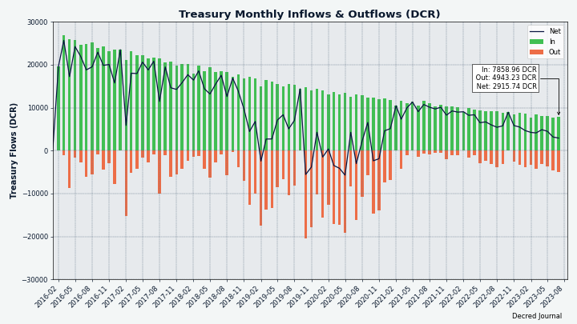
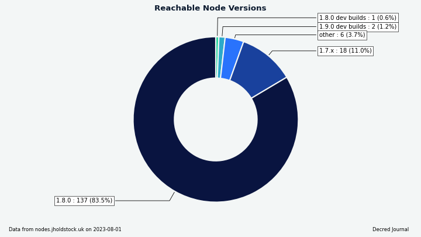
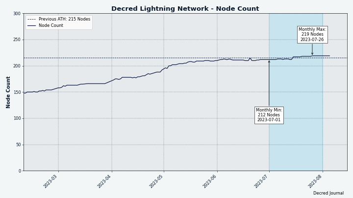

# مجلة ديكريد لشهر يوليو

_الصورة: العاصفة المثالية بواسطة @Exitus_

أبرز أحداث شهر يوليو:

* تم الانتهاء من التصويت على تغييري الإجماع (وظيفة تجزئة إثبات العمل وتقسيم مكافأة إثبات العمل/إثبات الحصة) بدعم شبه إجماعي، سيتم تفعيل التغييرات في أواخر أغسطس (لذا قم بالحديث إلى الإصدار 1.8).
* أطلقت Cypherpunk Times موقعها الذي أعيد تسميته (Decred Magazine سابقًا) ، وأطلقت أول مشروع لها إلى جانب ديكريد للمساهمة بالمحتوى، الفيرو.
* تم الآن ربط الديسكورد بغرف الماتريكس مرة أخرى بجسر محسّن جديد يسمح لمستخدمي الماتريكس بحظر مستخدمي الديسكورد الفرديين، كما تم تحسين إجراءات الموافقة على الأعضاء الجدد في الديسكورد.

المحتويات:

* [التحديث إلى التفرع القادم!](#upgrade-for-the-coming-fork)
* [التطوير](#development)
* [الأشخاص](#people)
* [الإدارة و الحوكمة](#governance)
* [الشبكة](#network)
* [النظام البيئي](#ecosystem)
* [الانتشار](#outreach)
* [وسائل الإعلام](#media)
* [الأسواق](#markets)
* [الخارجية ذات الصلة](#relevant-external)

<a id="upgrade-for-the-coming-fork" />

## التحديث إلى التفرع القادم!

انتهى التصويت على تغييرين إجماعيين [لتغيير إثبات العمل إلى BLAKE3 و ](https://github.com/decred/dcps/blob/master/dcp-0011/dcp-0011.mediawiki)ASERT و[تقسيم مكافأة إثبات العمل/إثبات الحصة إلى ](https://github.com/decred/dcps/blob/master/dcp-0012/dcp-0012.mediawiki)1/89 والتي تم اقتراحها في الأصل على بوليتيا في مارس 2023.

تمت **الموافقة** على كلا التغييرين بنسبة تزيد عن 99٪ بنعم ونسبة إقبال من الناخبين ب 60٪ . سيتم الآن [تفعيل](https://docs.decred.org/governance/consensus-rule-voting/overview/) التغييرات في الكتلة 794,368 حوالي 29 أغسطس. يمكن تتبع الوقت المتبقي في  [لوحة معلومات التصويت](https://voting.decred.org/) أو في  [أجندة ](https://dcrdata.decred.org/agendas)dcrdata.

يُنصح جميع المستخدمين بالتحديث إلى أحدث [البرامج الأساسية](https://github.com/decred/decred-binaries) أو [تطبيق منصة المبادلات اللامركزية المستقل](https://github.com/decred/dcrdex/releases) أو أي  [محافظ أخرى](https://decred.org/wallets/) يتم استخدامها. كما هو الحال دائمًا، نوصي بالتحقق من الملفات قبل التشغيل.

## التطوير

ما لم يُذكر خلاف ذلك، فإن العمل المَذْكُور هنا يشتمل على حالة "الدمج إلى الرئيسي". وهذا يعني أن العمل قد تم استكماله ومراجعته ودمجه في كود المصدر الذي يمكن للمستخدمين المتقدمين [بناءه وتشغيله](https://medium.com/@artikozel/the-decred-node-back-to-the-source-part-one-27d4576e7e1c)، ولكنه ليس متاحًا بعد في ثنائيات الإصدار للمستخدمين العاديين.

### dcrd

_[dcrd](https://github.com/decred/dcrd) هو تطبيق عقدة كامل يعمل على تشغيل شبكة ديكريد من نظير إلى نظير حول العالم._

تم دمج العمل التالي في الفرع الرئيسي `master` نحو الإصدارات المستقبلية:

* تم تحديث أوامر `GetBlock` و `GetBlockHeader` لإظهار [تجزئة إثبات العمل الجديدة](https://github.com/decred/dcrd/pull/3154). بالنسبة للكتل بعد [DCP-11: تغيير إثبات العمل إلى BLAKE3 وتفعيل ASERT](https://github.com/decred/dcps/blob/master/dcp-0011/dcp-0011.mediawiki)، ستكون تجزئة إثبات العمل هي تجزئة BLAKE3 الجديدة. بالنسبة للكتل قبل DCP-11، ستكون *تجزئة الكتلة* و* تجزئة إثبات العمل* متطابقة. يتيح هذا التحديث للمستهلكين مثل dcrdata الوصول بسهولة إلى التجزئة الجديدة.
* تم تحديث [صورة Docker](https://github.com/decred/dcrd/pull/3158) لإنشاء ثنائي dcrd الثنائي باستخدام أحدث Go و Alpine Linux. يمكن لمشرفي العقدة اعتبار Docker خيارًا أمنيًا جيدًا بدلاً من استخدام جهاز افتراضي لها سطح هجوم أكبر بكثير.
* تم تحديث خادم RPC [لإعادة تحميل شهادات RPC الجديدة](https://github.com/decred/dcrd/pull/3153) ديناميكيًا دون إيقاف التشغيل وإعادة التشغيل. يعد هذا تحسينًا لجودة الحياة لمشرفي العقدة، نظرًا لأنه يمكّنهم من التبديل السريع لشهادة/زوج مفاتيح الخادم، بالإضافة إلى أي شهادات عميل محتملة. على سبيل المثال، يلزم تحديث الشهادة عندما يتم الكشف عن خادم RPC بشكل عام وتغيير عنوان IP أو اسم المجال الخاص به. مثال آخر هو عندما تحتاج شهادات العميل إلى التعديل لإبطال العملاء أو إضافة عملاء جدد أو السماح للعملاء الحاليين بتغيير مفاتيحهم الخاصة. هذا التحديث قوي، ويقلل من الوصول إلى القرص، ولا يتطلب تبعيات خاصة بالنظام الأساسي، ومرنًا ضد أخطاء المستخدم لتجنب كسر تهيئة العمل.
تم إعداد عملاء RPC بشكل صريح للاتصال بـ dcrd عبر HTTP [لاستخدام إصدار 1.2 ل TLS أو أعلى](https://github.com/decred/dcrd/pull/3169). كان هذا بالفعل الحد الأدنى الضمني، لكنه الآن أكثر وضوحًا.

تغييرات المطور والتغييرات الداخلية التي تم دمجها في الفرع الرئيسي `master`:

* تم تحديث التعليقات التي توضح بالتفصيل [معاملات حساب ](https://github.com/decred/dcrd/pull/3156)ASERT في كود التعدين بحيث تتطابق مع تعليقات كود الإجماع.
* تمت إضافة [linter جديد](https://github.com/decred/dcrd/pull/3157)، ومعالجة بعض [شكاوى linter](https://github.com/decred/dcrd/pull/3155)، ونقل [منطق الفحص](https://github.com/decred/dcrd/pull/3161) إلى البرنامج النصي الخاص به خارج نص الاختبار.
* تم تحديث [إجراءات ](https://github.com/decred/dcrd/pull/3159)Github، والتأكد من أن إجراءات الإدماج المستمرة تحدث [بالترتيب الصحيح](https://github.com/decred/dcrd/pull/3166).
* تم تحديث [golangci linter](https://github.com/decred/dcrd/pull/3163)، وتغيير [طريقة التثبيت](https://github.com/decred/dcrd/pull/3162) من `curl` إلى `go install`، والتي تتمتع بميزة تقليل المخاطر الأمنية المحتملة من هجمات سلسلة التوريد. كما تم تخزين الملف الثنائي مؤقتًا لعمليات تشغيل مستقبلية أسرع.
* الإصدارات الحالية من Go لديها طريقة مربكة في التعامل مع حلقات التكرار. يعالج كل من "for loops" و "range loops" متغيرات حلقة التكرار الداخلية بشكل غامض، مما أدى إلى كود يصعب قراءته ويصعب تصحيحه. كان على المطورين معالجة الحلقات بحذر شديد، ومع ذلك لا يزال من المحتمل أن يتعاملوا مع أخطاء مزعجة. يمكن قراءة شرح كامل للمشكلة [هنا](https://go.googlesource.com/proposal/+/master/design/60078-loopvar.md)، وخاصة القسم الذي يتحدث عن [الأساس المنطقي](https://go.googlesource.com/proposal/+/master/design/60078-loopvar.md#rationale-and-compatibility). ستقدم الإصدارات المستقبلية من Go (على الأرجح 1.22) تغييرًا مفاجئًا في كيفية معالجة الحلقات. في حين أن دلالات الحلقة الجديدة ستكون أقل إرباكًا وعرضة للخطأ، سيتعين على المشروعات تعيين حد أدنى مرتفع للغاية من إصدار Go المدعوم لتجنب الأخطاء عند تجميعها باستخدام Go الأقدم. للتأكد من أن كود dcrd سيعمل بشكل صحيح مع Go 1.22، وكذلك يظل متوافقًا مع الإصدارات السابقة ويتم تجميعه بشكل صحيح مع الإصدارات القديمة من Go، تم [تحديث جميع حلقات التكرار الضرورية](https://github.com/decred/dcrd/pull/3165). سيؤدي ذلك إلى تجنب أي مشكلات محتملة قبل أن تتاح لهم فرصة الظهور.

### dcrwallet

_[dcrwallet](https://github.com/decred/dcrwallet) هو خادم محفظة تستخدمه تطبيقات سطر الأوامر والمحفظة الرسومية._

تم دمج العمل التالي في الفرع الرئيسي `master` نحو الإصدارات المستقبلية.

التحسينات الأساسية التي قد يلاحظها المستخدمون تتعلق بشراء التذاكر من خلال مزود خدمة التصويت:

* تم إصلاح [منطق إعادة المحاولة](https://github.com/decred/dcrwallet/pull/2252) المعطل لشراء تذاكر مزود خدمة التصويت الخاطئ. أثرت هذه المشكلة على العديد من المستخدمين. لم تتأثر أي عمليات شراء للتذاكر نجحت للمرة الأولى، ولكن لم تتم إعادة محاولة أي عمليات شراء حدثت بها خطأ، مما سيؤدي إلى عدم إضافة التذاكر إلى مزود خدمة التصويت وفقدان الأصوات. لحسن الحظ، كانت إعادة تسجيل التذكرة مع مزود خدمة تصويت مختلف بمثابة حل بديل، ولكن من الواضح أنها كانت تجربة مستخدم سيئة.
* تم إصلاح خطأ حيث يمكن أن يتأخر [فحص حالة دفع الرسوم](https://github.com/decred/dcrwallet/pull/2269) بشكل غير معقول. يؤخر عميل مزود خدمة التصويت الإجراءات لبعض المدة العشوائية للمساعدة في حماية الخصوصية. مع حساب التأخير غير الصحيح هذا، ستبلغ المحفظة عن مدفوعات الرسوم على أنها غير مؤكدة لمدة تصل إلى 2 ساعات حتى يحدث الفحص التالي، عندما يتم بالفعل إرسال الرسوم وتأكيدها. الآن سيتم تحديث محفظة المستخدم في وقت أقرب.
* مطالبة عملاء مزود خدمة التصويت بالانتظار حتى [يقوم مزود خدمة التصويت بتأكيد مدفوعات الرسوم](https://github.com/decred/dcrwallet/pull/2271) قبل التفكير في شراء تذكرة مزود خدمة التصويت بالكامل. يؤدي هذا إلى التخلص من العديد من حالات الحافة الإشكالية التي يسببها المستخدمون الذين يبثون معاملات الرسوم الخاصة بهم، مثل دفع رسوم منخفضة جدًا أو إرسال مدفوعات إلى عنوان خاطئ. إنه حل وقائي للحالات غير المحتملة للغاية التي لم تتم رؤيتها في الإصدار.
* تم إصلاح الخلل حيث يمكن [تخطي بعض تذاكر مزود خدمة التصويت وعدم تحديثها](https://github.com/decred/dcrwallet/pull/2266) خلال المراحل المختلفة من دورة حياة إدارة تذاكر مزود خدمة التصويت. لم يبلغ المستخدمون حتى الآن عن أية مشكلات ناجمة عن هذا السلوك. يستخدم كود معالجة الأخطاء المحسّن ميزة Errors.Join` الجديدة التي تم توفيرها عن طريق التحديث إلى Go 1.20، والتي تمت مناقشتها أدناه.

تغييرات المطور والتغييرات الداخلية التي تم دمجها في الفرع الرئيسي `master`:

فتحت Go 1.20 [معالجة الأخطاء بشكل أفضل](https://tip.golang.org/doc/go1.20#errors)، والتي ألهمت بعض التغييرات:

* تمت إزالة [متغير غير مستخدم](https://github.com/decred/dcrwallet/pull/2262) و[وظيفة خطأ مخصصة[ مربكة من تعريف الأخطاء الداخلية لـ dcrwallet.
* تم [إسقاط الدعم لـ Go 1.19](https://github.com/decred/dcrwallet/pull/2267)، وترقية الدعم إلى Go 1.20 و 1.21.0-rc3. هذا لأن Go 1.19 ليس لديه `Errors.Join`.
* تمت إضافة وظيفة [`Errors.Join`](https://github.com/decred/dcrwallet/pull/2268) الجديدة من مكتبة Go 1.20 القياسية. هذه الوظيفة الجديدة هي طريقة بسيطة لالتفاف عدة رسائل خطأ معًا. في Go 1.19 والإصدارات السابقة، كان ذلك ممكنًا إلى حد ما مع وظائف `Errors.Is`/`As`، ولكن يمكن إخفاء الأخطاء المغلفة، مما جعل تتبع الخطأ أمرًا صعبًا للغاية. `Errors.Join`: [هو حل أفضل بكثير](https://blog.devgenius.io/wrapping-multiple-errors-in-go-1-20-78163ef5fc2c).

بالإضافة إلى ذلك:

* تم تحديث [ذاكرة التخزين المؤقت ](https://github.com/decred/dcrwallet/pull/2264)LRU لاستخدام Go Generics وقبول أنواع متغيرات متعددة. LRU مخطط تخزين مؤقت قياسي يزيل القيم الأقل تحديثًا مؤخرًا بمجرد امتلاء ذاكرة التخزين المؤقت. الميزة الرئيسية لذاكرة التخزين المؤقتة العامة لـ LRU هي تقليل تكرار الكود وإلغاء تأمين إعادة استخدام الكود بطريقة أسهل. هذا له فائدة إضافية تتمثل في كود أكثر وضوحًا من خلال تحديد الأنواع لكل مثيل جديد لذاكرة التخزين المؤقت LRU، بالإضافة إلى التحقق من الكود بشكل أفضل بواسطة المترجم. تمت [إضافة العوامل العامة في Go 1.18](https://go.dev/blog/go1.18) (مارس 2022)، وهي مثيرة للجدل نسبيًا، ولكن فقط لأن لديهم مقايضات يجب على المطورين مراعاتها. من الناحية المثالية، سيعامل مترجم Go الوظائف العامة بنفس الطريقة التي يعامل بها الوظائف ذات الأنواع المتغيرة المحددة، وسيكون كل منها على قدم المساواة على النحو الأمثل. عملياً، هذا ليس هو الحال دائمًا. تأتي فوائد العوامل العامة أحيانًا على حساب تعقيد أكثر و[أداء أبطأ قليلاً](https://planetscale.com/blog/generics-can-make-your-go-code-slower). في هذه الحالة، تستخدم dcrwallet حاليًا الحد الأدنى من العوامل العامة، وبالتالي يكون تأثير الأداء ضئيلًا.
* تحسين و صقل [اختبارات المحفظة](https://github.com/decred/dcrwallet/pull/2260)، بما في ذلك إزالة الأكواد الزائدة عن الحاجة.

### dcrctl

_[dcrctl](https://github.com/decred/dcrctl) هو عميل سطر أوامر لـ dcrd و dcrwallet._

تم دمج العمل التالي في الفرع الرئيسي `master` من أجل الإصدارات المستقبلية:

* تمت [إزالة التبعيات التي لا معنى لها](https://github.com/decred/dcrctl/pull/64) من الوحدة الرئيسية، وتحديث [الوحدات النمطية ل dcrd و dcrwallet](https://github.com/decred/dcrctl/pull/67) إلى أحدث إصداراتها. والجدير بالذكر أن هذا يجعل نتائج dcrd المطولة الجديدة لـ `getblock` و `getblockheader` متاحة.
* تم تحديث README للتوصية بأن يستخدم المطورون [مساحات عمل ](https://github.com/decred/dcrctl/pull/66)Go المحلية عند العمل مع إصدارات التطوير من dcrd و dcrwallet.

### Decrediton

_[Decrediton](https://github.com/decred/decrediton) ديكريديتون هو تطبيق محفظة لسطح المكتب كامل الميزات مع ميزة التصويت مدمجة، وميزة الخلط ب StakeShuffle، والشبكة البرقية، والتداول على منصة المُبادلات اللامركزية DEX للديكريد، والمزيد. يتم تشغيلها مع سلسلة الكتل كاملة أو بدونها (وضع التحقق البسيط من الدفع SPV)._

قيد التطوير:

* التحديث إلى [إصدار 18  ل ](https://github.com/decred/decrediton/pull/3851)React
* سجل [وظائف الواجهة الخلفية](https://github.com/decred/decrediton/pull/3869) و[واجهة المستخدم](https://github.com/decred/decrediton/pull/3874)
* في يوليو، اقترح @norwnd [تخزين 2FA لديكريديتون](https://gist.github.com/norwnd/890ad642985f4e9e9f7b1dd243b21f9e) استنادًا إلى توقيعات متعددة بسيطة 2 من 2. تكمن الفكرة في توفير حل أكثر أمانًا لتخزين وحدات ديكريد باستخدام جهاز ثانٍ لتوقيع المعاملات، بداية هاتف ذكي يعمل بنظام الأندرويد. يجب أن يحمي هذا من التهديدات مثل كلمة مرور تشفير المحفظة الضعيفة أو سرقة الكمبيوتر المحمول. كمكافأة، يمكن أن تجعل ميزات التوقيعات المتعددة أكثر سهولة للمستخدمين العاديين الذين ليس لديهم مهارات لبرمجة حل التوقيعات المتعددة بأنفسهم. إنه حاليًا في مرحلة المناقشة والتعليقات المبكرة ولكن تم بذل بعض الجهود لاختبار ميزات التوقيعات المتعددة في dcrwallet واختبار مقدار البيانات التي يمكن تمريرها في رموز QR.

### vspd

_[vspd](https://github.com/decred/vspd) هو برنامج خادم لتشغيل موفر خدمة التصويت. يصوت موفر خدمة التصويت نيابة عن مستخدميه على مدار الساعة طوال أيام الأسبوع ولا يمكنه سرقة الأموال._

التغييرات التي تم تضمينها في [إصدار النسخة ](https://github.com/decred/vspd/releases/tag/release-v1.2.1)1.2.1:

* تم إصلاح منطق [بث المعاملة](https://github.com/decred/vspd/pull/398) لعدم إنشاء خطأ عندما تكون المعاملة موجودة بالفعل (وهي ليست مشكلة). تمت ملاحظة حالة الخطأ المفقودة هذه عند التحقيق في مشكلة [إعادة المحاولة المعطلة](https://github.com/decred/dcrwallet/pull/2252) في عميل مزود خدمة التصويت الخاص بـ dcrwallet. إنه إصلاح وقائي، ولم يتم الإبلاغ عن أي مشكلات ناتجة عن هذا الخطأ.

### الشبكة البرقية

_[dcrlnd](https://github.com/decred/dcrlnd) هو برنامج عقدة الشبكة البرقية لديكريد. تتيح الشبكة البرقية إجراء معاملات فورية ومنخفضة التكلفة._

* تحسين [تتبع القنوات المغلقة](https://github.com/decred/dcrlnd/pull/187). لوحظ على الشبكة البرقية لديكريد الرئيسية أن بعض القنوات التي تم إغلاقها على السلسلة لا تزال قيد الإعلان على الشبكة. في حين لم يتم تحديد السبب الجذري، فإن هذا التغيير يقلل من كمية إعلانات القناة غير الصالحة وآثارها السلبية، خاصة بالنسبة للعقد التي تعمل في وضع التحقق من الدفع البسيط (مثل عملاء مُرحِّل البيسون). يتم تنفيذ ذلك من خلال حفظ معرفات القناة المعروفة بإغلاقها واستخدام هذه المعلومات لتخطي التحديثات غير الصالحة أو تجنب العمليات باهظة الثمن.

### DCRDEX

_[DCRDEX](https://github.com/decred/dcrdex) هي منصة مبادلات غير احتجازية للمُبادلات غير الموثوقة، مدعومة بالمقايضات الذرية._

تم [تحميل الإصلاحات](https://github.com/decred/dcrdex/pull/2432) التي سيتم تضمينها في الإصدار التالي من إصدار التصحيح 0.6:

* الخادم: [زيادة حدود الطلبات](https://github.com/decred/dcrdex/pull/2411) حيث يقوم المستخدمون بقفل المزيد من الأموال في السندات والتأكد من أن الحسابات ذات المستوى الإيجابي دائمًا ما يكون لها حد أوامر إيجابي، كبير بما يكفي لعقد واحد على الأقل. يجب أن يؤدي هذا إلى إصلاح عدم القدرة على تقديم الطلبات لبعض المستخدمين.
* العميل: التأكد من أن الخادم على علم بأن العميل قد [أكمل](https://github.com/decred/dcrdex/pull/2405) الصفقة. في بعض الحالات، قد يفشل العميل في إبلاغ الخادم بالمطابقة المكتملة، مما قد يؤثر سلبًا على سمعة الحساب. باستخدام هذا الإصلاح، سيستمر العميل في إعادة محاولة الرسالة حتى يتلقى الخادم ويقر بأن العميل قد استرد (استلم) الأموال.
* العميل: تم تحديث تبعيات btcwallet[ وneutrino](https://github.com/decred/dcrdex/pull/2438) لإصلاح الأعطال في محفظة BTC المدمجة. يتجنب المطورون عادةً ترقية التبعيات في الإصدارات التي تم إصدارها لعدم إدخال أخطاء جديدة. ومع ذلك، تعد هذه الحالة استثناء ، بالنظر إلى المشكلة التي تسببها الخطأ، وأن الإصدار الرئيسي التالي من منصة المبادلات اللامركزية لديكريد لا يزال بعيدًا جدًا.

فيما يلي التغييرات التي تم دمجها في الفرع الرئيسي `master` نحو الإصدارات المستقبلية.

العميل:

* تحسين [تدفق إعداد التطبيق](https://github.com/decred/dcrdex/pull/2385). بعد تعيين كلمة مرور التطبيق، ستظهر للمستخدم صفحة التكوين السريع التي تسمح بتمكين خوادم منصة المبادلات اللامركزية وتحديد المحافظ المراد تفعيلها. بعد ذلك ستظه صفحة جديدة لتذكير المستخدم بنسخ بذور التطبيق الاحتياطية من مصدر التطبيق الخاص به. تظهر الصفحة المقصودة بعد تغيير الإعداد إلى المحافظ.
* تم [التبديل](https://github.com/decred/dcrdex/pull/2372) من WebView إلى مكتبة [MacDriver](https://github.com/progrium/macdriver) على macOS. يتيح ذلك سلوكيات macOS الأصلية مثل: الحفاظ على تشغيل التطبيق بدون نوافذ، وإنشاء نوافذ جديدة، والحصول على قائمة أيقونات منصة دوك.
* عدم السماح [بإجراء المعاملات](https://github.com/decred/dcrdex/issues/2436) إذا لم تتم مزامنة المحفظة وليس لها نظراء للمزامنة منهم. هذا يتجنب المعاملات التي لا يتم تعدينها أبدًا وإرباك المستخدمين.
* تم إصلاح رسالة [بدء التشغيل](https://github.com/decred/dcrdex/pull/2428) "الإجراء المطلوب للتداول" المضللة التي تطلب من المستخدم إضافة المزيد من السندات. يمكن أن يحدث ذلك عندما لا يتم إرسال معاملات السندات بعد ويحتاج المستخدم فقط إلى الانتظار دون اتخاذ أي إجراء.
* تم إصلاح خطأ حيث لم يتم دائمًا [عرض علامات](https://github.com/decred/dcrdex/pull/2448) المثلث الأخضر للطلبات الخاصة على مخطط العمق.

العميل، التغييرات الداخلية:

* تم تنفيذ الوظيفة لوضع طلبات متعددة دفعة واحدة لمحافظ [ديكريد](https://github.com/decred/dcrdex/pull/2433) و [الإيثيريوم](https://github.com/decred/dcrdex/pull/2421) و محافظ توكنات الإيثيريوم. سيتم استخدام هذا من قبل السوق لصنع الروبوتات وقد يفتح تحسينات التداول.
* إعادة هيكلة واختبار تحسينات الكود.
* تم تحديث [تبعيات npm](https://github.com/decred/dcrdex/pull/2439) لإصلاح تحذيرات الأمن (لم يتم استخدام الحزم المتأثرة بواسطة منصة المبادلات اللامركزية في وقت التشغيل).

البتكوين، التغييرات الداخلية:

* إصلاح الخلل في منطق [اختيار العملة](https://github.com/decred/dcrdex/pull/2435). لم يكن حرجًا لأنه أثر فقط على وظيفة `MultiTrade`، والتي لم يتم استخدامها في الإنتاج حتى الآن.

الإيثيريوم:

* تمت إضافة [القيم الورقية](https://github.com/decred/dcrdex/pull/2427) إلى نموذج الموافقة على التوكن. مطلوب موافقة لمرة واحدة للسماح لعقد المقايضة بالتعامل مع التوكنات (مثل USDC) نيابة عن المستخدم. يتطلب منح هذا الإذن وإلغائه معاملة ETH صغيرة.

أبرز الأعمال الجارية:

* ديكريد: أسس [تحصيص وحدات ديكريد](https://github.com/decred/dcrdex/pull/2290).
* Polygon: أعمال [البنية الأساسية](https://github.com/decred/dcrdex/pull/2431) بما في ذلك عقد مقايضة USDC.
* الداش: دعم [محفظة العقدة الكاملة](https://github.com/decred/dcrdex/pull/2424).
* الفيرو: [دعم المحفظة الخفيفة ل ](https://github.com/decred/dcrdex/pull/2426)Electrum.
* [إدارة رصيد](https://github.com/decred/dcrdex/pull/2332) صنع روبوتات السوق.

_الصورة: إعادة صياغة تدفق إعداد التطبيق في منصة المبادلات اللامركزية_

_الصورة: قائمة Dock في macOS ستعرض جميع نوافذ منصة المبادلات اللامركزية_

### dcrdata

_[dcrdata](https://github.com/decred/dcrdata) هو مستكشف لبيانات سلسلة كتل ديكريد وخارج السلسلة مثل مقترحات بوليتيا والأسواق والمزيد._

* تمت إضافة تجزئة إثبات العمل BLAKE3 الجديدة إلى [صفحة تفاصيل الكتلة](https://github.com/decred/dcrdata/pull/1970). إذا كان dcrdata يعمل بإصدار جديد إلى حد ما من dcrd، فسوف [يستفيد](https://github.com/decred/dcrdata/pull/1971) من الأمر `GetBlockHeader` [المحدث حديثًا](https://github.com/decred/dcrd/pull/3154) للحصول على تجزئة إثبات العمل بشكل أسرع.

### Timestamply

_[Timestamply](https://github.com/decred/dcrtimegui) هي خدمة مجانية لملفات الطوابع الزمنية التي يتم تشغيلها بواسطة سلسلة كتل ديكريد. يثبت الطابع الزمني وجود ملف معين في وقت معين. يحتوي هذا على مجموعة من التطبيقات في حماية سلامة البيانات._

* تم تحديث إجراءات GitHub [للبناء بواسطة Go 1.20](https://github.com/decred/dcrtime/pull/91)، بالإضافة إلى إضافة linters وإصلاح شكاواهم.
* تم استيراد [مكتبة ](https://github.com/decred/dcrtimejs)JavaScript للطوابع الزمنية لديكريد، dcrtimejs، من [موقعها الأصلي](https://github.com/tiagoalvesdulce/dcrtimejs) لتصبح جزءًا من حساب GitHub [لديكريد](https://github.com/decred/dcrtimejs). تم تمويل إصدار النسخة 1.0.0 ل dcrtimejs من قبل الخزينة كعنصر أساسي في اقتراح [إعادة تصميم Timestamply](https://proposals.decred.org/record/855a506).

### مُرَحِّل بيسون

_[مُرَحِّل بيسون](https://github.com/companyzero/bisonrelay) هي منصة وسائط اجتماعية جديدة مع حماية قوية ضد الرقابة والمراقبة والإعلان، مدعومة من الشبكة البرقية لديكريد._

تطبيقات واجهة المستخدم الرسومية وواجهة سطر الأوامر:

* تمت إضافة خيار تكوين `syncfreelist` لضبط قاعدة بيانات bbolt المستخدمة بواسطة عقدة الشبكة البرقية الداخلية. يؤدي ضبطه على `false` إلى تحسين أداء التشغيل على حساب أداء بدء التشغيل.

تطبيق واجهة المستخدم الرسومية:

* تم تحسين تجربة مستخدم نشر التعليقات، والآن يمكن [طي سلاسل التعليقات أو توسيعها](https://github.com/companyzero/bisonrelay/pull/298).
* تم إصلاح خطأ حيث لم يقدم News Feed [صورًا مضمنة](https://github.com/companyzero/bisonrelay/pull/296) وأظهر رمز "--embed" بدلاً من ذلك.

تطبيق واجهة سطر الأوامر:

* تمت إضافة [الأمر الأساسي `/backup`](https://github.com/companyzero/bisonrelay/pull/297).
* تمت إضافة [تصفية المحتوى](https://github.com/companyzero/bisonrelay/pull/265) المحتوى الذي يمكنه منع عرض الرسائل للمستخدم النهائي على مستوى العميل. لإنشاء قاعدة تصفية، يحتاج المستخدم إلى تحديد السياق الذي سيعمل فيه (الدردشات المباشرة، أو الدردشات الجماعية، أو المنشورات، أو نشر التعليقات، أو الكل) والمحتوى الذي يجب أن يتطابق معه (يمكن أن يكون سلاسل بسيطة أو تعبيرات عادية). حاول تجربة `/help filters add` و `/help filters addrule` لمعرفة كيفية عملها. يتم عرضه حاليًا فقط في تطبيق واجهة سطر الأوامر ولكن يمكن توصيل الأجزاء منخفضة المستوى بتطبيق واجهة المستخدم الرسومية في المستقبل.

### مسائل أخرى

* تمت [إزالة](https://github.com/decred/dcrwebapi/pull/158) جميع مزودي خدمة التصويت القديمة (المسماة "stakepools" في ذلك الوقت) من dcrwebapi، الخدمة التي تشغل ديكريديتون وقائمة موفري خدمة التصويت على decred.org. تم إهمال مزودي خدمات التصويت القديمة [بإصدار ](https://blog.decred.org/2020/06/02/A-More-Private-Way-to-Stake/)vspd في عام 2020 وتم إغلاق جميع الخوادم العامة المعروفة بحلول عام 2022 تقريبًا.

<a id="people" />

## الأشخاص

إحصائيات المجتمع اعتبارًا من 1 أغسطس (مقارنة بـ 2 يوليو):

* متابعو [التويتر](https://twitter.com/decredproject):  53,328 (-230)
* المشتركين في [ريديت](https://www.reddit.com/r/decred/): 12,747 (+9)
* مستخدمي غرفة الدردشة general# على [الماتريكس](https://chat.decred.org/): 797 (+10)
* مستخدمي [الديسكورد](https://discord.gg/GJ2GXfz): 1,589 (+3)، تم التحقق منهم للنشر: 643 (+8)
* مستخدمي [التيليجرام](https://t.me/Decred): 2,355 (-7)
المشتركين في [اليوتيوب](https://www.youtube.com/decredchannel): 4,640 (+0)، المشاهدات: 232.5 ألف (+1,400)

<a id="governance" />
  
## الإدارة و الحوكمة

في يوليو، تلقت [الخزينة](https://dcrdata.decred.org/treasury) الجديدة 7,859 DCR بقيمة 121 ألف دولار بمتوسط سعر يوليو البالغ 15.40 دولار. تم إنفاق 4,943 DCR لدفع أجور المتعاقدين، بقيمة 76 ألف دولار بنفس المعدل.

تمت الموافقة على [معاملة إنفاق الخزينة](https://explorer.dcrdata.org/tx/4734a7e88ecb366d5c3be8510c35e846ff5a117fa92e24a0ad9329ac65b4925f) بأغلبية 5,274 صوتًا بنعم وإقبال  37٪، وتم تعدينها في 25 يوليو. حصلت هذه المعاملة على 9 لا أصوات، لتصبح ثاني معاملة إنفاق من أصل 15 تم تعدينها حتى الآن للحصول على أصوات بلا صفر. كان لديها 32 ناتجًا تسدد مدفوعات للمتعاقدين، تتراوح من 1.5 DCR إلى 1,692 DCR. من المحتمل أن يتم دفع معظم DCR مقابل عمل مايو، بسعر صرف الفواتير البالغ 17.13 دولارًا أمريكيً ، تبلغ قيمة معاملة الإنفاق حوالي 85 ألف دولار.

اعتبارًا من 6 أغسطس، بلغ الرصيد المشترك للخزينة [القديمة](https://dcrdata.decred.org/address/Dcur2mcGjmENx4DhNqDctW5wJCVyT3Qeqkx) و[الجديدة](https://dcrdata.decred.org/treasury) 865,895 DCR (أي ما يعادل 12.6 مليون دولار أمريكي بسعر 14.56 دولار أمريكي).

_الصورة: يساهم انخفاض DCR/USD في ارتفاع تدفقات الخزينة إلى الخارج_

_الصورة: رصيد الخزينة بما يعادله بالدولار الأمريكي_

كانت هناك 4 مقترحات انتهت من التصويت في يوليو:

* تم رفض [اقتراح](https://proposals.decred.org/record/552c87e) لتمويل تطوير موقع Decred.club الإلكتروني بمحتوى باللغة الصينية وتنمية مجتمع حوله مقابل 2,400 دولار مع 28٪ من الأصوات نعم و نسبة إقبال 26٪.
* تمت الموافقة على [اقتراح](https://proposals.decred.org/record/4d3a8fc) لإعادة تسمية مجلة Decred Magazine إلى Cypherpunk Times ومواصلة إنتاجها لمدة عام آخر بميزانية متزايدة قدرها 44,000 دولار - تمت الموافقة عليه بنسبة 95٪ من الأصوات بنعم و 47٪ من الإقبال.
* تمت الموافقة على [اقتراح](https://proposals.decred.org/record/9e265ad) لإنتاج مقاطع فيديو مدتها 90 ثانية لشخص يرتدي قناع تزلج يتحدث عن ديكريد بواحدة من 12 لغة بتكلفة 23,650 دولارًا، مع 75٪ من الأصوات بنعم و نسبة إقبال 42٪.
* تم رفض اقتراح لإنشاء موقع ويب ترويجي لمنصة المبادلات اللامركزية لديكريد بتكلفة 2,000 دولار، مع 30٪ من الأصوات بنعم و نسبة إقبال ب 34٪.

<a id="network" />

## الشبكة

**معدل التجزئة**: افتتح [معدل التجزئة](https://dcrdata.decred.org/charts?chart=hashrate&scale=linear&bin=day&axis=time) لشهر يوليو عند 52 Ph/s وأغلق عند 55 Ph/s، ووصل إلى أدنى مستوى عند 49 Ph/s وبلغت ذروته عند 69 Ph/s على مدار الشهر.

_الصورة: معدل تجزئة ديكريد_

تم [الإبلاغ](https://miningpoolstats.stream/decred) عن توزيع معدل تجزئة 55 Ph/s بواسطة المجمعات في 1 أغسطس:  F2Pool بنسبة 58%، و Poolin بنسبة 32%، و BTC.com بنسبة 8%، و AntPool بنسبة 3%.

توزيع 1,000 كتلة تم [تعدينها](https://miningpoolstats.stream/decred) بالفعل بحلول 1 أغسطس:  F2Pool بنسبة 46%، و Poolin بنسبة 31%، و AntPool بنسبة 18%، و BTC.com بنسبة 5%.

_الصورة: التوزيع التاريخي لمجمع التجزئة_

**التحصيص**: تراوح [سعر التذكرة](https://dcrdata.decred.org/charts?chart=ticket-price&axis=time&visibility=true-true&mode=stepped) بين  196-277 DCR.

_الصورة: استقرار سعر التذكرة_

بلغ [المبلغ المقفل](https://dcrdata.decred.org/charts?chart=ticket-pool-value&scale=linear&bin=day&axis=time)  9.73-9.87 مليون DCR، مما يعني أن  63.3-64.2٪ من العرض المتاح [شارك](https://dcrdata.decred.org/charts?chart=stake-participation&scale=linear&bin=day&axis=time) في إثبات الحصة.

_الصورة: إجمالي DCR المغلق يعيد اختبار أعلى مستوى له على الإطلاق_

_الصورة: انخفضت التذاكر الشهرية المفوتة بعد زيادة طفيفة في يونيو _

**مقدم خدمة التصويت**: قام [الـ 14 من مقدمي خدمة التصويت المدرجين](https://decred.org/vsp/) بإدارة ما يقرب من   6,150 (-480) تذكرة حية، والتي كانت تمثل  15.1٪ من مجموع التذاكر (-1.4٪) اعتبارًا من 1 أغسطس.

أكبر الرابحين في شهر يوليو هم [bass.cf](https://vspd.bass.cf/) (+96 تذكرة أو +15٪)، و [decredcommunity.org](https://vsp.decredcommunity.org/)
 (+37 تذكرة أو +8٪)

_ الصورة: توزيع التذاكر التي يديرها مقدمو خدمات التصويت _.

**العقد**: رصد [جهاز رسم الخرائط لديكريد](https://nodes.jholdstock.uk/user_agents) ما بين 162 و 170 عقدة dcrd خلال الشهر. تمت مشاهدة إصدارات 164 عقدة في 1 أغسطس: النسخة 1.8.0 - 84%، النسخة 11% - 1.7.x، النسخة 1.9.0 لبناءات التطوير - 1.2%، النسخة 1.9.0 لبناءات التطوير- 0.6%، أخرى - 4%.

_ الصورة: معظم الشبكة تعمل بنسخة 1.8.0_

_الصورة: سارع مشغلو العقدة إلى التحديث إلى الإصدار 1.8.0. تشير المنطقة الحمراء قبل يناير 2023 إلى بيانات غير كاملة لدينا في ذلك الوقت._

تراوحت حصة [العملات المخلوطة](https://dcrdata.decred.org/charts?chart=coin-supply&zoom=jz3q237o-la8vk000&scale=linear&bin=day&axis=time&visibility=true-true-true) بين 62.0-62.3%. يتراوح [الحجم المختلط](https://dcrdata.decred.org/charts?chart=privacy-participation&bin=day&axis=time) اليومي بين 351 ألفًا و486 ألفًا من DCR.

_الصورة: حجم DCR StakeShuffle_

_الصورة: استغرق حجم المعاملات إجازة صيفية. يتم تعريف [المقياس](https://coinmetrics.io/introducing-adjusted-estimates/) بواسطة Coin Metrics._

شهد مستكشف [الشبكة البرقية](https://ln-map.jholdstock.uk/) لديكريد 219 عقدة (+7)، 445 قناة (+18) بسعة إجمالية قدرها 188 DCR (-3)، اعتبارًا من 1 أغسطس. هذه الإحصائيات مختلفة لكل عقدة. على سبيل المثال، أبلغت عقدة @karamble عن 220 عقدة و 464 قناة وسعة 191 DCR في نفس اليوم 1 أغسطس.

_الصورة: عدد عقدة الشبكة البرقية لديكريد ينمو ببطء_

_الصورة: استقرت قدرة الشبكة البرقية الخاصة بديكريد حول 200 DCR_

<a id="ecosystem" />

## النظام البيئي

مقدمو خدمة التصويت:

* صوَّت مزود خدمة التصويت الجديد على موقع [vote.dcr-swiss.ch](https://vote.dcr-swiss.ch/) على أول تذاكره على الشبكة الرئيسية و[تقدم بطلب](https://github.com/decred/dcrwebapi/pull/178) للإدراج في محفظة ديكريديتون و[صفحة مزود خدمة التصويت](https://decred.org/vsp/). لدى DCR Swiss رسوم منخفضة تبلغ 0.25٪. من بين 14 مقدم خدمة تصويت حالي، يعد هذا ثالث أقل رسوم بعد dcrhive.com (0.1٪) و vspd.bass.cf (0.2٪).

المحافظ:

* ستتوقف مزامنة محافظ الأندرويد و iOS لديكريد في أوائل سبتمبر عند تفعيل [تحديثات الإجماع](https://voting.decred.org/) الجديدة. تمت إزالة التطبيقات من Google Play و Apple Store لمنع المستخدمين من تثبيت التطبيقات التي لم تعد قيد الصيانة. إذا كنت قد استخدمت محافظ Android أو  iOS لديكريد، فلا تتردد في التعليق في [استطلاع ](https://www.reddit.com/r/decred/comments/15eokjz/survey_have_you_used_decred_mobile_apps/)Reddit.

منصات المبادلات:

* [أعلنت](https://info.exmo.me/ru/uvedomleniya/exmo-me-exclude-from-listing-five-crypto/) EXMO في 6 يوليو أنها ستزيل DCR و 3 توكنات أخرى بحلول 20 يوليو بسبب انخفاض السيولة. كانت EXMO هي منصة المبادلات الوحيدة التي أدرجت DCR عبر [مقترح](https://proposals.decred.org/proposals/950e8149e594b01c010c1199233ab11e82c9da39174ba375d286dc72bb0a54d7) غير مكلف تمت الموافقة عليه في مايو 2019 وتم الوفاء به في [يونيو 2019](https://exmo.com/en/news_view?id=2776).
* [اكتشف](https://matrix.to/#/!lDZCzVQjFoJsXMPkvr:decred.org/$aTBeqNdAk4d03IEEybIk8WtVo-Wfe0JYFwVX0fZsIh4) أعضاء التداول #trading في 9 يوليو أنه كان يتم تداول DCR بحوالي 20 دولارًا في [Bitbns](https://bitbns.com/trade/#/dcr) الهندية بينما كان يتم تداولها ب 16 دولارًا في منصات المبادلات الأخرى. اعتبارًا من 31 يوليو، كان لا يزال يتم تداول DCR بعلاوة وبأحجام كبيرة على مدار 24 ساعة بقيمة 68 ألف دولار، مما جعل DCR/INR أعلى 10 أزواج في Bitbns (إذا كنا على ثقة بالأحجام المبلغ عنها بالطبع). يشير [الرسم البياني](https://bitbns.com/trade/#/dcr) لسعر DCR إلى أنه تم إدراجها في مايو 2022.

نظم الاتصالات:

* لم يكن الوصول العام إلى التويتر [متاحًا](https://techcrunch.com/2023/07/05/twitter-silently-removes-login-requirement-for-viewing-tweets/) في الغالب بين 30 يونيو و 5 يوليو. وتطلب تصفح التويتر تسجيل الدخول وكان يخضع لحدود الأسعار حتى بالنسبة للحسابات المدفوعة. وفقًا لإيلون ماسك، كان هذا [إجراءً طارئًا مؤقتًا](https://www.reuters.com/technology/twitter-now-needs-users-sign-view-tweets-2023-06-30/) لمكافحة روبوتات الذكاء الاصطناعي التي كانت تسحب الكثير من البيانات من تويتر لدرجة أنها أصبحت فعليًا هجومًا لرفض الخدمة. [حطمت](https://github.com/zedeus/nitter/issues/919) قيود واجهة برمجة التطبيقات العامة أيضًا Nitter، وهو بديل خفيف الوزن لتصفح [@decredproject](https://nitter.net/decredproject) والحسابات الأخرى. تمت [إزالة](https://techcrunch.com/2023/07/05/twitter-silently-removes-login-requirement-for-viewing-tweets/) شرط تسجيل الدخول في الخامس من يوليو. على الرغم من كل المشاكل و[الاكتشافات](https://twitter.com/elonmusk/status/1670117122650050561)، لا يزال موقع تويتر منصة التواصل الرئيسية لديكريد مع 53.3 ألف متابع اعتبارًا من 1 أغسطس.
* عاد الجسر ذو الاتجاهين بين الماتريكس و الديسكورد! أصبح ذلك ممكنًا بفضل تدفق [التحقق من المستخدم](202306.md#ecosystem) الجديد الذي يعد أفضل بكثير في منع البريد العشوائي. يسمح الجسر الجديد بحظر مستخدمي الديسكورد الفرديين على جانب الماتريكس دون التأثير على مستخدمي الديسكورد الآخرين، ولم يكن هذا ممكنًا مع الجسر القديم. أيضًا، يجب أن ينتشر تحرير الرسائل في كلا الاتجاهين. يتم استضافة الجسر الجديد بواسطة [t2bot.io](https://t2bot.io/discord/)، وهي خدمة مجانية توفر الروبوتات والجسور لمجتمعات الماتريكس. يديرها شخص واحد وتدعمه التبرعات. اعتبارًا من كتابة هذه السطور، تم ربط غرف الماتريكس التالية بديسكورد:  #101، و #dex، و #marketing، و #media، و #memes، و # Proposals، و #shower Thinkts، و #support، وبالطبع #trading.

أخبار أخرى:

* في مايو، أعلن كل من [@StakeShuffle_](https://twitter.com/StakeShuffle_/status/1660015673102180353) و [@dcrtimestampbot](https://twitter.com/dcrtimestampbot/status/1660015663514107904) أن الروبوتات «معطلة حتى إشعار آخر بسبب تغييرات twitter-api الأخيرة». تم تطوير الروبوتات بواسطة @cli\_query وبرعاية ما مجموعه 3 [مقترحات](https://proposals.decred.org/user/3b9b30d5-1065-4e48-b1b6-3f558d0cb378?tab=submitted%20proposals) منخفضة الميزانية. يبدو أن وقت المطور [محدود](https://proposals.decred.org/record/1a290d8) للحفاظ على هذه المشاريع، لكن رمز مصدر Python لـ [StakeShuffle_](https://github.com/JC60522/StakeShuffle_BOT) و [dcrtimestampbot](https://github.com/JC60522/dcr_timestampbot) متاح على GitHub للمساهمين لاستلامه وتحسينه.
* تم إطلاق [Cypherpunk Times](https://cypherpunktimes.com/). راجع قسم [الإنتشار](#outreach) أدناه لمزيد من التفاصيل.

انضم إلى دردشة النظام البيئي [#ecosystem](https://chat.decred.org/#/room/#ecosystem:decred.org) لمتابعة تحديثات النظام البيئي لـديكريد.

تحذير: ليس لدى مؤلفي مجلة ديكريد أي فكرة عن مصداقية أي من الخدمات أعلاه. يرجى إجراء بحثك الخاص قبل الوثوق بمعلوماتك الشخصية أو أصولك لأي كيان.

<a id="outreach" />
  
## الإنتشار

تم إطلاق التكرار الأول لمنصة منشورات العملات المتعددة [Cypherpunk Times](https://cypherpunktimes.com/) الجديدة! هذه تكملة وإعادة تسمية لمجلة Decred Magazine، التي تمت الموافقة عليها وتمويلها من قبل أصحاب حصص ديكريد في [يوليو ](https://proposals.decred.org/record/4d3a8fc)2023. عنوان الوسائط الاجتماعية الجديد هو `@cypherpunktimes` على [التويتر](https://twitter.com/cypherpunktimes) و [الفيسبوك](https://www.facebook.com/cypherpunktimes) و [المقاطع الصوتية على ](https://podcasters.spotify.com/pod/cypherpunktimes)Spotify. أي دعم موضع تقدير كبير.

فيرو هو أول مشروع يساهم بالمحتوى في Cypherpunk Times. في يوليو، قام Firo [بإدخال](https://matrix.to/#/!NkCFEoJGXyDMwLfgMb:decred.org/$hoWcufElq2WAw5RcQ2GM1pE2ASKDme8q9-RZTQfvv04) 3 محتويات ونشر [مقاله](https://www.cypherpunktimes.com/unveiling-spark-public-testnet-launch-date-confirmed/) الأول.

تمت إعادة تسمية حساب `@decredmagazine` على التيك توك إلى [@dearcryptopunk](https://www.tiktok.com/@dearcryptopunk). للمضي قدمًا، سيتم توسيع نطاقه من دعم Cypherpunk Times إلى التوعية العامة لديكريد، وسينتقل تحت مظلة اقتراح [Decred Vanguard](https://proposals.decred.org/record/0a1b782). سيستمر حساب [@decredmagazine](https://twitter.com/decredmagazine) على التويتر في العمل في الوقت الحالي لدعم محتوى Decred فقط.

إحصائيات مشاركة Cypherpunk Times لشهر يوليو:

- إجمالي عدد المقالات في Cypherpunk Times: 497
- عدد المشتركين في النشرة الإخبارية: 104
- المنشورات الجديدة ل Cypherpunk Times والرسائل الإخبارية التي تم إرسالها: 18
- الحملات النشطة على وسائل التواصل الاجتماعي: 68
- الحملات المكتملة على وسائل التواصل الاجتماعي: 2
- عدد المشاركات على مواقع التواصل الاجتماعي: 128
- الإعجابات: 496
- إعادة التغريدات: 120
- متابعو وسائل التواصل الاجتماعي عبر جميع المنصات والحسابات (بما في ذلك [@DecredSociety](https://twitter.com/DecredSociety) و[@decredmagazine](https://twitter.com/decredmagazine) القديم): 1,440

قام Totti من [BTC-ECHO](https://www.btc-echo.de/) بجمع جولتين من التعليقات المنشورة عبر [بوليتيا](https://proposals.decred.org/record/49e373b) و غرفة الدردشة [#writers](https://chat.decred.org/#/room/#writers:decred.org) ودمجها في المقال الألماني الأول. [اقترح](https://proposals.decred.org/record/49e373b/comments/30) BTC-ECHO الانتظار خلال النشاط الموسمي الأدنى ونشر المقال الأول في منتصف أغسطس. تم استخدام التأخير [لإضافة إشارات](https://matrix.to/#/!NkCFEoJGXyDMwLfgMb:decred.org/$-Y8Sj1vafMV3bFwDTRyMavH9ab6ki2zntLvdmz6LBEw) إلى المقاومة الشديدة والحوكمة على السلسلة والتي تعد أساسية لإجماع ديكريد.

إنجازات Monde PR:

* عرض فرصتين للتعليق
* عرض أفكار ثلاث قصص لاستهداف منشورات العملات الرقمية المشفرة
* تأمين مقابلة إعلامية واحدة

تأمين مواضع الوسائط التالية:

* شارك tivra@ في [فضاء التويتر](https://twitter.com/therollupco) من استضافة The Rollup podcast حيث تحدث عن منصة المبادلات اللامركزية.

<a id="media" />

## وسائل الإعلام

**مقالات مختارة:**

* [كيفية استخدام منصة المبادلات اللامركزية لديكريد على Raspberry Pi باستخدام Umbrel](https://www.cypherpunktimes.com/how-to-dcrdex-on-raspberry-pi-with-umbrel/) بواسطة @karamble
* [هل حان الوقت للتغلب على وسائل التواصل الاجتماعي التقليدية؟](https://www.cypherpunktimes.com/is-it-time-to-overcome-traditional-social-media/) بواسطة @Joao
* [التأثير المضاعف على تنظيم العملات الرقمية المشفرة](https://www.cypherpunktimes.com/the-ripple-effect-on-cryptocurrency-regulation/) بواسطة @Tivra
* [ديكريد مقابل الإيثيريوم: التحصيص على المستقبل](https://www.cypherpunktimes.com/decred-vs-ethereum-staking/) بواسطة @Joao

**أشرطة الفيديو:**

* [منصة المبادلات اللامركزية لديكريد المستقلة: المقايضات الذرية في متصفح الويب](https://www.youtube.com/watch?v=9U3fNFQFkkE) بواسطة phoenixgreen@ - متوفر أيضا [كمنشور نصي](https://www.cypherpunktimes.com/decred-dex-standalone-atomic-swaps-in-a-web-browser/)
* [منصة المبادلات اللامركزية لديكريد: إنشاء سند إخلاص](https://www.youtube.com/watch?v=5Z2jISaNkxc) بواسطة phoenixgreen@ - متوفر أيضًا [كمنشور نصي](https://www.cypherpunktimes.com/decred-decentralized-exchange-creating-a-fidelity-bond/)
* [إدارة الشبكة البرقية لمُرحِّل البيسون: كيفية إعادة توازن قنواتك](https://www.youtube.com/watch?v=LD54opBdkh8) بواسطة phoenixgreen@ - متوفر أيضًا [كمنشور نصي](https://www.cypherpunktimes.com/bison-relay-lightning-network-management-how-to-rebalance-your-channels/)
* [استخدام روبوتات صانع السوق في منصة المبادلات اللامركزية: نظرة أولية](https://www.youtube.com/watch?v=cyp_vnQRCXE) بواسطة phoenixgreen@ - متوفر أيضًا [كمنشور نصي](https://www.cypherpunktimes.com/using-market-maker-bots-on-decentralised-exchange-first-look/)

**البث المباشر:**

* [العيش على العملات الرقمية المشفرة وحرية منصة المبادلات](https://www.youtube.com/watch?v=riW1HbhfoIw) بواسطة phoenixgreen@ و Exitus@ وبمشاركة [Joel Valenzuela](https://twitter.com/TheDesertLynx) من داش وروبن ياب من فيرو و @Tivra

**المقاطع الصوتية:**

* [تطور فضاء العملات الرقمية المشفرة: النهوض فوق تقلبات الأسعار مع التوقعات](https://twitter.com/i/spaces/1yNxaNYLwwqKj) - فضاء التويتر بواسطةExitus@ و Tivra@ بمشاركة Joel Valenzuela يناقشان إغلاق DashDirect و Cake Pay والإكراميات وخدمات النظير لنظير والمزيد - متوفر أيضًا كملف [بودكاست](https://podcasters.spotify.com/pod/show/cypherpunktimes/episodes/Crypto-Evolution-Rising-Above-Volatility-with-Vision-e26qm28)

**الفن والمتعة:**

* يوليو هو [شهر البيسون الوطني](https://nationaltoday.com/national-bison-month/) في الولايات المتحدة.
* [جزيرة منصة المبادلات اللامركزية](https://www.cypherpunktimes.com/dex-island/) بواسطة OfficialCryptos@
* [رسم توضيحي لصدمة السوق](https://www.reddit.com/r/decred/comments/14vruz2/supply_shock_infographic_wip/) بواسطة Tivra@
* [مسابقة فنية](https://twitter.com/exitusdcr/status/1680287503528370179) لديكريد بواسطة Exitus@ - حصل [أربعة فائزين](https://twitter.com/exitusdcr/status/1681067908699389952) على DCR
* كان [لمسابقة الحديث الترويجي لديكريد](https://twitter.com/WasPraxis/status/1680928961415589889) بواسطة @Tivra [فائزان](https://twitter.com/waspraxis/status/1684173637623119872)
* [قائمة الدرجة الأولى لديكريد](https://matrix.to/#/!lDZCzVQjFoJsXMPkvr:decred.org/$Im4VJ9nJDedNOOCaKlxSu9a9N7HCA9fJEUd-W3ubVMY) بواسطة Void@

_الصورة: قائمة الطبقة العليا لـ DCR بواسطة @Void_

**الترجمة:**

* [كيفية تشغيل منصة المبادلات اللامركزية لديكريد على Raspberry Pi مع ](https://www.cypherpunktimes.com/how-to-dcrdex-on-raspberry-pi-with-umbrel/)Umbrel - [باللغة الصينية](https://github.com/Decred-CN/articles/blob/master/How-To_DCRDEX_on_Raspberry_Pi_with_Umbrel.md) بواسطة Dominic@
* [استخدام روبوتات صانع السوق في منصة المبادلات اللامركزية: نظرة أولية](https://www.cypherpunktimes.com/using-market-maker-bots-on-decentralised-exchange-first-look/) - [باللغة الصينية](https://github.com/Decred-CN/articles/blob/master/Using%20Market%20Maker%20Bots%20on%20Decentralised%20Exchange:%20First%20Look.md)
* نشير أنه يتم نشر جميع المحتويات المترجمة إلى الصينية على WeChat منذ عام 2019.
* حصلت مجلة ديكريد من مايو إلى يونيو على ما مجموعه 3 [ترجمات](https://xaur.github.io/decred-news/) جديدة إلى العربية (arij@، abdulrahman4@) والصينية (Dominic@). شكرا لكم على عملكم!

**مناقشات المجتمع:**

* [يحاول ChatGPT4 فك تشفير التحليل الفني لـ @saender](https://www.reddit.com/r/decred/comments/14wlx9u/some_technical_analysis_based_on_saender_post/)
* [نحتاج إلى إنترنت جديد](https://news.ycombinator.com/item?id=36676452) على Hacker News
* ردًا على سؤال جيمس بريستويتش ["هل غيّرت ديكريد العالم؟"](https://twitter.com/_prestwich/status/1679630835019030531)

<a id="markets" />

## الأسواق

في يوليو، تم تداول DCR بين USDT 13.70-19.75 و BTC 0.00047-0.00064. وقد بلغ متوسط السعر اليومي 15.40 دولارًا.

[لاحظ](https://matrix.to/#/!lDZCzVQjFoJsXMPkvr:decred.org/$qOBXWvgSgINClwaPNzI9IXoqu9BLuqZdmJic2qTwMLw) أعضاء \#trading وجود جدار بيع بقيمة مليون دولار ل DCR/USDT على الباينانس. أيضًا، كانت أحجام التداول في جميع الأسواق [منخفضة بشكل غير عادي](https://matrix.to/#/!lDZCzVQjFoJsXMPkvr:decred.org/$o6Rmw5-8oiHBwRIGWWnE3qMpJTXmm__ad7HoxyJVioo) في بعض الأيام، ربما بسبب فصل الصيف.

_الصورة: أداء DCR مقارنة بعملات الخصوصية الأخرى بواسطة saender@_

_الصورة: مقاييس التسعير ديكريد بواسطة bochinchero@_

يعتمد [الرسم البياني](https://matrix.to/#/!lDZCzVQjFoJsXMPkvr:decred.org/$H540G0LtMAsa1Vc1ANY0A2Jf6CuN0uTyr6XKQO68nq8) أعلاه على نفس نموذج [القيمة المحققة للتحصيص](https://bochinchero.medium.com/decred-on-chain-staked-realised-value-444ab5a146d8) الذي عرضناه [الشهر الماضي](202306.md#markets) ولكن بسعر بدلاً من القيمة السوقية.

_الصورة: DCR/BTC في يونيو ويوليو_

_الصورة: الحجم الشهري لمنصة المبادلات اللامركزية لديكريد بالدولار الأمريكي لا يحب التوقيت الصيفي_

<a id="relevant-external" />
  
## الخارجية ذات الصلة

تم [اختراق](https://twitter.com/CurveFinance/status/1685693202722848768) منصة الإقراض DeFi Curve، وهي أحد ركائز DeFi للإيثيريوم. تضمن الاختراق استخدام قفل reentrancy المعطل في إصدارات معينة من Vyper مما جعل بعض المجمعات ولكن ليس غيرها عرضة للاستنزاف. كما تأثرت بروتوكولات مماثلة Metronome و Alchemix، و[خسرت](https://www.coindesk.com/markets/2023/08/04/looter-behind-61m-curve-hack-starts-returning-assets-raising-hope-for-recovery/) المشاريع الثلاثة معًا ما قيمته 61.7 مليون دولار من الأصول. كان المهاجم قادرًا فقط على تصريف بعض المجمعات المتضررة لأنه عندما بدأ الإجراء، تدخل العديد من قراصنة القبعة البيضاء [لإنقاذ](https://www.coindesk.com/tech/2023/08/07/curve-recoups-73-of-hacked-funds-bolstering-crv-sentiment/) أموالهم. بحلول 7 أغسطس، تم الإبلاغ عن 73٪ من الأصول، وبعضها من أصحاب القبعات البيضاء ولكن أيضًا مبالغ كبيرة من المهاجم. عرضت Curve مكافأة بنسبة 10٪ مقابل الإعادة الطوعية للأموال حتى 6 أغسطس، ولكن مع وجود أكثر من 18 مليون دولار في حوزة المخترق في الموعد النهائي، ضاعت فرصة إنهاء الأمر وفتحت المكافأة للمحققين العامين الذين يمكنهم المساعدة في تأمين استرجاعها.

[أطلقت](https://www.theblock.co/post/241425/gitcoins-layer-2-public-goods-network-goes-live-on-mainnet) Gitcoin طبقة Ethereum Layer 2 تسمى شبكة السلع العامة (PGN)، وهي تستخدم حزمة Optimism وسيتم جمع نسبة من رسوم التسلسل في وعاء لتمويل المنافع العامة.

أطلقت Arkham Intelligence سوقًا لبيانات الهوية العملات الرقمية المشفرة أو «[doxx للربح](https://protos.com/arkham-intelligence-draws-ire-for-dox-to-earn-program/)»، حيث يمكن للمستخدمين وضع مكافآت على هوية بعض عناوين محفظة العملة الرقمية المشفرة ومحاولة الباحثين المتحمسين اكتشاف من يمتلك المحفظة ليوم الدفع. أظهر Arkham أيضًا تجاهلًا عرضيًا لمستخدميه من خلال إنشاء روابط إحالة باستخدام خوارزمية سهلة العكس [تكشف](https://www.coindesk.com/business/2023/07/10/crypto-startup-arkham-has-apparently-been-doxxing-privacy-obsessed-users-for-months/) عن عناوين البريد الإلكتروني للمروجين.

[أطلق](https://www.bbc.com/news/technology-66128111) المدير التنفيذي سام إلتمان لمشروع Worldcoin orbs  لمسح مقلة العين في 1,500 موقع حول العالم، مما يسمح للأشخاص بمسح قزحية العين لإنشاء محفظة والحصول على 25 WLD مجانًا (بقيمة 50 دولارًا تقريبًا). شجب الكثيرون في مجال العملات الرقمية المشفرة احتمال قيام مؤسس شركة الذكاء الاصطناعي بإرسال orbs إلى العالم لمسح عيون الناس بحثًا عن صدقات صغيرة، علمًا أن Worldcoin ليس مشروعًا معروفا. ومع ذلك، نشر Vitalik Buterin مؤخرًا [منشورًا](https://vitalik.eth.limo/general/2023/07/24/biometric.html) على مدونة حول الإثبات البيومتري للشخصية حيث يبدو أنه يجد الكثير من الجدارة في نهج Worldcoin، مما يشير إلى أنه يحمي الخصوصية بشكل أفضل من معظم الأساليب البديلة لإثبات الشخصية، على الرغم من أنه لا يزال لديه بعض الجوانب السلبية. بعد يوم من إطلاق Worldcoin، تم [الإبلاغ](https://protos.com/worldcoin-eyed-by-uk-data-watchdog-day-after-launch-avoided-us/) عن أن هيئة مراقبة البيانات في المملكة المتحدة تبحث فيما إذا كانت تتوافق مع لوائح حماية البيانات. وفي كينيا، حيث كانت Worldcoin على اتصال مع مكتب مفوض حماية البيانات منذ أبريل، كان يُعتقد أنها تعمل بشكل قانوني ولكن تم [تعليق](https://www.coindesk.com/policy/2023/08/03/kenya-appears-to-have-flip-flopped-on-worldcoins-data-practices/) عمليات المسح الضوئي الخاصة بها وليس من الواضح ما إذا كان هذا قد تم فرضه ذاتيًا من قبل Worldcoin لتحسين قضايا «السيطرة على الحشود» مع طوابير طويلة في محطات الاشتراك، أو إذا [غيرت](https://techcrunch.com/2023/08/02/kenya-suspends-worldcoin-scans-over-security-privacy-and-financial-concerns/) السلطات رأيها بشأن شرعيتها.

تم [إطلاق](https://techcrunch.com/2023/07/21/fednow-is-finally-live-in-the-us/) FedNow، وهو نظام المدفوعات الفورية التابع للحكومة الأمريكية، مع 35 مؤسسة مالية تم إعدادها لاستخدام الخدمة التي تسمح بالتسوية الفورية على مدار الساعة طوال أيام الأسبوع. ويُنظر إلى هذا على أنه سد للفجوة حيث تتخلف الولايات المتحدة تمامًا عن الولايات القضائية الأخرى التي لديها بالفعل مثل هذه التسهيلات للتحويل المصرفي الفوري. ومن المتوقع أن يستغرق الأمر بعض الوقت حتى تستوعب المؤسسات خدمة FedNow لجعل الخدمة متاحة على نطاق واسع للمستخدمين النهائيين.

[أكملت](https://medium.com/token-engineering-commons/expertise-and-quadratic-funding-bd4f0c5c3e23) Token Engineering Commons (TEC) الجولة الأولى من برنامج المنح الجديد، باستخدام التمويل التربيعي (مثل منح Gitcoin) لتوزيع مجموعة تمويل بقيمة 25,000 دولار وجذب تبرعات بقيمة 6,162 دولارًا لزيادة ذلك وتحديد أين ستذهب المنح. أضافت TEC إلى نموذج التمويل الرباعي المعتاد (حيث يعني عدد أكبر من التبرعات الفردية لمشروع ما شريحة أكبر من المجمع المطابق) عن طريق إضافة آلية للتعبير عن "الخبرة الموضوعية". تم اعتبار المساهمين الذين لديهم توكنات TEC و/أو شهادات تصديق معرفة NFT في محفظتهم "خبراء" وتم تطبيق وزن أقوى على تبرعاتهم عند تحديد المبلغ المطابق - وقد تم ذلك لمعالجة مشكلة محسوسة حيث تكون المشاريع جيدة في حشد الدعم المجتمعي، بذل قصارى جهدك في جولات التمويل الرباعية.

تم إصدار التشريع [المتعلق](https://www.coindesk.com/policy/2023/07/28/us-stablecoin-bill-takes-big-step-despite-fight-from-democrats-white-house/) بالعملات المستقرة من اللجنة في الكونجرس الأمريكي لأول مرة، مما يعني أنه سيتم التصويت عليه قريبًا وإذا تمت الموافقة عليه، فسيتم تمريره إلى مجلس الشيوخ. حظي مشروع القانون بدعم من الحزبين في بعض مراحله، لكن الديمقراطيين سحبوا هذا الدعم في وقت متأخر من العملية بسبب الفشل في التفاوض على حل لبعض نقاط الصراع، مما قلل من فرص مشروع القانون في تحويله إلى قانون. يبدو أن إحدى نقاط الخلاف الرئيسية هي دور الجهة التنظيمية الفيدرالية في الإشراف على العملات المستقرة المرخصة على مستوى الولاية، حيث يضغط الديمقراطيون من أجل هذا النوع من الرقابة ويرفضه الجمهوريون.

[تشتمل](https://www.coindesk.com/business/2023/07/11/blackrocks-bitcoin-etf-application-takes-surveillance-to-the-next-level/) الجولة التي تم الترويج لها كثيرًا من تطبيقات Bitcoin ETF من المؤسسات المالية الكبرى على ميزة جديدة، وهي اتفاقيات مشاركة المراقبة (SSAs) مع Coinbase كمزود لمعلومات السوق حيث يمكن لمقدمي صناديق الاستثمار المتداولة والمنظمين سحب البيانات مباشرة بما في ذلك القدرة على طلب معلومات التعريف الشخصية من Coinbase حيث يعتبر ذلك ضروريًا للتحقيق في التلاعب بالسوق أو منعه. في الإيداعات السابقة لصناديق الاستثمار المتداولة، كان مزود السوق يرسل المعلومات إلى المنظمين حول الأنشطة المشبوهة، وتقوم اتفاقات الضمان الاجتماعي بتعديل ذلك لإعطاء المزيد من الرقابة. تم تقديم SSA مع Coinbase لأول مرة بواسطة BlackRock ولكن تم نسخها من قبل المتقدمين الآخرين في هذه الجولة من طلبات ETF.

تم [تسريب](https://www.coindesk.com/policy/2023/07/06/eus-leaked-metaverse-strategy-proposes-regulatory-sandbox-new-global-governance/) وثيقة المفوضية الأوروبية حول استراتيجية Metaverse قبل نشرها. تصف الوثيقة إمكانية أن تكون العوالم الافتراضية "فرصًا غير مسبوقة في العديد من المجالات المجتمعية"، والحاجة إلى إزالة الحواجز أمام الأشكال التنظيمية الجديدة مثل المنظمات اللامركزية المستقلة لتحقيق فوائدها.

[كشف](https://protos.com/sec-coinbase-demand-would-have-meant-end-of-crypto-in-the-us/) براين أرمسترونج، الرئيس التنفيذي لشركة Coinbase، أنه قبل وقت قصير من مقاضاتهم، طالبت هيئة الأوراق المالية والبورصات بإسقاط جميع الأصول باستثناء البتكوين، مما جعل من السهل على الشركة رفع الأمر إلى المحكمة لأن ذلك كان يعني النهاية الفعلية لأعمالهم في الولايات المتحدة.

تمت [مداهمة](https://protos.com/binance-australia-raided-by-regulator-just-weeks-after-europe-hq-raid/) المقر الرئيسي لشركة البينانس في أستراليا من قبل لجنة الأوراق المالية والاستثمارات الأسترالية (ASIC)، في تحقيق في معاملات المشتقات غير القانونية التي تضمنت تصنيفًا خاطئًا لعملاء التجزئة والمؤسسات. كما [سحبت](https://protos.com/binance-withdraws-germany-crypto-license-request-as-europe-bites-back/) البينانس أيضًا طلبها للحصول على ترخيص في ألمانيا، بعد أن تم إخبارها بأنه لن يتم منحها إياه في شكلها الحالي. بعد أن فقدت Binance US شريكها المصرفي، تم تداول BTC [بسعر مخفض](https://protos.com/scoop-major-crypto-arbitrage-fund-says-binance-us-discounts-arent-worth-risk/)، حدث شيء مشابه في أستراليا في مايو.

أكملت الباينانس [دمج](https://cointelegraph.com/news/binance-integration-bitcoin-btc-lightning-network) الشبكة البرقية الخاصة بالبتكوين.

تم [إغلاق](https://decrypt.co/148288/lbry-token-plummets-file-sharing-crypto-project-shuts-down) شركة LBRY بعد خسارتها قضيتها ضد هيئة الأوراق المالية والبورصة، حيث تم تعريف مبيعات توكن LBC الخاصة بها على أنها عروض أوراق مالية غير مسجلة وتم منعها من القيام بأي شيء آخر دون "التسجيل لدى هيئة الأوراق المالية والبورصات" أولاً. لا يزال بروتوكول LBRY قائمًا، ولم يكن أبدًا هدفًا للتقاضي، ولا يزال وضع توكن LBC غامضًا بشأن ما إذا كان أصبح الآن ورقة مالية، نظرًا لأن هيئة الأوراق المالية والبورصات قد أفلست "المؤسسة المشتركة" المدمجة التي كان من المفترض أن يسعى حاملو التوكنات إلى تحقيق الربح منها.

تمت [مقاضاة](https://www.coindesk.com/policy/2023/07/31/us-sec-sues-richard-heart-hex-pulsechain-on-unregistered-securities-fraud-allegations/) ريتشارد هارت، العقل المدبر والمستفيد الرئيسي من مشروعي Hex و PulseChain، من قبل هيئة الأوراق المالية والبورصات (SEC) بسبب انتهاكات الاحتيال في الأوراق المالية. على الرغم من اعتبار نظام Heart/Hex البيئي على نطاق واسع عملية احتيال، فقد [اقترح](https://twitter.com/collins_belton/status/1686064809467396096) [العديد](https://twitter.com/lex_node/status/1686030110443315200) من الشخصيات القانونية للعملات الرقمية المشفرة أن القضية لا تبدو قوية جدًا. أشارت مصطلحات HEX إلى التضحية بالمال في آلية الصندوق الأسود وكان Heart نفسه [واضحًا](https://www.youtube.com/shorts/tlFC_NhoRsQ) جدًا في أنه كان ينفق الكثير من العائدات على الملابس المصممة، ويصور ذلك كجزء من استراتيجية التسويق التي كانت ستساعد في ضخ سعر التوكنات ذات الصلة.

تم [القبض](https://protos.com/mashinsky-charged-by-doj-cftc-sec-and-ftc-year-on-from-celsius-bankruptcy/) على Alex Mashinsky، الرئيس التنفيذي السابق لشركة Celsius، ووجهت إليه تهم بارتكاب عدد من الجرائم بما في ذلك الاحتيال الإلكتروني والتلاعب بالسوق. كما تم اتهام كبير موظفي الإيرادات. يشير الإيداع إلى أن Celsius كانت تتلاعب بنشاط بسعر توكنات CEL بينما كانت تكذب بشأن الجوانب الرئيسية لأدائها، وضخ التوكنات وإغراقها لصرف مبالغ كبيرة، 42 مليون دولار كما يُزعم في قضية Mashinsky.

حدد [تقرير](https://www.elliptic.co/hubfs/Elliptic_Report_Crypto%20and%20the%20Global%20Fentanyl%20Trade.pdf) صادر عن باحثين في Elliptic منصات العملات الرقمية المشفرة الروسية (Garantex) والأسترالية كوسطاء رئيسيين في تسهيل التداول في المواد الأولية ل Fentanyl. لقد [حددوا](https://protos.com/centralized-crypto-exchanges-used-to-buy-32m-in-fentanyl-precursors-elliptic/) وتواصلوا مع أكثر من 100 بائع كانوا على استعداد لشحن Fentanyl أو المواد الكيميائية السليفة، واتبعوا عناوين دفع للعملات الرقمية المشفرة لمعرفة المزيد عن معاملاتهم الأخرى. وبهذه الطريقة، اكتشفوا عوائد تتلقى 19 مليون دولار بالبتكوين و 13 مليون دولار ب USDT، معظمها من بعض منصات المبادلات المركزية.

قامت Bittrex [بتذكير](https://protos.com/bittrex-reminds-us-customers-to-withdraw-crypto-or-risk-unforeseen-issues/) عملائها في الولايات المتحدة بسحب أصول العملات الرقمية المشفرة من المنصة المفلسة، لديهم حتى 31 أغسطس، لكن Bittrex تقترح القيام بذلك عاجلاً وليس آجلاً خوفًا من "مشكلات غير متوقعة".

فتحت تقنية سلسلة الكتل آفاقًا جديدة مرة أخرى في مجال المقامرة، مع [إطلاق](https://www.coindesk.com/markets/2023/07/21/move-over-shiba-inu-crypto-community-flirts-with-hamster-race-betting/) أول [منصة](https://hamsters.gg/) حية لسباق الهامستر في العالم، حيث يمكن للمستخدمين إيداع ETH أو BNB أو BUSD والمراهنة عن بعد على أي هامستر يتجاوز الخط أولاً. بناءً على مراقبة العديد من السباقات (التي يتم بثها على Twitch)، لا يتسابق الهامستر كثيرًا بقدر ما يتجول (أو لا يتجول)، مما يظهر القليل جدًا من الاهتمام بخط النهاية أو الدافع للوصول إلى هناك أولاً.

هذا كل شيء لشهر يوليو. اقتراح أخبار للإصدار التالي في غرفة الدردشة .[#journal](https://chat.decred.org/#/room/#journal:decred.org)

<a id="about" />

## عن هذا العدد 
  
هذا هو العدد 61 من مجلة صحيفة ديكريد. فهرس جميع الإصدارات والمرايا والترجمات متاح [هنا](https://xaur.github.io/decred-news/).

يتم نقل معظم المعلومات الواردة من أطراف ثالثة مباشرة من المصدر بعد التحقق من الحد الأدنى لصحتها. ليس لدى مؤلفي مجلة صحيفة الديكريد القدرة على التحقق من جميع الادعاءات.رجاء إحذر من أعمال الاحتيال وقم ببحثك الخاص.

الاعتمادات (بالترتيب الأبجدي):

- الكتابة والتحرير والنشر: bee و bochinchero و Exitus و jz و karamble و kozel و l1ndseymm و phoenixgreen و richardred و zippycorners
- المراجعات والتعليقات: davecgh و jholdstock
- صورة العنوان: Exitus
- التمويل: أصحاب حصص الديكريد

النسخة الأصلية لمجلة الديكريد لشهر يوليو 2023 متوفرة على هذا الرابط [هنا](https://xaur.github.io/decred-news/journal/202307).

تمت الترجمة إلى اللغة العربية بواسطة: arij@. قام بالمراجعة abdulrahman4@.
