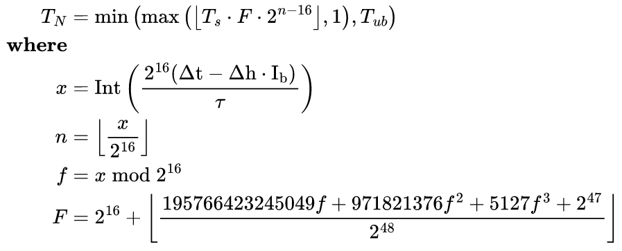

# مجلة ديكريد لشهر أغسطس 2023

_الصورة: بدون عنوان بواسطة _Exitus@

أبرز أحداث أغسطس:

* تم تفعيل تغييرين بالإجماع على شبكة ديكريد الرئيسية لتقليل مكافآت التعدين وتغيير خوارزمية التعدين. تعمل هذه التغييرات على تعطيل التكتلات الاحتكارية لتعدين ASIC وتجعل تعدين GPU أكثر سهولة.
* تم إطلاق أول إصدار على الشبكة الرئيسية لـ Cryptopower، وهي عبارة عن محفظة جديدة لسطح المكتب مبنية على قاعدة كود GoDCR مع إضافة محافظ BTC وLTC، والتبادل الفوري للعملات، والمزيد. كانت متاحة في البداية كتطبيق لسطح المكتب ولكن تطبيقات الهاتف المحمول قيد التطوير.
*  تم إصدار النسخة  0.1.8 لمُرحِّل بيسون مع تحميل سجل الدردشة بعد إعادة تشغيل التطبيق، وميزات التجارة الإلكترونية الأولية، والعديد من تحسينات تجربة المستخدم في التطبيقات الرسومية والنصية.
* تم دمج دعم العقدة الكاملة لمحفظة العقدة لـ Dash وFiro في منصة المبادلات اللامركزية لديكريد، ويمكن للمستخدمين المتقدمين تجربتها.

المحتويات:

* [تفعيل قواعد الإجماع الجديدة](#new-consensus-rules-activated)
* [إصدار النسخة 1.0.0 من Cryptopower](#cryptopower-v100-release)
* [إصدار النسخة 0.1.8 لمُرحِّل البيسون](#bison-relay-v018-release)
* [التطوير](#development)
* [الأشخاص](#people)
* [الإدارة و الحوكمة](#governance)
* [الشبكة](#network)
* [النظام البيئي](#ecosystem)
* [الانتشار](#outreach)
* [وسائل الإعلام](#media)
* [الأسواق](#markets)
* [الخارجية ذات الصلة](#relevant-external)

<a id="new-consensus-rules-activated" />

## تفعيل قواعد الإجماع الجديدة

تم تفعيل تغييرات الإجماع على [تغيير إثبات العمل إلى BLAKE3 و](https://github.com/decred/dcps/blob/master/dcp-0011/dcp-0011.mediawiki)ASERT و[تغيير تقسيم دعم إثبات العمل/إثبات الحصة إلى ](https://github.com/decred/dcps/blob/master/dcp-0012/dcp-0012.mediawiki)1/89 على شبكة ديكريد الرئيسية في الكتلة [794,368](https://dcrdata.decred.org/block/071683030010299ab13f139df59dc98d637957b766e47f8da6dd5ac762f1e8c7) في 29 أغسطس. استغرق الأمر ما يقرب من 5 أشهر منذ تقديم [اقتراح بوليتيا](https://proposals.decred.org/record/a8501bc) في مارس لتنفيذ هذه التغييرات وتفعيلها عن طريق التصويت.

تم إيقاف السلسلة مؤقتًا لمدة 3 أيام تقريبًا حتى عثر معدني وحدة المعالجة المركزية على الكتل الأولى وبدأ كل شيء في العمل مرة أخرى. سنغطي تطورات التعدين المبكرة لوحدة المعالجة المركزية (CPU) ووحدة معالجة الرسومات (GPU) في العدد القادم. حتى وقت كتابة هذا التقرير، يبدو كل شيء مستقرًا مرة أخرى وهناك المزيد من التحديثات قيد التنفيذ.

لن تتبع البرامج القديمة السلسلة بعد تفرع 29 أغسطس. لاستخدام ديكريد، تأكد من التحديث إلى أحدث إصدار للبرنامج الأساسي أو [التطبيق المستقل لمنصة المبادلات اللامركزية لديكريد](https://github.com/decred/dcrdex/releases) أو [Cryptopower](https://github.com/crypto-power/cryptopower/releases) أو أي [محفظة](https://decred.org/wallets/) أخرى كنت تستخدمها.

تهانينا لمجتمع ديكريد لتفعيل [التغيير الإجماعي الثاني عشر](https://github.com/decred/dcps)!

<a id="cryptopower-v100-release" />

## إصدار النسخة 1.0.0 من Cryptopower

Cryptopower هي محفظة جديدة احتجازية ذاتية لـ DCR وBTC وLTC. أول حزم إصدار للشبكة الرئيسية العامة هي نتيجة عام من أعمال التطوير والميزات الجديدة المضافة منذ توقف GoDCR في [أغسطس 2022](202208.md#godcr). أبرز ميزاتها:

* محفظة متعددة العملات لـ DCR وBTC وLTC - تعمل جميعها في الوضع الخفيف (SPV) دون الحاجة إلى تنزيل سلاسل الكتل الكاملة
* تحصيص ديكريد، والخلط، والحوكمة - التصويت على تغييرات الاجماع، وإنفاق الخزينة، ومقترحات بوليتيا
* تحويل العملات عبر منصات المبادلات المركزية مثل [Flyp.me](https://flyp.me/) و[Godex.io](https://godex.io/) و[ChangeNOW.io](https://changenow.io/) وغيرها
* تخصيص اختيار العملة لمزيد من الخصوصية
* تخصيص حد الفجوة
* تعمل على أنظمة التشغيل Windows، وmacOS، وLinux، وFreeBSD
* إمكانية إنشاء تطبيقات الهاتف المحمول لنظامي التشغيل Android وiOS من نفس قاعدة الكود

قم بتنزيل التطبيق لنظام التشغيل الخاص بك [هنا](https://github.com/crypto-power/cryptopower/releases). تأكد من التحقق من الملفات كما هو موضح في [الإصدار](https://github.com/crypto-power/cryptopower/releases/tag/release-v1.0.0)؛ تم توقيع الإصدارات بواسطة `Cryptopower <release@cryptopower.dev>` ببصمة المفتاح `5C26BFEC6C2466A528D5551CD05AC74F68976E52`.

تعد إصدارات Android APK [تجريبية](https://twitter.com/dreacot/status/1699963093940363668) ولم يُنصح بها بعد للمحافظ الحقيقية ولكن نرحب بالمختبرين.

نرحب بتقارير الأخطاء والتعليقات باستخدام [مسائل ](https://github.com/crypto-power/cryptopower/issues)GitHub أو دردشة ماتريكس [#cryptopower](https://matrix.to/#/!oxOZZtibVUXxXtdPJS:decred.org).

لمزيد من المعلومات:

* [فيديو توضيحي](https://twitter.com/dreacot/status/1694260734878712220) قصير
* [مقدمة ولقطات شاشة](https://www.cypherpunktimes.com/cryptopower-golang-native-desktop-mobile-wallet/)
* [اقتراح](https://proposals.decred.org/record/256efee) لتمويل تطوير Cryptopower
* حالة تطبيقات سطح المكتب والهاتف المحمول و[جدول ميزات](https://proposals.decred.org/record/256efee) شامل يقارن Cryptopower مع Decrediton، ومحافظ Android وiOS القديمة، وCake Wallet، وDCRDEX
* [أسئلة وأجوبة مع المطور الرئيسي dreacot@](https://www.cypherpunktimes.com/introducing-decred-developer-dreacot/)

_الصورة: صفحة اختيار محفظة Cryptopower في الوضع المظلم_

_الصورة: صفحة إرسال Cryptopower_

_الصورة: تدعم Cryptopower التحديد المتقدم للعملة لمزيد من التحكم_

_الصورة: تتيح لك Cryptopower [تحويل العملات](https://twitter.com/exitusdcr/status/1699366344813109572) دون لمس المتصفح_

<a id="bison-relay-v018-release" />

## إصدار النسخة 0.1.8 لمرحل بيسون

يعد هذا إصدارًا كبيرًا يتضمن ميزات جديدة وتحسينات في تجربة المستخدم تم إجراؤها على مدار الأشهر الأربعة الماضية.

التغييرات الرئيسية في كل من واجهة المستخدم الرسومية والتطبيقات النصية:

* تحميل سجل الدردشة بعد إعادة تشغيل التطبيق
* الصفحات ذات الارتباطات التشعبية (المشابهة لصفحات الويب)
* تحسين موثوقية منصات المبادلات الرئيسية والبقشيش
* العديد من إصلاحات الأخطاء

أبرز مميزات تطبيق واجهة المستخدم الرسومية:

* دفتر العناوين مع البحث والتصفية
* موجز الأخبار بالصور و الفرز المحسن
* تحسين واجهة المستخدم
* تحسين الاستجابة على الشاشات الصغيرة

أبرز تطبيقات النصوص brclient:

* الميزات الأولية للتجارة الإلكترونية
* تصفية المحتوى من جانب العميل
* النسخ الاحتياطية من بيانات العميل

تم تصميم البنية التحتية الأولية للتجارة الإلكترونية المسماة "simplestore" لبيع السلع الرقمية فقط مثل الصور ومقاطع الفيديو والصوت والملفات. طرق الدفع المدعومة هي وحدات ديكريد عن طريق الشبكة البرقية، وتحويلات وحدات ديكريد على السلسلة، والمعالجة المخصصة/اليدوية. يتوفر Simplestore فقط في التطبيق brclient المستند إلى النص في هذا الإصدار.

يتمتع عملاء واجهة المستخدم الرسومية والنص بميزات مختلفة الآن. يتم إدراج التغييرات الخاصة بكل تطبيق في [صفحة الإصدار](https://github.com/companyzero/bisonrelay/releases/tag/v0.1.8)، يرجى الانتباه إلى إشعار التحديث في حالة الترحيل من الإصدار 0.1.7 على نظام التشغيل Windows. للحصول على قائمة كاملة بالتغييرات مع التوضيحات، راجع إصدارات [مجلة ديكريد](https://xaur.github.io/decred-news/) من أبريل إلى يوليو 2023. راجع ملف [README](https://github.com/companyzero/bisonrelay/blob/v0.1.8/README.md#verifying-binaries) للحصول على إرشادات حول التحقق من الملفات.

_الصورة: تساعدك النسخة 0.1.8 من مرحل بيسون على العثور على التعليقات الجديدة بشكل أسرع_

<a id="development" />

## التطوير

ما لم يُذكر خلاف ذلك، فإن العمل المَذْكُور هنا يشتمل على حالة "الدمج إلى الرئيسي". وهذا يعني أن العمل قد تم استكماله ومراجعته ودمجه في كود المصدر الذي يمكن للمستخدمين المتقدمين [بناءه وتشغيله](https://medium.com/@artikozel/the-decred-node-back-to-the-source-part-one-27d4576e7e1c)، ولكنه ليس متاحًا بعد في ثنائيات الإصدار للمستخدمين العاديين.

### dcrd

_[dcrd](https://github.com/decred/dcrd) هو تطبيق عقدة كامل يعمل على تشغيل شبكة ديكريد من نظير إلى نظير حول العالم._

ركزت غالبية العمل هذا الشهر على المطورين، وليس بالضرورة على المستخدم. ومع ذلك، من المثير للاهتمام دائمًا أن يتم دعم إصدار Go الجديد، لأنه يفتح ميزات وتحسينات جديدة محتملة من لغة البرمجة نفسها (راجع تحديثات dcrwallet من [إصدار يوليو](202307.md#dcrwallet) للحصول على أمثلة على ذلك).

تم دمج العمل التالي في الفرع الرئيسي `master` من أجل الإصدارات المستقبلية:

* تم إسقاط الدعم الرسمي لـ Go 1.19، و[إضافة دعم لـ Go 1.21](https://github.com/decred/dcrd/pull/3172) (لا يزال Go 1.20 مدعومًا أيضًا). يتضمن ذلك تحديثات لسير عمل إنشاء GitHub Actions. لا يزال البناء على Go 1.19 ممكنًا، ومن المحتمل جدًا أن يعمل بشكل جيد، لكنه لم يعد قيد الاختبار بشكل نشط.
* تم تحديث [صورة ](https://github.com/decred/dcrd/pull/3171)Docker لإنشاء ملف dcrd الثنائي باستخدام Go 1.21.0.
تحسين إجراءات GitHub [سير عمل البناء](https://github.com/decred/dcrd/pull/3168) لتقليل إدخالات ذاكرة التخزين المؤقت المكررة والبريد العشوائي في ذاكرة التخزين المؤقت. يتضمن ذلك إزالة وحدة Go وإنشاء ذاكرة تخزين مؤقت من سير عمل إنشاء GitHub، نظرًا لأن إجراء `setup-go` الأخير يقوم بتخزينها مؤقتًا بشكل افتراضي، وكان هذا يؤدي إلى إنشاء إدخالات ذاكرة تخزين مؤقت مكررة. لا يزال يتم تخزين Linter مؤقتًا بشكل منفصل، ويتضمن هذا التحديث أيضًا تغييرًا صغيرًا في اسم الملف لإنتاج عدد أقل بكثير من كائنات ذاكرة التخزين المؤقت.
* تمت إضافة سيناريو اختبار إلى [اختبارات ](https://github.com/decred/dcrd/pull/3173)ASERT يضمن ضبط الصعوبة بشكل مناسب عندما تتسارع أوقات الكتلة.
* تمت إضافة [أداة نسخ الكلمات المكررة](https://github.com/decred/dcrd/pull/3175)، واستخدامها [لترتيب التعليقات](https://github.com/decred/dcrd/pull/3174) في 44 ملفًا مختلفًا.
* تمت [إزالة المعلمات غير المستخدمة](https://github.com/decred/dcrd/pull/3177) من بعض وظائف سلسلة الكتل: `parent` من المسجل الداخلي، و`isTreasuryEnabled` من `getStakeBaseAmounts`. هذه الوظائف داخلية، لذا ليس لهذا التغيير أي تأثير على العملاء أو المستخدمين.
* تمت إضافة [أداة فحص الأخطاء](https://github.com/decred/dcrd/pull/3179)، وتحديث كافة الأخطاء غير المفتوحة المتبقية بحيث يمكن [تضمينها بسياق مفيد](https://github.com/decred/dcrd/pull/3178). يتيح ذلك إمكانية فكها بواسطة استدعاءات الوظائف لتحديد مصدر الخطأ. يسمح هذا التحديث للأخطاء بالعمل بشكل جيد مع `errors.Is` و `errors.As`.

تمت مراجعة [مستند DCP-11](https://github.com/decred/dcps/blob/master/dcp-0011/dcp-0011.mediawiki) الذي يحدد التغيير إلى BLAKE3 وASERT و[تم إصداره](https //github.com/decred/dcps/pull/29). وفيما يلي بعض الحقائق المثيرة للاهتمام التي وجدناها:

* يشرح المستند إثبات تجزئة العمل الجديد، وخوارزمية تعديل صعوبة ASERT الجديدة، وإعادة ضبط الصعوبة في كتلة التفعيل، كل ذلك بتفصيل كبير مع الصيغ والرسوم البيانية وإرشادات التنفيذ.
* تظل *صديرة الكتلة* كما هي تمامًا، وهي عبارة عن بنية مدمجة تبلغ 180 بايت تحتوي على بيانات وصفية مهمة حول الكتلة وتسمح بمزامنة السلسلة والتنقل فيها بسرعة كبيرة.
* تظل *تجزئة الكتلة* دون تغيير أيضًا، وهي نفس تجزئة BLAKE-256 المكونة من 14 جولة لصديرة الكتلة. تستخدم معظم برامج وأكواد ديكريد تجزئة الكتلة لتحديد الكتل ولا تحتاج إلى أي تعديلات.
* تتغير *تجزئة إثبات العمل* إلى BLAKE3، ويتم إنشاؤها عن طريق تجزئة *صديرة الكتلة*. تحتاج برامج التعدين (والأجهزة) فقط إلى التكيف مع خوارزمية التجزئة الجديدة هذه.
* أظهرت الأبحاث التي أجريت على خوارزميات الصعوبة أن ASERT هي واحدة من [أفضل الخوارزميات أداءً](https://github.com/zawy12/difficulty-algorithms/issues/50) في هذا المجال. ملاحظة جانبية: حصل DA الخاص بالبتكوين على أسوأ تصنيف في الفئة التاسعة الأخيرة بعد كل الفئات الأخرى. بناءً على ذلك والأبحاث الأخرى، [اعتمدت البتكوين كاش](https://documentation.cash/protocol/forks/2020-11-15-asert.html) شكلاً مختلفًا من ASERT في نوفمبر 2020.
* يتم تنفيذ ASERT لكل كتلة بمعدل 144 مرة أكثر من خوارزمية EMA السابقة. كما أنه أسرع بمقدار 16 مرة تقريبًا، لذا سيقضي dcrd الإجمالي وقتًا أطول بمقدار 9 مرات تقريبًا في تشغيل كود ASERT. ومع ذلك، فإن هذا يتم في حدود ميكروثانية لكل كتلة ولا يحدث أي فرق عملي. اقرأ المزيد [هنا](https://github.com/decred/dcps/pull/29#discussion_r1300314310).
* يعد DCP-11 أكبر مقترح تغيير لديكريد حتى الآن، من حيث طول النص وعدد الملفات والحجم الإجمالي. إنه مصنوع بشكل جيد للغاية ويُنصح جميع عشاق ديكريد [بقراءة المقترح كاملاً](https://github.com/decred/dcps/blob/master/dcp-0011/dcp-0011.mediawiki).

تمت إضافة القسم الفرعي لنتائج التصويت إلى جميع [وثائق مقترحات تغيير ديكريد](https://github.com/decred/dcps) الإثنا عشر  لتوثيق الكتل التاريخية التي بدأ عندها التصويت وكذلك متى تم قفل تغييرات الإجماع وتفعيلها. قد تستخدم تطبيقات إجماع ديكريد أرقام الكتل هذه لتحسين منطق التحقق من السلسلة وتجنب تسجيل سجل الأصوات.

_الصورة: صيغة صعوبة ASERT بسيطة إلى حد ما. إذا كان بإمكان معالجاتنا تشغيل هذه الرياضيات الجميلة مباشرةً..._

_الصورة: انزل إلى الأرض وواجه الواقع الوحشي لأجهزة الكمبيوتر الثنائية بدقة محدودة. تم تحسين هذه الصيغة المعدلة لتعمل بسرعة على الأجهزة الحقيقية، مع الحد الأدنى من الأخطاء._

### dcrwallet

_[dcrwallet](https://github.com/decred/dcrwallet) هو خادم محفظة تستخدمه تطبيقات سطر الأوامر والمحفظة الرسومية._

تم [نقل](https://github.com/decred/dcrwallet/pull/2277) التغييرات من يونيو إلى يوليو للإصدار التالي 1.8.x:

* [تحذير المستخدمين](https://github.com/decred/dcrwallet/commit/1c1bcfbd5aa7ca0b1cbad06b4f1bb6b8c2af5aa5) حول أخطاء دفع رسوم مزود خدمة التصويت الناجمة عن قفل المحفظة. سيسمح هذا للمستخدمين بالتفاعل إذا كانت المحفظة المقفلة تمنع دفع رسوم مزود خدمة التصويت. عند رؤية الخطأ، يجب على المستخدم فتح المحفظة والمحاولة مرة أخرى لمنع فقدان التذاكر.
* تم إصلاح [منطق إعادة المحاولة](https://github.com/decred/dcrwallet/commit/07854e3746aeef2de88488ae5cc87ee6a092387b) المعطل لعمليات شراء تذاكر مزود خدمة التصويت الخاطئة. أثرت هذه المشكلة على العديد من المستخدمين. لم تتأثر أي عمليات شراء تذاكر عملت في المرة الأولى، ولكن لم تتم إعادة محاولة أي عمليات شراء حدثت بها خطأ، مما قد يؤدي إلى عدم إضافة التذاكر إلى مزود خدمة التصويت وتفويت الأصوات. لحسن الحظ، كانت إعادة تسجيل التذكرة مع مزود خدمة تصويت مختلف بمثابة حل بديل، ولكن من الواضح أن تجربة المستخدم كانت سيئة.
* تم إصلاح الخلل حيث يمكن أن يتأخر [التحقق من حالة دفع الرسوم](https://github.com/decred/dcrwallet/commit/c4c6c4213da7cde5ecdc97fb5347a1c7bc3aeae2) بشكل غير معقول. يقوم عميل مزود خدمة التصويت بتأخير الإجراءات لبعض المدة العشوائية للمساعدة في حماية الخصوصية. مع حساب التأخير غير الصحيح هذا، ستقوم المحفظة بالإبلاغ عن دفعات الرسوم على أنها غير مؤكدة لمدة تصل إلى ساعتين حتى يحدث التحقق التالي، عندما يتم إرسال الرسوم وتأكيدها فعليًا. الآن سيتم تحديث محفظة المستخدم قريبًا.
* استلزام عملاء مزود خدمة التصويت [انتظار مزود خدمة التصويت لتأكيد مدفوعات الرسوم](https://github.com/decred/dcrwallet/commit/7c551ce6b95456b6ec1a174b5529641dd133230a) قبل التفكير في شراء تذكرة مزود خدمة التصويت بالكامل. هذا يلغي العديد من حالات الحافة الإشكالية التي يسببها المستخدمون الذين يبثون معاملات الرسوم الخاصة بهم، مثل دفع رسوم منخفضة جدًا أو إرسال الدفع إلى العنوان الخطأ. إنه حل وقائي للحالات غير المحتملة للغاية التي لم نشهدها في مرحلة التطوير و الإختبار.

تم دمج التغييرات الجديدة في الفرع الرئيسي `master` وتم نقلها إلى الإصدار v1.8.x التالي:

* تم إصلاح خطأ آخر حيث استغرق تأكيد معاملة رسوم تذكرة مزود خدمة التصويت وقتًا أطول من اللازم، بسبب عدم تحديث [ارتفاعات الكتلة المباشرة وانتهاء الصلاحية](https://github.com/decred/dcrwallet/pull/2270) للتذكرة بعد تعدين التذكرة. لقد حدث ذلك مع غالبية تذاكر مزود خدمة التصويت. سيتم تأكيد الرسوم في النهاية إذا تركت المحفظة قيد التشغيل. ستؤدي إعادة تشغيل المحفظة إلى مزامنتها على الفور. ولم يكن هناك خطر فقدان الأصوات. التغيير الخلفي موجود [هنا](https://github.com/decred/dcrwallet/commit/1319da0b05d4a9715b045e847ff58b442f407f39).

تم دمج العمل التالي في الفرع الرئيسي `master` من أجل الإصدارات المستقبلية:

* تمت إضافة [تسجيل إشعارات تغييرات معاملةالمحفظة](https://github.com/decred/dcrwallet/pull/2275) أثناء عمليات إعادة الفحص. يتم إيقاف هذا أثناء إعادة الفحص الأولي (أثناء إعادة البذر أو بعد إعادة تشغيل dcrwallet) لأنه سيكون صاخبًا للغاية. عادةً ما يتم إجراء أي عمليات إعادة فحص أخرى لإصلاح المشكلة، وسوف تقوم dcrwallet بتسجيل الدخول عندما تجد معاملات المحفظة الجديدة داخل كتلة قديمة، أو معاملات المحفظة التي لم يتم تعدينها سابقًا، ولكن تم تعدينها الآن. لا تعتبر عمليات إعادة الفحص ممتعة للمستخدمين، وعمليات إعادة الفحص هي في الواقع مجرد وسيلة لمزامنة المحافظ التي خرجت عن المزامنة. سيكون الحصول على تجزئات المعاملات الفائتة مفيدًا لتصحيح سبب وجود مشكلة في مزامنتها في المحفظة، ونأمل أن يؤدي إلى بعض إصلاحات الأخطاء التي تقلل حاجة المستخدم إلى إعادة الفحص.
* تمت إضافة [إلغاء فحص](https://github.com/decred/dcrwallet/pull/2276) إلى عمليات شراء التذاكر غير المخلوطة قبل نشر عملية الشراء. يتم بالفعل التحقق من إلغاء عمليات شراء التذاكر المخلوطة، لذلك قد يؤدي هذا إلى حل خطأ حالة الحافة.
* إصلاح معالجة مجموعة من تذاكر مزود خدمة التصويت في حالة [فشل إحداها](https://github.com/decred/dcrwallet/pull/2259). عند إضافة تذاكر متعددة إلى عميل مزود خدمة التصويت إذا فشلت إحداها، فلن تتم محاولة معالجة التذاكر المتبقية. ومن غير المرجح أن يسبب هذا أي مشاكل في العالم الحقيقي. أضاف هذا التغيير أيضًا بعض عمليات التسجيل المفقودة لتوعية المستخدمين بفشل بعض تذاكر موفر خدمة التصويت وقد تحتاج إلى التحقيق.

تغييرات المطور و التغييرات الداخلية:

* نقل منطق [العثور على التذاكر التي يديرها مزود خدمة التصويت](https://github.com/decred/dcrwallet/pull/2259) من عميل مزود خدمة التصويت إلى كود المحفظة الرئيسي. يعد هذا جزءًا من الجهد المستمر لإعادة هيكلة مزود خدمة التصويت ومنطق المحفظة.
* تمت إضافة [دعم رسمي لـ Go 1.21](https://github.com/decred/dcrwallet/pull/2278) وتحديث سير عمل إنشاء GitHub Actions.
* [تم استبدال](https://github.com/decred/dcrwallet/pull/2265) جميع الاستخدامات التي لم يتم إنشاؤها لـ `interface{}` بـ `any` في قاعدة الكود. على الرغم من أن `any` هو مجرد اسم مستعار جديد، إلا أنه يجعل قراءة الكود أسهل.

### dcrctl

_[dcrctl](https://github.com/decred/dcrctl) هو عميل سطر أوامر لـ dcrd و dcrwallet._

* تحسين التعليمات لإعداد [المتغيرات البيئية](https://github.com/decred/dcrctl/pull/68) عند إنشاء dcrctl أو تثبيته.
* تم تحديث CI والمستندات لـ [Go 1.21](https://github.com/decred/dcrctl/pull/69).

### Decrediton

_[Decrediton](https://github.com/decred/decrediton) ديكريديتون هو تطبيق محفظة لسطح المكتب كامل الميزات مع ميزة التصويت مدمجة، وميزة الخلط ب StakeShuffle، والشبكة البرقية، والتداول على منصة المُبادلات اللامركزية DEX للديكريد، والمزيد. يتم تشغيلها مع سلسلة الكتل كاملة أو بدونها (وضع التحقق البسيط من الدفع SPV)._

مساهمات التعبئة والتغليف:

* تمت إضافة الإصدار 1.8.0 من ديكريديتون إلى مستودع [Homebrew Cask](https://github.com/Homebrew/homebrew-cask/pull/149083) لمستخدمي macOS.
* تمت إضافة الإصدار 1.8.0 من ديكريديتون إلى [winget](https://github.com/microsoft/winget-pkgs/pull/112385)، وهو مدير الحزم المثبت افتراضيًا في نظامي التشغيل Windows 10 و Windows 11.

أخبار أخرى:

* يبدو أن مفهوم 2FA[ لديكريديتون](https://www.reddit.com/r/decred/comments/15cyod5/decrediton_2fa_hoddle_safely/) من @norwnd قد تم [تعليقه](https://matrix.to/#/!DwNysKhaQPBPURaBGt:decred.org/$sn4rEGvdxLgITmVuwLrFXfQhPXbVqvMVkK1So_xa2DY) لصالح [استكشاف](https://matrix.to/#/! DwNysKhaQPBPURaBGt:decred.org/$sn4rEGvdxLgITmVuwLrFXfQhPXbVqvMVkK1So_xa2DY) [حل متعدد التوقيعات](https://gist.github.com/norwnd/890ad642985f4e9e9f7b1dd243b21f9e#long-term-we-need-decrediton-with-generic-multisig-support-right-) للأغراض العامة لديكريديتون إذا كان هناك طلب. حاليًا لا يوجد واجهة رسومية متعددة التوقيعات في ديكريد.

### vspd

_[vspd](https://github.com/decred/vspd) هو برنامج خادم لتشغيل موفر خدمة التصويت. يصوت موفر خدمة التصويت نيابة عن مستخدميه على مدار الساعة طوال أيام الأسبوع ولا يمكنه سرقة الأموال._

التغييرات الوظيفية التي قد يلاحظها مسؤولو مزود خدمة التصويت:

* الانتظار حتى اكتمال جميع مهام بدء التشغيل الأخرى قبل الاستماع إلى [الإشعارات من dcrd](https://github.com/decred/vspd/pull/407). لم تكن هناك مشكلة في الاتصال بـ dcrd سابقًا ولكنه لم يكن ضروريًا وأدى إلى إنشاء سجلات فوضوية.
* تم تغيير اكتشاف [التذاكر التي تم التصويت عليها وإلغائها](https://github.com/decred/vspd/pull/413) من استخدام استدعاء `TicketInfo` الخاص بـ dcrwallet إلى استخدام [مرشحات ](https://github.com/decred/dcrd/tree/f69247ff2478057ddbbc6692fc96ff6520b6a8c1/gcs)GCS من dcrd. تمكن [مجموعات مشفرة Golomb](https://github.com/decred/dcps/blob/master/dcp-0005/dcp-0005.mediawiki#user-content-Golombcoded_Sets) (GCS) من الكشف الفعال للغاية عن المعاملات، و تعد هذه الميزة عنصرًا أساسيًا في المحافظ الخفيفة (SPV) الخاصة بديكريد والتي تحافظ على الخصوصية. الطريقة الجديدة [أكثر قوة](https://github.com/decred/vspd/pull/413#issuecomment-1694228745)، ونتيجة لذلك قد يلاحظ مسؤولو مزود خدمة التصويت أن vspd يكتشف بعض سجلات التذاكر التي تم التصويت عليها/استعادتها والتي لم يتم يكتشفها `TicketInfo` مطلقًا.
* تمت إضافة فحص إدماج جديد أدى إلى إلغاء تحديثات التذاكر في قاعدة البيانات لتكون إما [منتهية الصلاحية أو مفقودة](https://github.com/decred/vspd/pull/415). لم يتمكن الإصدار الأولي من vspd من التمييز بين التذاكر منتهية الصلاحية والتذاكر المفوتة وتم الإبلاغ عنها جميعًا على أنها "ملغاة". تعد معرفة عدد التذاكر التي فوتها مزود خدمة التصويت أمرًا مفيدًا [لتقييم موثوقيتها](https://github.com/decred/vspd/issues/268). يستخدم هذا التحديث أسلوبًا إرشاديًا ذكيًا لتخمين نتيجة التذكرة بناءً على المدة التي يستغرقها لإستعادتها. إنها ليست دقيقة بنسبة 100% ولكنها جيدة بما يكفي لغرض الإبلاغ عن إحصائيات مزود خدمة التصويت.

تغييرات التطوير و التغييرات الداخلية:

* تمت إضافة اختبار للتأكد من أن [سلسلة الأخطاء](https://github.com/decred/vspd/pull/404) المشفرة التي تم إرجاعها من [securecookie](https://github.com/gorilla/securecookie) لن تتغير بشكل غير متوقع عند تحديث vspd إلى إصدار أحدث من المكتبة.
* تم [استبدال](https://github.com/decred/vspd/pull/401) استخدام `interface{}` بأي `any`، على غرار [dcrwallet](#dcrwallet).
* تم التحديث إلى [Go 1.21](https://github.com/decred/vspd/pull/402) وإجراءات GitHub الأحدث. تمت إزالة الاختبار باستخدام Go 1.19.
* تمت إزالة [منطق دفع رسوم مزود خدمة التصويت](https://github.com/decred/vspd/pull/403) من جانب العميل من مستودع vspd. تم العثور على [فكرة](https://github.com/decred/vspd/issues/379) لترحيل جميع أكواد عميل موفر خدمة التصويت من dcrwallet إلى مستودع vspd لتكون مشكلة، فقد أنشأت تبعية دائرية بين vspd وdcrwallet وهو [مرهق](https://matrix.to/#/!zefvTnlxYHPKvJMThI:decred.org/$_rzNyvnGedWeh_tnXWk5WDQKaj3TODeXbxRa9fg7CtY) ولا يستحق عبء الصيانة. تمت إزالة معظم أكواد عميل مزود خدمة التصويت من vspd وستظل موجودة في مستودع dcrwallet. في نهاية المطاف، يجب أن تصبح حزمة مُصدَّرة يمكن إعادة استخدامها بواسطة البرامج التي تسعى إلى إضافة ميزات التوقيع المساحي لمزود خدمة التصويت. ما تبقى في مستودع vspd هو الأساسيات المطلقة التي ستكون مفيدة لأي مستهلك لواجهة برمجة تطبيقات vspd: [أنواع البيانات](https://github.com/decred/vspd/blob/2db761e0727866fda0bc303432e443599a2d3b45/types/types.go) و[عميل HTTP الأساسي](https://github.com/decred/vspd/blob/2db761e0727866fda0bc303432e443599a2d3b45/client/client.go) للتواصل مع vspd، بما في ذلك توقيع الطلبات والتحقق من توقيعات الاستجابات لـ [المساءلة ثنائية الاتجاه](https://github.com/decred/vspd/blob/2db761e0727866fda0bc303432e443599a2d3b45/docs/two-way-accountability.md).
* تبسيط [كود إيقاف التشغيل](https://github.com/decred/vspd/pull/410). تم توريثه من dcrwallet وكان أكثر مرونة وتعقيدًا قليلاً مما هو مطلوب لـ vspd.
* [إعادة هيكلة متنوعة](https://github.com/decred/vspd/pull/408) للسماح بمزيد من إعادة استخدام الكود وتحسين عمليات التحقق من الإدماج.
* إعادة هيكلة كيفية [تمرير البيانات](https://github.com/decred/vspd/pull/409) داخليًا لإزالة التكرار والاستعداد للتغييرات المستقبلية.
* تم إصلاح الخلل في [إشعارات](https://github.com/decred/vspd/pull/412) معالجة الكتلة الجديدة من dcrd (لم يؤثر ذلك على أي إصدار تم إصداره).
* تمت إزالة [السياقات من الهياكل](https://github.com/decred/vspd/pull/411) على النحو [الموصى به](https://pkg.go.dev/context) من خلال وثائق المكتبة القياسية. تمت إضافة [linters](https://github.com/decred/vspd/pull/411) لمنع هذه المشكلة والمشكلات الأخرى التي ظهرت أثناء مراجعة الكود.

### الشبكة البرقية

_[dcrlnd](https://github.com/decred/dcrlnd) هو برنامج عقدة الشبكة البرقية لديكريد. تتيح الشبكة البرقية إجراء معاملات فورية ومنخفضة التكلفة._

* تم إجراء التغييرات المنقولة في منبع [lnd](https://github.com/lightningnetwork/lnd) بين الإصدارين v0.11.1 و[v0.12.1](https://github.com/lightningnetwork/lnd/releases/tag/v0.12.1-beta) (تم إصداره في فبراير 2021). تم نقل 541 ايداعا تم توزيعه عبر 220 عملية تنفيذ رئيسية، منها [53 ايداعا](https://github.com/decred/dcrlnd/commits?after=c97f63c8bc41977c6c9b6e5b62fb216e8157cef9+0&author=matheusd) كان ضروريا لضبط قاعدة الكود إلى ديكريد. يمكن العثور على القائمة الكاملة لطلبات السحب المنقولة [هنا](https://github.com/decred/dcrlnd/blob/master/docs/upstream-prs.csv).

### DCRDEX

_[DCRDEX](https://github.com/decred/dcrdex) هي منصة مبادلات غير احتجازية للمُبادلات غير الموثوقة، مدعومة بالمقايضات الذرية._

الإصدار 0.6.2 من منصة المبادلات اللامركزية لديكريد متوفر الآن في [متجر تطبيقات Umbrel التابع لديكريد](https://github.com/decred/umbrel-app-store).

التغييرات المضمنة في الإصدار 0.6.3 (الصادر في سبتمبر):

- تم إصلاح إمكانية إظهار [دفتر الطلبات](https://github.com/decred/dcrdex/pull/2449) غير الصحيح في بعض سيناريوهات إلغاء الطلب.

يتم دمج التغييرات المتبقية أدناه في الفرع الرئيسي `master` من أجل الإصدارات المستقبلية.

العميل:

* تم تحسين [تطبيق عرض البذرة](https://github.com/decred/dcrdex/pull/2462) على صفحة النسخ الاحتياطي، وسيتم عرضه في مجموعات مكونة من ثمانية أحرف.
* تم تنفيذ [قيود التكوين](https://github.com/decred/dcrdex/pull/2454) للمحافظ الخاضعة للرقابة الخارجية. يسمح هذا بإخفاء الإعدادات مثل تغيير كلمة المرور إذا تم تضمين واجهة المستخدم الرسومية لمنصة المبادلات اللامركزية في ديكريديتون  ولا تعمل بشكل مستقل. في هذا السيناريو، يجب إجراء أي تغييرات على محفظة التداول من ديكريديتون، ويجب أن يؤدي حظرها في واجهة DEX UI إلى منع المستخدمين من كسر المحفظة.
* تحديث [علامة تبويب/عنوان النافذة](https://github.com/decred/dcrdex/pull/2458) في المتصفح عند تغيير الأسواق. تقوم أيضًا بتوفير تعليقات مرئية فورية عندما ينقر المستخدم على سوق أخرى، مثل مسح مخطط العمق ودفتر الطلبات والمطابقات الأخيرة.

الخادم:

* إرسال إشعارًا عقابيًا فقط عندما [تتغير طبقة](https://github.com/decred/dcrdex/pull/2451) المستخدم، وتجنب الإشعارات غير الضرورية.

ديكريد:

* تمت إضافة [أسس دعم التحصيص](https://github.com/decred/dcrdex/pull/2290).
* كشف  طرق التحصيص عبر [واجهة برمجة تطبيقات ](https://github.com/decred/dcrdex/pull/2316)JSON-RPC
* تمت إضافة طريقة لجلب [قائمة بمقدمي خدمة التصويت](https://github.com/decred/dcrdex/pull/2466) من [api.decred.org](https://github.com/decred/dcrwebapi/blob/master/docs/api.md).
* الخطوة التالية هي إنشاء واجهة المستخدم الرسومية للتحصيص.

البتكوين:

* تم إصلاح العطل عند محاولة [إعادة تكوين](https://github.com/decred/dcrdex/pull/2474) محفظة BTC المفقودة أو التالفة.

الداش:

* تمت إضافة دعم [العقدة الكاملة لمحفظة](https://github.com/decred/dcrdex/pull/2424) لداش.
* يتطلب تحديث الإصدار [v19.2.0](https://github.com/decred/dcrdex/pull/2484) الإلزامي لداش.

الفيرو:

* تم تنفيذ دعم [محفظة Electrum الخفيفة](https://github.com/decred/dcrdex/pull/2426) للفيرو، بما في ذلك أدوات الاختبار مع البرنامج الخفي لسلسلة الفيرو الآلي وخادم ElectrumX وعميل المحفظة.

تقدم تطوير [صانع السوق وروبوتات المراجحة](https://proposals.decred.org/record/8b1ceda):

* تم تنفيذ [الفصل بين الرصيد](https://github.com/decred/dcrdex/pull/2332) مما يحد من مقدار الأموال المتاحة لكل روبوت.
* تم تنفيذ [محاكاة](https://github.com/decred/dcrdex/pull/2409) للأسواق الجانبية والاتجاهية والمتقلبة. سيتم استخدام هذا في [اختبار سلوك الروبوت](https://github.com/decred/dcrdex/issues/2303). بالنسبة إلى الفضوليين، تم توثيق عمليات محاكاة السوق المتاحة [هنا](https://github.com/decred/dcrdex/blob/8fad25372c4af9d0b378335e4a3dbd12f6ba0d22/dex/testing/loadbot/README.md).
* تم تحديث إستراتيجية صانع السوق الأساسية من أجل [تقديم طلبات متعددة](https://github.com/decred/dcrdex/pull/2416) على مسافات مختلفة من السعر الأساسي بدلاً من واحد فقط.
* مراعاة إمكانية [رد](https://github.com/decred/dcrdex/pull/2479) المبالغ في حسابات رصيد صانع السوق.

المستندات:

* تمت إضافة صفحة wiki حول [إدارة حسابات تداول منصة المبادلات اللامركزية](https://github.com/decred/dcrdex/pull/2468) تغطي موضوعات مثل: إنشاء حساب موجود أو استخدامه أو تعطيله أو تصديره أو إدارته.
* تحديث [المواصفات](https://github.com/decred/dcrdex/pull/2470) لنقاط نهاية واجهة برمجة التطبيقات الجديدة.

تغيرات المطور والتغييرات الداخلية:

* تمت إضافة علامة [لتعطيل التعدين في الخلفية](https://github.com/decred/dcrdex/pull/2452) في أداة اختبار DCR.
* تحسينات إعادة البناء والاختبار.

مسائل أخرى:

* تم نشر خطة تطوير تقريبية [لخريف ](https://github.com/decred/dcrdex/issues/2483)2023 للمراجعة والمناقشة، بما في ذلك بعض الأفكار الطموحة مثل إعداد الأوراق المالية.

_الصورة: حماية من الأخطاء الذاتية ستمنع التغييرات العرضية التي قد تؤدي إلى كسر المحفظة عند استخدام DEX داخل ديكريديتون_

_الصورة: محاكاة السوق الجانبية لاختبار أداء روبوتات صانع السوق_

### Cryptopower

_[Cryptopower](https://github.com/crypto-power/cryptopower) هي محفظة ذات واجهة مستخدم رسومية لسطح المكتب متعددة العملات لـ DCR وBTC وLTC. يتم تشغيلها في وضع التحقق البسيط من الدفع والخفيف الذي يحافظ على الخصوصية دون الحاجة إلى سلاسل كتل كاملة، ويدعم تحصيص ديكريد، والخلط، والتصويت، وغيرها من الميزات الفريدة._

آخر مرة كتبنا فيها سجلات التطوير لهذا المشروع كانت في [أغسطس ](202208.md#godcr)2022، عندما كان يطلق عليه اسم GoDCR. فيما يلي ملخص سريع لتاريخ المشروع حتى الآن:

*  في سبتمبر 2018، بدأت مجموعة رائدة في تجربة مكتبات واجهة المستخدم الرسومية (GUI) المناسبة لبناء محفظة ديكريد بلغة Go الخالصة. يتمتع تطبيق Go الخالص بإمكانية الحصول على أمن أعلى وأداء أفضل والوصول إلى المزيد من الأنظمة الأساسية.
*  تم إنشاء خمس واجهات نموذجية: سطر الأوامر، وواجهة مستخدم طرفية قائمة على النص تعتمد على [tview](https://github.com/rivo/tview)، وواجهة مستخدم لمتصفح الويب تعتمد على [Stimulus](https://stimulus.hotwired.dev/)، وواجهة مستخدم رسومية لسطح المكتب مصنوعة من مجموعة أدوات [nucular](https://github.com/aarzilli/nucular) للوضع الفوري، وواجهة مستخدم رسومية أخرى لسطح المكتب مصنوعة باستخدام مجموعة أدوات [Fyne](https://github.com/fyne-io/fyne) للوضع المحتجز. يتم الآن أرشفة هذه النماذج الأولية و[لقطات الشاشة](https://github.com/raedahgroup/godcr-old/wiki/Screenshots) [هنا](https://github.com/raedahgroup/godcr-old).
*  ونتيجة لهذا البحث، تم اختيار مكتبة أخرى تسمى [Gio](https://gioui.org/) كفائزة وتم إطلاق تطبيق جديد [GoDCR](https://github.com/planetdecred/godcr) في يناير 2020.
* تمت الموافقة على أول [مقترح لتطوير](https://proposals.decred.org/proposals/e5c8051) GoDCR في نوفمبر 2020 بنسبة نعم 92%.
* تم إصدار أول إصدار وظيفي لشبكة الاختبار في [سبتمبر ](https://xaur.github.io/decred-news/journal/202109)2021.
* تم رفض [الاقتراح الثاني](https://proposals.decred.org/record/f7d9fc8) بنسبة 49٪ نعم في أكتوبر 2021.
* صدر أول إصدار للشبكة الرئيسية في [مايو ](https://xaur.github.io/decred-news/journal/202205)2022.
تم رفض [الاقتراح الثالث](https://proposals.decred.org/record/0ef42e5) الذي يجمع بين GoDCR وتطوير المحفظة المحمولة الحالية بنسبة 20% نعم في يوليو 2022.
* توقفت الإيداعات في مستودع [godcr](https://github.com/planetdecred/godcr) في أغسطس 2022 ولكن بعد أسبوعين فقط استمر العمل في تفرع خاص.
* بعد عام كامل من التطوير الخاص، تم [الكشف](https://matrix.to/#/!aNnAOHkWUdNcEXRGjJ:decred.org/$Bz6ilL9i3WnaaHeAuWxEl8UOvuJrD9sNQIK8fC359lM) عن تغيير العلامة التجارية إلى Cryptopower، وإصدار الإصدار 1.0.0، واقتراح جديد.

كان شهر أغسطس هادئًا نسبيًا من حيث التطوير بينما كان الفريق يركز على شحن [الإصدار الأولي 1.0.0](#cryptopower-v100-release) والعمل على [الاقتراح](https://proposals.decred.org/record/256efee) لتمويل هذا المشروع.

التغييرات المدمجة في الفرع الرئيسي `master` من أجل الإصدار التالي:

* تم إصلاح المشكلات التي تمنع [شراء تذكرة](https://github.com/crypto-power/cryptopower/pull/44) DCR. إذا فشل دفع رسوم مزود خدمة التصويت، فيمكن إعادة تقديمها عن طريق فتح صفحة تفاصيل التذكرة.
* تم إصلاح تعطل التطبيق عند النقر على [زر التصويت](https://github.com/crypto-power/cryptopower/pull/54) للتصويت على الاقتراح.

مكتبة التبديل الفوري [instantswap](https://github.com/crypto-power/instantswap):

* تمت إضافة وظيفة للتحقق من أن [العنوان قد تلقى](https://github.com/crypto-power/instantswap/pull/5) المبلغ المحدد.
* تستخدم محفظة Cryptopower مكتبة التبديل الفوري للتحويل بين العملات من خلال خدمات مركزية مثل Flyp.me وGodex.io وChangeNOW.io [والمزيد](https://github.com/crypto-power/instantswap/tree/a58863beed9541e9cfefce611b2a3392ef0a9c1d/instantswap). كما يوفر أيضًا أدوات مساعدة لفحص العناوين والمعاملات عبر [مستكشفات الكتل](https://github.com/crypto-power/instantswap/tree/a58863beed9541e9cfefce611b2a3392ef0a9c1d/blockexplorer) المختلفة.
تستخدم محفظة Cryptopower مكتبة التبديل الفوري للتحويل بين العملات من خلال خدمات مركزية مثل Flyp.me وGodex.io وChangeNOW.io [والمزيد](https://github.com/crypto-power/instantswap/tree/a58863beed9541e9cfefce611b2a3392ef0a9c1d/instantswap). كما يوفر أيضًا أدوات مساعدة لفحص العناوين والمعاملات عبر [مستكشفات الكتل](https://github.com/crypto-power/instantswap/tree/a58863beed9541e9cfefce611b2a3392ef0a9c1d/blockexplorer) المختلفة.

الخطة من هنا هي إصلاح الأخطاء الموجودة في الإصدار الأولي، وبناء الميزات الموضحة في [الاقتراح](https://proposals.decred.org/record/256efee) مع إعادة استخدام أكبر قدر ممكن من منصة المبادلات اللامركزية لديكريد ومشاريع ديكريد الأخرى.

يمكن للمطورين والمختبرين المهتمين بالمساهمة الانضمام إلى غرف الدردشة #cryptopower و #cryptopower-dev. راجع [هذا الدليل](https://docs.decred.org/getting-started/joining-matrix-channels/) لمعرفة كيفية الانضمام إلى محادثات Matrix الخاصة بنا.

_الصورة: محفظة LTC على Cryptopower_

_الصورة: واجهة مستخدم إنشاء محفظة Cryptopower على الأندرويد، التصميم قيد التطوير_

_الصورة: تم اختبار الإصدار التجريبي من Cryptopower Android على جهاز حقيقي_

### المستندات

_[dcrdocs](https://github.com/decred/dcrdocs) هو الكود المصدري [لوثائق مستخدم](https://docs.decred.org/) ديكريد._

* تم تحديث عدة صفحات لمقترح تغيير ديكريد [DCP-12](https://github.com/decred/dcrdocs/pull/1226). تتضمن صفحات [النظرة العامة](https://docs.decred.org/) و[المسرد](https://docs.decred.org/glossary/) و[الدستور](https://docs.decred.org/governance/decred-constitution/) الآن تقسيمًا صحيحًا لمكافآت الكتلة. بالإضافة إلى ذلك، توثق صفحة [الإصدار](https://docs.decred.org/advanced/issuance/) الآن جميع الانقسامات التاريخية الثلاثة (60/30/10، 10/80/10، و1/89/10)، وتحتوي على مخطط إصدار محدث.
* تم تحديث [سمة المادة لـ MkDocs](https://github.com/decred/dcrdocs/pull/1227) إلى الإصدار 9.2.6، مما يضيف التحقق الجديد من الروابط الداخلية وعناصر قائمة التنقل. كانت هناك [مشكلة](https://github.com/squidfunk/mkdocs-material/issues/5924) في مكون إضافي واحد ولكن المشرف قام بإصلاحها وأصدر النسخة المنقحة في يوم واحد فقط.

> مع الأخذ في الاعتبار تقسيمات مكافأة الكتلة الأولية لأول 794,367 كتلة والتقسيم المعدل بدءًا من الكتلة 794,368، فإن التقسيم النهائي الفعال لإجمالي العملات المعدنة هو:
> 
> * 40.34% لمعدني إثبات العمل
> * 49.63% لناخبي إثبات الحصة
> * 10% لخزينة ديكريد \[[إصدار DCR](https://docs.decred.org/advanced/issuance/)\]

### decred.org

_[dcrweb](https://github.com/decred/dcrweb) هو الكود المصدري لموقع الويب [decred.org](https://decred.org/)._

* تمت إضافة [أيقونات العلامة التجارية](https://github.com/decred/dcrweb/pull/1132) إلى إصدارات البرامج على صفحة [الأخبار](https://decred.org/news/).
* تمت إضافة [13 عنصرًا](https://decred.org/news/) إلى صفحة الأخبار.

### مُرَحِّل بيسون

_[مُرَحِّل بيسون](https://github.com/companyzero/bisonrelay) هي منصة وسائط اجتماعية جديدة مع حماية قوية ضد الرقابة والمراقبة والإعلان، مدعومة من الشبكة البرقية لديكريد._

تغييرات أغسطس المضمنة في الإصدار 0.1.8 لكل من تطبيق واجهة المستخدم الرسومية والعميل المستند إلى النص:

* [الاعتراف بروابط `lnpay://`](https://github.com/companyzero/bisonrelay/commit/66ebc67b02d758594bf86bf640c8f66d9f409fe5) وعرضها كأزرار يمكنها بدء مدفوعات الشبكة البرقية.
* تمت إضافة [ملاحظات الإصدار](https://github.com/companyzero/bisonrelay/pull/313) والتجزئة والتوقيعات لإصدار الإصدار 0.1.8. يضيف هذا أيضًا إرشادات حول [التحقق من الملفات](https://github.com/companyzero/bisonrelay/tree/8f902aaa62bf3475d859fc3aef50474b7f98d03a#verifying-binaries) إلى ملف README.
*  تخطي عمليات [التحقق من المبالغ](https://github.com/companyzero/bisonrelay/pull/309) المعطلة في dcrlnd حتى يتم إصلاحها. قد يمنع هذا التحقق العميل من إرسال الرسائل.

تغييرات تطبيق واجهة المستخدم الرسومية المضمنة في الإصدار 0.1.8:

* سيتم [نقل دليل بيانات](https://github.com/companyzero/bisonrelay/pull/307) مُرَحِّل بيسون على نظام التشغيل Windows إلى موقع جديد بسبب مشكلات في MSIX وشهادة محدثة. سيتم عرض تحذير للمستخدم وينصح بعمل نسخة احتياطية قبل المتابعة.
* إدراج [الدردشات النشطة](https://github.com/companyzero/bisonrelay/pull/320) في دفتر العناوين. في السابق، إذا كانت الدردشة مفتوحة بالفعل، فلن تظهر في دفتر العناوين وقد يرتبك المستخدمون بشأن فقدان بعض جهات الاتصال.
* إصلاح [اسم التطبيق](https://github.com/companyzero/bisonrelay/pull/322) الذي يظهر في إدارة مهام Windows.

تغييرات brclient المضمنة في إصدار النسخة 0.1.8:

* تمت [إضافة تتبع لمدفوعات ](https://github.com/companyzero/bisonrelay/pull/303)simplestore التي تم إجراؤها باستخدام فواتير الشبكة البرقية ومعاملات DCR على السلسلة. كما تمت إضافة إمكانية إرسال الملف الذي تم شراؤه بعد تأكيد الدفع.
* تمت إضافة [وثائق](https://github.com/companyzero/bisonrelay/pull/311) حول تكوين Simplestore.
* تم إصلاح إمكانية تحليل الملفات الخاطئة عند [إعادة تحميل](https://github.com/companyzero/bisonrelay/commit/57c8d48a2ad7cf8a88208e9d89c9e952bab13ae0) المنتجات من القرص.

تم دمج التغييرات المذكورة أدناه في الفرع الرئيسي `master` من أجل إصدار مستقبلي، وهو الإصدار المحتمل 0.1.9.

التغييرات الشائعة في كل من واجهة المستخدم الرسومية والتطبيقات النصية:

* إلغاء اشتراك المستخدمين الخاملين تلقائيًا وإزالتهم من الدردشات الجماعية. إذا ظل العميل النظير خاملاً لمدة 21 يومًا، فسيتم إرسال مصافحة تلقائية لاختبار ما إذا كان سيستجيب أم لا. بعد 60 يومًا، إذا لم يكن هناك أي استجابة، فسيتم إلغاء اشتراك النظير الخامل قسريًا من منشورات المستخدم المحلي وإزالته من أي محادثات جماعية حيث يكون المستخدم المحلي هو المسؤول. يمكن تكوين كلا الفترات الزمنية أو تعطيلها من قبل المستخدم.

تغييرات تطبيق واجهة المستخدم الرسومية:

* تم إصلاح خطأ إرجاع [فتح الرابط](https://github.com/companyzero/bisonrelay/pull/318) بدلاً من فتح الرابط في متصفح الويب.

تغييرات brclient:

* [إنشاء](https://github.com/companyzero/bisonrelay/pull/332) الملفات الجذرية ل simplestore إذا كان دليل المتجر المعد موجودًا ولكنه فارغ. في السابق كان دليل فارغ موجود يمنع ذلك.
* [توسيع](https://github.com/companyzero/bisonrelay/pull/330) متغيرات البيئة و `~` في الأمر `/backup`.

تغييرات المطور و التغييرات الداخلية :

* البناء والاختبار باستخدام [Go 1.21](https://github.com/companyzero/bisonrelay/pull/315).
* تحديث [التبعيات](https://github.com/companyzero/bisonrelay/pull/312).

### مسائل أخرى

* تم [اقتراح](https://github.com/decred/atomicswap/issues/129) مفهوم المقايضة الذرية لمونيرو مع BTC أو BCH في مستودع atomicswap. لا تحتوي المونيرو على عناصر أولية مثل التجزئة أو الأقفال الزمنية اللازمة للمقايضات الذرية التقليدية، لكن المخطط المقترح يتطلب واحدة فقط من السلسلتين للحصول على قدرات برمجة نصية كافية. هناك اهتمام كبير بهذا البحث من خلال مشاريع مثل [xmr-btc-swap](https://github.com/comit-network/xmr-btc-swap) من شبكة COMIT و[BasicSwap](https://particl.news/bidirectional-part-anon-and-xmr-atomic-swaps-now-live-on-basicswap-dex/)  من Particl لاستكشاف كيفية مبادلة المونيرو بعملات شبيهة بالبتكوين.

<a id="people" />

## الأشخاص

نرحب بالمساهمين الجدد لأول مرة:

* @tallamericano (مؤلف [Cypherpunk Times](https://www.cypherpunktimes.com/author/tall/))

إحصائيات المجتمع اعتبارًا من 2 سبتمبر (مقارنة بـ 1 أغسطس):

* متابعو [التويتر](https://twitter.com/decredproject):  53,306 (-22)
* المشتركين في [ريديت](https://www.reddit.com/r/decred/): 12,751 (+4)
* مستخدمي غرفة الدردشة general# على [الماتريكس](https://chat.decred.org/): 805 (+8)
* مستخدمي [الديسكورد](https://discord.gg/GJ2GXfz): 1,661 (+72)، تم التحقق منهم للنشر: 677 (+34)
* مستخدمي [التيليجرام](https://t.me/Decred): 2,303 (-52)
المشتركين في [اليوتيوب](https://www.youtube.com/decredchannel): 4,640 (+0)، المشاهدات: 234.6 ألف (+2,100)

<a id="governance" />
  
## الإدارة و الحوكمة

في أغسطس، تلقت [الخزينة](https://dcrdata.decred.org/treasury) الجديدة  7,155 DCR بقيمة 99 ألف دولار بمتوسط سعر أغسطس البالغ 13.89 دولار. تم إنفاق  5,961 DCR  لدفع أجور المتعاقدين، بقيمة 83 ألف دولار بنفس المعدل.

تمت الموافقة على [معاملة إنفاق الخزينة](https://explorer.dcrdata.org/tx/4734a7e88ecb366d5c3be8510c35e846ff5a117fa92e24a0ad9329ac65b4925f) بأغلبية 7,163 صوتًا بنعم وإقبال بنسبة 56%، وتم تعدينها في 28 أغسطس. كان لديها 26 ناتجًا تسدد مدفوعات للمتعاقدين، تتراوح من 7 DCR إلى 2,036 DCR. من المحتمل أن يتم دفع معظم DCR مقابل عمل مايو، بسعر صرف الفواتير البالغ 14.25 دولارًا أمريكيً، تبلغ قيمة معاملة الإنفاق TSpend حوالي 85 ألف دولار.

اعتبارًا من 2 أغسطس، بلغ الرصيد المشترك للخزينة [القديمة](https://dcrdata.decred.org/address/Dcur2mcGjmENx4DhNqDctW5wJCVyT3Qeqkx) و[الجديدة](https://dcrdata.decred.org/treasury) 865,779 DCR (أي ما يعادل 11.1 مليون دولار أمريكي بسعر 12.81 دولار أمريكي).

_الصورة: التدفقات الداخلة والخارجة من الخزينة ب DCR_

_الصورة: رصيد الخزينة بالدولار الأمريكي_

تم تقديم 3 مقترحات جديدة:

* [اقتراح](https://proposals.decred.org/record/256efee) يطلب ميزانية قدرها 61,600 دولار أمريكي لـ Cryptopower، وهي نسخة متعددة الأصول لإحياء GoDCR، مكتوبة بلغة Go لتكون متعددة المنصات ومتوافقة مع الأجهزة المحمولة. بالإضافة إلى بوليتيا تم نشر العديد من التعليقات في [دردشة](https://matrix.to/#/!qYpAAClAYrHaUIGkLs:decred.org/$dhl2WaQkMIKawUTXNg5Jrx30doUAvJkoFS2vD4d5AAs) #proposals.
* [اقتراح](https://proposals.decred.org/record/2f25f2d) يطلب ميزانية قدرها 80,000 دولار أمريكي لدمج دعم DCR الأساسي الأولي في [Cake Wallet](https://cakewallet.com/). تبدأ تعليقات الدردشة [هنا](https://matrix.to/#/!qYpAAClAYrHaUIGkLs:decred.org/$PTJF15NZg5RqJgt_aDQfWOkh9YoJfI-bYwCKcwERpXU).
* [اقتراح](https://proposals.decred.org/record/b80040f)  يطلب مبلغ 15,000 دولار أمريكي لكتابة ونشر مقالتين حول ديكريد على موقع أخبار العملات الرقمية المشفرة باللغة الصينية [Odaily](https://www.odaily.news/).

راجع [العدد 63](https://blockcommons.red/politeia-digest/issue063/) من مجلة موجز بوليتيا لمزيد من التفاصيل حول مقترحات الشهر.

<a id="network" />

## الشبكة

**معدل التجزئة**: افتتح [معدل التجزئة](https://dcrdata.decred.org/charts?chart=hashrate&scale=linear&bin=day&axis=time) لشهر أغسطس عند  ~59 PH/s  وأغلق عند ~0 PH/s، ووصل إلى أدنى مستوى عند  0 PH/s وبلغت ذروته عند  65 PH/s على مدار الشهر. يرجع الانخفاض إلى الصفر تقريبًا في معدل التجزئة إلى تنشيط DCP-11 الذي أزال جميع معدلات التجزئة الموجودة من الشبكة وتسبب في عدم استخراج كتل جديدة لمدة 3 أيام تقريبًا. وفي النهاية تم تعديل الصعوبة واستعادة التشغيل الطبيعي، وسوف نتناول هذا الأمر بمزيد من التفصيل في العدد القادم.

_الصورة: معدل تجزئة ديكريد_

توزيع معدل تجزئة 54 PH/s الذي [أبلغت](https://miningpoolstats.stream/decred) عنه المجمعات في 29 أغسطس (آخر بيانات صالحة من المجمعات):  F2Pool بنسبة 58%، و Poolin بنسبة 32%، و BTC.com بنسبة 8%، و AntPool بنسبة 3%.

توزيع 1,000 كتلة تم [تعدينها](https://miningpoolstats.stream/decred) فعليًا بحلول 29 أغسطس:  Poolin بنسبة 44%، و F2Pool بنسبة 40%، و BTC.com بنسبة 6%، و AntPool بنسبة 3%، و أخرى غير معروفة بنسبة 7%.

_الصورة: التوزيع التاريخي لمجمع التجزئة_

**التحصيص**: تراوح [سعر التذكرة](https://dcrdata.decred.org/charts?chart=ticket-price&axis=time&visibility=true-true&mode=stepped) بين  236-244 DCR.

_الصورة: سعر التذكرة مستقر بشكل غير معتاد في أغسطس_

بلغ [المبلغ المقفل](https://dcrdata.decred.org/charts?chart=ticket-pool-value&scale=linear&bin=day&axis=time)  9.76-9.81 مليون DCR، مما يعني أن 63.2-63.7% من العرض المتاح [شارك](https://dcrdata.decred.org/charts?chart=stake-participation&scale=linear&bin=day&axis=time) في إثبات الحصة.

**مقدم خدمة التصويت**: قام [الـ 14 من مقدمي خدمة التصويت المدرجين](https://decred.org/vsp/) بإدارة ما يقرب من 5,900 (-250) تذكرة حية، والتي كانت تمثل 14.5% من مجموع التذاكر (-0.6%) اعتبارًا من 1 سبتمبر.

أكبر الرابحين في شهر أغسطس هم [dcr.farm](https://vsp.dcr.farm) (+220 تذكرة أو +193%) و[bass.cf](https://vspd.bass.cf/) (+183 تذكرة أو +25%).

_الصورة: توزيع التذاكر التي يديرها مقدمو خدمات التصويت_.

**العقد**: رصد [جهاز رسم الخرائط لديكريد](https://nodes.jholdstock.uk/user_agents) ما بين 157 و 167 عقدة dcrd على مدار الشهر. تمت مشاهدة إصدارات 157 عقدة في 1 سبتمبر: النسخة 1.8.0 - 88%، النسخة 1.7.X - 5%، النسخة 1.8.0 لبناءات التطوير - 2%، النسخة 1.9.0 لبناءات التطوير- 1.3%، أخرى - 4%.

_الصورة: تعمل غالبية العقد على الإصدار 1.8.0 من dcrd. تشير المنطقة الحمراء قبل يناير 2023 إلى عدم اكتمال البيانات التي كانت لدينا في ذلك الوقت._

تراوحت حصة [العملات المخلوطة](https://dcrdata.decred.org/charts?chart=coin-supply&zoom=jz3q237o-la8vk000&scale=linear&bin=day&axis=time&visibility=true-true-true) بين 62.0-62.3%. يتراوح [الحجم المختلط](https://dcrdata.decred.org/charts?chart=privacy-participation&bin=day&axis=time) اليومي بين 0 و497 ألفًا من DCR. يرجع انخفاض 0 إلى عدم تعدين أي كتل في اليومين الأخيرين من الشهر.

شهد مستكشف [الشبكة البرقية](https://ln-map.jholdstock.uk/) لديكريد 213 عقدة (-6)، و431 قناة (-14) بسعة إجمالية قدرها 186 DCR (-3)، اعتبارًا من 1 سبتمبر. هذه الإحصائيات مختلفة لكل عقدة. على سبيل المثال، أبلغت عقدة @karamble عن 220 عقدة و 453 قناة (-11) وسعة 192 DCR (+1) في نفس اليوم 1 سبتمبر.

_الصورة: استقر عدد عقد الشبكة البرقية الخاص بديكريد_

<a id="ecosystem" />

## النظام البيئي

جاهزية البائع للتفرع الصلب الخاص بديكريد في 29 أغسطس:

* أعلنت منصة Binance يوم 25[ أغسطس](https://www.binance.com/en/support/announcement/binance-will-support-the-decred-dcr-and-multiversx-egld-network-upgrades-hard-forks-969d5dee8218430aa94310e6820d41eb) أنه سيتم تعليق عمليات الإيداع والسحب حتى تستقر السلسلة بعد الانقسام، بينما لن يتأثر التداول.
* أصدرت Poloniex إعلانًا في [25 أغسطس](https://support.poloniex.com/hc/en-us/articles/17020071785111) وهو مشابه جدًا لإعلان Binance. تم نشره أيضًا على [التيليجرام](https://t.me/PoloniexAnnouncements/2453) الخاص بهم.
*  كان الاتصال الوحيد الذي تمكنا من العثور عليه من Bittrex هو الرد العام الشبيه بـ ["تابعونا"](https://twitter.com/BittrexGlobal/status/1694979576512872708) على التويتر. لا تحتوي مواقع دعم Bittrex Global على أي إشارة إلى ["Decred"](https://bittrexglobal.zendesk.com/hc/en-us/search?utf8=%E2%9C%93&query=Decred) وصفحتين قديمتين فقط لاستعلامات البحث ["DCR"](https://bittrexglobal.zendesk.com/hc/en-us/search?utf8=%E2%9C%93&query=DCR).
* أعلنت F2Pool في [25 أغسطس](https://f2pool.zendesk.com/hc/en-us/articles/22224378432665-Closing-DCR-mining-pool) ([المرآة](https://f2pool.io/mining/updates/#20230825)) أنها ستنهي خدمات تعدين DCR في يوم تحديث الشبكة. سيتم استكمال دفعات DCR خلال الأسبوع التالي لتحديث الشبكة. يمكن للمستخدمين جلب سجل مكافآت التعدين الخاص بهم حتى 29-09-2023.
* أعلنت Poolin عن إغلاق مجمع التعدين DCR في  [28 أغسطس](https://help.poolin.me/hc/en-us/articles/22324428533273-Announcement-on-Closing-DCR-Mining-Pool) وأعادت نشره في دردشة [تيليجرام ديكريد](https://t.me/Decred). حذر الإشعار مستخدمي المجمع من تكوين المعدنين أو إيقاف تشغيلهم لأن الأرباح ستنخفض بشكل كبير بعد التفرع، ودعت إلى سحب وحدات ديكريد من المجمع في أسرع وقت ممكن. هناك تفاصيل غير عادية هنا، على عكس البائعين الآخرين، حيث أخطأت Poolin تمامًا *بتغيير خوارزمية التعدين* إلى BLAKE3، وخططت لتشغيل المجمع لمدة يوم أو يومين *بعد* التفرع "حتى يكون لديك المزيد من الوقت لتكوين عامل التعدين الخاص بك".
* تغطي هذه القائمة فقط التحديثات التي ظهرت في محادثات ديكريد. إذا كنت تعرف المزيد من الأخبار فلا تتردد في مشاركتها على #ecosystem!

نظم الاتصالات:

* [أطلقت](https://matrix.to/#/!ggjLwhBHTjsMROezFf:decred.org/$FhjfyYqxHoPF3m6lMkWhk6Pf3txJpA3facOHWOLjRMI) Stakey.net مرحل Nostr على `wss://nostr.stakey.net` وعميل الويب على [citadel.stakey.net](https://citadel.stakey.net/)، المدعوم من [snort](https://github.com/v0l/snort). يحل عميل الويب Nostr محل خادم Mastodon الذي تمت استضافته على نفس المجال سابقًا. تم استخدام Mastodon لإعلانات [stakey.net](https://stakey.net/). كان مفتوحًا أيضًا لأعضاء مجتمع ديكريد للتسجيل والنشر، لكنه لم يحظ بفائدة تذكر، وتم [إغلاقه](https://matrix.to/#/!ggjLwhBHTjsMROezFf:decred.org/$K3iSve6SAtBeCK2sBy1abK3ImA0FgbjzuC04UmXriis) في النهاية لصالح Nostr. يمكن لمستخدمي Nostr متابعة [stakeynet](https://citadel.stakey.net/p/npub1feh69xgmqfmxf5rjf44x6wfyntuz3mzlxcrymucxa0k2af5uzysqmlgx6j) للحصول على تحديثات الخدمة حول مزود خدمة التصويت.

انضم إلى دردشة [#ecosystem](https://chat.decred.org/#/room/#ecosystem:decred.org) للحصول على المزيد من الأخبار حول خدمات ديكريد.

تحذير: ليس لدى مؤلفي مجلة ديكريد أي فكرة عن مصداقية أي من الخدمات المذكورة أعلاه. يرجى إجراء البحث الخاص بك قبل الوثوق بمعلوماتك الشخصية أو أصولك لأي كيان.

<a id="outreach" />

## Outreach

<a id="monde-pr" />

### Monde PR

إنجازات شركة Monde للعلاقات العامة في أغسطس:

* عرض تحديث إخباري واحد لاستهداف منشورات العملات الرقمية المشفرة
* عرض أفكار لأربع قصص لاستهداف منشورات العملات المشفرة

تأمين مواضع الوسائط التالية:

* مقال في [BeInCrypto](https://beincrypto.com/blockchain-reform-democracy-decred-co-founder/) حول كيف يمكن لسلسلة الكتل كشف الأخبار المزيفة والمساعدة في تحسين الديمقراطيات. تتناول المقالة كيفية استخدام ديكريد في الانتخابات البرازيلية وتتحدث عن الدور الذي يمكن أن تلعبه وسائل التواصل الاجتماعي، وتتضمن تفاصيل حول مُرحِّل البيسون، مع اقتباسات من @jy-p. تم نشر المقال في ثمانية منشورات بما في ذلك [Bitcoin Linux](https://www.bitcoinlinux.com/2023/08/10/blockchain-can-expose-fake-news-and-help-improve-democracies-says-decreds-co-founder/) و [Trading View](https://www.tradingview.com/news/beincrypto:d5091a62a094b:0-blockchain-can-expose-fake-news-and-help-improve-democracies-says-decred-s-co-founder/).
* تم نشر المقال أيضًا في النسخة [الإسبانية](https://es.beincrypto.com/blockchain-puede-exponer-fake-news-mejorar-democracias-reporte/) من BeInCrypto، والتي تم نشرها على [Cryptocity.press](https://cryptocity.press/noticias/blockchain-puede-exponer-fake-news-y-mejorar-las-democracias-segun-reporte).
* مقال في [ZyCrypto](https://zycrypto.com/3ac-founders-slammed-with-2-6-million-fine-by-dubais-regulator-over-new-exchange/) يتضمن تعليقًا من jz@ حول سقوط 3AC. تمت مشاركة المقالة في ثلاث منشورات بما في ذلك [Bitcoin Crypto](https://bitcoin-crypto.nl/zycrypto-com-3ac-founders-slammed-with-2-6-million-fine-by-dubais-regulator-over-new-exchange/).
* مقالة في [Cryptonews.com](https://cryptonews.com/news/decred-launches-bison-relay-v018-revolutionizing-e-commerce-with-decentralized-shopify.htm) حول إصدار النسخة 0.1.8 لمُرحِّل بيسون، بما في ذلك تفاصيل حول الميزات الجديدة والبنية التحتية لـ Simplestore واقتباسات من @jy-p. تم نشر المقال في ثلاث منشورات بما في ذلك [Globe Echo World News](https://globeecho.com/business/crypto/decred-launches-bison-relay-v0-1-8-revolutionizing-e-commerce-with-decentralized-shopify/).
* فقرة في تقرير أخبار ["Protocol Village" الخاص بـ CoinDesk](https://www.coindesk.com/tech/2023/08/28/protocol-latest-tech-news-crypto-blockchain/) حول إصدار مُرحِّل بيسون، مع روابط تعود إلى موقع ديكريد الإلكتروني وGitHub.
* مقالة في [The Currency Analytics](https://thecurrencyanalytics.com/crypto-exchanges/revolutionizing-online-shopping-bison-relay-unveils-latest-upgrade-paving-the-way-for-decentralized-e-commerce-67167.php) حول إصدار مُرحِّل بيسون، بما في ذلك تفاصيل حول الميزات الجديدة وكيف أن التحديث هو "تمهيد الطريق للتجارة الإلكترونية اللامركزية".

في مناقشة حول مقترحات التسويق الأخيرة، علقت @l1ndseymm على الاختلافات بين التسويق والعلاقات العامة:

> من المفيد أن يكون لديك استراتيجية علاقات عامة وتسويقية، حيث يمكن أن يكمل كل منهما الآخر ويعزز النتائج بشكل عام. والتسويق بطبيعته أغلى من العلاقات العامة. تميل الشركات إلى إنفاق حوالي 10% من إيراداتها على التسويق.
>
> لقد قدمت تعليقات على اقتراح Cointelegraph بأن الوضع المثالي هو أن يكون لديك شخص تسويق قام بإدارة الإنفاق الإعلاني من قبل. هناك العديد من الخيارات المتاحة - يمكننا رعاية/الإعلان على النشرات الإخبارية والبودكاست واللوحات الإعلانية ووسائل التواصل الاجتماعي، بالإضافة إلى فرص المحتوى المدفوع مثل هذه. يمكن لهذا الشخص أن يقترح ميزانية ثم يقدم المشورة بشأن المنصات والوسائط التي ستحقق أفضل النتائج بناءً على جمهورنا/أهدافنا. ويمكنهم بعد ذلك تتبع النتائج وتعديل الإستراتيجية أثناء تقدمنا. غالبًا ما يكون لديهم إمكانية الوصول إلى الأسعار الخاصة ويعرفون ما هو العادل من حيث الأسعار. \[[@l1ndseymm](https://matrix.to/#/!qYpAAClAYrHaUIGkLs:decred.org/$nXniE7jvWEt3H1J6UrEh6oejVdz6JeWifATWj12xk0c)\]

<a id="decred-vanguard" />

### Decred Vanguard

لقد قمنا باختبار العديد من أساليب المشاركة على نطاق صغير، مثل [هبة ](https://twitter.com/exitusdcr/status/1685994386339897344)DCR الأخيرة (مجموع جوائز 100 دولار، 15 مشاركًا، 2 فائزين) والتي تطلبت من المشاركين إثبات تثبيت المحفظة الحقيقية.

بخلاف ذلك، فقد تباطأنا بينما نحاول التفكير في أفضل الطرق للتنقل عبر سوق هابطة حيث تكون الفائدة والحجم أقل بكثير من المعتاد. في حين أن أسلوب تسويق Vanguard يركز على محاولة التحدث عن ديكريد *كثيرًا*، إلا أننا في الوقت الحالي نفضل أن نكون واقعيين ونظل ثابتين بينما نقوم بتكوين استراتيجيات جديدة.

يبحث Decred Vanguard دائمًا عن أعضاء جدد متحمسين لمساعدتنا في الترويج لديكريد. الفوائد واضحة ومباشرة - 100 دولار أمريكي شهريًا بديكريد مقابل المشاركة ويتم دفع ثمن حساب Twitter Blue الخاص بك! يتم التنظيم في خادم Discord. إذا كانت لديك أي أفكار فريدة للترويج لديكريد، مثل إنشاء الميمات أو الأعمال الفنية أو تريد فقط أن تكون عضوًا مساهمًا، يرجى الاتصال بـ [@Exitus](https://twitter.com/exitusdcr) أو [@Tivra](https://twitter.com/WasPraxis).

<a id="cypherpunk-times" />

### Cypherpunk Times

- إجمالي عدد المقالات في CT: 517
- عدد المشتركين في النشرة الإخبارية: 105
- المنشورات الجديدة ل Cypherpunk Times والرسائل الإخبارية التي تم إرسالها: 20
- الحملات النشطة على وسائل التواصل الاجتماعي: 80
- الحملات المكتملة على وسائل التواصل الاجتماعي: 9
- عدد المشاركات على مواقع التواصل الاجتماعي: 192
- متابعو وسائل التواصل الاجتماعي عبر جميع المنصات والحسابات: 1,575
- إحصائيات [@decredsociety](https://twitter.com/decredsociety): المتابعون - 967، مرات ظهور التغريدات - 12.8 ألف، الإعجابات - 311، إعادة التغريد - 79
- إحصائيات [@decredmagazine](https://twitter.com/decredmagazine): المتابعون - 481، مرات ظهور التغريدة - 15.4 ألف، الإعجابات - 450، إعادة التغريد - 144
- إحصائيات [@cypherpunktimes](https://twitter.com/cypherpunktimes): المتابعون - 127، مرات ظهور التغريدة - 31.0 ألف، الإعجابات - 550، إعادة التغريد - 170

### مسائل أخرى

* قام @Tivra بربط ديكريد مع Cake Wallet، مما أدى إلى [بث فيديو مباشر](https://www.youtube.com/watch?v=0KKsD4ZhZn0) تعاوني مع [Vik Sharma](https://twitter.com/vikrantnyc) و[Justin Ehrenhofer](https://twitter.com/JEhrenhofer)، و[اقتراح](https://proposals.decred.org/record/2f25f2d) لتمويل دمج DCR في Cake Wallet. تبدو شركة Cake شريكًا واعدًا لنشر [الكود المصدري](https://github.com/cake-tech/cake_wallet) الخاص بها، وبناء[التمويل غير الاحتجازي](https://cakewallet.com/)، وبناء الجسور مع العملات الورقية، وتعزيز الخصوصية، و[تمكين الأفراد](https://cakelabs.com/#principles).
* شارك @Dominic في حدث الترياتلون مرتديًا [زي ديكريد الأنيق](https://twitter.com/wanbihou/status/1695772020687229092).
* حصل توتي من BTC-ECHO على المركزين [الرابع](https://proposals.decred.org/record/49e373b/comments/31) و[الخامس](https://proposals.decred.org/record/49e373b/comments/32) على بوليتيا. تم دمج جميع التعليقات وتم نشر [مقال ديكريد](https://www.btc-echo.de/news/decred-eine-der-aeltesten-kryptos-ueberzeugt-mit-prinzipien-sponsored-166076/) الأول في 17[ أغسطس](https://twitter.com/btcecho/status/1692192057136119841). وبعد أسبوع تم "إعادة نشره"، كما هو مخطط له في التحديث الخامس.

_الصورة: "عندما أتنافس في سباق الترياتلون، أصبح لوحة إعلانية لـ #ديكريد" \[[@wanbihou](https://twitter.com/wanbihou/status/1695772020687229092)\]_

## وسائل الإعلام

**مقالات مختارة:**

* [النقود الرقمية للبنك المركزي CBDC: استكشاف التأثير العالمي على الخدمات المصرفية التقليدية](https://www.cypherpunktimes.com/central-bank-digital-currencies-cbdcs-exploring-the-global-impact-on-traditional-banking/) بواسطة @tallamericano
* [يمكن لسلسلة الكتل كشف الأخبار المزيفة والمساعدة في تحسين الديمقراطيات، كما يقول المؤسس المشارك لديكريد](https://beincrypto.com/blockchain-reform-democracy-decred-co-founder/) بواسطة جوش آدامز على BeInCrypto
* [التمويل اللامركزي DeFi وديكريد وإمكانية تعطيل الخدمات المصرفية التقليدية](https://www.cypherpunktimes.com/defi-decred-and-the-potential-to-disrupt-traditional-banking/) بقلم @tallamericano
* Cryptopower: محفظة Golang الأصلية لسطح المكتب والهاتف المحمول بقلم @phoenixgreen
* [تكشف ديكريد النقاب عن الإصدار 0.1.8 من برنامج مُرحِّل بيسون إيذانا ببدء عصر جديد من التجارة الإلكترونية اللامركزية وسيادة المستخدم التي لا مثيل لها](https://decred.org/news/2023-08-29_decred_unveils_bison_relay_0.1.8/) - بيان صحفي على decred.org
* [تطلق ديكريد إصدار النسخة 0.1.8 لمُرحِّل بيسون: إحداث ثورة في التجارة الإلكترونية من خلال 'Shopify' اللامركزي](https://cryptonews.com/news/decred-launches-bison-relay-v018-revolutionizing-e-commerce-with-decentralized-shopify.htm) بقلم حسن شيتو ل Crypto News
* [البرنامج التعليمي: كيفية التعدين الفردي لديكريد بواسطة خوارزمية Blake3 القادمة](https://www.cypherpunktimes.com/tutorial-solo-mine-decreds-blake3/) بواسطة @karamble
* [حوار Cypherpunk مع Ernesto من مجتمع Dash!](https://www.cypherpunktimes.com/cypherpunk-talk-with-ernesto-from-the-dash-community/) بواسطة @Joao

*ملاحظة: ندرج هنا في مجلة ديكريد  مقالات مختارة حول ديكريد فقط، لكن Cypherpunk Times تضم  محتوى عالي الجودة حول العملات الأخرى والتمويل ووسائل التواصل الاجتماعي. [تحقق من ذلك!](https://www.cypherpunktimes.com/page/2/)*

**أشرطة الفيديو:**

* [التحديث الإخباري - اكتمل التصويت! تنتقل ديكريد إلى التعدين بوحدة معالجة الرسومات. متاجر مُرحِّل بيسون + والمزيد](https://www.youtube.com/watch?v=P7SC7Ug_qZY) بواسطة @Exitus - متوفر أيضًا [كبودكاست](https://podcasters.spotify.com/pod/show/cypherpunktimes/episodes/News-Update---Voting-Complete--Decred-Switching-to-GPU-Mining--Bison-Relay-Stores--More-e27o05t)
* [كيف يمكنك شراء وحدات ديكريد الأولى (DCR)؟ - الأسئلة الشائعة](https://www.youtube.com/watch?v=tBHqUuLfIIw) بواسطة @phoenixgreen - متوفر أيضًا [كبودكاست](https://podcasters.spotify.com/pod/show/cypherpunktimes/episodes/QA-Sessions---How-to-buy-your-first-Decred-DCR-e27veep) و[منشور نصي](https://www.cypherpunktimes.com/how-to-buy-your-first-decred-dcr/)
* [كيفية التعدين الفردي لديكريد بواسطة خوارزمية Blake3 القادمة](https://www.youtube.com/watch?v=pKFEV2AW-fk) بواسطة @phoenixgreen
* [ما هي المقايضة البسيطة؟ - جلسات أسئلة وأجوبة ديكريد](https://www.youtube.com/watch?v=QJEGB9TInuE) بواسطة @phoenixgreen - متوفر أيضًا [كبودكاست](https://podcasters.spotify.com/pod/show/cypherpunktimes/episodes/QA-Sessions---What-are-simple-swaps-e289kk8) و[منشور نصي](https://www.cypherpunktimes.com/what-are-simple-swaps/)
* [التصويت على إنفاق الخزينة في ديكريديتون](https://www.youtube.com/watch?v=kdJMDSM01_0) بواسطة @phoenixgreen

**البث المباشر:**

* [إدماج العملات الرقمية المشفرة: Cake Wallet](https://www.youtube.com/watch?v=0KKsD4ZhZn0) بواسطة @phoenixgreen و@Tivra بمشاركة [Vik Sharma](https://twitter.com/vikrantnyc) و[Justin Ehrenhofer](https://twitter.com/JEhrenhofer) - متوفر أيضًا [كبودكاست](https://podcasters.spotify.com/pod/show/cypherpunktimes/episodes/Crypto-Integrations-Cake-Wallet-e27m0td)
* [إصدار 1.8.0 لديكريد - "The Forkening" بمشاركة المطور الرئيسي ](https://www.youtube.com/watch?v=TJnP_t4dEq8)Dave Collins بواسطة @phoenixgreen و Exitus@ و @davecgh - متوفر أيضًا [كبودكاست](https://podcasters.spotify.com/pod/show/cypherpunktimes/episodes/Decred-1-8-0---The-Forkening-feat--Dave-Collins-e27sbo9)

**الترجمة:**

* [البرنامج التعليمي: كيفية التعدين الفردي لديكريد بواسطة خوارزمية Blake3 القادمة](https://www.cypherpunktimes.com/tutorial-solo-mine-decreds-blake3/)  - [باللغة الصينية](https://github.com/DominicTing/articles/blob/master/Tutorial:%20How%20to%20Solo%20Mine%20Decred's%20Upcoming%20Blake3%20Algorithm.md) بواسطة @Dominic
* حصلت مجلة ديكريد من أبريل إلى يوليو على إجمالي 4 [ترجمات](https://xaur.github.io/decred-news/) جديدة إلى العربية (arij@ و abdulrahman4@) والصينية (@Dominic) والبولندية (@kozel). شكرا لكم!

**المحتوى غير الإنجليزي:**

* [ديكريد: واحدة من أقدم العملات الرقمية المشفرة المقنعة بالمبادئ](https://www.btc-echo.de/news/decred-eine-der-aeltesten-kryptowaehrungen-ueberzeugt-mit-prinzipien-sponsored-166076/)  بواسطة BTC-ECHO (الألمانية)
* [يمكن لسلسلة الكتل كشف الأخبار المزيفة والمساعدة في تحسين الديمقراطيات، كما يقول المؤسس المشارك لديكريد](https://es.beincrypto.com/blockchain-puede-exponer-fake-news-mejorar-democracias-reporte/) بواسطة جوش آدامز لـ BeInCrypto (الترجمة الإسبانية)

**الفن والمتعة:**

* [رؤى المستقبل اللامركزي](https://www.cypherpunktimes.com/visions-of-a-decentralised-future/) من @OfficialCryptos
* تم [اكتشاف](https://matrix.to/#/!rLQWsgjPJFAClvskmU:decred.org/$kV-PGswIf-YyrTaiZTiOhLE5D6EZT5WdnRzJC6sgwKQ) [“سلع"](https://crosby.shop/) غير الرسمية لديكريد
* مهلا! هل تعرف (وين) الكتلة التالية؟ بواسطة @Void 

_الصورة: «كيف تعرف نفسك؟» - "أنا في الربع العلوي الأيمن لدرجة أنه خارج المخطط الخاص بك" بقلم [@ Tivra](https://twitter.com/WasPraxis/status/1676890319902633985)_

_الصورة: "كنت أتطلع إلى إعادة تجميع مجموعة المكملات الغذائية الخاصة بي وعثرت على هذا. الآن أصبح لا بد من شرائه، ألا تعتقد ذلك؟" بواسطة [@kozel](https://matrix.to/#/!lDZCzVQjFoJsXMPkvr:decred.org/$Svd-YbzCDskjqeiql3tKQB9XSoINI-JnSKt_-fjeq-Q)_

_الصورة: إثبات الحذاء_

<a id="markets" />

## الأسواق

في أغسطس، تم تداول DCR بين 12.42-15.73 دولارًا أمريكيًا وBTC 0.00040-0.00058. وقد بلغ متوسط السعر اليومي 13.89 دولارًا.

_الصورة: DCR عند أدنى مستوى "لفترة طويلة" مقابل XMR_

_الصورة: حجم التداول الشهري لـ DCRDEX بالدولار الأمريكي_

<a id="relevant-external" />
  
## الخارجية ذات الصلة

تم [إطلاق](https://www.coindesk.com/tech/2023/08/09/coinbase-officially-launches-base-blockchain-milestone-for-a-public-company/) شبكة الطبقة الثانية للإيثيريوم الجديدة من Coinbase باستخدام حزمة التفاؤل، والتي يطلق عليها Base. هذه هي المرة الأولى التي تطلق فيها شركة مساهمة عامة سلسلة الكتل الخاصة بها، وتأمل Coinbase في تحقيق إيرادات من رسوم المعاملات والتطبيقات اللامركزية في المستقبل.

جاءت قصة النجاح/الضجيج المبكرة لـ Base في شكل [friend.tech](https://www.coindesk.com/web3/2023/08/11/is-friendtech-a-friend-or-foe-a-dive-into-the-new-social-app-driving-millions-in-trading-volume/)، وهو تطبيق اجتماعي حيث يمكن للمستخدمين شراء "مشاركات" ([أعيدت تسميتها](https://decrypt.co/153287/friend-tech-shares-renamed-keys-securities) to "keys") قريبًا إلى "مفاتيح") في مستخدمين آخرين، ويسمح امتلاك مثل هذه المفاتيح للشخص بإرسال رسائل إليهم. عندما بدأ الضجيج، وصل موقع friends.tech سريعًا إلى 126 ألف معاملة وحجم 4,400 ETH، أي أكثر من نظام NFT البيئي بأكمله لتلك الفترة. friends.tech هو إعادة تسمية للعلامة التجارية "stealcam"، ومن شخص مشهور بـ "Tweet DAO egg"، وهي NFTs التي سمحت لحامليها بالتغريد من حساب معين، حتى تم تعليق الحساب وإزالة موقع الويب. وبحلول نهاية الشهر، كان النشاط بالفعل [منخفضًا بشكل كبير](https://cointelegraph.com/news/friendtech-pronounced-dead-inflows-activity-declines) على جميع المقاييس، مع انخفاض إيرادات المعاملات والرسوم بنسبة 80% عن الذروة الأولية.

في محاولة للاستفادة من الضجيج حول friends.tech، تم إطلاق توكن ميمي جديد على Ethereum - FrensTech. لقد كان مؤسسها قاسيًا عندما بدأ السعر في الانفجار، [فسحب](https://www.theblock.co/post/244591/uniswap-frenstech) AzFlin جميع التوكنات الخاصة به من مجمع السيولة واستحوذ عليها، مما أدى إلى انهيار السعر. بعد أن [كشف](https://twitter.com/UniswapVillain/status/1690216623041372161) أحد محققي تويتر عن هوية ساحب البساط باعتباره موظفًا في Uniswap، تم [فصله](https://twitter.com/haydenzadams/status/1690395983773880321) من العمل.

[أعلنت](https://www.bitcoininsider.org/article/218557/zen-will-no-longer-be-privacy-coin-after-horizen-update) سلسلة كتل Horizen عن نيتها إزالة ميزة الخصوصية "المجمعات المحمية" الموجودة على السلسلة الخاصة بـ ZEN على مستوى الإجماع عبر التفرع الصلب. سبب القرار هو تجنب رد الفعل التنظيمي ضد "عملات الخصوصية" من خلال عدم التأهل لهذه الفئة. كانت مجموعات خصوصية Horizen مبنية على تقنية "Sprout" الخاصة بـ Zcash، والتي استبدلتها Zcash منذ فترة طويلة، ولذلك يتم اعتبار هذه فرصة لاستبدال التكنولوجيا القديمة بشيء يعتمد على السلاسل الجانبية أو طريقة أخرى تسمح لـ ZEN بالعودة إلى إلى إدراجها في منصات المبادلات. تم تضمين التغيير في تحديث Horizen الجديد الذي من المفترض أن يتم تفعيله في سبتمبر للسلسلة الرئيسية.

[أعلنت](https://www.gitcoin.co/blog/gitcoin-shell-collaboration) Gitcoin عن شريك مثير للجدل في الجولة الأخيرة من التمويل التربيعي المتطابق، وهي شركة Shell (النفط) التي ترعى مجموعة مطابقة للحلول المناخية. كان هناك [رد فعل عنيف](https://decrypt.co/152662/greenwashing-gitcoin-shell-partnership-draws-fire-crypto-pundits) كبير من مؤيدي Gitcoin على التويتر، الذين شعروا بخيبة أمل لرؤية العلامة التجارية ملطخة (من وجهة نظرهم) من خلال الارتباط بشركة Shell، الذين كانوا يستغلون العلاقة العامة مع Gitcoin باعتبارها غسيلًا أخضر فعال من حيث التكلفة. دفع رد الفعل العنيف شخصًا متورطًا في اتخاذ القرار إلى نشر [تغريدة](https://twitter.com/kbw/status/1691797028987162874) اعتذارية تشرح كيفية التوصل إلى القرار والاعتراف بالمشاكل المتعلقة بمثل هذه العلاقة. كان أحد الانتقادات الرئيسية، [من](https://twitter.com/owocki/status/1691488210315288576) المؤسس Owocki، هو أنه لم يتم بيع العلامة التجارية مقابل الغسيل الأخضر فحسب، بل كان المبلغ الذي دفعته Shell لتمويل المنح كان 500 ألف دولار فقط، لذلك كانوا يحصلون على صفقة جيدة جدًا لمثل هذه الشركة الكبيرة وذات الموارد الجيدة. وافقت Gitcoin على هذه الشراكة لأن أعضاء المجلس المعنيين كان لديهم ثقة في مفهوم المطابقة التربيعية لتوجيه الأموال إلى المستفيدين الجديرين بغض النظر عن مصدر الأموال، بمعنى أنهم كانوا فوق الشك الذي من شأنه أن يحيط عادةً بالنتائج من «حلول المناخ» دعوة برعاية إحدى شركات النفط الكبرى.

[خسرت](https://www.coindesk.com/policy/2023/08/29/sec-must-review-grayscales-etf-bid-appeals-court-rules/) هيئة الأوراق المالية والبورصات قرارًا من المحكمة بشأن صندوق Grayscale ETF قيد المراجعة حاليًا، حيث وافقت المحكمة مع قضية Grayscale على أنه تم معاملتها بشكل غير عادل لأنه تمت الموافقة على صندوقين آجلين متشابهين إلى حد كبير. أثار هذا القرار ارتفاعًا في سوق البيتكوين حيث كان يُنظر إلى احتمال وجود صندوق استثمار متداول معتمد على أنه أكثر ترجيحًا، ولكن بحلول الوقت الذي [أعلنت](https://www.coindesk.com/policy/2023/08/31/after-grayscale-victory-sec-kicks-the-can-on-latest-bitcoin-etf-applications/) فيه هيئة الأوراق المالية والبورصات أنها تؤجل القرارات بشأن جميع صناديق الاستثمار المتداولة في البتكوين، كان التتبع قد اكتمل.

[طالب](https://www.coindesk.com/policy/2023/08/15/republican-lawmakers-demand-gensler-tell-them-how-prometheum-got-sec-approval/) الجمهوريون في لجنة الرقابة التابعة لهيئة الأوراق المالية والبورصة في الكونجرس الأمريكي بأن يشرح Gary Gensler ما الذي يحدث مع حصول Prometheum على الموافقة كوسيط عملات رقمية مشفرة خاص فجأة عندما وجدت جميع منصات مبادلات العملات الرقمية المشفرة الأكثر شهرة والتي لديها بالفعل منتجات عاملة أن هذا أمر طويل وعملية مؤلمة لا تؤدي إلى أي مكان. وقع 23 عضوًا في اللجنة على [خطاب](https://financialservices.house.gov/uploadedfiles/2023-08-09_fsc_gop_letter_to_sec_re_prometheum.pdf) يوضح شكوكهم، وهو أن الظهور المفاجئ لشركة Prometheum في واشنطن والموافقة غير المعلنة على ترخيصها للعمل جاء في وقت مناسب جدًا ل Gensler - لأن النقص التام في تجار وسطاء العملات الرقمية المشفرة المعتمدين حتى تلك اللحظة كان مما يضعف حجته بأن اللوائح جيدة بالطريقة التي كتبت بها (وهو ينفذها). تشير الرسالة أيضًا إلى اتصالات Prometheum مع Wanxiang والحزب الشيوعي الصيني باعتبارها سببًا للقلق.

تابعت هيئة الأوراق المالية والبورصة أول مشروع NFT لها [لانتهاكات](https://protos.com/sec-says-nfts-are-securities-in-landmark-case/) الأوراق المالية، وقد جمع مشروع Impact Theory حوالي 30 مليون دولار من بيع NFTs الذي تم وصفه بأنه يمول عمليات الشركة. جعلت نظرية التأثير مهمة هيئة الأوراق المالية والبورصات أسهل من خلال إصدار بيانات تقول إنها "سوف تتأكد من أننا نفعل شيئًا، وفقًا لأي معيار معقول، يحصل الأشخاص على قدر ساحق ومضحك من القيمة" ووصف االتوكنات بأنها "الآلية التي من خلالها ستكون المجتمعات قادرة على الحصول على القيمة الاقتصادية من نمو الشركة التي يدعمونها". وافقت الشركة على إعادة شراء التوكنات وإتلافها، وإلغاء ميزة مشاركة حقوق الملكية، وإيجاد طريقة لإعادة بقية الأموال التي جمعتها من خلال البيع. هناك تكهنات بأن هذا قد يكون الأول من بين العديد من إجراءات التنفيذ التي تستهدف NFTs، حيث كان "تمويل خارطة الطريق" هدفًا مشتركًا لأحداث تعدين العملة.

تمت إضافة مشاكل هيئة الأوراق المالية والبورصات الخاصة بـ Binance من خلال ملف محكمة [مختوم](https://www.coindesk.com/policy/2023/08/29/secs-secret-binance-court-filing-has-observers-bracing-for-bad-news/) ، حيث لم يتم الكشف علنًا عن محتويات 35 مستندًا لسبب غير معروف، ربما يتعلق الأمر بتحقيق جنائي متزامن تجريه وزارة العدل، ولكن على أي حال غير عادي إلى حد كبير.

أضافت Coingecko فئة من "التوكنات التي تعتبرها هيئة الأوراق المالية والبورصات [أوراقًا مالية](https://www.coingecko.com/en/categories/alleged-sec-securities)"، وهي طريقة سهلة لإدراج جميع العملات البديلة المختلفة التي لديها أو اتخذت إجراءات إنفاذ ضدها من قبل هيئة الأوراق المالية والبورصة.

[أصدرت](https://home.treasury.gov/news/press-releases/jy1705) وزارة الخزينة الأمريكية قواعد مقترحة من شأنها أن تقدم التزامًا جديدًا بالإبلاغ الضريبي لوسطاء أصول أصول العملات الرقمية، و[ستحدد](https://twitter.com/lex_node/status/1695061496177258731) هذه القواعد على نطاق واسع جدًا بطريقة تشمل منصات المبادلات اللامركزية ومشغلي مواقع الويب التي تتواصل مع المحافظ. سيتم إنشاء نموذج جديد (1099-DA) والذي يجب على الوسطاء إكماله وإرساله إلى كل من مصلحة الضرائب الأمريكية والمستخدمين الأفراد، وحساب المبلغ الذي من المحتمل أن يدينوا به كضرائب. ومن المقرر أن تكون القاعدة فعالة للوسطاء في عام 2025 لموسم الإقرار الضريبي لعام 2026.

في الولايات المتحدة، [أصدرت](https://cointelegraph.com/news/crypto-staking-rewards-taxable-gross-income-once-received-irs) خدمة الإيرادات الداخلية (IRS) توضيحًا حول كيفية فرض ضريبة على مكافآت التحصيص (من سلاسل كتل إثبات الحصة). يجب على متلقي مكافآت التحصيص الإعلان عنها كدخل عند النقطة التي يكتسبون فيها "السيطرة" على توكناتهم (يمكن بيعها)، بناءً على قيمة التبادل السوقي العادلة للتوكنات في ذلك الوقت.

وقعت وكالة مكافحة المخدرات ضحية لهجوم غبار العناوين و[أرسلت](https://www.forbes.com/sites/thomasbrewster/2023/08/24/dea-accidentally-sends-50000-in-drug-proceeds-to-crypto-scammer) 50,000 دولار من العملات الرقمية المشفرة التي تم الاستيلاء عليها إلى محتال عن طريق الخطأ. استولى موظفو إدارة مكافحة المخدرات على بعض USDT عن طريق التحويل إلى محفظة أجهزة Trezor الخاصة بهم، واستعدادًا لنقل هذا إلى US Marshals، أرسلوا معاملة اختبارية صغيرة، اكتشف أحد المحتالين هذه المعاملة ثم أرسل إسقاطًا جويًا إلى حساب DEA بحيث يبدو الأمر كما يلي. كانت المعاملة التجريبية ناجحة، ولكن تم التبديل في عنوان مماثل جدًا. عندما جاء موظفو إدارة مكافحة المخدرات لإجراء التحويل الحقيقي، قاموا بنسخ عنوان (المحتال) من مستكشف الكتل بشكل خاطئ، وربما تحققوا من أن الأحرف القليلة الأولى والأخيرة تطابق ما توقعوه كعنوان المارشال، ثم اضغطوا على إرسال.

بدأ Andrew Schrober، أحد الضحايا الأوائل لاختراق "قرصنة الحافظة" لعملة البتكوين من خلال محفظة Electrum Atom في عام 2018، تحقيقًا ويلاحق المهاجمين المزعومين في المحاكم منذ عام 2021. وسيراقب البرنامج المخترق حافظة المستخدم ومتى يتم اكتشافها. شيء مثل عنوان البتكوين، فإنه سينشئ عنوانًا بديلاً يبدو مشابهًا ولكن في الواقع يتم التحكم فيه بواسطة محفظة المهاجم، ثم يرسل المستخدم عن طريق الخطأ عملة BTC الخاصة به إلى [العنوان](https://medium.com/@nbax/anatomy-of-a-bitcoin-heist-the-electrum-atom-malware-saga-1685abf7c903) البديل. توفر بعض الملفات في القضية وصفًا تفصيليًا لكيفية نقل البيتكوين وإرسالها إلى منصة Bitfinex، حيث قاموا بتوصيل عنوان IP مستخدم بعنوان سكني في المملكة المتحدة حيث يعيش أحد المشتبه بهم. يعرض الحساب أيضًا تفاصيل معاملات Monero التي يُعتقد أنها مرتبطة بسبب مبالغ محددة تدخل/تخرج مع أعضاء حلقة خادعة غير قابلة للتصديق، واستخدام العناوين المخصصة لمعاملات ShapeShift.

تم [تحديد](https://twitter.com/tayvano_/status/1696222671699329271) Lastpass باعتباره ناقل التسوية الأكثر ترجيحًا لسرقات العملات الرقمية المشفرة الغامضة التي تم [توثيقها](https://twitter.com/tayvano_/status/1648187031468781568) منذ أبريل من قبل مطور المجتمع/المحققين ولكن يبدو أنها مستمرة منذ ديسمبر 2022. السرقات مميزة لأنها تحدث في نوافذ زمنية معينة ولها قواسم مشتركة مثل تبادل التوكنات لـ ETH داخل المحفظة قبل إرسال التوكنات أو أحيانًا إرسالها إلى عنوان ضحية أخرى حتى يصبح مبلغ ETH كبيرًا بما يكفي لتحويله إلى عنوانه الخاص. يتم نقل هذه الأموال إلى خدمات منصات المبادلات المركزية حيث يتم تبادلها إلى BTC، وغالبًا ما يفقد الضحايا أصولًا أخرى مثل LTC وXRP وXMR، ويذهبون جميعًا إلى نفس الأماكن ليتم تغييرها إلى BTC والتي يتم خلطها بعد ذلك. يبدو الآن @tayvano\_ على تويتر مقتنعًا بأن التفاصيل المشتركة التي أبلغ عنها جميع الضحايا تقريبًا هي أنهم قاموا بتخزين مفتاحهم الخاص على Lastpass، غالبًا لسنوات عديدة تحت حماية كلمة مرور تشفير آمنة. تم [اختراق](https://twitter.com/tayvano_/status/1696222673632977054) Lastpass في منتصف عام 2022 ولكن النطاق غير واضح ولا ينبغي أن يتمكن المتسللون من الوصول إلى البيانات التي خزنها المستخدمون بكلمات مرور تشفير قوية، ولكن يبدو أن هذا ما يحدث ليؤدي إلى هذه السرقات من العديد من "Crypto OGs”.

قامت CoinDesk [بسحب](https://beincrypto.com/coindesk-poor-journalism-retracts-articles/) مقالتين، وهو أمر نادر [بالنسبة](https://www.coindesk.com/consensus-magazine/2023/07/24/chainalysis-investigations-lead-is-unaware-of-scientific-evidence-the-surveillance-software-works/) لهم. [الأول](https://web.archive.org/web/20230728103222/https://www.coindesk.com/consensus-magazine/2023/07/24/chainalysis-investigations-lead-is-unaware-of-scientific-evidence-the-surveillance-software-works/) يتعلق ب Chainalysis، حيث أفاد بأن رئيس التحقيقات "لم يكن على علم" بأي دليل علمي على دقة برنامج Reactor الخاص به، أثناء استجوابه كجزء من جلسة استماع في المحكمة تسعى إلى استخدام مخرجات هذه الأداة كدليل. تم [سحب](https://www.coindesk.com/consensus-magazine/2023/07/24/chainalysis-investigations-lead-is-unaware-of-scientific-evidence-the-surveillance-software-works/) المقال في يوليو ولكن لم يتم إبلاغ المؤلف ولم يكتشف ذلك حتى أغسطس، عندما [اشتكوا](https://twitter.com/L0laL33tz/status/1696086324254494914) من أخلاقيات CoinDesk واقترحوا أن التراجع كان بسبب امتلاك الشركة الأم DCG لحصة CoinDesk في Chainalogy. المقال الثاني [المسحوب](https://www.coindesk.com/consensus-magazine/2023/08/25/justin-sun-the-next-do-kwon-or-sbf/) يتعلق ب Justin Sun، ومقارنته بـ SBF وDo Kwon ثم [التكهن](https://web.archive.org/web/20230826054525/https://www.coindesk.com/consensus-magazine/2023/08/25/justin-sun-the-next-do-kwon-or-sbf/) بحجم الأضرار الجانبية إذا انهارت إمبراطورية Sun. استخدمت CoinDesk نفس الأساس المنطقي لشرح كلا التراجعين، وهو أنه لم يكن من المفترض نشرهما لأنهما كتبهما مؤلفون بأسماء مستعارة ويهاجمون أفرادًا محددين بطريقة تشهيرية.

[أعلنت](https://tether.to/en/tether-makes-strategic-transition-to-meet-community-demands-and-foster-innovation/) Tether أنها ستتوقف عن دعم USDT على طبقة Bitcoin Omni، وهي طبقة النقل الأولى التي تستخدمها Tether منذ عام 2014 - كما سيتم قطع الدعم عن شبكات Kusama وBitcoin Cash. في حين أن USDT بدأت على Omni، فقد انتقل الكثير من الحجم إلى سلاسل العقود الذكية، فمن أصل 82 مليار دولار أمريكي من USDT المستحقة، يتم تداول 240 مليون دولار فقط على Omni، وأقل بكثير على الشبكتين الأخريين لتفقد الدعم. ستظل عمليات الاسترداد متاحة لمدة 12 شهرًا اعتبارًا من 17 أغسطس.

هذا كل شيء لشهر أغسطس. أقترح أخبار للعدد القادم في غرفة الدردشة #journal لدينا.

<a id="about" />

## عن هذا العدد 
  
هذا هو العدد 62 من مجلة صحيفة ديكريد. فهرس جميع الإصدارات والمرايا والترجمات متاح [هنا](https://xaur.github.io/decred-news/).

يتم نقل معظم المعلومات الواردة من أطراف ثالثة مباشرة من المصدر بعد التحقق من الحد الأدنى لصحتها. ليس لدى مؤلفي مجلة صحيفة الديكريد القدرة على التحقق من جميع الادعاءات.رجاء إحذر من أعمال الاحتيال وقم ببحثك الخاص.

الاعتمادات (بالترتيب الأبجدي):

- الكتابة والتحرير والنشر: bee و bochinchero و Exitus و jz و karamble و kozel و l1ndseymm و phoenixgreen و richardred و zippycorners
- المراجعات والتعليقات: davecgh و jholdstock
- صورة العنوان: Exitus
- التمويل: أصحاب حصص الديكريد

النسخة الأصلية لمجلة الديكريد لشهر أغسطس 2023 متوفرة على هذا الرابط [هنا](https://xaur.github.io/decred-news/journal/202308).

تمت الترجمة إلى اللغة العربية بواسطة: arij@. قام بالمراجعة abdulrahman4@.
