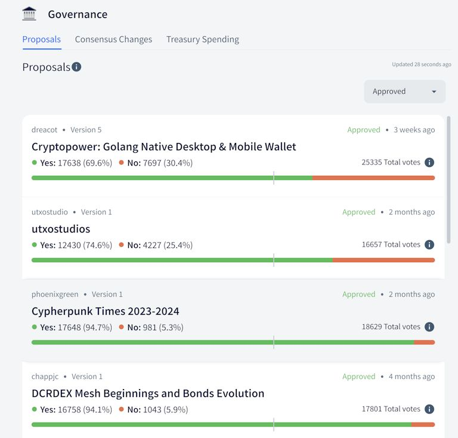
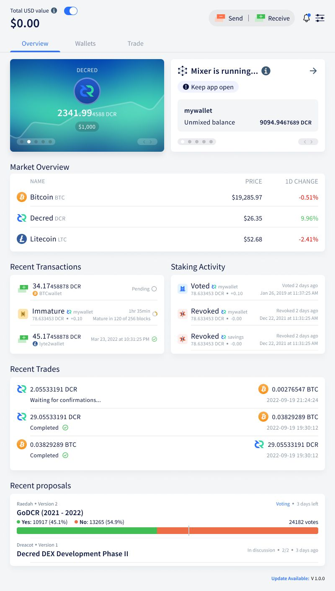
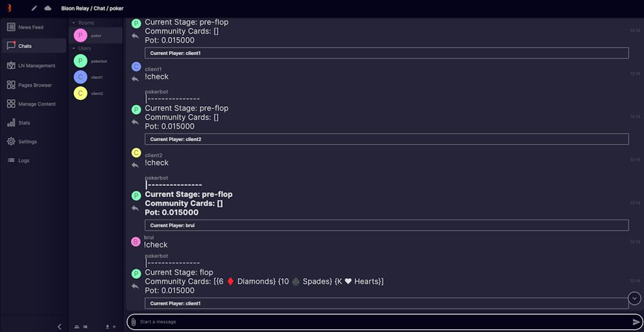
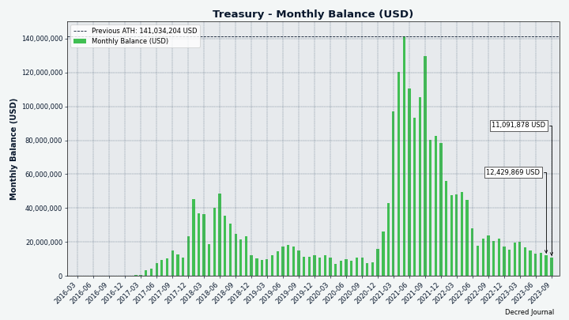
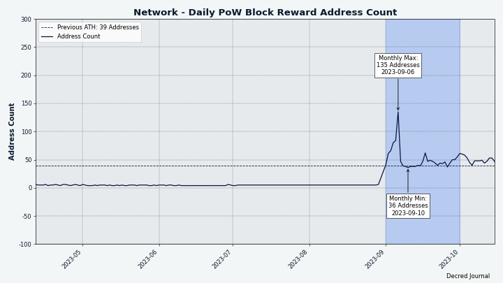
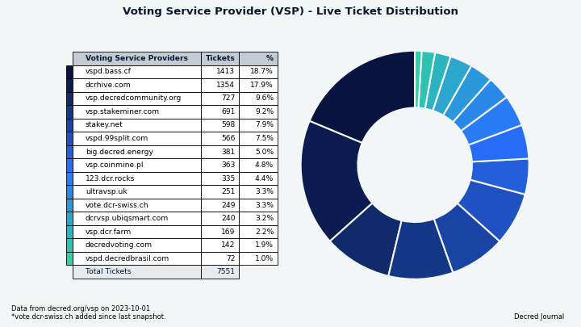
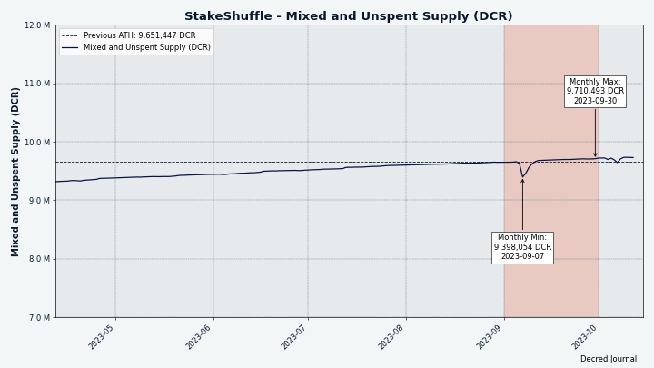
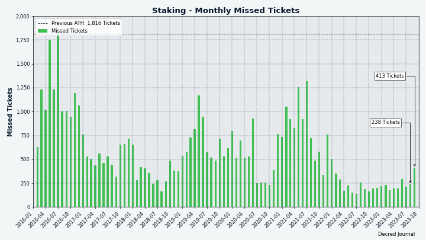
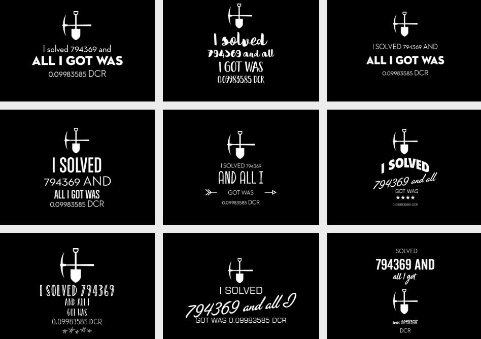

# مجلة ديكريد لشهر سبتمبر 2023

_الصورة: الدارة الالكترونية بواسطة Exitus@_

**أبرز أحداث شهر سبتمبر:**

- قامت شبكة ديكريد بالتحول إلى استخدام BLAKE3 كإثبات للعمل وتحديد مكافأة إثبات الحصة بنسبة 89%، ولكن استغرق الأمر 3 أيام لتعدين كتل جديدة.
- تمت إضافة دعم تعدين ديكريد عبر وحدة معالجة الرسومات GPU إلى كل من gominer وBzMiner، مما أدى إلى انفجار في معدل التجزئة.
- تم إطلاق إصدار النسخة 0.1.9 لمُرحِّل بيسون مع العديد من التصحيحات وتصميم مبدئي للهواتف المحمولة.
- تم إطلاق إصدار النسخة 0.6.3 لمنصة المبادلات اللامركزية لديكريد مع تصحيحات لمحفظة BTC وصيانة التحصيص. يتقدم تطوير إدماج Polygon وبوتات التداول وميزات أخرى بشكل مستمر.

**المحتوى:**

- [ترقية الشبكة وانقطاع الخدمة](#network-upgrade-and-service-outage)
- [برامج تعدين ديكريد بواسطة وحدات المعالجة الرسومية (GPU) ](#decred-gpu-mining-software)
- [إصدار النسخة 0.1.9 لمُرحِّل البيسون](#bison-relay-v019-release)
- [إصدار النسخة 0.6.3 لمنصة المبادلات اللامركزية لديكريد](#dcrdex-v063-release)
- [التطوير](#development)
- [الأشخاص](#people)
- [الإدارة و الحوكمة](#governance)
- [التعدين](#mining)
- [الشبكة](#network)
- [النظام البيئي](#ecosystem)
- [الانتشار](#outreach)
- [الفعاليات](#events)
- [وسائل الإعلام](#media)
- [الأسواق](#markets)
- [الخارجية ذات الصلة](#relevant-external)

<a id="network-upgrade-and-service-outage" />

## ترقية الشبكة وانقطاع الخدمة

في 29 أغسطس، تم تفعيل تغييرات الإجماع [تغيير إثبات العمل إلى BLAKE3 و ASERT](https://github.com/decred/dcps/blob/master/dcp-0011/dcp-0011.mediawiki) و [تغيير تقسيم دعم إثبات العمل/إثبات الحصة إلى 1/89](https://github.com/decred/dcps/blob/master/dcp-0012/dcp-0012.mediawiki) على شبكة ديكريد الرئيسية في الكتلة 794,368. كما تمت إعادة تعيين قيمة الصعوبة الأولية لتستهدف 1.45 تيراهاش/ثانية مع توقع أن يبدأ معدل تجزئة وحدة معالجة الرسومات في التعدين في يوم التفرع. كان لهذا الافتراض أساس في التاريخ، فعند إطلاق ديكريد في فبراير 2016، بدأ التعدين باستخدام بطاقات الجرافيك دون أي إعلان. كما كان المرور المقبل إلى BLAKE3 معروفًا علنيًا لمدة حوالي 5 أشهر منذ [أبريل 2023](https://proposals.decred.org/record/a8501bc). ومع ذلك، لم يبدأ التعدين باستخدام بطاقات الجرافيك كما كان متوقعًا، وتركت الشبكة تواجه صعوبة كبيرة للغاية بالنسبة لوحدات المعالجة المركزية (CPU). ونتيجة لذلك، توقفت السلسلة عن إنتاج الكتل لبضعة أيام.

تم تعليق أي خدمات تعتمد على السلسلة في الحصول على كتل جديدة، على سبيل المثال:

- تم تعطيل عمليات الإيداع والسحب في منصات المبادلات المركزية مؤقتًا.
- تعذر بدء أو إكمال عمليات مقايضات وحدات ديكريد في منصة المبادلات اللامركزية لديكريد.
- تم تعليق خدمات الطابع الزمني.
- لم لم تتمكن بوليتيا  من بدء أو إيقاف التصويت على المقترحات.
- لم يكن برنامج التصويت في بوليتيا يعمل بشكل طبيعي (كانت عمليات التصويت تتطلب استخدام حيل وأساليب خاصة).
- تعذر فتح أو إغلاق قنوات الشبكة البرقية.
- تم تقييد وظيفة مرحل بيسون (لا يمكن إيداع أو سحب من أو إلى المحافظ؛ لا يمكن فتح أو إغلاق قنوات الشبكة البرقية).

بعد 24 ساعة من عدم وجود كتل، واجه المُعدِنون مشكلة حيث كان يرفض برنامج dcrd التعدين فوق الكتل القديمة. كان الحل المؤقت للمشكلة هو تعيين ساعة النظام للخلف وإعادة إنشاء الشهادات إذا كان ذلك ضروريًا.

تم في النهاية تعدين الكتلة [794,369](https://dcrdata.decred.org/block/655d0c998b6f838a63a69991ebfb8dc776ed0234117c7b6cca407fe15c2cb02c) في الأول من سبتمبر وبدأت سلسلة الكتل في الحركة مرة أخرى. اضطرت بعض عقد برنامج dcrd لإعادة التشغيل بسبب وصولها إلى مسار حيث لم تكن تحاول جلب كتل جديدة. بعد حل هذه المشكلة الأخيرة، قام خوارزمية ASERT الجديدة بتعديل صعوبة التعدين واستعادت سرعة إنتاج الكتل العادية في غضون ساعات.

سجل هذا الانقطاع الذي دام 2.9 يومًا رقمًا قياسيًا جديدًا، متجاوزًا [الانقطاع السابق](https://forum.decred.org/threads/04-23-17-pow-mining-outage.5287/) في [أبريل 2017](https://twitter.com/decredproject/status/856193098879299584) عندما استغرق الأمر التعدين 9.6 ساعة لتعدين [الكتلة 127,072](https://dcrdata.decred.org/block/127072).

<a id="decred-gpu-mining-software" />

## برامج تعدين ديكريد بواسطة وحدات المعالجة الرسومية (GPU)

بدأ التعدين باستخدام وحدات المعالجة الرسومية (GPU) بعد أسبوع من التفرع الصلب وسرعان ما استبدل التعدين باستخدام وحدات المعالجة المركزية (CPU). تم إصدار خيارين لبرامج التعدين باستخدام وحدات المعالجة الرسومية لديكريد للجمهور في سبتمبر:

- [gominer](https://github.com/decred/gominer) يدعم تعدين Decred على أجهزة OpenCL و CUDA، بما في ذلك GPUs من AMD و Nvidia. لا تتوفر حالياً البرامج الثابتة، ولكن عملية البناء والإعداد [موثقة بشكل جيد](https://github.com/decred/gominer#readme).
- يدعم [BzMiner](https://www.bzminer.com/) تعدين ديكريد بوحدات المعالجة الرسومية من AMD، و Nvidia و Intel منذ الإصدار 17.0.0. لم يتم نشر كود المصدر ولكن لدى BzMiner قائمة طويلة من [الميزات](https://github.com/bzminer/bzminer) ويمكنه تحقيق معدلات تجزئة أعلى مقارنة بـ gominer. البرامج الثابتة متاحة على [GitHub](https://github.com/bzminer/bzminer/releases) و [bzminer.com](https://www.bzminer.com/).

للحصول على أي مساعدة، انضم إلى الدردشة #pow-mining على Matrix أو Discord.

_الصورة: واجهة المستخدم الرسومية BzMiner تعمل على _HiveOS

<a id="bison-relay-v019-release" />

## إصدار النسخة 0.1.9 لمُرحِّل البيسون

يعمل هذا الإصدار على تحسين تجربة المستخدم للمنشورات وصيانة تبادل المفاتيح وإصلاح الأخطاء التي تم الإبلاغ عنها في الإصدار 0.1.8.

التغييرات الملحوظة في تطبيقات الواجهة الرسومية والنصية:

المصافحة التلقائية مع المستخدمين في وضع الخمول لمدة 21 يومًا لإبقاء جهات الاتصال نشطة

- إلغاء الاشتراك تلقائيًا والطرد من الدردشات الجماعية للمستخدمين الخاملين لمدة 60 يومًا
- قائمة استبعاد لمنع إلغاء الاشتراكات التلقائية لمستخدمين معينين، مثل الروبوتات المعروفة

أبرز مميزات تطبيق واجهة المستخدم الرسومية:

- تحسين قائمة مشاركات المستخدم
- زر لإعادة تعيين جميع عمليات تبادل المفاتيح القديمة
- الجولة الأولى من تنفيذ تصميم واجهة المستخدم للهواتف المحمولة (يمكن اختبارها عن طريق تقليل عرض النافذة إلى أقل من 500 بكسل)
- تم الإصلاح: التعثر في عملية الإعداد، وفتح روابط URL، وظهور غير صحيح لمؤشرات الرسائل غير المقروءة

هنالك [فيديو قصير](https://www.youtube.com/watch?v=Wz0Gn7Kdjeo) يوضح ما الجديد في تطبيق واجهة المستخدم الرسومية.

أهم ميزات التطبيق النصي:

- تم إصلاح العديد من المشكلات المتعلقة بـ Simplestore
- تم إصلاح تصفح الصفحات المحلية
- تم إصلاح أخطاء واجهة المستخدم في الدردشة

يمكن العثور على ملاحظات الإصدار الكاملة والتنزيلات على [صفحة الإصدار](https://github.com/companyzero/bisonrelay/releases/tag/v0.1.9). من الأفضل التحقق من صحة الملفات كما هو موضح في [README](https://github.com/companyzero/bisonrelay/tree/v0.1.9#verifying-binaries).

_ الصورة: إشعارات محسنة في نسخة الإصدار 0.1.9 لمُرحِّل بيسون_

<a id="dcrdex-v063-release" />

## إصدار النسخة 0.6.3 لمنصة المبادلات اللامركزية لديكريد

يحتوي هذا الإصدار على العديد من الإصلاحات والتحسينات الهامة. يُنصح جميع المستخدمين بالتحديث. أبرز مميزات التطبيق المستقل:

- يتناسب مقياس حدود التداول مع مستوى السندات
- تم إصلاح خطأ شائع ظهر عند إعادة فحص محفظة BTC المدمجة
- تم إصلاح السيناريو الذي قد تنتهي فيه صلاحية السندات بالكامل قبل استبدالها

اقرأ ملاحظات الإصدار الكاملة [هنا](https://github.com/decred/dcrdex/releases/tag/v0.6.3).

ملاحظة: في وقت الكتابة، كانت البرامج الثابتة dexc متاحة أيضًا كجزء من [إصدار النسخة 1.8.1 للنواة](https://github.com/decred/decred-binaries/releases/tag/v1.8.1). تقدم هذه البرامج الثابتة العديد من المزايا: أنها موقعة بمفتاح إصدار ديكريد، وتدعم المزيد من أنظمة التشغيل وووحدة المعالجة المركزية، وتم بناؤها باستخدام أدوات Go الجديدة والأكثر تحسينًا.

<a id="development" />

## التطوير

ما لم يُذكر خلاف ذلك، فإن العمل المَذْكُور هنا يشتمل على حالة "الدمج إلى الرئيسي". وهذا يعني أن العمل قد تم استكماله ومراجعته ودمجه في كود المصدر الذي يمكن للمستخدمين المتقدمين [بناءه وتشغيله](https://medium.com/@artikozel/the-decred-node-back-to-the-source-part-one-27d4576e7e1c)، ولكنه ليس متاحًا بعد في ثنائيات الإصدار للمستخدمين العاديين.

### dcrd

_[dcrd](https://github.com/decred/dcrd) هو تطبيق عقدة كامل يعمل على تشغيل شبكة ديكريد من نظير إلى نظير حول العالم._

التغييرات المدخلة على الإصدار 1.8.1:

- تمت إضافة [تجزئة إثبات العمل](https://github.com/decred/dcrd/pull/3192) الجديدة إلى المخرجات المطولة لـ `getblock` و`getblockheader`.
- تم تغيير وظيفة [`getnetworkhashps`](https://github.com/decred/dcrd/pull/3181) لمعالجة القيمة `-1` كقيمة افتراضية (120 كتلة مضت). لم يعد معنى `-1 "عدد الكتل منذ آخر تغيير في الصعوبة" له معنى الآن حيث يتم الآن حساب الصعوبة في كل كتلة بدلاً من كل 144 كتلة بخوارزمية الصعوبة القديمة.

التغييرات المدمجة في الفرع الرئيسي `master` نحو الإصدارات المستقبلية:

- تم تحديث صورة Docker إلى [Go 1.21.1](https://github.com/decred/dcrd/pull/3183).
- تم تحسين [معالجة الأخطاء الداخلية](https://github.com/decred/dcrd/pull/3182) في `rpcserver` لجعل الكود أنظف و أكثر صعوبة في الاستخدام بشكل خاطئ.
- تم تغيير حزمة [`sampleconfig`](https://github.com/decred/dcrd/pull/3185) لاستخدام وظيفة التضمين في Go. يسمح ذلك بوجود ملفات التكوين النموذجية كملفات منفصلة تكون أسهل في العمل معها، مع الحفاظ على الوصول المريح إلى محتوياتها من الكود.
- تمت إضافة وظائف للوصول إلى [قيم R و ](https://github.com/decred/dcrd/pull/3188)S للتواقيع في حزمة `secp256k1/ecdsa`، يمكن أن تكون هذه القيم مفيدة في بعض الحسابات.
- تمت إضافة بعض [الاختبارات](https://github.com/decred/dcrd/pull/3191) [الجديدة](https://github.com/decred/dcrd/pull/3190) لزيادة نسبة التغطية التجريبية إلى 99.6%.

### dcrwallet

_[dcrwallet](https://github.com/decred/dcrwallet) هو خادم محفظة تستخدمه تطبيقات سطر الأوامر والمحفظة الرسومية._

التغييرات المدخلة على الإصدار 1.8.1:

- تم تحديث ردود [`getblock` و `getblockhash`](https://github.com/decred/dcrwallet/pull/2285) المُفصّلة لتتضمن تجزئة الإثبات الجديدة للعمل.

التغييرات المدمجة في الفرع الرئيسي `master` نحو الإصدارات المستقبلية:

- تم تحديث  [`حساب رسوم مزود خدمة التصويت](https://github.com/decred/dcrwallet/pull/2281) لتقسيم مكافأة الكتلة الجديدة في DCP-12 (زيادة مكافأة الإثبات بالحصة من 80% إلى 89%).

### Decrediton

_[Decrediton](https://github.com/decred/decrediton) ديكريديتون هو تطبيق محفظة لسطح المكتب كامل الميزات مع ميزة التصويت مدمجة، وميزة الخلط ب StakeShuffle، والشبكة البرقية، والتداول على منصة المُبادلات اللامركزية DEX للديكريد، والمزيد. يتم تشغيلها مع سلسلة الكتل كاملة أو بدونها (وضع التحقق البسيط من الدفع SPV)._

تم تضمين جميع التغييرات أدناه في الإصدار 1.8.1 (المنشور في أكتوبر).

التقدم المحرز نحو دمج Ledger:

- تمت إضافة [وظائف الخلفية](https://github.com/decred/decrediton/pull/3869) للتفاعل مع Ledger. يتم استخدام واجهة برمجة التطبيقات [WebUSB](https://github.com/electron/electron/pull/36289)، والتي تسمح لتطبيقات Electron بالوصول إلى أجهزة USB.
- تمت إضافة [واجهة المستخدم لـ Ledger](https://github.com/decred/decrediton/pull/3874) لشبكة الاختبار.
- تم تفعيل Ledger على [الشبكة الرئيسية](https://github.com/decred/decrediton/pull/3906). تم اختبار هذا على نظم التشغيل Linux وWindows وmacOS على أجهزة Nano X وNano S Plus.
- تم التراجع عن تحديث [Electron](https://github.com/decred/decrediton/pull/3912) إلى الإصدار 21.2.3 لأن الإصدار الأحدث تسبب في مشكلات مع نافذة منصة المبادلات اللامركزية. سيحتاج هذا إلى [التحقيق وإصلاحه](https://github.com/decred/decrediton/issues/3921) في إصدار مستقبلي لأنه من الضروري الحصول على الإصدار 23 من [Electron v23](https://releases.electronjs.org/release/v23.0.0) لدعم WebUSB، والذي يدعم إدماج Ledger في Decrediton.

مسائل أخرى:

- تم تحديث [وحدة DCRDEX](https://github.com/decred/decrediton/pull/3905) إلى الإصدار v0.6.3 و تفعيل وضع "extension mode" الجديد لحماية محفظة Decrediton من التكوين الخاطئ في نافذة DEX.
- تم تحديث [الترجمة الصينية](https://github.com/decred/decrediton/pull/3893).
- ~8 تغييرات لتحديث تبعيات الويب وإصلاح الأخطاء الصغيرة.

### vspd

_[vspd](https://github.com/decred/vspd) هو برنامج خادم لتشغيل موفر خدمة التصويت. يصوت موفر خدمة التصويت نيابة عن مستخدميه على مدار الساعة طوال أيام الأسبوع ولا يمكنه سرقة الأموال._

أسفرت أعمال vspd في سبتمبر عن تحسينات تدريجية في جودة الحياة للمستخدمين والمشرفين والمطورين.

تم تضمين جميع التغييرات المدرجة أدناه في إصدارين [v1.3.0](https://github.com/decred/vspd/releases/tag/release-v1.3.0) و[v1.3.1](https://github.com/decred/vspd/releases/tag/release-v1.3.1)، اللذين تم إصدارهما في سبتمبر.

التغييرات الموجهة للمستخدم:

- تمت إضافة عدادات منفصلة للتذاكر المنتهية والمفقودة على [الصفحة الرئيسية](https://github.com/decred/vspd/pull/417) لمزود خدمة التصويت وفي [استجابة `/vspinfo`](https://github.com/decred/vspd/pull/421). "التذاكر المسترجعة" المبلغ عنها سابقًا هي مجموع التذاكر المنتهية والمفقودة، وتعتبر قائمة التذاكر المفقودة بشكل منفصل مقياسًا أفضل لتقييم موثوقية مزود خدمة التصويت لأن التذاكر المنتهية ليست خطأ مزود خدمة التصويت.
- تم تحديث [حسابات رسوم مزود خدمة التصويت](https://github.com/decred/vspd/pull/435) للأخذ في الاعتبار تقسيم مكافأة الكتلة الجديدة في DCP-12.
سيظهر شريط علوي أصفر جديد إذا كان مزود خدمة التصويت يعمل على [شبكة الإختبار أو شبكة المحاكاة](https://github.com/decred/vspd/pull/417). تم تغيير [شريط التصحيح](https://github.com/decred/vspd/pull/443) إلى اللون الأحمر لأن وضع التصحيح لا يجب استخدامه في الإنتاج.

التغييرات الموجهة لمشرفي مزود خدمة التصويت:

- تمت إضافة صفحة إدارية جديدة تُظهر جميع التذاكر التي تم تسجيلها مع مزود خدمة التصويت ولكن [فوتت التصويت](https://github.com/decred/vspd/pull/451).
- تم تحسين [اكتشاف التذاكر المصوتة و المسترجعة](https://github.com/decred/vspd/pull/416) لتعمل بسرعة مضاعفة. تم تحقيق ذلك باستخدام [وظيفة مطابقة](https://github.com/decred/dcrd/blob/dc41075594cfdef63e8a64340b4fc5651a56a604/gcs/gcs.go#L304) مختلفة من حزمة `gcs` في dcrd التي تم [تحسينها بشكل أفضل](https://github.com/decred/vspd/pull/413#issuecomment-1694228745) لهذه المهمة.
- تحسين استجابة التعامل مع [طلبات الإغلاق](https://github.com/decred/vspd/pull/426) من خلال إضافة الإلغاء إلى عمليات البدء والمهام الخلفية طويلة الأمد. كما تمت إزالة بعض الأكواد المكررة.
- ضمان أن [رسائل بدء/إغلاق التشغيل](https://github.com/decred/vspd/pull/427) هي دائمًا أول/آخر شيء يتم تسجيله.
- تحسين التوافق في التعامل مع [إشارات الإغلاق](https://github.com/decred/vspd/pull/438) على مختلف أنظمة التشغيل.
- تم تغيير واجهة برمجة التطبيقات على الويب لإرجاع [أخطاء صريحة](https://github.com/decred/vspd/pull/440) إذا لم تكن ذاكرة التخزين المؤقتة لواجهة برمجة التطبيقات على الويب جاهزة. سيجعل هذا المسؤول على علم فوري بالمشكلات المحتملة. في السابق، إذا لم تكن الذاكرة المؤقتة جاهزة، تم عرض صفحات الويب بدون بيانات وبدون أي إشارة على وجود أي شيء خاطئ.
- تم تعديل [التسجيل](https://github.com/decred/vspd/pull/445) للحد من الرسائل غير الضرورية.
- تمت إضافة ملاحظات الإصدار لـ [v1.3.0](https://github.com/decred/vspd/pull/447) و [v1.3.1](https://github.com/decred/vspd/pull/452).

التغييرات الداخلية والتغييرات الموجهة للمطورين:

- استعادة القدرة على تشغيل [vspd على شبكة المحاكاة](https://github.com/decred/vspd/pull/419)، وهذا مطلوب من قبل منصة المبادلات اللامركزية لديكريد لاختبار ميزات التحصيص الجديدة.
- تحسينات صغيرة في الأداء من خلال الاستفادة الأفضل من [dcrd](https://github.com/decred/vspd/pull/422).
- تم إلغاء تصدير بعض الأكواد و[نقلها](https://github.com/decred/vspd/pull/428) إلى [حزم](https://github.com/decred/vspd/pull/436) [داخلية](https://github.com/decred/vspd/pull/430) حيث أنها غير مناسبة للاستهلاك من قبل الأطراف الثالثة. تجعل واجهة برمجة التطبيقات العامة الأصغر التطوير والصيانة أسهل.
- أعيد النظر في كيفية [إنشاء وبدء](https://github.com/decred/vspd/pull/434) المكونات و[إيقافها](https://github.com/decred/vspd/pull/436) لفصل وتبسيط الكود.
- تم إصلاح [نسخ قاعدة البيانات الاحتياطي](https://github.com/decred/vspd/pull/439) حيث كان يعمل مرة واحدة فقط بدلاً من العمل بشكل دوري (خطأ غير مُصدر).
- حوالي 20 ايداعاً بتحسينات أصغر وتنظيف الكود.

_الصورة: التذاكر المفقودة في لوحة إدارة vspd_

### gominer

_[gominer](https://github.com/decred/gominer) هو هو أداة تعدين عن ديكريد يستخدم خوارزمية الإثبات بالعمل للتعدين الفردي والتعدين الجماعي مع أجهزة OpenCL و CUDA._

الهدف الرئيسي لتطوير gominer في سبتمبر كان الرد السريع على أول المُعدنين الذين يستخدمون بطاقات الرسوميات (GPU) والذين لم يشاركوا كودهم المصدري بشكل علني، وبالتالي بدأوا في السيطرة على معدل القوة الحاسوبية. تتيح التحديثات لـ gominer لأي شخص القدرة على التعدين باستخدام بطاقات الرسوميات الخاصة بهم. بالإضافة إلى إضافة دعم التعدين باستخدام BLAKE3 على بطاقات الرسوميات، تم بذل جهد لأتمتة أو توثيق عملية الإعداد للتعامل مع عدة نقاط صعبة تم الإبلاغ عنها من قبل المُعدنين.

التعدين باستخدام معالج الرسوميات BLAKE3:

- أُضيف الدعم [للتعدين باستخدام BLAKE3 عبر وحدة معالجة الرسومات GPU باستخدام OpenCL](https://github.com/decred/gominer/pull/194). يتضمن ذلك نواة OpenCL مُحسّنة مُخصصة لـ BLAKE3 استنادًا إلى midstates لدعم الوحدات الرسومية (GPUs) التي تعمل مع OpenCL وOpenCL مع ADL. "النواة" هي برنامج مكتوب بلغة [نواة OpenCL](https://en.wikipedia.org/wiki/OpenCL#OpenCL_kernel_language) المتخصصة والتي تعمل على الوحدة الرسومية. كما يُحسّن هذا التغيير اكتشاف أجهزة CL، وترتيب الأرقام العشوائية بطريقة عشوائية للتأكد من أن كل جهاز يقوم بعمل مختلف، وتحسين عرض قيم معدل التجزئة.
- أُضيف الدعم [للتعدين باستخدام BLAKE3 عبر وحدة معالجة الرسومات GPU باستخدام CUDA](https://github.com/decred/gominer/pull/195) على نظام التشغيل Linux. CUDA هو منصة للحوسبة عالية الأداء على الوحدات الرسومية. تم تعديل نواة OpenCL لتتوافق مع أدوات تطوير البرمجيات CUDA. على عكس OpenCL، [CUDA](https://en.wikipedia.org/wiki/CUDA) هو نظام مغلق المصدر وحصري، ويعمل فقط على بطاقات Nvidia. ولكن، يتيح CUDA التحكم في تسارع الساعة وسرعات المروحة لزيادة الكفاءة بشكل كبير (جيجاهاش لكل وات). بما أن تكلفة الكهرباء هي عامل هام في الربحية، فإن هذه التجارب غالبًا ما تكون مفيدة.
- أُضيف نص برمجي وتعليمات لبناء نسخة gominer المُمكّنة لـ CUDA على [Windows](https://github.com/decred/gominer/pull/206). بناء برنامج Go مع دعم CUDA هو [أكثر تعقيدًا](https://github.com/decred/gominer/blob/7e2fb9e40e5568d4c85636c7c7ef1474eb44cf6c/cuda_builder.go#L5) على Windows مقارنةً بـ Linux، ولكن المنشئ الجديد يبذل جهدًا كبيرًا لأتمتة العملية قدر الإمكان. إذا تم اكتشاف اعتماد ناقص أو تكوين بيئة غير متوفر، سيطبع المنشئ توجيهات يمكن للإنسان قراءتها عن كيفية حل المشكلة. تمت إضافة [تعليمات يدوية](https://github.com/decred/gominer/blob/7e2fb9e40e5568d4c85636c7c7ef1474eb44cf6c/docs/cuda-manual-windows-build.md) كخيار بديل في حالة عدم عمل المنشئ التلقائي. كما تم بموجب هذا التغيير إزالة الاعتماد على GNU Make.
- أُضيف الدعم [لإصدارات CUDA الأقدم من من 10](https://github.com/decred/gominer/pull/216). يتيح ذلك بناء gominer على المزيد من التكوينات، على الرغم من أن الأداء سيكون منخفضًا بشكل كبير مع إصدارات CUDA الأقدم. سيتم [اكتشاف إصدار مجموعة أدوات CUDA المثبتة وبنية GPU تلقائيًا](https://github.com/decred/gominer/pull/n/commits/a7076d78a46f9b9d9277fb3f92620ed130d5e7e9) أثناء الإنشاء لاستخدام أفضل ميزات GPU الممكنة، وتحديدًا [تحويل مسار التحويل السريع](https://stackoverflow.com/questions/12767113/funnel-shift-what-is-it).
- تم إصلاح مشكلة عدم تمكن [المعايرة التلقائية](https://github.com/decred/gominer/pull/218/commits/d3e68cf1e370e94eb50b1e74d5b2446b8e24c4ad) من إطلاق الجهاز جعل حلقة التعدين الفعلية تفشل.

برمجة وحدة معالجة الرسومات (GPU) ليست شيئًا يقوم به مطورو ديكريد يوميًا، ولكن أظهرت نواة OpenCL هذه أنها سريعة جدًا. على سبيل المثال، يحقق 10-12 غيغاهاش/ثانية على RTX 3070، وهو ما يقترب من 12 غيغاهاش/ثانية التي أُبلغ عنها بواسطة [WhatToMine](https://whattomine.com/gpus/48-nvidia-geforce-rtx-3070) لـ IronFish، وهي خوارزمية تعدين أخرى تعتمد على BLAKE3. ستحتاج مقارنة أفضل إلى النظر في التفاصيل (حجم البيانات المُعدة للتجزئة، عدد جولات التجزئة، إلخ)، ولكن السرعات التي تم الإبلاغ عنها حتى الآن تشير إلى أن gominer جيد بما فيه الكفاية لجعل تعدين GPU أكثر عدالة ومتاحًا لعدد أكبر من الأشخاص.

تحديثات الملف التمهيدي:

- تم تبديل إلى تعليمات بناء OpenCL على Windows إلى [MSYS2](https://github.com/decred/gominer/pull/196).
- تمت إضافة تعليمات بناء OpenCL AMD/Nvidia [لنظام التشغيل Linux](https://github.com/decred/gominer/pull/198).
- تمت إضافة [تعليمات التكوين](https://github.com/decred/gominer/pull/199).
- تمت إضافة [علامات التجزئة المُبلغ عنها من قبل المستخدمين](https://github.com/decred/gominer/pull/201).

تغييرات أخرى:

- تحسين [معالجة  إيقاف التشغيل](https://github.com/decred/gominer/pull/207).
- 14 [تدبيرا إداريا](https://github.com/decred/gominer/pull/210) عمليات التنظيف بما في ذلك إضافة المزيد من الفلاتر لمنع دخول الأكواد السيئة.
- تم إصلاح [عدد](https://github.com/decred/gominer/pull/204) من [المشكلات](https://github.com/decred/gominer/pull/205) مع بروتوكول [Stratum](https://braiins.com/stratum-v1).

### dcrpool

_[dcrpool](https://github.com/decred/dcrpool) هو برنامج خادم لتشغيل تجمع التعدين._

على غرار gominer، تمت إعادة تفعيل تطوير dcrpool بعد فترة من النشاط المنخفض منذ صيف 2021 عندما صدر الإصدار v1.2.0. قام المطورون بتحديث قاعدة الكود إلى أحدث ميزات Go، وإصلاح التزامن المتعدد وحالات إيقاف التشغيل، ودفع بعض الديون التقنية، كل ذلك استعدادًا لإضافة دعم  مجمع التعدين بوحدة معالجة الرسومات.

التحديثات والتغييرات:

- تمت إضافة [دعم BLAKE3](https://github.com/decred/dcrpool/pull/341) إلى معدن وحدة المعالجة المركزية الداخلي الذي يُستخدم للاختبار.
- تحسين الدقة عند حساب عدد [التكرارات المحتملة](https://github.com/decred/dcrpool/pull/360).
- تحسين رسائل السجل لتتبع [العملاء الذين انتهت مهلتهم](https://github.com/decred/dcrpool/pull/376).
- تحسين [معالجة الإشارات](https://github.com/decred/dcrpool/pull/381) لإيقاف التشغيل بشكل أكثر نظافة على المزيد من إصدارات Unix وكذلك على Windows استجابة لأشياء مثل تسجيل خروج المستخدم،  أو إغلاق المحطة، أو إغلاق النظام.
- تم تحديث [كود البناء](https://github.com/decred/dcrpool/pull/386) لاستخدام Go 1.21 وPostgreSQL 16.0.
- إزالة كافة تحديثات قاعدة البيانات [bbolt](https://github.com/decred/dcrpool/pull/391) وإعادة تعيين نسخة قاعدة البيانات إلى 1. و يسمح هذا بإزالة قدر كبير من الكود لذي لم يعد بحاجة إلى الصيانة، ويمنح المطورين المرونة اللازمة لتغيير تنسيق قاعدة البيانات قبل الإصدار التالي، وقد يتجنب الأخطاء المحتملة ومشكلات الدعم الناجمة عن البيانات غير المتناسقة. يفترض هذا التغيير عدم وجود عمليات نشر عامة معروفة لـ dcrpool ويقترح تسمية الإصدار التالي v2.0.0 ليعكس أن تنسيق قاعدة البيانات غير متوافق مع الإصدار الرئيسي الأخير v1.2.0.

التصحيحات:

- تم تصحيح [منطق إيقاف التشغيل](https://github.com/decred/dcrpool/pull/351) للتأكد من إغلاق ملفات السجل بشكل صحيح في حالة توقف الإجراء بسبب خطأ.
- تم إصلاح بعض الحالات التي لم يتم فيها تسجيل [الأخطاء في التكوين](https://github.com/decred/dcrpool/pull/352) كما هو متوقع، وتمت إزالة تكرار الكود.
- التأكد من [إغلاق قاعدة البيانات](https://github.com/decred/dcrpool/pull/353) في جميع مسارات الخطأ.
- [فشل سريع](https://github.com/decred/dcrpool/pull/377) إذا كان منفذ الاستماع لخادم الويب الخاص بواجهة المستخدم الرسومية قيد الاستخدام بالفعل. قبل هذا التغيير، إذا لم تتمكن واجهة المستخدم الرسومية من بدء التشغيل بشكل طبيعي، فستستمر عملية dcrpool في التشغيل، وهذا ليس سلوكًا متوقعًا. الآن ستنتهي العملية بسرعة وستسمح للمسؤول بحل أي مشكلات على الفور.
- تم إصلاح الحالات الحافية حيث يمكن توليد [معرفات حصة العمل](https://github.com/decred/dcrpool/pull/390) و[معرفات الدفع](https://github.com/decred/dcrpool/pull/392) المكررة. تمت إضافة أرقام عشوائية إلى هذه المعرفات لضمان أنها فريدة من نوعها. يؤدي هذا إلى إصلاح أخطاء الاختبار على الأجهزة السريعة.
- إصلاحات متنوعة في التزامن والإلغاء ومنطق إيقاف التشغيل ومعالجة الأخطاء.

إعادة بناء الكود:

- تمت إزالة الكود غير المستخدم لتشغيل dcrpool [كخدمة](https://github.com/decred/dcrpool/pull/349) [Windows](https://github.com/decred/dcrpool/pull/342).
- إجراء عمليات تنظيف مختلفة للأكواد وتمكين مراجعات جديدة.
-  تم إعادة العمل على كيفية التعامل مع  [أرقام إصدار التطبيق](https://github.com/decred/dcrpool/pull/355) لاستخدام نهج أكثر قوة من dcrd و dcrwallet.
- تم إعادة هيكلة دورات حياة العديد من النظم الفرعية لجعل بدء تشغيلها وإغلاقها أكثر موثوقية، وأسهل للفهم، ومحمية من التغييرات المستقبلية غير المقصودة. النظم الفرعية هي: [مركز التجمع](https://github.com/decred/dcrpool/pull/356)، [واجهة المستخدم الرسومية](https://github.com/decred/dcrpool/pull/370) [خادم الويب](https://github.com/decred/dcrpool/pull/371)، [نقطة نهاية التجمع والعميل](https://github.com/decred/dcrpool/pull/373)، و [حالة السلسلة](https://github.com/decred/dcrpool/pull/378). تمت معالجة قطع اتصال [مجمع العملاء](https://github.com/decred/dcrpool/pull/380) بطريقة مبسطة.
- تم إنشاء حزمة `gui` [داخلية](https://github.com/decred/dcrpool/pull/357) لأنها غير مخصصة للمستهلكين الخارجيين.
- حوالي 9 إيداعات تشمل تحسينات صغيرة في إدارة الذاكرة والتوازن.

المستندات:

- تمت إضافة أحدث الإصدارات [المختبرة](https://github.com/decred/dcrpool/pull/384) لـ PostgreSQL وتحديث أفضل الممارسات لإنشاء قاعدة البيانات.
- تم تحديث وتبسيط [تعليمات البناء والإعداد](https://github.com/decred/dcrpool/pull/385).

كود الاختبار:

- القراءة من أرشيف بيانات الاختبار المضغوطة [بكتل](https://github.com/decred/dcrpool/pull/348) - ممارسة جيدة لتجنب التخصيصات غير المنظمة.
- تسهيل تشغيل أداة الاختبار على [Windows](https://github.com/decred/dcrpool/pull/368).
- جعل [اختبارات نقطة النهاي](https://github.com/decred/dcrpool/pull/387) أكثر قوة.
- السماح [بالاحتفاظ بقاعدة بيانات الاختبار](https://github.com/decred/dcrpool/pull/389) للفحص بعد فشل الاختبار.
- تمت إزالة جميع الأكواد المتعلقة بوحدات ASIC التي لم تعد قادرة على تعدين ديكريد والتي لم تعد مدعومة من قبل dcrpool.

### الشبكة البرقية

_[dcrlnd](https://github.com/decred/dcrlnd) هو برنامج عقدة الشبكة البرقية لديكريد. تتيح الشبكة البرقية إجراء معاملات فورية ومنخفضة التكلفة._

- تمت إزالة التكوين المخصص لاستهداف [100 اتصال نظير](https://github.com/decred/dcrlnd/pull/190) (تم [وراثته](https://github.com/lightningnetwork/lnd/blob/d233f61383f2f950aa06f5b09da5b0e78e784fae/server.go#L1413) من lnd).
- تم إصلاح [فشل  بدء التشغيل](https://github.com/decred/dcrlnd/pull/191) إذا لم يتم تعيين خيارات `--routing`.
- البناء والاختبار مقابل [Go 1.21](https://github.com/decred/dcrlnd/pull/192).
- تم وضع علامة [إصدار v0.4.0](https://github.com/decred/dcrlnd/releases/tag/v0.4.0) لتمييز المراجعة المدرجة في إصدار البرنامج الأساسي v1.8.0.

### DCRDEX

_[DCRDEX](https://github.com/decred/dcrdex) هي منصة مبادلات غير احتجازية للمُبادلات غير الموثوقة، مدعومة بالمقايضات الذرية._

تغييرات شهر سبتمبر المضمنة في [الإصدار v0.6.3](https://github.com/decred/dcrdex/releases/tag/v0.6.3):

- تمت إضافة [وضع الامتداد](https://github.com/decred/dcrdex/pull/2486)، وهو وضع مقيد حيث لن تسمح منصة المبادلات اللامركزية لديكريد بتغيير الإعدادات مثل نوع المحفظة، كلمة مرور المحفظة، أو حسابات المحفظة. سيحمي هذا المحفظة من سوء التكوين عند تشغيل منصة المبادلات اللامركزية كجزء من Decrediton.
- تمت إزالة ["المستويات الإضافية"](https://github.com/decred/dcrdex/pull/2502)، التي كانت بمثابة "فضول محاسبي" على الخادم ولم تفعل شيئًا للعميل ولكنها تسببت في حدوث خطأ حيث تنتهي صلاحية سندات العميل بالكامل قبل استبدالها.

تم دمج الأعمال أدناه في الفرع "الرئيسي  `master` نحو الإصدارات المستقبلية.

ديكريد

- تمت إضافة واجهة مستخدم رسومية بسيطة [للتحصيص عن طريق مزود خدمة التصويت](https://github.com/decred/dcrdex/pull/2482) مع الميزات التالية: تحديد مزود خدمة التصويت، عرض سعر التذكرة الحالي ومكافآت التصويت، شراء التذاكر، عرض إحصائيات المشاركة لجميع الأوقات، عرض قائمة بالتذاكر المملوكة، عرض وتعيين تفضيلات التصويت (أجندات الإجماع، نفقات الخزينة، ومفاتيح الخزينة).
- السماح بتحديد [مزود خدمة تصويت مخصص](https://github.com/decred/dcrdex/pull/2529) غير مدرج في [واجهة برمجة تطبيقات مزود خدمة التصويت](https://github.com/decred/dcrwebapi/blob/master/docs/api.md).

Firo

- تم تنفيذ [تحليل الكتل](https://github.com/decred/dcrdex/pull/2488) للفيرو لتمكين تقدير الرسوم على الشبكة التجريبية.

 الايثيريوم:

- تم تنفيذ [اشتراكات WebSocket](https://github.com/decred/dcrdex/pull/2490) حتى يتمكن خادم منصة المبادلات اللامركزية من الحصول على رؤوس الكتل الجديدة من موفر بيانات السلسلة بكفاءة أكبر من الاستقصاء عنها. عند  استمرار استخدام استقصاء HTTP، سيتم زيادة الفاصل الزمني للاستقصاء تلقائيًا للمصادر غير المحلية. تغيير هذا الفاصل الزمني مطلوب لإعادة بناء الخادم مسبقًا.
- تم تنفيذ عقد ذكي [للحصول على أرصدة](https://github.com/decred/dcrdex/pull/2520)  ETH وأي عدد من التوكنات للحد بشكل كبير من معدل الطلب إلى مقدمي الخدمات. تمت أيضًا إضافة ذاكرة تخزين مؤقتة للاستجابات للحد بشكل أكبر من الطلبات إلى مقدمي الخدمات بين الكتل.

Polygon (MATIC)

- تم إجراء تغييرات شاملة لإكمال الدعم الأولي لـ [Polygon](https://github.com/decred/dcrdex/pull/2431): تم تعميم محفظة الإثيريوم وخلفية الخادم لإعادة استخدام الكود المشترك، وتمت إضافة الاختبارات التوافقية لـ RPC، وتمت إضافة دعم كود Polygon إلى أداة الاختبار وتقدير الغاز، وتم نشر عقد تبديل USDC على شبكة Polygon الرئيسية، وتم تحديث كود واجهة المستخدم المتعلق باللكود. من أجل راحة المستخدم، ستستخدم محافظ Polygon و الإثيريوم نفس البذور وستستمد المفاتيح الخاصة والعناوين نفسها كما [تمت مناقشته هنا](https://github.com/decred/dcrdex/pull/2431#issuecomment-1650510000).
- تمت إضافة دعم للتوكنات الملفوفة [WBTC و WETH](https://github.com/decred/dcrdex/pull/2522) وتم تعديل معدلات الغاز استنادًا إلى نتائج الاختبار.

واجهة المستخدم الرسومية للعميل:

- تحسين واجهة المستخدم [للطلبات النشطة](https://github.com/decred/dcrdex/pull/2171): عرض الطلبات الحية والطلبات الحديثة في جدول واحد، وعرض الأزرار عند تمرير الفأرة فوق الطلب حتى يتمكن المستخدم من تنفيذ الإجراءات دون الحاجة لتوسيع الصفوف.
- عرض [معدل التداول المتوسط](https://github.com/decred/dcrdex/pull/2463) في عدة أماكن.
- تجاوز خطوة إدخال كلمة المرور [المتكررة](https://github.com/decred/dcrdex/pull/2542) عند إنشاء حساب على خادم منصة المبادلات اللامركزية إذا تم تخزين كلمة المرور مؤقتًا.

خلفية العميل:

- تم تنفيذ [الإشعارات غير المتزامنة](https://github.com/decred/dcrdex/pull/2492) التي يمكن للمحافظ إرسالها إلى واجهة المستخدم الرسومية. سيتيح ذلك حل بعض المشكلات والحفاظ على تحديث واجهة المستخدم الرسومية في المزيد من الحالات.
- السماح للعميل بالاتصال بخوادم منصة المبادلات اللامركزية باستخدام الشهادات المقدمة من [سلطات الشهادة](https://github.com/decred/dcrdex/pull/2513) الموثوقة. في السابق، كان يجب تكوين شهادة الخادم يدويًا.
- تم تحسين منطق [جلب أسعار الصرف](https://github.com/decred/dcrdex/pull/2512) وأوقات الانتظار.
- تم إصلاح إمكانية انتهاء صلاحية السند [بشكل غير متوقع](https://github.com/decred/dcrdex/pull/2460) وإلغاء جميع الطلبات. يستخدم العميل معلومات الحساب من الخادم لاتخاذ قرار حول عدد السندات التي يجب وضعها في قائمة الانتظار. إذا كان العميل يستهدف الطبقة 1 وليس لديه سلوك جيد مسجل من قبل الخادم، فسيقوم بإنشاءسند جديد قبل انتهاء السند الأخير للبقاء مضمونًا. ومع ذلك، إذا أخبر الخادم العميل بأنهم في الطبقة 2 بسبب السلوك الجيد، فسيفترض العميل أنه لا يحتاج إلى إنشاء سند جديد عندما يكون السند الأخير على وشك الانتهاء، وعندما يحدث ذلك، ستنخفض الطبقة فجأة إلى 0، مما يلغي جميع الطلبات.

العميل، بوتات التداول:

- تم تنفيذ [بوت المراجحة](https://github.com/decred/dcrdex/pull/2480) مع استراتيجية بسيطة تضع الطلبات فقط عندما تكون هناك فرصة للمراجحة بين منصة المبادلات اللامركزية  ومنصة المبادلات المركزية (تدعم Binance في البداية).
- تم تحديث [واجهة صناعة السوق](https://github.com/decred/dcrdex/pull/2491)، والآن تتضمن صفحة نظرة عامة على جميع الصانعين الموجودين في السوق وصفحات الإعدادات لكل منهم. يتم تخزين التكوين في ملف JSON. تم تحديث صفحة الأسواق أيضًا لعدم السماح للمستخدمين بوضع الطلبات يدويًا أثناء تشغيل صنع السوق.
- تم إصلاح بوت صانع السوق لإعادة الرصيد](https://github.com/decred/dcrdex/pull/2517) قليلاً في وقت لاحق، عندما تكون البيانات اللازمة للمطابقات متاحة.

الوثائق:

- تم تحديث [دليل استعادة المحفظة وإعادة المسح](https://github.com/decred/dcrdex/pull/2473) لمحفظة BTC الأصلية المدمجة.
- تمت إضافة [ملاحظات الإصدار](https://github.com/decred/dcrdex/pull/2536) للنسخة v0.6.3.

الخادم:

- السماح [بـتعطيل سوق](https://github.com/decred/dcrdex/pull/2487) في ملف التكوين.
- السماح للخادم بالتشغيل [بدون تشفير TLS](https://github.com/decred/dcrdex/pull/2515)، على سبيل المثال للتكوينات التي يتم فيها التعامل مع التشفير بواسطة nginx.
- تمت إضافة [نفق عكسي](https://github.com/decred/dcrdex/pull/2493) للحصول على خدمات بيانات السلسلة. بدلاً من اتصال خادم منصة المبادلات اللامركزية بموفري البيانات، يمكن أن يبدأوا بإنشاء الاتصالات مع خادم منصة المبادلات اللامركزية العام وتقديم خدمات RPC. يتيح ذلك الحصول على بيانات السلسلة من العقد الخاصة التي لا يمكنها قبول الاتصالات. يوفر النفق العكسي المدمج بعض المزايا عن التوجيه عبر SSH المستخدمة سابقًا لتحقيق نفس الهدف، مثل التكوين البسيط. يمكن لخادم منصة المبادلات اللامركزية الاستهلاك من عقد مصدر متعددة للتكرار.

مسائل أخرى:

- زيادة [الحد الأدنى لنسخة Go](https://github.com/decred/dcrdex/pull/2521) إلى 1.19.
- إصلاح البنية على سطح المكتب في [Debian](https://github.com/decred/dcrdex/pull/2525).
- تمت إضافة سكربت لإعداد [محفظتين](https://github.com/decred/dcrdex/pull/2535) للاختبار اليدوي على الشبكة الرئيسية وشبكة الاختبار. يسمح بذلك اختبار المزيد من السيناريوهات.

_الصورة: واجهة مستخدم تحصيص ديكريد في منصة المبادلات اللامركزية لديكريد_

_الصورة:إدماج Polygon في منصة المبادلات اللامركزية لديكريد_

### Cryptopower

_[Cryptopower](https://github.com/crypto-power/cryptopower) هي محفظة ذات واجهة مستخدم رسومية لسطح المكتب متعددة العملات لـ DCR وBTC وLTC. يتم تشغيلها في وضع التحقق البسيط من الدفع والخفيف الذي يحافظ على الخصوصية دون الحاجة إلى سلاسل كتل كاملة، ويدعم تحصيص ديكريد، والخلط، والتصويت، وغيرها من الميزات الفريدة._

تم دمج جميع التغييرات أدناه في الفرع الرئيسي `master` في الإصدارات المستقبلية.

صفحة نظرة عامة جديدة:

- تم تنفيذ تصميم [الصفحة الرئيسية](https://github.com/crypto-power/cryptopower/pull/65) الجديدة باستخدام بيانات وهمية وإعادة تنظيم الميزات إلى 3 علامات تبويب رئيسية: نظرة عامة، المحافظ، والتداول.
- استخدام بيانات حقيقية في بطاقات [التداولات الأخيرة](https://github.com/crypto-power/cryptopower/pull/104).
- استخدام بيانات المحفظة الحقيقية في [بطاقات الرصيد](https://github.com/crypto-power/cryptopower/pull/115).
- تمت إضافة نافذة منبثقة تظهر [إجمالي قيمة الأصول](https://github.com/crypto-power/cryptopower/pull/68/commits/f393b5304359f16df92d385e7f93fcc24567692d) بالدولار الأمريكي.

إدماج منصة المبادلات اللامركزية

- تمت إضافة الخطوة الأولى لـ [إدماج منصة المبادلات اللامركزية ](https://github.com/crypto-power/cryptopower/pull/119).

التغييرات التي يمكن للمستخدم ملاحظتها:

- عرض [مؤشر التحميل](https://github.com/crypto-power/cryptopower/pull/73) أثناء تحميل قائمة موفري خدمة التصويت.
- إخفاء [شريط تقدم الخلط](https://github.com/crypto-power/cryptopower/pull/70) عندما لا يكون الخلاط قيد التشغيل.
- الاحتفاظ بإعدادات [إخفاء الرصيد](https://github.com/crypto-power/cryptopower/pull/81) عبر إعادة تشغيل التطبيق.
- تمت إضافة نافذة منبثقة لـ [استقبال الأموال](https://github.com/crypto-power/cryptopower/pull/108) والتي يمكن الوصول إليها من أي مكان عن طريق النقر على زر الاستقبال.

الإصلاحات الموجهة للمستخدم:

- تم إصلاح [الأيقونات المفقودة](https://github.com/crypto-power/cryptopower/pull/64) في قائمة الطلبات الأخيرة لميزة التبادل الفوري.
- تم إصلاح [معاملات التحصيص](https://github.com/crypto-power/cryptopower/pull/92) حيث كانت تظهر في نظرة عامة على المعاملات بدلاً من أنشطة التحصيص.
- تم إصلاح عرض [بطاقة رصيد الأصول](https://github.com/crypto-power/cryptopower/pull/95) في صفحة النظرة العامة.
- تم إصلاح [الصفحة الرئيسية](https://github.com/crypto-power/cryptopower/pull/105) التي لا تظهر بعد إنشاء أو استعادة المحفظة بنجاح.
- تم إصلاح مشكلة عدم ظهور إجمالي رصيد الدولار الأمريكي وجرس الإشعارات في [الوضع المظلم](https://github.com/crypto-power/cryptopower/pull/132).
- تم إصلاح التطبيق عند تحميله إلى [الصفحة  النظرة العامة](https://github.com/crypto-power/cryptopower/pull/133).
- تم إصلاح التطبيق عند النقر على [معاملة التحصيص](https://github.com/crypto-power/cryptopower/pull/136).

ديكريد:

- تم إصلاح النسبة الغير صحيحة لأصوات النعم/لا المعروضة على [شريط تصويت المقترح](https://github.com/crypto-power/cryptopower/pull/63).
- تم إصلاح [سجل البريد العشوائي](https://github.com/crypto-power/cryptopower/pull/106) على صفحة التحصيص إذا لم تتم مزامنة المحفظة.

اللايتكوين:

- تم إصلاح [اكتشاف العنوان](https://github.com/crypto-power/cryptopower/pull/59) الذي  يعمل بشكل غير ضروري بعد كل إعادة تشغيل للتطبيق.

الأندرويد:

- أُطلق نموذج أولي لـ [مشروع Kotlin](https://github.com/crypto-power/cryptopower-android).
- تم إصلاح تشغيل التطبيق على Android 11+ عن طريق تخزين البيانات في [الدليل الخاص بالتطبيق](https://github.com/crypto-power/cryptopower/pull/116). وكميزة إضافية، فإن هذا يجعل ملفات التطبيق غير قابلة للوصول من قبل التطبيقات الأخرى.

التغييرات الداخلية وللمطورين:

- تم إصلاح مشكلات مع بعض [منصات المبادلات الفورية](https://github.com/crypto-power/instantswap/pull/6) في مكتبة `instantswap`.

يُرحب بتقارير الأخطاء والتعليقات عبر [GitHub Issues](https://github.com/crypto-power/cryptopower/issues) أو دردشة Matrix [#cryptopower](https://matrix.to/#/!oxOZZtibVUXxXtdPJS:decred.org) [chat](https://docs.decred.org/getting-started/joining-matrix-channels/)!

_الصورة: التصويت على الاقتراحات في Cryptopower_

_الصورة: تستخدم عمليات التداول الأخيرة في Cryptopower خدمات منصات المبادلات المركزية الفورية_

_الصورة: صفحات إعداد منصة المبادلات اللامركزية لديكريد في Cryptopower_

_الصورة: تصميم لصفحة النظرة العامة القادمة في Cryptopower (قد يختلف التنفيذ الفعلي)_

### المستندات

_[dcrdocs](https://github.com/decred/dcrdocs) هو الكود المصدري [لوثائق مستخدم](https://docs.decred.org/) ديكريد._

- تم [تحديث](https://github.com/decred/dcrdocs/pull/1228) صفحة [إثبات العمل](https://docs.decred.org/mining/overview/) من خلال إزالة المستندات القديمة المتعلقة بأجهزة ASIC وإضافة معلومات حول التعدين بواسطة BLAKE3 ووحدة المعالجة المركزية..
- تم تحديث الجدول الزمني  لـ [سجل المشروع](https://github.com/decred/dcrdocs/pull/1232) بإضافة أحداث بارزة مثل إطلاق مُرحِّل البيسون، التعدين بواسطة وحدة المعالجة المركزية لـ BLAKE3 وتغيير مكافأة الكتلة.
- تمت إضافة [جداول أجندات](https://github.com/decred/dcrdocs/pull/1231) `blake3pow` و `changesubsidysplitr2` إلى [أرشيف التصويت بالإجماع](https://docs.decred.org/governance/consensus-rule-voting/consensus-vote-archive/).

### decred.org

_[dcrweb](https://github.com/decred/dcrweb) هو الكود المصدري لموقع الويب [decred.org](https://decred.org/)._

- تم تحديث تنسيق [بيان الصحافة](https://github.com/decred/dcrweb/pull/1136).
- تم تحديث [الترجمة العربية](https://github.com/decred/dcrweb/pull/1140).

### مُرَحِّل بيسون

_[مُرَحِّل بيسون](https://github.com/companyzero/bisonrelay) هي منصة وسائط اجتماعية جديدة مع حماية قوية ضد الرقابة والمراقبة والإعلان، مدعومة من الشبكة البرقية لديكريد._

التغييرات في سبتمبر في كل من التطبيقات الرسومية والنصية والتي تم تضمينها في الإصدار v0.1.9:

- عرض تواريخ [إنشاء الاتصال وآخر محاولة للمصافحة](https://github.com/companyzero/bisonrelay/pull/348).
- تمت إضافة [قائمة تجاهل لإلغاء الاشتراك التلقائي للمستخدمين الغير نشطين](https://github.com/companyzero/bisonrelay/pull/349). لن يتم إلغاء اشتراك المستخدمين في هذه القائمة تلقائيًا أو إزالتهم من المحادثات الجماعية حتى لو كانوا غير نشطين. بشكل افتراضي، تتضمن القائمة البوتات المعروفة (مثل Oprah و GC bot) ولكن يمكن إضافة المزيد من المستخدمين باستخدام الخيار الجديد في ملف التكوين `autoremoveignorelist`.

 التغييرات المدرجة في التطبيق الرسومي في للإصدار v0.1.9:

- تم تنفيذ الجولة الأولى من [تصميم واجهة المستخدم المُحسّنة للأجهزة المحمولة](https://github.com/companyzero/bisonrelay/pull/334). يغطي هذا شاشة الفتح، نظرة عامة على الشبكة البرقية، منشورات الحساب، الشريط الجانبي للهاتف المحمول، قوائم الدردشة، والأيقونات الجديدة. يمكن اختبار تصاميم الأجهزة المحمولة عن طريق تقليل عرض النافذة إلى أقل من 500 بكسل.
- تم تحديث تصميم الأجهزة المحمولة لـ [الدردشات المباشرة والدردشات الجماعية](https://github.com/companyzero/bisonrelay/pull/343) وتم إضافة مؤشر تغيير التاريخ.
- تحسين [عرض المنشورات الخاصة بالمستخدم](https://github.com/companyzero/bisonrelay/pull/300). سابقًا كان مجرد نص في نافذة الدردشة المباشرة، سيكون العرض الجديد مشابهًا للأخبار ويشير إلى ما إذا تم تنزيل المنشورات أم لا. كما تم تعديل قائمة المستخدم لعرض بند "الاشتراك في المنشورات" إذا لم يتم الاشتراك وعرض البنود "قائمة المنشورات" و"إلغاء الاشتراك في المنشورات" إذا تم الاشتراك.
- تمت إضافة زر إلى صفحة الإعدادات يحاول [إعادة تعيين جميع المفاتيح القديمة للمبادلات](https://github.com/companyzero/bisonrelay/pull/345) مع المستخدمين الغير نشطين. يتم أخذ الفترة التي لا يوجد فيها نشاط والتي تعتبر "غير نشطة" من الخادم.
- تم إصلاح [عدم القدرة على إضافة قدرة الشبكة البرقية](https://github.com/companyzero/bisonrelay/pull/338) بعد أن تم إغلاق جميع قنوات الشبكة البرقية وتم إعادة تشغيل التطبيق.
- تم إصلاح [مؤشر التعليقات الجديدة](https://github.com/companyzero/bisonrelay/pull/342) الذي لا يختفي عندما يتم عرض منشور، وتم إصلاح مؤشر الدردشة الجديد الذي لا يظهر على الرسائل الجديدة.
- تم إصلاح [إعادة رسم غير ضرورية](https://github.com/companyzero/bisonrelay/pull/344) للرسائل.
- تم إصلاح تعطل [صفحة الفتح](https://github.com/companyzero/bisonrelay/pull/353) على الشاشات الصغيرة (المحمولة).

تغييرات brclient المدرجة في الإصدار v0.1.9:

- أدى الأمر `/list runningtips` إلى [إرجاع خطأ](https://github.com/companyzero/bisonrelay/pull/347) في حالة عدم تشغيل أداة البقشيش.
- تم حل المشكلات عند التفاعل مع [الصفحات والمتاجر](https://github.com/companyzero/bisonrelay/pull/335) المحلية. الآن يفهم الأمر `/ln payinvoice` البادئة `lnpay://` في روابط الفاتورة. كما تم تحسين صفحة "تم الطلب" لعرض تفاصيل الطلب وصلاحية الفاتورة (ساعة واحدة). إذا فشل إنشاء فاتورة الشبكة البرقية، على سبيل المثال إذا لم يكن لدى البائع قدرة شبكة برقية واردة كافية، سيتم إنشاء عنوان دفع متسلسل بدلاً من ذلك كحل بديل.

في أخبار أخرى، يقوم vctt@ بصنع نموذج أولي ل[لعبة البوكر](https://matrix.to/#/!GHnoHXSgkVAsUknRUg:decred.org/$sP-K9yQG-ohkPm4G4XVfyaXBcFq2_pvQ4EbxtdePBgU) التي تم بناؤها على أساس brclient. في النسخة الثانية تم [تحويل منطق البوكر إلى بوت](https://matrix.to/#/!GHnoHXSgkVAsUknRUg:decred.org/$fKQ_Emk1kqGH4mbV7aFXddMiSNKFTRa3b7PSiDsWlBw)، وهو أسهل في الإدماج في العملاء الموجودين. يمكن العثور على الكود [هنا](https://github.com/companyzero/bisonrelay/compare/master...vctt94:bisonrelay:poker-bot).

_الصورة: التكرار الأول لتصميم الهاتف المحمول في مُرحِّل بيسون v0.1.9_

_الصورة: الصفحات في brclient v0.1.9_

_الصورة: روبوت لعبة بوكر كدليل على المفهوم في واجهة المستخدم الرسومية لمُرحِّل بيسون_

## الأشخاص

نرحب بالمساهمين لأول مرة:

- minizilla (تطوير، [dcrd](https://github.com/decred/dcrd/pull/3188))
- omahs (تطوير، [dcrdex](https://github.com/decred/dcrdex/pull/2533))
- Clopas (تطوير، [dcrweb](https://github.com/decred/dcrweb/pull/1139))

إحصائيات المجتمع حتى 2 أكتوبر (مقارنة بـ 2 سبتمبر):

- متابعي [تويتر](https://twitter.com/decredproject): 53,407 (+101)
- مشتركي [ريديت](https://www.reddit.com/r/decred/): 12,757 (+6)
- مستخدمي [ماتريكس](https://chat.decred.org/) #عام: 819 (+14)
- مستخدمي [ديسكورد](https://discord.gg/GJ2GXfz): 1,795 (+134)، مؤكدين للنشر: 744 (+67)
- مستخدمي [تيليجرام](https://t.me/Decred): 2,321 (+18)
- مشتركي [يوتيوب](https://www.youtube.com/decredchannel): 4,640 (+0)، مشاهدات: 240K (+5.4K)

_الصورة: رصيد الخزانة الشهري بالدولار الأمريكي؛ لاحظ أنه يعتمد بشكل كبير على سعر الصرف_

<a id="governance" />
  
## الإدارة و الحوكمة

في سبتمبر، تلقت [الخزينة](https://dcrdata.decred.org/treasury) الجديدة 8,374 DCR بقيمة 111 ألف دولار أمريكي بمعدل $13.23 لشهر سبتمبر.

لم يتم تعدين أي معاملات للإنفاق من الخزينة في سبتمبر بسبب خطأ في الإطار الزمني لموافقة المشرف، ولكن تم تعدين [معاملة إنفاق الخزينة](https://dcrdata.decred.org/tx/dad857ec261237d51247d4bfae1a1ffb4348c8a7ed8933b2b877e6cac1d75436) بقيمة 8,411 DCR في 1 أكتوبر بعد موافقة 99.9% من الأصوات بنعم ونسبة مشاركة بلغت 64%، وهي الأعلى حتى الآن. تغطي هذه المعاملة فواتير يوليو ومعظم فواتير شهر أغسطس، في محاولة لتقليل الفجوة المتزايدة بين إتمام العمل ودفع الأجر. تحتوي المعاملة على 53 ناتج تتراوح قيمتها من 7 DCR إلى 1,719 DCR. كان معدل الفوترة لشهر يوليو $15.40/DCR ولشهر أغسطس $13.89/DCR، بمعدل $14.65/DCR سيغطي الدفع حوالي $123K من التكاليف لكلا الشهرين معًا.

حتى 5 أكتوبر، بلغ مجموع رصيد الخزينة [القديمة](https://dcrdata.decred.org/address/Dcur2mcGjmENx4DhNqDctW5wJCVyT3Qeqkx) و [الخزينة الجديدة](https://dcrdata.decred.org/treasury) 866,862 DCR (11.4 مليون دولار بسعر $13.20).

_الصورة: رصيد الخزانة الشهري بالدولار الأمريكي؛ لاحظ أنه يعتمد بشكل كبير على سعر الصرف_

تم الانتهاء من التصويت على اثنين من المقترحات في سبتمبر، لكن تم تعطيل فترة التصويت بسبب تفعيل DCP-0011 وفترة استمرت حوالي 3 أيام حيث تم تعطيل سلسلة الكتل في انتظار العثور على كتلة جديدة بواسطة الوظيفة الجديدة للتجزئة، تلاها فترة من إنتاج الكتل بسرعة عندما بدأ المعدنون المستخدمون للوحدات المعالجة المركزية في العمل على الشبكة. تسبب التأخير الذي استمر أكثر من 24 ساعة بدون كتلة في تفعيل بعض التدابير الوقائية في برنامج المحفظة، التي أصبحت مقتنعة بأن العميل يجب أن يكون غير متصل وكان من شأنه أن يمنع سلوك التصويت الطبيعي.

- تمت الموافقة على [اقتراح](https://proposals.decred.org/record/256efee) لمحفظة Cryptopower المتعددة الأصول لأجهزة الكمبيوتر المكتبية والهواتف المحمولة بميزانية قدرها $61,600 بنسبة موافقة 69.6% ونسبة مشاركة 62%.

- فشل [الاقتراح](https://proposals.decred.org/record/2f25f2d) لدمج محفظة Cake Wallet في تحقيق متطلبات النصاب بنسبة مشاركة 18%، على الرغم من أنه كان على نسبة موافقة 87%. تم تفويض التصويت على Cake Wallet وبدأ بعد أن كان الاقتراح لـ Cryptopower قد بدأ التصويت عليه لأكثر من يوم واحد، ونتيجة لذلك تضررت Cake Wallet أكثر من مشكلات نظام التصويت.

تم نشر اثنين من المقترحات هذا الشهر، على الرغم من أن أحدهما هو إعادة الاقتراح لدمج Cake Wallet.

- عاد [اقتراح دمج Cake Wallet](https://proposals.decred.org/record/b3bdacb) لمحاولة ثانية لتحقيق متطلبات النصاب.

نُشر الإصدار الخامس من [اقتراح العلاقات العامة](https://proposals.decred.org/record/0c04c6f) لـ l1ndseymm@، والذي طلب في البداية مبلغًا مرتفعًا قدره $60,000 لعام آخر، ثم تم تقليله إلى $48,000.

### التعدين

تم إعادة تشغيل تعدين ديكريد في 29 أغسطس عندما قامت أجهزة ASIC بتعدين آخر كتلة لها وتحولت السلسلة إلى إثبات  العمل ل BLAKE3.

منذ أن كان التبديل سيزيل جميع معدلات التجزئة لأجهزة ASIC من الشبكة، كان يتعين إعادة تعيين صعوبة التعدين إلى قيمة منخفضة بما يكفي للسماح للأجهزة العادية بتعدين كتل BLAKE3 الجديدة. للمقارنة، قامت أجهزة ASIC بتعدين [آخر كتلة](https://dcrdata.decred.org/block/0000000000000000c293d8c67409d05e960447ea25cdaf770e864d995c764ef0) بصعوبة 3.5 مليار، بينما كانت [الكتلة التالية](https://dcrdata.decred.org/block/071683030010299ab13f139df59dc98d637957b766e47f8da6dd5ac762f1e8c7) تحمل قيمة صعوبة تبلغ 101 ألف، أو أقل بـ 35,068 مرة.

تم تعيين قيمة الصعوبة الأولية يدويًا لتستهدف حوالي 1.45 تيراهاش في الثانية من معدل التجزئة [توقعًا لمعدل تجزئة وحدة معالجة الرسومات](https://matrix.to/#/!TSpuyuYWgkTrgPTcXh:decred.org/$mtTPqh-YoNoXn-Q8-Q8K0390wy28L4XrD8Udx9yDU6U)، لكنه لم ينضم فورًا إلى الشبكة وكان المعدنون الذين يستخدمون المعالجات المركزية فقط هم النشطين عند تفعيل BLAKE3. يحقق معالج مركزي واحد بين ~5-75 ميغاهاش في الثانية (من الحواسيب المحمولة القديمة إلى المعالجات عالية الأداء). بالافتراض أن "المعالج المتوسط" يعمل بسرعة 20 ميغاهاش/ثانية، الحصول على 1.45 *تيراهاش* سيتطلب حوالي 72,500 معالج مركزي. كانت أول كتلة BLAKE3 (794,368) محظوظة للغاية حيث تم العثور عليها في 50 دقيقة فقط، بالافتراض أنها تم العثور عليها باستخدام المعالجات المركزية، ولكن بعد ذلك توقفت السلسلة.

> يجب أن أقول، أنا أحب كيف يجمع هذا الجميع معًا. لقد افتقدت هذه الروح التعاونية. [[@jazzah](https://matrix.to/#/!TSpuyuYWgkTrgPTcXh:decred.org/$dXjs1Gqsw5jE2v1p9Ly5mwo_JaQXU_KDsrg_FyeI4i0)]

بحلول نهاية 31 أغسطس، أبلغ حوالي 25 شخصًا عن إجمالي قوة تجزئة بلغت 550 ميغاهاش/ثانية، ولكن ذلك (بالإضافة إلى أي قوة تجزئة لم يتم الإبلاغ عنها) لم يكن كافيًا. في الساعات الأولى من يوم 1 سبتمبر، توجه @grumlin و@davecgh إلى [قوة التجزئة السحابية](https://matrix.to/#/!TSpuyuYWgkTrgPTcXh:decred.org/$-Ql5Vva-X-A2ds34OYP0HZZs8O8fsikHIeTH6zlN9yU) وفي غضون حوالي 3 ساعات تم العثور على [الكتلة 794,369](https://dcrdata.decred.org/block/655d0c998b6f838a63a69991ebfb8dc776ed0234117c7b6cca407fe15c2cb02c). كان حجمها 324 كيلوبايت وتضمنت 240 معاملة تم تراكمها على مدى الأيام. وبما أنه لم يتم تعدين أي كتل لفترة طويلة، فإن خوارزمية ASERT احتاجت إلى كتلة واحدة فقط لتقليل صعوبة التعدين من حوالي 97,000 إلى حوالي 1,800، ومن هناك لم تواجه المعالجات المركزية أي مشكلة في العثور على كتل جديدة وتم استعادة وقت الكتلة المستهدف في غضون ساعات قليلة.

كانت الفترة من 1 إلى 5 سبتمبر هي الفترة القصيرة التي كان فيها التعدين باستخدام المعالج المركزي ممكنًا حيث استقرت صعوبة التعدين حوالي 500 وظلت قوة تجزئة الشبكة المتناظرة بين 6-10 غيغاهاش/ثانية، ما يعادل حوالي 300 معالج مركزي أو معالج رسومي من النوع المتوسط. أصبح توزيع عناوين التعدين أكثر descentralization بشكل ملحوظ مقارنة بـ [عصر ASIC](https://proposals.decred.org/record/a8501bc/comments/66).

_الصورة: صعوبة التعدين خلال أيام استخدام المعالج المركزي_

_الصورة: توزيع الكتل حسب عناوين التعدين بتاريخ 6 سبتمبر_

ومع ذلك، لم تدم أيام التعدين باستخدام المعالج المركزي طويلاً. توقع المطورون أن يظهر عمال التعدين الذين يستخدمون معالجات الرسومات قريبًا، بالنظر إلى أن معالج رسومات واحد يعدن بنفس سرعة حوالي 500 معالج مركزي، وأن *مزارع* معالجات الرسومات شائعة جدًا. تم رصد أولى علامات التعدين باستخدام معالجات الرسومات حوالي الثاني من سبتمبر، ولكن لم يكن ذلك قاطعًا لأنهم يبدو أنهم كانوا يحاولون عمدًا الحفاظ على ذلك في نطاق الإنكار المعقول. ومع تأكيد أكثر موثوقية في الخامس من سبتمبر، سارع المطورون لإضافة دعم التعدين باستخدام معالجات الرسومات إلى [gominer](https://github.com/decred/gominer).

_الصورة: BzMiner v17 يدير 8 معالجات رسومات لتعدين ديكريد_

لم يكن باقي شهر سبتمبر دراميًا لهذه الدرجة، ولكن مع ذلك، استمرت قوة التعدين في النمو ووصلت إلى حوالي 8,000 غيغاهاش/ثانية بنهاية الشهر.

_الصورة: ارتفعت صعوبة التعدين 200 ضعفًا في يومين فقط، وشهدت زيادة إضافية بمقدار 5 أضعاف خلال باقي شهر سبتمبر_

_الصورة: كان متوسط زمن الكتلة غير مستقر لبضعة أيام، لكنه استقر بسرعة_

_الصورة: تظهر هذه الرسمة مدى تركز التعدين قبل التفرع، حيث كانت هناك فقط حوالي 5 عناوين تعدين فريدة_

_الصورة: نظرة أخرى على تركيز (أو عدم تركيز) التعدين، حيث يمثل كل لون عنوان تعدين فريد_

<a id="network" />

## الشبكة

**معدل التجزئة**: فتح [معدل التجزئة](https://dcrdata.decred.org/charts?chart=hashrate&scale=linear&bin=day&axis=time) في سبتمبر عند حوالي 0 TH/s وأغلق عند حوالي 8.8 TH/s، حيث وصل إلى أدنى مستوى عند 0 TH/s وبلغت ذروته عند 8.8 TH/s طوال الشهر.

لا توجد معلومات عن مجمعات تعدين DCR في سبتمبر.

**التحصيص**: تراوح [سعر التذكرة](https://dcrdata.decred.org/charts?chart=ticket-price&axis=time&visibility=true-true&mode=stepped) بين 141 و 278 DCR.

بلغ [المبلغ المقفل](https://dcrdata.decred.org/charts?chart=ticket-pool-value&scale=linear&bin=day&axis=time) 8.52-9.82 مليون DCR، مما يعني أن 54.9-63.5% من العرض المتداول شارك في إثبات الحصة.

_الصورة: أدت النشاطات المنخفضة لشراء التذاكر إلى انخفاض في وحدات ديكريد المقفلة ومشاركة الحصة_

_الصورة: انخفض سعر التذكرة لتحفيز شراء التذكرة مرة أخرى._

**مزود خدمة التصويت**: أدارت [موفرو خدمة التصويت الـ 15 المدرجة](https://decred.org/vsp/) مجموعًا حوالي 7,550 (+650) تذكرة حية، والتي تمثل 18.0% من مجموع التذاكر (+3.5%) حتى 1 أكتوبر.

أكبر الرابحين في سبتمبر هم [bass.cf](https://vspd.bass.cf/) (+495 تذكرة أو +54%)، و [stakeminer.com](https://vsp.stakeminer.com/) (+357 تذكرة أو +107%)، و [stakey.net](https://stakey.net/) (+336 تذكرة أو +128%).

_الصورة: توزيع التذاكر التي يديرها موفرو خدمة التصويت._

**العقد**: رصد [جهاز رسم الخرائط لديكريد](https://nodes.jholdstock.uk/user_agents) ما بين 147 و 159 عقدة dcrd على مدار الشهر. تمت مشاهدة إصدارات 153 عقدة في 1 أكتوبر: النسخة 1.8.0 - 89%، النسخة 1.7.X - 4%، النسخة 1.9.0 لبناءات التطوير - 2.6%، النسخة 1.8.0 لبناءات التطوير- 0.7%، أخرى - 4%.

_الصورة: معظم العقد تعمل على الإصدار v1.8.0 ل dcrd. تشير المنطقة الحمراء قبل يناير 2023 إلى البيانات غير الكاملة التي كانت لدينا في ذلك الوقت.

تراوحت نسبة [العملات المخلوطة](https://dcrdata.decred.org/charts?chart=coin-supply&zoom=jz3q237o-la8vk000&scale=linear&bin=day&axis=time&visibility=true-true-true) بين 60.7-62.6%. يتراوح [الحجم المخلوط](https://dcrdata.decred.org/charts?chart=privacy-participation&bin=day&axis=time) اليومي بين 40-**906 ألف** وحققت رقمًا قياسيًا جديدًا.

_الصورة: انخفضت وحدات ديكريد المخلوطة يوميًا خلال توقف السلسلة ولكن عادت مع رقم قياسي جديد._

_الصورة: انخفض إجمالي وحدات ديكريد المخلوطة وغير المنفقة ولكن تعافى بسرعة._

شهد مستكشف [الشبكة البرقية](https://ln-map.jholdstock.uk/) لديكريد 211 عقدة (-2)، و429 قناة (-2) بسعة إجمالية قدرها 190 DCR (+4)، حتى 2 أكتوبر. هذه الإحصائيات مختلفة لكل عقدة. على سبيل المثال، أبلغت عقد @karamble عن 213 عقدة (-4) و 446 قناة (-7) بسعة إجمالية قدرها 191 DCR (-1) في نفس اليوم 2 أكتوبر.

_الصورة: تظل سعة الشبكة البرقية لديكريد مستقرة_

_الصورة: ارتفاع في عدد التذاكر المفقودة في سبتمبر كان على الأرجح بسبب مشاكل تقنية بعد التفرع الصعب_

_الصورة: كانت الإنبعاثات الشهرية لـ DCR أعلى قليلاً من المعتاد بسبب فترة من الكتل السريعة_

شكرًا لـ bochinchero@ على توفير هذه الرسوم البيانية وتحسينها. يتوفر حوالي 40 مخططًا آخر غير مستخدم في هذا العدد من مجلة ديكريد في مستودع [dcrsnapshots](https://github.com/bochinchero/dcrsnapshots)؛ يرحب بالجميع لمشاركتها على وسائل التواصل الاجتماعي.

<a id="ecosystem" />

## النظام البيئي

مقدمو خدمات التصويت:

- نرحب بـ [vote.dcr-swiss.ch](https://vote.dcr-swiss.ch/)، مقدم خدمة تصويت جديد [مدرج] (https://github.com/decred/dcrwebapi/pull/178) في واجهة برمجة التطبيقات لمزود خدمة التصويت وعلى [صفحة مزود خدمة التصويت](https://decred.org/vsp/). DCR Swiss لديها رسوم منخفضة تبلغ 0.25٪. من بين 15 مزودًا حاليًا لخدمات التصويت، يعد هذا رابع أقل رسوم بعد dcrhive.com (0.15٪) و dcr.farm (0.15٪) و vspd.bass.cf (0.2٪). اعتبارًا من كتابة تقارير مزود خدمة التصويت، صوتت 391  تذكرة، و0 تذكرة مسترجعة، و 334 تذكرة حية.

منصات المبادلات:

- قد يكون مستخدمو Poloniex الذين تعاملوا ب DCR في 2017-2019 مؤهلين للحصول على تعويض إذا تم تقديم المطالبات بحلول 31 أكتوبر 2023. وهذا نتيجة [إجراءات] (https://www.sec.gov/enforcement/information- for-harmed-investors/poloniex) لجنة الأوراق المالية والبورصات ضد Poloniex اعتبارًا من عام 2021. اطلع على مزيد من التفاصيل على موقع [Poloniex Fair Fund](https://www.poloniexfairfund.com/)  و[قسم الأسئلة الشائعة](https://www.poloniexfairfund.com/frequently-asked-questions.aspx).
- تمت [إعادة إضافة] (https://github.com/decred/dcrweb/pull/1139) KuCoin و Huobi إلى صفحة [منصات المبادلات](https://decred.org/exchanges/). من الواضح أن Huobi لم تشطب DCR أبدًا كما [خطط] (https://web.archive.org/web/20221002130913/https :/www.huobi.com/support/en-us/details/ 104917015223952)، بينما قامت KuCoin بإصلاح [مشكلات DCR](https://www.kucoin.com/news/en-kucoin-opens-mainnet-dcr-tokens-deposit-and-withdrawal-services-20220924) منذ بعض الوقت. تمت إزالة Hotbit بعد إغلاقها في [مايو 2023](202305.md#ecosystem).
- لوحظ أن موقع [Changelly.com](https://changelly.com/) لم يعد يوفر تداول DCR في 19 سبتمبر. لم تقم لوحة معلومات [صحة النظام](https://pro.changelly.com/system-monitor) الخاصة بهم بإدراج DCR أيضًا، حتى في وضع الصيانة. ردًا على تذكرة الدعم، رد تشينجلي بأنه تم إيقاف DCR تشغيل بسبب "الصيانة" (ربما في إشارة إلى التفرع الصلب في 29 أغسطس) وأنه سيتم إعادتها في وقت ما.
- تقوم منصة الباينانس ببيع جميع أعمالها في روسيا إلى CommEx، وفقًا لـ [تغريدتهم](https://twitter.com/binance/status/1706944096688885895) و [مقالة المدونة](https://www.binance.com/en/blog/all/binance-fully-exits-russia-with-sale-to-commex-8578760889994024403) الخاصة بهم. السبب المذكور هو "أن التشغيل في روسيا لا يتوافق مع استراتيجية الامتثال للباينانس ". تم الإعلان عن عملية ترحيل تدريجية لنقل المستخدمين الروس إلى CommEx، بعد ذلك قد توقف منصة الباينانس جميع خدمات المبادلات والأعمال في روسيا. تأثير هذا على خدمات DCR وما إذا كان CommEx سيدرج DCR ما زال مجهولًا.

أخبار أخرى:

- تم الإعلان عن موقع احتيال يشبه إلى حد كبير الموقع الرسمي [decred.org](https://decred.org) ولكن بإضافة "airdrop مجتمعي" في قنوات ديكريد على Telegram. تم إزالة هذه الرسائل بعد دقائق من نشرها. أشار مصدر الصفحة الخاصة بالموقع إلى أنه كان يستهدف مستخدمي MetaMask وCoinbase وغيرها من المحافظ التي تعمل عبر المتصفح. كتذكير، لا تنقر على أي روابط عشوائية، وتجاهل الرسائل الخاصة التي تأمرك بعكس ذلك. الموقع الرسمي لـديكريد هو [decred.org](https://decred.org) ويحتوي على شهادة من Gandi. يتم سرد الروابط الرسمية لوسائل التواصل الاجتماعي على [decred.org/community](https://decred.org/community/).

انضم إلى دردشتنا [#ecosystem](https://chat.decred.org/#/room/#ecosystem:decred.org) للحصول على المزيد من الأخبار حول خدمات ديكريد.

تحذير: ليس لمؤلفي مجلة ديكريد أي فكرة عن مدى جديرة بالثقة هي أي من الخدمات المذكورة أعلاه. يرجى إجراء البحث الخاص بك قبل الوثوق بمعلوماتك الشخصية أو أصولك لأي كيان.

<a id="outreach" />

## الإنتشار

<a id="decred-vanguard" />

### Decred Vanguard

Decred Vanguard_ هو جهد تسويقي مبني على المجتمع بهدف زيادة إنتشار ديكريد ووجودها على وسائل التواصل الاجتماعي._

التحديثات: أجرينا [مسابقة ميمز ناجحة](https://twitter.com/exitusdcr/status/1708184512805405096) وقدمنا [جوائز بقيمة 200 دولار من DCR](https://twitter.com/exitusdcr/status/1708981341033816333). الحائزون الآخرون على جائزة Decred Vanguard الشهرية بقيمة 100 دولار في DCR كانوا [tothemoon@](https://twitter.com/P________L) لمساهماته في خادم ديكريد على الديسكورد، و [Pubete@](https://twitter.com/longtermdaily) لنشاطه العالي.

هل أنت من خالقي الميمز، أو فنان، أو استراتيجي، أو مجرد شخص يشعر بالشغف تجاه مشروع ديكريد؟ نحن [نوسع](https://twitter.com/exitusdcr/status/1704349424003010700) برنامج التسويق الذي يقوده المجتمع، ونريدك أنت!

ما الذي ستحصل عليه؟

- اكسب 100 دولار ب DCR كل شهر مقابل المشاركة فقط.
- سنتكفل بتكلفة X Premium الخاصة بك.
- لا توجد قواعد صارمة للمشاركة. ساهم بطريقتك الفريدة، متى تشاء.
- اكسب جوائز محتملة مقابل مساهماتك.

مهتم؟ تواصل مع [Exitus@](https://twitter.com/exitusdcr) على Twitter/Matrix/Discord.

<a id="cypherpunk-times" />

### Cypherpunk Times

إحصائيات التفاعل لشهر سبتمبر:

- العدد الإجمالي للمقالات على CT: 539
- المشتركين في النشرة الإخبارية: 110
- المشاركات الجديدة في CT والنشرات الإخبارية المرسلة: 23
- الحملات الترويجية النشطة على وسائل التواصل الاجتماعي: 81
- الحملات الترويجية المكتملة على وسائل التواصل الاجتماعي: 18
- منشورات وسائل التواصل الاجتماعي: 263
- متابعي وسائل التواصل الاجتماعي عبر جميع المنصات والحسابات: 1,627
- حساب [decredsociety@](https://twitter.com/decredsociety) على تويتر: المتابعون - 981، عدد مرات الظهور -  17.3 ألف، الإعجابات - 295، إعادة التغريد - 89
- حساب [decredmagazine@](https://twitter.com/decredmagazine) على تويتر: المتابعون - 490، عدد مرات الظهور - 15.6 ألف، الإعجابات - 464، إعادة التغريد - 125
- حساب [cypherpunktimes@](https://twitter.com/cypherpunktimes) على تويتر: المتابعون - 156، عدد مرات الظهور - 22.0 ألف، الإعجابات - 461، إعادة التغريد - 151
- المشاركات حسب المشروع لشهر سبتمبر: العملات الرقمية المشفرة بشكل عام - 9، الفيرو - 3، ديكريد - 10، تحديث منشورات ديكريد - 1

### مسائل أخرى

- بعد نشرهم لأول مقال عن ديكريد، كانت الخطوة التالية في خطة اقتراح BTC-ECHO هي نشر [نص إعلان البودكاست](https://proposals.decred.org/record/49e373b/comments/32) لمراجعة المجتمع ولكن ثم اختفى BTC-ECHO لأكثر من شهر.
- تمت إكمال [اقتراح utxostudios](https://proposals.decred.org/record/9e265ad)، تم إنشاء ما مجموعه 14 فيديو قصير: 2 باللغة الإنجليزية، 11 بلغات مختلفة، و1 يجمع جميع اللغات. تم تحميل الجميع إلى [قناة ديكريد على اليوتيوب](https://www.youtube.com/playlist?list=PLaMrpvQ0yJ_xm0FgwJ-oO9CWJfplsZD_N) وتم عكسها [على IPFS](https://ipfs.io/ipfs/QmZSpS7VdsBoFzDinZgpxL594sWFN597dZHBbpzWhLfKvv/).

<a id="events" />

## الفعاليات

**الحضور:**

قامت arij@ بتوقيع اتفاقية شراكة مع [المعهد الوطني للابتكار والتكنولوجيا المتقدمة](https://www.linkedin.com/company/niiat/) (NIIAT) المقره في الدار البيضاء، المغرب. ستسهل هذه الاتفاقية التي تمتد لمدة عام جهود التعاون مثل ورش العمل وجلسات الدراسة والأحداث التفاعلية المتنوعة. كان أحد الموضوعات الرئيسية لحدث الشراكة مقدمة عن [Islah.city](https://islah.city/)، منصة حيث يمكن لمواطني الدار البيضاء التعرف على التحديات الحضرية وحلها بشكل تعاوني. تم مناقشة إمكانية دمج تكنولوجيا سلسلة الكتل والختم الزمني. لقد جذب الحدث الانتباه على قناة الأخبار الوطنية التلفزيونية الأولى، وتتوفر مقاطع الفيديو على [تويتر](https://twitter.com/in_insaf/status/1705858291929137232) و [يوتيوب](https://www.youtube.com/watch?v=GO5Ky0JXhyU). اطلع على المزيد في [التقرير الكامل](https://decredcommunity.github.io/events/index/20230923.1).

<a id="media" />

## وسائل الإعلام

**المقالات المختارة:**

**ديكريد:**

- [العملات الرقمية المشفرة والقلق البيئي: الطريق إلى الحلول المستدامة لسلاسل الكتل](https://www.cypherpunktimes.com/cryptocurrency-and-environmental-concerns-the-road-to-sustainable-blockchain-solutions/) بواسطة tallamericano@
- [الحكومة البرازيلية تريد ضريبة جديدة على العملات الرقمية المشفرة](https://www.cypherpunktimes.com/brazilian-government-wants-new-tax-over-crypto/) بواسطة Joao@
- [تبني العملات الرقمية المشفرة في الدول النامية: الاتجاهات المبشرة والآثار](https://www.cypherpunktimes.com/cryptocurrency-adoption-in-developing-countries-promising-trends-and-implications/) بواسطة tallamericano@
- [دراسة جديدة تظهر أن المستثمرين الكبار لديهم وجهة نظر إيجابية حول العملات الرقمية المشفرة](https://www.cypherpunktimes.com/new-study-shows-that-big-investors-have-a-positive-perspective-on-cryptocurrencies/) بواسطة Joao@
- [الخصوصية مهمة! مقارنة الميزات](https://www.cypherpunktimes.com/privacy-matters-a-features-comparison/) بواسطة Joao@
- انظر أيضًا إلى نسخ النص للفيديوهات أدناه

**نظرة عامة على العملات الرقمية المشفرة:**

- [المعركة من أجل ETF بيتكوين الفوري مستمرة](https://www.cypherpunktimes.com/the-battle-for-a-spot-bitcoin-etf-continues/) بواسطة BlockchainJew@
- [هجمات تبديل البطاقة SIM: تهديد متزايد لأمانك على الإنترنت](https://www.cypherpunktimes.com/sim-swap-attacks-a-growing-threat-to-your-online-security/) بواسطة BlockchainJew@
- [دروس من حادث الاختراق الخاص بمارك كوبان](https://www.cypherpunktimes.com/lessons-from-the-mark-cuban-hack-incident/) بواسطة Joao@
- [استكشاف العملات الرقمية المشفرة البديلة: العملات الرقمية المشفرة المبشرة بعد البتكوين والإيثيريوم](https://www.cypherpunktimes.com/exploring-altcoins-promising-cryptocurrencies-beyond-bitcoin-and-ethereum/) بواسطة tallamericano@

**إرشادات:**

- [استرداد أموال المقايضة الذرية AtomicSwap في منصة المبادلات اللامركزية لديكريد](https://www.youtube.com/watch?v=W9dDnE6AdIs) بواسطة phoenixgreen@ - متوفر أيضًا [كمنشور نصي](https://www.cypherpunktimes.com/atomicswap-refunds-in-dcrdex/)
- [ترقية الإصدار المستقل من منصة المبادلات اللامركزية لديكريد](https://www.youtube.com/watch?v=IIJ0SWAuwr8) بواسطة phoenixgreen@ - متوفر أيضًا [كمنشور نصي](https://www.cypherpunktimes.com/upgrading-dcrdex-standalone-version/)
- [كيفية استخدام منصة المبادلات اللامركزية لديكريد على Raspberry Pi باستخدام Umbrel](https://www.youtube.com/watch?v=hnXic_tVwr0) بواسطة karamble@ - متوفر أيضًا [كمنشور نصي](https://www.cypherpunktimes.com/how-to-dcrdex-on-raspberry-pi-with-umbrel/)

**أشرطة الفيديو:**

- [التعدين باستخدام وحدة المعالجة المركزية، التحصيص والمشاركة - حالة السوق](https://www.youtube.com/watch?v=Z2zL2J9RL-A) بواسطة phoenixgreen@ و Exitus@ مع Tivra@ - أيضًا على [بودكاست Spotify](https://podcasters.spotify.com/pod/show/cypherpunktimes/episodes/Decred-CPU-Mining--Staking--Participation---State-of-the-market-e29034h)
- [النشرة الإخبارية لديكريد - تم إكمال التفرع الصلب! يتم الآن  التعدين باستخدام وحدة المعالجة المركزية/وحدة معالجة الرسومات - أجهزة ASIC خارج الخدمة!](https://www.youtube.com/watch?v=u1Nts-UKsuY) بواسطة Exitus@ - أيضًا على [Spotify](https://podcasters.spotify.com/pod/show/cypherpunktimes/episodes/Decred-News---Hard-fork-completed--Now-CPU_GPU-Mined---ASICs-are-out-e292vcg)
- [كشف ديكريد](https://www.youtube.com/playlist?list=PLaMrpvQ0yJ_xm0FgwJ-oO9CWJfplsZD_N) - قائمة تشغيل من 14 فيديو بواسطة utxostudios@ بلغات مختلفة
- [تحالفات التعدين](https://www.youtube.com/watch?v=KR4w_arcRZQ) بواسطة Son of a Tech (أيضًا blindrun@)
- [ثورة التعدين في سلسلة الكتل لديكريد- تقدم تكنولوجيا سلسلة الكتل](https://www.youtube.com/watch?v=Ev7XRQ_VrnI) بواسطة phoenixgreen@ - أيضًا على [Spotify](https://podcasters.spotify.com/pod/show/cypherpunktimes/episodes/Decreds-Blockchain-Mining-Revolution--Moving-Blockchain-Forward-e29f8ji) و [كمشاركة نصية](https://www.cypherpunktimes.com/decreds-blockchain-mining-revolution-moving-blockchain-forward/)
- [إزالة التوسط من العملات الرقمية المشفرة - الانتقال للأمام](https://www.youtube.com/watch?v=746-gBoVcCE) بواسطة phoenixgreen@ - أيضًا على [Spotify](https://podcasters.spotify.com/pod/show/cypherpunktimes/episodes/Removing-Centralisation-From-Crypto-e29rhvn) و [كمشاركة نصية](https://www.cypherpunktimes.com/removing-centralisation-from-crypto/)
- [كيفية استخدام منصة المبادلات اللامركزية لديكريد على Raspberry Pi مع Umbrel](https://www.youtube.com/watch?v=hnXic_tVwr0) بواسطة karamble@ - أيضًا [كمشاركة نصية](https://www.cypherpunktimes.com/how-to-dcrdex-on-raspberry-pi-with-umbrel/)

تم نشر النسخ الصوتية لبعض الفيديوهات على بودكاست [Cypherpunk Times](https://podcasters.spotify.com/pod/show/cypherpunktimes) على Spotify.

تحقق من القسم الجديد [Shorts](https://www.youtube.com/channel/UCJ2bYDaPYHpSmJPh_M5dNSg/shorts) على @DecredTV!

**الترجمات:**

- [DCP-11 تغيير إثبات العمل إلى BLAKE3 و ASERT](https://github.com/decred/dcps/blob/master/dcp-0011/dcp-0011.mediawiki) - [باللغة الصينية](https://github.com/DominicTing/articles/blob/master/dcp-0011/dcp-0011.mediawiki) من قبل Dominic@
- حصلت مجلة ديكريد للأشهر من يونيو إلى أغسطس على مجموع [ترجمتان](https://xaur.github.io/decred-news/) إلى الصينية (Dominic@) والبولندية (kozel@). شكرًا لكم، أصدقاء!

**المحتوى غير الإنجليزي:**

- أنشأ [Makertronic](https://www.youtube.com/channel/UCsm-K1pBCJiH_g2K3_TbUyg) دروسًا فرنسية لتعدين ديكريد باستخدام وحدة معالجة الرسومات GPU على [Linux و Windows](https://www.youtube.com/watch?v=Xsx6uaFA8x4) وعلى [HiveOS](https://www.youtube.com/watch?v=sxuBNhYe9G0) (تتوفر الترجمة بالإنجليزية). حصلت الفيديوهات على عدد جيد من المشاهدات لمحتوى ديكريد.
- تم نشر مقطع فيديو من قناة الأخبار التلفزيونية المغربية الوطنية Al Aoula يغطي [اتفاق الشراكة](#events) بين ديكريد والمعهد الوطني للابتكار والتكنولوجيا المتقدمة (NIIAT) على [اليوتيوب](https://www.youtube.com/watch?v=GO5Ky0JXhyU) لـ Abdellatif Belmkadem و [Twitter](https://twitter.com/in_insaf/status/1705858291929137232) لـ arij@.

**المناقشات:**

تحقق من الواقع من @Tivra:

> هذه ليس “عملة رقمية مشفرة"، هذه برنامج واقع فاشل يتبعه بعضكم على X. تحدث العملات الرقمية المشفرة على GitHub وعلى السلسلة وليس على الفيديو. أنت تتحكم في مكان انتباهك، إنها في النهاية مسؤوليتك [[tweet](https://twitter.com/WasPraxis/status/1706573581168050566)]

**مسائل أخرى:**

- صفحة [LinkedIn](https://www.linkedin.com/company/decredproject) لديكريد أصبحت مرئية مرة أخرى دون الحاجة إلى تسجيل الدخول.

**المتعة و الفن:**

- [التحصيص - هل يستحق الأمر؟](https://www.youtube.com/watch?v=ItlHeKohvO4) بواسطة Exitus@ - الأول في علامة التبويب  مقاطع قصيرة على DecredTV@
- [رسوم متحركة لتعدين ديكريد بواسطة وحدة معالجة الرسومات ل  "NeoGen"](https://twitter.com/karamblez/status/1699017182502347176) بواسطة karamble@
- [شراء ديكريد مثل إصابة الهدف](https://www.cypherpunktimes.com/buying-decred-is-like-hitting-the-bullseye/) بواسطة OfficialCryptos@
- [إمكانيات غير محدودة](https://www.cypherpunktimes.com/unlimited-potential/) بواسطة OfficialCryptos@
- [تحصيص ديكريد](https://twitter.com/jz_bz/status/1706546021994570040) قصير من بواسطة jz@
- فيديوهات TikTok بواسطة jp.santanna@ على حساب [dearcryptopunk@](https://www.tiktok.com/@dearcryptopunk)
- اقترح Tivra@ [نموذجًا ثوريًا](https://matrix.to/#/!lDZCzVQjFoJsXMPkvr:decred.org/$-k2e-8QCXjQ04mv7LqYyW2WALIb5wDvX-jRqWrc5Dk4) يُسمى "UP ONYL". أعلن القائد الذي يعترف بنفسه لحركة UpOnlyism الجديدة والراديكالية عقوبة الإعدام لأي شخص يقول أن مخططاتنا يجب أن تتحرك في أي اتجاه غير الصعود.

_الصورة: تصميم سلعة بواسطة lewildbeast@ للمعدن البطل الذي حل الكتلة 794,369 (يجب تحديث مكافأة DCR [هنا](https://dcrdata.decred.org/block/794369))_

_صورة: تفسير للنموذج UP ONYL من قِبل Void@_

<a id="markets" />

## الأسواق

تراوح سعر عملة DCR في سبتمبر بين 12.33-15.25 دولار أمريكي وبين 0.00048-0.00057 بيتكوين. وبلغ متوسط السعر اليومي 13.23 دولار أمريكي.

_الصورة: مناطق تراكم تاريخية لسعر DCR/USD من قِبل @saender_

_الصورة: بيانات DCR/BTC الحديثة من Coin Metrics_

_الصورة: البيانات الحديثة لـ DCR/USD من Coin Metrics_

_الصورة: حجم التداول الشهري لمنصة المبادلات اللامركزية لديكريد بالدولار الأمريكي._

<a id="relevant-external" />
  
## الخارجية ذات الصلة

تم [إشعال](https://cointelegraph.com/news/bitcoin-bip300-drivechain-proposal-sparks-debate-and-alternate-solutions) الجدل حول السلاسل الجانبية Drivechains للبتكوين وBIP-300 بعد أن كتب Luke Dashjr تطبيقًا. هناك مناقشات حول ما إذا كان هذا النوع من السلاسل الجانبية، الذي سيسمح بإنشاء واستخدام مرن لأصول أخرى، سيكون إيجابيًا للبتكوين ، وما إذا كانت هناك عوائق تقنية أو إذا كان السماح للأشخاص بإنشاء أصول شبيهة بالاحتيال على البتكوين هو الجانب الأسوأ. هناك أيضًا مناقشات حول كيفية تفعيل التفرع اللين، مع دعم بعض المُعدنين بالفعل و[إظهار تأييدهم](https://twitter.com/francispouliot_/status/1697633126497882143). دخل لاعب جديد إلى المزيج في سبتمبر يزعم أنه يستطيع تشغيل سلسلة جانبية مع ربط ثنائي الاتجاه على البتكوين دون أي تغييرات في التفرع اللين، ولكنهم حتى الآن لم يقدموا تفسيرًا يمكن للناس فهمه.

قامت Paxos [عن طريق  الخطأ](https://cointelegraph.com/news/miner-returns-over-500k-btc-transaction-fee-overpayment-paxos) بدفع 19.8 بتكوين كرسوم لمعاملة بتكوين، ولكن يبدو أن F2Pool قامت بإعادة البتكوين.

أعلن متصفح Brave عن [شراكة](https://brave.com/web3-privacy/) مع شركة Electric Coin Company لإضافة دعم Zcash إلى محفظته، وتطوير "ميزة المراسلة الخاصة واللامركزية" بدعم من Filecoin ونظام الملفات InterPlanetary (IPFS).

خضعت Nouns DAO، التي تقوم ببيع واحدة من التوكنات غير القابلة للتبديل (NFT) يوميًا لتمويل خزينة وكانت قد جمعت مبلغًا يقارب الـ 50 مليون دولار بهذه الطريقة، لعملية [تفرع](https://www.coindesk.com/business/2023/09/21/nouns-daos-27m-revolt-reveals-toxic-mix-of-money-hungry-traders-and-blockchain-idealists/) نتج عنها خروج أكثر من نصف هذه القيمة من خلال آلية الخروج الجديدة. يتم التحكم في Nouns DAO من خلال التصويت لحاملي Noun NFTs، وكان هذا المجتمع منقسماً منذ فترة طويلة بين مجموعتين، إحداهما تتجسد في روح الفكرة الأصلية لاستخدام الصندوق لترويج Nouns كميم، والأخرى التي كانت مستاءة من الإنفاق العبثي الذي وصل إلى ما يصل إلى 90,000 دولار لتسمية نوع من الضفادع، والتي كانت تعتبر نفسها مستحقة لنصيب معين من الصندوق بناءً على عدد Nouns NFTs والقوة الانتخابية التي يملكونها. وكنتيجة لنقاش طويل الأمد، شملت النسخة v3 من عقود Nouns DAO آلية تتيح لنسبة 20٪ من NFTs تفعيل فترة نقاش وتصويت تستمر لمدة أسبوع. اختارت الغالبية العظمى من حاملي Nouns الخروج وتم نقل حصتهم من الأموال الآن إلى DAO جديدة تحتوي على آلية الخروج بغضب، بالإضافة إلى آليات Nouns DAO المألوفة، والتي ستسمح لهم بالخروج مرة أخرى والمطالبة بحصتهم الفردية من الرصيد، إذا رغبوا في ذلك.

تعتزم Terra Classic [إيقاف](https://cointelegraph.com/news/terra-classic-cease-ustc-minting) عملية تعدين العملة وإعادة تعدين عملة USTC على أمل إعادتها إلى معادلتها مع الدولار الأمريكي، وذلك بعد تصويت أيدته 59% في صالح الاقتراح. منذ انخفاض سعر LUNC، هناك مخاوف بشأن الرسائل الغير مرغوب فيها وتمت الموافقة على اقتراح لزيادة الحد الأدنى للإيداع إلى 5 ملايين LUNC بدعم يبلغ 93%.

تلقت Coinbase، في دورها كمصدق على شبكة الإيثيريوم، [دفعة](https://www.coindesk.com/tech/2023/09/15/coinbase-inadvertently-earned-1m-due-to-hack-but-hasnt-reimbursed-victims/) بقيمة 570 إيثيريوم (ETH) كأرباح من قيمة التعدين (MEV) من قبل الهاكرز الذين استهدفوا منصة Curve في يوليو لتحقيق أولوية في المعاملات التي سمحت لهم بالاستفادة من الهجوم. يعتبر هذا ربحًا يقدر بحوالي مليون دولار لـ Coinbase في الوقت الحالي، ويبدو أنهم مترددون في إعادته إلى الطرف المتضرر، وهي منصة Alchemix، مستشهدين برأي قانوني يفيد بأنهم ليسوا تحت أي التزام للقيام بذلك.

توصلت هيئة الأوراق المالية والبورصات (SEC) إلى تسوية قضائية تتضمن تغريم صُنّاع مجموعة العملات غير القابلة للتزوير (NFT) "Stoner Cats" وسلسلة الويب المرتبطة بها مبلغ [مليون دولار](https://www.coindesk.com/consensus-magazine/2023/09/14/the-inanity-of-the-sec-stoner-cat-action/)، وكان عليهم التخلص من جميع "القطط" الموجودة لديهم. لفتت القضية الأنظار نظرًا لمشاركة المشاهير آشتون كوتشر وميلا كونيس في الترويج للمشروع والمشاركة في إنشاء سلسلة الكوميديا، التي كان من المفترض أن يتمكن حاملو العملة التي تبلغ قيمتها 800 دولار من الوصول إليها. أتاحت عملية بيع التوكنات 3,650 إيثيريوم (8.2 مليون دولار في ذلك الوقت) للشركة، وتلقوا 20 مليون دولار إضافية كعوائد من المعاملات التي باع فيها حاملو العملات NFTs أصولهم في السوق الثانوية. بعد انتشار الأخبار، ارتفعت أسعار العملات الرقمية المشفرة NFT بشكل كبير، ربما لأن الناس يتوقعون أن يتمكن حاملوها من الوصول إلى جزء من التسوية، ولكن مليون دولار يبدو مبلغًا صغيرًا نسبيًا. الأشخاص الذين خسروا في هذه الحالة هم أولئك الذين اشتروا العملات الرقمية المشفرة بأعلى أسعارها على الإطلاق والتي كانت حوالي 0.3 إيثيريوم، فمن غير المرجح أن يستفيدوا من أي غرامات مالية، والارتفاع الأخير في السعر إلى 0.05 إيثيريوم لا يعتبر تعويضًا كبيرًا.

تعرضت بيانات المطالبين في العمليات الإفلاسية الجارية لشركات FTX وBlockFi وGenesis للتسريب بواسطة [Kroll](https://www.bloomberg.com/news/articles/2023-08-25/ftx-genesis-blockfi-customer-data-at-risk-in-bankruptcy-hack)، وهي شركة تقدم خدمات الإفلاس. نفذ هاكر هجومًا باستبدال بطاقة SIM على أحد موظفي Kroll وتمكن من الوصول إلى الملفات التي تحتوي على تفاصيل جميع المطالبين. يثير هذا المزيد من المخاوف بشأن استهداف المشاركين في عملية المطالبات لشركات العملات الرقمية المشفرة المتعثرة من قبل المحتالين الذين يحاولون الوصول إلى أي عملات رقمية مشفرة قد يحتفظ بها المطالبون خارج المنصة. تتيح التفاصيل المسربة للمحتالين إنتاج مواد أكثر إقناعًا تشير إلى المعلومات المخترقة، وأحد الأمثلة المبلغ عنها هو عرض طرق لتسريع عملية المطالبات أو الحصول على نتيجة أفضل.

أعلنت لجنة تداول العقود الآجلة للسلع (CFTC) عن [تسويات](https://www.coindesk.com/policy/2023/09/07/cftc-goes-after-opyn-other-defi-operations-in-enforcement-sweep/) مع ثلاث عمليات للتمويل اللامركزي (DeFi) وهي (Opyn، ZeroEx، وDeridex)، واتهمتها بتقديم خدمات تداول مشتقات غير قانونية. وافقت الشركات على إغلاق هذه الخدمات ودفع غرامات تتراوح بين 100,000 دولار و250,000 دولار بعد التعاون مع تحقيقات الـ CFTC.

تعمل لجنة تداول العقود الآجلة للسلع (CFTC) على [تعطيل](https://www.coindesk.com/consensus-magazine/2023/09/22/americans-seemingly-arent-allowed-to-put-this-economic-theory-to-the-test/) تطوير أسواق التنبؤ من خلال اعتراضها على أي أسواق تتعلق بالنتائج السياسية. هذه الأسواق ممنوعة صراحةً في أكثر من 10 ولايات، ولكن لدى لجنة تداول العقود الآجلة للسلع CFTC اعتراض أوسع نطاقًا، حيث لا ترغب في أن تصبح "شرطي انتخابات" يحكم في المنازعات المتعلقة بكيفية تشغيل العقود.

جمعت السيناتور إليزابيث وارن [دعم](https://cointelegraph.com/news/crypto-bill-us-nine-senators-back-elisabeth-warren) 9 سناتورين آخرين لقانونها المتعلق بمكافحة غسل الأموال للأصول الرقمية، الذي سيتخذ إجراءات صارمة ضد المحافظ غير الوصائية، ويوسع من مسؤوليات قانون سرية البنوك، ويتخذ إجراءات أخرى لمكافحة استخدام العملات الرقمية المشفرة في الأنشطة غير المشروعة.

أعلن بنك Chase في المملكة المتحدة، الذي يملكه JP Morgan، [حظر](https://www.reuters.com/technology/jpmorgans-uk-bank-chase-ban-crypto-transactions-2023-09-26/) المعاملات المتعلقة بالعملات الرقمية المشفرة لعملائه، حيث لن يتمكنوا بدءًا من منتصف أكتوبر من إجراء عمليات نقل بطاقات الخصم أو التحويلات المصرفية إلى شركات العملات الرقمية المشفرة مثل منصات المبادلات. وكان السبب المعلن هو أن هذا القرار يأتي ردًا على زيادة عدد الاحتيالات التي تستهدف المستخدمين في المملكة المتحدة والتي تتضمن عنصراً من العملات  الرقمية  المشفرة.

تم [إقرار](https://www.reuters.com/world/uk/uks-online-safety-bill-passed-by-parliament-2023-09-19/) مشروع قانون السلامة عبر الإنترنت في المملكة المتحدة من قبل البرلمان وهو على الطريق لأن يصبح قانوناً. سيتطلب هذا التشريع من هيئة الاتصالات البريطانية Ofcom إصدار مدونة سلوك تحدد كيف يجب على مقدمي خدمات منصات المراسلة عبر الإنترنت أن يتحركوا بشكل فعّال لمراقبة المحتوى غير القانوني على تلك المنصات. هناك جانب واحد تحديدًا تم [انتقاده](https://theconversation.com/the-uk-just-passed-an-online-safety-law-that-could-make-people-less-safe-213595) وهو أنه قد يقوض التشفير من طرف إلى طرف عن طريق تطلب من مقدمي الخدمات تنقيب المحتوى الخاص المشفر بحثًا عن أدلة على نشاط غير قانوني. وقد أشارت كل من Signal وWhatsApp إلى أنهما سيغادران سوق المملكة المتحدة بدلاً من الامتثال للقواعد الجديدة التي تتطلب منهما تقويض تقنيات التشفير الخاصة بهما.
هذا كل شيء لشهر سبتمبر. أقترح أخبار للعدد القادم في غرفة الدردشة #journal لدينا.

<a id="about" />

## عن هذا العدد 
  
هذا هو العدد 63 من مجلة صحيفة ديكريد. فهرس جميع الإصدارات والمرايا والترجمات متاح [هنا](https://xaur.github.io/decred-news/).

يتم نقل معظم المعلومات الواردة من أطراف ثالثة مباشرة من المصدر بعد التحقق من الحد الأدنى لصحتها. ليس لدى مؤلفي مجلة صحيفة الديكريد القدرة على التحقق من جميع الادعاءات.رجاء إحذر من أعمال الاحتيال وقم ببحثك الخاص.

الاعتمادات (بالترتيب الأبجدي):

- الكتابة والتحرير والنشر: bee و bochinchero و Exitus و jz و karamble و kozel و l1ndseymm و phoenixgreen و richardred و zippycorners
- المراجعات والتعليقات: davecgh و Dominic و jholdstock
- صورة العنوان: Exitus
- التمويل: أصحاب حصص الديكريد

النسخة الأصلية لمجلة الديكريد لشهر سبتمبر 2023 متوفرة على هذا الرابط [هنا](https://xaur.github.io/decred-news/journal/202309).

تمت الترجمة إلى اللغة العربية بواسطة: arij@. 
