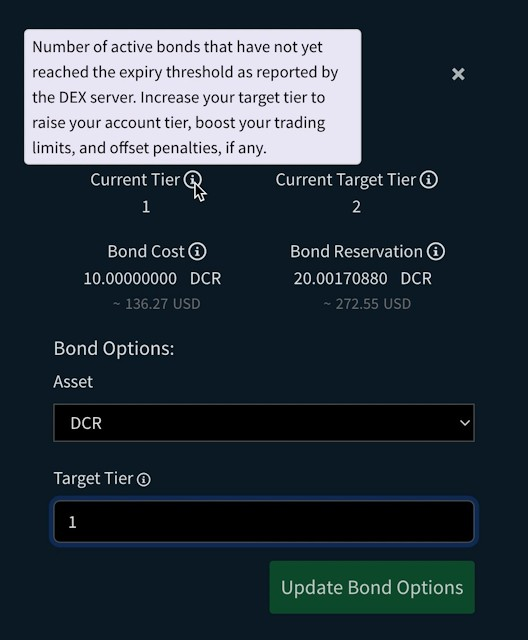
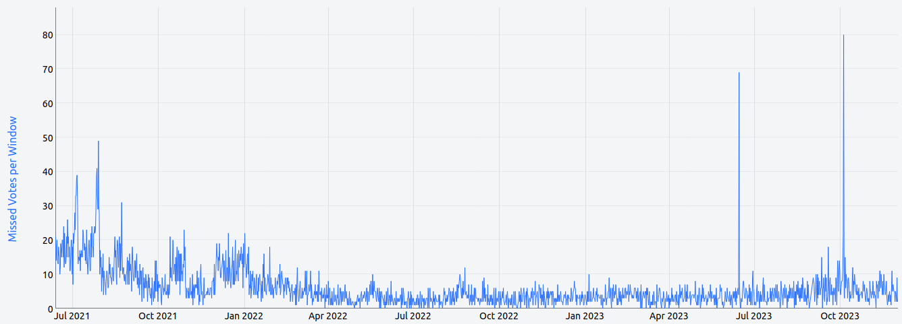
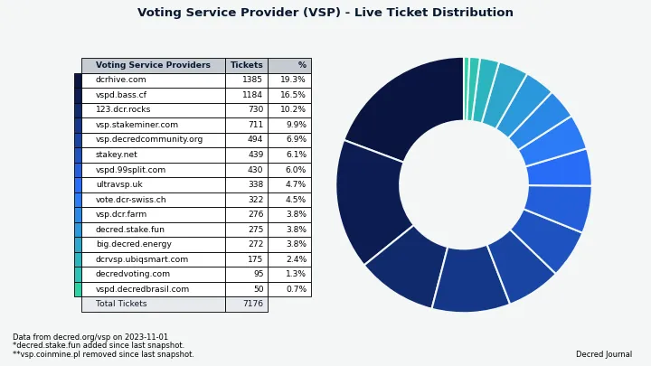
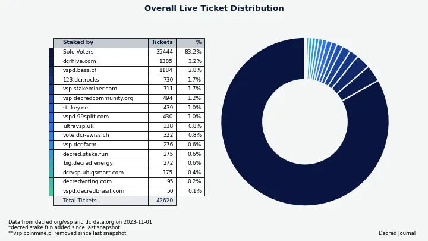

مجلة ديكريد لشهر أكتوبر 2023

_الصورة: غلاف أكتوبر بواسطة Exitus@_

أبرز أحداث أكتوبر:

- تم إصدار النسخة 1.8.1 من البرمجيات الأساسية مع تحسينات للتحصيص بواسطة مزود خدمة التصويت و منصة المبادلات اللامركزية لديكريد.
- تمت الموافقة على ميزانية دمج Cake Wallet وقد بدأ التطوير.
- تم تحديث gominer وdcrpool لدعم التعدين في مجمع BLAKE3 بواسطة وحدات معالجة الرسوميات GPU. - تم إطلاق ثلاثة مجمعات تعدين عامة.
- سجل سعر التذكرة رقما قياسيا جديدا وهو 700 DCR.

**المحتوى:**

- [إصدار البرمجيات الأساسية النسخة v1.8.1](#core-software-v181-release)
- [التطوير](#development)
- [الأشخاص](#people)
- [الحوكمة والمالية](#governance-finances)
- [الشبكة](#network)
- [النظام البيئي](#ecosystem)
- [الانتشار](#outreach)
- [وسائل الإعلام](#media)
- [الأسواق](#markets)
- [الخارجية ذات الصلة](#relevant-external)

## إصدار البرمجيات الأساسية v1.8.1

يتضمن هذا [الإصدار](https://twitter.com/decredproject/status/1715463325595660307) إصلاحات للمستخدمين الذين يقومون بالمشاركة في التحصيص باستخدام مقدمي خدمات التصويت (VSPs) بالإضافة إلى إصلاحات لمنصة المبادلات اللامركزية لديكريد DCRDEX.

- **dcrd**: تضم أوامر `getblock` و `getblockheader` الآن على حقل إضافي `powhash` للتجزئة الجديدة BLAKE3. كما تم تحديث الأمر `getnetworkhashps -1` لإعادة تقدير القوة الحاسوبية لمعدل التجزئة لآخر 120 كتلة.
- **dcrwallet**: إصلاحات متعددة للموثوقية فيما يتعلق بالمشاركة في التحصيص عبر مزود خدمات التصويت VSP.
- **Decrediton**: يتضمن جميع التغييرات المذكورة أعلاه، إصلاح لخطأ "response buffer too short" الذي أبلغ عنه العديد من مستخدمي منصة المبادلات اللامركزية DEX، وتحديث الترجمات العربية والصينية.
- تم تحديث وحدة منصة المبادلات اللامركزية لديكريد DCRDEX**** في محفظة ديكريديتون إلى الإصدار v0.6.3: حيث تتغير حدود التداول مع مستوى السندات، مع حماية من التغييرات الخطرة غير المقصودة في الإعدادات، وعدةإصلاحات لمعالجة الطلبات، السندات، وإعادة فحص محافظ BTC.

يمكن العثور على ملاحظات الإصدار الكاملة والتنزيلات [هنا](https://github.com/decred/decred-binaries/releases/tag/v1.8.1). يُوصى[بالتحقق من الملفات](https://docs.decred.org/advanced/verifying-binaries/) للتأكد من عدم تعديلها.

يحتوي هذا الإصدار أيضًا على أحدث النسخ المستقلة لتطبيق منصة المبادلات اللامركزية لديكريد DCRDEX التي تقدم عددًا من المزايا مقارنةً[بالإصدارات في مستودع dcrdex](https://github.com/decred/dcrdex/releases/tag/v0.6.3): الملفات موقعة بمفتاح إصدار ديكريد، توافق أكبر مع أنظمة التشغيل وهندسة المعالج، وتستفيد من تحسينات أحدث مترجم Go. انظر ملفات `dexc-xxx` في نهاية صفحة الإصدار.

<a id="development" />

## التطوير

ما لم يُذكر خلاف ذلك، فإن العمل المَذْكُور هنا يشتمل على حالة "الدمج إلى الرئيسي". وهذا يعني أن العمل قد تم استكماله ومراجعته ودمجه في كود المصدر الذي يمكن للمستخدمين المتقدمين [بناءه وتشغيله](https://medium.com/@artikozel/the-decred-node-back-to-the-source-part-one-27d4576e7e1c)، ولكنه ليس متاحًا بعد في ثنائيات الإصدار للمستخدمين العاديين.

### dcrd

_[dcrd](https://github.com/decred/dcrd) هو تطبيق عقدة كامل يعمل على تشغيل شبكة ديكريد من نظير إلى نظير حول العالم._

تغييرات تواجه المستخدم:

- تمت إضافة دعم لـ [طلبات `getdata` المتزامنة](https://github.com/decred/dcrd/pull/3203). حاليًا، يمكن للعقدة معالجة طلب `getdata` واحد فقط في وقت واحد، وهذا السلوك هو موروث من الكود الأولي للشبكة و الذي لم يعد صالحا. أثناء تقديم البيانات لطلب `getdata` واحد، يمكن أن يتأخر رسائل أخرى يمكن أن يتم معالجتها بسرعة، مثل رسائل التأشير، لفترة طويلة. علاوة على ذلك، من الممكن نظرياً أن يتعلق زوج من النظراء في انتظار بعضهم البعض. في الواقع، هذا الوضع نادرًا ما يحدث عمليًا، لكن ذلك قد يتغير في المستقبل عندما تتم إضافة رسائل جديدة، مثل تلك المتعلقة بالخلط نظير إلى نظير. لتحسين الكفاءة العامة ومعالجة المخاوف المذكورة أعلاه، تمت إجراء طلبات `getdata` بشكل غير متزامن بحيث يمكن معالجة رسائل الوصول الواردة الأخرى بشكل متزامن. تمت إضافة حدود جديدة أيضًا لمنع السلوك الخبيث. هذا التغيير في بروتوكول الشبكة مخطط لأن يتم تضمينه في إصدار v1.9.0.
- تؤدي الطلبات المتزامنة لـ `getdata` أيضًا إلى تقليل [وقت مزامنة السلسلة الأولي](https://matrix.to/#/!zefvTnlxYHPKvJMThI:decred.org/$mxemr1HGLNlX4eXYPuG9rTVUb15Jg7lWudGK3TQJEG0) من حوالي 81 دقيقة إلى حوالي 47 دقيقة (حسب قياس أجري على نظام اختبار المطور). قبل هذا التغيير، كان يتم تقديم الكتل بدُفعات وكل طلب للدُفعة التالية كان يجب أن ينتظر حتى يتم استقبال الدُفعة السابقة. نظرًا لوجود تأخير في الشبكة، يمكن أن يضاف الزمن "المتوقف" بين دُفعات الكتل إلى حوالي 5 ثوانٍ. نظرًا لوجود أكثر من 800 ألف كتلة، وعادةً ما يتم تقديمها بدُفعات تحتوي على 2000 كتلة، ستتسبب مزامنة أولية كاملة في وقوع أكثر من 400 من هذه التأخيرات، أو حوالي 33 دقيقة.
- تم تحديث حزمة `dcrutil` للحصول على [الدليل الرئيسي للمستخدم](https://github.com/decred/dcrd/pull/3196) من المتغير البيئي `$HOME` بدلاً من تحليل `/etc/passwd`. وذلك لجعلها متوافقة مع أنظمة التعبئة مثل Flatpak أو Snap. توفر هذه الأنظمة بيئات معزولة للتطبيقات ولا تسمح للثنائيات بالكتابة مباشرةً إلى الدليل الرئيسي. بدلاً من ذلك، يحددون دليلًا منفصلًا لكل تطبيق وتضبط `$HOME` وفقًا لذلك. هذا التغيير مطلوب [لجهود التعبئة](https://github.com/decred/dcrdex/issues/2581) الجارية لتطبيق منصة المبادلات اللامركزية لديكريد DCRDEX لسطح مكتب.

تغييرات تخص المطورين والتحديثات الداخلية:

- تم تحديث [صورة Docker](https://github.com/decred/dcrd/pull/3198) لتبنى باستخدام Go 1.21.3.
- توحيد كود الإغلاق لتقليل كمية [goroutines طويلة الأمد](https://github.com/decred/dcrd/pull/3199) وجعل استخدام [`WaitGroup`](https://github.com/decred/dcrd/pull/3200) أكثر محلية، مما يجعله أسهل في التحليل ويقلل من خطر الخطأ.
- تحسين معالجة [بيانات النظراء](https://github.com/decred/dcrd/pull/3201) في مدير المزامنة لتبسيط الكود والتخلص من بعض الحالات الزاوية الصعبة.

تسخير اختبار إدماج [dcrdtest](https://github.com/decred/dcrtest/tree/master/dcrdtest):

- تبسيط واجهة برمجة التطبيقات لجعل الحزمة [أكثر فائدة على نطاق واسع](https://github.com/decred/dcrtest/pull/17)، ليس فقط في الاختبارات، ولكن أيضًا في مقاييس الأداء وفي الكود العام غير المرتبط بالاختبارات بشكل خاص.
- التأكد من أن كود التنظيف [يعمل دائمًا](https://github.com/decred/dcrtest/pull/18) حتى لو فشل إعداد الاختبار. يضيف هذا أيضًا علمًا للحفاظ على ملفات البيانات سليمة لتسهيل تصحيح أخطاء الاختبار.

_الصورة: ستكون مزامنة السلسلة الأولية أسرع بنسبة ~40% مع طلبات getdata المتزامنة_

### dcrwallet

_[dcrwallet](https://github.com/decred/dcrwallet) هو خادم محفظة تستخدمه تطبيقات سطر الأوامر والمحفظة الرسومية._

- تحديث قاعدة بيانات [bbolt](https://github.com/decred/dcrwallet/pull/2290) إلى الإصدار v1.3.8 لتجنب استخدام `syscall(2)` على OpenBSD لأن هذه الواجهة سيتم إزالتها. كما تمت المساهمة في [تصحيح bbolt](https://github.com/etcd-io/bbolt/pull/404) من قبل مطوري ديكريد.
- تحسين [وقت مزامنة السلسلة الأولية](https://github.com/decred/dcrwallet/pull/2292) واستخدام الذاكرة.

### Decrediton

_[Decrediton](https://github.com/decred/decrediton) ديكريديتون هو تطبيق محفظة لسطح المكتب كامل الميزات مع ميزة التصويت مدمجة، وميزة الخلط ب StakeShuffle، والشبكة البرقية، والتداول على منصة المُبادلات اللامركزية DEX للديكريد، والمزيد. يتم تشغيلها مع سلسلة الكتل كاملة أو بدونها (وضع التحقق البسيط من الدفع SPV)._

تم الدمج في الفرع الرئيسي `master`:

- تم إصلاح خلل في [بناء Trezor](https://github.com/decred/decrediton/pull/3922) الذي تسببت فيه تغيير في مكتبة trezor-connect.

قيد التطوير:

- قام مطورو ديكريد بتحديث [التصحيح](https://github.com/trezor/trezor-firmware/pull/2703) لبرنامج trezor-firmware المطلوب [لتحصيص وحدات ديكريد باستخدام Trezor](https://github.com/decred/decrediton/issues/2681) ولكن لم يتم دمجه بعد. ينتظر هذا التحديث منذ ديسمبر 2022 ولا يوجد توضيح عن موعد دمجه. يُقدر المساعدة في دفعه إلى الأمام. من الممكن تقنياً الحصول على تحصيص Trezor مع Decrediton اليوم عن طريق تحميل برنامج Trezor ببرنامج غير رسمي، و لكن الجهاز سيظهر تحذيرًا أحمر خطيرًا بعبارة "UNSAFE, DO NOT USE!"، لذا هذه الطريقة غير مناسبة لمعظم المستخدمين.

### dcrseeder

_[dcrseeder](https://github.com/decred/dcrseeder) هو متتبع ارتباطات بيانات يحافظ على قائمة بعقد ديكريد الموثوقة ويساعد العقد الجديدة على اكتشاف نظرائها الأولى_

- تم التحديث للبناء والاختبار باستخدام [Go 1.21](https://github.com/decred/dcrseeder/pull/59)، وتبسيط سكربت البناء، وإضافة مزيد من أدوات التحقق من الأكواد (linters) التي تتحقق تلقائيًا من الأكواد للبحث عن المشكلات.
- تحسين [التعامل](https://github.com/decred/dcrseeder/pull/61) مع [إشارات الإيقاف](https://github.com/decred/dcrseeder/pull/60) التي ترسلها أنظمة التشغيل، وإضافة تسجيل لتوضيح سبب إيقاف العملية.
- التحضير لدعم [الشبكة المزدوجة](https://github.com/decred/dcrseeder/pull/62): تقليل استخدام الحالة العالمية، وتبسيط منطق البدء. كما تم تغيير مهام الإيقاف لتعمل عبر `defer` والذي يعتبر أكثر مقاومة للأخطاء.
- إضافة دعم لتشغيل نسخة واحدة من dcrseeder لفحص [الشبكة الرئيسية وشبكة الاختبار](https://github.com/decred/dcrseeder/pull/63) في نفس الوقت. سيتم تشغيل خادمي HTTP على منفذين مختلفين.

### gominer

_[gominer](https://github.com/decred/gominer) هو هو أداة تعدين عن ديكريد يستخدم خوارزمية الإثبات بالعمل للتعدين الفردي والتعدين الجماعي مع أجهزة OpenCL و CUDA._

تم تحديث gominer لدعم مجمعات التعدين عبر الشبكات باستخدام بروتوكول Stratum. جميع التغييرات أدناه مضمنة في [إصدار النسخة v2.0.0](https://github.com/decred/gominer/releases/tag/release-v2.0.0). هذا الإصدار يشمل فقط الكود المصدري دون ملفات تنفيذية، لكن عملية البناء موثقة بشكل [جيد](https://github.com/decred/gominer#readme).

- إعادة هيكلة معالجة [الأرقام العشوائية (nonces)](https://github.com/decred/gominer/pull/219) للسماح بدعم Stratum. تحتاج أجهزة التعدين إلى العثور على تجزئة لصديرة الكتلة التي تلبي متطلبات الصعوبة. [صديرة كتلة ديكريد](https://github.com/decred/dcps/blob/master/dcp-0011/dcp-0011.mediawiki#user-content-Proof_of_Work_Hash) هي بنية بطول 180 بايت حيث تخزن معظم البايتات بيانات مفيدة ولا يمكن تغييرها. لمنح المعدنين طريقة لتغيير التجزئة، تحتوي صديرة الكتلة على بضعة بايتات خاصة تسمى الأرقام العشوائية (nonces). يقوم المعدنون بتغيير الأرقام العشوائية باستمرار وإعادة حساب التجزئة حتى يتم العثور على تجزئة جيدة. Stratum هو بروتوكول شائع لتوزيع هذا العمل على أجهزة متعددة، ويتطلب استخدام الأرقام العشوائية بطريقة مختلفة عن التعدين الفردي.
- تصحيح العديد من المشكلات المتعلقة بـ [Stratum والتعدين في المجمعات](https://github.com/decred/gominer/pull/220)، والتي تتعلق بشكل رئيسي بملء واستخدام الهياكل البيانية كما يتطلبها بروتوكول Stratum.
- استخدام [حزمة rpcclient](https://github.com/decred/gominer/pull/208) في كود التعدين الفردي. تمت إزالة الكود المكرر والتحول إلى الحصول على البيانات من dcrd بكفاءة أكبر من خلال إشعارات WebSocket بدلاً من الاستطلاع.
- إضافة الاستدعاء الأولي لـ [getwork](https://github.com/decred/gominer/pull/224) في وضع التعدين الفردي لبدء التعدين فورًا دون الانتظار حتى ظهور كتلة أو معاملة جديدة.
- إعادة صياغة كيفية التعامل مع [إصدار البرنامج](https://github.com/decred/gominer/pull/221) ليكون أكثر موثوقية ويتطابق مع بقية برمجيات Decred. سيشمل الآن إخراج `gominer --version` الإصدار Git الذي تم بناء gominer منه.
- تم تحديث [ملف التعليمات README](https://github.com/decred/gominer/pull/225) بتعليمات لتشغيل gominer مع dcrpool وغيره من مجموعات التعدين القائمة على بروتوكول Stratum.

### dcrpool

_[dcrpool](https://github.com/decred/dcrpool) هو برنامج خادم لتشغيل تجمع التعدين._

تركزت تحديثات شهر أكتوبر على إضافة دعم لـ BLAKE3 وgominer:

- تحسين طريقة [إرسال البيانات إلى المعدنين](https://github.com/decred/dcrpool/pull/409). بعض أجهزة ASIC القديمة كانت تستخدم حقل "المعاملة الجيلية الثانية" بشكل غير صحيح. تتمتع صديرة كتلة ديكريد بتصميم أفضل للتعدين مقارنةً بصديرة كتلة البتكوين، ولم يكن ينبغي استخدام هذا الحقل لديكريد. نظرًا لعدم توافق أجهزة ASIC القديمة مع الشبكة بعد الآن، تم استغلال هذه الفرصة للتوقف عن استخدام حقل "gentx2" ووضع جميع المعلومات ذات الصلة في "gentx1"، وهو الإجراء الصحيح والأكثر كفاءة.
- تعديل المجمع للعمل مع [BLAKE3](https://github.com/decred/dcrpool/pull/412) كما هو مطلوب الآن من قبل شبكة ديكريد.
-إضافة دعم لـ [gominer v2.0.x](https://github.com/decred/dcrpool/pull/413) كعميل تعدين مدعوم في الشبكة.
-إصلاح [مشكلة في سباق البيانات](https://github.com/decred/dcrpool/pull/402).
-إصلاح خطأ كان يمنع المجمع من تتبع [الكتل](https://github.com/decred/dcrpool/pull/416) التي تعدنها الشبكة. نتيجة لذلك، لم تكن الشبكة ترسل عائدات المعاملات الأولية (Coinbase) من هذه الكتل إلى المشاركين في التعدين.

تغييرات داخلية وتطويرية:

- تم  تحديد [الوقت الأقصى لإنشاء الكتل](https://github.com/decred/dcrpool/pull/411) ليتوافق مع الوقت المستهدف لكل كتلة في كل شبكة. هذا الإجراء ضروري لدعم شبكة المحاكاة simnet بشكل صحيح.
- تم استخدام التعبيرات النمطية [لتحديد العملاء](https://github.com/decred/dcrpool/pull/406)، مما يتيح دعم إصدارات جديدة من عملاء التعدين دون الحاجة إلى تحديثات في برنامج المجمع.
- إعادة صياغة منطق [تحديد العملاء](https://github.com/decred/dcrpool/pull/415) لتسهيل دعم إصدارات مختلفة من أجهزة التعدين.
- تغييرات داخلية متعددة أصغر: تم إزالة الأكواد غير المستخدمة، تحسين التسجيلات، تحسين كود الاختبارات، وغيرها من التحسينات.

### DCRDEX

_[DCRDEX](https://github.com/decred/dcrdex) هي منصة مبادلات غير احتجازية للمُبادلات غير الموثوقة، مدعومة بالمقايضات الذرية._

تغييرات تمت إعادتها إلى الإصدار القادم v0.6.x وإصدار ديكريديتون القادم:

- تمت إضافة [حل بديل](https://github.com/decred/dcrdex/pull/2596) لمشكلة عدم تحميل نافذة DCRDEX في ديكريديتون. كان من الضروري تحديث نسخة Electron المستخدمة في ديكريديتون لتفعيل دعم Ledger، ولكن النسخة الأحدث من Electron تسببت في مشاكل في إدماج منصة المبادلات اللامركزية لديكريد. أظهر البحث المطول والشاق أن نسخة Electron v21.3.0 قدمت لغة محلية غير موجودة بالفعل هي "c"، والحل البديل كان عدم استخدام هذه "اللغة" لتنسيق الأرقام في منصة المبادلات اللامركزية لديكريد DCRDEX.

الأعمال المدرجة أدناه تم دمجها في الفرع الرئيسي `master` تجاه الإصدارات المستقبلية.

العميل:

- تمت إضافة القدرة على [إعادة تعيين كلمة مرور التطبيق المنسية](https://github.com/decred/dcrdex/pull/2477) باستخدام بذرة التطبيق.
- تمت إضافة [إشعارات المتصفح/سطح المكتب](https://github.com/decred/dcrdex/pull/2558) للأحداث مثل تغييرات الطلبات، السندات، أو مشاكل الاتصال بالخادم. يتم عرض هذه الإشعارات حتى عندما لا تكون نافذة منصة المبادلات اللامركزية DEX نشطة.
- تحديث [وثائق المستخدم](https://github.com/decred/dcrdex/pull/2538) لتعكس تدفق إنشاء حساب عميل منصة المبادلات اللامركزية DEX الجديد.
- تم إصلاح معالجة [الأصول غير المدعومة](https://github.com/decred/dcrdex/pull/2548) في عرض الأسواق.
- تم إصلاح خطأ أثناء [إضافة خادم منصة المبادلات اللامركزية DEX جديد](https://github.com/decred/dcrdex/pull/2566).

تمت إعادة العمل على حساب السمعة، السندات، حدود التداول:

- إعادة صياغة حسابات [مستوى الحساب](https://github.com/decred/dcrdex/pull/2501). تم إزالة مفهوم "مستويات المكافآت"، حيث لم يكن يقدم أي فائدة مفيدة ولكنه أضاف تعقيدات. سيقوم الخادم بإرسال المزيد من التحديثات لتغيرات النقاط التي كان العميل غير مدرك لها سابقًا. ستساعد هذه التغييرات الداخلية وغيرها العميل على تتبع نقاط حسابه ومستواه بشكل أكثر موثوقية وتجنب تفويت تجديدات السندات (والتي قد تؤدي إلى فقدان الحساب لقدرته على التداول حتى يتم استعادة المستوى المستهدف).
- إعادة صياغة [حدود التداول](https://github.com/decred/dcrdex/pull/2503) لإصلاح المشكلة المتعلقة بـ [حدود التداول المنخفضة بشكل غير معقول](https://github.com/decred/dcrdex/issues/2472) في بعض الأسواق ذات رسوم المعاملات المنخفضة. *حجم اللوت* هو الحد الأدنى لكمية العملات التي يمكن تداولها، وهو يحمي الصفقات الناجحة من دفع رسوم عالية نسبيًا مقارنة بالمبلغ المتداول. من ناحية أخرى، *حد التداول* هو الحد الأقصى للمبلغ الذي يمكن للمستخدم وضعه في دفتر الطلبات، وهو يحمي من خسارة الكثير في الرسوم في حال فشل التداول وتم رد الأموال. أزواج التداول ذات الرسوم المنخفضة (مثل DCR/LTC) لديها لوتات أصغر وتسمح بتداولات أدنى، مما يعد رائعًا لتجربة المستخدم. المشكلة في الأسواق ذات الرسوم المنخفضة كانت أن حدود التداول الخاصة بها كانت منخفضة بشكل غير معقول بسبب الصيغة المستخدمة. تم تحسين تلك الصيغة للسماح بتداول قيم أكبر في كل مرة في مثل هذه الأسواق.
- عرض المزيد من [معلومات السند](https://github.com/decred/dcrdex/pull/2485) على واجهة المستخدم للإعدادات مثل المستويات الحالية والمستهدفة للحساب والمبلغ المقفل في السندات.

ديكريد:

- إضافة حل بديل لمشكلة في dcrwallet حيث قد لا يتم [تأكيد المعاملة أبدًا](https://github.com/decred/dcrdex/pull/2555) إذا تم إغلاق المحفظة في الوقت الخاطئ.
- تحديثات فورية لواجهة المستخدم بخصوص [إحصائيات التحصيص](https://github.com/decred/dcrdex/issues/2497) وسعر التذكرة.
- تحديث [الأرصدة](https://github.com/decred/dcrdex/pull/2554) لمحفظة ديكريد للتحقق البسيط من الدفع SPV عند اكتشاف معاملات غير معدنة جديدة في مجمع المعاملات.

البتكوين:

- إضافة دعم لمزودي [بيانات السلسلة العامة](https://github.com/decred/dcrdex/pull/2547) (المعروفين أيضًا بمزودي RPC).

الإيثيريوم:

- إضافة تخزين محلي[لسجل المعاملات](https://github.com/decred/dcrdex/pull/2504) لمحفظة الإيثير. كان هذا ضروريًا لأن مزودي بيانات الإيثيريوم لا يدعمون الاستعلام عن المعاملات التي قام بها الحساب. بالإضافة إلى ذلك، يسمح وجود معاملات المحفظة محليًا بدمج وتحسين الكود الذي يتتبع المعاملات غير المؤكدة وتقليل الاعتماد على مزودي RPC.

Zclassic:

- دعم أولي لـ [Zclassic](https://github.com/decred/dcrdex/pull/2523) في الواجهة الخلفية وواجهة المستخدم (بدون محافظ محمية في الوقت الحالي).

التغييرات الداخلية والتطويرية:

- أتمتة تحديث العملية الشاقة [لمعرفات الذاكرة المؤقتة](https://github.com/decred/dcrdex/pull/2557).
- تحديث [loadbot](https://github.com/decred/dcrdex/pull/2420) للبدء بمعدل السوق بناءً على السعر الحقيقي للعملات في السوق. إذا تم تفعيل هذا الوضع، فإن برنامج الاختبار "الحوت" سيحاول دفع سوق الاختبار نحو الأسعار الحقيقية بدلاً من القيم العشوائية. هذا جزء من [إطار عمل اختبار صانع السوق](https://github.com/decred/dcrdex/issues/2303) لذي سيتم استخدامه لتقييم أداء البوتات في ظل ظروف السوق المختلفة.
- تخزين [الشموع](https://github.com/decred/dcrdex/pull/2443) المكتملة في قاعدة البيانات. إن حساب الشموع للرسوم البيانية هو عملية مكلفة وتخزين نتائجها في قاعدة البيانات يحل مشكلة [بطء بدء تشغيل الخادم](https://github.com/decred/dcrdex/pull/2151).

أخبار أخرى:

- أطلقت Circle [عملة USDC الأصلية على شبكة Polygon](https://www.circle.com/blog/what-you-need-to-know-native-usdc-on-polygon-pos) كبديل أكثر كفاءة لعملة USDC التي "تم ربطها" من إيثيريوم إلى Polygon (المعروفة باسم USDC.e). يفكر مطورو منصة المبادلات اللامركزية DEX في [التحول](https://github.com/decred/dcrdex/issues/2559) إلى هذه العملة الجديدة بينما لم يتم إدراج Polygon في أي إصدار ثابت من منصة المبادلات اللامركزية DEX لتقليل الاضطراب للمستخدمين النهائيين.
- قد تصبح الإيثيريوم المغلفة والبتكوين المغلفة [متاحة](https://matrix.to/#/!SFRQQFIHUUNXARfvew:decred.org/$OjqKljf7nmCrKB7YV4aYkh7Evf_zMzmpXqTFDGrzexQ) في الإصدار الفرعي القادم.

_الصورة: إعدادات السندات في منصة المبادلات اللامركزية لديكريد (تظهر مبالغ اختبارية)._

### Cryptopower

_[Cryptopower](https://github.com/crypto-power/cryptopower) هي محفظة ذات واجهة مستخدم رسومية لسطح المكتب متعددة العملات لـ DCR وBTC وLTC. يتم تشغيلها في وضع التحقق البسيط من الدفع والخفيف الذي يحافظ على الخصوصية دون الحاجة إلى سلاسل كتل كاملة، ويدعم تحصيص ديكريد، والخلط، والتصويت، وغيرها من الميزات الفريدة._

صفحة نظرة عامة جديدة:

- تم إضافة بيانات المحفظة الحقيقية إلى [بطاقة أداة الخلط](https://github.com/crypto-power/cryptopower/pull/118).
- تم تنفيذ عرض [أسعار منصة المبادلات](https://github.com/crypto-power/cryptopower/pull/177) من Binance و Bittrex.
- تمت إضافة [المعاملات الأخيرة](https://github.com/crypto-power/cryptopower/pull/157) والنشاط الأخير للتحصيص عبر جميع المحافظ.

تكيف الهاتف المحمول:

- تم إضافة أزرار [التنقل السفلية](https://github.com/crypto-power/cryptopower/pull/146) والتي تحل محل علامات التبويب المستوى العلوي على الهاتف المحمول.
- تم إضافة تخطيط محمول لصفحة [النظرة العامة](https://github.com/crypto-power/cryptopower/pull/155).

إدماج منصة المبادلات اللامركزية:

- تمت إضافة [الخطوة 2](https://github.com/crypto-power/cryptopower/pull/135) لعملية الانضمام إلى منصة المبادلات اللامركزية (اختيار الخادم) و [الخطوة 3](https://github.com/crypto-power/cryptopower/pull/199) (نشر السندات).

مسائل أخرى:

- تم إضافة مؤشر[للقيمة الإجمالية بالدولار الأمريكي](https://github.com/crypto-power/cryptopower/pull/131) لجميع الأصول المجمعة.
- تحسين [كود التخطيط](https://github.com/crypto-power/cryptopower/pull/151) لجعل التطبيق أكثر استجابة.
- تمت إضافة واجهة [المحدد المقسم](https://github.com/crypto-power/cryptopower/pull/175) القابلة لإعادة الاستخدام.
- تم تنفيذ [نموذج إرسال مشروطة](https://github.com/crypto-power/cryptopower/pull/176) يمكن الوصول إليها بسرعة من أي صفحة عبر زر الإرسال في الشريط العلوي.
- تم تنفيذ صفحات معلومات [تعريف التطبيق](https://github.com/crypto-power/cryptopower/pull/189).
- نقل [الحوكمة](https://github.com/crypto-power/cryptopower/pull/184) إلى تبويب رئيسي.
- تم تنفيذ تخطيط جديد[لمحدد المحفظة](https://github.com/crypto-power/cryptopower/pull/166) في علامة تبويب المحافظ الرئيسية.
- تم إضافة أداة [إخفاء الرصيد](https://github.com/crypto-power/cryptopower/pull/203) قابلة لإعادة الاستخدام.
- السماح[بإنشاء محفظة جديدة](https://github.com/crypto-power/cryptopower/pull/196) من صفحة إنشاء الطلب.
- تم تنفيذ تخطيط التوجيه الجديد في علامة التبويب [التداول](https://github.com/crypto-power/cryptopower/pull/218) ([للاختيار](https://github.com/crypto-power/cryptopower/issues/80) بين التداول في منصة المبادلات المركزية و منصة المبادلات اللامركزية).
- استبدال الشريط الجانبي الأيسر في [الصفحة الرئيسية للمحفظة](https://github.com/crypto-power/cryptopower/pull/201) بعلامات تبويب في الأعلى.

إصلاحات:

- تم إصلاح مشكلة عدم بدء [مزامنة المحفظة](https://github.com/crypto-power/cryptopower/pull/113) عند تشغيل التطبيق.
- تم إصلاح تقدير [سعر الصرف](https://github.com/crypto-power/cryptopower/pull/148).
- تم إصلاح المنطق المعكوس[لزر التبديل للمزامنة](https://github.com/crypto-power/cryptopower/pull/154).
- تم إصلاح تعطل التطبيق عند الانتقال إلى صفحة [معلومات المحفظة](https://github.com/crypto-power/cryptopower/pull/163) أثناء إعادة الفحص.
- تم إصلاح تعطل التطبيق عند فتح [نموذج التصويت](https://github.com/crypto-power/cryptopower/pull/169).
- تم إصلاح عدم القدرة على [إلغاء](https://github.com/crypto-power/cryptopower/pull/185) خطوة نسخ البذور احتياطياً ونموذج إدخال كلمة المرور.
- تم إصلاح تعطل التطبيق عند الانتقال إلى صفحة [إنشاء أمر](https://github.com/crypto-power/cryptopower/pull/186) من صفحة الإعدادات.
- تم إصلاح تعطل التطبيق عند جلب [أسعار الصرف](https://github.com/crypto-power/cryptopower/pull/202).
- تم إصلاح 4 مشاكل تسبب تعطل التطبيق متعلقة[بالمحافظ التي تعمل بالمشاهدة فقط](https://github.com/crypto-power/cryptopower/pull/200).
- تم إصلاح تعطل التطبيق على صفحة [إنشاء أمر](https://github.com/crypto-power/cryptopower/pull/196) عند اختيار أصل للتداول لا توجد له محافظ موجودة.
- تم إصلاح خطأ يتسبب في [حذف المحفظة](https://github.com/crypto-power/cryptopower/pull/222) مما يؤدي إلى إزالة واجهة المستخدم العلوية.

_الصورة: عروض تسجيل الدخول إلى منصة المبادلات اللامركزية DEX في Cryptopower_

_الصورة: يمكن لـ Cryptopower تحويل العملات باستخدام خدمات مركزية_

_الصورة: تصميم محدث لعلامة التبويب الحوكمة في Cryptopower (قد يختلف التنفيذ النهائي)_

_الصورة: تصميم الهاتف المحمول لعلامة التبويب العامة في Cryptopower (قد يختلف التنفيذ النهائي)_

### مُرحِّل بيسون

_[مُرحِّل بيسون](https://github.com/companyzero/bisonrelay) هو منصة إعلام اجتماعي جديدة تتمتع بحماية قوية ضد الرقابة والمراقبة والإعلانات، وهي مدعومة بالشبكة البرقية لديكريد._

تغييرات تطبيق واجهة المستخدم المدمجة في الفرع الرئيسي `master`:

- تم إصلاح مشكلة [إنتقال](https://github.com/companyzero/bisonrelay/pull/358) موقع التمرير إلى بداية اليوم عند نشر رسائل دردشة جديدة.

الأندرويد:

- تم إرسال أولى [رسائل الاختبار](https://matrix.to/#/!GHnoHXSgkVAsUknRUg:decred.org/$Jqn9kojtkwKeCn83jIRsw1JT-hsocBdX4WCrFfmjuWY) من الأندرويد. استغرقت عملية التزامن حوالي 10 دقائق واستخدمت 10-15% من البطارية. تم [التبليغ](https://matrix.to/#/!GHnoHXSgkVAsUknRUg:decred.org/$6Nm8gEMHy1UgaNL-HjM1CCXH69yhNY9O7EJ5rEAVgzc) عن أن تثبيت مُرحِّل بيسون BR جديد على الأندرويد يستهلك حوالي 1 جيجابايت.

### إدماج محفظة cake

_[محفظة كيك](https://cakewallet.com/) محفظة مفتوحة المصدر وذاتية الحفظ للعديد من الأصول مثل XMR، BTC، LTC، وعملات أخرى، وتعمل على أنظمة أندرويد، iOS، macOS ولينكس._

إليكم قصة إدماج ديكريد حتى الآن:

- قام Tivra@ بربط ديكريد بمحفظة cake، مما أدى إلى بث مباشر تعاوني [فيديو البث المباشر](https://www.youtube.com/watch?v=0KKsD4ZhZn0) مع [Vik Sharma](https://twitter.com/vikrantnyc) و[Justin Ehrenhofer](https://twitter.com/JEhrenhofer) في أغسطس 2023.
- تم إنشاء غرفة دردشة لمناقشة الإدماج وتجربة الكود. تم بناء محفظة Cake من خليط معقد من Dart+Flutter (لغة التطبيق الرئيسية)، C++ (مونيرو)، Go (الإيثريوم)، وكذلك Kotlin و Swift (للإدماج الأصلي مع أندرويد وiOS). يُمكن وصف عملية إعداد بيئة البناء بأنها "جحيم البناء" نظرًا لعدم توثيقها بالكامل وصعوبة تحقيق البناء لمنصة واحدة فقط، ناهيك عن وجود أربعة أهداف إجمالاً (لينكس، macOS، أندرويد، iOS).
- تم إضافة بعض شاشات ديكريد كدليل على المفهوم وتحقيق بناء مفعل للأندرويد.
- تم تقديم [اقتراح](https://proposals.decred.org/record/2f25f2d) لتمويل إدماج ديكريد. لم يصل الاقتراح إلى النصاب بسبب مشاكل التفرع الصلب في ديكريد وتم إعادة تقديمه في سبتمبر. تمت الموافقة على [الاقتراح الثاني](https://proposals.decred.org/record/b3bdacb) في أكتوبر.
- قام المطورون بتقييم استراتيجيات الإدماج واستقروا على إنشاء مكتبة ديكريد استنادًا إلى الكود من DCRDEX و [libwallet](https://github.com/crypto-power/cryptopower/tree/master/libwallet) التابع ل cryptopower، وتجميعها كمكتبة C يمكن استدعاؤها من كود Dart. الخيار الثاني كان بناء المكتبة باستخدام gomobile، كتابة كود لاصق خاص بالمنصة (Kotlin وSwift)، واستخدام "قنوات المنصة" في Dart لاستدعاء الكود الأصلي. تم التخلي عن هذا النهج باعتباره أكثر صعوبة.
- تم تفريع مستودع كود محفظة كيك إلى [مستودع مرحلي](https://github.com/JoeGruffins/cake_wallet) ليكون مكانًا للتكرار السريع حتى يكون شيء جاهز لتقديمه إلى المصدر الرئيسي.
- تم تقديم النسخة الأولية من [libwallet](https://github.com/itswisdomagain/libwallet/pull/1) لمراجعة الكود، وهي مكتبة بسيطة لبناء تطبيقات محفظة التحقق البسيط من الدفع لـ DCR، BTC و LTC. الخطة هي استخدام هذه المكتبة من محفظة كيك، cryptopower وربما برمجيات أخرى.
- تم دمج النسخ الأولية من [شاشات ديكريد](https://github.com/JoeGruffins/cake_wallet/pull/1) في التفرع المرحلي لإنشاء أساس مشترك لبدء التطوير.

### مسائل أخرى

تعرض [واجهة برمجة تطبيقات قائمة مزود خدمة التصويت](https://github.com/decred/dcrwebapi/blob/master/docs/api.md) الآن عدد التذاكر [المفقودة والمنتهية](https://github.com/decred/dcrwebapi/pull/180) بشكل منفصل، مما يسمح بتقييم موثوقية مزود خدمة التصويت بدقة أكبر. يُفضّل انخفاض عدد التذاكر المفقودة، بينما التذاكر المنتهية أمر طبيعي ولا تشير إلى مشكلة مع مزود خدمة التصويت.

نظم Exitus@ موضوع [Reddit](https://www.reddit.com/r/decred/comments/1700xyi/decred_developer_ask_me_anything_ama_feat_dev/) بعنوان "اسألني أي شيء" (AMA) لمطوري ديكريد والذي جمع 77 تعليقًا، وفيما يلي بعض النقاط البارزة:

- الأشياء الكبيرة التالية في [تطوير الشبكة الأساسية](https://www.reddit.com/r/decred/comments/1700xyi/decred_developer_ask_me_anything_ama_feat_dev/k44icgy/) هي تحويل عملية الخلط إلى عملية لا مركزية وإنشاء الكتل الأساسية لدعم أشياء مثل التوكنات غير القابلة للاستبدال (NFTs) بطريقة لا مركزية حقاً.
- ألمح davecgh@ إلى التحول نحو جعل [تطوير التطبيقات](https://www.reddit.com/r/decred/comments/1700xyi/decred_developer_ask_me_anything_ama_feat_dev/k45rwmq/) أسهل.
- يتم [استخدام](https://www.reddit.com/r/decred/comments/1700xyi/decred_developer_ask_me_anything_ama_feat_dev/k4abvjh/) حزمة dcrd لعمليات منحنى الإهليلجية المُحسّنة [secp256k1](https://github.com/decred/dcrd/tree/master/dcrec/secp256k1) من قبل INFURA للإيثريوم، Nostr، Cosmos SDK، TzGo لـ Blockwatch (Tezos Go SDK)، Ethereum Optimism، والعديد غيرها.
- [إعادة تسمية منصة المبادلات اللامركزية لديكريد DCRDEX](https://www.reddit.com/r/decred/comments/1700xyi/decred_developer_ask_me_anything_ama_feat_dev/k46xyg9/) ستكون متزامنة مع إصدار v1 واستعداد برامج البوت لصناع السوق. يدرك المطورون أن الرسوم العالية على البتكوين والإيثريوم تقمع النشاط التجاري ويعملون على حلول، وشملت الأعمال الأخيرة في هذا الاتجاه دعم WBTC و WETH على Polygon وجعل أسواق الحجم المنخفض ممكنة.
- اطلع على المزيد من الإجابات المفيدة في [الموضوع](https://www.reddit.com/r/decred/comments/1700xyi/decred_developer_ask_me_anything_ama_feat_dev/).

## الأشخاص

نرحب بالمساهمين الجدد لأول مرة:

- CPunch@ (مطور، [كريبتوباور](https://github.com/crypto-power/cryptopower/pull/113))
- upright39@ (مطور، [كريبتوباور](https://github.com/crypto-power/cryptopower/pull/202))
- ZecHub@ (كاتب، [Cypherpunk Times](https://www.cypherpunktimes.com/social-media-data-collection-does-it-matter/))  

إحصائيات المجتمع حتى 2 نوفمبر (مقارنةً بـ 2 أكتوبر):

- متابعو [تويتر](https://twitter.com/decredproject): 53,475 (+68)
- مشتركو [ريديت](https://www.reddit.com/r/decred/): 12,762 (+5)
- الأعضاء على غرفة الدردشة #general على [ماتريكس](https://chat.decred.org/): 826 (+7)
- أعضاء [ديسكورد](https://discord.gg/GJ2GXfz): 1,838 (+43)، مُوثقون للنشر: 762 (+18)
- أعضاء [تيليجرام](https://t.me/Decred): 2,297 (-24)
- مشتركو [يوتيوب](https://www.youtube.com/decredchannel): 4,640 (+0)، المشاهدات: 242.4 ألف (+2.4 ألف)

  
## الحوكمة والمالية

في أكتوبر، استقبلت [الخزينة](https://dcrdata.decred.org/treasury) الجديدة 7,628 DCR بقيمة 97 ألف دولار وفقاً لمعدل السعر الشهري في أكتوبر والذي كان 12.73 دولار لكل DCR. تم إنفاق 8,412 DCR لدفع مستحقات المتعاقدين، بقيمة 108 ألف دولار بنفس المعدل.

تم تعدين [معاملة إنفاق الخزانة](https://dcrdata.decred.org/tx/dad857ec261237d51247d4bfae1a1ffb4348c8a7ed8933b2b877e6cac1d75436) في أوائل أكتوبر وقد تم تغطيتها في [العدد السابق](202309.md#governance).

اعتبارًا من الأول من نوفمبر، الرصيد المجمع [للخزينة القديمة](https://dcrdata.decred.org/address/Dcur2mcGjmENx4DhNqDctW5wJCVyT3Qeqkx) و[الخزينة الجديدة](https://dcrdata.decred.org/treasury) هو 873 ألف DCR (11.4 مليون دولار أمريكي بسعر 13.08 دولار لكل DCR).

_الصورة: تدفقات الخزينة الداخلة والخارجة بالـ DCR_

_الصورة: رصيد الخزينة الشهري بالدولار الأمريكي؛ لوحظ أنه يعتمد بشكل كبير على سعر منصة المبادلات_

تم الانتهاء من التصويت على ثلاثة مقترحات في أكتوبر:

- [دمج Cake Wallet مرة أخرى](https://proposals.decred.org/record/b3bdacb) من @JoeGruff الذي طلب 80,000 دولار لدمج وظائف DCR الأساسية في [Cake Wallet](https://cakewallet.com/) تمت الموافقة عليه بنسبة 88% نعم ومشاركة التذاكر بنسبة 59%.
- [مقترح العلاقات العامة لديكريد المرحلة الخامسة](https://proposals.decred.org/record/0c04c6f) من @l1ndseymm الذي طلب 48,000 دولار لعام آخر من العمل في العلاقات العامة كفريق مكون من 5 أشخاص تم رفضه بنسبة 53% بنعم (لم يصل إلى الحد الأدنى 60%) ومشاركة التذاكر بنسبة 55%.
- [مقترح محتوى Odaily](https://proposals.decred.org/record/b80040f) من @conniej الذي طلب 15,000 دولار لنشر مقالين رعائيين خلال 6 أشهر والتعرض المرافق في وسائل التواصل الاجتماعي تم رفضه بنسبة 30% نعم ومشاركة التذاكر بنسبة 28%. تم تفويض المقترح للتصويت بعد حوالي شهرين من الخمول.

لم تكن هناك تحديثات كبيرة على المقترحات المذكورة أعلاه منذ تغطيتها في [Politeia Digest 64](https://blockcommons.red/politeia-digest/issue064/).

تم التصويت على مقترحات [دمج Cake Wallet](https://dcrdata.decred.org/proposal/b3bdacb776732b5b) و[مرحلة العلاقات العامة الخامسة لديكريد](https://dcrdata.decred.org/proposal/0c04c6fcebac8c58) [لم يتم بدءها](https://matrix.to/#/!qYpAAClAYrHaUIGkLs:decred.org/$uKiSVmR0a3Z1q1-1gLfsaN7JIG-UAmZbZCJ8QoykU2M) بشكل طبيعي في 28 سبتمبر بسبب [خطأ في الخادم](https://matrix.to/#/!ueeciPqvqEsPyPCJkp:decred.org/$sig85UC6YA5Mo1hRA6_3AKcAWPs7ZPGLFrDf2CJ1Prs). تم حل مشكلة مقترح Cake Wallet في حوالي 4 أيام. استغرق تصحيح مقترح العلاقات العامة لديكريد يومًا إضافيًا بسبب [بيانات خاطئة في قاعدة البيانات](https://matrix.to/#/!qYpAAClAYrHaUIGkLs:decred.org/$3d1pE7I1_tsf_jiinZnTEvg7tHGYtFeWS_IaltRcdNA) التي اضطرت للبحث عنها وإزالتها يدويًا.

<a id="network" />

## الشبكة

**معدل التجزئة**: فتح [معدل التجزئة](https://dcrdata.decred.org/charts?chart=hashrate&scale=linear&bin=day&axis=time) في أكتوبر عند حوالي 8.8 تيراهاش/ثانية وأغلق عند حوالي 12.3 تيراهاش/ثانية، وصل إلى أدنى مستوى عند 7.1 تيراهاش/ثانية وأعلى مستوى عند 13.3 تيراهاش/ثانية خلال الشهر.

_الصورة: تسيطر وحدات معالجة الرسومات على معدل التجزئة في ديكريد ويقاس بالتيراهاشات_

توزيع 1,000 كتلة [تم تعدينها](https://miningpoolstats.stream/decred) بحلول 1 نوفمبر: [miningandco.com](https://decred.miningandco.com/) 20%، [pooltronic.tech](https://decred.pooltronic.tech/) 9%، [blake3dcr.com](https://blake3dcr.com/) 3%، 68% لم تحدد من قبل [miningpoolstats.stream](https://miningpoolstats.stream/decred).

**التحصيص**: تراوح [سعر التذكرة](https://dcrdata.decred.org/charts?chart=ticket-price&axis=time&visibility=true-true&mode=stepped) بين 157 و**701** DCR ووصل إلى أعلى مستوى على الإطلاق.

بلغ [المبلغ المقفل](https://dcrdata.decred.org/charts?chart=ticket-pool-value&scale=linear&bin=day&axis=time) بين 8.38 و9.87 مليون DCR، مما يعني أن 53.9-63.5% من العرض المتداول [شارك](https://dcrdata.decred.org/charts?chart=stake-participation&scale=linear&bin=day&axis=time) في إثبات الحصة.

**التكهنات**: هناك [تكهنات](https://matrix.to/#/!lDZCzVQjFoJsXMPkvr:decred.org/$4u119zQS2exfxIvD_AvvM295lmFhKJf47yrG3_6BjKQ) بأن كيانًا واحدًا توقف مؤقتًا عن شراء التذاكر ثم اشترى تذاكر بقيمة 1.4 مليون DCR في فترة قصيرة من الزمن.

_الصورة: زيادة نسبيًا صغيرة في شراء التذاكر في الأسبوع الأول من أكتوبر..._

_الصورة:...أدت إلى أكبر تقلب في سعر التذكرة على الإطلاق…_

_الصورة:…في مخطط إجمالي DCR المقفل كانت مجرد "تصحيح"_

_الصورة: حدثت قفزة نادرة في التذاكر المفقودة في 4 أكتوبر_

**مزودي خدمات التصويت (VSP)**: يدير[مزودي خدمات التصويت 15 المدرجة](https://decred.org/vsp/) مجتمعة حوالي 7,200 تذكرة (-350) حية، والتي كانت تمثل 16.8% من مجموعة التذاكر (-1.2%) في 1 نوفمبر.

أكبر الرابحين في أكتوبر هم [123.dcr.rocks](https://123.dcr.rocks/) (+395 تذكرة أو +118%)، [dcr.farm](https://vsp.dcr.farm/) (+107 تذاكر أو +63%)، و [ultravsp.uk](https://ultravsp.uk) (+87 تذكرة أو +35%).

_الصورة: توزيع التذاكر التي يديرها موفري خدمات التصويت VSPs_

_الصورة: 83% من جميع التذاكر محتفظ بها من قبل المصوتين الفرديين المتحمسين الذين لا يحتاجون إلى موفري خدمات التصويت VSP_

**العقد**: رصد [مُخطِط ديكريد](https://nodes.jholdstock.uk/user_agents) ما بين 145 و 153 عقدة dcrd طوال الشهر. تمت مشاهدة إصدارات 155 عقدة تم رؤيتها في 1 نوفمبر:  النسخة 1.8.0 - 77%، النسخة 1.8.1 - 15%، النسخة 1.7.x - 2، النسخة 1.8.0 لبناءات التطوير- 0.6%، أخرى - 5.8%.

_الصورة: تم تحديث 15% من العقد إلى v1.8.1. تشير المنطقة الحمراء قبل يناير 2023 إلى البيانات غير الكاملة التي كانت لدينا في ذلك الوقت._

تراوحت نسبة [العملات المخلوطة](https://dcrdata.decred.org/charts?chart=coin-supply&zoom=jz3q237o-la8vk000&scale=linear&bin=day&axis=time&visibility=true-true-true) ما بين 62.0-62.6%. وقد تراوح حجم [الخلط اليومي](https://dcrdata.decred.org/charts?chart=privacy-participation&bin=day&axis=time) ما بين 271-**1,036 ألف** DCR - وهو رقم قياسي جديد.

_الصورة: على عكس مخطط وحدات DCR المحصصة، لم يكن هناك انخفاض في العملات المخلوطة وغير المُنفقة_

_الصورة: سجلت وحدات DCR المخلوطة شهريًا رقمًا قياسيًا جديدًا_

شهد مستكشف [الشبكة البرقية لديكريد](https://ln-map.jholdstock.uk/) 220 عقدة (+9)، و 448 قناة (+19) بسعة إجمالية بلغت 203 DCR (+13)، اعتبارًا من 1 نوفمبر. هذه الإحصائيات مختلفة لكل عقدة.

_الصورة: تم تجاوز الحاجز النفسي المهم البالغ 200 DCR المقفلة في الشبكة البرقية_

شكرًا لـ bochinchero@ على توفير وتحسين هذه المخططات. حوالي 40 مخطط آخر غير مستخدم في هذه النسخة من مجلة ديكريد متاح في مستودع [dcrsnapshots](https://github.com/bochinchero/dcrsnapshots)؛ يُرحب بالجميع لمشاركتها على وسائل التواصل الاجتماعي.

## النظام البيئي

**مجمعات التعدين**:

- أطلق مطورو ديكريد مجمع تعدين مفتوح المصدر [في عام 2019](https://blog.decred.org/2019/09/25/Introducing-Dcrpool/) بهدف خفض حاجز إطلاق مجمعات التعدين الجديدة ولامركزية تعدين إثبات العمل في ديكريد. للأسف، لم تظهر أي مجمعات عامة على الرغم من تطوير dcrpool لمدة عامين. لقد أعاد التفرع الصعب إلى BLAKE3 [إعادة تشغيل](202309.md#mining) تعدين ديكريد وأعطى حياة جديدة لـ dcrpool. في سبتمبر تم [تحديث](202309.md#gominer) gominer لفتح التعدين بواسطة GPU للجميع، وفي أكتوبر تم تحديث كلا من [gominer](https://github.com/decred/gominer) و [dcrpool](https://github.com/decred/dcrpool) لدعم التعدين الجماعي BLAKE3. بعد ذلك بقليل، تم إطلاق ثلاث مجمعات تعدين عامة.
- كان [blake3dcr.com](https://blake3dcr.com/) أول حمام تعدين تم [الإعلان](https://twitter.com/dezryth/status/1712768415214002595) عنه بعد التفرع الصعب. حتى وقت كتابة هذا النص، طريقة الدفع هي PPLNS ورسوم المجمع هي 0.8%. تواصل مع dezryth@ على [تويتر](https://twitter.com/dezryth) أو Matrix لأي استفسارات.
- تم إطلاق [decred.miningandco.com](https://decred.miningandco.com/) بواسطة sebit27@. حتى وقت كتابة هذا النص، طريقة الدفع هي PPS ورسوم المجمع هي 1.0%.
- تم [الإعلان](https://twitter.com/makertronicYT/status/1716098122617692530) عن [decred.pooltronic.tech](https://decred.pooltronic.tech/) بواسطة makertronic@، الذي قام أيضًا بإعداد دروس فيديو بالفرنسية للتعدين باستخدام GPU على [لينكس وويندوز](https://www.youtube.com/watch?v=Xsx6uaFA8x4)، [HiveOS](https://www.youtube.com/watch?v=sxuBNhYe9G0)، و[BzMiner على ويندوز](https://www.youtube.com/watch?v=T1S7mB2EHw4). حتى وقت كتابة هذا النص، طريقة الدفع هي PPLNS ورسوم المجمع هي 1.0%.

**مقدمو خدمة التصويت:**

- تم [تغيير اسم](https://github.com/decred/dcrwebapi/pull/179) [vsp.coinmine.pl](https://vsp.coinmine.pl/) إلى [decred.stake.fun](https://decred.stake.fun/) في [صفحة مزود خدمة التصويت](https://decred.org/vsp/) وأماكن أخرى تستخدم [واجهة برمجة تطبيقات مزود خدمة التصويت](https://github.com/decred/dcrwebapi/blob/master/docs/api.md) مثل Decrediton أو Cryptopower. لا يزال النطاق القديم يعمل للتوافق. [Stake.Fun](https://stake.fun/) هو بوابة تحصيص العملات الرقمية المشفرة لديكريد وراديكس، وهو يأتي كبديل لـ [CoinMine.pl](https://coinmine.pl/)، وهو مجمع تعدين متعدد العملات تم إطلاقه في عام 2013. يدير الخدمة  @feeleep (راجع [مقابلة](https://medium.com/decred/decred-intriguing-and-extraordinary-an-interview-with-coinmine-pl-mining-pool-operator-5c5592443cb4) من 2018). حتى وقت كتابة هذا النص، يفخر مقدم خدمة التصويت بحوالي 29,200 تذكرة تم التصويت عليها، وهو ثاني أكبر عدد بعد [stakey.net](https://stakey.net/) بحوالي 30,000 تذكرة.
- أعلن [123.dcr.rocks](https://123.dcr.rocks/) أنه [يغلق](https://github.com/decred/dcrwebapi/pull/182). لم يعد يتم قبول التذاكر الجديدة وسيتم إغلاق الخوادم خلال بضعة أشهر بمجرد التصويت على جميع التذاكر الحية. حتى وقت كتابة هذا النص، يوجد 280 تذكرة حية أو 0.7% من مجموعة التذاكر. عمل مقدم خدمة التصويت لمدة 2.5 سنة منذ إطلاقه في [مايو 2021](202105.md#ecosystem) وصوت على حوالي 23,260 تذكرة، مع 175 تذكرة أو 0.75% تم إلغاؤها. لا نستطيع رؤية العدد الدقيق للتذاكر المفقودة لأنه لم يتم ترقيته إلى vspd v1.3.0، لكن يجب أن يكون العدد صغيرًا جدًا ومعظم التذاكر "المُلغاة" على الأرجح هي تذاكر منتهية الصلاحية لأن حوالي 0.5% من جميع التذاكر تنتهي صلاحيتها [بموجب التصميم](https://docs.decred.org/proof-of-stake/overview/). شكرًا لـ [فرانك براون](https://frankbraun.org/) على إدارة الخدمة!
- حتى الأول من نوفمبر، تم تحديث 9 موفري خدمة التصويت إلى vspd [v1.3.1](https://github.com/decred/vspd/releases/tag/release-v1.3.1)، ويدير 4 موفري خدمة التصويت الإصدار v1.3.0، وموفرا خدمة التصويت على v1.2.0 (واحد منهم يغلق.(

**المحافظ**:

- تمت [إضافة](https://github.com/decred/dcrweb/pull/1144) كريبتوباور إلى [محافظ ديكريد](https://decred.org/wallets/) على موقع decred.org، وتُعرض الصفحة الآن 4 خيارات محافظ من الطرف الأول و6 خيارات من الطرف الثالث. للدعم والمناقشة العامة، يرجى الانضمام إلى غرفة دردشة [#cryptopower](https://matrix.to/#/!oxOZZtibVUXxXtdPJS:decred.org) على Matrix.

**أخبار أخرى**:
- تم تقييد غرفة الدردشة [#ecosystem](https://chat.decred.org/#/room/#ecosystem:decred.org) (حيث يتم نشر التحديثات أعلاه أولاً) لنشر الأخبار فقط بينما تم نقل المناقشة والبحث إلى غرفة [#ecochat](https://chat.decred.org/#/room/#ecochat:decred.org) الجديدة. يمكن للمشتركين الآن قراءة الأخبار بشكل أسرع دون الحاجة إلى تخطي الدردشة العادية، وتمكين الإشعارات الأعلى لعدم تفويت أي منشورات. يجب أن يكون هذا أكثر قابلية للتوسع الآن بعد أن أصبحت الغرفة متاحة أيضًا في Discord.

تحذير: مؤلفو مجلة ديكريد ليس لديهم أي فكرة عن موثوقية أي من الخدمات المذكورة أعلاه. يرجى إجراء بحثك الخاص قبل الوثوق بمعلوماتك الشخصية أو أصولك لأي كيان.

## الإنتشار

### Decred Vanguard

ديكريد فانغارد هو جهد تسويقي مبني على المجتمع بهدف زيادة نشر ديكريد وتواجدها على وسائل التواصل الاجتماعي.

هل أنت منشئ ميمات، فنان، استراتيجي، أو مجرد شخص شغوف بمشروع ديكريد؟ نحن نوسع برنامجنا التسويقي المدفوع بالمجتمع، ونريدك أنت!
ما في هذا من اجلك؟

- اكسب 100 دولار من DCR كل شهر مقابل المشاركة.
- سنغطي تكلفة اشتراكك في X Premium.
- لا توجد قواعد صارمة للمشاركة. ساهم بطريقتك الفريدة، متى استطعت.
- اربح جوائز محتملة لمساهماتك. نحن دائمًا نجرب مسابقات جديدة للهدايا وننظم مسابقات الميمات بجوائز!

هل أنت مهتم؟ تواصل مع Exitus@ على تويتر/الماتريكس/ديسكورد.

### Cypherpunktimes

انضمت ZecHub من مجتمع زيكاش إلى cypherpunktimes، وأصبح أول مقال لهم [هل يهم جمع بيانات وسائل التواصل الاجتماعي؟](https://www.cypherpunktimes.com/tag/zechub/) متاحًا الآن.

إحصائيات التفاعل لشهر أكتوبر 2023:

- العدد الإجمالي للمقالات على CT: 565
- مشتركو النشرة الإخبارية: 110
- المنشورات والنشرات الجديدة التي تم إرسالها: 26
- الحملات الترويجية النشطة على وسائل التواصل الاجتماعي: 89
- الحملات الترويجية المكتملة على وسائل التواصل الاجتماعي: 31
- المنشورات على وسائل التواصل الاجتماعي: 220
- متابعو وسائل التواصل الاجتماعي عبر جميع المنصات والحسابات: 1,675
- تويتر [decredsociety@](https://twitter.com/decredsociety): المتابعون - 985، مرات الظهور - 8.4 ألف، الإعجابات - 157، إعادة التغريد - 37
- تويتر [decredmagazine@](https://twitter.com/decredmagazine): المتابعون - 498، مرات الظهور - 16.5 ألف، الإعجابات - 413، إعادة التغريد - 112
- تويتر [cypherpunktimes@](https://twitter.com/cypherpunktimes): المتابعون - 192، مرات الظهور - 24.0 ألف، الإعجابات - 271، إعادة التغريد - 84
- المنشورات حسب المشروع لشهر أكتوبر: زيكاش - 1، فيرو - 9، ديكريد - 8، مشاريع العملات الرقمية المشفرة أخرى - 3

### مسائل أخرى

- تم [تحديث](https://matrix.to/#/!lDZCzVQjFoJsXMPkvr:decred.org/$x6LYvmchy5mT06FVTI2RJxnz-nQQZ0gxtK20GpUBlEA) [شعار ديكريد](https://coinmarketcap.com/currencies/decred/) على Coinmarketcap ليكون أكثر وضوحًا، خاصةً عند عرض الأيقونة بحجم صغير.
- تمت [إزالة](https://matrix.to/#/!lDZCzVQjFoJsXMPkvr:decred.org/$1QpVA7AJ1nygVaB5QspR2lcKNorh_4LM1isW6n-lxiM) DCR من قائمة [رموز الخصوصية](https://coinmarketcap.com/view/privacy/) في coinmarketcap. تم تقديم طلب لإعادة إضافتها.
- تمت إضافة ديكريد إلى قائمة [الطبقة 1](https://www.coingecko.com/en/categories/layer-1) في Coinjecko عبر طلب عبر البريد الإلكتروني.
- تم تقديم طلب لإضافة ديكريد إلى فئة [العملات الرقمية المشفرة](https://www.privacyguides.org/en/tools/#cryptocurrency) في دليل الخصوصية.
- تم [عرض](https://twitter.com/exitusdcr/status/1717347009785397391) DCR على منصة المبادلات AgoraDesk.
- أجرى Tivra@ [استطلاع على تويتر](https://twitter.com/WasPraxis/status/1718001388355981568) يسأل إذا كان يجب إعادة تسمية أو إعادة تصميم ديكريد. النتائج من 229 صوتًا: 25% "نعم، ابحث عن اسم أفضل"، 42% "لا، فات الأوان لذلك"، 32% "لامبالاة".
تظهر هذه الجهود أن الجميع يمكنه المساهمة بشيء ما لتسهيل عملية الدمج، تحديث المواقع المختلفة لتقديم معلومات دقيقة عن المشروع، إنشاء محتوى تعليمي، إجراء استطلاعات، أو مجرد إخبار العالم عن ديكريد. كل قليل يساعد! 

## وسائل الإعلام

**مقالات مختارة**

عن العملات الرقمية المشفرة بشكل عام وبعضها عن ديكريد:

- [علم نفس الاستثمار في العملات الرقمية المشفرة: فهم معنويات السوق](https://www.cypherpunktimes.com/the-psychology-of-crypto-investing-understanding-market-sentiment/) بقلم tallamericano@
- المحافظ الرقمية: الحفاظ على أمان العملات الرقمية المشفرة وحمايتها [الجزء 1](https://www.cypherpunktimes.com/crypto-wallets-keeping-your-digital-coins-safe-and-secure/)، [الجزء 2](https://www.cypherpunktimes.com/crypto-wallets-keeping-your-digital-coins-safe-and-secure-2-3/)، و[الجزء 3](https://www.cypherpunktimes.com/crypto-wallets-keeping-your-digital-coins-safe-and-secure-3-3/) بقلم tallamericano@
- [الكونجرس البرازيلي يطلق جبهة برلمانية لسلسة الكتل](https://www.cypherpunktimes.com/bazilian-congress-launches-a-blockchain-parliamentary-front/) بقلم Joao@
- [SocialFi والأمان](https://www.cypherpunktimes.com/socialfi-and-security/) بقلم BlockchainJew@
- [ماذا يحدث مع الإيثريوم؟](https://www.cypherpunktimes.com/what-is-going-on-with-ethereum/) بقلم Joao@
- [جمع بيانات وسائل التواصل الاجتماعي، هل يهم؟](https://www.cypherpunktimes.com/social-media-data-collection-does-it-matter/) بقلم ZecHub@ - يتناول عقلية "ليس لدي ما أخفيه"
- [الحكومة الأمريكية تمتلك الكثير من البتكوين! هل هذه مشكلة؟](https://www.cypherpunktimes.com/u-s-government-holds-a-lot-of-bitcoin-is-this-a-problem/) بقلم Joao@
- [ديكريد مقابل سياكوين](https://www.cypherpunktimes.com/decred-vs-siacoin/) بقلم Joao@ 

**مقاطع الفيديو**

- [تحديث مُرحِّل البيسون إلى الإصدار 0.19](https://www.youtube.com/watch?v=Wz0Gn7Kdjeo) بواسطة phoenixgreen@ - متوفر أيضًا كمنشور [نصي](https://www.cypherpunktimes.com/bison-relay-upgrades-to-version-0-19/) 
- [أخبار ديكريد - تطور سلسلة الكتل، BLAKE3 و ASERT، تحديثات التطوير وخريطة طريق منصة المبادلات اللامركزية!](https://www.youtube.com/watch?v=DGgB6YsbDXk) بواسطة Exitus@

جلسات الأسئلة والأجوبة بواسطة phoenixgreen@:

- [أفضل العملات الرقمية المشفرة للاحتفاظ بها عند التحويل إلى ديكريد](https://www.youtube.com/watch?v=fYCNaY3MKps) - متوفر أيضًا على [سبوتيفاي](https://podcasters.spotify.com/pod/show/cypherpunktimes/episodes/The-best-cryptocurrencies-to-hold-when-exchanging-for-Decred---QA-Sessions-e2aeevt) وكمنشور [نصي](https://www.cypherpunktimes.com/the-best-cryptocurrencies-to-hold-when-exchanging-for-decred/) 
- [ما هي الفائدة التي تقدمها ديكريد؟](https://www.youtube.com/watch?v=vUkHWs2bX4s) - متوفر أيضًا على [سبوتيفاي](https://podcasters.spotify.com/pod/show/cypherpunktimes/episodes/What-utility-does-Decred-have----QA-Sessions-e2apn15) وكمنشور [نصي](https://www.cypherpunktimes.com/what-utility-does-decred-have/)
- [ما هي أفضل طريقة للاحتفاظ بديكريد؟](https://www.youtube.com/watch?v=RjsNn6ZQGGI) - متوفر أيضًا على [سبوتيفاي](https://podcasters.spotify.com/pod/show/cypherpunktimes/episodes/Whats-the-best-way-to-hold-Decred---QA-Sessions-e2b60of) وكمنشور [نصي](https://www.cypherpunktimes.com/whats-the-best-way-to-hold-decred-q-a-sessions/) 

البث المباشر:

- [تعود ديكريد إلى الهواتف المحمولة - حالة السوق](https://www.youtube.com/watch?v=aAklt_V6EY8) بواسطة phoenixgreen@ و Exitus@ مع ضيف الحلقة dreacot@ على ([سبوتيفاي](https://podcasters.spotify.com/pod/show/cypherpunktimes/episodes/Decred-is-coming-back-to-mobile-e2a5eko)) 

فيديوهات قصيرة:

- [ديكريد - التحول من التعدين بواسطة ASIC إلى GPU!](https://www.youtube.com/watch?v=q2Efh2Q2AZ4) بواسطة DajanaDcr@ و Exitus@ - متوفر أيضًا على [تيك توك](https://www.tiktok.com/@decred_crypto/video/7285169725930294561)
- [ديكريد المال المتطور. الأمن، الحوكمة، الخصوصية، وخريطة طريق لا نهائية](https://www.youtube.com/watch?v=h4xDz0PiyhE) بواسطة @DajanaDcr و @Exitus - متوفر أيضًا على [تيك توك](https://www.tiktok.com/@decred_crypto/video/7296103794012638497)

**الصوتيات**

- ["ديكريد: توجيه مستقبل سلسلة الكتل، الخصوصية، والحوكمة اللامركزية." محادثة مُلهمة مع جاك يوكوم-بيات الرئيس التقني وقائد مشروع ديكريد](https://podcasters.spotify.com/pod/show/blockchain-dxb/episodes/Decred-Navigating-the-Future-of-Blockchain--Privacy--and-Decentralized-Governance--An-insightful-conversation-with-Jake-Yocom-Piatt-CTO--Project-lead-for-Decred-e2ad684) بواسطة Blockchain DXB مع jy-p@ - تم تأمينها بواسطة l1ndseymm@، متوفر أيضًا على [آبل بودكاست](https://podcasts.apple.com/us/podcast/decred-navigating-the-future-of-blockchain/id1515214520?i=1000630845282) 

**الترجمات**

- [SocialFi والأمان](https://www.cypherpunktimes.com/socialfi-and-security/) - باللغة [الصينية](https://github.com/DominicTing/articles/blob/master/SocialFi%20and%20Security.md) بواسطة Dominic@

- [علم نفس الاستثمار في العملات الرقمية المشفرة: فهم معنويات السوق](https://www.cypherpunktimes.com/the-psychology-of-crypto-investing-understanding-market-sentiment/) - باللغة [الصينية](https://github.com/DominicTing/articles/blob/master/RESEARCH%20%26%20ANALYTICS%20The%20Psychology%20of%20Crypto%20Investing:%20Understanding%20Market%20Sentiment.md) بواسطة Dominic@
- حصلت مجلة ديكريد لشهري يوليو وأغسطس على 3 ترجمات [جديدة](https://xaur.github.io/decred-news/) إلى اللغة العربية (arij@) والبولندية (kozel@). شكرًا على عملكم!

**المحتوى غير الإنجليزي**

- [دليل التعدين المنفرد لديكريد باستخدام BzMiner على ويندوز](https://www.youtube.com/watch?v=T1S7mB2EHw4) بواسطة makertronic@ (بالفرنسية)
- [مقال عن تعدين ديكريد BLAKE3 بواسطة GPU](https://www.cryptoprofi.info/?p=14427) (بالروسية)

**المناقشات**

- [جلسة "اسألني أي شيء" لمطوري ديكريد بمشاركة ديف كولينز، قائد التطوير](https://www.reddit.com/r/decred/comments/1700xyi/decred_developer_ask_me_anything_ama_feat_dev/) 

**المتعة و الفن**

- [مُرحّل البيسون، العمل على الشبكة البرقية وإلى القمر](https://twitter.com/real_sussey/status/1708600475560673512) 
- لوحة أكريليك بواسطة real\_sussey@ (الفائز بمسابقة الميمات)
- [رسوم متحركة لإطلاق مُرحّل البيسون v0.1.9](https://twitter.com/karamblez/status/1709678998966476853) بواسطة karamble@
- [حاملي ديكريد في انتظار الصدمة الحتمية في العرض](https://www.youtube.com/watch?v=v8CpyZcHh-8) بواسطة Exitus@
- [انفجار من الماضي](https://www.cypherpunktimes.com/blast-from-the-past/) بواسطة OfficialCryptos@
- جمعت [مسابقة الميمات](https://twitter.com/exitusdcr/status/1708184512805405096) التي نظمها Exitus@ الكثير من المشاركات لدرجة أن عدد [الفائزين](https://twitter.com/exitusdcr/status/1708981341033816333) تم زيادته من 3 إلى 6 وتم مضاعفة جائزة المسابقة إلى 200 دولار. المشاركات الأكثر غرابة لم تعد متاحة للعرض.

_الصورة: والداي مقابل أنا في العشرينات بواسطة Andrewke@_

_الصورة: محفظة ديكريد فقط بواسطة void@_

_الصورة: بيسون، العمل على الشبكة البرقية وإلى القمر بواسطة real\_sussey@_  

## الأسواق

في أكتوبر، تم تداول DCR بين 11.38-14.08 دولار أمريكي و 0.00036-0.00051 بيتكوين. كان المعدل اليومي الوسطي 12.73 دولار.

_الصورة: أداء سعر DCR مقابل DASH و ZEC بشكل شهري، ربع سنوي، وإعادة تعيين مبكرة، بواسطة saender@_

_الصورة: تقييمات السوق (بالدولار الأمريكي) استنادًا إلى نموذج القيمة المحققة اللتحصيص الخاص بـ bochinchero@_

_الصورة: DCR/BTC الأخير، البيانات من Coin Metrics_

_الصورة: DCR/USD الأخير، البيانات من Coin Metrics_

_الصورة: حجم التداول الشهري لمنصة المبادلات اللامركزية لديكريد DCRDEX بالدولار الأمريكي_  

<a id="relevant-external" />

## الخارجية ذات الصلة

تم تفريغ محفظة نظام تمويل مشاريع مجتمع Monero Community Crowdfunding System (CCS) بالكامل من الرصيد البالغ 2,675 XMR (~ 450,000 دولار أمريكي تقريبًا) من قبل مهاجم غير معروف. كانت عملة XMR في المحفظة قد تم التبرع بها من قبل أعضاء المجتمع لتمويل مشاريع معتمدة تُنفَّذ بواسطة أعضاء آخرين في المجتمع، وكان يديرها المطورون luigi و fluffypony. حتى اللحظة التي تم فيها كتابة هذا النص، لا يُعرف كيف تمكن المهاجم من الوصول إلى الأموال. تم سرقة الأموال في الأول من سبتمبر، لكن لم يتم اكتشاف الواقعة إلا في وقت متأخر من سبتمبر.

[أعلن](https://cointelegraph.com/news/bitcoin-core-developer-antoine-riard-steps-back-lightning-network-dilemma) مطور طويل الأمد في البتكوين كور عن تراجعه عن العمل في الشبكة البرقية (Lightning Network) بعد اكتشاف فئة جديدة من الهجمات تسمى "دورة الاستبدال" التي تسمح بسرقة الأموال من قنوات الدفع، دون وجود حل واضح لا يتطلب تغييرات في قواعد اجماع البتكوين. بالنسبة لأنطوان ريارد، كان هذا الاكتشاف هو القشة الأخيرة، عندما أصبح واضحًا أن الشبكة البرقية ليست على مسار لتصبح قابلة للاستخدام بالطريقة التي كانت مخططة لها في الأصل.

قامت THORswap، وهي منصة مبادلات لامركزية قائمة على منصة THORchain، بوضع واجهتها الأمامية في وضع [الصيانة](https://x.com/THORSwap/status/1710162462639575065) كاستجابة لتبادل الأموال من عملية الاختراق التي بلغت قيمتها 475 مليون دولار على منصة FTX، من ETH إلى BTC. تم تبادل حوالي 120 مليون دولار قبل أن تدخل THORswap في وضع الصيانة، لكن المخترق نجح في [نقل](https://www.theblock.co/post/256127/elliptic-finds-apparent-russian-connection-in-laundering-of-ftx-stolen-funds) الأموال إلى THORchain باستخدام منصات أخرى. بعد حوالي أسبوع، استأنفت THORswap خدمات الواجهة الأمامية مع تغيير في شروط الاستخدام يحظر المستخدمين من الدول التي تفرض عليها عقوبات من قبل الولايات المتحدة أو المملكة المتحدة أو الاتحاد الأوروبي بالإضافة إلى شريك غير معلن في مراقبة الشبكة للمساعدة في تحديد العناوين المرتبطة بهذه الاختصاصات.

فقدت شركة Thor Technologies (التي لا ترتبط بـ THORchain أو THORswap) ومؤسسها ديفيد تشين قضيتهم أمام لجنة الأوراق المالية والبورصات الأمريكية (SEC) في حكم [افتراضي](https://www.coindesk.com/policy/2023/10/20/sec-scores-default-win-against-thor-token-company-and-founder-david-chin/)، حيث تم توجيه التهم إليهم في ديسمبر 2022 بجمع 2.6 مليون دولار في عرض للأوراق المالية غير المسجلة لتوكن THOR، والذي كان من المفترض أن يكون له علاقة بالاقتصاد الحر. وقد أغلقت شركة Thor Technologies أبوابها بالفعل في أبريل 2019، ملقية باللوم على "المشاكل التنظيمية".

وجه المدعي العام لولاية نيويورك [اتهامات](https://unchainedcrypto.com/ny-attorney-general-sues-crypto-firms-gemini-genesis-and-dcg-for-over-1-billion-fraud/) ضد شركات Gemini، Genesis، ومجموعة العملة الرقمية المشفرة (DCG)، متهمًا إياهم بخداع المستثمرين بأكثر من مليار دولار. تركز القضية على برنامج "Gemini Earn" الذي سمح للعملاء بإقراض أصولهم للشركات مقابل معدل عائد ثابت، وقد تم الترويج له كاستثمار منخفض المخاطر على الرغم من أن التحقيقات الداخلية في ذلك الوقت وجدت أن الوضع المالي للشركات كان غير مستقر. تُعد انهيار البرنامج والخسائر التي تكبدها المستثمرون أحد نقاط الخلاف في النزاع المستمر بين التوأم وينكليفوس اللذين يديران Gemini، وباري سيلبرت، الرئيس التنفيذي لمجموعة DCG.

أعلنت Reddit [نهاية](https://techcrunch.com/2023/10/17/reddit-is-phasing-out-community-points-blockchain-rewards) تجربتها مع نقاط المجتمع (عملات MOON وBRICK لمنتديات /r/cryptocurrency و/r/fortnite)، وعلى إثر ذلك، انخفضت أسعار العملات فورًا. السبب المذكور لهذا القرار هو صعوبة وتكاليف الموارد المرتبطة بتوسيع النظام لبقية مجتمعات المنصة. بدأت التجربة التي استمرت 3 سنوات بعملات قابلة للتداول على Ethereum، ثم لتقليل التكاليف تم نقلها إلى Arbitrum Nova، وهو طبقة Ethereum الثانية - لكن Reddit قررت التخلي عن جانب السجل اللامركزي لأي بديل مستقبلي لنقاط المجتمع.

لوحظ أن 3 من مشرفي /r/cryptocurrency الذين كان لديهم تحذير مبكر من الأخبار استغلوا هذه الفرصة لبيع عملات MOON الخاصة بهم، مما تسبب في انخفاض السعر بنسبة 22% قبل صدور الأخبار وانخفاض السعر بنسبة 90%. تمت [إزالة](https://www.coindesk.com/markets/2023/10/23/reddit-crypto-community-removes-moderators-accused-of-moon-insider-trading/) هؤلاء المشرفين من قبل باقي فريق الإشراف، الذي أعلن عن نيته في الاستمرار بعملة MOON بشكل ما على المنتدى.

تعرضت منصة المبادلات Huobi للاختراق حيث تم سرقة 5,000 إيثير (حوالي 8 مليون دولار)، لكن المخترق قبل عرض جستن سن الذي قدم مكافأة قدرها 5% ووظيفة كمستشار أمني مقابل [إعادة](https://x.com/justinsuntron/status/1710687727686160676) الأموال.

نشرت صحيفة وول ستريت جورنال سلسلة من [المقالات](https://www.wsj.com/world/middle-east/militants-behind-israel-attack-raised-millions-in-crypto-b9134b7a) حول حماس والجهاد الإسلامي الفلسطيني، والتي ذكرت أن هذه المنظمات نجحت في جمع ملايين الدولارات من العملات الرقمية المشفرة، وهو ما يبدو أنه استند إلى قراءة خاطئة لبيانات السلسلة الرقمية. أشارت شركتا [Chainalysis](https://www.coindesk.com/consensus-magazine/2023/10/19/hamas-crypto-funding-likely-overstated-chainalysis/) وElliptic إلى أن قراءتهما للبيانات مختلفة تمامًا، حيث كان الكثير من الكيانات التي تم تضمينها في المبالغ الأعلى هي وسطاء ليس لهم صلات مباشرة بتمويل الإرهاب. قاد نيك كارتر الانتقادات لهذه المقالات، بما في ذلك برنامج [مكافأة](https://x.com/nic__carter/status/1717622001014067417) للتحليلات المفتوحة المصدر بتمويل أولي بقيمة 10,500 دولار، ثم زاد بمساهمات إضافية من ممولين آخرين وتعزز ببرامج مكافآت أخرى [مختلفة](https://x.com/ArkhamIntel/status/1719363225827922004). منذ ذلك الحين، تراجعت وول ستريت جورنال عن بعض الادعاءات في المقال الأصلي، لكن ليس من الواضح إذا كان ذلك قد أثر على حماس 104 من ممثلي الكونجرس الذين [وقعوا](https://www.forbes.com/sites/digital-assets/2023/11/08/how-misinformation-on-hamas-and-crypto-fooled-nearly-20-of-congress/) على رسالة تدعو إلى التحقيق في تمويل حماس للعملات الرقمية المشفرة استنادًا إلى المقال الأصلي.

تم [اعتقال](https://techcrunch.com/2023/09/29/three-arrows-capital-co-founder-zhu-arrested-in-singapore-airport-sentenced-four-months-in-prison) سو زهو، المشهور بعلاقته بشركة "ثري آروز كابيتال"، أثناء محاولته مغادرة سنغافورة وحُكم عليه بالسجن لمدة أربعة أشهر نتيجة عدم تعاونه مع عملية إفلاس شركة "ثري آروز كابيتال”.

أعلنت NiceHash عن إنهاء خدماتها للمقيمين في المملكة المتحدة، وفقًا[لرسائل البريد الإلكتروني](https://www.reddit.com/r/NiceHash/comments/16tl5jg/nicehash_is_leaving_the_uk/) التي أرسلتها للمستخدمين الحاليين في أواخر سبتمبر. الخدمات التي ستتوقف عن تقديمها لمستخدمي المملكة المتحدة تشمل سوق القوة الحاسوبية للتعدين، مجمعات التعدين ومنصة المبادلات، وقد أشارت المنظمة إلى "تغييرات اللوائح الأخيرة" كعامل دافع لهذا القرار لكنها لم تقدم معلومات أكثر تحديدًا.

هذا كل شيء لشهر أكتوبر. اقترح أخبارًا للعدد القادم في غرفة الدردشة الخاصة بنا [#journal](https://chat.decred.org/#/room/#journal:decred.org).

<a id="about" />

## عن هذا العدد 
  
هذا هو العدد 64 من مجلة صحيفة ديكريد. فهرس جميع الإصدارات والمرايا والترجمات متاح [هنا](https://xaur.github.io/decred-news/).

يتم نقل معظم المعلومات الواردة من أطراف ثالثة مباشرة من المصدر بعد التحقق من الحد الأدنى لصحتها. ليس لدى مؤلفي مجلة صحيفة الديكريد القدرة على التحقق من جميع الادعاءات.رجاء إحذر من أعمال الاحتيال وقم ببحثك الخاص.

الاعتمادات (بالترتيب الأبجدي):

- الكتابة والتحرير والنشر: bee و bochinchero و Exitus و jz و karamble و kozel و phoenixgreen و richardred
- المراجعات والتعليقات: davecgh
- صورة العنوان: Exitus
- التمويل: أصحاب حصص الديكريد

النسخة الأصلية لمجلة الديكريد لشهر أكتوبر 2023 متوفرة على هذا الرابط [هنا](https://xaur.github.io/decred-news/journal/202310).

تمت الترجمة إلى اللغة العربية بواسطة: arij@. 
