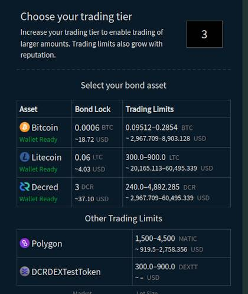
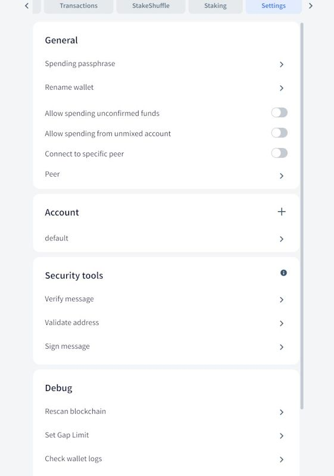
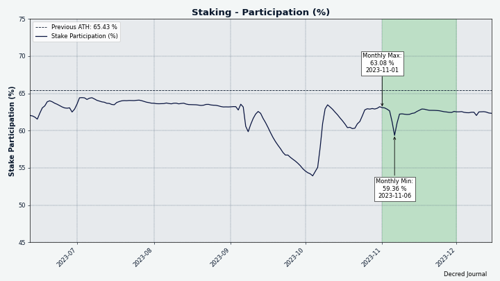
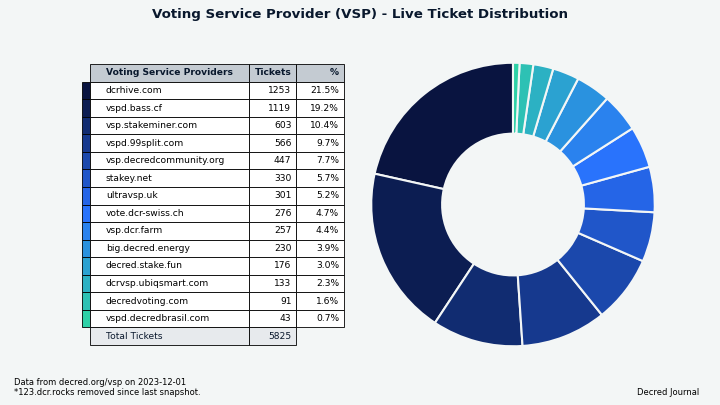
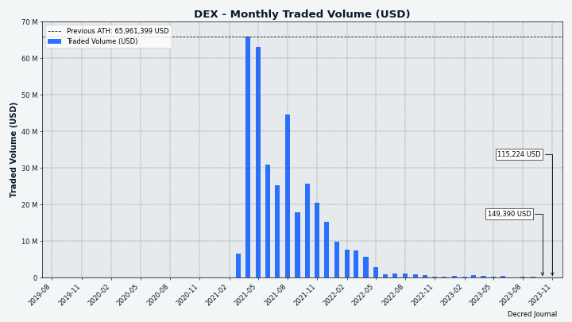

# مجلة ديكريد لشهر نوفمبر 2023

_الصورة: غلاف نوفمبر بواسطة @Exitus_

_كان الوقت تحديًا كبيرًا بالنسبة لي في ديسمبر ونحن نصدر هذا في وقت متأخر جدًا. نعتذر عن التأخير! \[@bee\]_

أبرز  ما جاء في شهر في نوفمبر:

- تم اقتراح تصميم شبكة شبكية مبتكرة كدليل على المفهوم لـمنصة المبادلات اللامركزية لديكريد.
- بدأ الاختبار الخاص لإصدارات أندرويد وiOS لتطبيق Cryptopower.
- تلقت الشبكة البرقية لديكريد تحديثًا ضخمًا لقاعدة الكود الأصلية lnd v0.13.
- تعرضت Poloniex و HTX للاختراق وعطلت سحب وحدات ديكريد لأسابيع. أعلنت Bittrex أنها ستغلق وحثت المستخدمين على السحب.

المحتويات:

- [التطوير](#development)
- [الأشخاص](#people)
- [الحوكمة والمالية](#governance-and-finances)
- [الشبكة](#network)
- [النظام البيئي](#ecosystem)
- [الإنتشار](#outreach)
- [الفعاليات](#events)
- [وسائل الإعلام](#media)
- [الأسواق](#markets)
- [الخارجية ذات الصلة](#relevant-external)

<a id="development" />

## التطوير

ما لم يُذكر خلاف ذلك، فإن العمل المَذْكُور هنا يشتمل على حالة "الدمج إلى الرئيسي". وهذا يعني أن العمل قد تم استكماله ومراجعته ودمجه في كود المصدر الذي يمكن للمستخدمين المتقدمين [بناءه وتشغيله](https://medium.com/@artikozel/the-decred-node-back-to-the-source-part-one-27d4576e7e1c)، ولكنه ليس متاحًا بعد في ثنائيات الإصدار للمستخدمين العاديين.

### dcrd

_[dcrd](https://github.com/decred/dcrd) هو تطبيق عقدة كامل يعمل على تشغيل شبكة ديكريد من نظير إلى نظير حول العالم._

تغييرات تخص المطورين والتحديثات الداخلية:

- [تم إصلاح خطأ](https://github.com/decred/dcrd/pull/3209) ظهر في [أكتوبر](202310.md#dcrd) مع القدرة الجديدة على التعامل مع [الرسائل المتزامنة](https://github.com/decred/dcrd/pull/3203) من النظراء. كانت dcrd تتوقف عن العمل إذا قام أحد النظراء بقطع الاتصال بعد إرسال عدة رسائل. يسمح هذا التصحيح بأن تستجيب dcrd بشكل لائق عندما يقطع النظراء الاتصال.
- تم تحديث [صورة Docker](https://github.com/decred/dcrd/pull/3210) للبناء باستخدام Go 1.21.4.
- يجب ألا يرسل النظراء لبعضهم البعض رسائل فارغة `nil`. في محاولة للعثور وتصحيح الحالات التي قد يحدث فيها ذلك مسبقًا، ستقوم dcrd الآن [بإظهار رسالة خطأ وإيقاف التشغيل إذا تم توجيه رسالة فارغة `nil`](https://github.com/decred/dcrd/pull/3213) (تعني "رسالة الخطأ" أن dcrd ستتوقف عن العمل وتنبه المستخدم بوجود مشكلة). يتضمن هذا التغيير تتبع الخطأ المفيد لإعلام المطورين بأي جزء من الكود تسبب في الخطأ.

قيد التطوير:

- تم اقتراح رسالة شبكة جديدة من شأنها تسريع مزامنة عملاء SPV من خلال السماح لـ dcrd بـ[إرسال فلاتر الكتل المدمجة في دفعات](https://github.com/decred/dcrd/issues/3206) بدلاً من واحدة لكل كتلة. تم تقديم [تنفيذ أولي](https://github.com/decred/dcrd/pull/3211) لمراجعة الكود.

تم إطلاق ديكريد [كتفرع](https://blog.companyzero.com/2015/12/decred-rethink-digital-currency/) من مشروع [btcsuite](https://blog.companyzero.com/2015/03/btcsuite-code-migration-and-btcd-0-10-0-release/). عند السؤال عن كيفية اختلاف كود dcrd على مر السنين، أجاب davecgh@:

> تحسنت dcrd *بشكل كبير* عن btcd. إنها حقًا مختلفة تمامًا. أنا لا أعني فقط في الطرق التي تتحسن بها DCR عن BTC. أعني في كل جانب تقريبًا. مثلاً، APBFs، كود الشبكة المحسن كثيرًا، الطريقة التي يتيح بها كود السلسلة معالجة الرؤوس أولاً، كيفية التعامل مع المزامنة بشكل عام، الدعم لإبطال الكتل وإعادة النظر فيها، الطريقة التي يتم بها التعامل مع النظراء ذوي السلاسل القديمة، تشفير أسرع بكثير، تحسين أوقات المزامنة بمقدار 50 ضعفًا (على الأقل)، إعادة كتابة شاملة للأساسيات الكامنة وراء البرمجيات النصية (مثل stdscript، stdaddr، دعم الإصدار السليم، إلخ)، والكثير غير ذلك. [davecgh@ في [2023-11-29](https://matrix.to/#/!zefvTnlxYHPKvJMThI:decred.org/$TTnbRmx8LDGfU-0-0phuCKMut55fcdt0sJpMqhU-Hhk)]

### dcrwallet

_[dcrwallet](https://github.com/decred/dcrwallet) هو خادم محفظة تستخدمه تطبيقات سطر الأوامر والمحفظة الرسومية._

تركز العديد من التغييرات التي تواجه المستخدمين هذا الشهر على تحسين [وضع التحقق البسيط من الدفع SPV](https://docs.decred.org/wallets/spv/)، وهو المكان الذي يمكن فيه للمحفظة أن تعمل دون الحاجة إلى تحميل سلسلة الكتل كاملةً. هذا خيار رائع للمحافظ ذات الأداء الأجهزة المحدود، خاصةً على الأجهزة المحمولة. يستخدم وضع التحقق البسيط من الدفع SPV في ديكريد [تقنيات التشفير المتقدمة](https://github.com/decred/dcps/blob/master/dcp-0005/dcp-0005.mediawiki#simplified-payment-verification-spv) لتمكين العملاء الخفيفين بمستوى عال من الأمن واللامركزية.

تحسينات في [مزامنة التحقق البسيط من الدفع SPV الأولية](https://github.com/decred/dcrwallet/issues/2289) - جزء من روتين بدء تشغيل محفظة التحقق البسيط من الدفع SPV عندما تلحق بالسلسلة:

- [التحقق من صعوبات الكتل](https://github.com/decred/dcrwallet/pull/2297) في وقت مبكر. هذا يعني أنه إذا خالفت أي كتل الإجماع على صعوبة إثبات العمل (PoW) أو إثبات الحصة (PoS)، يمكن للمحفظة تجاهل هذه الكتل في وقت مبكر والقيام بعمل أقل. هذا سيساعد على تسريع أوقات المزامنة. بالإضافة إلى ذلك، إذا تلقت المحفظة كتل تخالف إجماع الصعوبة، فسوف [تبلغ عنها في السجل](https://github.com/decred/dcrwallet/pull/2294).
- إجراء نمط ["جلب أي فلاتر مدمجة مفقودة"](https://github.com/decred/dcrwallet/pull/2298) مرة واحدة فقط. كان هذا يحدث عند الاتصال بكل قرين جديد، ولكن الآن يحتاج فقط إلى الحدوث مرة واحدة لكل عملية مزامنة، مما يقلل العمل المكرر. "الفلاتر المدمجة" أو "cfilters" هي طريقة فعالة لتتبع المعاملات في الكتل دون تحميل الكتلة بالكامل.
- [جلب رؤوس الكتل الجديدة والفلاتر المدمجة مرة واحدة](https://github.com/decred/dcrwallet/pull/2300) عند البدء بدلاً من جلب نفس الرؤوس من كل نظير. هذا يتجنب الجهد المكرر المهدر لكل نظير، ويقلل بشكل كبير من كمية الموارد (وحدة المعالجة المركزية، الذاكرة العشوائية، عرض النطاق الترددي، الروتينات) المستخدمة أثناء المزامنة الأولية.
- إجراء [اكتشاف الحساب/العنوان وإعادة مسح الكتل](https://github.com/decred/dcrwallet/pull/2301) مرة واحدة عند البدء بدلاً من بعد كل نظير جديد متصل. هذا يجعل الكود أسهل للفهم.
- [طلب cfilters لأفضل سلسلة فرعية فقط](https://github.com/decred/dcrwallet/pull/2302). هذا يتجنب الحاجة إلى القيام بعمل للسلاسل الفرعية التي ليست (ولن تصبح) السلسلة الرئيسية.
- [السماح لـ dcrwallet بجلب cfilters في دفعات أصغر](https://github.com/decred/dcrwallet/pull/2307). لن يحدث تغيير وظيفي بعد، ولكن هذا يجعل الكود جاهزًا للتحول إلى طلبات cfilter المجمعة بمجرد دعمها في dcrd. العمل في dcrd [جارٍ بالفعل](https://github.com/decred/dcrd/pull/3211).
- [جلب cfilters بالتوازي من عدة نظراء في وقت واحد](https://github.com/decred/dcrwallet/pull/2308). هذا يوزع الحمل على عدة نظراء، مما يجعل عملية المزامنة الأولية (في المتوسط) أسرع قليلاً بسبب استخدام موارد النظراء عن بُعد بشكل أقل.

تحسينات أخرى في وضع التحقق البسيط من الدفع SPV:

- القضاء على الحاجة إلى [حساب تكرار تجزئات الكتل](https://github.com/decred/dcrwallet/pull/2295). هذا يؤدي إلى تسريع وقت المزامنة وتقليل استخدام الذاكرة. أثناء تشغيل وضع التحقق البسيط من الدفع SPV، يتم تقليل الوقت المستغرق في حساب تجزئات الكتل بنسبة ~72%.
- عند الاتصال في وضع التحقق البسيط من الدفع SPV، [قطع الاتصال مع النظراء المتأخرين](https://github.com/decred/dcrwallet/pull/2299). أثناء المزامنة الأولية، قد يكون من المفيد الاتصال بقرين للحصول على مدى الكتل السابقة، ولكن قد يتجاوز هذا النظير المحفظة لاحقًا بسبب اكتشاف المحفظة لكتل أحدث من النظراء الآخرين. إذا لم يرسل نظير معين أي رؤوس بعد أن تلقت المحفظة عدة رؤوس أحدث، فهذا يعني على الأرجح أن هذا النظير المتأخر لديه اتصال ضعيف بالشبكة ويجب قطع الاتصال معه لصالح محاولة العثور على نظير أفضل.

تغييرات للمطورين والتغييرات الداخلية:

- إذا حاول المستخدم إنفاق مخرجات المعاملات غير المنفقة UTXO متعددة التواقيع التي يحتوي على واحد أو أكثر من [التواقيع غير الصالحة](https://github.com/decred/dcrwallet/pull/2274)، يجب الإشارة إلى أن المعاملة ليست جاهزة للإرسال، وإرجاع أخطاء التوقيع. هذه خطوة نحو تحسين تجربة المستخدم للمستخدمين المتقدمين والمطورين العاملين مع [التواقيع المتعددة](https://en.bitcoin.it/wiki/Multi-signature)، والتي ممكنة حاليًا ولكن لم تستخدم على نطاق واسع ولا [مطورة بشكل جيد](https://gist.github.com/norwnd/890ad642985f4e9e9f7b1dd243b21f9e) في Decred.
- تم إضافة [اختبارات وحدة](https://github.com/decred/dcrwallet/pull/2293) للتحقق من الإصدار الدلالي لحزمة `chain`.
- إعادة تنظيم الكود البرمجي.

### Decrediton

_[Decrediton](https://github.com/decred/decrediton) ديكريديتون هو تطبيق محفظة لسطح المكتب كامل الميزات مع ميزة التصويت مدمجة، وميزة الخلط ب StakeShuffle، والشبكة البرقية، والتداول على منصة المُبادلات اللامركزية DEX للديكريد، والمزيد. يتم تشغيلها مع سلسلة الكتل كاملة أو بدونها (وضع التحقق البسيط من الدفع SPV)._

تم الدمج في الفرع الرئيسي `master` نحو الإصدار القادم:

- تم التحديث إلى إلإصدار 26 ل [Electron v26](https://github.com/decred/decrediton/pull/3928) لتمكين الإدماج الجديد مع Ledger. تم ذلك من خلال تعقب تغيير طفيف في Electron v21.3.0 أدى إلى تعطل نافذة منصة المبادلات اللامركزية لديكريد DCRDEX، وإضافة [حل بديل](https://github.com/decred/dcrdex/pull/2596) له.
- [نسخة أحدث](https://www.electronjs.org/blog/electron-23-0) من Electron تعني أن نظامي التشغيل Windows 7/8/8.1 لن يدعما في إصدار Decrediton القادم. على أي حال، متحمسو أمن العملات الرقمية المشفرة لا يخزنون مفاتيحهم الخاصة على هذه الأنظمة غير الآمنة، أليس كذلك؟
- تم تحديث بعض الاعتماديات في Go والويب.
- تم إصلاح مشكلة [خطأ كلمة المرور الخاطئة](https://github.com/decred/decrediton/pull/3916) التي لم تظهر عند محاولة شراء تذاكر باستخدام كلمة مرور خاطئة.
- تم إصلاح عدم القدرة على إزالة مضيف النظير من حقل [SPV Connect](https://github.com/decred/decrediton/pull/3915) في الإعدادات.

### vspd

_[vspd](https://github.com/decred/vspd) هو برنامج خادم يستخدمه مزودو خدمات التصويت. يقوم مزود خدمات التصويت VSP بالتصويت نيابة عن مستخدميه على مدار الساعة طوال أيام الأسبوع ولا يمكنه سرقة الأموال._

التغييرات المدرجة في إصدار نوفمبر [v1.3.2](https://github.com/decred/vspd/releases/tag/release-v1.3.2):

- تمت إضافة منطق لإعادة محاولة [المعاملة الأصلية](https://github.com/decred/vspd/pull/455) لتذكرة البث إذا فشلت بسبب الإشارة إلى مخرجات غير معروفة. هناك فرصة جيدة لنشر المعاملات الأصلية المفقودة عبر الشبكة وظهورها في مخزن الذاكرة المحلي بعد بضع ثوانٍ.
- العودة إلى خوارزمية حساب رسوم موفر خدمة التصويت VSP [السابقة](https://github.com/decred/vspd/pull/454) التي لا تأخذ في الاعتبار تفعيل DCP-12. هذا يحل مشكلة تتمثل في فشل Decrediton في بعض الأحيان في دفع رسوم موفر خدمة التصويت VSP لأنها حسبت الرسوم بشكل مختلف عن الخادم.

### dcrpool

_[dcrpool](https://github.com/decred/dcrpool) هو برنامج خادم لتشغيل بركة تعدين Decred._

التغييرات التي تواجه المستخدم:

- تم إصلاح عدة أخطاء في [حساب رسوم الدفع](https://github.com/decred/dcrpool/pull/427) التي تسببت في دفع رسوم كبيرة جدًا في بعض الحالات. تم إعادة العمل على الاختبارات المرتبطة وتوسيعها لاختبار المزيد من الحالات.

إعادة الهيكلة الداخلية:

- إزالة التكرار والأخطاء المحتملة في [إغلاق القناة](https://github.com/decred/dcrpool/pull/422) من معالجات الإشعارات.
- تبسيط الكود الخاص بحساب [مدفوعات المكافآت](https://github.com/decred/dcrpool/pull/423).
- تحديث الاختبارات لاستخدام مبالغ DCR [أكثر واقعية](https://github.com/decred/dcrpool/pull/426).
- "إعادة تنظيم الكود" تعني إجراء تغييرات على الكود لا تضيف ميزات أو تصحح أخطاء، ولكنها تفكك الكود وتجعل من الأسهل العثور على الأخطاء وإصلاحها، وتسهل تغيير الكود في المستقبل.

### الشبكة البرقية

_[dcrlnd](https://github.com/decred/dcrlnd) هو برنامج عقدة الشبكة البرقية الخاصة بديكريد. تتيح الشبكة البرقية عمليات تحويل فورية بتكلفة منخفضة._

- تمت [مزامنة](https://github.com/decred/dcrlnd/pull/193) قاعدة كود dcrlnd مع التغييرات التي تم إجراؤها في [lnd](https://github.com/lightningnetwork/lnd) الأصلية بين الإصدار v0.12.1 و[v0.13.4](https://github.com/lightningnetwork/lnd/releases/tag/v0.13.4-beta) (الذي تم إصداره في نوفمبر 2021). تم نقل حوالي 140 من أصل 170 طلب سحب من الأصل، مما جلب 451 تعديل جديد، بما في ذلك حوالي اثني عشر تعديل محدد لديكريد لتكييف التغييرات الأصلية وتبسيط جهود النقل المستقبلية. يمكن العثور على قائمة كاملة بطلبات السحب المنقولة والمتجاهلة [هنا](https://github.com/decred/dcrlnd/blob/master/docs/upstream-prs.csv). تم توثيق جميع التغييرات البارزة في ملاحظات إصدار lnd: [v0.13.0](https://github.com/lightningnetwork/lnd/releases/tag/v0.13.0-beta)، [v0.13.1](https://github.com/lightningnetwork/lnd/releases/tag/v0.13.1-beta)، [v0.13.3](https://github.com/lightningnetwork/lnd/releases/tag/v0.13.3-beta)، و[v0.13.4](https://github.com/lightningnetwork/lnd/releases/tag/v0.13.4-beta). تم اختبار dcrlnd مع هذه التغييرات المطبقة في الإنتاج على بعض المراكز الرئيسية في الشبكة الرئيسية.
- تحديث عدة [مكتبات Go](https://github.com/decred/dcrlnd/pull/194).

يرجى ملاحظة أنه على الرغم من أن مخرجات Anchor أصبحت نوع القناة الافتراضية للبتكوين في إصدار lnd v0.13، إلا أنها [معطلة](https://matrix.to/#/!FRpxSOMVXBCUXtQsDk:decred.org/$xOjxggI8ida5REJTWq-90TIG_Wfj-FsjiNl3FH__hJA) على الشبكة البرقية الرئيسية لديكريد لتوفير حماية إضافية ضد الهجمات مثل ثغرة [تدوير الاستبدال](https://cointelegraph.com/news/bitcoin-core-developer-antoine-riard-steps-back-lightning-network-dilemma) التي تم الكشف عنها في أكتوبر 2023.

### DCRDEX

_[DCRDEX](https://github.com/decred/dcrdex) هي منصة مبادلات  غير إحتجازية، تحترم الخصوصية، للتداول بدون ثقة، مدعومة بعمليات التبادل الذرية._

التغييرات العامة على العميل:

- تعطيل زر [تقديم الطلب](https://github.com/decred/dcrdex/pull/2534) في حالات مختلفة مثل عدم كفاية الرصيد.
- نقل زر [تسجيل الخروج](https://github.com/decred/dcrdex/pull/2590) إلى نهاية قائمة الهامبرغر.
- تعديل [الألوان](https://github.com/decred/dcrdex/pull/2601): إضافة بعض التنوع في ألوان خلفية العناصر في كلا الوضعين الفاتح والداكن، إضافة شفافية خلفية خفيفة لإظهار قليلاً من الواجهة الخلفية للنافذة المنبثقة النشطة، تقليل لون الخلفية في الوضع الفاتح لاستخدام لون أبيض أكثر نعومة.
- إزالة تأثير [تغيير وزن الخط](https://github.com/decred/dcrdex/pull/2610) عند تحريك الماوس فوقه لأنه لم يظهر بشكل متسق على متصفحات مختلفة وإعدادات الخط.
- تغيير تدفق تسجيل الدخول لـ[عدم إجبار التسجيل على الخادم](https://github.com/decred/dcrdex/pull/2614). بعد تسجيل الدخول المحلي، سيتم تحويل المستخدم إلى صفحة المحافظ بدلاً من ذلك.
- إصلاح تحديث [لوحة الاستثمار](https://github.com/decred/dcrdex/pull/2586) بعد إنشاء المحفظة.
- إصلاح المطالبة بإنشاء [محافظ مفقودة](https://github.com/decred/dcrdex/pull/2577) في عرض الأسواق.

مستوى تداول الحساب، السندات، والسمعة:

- عرض المزيد من [بيانات السندات والسمعة](https://github.com/decred/dcrdex/pull/2575) في طرق التسجيل والإعدادات. عندما يدخل المستخدم رقم المستوى، ستظهر نموذج معاينة جديد يعرض المبلغ الذي سيتم قفله فعليًا للسندات، حدود التداول، ومكافئاتها بالدولار الأمريكي. كما سيظهر نموذج التداول في عرض الأسواق كم عدد القطع التي يمكن استخدامها للمستوى الحالي للتداول. تمت إضافة عدة نصوص مساعدة لشرح السندات، مستوى التداول، والعقوبات للسلوك السيئ.

روبوتات صانع السوق:

- تحديث واجهة مستخدم [إعدادات صانع السوق](https://github.com/decred/dcrdex/pull/2587) لتكون أكثر استجابة وشرح استراتيجيات الروبوت (هناك 5 استراتيجيات حاليًا).
- إضافة استراتيجية روبوت تجمع بين [صانع السوق والتحكيم البسيط](https://github.com/decred/dcrdex/pull/2530). بناءً على دفتر طلبات منصة المبادلات المركزية CEX، يضع الطلبات على دفتر طلبات منصة المبادلات اللامركزية DEX، وعندما يكون هناك تطابق على منصة المبادلات اللامركزية DEX، يتم تنفيذ الطلب المعاكس على منصة المبادلات المركزية CEX على الفور لتحقيق ربح.

ديكريد:

- تمت إضافة البنية التحتية العامة [لخلط الأموال](https://github.com/decred/dcrdex/pull/2478) وتنفيذ البتات ذات المستوى المنخفض لـ DCR (لا توجد واجهة مستخدم رسومية حتى الآن).

البتكوين:

- تخزين [سجل المعاملات](https://github.com/decred/dcrdex/pull/2550) لمحافظ التحقق البسيط من الدفع للبتكوين. على الرغم من أن تنفيذ محفظة التحقق البسيط من الدفع الأساسية ([Neutrino](https://github.com/lightninglabs/neutrino)) يخزن بالفعل بيانات المعاملات، إلا أن استخدام هذا التخزين يؤدي إلى كود غير موثوق ومربك. يؤدي تخزين المعاملات في قاعدة بيانات منفصلة إلى إصلاح هذه المشكلة ويفتح الباب أيضًا لمزيد من الدقة، مثل التمييز بين الإرسال العادي ومعاملات التبديل.

الزيكاش:

- استخراج كود Zcash في [تطبيق المحفظة الخاص به](https://github.com/decred/dcrdex/pull/2553). وهذا ضروري لفصله عن كود البتكوين، لأن محفظة Zcash مختلفة جدًا عن محفظة البتكوين. يسمح التغيير لمحافظ Zcash أن تكون محمية بشكل افتراضي ويحل بعض المشاكل الداخلية.

الإيثيريوم:

- عرض [عنوان عقد التوكن](https://github.com/decred/dcrdex/pull/2592) على واجهة المستخدم حتى يتأكد المستخدمون من أي توكن Ethereum أو Polygon يستخدمونه. على سبيل المثال، عنوان عقد ERC-20 لـ USDC هو [0xa0b8699...eb48](https://etherscan.io/token/0xa0b86991c6218b36c1d19d4a2e9eb0ce3606eb48).

التغييرات الداخلية وللمطورين:

- تحديث [اعتماديات الويب](https://github.com/decred/dcrdex/pull/2584) للعميل، والذي يصلح ثغرة أمنية حرجة في مترجم Babel.

قيد التطوير:

- تم تقديم تنفيذ تجريبي لشبكة شبكية للعبة تسمى [Tatanka](https://github.com/decred/dcrdex/pull/2602) للنقاش. هذا جزء من العمل نحو [اقتراح شبكة DCRDEX الشبكية](https://proposals.decred.org/record/4d2324b) الذي تمت الموافقة عليه في يونيو 2023. يُنصح القراء بمشاهدة [فيديو قصير](https://www.youtube.com/watch?v=uZRTLpXXlds) لفهم ماهية Tatanka بالفعل (جرب [Invidious](https://redirect.invidious.io/watch?v=uZRTLpXXlds) إذا كان الفيديو مقيدًا في موقعك).
- تم تقديم تنفيذ [المقايضات الذرية الخاصة](https://github.com/decred/atomicswap/pull/130) باستخدام توقيعات Schnorr المكيفة للمراجعة إلى مستودع atomicswap. تترك طريقة المقايضات الذرية المستخدمة حاليًا من قبل منصة المبادلات اللامركزية لديكريد DCRDEX نفس القيمة الفريدة على كلا السلسلتين، مما يسمح لأي شخص بربط معاملات البائع والمشتري. تسمح توقيعات المحول بإصلاح هذه الثغرة الأمنية مقابل بعض الاتصالات خارج السلسلة الإضافية المطلوبة بين الأطراف. لاحظ أن `atomicswap` هو أداة سطر أوامر منفصلة عن مشروع منصة المبادلات اللامركزية لديكريد DCRDEX، ولكن يمكن تطبيق الكود المبتكر فيه على منصة المبادلات اللامركزية لديكريد DCRDEX أيضًا.

_الصورة: واجهة المستخدم لإعدادات صانع السوق في منصة المبادلات اللامركزية لديكريد_

_الصورة: ستعرض منصة المبادلات اللامركزية لديكريد بشكل أفضل حسابات السندات وحدود التداول_

_الصورة: تحسين معلومات السندات في إعدادات منصة المبادلات اللامركزية لديكريد DCRDEX_

### Cryptopower

_[Cryptopower](https://github.com/crypto-power/cryptopower) هي محفظة واجهة مستخدم رسومية لسطح المكتب متعددة العملات لـ DCR وBTC وLTC. تعمل في وضع التحقق البسيط من الدفع SPV الخفيف الذي يحافظ على الخصوصية دون الحاجة إلى سلاسل كتل كاملة، وتدعم تحصيص ديكريد، الخلط، التصويت، وميزات فريدة أخرى._

تنفيذ تصميم الصفحات الفرعية الرئيسية ذات المستوى الأعلى:

- تنفيذ علامة تبويب [المعاملات الجديدة](https://github.com/crypto-power/cryptopower/pull/198) التي تعرض جميع المعاملات عبر جميع المحافظ مع مرشحات اختيارية حسب المحفظة ونوع المعاملة.
- الانتقال إلى [تفاصيل المعاملة](https://github.com/crypto-power/cryptopower/pull/258) عند النقر على معاملة في النظرة العامة.
- الانتقال إلى [تفاصيل الاقتراح](https://github.com/crypto-power/cryptopower/pull/272) عند النقر على اقتراح في النظرة العامة.
- إخفاء زر [إرسال](https://github.com/crypto-power/cryptopower/pull/302) للمحافظ التي تعمل بنظام المراقبة فقط.

تنفيذ التصميم لصفحات المحافظ الفرعية:

- إضافة بطاقات جديدة إلى صفحة [معلومات المحفظة](https://github.com/crypto-power/cryptopower/pull/247) لعرض حالة الخلاط، المعاملات الأخيرة، والنشاط الأخير في التحصيص.
- تنفيذ تصميم جديد لصفحة [إعدادات المحفظة](https://github.com/crypto-power/cryptopower/pull/228).
- تحديث تصميم أقسام صفحة [التحصيص](https://github.com/crypto-power/cryptopower/pull/244) للمحفظة: معلومات التحصيص العامة، الإحصائيات، والتذاكر.

التكيف مع الأجهزة المحمولة:

- تكييف صفحة [اختيار المحفظة](https://github.com/crypto-power/cryptopower/pull/226) مع تصميم الأجهزة المحمولة.

تحويل العملات:

- إضافة دعم منخفض المستوى لـ[Trocador.app](https://github.com/crypto-power/instantswap/pull/7) في مكتبة [instantswap](https://github.com/crypto-power/instantswap).

الإصلاحات:

- تم إصلاح عرض خلفيات بطاقات العملات في تبويب [النظرة العامة](https://github.com/crypto-power/cryptopower/pull/236).
- تم إصلاح ظهور صفحات التوجيه خلال [إغلاق التطبيق](https://github.com/crypto-power/cryptopower/pull/259).
- تم إصلاح تعطل التطبيق عند التبديل بين تبويبات [المحافظ والنظرة العامة](https://github.com/crypto-power/cryptopower/pull/263).
- إصلاحات طفيفة.

التغييرات الداخلية وللمطورين:

- إعادة تنظيم الكود لتبسيط [واجهات البرمجة الداخلية](https://github.com/crypto-power/cryptopower/pull/232)، تحسين [استخدام الذاكرة](https://github.com/crypto-power/cryptopower/pull/223)، وإزالة الكود غير الضروري.
- إزالة الكثير من [كود المساعد للمستمع](https://github.com/crypto-power/cryptopower/pull/240) غير الضروري.
- إزالة التكرار في [حساب عرض التطبيق](https://github.com/crypto-power/cryptopower/pull/274).
- إصلاح [أخطاء المدقق اللغوي](https://github.com/crypto-power/cryptopower/pull/241) وتحديث تكوين CI.

تم إعداد الاختبار الخاص لإصدارات التطبيقات المحمولة في متجر Google Play ومتجر Apple (TestFlight). إذا كنت ترغب في المشاركة، يرجى السؤال في دردشة Matrix [#cryptopower](https://chat.decred.org/#/room/#cryptopower:decred.org) (انظر [كيفية الانضمام إلى Matrix](https://docs.decred.org/getting-started/joining-matrix-channels/)).

تابعوا [@cryptopowerWlt](https://twitter.com/cryptopowerWlt) على التويتر لدعم المشروع والحصول على مزيد من التحديثات.

_الصورة: تبويب النظرة العامة في Cryptopower_

_الصورة: الإعدادات المحدثة في Cryptopower_

_الصورة: نظرة عامة محدثة على المحفظة في Cryptopower_

_الصورة: تصميم الهاتف المحمول في Cryptopower (قيد التطوير)_

### الوثائق

_[dcrdocs](https://github.com/decred/dcrdocs) هو الكود المصدري [لوثائق المستخدم](https://docs.decred.org/) الخاصة بديكريد._

- تحديث أرقام [تقسيم مكافآت الكتل وإجمالي الإصدار](https://github.com/decred/dcrdocs/pull/1234) على بعض الصفحات.
- تصحيح تاريخ [نشر مقترح تغيير ديكريد DCP-12](https://github.com/decred/dcrdocs/pull/1233).

### مُرحِّل البيسون

_[مُرحِّل البيسون](https://github.com/companyzero/bisonrelay) هو منصة جديدة لوسائل التواصل الاجتماعي تتميز بحمايات قوية ضد الرقابة والمراقبة والإعلانات، مدعومة بالشبكة البرقية لديكريد._

تم دمج الأعمال المذكورة أدناه إلى الفرع الرئيسي `master` استعدادًا للإصدار التالي.

التغييرات في كل من التطبيقات الرسومية والنصية:

- تصفية [المحتوى غير المرغوب فيه](https://github.com/companyzero/bisonrelay/pull/377) عند قراءة سجل الدردشة المحفوظ. كانت عملية تصفية المحتوى تتعامل مع الرسائل الواردة الجديدة فقط في السابق.
- استبدال Bittrex بـ MEXC كمصدر لـ [أسعار الصرف](https://github.com/companyzero/bisonrelay/pull/383).

التغييرات التي تواجه المستخدم في التطبيق الرسومي:

- السماح[بتحديد النص](https://github.com/companyzero/bisonrelay/pull/379) في خلاصة الأخبار والمنشورات.
- إصلاح مشكلة عدم ظهور دردشة المجموعة [المنشأة حديثًا](https://github.com/companyzero/bisonrelay/pull/376) في غرف الدردشة.

تكييف التطبيق الرسومي مع الأجهزة المحمولة:

- العديد من [الإصلاحات المتعلقة بالأجهزة المحمولة وتحسينات تجربة المستخدم](https://github.com/companyzero/bisonrelay/pull/375)، بما في ذلك: استبدال زر القائمة بزر الرجوع في بعض الصفحات، تعديلات في حجم الخط، تعديلات في عملية التعريف، إصلاحات الفائض، وإصلاحات بناء التطبيق لنظام أندرويد.
- زيادة [المسافات](https://github.com/companyzero/bisonrelay/pull/378) في الدردشات استنادًا إلى تعليقات المستخدمين.

التغييرات الداخلية في التطبيق الرسومي:

- توحيد [إعلانات حجم الخط](https://github.com/companyzero/bisonrelay/pull/346) واستخداماتها للتناسق والتحكم الأكبر في الخطوط بناءً على نظام التشغيل أو المنصة التي يعمل عليها التطبيق.

قيد التطوير:

- أبلغ المستخدمون عن مختلف [مشاكل قنوات الشبكة البرقية](https://matrix.to/#/!GHnoHXSgkVAsUknRUg:decred.org/$nOaRAKaygrxyyvZkPzJ4jGr5S0MsC7FGYS0iPFRG7pc) عند التفاعل مع الروبوت Oprah. تم العثور على سبب جذري لبعضها في dcrlnd ويجري العمل عليه.

أخبار أخرى:

- تم نشر أرشيف مجلة ديكريد الآن على مُرحِّل البيسون. تواصلوا مع karamble@ للحصول على تعليمات الاستخدام.

### إدماج محفظة Cake

الأعمال المكتملة المدمجة في [شجرة الإدماج المتوسطة](https://github.com/JoeGruffins/cake_wallet/tree/cw-decred):

- تم إضافة [بنية أساسية لـ libwallet](https://github.com/JoeGruffins/cake_wallet/pull/4) للمضي قدمًا مع الكود ذو المستوى الأعلى في حين يتم كتابة libwallet الحقيقية. أيضًا تم إزالة الكثير من الكود غير الضروري المتبقي من التجارب السابقة.
- استمرار التحقيق في أفضل الطرق لاستدعاء كود ديكريد المكتوب بلغة Go من كود Cake ذو المستوى العالي المكتوب بلغة Dart/Flutter.
- ثلاثة مطورين قاموا بتكوين بيئات البناء وحصلوا على إصدارات عاملة من محفظة Cake تعرض واجهات ديكريد الوهمية على iOS وAndroid وmacOS. يعد هذا الإنجاز ملحوظًا بالنظر إلى مدى تعقيد وإرباك عملية البناء.

الأعمال قيد التطوير لمحفظة Cake:

- تم تقديم أول تغيير يضيف [واجهات ديكريد الأولية](https://github.com/cake-tech/cake_wallet/pull/1165) إلى فرع التكامل في المستودع الرئيسي المسمى `decred_main`. سيتم اختبار وتلميع كود ديكريد العامل في هذا الفرع قبل إضافته إلى الفرع الرئيسي `main` لمحفظة Cake.
- دمج [libwallet](https://github.com/JoeGruffins/cake_wallet/pull/8) المبني كمكتبة C، بما في ذلك أي كود لاصق ضروري بلغات Kotlin وSwift، وكود البناء لأنظمة التشغيل والمعماريات المختلفة لوحدة المعالجة المركزية.
- سكربتات ودليل لبناء محفظة Cake [على macOS](https://github.com/cake-tech/cake_wallet/pull/1163). يوثق هذا المعرفة المفقودة لعملية البناء المعقدة التي كان من الصعب اكتشافها.

الأعمال المدمجة لـ [libwallet](https://github.com/itswisdomagain/libwallet):

- تنفيذ [الوظائف الأساسية](https://github.com/itswisdomagain/libwallet/pull/1) لمحافظ DCR، BTC و LTC، بما في ذلك: إنشاء محفظة، إنشاء محفظة مراقبة فقط، فتح المحفظة، بدء/إيقاف مزامنة المحفظة، تعيين تاريخ بدء المحفظة. يقترض هذا بعض الكود والأفكار من منصة المبادلات اللامركزية لديكريد  DCRDEX و Cryptopower، ويبني على مشاريع العملات الرقمية المشفرة الحالية المكتوبة بلغة Go، بما في ذلك: [ديكريد](https://github.com/decred)، [btcsuite](https://github.com/btcsuite)، [ltcsuite](https://github.com/ltcsuite)، [Neutrino](https://github.com/lightninglabs/neutrino) لـ BTC و [نسخة Neutrino المعدلة](https://github.com/ltcsuite/neutrino) لـ LTC (بالإضافة إلى [تعديلات](https://github.com/dcrlabs/neutrino-ltc) من مطوري DCRDEX).
- تنفيذ التخزين لحفظ [تكوين المحفظة وبيانات المعاملات](https://github.com/itswisdomagain/libwallet/pull/3).

الأعمال قيد التطوير لـ libwallet:

- طبقة واجهة برمجة التطبيقات لبناء libwallet كـ[مكتبة C](https://github.com/itswisdomagain/libwallet/pull/2) يمكن استدعاؤها من كود التطبيق المتقدم لـ Cake Wallet.
- حزمة لإدارة [مزامنة المحفظة](https://github.com/itswisdomagain/libwallet/pull/4) والإبلاغ عن تقدم المزامنة لمحافظ DCR، BTC و LTC.

libwallet هي مكتبة متعددة العملات تنفذ محافظ خفيفة (SPV) لديكريد و البتكوين و اللايتكوين. تم إنشاؤها في الأصل لدمج ديكريد في محفظة Cake، لكن لديها الإمكانية لتصبح منصة لبناء برامج ديكريد والعملات المتعددة. سيكون التطبيق الثاني الذي يستخدم libwallet على الأرجح هو محفظة Cryptopower. سيكون هذا مشابهًا لكيفية مشاركة [dcrlibwallet](https://github.com/planetdecred/dcrlibwallet) الآن المتوقف بواسطة GoDCR وتطبيقات ديكريد على Android/iOS، ولكنه سيدعم المزيد من الأصول غير ديكريد فقط. سيتم قريبًا إضافة طبقة التوافق مع C والتي ستسمح باستخدام libwallet من أي لغة برمجة يمكنها استدعاء كود C، مما يسهل دمج Decred في مجموعة واسعة من برامج العملات الرقمية المشفرة الحالية والجديدة (كان هذا أحد أهداف جهود [TinyDecred v2](https206.md#tinywallet)).

تطبيقات المحافظ المبنية على libwallet ستكون أكثر خصوصية مقارنة بالعديد من التطبيقات الموجودة في السوق، حيث من الشائع استخدام خوادم مركزية يمكنها تتبع أموال المستخدمين. للأسف، محفظة البتكوين الخاصة بـ Cake هي واحدة من هذه الحالات لأنها تعتمد على [خادم Electrum الخاص بها](https://github.com/cake-tech/cake_wallet/blob/3760285a64405935fafe7aeeb051fd25d850585b/assets/bitcoin_electrum_server_list.yml) والذي [ليس جيدًا للخصوصية](https://electrum.readthedocs.io/en/latest/faq.html). تستخدم libwallet [dcrwallet](https://github.com/decred/dcrwallet) لـ Decred و [Neutrino](https://github.com/lightninglabs/neutrino) لـ Bitcoin، والتي تتصل مباشرة بعقد كاملة وتجلب البيانات بشكل خاص دون الكشف عن الأموال والمعاملات المملوكة.

### مسائل أخرى

- تم تقديم ترجمة واجهة المستخدم لـ [timestamply.org](https://timestamply.org/) إلى اللغة العربية [للمراجعة](https://github.com/decred/dcrtimegui/pull/157) البرمجية.

## الأشخاص

مرحبًا بالمساهمين الجدد لأول مرة:

- Philip-21@ (مطور، [dcrwallet](https://github.com/decred/dcrwallet/pull/2293))

إحصائيات المجتمع حتى 3 ديسمبر (مقارنةً بـ 2 نوفمبر):

- متابعو [تويتر](https://twitter.com/decredproject): 53,939 (+464)
- مشتركو [ريديت](https://www.reddit.com/r/decred/): 12,773 (+11)
- أعضاء #general في [ماتريكس](https://chat.decred.org/): 833 (+7)
- أعضاء [ديسكورد](https://discord.gg/GJ2GXfz): 1,862 (+24), المتحققون للنشر: 769 (+7)
- أعضاء [تيليجرام](https://t.me/Decred): 2,319 (+22)
- مشتركو [يوتيوب](https://www.youtube.com/decredchannel): 4,660 (+20), المشاهدات: 244.7K (+2.3K)

## الحوكمة والمالية

في نوفمبر، استقبلت [الخزينة](https://dcrdata.decred.org/treasury) الجديدة 7,060 DCR بقيمة 101 ألف دولار بمعدل متوسط في نوفمبر 14.35 دولار لكل DCR. تم إنفاق 8,471 DCR لدفع مستحقات المقاولين، بقيمة 122 ألف دولار بنفس المعدل.

تمت الموافقة على [معاملة إنفاق الخزينة](https://dcrdata.decred.org/tx/ca24ed5e5d4819ca68b270a78345be07d5a18890b83ada366e970807425e8bfc) بـ 7,346 صوتاً بنعم ونسبة مشاركة 57%، وتم تعدينها في 21 نوفمبر. كان لديها 50 مخرجاً لدفع مستحقات المتعاقدين، تتراوح من 3 DCR إلى 1,411 DCR. من المحتمل أن معظم هذه الـ DCR تم دفعها مقابل العمل في سبتمبر وبعضها في أكتوبر. باستخدام معدل صرف تقديري للفواتير لشهرين بـ 12.98 دولار، فإن المبلغ المفوتر في هذه المعاملة يبلغ حوالي 110 ألف دولار.

من الاعتبارات المتعلقة بتوقيت وهيكلة مدفوعات الخزانة للمتعاقدين خلال هذه الأشهر هو البقاء ضمن الحد الأقصى 150% من التدفقات الشهرية كما يحدده  اقتراح تغيير ديكريد [DCP-7](https://github.com/decred/dcps/blob/master/dcp-0007/dcp-0007.mediawiki). يعني انخفاض سعر صرف DCR/USD وتناقص منحة مكافأة الكتلة مع مرور الوقت أن الوصول إلى الحد أصبح مصدر قلق واقعي لأول مرة، خاصةً إذا كان هناك تراكم لفواتير قديمة غير مدفوعة. في هذه الحالة، تم إرسال الفواتير التي تم تقديمها بالفعل لشهر أكتوبر للدفع في نفس الوقت مع فواتير سبتمبر بدلاً من الانتظار لشهر آخر، وهو ما كان سيكون أكثر شيوعًا.

اعتبارًا من 1 ديسمبر، بلغ الرصيد المجمع [للخزينة القديمة](https://dcrdata.decred.org/address/Dcur2mcGjmENx4DhNqDctW5wJCVyT3Qeqkx) و[الخزينة الجديدة](https://dcrdata.decred.org/treasury) 871,828 DCR (12.5 مليون دولار أمريكي بسعر 14.39 دولار).

_الصورة: تدفقات الخزينة الداخلة والخارجة بالـ DCR_

_الصورة: الرصيد الشهري للخزانة بالدولار الأمريكي؛ لاحظ أنه يعتمد بشكل كبير على سعر الصرف_

لم يتم [تقديم](https://proposals.decred.org/?tab=under%20review) أو [الموافقة](https://proposals.decred.org/?tab=approved) أو [رفض](https://proposals.decred.org/?tab=rejected) أي مقترحات على بوليتيا في نوفمبر.

تم [الإبلاغ](https://matrix.to/#/!xUNvyzkFgiMjhvPbIi:decred.org/$LluGF4EWaQrEEb8lKRKyBRxeQxSqpjWPK8GOSVUA4zU) في 23 نوفمبر أن أحد المستخدمين لم يتمكن من التسجيل وتقديم مقترح. يبدو أن بوليتيا [لم تكتشف](https://matrix.to/#/!qYpAAClAYrHaUIGkLs:decred.org/$jmqFcgH8De7TuG2Z9FofSxeBfcYPWn5KMjcG-V6d0bk) دفع رسوم التسجيل. وحتى 1 ديسمبر، لم يتم حل هذه المشكلة.

### التحصيص

تراوح سعر [التذكرة](https://dcrdata.decred.org/charts?chart=ticket-price&axis=time&visibility=true-true&mode=stepped) بين 224-324 DCR.

_الصورة: استقرار سعر التذكرة بسرعة_

بلغت [الكمية المقفلة](https://dcrdata.decred.org/charts?chart=ticket-pool-value&scale=linear&bin=day&axis=time) 9.27-9.85 مليون DCR، مما يعني أن 59.4-63.1% من العرض المتاح [شارك](https://dcrdata.decred.org/charts?chart=stake-participation&scale=linear&bin=day&axis=time) في التحصيص.

_الصورة: وحدات ديكريد المقفلة في التذاكر تظل قريبة من أعلى مستوى لها_

_الصورة: بين أشياء أخرى، تظهر نسبة وحدات ديكريد المحصصة بطريقة غير مباشرة مقدار الانبعاثات الجديدة المعاد تحصيصها_

### التحصيص بواسطة مزود خدمة التحصيص

إجمالاً، قام [14 موفر خدمة التصويت مدرجة](https://decred.org/vsp/) بإدارة حوالي 5,850 (-1,350) تذكرة مباشرة، والتي كانت تمثل 14.3% (-2.5%) من مجموع التذاكر في الشبكة اعتباراً من 1 ديسمبر. ملاحظة: هذه الأرقام لا تشمل حوالي 400 تذكرة تم إدارتها بواسطة [123.dcr.rocks](https://123.dcr.rocks/) التي تم إلغاء إدراجها بسبب الإغلاق.

كان [99split.com](https://vspd.99split.com) هو الوحيد الذي حقق زيادة في نوفمبر (+136 تذكرة أو +32%)، بينما شهدت الـ 13 VSP الأخرى تدفقات خارجة من التذاكر.

_الصورة: توزيع التذاكر التي يديرها موفرو خدمة التصويت_

!إنخفض من جديد عدد الأضوات المفوتة](../img/202311.17.720.png)

_الصورة: إنخفض من جديد عدد الأضوات المفوتة_

### العُقد

رصد [مُخطِط ديكريد](https://nodes.jholdstock.uk/user_agents) ما بين 150 و 158 عقدة dcrd طوال الشهر. تمت مشاهدة إصدارات 147 عقدة  في 1 ديسمبر:  النسخة 1.8.0 - 67%، النسخة 1.8.1 - 23%، النسخة 1.9.0 لبناءات التطوير - 3%، النسخة 1.7.x - 2%، النسخة 1.8.0 - 0.7%  وأخرى - 3%.

_الصورة: تم تحديث العقد إلى النسخة 1.8.1. تشير المنطقة الحمراء قبل يناير 2023 إلى بيانات غير كاملة كانت لدينا في ذلك الوقت._

### StakeShuffle

تراوحت نسبة [العملات المخلوطة](https://dcrdata.decred.org/charts?chart=coin-supply&zoom=jz3q237o-la8vk000&scale=linear&bin=day&axis=time&visibility=true-true-true) بين 62.1-62.3%. تراوح حجم [الخلط اليومي](https://dcrdata.decred.org/charts?chart=privacy-participation&bin=day&axis=time) بين 0-1,032 ألف DCR.

_الصورة: الانخفاض الكبير الثاني والتعافي في خلط DCR اليومي_

_الصورة: يفضل أكثر من 62% من العرض المتداول الخصوصية_
### الشبكة البرقية

رصد [مستكشف الشبكة البرقية](https://ln-map.jholdstock.uk/) لديكريد 220 عقدة (+0)، و420 قناة (-28) بإجمالي سعة 206 DCR (+3)، حتى 3 ديسمبر (مقارنةً بـ 1 نوفمبر).

_الصورة: أُغلقت بعض قنوات الشبكة البرقية_

_الصورة: ظل عدد عقد الشبكة البرقية  ثابتًا بينما زادت السعة قليلاً_

شكرًا لـ bochinchero@ على توفير وتحسين هذه الرسوم البيانية. حوالي 40 رسمًا بيانيًا آخر غير مستخدم في هذا العدد من مجلة ديكريد متاح في مستودع [dcrsnapshots](https://github.com/bochinchero/dcrsnapshots)؛ يُرحب بالجميع لمشاركتها على وسائل التواصل الاجتماعي.

## النظام البيئي

### مقدمو خدمات التصويت

- صدرت النسخة [v1.3.2 من vspd](https://github.com/decred/vspd/releases/tag/release-v1.3.2) مع إصلاحات يجب أن تحل مشاكل أخطاء حالة التذكرة وفشل دفع رسوم مقدم خدمات التصويت. قام 9 من أصل 14 مقدمو خدمات التصويت بتطبيق هذه الإصلاحات حتى الأول من ديسمبر.

- تم [تحديث](https://github.com/decred/dcrweb/pull/1148) صفحة [قائمة مقدمو خدمات التصويت](https://decred.org/vsp/) لعرض إحصائيات التذاكر المفقودة لكل الأوقات. حتى لقطة الأول من ديسمبر، أفاد 14 مقدم خدمات التصويت نشط تتراوح أعمارها بين 6 أشهر و3 سنوات بإجمالي 1,108 تذاكر ملغاة، منها 1,101 انتهت صلاحيتها [بشكل طبيعي](https://docs.decred.org/proof-of-stake/overview/) و7 فقط فوتت أصواتهم. يظهر العدد المنخفض للتذاكر المفوتة أن تطبيقات vspd أكثر موثوقية مقارنة بـ [dcrstakepool](https://github.com/decred/dcrstakepool) القديم الذي كان لديه معدلات تفويت أعلى. ملاحظة: تم استثناء [bass.cf](https://vspd.bass.cf/) من هذه الأرقام لأنه لم يتم تحديثه بعد للإبلاغ عن التذاكر المفوتة.

### مجمعات التعدين

- تم فتح [decred.miningandco.com](https://decred.miningandco.com/) [للعموم](https://matrix.to/#/!TSpuyuYWgkTrgPTcXh:decred.org/$H4QA2fDpl1OO6jLnJa6PTAHiEPPSYQYSlomhYzWLrb8). أعلنا عن ذلك في [أكتوبر](202310.md#ecosystem) لكننا فاتنا أنه كان مجمعًا خاصًا في البداية. تشمل المعدنين المدعومين المعدن الرسمي [gominer](https://github.com/decred/gominer) لنظام ويندوز و[ثنائيات مخصصة](https://github.com/Gddrig/gominer/releases) لـ gominer للينكس وHiveOS. لا يشمل [مستودع GitHub](https://github.com/Gddrig/gominer) الكود المصدري الذي يستضيف تلك الثنائيات بعد، لذااستخدمه بحذر.

### خدمات التحصيص

- أفاد [BisonPool](https://twitter.com/BisonPool) [أنه](https://twitter.com/BisonPool/status/1724110111503728738) مع تفعيل DCP-10 ارتفعت الأرباح من ~2.8%/سنويًا إلى ~7.8%/سنويًا، والآن مع DCP-12 ارتفعت إلى ~8.6%/سنويًا. العوائد الحالية معروضة على [الصفحة الرئيسية](https://bisonpool.org/)، لكن لاحظ أنها ليست ثابتة وتعتمد على أسعار التذاكر. تم [إطلاق](https://www.reddit.com/r/decred/comments/vyydm1/bisonpool_is_now_live/) BisonPool في يوليو 2022 من قبل اثنين من المتحمسين لأمن تكنولوجيا المعلومات الذين شاركوا بشكل مجهول في ديكريد منذ 2018. تتيح الخدمة التحصيص وكسب المكافآت بأقل من تذكرة كاملة. تذكر أنها خدمة حفظ تأخذ السيطرة الكاملة على أموال المستخدمين.

### منصات التداول

- تعرضت [Poloniex](https://poloniex.com/) للاختراق في 10 نوفمبر مما أسفر عن خسائر تقدر بـ 118 مليون دولار من أصول الإيثيريوم وأصول ترون وBTC. نظرًا لعدم ذكر DCR من قبل [Poloniex](https://twitter.com/Poloniex/status/1722956238160536049)، [جاستن صن](https://twitter.com/justinsuntron/status/1722942733680296246)، أو تغريدة [Lookonchain](https://twitter.com/lookonchain/status/1722969227915661531) حول الأصول المسروقة، فإنه لا يُعرف ما إذا كان قد تم سرقة أي وحدات ديكريد خلال الاختراق. ومع ذلك، تأثر مستخدمو DCR بتعليق جميع عمليات السحب. لاحظ باحثو السلسلة في نادي #trading أن معاملة تقريبًا 60 ألف DCR تم إرسالها من عنوان [Poloniex](https://dcrdata.decred.org/address/DsTSdjhiCY1z8AeQGWYJ5ryJKRA3eSBGRTj) إلى [Binance](https://dcrdata.decred.org/address/DsSJDWwDZtxjFvh7xvTzkENAtNZEeZsQgG8) بعد حوالي 12 ساعة من الإعلان عن الاختراق وحوالي 7 ساعات بعد أن قيل أن Poloniex [تم استعادتها](https://twitter.com/justinsuntron/status/1723009018086527126). هناك تكهنات بأنها قد تكون إما Poloniex تحمي الأموال المتبقية أو القراصنة يسييلونها في Binance.
- كانت استجابة Poloniex للاختراق بطيئة. استؤنف التداول [في اليوم التالي](https://support.poloniex.com/hc/en-us/articles/18996694952983)، ولكن لم تتم تمكين عمليات السحب حتى 30 نوفمبر وظل حساب [الدعم](https://twitter.com/PoloSupport) على تويتر صامتًا. في الوقت نفسه، لم يكن هناك نقص في الترويج أو الإعلانات أو حتى تغريدات إدراج العملات. نتيجة لتوقف عمليات السحب وعدم عمل التحويلات بين المنصات، انخفض سعر DCR بشكل كبير مقارنة بالأسواق الأخرى.
- تعرضت منصة [HTX](https://www.htx.com/) (المعروفة سابقًا باسم Huobi) وHECO Chain Bridge لخسائر تقدر بحوالي 117 مليون دولار من الأصول بسبب اختراق المحفظة الساخنة حسب [المقال الرسمي للدعم](https://www.htx.com/support/en-us/detail/104954980569005) و[PeckShield](https://twitter.com/PeckShieldAlert/status/1727290028064436539). وعد [جاستن صن](https://twitter.com/justinsuntron/status/1727304656622326180) و[HTX](https://www.htx.com/support/en-us/detail/104954980569005) بتعويض المستخدمين بالكامل عن الخسائر. لم يتم ذكر DCR كأصل مسروق ومن المحتمل أنه لم يتم دمجها في HECO Chain Bridge. ومع ذلك، تأثر مستخدمو DCR بتعليق جميع عمليات السحب.
- كانت استجابة HTX للاختراق أسرع مقارنةً بـ Poloniex. بحلول 30 نوفمبر، تم استعادة عمليات السحب لـ BTC وETH وTRX وحوالي مئة أصل آخر (بما في ذلك USDT وUSDC)، لكن بناءً على التحديثات الرسمية وهبوط DCR/USDT على HTX، لم تكن DCR محظوظة بنفس القدر.
- أعلنت [Bittrex Global](https://bittrexglobal.com/) عن [إيقاف العمليات](https://twitter.com/BittrexGlobal/status/1726652430673121310). سينتهي كل نشاط تداول بحلول 4 ديسمبر، ومن ثم سيتمكن العملاء فقط من السحب. سيتم [تحويل أي دولار أمريكي متبقي إلى USDT تلقائيًا](https://twitter.com/BittrexGlobal/status/1729897531448987831). كان عامًا سيئًا لـ Bittrex: غرامات بقيمة [29 مليون دولار](https://www.reuters.com/business/finance/crypto-exchange-bittrex-fined-53-mln-by-us-treasury-dept-2022-10-11/) في أكتوبر 2022، وضرورة إيقاف [العمليات الأمريكية](202303.md#ecosystem) في مارس 2023 بسبب بيئة تنظيمية واقتصادية غير مرحب بها، و[تهم من قبل لجنة الأوراق المالية والبورصات الأمريكية](202304.md#relevant-external) في أبريل بسبب انتهاكات الأوراق المالية، وتقديم طلب [إفلاس](202305.md#ecosystem) في مايو.
- تم تعليق عمليات سحب الـ DCR من Bittrex لمدة 9 أيام (حسب [هذا العنوان](https://dcrdata.decred.org/address/DsbvnccsFTAP7FQV7g3SgGfyoXNcPL2Y1fm))، ونتيجة لذلك انخفض سعر الـ DCR واستغل بعض المتداولين الذكيين الفرصة لشرائه بأسعار منخفضة تصل إلى 5 دولارات. استؤنفت عمليات السحب في 29 نوفمبر، و[أفاد](https://matrix.to/#/!aNnAOHkWUdNcEXRGjJ:decred.org/$hj_TXo2KHkW8DLyE8UDYagtqXXjrva1RL0SSWCGAOtY) مستخدم أنها عملت دون مشاكل لـ DCR.
- أعلنت [KuCoin](https://www.kucoin.com/) أن زوج التداول [DCR/USDT](https://www.kucoin.com/announcement/kucoin-will-add-and-close-certain-spot-trading-pairs) سيتم إطلاقه في 24 نوفمبر بينما سيتم إغلاق زوج DCR/ETH. تم إجراء نفس التغيير لـ 8 عملات أخرى.
- قد تقوم [Bitvavo.com](https://bitvavo.com/en) بعمل تحصيص DCR  الخاص بعملائها وفقًا لما توصل إليه الباحثون في مجموعة [#trading](https://matrix.to/#/!lDZCzVQjFoJsXMPkvr:decred.org/$PkJ9-s1hjxrdFMPBB1fXLqk0_-gK1q3q237PmVsg5Zk) on-chain. أكد دعم Bitvavo [أن](https://twitter.com/CryptoDYOR/status/1723760185884164196) منصة المبادلات يمكن أن تجمع المكافآت الناتجة عن حفظ الأصول نيابة عن مستخدميها، وفقًا لاتفاقية المستخدم. الـ DCR حاليًا غير مدرجة في الأصول ["المؤهلة للمكافآت"](https://support.bitvavo.com/hc/en-us/articles/4405243949841-Staking-and-Lending-at-Bitvavo)، لذا لا يوجد طريقة للمستخدمين للمشاركة في الحصول على مكافآت استيكينج DCR. تلقى تحصيص DCR دون مشاركة المكافآت مع العملاء تعليقات متباينة من المجتمع، تتراوح بين كونه غير أخلاقي للغاية، إلى كونه أكثر أمانًا (ضد السرقة أو الاستخدام غير المناسب من قبل منصة المبادلات نفسها)، أو حتى كونه نقطة بيع لإدراج DCR على المزيد من منصات المبادلات.
- تم إزالة [Changelly](https://github.com/decred/dcrweb/pull/1153) من صفحة [منصات المبادلات](https://decred.org/exchanges/) على موقع decred.org لأن DCR لا تعمل منذ [سبتمبر](202309.md#ecosystem).
- تم اختبار [MEXC.com](https://www.mexc.com/exchange/DCR_USDT) و [XT.com](https://www.xt.com/): يعمل تداول DCR عبر VPN وبدون KYC. عمليات سحب DCR تعمل في MEXC، ويحتاج الأمر إلى مساعدة لاختبار عمليات السحب في XT.
- أطلقت [Trocador](https://trocador.app/) [بطاقات افتراضية مدفوعة مسبقًا](https://trocador.app/en/prepaidcards/) جديدة يمكن شراؤها بالعملات الرقمية المشفرة واستخدامها كبطاقات ائتمان عادية. كشف اختبار تشغيل لـ DCR عن بعض المشكلات: خطأ في النظام الخلفي (تم إصلاحه من قبل المطورين)، لم يعمل البريد الإلكتروني التلقائي مع تفاصيل البطاقة (تم حله عبر طلب الدعم)، وعملت مع Google Pay ولكن ليس مع مدفوعات NFC بدون تلامس، وكان هناك علاوة تقريبية 8% لاستخدام الخدمة. على الرغم من تلك المشاكل، فهي تعمل وتتيح إرسال DCR والحصول على بطاقة VISA مدفوعة مسبقًا يمكن استخدامها لشراء أشياء حقيقية.

### أخبار أخرى

- أصبح Decred Vanguard نشطًا في اختبار ومتابعة الإدماجات الجديدة لديكريد، تحقق من تقريرهم [أدناه](#decred-vanguard).

- يمكن لأي شخص المساعدة في تحسين وجودديكريد في النظام البيئي للعملات الرقمية المشفرة . حتى الأشياء الصغيرة مثل إرسال بريد إلكتروني أو تغريدة إلى منصة مبادلات/محفظة/خدمة/مؤثر يمكن أن تحدث فرقًا.

انضم إلى أكثر من 100 عضو في محادثتنا [#ecosystem](https://chat.decred.org/#/room/#ecosystem:decred.org) للحصول على أخبار مفصلة حول خدمات ديكريد. المتطوعون الذين يمكنهم المساعدة في اختبار عمليات السحب مرحب بهم أيضًا في مجموعة العمل [#ecochat](https://chat.decred.org/#/room/#ecochat:decred.org).

تحذير: ليس لدى مؤلفي مجلة ديكريد فكرة عن مدى موثوقية أي من الخدمات المذكورة أعلاه. يرجى إجراء بحثك الخاص قبل الوثوق بمعلوماتك الشخصية أو أصولك لأي كيان.

## الإنتشار

### Decred Vanguard

التحديثات:

- تنظيم [مسابقة ميم](https://twitter.com/exitusdcr/status/1719412415375241610) مع جوائز بقيمة 100 دولار من DCR.
- محاولة الاتصال بمنصات مبادلات العملات الرقمية المشفرة [Kraken](https://www.kraken.com/)، [CEX.IO](https://cex.io/)، و [M2](https://www.m2.com/en_AE/) للحصول على إرشادات حول الإدراج.
- تقديم طلب إدراج [لـ TradeOgre.com](https://twitter.com/exitusdcr/status/1723075248709370337).
- اختبار بمنصات مبادلات العملات البديلة [MEXC.com](https://www.mexc.com/exchange/DCR_USDT) و [XT.com](https://www.xt.com/) لضمان عمل الإيداعات والسحوبات.
- اختبار [بطاقات مسبقة الدفع](https://trocador.app/en/prepaidcards/) من Trocador تم شراؤها بـ $DCR.
- التحدث إلى Trocador حول شراكات محتملة. أدى ذلك إلى [دمج](https://github.com/crypto-power/cryptopower/pull/257) خدمة تبديل Trocador في محفظة Cryptopower، مما يؤهلهم كشريك وبالتالي يتم إدراجهم على موقع Trocador الرئيسي [الإلكتروني](https://trocador.app/en/).
- التحدث مع مطوري [BTCPay Server](https://docs.btcpayserver.org/) و[تأكيد](https://matrix.to/#/!zefvTnlxYHPKvJMThI:decred.org/$zRag-ReHSe8Ot8onMz-MPW7lMsS4DJssxWzlLAcFD3Y) استعدادهم لدمج دمج بديل إذا تم ذلك بشكل صحيح.
- التواصل مع القائد الفكري [جاستن بونس](https://twitter.com/Justin_Bons) لإجراء محادثة.
- التحدث في فضاء تويتر [Cake Wallet](https://twitter.com/cakewallet/status/1724849595195253163) حول العمل في المنظمة المستقلة اللامركزية لديكريد.
- تنظيم استطلاع حول [الجهود التسويقية](https://twitter.com/exitusdcr/status/1729192850544587079) التي يفضلها المجتمع. كان التعاون مع المؤثرين الأكثر شعبية بنسبة 46%. تم إجراء 106 تصويت.
- إكمال [مسابقة جائزة ديكريد بقيمة 100 دولار](https://twitter.com/exitusdcr/status/1729571096230252835) مع مشاركة سهلة. المسابقات التي تتطلب جهدًا قليلاً دائمًا ما تحظى بإعجابات ومشاهدات وإعادة تغريد أكثر.

Decred Vanguard هو جهد تسويقي يعتمد على المجتمع بهدف زيادة تواصل ديكريد ووجودها على وسائل التواصل الاجتماعي.

هل أنت مبدع ميمات، فنان، مخطط، أو مجرد شخص شغوف بمشروع ديكريد؟ نحن نوسع برنامجنا التسويقي الذي يقوده المجتمع، ونريدك أنت!

ماذا ستكسب من المشاركة؟

- اكسب 100 دولار بـ DCR كل شهر فقط للمشاركة.
- سنغطي تكلفة اشتراكك في X Premium.
- لا قواعد صارمة للمشاركة. ساهم بطريقتك الفريدة، متى استطعت.
- اربح جوائز محتملة لمساهماتك.

نحن دائمًا نختبر مسابقات جديدة وننظم مسابقات ميمات بجوائز!

هل أنت مهتم؟ تواصل مع Exitus@ على تويتر/Matrix/Discord.

### Cypherpunk Times
إحصائيات التفاعل لشهر نوفمبر:

- إجمالي عدد المقالات على CT: 588
- مشتركو النشرة الإخبارية: 112
- منشورات ونشرات CT الجديدة المرسلة: 23
- متابعو وسائل التواصل الاجتماعي عبر جميع المنصات والحسابات: 1,181
- تويتر [@decredsociety](https://twitter.com/decredsociety): المتابعون - 985، المنشورات - 16، انطباعات التغريدات - 17.1 ألف، الإعجابات - 350، إعادة التغريد - 51، التعليقات - 51
- تويتر [@cypherpunktimes](https://twitter.com/cypherpunktimes): المتابعون - 196، المنشورات - 154، انطباعات التغريدات - 19.3 ألف، الإعجابات - 439، إعادة التغريد - 107، التعليقات - 88
- منشورات حسب المشروع لشهر نوفمبر: Firo - 5، Decred - 7، مشاريع/أخبار العملات المشفرة الأخرى - 11

## الفعاليات

**الفعاليات التي تم حضورها:**

- تمت دعوة arij@ إلى مؤتمر كبير نظمته LBANK Labs يركز على [ديناميكيات الاستثمار وظهور النظام البيئي لسلسلة الكتل في المغرب](https://decredcommunity.github.io/events/index/20231121.1)، حيث شاركت في جلسات الشبكات كممثلة لديكريد وأقامت علاقات قيمة.

## وسائل الإعلام

### المقالات

ديكريد:

- [تعود ديكريد إلى المسار الصحيح! ماذا يمكننا أن نأمل؟](https://www.cypherpunktimes.com/decred-back-on-tracks-what-can-we-hope-for/) بقلم Joao@
- [Decred مقابل Polygon: اللامركزية والابتكار!](https://www.cypherpunktimes.com/decred-vs-polygon-decentralized-and/) بقلم Joao@
- راجع المنشورات النصية المصاحبة في قسم الفيديوهات أدناه

نظرة عامة على العملات الرقمية المشفرة:

- [ملخص شهري لـ Cypherpunk Times (إصدار أكتوبر 2023)](https://www.cypherpunktimes.com/cypherpunktimes-monthly-roundup-october-2023-edition/) بقلم tallamericano@
- كآبة السوق الراكد: النجاة والازدهار في انخفاضات العملات الرقمية المشفرة [الجزء 1](https://www.cypherpunktimes.com/bear-market-blues-surviving-and-thriving-in-cryptocurrency-downturns/) و [الجزء 2](https://www.cypherpunktimes.com/bear-market-blues-surviving-and-thriving-in-cryptocurrency-downturns-2-2/) بقلم tallamericano@
- [مراجعة أكبر عمليات الاحتيال والقرصنة في مجال العملات الرقمية المشفرة في أكتوبر](https://www.cypherpunktimes.com/reviewing-major-crypto-scams-and-hacks-in-october/) بقلم BlockchainJew@
- [بعد عام واحد: يتم إدانة Sam Bankman من FTX](https://www.cypherpunktimes.com/one-year-after-sam-bankman-from-ftx-is-condemned/) بقلم Joao@
- [نظرة على منصة المبادلات المركزية CEX](https://www.cypherpunktimes.com/cex-in-view/) بقلم BlockchainJew@
- الملاحة في غابة إدراجات منصات المبادلات: دليل شامل حول كيفية إدراج عملتك الرقمية المشفرة [الجزء 1](https://www.cypherpunktimes.com/navigating-the-exchange-listings-jungle-a-comprehensive-guide-on-how-to-get-your-cryptocurrency-listed-1-2/) بقلم tallamericano@
- [العملات الرقمية المشفرة في الأضواء: تفكيك دراما الأسبوع الرقمية](https://www.cypherpunktimes.com/crypto-in-view-unraveling-the-weeks-digital-drama/) بقلم BlockchainJew@

### مقاطع الفيديو

- [النشرة الإخبارية لديكريد - الإصدار 1.8.1، جلسة أسئلة وأجوبة للمطورين على ريديت، سعر تذكرة جديد أعلى مستوياتها على الإطلاق، والكثير من التحديثات!](https://www.youtube.com/watch?v=pRQSH3tO5xk) بواسطة Exitus@
- [توسيع سلسلة الكتل: لماذا اختارت ديكريد التوسيع باستخدام الشبكة البرقية - التقدم للأمام](https://www.youtube.com/watch?v=xWgjrKW1e1o) بواسطة phoenixgreen@ - متوفر أيضا [كمنشور نصي](https://www.cypherpunktimes.com/scaling-the-blockchain-why-decred-chose-to-scale-using-the-lightning-network/)
- [نمط عمل جديد - العمل بالمنظمة المستقلة اللامركزية لديكريد - التقدم للأمام](https://www.youtube.com/watch?v=1z0Q-jcRcHI) بواسطة phoenixgreen@ - متوفر أيضًا [كمنشور نصي](https://www.cypherpunktimes.com/a-new-work-paradigm-working-for-the-decred-dao/)
- [كيفية تخزين ونسخ ديكريد بأمان - جلسات الأسئلة والأجوبة](https://www.youtube.com/watch?v=fYCNaY3MKps) بواسطة phoenixgreen@ - متوفر أيضًا [كمنشور نصي](https://www.cypherpunktimes.com/how-to-safely-store-and-backing-up-your-decred-qanda-session/)
- [كيف يتم بناء كتل ديكريد؟ - جلسات الأسئلة والأجوبة](https://www.youtube.com/watch?v=8DNSrEicKx0) بواسطة phoenixgreen@ - متوفر أيضًا [كمنشور نصي](https://www.cypherpunktimes.com/how-are-decred-blocks-constructed-q-a-sessions/)

البث المباشر:

- [مراجعة مطور ديكريد - حالة السوق](https://www.youtube.com/watch?v=mdtTVqEFewE) بواسطة phoenixgreen@ و Exitus@، مناقشة [جلسة الأسئلة والأجوبة لمطوري ديكريد](https://www.reddit.com/r/decred/comments/1700xyi/decred_developer_ask_me_anything_ama_feat_dev/) والأسئلة التي طرحتها المجتمع

الفيديوهات القصيرة:

- [ديكريد - عملة رقمية مشفرة تجمع بين الخصوصية وإمكانية تدقيق العرض الإجمالي](https://www.youtube.com/watch?v=A7hHQuN9VX0) بواسطة DajanaDcr@ و Exitus@ - متوفر أيضًا على [تيك توك](https://www.tiktok.com/@decred_crypto/video/7307471531305602336)

### الصوتيات

- قدم Exitus@ نظرة عامة على المنظمة المستقلة اللامركزية/خزينة ديكريد وكيف يساهم المتعاقدون في بداية العمل في المجال في [فضاء تويتر](https://twitter.com/cakewallet/status/1724849595195253163) الخاص بـ Cake Wallet المخصص للعمل في مجال العملات الرقمية المشفرة.
- تحقق من بودكاست [Cypherpunk Times](https://podcasters.spotify.com/pod/show/cypherpunktimes) على Spotify للحصول على النسخ الصوتية لفيديوهات ديكريد.

### المحتوى غير الإنجليزي

- فيديو حول [Timestamply](https://www.youtube.com/watch?v=xvsoded_XsU) بواسطة [arij@](https://twitter.com/in_insaf/status/1728829464237514971)
- حصلت مجلة arij لشهر سبتمبر على 3 ترجمات [جديدة](https://xaur.github.io/decred-news/) إلى العربية (بواسطة arij@)، الصينية (بواسطة Dominic@) والبولندية (بواسطة kozel@). شكرًا لكم أصدقاء!

### عشوائيات

- تغريدات تعليمية حول [خزينة ديكريد](https://twitter.com/decredproject/status/1722177861803483579) و[تصويت إنفاق الخزينة](https://twitter.com/decredproject/status/1723269730113323485) بواسطة kozel@
- [جلسة علاجية](https://www.reddit.com/r/decred/comments/17lahax/monthly_random_trader_talk/) شهرية لمجموعة Random + Trader حول الفرضيات الصعودية والأفكار حول ما يجب القيام به
- تحدي فكري من h3la1@: [اقتراح فكرة جيدة لعملة ديكريد مستقرة](https://twitter.com/h3la1/status/1729116883889348704) والفوز بـ 1 DCR
- [تجارب أولية](https://twitter.com/longtermdaily/status/1720895569529364900) مع منصة المبادلات اللامركزية لديكريد DCRDEX بواسطة pubpete@

> لم أكن أخطط لاستخدام #DCRDEX، لأنني لم أكن بحاجة إليهمنصة المبادلات اللامركزية لديكريد، ولكن مع مرور الوقت أدركت أنها قَيِّمة. لم يتضح لي ذلك حتى توقفت منصة المبادلات الوحيدة (@BittrexExchange) التي أستخدمها لشراء #Decred عن العمل في الولايات المتحدة ... هذا عندما أدركت حقًا! لم يكن رغبة، بل كان حاجة! [[longtermdaily@](https://twitter.com/longtermdaily/status/1720895569529364900)]

### الفن و المتعة

- [أعمدة الخلق](https://www.cypherpunktimes.com/pillars-of-creation/) بواسطة OfficialCryptos@
- بعض الفائزين في [مسابقة الميمات](https://twitter.com/exitusdcr/status/1719412415375241610) التي نظمها @Exitus: [@Atonito](https://twitter.com/exitusdcr/status/1720511478694822066)، [@CahyadieDika](https://twitter.com/exitusdcr/status/1720504961635660253)، [@MANCASTVZX](https://twitter.com/exitusdcr/status/1720411076527903070)، [@wumudidi](https://twitter.com/wumudidi/status/1719539682999255443)

_الصور: مستخدمو البتكوين المحاصرون ينظرون إلى العلاج، بواسطة [@yourkingroyal](https://twitter.com/yourkingroyal/status/1720035878318248374)_

_الصورة: فن القمر القديم لديكريد على كوب [@wumudidi](https://twitter.com/wumudidi/status/1719539682999255443)_

## الأسواق

في نوفمبر، تم تداول الـ DCR بين 12.33-16.50 USDT و 0.00036-0.00046 BTC على Binance. باستخدام بيانات الإغلاق اليومية الموزونة من Coin Metrics، كانت نطاقات الأسعار 13.11-15.50 دولار أمريكي و 0.00037-0.00043 BTC. وقد بلغ المعدل اليومي المتوسط الذي تم حسابه لمدفوعات المتعاقدين 14.35 دولار.

قام Brian Beamish من [The Rational Investor](https://www.therationalinvestor.com/)[بتحليل فني لـ DCR](https://www.youtube.com/watch?v=l1wZCgi8Zv8&t=1h15m10s) (انتقل إلى 1:15:10).

_الصورة: بيانات حديثة لـ DCR/BTC من Coin Metrics_

_الصورة: بيانات DCR/BTC لكل الوقت من Coin Metrics_

_الصورة: بيانات حديثة لـ DCR/USD من Coin Metrics_

_الصورة: حجم تداول شهري لمنصة المبادلات اللامركزية لديكريد DCRDEX بالدولار الأمريكي_

_الصورة: "مخطط طويل الأمد أفضل مما يدركه الكثير من الناس" بواسطة [@cburniske](https://twitter.com/cburniske/status/1729243261460734172)_

<a id="relevant-external" />

## الخارجية ذات الصلة

[اعترف](https://news.bitcoin.com/bitcoin-mining-pool-f2pool-acknowledges-ofac-transaction-censorship-backpedals-after-community-backlash/) تجمع تعدين البتكوين f2pool برقابة المعاملات من العناوين المعاقبة من قبل OFAC. تم اكتشاف هذا السلوك من قبل مطور البتكوين 0xB10C عن طريق تحليل المعاملات التي كان من المفترض أن يشملها f2pool ولكن لم يتم ذلك. في البداية، نفى f2pool هذا السلوك، ولكنهم فيما بعد اعترفوا به وقالوا إنهم سيوقفونه حتى يمكن تحقيق الإجماع من المجتمع - ولكنهم قد حذفوا المنشورات المختلفة حول هذا الموضوع منذ ذلك الحين.

قام الباحثون في سلسلة Monero من Moonstone Research [بتحليل](https://moonstoneresearch.com/2023/11/03/Postmortem-of-Monero-CCS-Hack.html) المعاملات التي أجراها المهاجم الذي استنزف محفظة نظام التمويل الجماعي المجتمعي (CCS) واكتشفوا بعض المعاملات التي يشعرون بالثقة تجاهها بأنها تمثل المهاجم وهو يرسل الأموال إلى منصة مبادلات أو طرف مقابل. هذا أثار بعض [الجدل](https://twitter.com/sethforprivacy/status/1720792327579414915) في المجتمع لأن Monero معروفة بخصوصيتها، ولكن هذا يعتبر "أسوأ سيناريو" للخصوصية حيث تم مشاركة مفاتيح المحفظة الخاصة والبيانات الوصفية مع المحققين، ويبدو أن المهاجم قد أجرى معاملة غير عادية (باستخدام ميزة "PocketChange" في Monerujo) وبعض الأخطاء الأخرى (مثل مسح المحفظة) التي جعلت عمل المحققين أسهل.

هناك مقترحات متنوعة لتصميم نظام جديد لـ Monero CCS يتجنب مشكلة وجود مبلغ كبير من XMR تحت سيطرة بعض الأعضاء الرئيسيين الذين يمكن استهدافهم. أحد هذه المقترحات هو "[مقترح سايبربانك](https://monero.observer/cypherpunk-transmission-017-rethinking-monero-ccs-cypherpunk-proposal/)" الذي من شأنه إزالة دور الوصي عن طريق جعل الناس يتبرعون مباشرة إلى محافظ أصحاب المشاريع بمجرد أن يتم الموافقة عليهم للتمويل - وبذلك يزيلون الرقابة المركزية وإصدار الأموال.

[قدم](https://github.com/monero-project/meta/issues/921) Fluffypony اقتراحًا بحل "فريق Monero Core" لصالح 6 مجموعات عمل يتم تحديد عضويتها بالإجماع من المجتمع، مع تاريخ تحويل في 1 يناير 2024. يأتي الاقتراح جزئيًا بسبب المشاكل الأخيرة مع أموال CCS، ولكن يُنظر أيضًا إلى فريق الأساسي على أنه يمتلك الكثير من السيطرة بشكل عام، وبعض الأدوار، مثل تلك التي تتعامل مع مقدمي الخدمات، تتطلب "أشخاص في تلك الأدوار المحددة ألا يكونوا جافين، وأن يكونوا دافئين ومتفهمين وودودين مع الأفراد الذين يتعاملون معهم في تلك مقدمي الخدمات". تتعلق المجموعات العمل التي يقترحها بصندوق التبرعات العام، نظام التمويل الجماعي المجتمعي، حمل الملكية الفكرية، استضافة الخوادم وCDN، صيانة Git، والإشراف على قنوات المجتمع. يدعو الاقتراح إلى آلية إجماع استطلاع الرأي لاختيار أعضاء مجموعات العمل، لكنه يشترط أن يتم النظر فقط في المشاركين الذين لديهم عدة سنوات من المساهمات لعضوية مجموعة العمل.

[دعا](https://www.coindesk.com/markets/2023/11/27/cosmos-founder-calls-for-chain-split-atom-down-3/) Jae Kwon، مؤسس Cosmos، إلى تقسيم السلسلة بتفرع صلب بعد أن تمت الموافقة على اقتراح لتقليل إصدار ATOM من قبل المجتمع ضد رغباته. تمت الموافقة على الاقتراح لخفض معدل الإصدار من 14٪ سنويًا إلى 10٪ بنسبة 41.1٪ من الأصوات المؤيدة و31.9٪ من الأصوات المعارضة من قوة التصويت التي شاركت - وكان المنطق وراء التغيير هو أن Cosmos Hub كان يدفع الكثير مقابل الأمن. سيؤدي اقتراح تقسيم السلسلة الخاص ب Kwon إلى تشكيل سلسلة جديدة لها عملتها الخاصة ولكنها ستسمح أيضًا باستخدام العملة الأصلية ATOM بطريقة ما. هذا قد يحل أيضًا بعض التوتر في المجتمع حول خطة "Cosmos 2.0" التي تم استخدام حق النقض ضدها والتي كان لها مستويات دعم كبيرة ولكن القيادة اعتبرتها محفوفة بالمخاطر.

[أعلنت](https://protos.com/aragon-helped-lido-curve-form-daos-now-its-dissolving/) جمعية Aragon أنها تنوي التفكك، وإعادة 95٪ من الأصول التي تحتفظ بها المنظمة إلى حاملي عملة ANT والاحتفاظ بـ 5%  لتسوية الالتزامات. سيتمكن حاملو عملة ANT من استرداد ANT مقابل ETH بمعدل 0.0025376 ETH لكل ANT حتى 2 نوفمبر 2024، وفي هذه النقطة، ستعود أي أموال غير مطالب بها إلى "Aragon Shield" الجديدة، حيث سيتم استخدامها لبعض استمرار التطوير المنتج الغير محدد بوضوح. على الرغم من أن أدوات البرمجيات الخاصة بأراغون تم استخدامها من قبل المنظمات المستقلة اللامركزية ناجحة مثل Lido و Curve، قرر الفريق أنه لا يمكن استخلاص أي قيمة لحاملي عملة ANT من هذا النوع من الاستخدام، وقد اعترفوا بأن مشاريع مثل "محكمة أراغون" لم تكن قابلة للتطبيق.

بعض حاملي عملة ANT غير سعداء بخطة جمعية Aragon، خاصةً الاحتفاظ بـ 11 مليون دولار بالإضافة إلى جميع الأموال غير المطالب بها بعد عام لصالح Aragon Shield، وقد [دعموا](https://twitter.com/dcfgod/status/1726861803257471313/) اقتراحًا للمطالبة بالمزيد من الأموال من جمعية أراغون من خلال "منحة شروطية عالية" لشركة Patagon Management LLC، وهي شركة تجارية متخصصة في هذا النوع من الإجراءات القانونية لاسترداد الأموال.

تمكن تطبيق مزيف باسم "Ledger Live" من الوصول إلى متجر تطبيقات مايكروسوفت ونتيجة لذلك، تلقى من أطلقه 38 معاملة بقيمة 588 ألف دولار لأنه [استولى](https://cointelegraph.com/news/fake-ledger-live-app-sneaks-into-microsoft-app-store-as-victims-lose-half-a-million) على BTC الأشخاص الذين اعتقدوا أنهم يستخدمون برنامج Ledger Live الصحيح للوصول إلى محفظة الأجهزة الخاصة بهم.

تعرضت KyberSwap لهجوم [اختراق](https://twitter.com/kybernetwork/status/1727475235342217682) وحثت المستخدمين على سحب أموالهم إذا أمكن، لكن المهاجم تمكن من الحصول على حوالي 55 مليون دولار من أموال المستخدمين عن طريق [تنفيذ](https://therecord.media/kyberswap-crypto-platform-54-million-hack) سلسلة معقدة من الإجراءات التي مكنتهم من استغلال ثغرة أمنية للتلاعب بالأسعار. عرض فريق KyberSwap مكافأة قدرها 10٪ لاسترجاع الأموال ورد المهاجم برسالة على السلسلة أن المفاوضات ستبدأ في غضون ساعات قليلة بعد أن يحصل على قسط من الراحة. تمكنت بوتات التداول الأمامي من المشاركة في الاستغلال والحصول على 5.7 مليون دولار من أموال المستخدمين قبل المهاجم، ويقوم مشغلو البوتات [بإعادة](https://twitter.com/KyberNetwork/status/1728800315955437743) الأموال مقابل مكافأة 10٪.

كانت هناك أربع هجمات كبيرة خلال شهرين [استهدفت](https://cointelegraph.com/news/justin-sun-platforms-hacked-4-times) منصات المبادلات وجسرًا يشغله جاستن صن. تعرضت منصة المبادلات HTX (المعروفة سابقًا باسم Huobi) لهجومين بقيمة 8 ملايين دولار و30 مليون دولار، بينما تعرضت Poloniex لهجوم بقيمة 100 مليون دولار، ويُعتقد أن السبب يعود إلى تسريب مفتاح خاص. كما كان جسر HECO Chain التابع لـ HTX، المستخدم لنقل الأموال بين منصة المبادلات وسلاسل متنوعة، ضحية أخرى، حيث تم تحويل 87 مليون دولار إلى عناوين مشبوهة.

تقوم LBRY Inc. [بالإغلاق](https://twitter.com/LBRYcom/status/1715108834950123929) بعد أن رفعت هيئة الأوراق المالية والبورصات دعوى قضائية ضدها مما أدى إلى إفلاسها، وسيتم بيع جميع أصولها لسداد الدائنين. ستستمر Odysee في استخدام شبكة LBRY لتقديم خدمة مشاركة الفيديو الخاصة بها، والتي تعتبر، حسب بعض [التقديرات](https://odysee.com/@lbry:3f/theendoflbryinc:d)، واحدة من أكثر منصات الويب 3 استخدامًا مع 5.3 مليون مستخدم فريد شهريًا.

رفعت هيئة الأوراق المالية والبورصات دعوى قضائية [ضد](https://www.reuters.com/business/finance/us-sec-sues-kraken-operating-crypto-trading-platform-without-registering-2023-11-20/) Kraken بتهمة تشغيل بورصة أوراق مالية بشكل غير قانوني لفشلهم في التسجيل، وهو مشابه للقضايا التي رفعت ضد Coinbase وBinance في يونيو.

تم [اعتقال](https://www.coindesk.com/policy/2023/11/01/sec-charges-safemoon-team-with-fraud-offering-unregistered-crypto-securities/) الرئيس التنفيذي والمدير التقني لـ SafeMoon من قبل وزارة العدل الأمريكية في تحقيق تتعلق بالاحتيال، مع شكوى تفيد بأنهم أضلوا المستثمرين عن طريق إنفاق 200 مليون دولار على سلع فاخرة بينما كانوا يخبرونهم أنها محفوظة في حوض سيولة. وأضافت هيئة الأوراق المالية والبورصات اتهامات بانتهاكات الأوراق المالية المتعلقة بكون الرمز المميز SFM غير مسجل وأن سعره تم التلاعب به، حيث انخفض سعر الرمز المميز بشكل كبير في أعقاب نشر الاتهامات.

[انتهت](https://decrypt.co/204154/sam-bankman-fried-verdict-ftx-fraud) محاكمة SBF بأحكام بالإدانة في سبع تهم والحكم المقرر في 2024، ويواجه SBF عقوبة قصوى تصل إلى 115 عامًا في السجن. كان القرار بشأن ما إذا كان سيتم متابعة عنصر التبرعات السياسية سيتم اتخاذه في وقت لاحق - تحذير من الحرق، [قرروا](https://www.bloomberg.com/news/articles/2023-12-30/us-drops-plan-for-second-bankman-fried-trial-on-other-charges) في ديسمبر عدم التعرض لمدى هذه الجريمة وجميع السياسيين المتورطين لتدقيق الإعلام.

قام مستشارو إفلاس FTX [بتزويد](https://decrypt.co/204336/ftx-handing-over-customer-crypto-trading-data-fbi) مكاتب مكتب التحقيقات الفيدرالي بالوصول إلى بيانات تداول العملاء.

[أكدت](https://cointelegraph.com/magazine/chinas-surprise-nft-move-hong-kongs-15m-bitcoin-fund-asia-express/) المحاكم الصينية الحماية القانونية للتوكنات غير القابلة للاستبدال (NFTs) كممتلكات، مع تعليق يوضح بعض التناقضات السابقة. يُنظر إلى NFTs على أنها تمتلك قيمة استخدامية وقيمة تبادلية، وندرتها تعني أنها تتوافق مع خصائص الممتلكات الافتراضية عبر الإنترنت. الاعتراف بحقوق الملكية لـ NFTs يعني أنه يمكن مقاضاة الأشخاص بتهمة سرقتها.

[يلاحق](https://twitter.com/BitcoinMagazine/status/1720433939431477400) الاحتياطي الفيدرالي الأمريكي مجلة Bitcoin Magazine لسخريتها من خدمة FedNow الخاصة بهم بطريقة يزعمون أنها تنتهك حقوق الطبع والنشر والعلامات التجارية الخاصة بهم. نشرت مجلة Bitcoin Magazine [ردًا](https://bitcoinmagazine.com/legal/federal-reserve-threatens-to-sue-bitcoin-magazine) مفتوحًا يرفض فيه الامتثال عن طريق إزالة القميص المخالف، الذي يحتوي على العلامة التجارية لبنك الاحتياطي الفيدرالي، من متجرهم.

أخيرًا قامت Bittrex Global [بإغلاق](https://cointelegraph.com/news/bittrex-global-winds-down-operations) عملياتها وأوقفت التداول. منذ أن أعلنوا عن تاريخ الإغلاق، كانت هناك مشكلات متقطعة مع سحب DCR وبدأت أزواج DCR تتصرف بشكل غير عادي مع ضعف السيولة وبعض القلق حول ما إذا كان الناس سيتمكنون من سحب أي DCR اشتروها هناك.

[تعرض](https://arstechnica.com/health/2023/11/bored-ape-creator-says-uv-lights-at-apefest-burned-attendees-eyes-and-skin/) الحاضرون في مهرجان ApeFest السنوي التابع لـ Bored Ape Yacht Club لتعرضهم للأشعة فوق البنفسجية، حيث أبلغ أكثر من 20 شخصًا كانوا قريبين جدًا من ضوء الأشعة فوق البنفسجية عن ألم شديد وإحساس بالحرقة في عيونهم، والذي يُرجح أنه ناتج عن التهاب القرنية الضوئي أو حروق الشمس في القرنية.

هذا كل شيء لشهر نوفمبر. اقترح أخبارًا للعدد القادم في غرفة الدردشة الخاصة بنا [#journal](https://chat.decred.org/#/room/#journal:decred.org).

<a id="about" />

## عن هذا العدد 
  
هذا هو العدد 65 من مجلة صحيفة ديكريد. فهرس جميع الإصدارات والمرايا والترجمات متاح [هنا](https://xaur.github.io/decred-news/).

يتم نقل معظم المعلومات الواردة من أطراف ثالثة مباشرة من المصدر بعد التحقق من الحد الأدنى لصحتها. ليس لدى مؤلفي مجلة صحيفة الديكريد القدرة على التحقق من جميع الادعاءات.رجاء إحذر من أعمال الاحتيال وقم ببحثك الخاص.

الاعتمادات (بالترتيب الأبجدي):

- الكتابة والتحرير والنشر: bee و bochinchero و Exitus و jz و karamble و kozel و phoenixgreen و richardred و zippycorners
- صورة العنوان: Exitus
- التمويل: أصحاب حصص الديكريد

النسخة الأصلية لمجلة الديكريد لشهر  نوفمبر 2023 متوفرة على هذا الرابط [هنا](https://xaur.github.io/decred-news/journal/202311).
