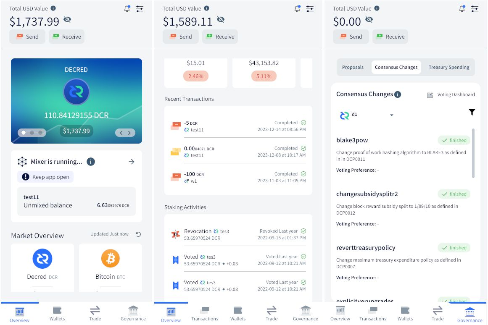
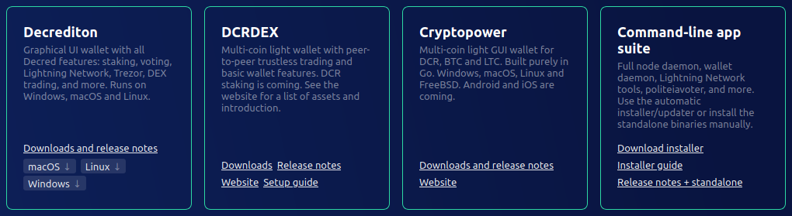
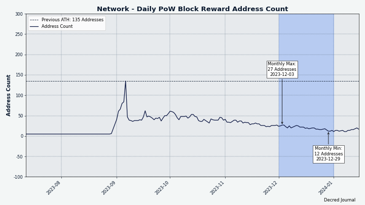

مجلة ديكريد لشهر ديسمبر 2024

ـ الصورة: غلاف ديسمبر بواسطة Exitus@_

*أعزائي القراء، آسف لأخذ وقت طويل لإكمال عدد شهر ديسمبر هذا. في الأشهر الأخيرة، كان إيجاد الوقت للعمل على المجلة تحديًا كبيرًا. نحن نناقش إصلاحًا شاملاً لمجلة ديكريد لتحسين جهودنا. آمل أن يظل هذا العدد يحتوي على معلومات فريدة ومفيدة لك. قراءة سعيدة!  -- bee@*

أبرز أحداث شهر ديسمبر:

- تمت الموافقة على مقترحين لمواصلة برنامج مكافأة إيجاد العلة Bug Bounty وإنشاء محتوى الفيديو في عام 2024.
- تم إطلاق مجمعين جديدين للتعدين، لكن البيانات تشير إلى أن التعدين أصبح أكثر مركزية مرة أخرى.
- يتم تحسين تطبيقات المحفظة ومُرحِّل البيسون لإصداراتها القادمة، مع إستمرار إدماج Cake.

المحتويات:

- [التطوير](#development)
- [الأشخاص](#people)
- [الحوكمة والمالية](#governance-and-finances)
- [الشبكة](#network)
- [النظام البيئي](#ecosystem)
- [الإنتشار](#outreach)
- [وسائل الإعلام](#media)
- [الأسواق](#markets)
- [الخارجية ذات الصلة](#relevant-external)

<a id="development" />

## التطوير

ما لم يُذكر خلاف ذلك، فإن العمل المَذْكُور هنا يشتمل على حالة "الدمج إلى الرئيسي". وهذا يعني أن العمل قد تم استكماله ومراجعته ودمجه في كود المصدر الذي يمكن للمستخدمين المتقدمين [بناءه وتشغيله](https://medium.com/@artikozel/the-decred-node-back-to-the-source-part-one-27d4576e7e1c)، ولكنه ليس متاحًا بعد في ثنائيات الإصدار للمستخدمين العاديين.

### dcrd

_[dcrd](https://github.com/decred/dcrd) هو تطبيق عقدة كامل يعمل على تشغيل شبكة ديكريد من نظير إلى نظير حول العالم._

تغييرات تخص المطورين والتحديثات الداخلية:

- تم تحديث [صورة Docker](https://github.com/decred/dcrd/pull/3214) لتكون مبنية بواسطة Go 1.21.5.
- تم وضع علامة على رسائل `cfilter` الإصدار 1 على أنها [مهملة](https://github.com/decred/dcrd/pull/3205) في حزمة `wire`. هذا مجرد تنظيف عام، نظرًا لأن رسائل `cfilter` الإصدار 1 غير صالحة بالفعل. كان الإصدار 2 لرسائل `cfilter` [المعيار](https://github.com/decred/dcrd/pull/1906) منذ تفعيل مقترح تغيير ديكريد [DCP-5](https://github.com/decred/dcps/blob/master/dcp-0005/dcp-0005.mediawiki) في يناير 2020.

قيد التطوير:

تقديم [رسائل الخلط من نظير إلى نظير](https://github.com/decred/dcrd/pull/3066) إلى بروتوكول “wire"

### dcrwallet

_[dcrwallet](https://github.com/decred/dcrwallet) هو خادم محفظة تستخدمه تطبيقات سطر الأوامر والمحفظة الرسومية._

التغييرات الموجهة للمستخدم:

- طلب [إشعارات الكتل](https://github.com/decred/dcrwallet/pull/2310) فقط بعد أن يتم مزامنة المحفظة بالكامل. هذا يحل مشكلة التزامن حيث قد تحاول المحفظة النظر في الكتل قبل أن يتم مزامنة نسخة dcrd الأساسية بالكامل. قد يحدث هذا عند بدء تشغيل dcrwallet بسرعة كبيرة بعد dcrd (على سبيل المثال، من داخل Decrediton). النتيجة ستكون فقدان إشعارات المعاملات وأن يكون رصيد المحفظة خاطئًا، مما يتطلب إعادة المسح لإصلاحه.
- عندما تتم مزامنة المحفظة في وضع التحقق من الدفع البسيط SPV، [قم بمعالجة دفعات الصديرات بشكل متوازي](https://github.com/decred/dcrwallet/pull/2311). ينتج عن هذا مزامنة أسرع بنسبة 32% في المتوسط عند الاختبار في العالم الحقيقي.
- عندما تكون المحفظة في وضع التحقق من الدفع البسيط SPV وقد انتهت المزامنة الأولية بالفعل، [اطلب الصديرات من كل نظير متصل حديثًا](https://github.com/decred/dcrwallet/pull/2316). هذا يسرع من إعادة المزامنة بعد المزامنة الأولية عندما يكون العميل المحلي غير متصل بالإنترنت لبعض الوقت (على سبيل المثال، بسبب اتصال شبكة متقطع) عن طريق ضمان طلب أي وجميع الصديرات الجديدة فورًا، بدلاً من الانتظار حتى يتم الإعلان عن كتلة جديدة لبدء عملية اللحاق.
- تم إصلاح عطل حيث كانت المحفظة التي تم استعادتها [تفوت اكتشاف المعاملات](https://github.com/decred/dcrwallet/pull/2319) إذا كانت تلك المعاملات في كتلة الطرف بعد الاستعادة من البذرة. كان هذا الخطأ نادرًا جدًا، لأن وجود المزيد من الكتل في السلسلة بعد الاستعادة (الحالة الشائعة) كان سيمنع حدوث المشكلة. من المحتمل أن يكون الخطأ قد أثر على اختبارات التطوير الآلية فقط، على الرغم من أن عمليات إعادة المسح كانت ستصلح أيضًا المشكلة لأي مستخدمين ربما واجهوها.
تغييرات للمطورين والتغييرات الداخلية:

- تعديل إجراء [التنقية للتنظيف الجزئي للفروع الجانبية](https://github.com/decred/dcrwallet/pull/2309) بدلاً من التنظيف الكلي. هذا لا يتضمن تغييرًا وظيفيًا بعد، ولكن في المستقبل سيسمح بعملاء التحقق البسيط من الدفع SPV بمعالجة السلاسل بشكل غير متزامن.
- استخدم [الأنواع الذرية](https://github.com/decred/dcrwallet/pull/2312) Go 1.19 حيثما أمكن ذلك. تمنع هذه الأنواع سوء الاستخدام من خلال السماح بالوصول فقط من خلال الطرق المتوفرة وتضمن الاستخدام السليم حتى إذا تم إعادة تنظيم المتغيرات في تخطيط البنية.
- إذا قدم النظير للمحفظة كتلة جديدة، وجب التأكد من أن لديها [أحد الأسلاف المعروفين إما في السلسلة الرئيسية أو السلسلة الجانبية](https://github.com/decred/dcrwallet/pull/2315). إذا لم يكن هناك أي أحد معروف، فهذا يعني أن المحفظة فاتتها بعض الكتل ويجب إعادة مزامنة الرؤوس. في السابق، كانت المحفظة تبحث فقط عن أسلاف في السلسلة الرئيسية، بدلاً من جميع السلاسل الجانبية أيضًا. هذا تسبب في تشغيل `getHeaders` بشكل غير ضروري كثيرًا، خاصة بالنسبة للمطورين الذين يحاكون إعادات تنظيم كبيرة بالسلاسل الجانبية.
- إصلاح مسجل gRPC، الذي [لم يقم بإزالة البادئات](https://github.com/decred/dcrwallet/pull/2313) بشكل صحيح عند تسجيل حجج الرسالة. [تم اكتشاف](https://github.com/decred/dcrwallet/issues/2169) هذا الخطأ من قبل أحد المارة الودودين كان يكتب محللًا مخصصًا بلغة golang للتحقق من الأخطاء.

قيد التطوير:

- إضافة [اختبارات الإدماج](https://github.com/decred/dcrwallet/pull/2318) للتأكد من سلوك صحيح لاستعادة المحفظة تحت سيناريوهات مختلفة كانت معروفة بأنها تسبب في فقدان المعاملات. تستخدم هذه الاختبارات الإطار القادم للأتمتة والاختبارات لتشغيل برنامج dcrwallet بواسطة واجهاته JSON-RPC و gRPC.
- إضافة [مجموعة من المرشحات المدمجة](https://github.com/decred/dcrwallet/pull/2314)[لتسريع المزامنة في وضع التحقق البسيط من الدفع SPV](https://github.com/decred/dcrwallet/issues/2289). يعتمد هذا التغيير على [تغيير ذي صلة في dcrd](https://github.com/decred/dcrd/pull/3211) مما يمكّن العُقَد الكاملة من خدمة البيانات المدفوعة لعملاء SPV الخفيفة.

### vspd

_[vspd](https://github.com/decred/vspd) هو برنامج خادم يستخدمه مزودو خدمات التصويت. يقوم مزود خدمات التصويت VSP بالتصويت نيابة عن مستخدميه على مدار الساعة طوال أيام الأسبوع ولا يمكنه سرقة الأموال._

- [تمت إضافة وثائق](https://github.com/decred/vspd/pull/458) توضح كيف يمكن لمشرف مزود خدمة التصويت VSP جديد إدراج مزود خدمة التصويت VSP الخاص به في Decrediton وعلى [decred.org/vsp](https://decred.org/vsp). هذه الوثائق ليست موجهة للمستخدم العام، ولذلك تمت إزالتها أيضًا من [docs.decred.org](https://docs.decred.org).

### dcrpool

_[dcrpool](https://github.com/decred/dcrpool) هو برنامج خادم لتشغيل مجمع تعدين ديكريد._

- عرض [عناوين IP والمنفذ](https://github.com/decred/dcrpool/pull/428) الخاص بعملاء التعدين المتصلين على صفحة حساب المجمع. هذا يجعل الأمر أسهل قليلاً لتمييز العملاء عن بعضهم البعض.
- السماح لـ dcrpool بـ [معالجة الأخطاء بأمان](https://github.com/decred/dcrpool/pull/431) إذا لم تتمكن طريقة `GetTxOut` الخاصة ب dcrd من العثور على مخرجات لمعاملة معينة.

### الشبكة البرقية

_[dcrlnd](https://github.com/decred/dcrlnd) هو برنامج عقدة الشبكة البرقية الخاصة بديكريد. تتيح الشبكة البرقية عمليات تحويل فورية بتكلفة منخفضة._

- تمت إضافة الإغلاق التلقائي للقنوات التي [لم يتم إعادة تأسيسها لفترة من الوقت](https://github.com/decred/dcrlnd/pull/196). عادةً ما يحافظ النظراء على قنواتهم بوضعها "قيد الإعادة التأسيس". إذا تم رؤية قناة النظراء على الإنترنت لفترة معينة ولكنها لا ترسل رسالة لإعادة تأسيس القناة، فإن مثل هذه القناة تكون مرشحة جيدة للإغلاق القسري، لأنه من المحتمل أن النظير البعيد فقد القدرة على استخدام القناة (على سبيل المثال، بسبب استعادة العقد بعد فقدان البيانات دون استخدام ملف النسخ الاحتياطي لـ [SCB](https://docs.decred.org/lightning-network/backups/)). بشكل افتراضي، إذا شوهد النظير البعيد للقناة على الإنترنت لمدة 72 ساعة دون إعادة تأسيس القناة، فسيتم إغلاقها تلقائيًا. يجب أن يكون هذا توازنًا معقولًا بين عدم إغلاق القنوات بسرعة كبيرة على المحاور الرئيسية (المتصلة بالإنترنت على مدار الساعة طوال أيام الأسبوع) والعقد سريعة الزوال (التي قد تكون متصلة بالإنترنت لمدة ساعة أو ساعتين فقط في اليوم). تمت إضافة اختبار الاندماج للتأكد من السلوك الصحيح.

### cspp

_[cspp](https://github.com/decred/cspp) هو خادم لتنسيق خلط العملات باستخدام بروتوكول CoinShuffle++. إنه غير إحتجازي، أي أنه لا يحتفظ أبدًا بأي أموال. يعد CSPP جزءًا من StakeShuffle، نظام الخصوصية في ديكريد._

- تم تحديث [صديرات اللغة C](https://github.com/decred/cspp/pull/98) لدعم [الإصدار الثالث الرئيسي](https://flintlib.org/doc/history.html#flint-3-0-0) لمكتبة الرياضيات السريعة `flint` (الصادرة في أكتوبر 2023). يمكن أن توفر الإصدارات الأحدث من `flint` تحسينات في الأداء وغيرها لخادم CSPP.

### DCRDEX

_[DCRDEX](https://github.com/decred/dcrdex) هي منصة مبادلات  غير إحتجازية، تحترم الخصوصية، للتداول الذي لا يعتمد على الثقة، مدعومة بعمليات المقايضات الذرية._

التغييرات المعادة للإصدار التالي v0.6.x:

- تم إصلاح خلل حيث يمكن أن [يتوقف التداول](https://github.com/decred/dcrdex/pull/2622) بعد فصل الخادم. لالقائمة الكاملة للأسواق المتأثرة غير معروفة، ولكن من المعروف أن الخلل أثر على سوق LTC/DCR ولم يؤثر على سوق DCR/BTC.

بوتات صانع السوق:

- تم تنفيذ [وظائف إدارة منصة المبادلات المركزية CEX منخفضة المستوى](https://github.com/decred/dcrdex/pull/2568): الإيداع، السحب، وتتبع الرصيد. تمت إضافة إعادة الرصيد التلقائية إلى استراتيجية المراجحة البسيطة حيث يقوم البوت ببدء عمليات الإيداع والسحب من/إلى منصة المبادلات المركزية CEX للحفاظ على الأرصدة المكوّنة. Binance هي أول منصة مبادلات مركزية CEX مدعومة بواسطة هذه الوظيفة.
- تم تعديل كود Binance لتتبع [1,000 إدخال في دفتر الطلبات](https://github.com/decred/dcrdex/pull/2627) بدلاً من 20.

تغييرات عامة للعميل:

- تمت إضافة عرض [السندات غير المستردة منتهية الصلاحية](https://github.com/decred/dcrdex/pull/2626) في عرض إعدادات منصة المبادلات اللامركزية DEX. عند انتهاء صلاحية السند، يمكن استرداد الأموال عند انتهاء صلاحية السند لاسترداد الأموال.
- تم إصلاح [ظروف التشغيل السباقية النادرة](https://github.com/decred/dcrdex/pull/2630) عند التعامل مع [طلبات الصورة المسبقة](https://github.com/decred/dcrdex/blob/2f6cae0917fca97ec0fa979f367cff69655def33/spec/orders.mediawiki#order-commitment).
- إصلاحات واجهة المستخدم البسيطة.

مسائل أخرى:

- تم تحديث [تذييل dex.decred.org](https://github.com/decred/dexweb/pull/39) لعرض المزيد من الأصول المدعومة.

أبرز التغييرات قيد التنفيذ:

- التبديل إلى [USDC الأصلية على Polygon](https://github.com/decred/dcrdex/pull/2629).
- إنشاء بيئة بناء لإنشاء تطبيق سطح مكتبي مستقل لنظام [Windows](https://github.com/decred/dcrdex/pull/2635) وبرنامج تثبيت له.
- سأل buck54321@ على تويتر [عن العملات والميزات](https://twitter.com/blockchainbuck/status/1732515860156199038) التي يرغب المجتمع في رؤيتها مطورة في المستقبل، و [أي أزواج USDC](https://twitter.com/blockchainbuck/status/1734048766850683051) هي الأكثر طلبًا.

### Cryptopower

_[Cryptopower](https://github.com/crypto-power/cryptopower) هي محفظة واجهة مستخدم رسومية لسطح المكتب متعددة العملات لـ DCR وBTC وLTC. تعمل في وضع التحقق البسيط من الدفع SPV الخفيف الذي يحافظ على الخصوصية دون الحاجة إلى سلاسل كتل كاملة، وتدعم تحصيص ديكريد، الخلط، التصويت، وميزات فريدة أخرى._

العناصر الجديدة المُنفّذة في واجهة المستخدم:

- صفحة [لإدارة حسابات المحافظ](https://github.com/crypto-power/cryptopower/pull/260).
- [صفحات الإعداد](https://github.com/crypto-power/cryptopower/pull/219) التي تساعد المستخدم في التهيئة الأولية بعد تشغيل التطبيق للمرة الأولى.
- تمرير متحرك [لبطاقات الأصول](https://github.com/crypto-power/cryptopower/pull/256) على صفحة النظرة العامة.
- تحديث تصميم واجهة المستخدم [لصفحات الحوكمة](https://github.com/crypto-power/cryptopower/pull/221) (الاقتراحات  والإجماع والخزينة).
- إضافة ["فلتر جميع المحافظ"](https://github.com/crypto-power/cryptopower/pull/313) على صفحة المعاملات.
- إضافة خيارات متقدمة إلى [صفحة الإرسال](https://github.com/crypto-power/cryptopower/pull/310)، بما في ذلك القدرة على الإرسال إلى عدة مستلمين في معاملة واحدة.

التداول:

- تنفيذ تحويل العملات (التبادل) عبر [Trocador](https://github.com/crypto-power/cryptopower/pull/257).
- إضافة [صفحات التوجيه](https://github.com/crypto-power/cryptopower/pull/224) التي تُظهر عند زيارة ميزات منصة المبادلات اللامركزية لديكريد DCRDEX وميزات منصة المبادلات المركزية CEX للمرة الأولى.
- فتح [تفاصيل التداول](https://github.com/crypto-power/cryptopower/pull/300) عند النقر على تداول حديث في النظرة العامة.
- إضافة صفحة [تاريخ التداول](https://github.com/crypto-power/cryptopower/pull/333).

التداول على منصة المبادلات اللامركزية DEX:

- تنفيذ [تخطيط واجهة المستخدم](https://github.com/crypto-power/cryptopower/pull/208) لصفحة منصة المبادلات اللامركزية لديكريد DCRDEX الرئيسية، والمنطق الأساسي لمنصة المبادلات اللامركزية DEX، والقدرة على [نشر السندات](https://github.com/crypto-power/cryptopower/pull/269) من محفظة DCR.

الخصوصية:

- تحديث [صفحات الخصوصية](https://github.com/crypto-power/cryptopower/pull/248). افتراضيًا، سيكون الخلط معطلاً، ولن يتم إنشاء حسابات تتعلق بالخلط، وسيُسمح بالإرسال من الحساب "الافتراضي".

تنفيذ واجهة المستخدم للهواتف النقالة، تم تحديث/إصلاح الصفحات التالية لشاشات الهواتف النقالة:

- [عنوان مشترك](https://github.com/crypto-power/cryptopower/pull/311) مع اسم المحفظة والرصيد المعروض على جميع صفحات المحفظة الفرعية.
- تحديث [بطاقة الخلط](https://github.com/crypto-power/cryptopower/pull/316) و [المعاملات الأخيرة](https://github.com/crypto-power/cryptopower/pull/339) على صفحة النظرة العامة.
- تصميمات [الحوكمة](https://github.com/crypto-power/cryptopower/pull/317).
- صفحات [StakeShuffle](https://github.com/crypto-power/cryptopower/pull/330).
- تصميمات [التداول في منصة المبادلات المركزية CEX](https://github.com/crypto-power/cryptopower/pull/323) (التبادل الفوري).
- صفحات [الإعدادات العامة وإعدادات المحفظة](https://github.com/crypto-power/cryptopower/pull/324).
- صفحات [المعاملات](https://github.com/crypto-power/cryptopower/pull/327) (في التطبيق بأكمله، وعلى مستوى المحفظة، وتفاصيل المعاملة).
- صفحة [التحصيص](https://github.com/crypto-power/cryptopower/pull/335).
- صفحة [الحسابات](https://github.com/crypto-power/cryptopower/pull/336) في المحفظة.
- صفحة [المعلومات](https://github.com/crypto-power/cryptopower/pull/332) (نظرة عامة) للمحفظة.
- صفحات [التوجيه التطبيقي](https://github.com/crypto-power/cryptopower/pull/342).
- صفحات [إنشاء/استعادة المحفظة](https://github.com/crypto-power/cryptopower/pull/352)، وصفحات [النسخ الاحتياطي للمحفظة](https://github.com/crypto-power/cryptopower/pull/350).
- صفحات [الإرسال](https://github.com/crypto-power/cryptopower/pull/347) و [الاستلام](https://github.com/crypto-power/cryptopower/pull/346) وصفحات الوصول السريع.

الإصلاحات:

- تم إصلاح خطأ عند زيارة [صفحة الخزينة](https://github.com/crypto-power/cryptopower/pull/235) بدون إنشاء محفظة DCR.
- تم إصلاح [عناصر واجهة المستخدم على الهواتف النقالة](https://github.com/crypto-power/cryptopower/pull/298) التي تظهر في وضع سطح المكتب.
- تم إصلاح العطل عند زيارة [صفحات التحصيص](https://github.com/crypto-power/cryptopower/pull/328) بعد استعادة محفظة ديكريد.
- تم إصلاح أخطاء [حد السرعة في الطلبات](https://github.com/crypto-power/cryptopower/pull/323) عند استعلام طلبات التبادل الفوري.
- إصلاحات أخرى طفيفة في واجهة المستخدم.

التغييرات داخلية وتغييرات المطورين:

- إعادة تنظيم لإزالة [واجهة غير ضرورية](https://github.com/crypto-power/cryptopower/pull/235).
- توثيق التعليمات [ل بناء لنظامي Android و iOS](https://github.com/crypto-power/cryptopower/pull/299).

في أخبار أخرى:

- تم تقديم إصدارات اختبارية لتطبيقات Android و iOS إلى متجر Google Play و Apple TestFlight.

_الصورة: ستدعم Cryptopower التداول عبر [Trocador.app](https://trocador.app/)، والذي يحترم الخصوصية_

_الصورة: تضيف  Cryptopower واجهة مستخدم خفيفة الوزن للتداول على منصة المبادلات اللامركزية لديكريد DCRDEX_

_الصورة: تستعد Cryptopower لشاشات الهواتف النقالة_

### دمج محفظة Cake Wallet

قيد التنفيذ:

- دمج [libwallet](https://github.com/JoeGruffins/cake_wallet/pull/8) في عملية بناء محفظة Cake Wallet.
- تم إنشاء فرع الكود [مع إزالة](https://github.com/JoeGruffins/cake_wallet/tree/onlydecred) معظم العملات الأخرى لتسريع عملية التطوير.
- مناقشة كيفية استدعاء كود Go من كود Cake Dart. الخطة حتى الآن هي ربط الطبقات باستخدام [سلاسل JSON](https://github.com/itswisdomagain/libwallet/pull/6) بسيطة.
- مناقشة حول الواجهات التطبيقية التي يجب أن توفرها libwallet لـ Cake و Cryptopower.
- تم دمج أول تغيير يضيف [شاشات ديكريد الأولية](https://github.com/cake-tech/cake_wallet/pull/1165) في الفرع الرئيسي للدمج. هذا الفرع هو موقع وسيط لاختبار وتنقيح كود ديكريد قبل إضافته إلى الفرع الرئيسي `main` لمحفظة Cake Wallet.

### decred.org

_[dcrweb](https://github.com/decred/dcrweb) هو الكود المصدري لموقع [decred.org](https://decred.org/)._

- تحسين الروابط والنصوص على [صفحة المحافظ](https://github.com/decred/dcrweb/pull/1152) لمساعدة المستخدمين في اختيار إحدى الخيارات الأربع للمحافظ.
- تحديث [الترجمة البرتغالية](https://github.com/decred/dcrweb/pull/1160).

_الصورة: أربع خيارات للمحافظ تعكس الكثير من التطوير الجاري ولكن المستخدمين بحاجة إلى توجيه للعثور على ما يناسبهم بشكل أفضل_

### مُرحِّل البيسون

_[مُرحِّل البيسون](https://github.com/companyzero/bisonrelay) هو منصة جديدة لوسائل التواصل الاجتماعي تتميز بحمايات قوية ضد الرقابة والمراقبة والإعلانات، مدعومة بالشبكة البرقية لديكريد._

تم دمج العمل المذكور أدناه إلى الفرع الرئيسي `master` استعدادًا للإصدار التالي.

التغييرات في كل من تطبيقات واجهة المستخدم الرسومية والنصية:

- تم إضافة أمر [لتغيير مالك مجموعة الدردشة الجماعية](https://github.com/companyzero/bisonrelay/pull/391).

التغييرات في تطبيق واجهة المستخدم الرسومية:

- تم إضافة زر[لإعادة تعيين كافة مفاتيح منصات المبادلات](https://github.com/companyzero/bisonrelay/pull/388) (KX).
- تم إضافة زر[للاشتراك في المنشورات](https://github.com/companyzero/bisonrelay/pull/382) مباشرةً من موجز الأخبار (يوفر بعض النقرات).
- تم إضافة أمر [إعادة تعيين تبادل مفاتيح منصات المبادلات](https://github.com/companyzero/bisonrelay/pull/390) إلى قائمة المستخدم.
- تم إصلاح غياب عنصر قائمة [إلغاء الاشتراك من المنشورات](https://github.com/companyzero/bisonrelay/pull/382).

التطبيق النصي (brclient):

- تم تجميع الأوامر الفرعية المختلفة[لمعالجة الدعوات](https://github.com/companyzero/bisonrelay/pull/386) تحت الأمر الأساسي `/invite`.
- تم إصلاح [تصفية الرسائل](https://github.com/companyzero/bisonrelay/pull/393) من جانب العميل لإخفاء رسائل العميل نفسه.

التغييرات الداخلية وتغييرات المطورين:

- تم التحديث إلى أحدث نسخة من [dcrlnd](https://github.com/companyzero/bisonrelay/pull/392) وتحسين تتبع استعداد dcrlnd أثناء بدء التشغيل.

### مسائل أخرى

- تم تحديث [موقع برنامج مكافآت إيجاد الأخطاء](https://bounty.decred.org/) ليعرض فقط أفضل 5 مشاركين ويشير إلى صفحة منفصلة تحتوي على القائمة الكاملة.
- تم إصلاح [نسخة منصة المبادلات اللامركزية لديكريد DCRDEX](https://github.com/decred/umbrel-app-store/pull/10) وتثبيت الهاش في [متجر تطبيقات Umbrel](https://github.com/decred/umbrel-app-store) الخاص بديكريد.

## الأشخاص

إحصائيات المجتمع حتى 14 يناير\* (مقارنة بـ 3 ديسمبر):

- المتابعون على [التويتر](https://twitter.com/decredproject): 54,595 (+656)
- المشتركون في [الريديت](https://www.reddit.com/r/decred/): 12,768 (-5)
- أعضاء #general في [الماتريكس](https://chat.decred.org/): 842 (+9)
- الأعضاء في [الديسكورد](https://discord.gg/GJ2GXfz): 1,924 (+62), تم التحقق للنشر: 772 (+3)
- الأعضاء في [التليجرام](https://t.me/Decred): 2,327 (+8)
- المشتركون في [اليوتيوب](https://www.youtube.com/decredchannel): 4,670 (+10), مشاهدات: 247.1K (+2.4K) \*\*

\* بسبب التقاط الصورة اللحظية متأخرًا في 14 يناير (9 يناير ليوتيوب) فإن الفروقات تمثل ~1.5 شهر بدلاً من الفترة المعتادة لشهر واحد.

\*\* قناة [يوتيوب](https://www.youtube.com/channel/UCJ2bYDaPYHpSmJPh_M5dNSg) الخاصة بديكريد لديها الآن أكثر من 300 فيديو!

## الحوكمة والمالية

استقبلت [الخزينة](https://dcrdata.decred.org/treasury) الجديدة في ديسمبر 7,467 DCR بقيمة 119 ألف دولار بمعدل السعر المتوسط في ديسمبر والذي بلغ 15.89 دولار. تم إنفاق 8,427 DCR لدفع مستحقات المتعاقدين، بقيمة 134 ألف دولار بنفس المعدل.

تمت الموافقة على [معاملة إنفاق الخزينة](https://dcrdata.decred.org/tx/bbe950023801d9a9a082b15374cb5b30385172431dec0961207b2adb7197e82d) بنسبة 99.5% أصوات بنعم وبنسبة مشاركة 58%، وتم تعدينها في 19 ديسمبر. كانت لديها 29 مخرجات للدفع للمتعاقدين، تتراوح من 7.5 DCR إلى 2,182 DCR. من المحتمل أن معظم هذه الDCR دفعت مقابل العمل في أكتوبر ونوفمبر. وبتقدير متوسط سعر منصة المبادلات للفاتورة للشهرين بـ 13.54 دولار، يمثل المبلغ المفوتر في هذا الإنفاق ما يقارب 114 ألف دولار أمريكي.

اعتبارًا من 1 يناير، بلغ الرصيد المجمع [للخزينة القديمة](https://dcrdata.decred.org/address/Dcur2mcGjmENx4DhNqDctW5wJCVyT3Qeqkx) و[الخزينة الجديدة](https://dcrdata.decred.org/treasury) 870.9K DCR (15.7 مليون دولار أمريكي بـ 17.98 دولار).

_الصورة: التدفقات الداخلة والخارجة في الخزينة بديكريد DCR_

_الصورة: رصيد الخزينة الشهري بالدولار الأمريكي؛ لاحظ أنه يعتمد بشكل كبير على سعر منصة المبادلات_

تم تقديم والموافقة على اقتراحين في ديسمبر:

- طلب إقتراح [برنامج مكافآت إيجاد الأخطاء 2024](https://proposals.decred.org/record/a1fd5dd) بواسطة jholdstock@ ميزانية قدرها 105,000 دولار، مقسمة بين 100,000 دولار لمدفوعات المكافآت و5,000 دولار للتكاليف الإدارية. في الواقع، تم استخدام جزء صغير فقط من الميزانية المطلوبة في الإصدارات السابقة. ذكر الاقتراح أن المصروفات لآخر 18 شهرًا كانت 415 دولارًا مدفوعة كمكافآت و1,750 دولارًا للعمليات. بشكل عام، أنفق البرنامج حوالي 11 ألف دولار منذ إطلاقه في عام 2019. وقد تمت الموافقة على الاقتراح بنسبة 98% بـ "نعم" وبنسبة مشاركة عالية جدًا بلغت 74%.
- طلب إقتراح [محتوى فيديو ديكريد لعام 2024](https://proposals.decred.org/record/49cf2e1) بواسطة phoenixgreen@ ميزانية قدرها 71,000 دولار لإنشاء ونشر محتوى الفيديو لعام 2024. وقد تمت الموافقة على هذا الاقتراح بنسبة 85% نعم و64% من الأصوات.

أبلغ أحد مقدمي الاقتراحات عن مشكلة في شراء [ائتمانات الاقتراح](https://matrix.to/#/!qYpAAClAYrHaUIGkLs:decred.org/$elsLkiZbjOz5Pyx42S6e3HPk_4gnkoVpK8J_-qNhqJM) لكن تم حلها خلال أيام قليلة. استمرت المشكلة التي حدثت في شهر نوفمبر المتعلقة بعدم اكتشاف رسوم التسجيل [في شهر ديسمبر](https://matrix.to/#/!qYpAAClAYrHaUIGkLs:decred.org/$5SiSLy_z6wCTEhGzKif9rgGjKo-kOPMNBROt3i_dRqs)، ومن غير المعروف إذا كانت تؤثر على حساب جديد غير محظوظ واحد فقط أو ربما على حسابات أخرى.

لمزيد من التفاصيل حول اقتراحات الشهر، راجع [العدد 65 لموجز بوليتيا](https://www.cypherpunktimes.com/politeia-digest-september-27-december-12-2023/).

تم إعادة العمل على إجراءات نشر موجز بوليتيا لتحسين الوصول والتفاعل: القناة الرئيسية للإصدار الآن هي [Cypherpunk Times](https://www.cypherpunktimes.com/politeia-digest-september-27-december-12-2023/) (يتم نشر الرابط الرئيسي على التويتر وأماكن أخرى)، كما يتم الآن نشر إصدار Medium في [النشرة الرئيسية لديكريد](https://medium.com/decred/politeia-digest-65-september-27-december-12-2023-984c12c31091) (بدلاً من نشرة [موجز بوليتيا](https://medium.com/politeia-digest) الأقل شهرة)، كما يتم إنتاج [سلاسل تويتر](https://twitter.com/decredproject/status/1737514771954471033) المصاحبة بحيث يمكن استهلاك النقاط البارزة دون مغادرة تويتر.

## الشبكة

يتتبع هذا القسم مقاييس الصحة الرئيسية للبنية التحتية لديكريد.

### التعدين

افتتحت [معدل التجزئة](https://dcrdata.decred.org/charts?chart=hashrate&scale=linear&bin=day&axis=time) في ديسمبر عند ~5.5 TH/s وأغلقت عند ~10.2 TH/s، مع الوصول إلى الحد الأدنى عند 3.8 TH/s و إلى الذروة عند 11.6 TH/s طوال الشهر.

_الصورة: يسعى معدل تجزئة ديكريد لتحقيق توازن جديد بعد التدفق الأولي للمعدنين بواسطة وحدة معالجة الرسوم GPU_

توزيع 1,000 كتلة تم [تعدينها](https://miningpoolstats.stream/decred) فعليًا بحلول 7 يناير: [miningandco.com](https://decred.miningandco.com/) بنسبة 26%، [pooltronic.tech](https://decred.pooltronic.tech/) بنسبة 21%، [gopool.cash](https://dcr.gopool.cash/) بنسبة 2.7%، [losmuchachos.digital](https://losmuchachos.digital/) بنسبة 1.3%، و49% من الكتل لم يتم تحديدها بواسطة [miningpoolstats.stream](https://miningpoolstats.stream/decred).

_الصورة: يشير انخفاض عناوين التعدين الفريدة إلى أنها تصبح أكثر مركزية مرة أخرى_

### التحصيص

تراوح [سعر التذكرة](https://dcrdata.decred.org/charts?chart=ticket-price&axis=time&visibility=true-true&mode=stepped) بين 234-243 DCR.

_الصورة: كان سعر التذكرة مستقراً جداً في ديسمبر_

بلغت [الكمية المقفلة](https://dcrdata.decred.org/charts?chart=ticket-pool-value&scale=linear&bin=day&axis=time) 9.74-9.82 مليون DCR، مما يعني أن 62.0-62.6% من العرض الإجمالي [شارك](https://dcrdata.decred.org/charts?chart=stake-participation&scale=linear&bin=day&axis=time) في إثبات الحصة.

_الصورة: تظل وحدات ديكريد DCR المقفلة في التذاكر قريبة من أعلى مستوى لها على الإطلاق_

### التحصيص بواسطة مزود خدمة التصويت

قام[مزودي خدمة التصويت 14 المدرجين](https://decred.org/vsp/) بإدارة ~5,750 (-100) تذكرة نشطة، والتي كانت تمثل 14.0% من مجموع التذاكر (-0.3%) في 1 يناير.

أكبر المستفيدين في ديسمبر كانوا [vote.dcr-swiss.ch](https://vote.dcr-swiss.ch) (+290 تذكرة أو +105%) و[vsp.stakeminer.com](https://vsp.stakeminer.com/) (+67 تذكرة أو +11%).

_الصورة: توزيع التذاكر التي يديرها مزودي خدمة التصويت_

_الصورة: يستمر [المصوتون بشكل فردي](https://docs.decred.org/advanced/solo-proof-of-stake-voting/) في الهيمنة، فقط 14% من التذاكر تستخدم مزودي خدمة التصويت_

_الصورة: مزودي خدمة التصويت أفضل في عدم فقدان التذاكر مقارنة بالمصوتين بشكل فردي_

### العقد

رصد [مُخطِط ديكريد](https://nodes.jholdstock.uk/user_agents) بين 141 و151 عقدة dcrd طوال الشهر. تمت مشاهدة إصدارات 145 عقدة في 1 يناير:  النسخة 1.8.0 - 65%، النسخة 1.8.1 - 27%، النسخة 1.9.0 لبناءات التطوير - 3%، النسخة 1.7.x - 2%، وأخرى - 3.4%.

_الصورة: يتم تحديث العقد ببطء إلى الإصدار v1.8.1. تشير المنطقة الحمراء قبل يناير 2023 إلى البيانات غير المكتملة التي كانت لدينا في ذلك الوقت._

### StakeShuffle

تراوحت نسبة [العملات المخلوطة](https://dcrdata.decred.org/charts?chart=coin-supply&zoom=jz3q237o-la8vk000&scale=linear&bin=day&axis=time&visibility=true-true-true) بين 62.2-62.3%. وقد تراوح [حجم الخلط](https://dcrdata.decred.org/charts?chart=privacy-participation&bin=day&axis=time) اليومي بين 346 و541 ألف DCR.

_الصورة: يختار 62% من العرض المتداول الحماية للخصوصية وقابلية الاستبدال_

### الشبكة البرقية

رصد مستكشف [الشبكة البرقية](https://ln-map.jholdstock.uk/) لديكريد 220 عقدة (+0)، 415 قناة (-5) بسعة إجمالية قدرها 202 DCR (-4)، حتى 8 يناير. يجدر الذكر أن هذه الإحصائيات تختلف لكل عقدة في الشبكة البرقية.

_الصورة: اسْتَقَرّت سعة الشبكة البرقية لديكريد عند 200 DCR_

## النظام البيئي

### مجمعات التعدين

- تم إطلاق [losmuchachos.digital](https://losmuchachos.digital/)، وهو مُجمّع تعدين DCR مقره في ألمانيا يدعم نموذج الدفع PPLNS مع رسوم تجمع تبلغ 3%.
- تم رصد [dcr.gopool.cash](https://dcr.gopool.cash/). تشير [MiningPoolStats](https://miningpoolstats.stream/decred) إلى أن مُجمّع التعدين الموجود في البرازيل يستخدم نموذج PPLNS برسوم قدرها 1%. DCR هي واحدة من [15 عملة](https://miningpoolstats.stream/gopool.cash_pools) يدعمها المُجمّع.
- هناك الآن (على الأقل) 5 مجمعات تعدين عامة، جميعها تشغل برنامج [dcrpool](https://github.com/decred/dcrpool).

### منصات المبادلات

- تم [إنهاء](https://twitter.com/BittrexGlobal/status/1731736725393699094) كل نشاط للتداول على Bittrex Global وفقًا لخطة الإغلاق التي نُشرت في [20 نوفمبر](https://twitter.com/BittrexGlobal/status/1726652430673121310). إذا كان تفسيرنا لنشاط السلسلة صحيحًا، فكان المبلغ المحتفظ به في Bittrex عندما توقف التداول (4 ديسمبر) [~17.5 ألف وحدة ديكريد](https://dcrdata.decred.org/tx/d44e9f656bc3f376ff5814b9088b6c6de2718569d532b0dae1d7aec0e0e8f51b)، ويبدو أن عمليات السحب كانت تعمل بسلاسة.
- تم [إضافة](https://github.com/decred/dcrweb/pull/1158) [MEXC](https://www.mexc.com/) إلى قائمة [منصات مبادلات decred.org](https://decred.org/exchanges/) بعد تأكيد عمل سحوبات DCR. تعمل منصة المبادلات عبر VPN وتسمح ببعض عمليات التداول بدون KYC. أضافت MEXC سوق DCR/USDT الفوري في [يونيو 2019](https://twitter.com/MEXC_Official/status/1143851087167758337) وزوج DCR/USDT برافعة مالية 5x في [ديسمبر 2020](https://twitter.com/MEXC_Official/status/1334707659900035075)، لكن كان هناك قليل من التعليقات من المجتمع لتأكيد عملها.
- جذبت MEXC بعض الجدل بعد أن أبلغ عدة مستخدمين عن [مصادرة الأموال](https://cointelegraph.com/news/traders-report-frozen-assets-account-blocks-mexc)، تجميد الحسابات، وحظر السحوبات. نفت MEXC جميع الادعاءات في [ردهم](https://twitter.com/MEXC_Official/status/1738767532004434018). كان هناك نمطين شائعين في التقارير وهما التداول بالرافعة المالية المربحة جدًا والسحوبات الكبيرة، وكلاهما تم تمييزه كنشاط "غير طبيعي" بواسطة MEXC. لا يمكننا التحقق من صحة التقارير، لكنها تذكير جيد بأن عليك دائمًا القيام ببحثك الخاص وتوخي الحذر عند التعامل مع الخدمات الوصائية.
- استمر تعليق سحوبات DCR على Poloniex و HTX لمدة شهر و نصف تقريبًا ولم يتم إصلاحها في ديسمبر، و استنادًا إلى المعلومات المنشورة على مواقع [الدعم](https://support.poloniex.com/hc/en-us/) [الخاصة بهم](https://www.htx.com/support/en-us/) وتقرير مستخدم واحد في قناة #trading. تم تعليق جميع عمليات السحب، بما في ذلك DCR، في نوفمبر ردًا على [عمليتي الاختراق](202311.md#ecosystem) في منصتي المبادلات هاتين.
-أعلنت السلطات المالية الهندية عن قرار [حظر عناوين URL لـ 9 منصات مبادلات خارجية](https://www.coindesk.com/policy/2023/12/29/indias-local-crypto-and-web3-advocacy-body-asked-for-action-against-offshore-entities-source/) لعدم امتثالها للوائح مكافحة غسل الأموال المحلية. إذا تم تنفيذ الحجب، سيصبح الوصول إلى أسواق DCR على Binance وKuCoin وغيرها من منصات مبادلات من الهند أكثر صعوبة.

### المحافظ

- وقع مستخدمو محفظة أجهزة [Ledger](https://www.ledger.com/) ضحية لـ[هجوم سلسلة التوريد](https://www.ledger.com/blog/security-incident-report) في 14 ديسمبر. استخدم مهاجم حساب [npmjs.com](https://www.npmjs.com/) المخترق لموظف سابق في Ledger لرفع نسخة ضارة من مكتبة Ledger Connect Kit التي تستخدمها العديد من التطبيقات اللامركزية DApps، مما أدى إلى خداع مستخدمي EVM DApp لتوقيع المعاملات التي تستنزف محافظهم. تم إصلاح الثغرة بسرعة، ولكن استغرق الأمر حوالي ~5 ساعات حتى انتشر الإصلاح. كان الاستغلال محدودًا بتطبيقات الطرف الثالث من التطبيقات اللامركزية DApps التي تستخدم المكتبة، ولم يؤثر على سلامة أجهزة Ledger أو Ledger Live. غردت Ledger [بأن](https://twitter.com/Ledger/status/1737457365526470665) حوالي 600 ألف دولار من الأصول قد تأثرت ووعدت بتعويض الضحايا إذا [طلبوا](https://support.ledger.com/hc/en-us/articles/15580506579101) استرداد الأموال (هذه العملية تتطلب التحقق من الهوية). حسب أفضل معرفتنا، لم تتأثر أي محافظ DCR بالاستغلال.
- تم [إزالة](https://github.com/decred/dcrweb/pull/1161) [Guarda](https://guarda.com/) من قائمة المحافظ المعروفة بالعمل [على موقع decred.org](https://decred.org/wallets/) بعد أن [اشتكى](https://www.reddit.com/r/decred/comments/18s54fm/help_importing_a_private_key/) عدة مستخدمين من أن DCR لم تعمل لمدة 3 أشهر. يشير التوقيت إلى أن محفظة DCR الخاصة بـ Guarda  توقفت عن العمل في حوالي سبتمبر 2023 لأنهم فشلوا في التحديث إلى [الإصدار 1.8.0 لديكريد](https://github.com/decred/decred-binaries/releases/tag/v1.8.0) (تم إصداره في 13 يونيو 2023) وفاتتهم عملية التفرع الصلب (اكتمل [في الأول من سبتمبر](https://dcrdata.decred.org/block/794369)، 2023). أكد شخص من Guarda [أن](https://www.reddit.com/r/decred/comments/18s54fm/help_importing_a_private_key/kf9n3pj/) DCR لا تزال تعتبر أصلًا مدعومًا، لكنهم يعملون على "بعض المشاكل بعد تحديث شبكة ديكريد". حتى يتم إصلاح ذلك، يمكن لمستخدمي Guarda [تصدير المفتاح الخاص](https://www.reddit.com/r/decred/comments/18s54fm/help_importing_a_private_key/kfbw3f6/) واستيراده في محفظة أخرى مثل dcrwallet أو Exodus.

### أخبار أخرى

- [أضافت](https://twitter.com/CoinRabbitLoans/status/1739750163579625829) خدمة إقراض العملات الرقمية [CoinRabbit.io](https://coinrabbit.io/) DCR كأصل من أصول الضمانات.

انضم إلى دردشتنا [#ecosystem](https://chat.decred.org/#/room/#ecosystem:decred.org) للحصول على المزيد من الأخبار حول خدمات ديكريد.

تحذير: ليس لدى مؤلفي مجلة ديكريد فكرة عن مدى موثوقية أي من الخدمات المذكورة أعلاه. يرجى إجراء بحثك الخاص قبل الوثوق بمعلوماتك الشخصية أو أصولك لأي كيان.

## الإنتشار

## التواصل

### Decred Vanguard

أجرى الحرس مسابقتين مختلفتين لهدايا DCR في محاولة لنشر التوعية: [مسابقة ميم](https://twitter.com/exitusdcr/status/1730263344668352982) و[هبة بمناسبة العام الجديد](https://twitter.com/exitusdcr/status/1740456118462345249).

الأنشطة البارزة الأخرى:

- التواصل عبر تويتر/البريد الإلكتروني إلى [Alchemy Pay](https://alchemypay.org/) لدمج ديكريد، وهي خدمة تقوم بشراء العملات الرقمية ببطاقات الدفع النقدي.
- التقديم والتواصل مع [Biconomy](https://biconomy.com/)، منصة مبادلات مقرها كندا ولديها ترخيص في الولايات المتحدة.
- التقديم إلى [Crypto.com](https://crypto.com/) للإدراج.

اختتم [اقتراح 2023](https://proposals.decred.org/record/0a1b782) في 31 ديسمبر. تم تطوير [اقتراح جديد لعام 2024](https://proposals.decred.org/record/d658f9a) يتضمن مستويات المساهمين، أموال للإعلانات على X، زيادة الأموال التقديرية لأشياء مثل الإعطاءات وتجارب أخرى، مع الاحتفاظ بأشياء من الاقتراح الأول مثل أدوات التمويل من المنظمة المستقلة اللامركزية DAO.

### ### Cypherpunk Times

تمر عملية إنشاء المحتوى في [### Cypherpunk Times](https://www.cypherpunktimes.com/) بتغييرات لتصبح أكثر انفتاحًا على المجتمع. يتم الآن استخدام دردشة [#writers](https://matrix.to/#/!NkCFEoJGXyDMwLfgMb:decred.org/) العامة بنشاط لتخطيط ومراجعة المقالات القادمة، أو مناقشة الاتجاه العام وعملية الموقع. يتم توحيد عملية اختيار وإنشاء المحتوى وتوثيقها لتوجيه المؤلفين الحاليين والمستقبليين.

إحصائيات التفاعل لشهر ديسمبر:

- العدد الإجمالي للمقالات على CT: 606
- مشتركو النشرة الإخبارية: 114
- المنشورات الجديدة على CT والنشرات الإخبارية المرسلة: 18
- متابعو وسائل التواصل الاجتماعي عبر جميع المنصات والحسابات: 1,206
- تويتر [decredsociety@](https://twitter.com/decredsociety): المتابعون - 1,007، المنشورات - 48، انطباعات التغريدة - 47.9 ألف، الإعجابات - 992، إعادات التغريد - 136
- تويتر [cypherpunktimes@](https://twitter.com/cypherpunktimes): المتابعون - 199، المنشورات - 47، انطباعات التغريدة - 13.5 ألف، الإعجابات - 230، إعادات التغريد - 53
- المنشورات حسب المشروع لشهر ديسمبر: زدكاش - 1، ديكريد - 9، أخبار العملات الرقمية الأخرى - 4

## وسائل الإعلام

### المقالات

ديكريد:

- [حديث cypherpunk مع مايكل من مجتمع زيكاش!](https://www.cypherpunktimes.com/cypherpunk-talk-with-ernesto-from-the-dash-community-2/) بقلم Joao@
- [ديكريد مقابل بولكادوت: تجاوز التحديات](https://www.cypherpunktimes.com/decred-vs-polkadot-2/) بقلم Joao@

مقالات عامة عن العملات الرقمية المشفرة في cypherpunktimes:

- [الملخص الشهري ل cypherpunktimes (طبعة نوفمبر 2023)](https://www.cypherpunktimes.com/cypherpunk-times-monthly-roundup-october-2023-edition/) بقلم tallamericano@
- [التنقل في غابة إدراجات منصات المبادلات: دليل شامل حول كيفية إدراج عملتك الرقمية المشفرة (2/2)](https://www.cypherpunktimes.com/navigating-the-exchange-listings-jungle-a-comprehensive-guide-on-how-to-get-your-cryptocurrency-listed-2-2/) بقلم tallamericano@
- [نظرة على العملات الرقمية المشفرة: انقسام مجتمع البتكوين وملخص أحداث الأسبوع في عالم العملات الرقمية المشفرة](https://www.cypherpunktimes.com/crypto-in-view-bitcoin-community-split-and-a-recap-of-the-weeks-crypto-events/) بقلم BlockchainJew@
- [السوق الصاعدة؟ ربما، لكن يجب أن تكون مستعدًا!](https://www.cypherpunktimes.com/bull-market-maybe-but-you-have-to-prepare/) بقلم Joao@
- [كشف النقاب عن العملات الرقمية المشفرة: تحليل المبادئ الأساسية، التشوهات، والتأثير (1/2)](https://www.cypherpunktimes.com/cryptocurrency-unveiled-analyzing-core-principles-distortions-and-impact-1-2/) بقلم tallamericano@
- [كشف النقاب عن العملات الرقمية المشفرة: تحليل المبادئ الأساسية، التشوهات، والتأثير (2/2)](https://www.cypherpunktimes.com/cryptocurrency-unveiled-analysing-core-principles-distortions-and-impact-2-2/) بقلم tallamericano@
- [ظهور أكثر من 300 عملة ميم بعد أن لعن إيلون ماسك المعلنين](https://www.cypherpunktimes.com/more-than-300-memecoins-emerge-after-elon-musk-curses-advertisers/) بقلم Joao@
- [كيف يستعد مجتمع الكريبتو لصندوق ETF البتكوين الفوري؟](https://www.cypherpunktimes.com/how-is-the-crypto-community-preparing-for-a-spot-bitcoin-etf/) بقلم BlockchainJew@

### مقاطع الفيديو

- [ديكريد - المال المتطور: تحديثات التطوير والمجتمع](https://www.youtube.com/watch?v=O-rOgtYkh6A) بواسطة Exitus@
- [بناء قوة عمل لامركزية - المضي قدماً](https://www.youtube.com/watch?v=MKWYViZPn-g) بواسطة phoenixgreen@ - متوفر أيضاً كمنشور [نصي](https://www.cypherpunktimes.com/building-a-decentralised-workforce/)
- [التحصيص غير الوصائي - المضي قدماً](https://www.youtube.com/watch?v=1iXN0A_ugdY) - متوفر أيضاً كمنشور [نصي](https://www.cypherpunktimes.com/non-custodial-staking-moving-forward/)
- [DECRED (DCR) - تعدين بواسطة GPU - BLAKE3 - دليل خطوة بخطوة](https://www.youtube.com/watch?v=VnMMRrYBN0o) بواسطة HashOnTube

البث المباشر:

- [2023 سنة الإنتهاكات - حالة السوق](https://www.youtube.com/watch?v=yiU1gkoyct4) بواسطة phoenixgreen@ و Exitus@ بمشاركة h3la1@

### الصوتيات

- [2024 - السنة التي تصبح فيها العملات الرقمية المشفرة سائدة بشكل كامل؟](https://twitter.com/i/spaces/1ypJdkebzbjGW) - فضاء تويتر استضافها Tivra@ حيث تحدث عن صناديق الاستثمار المتداولة في منصة المبادلات (ETFs)، الذكاء الاصطناعي، العمل في مجال العملات الرقمية المشفرة، الإلغاء من القوائم و منصات المبادلات اللامركزية (DEXes)، والمزيد.

### المحتوى غير الإنجليزي

- [المعاملات نظير لنظير على Decredition](https://www.youtube.com/watch?v=RZz-yPziXwQ) - دليل مدته 10 دقائق بواسطة arij@ (بالعربية)
- حصلت مجلة ديكريد لشهر أكتوبر على 3 ترجمات [جديدة](https://xaur.github.io/decred-news/) إلى العربية (arij@)، الصينية (Dominic@) والبولندية (kozel@). شكرًا لكم على الترجمة المستمرة لمجلة ديكريد!

### عشوائيات

- [عرض نقاط بارزة لـ DCR](https://twitter.com/exitusdcr/status/1732126308467949844) بواسطة Exitus@
- [عرض/تحديث لمنصة المبادلات اللامركزية لديكريد DCRDEX](https://twitter.com/blockchainbuck/status/1731832017627517229) بواسطة buck54321@

> ستتطلب المحافظ الوصائية KYC/AML في الولايات المتحدة. محافظ العقدة الكاملة غير ممكنة للمستخدمين العاديين لـ $BTC أو $ETH. الأمور مشكوك فيها أيضًا بالنسبة للآخرين. لقد حققت منصة المبادلات اللامركزية لديكريد توازناً، باستخدام تكنولوجيا التحقق البسيط من الدفع SPV لتقليل مئات الجيجابايت إلى أقل من 4 جيجابايت للبتكوين، مع خصوصية جيدة وأوقات مزامنة.
> 
> بالنسبة لـ $ETH، هناك ثقافة عدم الخصوصية بناءً على مزودي البنية التحتية (infura إلخ). لقد قمنا بتحسين هذا قليلاً من خلال تمكين عدة مزودي بنية تحتية في نفس الوقت. الحصول على معلومات كاملة حول نشاط المحفظة سيتطلب تعاونًا بين المزودين.
> 
> إن محافظنا لـ $DCR و $LTC و $BCH  هي أيضًا SPV، لذا فإن الخصوصية والمزامنة جيدة هناك أيضًا. لدى #Polygon محفظة متعددة المزودين مثل $ETH. جميع المحافظ الأخرى عبارة عن عقدة كاملة، وهو أمر جيد، لأنها ليست بتكوين، على الرغم من أن عقدة $ZEC الكاملة لا تزال تشكل تحديًا.
> 
> يجب أن تكون السيادة المالية خيارًا متاحًا للجميع. تقاتل منصة المبادلات اللامركزية لديكريد للحفاظ على إمكانية ذلك. لا يزال أمامنا عمل يجب القيام به، ولكن هل هناك مشروع آخر يلتزم بمبادئ سلسلة الكتل مثل  منصة المبادلات اللامركزية لديكريد؟
> 
> هل ذكرت أن محفظتنا لديها خيارات خصوصية جديدة؟ لقد أضفنا خلط #Decred، مدمج بالكامل مع التداول بحيث يتم إعادة خلط استردادات الصفقات، مما يضيف إلى المجموعة الضخمة بالفعل من الغموض. تتجه #Zcash أيضًا نحو الحماية الافتراضية، بعناوين موحدة والكل. [@blockchainbuck على [التويتر](https://twitter.com/blockchainbuck/status/1731832017627517229)]

### الفن والمتعة

- قام شخص ما بتسجيل الملخص التقني لديكريد على [Ordinals](https://ordinals.com/inscription/3ea12f3785e8026bd5a4bb30cbc7d7c3ebecebac4658b116225bb3424eb86d41i0) على سلسلة البتكوين
- [سلسلة تغريدات](https://twitter.com/LukeDashjr/status/1736490182688297135) غير متزنة مع LukeDashjr حول رسوم البتكوين العالية وحل الحوكمة في ديكريد (أو عدم وجوده)
- [ديكريد، سلسلة الكتل السائلة](https://www.cypherpunktimes.com/decred-the-fluid-blockchain/) بقلم @OfficialCryptos

## الأسواق

تم تداول DCR بين 14.12-26.50 USDT و 0.0032-0.00063 BTC على Binance في ديسمبر. باستخدام بيانات الإغلاق اليومية الموزونة من Coin Metrics، كانت نطاقات الأسعار USD 14.40-22.66 و BTC 0.00033-0.00052. تم حساب معدل السعر اليومي لمدفوعات المتعاقدين بـ 15.89 دولار.

_الصورة: أحدث بيانات DCR/BTC، من Coin Metrics_

_الصورة: أحدث بيانات DCR/USD، من Coin Metrics_

_الصورة: حجم التداول الشهري في DCRDEX بالدولار الأمريكي_

_الصورة: تقييمات السوق (بالدولار الأمريكي) بناءً على نموذج [القيمة المحققة المحتفظ بها](https://bochinchero.medium.com/decred-on-chain-staked-realised-value-444ab5a146d8) من @bochinchero_

_الصورة: المحاولة الثالثة لمغادرة منطقة التجميع المثالية، بواسطة saender@_

<a id="relevant-external" />

## الخارجية ذات الصلة

تم اختراق مكتبة Connect Kit الخاصة بـ Ledger، والتي يستخدمها تطبيقات DeFi مثل SushiSwap، Balancer، و Zapper بكثافة للسماح للمستخدمين بالتفاعل مع محافظهم، عندما تم اختراق بيانات اعتماد أحد أعضاء الفريق وتم إدخال كود ضار إلى مستودع GitHub. هذا سمح للمخترقين [بسرقة](https://www.coindesk.com/business/2023/12/14/ledger-exploit-drained-484k-upended-defi-former-staffer-linked-to-malicious-code/) 484 ألف دولار من المستخدمين الذين وصلوا إلى محافظهم خلال فترة حرجة مدتها ساعتين قبل أن يتم رفع العلم الأحمر وتوقف العديد من بروتوكولات DeFi التي تستخدم المكتبة عملياتها وسط [ذعر](https://twitter.com/udiWertheimer/status/1735308883160100996) عام حول أمن أي معاملة إيثيريوم تمت في يوم الهجوم.

اعتبارًا من 1 يناير 2024، دخلت لوائح جديدة في [التنفيذ](https://www.paulhastings.com/insights/client-alerts/digital-asset-reporting-is-here) تعامل الأصول الرقمية كالنقد بمعنى أن استلام أكثر من 10,000 دولار "في معاملة واحدة (أو سلسلة من المعاملات المتعلقة)" سيتطلب الإبلاغ عن حدث المعاملة وهوية المرسل إلى IRS على استمارة 8300. كانت هذه بند من قانون الاستثمار في البنية التحتية والوظائف ("قانون البنية التحتية") الذي تم إقراره في عام 2021، ويُنظر إليه على نطاق واسع على أنه يمثل زيادة [مشكلة](https://cointelegraph.com/news/irs-rules-10k-crypto-transactions-2024) في مستوى العمل الإداري المتورط في استلام العملة الرقمية كأعمال تجارية.

بدأت Tether بـ[تجميد](https://www.theblock.co/post/266872/tether-freezes-all-ofac-sanctioned-wallets-in-proactive-security-measure) الأصول المحتفظ بها بواسطة عناوين المحافظ التي فرضت عليها عقوبات من OFAC، وقامت أيضًا بإضافة عنوان عقد Tornado Cash إلى القائمة السوداء. وكانت Tether أيضًا سعيدة بـ"[استقبال](https://www.theblock.co/post/267973/tether-weve-onboarded-fbi-secret-service-to-our-platform)" خدمة الأمن السري الأمريكي وFBI على منصتها، بينما تتفاخر بـ 435 مليون USDT التي جمدتها حتى الآن بناءً على طلب جهات

قامت Binance [بتنظيم](https://www.ft.com/content/47fe6542-d000-4051-86d9-feb0055697da) دورات لنصف يوم في فرنسا تعرّف الناس على مفاهيم سلسلة الكتل والبرمجيات مثل Metamask، وتجعلهم يسجلون في Binance لاستلام "دبلوم NFT" الخاص بهم، وفي بعض المناطق الفقيرة التي استهدفتها، يُجبر الحاضرون على الاشتراك في هذا "التعليم" كجزء من جهد إعادة تدريب برعاية الدولة. هذا واحد من نتائج الموقف النسبي الترحيبي من رئيس الوزراء الفرنسي ماكرون تجاه الشركة التي تعهدت بينانس بالاستثمار بـ 100 مليون يورو في المشهد الناشئ للعملات الرقمية في البلاد في عام 2021، كما هو مفصل في [هذا المقال](https://www.ft.com/content/47fe6542-d000-4051-86d9-feb0055697da).

هذا كل شيء لشهر ديسمبر. شكراً لكم على القراءة!

## عن هذا العدد

هذا هو العدد 66 من مجلة ديكريد. يمكن العثور على فهرس جميع الأعداد، المرايا، والترجمات [هنا](https://xaur.github.io/decred-news/).

يتم نقل معظم المعلومات من الأطراف الثالثة مباشرةً من المصدر بعد التحقق البسيط من الصحة. لا يمكن لمؤلفي مجلة ديكريد التحقق من جميع الادعاءات. يرجى الحذر من الاحتيال وقم ببحثك الخاص.

الشكر (بالترتيب الأبجدي):

- الكتابة، التحرير، النشر: bee و bochinchero و Exitus و jz و kozel و phoenixgreen و richardred و zippycorners
- صورة العنوان: Exitus
- التمويل: أصحاب حصص الديكريد 

النسخة الأصلية لمجلة الديكريد لشهر  ديسمبر 2023 متوفرة على هذا الرابط [هنا](https://xaur.github.io/decred-news/journal/202312).
